
《金融市场基础知识》

# 金融市场体系【5分】

## 金融市场概述

### 金融市场的概念与功能-1

**(1) 金融市场的概念**

金融市场是要素市场的一种。金融市场是创造和交易**金融资产**的市场，是以金融资产为交易对象而形成的供求关系和交易机制的总和。

**(2) 金融市场的功能** :star:

|          功能          | 内容                                                         |
| :--------------------: | ------------------------------------------------------------ |
|        资金融通        | 金融市场的首要功能。金融市场通过金融资产交易实现货币资金在供给者和需求者之间的转移，促进有形资本形成。 |
|        价格发现        | 金融市场当中供求双方的相互作用决定了交易资产的价格，价格反过来又为潜在的市场参与者提供了信号，引导资金在不同的金融资产之间进行配置，达成供需平衡，这也称为价格发现的过程。 |
|       提供流动性       | 即金融资产交易变现或赎回的渠道和机制。                       |
|        风险管理        | 通过保险、对冲交易等方式对实体经济或金融行为中蕴含的风险 进行管理、防范和化解。同时，金融市场具有将有形资产产生的风险在资金供求双方之间重新配置的功能。 |
| 降低搜寻成本和信息成本 | 在一个有效的市场当中，价格反映了所有市场参与者所能搜集到的信息总和。金融市场能够降低搜寻成本和信息成本两种交易成本。信息成本是那些与评估金融资产投资特点有关的成本，评估就是寻找到与期望产生现金流的数量与可能性的金融资产。 |

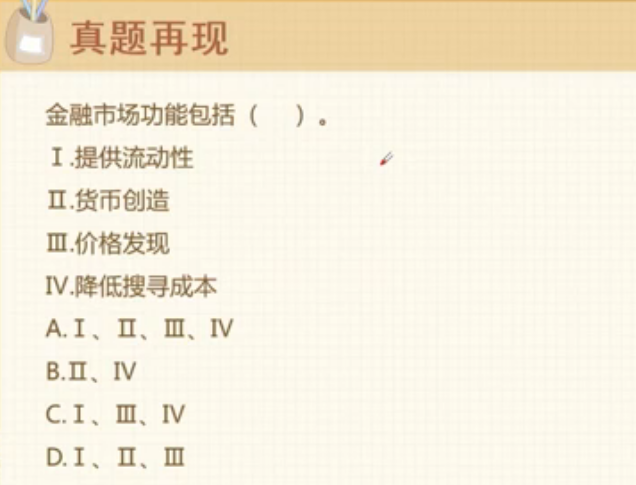

答案：C

### 直接融资与间接融资

#### 直接融资概述-2

**（1）定义**

直接融资是指资金盈余单位通过直接与资金需求单位协议，或在金融市场上购买资金需求单位所发行的股票、债券等有价证券，将货币资金提供给需求单位使用。

**（2）特点**

|                特点                | 说明                                                         |
| :--------------------------------: | ------------------------------------------------------------ |
|               直接性               | 资金盈余单位和资金需求单位直接进行资金融通，并在两者之间建立直接的债权债务关系。 |
|               分散性               | 直接融资是在无数个企业相互之间、政府与企业和个人之间、 个人与个人之间，或企业与个人之间进行的，因此，融资活动分散于各种场合。 |
|      融资的信誉有较大的差异性      | 不同的企业或者个人，其信誉好坏有较大的差异，债权人往往难以全面、深入地了解债务人的信誉状况，从而融资信誉将存在较大的差异和风险。 |
| :star:**部分**融资方式具有不可逆性 | 例如发行股票所得资金不需要返还，股票只能够在不同投资者之间相互转让。 |
|      融资者有相对较强的自主性      | 在法律允许的范围内，融资者可以自己决定融资的对象和数量。     |

**（3）方式**

|     方式     | 说明                                                         |
| :----------: | ------------------------------------------------------------ |
| 股票市场融资 | 股份制企业以让渡一定的企业经营控制权、收益分配权和剩余索取权而获得企业经营资金的一种方式。 |
| 债券市场融资 | 政府、金融机构或企业通过发行债权债务凭证来获得资金融通的一种方式。 |
| 风险投资融资 | 风险投资企业以让渡企业的部分股权换取企业经营资金的资金融通方式。 |
| 商业信用融资 | 企业与企业之间互相提供的，与商品交易直接相联系的资金融通形式。如企业间的商品赊销、预付定金、预付货款等。 |
|   民间借贷   | 公民之间、公民与法人之间、公民与其他组织之间的资金融通活动。 |

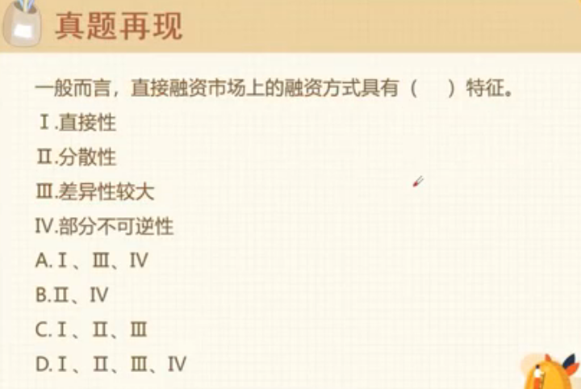

答案：D

#### 间接融资概述-3

**（1）定义**

间接融资是指资金盈余者通过存款等形式，或者购买银行、信托和保险等金融机构发行的有价证券，将其暂时闲置资金先行提供给金融机构，再由这些金融机构以贷款、贴现或购买有价证券的方式把资金提供给短缺者，从而实现资金融通的过程。

**（2）特点**

|                 特点                 | 说明                                                         |
| :----------------------------------: | ------------------------------------------------------------ |
|           资金获得的间接性           | 资金需求者与资金初始供应者之间不发生直接信贷关 系，而是由金融中介机构起桥梁作用，二者只与金融机构发生债权债务关系。 |
|           融资的相对集中性           | 间接融资通过金融机构 (主要是商业银行) 进行，但这种中介，在多数情况下 (除委托贷款外) 并不是对某一资金供应者与某一资金需求者之间一对一的对应性中介，而是一方面面对资金供应者群体，另一方面面对资金需求者群体的综合性中介。 |
|       融资信誉的差异性相对较小       | 间接融资相对集中于银行或非银行金融机构，由于国家对金融机构的管理一般都较为严格，银行自身的经营也多采取稳健方针，相对于直接融资，间接融资的信誉程度高，风险也相对较小，融资的稳定性较强。 |
|     **全部**具有可逆性(可返还性)     | 通过金融中介的融资均属借贷融资，到期必须归还并支付利息。     |
| 融资主动权主要掌握在金融中介机构手中 | 间接融资的资金集中于商业银行等金融机构，资金贷给谁由商业银行等金融中介机构决定。 |

**（3）方式**

|     方式     | 说明                                                         |
| :----------: | ------------------------------------------------------------ |
| 银行信用融资 | 银行以及其他金融机构以货币形式向客户提供的资金融通形式。     |
| 消费信用融资 | 个人利用企业或金融机构提供的资金垫付，以少量资金提前获得高额消费为目的而进行的资金融通。 |
|   租赁融资   | 企业利用设备提供商或金融机构提供的资金垫付，以支付租金的方式取得贵重机器设备的使用权，以减少设备购置资金占用的一种资金融通方式。 |

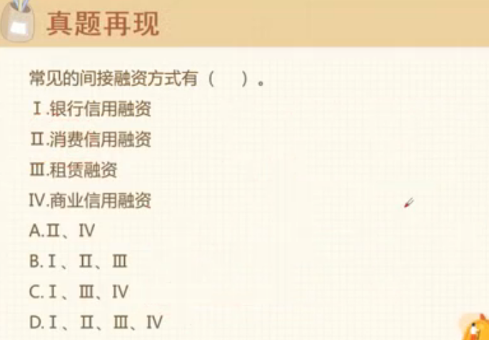

答案：B

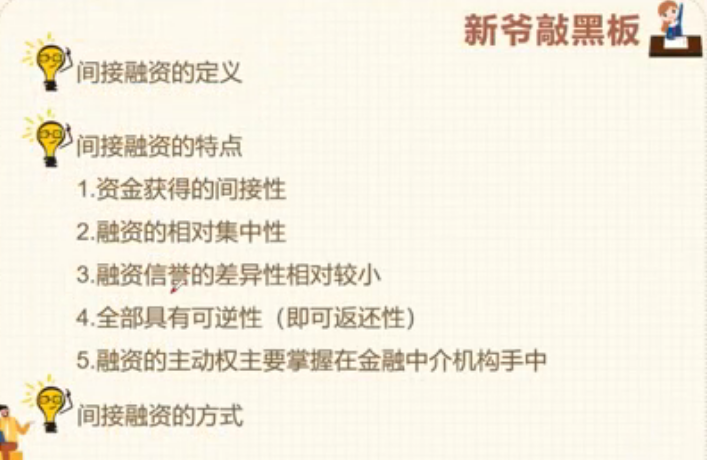

#### 直接融资与间接融资的区别-4

直接融资和间接融资的区别主要在于融资过程中资金的需求者与资金的供给者是否直接形成债权债务关系。在有金融中介机构参与的情况下，判断是否直接融资的标志在于：该中介机构是否与资金的需求者和资金的供给者分别形成了各自独立的债权债务关系。

一般习惯上认为凡是债权债务关系中的一方是金融机构的融资就是间接融资，而不考虑这种融资工具最初的债权人、债务人的性质。一般认为，直接融资活动从时间上**早于**间接融资。

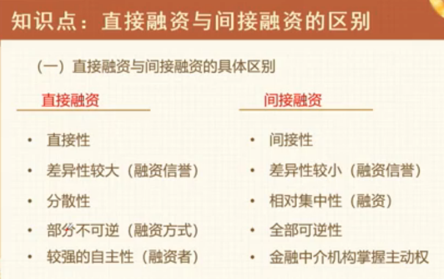

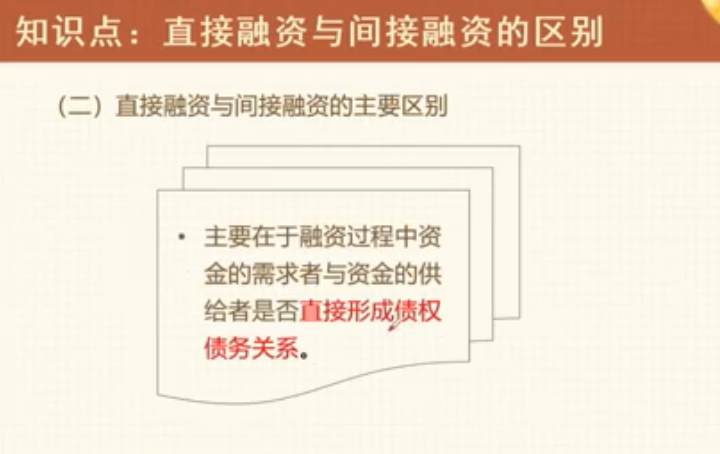

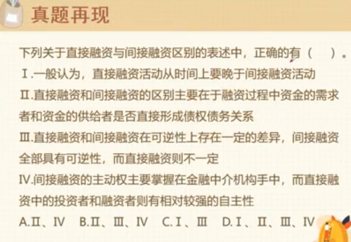

答案：B

### 金融市场的分类-5

1. 按金融资产**到期期限**分为货币市场和资本市场 :star:

|   分类   | 定义                                                         | 举例                                                         |
| :------: | ------------------------------------------------------------ | ------------------------------------------------------------ |
| 货币市场 | 货币市场是指所交易金融资产到期期限在 1 年以内的金融市场      | 银行间同业拆借市场、短期国库、 商业票据市场、债券市场、大额可转让存单市场等 |
| 资本市场 | 资本市场是指所交易金融资产到期期限在 1 年以上或者没有到期期限的金融市场 | 股票市场、中长期国债市场、中 长期银行贷款市场等              |

2. 按**交易工具**分为债权市场和权益市场

按交易工具分类，金融市场可分为交易债务工具的**债权市场**和交易权益工具的**权益市场**(即股票市场) 。交易债务工具和优先股的市场统称为固定收益市场， 不包括优先股的股票市场被称为普通股市场。

3. 按**发行流通性质**分为一级市场和二级市场 :star:

|   分类   | 定义                                                         | 主要功能                                                     |
| :------: | ------------------------------------------------------------ | ------------------------------------------------------------ |
| 一级市场 | 一级市场是新金融资产的**发行市场**，例如股票和债券 的发行市场。 | 一级市场的主要功能是筹资，发行人 通过新证券的公开或定向发行获得资 金，购买方则获得相应的金融资产(股票或债券) |
| 二级市场 | 二级市场是已发行金融资 产的**流通市场**，金融资产的持有者可以在这个市场中将持有的证券出售，以达到 变现的目的。 | 1、为已发行的金融资产提供流动性。提高金融资产的流动性有利于金融资产的价值实现，从而便于发行人在一级市场销售证券。 2、通过二级市场发现资产价格，从而给一级市场销售金融资产提供价格参照。 |

4. 按**组织方式**分为交易所市场和场外交易市场

|     分类     | 定义                                                         |
| :----------: | ------------------------------------------------------------ |
|  交易所市场  | 证券交易所、期货交易所、期权交易所等金融市场是高度组织化的金融市场，被称为交易所市场。 |
| 场外交易市场 | 银行信贷市场、拆借市场、外汇市场、黄金市场等市场传统上 比较松散，通常没有固定的交易场所，也不一定有统一的交易 时间，通常被称为场外市场，很多情况下也被称为柜台市场 (OTC) 。在我国，中国外汇交易中心暨全国银行间同业拆借中心 (CFETS) 及金融机构柜台交易等市场一般就归为场外市场。 |

5. 按**交割方式**分为现货市场和衍生品市场

|    分类    | 定义                                                         |
| :--------: | ------------------------------------------------------------ |
|  现货市场  | 现货市场实际上是指即期交易的市场，是金融市场上最普遍的一 种交易方式。即期交易是指市场上的买卖双方成交后须在当天或市场规定的最后交割期限内办理交割手续的交易行为。 |
| 衍生品市场 | 衍生品市场是指交易衍生工具的市场。常见的衍生工具包括远期、期货、期权、互换等。 |

6. 按**金融资产的种类**分为证券市场和非证券金融市场

|      分类      | 定义                                                         |
| :------------: | ------------------------------------------------------------ |
|    证券市场    | 证券市场是指以股票、债券、证券投资基金等有价证券为对象的发行和交易关系的总和，主要包括股票市场、债券市场、证券投资基金市场、证券衍生品市场等。 |
| 非证券金融市场 | 非证券金融市场是指以有价证券以外的金融资产为对象的发 行和交易关系的总和，包括股权投资市场、信托市场、融资 租赁市场、外汇市场、黄金市场、保险市场、银行理财产品市场、长期贷款市场等。 |

7. 按**辐射地域**分为国际金融市场和国内金融市场

|     分类     | 定义                                                         |
| :----------: | ------------------------------------------------------------ |
| 国际金融市场 | 国际金融市场是指涉及多个司法辖域的居民之间进行各 种国际金融业务活动的市场，一般还可以进一步分为全球性金融市场和区域性金融市场。 |
| 国内金融市场 | 国内金融市场是指单一司法辖域内的金融市场，也可以进一步分为全国性金融市场和地区性金融市场。 |

 

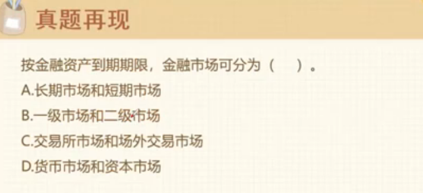

答案：D

### 金融市场的重要性-6

理解即可

> （1）促进储蓄-投资转化；
>
> （2）优化资源配置；
>
> （3）反映经济状态；
>
> （4）宏观调控。

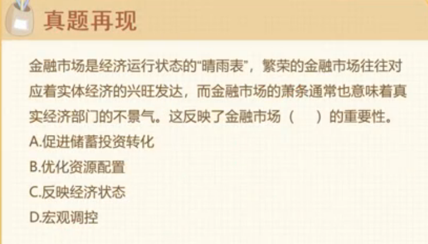

答案：C

## 全球金融市场

### 全球金融体系的主要参与者-7

根据国际货币基金组织颁布的《金融稳健指标编制指南》，全球金融体系的主要参与者包括金融公司、非金融公司、住户、为住户服务的非营利机构、广义政府、公共部门。

**(1) 住户**

住户被定义为由个人组成的小集团，他们分享同一住处，其收入和财富部分 或完全集中在一起，并共同消费某种类型的商品和服务。单独生活的个体也被视为住户。

**(2) 非金融公司**

非金融公司是指按有经济意义的价格提供产品或非金融服务的机构实体。

**(3) 金融公司**

| 金融公司的类别 | 内容                                                         |
| :------------: | ------------------------------------------------------------ |
|  存款吸收机构  | 1、定义：存款吸收机构是指通过自己的账户，以中介的方式将资金从贷 款人转向借款人的单位。 2、分类 (1) **商业银行**，在支付系统中处于核心地位。 (2) 其他存款吸收机构，包括储蓄银行、开发银行、信用合作社、投资银行、抵押贷款银行、建房互助协会以及吸收存款的小额贷款机构。 |
| :star:中央银行 | 国家金融机构，**是控制金融体系的关键**，其业务主要包括发行货币、管理外汇中央银行储备以及向存款吸收机构提供信贷。 |
|  其他金融公司  | 1、定义：主要是那些从事金融中介或者与金融中介关系紧密的辅助性 金融业务，但没有被列入存款吸收机构的公司。 2、类别：其他金融公司包括保险公司、养老基金、证券交易商、投资基金、财务公司、租赁公司以及金融辅助经济机构等。 |

 **(4) 为住户服务的非营利机构**

为住户服务的非营利机构的主要活动是向住户和社会提供免费的或价格不具有经济意义的商品或服务，不包括由政府部门控制和提供资金支持的机构。

**(5) 广义政府**

广义政府是指在一个特定的区域内对其他机构单位行使立法权、司法权和行政权的单位。政府有权利对社会全体或部分成员征税、借债、分配商品或服务， 并且进行收入再分配。政府能够影响金融公司的活动，也受金融公司活动的影响。

**(6) 公共部门**

公共部门包括广义政府、中央银行和作为公共公司的存款吸收部门和其他部门中的实体。公共公司定义为受政府部门控制的非金融或金融公司。

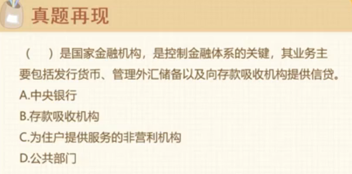

答案：A

### 国际资金流动

国际资金流动是指资本跨越国界从一个国家向另一个国家的运动。

#### 国际长期资金流动-8

国际长期资金流动是指期限在 **1 年**以上的资金的跨国流动，包括国际直接投资、国际间接投资和国际信贷三种形式。

|   具体形式   | 内容                                                         |
| :----------: | ------------------------------------------------------------ |
| 国际直接投资 | 1、概念：国际直接投资是以获得国外企业的实际控制权为目的的国际资本流动。 2、形式： (1) 采取独资企业、合资企业和合作企业等方式在国外建立一个新企业； (2) 收购国外企业的股权达到拥有实际控制权的比例； (3) 利润再投资。 |
| 国际间接投资 | 在国际证券市场上发行和交易中长期有价证券所形成的国际资本流动，又称国际证券投资。 |
|   国际信贷   | 包括政府信贷、国际金融机构贷款、国际银行贷款和出口信贷等。   |

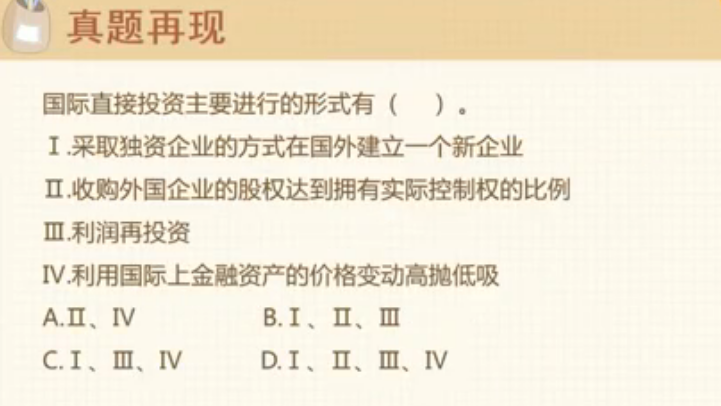

答案：B

#### 国际短期资金流动-9

国际短期资金流动是指期限为 1 年或 1 年以下的资金跨国流动，包括贸易资金的流动、套利性资金的流动、保值性资金的流动以及投机性资金的流动四种类型。

|     具体方式     | 概念                                                         |
| :--------------: | ------------------------------------------------------------ |
|  贸易资金的流动  | 贸易资金的流动是最传统的国际资金流动方式。                   |
| 套利性资金的流动 | 套利性资金的流动是利用各国金融市场上利率差异与汇率差异进行套利活动而引起的短期资本流动。 |
| 保值性资金的流动 | 保值性资金的流动又被称为避险性资金流动或资本外逃，它是指金融资产的持有者为了资金安全而进行资金调拨所形成的短期资金流动。 |
| 投机性资金的流动 | 投机性资金的流动是指投资者利用国际市场上金融资产或商品价格的波动，进行高抛低吸而形成的资金流动。 |

**关键词**：流动

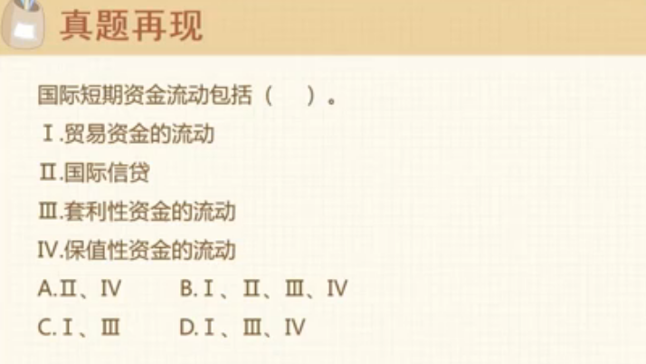

答案：D

# 中国的金融体系与多层次资本市场【8分】

## 中国的金融市场体系

### 中国的金融体系

#### 我国金融市场的发展历史-10

**（1）1949年—1978年**：计划经济时期 “ 大一统 “ 的金融体系。

1. 1948年12月1日，**中国人民银行成立**，并于1948年12月7日首次发行人民币。

2. 1952年12月，全国统一的**公私合营银行成立**，后并入中国人民银行体系。

3. 1984 年1月1日起，中国人民银行开始专门行使中央银行职能。

4. 1953年—1979年，我国实行中国人民银行统揽一切金融活动的“**大一统**”的金融体系。:star:

|      |                                                              |
| :--: | ------------------------------------------------------------ |
| “大” | 中国人民银行分支机构覆盖全国                                 |
| “一” | 中国人民银行是该时期唯一的银行，它集中央银行和商业银行双重职能于一身，集现金中心、结算中心和信贷中心于一体 |
| “统” | 全国实行“统存统贷”的信贷资金管理体制                         |

**（2）1979年—1983年：**多元混合型金融体系。

银行等金融机构迅速发展，金融体系包括的内容不断丰富，但由于中国人民银行仍然身兼二职，既承担中央眼行职能又办理信贷蓄业务，没有正成为专门的金融管理机构，使当时的金融体系出现了“群龙无首”的局面 。

**（3）1984年—1993年：**以中央银行为中心，国家专业银行为主体，多种全融机构分工协作的全融体系。

1. 1984年1月1日起，中国人民银行开始专门行使中央银行职能。

2. 1990年12月 ， **上海证券交易所 、 深圳证券交易所先后开业 ， 标志着股票市场正式运作的开始**。1991年底，上海证券交易所共有**8**只上市股票，**25**家会员；深圳证券交易所共有6只上市股票，15家会员。:star:

3. 1992年10 月，国务院证券管理委员会和**中国证券监督管理委员会**成立。

    

**（4）1994年—2003年：**形成逐步改革和完善的市场化金融体系。

1993 年11月，为全面话社会主义市场经济体制建设的要求，党的十四届三中全会通过了《 中共中央关于建立社会主义市场经济休制若干问以的决定 》金融体制改革的重点：一是要把中国人民银行办成真正的中央银行，主要用经济办法调控货币供应量，保持币值稳定； 二是现有专业银行要逐步转变为商业银行； 三是组建政策性银行，实行政策性业务与商业性业务分开；四是改革外汇管理体制，建立以市场为基础的、有管理的**浮动汇率制度**和统一规范的外汇市场。

改革的具体措施包括 ：

1.  政策性银行相继设立；
2. 对国有专业银行商业化改造；
3. 中国人民银行分支机构进行改革（1998 年 11 月 ， 中国人民眼行撤销了**31**家分支机构 ， 成立了**9**家跨省区分行，明确了总行、分行、中心支行和支行在金融监管方面的权力和责任。）；
4. 成立资产管理公司；
5. 行业与信托业、证券业分离。

**（5）2004 年一2011年：**多种所有制和多种经营形式、结构合理、功能完善、高效安全的现代金融体系。

2003年4月，中国银行业监督管理委员会成立，标志着我国 “**分业经营 、 分业监管**”的金融体系得以确立。 分业监管部分解决了当时的混乱问颗，但随着开放程度的不断加深，这一监管模式受到了全球金融一体化和综合经营的挑战。

**（6）2012年至今：**基本金融制度逐步健全、对外开放程度不断提高的现代全融体系。

基本金融制度逐步健全。股市、债市、衍生品和各类金融市场基础设施等 “ 四梁八柱 “ 已搭建完成 ， 市场容量位列世界前茅 。 二是人民币国际话和金融双向开放促进了金融体系的不断完善。此外，改革开放还促进了金融机构和市场的结构优化。

2012年，党的十八大报告提出，“深化金融体制改革，健全促进宏观经济稳定、支持实体经济发展的现代金融体系” 。2013年，十八届三中全会《中共中央关于全面深化改革若干重大问题的决定》提出“完善金融市场体系”。

答案：D

#### 我国金融市场的发展现状-11

**（1）货币市场**

目前已经形成包括银行间同业拆借市场、短期债券市场、债券回购市场和票据贴现市场在内的统一的货币市场格局。

**（2）债券市场**

我国债券交易市场分为场外市场和场内市场。场外市场包括银行间市场和银行柜台市场，前者的市场参与者限定为机构，属于场外债券批发市场；后者参与者限定为个人，属于场外债券零售市场。

我国债券市场发行债券包括利率债和信用债。**利率债**，是指直接以政府信用为基础或是以政府提供偿债支持为基础而发行的债券。**信用债，是指以企业的商业信用为基础而发行的债券。**:star:

**（3）股票市场**

我国股票市场分为场内市场和场外市场，场内市场包括沪深主板市场、科创板市场、创业板市场和全国中小企业股份转让系统 （ 新三板 ） ，场外市场包括区域性股权交易市场和交易柜台市场。

**（4）外汇市场**

外汇市场发展与汇率市场化改革、资本开放进程、人民币国际化齐头并进，相辅相成。人民币外汇市场当前包括在岸(CNY) 与离岸 (CNH) 市场。目前，银行间外汇市场交易方式分为**竞价和询价**两种，询价交易占主导地位 。

**（5）黄金市场**

2002 年 10 月，**上海**黄金交易所正式运行，实现了中国黄金生产、消费、流通体制的市场化，标志着我国国内黄金市场的正式开放。中国黄金市场目前初步形成了以上海黄金交易所**黄金现货**为主体，上海期货交易所**黄金期货**、商业银行柜台黄金产品共同组成的，层次分明且各有侧重的多元市场体系。

**（6）商品期货市场**

目前，我国成立了上海期货交所、大连商品交易所和郑州商品交剔所（我国第一家商品期货交易所）三大商品期货交易所。

期货市场监管方面，我国形成了中国证监会、地方证监局、期货交易所、期货市场监控中心和中国期货业协会 “五位一体“的期货监管协调工作机制与较为完的期货监管法律体系。

**（7）金融衍生品市场**

中国金融货交易所是我国首家金融衍生品交易所。中国金融期货交易所正式成立，成为我国首家金融衍生品交易所。

答案：A

#### 影响我国金融市场运行的因素-12

`了解即可`

**（1）经济因素：**经济因素是影响我国金融市场运行的主要因素。

1. 宏观经济运行对金融市场的影响。
2. 宏观经济政策：货币政策、财政政策、收入政策。
3. 国际经济环境因素。

（2）法律因素。（3）市场因素。（4）技术因素。（5）心理因素。（6）体制或管理因素。（7） 其他因素。

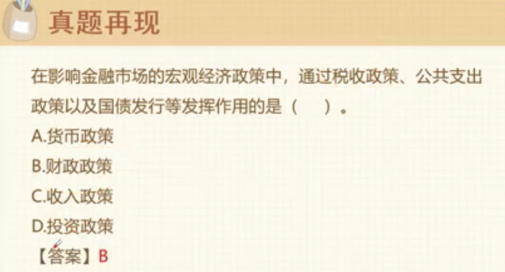

#### 我国金融中介机构体系-13

目前，我国已经形成了**多层次**的金融中介机构体系，拥有以中央银行为主导、 国有商业银行为主体，包括股份制商业银行、城市商业银行、农村商业银行、跨国银行、农村信用社在内的多层次**银行机构**体系；拥有以证券公司、期货公司和证券投资基金为主，以各类投资咨询中介、信托机构为辅的多元化**投资中介**体系； 拥有人寿保险公司、财产保险公司、再保险公司以及提供多种多样保险服务的**保险中介**体系。

答案：C

### 商业银行的业务-14:star:

**(1) 负债业务**

|          |                                                              |
| :------: | ------------------------------------------------------------ |
| 自有资金 | 1、概念：商业银行的自有资金是银行股东为赚取利润而投入银行的货币和保留在银行中的收益，代表着对银行的所有权。 2、构成：自有资金主要包括**股本金**、**储备资本**以及**未分配利润**。自有资金所占比重很小，一般为全部负债业务总额的**10%**左右。 |
| 存款负债 | 存款是银行负债业务中最重要的业务，是商业银行经营资金的主要来源，一般占到负债总额的**70%**以上。 |
| 借款负债 | 借款负债的渠道主要包括向中央银行借款、同业借款、回购协议以及国外市场借款等。 |

**(2) 资产业务**

资产业务是指商业银行**运用资金**的业务，也就是商业银行将其吸收的资金贷放或投资出去赚取收益的活动。商业银行的资产业务主要包括**现金资产、贷款业务、票据贴现、投资业务**等。

**(3) 表外业务**

表外业务是指商业银行从事的，按照现行的会计准则不计入资产负债表内， 不形成现实资产负债，但能够引起当期损益变动的业务。商业银行的表外业务主要分为**担保承诺类、代理投融资服务类、中介服务类、其他类**等。

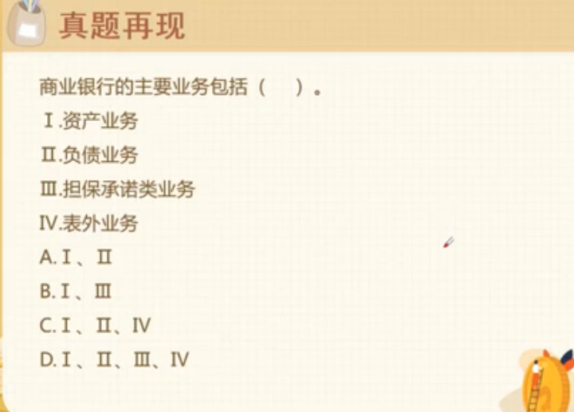

答案：C

### 保险公司的业务-15

**(1) 财产保险业务**

|    业务类别    | 内容                                                         |
| :------------: | ------------------------------------------------------------ |
| **基础类业务** | 1、**机动车**保险，包括机动车交通事故责任强制保险和机动车 商业保险；                      2、企业/家庭**财产**保险及工程保险 (特殊风险保险除外) ；  3、**责任**保险； 4、**船舶**/货运保险； 5、短期健康/意外**伤害**保险。 |
|   扩展类业务   | 1、农业保险； 2、特殊风险保险； 3、信用保证保险； 4、投资型保险。 |

**(2) 人身保险业务**

|  业务类别  | 内容                                                         |
| :--------: | ------------------------------------------------------------ |
| 基础类业务 | 1、普通型保险，包括人寿保险和年金保险； 2、健康保险； 3、意外伤害保险； 4、分红型保险； 5、万能型保险。 |
| 扩展类业务 | 1、投资连结型保险； 2、变额年金。                       |

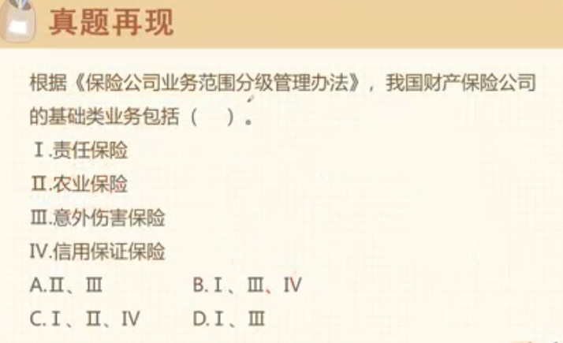

答案：D

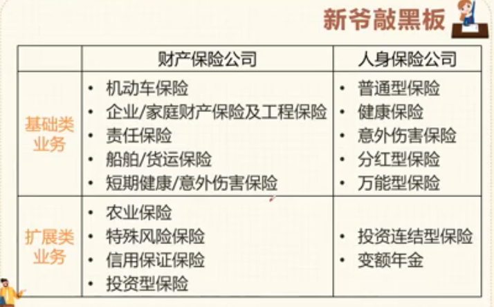

### 我国金融市场的监管体制-16

中国当前的金融监管体制已经从“一行三会”过渡到了“**一委一行两会**”，即国务院金融稳定发展委员会、中国人民银行、中国证券监督管理委员会以及中 国银行保险监督管理委员会。

**(1) 国务院金融稳定发展委员会**

1. 定位

“作为国务院统筹协调金融稳定和改革发展重大问题的议事协调机构”，负 责协调中国人民银行、中国银保监会、中国证监会、国家外汇管理局、发展改革 委、财政部等金融、财政部门，强化人民银行宏观审慎管理和系统性风险防范职 责，落实金融监管部门监管职责，并强化监管问责。

2. 主要职责

> (1) 落实党中央、国务院关于金融工作的决策部署；
>
> (2) 审议金融业改革发展重大规划；
>
> (3) 统筹金融改革发展与监管，协调货币政策与金融监管相关事项，统筹协调金融监管重大事项，协调金融政策与相关财政政策、产业政策等；
>
> (4) 分析研判国际国内金融形势，做好国际金融风险应对，研究系统性金融风险防范处置和维护金融稳定重大政策；
>
> (5) 指导地方金融改革发展与监管，对金融管理部门和地方政府进行业务监督和履职问责等。

**(2) 中国人民银行**

1. 定位

中国人民银行是我国的中央银行，也是国务院组成部门之一，主要负责制定 和执行货币政策，维护金融稳定，同时承担一定的金融服务机构。

2. 主要职责

> (1) 拟订金融业改革、开放和发展规划，承担综合研究并协调解决金融运 行中的重大问题、促进金融业协调健康发展的责任。牵头国家金融安全工作协调 机制，维护国家金融安全。
>
> (2) 牵头建立宏观审慎管理框架，拟订金融业重大法律法规和其他有关法 律法规草案，制定审慎监管基本制度，建立健全金融消费者保护基本制度。
>
> (3) 制定和执行货币政策、信贷政策，完善货币政策调控体系，负责宏观 审慎管理。
>
> (4) 牵头负责系统性金融风险防范和应急处置，负责金融控股公司等金融 集团和系统重要性金融机构基本规则制定、监测分析和并表监管，视情责成有关 监管部门采取相应监管措施，并在必要时经国务院批准对金融机构进行检查监 督，牵头组织制定实施系统重要性金融机构恢复和处置计划。
>
> (5) 承担最后贷款人责任，负责对因化解金融风险而使用中央银行资金机 构的行为进行检查监督。
>
> (6) 监督管理银行间债券市场、货币市场、外汇市场、票据市场、黄金市 场及上述市场有关场外衍生产品；牵头负责跨市场跨业态跨区域金融风险识别、 预警和处置，负责交叉性金融业务的监测评估，会同有关部门制定统一的资产管 理产品和公司信用类债券市场及其衍生产品市场基本规则。
>
> (7) 负责制定和实施人民币汇率政策，推动人民币跨境使用和国际使用， 维护国际收支平衡，实施外汇管理，负责国际国内金融市场跟踪监测和风险预警， 监测和管理跨境资本流动，持有、管理和经营国家外汇储备和黄金储备。
>
> (8) 牵头负责重要金融基础设施建设规划并统筹实施监管，推进金融基础 设施改革与互联互通，统筹互联网金融监管工作。
>
> (9) 统筹金融业综合统计，牵头制定统一的金融业综合统计基础标准和工 作机制，建设国家金融基础数据库，履行金融统计调查相关工作职责。
>
> (10) 组织制定金融业信息化发展规划，负责金融标准化组织管理协调和金 融科技相关工作，指导金融业网络安全和信息化工作。
>
> (11) 发行人民币，管理人民币流通。
>
> (12) 统筹国家支付体系建设并实施监督管理。会同有关部门制定支付结算 业务规则，负责全国支付、清算系统的安全稳定高效运行。
>
> (13) 经理国库。
>
> (14) 承担全国反洗钱和反恐怖融资工作的组织协调和监督管理责任，负责 涉嫌洗钱及恐怖活动的资金监测。
>
> (15) 管理征信业，推动建立社会信用体系。
>
> (16) 参与和中国人民银行业务有关的全球经济金融治理，开展国际金融合作。
>
> (17) 按照有关规定从事金融业务活动。
>
> (18) 管理国家外汇管理局。
>
> (19) 完成党中央、国务院交办的其他任务。

**(3) 中国银行保险监督管理委员会的职责** 

1. 定位

2018 年 3 月 17 日，十三届全国人大一次会议通过的《国务院机构改革方案》 规定，将原中国银行业监督管理委员会和原中国保险监督管理委员会的职责整 合，组建中国银行保险监督管理委员会，作为国务院直属事业单位。

2. 主要职责

> 中国银行保险监督管理委员会的主要职责包括：
>
> (1) 依法依规对全国银行业和保险业实行统一监督管理，维护银行业和保险业合法、稳健运行，对派出机构实行垂直领导。
>
> (2) 对银行业和保险业改革开放和监管有效性开展系统性研究。参与拟订金融业改革发展战略规划，参与起草银行业和保险业重要法律法规草案以及审慎 监管和金融消费者保护基本制度。起草银行业和保险业其他法律法规草案，提出 制定和修改建议。
>
> (3) 依据审慎监管和金融消费者保护基本制度，制定银行业和保险业审慎监管与行为监管规则。制定小额贷款公司、融资性担保公司、典当行、融资租赁 公司、商业保理公司、地方资产管理公司等其他类型机构的经营规则和监管规则。 制定网络借贷信息中介机构业务活动的监管制度。
>
> (4) 依法依规对银行业和保险业机构及其业务范围实行准入管理，审查高级管理人员任职资格。制定银行业和保险业从业人员行为管理规范。
>
> (5) 对银行业和保险业机构的公司治理、风险管理、内部控制、资本充足状况、偿付能力、经营行为和信息披露等实施监管。
>
> (6) 对银行业和保险业机构实行现场检查与非现场监管，开展风险与合规评估，保护金融消费者合法权益，依法查处违法违规行为。
>
> (7) 负责统一编制全国银行业和保险业监管数据报表，按照国家有关规定予以发布，履行金融业综合统计相关工作职责。
>
> (8) 建立银行业和保险业风险监控、评价和预警体系，跟踪分析、监测、预测银行业和保险业运行状况。
>
> (9) 会同有关部门提出存款类金融机构和保险业机构紧急风险处置的意见和建议并组织实施。
>
> (10) 依法依规打击非法金融活动，负责非法集资的认定、查处和取缔以及相关组织协调工作。
>
> (11) 根据职责分工，负责指导和监督地方金融监管部门相关业务工作。
>
> (12) 参加银行业和保险业国际组织与国际监管规则制定，开展银行业和保 险业的对外交流与国际合作事务。
>
> (13) 负责国有重点银行业金融机构监事会的日常管理工作。
>
> (14) 完成党中央、国务院交办的其他任务。 

**（4）中国证券监督管理委员会的职责**

中国证券监督管理委员会作为国务院负责证券期货业监督管理的正部级事业单位，根据法律、法规和国务院授权，对全国证券、期货市场实行集中统一监 督管理。

> 中国证券监督管理委员会的主要职责包括：
>
> (1) 研究和拟定证券期货市场的方针政策、发展规划；起草证券期货市场的有关法律法规；制定证券期货市场的有关规章、规则和办法。
>
> (2) 垂直领导全国证券监管机构，对证券期货市场实行集中统一监管。管理有关证券公司的领导班子和领导成员，负责有关证券公司监事会的日常管理工 作。
>
> (3) 监管股票、可转换债券、证券公司债券和国务院确定由中国证监会负 责的债券和其他证券的发行、上市、交易、托管和结算；监管证券投资基金活动； 批准企业债券的上市；监管上市国债和企业债券的交易活动。
>
> (4) 监管境内期货合约的上市、交易和清算；按规定监督境内机构从事境 外期货业务。
>
> (5) 监管上市公司及其按法律法规必须履行有关义务的股东的证券市场行为。
>
> (6) 管理证券期货交易所；按规定管理证券期货交易所的高级管理人员； 归口管理证券业协会、期货业协会与证券投资基金业协会。
>
> (7) 监管证券期货经营机构、证券投资基金管理公司、证券登记清算公司、期货清算机构、证券期货投资咨询机构、证券资信评级机构；与中国人民银行共同审批基金托管机构的资格并监管其基金托管业务；制定上述机构高级管理人员任职资格的管理办法并组织实施；指导中国证券业、期货业协会开展证券期货从业人员的资格管理。
>
> (8) 监管境内企业直接或间接到境外发行股票、上市；监管境内机构到境外设立证券机构；监管境外机构到境内设立证券机构、从事证券业务。
>
> (9) 监管证券期货信息传播活动，负责证券期货市场的统计与信息资源管理。
>
> (10) 会同有关部门审批会计师事务所、资产评估机构及其成员从事证券期货中介业务的资格并监管其相关的业务活动；监管律师事务所、律师从事证券期 货相关业务的活动。
>
> (11) 依法对证券期货违法违规行为进行调查、处罚。
>
> (12) 归口管理证券期货行业的对外交往和国际合作事务。
>
> (13) 国务院交办的其他事项。 

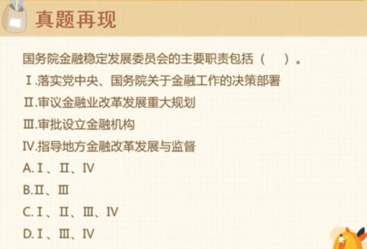

答案：A

### 中央银行-17

**(1) 定义**

中国人民银行是我国的中央银行，它的主要职能是在国务院领导下，**制定和执行货币政策，防范和化解金融风险，维护金融稳定**。

**(2) 主要职能**

一般来说，中央银行的主要职能可概括为“发行的银行”“银行的银行”“政府的银行”。

| 主要职能   | 内容                                                         |
| ---------- | ------------------------------------------------------------ |
| 发行的银行 | 1、概念中央银行垄断货币发行权，是全国唯一有权发行货币的机构。  2、职能体现 (1) 发行货币，货币发行权经国家以法律形式授予； (2) 中央银行还对调节货币供应量、保证货币流通的正常与稳定负有责任。 |
| 银行的银行 | 1、概念：中央银行与商业银行之间带有管理和被管理性质的特殊关系， 它只与商业银行和其他金融机构发生业务往来，并不与企业和个人发生直接的信用关系。 2、职能体现 (1) 集中保管商业银行的存款准备金； (2) 作为商业银行的最后贷款人； (3) 组织全国商业银行之间的清算。 |
| 政府的银行 | 1、概念：中央银行代表国家制定和执行货币政策、处理对外金融关系、为国家提供各种金融服务。 2、职能体现 (1) 代理国库收支； (2) 代理国家债券的发行； (3) 对政府提供信贷； (4) 代表政府管理金融活动，制定、发布并监督执行有关金融监管和业务的命令及规章，负责金融业的统计、调查、分析和 预测； (5) 持有、管理、经营国家外汇储备和黄金储备； (6) 代表政府参加国际金融组织活动，进行国际金融合作。 |

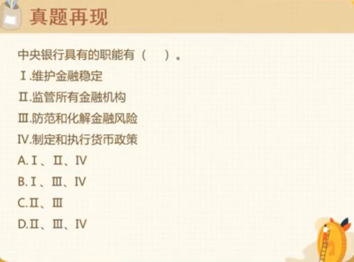

答案：B

 **(3) 业务**-18

中央银行在履行三大基本职能时，其业务活动集中反映在某一时点上的资产负债表这一综合会计记录上。我国中央银行资产负债表如下表：

| 资产业务【运用】                                             | 负债业务【来源】                                             |
| :----------------------------------------------------------- | ------------------------------------------------------------ |
| 1、国外资产 ①外汇 ②货币黄金 ③其他国外资产 2、对政府债权 3、对其他存款性公司债权 4、对其他金融性公司债权 5、对非金融性部门债权 6、其他资产 7、总资产 | 1、储备货币 ①货币发行 ②其他存款性公司存款 2、不计入储备货币的金融性公司存款  3、发行债券 4、国外负债 5、政府存款 6、自有资金 7、其他负债 8、总负债 |

 

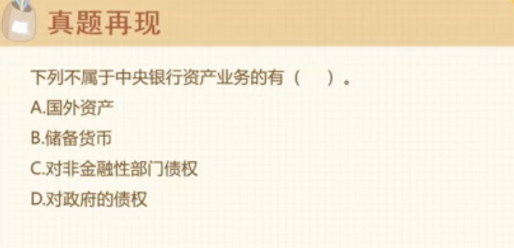

答案：B

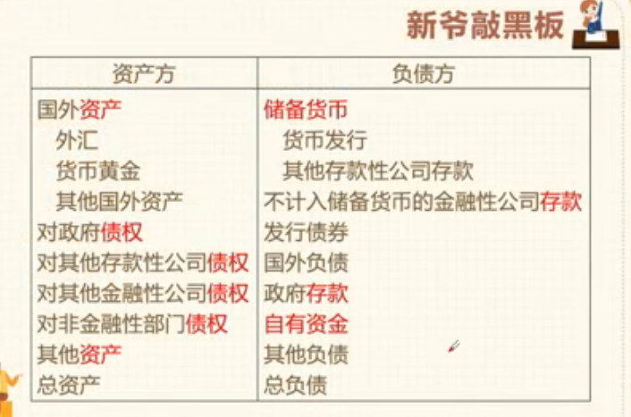

### 存款准备金制度与货币乘数-19

**(1) 存款准备金制度**

存款准备金制度是指国家以法律形式规定存款性金融机构所吸收的存款必须按一定比例，向**中央银行**缴纳一定准备金的制度。

**(2) 货币乘数**-20

中央银行发行的基础货币，包括社会流通中的现金和银行体系中作为准备金的存款。商业银行可以根据基础货币，创造出倍数的货币供给额，其中，  基础 货币和货币供给之间的倍数关系，被称为**货币乘数**。

理论上，货币乘数可以简单表示为法定存款准备金率的倒数，即：$m=1/r$。 式中，$m$—货币乘数；$r$—法定存款准备金率。

现实中，由于各种因素会使货币乘数减小，此时，完整的货币乘数公式为：$m=\frac{1+c}{c+r+e}$。式中，$c$—提现率 (客户 提取的现金与活期存款总额之比) ；$e$—超额准备金率 (超额准备金与存款总额的比例) 。

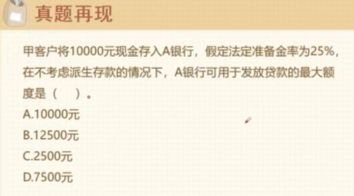

答案：D

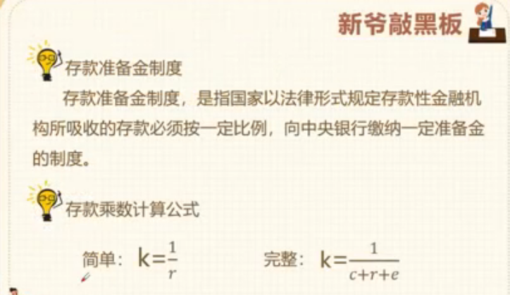

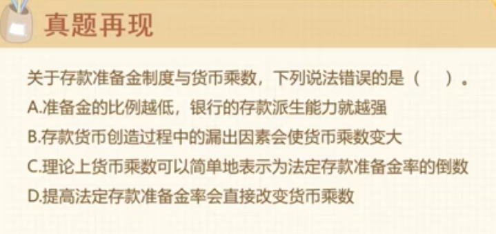

答案：B

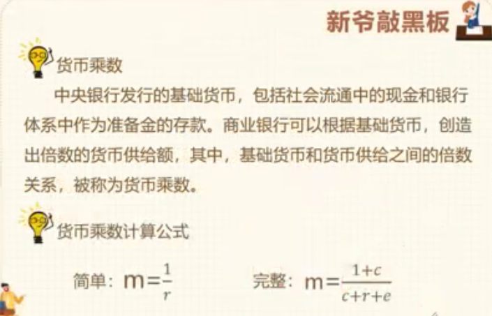

### 货币政策体系

**(1) 货币政策的概念**

货币政策是中央银行利用其掌握的利率、汇率、借贷、货币发行、外汇管理 及金融法规等工具，采用的各种控制和调节货币供给量或信贷规模的方针、政策 和措施的总称。一个完整的货币政策体系包括货币政策目标体系、货币政策工具 体系和货币政策操作程序三大部分。

**(2) 货币政策的目标**-21

1. 操作目标：**基础货币**、**银行准备金**以及**短期货币市场利率**。

2. 中介目标：**货币供应量**、**银行信贷规模**、以及**长期利率**。

3. 最终目标：**稳定物价** (首要目标) 、**充分就业**、**经济增长**、**国际收支平衡**以及**金融稳定**。

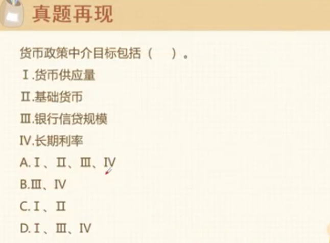

答案：D

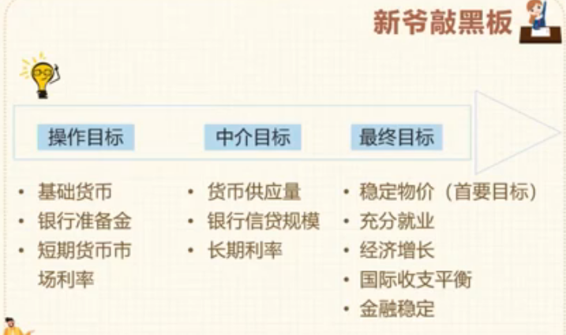

**(3) 一般性货币政策工具**:star:-22

|    货币政策工具    | 内容                                                         |
| :----------------: | ------------------------------------------------------------ |
| **存款准备金制度** | 中央银行通过调整法定存款准备金率来影响商业银行信贷规模，从而间接地对社会货币供应量进行控制的政策措施 。 1、若中央银行降低法定存款准备金率，则商业银行就会有较多的剩余准备金用于贷款或投资，并通过整个银行体系创造 出较多的派生存款。 2、若中央银行提高法定存款准备金率，则商业银行的剩余准备金就会相应减少，从而必须减少贷款或投资，以补足法定准备金，这时就会引起存款货币的大幅度紧缩。 |
|   **再贴现政策**   | 中央银行通过直接调整或制定对合格票据的贴现利率，来干预和影响市场利率，从而调节货币供应量的政策措施 。   1、若中央银行降低再贴现率，就意味着中央银行鼓励商业银行通过再贴现以扩张信贷规模，从而增加货币供给量。 2、若中央银行提高再贴现率，则货币供应量下降。 |
|  **公开市场业务**  | 中央银行在证券市场上公开买卖各种有价证券以控制货币供给量及影响利率水平的概念。             1、若中央银行卖出有价证券，不仅会使货币供给量减少 (回笼基础货币) ，而且还会使证券价格下跌，市场利率上升， 提高借入资金的成本，减少社会投资，抑制经济过热的势头。  2、若中央银行买入证券，就会引起货币供给量增加 (投放基础货币) ，信贷规模扩张，市场利率下降，刺激消费和投资的扩张。 |

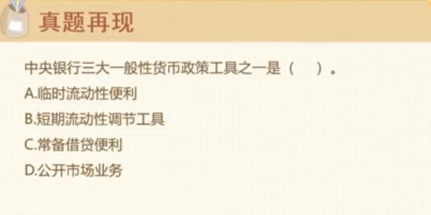

答案：D

**（4）选择性货币政策工具**-23

1. 消费者信用控制
2. 证券市场信用控制
3. 不动产信用控制
4. 直接信用控制
5. 间接信用控制

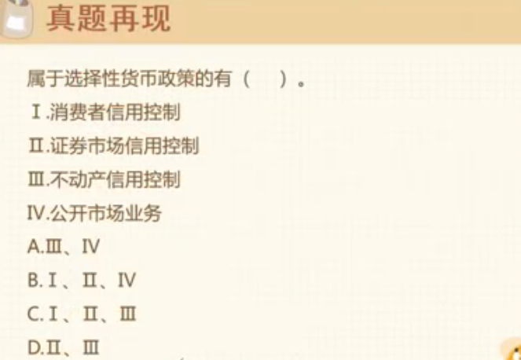

答案：C

### 货币政策的传导机制-24

**(1) 货币政策传导机制概述**

货币政策的传导机制是指中央银行以货币政策手段，使用货币政策工具，来调整和影响经济中的相关经济变量，并通过一定渠道实现既定的经济目标的过程与作用机理。

货币政策的传导机制的一般过程是：货币政策工具→操作目标→ 中介目标→最终目标

**(2) 货币政策传导机制的类型**

1. 利率传导机制:star:

以利率为渠道是传统凯恩斯主义学派货币政策传导机制的核心观点。在这一 传导机制中，核心的变量为利率。

> 利率传导机制的过程可以表示为：货币供应量↑→实际利率↓→投资↑→总产出↑

2. 信用传导机制

伯南克提出了银行借贷渠道和资产负债渠道两种信用传导机制，并得出货币 政策传递过程中即使利率没发生变化，也会通过信用途径来影响国民经济总量的 结论。

> 银行信贷的传导渠道可以表示为：货币供应量↑→银行存款和贷款↑→投资↑→总产出↑

3. 资产价格传导机制

**托宾 q 理论**：托宾 q 理论认为货币政策可以通过股票价值来影响经济活动，**q 值定义为企业的市场价值与资本重置成本之比**。:star:

> 托宾 q 理论传导机制可以表示为：货币供应量↑→股价↑→托宾 q↑→投资↑→总产出↑

**财富效应**：莫迪利安尼认为，当扩张性货币政策引起股价上升时，家庭部门的金融资产价值将会上升，财务困境出现的可能性有所降低，这会刺激家庭部门购买耐用品 和住宅，社会总需求和总产出随之增加。

> 财富效应传导机制可以表示为：货币供应量↑→股价↑→金融资产价值↑→财务困难的可能性↓→耐用消费品和住宅支出↑→总产出↑

4. 汇率传导机制

开放的经济条件下，汇率是外汇资产的价格，同时也是货币政策传导的重要渠道之一。扩张性的货币政策会引起实际利率水平下降，本币存款相对于外汇资 产的预期收益率降低，资本总是从利率相对较低的国家流向利率相对较高的国 家，这将导致本币贬值。本币贬值会促进本国商品出口，抑制外国商品进口，从 而使净出口增加，最终导致总需求和总产出增加。

> 汇率传导机制可表示为：货币供应量↑→实际利率↓→汇率↓→净出口↑→总产出↑

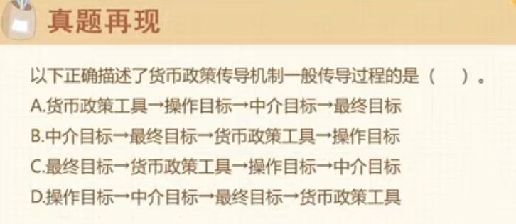

答案：A

## 中国的多层次资本市场

### 资本市场的概念及分类-25

**(1) 资本市场的概念**

资本市场是指长期金融市场或长期资金市场，是为1年以上资本性或准资本性融资产品提供发行和交易服务的有形或无形的市场总和。

**(2) 资本市场的分类**

- 按**行业类型**划分，可将企业分为**传统型、创业型、高科技型**等类型。  
- 按企业**成长周期**划分，可将企业分为**创立期、成长期、成熟期和衰退期**。

### 多层次资本市场的主要内容

|                           场内市场                           | 场外市场                                                     |
| :----------------------------------------------------------: | ------------------------------------------------------------ |
| 主板市场 (包含中小板市场)  科创板市场 创业板市场 (二板市场) 全国中小企业股份转让系统 (新三板) | 区域性股权市场 券商柜台市场 机构间私募产品报价与服务系统 私募基金市场 |

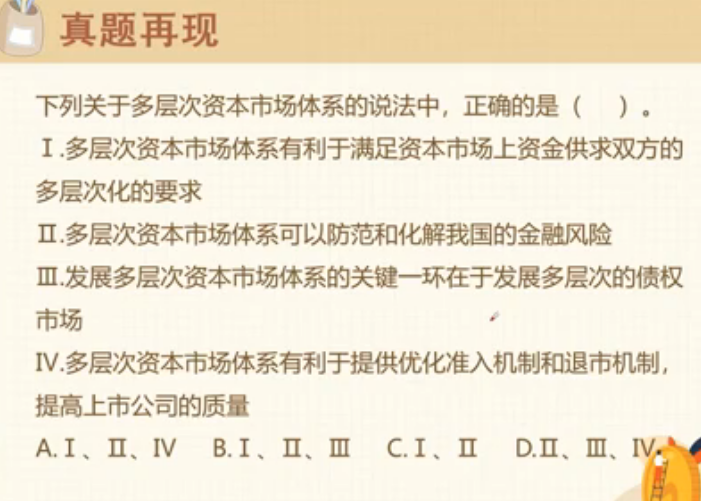

答案：A

### 场内市场

**(1) 场内市场的定义**

场内市场即证券交易所市场。证券交易所是证券买卖双方公开交易的场所， 是一个高度组织化、集中进行证券交易的市场，是整个证券市场的核心。

**(2) 我国的场内市场**    

#### 主板市场 (包含中小板市场)

**(1) 主板市场**-26

主板市场是一个国家或地区证券发行、上市及交易的主要场所，一般而言， 各国主要的证券交易所代表着国内主板市场。主板市场对发行人的营业期限、股 本大小、盈利水平、最低市值等方面的要求标准较高，上市企业多为大型成熟企 业，具有较大的资本规模以及稳定的盈利能力。主板市场是资本市场中最重要的 组成部分，很大程度上能够反映国家或地区的经济发展状况，有“**宏观经济晴雨表**”之称。

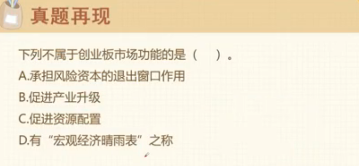

答案：D

**(2) 中小板市场**

2004 年 5 月，经国务院批准，中国证监会批复同意深圳证券交易所在主板 市场内设立中小企业板块。设立中小企业板块的宗旨是为主业突出、具有成长性 和科技含量的中小企业提供直接融资平台，是我国多层次资本市场体系建设的一 项重要内容。

中小企业板块的总体设计原则可以概括为“两个不变”和“四个独立”。

|          |                                                              |
| -------- | ------------------------------------------------------------ |
| 两个不变 | ①中小企业板块运行所遵循的法律、法规和部门规章与主板 市场相同； ②中小企业板块的上市公司须符合主板市场的发行上市条件 和信息披露要求 |
| 四个独立 | ①运行独立：中小企业板块的交易由独立于主板市场交易系 统的第二交易系统承担 ②监察独立：深圳证券交易所建立独立的监察系统实施对中 小企业板块的实时监控，该系统针对中小企业板块的交易特 点和风险特征设置独立的监控指标和报警阈值 ③代码独立：将中小企业板块股票作为一个整体，使用与主 板市场不同的股票编码 ④指数独立：中小企业板块在上市股票达到一定数量后，发 布该板块独立的指数 |

#### 创业板-27

**(1) 概念**

创业板市场又称为**二板市场**，是为具有高成长性的中小企业和高科技企业融资服务的资本市场。

**(2) 特点**

创业板市场是不同于主板市场的独特的资本市场，具有**前瞻性**、**高风险**、**监管要求严格**以及明显的**高技术产业导向**的特点。

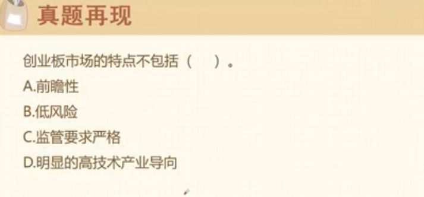

答案：B

#### 全国中小企业股份转让系统-28

全国中小企业股份转让系统，又称为“**新三板**”，是经**国务院**批准设立的全国性的证券交易场所，成立于 2012 年 9 月 20 日，主要为创新型、创业型、成长 型中小微企业发展服务。

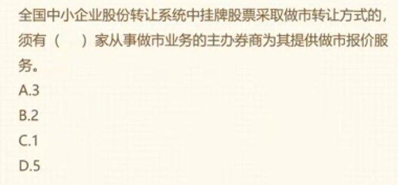

答案：B

#### 科创板-29

**(1) 概述**

2019 年 6 月 13 日，在第十一届陆家嘴论坛开幕式上，中国证监会和上海市人民政府联合举办了**上海证券交易所**科创板开板仪式。科创板将成为我国首个实行**注册制**的场内市场，是我国多层次资本市场体系的重要组成部分。

**科创板的开板**标志着我国证券交易所市场逐步确立了由主板 (含中小板) 、 科创板、创业板、新三板构成的多层次资本市场体系框架。

**(2) 科创板重点服务的行业领域**

①新一代信息技术领域，主要包括半导体和集成电路、电子信息、下一代信 息网络、人工智能、大数据、云计算、新兴软件、互联网、物联网和智能硬件等；

②**高端装备领域**，主要包括智能制造、航空航天、先进轨道交通、海洋工程 装备 及相关技术服务等；

③新材料领域，主要包括先进钢铁材料、先进有色金属材料、先进石化化工 新材料、先进无机非金属材料、高性能复合材料、前沿新材料及相关技术服务等；

④**新能源领域**，主要包括先进核电、大型风电、高效光电光热、高效储能及 相关技术服务等；

⑤节能环保领域，主要包括高效节能产品及设备、先进环保技术装备、先进 环保产品、资源循环利用、新能源汽车整车、新能源汽车关键零部件、动力电池 及相关技术服务等；

⑥生物医药领域，主要包括生物制品、高端化学药、高端医疗设备与器械及 相关技术服务等。

**(3) 科创版上市条件**:star:

根据《上海证券交易所科创板股票上市规则》，发行人申请在上海证券交易 所科创板上市，应当符合下列条件：

①符合中国证监会规定的发行条件；

②发行后股本总额不低于人民币 **3000 万**元；

③首次公开发行的股份达到公司股份总数的**25%**以上；公司股本总额超过人民币**4**亿元的，首次公开发行股份的比例为**10%**以上；

④市值及财务指标满足规定的标准；

⑤上海证券交易所规定的其他上市条件。

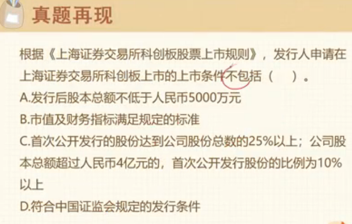

答案：A

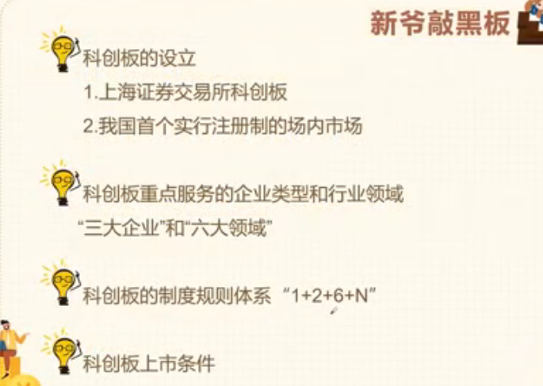

### 场外市场-30

**(1) 场外市场的定义**

场外市场是指在集中的交易场所之外进行证券交易的市场，没有集中的交易场所和市场制度，又被称为店头市场或者柜台市场，主要是一对一交易，以交易非标准化的、私募类型的产品为主。

**(2) 场外市场的特征**

1. 挂牌标准相对较低，通常不对企业规模和盈利情况等进行要求；

2. 信息披露要求较低，监管较为宽松；

3. 交易制度通常采用做市商制度。

**(3) 场外市场的功能**

1. 拓宽融资渠道，改善中小企业融资环境；

2. 为不能在证券交易所上市交易的证券提供流通转让的场所；

3. 提供风险分层的金融资产管理渠道。

**(4) 我国的场外市场**

1. `区域性股权市场`

区域性股权市场是指为其所在省级行政区域内中小微企业证券非公开发行、 转让及相关活动提供设施与服务的场所。区域性股权市场是多层次资本市场体系的重要组成部分，是地方人民政府扶持中小微企业政策措施的综合运用平台，对于促进企业特别是中小微企业股权交易和融资，**鼓励科技创新和激活民间资本**， 加强对实体经济薄弱环节的支持，具有积极作用。

2. 券商柜台市场

券商柜台市场是指证券公司为与特定交易对手方在集中交易场所之外进行 交易或为投资者在集中交易场所之外进行交易提供服务的场所或平台。

3. 机构间私募产品报价与服务系统

中证机构间报价系统股份有限公司，原名中证资本市场发展监测中心有限责 任公司，2013 年 2 月 27 日成立，2015 年 2 月 10 日更名改制，是经中国证监会批准并由中国证券业协会按照市场化原则管理的金融机构。

机构间私募产品报价与服务系统秉承“多元、开放、竞争、包容”的理念， 以私募市场、机构间市场、互联互通市场、互联网市场为基础定位，以为参与人 提供私募产品报价、发行、转让及互联互通、登记结算、信息服务等为核心功能， 以私募产品发行转让市场、私募股权发行转让市场、场外衍生品市场、大宗商品 市场为主体架构，是多层次资本市场基础金融设施之一。

4. 私募基金市场

(1) 私募投资基金的概念

根据《私募投资基金监督管理暂行办法》的规定，私募投资基金 (以下简称 私募基金) ，是指在中华人民共和国境内，以非公开方式向投资者募集资金设立的投资基金。私募基金财产的投资包括买卖股票、股权、债券、期货、期权、基 金份额及投资合同规定的其他投资标的。

(2) 私募投资基金的合格投资人

私募基金的合格投资人，是指具备相应风险识别能力和风险承担能力，投资单只私募基金的金额不低于 100 万元且符合下列相关标准的单位和个人：

①净资产不低于 1000 万元的单位；

②金融资产不低于 300 万元或者最近 3 年个人年均收入不低于 50 万元的个 人。

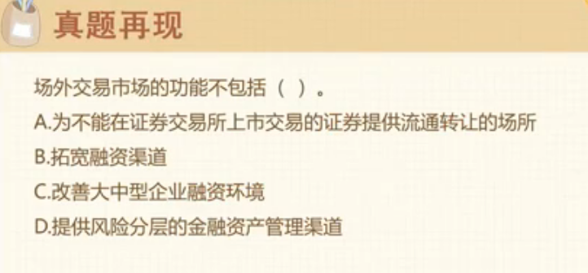

答案：C

### 多层次资本市场的意义-31

1. 有利于调动民间资本的积极性，将储蓄转化为投资，提升服务实体经济能力。
2. 有利于创新宏观调控机制，提高**直接**融资比重，防范和化解经济金融风险。
3. 有利于促进科技创新，促进新兴产业发展和经济转型。
4. 有利于促进产业整合，缓解产能过剩。
5. 有利于满足日益增长的社会财富管理需求，改善民生，促进社会和谐。
6. 有利于提高我国经济金融的国际竞争力。

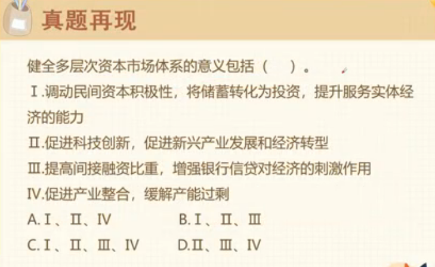

答案：A

# 证券市场主体

## 证券发行人-32

### 概念

证券发行人是指为筹措资金而发行债券、股票等证券的发行主体。证券发行人主要包括**政府及其机构**、**企业 (公司)** 和**金融机构**。

### 政府和政府机构融资

**(1) 政府**

政府发行债券所筹集的资金既可以用于**协调财政资金短期周转、弥补财政赤字、兴建政府投资的大型基础性的建设项目，也可以用于实施某种特殊的政策， 在战争期间还可以用于弥补战争费用的开支**。

中央政府拥有税收、货币发行特权，通常情况下，中央政府债券不存在违约风险，因此，这一类证券被视为**无风险证券**，相对应的证券收益率被称为**无风险利率**，是金融市场上最重要的价格指标。

**(2) 中央银行**

中央银行是代表一国政府发行法偿货币、制定和执行货币政策、实施金融监管的重要机构。中央银行作为证券发行主体，主要涉及两类证券：

- **中央银行股票**。在一些国家 (如美国) ，中央银行采取了股份制组织结构， 通过发行股票募集资金，但是，中央银行的股东并不享有决定中央银行政策的权利，只能按期收取固定的红利，其股票类似于优先股。
- 中央银行出于调控货币供给量目的而发行的**特殊债券**。

### 企业 (公司) 融资

**(1) 企业 (公司) 直接融资的方式**

| 融资方式 |              |                                                              |
| :------: | :----------: | ------------------------------------------------------------ |
| 股票融资 | **自有资本** | 发行股票是企业 (公司) 筹措长期资本的主要途径                 |
| 债券融资 | **借入资本** | 发行长期企业 (公司) 债券是企业 (公司) 筹措长期资本的主要途径，发行短期债券则是补充流动资金的重要手段 |

**(2) 上市公司融资的途径**

根据《中华人民共和国公司法》的规定，上市公司是指其股票在证券交易所 上市交易的股份有限公司。

① 上市公司**首次融资**：上市公司首次融资主要是指首次公开发行股票 (简称 IPO) ，是指拟上市公司首次面向不特定的社会公众投资者公开发行股票募集资金并上市的行为。

② 上市公司**再融资**：上市公司再融资是指上市公司为达到增加资本和募集资金的目的而再发行股票或可转换债券的行为。根据我国《上市公司证券发行管理办法》规定，上市公司再融资的方式有向原股东配售股份、向不特定对象公开募集股份、发行可转换公司债券、非公开发行股票。

### 金融机构

金融机构作为证券市场的发行主体，既发行债券，也发行股票。

金融债券作为债券的一种特殊类型 ， 它具有以下特点 ：

（1）金融债券表示的是银行等金融机构与金融债券持有者之间的债权债务关系；

（2）金融债券一般不记名、不挂失，但可以抵押和转让；

（3）我国金融债券的发行对象主要为个人，利息收入可免征个人收入所得税和个人收入调节税；

（4）金融债券的利息不计复利，不能提前支取，延期兑付亦不计逾期利息；

（5）金融债券的利率固定，一般都高于同期储蓄利率；

（6）我国发行过金融债券所筹集的资金一般都专款专用，如建设银行曾发行的投资债券，其主要用途就是为国家的大、中型建设项目筹措资金 。

---

答案：A

## 证券投资者-33

### 证券市场投资者的概念

证券市场投资者是指以取得**利息**、**股息**或**资本收益**为目的，购买并持有有价证券，承担证券投资风险并行使证券权利的主体。

### 机构投资者

**(1) 机构投资者的概念**：

机构投资者是指用自有资金或者从分散的公众手中筹集的资金，以获得证券投资收益为主要经营目的的专业团体机构或企业。

**(2) 机构投资者的特点 (对比个人投资者)**-34

相比个人投资者而言，机构投资者具有如下特点：

- 投资资金规模化；
- 投资管理专业化；
- 投资结构组合化；
- 投资行为规范化。

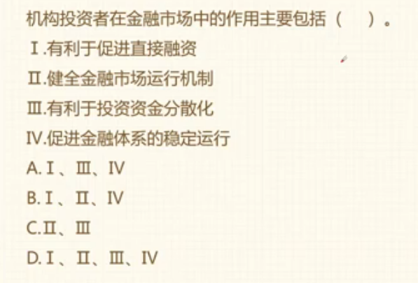

答案：B

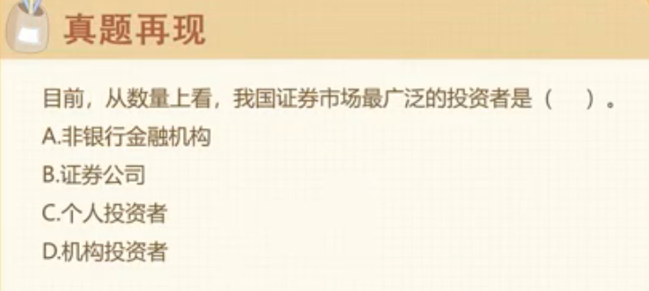

答案：C

---

机构投资者的分类：

**(3) 政府机构类投资者**-35

|      |                                                              |
| :--: | ------------------------------------------------------------ |
| 含义 | 政府机构类投资者是指进行证券投资的政府机构                   |
| 特点 | 通常很少考虑盈利，参与证券投资的目的主要是调剂资金余缺、实施宏观调控、实行特定产业政策等。 |
| 组成 | 政府机构类投资者主要包括：                   1、中央银行以公开市场操作作为政策手段，通过买卖政府债券或金融债券，影响货币供应量进行宏观调控。              2、我国国有资产管理部门或其授权部门持有国有股，履行国有资产的保值增值和通过国家控股、参股来支配更多社会资源的职责。 |

答案：B

**(4) 金融机构类投资者**-35

金融机构类投资者是指进行证券投资、从事金融资产交易的金融机构，包括**证券经营机构、银行业金融机构、保险公司以及其他金融机构**。

|    机构分类    |                                                              |
| :------------: | ------------------------------------------------------------ |
|  证券经营机构  | 在机构投资者中，证券经营机构是证券市场上**最为活跃的投资者**，其以自有资本、营运资金和受托投资资金进行证券投资。我国证券经营机构主要为证券公司。 |
| 银行业金融机构 | 银行业金融机构包括商业银行、城市商业银行、农村信用合作社等吸收公众存款的金融机构以及政策性银行。 |
|  保险经营机构  | 保险公司是全球最重要的机构投资者之一，曾一度超过投资基金成为投资规模最大的机构投资者，除大量投资各类政府债券、高等级公司债券外，还广泛涉足基金和股票投资。 |
|  其他金融机构  | 其他金融机构包括**信托投资公司、企业集团财务公司和金融租赁公司**等。 |

**(5) 企业和事业法人类机构投资者**-37

企业可以用自己的积累资金或暂时不用的闲置资金进行证券投资。企业可以通过股票投资实现对其他企业的**控股或参股**，也可以将暂时闲置的资金通过自营 或委托专业机构进行证券投资以获取收益。

我国现行的规定是，各类企业**可参与股票配售，也可投资股票二级市场**；事业法人可用**自有资金**和**有权自行支配的预算`外`资金**进行证券投资。

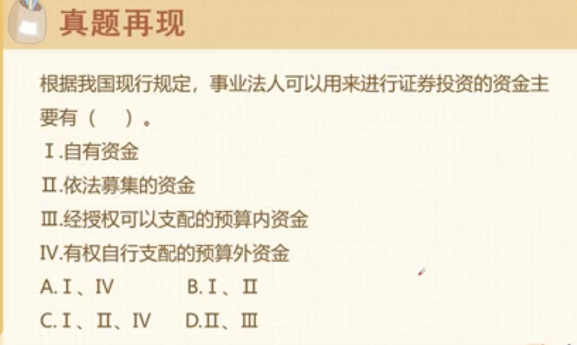

答案：A

**(6) 基金类机构投资者**-37

基金类投资者包括证券投资基金、社保基金、企业年金和社会公益基金。

- 证券投资基金

证券投资基金是指通过公开发售基金份额等筹集资金，由基金管理人管理， 基金托管人托管，为基金份额持有人的利益，以资产组合方式进行证券投资活动的基金。

我国的证券投资基金可投资上市交易的股票、债券和国务院证券监督管理机 构规定的其他证券及其衍生品种。

- 社保基金

(1) 国外社保基金组成

|                    | 募集方式                                       | 特征                                                         |
| :----------------: | ---------------------------------------------- | ------------------------------------------------------------ |
| 全国性社会保障基金 | 国家以**社会保障税**等形式征收                 | 全国性社会保障基金属于国家控制的财政收入，主要用于支付失业救济和退休金，是社会福利网的最后一道防线，对资金的**安全性和流动性**要求非常高。 |
|      企业年金      | 企业定期向员工支付并委托基金公司管理的企业年金 | 控制的企业年金的资金运作**周期长**，对账户资产增值有较高要求，但对投资范围限制不多。 |

 (2) 我国社保基金组成

|                  |                                                              |
| :--------------: | ------------------------------------------------------------ |
| 全国社会保障基金 | 全国社会保障基金是由中央财政预算拨款、国有资本划转、 基金投资收益和以国务院批准的其他方式筹集的资金构成， 其性质为国家社会保障储备基金，用于人口老龄化高峰时期的养老保险等社会保障支出的补充、调剂。 |
|   社会保险基金   | 社会保险基金是指社会保险制度确定，为了保障公民在年老、疾病、工伤、失业、生育等情况下获得物质帮助而建立 的，主要由用人单位和个人缴费构成，包括**基本养老保险基 金、基本医疗保险基金、工伤保险基金、失业保险基金和生育保险基金** ，用于公民养老、医疗、工伤、失业、生育等 各项社会保险待遇的当期发放。现阶段，我国社会保险基金的部分积累项目主要是基本养老保险基金。 |

**(7) 合格境外机构投资者**-36

1. 合格境外机构投资者的概念

合格境外机构投资者 **(QFII)** 制度，是在一定规定和限制下汇入一定额度的外汇资金，并转换为当地货币，通过严格监管的专门账户投资当地证券市场，其 资本利得、股息等经审核后可转为外汇汇出的一种市场开放模式。其实质是一种有限度地引进外资、开放证券市场的过渡性制度。

2002 年 11 月 5 日，中国人民银行和中国证监会联合发布的《合格境外机构 投资者境内证券投资管理暂行办法》，将合格境外机构投资者定义为：符合有关 条件，经中国证监会批准投资于中国证券市场，并取得国家外汇管理局额度批准 的中国境外基金管理机构、保险公司、证券公司以及其他资产管理机构。这标志着我国正式实施 QFII 制度，中国证券市场开始有条件地向境外机构投资者开放。

2020 年，中国人民银行、国家外汇管理局发布《境外机构投资者境内证券 期货投资资金管理规定》，明确并简化QFII、RQFI境内证券期货投资资金管理要求进一步便利QFII、RQFII投资境内市场：

一是落实取消合格境外机构投资者和人民币合格境外机构投资者(以下简称“合格投资者”) 境内证券投资额度管理要求，对合格投资者跨境资金汇出入和 兑换实行登记管理。

二是实施本外币一体化管理，允许合格投资者自主选择汇入资金币种和时 机。

三是大幅简化合格投资者境内证券投资收益汇出手续，取消中国注册会计师 出具的投资收益专项审计报告和税务备案表等材料要求，改以完税承诺函替代。

四是取消托管人数量限制，允许单家合格投资者委托多家境内托管人，并实 施主报告人制度。

五是完善合格投资者境内证券投资外汇风险及投资风险管理要求。

六是人民银行、国家外汇管理局加强事中事后监管。

2. 投资范围

合格境外投资者在批准的交易额度内，可以投资于在证券交易所挂牌交易的股票、在证券交易所挂牌交易的债券、证券投资基金、在证券交易所挂牌交易的 权证、在银行间债券市场交易的固定收益产品、股指期货以及中国证监会允许的 其他金融工具。合格境外机构投资者可以参与**新股发行、可转换债券发行、股票增发和配股的申购**。

3. 持股比例规定

(1) 单个境外投资者通过合格境外机构投资者持有一家上市公司股票的， 持股比例不得超过**10%**；

(2) 全部境外机构对单个上市公司的持股上限为30%，国内基金在这一点上没有限制。

**(8) 合格境内机构投资者**-36

1. 合格境内机构投资者的概念

合格境内机构投资者 **(QDII)** 制度，是指经一国金融管理当局审批通过、获准直接投资境外股票或者债券市场的国内机构投资者，在一定规定下通过基金形式募集一定额度的人民币资金，通过严格监管的专门账户投资国外证券市场，其汇回的资本利得、股息红利等经审核后可转为本币的一种市场开发机制。和 QFII 制度一样，它也是在货币没有实现完全可自由兑换、资本项目尚未开放的情况下， 有限度地允许境内投资者投资境外证券市场的一项过渡性的制度安排。

2. 投资范围的规定

QDII 可投资于下列金融产品或工具：

(1) 银行存款、可转让存单、银行承兑汇票、银行票据、商业票据、回购 协议、短期政府债券等货币市场工具；

(2) 政府债券、公司债券、可转换债券、住房按揭支持证券、资产支持证 券等及经中国证监会认可的国际金融组织发行的证券；

(3) 已与中国证监会签署双边监管合作谅解备忘录的国家或地区证券市场 挂牌交易的普通股、优先股、全球存托凭证和美国存托凭证、房地产信托凭证；

(4) 在已与中国证监会签署双边监管合作谅解备忘录的国家或地区证券监 管机构登记注册的公募基金；

(5) 与固定收益、股权、信用、商品指数、基金等标的物挂钩的结构性投 资产品；

(6) 远期合约、互换及在已与中国证监会签署双边监管合作谅解备忘录的 国家或地区交易所上市交易的权证、期权、期货等金融衍生产品。

除中国证监会另有规定外，基金、集合计划不得有下列行为：购买不动产； 购买房地产抵押按揭；购买贵重金属或代表贵重金属的凭证；购买实物商品；除 应付赎回、交易清算等临时用途以外，借入现金。该临时用途借入现金的比例不 得超过基金、集合计划资产净值的 10%；利用融资购买证券，但投资金融衍生品 除外；参与未持有基础资产的卖空交易；从事证券承销业务；中国证监会禁止的 其他行为。

3. 投资比例的规定

(1) 单只基金、集合计划持有的非流动性资产市值不得超过基金、集合计划净值的**10%**。

(2) 单只基金、集合计划持有的境外基金的市值合计不得超过基金、集合计划净值的**10%**，持有货币市场基金可以不受上述限制。

(3) 单只基金、集合计划持有同一机构 (政府、国际金融组织除外) 发行 的证券市值不得超过基金、集合计划净值的**10%**，指数基金可以不受上述限制。

(4) 基金、集合计划不得购买证券用于控制或影响发行该证券的机构或其 管理层，同一境内机构投资者管理的全部基金、集合计划不得持有同一机构 10% 以上具有投票权的证券发行总量，指数基金可以不受上述限制。

(5) 单只基金、集合计划持有与中国证监会签署双边监管合作谅解备忘录 国家或地区以外的其他国家或地区证券市场挂牌交易的证券资产不得超过基金、 集合计划资产净值的 10%，其中持有任一国家或地区市场的证券资产不得超过基 金、集合计划资产净值的3%。

(6) 单只基金、集合计划持有同一家银行的存款不得超过基金、集合计划净值的**20%**，在基金、集合计划托管账户的存款可以不受上述限制。

(7) 同一境内机构投资者管理的全部基金、集合计划持有的任何一只境外基金，不得超过该境外基金总份额的**20%**。

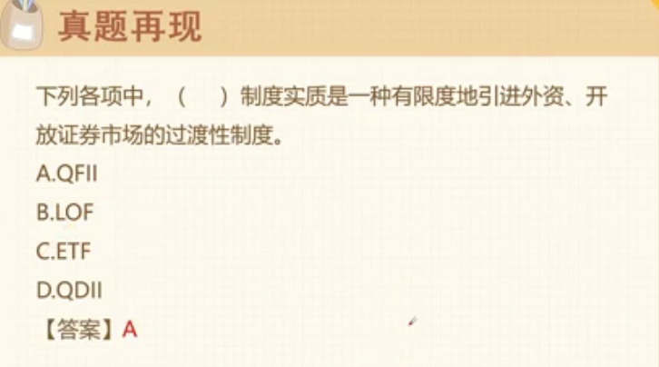

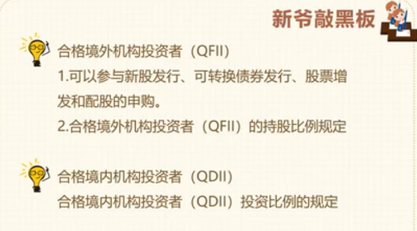

### 个人投资者-38

**(1) 个人投资者概述**

| 个人投资者 | 内容                                                         |
| :--------: | ------------------------------------------------------------ |
|    概念    | 个人投资者是指从事证券投资的社会自然人，他们是证券市场**最广泛的投资主体**，具有分散性和流动性。 |
|    特点    | 1、资金规模有限； 2、专业知识相对匮乏； 3、投资行为具有随意性、分散性和短期性； 4、投资的灵活性强。 |
|    分类    | 根据个人投资者对待投资中风险和收益的态度，理论上可分为：  1、风险偏好型； 2、风险中立型； 3、风险规避型。 |

**(2) 投资者适当性**:star:

1. 以判断投资者风险承受能力为目标的**投资者分类**义务；

2. 以判断产品风险等级为目标的**产品分级**义务；

3. 以“将适当的产品销售给适当的投资者”为目标的**销售匹配**义务。

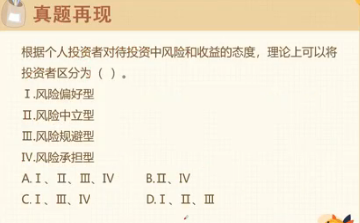

答案：D

## 证券中介机构

### **证券公司概述**

**(1) 证券公司的定义**-39

证券公司是指依照**《公司法》**和**《证券法》**设立的经营证券业务的有限责任公司或股份有限公司。在我国，设立证券公司必须经**国务院证券监督管理机构**审查批准。

**(2) 证券公司的监管制度**-39

|                      监管制度                      | 内容                                                         |
| :------------------------------------------------: | ------------------------------------------------------------ |
|                    业务许可制度                    | 根据《证券法》的规定，证券公司业务包括证券经纪业务，证券投资咨询业务，与证券交易、证券投资活动有关的财务顾问业务，证券承销与保荐业务，证券自营业 务，证券做市交易业务以及其他证券业务。证券公司经营以上部分或全部业务均需要经过**中国证监会**的核准。 |
|         以诚信与资质为标准 的市场准入制度          | 设立证券公司必须满足法律法规对注册资本、股东、高 级管理人员及业务人员、制度建设、经营场所、合规记录等方面的设立条件；在准入环节对控股股东和大股东的资格进行审慎调查，鼓励资本实力强、具有良好诚信记录的机构参股证券公司。 |
|                    分类监管制度                    | 证券公司分类是指以证券公司风险管理能力为基础，结合公司市场竞争力和持续合规状况，按照《证券公司分 类监管规定》评价和确定证券公司的类别中国证监会按照分类监管原则，对不同类别证券公司规定了不同的风险控制指标标准和风险资本准备计算比例，并在监管资源分配、现场检查和非现场检查频率等方面**区别对待**。 |
|                    合规管理制度                    | 实施合规管理制度是指健全证券公司内部约束机制、实 现内部约束与外部监管有机互动的重要措施，有利于推动监管机制从以行政监管为主向行政监管、行业自律和公司自我约束有机结合转变中国证监会依法对证券基金经营机构合规管理工作实施监督管理，中国证监会派出机构按照授权履行管理职责。 |
|           客户交易结算资金第三方存管制度           | 客户交易结算资金第三方存管制度包括“单独立户、封闭运行、总分核对”三大要求。以“单独立户”来防止资金被混合使用，以“封闭运行”来防止资金被违规动 用，以“总分核对”来及时发现存在的问题，从证券公司、指定商业银行、客户、投资者保护基金公司、监管部门五个角度，建立全方位的客户资金监督机制。 |
|                 信息报送与披露制度                 | 信息公开披露制度主要为证券公司的基本信息公示和财务信息公开披露，内容包括公司基本情况、经营性分支机构、业务许可类新产品、高管人员等信息，公示信息发生变动的，需要进行持续更新。 |
| 以**净资本**和**流动性**为核心的风险监控和预警制度 | 为完善证券公司经营风险的识别、计量和预警机制，防范投资者合法权益因证券公司经营失败受到侵害，2006 年7月，中国证监会首次发布并实施《证券公司风险控制指标管理办法》，确立了以净资本为核心的证券公司风险控制指标制度。 |

 

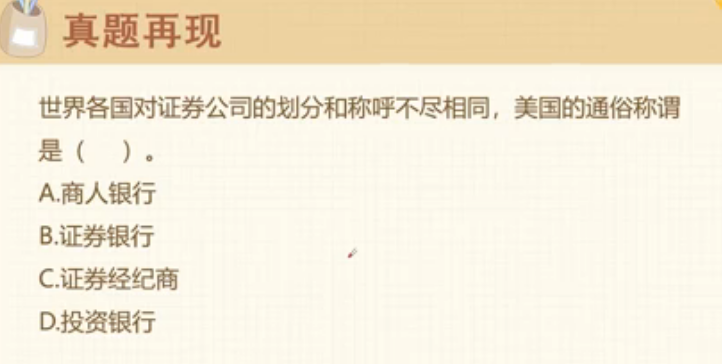

答案：D

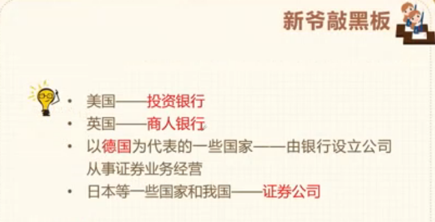

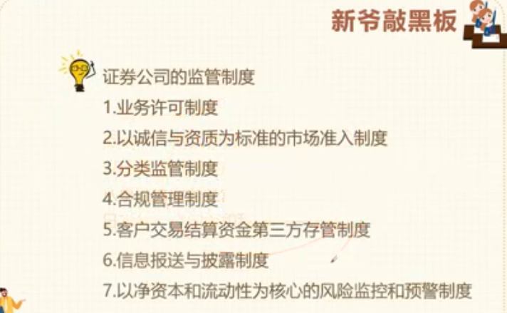

**(3) 证券公司的业务**:star:

1. 证券经纪业务-40

**(1) 证券经纪业务的概念**

证券经纪业务又称**代理买卖证券业务**，指证券公司接受客户委托代客户买卖有价证券的业务。在证券经纪业务中，证券公司只收取一定比例的**佣金**作为业务收入。

**(2) 证券经纪委托关系的建立流程**

在证券经纪业务中，经纪委托关系的建立表现为**开户和委托**两个环节。

① 投资者应在登记结算公司或者其代理点开立证券账户；

② 投资者与证券公司签署风险揭示书、客户须知，签订证券交易委托代理协议，开立客户交易结算资金第三方存管协议中的资金账户等。

经纪关系的建立只是确立了投资者和证券公司直接的代理关系，还没有形成实质上的委托关系。当投资者办理了具体的委托手续，即投资者填写了委托单或自助委托及证券公司受理了委托，两者就建立了受法律保护和约束的委托关系。

2. 证券投资咨询业务-40

**(1) 证券投资咨询业务的概念**

根据《证券、期货投资咨询管理暂行办法》的规定，证券投资咨询业务是指从事证券投资咨询业务的机构及其咨询人员为证券投资人或者客户提供证券投资分析、预测或者建议等直接或者间接有偿咨询服务的活动。

**(2) 证券投资咨询业务的种类**

证券投资咨询的两种基本业务形式为**证券投资顾问业务**和**发布证券研究报告**。

|                  |                                                              |
| :--------------: | ------------------------------------------------------------ |
| 证券投资顾问业务 | 证券公司、证券投资咨询机构接受客户委托，按照约定向客 户提供涉及证券及证券相关产品的投资建议服务，辅助客户作出投资决策，并直接或者间接获取经济利益的经营活动 |
| 发布证券研究报告 | 证券公司、证券投资咨询机构对证券及证券相关产品的证券 价值、市场走势或者相关影响因素进行分析，形成投资分析意见，制作证券研究报告、分析报告，并向客户发布的行为 |

3. 与证券交易、证券投资活动有关的财务顾问-40

财务顾问业务是指与证券交易、证券投资活动有关的咨询、建议、策划业务。

4. 证券承销与保荐业务-40

**(1) 证券承销业务的概念**

证券承销是指证券公司代理证券发行人发行证券的行为。发行人向不特定对象公开发行的证券，法律、行政法规规定应当由证券公司承销的，发行人应当同 证券公司签订承销协议。

**(2) 证券承销方式**

| 证券承销方式 |                                                              |
| :----------: | ------------------------------------------------------------ |
|     包销     | 全额报销：证券公司将发行人的证券按照协议全部购入的承销方式。 |
|     包销     | 余额包销：证券公司在承销期结束时将售后剩余证券全部自行购入的承销方式。 |
|     代销     | 证券公司代发行人发售证券，在承销期结束时，将未售出的证券全部退还给发行人的承销方式。 |

**(3) 证券保荐业务的概念**

证券保荐制度，是指由保荐人对发行人发行证券进行推荐和辅导，核实公司发行文件与上市文件中所载资料是否真实、准确、完整，协助发行人建立严格的信息披露制度，承担风险防范责任。

5. 证券自营业务-40

**（1) 证券自营业务的概念**

证券自营业务是指证券公司以自己的名义，以自有资金或者依法筹集的资金，为本公司买卖在境内证券交易所上市交易的证券，在境内银行间市场交易的政府债券、国际开发机构人民币债券、央行票据、金融债券、短期融资券、公司债券、中期票据和企业债券，以及经中国证监会批准或者备案发行并在境内金融机构柜台交易的证券，以获取盈利的行为。

**（2）证券自营业务的相关规定**

若证券公司将自有资金投资于依法公开发行的国债、投资级公司债、 货币市场基金、央行票据等风险较低、流动性较强的证券，或者委托其他证券公司或者基金管理公司进行证券投资管理，且投资规模合计不超过其净资本80%的，**无须**取得证券自营业务资格；

证券公司不得为从事自营业务的子公司提供融资或者担保。 

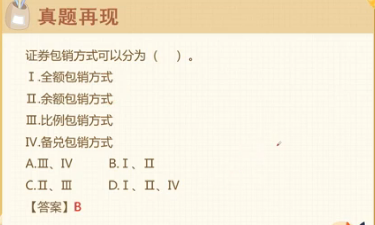

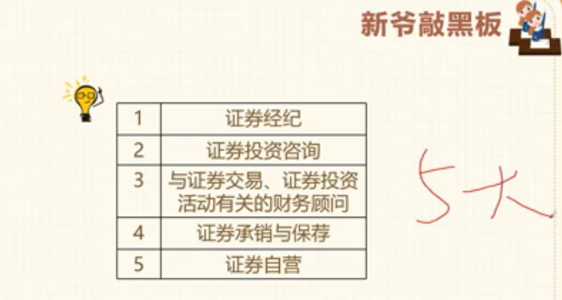

6. 证券资产管理业务-41

**(1) 证券资产管理业务的概念**

资产管理业务是指银行、信托、证券、基金、期货、保险资产管理机构、金融资产投资公司等金融机构接受投资者委托，对受托的投资者财产进行投资和管理的金融服务。

**(2) 资产管理的分类**

证券公司可以为单一投资者设立单一资产管理计划，也可以为多个投资者设立集合资产管理计划。

|   资产管理计划   | 具体要求                                                     |
| :--------------: | ------------------------------------------------------------ |
| 单一资产管理计划 | 单一资产管理计划可以接受货币资金委托，或者接受投资者合法持有的股票、债券或中国证监会认可的其他金融资产委托 |
| 集合资产管理计划 | ①集合资产管理计划的投资者人数不少于 2 人，不得超过 200 人 ②集合资产管理计划原则上应当接受**货币资金**委托，中国证监会认可的情形除外 |

 

7. 融资融券业务-41

**(1) 融资融券业务的概念**

融资融券业务是指证券公司向客户出借资金供其买入证券或者出借证券供 其卖出，并收取担保物的经营活动。

融资融券交易分为融资交易和融券交易两类，客户向证券公司借资金买证券为融资交易，客户向证券公司借证券卖出为融券交易。

**(2) 融资融券交易账户**

|     开立机构     | 账户名称                                                     |
| :--------------: | ------------------------------------------------------------ |
| 证券登记结算公司 | 融券专用证券账户客户信用交易担保证券账户信用交易证券交收账户信用交易资金交收账户 |
|     商业银行     | 融资专用资金账户客户信用交易担保资金账户                     |

8. 证券公司中间介绍业务-41

**(1) 中间介绍业务的概念**

证券公司中间介绍业务是指证券公司接受期货经纪商的委托，为期货经纪商介绍客户参与期货交易并提供其他相关服务的业务活动。

**(2) 证券公司申请 IB 业务的资格条件**

证券公司申请中间介绍业务资格，应当符合下列条件：

① 申请日前6个月各项风险控制指标符合规定标准；

② 已按规定建立客户交易结算资金第三方存管制度；

③ **全资拥有或者控股一家期货公司，或者与一家期货公司被同一机构控制**，且该期货公司具有实行会员分级结算制度期货交易所的会员资格、申请日前2个月的风险监管指标持续符合规定的标准；

④ 配备必要的业务人员，公司总部至少有5名、拟开展中间介绍业务的营业 部至少有**2名**具有**期货从业人员资格**的业务人员；

⑤ 已按规定建立健全与中间介绍业务相关的业务规则、内部控制、风险隔离 及合规检查等制度；

⑥ 具有满足业务需要的技术系统；

⑦ 中国证监会根据市场发展情况和审慎监管原则规定的其他条件。

**(3) 证券公司中间介绍业务的业务范围**

证券公司受期货公司委托从事中间介绍业务，应当提供的服务包括：

① 协助办理开户手续；

② 提供期货行情信息、交易设施；

③ 中国证监会规定的其他服务。

**(4) 证券公司中间介绍业务的禁止行为：**

① 证券公司不得代理客户进行期货交易、结算或者交割；

② 不得代期货公司、客户收付期货保证金；

③ 不得利用证券资金账户为客户存取、划转期货保证金。 

9. 私募投资基金业务和另类投资业务-41

证券公司设立私募投资基金子公司从事私募投资基金业务；

通过设立另类投资子公司从事《证券公司证券自营投资品种清单》所列品种**以外**的金融产品、股权等另类投资业务。

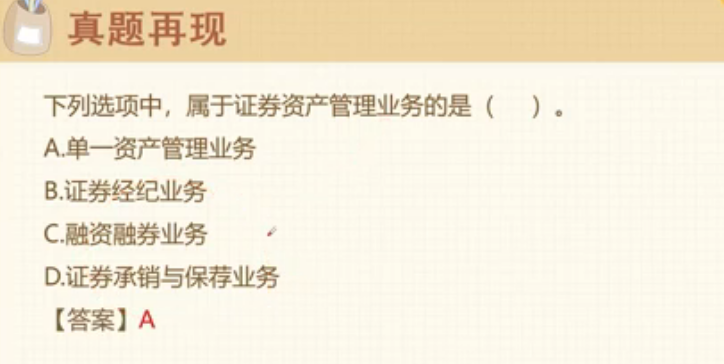

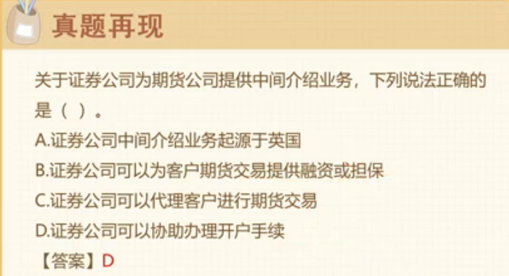

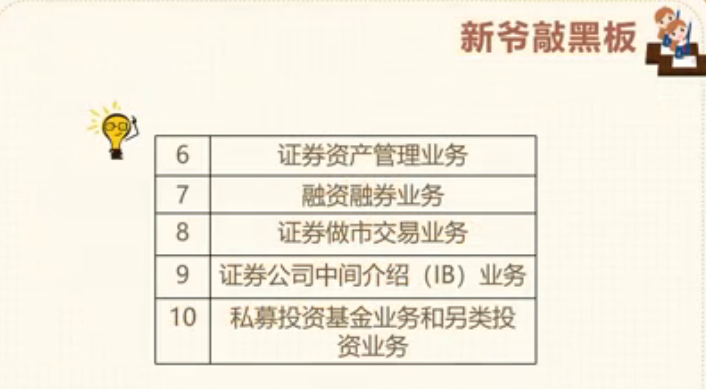

### 证券服务机构

证券服务机构是指依法设立的从事证券服务业务的法人机构，主要包括证券投资咨询机构、财务顾问机构、资信评级机构、资产评估机构、会计师事务所、 律师事务所、信息技术系统服务等。

投资从事证券投资咨询服务业务，应当经国务院证券监督管理机构**核准**；未经核准，不得为证券的交易及相关活动提供服务。从事其他证券服务业务，应当报国务院证券监督管理机构和国务院有关主管部门**备案**。

### 证券金融公司从事转融通业务的管理

**(1) 证券金融公司与转融通业务的概念**

证券金融公司也被称为证券融资公司，是指依法设立的在证券市场上专门从 事证券融资业务的法人机构。

转融通业务是指证券金融公司将自有或者依法筹集的资金和证券出借给证 券公司，以供其办理融资融券业务的经营活动。  (注：证券金融公司向证券公司 转融通的期限一般不得超过 6 个月。)

**(2) 证券金融公司的设立**

1. 证券金融公司的组织形式为股份有限公司，根据国务院的决定设立，其注 册资本不少于人民币60 亿元。注册资本为实收资本，其股东应当用货币出资。

2. 证券金融公司董事、监事和高级管理人员的选任，应当经中国证监会批准。

3. 变更名称、注册资本、股东、住所、职责范围，制定或者修改公司章程， 设立或者撤销分支机构，应当报中国证监会备案。

4. 证券金融公司的设立和解散由国务院决定。

**(3) 证券金融公司开立的转融通账户**

|   账户开立机构   | 账户名称           | 账户用途                                                     |
| :--------------: | ------------------ | ------------------------------------------------------------ |
| 证券登记结算机构 | 转融通专用证券账户 | 用于记录证券金融公司持有 的拟向证券公司融出的证券和证券公司归还的证券 |
| 证券登记结算机构 | 转融通担保证券账户 | 用于记录证券公司委托证券 金融公司持有、担保证券金融 公司因向证券公司转融通所生债权的证券 |
| 证券登记结算机构 | 转融通证券交收账户 | 用于办理证券金融公司与转融通业务有关的证券结算               |
| 证券登记结算机构 | 转融通担保资金账户 | 用于记录证券公司交存的、担 保证券金融公司因向证券公司转融通所生债权的资金 |
| 证券登记结算机构 | 转融通资金交收账户 | 用于办理证券金融公司与转融通业务有关的资金结算               |
|     商业银行     | 转融通专用资金账户 | 用于存放证券金融公司拟向 证券公司融出的资金及证券公司归还的资金 |

 **(4) 保证金规定**

证券金融公司开展转融通业务，应当向证券公司收取一定比例的保证金，确 定并公布可充抵保证金证券的种类和折算率。保证金可以证券充抵，但货币资金 占应收取保证金的比例不得低于15%。

**(5) 监督管理**

证券金融公司应当遵守以下风险控制指标规定：           

1. 净资本与各项风险资本准备之和的比例不得低于 100%；       

2. 对单一证券公司转融通的余额，不得超过证券金融公司净资本的50%； 

3. 融出的每种证券余额不得超过该证券上市可流通市值的 10%；    

4. 充抵保证金的每种证券余额不得超过该证券总市值的 15%。

证券金融公司应当每年按照税后利润的10%提取风险准备金。中国证监会可 以根据防范证券金融公司风险的需要调整提取比例。

##  自律性组织

### 一．证券交易所

(1) 证券交易所的定义

证券交易所是指证券买卖双方公开交易的场所，是一个高度组织化、集中进 行证券交易的市场，它是整个证券市场的核心。证券交易所、国务院批准的其他 全国性证券交易场所为证券集中交易提供场所和设施，组织和监督证券交易，实 行自律管理，依法登记，取得法人资格。

证券交易所本身并不进行证券买卖，也不决定证券价格，而是为证券交易提 供场所和设施。

(2) 证券交易所的组织形式

我国的证券交易所、国务院批准的其他全国性证券交易场所的设立、变更和 解散由国务院决定。设立证券交易所必须制定章程，证券交易所章程的制定和修 改，必须 经国务院证券监督管理机构批准。我国内地两家证券交易所——上海 证券交易所和深圳证券交易所均采用会员制组织形式，是非营利性的事业法人。

(3) 我国的证券交易所的组织结构

我国证券交易所由会员大会、理事会、总经理、监事会及其他职能部门组成。 1.会员大会

会员大会作为证券交易所的最高权力机构，行使下列职权：

(1) 制定和修改证券交易所章程；

(2) 选举和罢免会员理事、会员监事；

(3) 审议和通过理事会、监事会和总经理的工作报告；

(4) 审议和通过证券交易所的财务预算、决算报告；

(5) 法律、行政法规、部门规章和证券交易所章程规定的其他重大事项。 2.理事会

理事会是证券交易所的决策机构，行使下列职权：

(1) 召集会员大会，并向会员大会报告工作；

(2) 执行会员大会的决议；

(3) 审定总经理提出的工作计划；

(4) 审定总经理提出的年度财务预算、决算方案；

(5) 审定对会员的接纳和退出；

(6) 审定取消会员资格的纪律处分；

(7) 审定证券交易所业务规则；

(8) 审定证券交易所上市新的证券交易品种或者对现有上市证券交易品种 作出较大调整；

(9) 审定证券交易所收费项目、收费标准及收费调整程序；

(10) 审定证券交易所重大财务管理事项；

(11)审定证券交易所重大风险管理和处置事项，管理证券交易所风险基金；

(12) 审定重大投资者教育和保护工作事项；

(13) 决定高级管理人员的聘任、解聘及薪酬事项，但中国证监会任免的除 外；

(14) 会员大会授予和证券交易所章程规定的其他职权。

3.总经理

总经理的职权如下：

(1) 执行会员大会和理事会决议，并向其报告工作；

(2) 主持证券交易所的日常工作；

(3) 拟订并组织实施证券交易所工作计划；

(4) 拟订证券交易所年度财务预算、决算方案；

(5) 审定业务细则及其他制度性规定；

(6) 审定除取消会员资格以外的其他纪律处分；

(7) 审定除应当由理事会审定外的其他财务管理事项；

(8) 理事会授予的和证券交易所章程规定的其他职权。 4.监事会

监事会的职权如下：

(1) 检查证券交易所财务；

(2) 检查证券交易所风险基金的使用和管理；

(3) 监督证券交易所理事、高级管理人员执行职务行为；

(4) 监督证券交易所遵守法律、行政法规、部门规章和证券交易所章程、 协议、业务规则以及风险预防与控制的情况；

(5) 当理事、高级管理人员的行为损害证券交易所利益时，要求理事、高 级管理人员予以纠正；

(6) 提议召开临时会员大会；

(7) 提议召开临时理事会；

(8) 向会员大会提出提案；

(9) 会员大会授予和证券交易所章程规定的其他职权。 

### 二．中国证券业协会

(1) 中国证券业协会的性质

中国证券业协会正式成立于 1991 年 8 月 28 日，是依据《中华人民共和国证 券法》和《社会团体登记管理条例》的有关规定设立的具有独立法人地位的、由 经营证券业务的金融机构自愿组成的行业性自律组织，是非营利性社会团体法 人。

(2) 中国证券业协会的组织机构

中国证券业协会采取会员制的组织形式，证券公司应当加入中国证券业协

会。中国证券业协会的权力机构为全体会员组成的会员大会。中国证券业协会章 程由会员大会制定，并报中国证监会备案。

中国证券业协会的最高权力机构是由全体会员组成的会员大会，理事会为其 执行机构。中国证券业协会实行会长负责制。中国证券业协会会员由单位会员构 成，包括法定会员、普通会员和特别会员，另设观察员。

(3) 中国证券业协会的职责

中国证券业协会依据《证券法》行使的职责如下：

1.教育和组织会员及其从业人员遵守证券法律、行政法规，组织开展证券行 业诚信建设，督促证券行业履行社会责任；

2.依法维护会员的合法权益，向证券监督管理机构反映会员的建议和要求；

3.督促会员开展投资者教育和保护活动，维护投资者合法权益；

4.制定和实施证券行业自律规则，监督、检查会员及其从业人员行为，对违 反法律、行政法规、自律规则或者协会章程的，按照规定给予纪律处分或者实施 其他自律管理措施；

5.制定证券行业业务规范，组织从业人员的业务培训；

6.组织会员就证券行业的发展、运作及有关内容进行研究，收集整理、发布 证券相关信息，提供会员服务，组织行业交流，引导行业创新发展；

7.对会员之间、会员与客户之间发生的证券业务纠纷进行调解；

8.证券业协会章程规定的其他职责。

(4) 中国证券业协会的自律管理职能

根据《中国证券业协会章程》，中国证券业协会依据行业规范发展的需要， 行使下列自律管理职能：

1.推动行业诚信建设，督促会员履行社会责任；

2.组织证券从业人员水平考试；

3.推动会员开展投资者教育和保护工作，维护投资者合法权益；

4.推动会员信息化建设和信息安全保障能力的提高，经政府有关部门批准， 开展行业科学技术奖励，组织制订行业技术标准和指引；

5.组织开展证券业国际交流与合作，代表中国证券业加入相关国际组织推动 相关资质互认；

6.对会员及会员间开展与证券非公开发行、交易相关业务活动进行自律管 理；

7.其他涉及自律、服务、传导的职责。

### 三．证券登记结算公司

(1) 证券登记结算公司的概念

中国证券登记结算有限责任公司为证券交易提供集中登记、存管与结算服

务，不以营利为目的，依法登记，取得法人资格。实行行业自律管理。

(2) 证券登记结算公司的设立条件

设立证券登记结算公司必须经国务院证券监督管理机构批准，并具备下列条 件：

1.自有资金不少于人民币 2 亿元；

2.具有证券登记、存管和结算服务所必需的场所和设施；

3.国务院证券监督管理机构规定的其他条件。

为保证履行职能，证券登记结算公司必须具有必备的服务设备和完善的数据 安全保护措施；建立完善的业务、财务和安全防范等管理制度；建立完善的风险 管理系统。

(3) 证券登记结算制度

1.证券实名制

投资者开立证券账户应当向证券登记结算机构提出申请，投资者申请开立证 券账户应当保证其提交的开户资料真实、准确、完整，投资者不得将本人的证券 账户提供给他人使用。

2.货银对付的交收制度

货银对付俗称“一手交钱，一手交货”，是指证券登记结算机构与结算参与 人在交收过程中，当且仅当资金交付时给付证券、证券交付时给付资金。

3.分级结算制度和结算参与人制度

我国证券结算采用分级结算制度。《证券法》明确规定，证券公司是与证券 登记结算机构进行证券和资金清算交收的主体，并承担相应的清算交收责任；证 券登记结算机构根据清算交收结果为投资者办理登记过户手续。在分级结算制度 下，只有获得证券登记结算机构结算参与人资格的证券经营机构才能直接进入登

记结算系统参与结算业务。通过对结算参与人实行准入制度，制订风险控制和财 务指标要求，证券登记结算机构可以有效控制结算风险，维护结算系统安全。

4.净额结算制度

证券交易结算方式可分为全额结算和净额结算。

(1) 全额结算是指交易双方对所达成的交易实行逐笔清算，并逐笔转移证 券和资金。

(2) 净额结算是指交易双方对所达成的交易实行轧差清算，并对轧抵之后 的证券和资金的净额进行交付。

目前，我国对证券交易所达成的多数证券交易均采取多边净额结算方式。

5.结算证券和资金的专用性制度

证券登记结算公司按照业务规则收取的各类结算资金和证券，必须存放于专 门的清算交收账户，只能按业务规则用于已成交的证券交易的清算、交收，不得 被强制执行。

(4) 证券投资者保护基金

2005 年 8 月 30 日，保护基金公司在国家工商总局注册成立，由国务院出资， 财政部一次性拨付注册资金 63 亿元。保护基金公司是负责保护基金筹集、管理 和使用，不以营利为目的的国有独资公司，由中国证监会管理。

1.证券投资者保护基金的使用

(1) 证券公司被撤销、被关闭、破产或被中国证监会实施行政接管、托管 经营等强制性监管措施时，按照国家有关政策规定对债权人予以偿付。

(2) 国务院批准的其他用途。

为处置证券公司风险需要动用保护基金的，中国证监会根据证券公司的风险 状况制订风险处置方案，保护基金公司制订保护基金使用方案，报经国务院批准 后，由保护基金公司办理发放基金的具体事宜。

2.证券投资者保护基金的来源

(1) 上海、深圳证券交易所在风险基金分别达到规定的上限后，交易经手 费的20%纳入基金。

(2) 所有在中国境内注册的证券公司，按其营业收入的 0.5%- 5%缴纳基金； 经营管理或运作水平较差、风险较高的证券公司，应当按较高比例缴纳基金。各

证券公司的具体缴纳比例由基金公司根据证券公司风险状况确定后，报中国证监 会批准，并按年进行调整。证券公司缴纳的基金在其营业成本中列支。

(3) 发行股票、可转债等证券时，申购冻结资金的利息收入。

(4) 依法向有关责任方追偿所得和从证券公司破产清算中受偿收入。

(5) 国内外机构、组织及个人的捐赠。

(6) 其他合法收入。        3.证券投资者保护基金公司设立的意义

1.可以在证券公司出现关闭、破产等重大风险时依据国家政策用于保护投资 者权益，通过简捷的渠道快速地对投资者特别是中小投资者予以保护。

2.有助于稳定市场，防止证券公司个案风险的传递和扩散。

3.是对现有的国家行政监管部门、证券业协会和证券交易所等行业自律组 织、市场中介机构等组成的全方位、多层次监管体系的一个重要补充，在监测证 券公司风险、推动证券公司积极稳妥地解决遗留问题和处置证券公司风险方面亦 发挥着重要作用。

4.为我国建立国际成熟市场通行的证券投资者保护机制搭建了平台，为我国 资本市场制度建设向国际化靠拢提供了契机。

##  证券市场监管机构

### 一．证券市场监管的原则

(1) 依法监管原则

依法监管首先要求“有法可依”，从目前情况看，我国的证券法律法规体系 正逐步健全，但还需要进一步制定相关细则；其次，依法监管还要求“有法必依”， 加强对证券市场违法违规行为的查处力度，维护证券市场的正常秩序。

(2) 保护投资者利益原则

投资者，尤其是中小投资者，由于信息不对称、持股比例小，相对于控股股 东和公司管理层处于弱势地位等原因，需要重点保护。投资者的合法权益受到保 护，投资者对市场就有信心，入市的资金和人数也会相应增加。一国或地区投资 者保护得越好，资本市场就越发达，抵抗金融风险的能力就越强，对经济增长的 促进作用也就越大。

(3)  “三公”原则

1.公开原则：公开原则要求证券市场具有充分的透明度，要实现市场信息的 公开化。

2.公平原则：公平原则要求证券市场不存在歧视，参与市场的主体具有完全 平等的权利。

3.公正原则：公正原则要求证券监管机构在公开、公平原则的基础上，对一 切被监管对象给予公正待遇。

(4) 监督与自律相结合的原则

监督与自律相结合原则是指在加强政府、证券监管机构对证券市场监管的同

时，也要加强从业者的自我约束、自我教育和自我管理。

### 二．证券市场监管的手段

(1) 法律手段

法律手段是通过建立完善的证券法律、法规体系和严格执法来实现的。这是 证券市场监管部门的主要手段，具有较强的威慑力和约束力。

(2) 经济手段

经济手段是通过运用利率政策、公开市场业务、信贷政策、税收政策等，对 证券市场进行干预。这种手段相对比较灵活，但调节过程可能较慢，存在时滞。

(3) 行政手段

行政手段是通过制定政策和计划等对证券市场进行行政性的干预。这种手段 比较直接，但运用不当可能违背市场规律，无法发挥作用甚至遭到惩罚。一般多 在证券市场发展初期，法制尚不健全、市场机制尚未理顺或遇突发性事件时使用。

# 股票

## 第一节 股票概述

### 一．股票概述

(1) 股票定义

股票是一种有价证券，它是股份有限公司签发的证明股东所持股份和享有权 益的凭证。

股票实质上代表了股东对股份公司净资产的所有权，股东凭借股票可以获得 公司的股息和红利，参加股东大会并行使自己的权利，同时也承担相应的责任与 风险。

(2) 股票的性质

1.股票是有价证券

有价证券是财产价值和财产权利的统一表现形式。持一方面表示拥有一定价 值量的财产，另一方面也表明有价证券持有人可以行使该证券所代表的权利。股 票具有有价证券的特征：

(1) 虽然股票本身没有价值，但股票是一种代表财产权的有价证券，它包 含着股东具有依其持有的股票要求股份公司按规定分配股息和红利的请求权；

(2) 股票与它代表的财产权有不可分离的关系，二者合为一体。换言之， 行使股票所代表的财产权，必须以持有股票为条件，股东权利的转让应与股票占 有的转移同时进行，股票的转让就是股东权的转让。

2.股票是要式证券

股票应具备《公司法》规定的有关内容，如果缺少规定的要件，股票就无法 律效力。

3.股票是证权证券

证权证券是指证券是权利的一种物化的外在形式，它是权利的载体，权利是 已经存在的。股票代表的是股东权利，它的发行是以股份的存在为条件的，股票 只是把已存在的股东权利表现为证券的形式，它的作用不是创造股东的权利，而 是证明股东的权利。所以说，股票是证权证券。

证券可以分为设权证券和证权证券。设权证券是指证券所代表的权利本来不 存在，而是随着证券的制作而产生，即权利的发生是以证券的制作和存在为条件 的。

4.股票是资本证券

发行股票是股份公司筹措自有资本的手段，因此，股票是投入股份公司资本 份额的证券化，属于资本证券。但是，股票又不是一种现实的资本，股份公司通 过发行股票筹措的资金，是公司用于营运的真实资本。股票独立于真实资本之外， 在股票市场上进行着独立的价值运动，是一种虚拟资本。

5.股票是综合权利证券

股票不属于物权证券，也不属于债权证券，而是一种综合权利证券。股票持 有者作为股份公司的股东，享有独立的股东权利。股东权是一种综合权利，股东

依法享有资产收益、重大决策、选择管理者等权利。股东虽然是公司财产的所有 人，享有种种权利，但对于公司的财产不能直接支配处理，而对财产的直接支配 处理是物权证券的特征，所以股票不是物权证券。另外，一旦投资者购买了公司 股票，即成为公司部分财产的所有人，但该所有人在性质上是公司内部的构成分 子，而不是与公司对立的债权人，所以股票也不是债权证券。

(3) 股票的特征

1.收益性

收益性是股票最基本的特征，它是指股票可以为持有人带来收益的特性。 2.风险性

股票风险的内涵是股票投资收益的不确定性，或者说实际收益与预期收益之 间的偏离。

3.流动性

流动性是指股票可以通过依法转让而变现的特性，即在本金保持相对稳定、 变现的交易成本很小的条件下，股票很容易变现的特性。股票持有人不能从公司 退股，但股票转让为其提供了变现的渠道。

4.永久性

永久性是指股票所载有权利的有效性是始终不变的，因为它是一种无期限的 法律凭证。股票代表着股东的  永久性投资，当然股票持有者可以出售股票而转 让其股东身份；而对于股份公司来说，由于股东不能要求退股，通过发行股票募 集到的资金，在公司存续期间是一笔稳定的自有资本。

5.参与性

参与性是指股票持有人有权参与公司重大决策的特性。普通股股票持有人作 为股份公司的股东，有权出席股东大会，行使对公司经营决策的参与权。

### 二．股票的分类

(1) 按是否在股票票面上标明金额划分

 

| 分类       | 概念                                                         |
| ---------- | ------------------------------------------------------------ |
| 有面额股票 | 有面额股票是指在股票票面上记载一定金额的股票，记载的金额称为票面金额、票面价值或股票面值 |
| 无面额股票 | 无面额股票也称为比例股票或份额股票，是指在股票票面上不       |

 

 

|      | 记载股票面额，只注明它在公司总股本中所占比例的股票 |
| ---- | -------------------------------------------------- |
|      |                                                    |

(2) 按是否记载股东姓名划分

 

| 分类       | 概念                                                         |
| ---------- | ------------------------------------------------------------ |
| 记名股票   | 记名股票是指在股票票面和股份公司的股东名册上记载股东姓名的股票 |
| 无记名股票 | 无记名股票又称不记名股票，是指在股票票面和股份公司股东名册上均不记载股东姓名的股票 |

(3) 按股东享有权利的不同

 

| 分类     | 概念                                                         |
| -------- | ------------------------------------------------------------ |
| 普通股票 | 普通股票是指秉持“一股一权”规则之下收益权与表决权无差别、 等比例配置的股票。普通股票是最基本、最常见的一种股票，其持有者享有股东的基本权利和义务 |
| 特别股票 | 特别股票是指设有特别权利或特别限制的股票。优先股就是一种最常见的特别股票 |

### 三．普通股股东的权利

(1) 公司重大决策参与权

1.公司重大决策参与权概述

普通股股东基于股票的持有而享有股东权，这是一种综合权利，其中首要的 是可以以股东身份参与股份公司的重大事项决策。作为普通股股东，行使这一权 利的途径是参加股东大会、行使表决权。

2.股东大会

股东大会作出决议，必须经出席会议的股东所持表决权过半数通过。但是， 股东大会作出修改公司章程、增加或者减少注册资本的决议，以及公司合并、分 立、解散或者变更公司形式的决议，必须经出席会议的股东所持表决权的三分之 二以上通过。

(2) 公司资产收益权和剩余资产分配权

剩余资产分配权是在公司解散清算时股东按照其持有的股份比例获取剩余 财产的权利。

(3) 其他权利

1.知情权

我国公司法规定，股东有权查阅公司章程、股东名册、公司债券存根、股东 大会会议记录、董事会会议决议、监事会会议决议、财务会计报告，对公司的经 营提出建议或者质询。

2.处置权

股东持有的股份可依法转让。股东转让股份应在依法设立的证券交易场所进 行或按照国务院规定的其他方式进行。

公司发起人、董事、监事、高级管理人员的股份转让受《公司法》和公司章 程的限制。

3.优先认股权

### 四．优先股

(1) 优先股的定义

优先股是指股份持有人优先于普通股股东分配公司利润和剩余财产，但参与 公司决策管理等权利受到限制的股票。

(2) 优先股的优先体现

优先股既像债券，又像股票，其“优先”主要体现在：

1.通常具有固定的股息 (类似债券) ，并须在派发普通股股息之前派发；

2.在破产清算时，优先股股东对公司剩余财产的权利先于普通股股东，但在 债权人之后。

(3) 优先股的特征

1.优先股收益相对固定

由于优先股股息率事先规定，所以优先股的股息一般不会根据公司经营情况 而增减，而且一般也不再参与公司普通股的分红。当然，公司经营情况复杂多变， 如果公司当年没有足够利润可以向优先股股东支付股息，优先股股东的当年的固 定收益也就落空了。

2.优先股可以先于普通股获得股息公司可分配的利润先分给优先股股东，剩 余部分再分给普通股股东。

3.优先股的清偿顺序先于普通股，次于债权人

一旦公司破产清算，剩余财产先分给债权人，再分给优先股股东，最后分给

普通股股东，但与公司债权人不同，优先股股东不可以要求无法支付股息的公司 进入破产程序，不能向人民法院提出企业重整、和解或者破产清算申请。

4.优先股的权利范围小

优先股股东对公司日常经营管理的一般事项没有表决权；仅在股东大会表决 与优先股股东自身利益直接相关的特定事项时，优先股股东才有投票权。

### 五．优先股和普通股的区别

 

| 区别       | 普通股                                         | 优先股                           |
| ---------- | ---------------------------------------------- | -------------------------------- |
| 经营管理   | 可以全面参与公司经营管理                       | 一般不参与公司日常经营管理       |
| 收益分配   | 利润和剩余财产分配列于优先股之后               | 利润和剩余财产分配列于普通股之前 |
| 收益固定性 | 收益不固定                                     | 收益一般是固定的                 |
| 收益来源   | 除股息收益外，二级市场价格上涨也是重要来源之一 | 二级市场波动小，获利空间也较小   |
| 退还性     | 不能要求退股                                   | 如有约定，可以回售给公司         |

### 六．优先股和债券的区别

(1) 优先股和普通债券的区别

1.两者的根本区别在于其法律属性不同，优先股的法律属性还属于股票。

2.优先股没有到期的概念，发行人没有偿还本金的压力；而除了永续债券这 种特殊的混合证券外，绝大多数债券需要到期还本付息。

3.在公司出现亏损或者利润不足以支付优先股股息时，优先股股东相应的保 障机制包括：如有约定，可将所欠股息累积到下一年度；恢复表决权直至公司支 付所欠股息。而对于债券持有人而言，定期还本付息属于公司必须履行的强制义 务，如果公司不能按时还本付息会构成违约事件，公司有破产风险。因此从风险 角度来说，优先股的股息收益不确定性大于债券。

4.优先股的股息一般来自可分配税后利润，而债券的利息来自税前利润。

(2) 优先股和永续债券的区别

(1) 与永续债相比，优先股投资者具有在一定条件下恢复表决权的权利， 而永续债一般不具有这一特点；

(2) 从破产清算时剩余财产的清偿顺序来看，永续债券的偿还顺序先于优

先股；

(3) 从发行人角度，支付不计入权益的永续债利息可在税前扣除，支付计 入权益的永续债利息不能在税前扣除，而优先股股息都不能在税前扣除。

### 七．与股票相关的资本管理概念

(1) 股利政策

股利政策是关于股份公司是否发放股利、发放多少股利以及何时发放股利等 方面的制度与政策，所涉及的主要是股份公司对其收益进行分配还是留存以用于 再投资的策略问题。

(2) 四个相关日期

上市公司宣布分红派息方案 (包括因配股、公积金转增导致股份变动) 后至 除权除息日前，该上市证券为含息或含权证券。除息是指证券不再含有最近已宣 布发放的股息 (现金股利) ；除权是指证券不再含有最近已宣布的送股、配股及 转增权益。

1.股利宣告日

公司董事会将分红派息的消息公布于众的日期。

2.股权登记日

统计和确认参加本期股利分配的股东的日期，在此日期持有公司股票的股东 方能享受股利发放。

3.除权除息日

通常为股权登记日之后的 1 个工作日，本日之后 (含本日) 买入的股票不再 享有本期股利。

4.股利派发日

股利正式发放给股东的日期。根据证券存管和资金划转的效率不同，通常会 在几个工作日之内到达股东账户。

(3) 股份变动

 

| 影响股份变动的情形 | 内容                                                         |
| ------------------ | ------------------------------------------------------------ |
| 增发和定向增发     | 1.概念(1) 增发是股份公司向不特定对象公开募集股份的行为(2) 向增发是股份公司采用非公开方式向特定对象发行 |

 

 

|                    | 股票的行为(2) 影响增发或定向增发之后，公司注册资本和股份相应增加， 若会计期内增量资本未能产生相应效益，将导致每股收 益下降，则被称为稀释效应，会促成股价下跌；若增发 价格高于增发前每股净资产，则增发后可能会导致公司 每股净资产提升，有利于股价上涨；若增发总体上增加 了发行在外的股票总量，短期内增加了股票供给，若无相应需求增长，股价可能下跌 |
| ------------------ | ------------------------------------------------------------ |
| 配股               | 1.概念配股是上市公司向原股东配售股份的行为。原股东可以 参与配股，也可以放弃配股权2.影响(1) 现实中，由于配股价通常低于市场价格，配股上市 之后可能导致股价下跌(2) 在实践中，对那些业绩优良、财务结构健全、具有 发展潜力的公司而言，配股 (包括增发和定向增发) 意 味着将增加公司经营实力，会给股东带来更多回报，股价不仅不会下跌，可能还会上涨 |
| 资本公积金转增股本 | 1.概念资本公积金转增股本是在股东权益内部，把资本公积金 转入股本账户，并按照投资者所持有公司股份份额比例 的大小分到各个投资者的账户中，以此增加每个投资者 的投入资本2.影响资本公积金转增股本以后，股东权益总量和每位股东占 公司的股份比例均未发生变化，唯一的变动是发行在外的股份总数增加了 |
| 股份回购           | 1.概念                                                       |

 

 

|                       | 股份回购是股份公司利用自有资金买回发行在外股份的 行为2.影响通常，股份回购会导致公司股价上涨，是因为：(1) 股份回购改变了原有供求平衡，增加需求，减少供 给；(2) 向市场传达了积极的信息，因为公司通常在股价较 低时实施回购，而市场一般认为公司基于信息优势作出的内部估值比外部投资者的估值更准确 |
| --------------------- | ------------------------------------------------------------ |
| 可转换债券转换为股 票 | 1.概念可转换公司债券是指其持有者可以在一定时期内按一定 比例或价格将之转换成一定数量的另一种证券的证券， 通常是转化为普通股票2.影响可转换债券转换为股票，公司收回并注销发行的可转换 债券，同时发行新股。此时，公司的实收资本和股份总数增加，由于稀释效应，有可能导致股价下降 |
| 股票分割和合并        | 1.概念(1) 股票分割又被称为拆股、拆细，是将 1 股股票均等 地拆成若干股(2) 股票合并又被称为并股，是将若干股股票合并为 1 股2.影响从理论上说，不论是分割还是合并，将增加或减少股份 总数和股东持有股票的数量，但并不改变公司的实收资 本和每位股东所持股东权益占公司全部股东权益的比重 股票分割或合并后股价会以相同的比例向下或向上调 整，但股东所持股票的市值不发生变化。也就是说，如果把 1 股分拆为2 股，则分拆后股价应为分拆前的一半； |

 

 

|      | 同样，若把 2 股并为 1 股，并股后股价应为此前的两倍 |
| ---- | -------------------------------------------------- |
|      |                                                    |

### 八．我国的股票类型

(1) 国家股

国家股是指有权代表国家投资的部门或机构以国有资产向公司投资形成的 股份，包括公司现有国有资产折算成的股份。国家股是国有股权的一个组成部分。

(2) 法人股

法人股是指企业法人或具有法人资格的事业单位和社会团体以其依法可支 配的资产投入公司形成的股份。法人持股所形成的也是所有权关系，是法人经营 自身财产的一种投资行为。法人股股票以法人记名。

如果是具有法人资格的国有企业、事业单位及其他单位以其依法占用的法人 资产向独立于自己的股份公司出资形成或依法定程序取得的股份，则被称为“国 有法人股” 。国有法人股属于国有股权。

(3) 社会公众股

社会公众股是指社会公众依法以其拥有的财产投入公司时形成的可上市流 通的股份。在社会募集方式下，股份公司发行的股份，除了由发起人认购一部分 外，其余部分应该向社会公众公开发行。

(4) 外资股

外资股是指股份公司向外国和我国香港地区、澳门地区、台湾地区投资者发 行的股票。这是我国股份公司吸收外资的一种方式。外资股按上市地域，可以分 为境内上市外资股和境外上市外资股。

1.境内上市外资股

境内上市外资股原来是指股份有限公司向境外投资者募集并在我国境内上 市的股份，称为“B 股” 。B 股采取记名股票形式，以人民币标明股票面值，以 外币认购、买卖，在境内证券交易所上市交易。

2.境外上市外资股

境外上市外资股是指股份有限公司向境外投资者募集并在境外上市的股份。 它也采取记名股票形式，以人民币标明面值，以外币认购。在境外上市时，可以 采取境外存股凭证形式或者股票的其他派生形式。公司向境外上市外资股股东支 付股利及其他款项，以人民币计价和宣布，以外币支付。

境外上市外资股主要由H 股、N 股、S 股等构成。H 股是指注册地在我国内 地、上市地在我国香港地区的外资股。在纽约、新加坡、伦敦上市的外资股分别 被称为“N 股”“S 股”“L 股”。

## 第二节 股票发行

### 一．股票发行制度

(1) 股票发行制度的概念

股票发行制度是指发行人在申请发行股票时必须遵循的一系列程序化的规

范，具体而言，表现在发行监管制度、发行方式与发行定价等方面。

(2) 发行监管制度

1.审批制

审批制是一国在股票市场的发展初期，为了维护上市公司的稳定和平衡复杂 的社会经济关系，采用行政计划的办法分配股票发行的指标和额度，由地方或行 业主管部门根据指标推荐企业发行股票的一种发行制度。

2.核准制

核准制是介于注册制和审批制之间的中间形式。它一方面取消了指标和额度 管理，并引进证券中介机构的责任，判断企业是否达到股票发行的条件；另一方 面证券监管机构同时对股票发行的合规性和适销性条件进行实质性审查，并有权 否决股票发行的申请。

3.注册制

注册制是在市场化程度较高的成熟股票市场所普遍采用的一种发行制度。证 券监管部门公布股票发行的必要条件，只要达到所公布条件要求的企业即可发行 股票。

发行人申请发行股票时，必须依法将公开的各种资料完全准确地向证券监管 机构申报。证券监管机构的职责是对申报文件的真实性、准确性、完整性和及时 性作合规性的形式审查，而将发行人的质量留给证券中介机构来判断和决定。这 种股票发行制度对发行人、证券中介机构和投资者的要求都比较高。

### 二．股票发行规定

(1) 首次公开发行股票的规定

1.在主板 (中小企业板) 上市

(1) 发行人依法设立且持续经营时间在 3 年以上的股份有限公司。有限责 任公司按原账面净资产值折股整体变更为股份有限公司的，持续经营时间可以从 有限责任公司成立之日起计算。

(2) 发行人最近 3 年内主营业务和董事、高级管理人员没有发生重大变化， 实际控制人没有发生变更。

(3) 发行人规范运行。

(4) 最近 3 个会计年度净利润均为正数且累计超过人民币 3000 万元，净利 润以扣除非经常性损益前后较低者为计算依据。

(5) 最近 3 个会计年度经营活动产生的现金流量净额累计超过人民币 5000 万元或者最近 3 个会计年度营业收入累计超过人民币3 亿元。

(6) 发行前股本总额不少于人民币 3000 万元。

(7) 最近一期末无形资产 (扣除土地使用权、水面养殖权和采矿权等后) 占净资产的比例不高于20%。

(8) 最近一期末不存在未弥补亏损。

(9) 发行人的经营成果对税收优惠不存在严重依赖。

(10) 发行人不存在重大偿债风险，不存在影响持续经营的担保、诉讼以及 仲裁等重大或有事项。

(11) 发行人不得有影响持续盈利能力的情形。 2.在创业板上市

(1) 发行人是依法设立且持续经营 3 年以上的股份有限公司。有限责任公

司按原账面净资产值折股整体变更为股份有限公司的，持续经营时间可以从有限 责任公司成立之日起计算。

(2) 最近 2 年连续盈利，最近 2 年净利润累计不少于 1000 万元；或者最近

1 年盈利，最近 1 年营业收入不少于 5000 万元。净利润以扣除非经常性损益前 后孰低者为计算依据。

(3) 最近一期末净资产不少于 2000 万元，且不存在未弥补亏损。

(4) 发行后股本总额不少于 3000 万元。

(5) 发行人应当主要经营一种业务。

(6) 发行人最近 2 年内主营业务和董事、高级管理人员均没有发生重大变

化，实际控制人没有发生变更。

(7) 发行人规范运行。

(2) 主板 (中小企业板) 上市公司非公开发行股票的条件       1.发行价格不低于定价基准日前 20 个交易日公司股票均价的80%；    2.本次发行的股份自发行结束之日起，6 个月内不得转让；        3.控股股东、实际控制人及其控制的企业认购的股份，18 个月内不得转让； 4.募集资金使用符合《上市公司证券发行管理办法》第十条的规定；

5.本次发行将导致上市公司控制权发生变化的，还应当符合中国证监会的其 他规定。

(3) 首次公开发行股票的相关规定

1.首次公开发行股票，可以通过向网下投资者询价的方式确定股票发行价 格，也可以通过发行人与主承销商自主协商直接定价等其他合法可行的方式确定 发行价格。

2.首次公开发行股票的网下发行应和网上发行同时进行，网下和网上投资者 在申购时无须缴付申购资金。投资者应当自行选择参与网下或网上发行，不得同 时参与。

3.网下投资者参与报价时，应当持有一定金额的非限售股份。

4.网下投资者报价应当包含每股价格和该价格对应的拟申购股数，且只能有 一个报价。

5.网下投资者应当遵循独立、客观、诚信的原则合理报价，不得协商报价或 者故意压低、抬高价格。

6.网下投资者申购数量低于网下初始发行量的，发行人和主承销商不得将网 下发行部分向网上回拨，应当中止发行。

## 第三节 股票交易

### 一．证券交易概述

(1) 证券交易原则

1.公开原则

公开原则又被称为信息公开原则，指证券交易是一种面向社会的、公开的交 易活动，其核心要求是实现市场信息的公开化。根据这一原则的要求，证券交易

参与各方应依法及时、真实、准确、完整地向社会发布有关信息。

2.公平原则

公平原则是指参与交易的各方应当获得平等的机会。它要求证券交易活动中 的所有参与者都有平等的法律地位，各自的合法权益都能得到公平保护。

3.公正原则

公正原则是指应当公正地对待证券交易的参与各方，以及公正地处理证券交 易事务。

(2) 证券交易机制的分类

1.从交易时间的连续特点划分，证券交易机制有定期交易和连续交易。

 

| 证券交易机制 | 概述                                                         | 特点                                                         |
| ------------ | ------------------------------------------------------------ | ------------------------------------------------------------ |
| 定期交易     | 在定期交易中，成交的时点是不连续的。 在某一段时间到达的投资者的委托订单 并不是马上成交，而是要先存储起来，然后在某一约定的时刻加以匹配 | ①批量指令可以提高 价格的稳定性；②指令执行和结算的 成本相对比较低 |
| 连续交易     | 在连续交易中，并非意味着交易一定是 连续的，而是指在营业时间里订单匹配 可以连续不断地进行。因此，两个投资 者下达的买卖指令，只要符合成交条件 就可以立即成交，而不必再等待一段时间定期成交 | ①市场为投资者提供 了交易的即时性；②交易过程中可以反 映更多的市场价格信 息 |

2.从交易价格的决定特点划分，证券交易机制有指令驱动和报价驱动。

 

| 证券交易机制 | 概述                                                         | 特点                                                         |
| ------------ | ------------------------------------------------------------ | ------------------------------------------------------------ |
| 指令驱动     | 指令驱动是指一种竞价市场，也被称 为订单驱动市场。在竞价市场中，证 券交易价格是由市场上的买方订单和 卖方订单共同驱动的 | (1) 证券交易价格由 买方和卖方的力量直 接决定；(2) 投资者买卖证券 的对手是其他投资者 |
| 报价驱动     | 报价驱动是指一种连续交易商市场，也被称为做市商市场。在这一市场中， | (1) 证券成交价格的形成由做市商决定；                         |

 

 

|      | 证券交易的买价和卖价都由做市商给 出，做市商将根据市场的买卖力量和 自身情况进行证券的双向报价。投资 者之间并不直接成交，而是从做市商 手中买进证券或向做市商卖出证券。 做市商在其所报的价位上接受投资者 的买卖要求，以其自有资金或证券与 投资者交易。做市商的收入来源是买卖证券的差价 | (2) 投资者买卖证券 都以做市商为对手，与 其他投资者不发生直 接关系 |
| ---- | ------------------------------------------------------------ | ------------------------------------------------------------ |
|      |                                                              |                                                              |

### 二．股票交易程序

(1) 开户

开户包括开立证券账户和开立资金账户。证券账户用来记载投资者所持有的 证券种类、数量和相应的变动情况；资金账户则用来记载和反映投资者买卖证券 的货币收付和结存数额。

1.证券账户的种类

根据《中国证券登记结算有限责任公司证券账户管理规则》，中国证券登记 结算有限责任公司设置投资者证券总账户 (一码通账户) 及子账户，投资者的证

券账户由一码通账户及关联的子账户共同组成。

 

| 一码通账户 | 用于汇总记载投资者各个子账户下证券持有及变动的情况           |
| ---------- | ------------------------------------------------------------ |
| 子账户     | 类别：人民币普通股票账户、人民币特种股票账户、全国中小企 业股份转让系统账户、封闭式基金账户、开放式基金账户以及其他证券账户 |

2.开立证券账户的基本原则和要求

(1) 合法性原则

合法性是指只有国家法律允许进行证券交易的自然人和法人才能开立证券 账户。对国家法律法规不准许开户的对象，中国结算公司及其开户代理机构不得 予以开户。

(2) 真实性原则

真实性是指投资者开立证券账户时所提供的资料必须真实有效，不得有虚假

隐匿。目前，投资者在我国证券市场上进行证券交易时采用实名制。

(2) 证券托管和证券存管

1.证券托管的概念

投资者将持有的证券委托给证券公司保管，并由后者代为处理有关证券权益 事务的行为。

2.我国的证券托管制度

(1) 上海证券交易所交易证券的托管制度

上海证券交易所证券交易实行全面指定交易制度，境外投资者从事 B 股交易 除外。全面指定交易是指参与上海证券交易所证券买卖的投资者必须事先指定一 家会员作为其买卖证券的受托人，通过该会员参与本所市场证券买卖。

(2) 深圳证券交易所交易证券的托管制度

深圳证券交易所交易证券的托管制度可概括为：自动托管、随处通买、哪买 哪卖、转托不限。

深圳证券市场投资者的证券托管是自动实现的，投资者在哪家证券营业部买 入证券，这些证券就自动托管在哪家证券营业部。投资者可以以同一证券账户在 单个或多个会员的不同证券营业部买入证券。投资者买入的证券可以通过原买入 证券的交易单元委托卖出，也可以向原买入证券的交易单元发出转托管指令，转 托管完成后，在转入的交易单元委托卖出。

3.证券存管概念

证券公司将投资者交给其保管的证券以及自身持有的证券统一交给证券登 记结算机构保管，并由后者代为处理有关证券权益事务的行为。

(3) 委托买卖

1.证券委托的形式

(1) 柜台委托

柜台委托是指委托人亲自或由其代理人到证券营业部交易柜台，根据委托程 序和必需的证件采用书面方式表达委托意向，由本人填写委托单并签章的形式。

(2) 非柜台委托

非柜台委托主要有人工电话委托或传真委托、自助和电话自动委托、网上委 托等形式。

2.委托指令的基本类别

 

| 分类标准       | 委托指令                                             |
| -------------- | ---------------------------------------------------- |
| 委托订单的数量 | 整数委托和零数委托                                   |
| 买卖证券的方向 | 买进委托和卖出委托                                   |
| 委托价格限制   | 市价委托和限价委托                                   |
| 委托时效限制   | 当日委托、当周委托、无期限委托、开市委托和收市委托等 |

3.委托指令的内容

(1) 证券账户号码；

(2) 证券代码；

(3) 买卖方向；

(4) 委托数量；

(5) 委托价格；

(6) 交易所及其会员要求的其他内容。 4.委托受理的手续和过程

(1) 委托受理

证券经纪商在收到客户委托后，应对委托人身份、委托内容、委托卖出的实 际证券数量及委托买入的实际资金余额进行审查。经审查符合要求后，才能接受 委托。

①验证与审单

验证主要是对客户委托时递交的相关证件 (如身份证件等) 进行核实；审单 主要是检查客户填写的委托单。证券经纪商要根据证券交易所的交易规则，对客 户的证件和委托单在合法性和同一性方面进行审查。

②查验资金及证券

在不采用信用交易的情况下，客户必须用自己账户上的资金买入证券，或者 卖出自己账户上实际存在的证券。因此，证券经纪商在受理客户委托买卖证券时， 要查验证实客户的资金及证券。

如果客户采用自助委托方式，则当其输入相关的账号和正确的密码后，即视 同确认了身份。

证券经纪商的电脑系统还自动检验客户的证券买卖申报数量和价格等是否

符合证券交易所的交易规则。

(2) 委托执行

证券经纪商接受客户委托后应按“时间优先、客户优先”的原则进行申报竞 价。

①时间优先是指证券经纪商应按受托时间的先后次序为委托人申报。

②客户优先是指当证券公司自营买卖申报与客户委托买卖申报在时间上相 冲突时，应让客户委托买卖优先申报。

(3) 委托撤单

在委托未成交之前，客户有权变更和撤销委托。证券营业部申报竞价成交后， 买卖即告成立，成交部分不得撤销。

(4) 竞价与成交

1.我国证券交易所的竞价时间

 

| 竞价时间               | 上海证券交易所              | 深圳证券交易所 |
| ---------------------- | --------------------------- | -------------- |
| 开盘、收盘集合竞价时间 | 9：15~9：2514：57~15：00    |                |
| 连续竞价时间           | 9：30~11：30；13：00~14：57 |                |

2.竞价原则

证券交易所内的证券交易按“价格优先、时间优先”原则竞价成交。 3.竞价方式

目前，我国证券交易所采用两种竞价方式：集合竞价方式和连续竞价方式。

(1) 集合竞价

 

| 集合竞价 | 内容                                                         |
| -------- | ------------------------------------------------------------ |
| 概念     | 集合竞价是指对在规定的一段时间内接受的买卖申报一次性集中撮合的竞价方式 |
| 原则     | 根据我国证券交易所的相关规定，集合竞价确定成交价的原则为：①可实现最大成交量的价格。②高于该价格的买入申报与低于该价格的卖出申报全部成交的价格。③与该价格相同的买方或卖方至少有一方全部成交的价格 |

(2) 连续竞价

 

| 连续竞价 | 内容                                                         |
| -------- | ------------------------------------------------------------ |
| 概念     | 连续竞价是指对买卖申报逐笔连续撮合的竞价方式                 |
| 原则     | 连续竞价时，成交价格的确定原则为：             ①最高买入申报与最低卖出申报价位相同，以该价格为成交价。  ②买入申报价格高于即时揭示的最低卖出申报价格时，以即时揭示的 最低卖出申报价格为成交价。                  ③卖出申报价格低于即时揭示的最高买入申报价格时，以即时揭示的最高买入申报价格为成交价 |

4.涨跌幅限制

为保护投资者利益，防止股价暴涨暴跌和投机盛行，证券交易所可根据需要 对每日股票价格的涨跌幅度予以适当的限制。高于涨幅限制价格的委托和低于跌 幅限制价格的委托无效。

涨跌幅限制价格的计算公式为：

涨跌幅限制价格=前收盘价× (1±涨跌幅限制比例)

沪、深证券交易所对股票交易实行价格涨跌幅限制，涨跌幅比例为 10%，其 中 ST 股票和*ST 股票价格涨跌幅比例5%。

5.交易费用

(1) 佣金

佣金是客户在委托买卖证券成交后按成交金额一定比例支付的费用，是证券 经纪商为客户提供证券代理买卖服务收取的费用。此项费用由证券公司经纪佣 金、证券交易所手续费及证券交易监管费等组成。

(2) 过户费

过户费是委托买卖的股票、基金成交后，买卖双方为变更证券登记所支付的 费用。这笔收入一部分属于中国结算公司的收入，另一部分由证券公司留存，由 证券公司在同客户清算交收时代为扣收。

(3) 印花税

印花税是根据国家税法规定，在 A 股和B 股成交后对买卖双方客户按照规定 的税率分别征收的税金。

(5) 交易结算

1.非交易过户

登记在中国证券登记结算有限责任公司开立的证券账户中的 A 股股票(不含 非流通股) 、债券、基金 (限于证券交易所场内登记的份额) 、权证等证券，因 发生证券继承、赠与、依法进行的财产分割、法人资格丧失等情形之一涉及证券 持有人变更的，作为过出方和过入方可以申请办理非交易过户登记。

### 三．股票价格指数

(1) 股票价格指数的概念

股票价格指数是用以反映整个市场上各种股票市场价格的总体水平及其变 动情况的指标。股票价格指数一般由一些有影响的机构编制，并定期及时公布。

(2) 股票价格指数的编制步骤和方法

1.股票价格指数的编制步骤

(1) 选择样本股，选择一定数量有代表性的上市公司股票作为编制股价指 数的样本股。

(2) 选定某基期，并以一定方法计算基期平均股价或市值。

(3) 计算计算期平均股价或市值，并作必要的修正。

(4) 指数化。如果计算股价指数，就需要将计算期的平均股价或市值转化 为指数值，即将基期平均股价或市值定为某一常数 (通常为 100、1000 或 10) ， 并据此计算计算期股价的指数值。

2.股票价格指数的编制方法

(1) 算术平均法

算术平均法是先选定具有代表性的样本股票，以某年某月某日为基期，并确 定基期指数，然后计算某一 日样本股票的价格平均数，将该平均数与基期对应的 平均数相比，最后乘以基期指数即得出该日的股票价格平均指数。

(2) 几何平均法

在几何平均法中，报告期和基期的股票平均价采用样本股票价格的几何平均 数。如伦敦金融时报指数和美国价值线指数。

(3) 加权平均法

不同股票的地位不同，对股票市场的影响也有大小。加权平均法首先按样本 股票在市场上的不同地位赋予其不同的权数；然后将各样本股票的价格与其权数

相乘后求和，再与总权数相除，得到按加权平均法计算的报告期和基期的平均股 价；最后据此计算股票价格指数。

加权平均法权数的选择，可以是股票的成交金额，也可以是它的上市股数。 若选择计算期的同度量因素作为权数，则称为派许加权法。

(3) 我国主要的股票价格指数

1.中证指数有限公司的股价指数

中证指数有限公司由上海证券交易所和深圳证券交易所共同出资成立，是一 家从事指数编制、运营和服务的专业性公司。

(1) 沪深 300 指数

沪深 300 指数由沪深 A 股中规模大、流动性好、最具代表性的300 只股票组

成，以综合反映沪深 A 股市场整体表现。

(2) 中证规模指数

中证规模指数包括中证 100 指数、中证 200 指数、中证 500 指数、中证 700 指数、中证 800 指数和中证流通指数。

这些指数与沪深 300 指数共同构成中证规模指数体系。其中，中证 100 指数 定位于大盘指数，中证 200 指数为中盘指数，沪深 300 指数为大中盘指数，中证 500 指数为小盘指数，中证 700 指数为中小盘指数，中证 800 指数则由大、中、 小盘指数构成。

2.上海证券交易所的股价指数

(1) 上证综指

上证综指于 1991 年 7 月 15 日发布，是上海第一只反映市场整体走势的旗舰 型指数，也是中国资本市场影响力最大的指数，包含 A 股、B 股等上交所全部上 市股票，以总股本为权重加权计算，代表中国资本市场发展历程，是中国资本市 场的象征。

(2) 上证 180 指数

上证 180 指数选择总市值和成交金额排名靠前的股票，按照中证一级行业的 自由流通市值比例，分配和选取 180 只固定样本，以自由流通股本为权重加权计 算，于 2002 年 7 月发布。

(3) 上证 50 指数

上证 50 指数是在上证 180 指数的样本股中挑选规模最大、流动性最好的 50 只股票，反映最具市场影响力的一批龙头企业的状况，于 2004 年 1 月发布。

(4) 上证 380 指数

上证 380 指数于 2010 年 11 月发布，代表了上海市场成长性好、盈利能力强 的新兴蓝筹企业。

(5) 上证 100 指数

上证 100指数是从上证 380指数中选取营业收入增长率和净资产收益率综合 排名靠前的 100 只股票作为指数样本，以突出反映上海市场新兴蓝筹板块内核心 投资股票的整体走势，于 2012 年 4 月发布。

(6) 上证 150 指数

上证 150 指数是在上证 180、上证 380 指数成分股之外选择营业收入增长率、 换手率综合排名前 150 名的股票作为指数样本，以集中反映潜力蓝筹板块内核心 投资股票的整体走势，于 2012 年 4 月发布。

3.深圳证券交易所的股价指数

(1) 深证成分指数

深证成分指数于 1995 年 1 月 23 日发布，是中国证券市场中历史最悠久、数 据最完整的成分股指数。

(2) 深证综合指数

深证综合指数于 1991 年 4 月 4 日发布，以在深圳证券交易所主板、中小板、 创业板上市的全部股票为样本股，以样本股发行总股本为权数进行加权逐日连锁 计算。深证综合指数反映了在深圳证券交易所全部股票的价格综合变动情况以及 市场总体走势。

(3) 深证 A 股指数

深证 A 股指数于 1992 年 10 月 4 日发布，包含在深圳证券交易所主板、中小 板、创业板上市的全部 A 股，以样本股发行总股本为权数进行加权逐日连锁计算。

(4) 深证 B 股指数

深证 B 股指数于 1992 年 10 月 6 日发布，包含在深圳证券交易所上市的全部 B 股，以样本股发行总股本为权数进行加权逐日连锁计算。

(5) 行业分类指数

行业分类指数于 2001 年 7 月 2 日发布，包括在深圳证券交易所主板、中小 板、创业板上市的非 ST、*ST 的 A 股。行业分类指数以样本股的自由流通量为权 数进行加权逐日连锁计算。

(6) 中小板综合指数

中小板综合指数于 2005 年 12 月 1 日发布，以在深圳证券交易所中小企业板 上市的全部股票为样本股，以样本股可流通股本数为权数进行加权逐日连锁计 算。

(7) 创业板综合指数

创业板综合指数于 2010 年 8 月 20 日发布，以在深圳证券交易所创业板上市 的全部股票为样本股，以样本股可流通股本数为权数进行加权逐日连锁计算。

(8) 深证新指数

深证新指数于 2006 年 2 月 16 日发布，以在深圳证券交易所主板、中小板、 创业板上市的非 ST 且已完成股改的 A 股为样本股，以样本股可流通股本数为权 数进行加权逐日连锁计算。

(9) 深证 100 指数

深证 100 指数于 2003 年年初发布，由深圳证券市场市值规模最大、成交最 活跃的 100 家 A 股上市公司组成。

(4) 国外主要股票市场的股票价格指数

1.道 ·琼斯工业股价平均数

道 ·琼斯工业股价平均数是世界上最早、享盛誉和最有影响的股价指数，被 认为是反映美国政治、经济和社会状况最灵敏的指标，由美国道 ·琼斯公司编制， 并在《华尔街日报》上公布。

道 ·琼斯工业股价平均数实际上是一组股价平均数，包括 5 组指标：

(1) 道 ·琼斯工业股价平均数，以 30 家著名大工商业公司股票为编制对象， 能灵敏反映经济发展水平和变化趋势。平时所说的道 ·琼斯指数就是指道 ·琼斯 工业股价平均数。

(2) 道 ·琼斯运输业股价平均数，以 20 家具有代表性的运输业公司股票为 编制对象。

(3) 道 ·琼斯公用事业股价平均数，以 15 种具有代表性的公用事业大公司

股票为编制对象。

(4) 道 ·琼斯股价综合平均数，以上述 65 家公司股票为编制对象。

(5) 道 ·琼斯公正市价指数，以 700 种不同规模或实力的公司股票作为编 制对象，于 1988 年 10 月首次发表。

道 ·琼斯股价平均数以 1928 年 10 月 1 日为基期，基期指数为 100 点。道 ·琼 斯指数的编制方法原为简单算术平均法，由于这一方法的不足，从 1928 年起采 用除数修正的简单平均法，使平均数能连续、真实地反映股价变动情况。

2.标准普尔 500 指数

标准普尔 500 指数以 1941~1943 年为基期，基期指数定为 10，采用加权平 均法进行计算，以股票上市量为权数，按基期进行加权计算。

3.纳斯达克指数

纳斯达克 (NASDAQ) 的中文全称是“全美证券交易商自动报价系统” ，于 1971 年正式启用。纳斯达克指数包括纳斯达克综合指数、纳斯达克 100 指数、 纳斯达克金融 100 指数、纳斯达克银行指数、纳斯达克生物指数、纳斯达克计算 机指数、纳斯达克工业指数、纳斯达克保险指数、纳斯达克其他金融指数、纳斯 达克通讯指数、纳斯达克运输指数、纳斯达克全国市场综合指数和纳斯达克全国 市场工业指数等。

4.金融时报证券交易所指数

金融时报证券交易所指数(也译为富时指数)是英国最具权威性的股价指数， 原由《金融时报》编制和公布，现由《金融时报》和伦敦证券交易所共同拥有的 富时集团编制。

金融时报证券交易所指数包括三种指标：

(1) 金融时报工业股票指数 (又称 30 种股票指数) ；

(2) 100 种股票交易指数 (又称 FT-100 指数) ；

(3) 综合精算股票指数。

\5. 日经平均股价指数

日经平均股价指数是日本经济新闻社编制和公布的反映日本股票市场价格 变动的股价指数。

日经平均股价指数按其计算对象的采样书目不同，分为两种：

(1) 日经 225 种平均股价指数；

(2) 日经 500 种平均股价指数。 

### 四．沪港通和深港通

(1) 沪港通

沪港通，即沪港股票市场交易互联互通机制，是指上海证券交易所和香港联 合交易所建立技术连接，使内地和香港投资者可以通过当地证券公司或经纪商买 卖规定范围内的对方交易所上市的股票。

沪港通包括沪股通、沪港通下的港股通两部分。

1.沪股通

沪股通是指投资者委托香港经纪商，经由香港联合交易所在上海设立的证券 交易服务公司，向上海证券交易所进行申报 (买卖盘传递) ，买卖沪港通规定范 围内的上海证券交易所上市的股票。

试点初期，沪股通股票范围包括上证 180 指数及上证 380 指数成分股，以及 上交所上市的 A+H 股公司股票。

2.沪港通下的港股通

沪港通下的港股通是指投资者委托内地证券公司，经由上海证券交易所在香 港设立的证券交易服务公司，向香港联合交易所进行申报 (买卖盘传递) ，买卖 沪港通规定范围内的香港联合交易所上市的股票。

沪港通下的港股通的股票范围是联交所恒生综合大型股指数、恒生综合中型 股指数成分股和同时在联交所、上交所上市的 A+H 股公司股票。

(2) 深港通

1.深股通

深股通是指投资者委托香港经纪商，经由香港联合交易所在深圳设立的证券 交易服务公司，向深圳证券交易所进行申报 (买卖盘传递) ，买卖深港通规定范 围内的深圳证券交易所上市的股票。

深股通的股票范围是市值 60 亿元人民币及以上的深证成分指数和深证中小 创新指数的成分股，以及深圳证券交易所上市的 A+H 股公司股票。

2.深港通下的港股通

深港通下的港股通是指投资者委托内地证券公司，经由深圳证券交易所在香

港设立的证券交易服务公司，向香港联合交易所进行申报 (买卖盘传递) ，买卖 深港通规定范围内的香港联合交易所上市的股票。

深港通下的港股通的股票范围是恒生综合大型股指数的成分股、恒生综合中 型股指数的成分股、市值 50 亿元港币及以上的恒生综合小型股指数的成分股， 以及香港联合交易所上市的 A+H 股公司股票。

## 第四节 股票估值

### 一．股票的价值与价格

(1) 股票的价值

1.股票的票面价值

股票的票面价值又称面值，即在股票票面上标明的金额。股票的票面价值在 初次发行时有一定的参考意义。如果以面值作为发行价，被称为平价发行，此时 公司发行股票募集的资金等于股本的总和，也等于面值总和。发行价格高于面值 被称为溢价发行，募集的资金中等于面值总和的部分计入资本账户，以超过股票 票面金额的发行价格发行股份所得的溢价款列为公司资本公积金。

2.股票的账面价值

股票的账面价值又称股票净值或每股净资产，在没有优先股的条件下，每股 账面价值等于公司净资产除以发行在外的普通股票的股数。

3.股票的清算价值

股票的清算价值是公司清算时每一股份所代表的实际价值。

从理论上说，股票的清算价值应与账面价值一致，实际上并非如此。只有当 清算时公司资产实际出售价款与财务报表上的账面价值一致时，每一股份的清算 价值才与账面价值一致。但在公司清算时，其资产往往只能压低价格出售，再加 上必要的清算费用，所以大多数公司的实际清算价值低于其账面价值。

4.股票的内在价值

股票的内在价值即理论价值，即股票未来收益的现值。股票的内在价值决定 股票的市场价格，股票的市场价格总是围绕其内在价值波动。

经济形势的变化、宏观经济政策的调整、供求关系的变化等都会影响上市公 司未来的收益，引起内在价值的变化。

(2) 股票的价格

1.股票的理论价格

股票价格是指股票在证券市场上买卖的价格。股票交易实际上是对未来收益 权的转让买卖，股票价格就是对未来收益的评定。

股票及其他有价证券的理论价格是根据现值理论而来的。现值理论认为，人 们之所以愿意购买股票和其他证券，是因为它能够为它的持有人带来预期收益， 因此，它的价值取决于未来收益的大小。

股票的未来收益包括股票未来的股息收入、资本利得收入等，也可被称为期 值。将股票的期值按必要收益率和有效期限折算成今天的价值，即为股票的现值。

2.股票的市场价格

股票的市场价格一般是指股票在二级市场上交易的价格。股票的市场价格由 股票的价值决定，但同时受许多其他因素的影响。其中，供求关系是最直接的影 响因素，其他因素都是通过作用于供求关系而影响股票价格的。

(3) 影响股价变动的基本因素

宏观经济和证券市场运行状况、行业前景以及公司经营状况是通过影响投资 者对将来股价预期，从而影响当前买卖决策并最终导致当前股价变化的最主要原 因。在证券分析中，通常把这三类因素统称为基本因素，对这些因素的分析就是 基本分析或基本面分析。

1.公司经营状况

股份公司的经营现状和未来发展是股票价格的基石。从理论上分析，公司经 营状况与股票价格正相关，公司经营状况好，股价上升；反之，股价下跌。公司 经营状况的好坏，可以从以下各项来分析：公司治理水平与管理层质量、公司竞 争力、财务状况。

2.行业与部门因素

股票市场中，经常观察到某一行业或者板块的股票在特定时期表现出齐涨共 跌的特征，这说明，在这些股票中，存在着某种行业性或产业性的共同影响因素， 对这些因素的分析即为行业/部门分析。

(1) 行业分类；

(2) 行业分析因素；

(3) 行业生命周期。

根据行业周期理论，任何行业都会经历幼稚期、成长期、成熟期、衰退期四 个阶段。即使行业不同，处于相同生命周期的股票价格通常也会呈现相似的特征。

3.宏观经济与政策因素

宏观经济发展水平和状况是影响股票价格的重要因素。宏观经济对股票价格 影响的特点是波及范围广、干扰程度深、作用机制复杂并可能导致股价波动幅度 较大。影响股价变动的宏观经济与政策因素主要包括：

(1) 经济增长；

(2) 经济周期循环；

(3) 货币政策；

(4) 财政政策；

(5) 市场利率；

(6) 通货膨胀；

(7) 汇率变化；

(8) 国际收支状况。

(4) 影响股价变化的其他因素 1.政治及其他不可抗力的影响

(1) 战争；

(2) 政权更迭、领袖更替等政治事件；

(3) 政府重大经济政策的出台、社会经济发展规划的制定、重要法规的颁 布等；

(4) 国际社会政治、经济的变化；

(5) 因发生不可预料和不可抵抗的自然灾害或不幸事件，给社会经济和上 市公司带来重大财产损失而又得不到相应赔偿，股价会下跌。

2.心理因素

3.政策及制度因素

4.人为操纵因素

### 二．股票投资主要分析方法

(1) 基本分析法

基本分析法又称为基本面分析法，是指股票分析师根据经济学、金融学、财

务管理学及投资学等基本原理，对决定股票价值及价格的基本要素进行分析，评 估股票的投资价值，判断股票的合理价位，提出相应投资建议的一种分析方法。

基本分析法的两个假设为：股票的价值决定其价格和股票的价格围绕价值波 动。

基本分析主要包括宏观经济分析、行业和区域分析、公司分析三大内容。

1.宏观经济分析

宏观经济分析主要探讨各经济指标和经济政策对股票价格的影响。

2.行业和区域分析

行业分析主要分析行业所属的不同市场类型、所处的不同生命周期以及行业 业绩对股票价格的影响；区域分析主要分析区域经济因素对股票价格的影响。

3.公司分析

公司分析是基本分析的重点。公司分析侧重对公司的竞争能力、盈利能力、 经营管理能力、发展潜力、财务状况、经营业绩以及潜在风险等进行分析，借此 评估和预测股票的投资价值、价格及其未来变化的趋势。

(2) 技术分析法

技术分析法是仅从股票的市场行为来分析股票价格未来变化趋势的方法。股 票的市场行为可以有多种表现形式，其中股票的市场价格、成交量、价和量的变 化以及完成这些变化所经历的时间是市场行为最基本的表现形式。

技术分析的三个假设是：市场的行为包含一切信息、价格沿趋势移动、历史 会重复。技术分析理论的内容就是市场行为的内容。

(3) 量化分析法

量化分析法是利用统计、数值模拟和其他定量模型进行证券市场相关研究的 一种方法，具有使用大量数据、模型和电脑的显著特点，广泛应用于解决证券估 值、组合构造与优化、策略制定、绩效评估、风险计量与风险管理等投资相关问 题，是继传统的基本分析和技术分析之后发展起来的一种重要的股票投资分析方 法。

### 三．股票估值方法

(1) 货币的时间价值

货币的时间价值是指货币随时间的推移而发生的增值。由于不同时点单位货

币的价值不相等，所以，不同时点货币不宜直接比较价值，需要折算到同一时点 上才能比较。货币的时间价值讨论的是不同时点货币之间的等价换算关系。

(2) 复利

在复利条件下，终值 (期末价值、到期值) 计算公式为：

FV=PV · 1 + in

式中，FV—终值；

PV—本金 (现值) ；

i—每期利率；

n—期数。

(3) 现值和贴现

对给定的终值计算现值的过程称为贴现。在复利条件下，现值 (PV) 计算公 式为：

PV=FV/1 + in

(4) 影响股票投资价值的因素

1.影响股票投资价值的内部因素

影响股票投资价值的内部因素主要包括公司净资产、盈利水平、股利政策、 股份分割、增资和减资以及并购重组等。

(1) 净资产：从理论上讲，净值应与股价保持一定比例，即净值增加，股 价上涨；净值减少，股价下跌。

(2) 盈利水平：一般来说，预期公司盈利增加，股票市场价格上涨；预期 公司盈利减少，股票市场价格下降。值得注意的是，股票价格的涨跌和公司盈利 的变化并不完全同时发生。

(3) 股利政策：公司的股利政策直接影响股票投资价值。一般来说，股票 价格与股利水平成正比。股利水平越高，股票价格越高；股利水平越低，股票价 格越低。

(4) 股份分割：股份分割一般在年度决算月份进行，通常会刺激股价上升。 股份分割后，投资者持有的股份数量增加了，给投资者带来了今后可多分股利和 更高收益的预期，因此，股份分割往往比增加股利分配对股价上涨的刺激作用更 大。

(5) 增资和减资：公司因业务发展需要增加资本额而发行新股的行为，对 不同公司股票价格的影响不尽相同。

(6) 并购重组：公司并购重组总会引起公司价值的巨大变动，因而股票价 格也随之产生剧烈的波动。但需要分析并购重组对公司是否有利，并购重组后是 否会改善公司的经营状况，因为这些是决定股票价格变动方向的决定因素。

2.影响股票投资价值的外部因素

(1) 宏观经济因素；

(2) 行业因素；

(3) 市场因素。

(5) 股票的绝对估值法

假设价值来源于未来流入的现金流，将这一系列现金流以一定比率贴现到现

在，再进行加总就得到了相应价值。因此，绝对估值法也就是现金流贴现法。

如果这些现金流只是属于股权出资人的，贴现加总得到的就是股权价值 (股 票价值) ；如果这些现金流是属于所有出资人的，贴现加总得到的就是企业价值。

(6) 股票的相对估值法

1.股票的相对估值法的基本原理

相对估值法的基本原理是以可以比较的其他公司(可比公司)的价格为基础， 来评估目标公司的相应价值。评估所得的价值，可以是股权价值 (股票价值) ， 也可以是企业价值。同理，如果得到的是企业价值，可以通过价值等式换算成股 权价值 (股票价值) 。

相对估值法的计算公式为：

目标公司价值=目标公司某种指标× (可比公司价值/可比公司某种指标) 2.市盈率倍数法

市盈率 (P/E) 倍数反映了一家公司的股票价值对其净利润的倍数。市盈率 倍数的计算公式为：

市盈率倍数=每股市价/每股收益

在使用市盈率倍数法估值时，先确定可比公司的市盈率作为目标公司估值的 市盈率倍数，然后使用下述公式计算目标公司股票价值：

每股价值=每股收益×市盈率倍数

3.市净率倍数法

市净率 (P/B) 倍数反映了一家公司的股票市值对其净资产的倍数。市净率 倍数的计算公式为：

市净率倍数=每股市价/每股净资产

市净率倍数法估值与市盈率倍数法类似。先确定可比公司的市净率作为目标 公司估值的市净率倍数，然后使用下述公式计算目标公司股票价值：

每股价值=每股净资产×市净率倍数

市净率倍数法比较适用于资产流动性较高的金融机构，因为这类公司的资产 账面价值更加接近市场价值。例如，银行业的估值通常会用市净率倍数法。而运 营历史悠久的制造业企业和新兴产业企业往往不适合采用市净率倍数法。

4.市销率倍数法

市销率 (P/S) 倍数反映了一家公司的股权价值对其销售收入的倍数。市销 率倍数的计算公式为：

市销率倍数=每股市价/每股销售收入

在使用市销率倍数法估值时，先确定可比公司的市销率作为目标公司估值的 市销率倍数，然后使用下述公式计算目标公司股票价值：

每股价值=每股销售收入×市盈率倍数

市销率倍数法的局限之处是不能反映成本的影响，因此，主要适用于销售成 本率较低的收入驱动型公司。

# 债券

## 第一节 债券概述

### 一．债券的概述

(1) 债券的定义

债券是一种有价证券，是社会各类经济主体为筹集资金而向债券投资者出具 的、承诺按一定利率定期支付利息并到期偿还本金的债权债务凭证。

(2) 债券的基本性质 1.债券属于有价证券

(1) 债券本身有一定的面值，通常它是债券投资者投入资金的量化表现；

(2) 持有债券可按期取得利息，利息也是债券投资者收益的价值表现；

(3) 债券与其代表的权利联系在一起，拥有债券就拥有了债券所代表的权 利，转让债券也就将债券代表的权利一并转移。

2.债券是一种虚拟资本

债券尽管有面值，代表了一定的财产价值，但它也只是一种虚拟资本，而非 真实资本。债券的流动并不意味着它所代表的实际资本也同样流动，债券独立于 实际资本之外。

3.债券是债权的表现

债券代表债券投资者的权利，拥有债券的人是债权人，债权人不同于公司股

东，是公司的外部利益相关者。

(3) 债券的票面要素

1.债券的票面价值

债券的票面价值是债券票面标明的货币价值，是债券发行人承诺在债券到期 日偿还给债券持有人的金额。

2.债券的到期期限

债券的到期期限是指债券从发行之日起至偿清本息之日止的时间，也是债券 发行人承诺履行合同义务的全部时间。

3.债券的票面利率

债券的票面利率也被称为名义利率，是债券年利息与债券票面价值的比率。 4.债券发行者名称

这一要素指明了该债券的债务主体，既明确了债券发行人应履行对债权人偿 还本息的义务，也为债权人到期追索本金和利息提供了依据。

(4) 债券的特征

1.偿还性

债券有规定的偿还期限，债务人必须按期向债权人支付利息和偿还本金。 2.流动性

债券持有人可按需要和市场的实际状况，灵活地转让债券，以提前收回本金 和实现投资收益。

3.安全性

债券持有人的收益相对稳定，不随发行者经营收益的变动而变动，并且可按

期收回本金。

4.收益性

债券能为投资者带来一定的收入，即债券投资的报酬。债券收益可以表现为： 利息收入、资本损益及再投资收益。

### 二．债券的分类

(1) 按发行主体分类

 

| 债券     | 内容                                                         |
| -------- | ------------------------------------------------------------ |
| 政府债券 | 政府债券的发行主体是政府                                     |
| 金融债券 | 金融债券的发行主体是银行或非银行金融机构                     |
| 公司债券 | 公司债券是公司按照法定程序发行、约定在一定期限还本付息的有价证券 |

(2) 按付息方式分类

 

| 债券         | 内容                                                         |
| ------------ | ------------------------------------------------------------ |
| 零息债券     | 零息债券也被称为零息票债券，指债券合约未规定利息支付 的债券。通常，这类债券以低于面值的价格发行和交易，债 券持有人实际上是以买卖 (到期赎回) 价差的方式取得债券利息 |
| 附息债券     | 附息债券的合约中明确规定，在债券存续期内，对持有人定期支付利息 (通常每半年或每年支付一次) |
| 息票累积债券 | 与附息债券相似，这类债券也规定了票面利率，但是，债券 持有人必须在债券到期时一次性获得本息，存续期间没有利息支付 |

(3) 按债券形态分类

根据债券券面形态，债券可以分为实物债券、凭证式债券和记账式债券。 1.实物债券

(1) 概念

实物债券是一种具有标准格式实物券面的债券。在标准格式的债券券面上， 一般印有债券面额、债券利率、债券期限、债券发行人全称、还本付息方式等各 种债券票面要素。

(2) 特征

无记名国债属于实物债券，它以实物券的形式记录债权、面值等，不记名、 不挂失，可上市流通。

2.凭证式债券

(1) 概念

凭证式债券的形式是债权人认购债券的一种收款凭证，而不是债券发行人制 定的标准格式的债券。

(2) 特征

我国的凭证式国债是一种国家储蓄债，可记名、挂失，以凭证式国债收款凭 证记录债权，不能上市流通，从购买之日起计息。

3.记账式债券

(1) 概念

记账式债券是没有实物形态的票券，利用证券账户通过电脑系统完成债券发 行、交易及兑付的全过程。

(2) 特征

记账式国债可以记名、挂失，安全性较高，同时由于记账式债券的发行和交 易均无纸化，所以发行时间短，发行效率高，交易手续简便，成本低，交易安全。

(4) 按利率是否固定分类

1.固定利率债券

固定利率债券是指在发行时规定了整个偿还期内利率不变的债券，其筹资成 本和投资收益可以事先预计，不确定性较小，但债券发行人和投资者仍然必须承 担市场利率波动的风险。

2.浮动利率债券

浮动利率债券是指发行时规定债券随市场利率定期浮动的债券。由于与市场 利率挂钩，市场利率又考虑了通货膨胀的影响，浮动利率债券可以较好地抵御通 货膨胀风险。

3.可调利率债券

可调利率债券也被称为可变利率债券，是指在债券存续期内允许根据一些事 先选定的参考利率指数的变化，对利率进行定期调整的债券，调整间隔往往事先

设定。

(5) 按期限长短分类

根据偿还期限的不同，债券可分为短期债券、中期债券和长期债券。

1.短期债券：1 年以下

2.中期债券：1 年或 1 年以上、10 年以下 (包括 10 年)

3.长期债券：10 年以上

(6) 按发行方式分类

1.公募债券

公募债券是指按法定手续，经证券主管机构批准在市场上公开发行的债券。

2.私募债券

私募债券是指向与发行者有特定关系的少数投资者募集的债券，其发行和转 让均有一定的局限性。

(7) 按信用状况分类

1.利率债

利率债是指直接以政府信用为基础或是以政府提供偿债支持为基础而发行 的债券，由于有政府信用背书，正常情况下利率债的信用风险很小，影响其内在 价值的因素主要是市场利率或资金的机会成本，故名“利率债”。

2.信用债

信用债是指以企业的商业信用为基础而发行的债券，除了利率，发行人的信 用是影响该类债券的重要因素，故名“信用债”。

信用债券与政府债券相比最显著的差异就是存在信用风险，所以信用债券比 国债有着更高的收益。我国债券市场上的信用债包括非金融企业发行的债券和商 业性金融机构发行的债券。

### 三．债券与股票的异同点

 

|      |          | 债券                                                         | 股票                                                         |
| ---- | -------- | ------------------------------------------------------------ | ------------------------------------------------------------ |
| 区别 | 权利不同 | 债券持有人只可按期获取利 息及到期收回本金，无权参与 公司的经营决策 | 股东可以通过参加股东 大会选举董事，参与公司 重大事项的审议和表决，行使对公司的经营决策 |

 

 

|          |                                                              |                                                              | 权和监督权 |
| -------- | ------------------------------------------------------------ | ------------------------------------------------------------ | ---------- |
| 目的不同 | 发行债券获取的资金属于公 司的负债，不是资本金，有偿还的义务  | 发行股票筹集的资金列 入公司资本，是股份公司创立和增加资本的需要 |            |
| 主体不同 | 发行债券的经济主体很多                                       | 只有股份有限公司能发行股票                                   |            |
| 期限不同 | 债券是一种有期证券                                           | 股票是一种无期证券                                           |            |
| 收益不同 | 债券通常有规定的票面利率， 可获得固定的利息                  | 股票的股息红利不固定， 一般视公司经营情况而定                |            |
| 风险不同 | 债券风险相对较小                                             | 股票风险较大                                                 |            |
| 相同点   | (1) 债券与股票都属于有价证券；(2) 债券与股票都是直接融资工具 |                                                              |            |

### 四．政府债券概述

(1) 政府债券的定义

政府债券是指政府财政部门或其他代理机构为筹集资金，以政府名义发行 的、承诺在一定时期支付利息和到期还本的债务凭证。

(2) 政府债券的特征

1.安全性高

政府债券是政府发行的债券，由政府承担还本付息的责任，是国家信用的体 现。在各类债券中，政府债券的信用等级是最高的，通常被称为金边债券。

2.流通性强

政府债券是一国政府的债务，它的发行量一般非常大；同时，由于政府债券 的信用好，竞争力强，市场属性好。所以，许多国家政府债券的二级市场十分发 达，一般不仅允许在证券交易所上市交易，还允许在场外市场进行买卖。

发达的二级市场为政府债券的转让提供了方便，使其流通性大大增强。 3.收益稳定

投资者购买政府债券可以得到一定的利息，政府债券的付息由政府保证，信 用度最高，风险最小，对于投资者来说，投资政府债券的收益是比较稳定的。

此外，因政府债券的本息大多数固定且有保障，所以交易价格一般不会出现 大的波动，二级市场的交易双方均能得到相对稳定的收益。

4.免税待遇

政府债券是政府自己的债务，为了鼓励人们投资政府债券，大多数国家规定， 对于购买政府债券所获得的收益，可以享受免税待遇。

(3) 中央政府债券的分类

1.按偿还期限分类

(1) 短期国债

偿还期限在 1 年以内，周期短、流动性强，在货币市场上占有重要地位。

(2) 中期国债

偿还期限在 1 年或 1 年以上，10 年以下 (包括 10 年) 。

(3) 长期国债

偿还期限在 10 年以上，在资本市场上有着重要地位。

2.按资金用途分类

(1) 赤字国债

赤字国债是指用于弥补政府预算赤字的国债。

(2) 建设国债

建设国债是指发债筹措的资金用于建设项目的国债。

(3) 战争国债

战争国债是指用于弥补战争费用的国债。

(4) 特种国债

特种国债是指政府为了实施某种特殊政策而发行的国债。

3.按流通与否分类

(1) 流通国债

流通国债是指可以在流通市场上交易的国债。

(2) 非流通国债

非流通国债是指不允许在流通市场上交易的国债。

4.按币种分类

(1) 本币国债

本币国债是以本国货币为面值发行的债券。

(2) 外币国债

外币国债是以外国货币为面值发行的债券。

5.按付息方式分类

(1) 贴现国债

贴现国债指国债券面上不附有息票，发行时按规定的折扣率，以低于债券面 值的价格发行，到期按面值支付本息的国债。贴现国债的发行价格与其面值的差 额即为债券的利息。

(2) 附息国债

附息国债指国债券面上附有息票，是按照债券票面载明的利率及支付方式支 付利息的债券。附息国债的利息支付方式一般在偿还期内按期付息，如每半年或 一年付息一次。

### 五．我国国债的品种

目前我国发行的普通国债有记账式国债、储蓄国债(凭证式) 和储蓄国债(电子式) 。

| 国债品种          | 概念                                                         | 特点                                                         |
| ----------------- | ------------------------------------------------------------ | ------------------------------------------------------------ |
| 记账式国债        | 记账式国债是由财政部 面向全社会各类投资 者、通过无纸化方式发 行的、以电子记账方式 记录债权并可以上市和 流通转让的债券 | 1.可以记名、挂失；    2.以无券形式发行，可以防止 证券的遗失、被窃与伪造，安 全性好；3.可上市转让，流通性好；  4.期限有长有短，但更适合短 期国债的发行；       5.通过证券交易所电脑网络发 行，可以降低证券的发行成本； 6.上市后价格随行就市，具有一定的风险 |
| 储蓄国债 (凭证式) | 储蓄国债 (凭证式) 是指由财政部发行的、有固定票面利率、通过纸 质媒介记录债权债务关系的国债 | 储蓄国债 (凭证式) 具有购买方便、变现灵活的特点，是我国重要的国债品种 |
| 储蓄国债 (电子式) | 储蓄国债 (电子式) 是 指财政部面向境内中国 公民储蓄类资金发行 的、以电子方式记录债 权的不可流通的人民币 债券 | 1.针对个人投资者，不向机构 投资者发行；2.采用实名制，不可流通转让； 3.采用电子方式记录债权；  4.收益安全稳定，由财政部负 责还本付息，免缴利息税；  5.鼓励持有到期；      6.手续简化；7.付息方式较为多样 |

 

### 六．金融债券

(1) 金融债券的概述

金融债券是银行及非银行金融机构依照法定程序发行并约定在一定期限内 还本付息的有价证券。

在我国，金融债券是指依法在中华人民共和国境内设立的金融机构法人在全 国银行间债券市场发行的、按约定还本付息的有价证券。其中，金融机构法人包 括政策性银行、商业银行、企业集团财务公司及其他金融机构。

我国的金融债券包括政策性金融债券、商业银行债券、证券公司债券、保险 公司债券、财务公司债券和金融租赁公司债券等。

(2) 我国金融债券的品种

1.政策性金融债券

政策性金融债券是指我国政策性银行为筹集资金，经监管部门批准，以市场 化方式向国有商业银行、邮政储蓄银行、城市商业银行等金融机构发行的债券。 政策性银行包括国家开发银行、中国进出口银行、中国农业发展银行。

2.商业银行金融债券

(1) 商业银行金融债券

(2) 商业银行次级债券

(3) 资本补充债券

3.证券公司债券

证券公司目前可以发行的债券品种包括证券公司普通债券、证券公司短期融 资券、证券公司次级债券、证券公司次级债务。

(1) 证券公司债券

证券公司债券是指证券公司依法发行的、约定在一定期限内还本付息的有价 证券。

(2) 证券公司短期融资券

证券公司短期融资券是指证券公司以短期融资为目的、在银行间债券市场发 行的约定在一定期限内还本付息的金融债券。

(3) 证券公司次级债

①证券公司次级债的概念

证券公司次级债是指证券公司向股东或机构投资者定向借入的、清偿顺序在 普通债之后的次级债务，以及证券公司向机构投资者发行的、清偿顺序在普通债 之后的有价证券。证券公司次级债券只能以非公开方式发行。

②证券公司次级债的分类

 

| 证券公司次级债       | 年限                                        | 计入净资本比例 |
| -------------------- | ------------------------------------------- | -------------- |
| 长期次级债           | 3 年以上                                    | 100%           |
| 2 年以上             | 70%                                         |                |
| 1 年以上 (不含 1 年) | 50%                                         |                |
| 短期次级债           | 3 个月以上 (含 3 个月) 、1 年以下 (含 1 年) | 0              |

### 七．公司债券

(1) 公司债券的定义

公司债券是指公司依照法定程序发行的、约定在一定期限还本付息的有价证 券。

(2) 主要的公司债券

1.信用公司债券

信用公司债券是一种不以公司任何资产作担保而发行的债券，属于无担保证

券范畴。

2.不动产抵押公司债券

不动产抵押公司债券是以公司的不动产 (如房屋、土地等) 作抵押而发行的 债券，是抵押证券的一种。

3.保证公司债券

保证公司债券是公司发行的由第三者作为还本付息担保人的债券，是担保证 券的一种。

4.收益公司债券

收益公司债券是一种具有特殊性质的债券，与一般的债券相似，有固定到期

日，清偿时债权排列顺序先于股票。

收益公司债券的利息只有在公司有盈利时才支付，即发行公司的利润扣除各 项固定支出后的余额用作债券利息的来源。如果余额不足支付，未付利息可以累 加，待公司收益增加后再补发。所有应付利息付清后，公司才可对股东分红。

5.可转换公司债券

可转换公司债券是指发行人依照法定程序发行、在一定期限内依据约定的条 件可以转换成股份的公司债券。这种债券附加转股选择权，在转换前是公司债券 形式，转换后相当于增发了股票。

可转换公司债券与一般的债券一样，在转换前投资者可以定期得到利息收

入，但此时不具有股东的权利；当发行公司的经营业绩取得显著增长时，可转换 公司债券的持有人可以在约定期限内，按预定的转换价格转换成公司的股份，以 分享公司业绩增长带来的收益。

6.附认股权证的公司债券

(1) 附认股权证的公司债券的概念

附认股权证的公司债券是公司发行的一种附有认购该公司股票权利的债券。 这种债券的购买者可以按预先规定的条件在公司发行股票时享有优先购买权。预 先规定的条件主要是指股票的购买价格、认购比例和认购期间。

(2) 附认股权证的公司债券的分类

根据附认股权和债券本身能否分开，附认股权证的公司债券分为可分离型附 认股权证的公司债券和非分离型附认股权证的公司债券。

7.可交换公司债券

可交换公司债券是指上市公司的股东依法发行、在一定期限内依据约定的条 件可以交换成该股东所持有的上市公司股份的公司债券。

可交换债券与可转换债券的相同之处是发行要素相似，也包括票面利率、期 限、换股价格和换股比率、换股期限等。对投资者来说，与持有标的上市公司的 可转换债券相同，投资价值与上市公司价值相关，在约定期限内可以以约定的价 格交换为标的股票。

### 八．企业债券

非金融企业债务融资工具目前主要包括短期融资券、超级短期融资券、中期 票据、中小非金融企业集合票据、非公开定向发行债务融资工具等类型。

(1) 短期融资券和超短期融资券

1.短期融资券是指具有法人资格的非金融企业在银行间债券市场发行的，约 定在 1 年内还短期融资券本付息的债务融资工具。

2.超短期融资券是指具有法人资格、信用评级较高的非金融企业在银行间债 券市场发行超短期融资券的，期限在 270 天以内的短期融资券。

(2) 中期票据

中期票据是指具有法人资格的非金融企业在银行间债券市场按照计划分期 发行的，约定在一定期限还本付息的债务融资工具。中期票据的期限一般为 1 年以上、10 年以下，我国中期票据的期限通常为3 年或者 5 年。

中期票据待偿还余额不得超过企业净资产的40%；企业发行中期票据所募集 的资金应用于企业生产经营活动，并在发行文件中明确披露资金具体用途；企业 在中期票据存续期内变更募集资金用途应提前披露。

(3) 非公开定向债务融资工具

非公开定向债务融资工具是指在银行间债券市场以非公开定向发行方式发 行的债务融资工具。定向工具不向社会公众发行。

(4) 中小非金融企业集合票据

中小非金融企业集合票据是指 2 个 (含) 以上、10 个 (含) 以下具有法人 资格的企业，在银行间债券市场以统一产品设计、统一券种冠名、统一信用增进、 统一发行注册方式共同发行的，约定在一定期限还本付息的债务融资工具。

### 九．国际债券

(1) 国际债券的定义

国际债券是指一国借款人在国际证券市场上以外国货币为面值、向外国投资 者发行的债券。

(2) 国际债券的特征

1.资金来源广、发行规模大

发行国际债券是为了在国际证券市场上筹措资金，发行对象为各国的投资

者，因此，资金来源比国内债券广泛得多。发行国际债券的目的之一就是要利用 国际证券市场资金来源的广泛性和充足性。

2.存在汇率风险

发行国际债券，筹集到的资金是外国货币，汇率一旦发生波动，发行人和投 资者都有可能蒙受意外损失或获取意外收益，所以，汇率风险是国际债券的重要 风险。

3.有国家主权保障

在国际债券市场上筹集资金，有时可以得到一个主权国家政府最终偿债的承 诺保证。若得到这样的承诺保证，各个国际债券市场都愿意向该主权国家开放， 这也使得国际债券市场有较高的安全性。

4.以自由兑换货币作为计量货币

国际债券在国际市场上发行，因此，其计价货币往往是国际通用货币，一般 以美元、英镑、欧元、 日元和瑞士法郎为主。

(3) 国际债券的分类 1.外国债券

(1) 概念

外国债券是指某一国家借款人在本国以外的某一国家发行以该国货币为面 值的债券。

(2) 特点

债券发行人属于一个国家，债券的面值货币和发行市场属于另一个国家。

(3) 分类

①扬基债券

在美国发行的外国债券被称为“扬基债券”，它是由非美国发行人在美国债 券市场发行的吸收美元资金的债券。

②武士债券

在日本发行的外国债券被称为“武士债券”，它是由非日本发行人在日本债 券市场发行的以日元为面值的债券。

③熊猫债券

在中国发行的以人民币计价的外国债券被称为“熊猫债券”。

④猛犬债券

在英国发行的以英镑计价的外国债券被称为“猛犬债券”。

2.欧洲债券

欧洲债券是指借款人在本国境外市场发行的、不以发行市场所在国货币为面 值的国际债券。

由于以这种方式发行的债券最早出现在欧洲，故被称为欧洲债券。

欧洲债券票面使用的货币一般是可自由兑换的货币，主要为美元；其次还有 欧元、英镑、 日元等；也有使用复合货币单位的，如特别提款权。

3.欧洲债券和外国债券的差异

 

| 区别     | 外国债券                                                     | 欧洲债券                                                     |
| -------- | ------------------------------------------------------------ | ------------------------------------------------------------ |
| 发行方式 | 一般由发行地所在国的证券公司、金融 机构承销                  | 由一家或几家大银行牵 头，组织十几家或几十家 国际性银行在一个国家或几个国家同时承销 |
| 发行法律 | 受发行地所在国有关法规的管制和约 束，并且必须经官方主管机构批准 | 不需要官方主管机构的 批准，不受货币发行国有关法令的管制和约束 |
| 发行纳税 | 受发行地所在国的税法管制                                     | 预扣税一般可以豁免，投 资者的利息收入也免缴所得税            |

### 十．资产证券化

(1) 资产证券化的定义

资产证券化是以特定资产组合或特定现金流为支持，发行可交易证券的一种 融资形式。传统的证券发行是以企业为基础，而资产证券化是以特定的资产池为 基础发行证券。

(2) 资产证券化的种类与范围

1.根据基础资产分类

根据证券化的基础资产不同，可以将资产证券化划分为不动产证券化、应收 账款证券化、信贷资产证券化、未来收益证券化 (如高速公路收费) 、债券组合 证券化等类别。

2.根据资产证券化的地域分类

根据资产证券化发起人、发行人和投资者所属地域不同，可将资产证券化划 分为境内资产证券化和离岸资产证券化。

3.根据证券化产品的属性分类

根据证券化产品的金融属性不同，可以分为股权型证券化、债权型证券化和 混合型证券化。

(3) 资产证券化兴起的经济动因

1. 从发起人的角度

(1) 增加资产的流动性，提高资本使用效率

资产证券化最基本的功能是提高资产的流动性。资产流动性的提高，意味着 资本利用效率的提高。资产证券化作为一种融资手段，使得发起人在获得资金的 同时并没有增加负债，而是促进了资金的周转，从而提高了资本的利用效率。

(2) 提升资产负债管理能力，优化财务状况

资产证券化对发起人的资产负债管理的提升作用体现在它可以解决资产和 负债的不匹配性。

此外，资产证券化还可以使公司把未来服务费收入流提前兑现为现期盈利， 如果不进行证券化，通常这种收入要在贷款的整个期限内才能逐步实现。

(3) 实现低成本融资

传统的融资方式一般是以融资方的整体信用为支持的，但是资产证券化是一 种结构性融资而非产权融资，其信用基础是一组特定资产 (抵押类或非抵押类)， 而非发行人的整个资产。因此，即使融资方的信用级别并不高，资产证券化后的

证券也有比较高的信用级别。信用级别的提高必然使得投资者的要求回报率降 低，所以融资成本就得到了节约。

(4) 增加收入来源

在资产证券化中，服务商通常由发起人担任，使得发起人可以通过收付款服 务等途径收取费用，增加新的收入来源。

2. 从投资者的角度

(1) 提供多样化的投资品种

资产证券化交易中的证券一般不是单一品种，而是通过对现金流的分割和组 合，可以设计出具有不同档级的证券。不同档级的证券具有不同的优先偿付次序， 以“熨平”现金流的波动。这就为投资者提供了风险和收益多样化的产品品种， 为各种类型投资者分散风险、提高收益、创造新投资组合提供了巨大空间。

同时，对特定领域资产的证券化，其产品的标准化设计为投资者提供了进入 原本不可能进入的投资领域的可能性。

(2) 提供更多的合规投资

由于组成资产池的是优质资产，且有完善的信用增级，因此所发行证券的风 险通常很小 (多数能获得 AA 以上的评级) ，而收益却相对比较高，并且在二级 市场上具有很高的流动性。资产支持证券可以为那些在投资品种上受到诸多限制 的机构投资者 (如养老基金、保险公司、货币市场基金) 提供新的合意投资品， 成为它们投资组合中的合规投资。

(3) 降低资本要求，扩大投资规模

一般而言，资产证券化产品的风险权重比基础资产本身的风险权重低得多。 金融机构持有这类投资工具可以大大节省为满足资本充足率要求所需要的资本 金，从而可以扩大投资规模，提高资本收益率。

## 第二节 债券的发行

### 一．国债的发行与承销

目前，凭证式国债发行采用承购包销方式，记账式国债发行采用竞争性招标 方式。

(1) 竞争性招标方式

竞争性招标方式是通过投标人的直接竞价来确定发行价格 (或利率) 水平，国债承销团成员通过客户端远程投标，竞争性确定票面利率或发行价格。

1. 招标方式

|        招标方式        | 内容                                                         |
| :--------------------: | ------------------------------------------------------------ |
|    单一价格招标方式    | (1) 标的为利率全场最高中标利率为当期 (次) 国债票面利率，各 中标国债承销团成员 (以下简称中标机构) 均按面 值承销 (2) 标的为价格全场最低中标价格为当期 (次) 国债发行价格，各中标机构均按发行价格承销 |
| 修正的多重价格招标方式 | (1) 标的为利率全场加权平均中标利率四舍五入后为当期 (次) 国 债票面利率，低于或等于票面利率的中标标位，按 面值承销；高于票面利率的中标标位，按各中标标 位的利率与票面利率折算的价格承销 (2) 标的为价格全场加权平均中标价格四舍五入后为当期 (次) 国 债发行价格，高于或等于发行价格的中标标位，按 发行价格承销；低于发行价格的中标标位，按各中标标位的价格承销 |

2.投标限定

(1) 利率招标时，标位变动幅度为 0.01%

(2) 最高投标额：国债承销团甲类—35%；乙类—25%

最低投标额：国债承销团甲类—4%；乙类—1.5%

最低承销额：国债承销团甲类—1%；乙类—0.2%

(2) 承购包销方式

承购包销发行方式，指大宗机构投资者组成承购包销团，按一定条件向财政 部承购包销国债，并由其负责在市场上转售，任何未能售出的余额均由承销者包 购。发行人和承销商会签订承购包销合同，合同中的有关条款是通过双方协商确

定的。

(3) 记账式国债和凭证式国债的承销程序 1.记账式国债的承销程序

(1) 招标发行

通过银行间债券市场向具备全国银行间债券市场国债承购包销团资格的商 业银行、证券公司、保险公司、信托投资公司等机构。

通过证券交易所的交易系统向具备交易所国债承购包销团资格的证券公司、 保险公司和信托投资公司及其他投资者发行。

(2) 分销

①交易所市场发行国债的分销：场内挂牌分销或场外分销。

②银行间债券市场发行国债的分销：中央国债登记结算有限责任公司办理分 销债券过户。

2.凭证式国债的承销程序

财政部和中国人民银行一般每年确定一次凭证式国债承销团资格，各类商业 银行、邮政储蓄银行均有资格申请加入凭证式国债承销团。

财政部一般委托中国人民银行分配承销数额。承销商在分得所承销的国债 后，通过各自的代理网点发售。发售采取向购买人开具凭证式国债收款凭证的方 式，发售数量不能突破所承销的国债量。收款凭证除了注明投资者身份外，还须 注明购买日期、期限、发行利率等内容。

为了便于掌握发行进度，承担凭证式国债发行任务的各个系统一般每月要汇 总本系统内的累计发行数额，上报财政部及中国人民银行。

### 二．影响国债销售价格的因素

 

| 影响因素             | 作用                                                     | 具体影响                                                     |
| -------------------- | -------------------------------------------------------- | ------------------------------------------------------------ |
| 市场利率             | 市场利率的高低及其变化 对国债销售价格起着显著 的导向作用 | 市场利率趋于上升，就限 制了承销商确定销售价 格的空间；市场利率趋于 下降，就为承销商确定销售价格拓宽了空间 |
| 承销商承销国债的中标 | 通过投标获得较低成本的                                   | 国债销售的价格一般不                                         |

 

 

| 成本                            | 国债，有利于分销工作的顺 利开展               | 应低于承销商与发行人 的结算价格；反之，就有可能发生亏损      |
| ------------------------------- | --------------------------------------------- | ------------------------------------------------------------ |
| 流通市场种可比国债的 收益率水平 | 影响投资者购买行为，阻碍 国债分销工作顺利进行 | 如果国债承销价格定价 过高，即收益率过低，投 资者就会倾向于购买已流通的国债 |
| 国债承销的手续费收入            | 影响承销商定价                                | 由于该项手续费收入的 存在，为了促进分销活 动，承销商有可能压低销售价格 |
| 承销商所期望的资金回 收速度     | 影响承销商收益                                | 降低销售价格，承销商的 分销过程会缩短，资金的 回收速度会加快，承销商 可以通过获取这部分资 金占用其中的利息收入来降低总成本，提高收益 |

### 三．金融债券的发行与承销

(1) 金融债券的发行条件

1.政策性银行

这里所指的政策性银行包括国家开发银行、中国进出口银行、中国农业发展 银行。这 3 家政策性银行作为发行主体，天然具备发行金融债券的条件，只要按 年向中国人民银行报送金融债券发行申请，并经中国人民银行核准后便可发行。

2.商业银行

商业银行发行金融债券应具备以下条件：

(1) 具有良好的公司治理机制；

(2) 核心资本充足率不低于4%；

(3) 最近 3 年连续盈利；

(4) 贷款损失准备计提充足；

(5) 风险监管指标符合监管机构的有关规定；

(6) 最近 3 年没有重大违法、违规行为；

(7) 中国人民银行要求的其他条件。

根据商业银行的申请，中国人民银行可以豁免前款所规定的个别条件。

(2) 次级债务的概念和募集方式

 

| 次级债务的类型   | 具体内容                                                     |
| ---------------- | ------------------------------------------------------------ |
| 商业银行次级债务 | 1.概念次级债务是指由银行发行的，固定期限不低于 5 年 (含 5 年) ，除非银行倒闭或清算，不用于弥补银行日常经营损 失，且该项债务的索偿权排在存款和其他负债之后的商业 银行长期债务2.募集方式次级定期债务的募集方式为商业银行向目标债权人定向 募集，目标债权人为企业法人。次级定期债务不得与其他债权相抵销；原则上不得转让、提前赎回 |
| 保险公司次级债务 | 保险公司次级债务的偿还只有在确保偿还次级债务本息 后偿付能力充足率不低于 100%的前提下，募集人才能偿付 本息；并且，募集人在无法按时支付利息或偿还本金时，债权人无权向法院申请对募集人实施破产清偿 |
| 证券公司次级债务 | 1.概念证券公司次级债务是指证券公司经批准向股东或其他符 合条件的机构投资者定向借入的，清偿顺序在普通债务之 后，先于证券公司股权资本的债务2.分类(1) 长期次级债务证券公司借入期限在 2 年以上 (含 2 年) 的次级债务为长 期次级债务，长期次级债务应当为定期债务(2) 短期次级债务证券公司借入期限在 3 个月以上(含 3 个月) 2 年以下 (不 |

 

 

|      | 含 2 年) 的次级债务为短期次级债务，短期次级债务不计 入净资本，仅可在公司开展有关特定业务时按规定和要求扣减风险资本准备 |
| ---- | ------------------------------------------------------------ |
|      |                                                              |

(3) 混合资本债券的概念、募集方式

1.混合资本债券的概念

我国的混合资本债券是指商业银行为补充附属资本发行的、清偿顺序位于股 权资本之前但列在一般债务和次级债务之后、期限在 15 年以上、发行之日起 10 年内不可赎回的债券。

2.混合资本债券的募集

商业银行发行混合资本债券应具备的条件与其发行金融债券完全相同。但商 业银行发行混合资本债券应向中国人民银行报送的发行申请文件，除了包括其发 行金融债券的内容之外，还应同时报送近 3 年按监管部门要求计算的资本充足率 信息和其他债务本息偿付情况。

混合资本债券可以公开发行，也可以定向发行。

### 四．企业债券的发行与承销

(1) 企业债券

1.发行的基本条件

根据《企业债券管理条例》第十二条和第十六条规定，企业发行企业债券必 须符合下列条件：

(1) 企业规模达到国家规定的要求；

(2) 企业财务会计制度符合国家规定；

(3) 具有偿债能力；

(4) 企业经济效益良好，发行企业债券前连续 3 年盈利；

(5) 企业发行企业债券的总面额不得大于该企业的自有资产净值；

(6) 所筹资金用途符合国家产业政策。 公开发行企业债券必须符合下列条件：

企业债券发行人应当具备健全且运行良好的组织机构，最近 3 年平均可分配 利润足以支付企业债券 1 年的利息，应当具有合理的资产负债结构和正常的现金 流量，鼓励发行企业债券的募集资金投向符合国家宏观调控政策和产业政策的项

目建设。

2.募集资金的投向

企业发行企业债券所筹资金应当用于本企业的生产经营。企业发行企业债券 所筹资金不得用于房地产买卖、股票买卖和期货交易等与本企业生产经营无关的 风险性投资。

(2) 公司债券

1.发行的基本条件

公开发行公司债券，应当符合下列条件：

(1) 具备健全且运行良好的组织机构；

(2) 最近 3 年平均可分配利润足以支付公司债券 1 年的利息；

(3) 国务院规定的其他条件。

非公开发行的公司债券应当向合格投资者发行，不得采用广告、公开劝诱和 变相公开方式，每次发行对象不得超过 200 人。

2.募集资金投向

公开发行公司债券筹集的资金，必须按照公司债券募集办法所列资金用途使

用；改变资金用途，必须经债券持有人会议作出决议。公开发行公司债券筹集的 资金，不得用于弥补亏损和非生产性支出。

(3) 企业债券发行的条款设计要求

1.信用评级：企业发行企业债券应当聘请有资格的信用评级机构对其发行的 企业债券进行信用评级。

2.发行规模：企业发行企业债券的总面额不得大于该企业的自有资产净值。 企业公开发行企业债券，累计债券余额不超过企业净资产(不包括少数股东权益) 的 40%。

3.期限：《企业债券管理条例》等没有对企业债券的期限作出明确的规定， 只是说约定在一定期限内还本付息，实务操作中一般为1年以上。

4.利率：企业债券的利率不得高于银行相同期限居民储蓄定期存款利率的 40%。

5.担保：企业可发行无担保信用债券、资产抵押债券、第三方担保债券。 6.承销：发行企业债券应当由具有承销资格的证券经营机构承销，企业不得

自行销售企业债券。

7.法律意见书：发行人应当聘请律师事务所对发行人发行企业债券的条件和 合规性进行法律鉴证，并出具法律意见书。

### 五．非金融企业债务融资工具的发行与承销

(1) 短期融资券

企业发行短期融资券，应根据《银行间债券市场非金融企业债务融资工具注 册规则》，在中国银行间市场交易商协会 (以下简称交易商协会) 注册。

(1) 注册文件

①债务融资工具注册报告 (附企业《公司章程》规定的有权机构决议) ；

②主承销商推荐函及相关中介机构承诺书；

③企业发行债务融资工具拟披露文件；

④证明企业及相关中介机构真实、准确、完整、及时披露信息的其他文件。

(2) 注册会议

注册会议原则上每周召开一次。注册会议由5 名注册委员会委员参加。参会 委员从注册委员会全体委员中抽取。2 名以上 (含 2 名) 委员认为企业没有真实 准确、完整、及时披露信息，或中介机构没有勤勉尽责的，交易商协会不接受发 行注册。

交易商协会向接受注册的企业出具“接受注册通知书” ，注册有效期为 2 年。

(3) 其他事项

企业的主体信用级别低于发行注册时信用级别的，短期融资券发行注册自动 失效，交易商协会将有关情况进行公告。

企业在注册有效期内需更换主承销商或变更注册金额的，应重新注册。

交易商协会不接受注册的，企业可于 6 个月后重新提交注册文件。

(2) 中期票据

企业发行中期票据在交易商协会注册。相关要求同短期融资券。在注册有效 期内，企业主体信用级别低于发行注册时信用级别的，中期票据发行注册自动失 效，交易商协会将有关情况进行公告。

(3) 中小非金融企业集合票据

1.中小非金融企业集合票据的特点

(1) 分别负债、集合发行

集合票据由多家中小企业构成的联合发行人作为债券发行主体集合发行，各 发行企业作为独立负债主体，在各自的发行额度内承担按期还本付息的义务，并 按照相应比例承担发行费用。

(2) 发行期限灵活

《银行间债券市场中小非金融企业集合票据业务指引》未对发行期限作出硬 性规定，但由于中小企业经营发展具有较大的不确定性，为有效控制风险，中小 企业集合票据的期限也不宜过长，具体产品期限结构可由主承销商和发行主体结 合市场环境协商确定。

(3) 引入信用增进机制

中小企业集合票据发行主体通常信用级别较低，设立投资者保护机制就变得 尤为必要，增信措施的使用能够在提升债项评级、熨平各发行体之间信用差异的 同时，提高投资人对中小企业集合票据的认可度，也为中小企业集合票据产品结 构继续创新预留了空间。

2.中小非金融企业集合票据的发行规模

中小非金融企业发行集合票据，应依据《银行间债券市场非金融企业债务融 资工具注册规则》在交易商协会注册，一次注册，一次发行。

任一企业集合票据待偿还余额不得超过该企业净资产的40%，任一企业集合 票据募集资金额不超过 2 亿元，单只集合票据注册金额不超过 10 亿元。

3.中小非金融企业集合票据的评级要求

企业发行集合票据应披露集合票据债项评级、各企业主体信用评级以及专业 信用增进机构 (若有) 主体信用评级。

4.中小非金融企业集合票据的投资者保护机制

企业应在集合票据发行文件中约定投资者保护机制，包括应对任一企业及信 用增进机构主体信用评级下降或财务状况恶化、集合票据债项评级下降以及其他 可能影响投资者利益情况的有效措施。在注册有效期内，对于已注册但尚未发行 的集合票据，债项信用级别低于发行注册时信用级别的，集合票据发行注册自动 失效，交易商协会将有关情况进行公告。

## 第三节 债券交易

### 一．债券交易概述

(1) 债券交易的方式

1.现券交易

现券交易也被称为债券的即期交易，是指证券买卖双方在成交后就办理交收 手续，买入者付出资金并得到证券，卖出者交付证券并得到资金，也就是所谓二 级市场的债券交易。

2.回购交易

回购交易是指债券买卖双方 (资金融入方和资金融出方) 在成交的同时，约 定于未来某一时间以某一约定价格双方再进行反向交易的行为。

3.远期交易

远期交易是指双方约定在未来某一时刻 (或时间段内) 按照现在确定的价格 买卖标的债券的行为。

4.期货交易

期货交易是在交易所进行的标准化的远期交易，即交易双方在集中性的市场 以公开竞价方式所进行的期货合约的交易。

(2) 债券报价

 

| 交易方式 | 报价方式                                                     | 概念                                                         |
| -------- | ------------------------------------------------------------ | ------------------------------------------------------------ |
| 询价交易 | 公开报价                                                     | 公开报价是指参与者为表明自身交易意向而面向市场作出的、不可直接确认成交的报价 |
| 对话报价 | 对话报价是指参与者为达成交易而直接向交易对手方作出的、对手方确认即可成交的报价 |                                                              |
| 点击确认 | 双边报价                                                     | 双边报价可以点击确认成交，即报价发出后，应答方 只需要填入成交券面总额并选择本方清算账户即可直接确认成交，无须与报价方进行交谈 |
| 小额报价 | 小额报价是在交易系统中，一次报价、规定交易数量范围和对手范围的现券单向撮合交易方式 |                                                              |

(3) 债券的开户、交易、清算、交收的概念及有关规定

 

| 开户 | 债券开户包括与证券公司订立开户合同和开立账户 |
| ---- | -------------------------------------------- |
|      |                                              |

 

 

| 成交 | (1) 债券成交的原则在证券交易所内，债券成交必须遵循竞价原则，竞价原则的主要内容 是“三先” ，即价格优先、时间优先、客户委托优先。      ①价格优先就是证券公司按照交易最有利于投资委托人的利益的价 格买进或卖出债券。②时间优先就是要求在相同的价格申报时，应该与最早提出该价格的 一方成交。                          ③客户委托优先主要是要求证券公司在自营买卖和代理买卖之间，首 先进行代理买卖。(2) 竞价的方式竞价方式包括口头报唱、板牌竞价以及计算机终端申报竞价三种 |
| ---- | ------------------------------------------------------------ |
| 清算 | 债券的清算是指对在同一交割日对同一种债券的买和卖相互抵销。确 定应当交割的债券数量和应当交割的价款数额，然后按照“净额交收”原则办理债券和价款的交割 |
| 交割 | 债券的交割就是将债券由卖方交给买方，将价款由买方交给卖方     |

(4) 债券登记、托管、兑付及付息的有关规定

1.债券登记

债券登记就是证券要素和证券权利的记录和确认，债券登记是确定或变更债 券持有人及其权利的法律行为，是保障投资者合法权益的重要措施。

2.债券托管

中央国债登记结算有限责任公司 (中央结算公司) 、银行间市场清算所股份 有限公司 (上海清算所) 和中国证券登记结算公司 (中国结算公司) 为债券的托 管机构。

3.债券兑付和付息

债券兑付是偿还本金，债券付息是支付利息。

一般情况下，债券有五种兑付方式：到期兑付、提前兑付、债券替换、分期 兑付和转换为普通股兑付。

债券利息的支付方式主要有三种：息票方式、折扣利息、本息合一方式。

### 二．债券评级

(1) 债券评级的定义

债券信用评级是以企业或经济主体发行的有价债券为对象进行的信用评级。

债券信用评级大多是企业债券信用评级，是对具有独立法人资格企业所发行 某一特定债券、按期还本付息的可靠程度进行客观公正的评估，并标示其信用程 度的等级。这种信用评级，是为投资者购买债券和证券市场债券的流通转让活动 提供信息服务。

(2) 债券评级的等级标准及主要内容

1.银行间债券市场中长期债券信用评级

银行间债券市场中长期债券信用评级等级划分为三等九级，符号表示为：

AAA、AA、A、BBB、BB、B、CCC、CC、C。

 

| 等级 | 含义                                                       |
| ---- | ---------------------------------------------------------- |
| AAA  | 偿还债务能力极强，基本不受不利经济环境的影响，违约风险极低 |
| AA   | 偿还债务能力很强，受不利经济环境的影响不大，违约风险很低   |
| A    | 偿还债务能力较强，较易受不利经济环境的影响，违约风险较低   |
| BBB  | 偿还债务能力一般，受不利经济环境的影响较大，违约风险一般   |
| BB   | 偿还债务能力较弱，受不利经济环境的影响很大，违约风险较高   |
| B    | 偿还债务能力较大依赖于良好的经济环境，违约风险很高         |
| CCC  | 偿还债务能力极度依赖于良好的经济环境，违约风险极高         |
| CC   | 在破产或重组时可获得保护较小，基本不能保证偿还债务         |
| C    | 不能偿还债务                                               |

2.银行间债券市场短期债券信用评级

银行间债券市场短期债券信用评级等级划分为四等六级，符号表示为：A-1、

A-2、A-3、B、C、D。

 

| 等级 | 含义                                           |
| ---- | ---------------------------------------------- |
| A-1  | 还本付息能力最强，安全性最高                   |
| A-2  | 还本付息能力较强，安全性较高                   |
| A-3  | 还本付息能力一般，安全性易受不良环境变化的影响 |
| B    | 还本付息能力较低，有一定的违约风险             |
| C    | 还本付息能力很低，违约风险较高                 |

 

 

| D    | 不能按期还本付息 |
| ---- | ---------------- |
|      |                  |

3.债券评级的主要内容

(1) 企业素质：包括法人代表素质、员工素质、管理素质、发展潜力等；

(2) 经营能力：包括销售收入增长率、流动资产周转次数、应收账款周转 率、存货周转率等；

(3) 获利能力：包括资本金利润率、成本费用利润率、销售利润率、总资 产利润率等；

(4) 偿债能力：包括资产负债率、流动比率、速动比率、现金流等；

(5) 履约情况：包括贷款到期偿还率、贷款利息偿还率等；

(6) 发展前景：包括宏观经济形势、行业产业政策对企业的影响；行业特 征、市场需求对企业的影响；企业成长性和抗风险能力等。

### 三．债券市场

(1) 银行间债券市场的发展情况

银行间债券市场目前已成为我国债券市场的主体部分。记账式国债的大部 分、政策性金融债券都在该市场发行并上市交易。

(2) 交易所债券市场的发展情况

交易所市场实行的是集中撮合竞价与经纪商制度，采用电脑集合竞价、连续 竞价和大宗交易的方式。

中国证券登记结算公司上海分公司和深圳分公司分别托管上海证券交易所 和深圳证券交易所的债券。

(3) 银行间债券市场与交易所债券市场的交易方式、托管方式及结算方式

 

| 交易市场         | 交易方式         | 托管方式                    | 结算方式                 |
| ---------------- | ---------------- | --------------------------- | ------------------------ |
| 银行间债券市场   | 询价交易方式     | 一级 、二级综合托管账户模式 | 实时全额逐笔结算机制     |
| 点击成交交易方式 |                  |                             |                          |
| 交易所市场       | 竞价撮合交易方式 | 中央登记 、二级托管         | 中央对手方的净额结算机制 |
| 场外交易方式     |                  |                             |                          |

(4) 债券市场转托管的定义及条件

1.债券市场转托管的定义

转托管是指同一投资人开立的两个托管账户之间的托管债券的转移。

2.债券市场转托管的条件

(1) 跨市场交易的债券

目前，除了国债 (包括附息国债和地方债) 和企业债可以跨市场转托管，其 他债券品种 (包括公司债、证券公司次级债、中小企业私募债) 都不能跨市场转 托管。

(2) 债券转托管的收费

从银行间转到交易所，参考中国结算公司官网，转托管费按转出国债面值金 额的 0.005%计算，单笔 (单只) 转托管费用最低为 10 元，最高为 10000 元。

从交易所转到银行间，参考上海证券交易所债券交易收费标准为国债面值的 0.01%。

(3) 转托管的速度

目前最快的国债转托管，能实现T+1 日到账，其他大部分债券只能实现T+2 日甚至 T+3 日到账。

## 第四节 债券估值

### 一．债券估值原理

债券估值的基本原理就是现金流贴现。债券投资者持有债券，会获得利息和 本金偿付。把现金流入用适当的贴现率进行贴现并求和，便可得到债券的理论价 格。

(1) 债券现金流的确定

1.债券的面值和票面利率

除少数本金逐步摊还的债券外，多数债券在到期日按面值还本。票面利率通 常采用年单利表示，票面利率乘以付息间隔和债券面值即得到每期利息支付金 额。短期债券一般不付息，而是到期一次性还本，因此要折价交易。

2.计付息间隔

债券在存续期内定期支付利息，我国发行的各类中长期债券通常每年付息一

次，欧美国家则习惯半年付息一次。付息间隔短的债券，风险相对较小。

3.债券的嵌入式期权条款

通常，债券条款中可能包含发行人提前赎回权、债券持有人提前返售权、转 股权、转股修正权、偿债基金条款等嵌入式期权。这些条款极大地影响了债券的

未来现金流模式。一般来说，凡是有利于发行人的条款都会相应降低债券价值； 反之，有利于持有人的条款则会提高债券价值。

4.债券的税收待遇

投资者拿到的实际上是税后现金流，因此，免税债券 (如政府债券) 与可比 的应纳税债券 (如公司债券、资产证券化债券等) 相比，价值大一些。

5.其他因素

债券的利率类型 (浮动利率、固定利率) ，债券的币种 (单一货币、双币债

券) 等因素都会影响债券的现金流。

(2) 债券贴现率的确定

根据定义，债券的贴现率是投资者对该债券要求的最低回报率，也被称为必 要回报率。其计算公式为：

债券必要回报率=真实无风险收益率+预期通货膨胀率+风险溢价 1.真实无风险收益率

是指真实资本的无风险回报率，理论上由社会资本平均回报率决定。 2.预期通货膨胀率

是对未来通货膨胀率的估计值。

3.风险溢价

风险溢价根据各种债券的风险大小而定，是投资者因承担投资风险而获得的 补偿。

### 二．债券估值模型

根据现金流贴现的基本原理，不含嵌入式期权的债券理论价格计算公式为：

P=x1 

式中，P—债券理论价格；

T—债券距到期日时间长短 (通常按年计算) ；

t—现金流到达的时间；

C—现金流金额；

y—贴现率 (通常为年利率) 。

(1) 零息债券定价

零息债券不计利息，折价发行，到期还本，通常 1 年期以内的债券为零息债

券。其定价公式为：

FV

P=            t

(1+yt)

式中，FV—零息债券的面值。

(2) 附息债券定价

附息债券可以视为一组零息债券的组合。例如，一只年息5%、面值 100 元、 每年付息 1 次的2 年期债券，可以分拆为：面值为 5 元的 1 年期零息债券+面值 为 105 元的 2 年期零息债券。

因此，可以用零息债券定价公式分别为其中每只债券定价，加总后即为附息 债券的理论价格；也可以直接套用现金流贴现公式进行定价。

(3) 累息债券定价

与附息债券不同的是，累息债券也有票面利率，但是规定到期一次性还本付 息。可将其视为面值等于到期还本付息额的零息债券，并按零息债券定价公式定 价。

### 三．债券收益率

(1) 当期收益率

当期收益率被定义为债券的年利息收入与买入债券的实际价格的比率。其计 算公式为：

Y=C/P

式中，Y—当期收益率；

C—每年利息收益；

P—债券价格。

(2) 到期收益率

债券的到期收益率是使债券未来现金流现值等于当前价格所用的相同的贴

现率，也即金融学中所谓的内部报酬率。公式为：

P=x1 

式中，P—债券价格；

C—现金流金额；

y—到期收益率；

T—债券期限 (期数) ；

t—现金流到达时间 (期) 。

(3) 即期利率

即期利率也被称为零利率，是零息票债券到期收益率的简称。在债券定价公 式中，即期利率就是用来进行现金流贴现的贴现率。反过来，我们也可以从已知 的债券价格计算即期利率。

(4) 持有期收益率

持有期收益率是指买入债券到卖出债券期间所获得的年平均收益，它与到期 收益率的区别仅仅在于末笔现金流是卖出价格而非债券到期偿还金额。计算公式

为：

P=x1 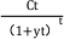+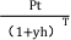

式中，P—债券买入时价格；

Pt—债券卖出时价格；

yh—持有期收益率；

C—债券每期付息金额；

T—债券期限 (期数) ；

t—现金流到达时间。

(5) 赎回收益率

可赎回债券是指允许发行人在债券到期以前按某一约定的价格赎回已发行

的债券。赎回收益率 (y) 可通过下面的公式用试错法获得：

P=xt(n)= 1 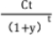+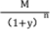

式中，P—发行价格；

n—直到第一个赎回日的年数；

M—赎回价格；

C—每年利息收益。

### 四．利率的风险结构与期限结构

(1) 利率的风险结构

不同发行人发行的相同期限和票面利率的债券，其市场价格会不相同，从而 计算出的债券收益率也不一样。反映在收益率上的这种区别，被称为利率的风险 结构。实践中，通常采用信用评级来确定不同债券的违约风险大小，不同信用等

级债券之间的收益率差则反映了不同违约风险的风险溢价，因此也被称为信用利 差。

(2) 利率的期限结构

相同的发行人发行的不同期限债券其收益率不一样，债券期限与收益率的关 系被称为利率的期限结构。收益率曲线包括上升收益率曲线、下降收益率曲线、 水平收益率曲线以及拱形收益率曲线。

# 证券投资基金

## 第一节 证券投资基金概述

### 一．证券投资基金概述

(1) 证券投资基金的概念

投资基金是指通过向投资者募集资金，形成独立基金财产，由专业投资机构 (基金管理人) 进行基金投资与管理，由基金托管人进行资产托管，由基金投资 人共享投资收益、共担投资风险的一种集合投资方式。

(2) 证券投资基金在不同国家和地区的称谓

 

| 国家/地区          | 称谓                           |
| ------------------ | ------------------------------ |
| 美国               | 共同基金                       |
| 英国和我国香港地区 | 单位信托基金                   |
| 欧洲一些国家       | “集合投资基金”或“集合投资计划” |
| 日本和我国台湾地区 | 证券投资信托基金               |

(3) 证券投资基金的特点

1.集合理财、专业管理

证券投资基金通过汇集众多投资者的资金，进行共同投资，表现出一种集合 理财的特点。证券投资基金由专业机构进行管理与运作，他们一般拥有专业的投 资研究人员和强大的信息网络，能够更好地对证券市场进行动态跟踪与深入分 析。

2.组合投资、分散风险

有关法律法规通常会要求基金进行组合投资，投资者购买基金就相当于用很 少的投资购买了一篮子股票，从而享受到组合投资、分散风险的好处。

3.利益共享、风险共担

证券投资基金实行利益共享、风险共担的原则，基金收益在扣除基金费用后 由基金投资者按其所持基金份额享受盈利和承担亏损。

4.严格监管、信息透明

为切实保护基金投资者的利益，增强投资者对基金投资的信心，各国 (地区) 的基金监管机构都对证券投资基金实行严格监管，并强制基金进行信息披露。

5.独立托管、保障安全

基金财产独立于基金管理人、基金托管人的固有财产。基金管理人负责基金 的投资操作，本身并不参与基金财产的保管。基金财产的保管由独立于基金管理 人的基金托管人负责。

(4) 证券投资基金与股票、债券的区别

 

|                    | 基金                                    | 股票                    | 债券                   |
| ------------------ | --------------------------------------- | ----------------------- | ---------------------- |
| 经济关系不同       | 信托关系                                | 所有权关系              | 债权债务关系           |
| 资金投向不同       | 间接投资工具 (有价证券等金融工具或产品) | 直接投资工具 (实业领域) | 直接投资工具(实业领域) |
| 收益与风险大小不同 | 风险适中、收益稳健                      | 高风险、高收益          | 低风险、低收益         |

### 二．证券投资基金的分类

(1) 按基金的组织形式划分

按基金的组织形式划分，可分为契约型基金和公司型基金。

1.契约型基金

契约型基金是依据基金合同设立的一类基金。在我国，契约型基金依据基金 管理人、基金托管人之间所签署的基金合同设立，基金投资者购买基金份额后成 为基金持有人，依法享受权利并承担义务。

2.公司型基金

公司型基金依据基金公司章程设立，是在法律上具有独立法人地位的股份投 资公司。基金投资者是公司的股东，凭其持有的股份依法享有投资收益。公司型 基金在组织形式上与股份有限公司类似，由股东选举董事会，由董事会选聘基金 管理公司，基金管理公司负责管理基金的投资业务。

3.契约型基金与公司型基金的区别

 

| 区别               | 契约型基金     | 公司型基金 |
| ------------------ | -------------- | ---------- |
| 资金的性质不同     | 信托财产       | 法人资本   |
| 投资者的地位不同   | 委托人、受益人 | 股东       |
| 基金的营运依据不同 | 基金合同       | 公司章程   |

(2) 按基金运作方式划分

按基金运作方式划分，可分为封闭式基金和开放式基金等类型。 1.封闭式基金

封闭式基金是指基金份额在存续期内固定不变，基金份额可以在依法设立的 证券交易场所交易，但基金份额持有人不得申请赎回的基金。封闭式基金在封闭 期内不能追加认购或赎回，投资者只能通过证券公司在二级市场上进行基金份额 的买卖。

2.开放式基金

开放式基金是指基金份额总额不固定，基金份额可以在基金合同约定的时间 和场所申购及赎回的基金。

3.封闭式基金与开放式基金的区别

 

| 区别                  | 封闭式基金                                                   | 开放式基金                                                   |
| --------------------- | ------------------------------------------------------------ | ------------------------------------------------------------ |
| 期限不同              | 有固定的存续期，通常在5年以 上，一般为10年或15年，经持有 人大会通过并经监管机构同意可以适当延长期限 | 没有固定期限，投资者可向基 金管理人申购、赎回基金份额        |
| 发行规模限 制不同     | 基金规模是固定的，在封闭期限 内未经法定程序认可不能增加发行  | 没有发行规模限制                                             |
| 基金份额交 易方式不同 | 在封闭期限内不能赎回，持有人 只能在证券交易场所交易          | 可以在首次发行结束一段时间 后，向基金管理人或基金销售 机构提出申购或赎回申请。多 数开放式基金不上市交易，交易在投资者与基金管理人或基 |

 

 

|                            |                                                              | 金销售机构之间进行                                           |
| -------------------------- | ------------------------------------------------------------ | ------------------------------------------------------------ |
| 价格形成方 式不同          | 买卖价格受市场供求关系的影 响，常出现溢价或折价现象，并 不必然反映单位基金份额的净资产值 | 申购赎回以每一基金份额净资 产值为基础，不受市场供求关 系影响 |
| 激励约束机制与投资策略不同 | 封闭式基金份额固定，即使基金 表现良好，也不能扩大运作规 模，如果基金表现不好，由于投 资者无法赎回投资，基金经理在 投资运作上面临的直接压力因 此相对较小。封闭式基金由于无 须考虑资金流进流出的影响，更 便于基金经理进行长期投资和 全额投资安排 | 如果开放式基金的业绩表现良 好，将会吸引新的投资，规模 将随之扩大；如果表现差，则 会面临投资者赎回的直接压 力，基金将被迫调整投资。因 此，与封闭式基金相比，开放 式基金给基金管理人提供了更 好的激励约束机制。开放式基 金在操作上常常会受到不可预 测的资金流进、流出的干扰， 特别是为应对投资者赎回的需 要，必须高度重视资产的流动 性，因此会预留一定比例的现 金，不会进行全额投资，这也 会在一定程度上对投资业绩带来不利影响 |

(3) 按基金的投资标的划分

按基金的投资标的划分，可分为股票基金、债券基金、混合型基金、货币市 场基金等。

1.股票基金

股票基金是指以股票为主要投资对象的证券投资基金。在我国，根据中国证 监会对基金类别的分类标准，80%以上的基金资产投资于股票的，为股票基金。

2.债券基金

债券基金是一种以债券为主要投资对象的证券投资基金。在我国，根据中国

证监会对基金类别的分类标准，80%以上的基金资产投资于债券的，为债券基金。 3.混合型基金

混合型基金是指同时投资于股票与债券的基金。一般根据资产配置的不同， 可以将混合型基金分为偏股型基金、偏债型基金、股债平衡型基金、灵活配置型 基金等。

4.货币市场基金

货币市场基金是仅以货币市场工具为投资对象的一种基金，其投资对象期限 较短，一般在 1 年以内，包括银行短期存款、国库券、公司短期债券、银行承兑 票据及商业票据等货币市场工具。

(4) 按基金的投资目标划分

按基金的投资目标划分，可分为成长型基金、收入型基金和平衡型基金。

1.成长型基金

成长型基金是基金中最常见的一种，它追求的是基金资产的长期增值。为了 达到这一目标，基金管理人通常将基金资产投资于信誉度较高、有长期成长前景 或长期盈余的所谓成长公司的股票。成长型基金又可分为稳健成长型基金和积极 成长型基金。

2.收入型基金

收入型基金主要投资于可带来现金收入的有价证券，以获取当期的最大收入 为目的。收入型基金资产成长的潜力较小，损失本金的风险也相对较低，一般可 分为固定收入型基金和股票收入型基金。固定收入型基金的主要投资对象是债券 和优先股，因而尽管收益率较高，但长期成长的潜力很小，而且当市场利率波动 时，基金净值容易受到影响。股票收入型基金的成长潜力比较大，但易受股市波 动的影响。

3.平衡型基金

平衡型基金将资产分别投资于两种特性的证券上，并在以取得收入为目的的 债券以及优先股和以资本增值为目的的普通股之间进行平衡。平衡型基金的主要 目的是从其投资组合的债券中得到适当的利息收益，与此同时又可以获得普通股 的升值收益。平衡型基金的特点是风险比较低，缺点是成长的潜力不大。

(5) 按基金的投资理念划分

按基金的投资理念划分，可分为主动型基金和被动型基金。

1.主动型基金

主动型基金是指通过积极的选股和择时，力图取得超越基准组合表现的基 金。

2.被动型基金

被动型基金通常被称为指数基金，是指以特定指数作为跟踪对象，力图复制 指数表现的一类基金。指数基金的优势是管理费、交易费较低，同时可以有效降 低非系统性风险。

(6) 特殊类型基金   1.交易所交易基金 (ETF)

(1) 交易所交易基金的概念

交易所交易基金 (ETF) 是一种在交易所上市交易的、基金份额可变的一种 基金运作方式。ETF 结合了封闭式基金与开放式基金的运作特点。基金份额可以 像封闭式基金一样在交易所二级市场进行买卖；也可以像开放式基金一样申购、 赎回。

(2) 交易所交易基金的特点

①ETF 最大的特点是实物申购、赎回机制，即它的申购是用一篮子股票换取 ETF 份额，赎回时是以基金份额换回一篮子股票而不是现金。

②ETF 有“最小申购、赎回份额”的规定，通常最小申购、赎回单位为 30 万份、50 万份或 100 万份，申购、赎回必须以最小申购、赎回单位的整数倍进 行，一般只有机构投资者才有实力参与一级市场的实物申购与赎回交易。

③ETF 实行一级市场和二级市场并存的交易制度。在一级市场，机构投资者 可以在交易时间内以 ETF 指定的一篮子股票申购 ETF 份额或以 ETF 份额赎回一篮 子股票。在二级市场，ETF 与普通股票一样在证券交易所挂牌交易，基金买入申 报数量为 100 份或其整数倍，不足 100 份的基金可以卖出，机构投资者和中小投 资者都可以按市场价格进行 ETF 份额交易。

2.上市开放式基金 (LOF)

(1) 上市开放式基金的概念

上市开放式基金 (LOF) 是一种既可以同时在场外市场进行基金份额申购、

赎回，又可以在交易所进行基金份额交易和基金份额申购或赎回，并通过份额转 托管机制将场外市场与场内市场有机地联系在一起的一种开放式基金。

(2) 上市开放式基金的特点

①与 ETF 不同，LOF 不一定采用指数基金模式，也可以是主动管理型基金；

②申购和赎回均以现金进行，对申购和赎回没有规模上的限制，可以在交易 所申购、赎回，也可以在代销网点进行；

③LOF 所具有的可以在场内外申购、赎回以及场内外转托管的制度安排，使 LOF 不会出现封闭式基金大幅度折价交易的现象。

3.避险策略基金

避险策略基金是指通过一定的避险投资策略进行运作，同时引入相关保障机

制，以便在避险策略周期到期时，力求避免基金份额持有人投资本金出现亏损的 公开募集证券投资基金。避险策略基金在极端情况下仍然存在本金损失的风险。

4.QDII 基金

QDII 基金是指在一国境内设立，经该国有关部门批准从事境外证券市场的 股票、债券等有价证券投资的基金。境外证券市场和国内证券市场在走势上常常 存在较大的差异，因此配置一定比例的 QDII 基金可以分散风险，在一定程度上 规避单一市场的系统性风险。

5.分级基金

分级基金又称为结构型基金、可分离交易基金，是指在一只基金内部通过结 构化的设计或安排，将普通基金份额拆分为具有不同预期收益与风险的两类(级) 或多类 (级) 份额并可分离上市交易的一种基金产品。

6.基金中基金 (FOF)

基金中基金是以其他基金为投资对象的基金。在中国，根据中国证监会对基 金类别的分类标准，80%以上的基金资产投资于其他基金份额的，为基金中基金。

7.伞形基金

伞形基金又被称为系列基金，是指多个基金共用一个基金合同，子基金独立 运作并直接可以相互转换的一种基金结构形式。目前，我国暂无伞形基金。

8.养老目标基金

养老目标基金是指以追求养老资产的长期稳健增值为目的，鼓励投资人长期

持有，采用成熟的资产配置策略，合理控制投资组合波动风险的公开募集证券投 资基金。养老目标基金应当采用基金中基金形式或中国证监会认可的其他形式运 作。

## 第二节 证券投资基金的运作与市场参与主体

### 一．证券投资基金的运作

(1) 基金运作概述

基金的运作包括基金的募集、基金投资管理、基金资产托管、基金份额的登 记与交易、基金资产的估值与会计核算、基金的信息披露以及其他相关环节。在 基金运作中，基金管理人居主导与核心位置。

从基金管理人的角度看，基金运作可以分为基金的市场营销、投资管理与后 台管理三大部分。

(2) 证券投资基金的运作关系

基金投资者、基金管理人与基金托管人是基金的主要当事人，基金市场上的 各类中介服务机构通过自己的专业服务参与基金市场，监管机构则对基金市场上 的各类参与主体实施全面监管。

### 二．基金市场参与主体

在基金市场上存在许多不同的参与主体，依据所承担的责任与作用的不同， 可以将基金市场的参与主体分为基金当事人、基金市场服务机构、基金的监管机 构和自律组织三大类。

(1) 基金当事人

我国证券投资基金依据基金合同设立，基金份额持有人，基金管理人与基金 托管人是基金合同的当事人，简称基金当事人。

1.基金份额持有人

基金份额持有人即基金投资者，是基金的出资人、基金资产的所有者和基金 投资收益的受益人，基金份额持有人是基金一切活动的中心。

2.基金管理人

基金管理人是基金的募集者和管理者，在整个基金的运作中起着核心的作 用。它不仅负责基金的投资管理，而且还承担着产品设计、基金营销、基金注册 登记、基金估值、会计核算等多方面的职责。

在我国，基金管理人只能由依法设立的基金管理公司承担。

3.基金托管人

《证券投资基金法》规定，基金资产必须由独立于基金管理人的基金托管人 保管，从而使得基金托管人成为基金的当事人之一。基金托管人的职责主要体现 在资产保管、资金清算、会计复核以及对投资运作的监督等方面。在我国，基金 托管人只能由依法设立并取得基金托管资格的商业银行或其他金融机构承担。

(2) 基金市场服务机构

基金管理人、基金托管人既是基金的当事人，又是基金的主要服务机构。此

外，基金市场服务机构还包括基金销售机构、基金销售支付机构、基金份额登记 机构、基金估值核算机构、基金投资顾问机构、基金评价机构、律师事务所、会

计师事务所、信息技术系统服务机构等。

 

| 基金服务机构             | 概念                                                         |
| ------------------------ | ------------------------------------------------------------ |
| 基金销售机构             | 基金销售机构是受基金管理公司委托从事基金代理销售业务的机构   |
| 基金销售支付机构         | 基金销售支付是指基金销售活动中基金销售机 构、基金投资人之间的货币资金转移基金销售支 付机构活动。基金销售支付机构是指从事基金销售支付活动的机构 |
| 基金份额登记机构         | 基金份额登记机构是指负责基金份额登记、存管、清算和交收业务的机构 |
| 基金估值核算机构         | 基金估值核算机构是指从事基金估值、会计核算以及相关信息披露等活动的机构 |
| 基金投资顾问机构         | 基金投资顾问机构是向基金投资者提供基金投资咨询、建议服务的机构 |
| 基金评价机构             | 基金评价机构是指从事对基金管理人、基金绩效进行评价、排名、评级、评奖活动的机构 |
| 基金信息技术系统服务机构 | 基金信息技术系统服务机构是指向基金管理人、 基金托管人和基金服务机构提供基金业务核心应用软件开发、信息系统运营维护、信息系统安全 |

 

 

|              | 保障和基金交易电子商务平台等业务活动的机构                   |
| ------------ | ------------------------------------------------------------ |
| 其他服务机构 | 律师事务所和会计师事务所作为专业、独立的中介服务机构，为基金提供法律和会计服务 |

(3) 基金的监管机构和自律组织

1.基金的监管机构

在我国，国务院证券监督管理机构，即中国证监会依法对证券投资基金活动 实施监督管理。

2.基金的自律组织

基金的自律组织主要有基金行业自律组织和证券交易所。

基金行业自律组织是由基金管理人、基金托管人或基金销售机构等服务机构 成立的行业自律组织。中国证券投资基金业协会是我国基金行业的自律性组织。

## 第三节 基金的募集、申购、赎回与交易

### 一．基金的募集与认购

(1) 基金的募集

1.基金募集的概念

基金的募集是指基金管理公司根据有关规定向中国证监会提交募集申请文 件、发售基金份额、募集基金的行为。

2.基金募集的条件

申请募集基金，拟募集的基金应当具备下列条件：

(1) 有明确、合法的投资方向；

(2) 有明确的基金运作方式；

(3) 符合中国证监会关于基金品种的规定；

(4) 基金合同、招募说明书等法律文件草案符合法律、行政法规和中国证 监会的规定；

(5) 基金名称表明基金的类别和投资特征，不存在损害国家利益、社会公 共利益，欺诈、误导投资者，或者其他侵犯他人合法权益的内容；

(6) 招募说明书真实、准确、完整地披露了投资者作出投资决策所需的重 要信息，不存在虚假记载、误导性陈述或者重大遗漏，语言简明、易懂、实用， 符合投资者的理解能力；

(7) 有符合基金特征的投资者适当性管理制度，有明确的投资者定位、识 别和评估等落实投资者适当性安排的方法，有清晰的风险警示内容等。

3.基金募集的步骤

基金的募集一般要经过申请、注册、发售、基金合同生效四个步骤。

(1) 基金募集申请

基金管理人进行基金的募集，必须根据《证券投资基金法》的有关规定，向 中国证监会提交相关文件，包括：募集基金的申请报告、基金合同草案、基金托 管协议草案、招募说明书草案、法律意见书等。

(2) 基金注册

(3) 基金份额的发售

基金经注册后，方可发售基金份额。基金管理人应当自收到核准文件之日 6 个月内进行基金份额的发售。基金的募集期限自基金份额发售日开始计算，募集 期限不得超过 3 个月。

(4) 基金合同生效

基金募集期限届满，基金募集份额总额不少于 2 亿份，基金募集金额不少于 2 亿元人民币；基金份额持有人的人数不少于 200 人，基金管理人应当自募集期 限届满之日起 10 日内聘请法定验资机构验资，向中国证监会提交验资报告，办 理基金备案手续。基金备案自中国证监会书面确认之日起，基金合同生效。基金 管理人应当在收到中国证监会确认文件的次日发布基金合同生效公告。

基金募集期限届满，基金不满足有关募集要求的，基金募集失败，基金管理 人应当以固有财产承担因募集行为而产生的债务和费用，并在基金募集期限届满 后 30 日内返还投资者已缴纳的款项，并加计银行同期存款利息。

(2) 开放式基金的认购

在基金募集期内购买基金份额的行为通常被称为基金的认购。

1.开放式基金的认购步骤

(1) 开户；

(2) 认购；

(3) 确认。      2.开放式基金的认购方式

开放式基金的认购采取金额认购的方式，即投资者在办理认购时，认购申请 上不是直接填写需要认购多少份基金份额，而是填写需要认购多少金额的基金份 额，基金注册登记人在基金认购结束后，再按基金份额的认购价格，将申请认购 基金的金额换算成投资人应得的基金份额。

3.开放式基金的认购费率和收费模式

(1) 认购费率

基金管理人会针对不同的基金类型、不同的认购金额设置不同的认购费率。 我国股票型基金的认购费率大多在 1%-1.5%，债券型基金的认购费率通常在 1% 以下，货币市场基金一般不收取认购费。

(2) 收费模式

 

| 收费模式 | 概念                                                         |
| -------- | ------------------------------------------------------------ |
| 前端收费 | 前端收费是指在认购基金份额时就支付认购费用的付费模式         |
| 后端收费 | 后端收费是指在认购基金份额时不收费，在赎回基金份额时才支付认购费用的收费模式 |

4.开放式基金认购份额的计算

根据规定，基金认购费用将统一按净认购金额为基础收取，相应的基金认购 费用与认购份额的计算公式为：

净认购金额=认购金额/ (1+认购费率)

认购份额= (净认购金额+认购利息) /基金份额初始面值

(3) 开放式基金的申购、赎回 1.申购、赎回的概念

(1) 申购

投资者在开放式基金合同生效后，申请购买基金份额的行为通常被称为基金 的申购。

(2) 赎回

开放式基金的赎回是指基金份额持有人要求基金管理人购回其所持有的开 放式基金份额的行为。

2.认购与申购的区别

认购指在基金设立募集期内，投资者申请购买基金份额的行为。

申购指在基金合同生效后，投资者申请购买基金份额的行为。

基金认购与基金申购略有不同。在认购期内购买基金，基金认购价格通常为 1 元/份，在认购期内产生的利息在基金合同生效时， 自动转换为投资者的基金 份额，基金份额在基金合同生效时确认，并且在建仓期后才能赎回。而申购基金 时，基金申购价格未知，申购份额通常在T+2 日内确认，确认后的下一个工作日 就可以赎回基金份额。

3.申购、赎回的原则

(1) 对固定净值型货币基金而言，基金份额价格固定为 1 元人民币，因此 投资者在申购、赎回货币基金时，按固定价格进行申购、赎回。

(2) 对一般开放式基金 (股票基金、债券基金、混合基金等) 而言，在申 购、赎回时则遵循“未知价”交易原则，投资者在申购、赎回一般开放式基金份 额时并不能即时获知成交价格。

(3)  “金额申购、份额赎回”原则，即申购以金额申请，赎回以份额申请。 这是适应未知价下进行申购、赎回最方便、安全的方式。货币基金也遵循一样的 原则。

### 二．开放式基金份额的转换、非交易过户、转托管

(1) 开放式基金份额的转换

开放式基金份额转换是指投资者将其所持有的某一只基金份额转换为另一 只基金份额的行为，基金转换业务所涉及的基金，必须是由同一基金管理人管理 的、在同一注册登记人处注册登记的基金。

(2) 开放式基金的非交易过户

开放式基金非交易过户是指不采用申购、赎回等交易方式，将一定数量的基 金份额按照一定规则从某一投资者基金账户转移到另一投资者基金账户的行为， 主要包括继承、捐赠、司法强制执行和经注册登记机构认可的其他情况下的非交 易过户。

(3) 开放式基金份额的转托管

开放式基金份额转托管是指基金份额持有人申请将其托管在某一交易账户 中的全部或部分基金份额转出并转入另一交易账户的行为。投资人可通过办理转 托管业务，实现其变更办理基金业务销售渠道 (或网点) 的需要。

## 第四节 基金的估值、费用与利润分配

### 一．基金资产估值

(1) 基金资产估值的概念

基金资产估值是指通过对基金所拥有的全部资产及所有负债按一定的原则 和方法进行估算，进而确定基金资产公允价值的过程。

基金资产总值是指基金全部资产的价值总和，从基金资产总值中扣除所有负 债即是基金资产净值。基金资产净值除以基金当前的总份额，就是基金的份额净 值。用公式表示为：

基金资产净值=基金资产总值-基金负债

基金份额净值=基金资产净值÷基金总份额

基金份额净值是计算投资者申购基金份额、赎回资金金额的基础，也是评价 基金投资业绩的基础指标之一。

(2) 基金资产估值需考虑的因素

1.估值频率

基金一般都按照固定的时间间隔对基金资产进行估值，通常相关法规会规定 一个最小的估值频率。

2.交易价格的公允性

当基金投资标的为交易活跃的证券时，对其资产进行估值较为容易。在这种 情况下，直接采用市场交易价格就可以对标的资产估值。

当基金投资交易不活跃的证券时，基金持有的证券要么没有交易价格，要么 交易价格不可信，因此资产估值问题复杂得多。

3.估值方法的一致性及公开性

估值方法的一致性是指基金在进行资产估值时均应采用同样的估值方法，遵 守同样的估值规则。

估值方法的公开性是指基金采用的估值方法需要在法定募集文件中公开披 露。若基金变更了估值方法，必须及时进行披露。

### 二．基金的费用

(1) 基金费用的种类

在基金运作过程中涉及的费用可以分为两大类：

1.基金销售过程中发生的费用

基金销售过程中发生的费用由基金投资者承担。

(1) 主要包括申购费 (认购费) 、赎回费及基金转换费等。

(2) 不参与基金的会计核算。

2.基金管理过程中发生的费用

基金管理过程中发生的费用由基金资产承担。

(1) 主要包括基金管理费、基金托管费、持有人大会费用、信息披露费等。

(2) 需要直接从基金资产中列支。

(2) 基金运作费

基金运作费是指为保证基金正常运作而发生的可以由基金承担的费用，包括 审计费、律师费、上市年费、信息披露费、分红手续费、持有人大会费、开户费、 银行汇划手续费等。

(3) 基金交易费

基金交易费是指基金在进行证券买卖交易时所发生的相关交易费用。我国基 金的交易费主要包括：

(1) 佣金，由证券公司按成交金额的一定比例向基金收取。

(2) 印花税、过户费、经手费、证管费等，由登记公司或交易所按有关规 定收取。

### 三．基金利润与利润分配

(1) 基金利润

基金利润是指基金在一定会计期间的经营成果。基金利润主要来自基金收入 减去基金费用后的净额、公允价值变动损益等。

1.基金收入

基金收入主要包括利息收入、投资收益以及其他收入。

 

| 基金收入来源 | 内容                                                         |
| ------------ | ------------------------------------------------------------ |
| 利息收入     | (1) 定义利息收入是指基金经营活动中因债券投资、资产支持证券投资、 银行存款、结算备付金、存出保证金、按买入返售协议融出资金等而实现的利息收入 |

 

 

|          | (2) 类别利息收入具体包括债券利息收入、资产支持证券利息收入、存款利息收入、买入返售金融资产收入等 |
| -------- | ------------------------------------------------------------ |
| 投资收益 | (1) 定义投资收益是指基金经营活动中因买卖股票、债券、资产支持证 券、基金等实现的差价收益(2) 类别投资收益具体可分为股票投资收益、债券投资收益、资产支持证券投资收益、基金投资收益、衍生工具收益、股利收益等 |
| 其他收入 | (1) 定义其他收入是指除上述收入以外的其他各项收入(2) 类别其他收入包括赎回费扣除基本手续费后的余额、手续费返还、 ETF替代损益以及基金管理人等机构为弥补基金财产损失而支 付给基金的赔偿款项等。这些收入项目一般根据发生的实际金额确认，占比较少 |

2.公允价值变动损益

公允价值变动损益是指基金持有的采用公允价值模式计量的交易性金融资 产、交易性金融负债等公允价值变动形成的应计入当期损益的利得或损失，并于 估值日对基金资产按公允价值估值时予以确认。

(2) 基金利润分配

1.封闭式基金的利润分配

根据有关规定，封闭式基金的收益分配每年不得少于一次，封闭式基金年度 收益分配比例不得低于基金年度可供分配利润的90%。基金分配后，基金份额净 值不得低于面值。封闭式基金只能采用现金方式分红。

2.一般开放式基金的利润分配

我国一般开放式基金按规定需在基金合同和招募说明书中约定每年基金收 益分配的最多次数和每次基金收益分配的最低比例，同时要求基金利润分配后基 金份额净值不得低于面值。

一般开放式基金的分红方式有两种：

(1) 现金分红

根据基金利润情况，基金管理人以投资者持有基金份额数量的多少，将利润 分配给投资者。这是基金分配最普遍的形式。

(2) 红利再投资

红利再投资是指将投资人应分配的净利润折算为等值的新的基金份额记入 投资人基金账户的分红方式。

根据有关规定，一般开放式基金利润分配默认的方式应当采用现金分红。开 放式基金的基金份额持有人可以事先选择分红再投资。基金份额持有人事先未作 出选择的，基金管理人应当支付现金。

3.货币市场基金的利润分配

《货币市场基金监督管理办法》中规定：“对于每日按照面值进行报价的货 币市场基金，可以在基金合同中将收益分配的方式约定为红利再投资，并应当每 日进行收益分配。 ”

货币市场基金在每日进行利润分配时，当日申购的基金份额自下一个工作日 起享有基金的分配权益，当日赎回的基金份额自下一个工作日起不享有基金的分 配权益。

### 四．基金的税收

(1) 基金自身投资活动产生的税收

 

| 税收项目 | 内容                                                         |
| -------- | ------------------------------------------------------------ |
| 增值税   | 基金运营过程中发生的增值税应税行为，以管理人为增值税纳税 人。证券投资基金管理人运用基金买卖股票、债券转让收入免征增值税 |
| 印花税   | 基金卖出股票按照0.1%的税率征收交易印花税，买入交易不征收印花税，即对印花税实行单向征收 |
| 所得税   | (1) 对证券投资基金从证券市场中取得的收入，包括买卖股票、 债券的差价收入，股权的股息、红利收入，债券的利息收入及其 他收入，暂不征收企业所得税。(2) 对基金取得的股利收入、债券的利息收入、储蓄存款利息 |

 

 

|      | 收入，由上市公司、发行债券的企业和银行在向基金支付上述收入时代扣代缴20%的个人所得税 |
| ---- | ------------------------------------------------------------ |
|      |                                                              |

(2) 基金投资者 (包括个人和机构) 投资基金的税收 1.机构投资者投资基金的税收

(1) 机构投资者买卖基金份额属于金融商品转让，应按照卖出价扣除买入 价后的余额为销售额计征增值税。但机构投资者购入基金、信托、理财产品等各 类资产管理产品持有至到期，不属于金融商品转让。

(2) 机构投资者买卖基金份额暂免征收印花税。

(3) 机构投资者在境内买卖基金份额获得的差价收入，应并入企业的应纳 税所得额，征收企业所得税。机构投资者从基金分配中获得的收入，暂不征收所 得税。

2.个人投资者投资基金的税收

(1) 个人投资者买卖基金份额免征增值税。

(2) 个人投资者买卖基金份额暂免征收印花税。

(3) 个人投资者从基金分配中取得的收入，暂不征收个人所得税。

(4) 个人投资者申购和赎回基金份额取得的差价收入，暂不征收个人所得税。

 

## 第五节 基金的管理

### 一．基金的投资管理

基金投资管理是指基金管理人按照基金合同的约定，在规定的投资范围内， 按照既定的投资策略，实现基金的投资目标的过程。基金投资管理在基金运作中 处于核心作用。

### 二．基金投资风险管理

1.外部风险

按照是否可以通过分散投资来降低风险的标准，可以将外部风险划分为系统 性风险和非系统性风险。在投资运作中，基金可以通过在一定范围内分散投资来 降低非系统性风险，但系统性风险不能通过分散投资来降低。

2.内部风险

内部风险主要指来自基金管理人方面的风险，是指基金管理人在基金管理过

程中产生的风险。

基金管理人的管理水平、管理手段和管理技术都将影响基金的收益水平。

## 第六节 证券投资基金的监管与信息披露

### 一．基金监管

(1) 基金监管的含义与作用

基金监管是指监管部门运用法律的、经济的以及必要的行政手段，对基金市 场参与者行为进行的监督与管理。

基金监管对于维护证券市场的良好秩序、提高证券市场效率、保护基金份额 持有人利益均具有重大意义。

(2) 我国基金监管的目标

1.保护投资人及相关当事人的合法权益；

2.规范基金活动，保证市场的公平、效率和透明，降低系统风险；

3.促进证券投资基金和资本市场的健康发展。

(3) 基金监管机构和自律组织

1.中国证监会对基金市场的监管

中国证监会是我国基金市场的监管主体。中国证监会基金监管主要职责包 括：

(1) 制定有关证券投资基金活动监督管理的规章、规则，并行使审批、核 准或者注册权；

(2) 办理基金备案；

(3) 对基金管理人、基金托管人及其他从事证券投资基金活动的机构进行 监督管理，对违法行为进行查处；

(4) 制定基金从业人员的资格标准和行为准则，并监督实施；

(5) 监督检查基金信息的披露情况；

(6) 指导和监督中国证券投资基金业协会的活动等。

根据《证券投资基金法》的规定，中国证监会可以通过检查、调查取证、限 制交易、行政处罚等多种措施对基金市场加强监管。

2.协会的行业自律管理

中国证券投资基金业协会是我国证券投资基金行业的自律性组织，按照证券

投资基金法、协会章程、会员管理办法的有关规定，对会员及其从业人员实施自 律管理，制定和实施行业自律规则、行业执业标准和业务规范，监督、检查会员 及其从业人员的执业行为。

3.证券交易所的自律管理

证券交易所作为自律管理的法人，依法对基金上市及相关信息披露等活动进 行管理，对基金在交易所的投资交易实行监控。

(4) 基金监管内容

1.对公募基金募集的监管

公开募集基金应当经中国证监会注册。未经注册，不得公开或者变相公开募 集基金。基金募集期满，达到设立标准的，应向中国证监会办理基金备案手续。

2.对公募基金销售活动的监管

(1) 基金销售适当性管理制度的内容

公募基金销售机构应当建立基金销售适当性管理制度，至少包括下列内容：

①对基金管理人进行审慎调查的方式与方法；

②对基金产品的风险登记进行设置、对基金产品进行风险评价的方式与方 法；

③对基金投资者风险承受能力进行调查与评价的方式与方法；

④对基金产品和基金投资人进行匹配的方法。

(2) 基金宣传推介资料的相关规定

①基金管理人的基金宣传推介资料，应当事先经基金管理人负责基金销售业 务的高级管理人员和督察长检查，出具合规意见书，并自向公众分发或者发布之 日起 5 个工作日内报主要经营活动所在地中国证监会派出机构备案。

②其他基金销售机构的基金宣传推介资料，应当事先经基金销售机构负责基 金销售业务和合规的高级管理人员检查，出具合规意见书，并自向公众分发或者 发布之日起 5 个工作日内报工商注册登记所在地中国证监会派出机构备案。

3.对公募基金投资与交易行为的监管

(1) 基金的投资范围

我国证券投资基金法规定，基金财产应当用于上市交易的股票、债券以及中 国证监会规定的其他证券品种。具体而言，目前我国的基金主要可投资于国内依

法公开发行上市的股票、非公开发行股票、国债、企业债券和金融债券、公司债 券、货币市场工具、资产支持证券等。

(2) 基金财产的禁止用途

按照《证券投资基金法》和其他相关法规的规定，基金财产不得用于下列投 资或活动：

①承销证券；

②向他人贷款或者提供担保；

③从事承担无限责任的投资；

④买卖其他基金份额，但是国务院另有规定的除外；

⑤向其基金管理人、基金托管人出资；

⑥从事内幕交易、操纵证券交易价格及其他不正当的证券交易活动；

⑦依照法律、行政法规有关规定，由国务院证券监督管理机构规定禁止的其 他活动。

(3) 基金管理人的禁止行为

基金管理人运用基金财产进行证券投资，不得有下列情形：

①一只基金持有一家公司发行的证券，其市值超过基金资产净值的 10%；

②同一基金管理人管理的全部基金持有一家公司发行的证券，其市值超过该 证券的 10%；

③基金财产参与股票发行申购，单只基金所申报的金额超过该基金的总资

产，单只基金所申报的股票数量超过拟发行股票公司本次发行股票的总量；

④一只基金持有其他基金 (不含货币市场基金) ，其市值超过基金资产净值 的 10%，但基金中基金除外；

⑤基金中基金持有其他单只基金，其市值超过基金资产净值的20%，或者投 资其他基金中基金；

⑥基金总资产超过基金净资产的 140%；

⑦违反基金合同关于投资范围、投资策略和投资比例等约定；

⑧中国证监会规定禁止的其他情形。

完全按照有关指数的构成比例进行证券投资的基金品种可以不受前款第① 项、第②项规定的比例限制。

4.对公募基金信息披露的监管

基金管理人、基金托管人和其他基金信息披露义务人应当依法披露基金信

息，并保证所披露信息的真实性、准确性和完整性。

### 二．基金信息披露

基金信息披露大致可分为基金募集信息披露、运作信息披露和临时信息披露 三大类。

1.基金募集信息披露

基金募集信息披露可以分为首次募集信息披露和存续期募集信息披露。首次 募集信息披露主要包括基金份额发售前至基金合同生效期间进行的信息披露。在 基金份额发售前，基金管理人需要编制并披露基金合同、基金招募说明书、基金 托管协议、基金份额发售公告等文件。基金管理人还应当在指定报刊和网站上编 制并披露基金合同生效公告。

2.基金运作信息披露

基金运作信息披露主要指在基金合同生效后至基金合同终止前，基金信息披 露义务人依法定期披露基金的上市交易、投资运作及经营业绩等信息。

基金运作信息披露文件包括基金份额上市交易公告书 (封闭式基金) 、基金 净值公告、基金年度报告、半年度报告、季度报告。其中，基金年度报告、半年 度报告和季度报告被统称为基金定期报告。

## 第七节 非公开募集证券投资基金

### 一．非公开募集证券投资基金的合格投资者

在我国，非公开募集证券投资基金 (简称私募基金) 合格投资者累计不得超 过 200 人。合格投资者是指具备相应风险识别和承担能力，投资单只私募基金的 金额不低于 100 万元人民币且符合下列标准的单位和个人：

(1) 净资产不低于 1000 万元的单位；

(2) 金融资产不低于 300 万元或者最近 3 年个人年均收入不低于 50 万元 的个人。

### 二．私募基金的募集

私募基金募集应当履行下列程序：

(1) 特定对象确定；

(2) 投资者适当性匹配；

(3) 基金风险揭示；

(4) 合格投资者确认；

(5) 投资冷静期；

(6) 回访确认。

# 金融衍生工具

## 第一节 金融衍生工具概述

### 一．金融衍生工具的概念和特征

(1) 金融衍生工具的概念

金融衍生工具又被称为金融衍生产品，是与基础金融产品相对应的一个概

念，指建立在基础产品或基础变量之上，其价格取决于基础金融产品价格 (或数 值) 变动的派生金融产品。

(2) 金融衍生工具的基本特征

1.跨期性

金融衍生工具是交易双方通过对利率、汇率、股价等因素变动趋势的预测， 约定在未来某一时间按照一定条件进行交易或选择是否交易的合约。

2.杠杆性

金融衍生工具交易一般只需要支付少量的保证金或权利金就可签订远期大 额合约或互换不同的金融工具。

3.联动性

联动性是指金融衍生工具的价值与基础产品或基础变量紧密联系、规则变 动。

4.不确定性或高风险性

金融衍生工具的交易后果取决于交易者对基础工具(变量) 未来价格(数值) 的预测和判断的准确程度。基础工具价格的变幻莫测决定了金融衍生工具交易盈 亏的不稳定性，这是金融衍生工具高风险性的重要诱因。

### 二．金融衍生工具的分类

(1) 按产品形态分类

1.独立衍生工具

2.嵌入式衍生工具

嵌入式衍生工具是指嵌入非衍生合同 (即主合同) 中，使混合工具的全部或 部分现金流量随特定利率、金融工具价格、商品价格、汇率、价格指数、费率指 数、信用等级、信用指数或其他类似变量的变动而变动的衍生工具。嵌入式衍生 工具与主合同构成混合工具，如可转换公司债券等。

(2) 按照金融衍生工具自身交易的方式及特点分类

 

| 金融衍生工具       | 内容                                                         |
| ------------------ | ------------------------------------------------------------ |
| 金融远期合约       | (1) 概念：交易双方在场外市场上通过协商，按约定 价格 (被称为远期价格) 在约定的未来日期 (交割日) 买卖某种标的金融资产 (或金融变量) 的合约(2) 分类：远期利率协议、远期外汇合约、远期股票 合约等 |
| 金融期货           | (1) 概念：交易双方在集中的交易场所以公开竞价方 式进行的标准化金融期货合约的交易(2) 分类：货币期货、利率期货、股票指数期货和股 票期货 |
| 金融期权           | (1) 概念：合约买方向卖方支付一定费用 (被称为期 权费或期权价格) ，在约定日期内 (或约定日期) 享有 按事先确定的价格向合约卖方买卖某种金融工具的权 利的契约(2) 分类：现货期权和期货期权 |
| 金融互换           | (1) 概念：两个或两个以上的当事人按共同商定的条 件，在约定的时间内定期交换现金流的金融交易(2) 分类：货币互换、利率互换、股权互换、信用违 约互换等 |
| 结构化金融衍生工具 | 概念：通过上述四种金融衍生工具相互结合或者与基础 金融工具相结合，开发设计出更多具有复杂特性的金融衍生产品 |

(3) 按照基础工具种类分类

 

| 金融衍生工具         | 内容                                                         |
| -------------------- | ------------------------------------------------------------ |
| 股权类产品的衍生工具 | (1) 概念：以股票或股票指数为基础工具的金融衍生 工具(2) 种类：股票期货、股票期权、股票指数期货、股 票指数期权以及上述合约的混合交易合约 |
| 货币衍生工具         | (1) 概念：以各种货币作为基础工具的金融衍生工具(2) 种类：远期外汇合约、货币期货、货币期权、货 币互换以及上述合约的混合交易合约 |
| 利率衍生工具         | (1) 概念：以利率或利率的载体为基础工具的金融衍 生工具(2) 种类：远期利率协议、利率期货、利率期权、利 率互换以及上述合约的混合交易合约 |
| 信用衍生工具         | (1) 概念：以基础产品所蕴含的信用风险或违约风险 为基础变量的金融衍生工具(2) 分类：信用互换、信用联结票据以及信用风险缓 释合约、信用风险缓释凭证等信用风险缓释工具(3) 功能：用于转移或防范信用风险，是20世纪90年 代以来发展最为迅速的一类衍生产品 |
| 其他衍生工具         | 概述：除以上四类金融衍生工具之外，还有相当数量金 融衍生工具是在非金融变量的基础上开发的，例如用于 管理气温变化风险的天气期货、管理政治风险的政治期货、管理巨灾风险的巨灾衍生产品等 |

(4) 按照交易场所分类

1.交易所交易的衍生工具

交易所交易的衍生工具是指在有组织的交易所上市交易的衍生工具，例如在 股票交易所交易的股票期权产品，在期货交易所和专门的期权交易所交易的各类 期货合约、期权合约等。

2.场外交易市场 (简称 OTC) 交易的衍生工具

场外交易市场交易的衍生工具是指通过各种通讯方式，不通过集中的交易

所，实行分散的、一对一交易的衍生工具，例如金融机构之间、金融机构与大规 模交易者之间进行的各类互换交易和信用衍生产品交易。

## 第二节 金融远期、期货与互换

### 一．金融远期合约

(1) 概念

金融远期合约是最基础的金融衍生产品，是指交易双方在场外市场上通过协

商，按约定价格 (被称为“远期价格”) 在约定的未来日期 (交割日) 买卖某种 标的金融资产 (或金融变量) 的合约。

(2) 分类

根据基础资产划分，常见的金融远期合约包括四大类：

(1) 股权类资产的远期合约

股权类资产的远期合约包括单个股票的远期合约、一篮子股票的远期合约和 股票价格指数的远期合约。

(2) 债权类资产的远期合约

债权类资产的远期合约包括定期存款单、短期债券、长期债券、商业票据等 固定收益证券的远期合约。

(3) 远期利率协议

交易双方约定在未来某一 日交换协议期间内在一定名义本金基础上分别以 合同利率和参考利率计算的利息的金融合约。

(4) 远期汇率协议

按照约定的汇率，交易双方在约定的未来日期买卖约定数量的某种外币的远 期协议。

### 二．金融期货合约

(1) 概念

金融期货是期货交易的一种。期货交易是指交易双方在集中的交易所市场以 公开竞价方式所进行的标准化期货合约的交易。

期货合约是由交易双方订立的、约定在未来某日期按成交时约定的价格交割 一定数量的某种商品的标准化协议。

金融期货合约的基础工具是各种金融工具 (或金融变量) ，如外汇、债券、

股票、股价指数等。

换言之，金融期货是以金融工具 (或金融变量) 为基础工具的期货交易。

(2) 金融期货交易与普通远期交易的区别

 

| 区别                                      | 金融期货交易                                                 | 普通远期交易                        |
| ----------------------------------------- | ------------------------------------------------------------ | ----------------------------------- |
| 交易场所和交易组织形式不同                | 金融期货必须在有组织的交易所进行集中交易                     | 远期交易在场外市场进行双边交易      |
| 交易的监管程度不同                        | 金融期货交易至少要受 到一家以上的监管机构 监管，交易品种、交易者行为均须符合监管要求 | 远期交易较少受到监管                |
| 标准化程度不同                            | 金融期货交易是标准化交易                                     | 远期交易的内容可协商确定            |
| 保证金制度和每日结算 制度导致违约风险不同 | 金融期货交易实行保证 金制度和每日结算制度， 交易者均以交易所 (或期 货清算公司) 为交易对 手，基本不用担心交易违约 | 远期交易存在一定的交 易对手违约风险 |

(3) 金融期货交易与金融现货交易的区别

 

| 区别               | 金融期货交易                                    | 金融现货交易                                                |
| ------------------ | ----------------------------------------------- | ----------------------------------------------------------- |
| 交易对象不同       | 金融期货合约                                    | 某一具体形态的金融工具                                      |
| 交易目的不同       | 风险管理                                        | 筹资或投资                                                  |
| 交易价格的含义不同 | 对金融现货未来价格的预期                        | 实时的成交价，代表某一 时点上供求双方均能接受的市场均衡价格 |
| 交易方式不同       | 不需要在成交时拥有或借入 全部资金或基础金融工具 | 一般要求在成交后的几个 交易日内完成资金与金融工具的全额结算 |
| 结算方式不同       | 极少数的合约到期进行交割                        | 以基础金融工具与货币的                                      |

 

 

|      | 交收，绝大多数的期货合约通过做相反交易实现对冲平仓 | 转手而结束交易 |
| ---- | -------------------------------------------------- | -------------- |
|      |                                                    |                |

(4) 金融期货的种类

1.外汇期货

外汇期货又被称为货币期货，是以外汇为基础工具的期货合约，是金融期货 中最先产生的品种，主要用于规避外汇风险。

2.利率期货

利率期货是继外汇期货之后产生的又一个金融期货类别，其基础资产是一定 数量的与利率相关的某种金融工具，主要是各类固定收益金融工具。利率期货主 要是为了规避利率风险而产生的。

3.股权类期货

(1) 股票价格指数期货

股票价格指数期货是以股票价格指数为基础变量的期货交易，是为适应人们 控制股市风险，尤其是系统性风险的需要而产生的。

股票价格指数期货的交易单位等于基础指数的数值与交易所规定的每点价 值之乘积，采用现金结算。

(2) 单只股票期货

单只股票期货是以单只股票作为基础工具的期货，买卖双方约定，以约定的 价格在合约到期日买卖规定数量的股票。

事实上，股票期货均实行现金交割，买卖双方只需要按规定的合约乘数乘以 价差，盈亏以现金方式进行交割。

(3) 股票组合的期货

股票组合的期货是金融期货中最新的一类，是以标准化的股票组合为基础资 产的金融期货。

(5) 中国金融期货交易所与期货合约

中国金融期货交易所于 2006 年 9 月 8 日在上海成立，是经国务院同意，中 国证监会批准，由上海期货交易所、郑州商品交易所、大连商品交易所、上海证 券交易所和深圳证券交易所共同发起设立的中国首家公司制交易所，注册资本为 5 亿元人民币。股东大会是公司的权力机构，公司设董事会，对股东大会负责，

并行使股东大会授予的权力。

中国金融期货交易所实行会员分级结算制度，会员分为结算会员和交易会 员。结算会员按照业务范围分为交易结算会员、全面结算会员和特别结算会员。

(6) 金融期货的基本功能

金融期货具有四项基本功能：套期保值功能、价格发现功能、投机功能和套 利功能。

1.套期保值功能

利用金融期货进行套期保值，就是通过在现货市场与期货市场建立相反的头

寸，从而锁定未来现金流或公允价值的交易行为。

2.价格发现功能

价格发现功能是指在一个公开、公平、高效、竞争的期货市场中，通过集中 竞价形成期货价格的功能。

3.投机功能

与所有有价证券交易相同，期货市场上的投机者也会利用对未来期货价格走 势的预期进行投机交易，预计价格上涨的投机者会建立期货多头，反之则建立空 头。

4.套利功能

严格意义上的期货套利是指利用同一合约在不同市场上可能存在的短暂价 格差异进行买卖，赚取价差，被称为“跨市场套利”。

行业内通常也根据不同品种、不同期限合约之间的比价关系进行双向操作， 分别被称为跨品种套利和跨期限套利，但其结果不一定可靠。

### 三．金融互换交易

(1) 概念

互换是指两个或两个以上的当事人按共同商定的条件，在约定的时间内定期 交换现金流的金融交易。目前，按名义金额计算的互换交易已经成为最大的衍生 品交易品种。

(2) 互换的分类

1.利率互换

利率互换是一种最为普遍的互换类型。在标准的利率互换中，甲方同意向乙

方支付若干年的现金流，这个现金流是名义本金乘以事先约定的固定利率产生的 利息。同时，乙方同意在同样期限内向甲方支付相当于同一名义本金按浮动利率 产生利息的现金流。

2.货币互换

这种互换最简单的形式是将一种货币的本金和固定利息与几乎等价的另一 种货币的本金和固定利息进行交换。人民币利率互换是指交易双方约定在未来的 一定期限内，根据约定的人民币本金和利率计算利息并进行利息交换的金融合 约。

3.股权类互换

股票收益互换是指证券公司与客户根据协议约定，在未来某一期限内针对特 定股票的收益表现与固定利率进行现金流交换，是一种重要的权益衍生工具交易 形式。中国证券业协会于 2012 年底启动了股票收益互换业务试点工作。

在实际操作中，股票收益互换通常是由客户向证券公司支付固定利息，证券 公司向客户支付指定的股票收益，以此进行互换，之后逐渐演变为客户杠杆融资 买卖股票的行为，存在一定风险。2015 年监管部门叫停了融资类股票收益互换 业务。

4.信用违约互换

(1) 概念

最基本的信用违约互换涉及两个当事人，双方约定以某一信用工具为参考， 一方向另一方出售信用保护，若参考工具发生规定的信用违约事件，则信用保护 出售方必须向购买方支付赔偿。

(2) 风险来源

①具有较高的杠杆性。

②由于信用保护的买方并不需要真正持有作为参考的信用工具，则特定信用 工具可能同时在多起交易中被当作 CDS 的参考，有可能极大地放大风险敞口总 额，在发生危机时，市场往往恐慌性地高估涉险金额。

③由于场外市场缺乏充分的信息披露和监管，交易者并不清楚自己的交易对 手卷入了多少此类交易，则在危机期间，每起信用事件的发生都会引起市场参与 者的相互猜疑，担心自己的交易对手因此倒下，从而使自己的敞口头寸失去着落。

5.其他类型互换

除了上述几种类型的互换外，还有一些创新型互换品种，例如：本金增长型 互换、本金减少型互换和过山车型互换；可延长型互换和可赎回型互换等。

## 第三节 金融期权与期权类金融衍生产品

### 一．金融期权

(1) 定义

期权又被称为“选择权”，是指其持有者能在规定的期限内按交易双方商定 的价格购买或出售一定数量的基础工具的权利。期权交易就是对这种选择权的买 卖。

期权交易实际上是一种权利的单方面有偿让渡。期权的买方以支付一定数量 的期权费为代价而拥有了这种权利，但不承担必须买进或卖出的义务；期权的卖 方则在收取了一定数量的期权费后，在一定期限内必须无条件服从买方的选择并 履行成交时的允诺。

(2) 金融期权的分类 1.按照选择权的性质划分

(1) 认购期权

认购期权也被称为看涨期权，指期权的买方具有在约定期限内 (或合约到期 日) 按行权价格 (也被称为敲定价格或执行价格) 买入一定数量基础金融工具的 权利。

(2) 认沽期权

认沽期权也被称为看跌期权，指期权的买方具有在约定期限内按行权价格卖 出一定数量基础金融工具的权利。

2.按照合约所规定的履约时间的不同划分

 

| 期权的种类     | 行权时间                                                     |
| -------------- | ------------------------------------------------------------ |
| 欧式期权       | 欧式期权只能在期权到期日执行                                 |
| 美式期权       | 美式期权则可在期权到期日或到期日之前的任何一个营业日执行     |
| 修正的美式期权 | 修正的美式期权也被称为百慕大期权或大西洋期权，可以在期权到期日之前的一系列规定日期执行 |

 

3.按照金融期权基础资产性质的不同划分

(1) 利率期权

利率期权是指买方在支付了期权费后，即取得在合约有效期内或到期时以一 定的利率 (价格) 买入或卖出一定面额的利率工具的权利。利率期权合约通常以 政府短期、中期、长期债券，欧洲美元债券，大面额可转让存单等利率工具为基 础资产。

(2) 股权类期权

股权类期权包括三种类型：单只股票期权、股票组合期权以及股价指数期权。

(3) 货币期权

货币期权又被称为外币期权、外汇期权，指买方在支付了期权费后，即取得 在合约有效期内或到期时以约定的汇率购买或出售一定数额某种外汇资产的权 利。货币期权合约主要以美元、欧元、日元、英镑、瑞士法郎、加拿大元及澳大 利亚元等为基础资产。

(4) 金融期货合约期权

金融期货合约期权是一种以金融期货合约为交易对象的期权，它赋予其持有 者在规定时间内以协定价格买卖特定金融期货合约的权利。

(5) 互换期权

互换期权是以金融互换合约为交易对象的期权，它赋予其持有者在规定时间 内以规定条件与交易对手进行互换交易的权利。

(3) 金融期权与金融期货的区别

 

| 区别                          | 金融期权                                                     | 金融期货                                                     |
| ----------------------------- | ------------------------------------------------------------ | ------------------------------------------------------------ |
| 基础资产不同                  | 可作期货交易的金融工具都可作期权交易                         | 可作期权交易的金融工具却未必可作期货交易                     |
| 交易者权利与义务 的对称性不同 | 金融期权交易双方的权利与 义务存在着明显的不对称性， 期权的买方只有权利没有义 务，而期权的卖方只有义务没有权利 | 金融期货交易双方的权利与 义务对称，即对任何一方而 言，都既有要求对方履约的 权利，又有自己对对方履约的义务 |
| 履约保证不同                  | 只有期权出售者，尤其是无担                                   | 双方均需开立保证金账户，                                     |

 

 

|                           | 保期权的出售者才需开立保 证金账户，并按规定缴纳保证 金。期权的购买者无须开立保证金账户，也无须缴纳保证金 | 并按规定缴纳履约保证金                                       |
| ------------------------- | ------------------------------------------------------------ | ------------------------------------------------------------ |
| 现金流转不同              | 在成交时，期权购买者向期权 出售者支付一定的期权费，但 在成交后，除了到期履约外， 交易双方将不发生任何现金流转 | 成交时不发生现金收付关 系，成交后，随盈亏情况补 充保证金     |
| 双方潜在的盈利和 亏损不同 | 期权购买者在交易中的潜在 亏损是有限的，仅限于所支付 的期权费，而可能取得的盈利 却是盈亏特点不同无限的；相 反，期权出售者在交易中所取 得的盈利是有限的，仅限于所 收取的期权费，而可能遭受的损失却是无限的 | 双方潜在的盈利和亏损都是 无限的                              |
| 套期保值的作用与 效果不同 | 金融期权交易既可避免价格 不利变动造成的损失，又可在 相当程度上保住价格有利变 动而带来的利益 | 利用金融期货进行套期保 值，在避免价格不利变动造 成损失的同时，也必须放弃 若价格有利变动可能获得的利益 |

(4) 金融期权的基本功能

金融期权与金融期货有着类似的功能。从一定的意义上说，金融期权是金融 期货功能的延伸和发展，具有与金融期货相同的套期保值和发现价格的功能，是 一种行之有效的控制风险的工具。

一般认为，金融期权具有以下四个基本功能：套期保值功能、价格发现功能、 投机功能与盈利功能。

### 二．权证

(1) 定义

权证是基础证券发行人或其以外的第三人 (简称发行人) 发行的，约定持有 人在规定期间内或特定到期日，有权按约定价格向发行人购买或出售标的证券， 或以现金结算方式收取结算差价的有价证券。从产品属性看，权证是一种期权类 金融衍生产品。

(2) 权证的分类 1.按基础资产分类

(1) 股权类权证

(2) 债权类权证

(3) 其他权证     2.按基础资产的来源分类

(1) 认股权证

认股权证也称为股本权证，一般由基础证券的发行人发行，行权时上市公司 增发新股售予认股权证的持有人。

(2) 备兑权证

备兑权证通常由投资银行发行，备兑权证所认兑的股票不是新发行的股票， 而是已在市场上流通的股票，不会增加股份公司的股本。

3.按持有人权利分类

(1) 认购权证

认购权证实质上属看涨期权，其持有人有权按规定价格购买基础资产。 (2) 认沽权证

认沽权证实质上属看跌期权，其持有人有权按规定价格卖出基础资产。 4.按行权的时间分类

(1) 美式权证

美式权证是可以在权证到期日之前任何交易日行权的权证。 (2) 欧式权证

欧式权证是仅可以在到期日当日行权的权证。

(3) 百慕大式权证

百慕大式权证是可以在到期日之前一段规定时间内行权的权证。

5.按权证的内在价值分类

(1) 平价权证

(2) 价内权证

(3) 价外权证 

### 三．可转换债券

(1) 定义

可转换债券是指其持有者可以在一定时期内按一定比例或价格将之转换成 一定数量的另一种证券的债券。可转换债券通常是转换成普通股票。

可转换债券实质上嵌入了普通股票的看涨期权，因此，我们将其列为期权类 衍生产品。

(2) 可转换债券的特征

1.可转换债券是一种附有转股权的特殊债券

在转换以前，它是一种公司债券，具备债券的一切特征，有规定的利率和期 限，体现的是债权债务关系，持有者是债权人；在转换成股票后，它变成了股票， 具备股票的一般特征，体现所有权关系，持有者由债权人变成了股权所有者。

2.可转换债券具有双重选择权的特征

一方面，投资者可自行选择是否转股，并为此承担转债利率较低的机会成本； 另一方面，可转换债券通常附有赎回条款，可转债发行人拥有是否实施赎回条款 的选择权，并为此要支付比没有赎回条款的转债更高的利率。

(3) 可转换债券的要素

1.有效期限和转换期限

就可转换债券而言，其有效期限与一般债券相同，指债券从发行之日起至偿 清本息之日止的存续时间。

转换期限是指可转换债券转换为普通股票的起始日至结束日的期间。

我国《上市公司证券发行管理办法》规定，可转换债券的期限最短为 1 年， 最长为6 年， 自发行结束之日起 6 个月后方可转换为公司股票。

2.票面利率或股息率

可转换债券的票面利率 (或可转换优先股票的股息率) 是指可转换债券作为 一种债券的票面年利率(或优先股票股息率) ，由发行人根据当前市场利率水平、

公司债券资信等级和发行条款确定，一般低于相同条件的不可转换债券 (或不可 转换优先股票) 。

可转换债券应半年或 1 年付息 1 次，到期后 5 个工作日内应偿还未转股债券 的本金及最后 1 期利息。

3.转换比例或转换价格

转换比例是指一定面额可转换债券可转换成普通股票的股数。转换价格是指 可转换债券转换为每股普通股份所支付的价格。转换比例用公式表示为：

转换比例=可转换债券面值/转换价格

4.赎回条款与回售条款

赎回条款一般是当公司股票价格在一段时间内连续高于转换价格达到一定 幅度时，公司可按照事先约定的赎回价格买回发行在外尚未转股的可转换债券。

回售是指公司股票在一段时间内连续低于转换价格达到某一幅度时，可转换 债券持有人按事先约定的价格将所持可转换债券卖给发行人的行为。

5.转换价格修正条款

转换价格修正是指发行公司在发行可转换债券后，由于公司的送股、配股、 增发股票、分立、合并、拆细及其他原因导致发行人股份发生变动，引起公司股 票名义价格下降时对转换价格所进行的必要调整。

(4) 分离交易的可转换公司债券

可转换债券实质上一种含有嵌入式认股权的债券，从理论上说，将内嵌的权 证从主体债券种分离出来，与主体债券分别进行独立交易是可行的。

分离交易的可转换公司债券与一般的可转换债券之间的区别：

 

| 区别         | 可转换债券                                           | 分离交易的可转换公司债券                                     |
| ------------ | ---------------------------------------------------- | ------------------------------------------------------------ |
| 权利载体不同 | 权利载体是债券本身，因此， 债券持有人即转股权所有人  | 权利载体是权证，在可分离交 易的情况下，权证持有人可能 与债券持有人相分离，债券持 有人拥有的是单纯的公司债券，不具有转股权 |
| 行权方式不同 | 持有人行使权利时，将债券按规定的转换比例转换为上市公 | 权证持有人将按照权证规定的认股价格以现金认购标的股           |

 

 

|              | 司股票，债券将不复存在                                       | 票，对债券不产生直接影响                                     |
| ------------ | ------------------------------------------------------------ | ------------------------------------------------------------ |
| 权利内容不同 | 持有人的转股权有效期通常等 于债券期限，债券发行条款中 可以规定若干修正转股价格的条款 | 权证有效期通常不等于债券期 限，只有在正股除权除息时才 能调整行权价格和行权比例 |

### 四．可交换债券

(1) 定义

可交换债券是指上市公司的股东依法发行、在一定期限内依据约定的条件可 以交换成该股东所持有的上市公司股份的公司债券。

(2) 特征

与可转换债券类似，可交换债券同样具有转股权利、双重选择权等特征。根 据中国证监会发布的《上市公司股东发行可交换公司债券试行规定》，可交换债 券的期限最短为 1 年，最长为6 年。

自发行结束之日起 12 个月后方可交换为预备交换的股票；公司债券交换为 每股股份的价格应当不低于公告募集说明书日前 20 个交易日公司股票均价和前 一个交易日的均价。

## 第四节 其他衍生工具简介

### 一．存托凭证

存托凭证是指在一国证券市场流通的代表外国公司有价证券的可转让凭证。 存托凭证一般代表外国公司股票，有时也代表债券。存托凭证也称为预托凭证。

### 二．结构化金融衍生产品

结构化金融衍生产品是运用金融工程结构化方法，将若干种基础金融商品和 金融衍生产品相结合设计出的新型金融产品。

目前最为流行的结构化金融衍生产品主要是由商业银行开发的各类结构化 理财产品以及在交易所市场上市交易的各类结构化票据，它们通常与某种金融价 格相联系，其投资收益随该价格的变化而变化。

# 金融风险管理

## 第一节 风险基础

### 一．风险概念

目前，国内外金融理论界对风险的定义或界定主要有以下三类观点：

1.风险是结果的不确定性，是一种变化。

2.风险是损失发生的可能性，或可能发生的损失。

3.风险是结果对期望的偏离，是 (收益的) 波动性。

### 二．风险的分类

(1) 信用风险

信用风险通常被定义为“公司融资类客户、交易对手或公司持有证券的发行 人在无法履行合同义务的情况下，给公司造成损失的可能性，或者相关信用质量 发生恶化情况下，给公司造成损失的可能性”。信用风险是金融活动中最普遍和 常见，也是最重要的一种风险。

关于信用风险，有两点值得关注：

1.信用风险尽管通过违约来观察，但二者在逻辑上存在差异。信用风险是导 致违约的原因之一，而违约可以有更多的原因，如欺诈或政策变化。

2.信用风险与诚信风险存在差异，信用风险本质上关注的是企业或交易对手 的发展风险，是一个经济范畴。而诚信风险是指言行不一和欺诈的风险，更多属 于道德和法律的范畴，在现代风险管理的分类中被划入操作风险。

(2) 市场风险

市场风险是指因市场价格变量波动而给经济主体带来损益的风险。市场风险 是证券投资类机构面临的最基本的风险之一。

(3) 操作风险

操作风险是指由不完善或有问题的人品、信息科技系统、内部流程以及外部 事件造成损失的风险，包括法律风险，但不包括战略风险和声誉风险。由此，操 作风险可以分为由人员、系统、流程和外部事件所引发的四类风险。

(4) 流动性风险

流动性风险是指金融市场参与者无法以合理成本及时获得充足资金，以偿付 到期债务、履行其他支付义务和满足正常业务开展的资金需求的风险。流动性风 险是金融机构面临的基本风险之一。

(5) 声誉风险

声誉风险是指由经营、管理及其他行为或外部事件导致利益相关方对金融机

构产生负面评价的风险。

## 第二节 金融风险管理基本框架

### 一．金融风险管理内涵与目标

风险管理不等于损失管理，其本质特征是事前管理。风险管理的内涵应该是 对损失 (或盈利) 发生以前的管理，即防止损失发生，争取盈利实现的措施。

风险管理的目标是创造价值，而不是减少损失或降低风险。要发展就要承担 风险，现代风险理念认为，风险是发展的机遇和资源，风险既是损失的可能，也 是盈利的机会，金融机构是经营风险的企业。

### 二．风险管理流程

在一般情况下，风险管理的流程主要包括：风险的识别，风险的衡量，风险 的应对，风险的监测、预警与报告。

(1) 风险的识别

风险管理的第一步是识别各种明显进而潜在的风险，根据风险定义域来源有 效识别风险。

风险管理者首先要分析投资项目的风险暴露。风险识别包括感知风险和分析 风险两个环节。

感知风险是通过系统化的方法发现经济主体所面临的风险种类和性质，分析 风险是深入理解各种风险的成因和变化规律。

(2) 风险的衡量

风险的衡量就是计量风险发生的概率及潜在损失的大小，评估风险严重程

度，为确定风险管理对策提供依据。风险度量方法有敏感性分析法、波动性分析 法、VaR 法和压力测试等。

(3) 风险的应对

风险的应对主要是证券公司根据风险识别、计量、监控及预警等情况，针对 不同类别、不同发生概率及不同损失程度的风险所采取的应对措施，主要包括风 险偏好管理、风险限额、风险定价与拨备、风险缓释以及应急计划等。

(4) 风险监测、预警与报告

1.风险监测是风险管理的重要一环，是风险偏好、风险限额以及日常风险管 理得以有效实施的重要保障。

2.证券公司应该建立有效的风险监测模型，通过技术化系统化手段，对整个 经营活动过程进行监测，并针对监测结果所获得的警情和警兆发布相关警示。

3.证券机构应该建立健全风险报告体系，定期对公司所面临的风险状况进行 检测，编制风险报告，确保各类风险信息顺畅并及时地在公司内部传递。

### 三．风险管理策略

风险管理策略是指金融机构面临风险时可以选择采用的应对方法，主要包

括：风险规避、风险控制、风险分散、风险对冲、风险转移、风险补偿与准备金。

(1) 风险规避

风险规避策略是指金融机构通过拒绝或退出某一业务或市场来消除本机构 对该业务或市场的风险暴露。

风险规避策略的应用对象往往是金融机构不擅长承担和管理的非目标风险、 超过金融机构资本金承受范围的过度风险和不具有适当风险溢价的不当风险。风 险规避策略的局限性在于它是一种消极策略，不能成为金融机构主导的风险管理 策略。

(2) 风险控制

风险控制策略是指金融机构采取内部控制手段降低风险事件发生的可能性 和严重程度。与其他风险管理策略相比，风险控制策略最突出的特征是控制措施 的目的是降低风险本身，即降低损失发生的可能性或者严重程度，而不是将风险 转嫁给外部或从外部获得补偿。因此，实施风险控制策略的成本主要在于控制费 用的支出。

(3) 风险分散

根据马科维茨组合投资理论，投资组合的多样化可以分散非系统性风险，当 投资组合中的资产种类数目趋近于无穷大时，组合的非系统性风险将趋于零。因 此，有效的投资组合就是选择彼此之间相关系数小于 1 的资产组合，在不影响收 益率的情况下尽可能地降低风险。

对于证券市场中众多的中小投资者，基金的投资就是典型的组合分散投资， 这样做不仅能够获得规模效应，降低投资成本，同时还可以充分降低非系统性风 险，为基金持有者获得稳定的收益提供可靠的保证。

(4) 风险对冲

风险对冲是指通过投资或购买与标的资产收益波动负相关的某种资产或衍 生产品，来冲销标的资产潜在损失的一种策略性选择。

风险对冲对管理市场风险非常有效，与风险分散策略不同，风险对冲可以管 理系统性风险和非系统性风险，还可以根据投资者的风险承受能力和偏好，通过 对冲比率的调节，将风险降低到预期水平。

(5) 风险转移

投资者通过购买某种金融产品或采取某些合法的手段将风险转移给愿意和 有能力承接的主体，被称为风险转移。

风险转移可分为以下两种方式：

1.保险转移

保险转移是通过向保险公司支付保费的方式，将风险转移给保险公司。

2.非保险转移

非保险转移通常采用担保和备用信用证等方式将风险转移给第三方。例如， 当金融机构提供信用贷款时，通常需要借款人提供第三方担保，如不能到期偿还 贷款，由担保方代为偿还。

(6) 风险补偿与准备金

风险补偿主要是指事前 (损失发生以前) 的价格补偿。对于那些无法通过分 散或转嫁等方法进行管理，而且又无法规避不得不承担的风险，投资者可以采取 在交易价格上加进风险因素，即风险回报的方式，获得承担风险的价格补偿。

风险准备金策略是指金融机构针对风险事件发生的可能性提取足够的准备 性资金，以保证损失发生之后能够很快被吸收，从而保障金融机构仍然能够正常 运行。

## 第三节 金融风险衡量方法

### 一．市场风险衡量

(1) 敏感性分析

敏感性是一个变量对另外一个变量发生的变化的反应程度，也就是经济学分 析中的弹性。某一个投资组合相对于某一风险因子的敏感性衡量，指的是该组合 的价值随该风险因子变化而反应的程度。

敏感性分析是假设当风险因子变化一定程度时，金融工具价值的变化。敏感

性分析是市场风险分析中最常用的方法之一。

(2) 波动性分析

1.波动率和方差

某个变量的波动率σ定义为这一变量在单位时间内连续复利收益率的标准 差。当波动率用于期权定价时，时间单位通常为一年，因此波动率就是一年的连 续复利收益率的标准差。

风险管理行业常常关心方差而不是波动率，方差是被定义为波动率的平方。

2.VaR

VaR 是指在正常的市场条件和给定的置信水平下，某一投资组合在给定的持 有期间内可能发生的最大损失。

### 二．信用风险衡量

(1) 信用风险构成要素

1.违约概率

违约概率 (PD) 指债务人合同约定的期限内不能按合同要求履行相关义务的 可能性。这是衡量信用风险的机构构成要素之一，也是衡量信用风险的基本指标 之一。

2.违约损失率

违约损失率 (LGD) 是指债务人一旦违约将给债权人造成的损失数额，即损 失的严重程度。

3.违约风险暴露

违约风险暴露 (EAD) 是指违约发生时债权人对于违约债务的暴露头寸，是 债务人违约时预期表内项目和表外项目的风险暴露总额。

4.预期损失

预期损失 (EL) 又称为期望损失，是指事前估计到的或期望的违约损失。它 是 LGD 和 PD 的乘积：

预期损失率 (EL) =LGD×PD

5.非预期损失

非预期损失 (UL) 反映的是实际损失偏离预期损失的部分，即非预期损失等 于实际的损失减去预期损失。

(2) 信用风险评估方法

1.专家系统与5Cs

专家系统是金融机构在长期经营信贷业务承担信用风险过程中逐步发展并 完善起来的传统信用分析方法。

在诸多专家分析系统中，对企业信用分析的5Cs系统使用得最为广泛。5Cs 系统是指品德 (Character) 、资本 (Capital) 、还款能力 (Capacity) 、抵押 (Col lateral) 、经营环境 (Condition) 。

2.信用打分模型

信用打分模型是一种传统的信用风险量化模型，它用可观察到的债务人特征 变量计算出一个数值 (即打分) 来代表债务人的违约概率或者将贷款人归类于不 同的违约风险类别。目前，应用较为广泛的模型有线性概率模型、Logit模型和 线性辨别分析模型。