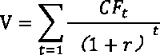
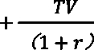

《股权投资基金》

[***\*第\*******\*T\*******\*股权投资基金概述\****	1](#bookmark1)

[第一节股权投资基金的概念和特点	1](#bookmark4)

[第二节股权投资基金发展历史	1](#bookmark10)

[第三节股权投资基金基本运作模式	3](#bookmark14)

[第四节股权投资基金在经济发展中的作用	4](#bookmark20)

[***\*第二章股权投资基金参与主体\****	6](#bookmark23)

[第一节股权投资基金当事人	6](#bookmark26)

[第二节股权投资基金市场服务机构	7](#bookmark30)

[第三节 股权投资基金监管机构和自律组织	9](#bookmark35)

[***\*第三章\****JKfe***\*投资基金分类\****	12](#bookmark54)

[***\*第一节创业投资基金与并购基金\****	12](#bookmark57)

[***\*第二节公司型基金、合伙型基金与信托（契约）型基金\****	16](#bookmark66)

[***\*第三节人民币基金与外币基金\****	18](#bookmark71)

[***\*第四节股权投资母基金\****	19](#bookmark74)

[***\*第四章股权投资基金的募集与设立\****	23](#bookmark81)

[***\*第一节募集与设立咬\****	23](#bookmark84)

[***\*第二节募集对象\****	24](#bookmark87)

[***\*第三节募集方式和流程\****	25](#bookmark90)

[***\*第四节组觥式选择\****	28](#bookmark101)

[***\*第五节股权投资基金的设立\****	32](#bookmark106)

[***\*第五章股权投资基金的投资\****	35](#bookmark119)

[***\*第一节 股权投资的一燧程\****	35](#bookmark122)

[***\*第二节投资调查与分析\****	36](#bookmark138)

[***\*第三节投资项目估值\****	39](#bookmark163)

[***\*第四节投蜥议主要条款\****	48](#bookmark202)

[***\*第六章股权投资基金的投资后管理\****	53](#bookmark216)

[***\*第一节投资后管理概述\****	53](#bookmark219)

[***\*第二节项目幡与监控\****	54](#bookmark225)

[***\*第三节增值服务\****	56](#bookmark228)

[***\*第七章\****	***\*股权投资基金的项目退出\**** 	58](#bookmark236)

***\*第一节项目退出\****1O 	58

[***\*第二节上市转让退出\****	59](#bookmark246)

[***\*第三节球转让退出\****	63](#bookmark257)

[***\*第四节协议转让退出\****	66](#bookmark275)

[***\*第五节清算退出\****	68](#bookmark284)

[***\*第丿\****I***\*章股权投资基金的内部管理\****	70](#bookmark293)

[***\*第一节投资者关系管理\****	70](#bookmark296)

[***\*第二节基金权益登记\****	71](#bookmark308)

[***\*第三节基金的估值与核算\****	74](#bookmark319)

[***\*第四节基金蝠分配与清算\****	76](#bookmark340)

[***\*第五节基金信息披雾\****	79](#bookmark367)

[***\*第六节基金的托管\****	81](#bookmark379)

[***\*第七节基金服务业务\****	84](#bookmark395)

[***\*第八节基金业绩咐\****	86](#bookmark404)

[***\*第九节基金管理人内部控制\****	89](#bookmark407)

[***\*第九章股权投资基金的政府管理\****	92](#bookmark432)

[***\*第一节政府管理概述\****	92](#bookmark435)

[***\*第二节咖管理的主要内容\****	93](#bookmark438)

[***\*第三节咖管理的形式与手段\****	107](#bookmark604)

[***\*第四节对创业投资基金的政策支持\****	108](#bookmark613)

[***\*第十章 股权投资基金的行业自律\**** 	111](#bookmark636)

***\*第一节行业自律\****1O 	111

[***\*第二节登记与备案\****	114](#bookmark678)

[***\*第三节其他自律管理\****	119](#bookmark726)

**
**

第一章股权投资基金概述

第一节股权投资基金的概念和特点

股权投资基金的概念

股权投资基金，全称“私人股权投资基金”，是指主要投资于“私人股权” 即企业非公开发行和交易股权的投资基金。私人股权包括未上市企业和上市企业 非公开发行和交易的普通股' 可转换为普通股的优先股和可转换债券。

| 股权投资基金与证券投资基金比较 |              |                                |
| ------------------------------ | ------------ | ------------------------------ |
| 基金种类                       | 基金募集方式 | 基金投资标的                   |
| 公募证券投资基金               | 公开募集     | 公开交易的证券（股票或债券等） |
| 私募证券投资基金               | 非公开募集   | 公开交易的证券（股票或债券等） |
| 公募股权投资基金               | 公开募集     | 非公开交易的股权               |
| 私募股权投资基金               | 非公开募集   | 非公开交易的股权               |

 

二.股权投资基金的特点

1 .投资期限长'流动性较差

\2. 投资后管理投入资源较多

\3. 专业性较强

\4. 收益波动性较高

第二节股权投资基金发展历史

国外股权投资基金发展历史

股权投资起源于创业投资；

1946年成立的美国研究与发展公司（ARD）,被公认为是全球第一家以公司

形式运作的创业投资基金，从此股权投资开始基金化运作；

1958年，美国《小企业投资法》的颁布是股权投资基金发展的里程碑；

1973年，美国创业投资协会成立，标志着创业投资在美国发展成为专门行

业；

20世纪50年代至70年代，创业投资基金主要投资于中小成长型企业，此 时的创业投资基金为经典的狭义创业投资基金；

1976年KKR成立以后，开始出现专门从事并购投资的并购投资基金，此即 经典的狭义上的私人股权投资基金。特别是20世纪80年代美国第四次并购浪潮 催生了黑石（1985年）、凯雷（1987年）和德太投资（1992年）等著名并购基金 管理机构，极大地促进了并购投资基金的发展；

2007年，数家并购基金管理机构脱离美国创业投资协会，发起设立了主要 服务于并购基金管理机构即狭义股权投资基金管理机构的美国私人股权投资协 会（PEC）o

二.我国股权投资基金发展历史

政府推动对促进早期股权投资基金发展起着关键性的作用O在国务院各有关 部门和地方政府的推动下，我国股权投资基金行业发展经历了三个历史阶段。

（-）探索与起步阶段（1985-2004年）

此阶段的探索与起步主要沿着两条主线进行，一是科技系统对创业投资基金 的最早探索。二是国家财经部门对产业投资基金的探索。

（二）快速发展阶段（2005-2012年）

2005年11月，国家发展改革委等十部委联合颁布了《创业投资企业管理暂 行办法》。在随后的2007年、2008年和2009年，先后出台了针对公司型创业投 资（基金）企业的所得税优惠政策'《国务院办公厅关于促进创业投资引导基金 规范设立与运作的指导意见》，并推出创业板；

2007年6月，新的《合伙企业法》开始实施，各级地方政府为鼓励设立合伙 型股权投资基金，出台了种类繁多的财税优惠政策，此后各类“股权投资基金” 迅速发展起来；

国家发展改革委于2011年11月发布了《关于促进股权投资企业规范发展的 通知》。

(=)统一监管下的规范化发展阶段(2013年至今)

2013年6月，中央编办发出《关于私募股权基金管理职责分工的通知》，明 确由中国证监会统一行使股权投资基金监管职责。2014年8月，中国证监会发 布《私募投资基金监督管理暂行办法》，对包括创业投资基金' 并购投资基金等 在内的私募类股权投资基金以及私募类证券投资基金和其他私募投资基金实行 统一监管。

基金业协会从2014年年初开始，对包括股权投资基金管理人在内的私募基 金管理人进行登记，对其所管理的基金进行备案，并陆续发布相关自律规则，对 包括股权投资基金在内的各类私募基金实施行业自律。

=.我国股权投资基金行业发展现状

一是市场规模增长迅速，当前我国已成为全球第二大股权投资市场；

二是市场主体丰富，行业从发展初期阶段的政府和国有企业主导逐步转变为 市场化主体主导；

三是有力地促进了创新创业和经济结构转型升级，股权投资基金行业有力地 推动了直接融资和资本市场在我国的发展，为互联网等新兴产业在我国的发展发 挥了重大作用。

第三节股权投资基金基本运作模式

股权投资基金运作流程

股权投资基金的运作流程是其实现资本增值的全过程。股权投资基金运作的 四个阶段是募集' 投资' 管理和退出。

二.股权投资基金运作关键要素

(-)基金规模及出资方式

基金规模是基金计划及实际募集的投资资本额度。计划募资规模是指基金合 同约定的基金总体计划募资规模，实际募资规模是指截至某一时点基金实际募集 到位的资本规模。与一般企业不同，股权投资基金通常要求全部用货币资金出资, 一般不接受实物资产' 无形资产等非货币资金出资。

（二）	基金的管理方式

股权投资基金的管理方式主要分为自我管理和受托管理两种。

（三）	基金的投资范围、投资策略和投资限制

基金的投资范围，是基金投资对象选择所指向的集合。基金的投资策略，是 指基金在选择具体投资对象时所使用的一系列规则'行为和程序的总和。基金的 投资限制，是指基金管理人不得从事或需依一定程序得到投资者许可后才能从事 的投资决策行为。

通常情况下，基金的投资范围'投资策略和投资限制由基金管理人和投资者 共同商定，并在基金合同中明确列示。

（四）	基金的瞄分配

股权投资基金的市场参与主体主要包括投资者' 管理人和第三方服务机构。 就收益分配而言，则主要在投资者与管理人之间进行。

股权投资基金的收入主要来源于所投资企业分配的红利以及实现项目退出 后的股权转让所得。基金的收入扣除基金承担的各项费用和税收之后，超出投资 者出资本金的部分即为基金利润。

由于股权投资基金所从事的投资是长期投资且透明性差，为建立对管理人的 激励机制，作为一个基本做法，股权投资基金的管理人通常参与基金收益的分配。 通常情况下，管理人因为其管理可以获得相当于基金利润一定比例的业绩报酬。

第四节股权投资基金在经济发展中的作用

股权投资基金业的社会经济效益

（-）创业投资基金的社会经济效益

1 .创业投资基金对解决中小微企业融资难问题的贡献；

2.创业投资基金对科技创新的贡献。

（-）并购基金对产业转型和升级的贡献

与创业投资基金不同，并购基金更侧重于通过投资于价值被低估的企业， 获取被投资企业的控制权，进而对被投资企业进行重整，以此提升被投资企业的

价值，从而实现投资收益。

我国股权投资基金业的发展趋势

从发展趋势来看，未来我国经济的增长将由过去的要素驱动转向创新驱动, 与此相适应，金融市场也将逐步由间接融资为主转向直接融资为主。股权投资基 金的运作模式和发展方式与创新驱动的内在要求高度一致。

第二章股权投资基金参与主体

第一节股权投资基金当事人

基金投资者

股权投资基金投资者，也称基金份额持有人，是股权投资基金的出资人' 基 金财产的所有者，按其所持有的基金份额享受收益和承担风险。

基金投资者享有以下权利：分享基金财产收益；参与分配清算后的剩余基金 财产；依法转让或者申请赎回其持有的基金份额；按照规定要求召开基金投资者 会议；对基金投资者会议审议事项行使表决权；查阅或者复制公开披露的基金信 息资料;对基金管理人和基金市场服务机构损害其合法权益的行为依法提出诉讼; 基金合同约定的其他权利。

股权投资基金投资者主要包括金融机构'社会保障基金、企业年金、社会公 益基金' 母基金' 主权财富基金' 政府引导基金' 工商企业' 个人投资者等。

基金管理人

股权投资基金管理人是基金产品的募集者和管理者，其最主要的职责是按 照基金合同的约定，负责基金资产的投资运作，在有效控制风险的基础上为基金 投资者争取最大的投资收益。

基金管理人主要履行下列职责：拟定和实施投资方案，并对被投资企业进 行投资后管理;积极参与制定被投资企业发展战略，为被投资企业提供增值服务； 定期或者不定期向基金投资者披露基金经营运作等方面的信息;定期编制并向基 金投资者呈报基金的财务报告。

三. 基金托管人

基金托管人主要履行下列职责：安全保管基金财产；按照规定开设基金资金 账户；对同一基金管理人所托管的不同基金的资金分别设置账户，确保各基金资 金账户的独立；将托管资金与基金托管机构自有财产严格分开；保存基金托管业 务活动的记录' 账册、报表和其他相关资料；按照相关法律的规定和托管协议的 约定，根据基金管理人的指令，及时办理清算' 交割事宜；按照相关法律的规定 监督基金管理人的资金运作；定期向基金管理人出具资产托管报告。

基金托管人在基金运作中具有非常重要的作用，主要包括：第一，基金财产 由独立于基金管理人的基金托管人保管，可以防止基金财产挪作他用，有利于保 障基金资产的安全。第二，基金托管人对基金管理人的投资运作（包括投资对象、 投资范围'投资比例' 禁止投资行为等）进行监督，可以促使基金管理人按照有 关法律法规和基金合同的要求运作基金财产，有利于保护基金投资者的合法权益。 第三，基金托管人对基金财产所进行的会计复核和净值计算，有利于防范' 减少 基金会计核算中的差错，保证基金份额净值和会计核算的真实性和准确性。

第二节股权投资基金市场服务机构

基金财产保管机构

一般来说，公募基金采取强制托管，基金托管人必然成为基金当事人之一。 而私募类型的股权投资基金，通常由基金投资者和基金管理人约定是否进行托管。 双方选择不进行托管，为保障基金财产安全，有时基金管理人会聘请基金资产保 管机构。

| 基金财产保管与基金托管的区别                |                                                              |
| ------------------------------------------- | ------------------------------------------------------------ |
| 基金托管                                    | 基金保管                                                     |
| 管理人和托管人对投资者同时承担双 重受托责任 | 基金资产保管机构作为基金管理人的 代理人，对基金资产承担保管责任。 |

 

二.基金销售机构

股权投资基金的募集，可分为自行募集和委托募集。自行募集是指基金管理 人直接募集其管理的基金，委托募集是指基金管理人委托第三方机构代为募集基 金。受托募集的第三方机构就是基金销售机构，为基金管理人提供推介基金、发 售基金份额' 办理基金份额认缴' 退出等募集服务。

基金销售机构在提供募集服务的过程中，应将基金管理人的基金募集材料及 时完整地提供给潜在基金投资者，全面如实披露投资风险及可能的投资损失，不 得隐瞒任何重要信息，不得对募集材料中的信息作出任何误导性陈述。

=.基金份额登记机构

基金份额登记机构提供的服务包括：建立并管理投资者的基金账户；负责基 金份额的登记及资金结算；基金交易确认；代理发放红利；保管投资者名册。

四. 律师事务所

在股权投资基金的募集与设立阶段，律师提供的服务包括：协助基金管理人 设计基金的组织形式及内部结构；根据基金管理人与基金投资者的商务安排，起 草相关的基金法律文件；在基金管理人委托的范围内，对基金投资者的资质进行 审核；协助完成基金管理人登记和基金备案工作，并根据需要出具相应的法律意 见书。

在股权投资基金的投资与投资后管理阶段，律师提供的服务包括：就基金的 投资领域'投资方向的限制向基金管理人提供咨询服务；在初步确定拟投资企业 后，律师按照基金管理人的委托，勤勉审慎地对拟投资企业进行法律尽职调查, 提交法律尽职调查报告或法律意见书，协助基金管理人分析投资涉及的法律问题 和风险；协助基金管理人起草或审阅与基金投资有关的法律文件；在投资后管理 阶段，按照基金管理人的委托，根据投资法律文件的约定，保护基金在拟投资企 业中的合法权益。

在股权投资基金的项目退出阶段，律师提供的服务包括：按照基金管理人的 委托，研究基金投资的退出结构及方式；根据不同退出方式的相关法律规定，起 草相关法律文件，参与谈判，协助基金管理人最大限度地获取合法投资收益。

在股权投资基金的清算阶段，律师提供的服务包括：按照法律规定和基金合 同的约定,协助确定清算主体;协助清算主体制定清算方案;协助实施清算方案， 包括通知债权人'确认基金财产、分配基金财产；对清算人出具的清算报告进行 合规性审核。

五. 会计师事务所

会计师事务所在股权投资基金募集与设立' 投资、投资后管理' 项目退出及 基金清算等各个阶段中，提供多方面的专业服务，包括审计' 财务和税务尽职调 查' 财务会计咨询、税务咨询、内部控制咨询、估值等。因此，基金管理人通常 会聘请会计师事务所，为其提供专业服务。

第三节股权投资基金监管机构和自律组织

—.监管机构

(-)股权投资基金监管的概念

股权投资基金监管，依据监管主体范围的不同，可以有广义和狭义两种理解。 广义的股权投资基金监管，是指有法定监管权的政府机构、行业自律组织、 基金机构内部监督部门以及社会力量对股权投资基金市场、基金市场主体及其活 动的监督管理。

狭义的股权投资基金监管，一般专指政府监管机构依法对股权投资基金市场、 基金市场主体及其活动的监督管理。

(-)股权投资基金监管的特征

股权投资基金的政府监管相对于行业自律' 内部控制和社会力量监督，具有 法定性和强制性特征。

\1. 监管主体及其权限具有法定性。与股权投资基金行业相关的法律法规明确 规定了监管机构及其权限和职责，监管机构依法行使其职责。

\2. 监管活动具有强制性。有关股权投资基金监管的法律规定，具有强制性规 范的性质，监管机构依法行使审批权' 检查权' 禁止权' 撤销权' 行政处罚权和 行政处分权等监管权，均具有法律效力，具有强制性。

(三) 股权投资基金监管的目标

不同国家股权投资基金监管的目标不同，但至少包括以下两个：

\1. 保护基金投资者合法权益。它是股权投资基金监管的首要目标，是股权投 资基金行业赖以存在和发展的基础。基金投资者的合法权益应当被保护，使其免 于滥用客户资产' 内幕交易等欺诈' 操纵行为的侵害。

\2. 防范系统性金融风险。它是整个金融监管的基石，股权投资基金的监管也 必须将防范系统性金融风险作为目标。

(四) 股权投资基金监管的基本原则

1 .依法监管原则。它是指监管机构的设置及其监管职权的取得，必须有法律 依据；监管职权的行使，必须依据法律程序，既不能超越法律的授权滥用权力， 也不能怠于行使法定的职责；对违法行为的制裁，必须依据法律的明确规定，秉 公执法，不偏不倚。

\2. 高效监管原则。它是指股权投资基金监管活动不仅要以价值最大化的方式 实现基金监管的根本目标，而且还要通过监管活动促进股权投资基金行业的持续 健康规范发展。监管机构既要对股权投资基金行业进行必要的监管，又不能束缚 股权投资基金行业和市场的活力。

\3. 适度监管原则。政府监督体现了政府对经济的干预。市场经济的实践及经 济学的理论都已经证明，市场不是万能的，而是存在其自身无法克服的种种缺陷， 即市场失灵，因此，政府干预是必要的。但并非政府干预越多' 监管越严就越有 效，如果政府干预过度，就极易导致市场主体丧失自由，甚至会导致整个行业的 发展脱离其内在规律。因此，市场失灵要求政府干预，但现代市场经济的政府干 预应是“适度”的干预，即政府监管应适度。

\4. 审慎监管原则。是指股权投资基金监管机构在制定监管规范以及实施监管 行为时，注重基金机构的风险防控和偿付能力，以确保基金运行稳健和基金财产 安全，切实保护投资者的合法权益。

\5. 分类监管原则。它是指根据不同类别股权投资基金的不同风险特点，采取 不同的监管要求和方式。

（五）股权投资基金的监管机构

股权投资基金监管机构依法对基金管理人和市场服务机构开展股权投资基 金业务实施监督管理，对违法违规行为进行查处。中国证监会及其派出机构是我 国股权投资基金的监管机构。

二自律组织

（-）股权投资基金行业自律的概念

股权投资基金行业自律，是指行业自律组织对股权投资基金市场'基金市场 主体及其活动的监督和约束。股权投资基金行业自律组织一般采取行业协会形式, 由基金管理人和其他基金服务机构组成。

（二）股权投资基金行业自律与政府监管的关系

\1. 行业自律与政府监管的联系

第一，目的一致，都是确保国家有关股权投资基金的相关法律' 法规' 规章 和政策得到贯彻执行，保护投资者的合法权益。

第二，行业自律是对政府监管的积极补充。

第三，行业自律组织在政府监管机构和市场主体之间起着桥梁和纽带作用。

\2. 行业自律与政府监管的区别

第一，性质不同。政府监管带有行政管理的性质，而行业自律是行业的自我 约束。

第二，依据不同。政府监管依据国家的有关法律' 法规' 规章和政策，而行 业自律除了依据国家的有关法律' 法规' 规章和政策外，还依据行业自律组织制 定的章程' 业务规则' 细则。

第三，对违法违规者的处罚不同。政府监管机构可以对违法违规的市场主体 采取责令改正、监管谈话、出具警示函、公开谴责等行政监管措施和行政处罚； 而行业自律组织对其成员的处罚较轻，一般为公开谴责、暂停会员资格、取消会 员资格等。

（三）	股权投资基金行业自律的重要性

股权投资基金行业自律的重要性，由政府有限监管和行业整体利益决定。具 体来说，股权投资基金行业自律组织可以在以下方面起到作用：第一，提供行业 服务，促进行业交流和创新，提升行业职业素质，提高行业竞争力；第二，发挥 行业与政府间的桥梁与纽带作用，维护行业合法权益，促进公众对行业的理解, 提升行业声誉；第三，履行行业自律管理，促进行业合规经营，维护行业的正当 经营秩序；第四，促进会员忠实履行受托义务和社会责任，推动行业持续稳定健 康发展。

（四）	股权投资基金的自律组织

由基金管理人和市场服务机构共同成立的行业协会是股权投资基金的自律 组织。自律组织对股权投资基金业开展行业自律,协调行业关系，提供行业服务， 促进行业发展。

中国证券投资基金业协会是我国股权投资基金行业的自律组织。

第三章股权投资基金分类

第一节创业投资基金与并购基金

创业投资基金

(-)创业投资

| 概念     | 创业投资，是指向处于各个创业阶段的未上市成长性企业 进行的股权投资。具体来说，创业投资是指向处于创建或 重建过程中的未上市成长性创业企业进行股权投资，以期 所投资创业企业发育成熟或相对成熟后，主要通过股权转 让获取资本增值收益的投资方式。 |
| -------- | ------------------------------------------------------------ |
| 投资对象 | 投资对象包括早期' 中期' 后期各个发展阶段的未上市成 长性企业，并不仅指对早期' 中期企业的投资。 |
| 投资形式 | 可以采取非组织化形式和组织化形式。1. 非组织化创业投资：指非专业机构和个人分散从事创业 投资；2. 组织化创业投资是指机构或个人通过设立专业创业投资 组织从事创业投资。 |
| 天使投资 | 是指除被投资企业职员及其家庭成员和直系亲属以外的个 人以其自有资金直接开展的创业投资活动，属于非组织化 创业投资范畴。 |

 

(-)创业投资基金

| 概念 | 是指主要投资于处于各个创业阶段的未上市成长性企业的 股权投资基金。它通过注资的形式对企业的增量股权进行 投资，从而为企业提供发展所需的资金。 |
| ---- | ------------------------------------------------------------ |
| 特点 | 第一，从投资对象看，主要是未上市成长性创业企业； 第二，从投资方式看，通常采取参股性投资，较少采取控 股性投资； |

|      | 第三，从杠杆应用看，一般不借助杠杆，以基金的自有资 金进行投资；第四，从投资收益看，主要来源于所投资企业的因价值创 造带来的股权增值。 |
| ---- | ------------------------------------------------------------ |
|      |                                                              |

 

并购基金

(-)并购基金蜓

| 概念 | 是指主要对企业进行财务性并购投资的股权投资基金。它 通过购买股权的形式对企业的存量股权进行投资，并不为 企业提供任何资金，只是一种所有权转移的投资方式，获 得资金的是出让企业股权的老股东。并购基金主要是杠杆收购基金。 |
| ---- | ------------------------------------------------------------ |
| 特点 | 第一，从投资对象看，主要是成熟企业；第二，从投资方式看，通常采取控股性投资；第三，从杠杆应用看，往往借助于杠杆，即采取杠杆收购 形式；第四，从投资收益看，主要来源于因管理增值带来的股权 增值。 |

 

(二) 杠杆收购基金的投资方式

杠杆收购基金对目标企业进行投资的方式是杠杆收购。

杠杆收购，是指收购方用少量的自有资金结合大规模的外部资金来收购目标 企业的活动。收购方的自有资金和外部资金的比例，通常取决于以下三个因素: 第一，目标公司所能产生的现金流。第二，外部资金的融资成本。第三，资本结 构的风险。

杠杆收购的收购资金主要有三个来源：第一，普通股，由收购方提供资金。 第二，夹层资本，一般采取优先股和垃圾债券的形式，有时附有转股权。第三, 高级债，即银行提供的并购贷款。

| 股权资本 | 它主要由杠杆收购基金提供，采取普通股的形式。有时，由 于目标公司的规模较大，往往会采取几家基金联合投资（俱 乐部交易）的形式，其中一家基金作为牵头投资人，统筹整 个杠杆收购交易，其他基金提供各自的关系和技能。 |
| -------- | ------------------------------------------------------------ |
| 夹层资本 | 顾名思义，是处于资本结构的中间位置，收益和风险介于银 行贷款和股权资本之间的资本形态。在杠杆收购融资中，夹 层资本比银行贷款优先级低' 成本高，比股权资本优先级 高' 成本低，进一步拓展了杠杆收购基金的融资渠道，提高 了可用杠杆水平。夹层资本通常采取优先股和次级债券的形式，有时这些证券 会附带对普通股的认股权或转股权。夹层资本与借贷资本的 本质区别在于：借贷资本可以要求融资方提供资产抵押或由 第三方担保；夹层资本作为准股权资本，无法要求融资方提 供资产抵押或由第三方担保。夹层资本弹性较大，融资条款可以根据交易所需进行定制， 因而可以满足特定交易的个性化需求。夹层资本通常由夹层 基金' 保险公司以及公开市场提供。 |
| 银行贷款 | 它是杠杆收购的主要资金来源，通常由两部分组成：循环贷 款和定期贷款。循环贷款提供的资金用于满足目标企业日常营运资本需求， 目标公司需要时可以随时在授信额度内向银行贷款，满足其 灵活性的需求。它的特殊之处在于这部分贷款可以反复地借 贷与偿还，前提是要与银行签订信用协议并缴纳一定的费 用。循环贷款通常是杠杆收购中成本最低的债务融资方式， 当然同样享有最高级别的优先偿还权。定期贷款是指具有固定偿还期限的贷款，通常以被收购公司 的资产作抵押，同时又需要分期偿还本金和利息。同循环贷 款一样，定期贷款也有着最优先的偿还级别，并且可以进一 步分为A级' B级甚至更多级别，A级定期贷款有明确的分 |
|          | 期偿还本金的要求，风险最小，因而融资成本最低；B级定 期贷款一般面向非银行机构，不需要分期偿还本金但票面利 率更高，在杠杆收购中规模大于A级定期贷款。银行贷款是杠杆收购中级别最高' 成本最低和弹性最低的融 资来源。 |

 

（三）	杠杆收购基金的投资对象

杠杆收购基金的投资对象通常具有以下特征：处于成熟行业；强劲' 稳固的 市场地位；稳定、可预测的现金流；拥有坚实的抵押资产基础；资产负债率较低； 资本性支出较低；有减少开支的潜力；资产可剥离。

（四）	杠杆收购基金的投资分析

杠杆收购基金的投资分析，主要通过构建杠杆收购财务模型来实现。

\1. 构建杠杆收购财务模型的目标

杠杆收购基金构建财务模型是为了实现三个目标：评估交易融资结构'测算 投资回报' 估值。评估交易融资结构，是在给定的现金流'信用条件' 利率的基 础上确定杠杆收购过程对目标企业的资产负债表和信用的影响，分析融资结构 （普通股' 夹层资本' 高级债）的合理性；测算投资回报，是通过计算内部收益 率来确定目标企业是否具有投资价值，杠杆收购基金能否获得合理的回报;估值, 是通过适当的估值方法来估算目标企业的价值。估值结果依赖于一些关键变量的 假设，包括融资结构' 财务预测和出售价格与时间，因此，估值分析需要对结果 作敏感性分析以得到一个区间的结果。

\2. 构建杠杆收购财务模型的步骤

构建杠杆收购财务模型主要包括以下五个步骤：收集、分析' 处理与交易相 关的基础信息和数据；构建杠杆收购前的财务模型；输入交易相关数据；构建杠 杆收购后的财务模型；杠杆收购分析。

（五）	杠杆收购基金的作用

杠杆收购基金作为杠杆收购的牵头方，既要为收购提供自有资金（普通股）， 还要统筹收购的各个方面，因此也被称为杠杆收购的金融发起人，在整个杠杆收 购中起着核心作用。

杠杆收购基金在杠杆收购中的职责包括：第一，选择杠杆收购的目标（通常 在投资银行的协助下）；第二，谈判收购价格（通常在投资银行的协助下）;第三， 募集高级债及夹层资本（通常在投资银行的协助下）；第四，通过一个结束性事 件完成交易；第五，作为公司的所有者及董事会控制成员，通过已有管理层或新 的管理层经营被收购公司；第六，监督高层管理者的活动及决策；第七，作出所 有的战略和财务决策；第八，决定出售公司的时机和方式（通常在投资银行的协 助下）。

第二节 公司型基金、合伙型基金与信托（契约）型基金

公司型基金

（-）公司型基金的概念

公司型基金的投资者是公司股东，依法享有股东权利，并以其投资额为限对 公司债务承担有限责任。公司型基金可自行或者委托专业基金管理人进行基金管 理。公司型基金是企业法人实体。公司型基金可采取有限责任公司或股份有限公 司的形式。

公司型基金的参与主体主要为投资者和基金管理人。投资者既是基金份额持 有者，又是公司股东，按照公司章程行使相应权利' 承担相应义务和责任。从投 资者权利角度看，投资者作为公司的股东，可通过股东大会（股东会）和董事会 委任并监督基金管理人。

（二）公司型基金的特点

第一，公司在很多国家比合伙企业'契约结构有着更悠久的历史和更为健全 的法律环境,进而使这些国家的公司有着更完整的组织结构和更规范的管理系统, 可以有效降低运作风险。

第二，公司型基金是独立的企业法人，可以通过借款来筹集资金，这在合伙 型基金和信托（契约）型基金中往往不可行。

第三，公司的有限责任，意味着全体股东承担有限责任。

二. 合伙型基金

（-）合伙型基金的概念

合伙型股权投资基金采用有限合伙企业的组织形式，投资者作为合伙人参与 投资，依法享有合伙企业财产权，由普通合伙人对合伙债务承担无限连带责任, 由基金管理人具体负责投资运作。合伙型基金不具有独立的法人地位。

合伙型基金的参与主体主要为普通合伙人'有限合伙人及基金管理人。普通 合伙人对基金（合伙企业）债务承担无限连带责任，有限合伙人以其认缴的出资 额为限对基金（合伙企业）债务承担责任。普通合伙人可自行担任基金管理人或 者委托专业的基金管理机构担任基金管理人。有限合伙人不参与投资决策。

（-）合伙型基金的特点

第一，合伙型基金本质上是一种合伙关系。合伙型基金常以有限合伙形式设 立，有限合伙人与普通合伙人承担的责任不同，这也就决定了它们对有限合伙企 业的权利也不相同。有限合伙人承担有限责任，因此仅需按照有限合伙协议的约 定按期' 足额缴纳认缴出资；普通合伙人对合伙企业债务承担无限连带责任，受 普通合伙人委托的基金管理人或自任基金管理人的普通合伙人负责基金投资等 重大事项的管理与决策，对有限合伙企业的责任是执行合伙事务。

第二，有利于避免双重纳税。有限合伙企业并不是独立的法人，不能独立于 合伙人而存在，必须依附于各合伙人的契约关系，按照我国税法，有限合伙企业 不是企业所得税的纳税主体，而是由合伙人承担纳税义务，有利于避免双重征税 问题。

三. 伯托（契约）型基金

（-）伯托（契约）型基金的概念

信托（契约）型股权投资基金是指通过订立信托契约的形式设立的股权投资 基金。信托（契约）型基金不具有独立的法人地位。

信托（契约）型基金的参与主体主要为基金投资者、基金管理人及基金托管 人。基金投资者通过购买基金份额，享有基金投资收益。基金管理人依据基金合 同负责基金的经营和管理操作。基金托管人负责保管基金资产，执行管理人的有 关指令，办理基金名下的资金往来。

（二）信托（契约）型基金的特点

第一，信托（契约）型基金本质上是一种信托关系，因此，契约各方可通过 信托契约进行相关约定，运作比较灵活。

第二，信托（契约）型基金不是企业所得税的纳税主体，不需要缴纳所得税， 只有基金投资者需要对取得的投资收益缴纳所得税，避免了双重纳税。

第三，信托（契约）型基金中，除非基金合同另有约定，基金投资者以其出 资为限对基金的债务承担有限责任。

第三节人民币基金与外币基金

—.人民币基金

人民币股权投资基金是指依据中国法律在中国境内设立的主要以人民币对 中国境内非公开交易股权进行投资的股权投资基金。人民币股权投资基金分为内 资人民币股权投资基金和外资人民币股权投资基金。

| 内资人民币股权投资基金                                       | 外资人民币股权投资基金                                       |
| ------------------------------------------------------------ | ------------------------------------------------------------ |
| 是指中国国籍自然人或根据中国法律 注册成立的公司' 企业或其他经济组 织依据中国法律在中国境内发起设立 的主要以人民币对中国境内非公开交 易股权进行投资的股权投资基金。 | 是指外国投资者（外国投资者指外国 公司' 企业和其他经济组织或者个 人）或外国投资者与根据中国法律注 册成立的公司' 企业或其他经济组织 依据中国法律在中国境内发起设立的 主要以人民币对中国境内非公开交易 股权进行投资的股权基金。 |

 

外币基金

外币股权投资基金，是指依据中国境外的相关法律在中国境外设立，主要以 外币对中国境内的企业进行投资的股权投资基金。

外币股权投资基金通常采取"两头在外”的方式。

第一，外币股权投资基金不在中国境内以基金名义注册法人实体，其经营实

体注册在境外。

第二，外币股权投资基金在投资过程中，通常在境外设立特殊目的公司作为 受资对象，并在境外完成项目的投资退出。

第四节 股权投资母基金

股权投资母基金唾

股权投资母基金（基金中的基金）是以股权投资基金为主要投资对象的基金。

早在20世纪70年代就出现了单个投资者签订委托投资协议,将资金投向多 个股权投资基金的情况。到20世纪90年代初，伴随着大量股权投资资本的涌 现，真正意义上的股权投资母基金开始发展起来，它们通过集合多个投资者资金, 形成集合投资计划，再投资于多个股权投资基金。

目前，股权投资基金母基金已经成为股权投资基金最主要的投资者之一。

二.股权投资母基金的业务

股权投资母基金的业务主要包括一级投资' 二级投资和直接投资。

（-）一级投资

一级投资，是指母基金在股权投资基金募集时对基金进行投资，成为基金投 资者。母基金发展初期，主要从事一级投资，一级投资是母基金的本源业务。

在一级投资业务中，母基金在选择股权投资基金时，重点考察以下方面：投 资理念' 市场' 管理团队' 之前基金业绩' 投资流程' 基金条款' 主观分析。

（二）	二级投资

二级投资，是指母基金在股权投资基金募集设立完成后，对存续基金或其投 资组合公司进行投资。其投资方式按投资标的不同，分为两种类型：一是购买存 续基金份额及后续出资额；二是购买基金持有的投资组合公司的股权。

近年来，母基金二级投资业务的比例不断增加，主要基于以下原因：价格折 扣' 加速投资回收和投资于已知的资产组合。

（三）	直鰻资

直接投资，是指母基金直接对非公开发行和交易的企业股权进行投资。在实

19

际操作中，母基金通常和其所投资的股权投资基金联合投资，母基金往往扮演跟 投角色，让股权投资基金来管理这项投资。在直接投资业务中，母基金能够在股 权投资基金的投资项目中，挑选最具吸引力、与其现有投资组合最匹配的项目， 因此，直接投资自然也成为母基金的一项业务类型。

三.股权投资母基金的作用

投资者不直接投资股权投资基金,而是通过投资母基金间接投资股权投资基 金，主要有以下四个原因：分散风险' 专业管理' 投资机会' 规模优势。

（-）分散风险

母基金通常会将所募集的资金分散投资于15-25只股权投资基金，从而避免 了单只股权投资基金投资中依赖于某一基金管理人的风险。

（二）	专业管理

对股权投资基金进行投资，是一项专业性非常强的工作。母基金管理人通常 拥有全面的股权投资的知识' 人脉和资源，在对股权投资基金进行投资时，母基 金相比其他投资者更有可能作出正确的投资决策。母基金为缺乏经验的投资者提 供了投资股权投资基金的渠道。

（三）	投资机会

大部分业绩出色的股权投资基金都会获得超额认购，因此，一般投资者难以 获得投资机会。母基金作为股权投资基金的专业投资者，通常与股权投资基金有 良好的长期关系，因此，有机会投资于这些优秀的基金。投资者通过投资于母基 金而获得投资优秀基金的机会。

㈣规模优势

在对股权投资基金进行投资时，投资规模的大小常常是一个问题，投资者的 资金常常太大或者太小，以至于难以进行合适的投资。而母基金可以通过帮助投 资者“缩小规模”或“扩大规模”来解决这一问题：

一方面，母基金可以帮助大的投资者投资小规模的基金，从而实现节约成本 和分散投资；

另一方面，母基金可以帮助小的投资者投资大规模的基金，从而达到大型基

金的投资门槛。母基金通常拥有相当的规模，能够吸引' 留住及聘用行业内最优 秀的投资管理人才。

四.股权投资母基金的风险、收益与成本

| 风险 | 股权投资母基金通过分散投资降低了风险。研究表明，投资于单只股权投资基金的风险较高，极高内部收益率(IRR)和极低内部收益率出现的可能性较大。而投资于母基金的风 险小于投资于单只股权投资基金，且在很大程度上降低了极高内部 收益率和极低内部收益率出现的可能性。 |
| ---- | ------------------------------------------------------------ |
|      | 通常有种说法，股权投资母基金只能取得整个股权投资基金行业的 平均收益。但现实情况并非如此，由于母基金通常能够投资于较为 优秀的股权投资基金，因此无论是从平均数还是中位数来比较，母 基金的收益率通常比其主要投资类型(创业投资基金和并购基金) 的平均收益率高。考虑到母基金的风险低于单只股权投资基金，因此，母基金的经风 险调整后的收益更高。 |
| 成本 | 股权投资母基金管理人要向母基金投资者收取管理费和业绩报酬， 因此，相比直接投资股权投资基金，投资者通过母基金间接投资股 权投资基金需额外承担成本。因此，投资者投资母基金时，应考虑投资母基金相对于直接投资股 权投资基金的超额收益和成本。 |

 

五.政府引导基金

(-)政府引导基金的概念

政府引导基金是一类特殊的母基金，主要是通过投资于创业投资基金，达到 支持创业投资基金发展的目的。

政府引导基金是由政府设立并按市场化方式运作的政策性基金，主要通过扶 持创业投资基金发展，引导社会资金进入创业投资领域。政府引导基金本身不直 接从事创业投资业务。

政府引导基金的宗旨是发挥财政资金的引导和聚集放大作用，引导民间投资 等社会资本投入，增加创业投资资本的供给，克服单纯通过市场配置创业投资资 本的市场失灵问题，特别是通过鼓励创业投资基金投资处于种子期'起步期等创 业早期的企业，弥补一般创业投资基金主要投资于成长期'成熟期和重建期企业 的不足。

（二）政府引导基金的运作

政府引导基金对创业投资基金的支持方式包括参股' 融资担保'跟进投资。

| 翁股     | 是指政府引导基金主要通过参股方式，吸引社会资本共同 发起设立创业投资企业。 |
| -------- | ------------------------------------------------------------ |
| 融资担保 | 是指政府引导基金根据信贷征信机构提供的信用报告，对 历史信用记录良好的创业投资基金，采取提供融资担保方 式，支持其通过债权融资增强投资能力。 |
| JO投资   | 是产业导向或区域导向较强的政府引导基金，通过跟进投 资，支持创业投资基金发展并引导其投资方向。 |

第四章 股权投资基金的募集与设立

第一节募集与设立概述

募集的概念

股权投资基金的募集，是指股权投资基金管理人或者受其委托的募集服务机

| 构向投资者募集资金，用于设立股权投资基金的行为。 |                                                              |
| ------------------------------------------------ | ------------------------------------------------------------ |
| 基金的募集分为自行募集和委托募集。               |                                                              |
| 自行募集                                         | 是由管理人自行拟定基金募集推介材料、寻找投资者的基 金募集方式。 |
| 委托募集                                         | 是指基金管理人委托第三方机构代为寻找投资者并完成资 金募集工作。 |

 

设立唾

(-)股权投资基金的设立

股权投资基金需要具备一定的组织形式,设立股权投资业务主体的行为即股 权投资基金的设立。我国现行的股权投资基金组织形式主要分为公司型' 合伙型 以及信托(契约)型，影响组织形式选择的因素众多，主要包括法律依据、监管 要求' 与股权投资业务的适应程度及基金运营实务的要求，以及税负等。对于不 同的组织形式，基金有不同的设立要求。

公司型基金和合伙型基金的设立，通常需在工商管理部门完成名称预先核准、 申请设立登记和领取营业执照的流程。信托(契约)型基金不是企业实体，无须 办理工商注册登记程序，根据投资者和管理人签署的信托契约设立。

按照现行规则，股权投资基金设立完成后，应在中国证券投资基金业协会办 理基金备案。

(-)基金募集和设立的区别

| 基金的募集 | 是基金管理人募集资金的过程，主要考虑募集渠道、募集 对象、募集过程合规性等问题。 |
| ---------- | ------------------------------------------------------------ |
|            |                                                              |

是基金管理人依法设立开展股权投资业务主体的过程，主 要考虑基金组织形式、基金架构、登记备案等问题。

第二节募集对象

投资者的主要类型

| 国外股权投资基金投资者的主要类型 | 中国股权投资基金投资者的主要类型 |
| -------------------------------- | -------------------------------- |
| 养老基金                         | 母基金                           |
| 母基金                           | 政府引导基金                     |
| 大学基金会                       | 社会保障基金                     |
| 大型企业                         | 金融机构                         |
| 金融机构                         | 工商企业                         |
| 富有的个人或家族                 | 个人投资者                       |

 

二.合醐资者制度

合格投资者是指具有一定风险识别能力和风险承担能力的投资者。

(-)建立合格投资者制度的必要性

股权投资基金管理人和投资者之间存在较为严重的信息不对称:基金管理人 居于信息优势地位，掌握着关于基金投资项目质量、投资风险' 投资业绩等关系 到投资者利益的信息；而基金投资者通常处于信息劣势地位O

在这样的情况下，基金管理人有可能会利用其信息优势从事一些对自己有利 而对基金投资者不利的“败德”行为，从而损害基金投资者利益。特别是当股权 投资基金以非公开方式募集时，无法通过公开披露信息机制约束基金管理人，"败 德行为”可能发生得更多。因此，不少国家规定，股权投资基金只能向合格投资 者募集。

(二)合格投资者的标准

| 西方国家合做资者标准 | 我国的合格投资者认定标准 |
| -------------------- | ------------------------ |
|                      |                          |

| 1 .原则要求投资者具有一定的风险识别 能力和风险承担能力；2. 要求投资者认购的基金份额达到某一 最低要求；3. 根据投资者的资产规模或收入水平判 断其风险承担能力；4. 认可某些持有特定金融牌照（如商业 银行）或其他大型专业投资机构（如养 老基金）及其高级管理人员为当然合格 | 按照我国《证券投资基金法》的规 定，合格投资者是指“达到规定资 产规模或者收入水平，并且具备相 应的风险识别能力和风险承担能 力、其基金份额认购金额不低于规 定限额的单位和个人”。 |
| ------------------------------------------------------------ | ------------------------------------------------------------ |
|                                                              |                                                              |

投资者。

 

第三节募集方式和流程

募集方式

（-）自行募集和委托募集

| 自行募集 | 指基金管理人自行为其设立的股权投资基金募集资金。基金 管理人应设置有效机制，切实保障募集结算资金安全。应严 格遵守合格投资者制度，不得向合格投资者之外的单位和个 人募集资金。 |
| -------- | ------------------------------------------------------------ |
| 委托募集 | 指基金管理人委托有资格的第三方基金销售机构为其设立的 股权投资基金募集资金。基金管理人应当委托具有合格基金 销售资质和专业基金销售服务团队的机构代为募集，并与代 销机构签署书面协议。目前，我国要求代销机构应获得中国证监会基金销售业务资 格且成为中国证券投资基金业协会会员。 |

 

 

（二）公开募集和非公开募集

| 公开募集 | 指通过公开渠道向非特定对象推介基金产品。在我国，目前 不允许进行股权投资基金的公开募集。 |
| -------- | ------------------------------------------------------------ |
|          |                                                              |

| 非公开募集 | 指的是通过设置特定对象确定程序的渠道进行非公开推介基 金产品的行为。 |
| ---------- | ------------------------------------------------------------ |
|            |                                                              |

 

.募集流程与主要资料

（-）募集流程

| 募集筹备期     | 基金管理人撰写基金私募备忘录，并与可能投资的潜在投 资者举行会晤，评估、筛选准备定向路演的对象。 |
| -------------- | ------------------------------------------------------------ |
| 基金路演期     | 基金管理人需要准备募集推介资料并分发私募备忘录，路 演的方式包括举行线下定向路演活动等。如需要，基金管理人也会在募集筹备和路演阶段向重要的 潜在投资者提供基金条款书，类似项目投资时的投资条款 清单，作为下一阶段基金商务谈判的基础。 |
| 投资者确认     | 基金管理人向达成意向的潜在投资者提供（反向）尽职调 查材料，潜在投资者对基金管理人展开（反向）尽职调 查；基金管理人在此阶段需要鉴别主要基金投资者并就最 终条款展开预先谈判，谈判基金合同和附属文件。 |
| 协议签署及出资 | 基金管理人与基金投资者确定募集结束日期，传阅最终文 件并签署基金合同和附属文件，按照基金合同的约定履行 出资义务。在此阶段，基金管理人需要确保履行的程序和 募集结束时的基金状态符合法律法规的要求。 |

 

目前,我国要求包括股权投资基金在内的各类私募基金的募集需履行的程序 包括：特定对象确定'投资者适当性匹配' 基金风险揭示' 合格投资者确认'投 资冷静期以及回访确认（非强制）等步骤。

（二）募集所需主要资料

\1. 私募备忘录（PPM）

私募备忘录类似于“招股说明书”，是基金管理人撰写的说明自身优势和投 资计划的文件，用于招募基金投资者参与基金投资。潜在投资者主要依靠PPM来 获得基金的信息，通常将其作为决策是否参与基金的关键信息来源。PPM通常包

26

含如下必要内容：基金的规模、存续期和预计封闭时间；基金管理人在管基金情 况摘要；机构和基金的投资理念，包括投资策略和基金管理人在特定市场上的竞 争优势；投资管理团队和投资决策委员会的介绍；基金管理人过往业绩描述；重 要基金条款，包括分配机制' 管理费及管理人投入等。

\2. 募集推介材料

它是基金管理人制作的关于特定基金产品的推介说明资料，相较于私募备忘 录，募集推介资料重点描述募集中基金的基本情况，内容更为简明，但基金管理 人也需要保证募集推介资料内容的真实性' 完整性'准确性。

\3. （反向）尽职调查资料

它是根据基金投资者需求由基金管理人准备和提供的关于基金管理人的一 系列说明资料，内容通常包括基金管理人基本情况'基金管理人内部治理和重要 制度' 历史基金或项目业绩' 核心团队成员信息等。

\4. 基金条款书

在一些大型股权投资基金募集时,基金管理人会准备基金条款书对重要潜在 投资者重点关注的基金条款进行描述，作为双方后续进行商务谈判的基础。基金 条款书中常见的基金条款有：经营/投资范围条款' 运营成本条款' 利润分配条 款' 资金承诺' 缴款安排' 退出与份额转让。

=.募集机构的责任和义务

无论是自行募集还是委托募集，股权投资基金募集机构都应保证募集行为的 合法合规性，以保护投资者及相关当事人的合法权益。从原则上主要包括以下方 面：

\1. 募集机构在募集过程中应恪尽职守、诚实守信、谨慎勤勉，防范利益冲突， 履行风险提醒义务'反洗钱义务等相关义务，并按照法规要求的合格投资者制度 承担特定对象确定' 投资者适当性审查与确认等相关责任；

\2. 募集机构在募集阶段应与基金投资者关于基金合同及附属文件充分沟通, 并就法规可能影响的基金合同生效程序进行客观描述；

\3. 募集机构应建立相关制度保障投资者的商业秘密并对个人信息严格保密, 并确保基金相关的未公开信息不被用于进行非法交易等；

\4. 募集机构应建立相关制度以保障基金财产和客户资金安全,包括但不限于 基金募集与分配账户安排' 基金托管安排等。

第四节组织形式选择

股权投资基金需要具备一定的组织形式，在我国，现行的股权投资基金组织 形式主要分为公司型' 合伙型和信托（契约）型，影响具体组织形式的因素主要 包括法律' 监管' 业务适应度' 基金税负和基金投资者税负等。

法律依据与监管要求

在《合伙企业法》修订案和信托（契约）型基金相关法律法规生效前，早期 的股权投资基金主要依据《公司法》设立公司型股权投资基金。修订后的《合伙 企业法》自2007年6月1号起施行，增加了 “有限合伙”这种新的合伙企业形 式。

信托公司可以运用债权' 股权、物权及其他可行方式运用信托资金，信托公 司可将信托计划项下资金投资于未上市企业股权'上市公司限售流通股或中国银 监会批准可以投资的其他股权。

符合要求的资产管理计划可以进行未通过证券交易所转让的股权'债权及其 他财产权利的投资，从而将信托（契约）型股权投资基金的形式扩充到资产管理 计划中。

二.与股权投资业务的适应程度

（-）资金募集与出资安排

\1. 股权投资基金通常采用承诺资本制。

\2. 对各类基金的出资安排

| 公司型基金 | 现行《公司法》对有限责任公司和股份有限公司的注册资 本限额、缴付安排及出资方式等方面均不作强制性规定， 全部由公司章程进行规定。以有限责任公司形式设立的，股东人数应在50人以下。 |
| ---------- | ------------------------------------------------------------ |
|            |                                                              |

|                     | 以股份有限公司形式设立的，股东人数不超过200人，且 应当有2个以上发起人，其中须有半数以上的发起人在中 国境内有住所。 |
| ------------------- | ------------------------------------------------------------ |
| 合伙型基金          | 根据《合伙企业法》可由合伙协议对出资方式、数额和缴 付期限进行约定：关于出资方式，《合伙企业法》规定有 限合伙人可以用货币、实物、知识产权、土地使用权或者 其他财产权利作价出资，不得以劳务出资，在实物中有限 合伙人通常以货币形式出资参与股权投资基金。除法律另有规定的特殊情况外，有限合伙企业应由2个以 上50个以下合伙人设立，且有限合伙企业至少应当有一个 普通合伙人。 |
| 信托（契约）型 基金 | 现行的法律法规未对信托（契约）型基金的出资安排有强 制性规定。按照《证券投资基金法》，投资者不得超过200人。单个信托计划的自然人人数不得超过50人，但单笔委托金 额在300万元以上的自然人投资者和合格的机构投资者数 量不受限制。 |

 

（二）内部组织机构的设置与投资决策

| 公司型基金 | 公司治理结构的基本特点是股东至上。股东大会（股东 会）是公司型基金的权力机构，在公司型基金中投资者作 为股东拥有较大权力，可以在股东大会（股东会）层面对 基金重大事项或重大投资进行决策。 |
| ---------- | ------------------------------------------------------------ |
| 合伙型基金 | 有限合伙治理结构的基本特点是普通合伙人掌握合伙企业 事务执行权。有限合伙人不执行合伙事务，不得对外代表 有限合伙企业。普通合伙人对合伙企业的债务承担无限连 带责任，并负责合伙企业事务的执行，合伙企业投资与资 产处置的最终决策应由普通合伙人作出。 |

| 信托（契约）型 基金 | 信托（契约）型基金治理结构的基本特点是基金管理人高 度控制基金决策权。 |
| ------------------- | ------------------------------------------------------------ |
|                     |                                                              |

 

（三）收益分配安排

| 公司型基金         | 公司型基金缴纳公司所得税之后，按照公司章程中关于利 润分配的条款进行分配。按照《公司法》的规定，税后利 润分配需在亏损弥补和提取公积金之后进行，分配顺序的 灵活性相对较低。 |
| ------------------ | ------------------------------------------------------------ |
| 合伙型基金         | 合伙型基金在进行收益分配时，《合伙企业法》规定，“合伙企业的利润分配、亏损分担，按照合伙协议的约定 办理；协商不成的，由合伙人按照实缴出资比例分配、分 担；无法确定出资比例的，由合伙人平均分配、分担”。 |
| 信托（契约）型基金 | 对信托（契约）型基金来说，基金收益分配的原则、时间 和顺序等安排均通过契约约定，体现出较大的灵活性。《信托法》规定，“共同受益人按照信托文件的规定享受 信托利益，信托文件对信托利益的分配比例或者分配方法 未作规定的，各受益人按照均等的比例享受信托利益”。 |

 

三.股权投资基金的基本税负

（-）所得税

1 .公司型基金

公司型基金的税收规则是“先税后分”。对公司型基金而言，“转让财产收入”

“股息、红利等权益性投资收益”为主要收入来源，其中“转让财产收入”即公 司型基金转让标的企业股权获得的收入。当以债转股等方式投资时，还可能存在

“利息收入”。三类收入中，《企业所得税法》规定符合条件的居民企业之间的股 息' 红利等权益性投资收益为免税收入，可以在计算应纳税所得额时减除。

公司每一纳税年度的收入总额，减除不征税收入、免税收入' 各项扣除以及 允许弥补的以前年度亏损后的余额，为应纳税所得额。应纳税所得额乘以适用税 率，减除依照《企业所得税法》关于税收优惠的规定减免和抵免的税额后的余额，

30

为应纳税额。目前，企业所得税的税率为25%。

从基金投资者层面看，公司型基金的投资者作为公司股东从公司型基金获得 的分配是公司税后利润的分配，因此投资者是公司时，以股息红利形式获得分配 时可按照上述《企业所得税法》的规定免税；自然人投资者需缴纳股息红利所得 税（适用税率为20%）并由基金代扣代缴，因而需承担双重征税（公司所得税与 个人所得税）。

\2. 合伙型基金

根据《合伙企业法》等相关规定，合伙企业生产经营所得和其他所得采取“先 分后税”的原则：合伙企业以每一个合伙人为纳税义务人，合伙企业层面不缴纳 所得税o企业合伙人是自然人的，缴纳个人所得税;合伙人是法人和其他组织的， 缴纳企业所得税。

合伙企业每一纳税年度的收入总额减除成本'费用以及损失后的额，为生产 经营所得。前述所称"生产经营所得和其他所得”，包括合伙企业分配给所有合 伙人的所得和企业当年留存的所得（利润）。

根据现行税法的规定，如果合伙人（含普通合伙人和有限合伙人）为自然人， 比照《个人所得税法》中的“个体工商户的生产经营所得”应税项目，适用5%~ 35%的五级超额累进税率，计缴个人所得税；合伙人为公司时，均作为企业所得 税应税收入，计缴企业所得税。

\3. 信托（契约）型基金

《证券投资基金法》规定，“基金财产投资的相关税收，由基金份额持有人 承担,基金管理人或者其他扣缴义务人按照国家有关税收征收的规定代扣代缴”, 但进行股权投资业务的契约型股权投资基金的税收政策有待进一步明确。《信托 法》及相关部门规章中并没有涉及信托产品的税收处理问题，税务机构目前也尚 未出台关于信托税收的统一规定。

实务中，信托计划' 资管计划以及信托（契约）型基金通常均不作为课税主 体，投资者应纳所得税一般也不实行代扣代缴，而是由投资者自行缴纳。

（-）流转税一^值税

我国自2016年5月1日起正式在全国范围内开展营业税改征增值税试点。 根据财政部' 国家税务总局的相关规定，金融业纳入营改增试点范围，由缴纳营 业税改为缴纳增值税。股权投资基金运作股权投资业务取得不同形态的资本增值 中，项目股息' 分红收入属于股息红利所得，不属于增值税征税范围；项目退出 收入如果是通过并购或回购等非上市股权转让方式退出的，也不属于增值税征税 范围；若项目上市后通过二级市场退出，则需按税务机关的要求，计缴增值税。

第五节 股权投资基金的设立

基金合同

(-)公司型基金合同

公司型基金合同的法律形式为公司章程，需要符合包括公司法等法律法规要 求的要件，同时适应股权投资业务，并符合行业合规和自律要求。

根据《公司法》，有限责任公司的章程应当载明：公司名称和住所；公司经 营范围；公司注册资本；股东的姓名或者名称；股东的出资方式' 出资额和出资 时间；公司的机构及其产生办法' 职权' 议事规则；公司法定代表人；股东会会 议认为需要规定的其他事项。

股份有限公司的章程应当载明：公司名称和住所；公司经营范围；公司股份 总数' 每股金额和注册资本；发起人的姓名或者名称' 认购的股份数' 出资方式 和出资时间；董事会的组成、职权和议事规则；公司法定代表人；监事会的组成' 职权和议事规则；公司利润分配办法；公司的解散事由与清算办法；公司的通知 和公告办法；股东大会会议认为需要规定的其他事项。

(-)合伙型基金合同

合伙协议应当载明：合伙企业的名称和主要经营场所的地点；合伙目的和合 伙经营范围；合伙人的姓名或者名称' 住所；合伙人的出资方式' 数额和缴付期 限；利润分配' 亏损分担方式；合伙事务的执行；入伙与退伙；争议解决办法; 合伙企业的解散与清算；违约责任。

对于有限合伙企业，还需载明：普通合伙人和有限合伙人的姓名或者名称、 住所；执行事务合伙人应具备的条件和选择程序；执行事务合伙人权限与违约处 理办法;执行事务合伙人的除名条件和更换程序;有限合伙人入伙'退伙的条件、 程序以及相关责任；有限合伙人和普通合伙人相互转变程序。

与股权投资业务相关，下述事项的约定也为必备内容：合伙期限（通常具体 约定投资期、退出期等）；管理方式和管理费；费用和支出；财务会计制度；利 润分配及亏损分担；托管事项；投资事项；税务承担事项；合伙人会议（合伙协 议中需列明合伙人会议的召开条件' 程序及表决方式等）。一些选择性条款则根 据基金投资者和管理人的募集沟通或可包含在合伙协议中，如关键人条款、投资 咨询委员会条款等O

（三）伯托（契约）型基金合同

信托（契约）型基金合同应包括:前言（订立基金合同的目的、依据和原则）； 基金的基本情况；基金的申购、赎回与转让：基金份额持有人大会及日常机构; 基金份额的登记；基金的财产；交易及清算交收安排；基金财产的估值和会计核 算；基金合同的效力、变更'解除与终止；基金的清算：违约责任；争议的处理。

同时，适应股权投资业务的具体内容应包括：基金的募集；基金的投资；当 事人及权利义务；基金的费用与税收；基金的收益分配。

基金设立的条件及流程

（-）公司型基金的设立

1 .设立条件

公司型基金严格按照《公司法》而设立，有限责任公司中股东以其出资为限 对公司承担责任，股份有限公司中股东以其认购股份为限对公司承担责任，公司 型基金是以其全部资产对公司债务承担责任的企业法人。

\2. 设立步骤

（1）	名称预先核准；

（2）	申请设立登记；

（3）	领取营业执照：公司营业执照签发日期为公司成立日期。

有限责任公司型基金由全体股东指定的代表或者共同委托的代理人向公司 登记管理机关申请设立登记，股份公司型基金则由董事会向公司登记管理机关申 请设立登记。

（二）合伙型基金的设立

1 .设立条件

根据《合伙企业法》的相关规定，设立有限合伙企业，应当具备下列条件:

(1) 有限合伙企业由2个以上50个以下合伙人设立，但是法律法规另有规 定的除外；有限合伙企业至少应当有一个普通合伙人；

(2) 有书面合伙协议；

(3) 有限合伙企业名称中应当标明"有限合伙”字样；

(4) 有合伙人认缴或者实际缴付的出资；有限合伙人可以用货币' 实物、 知识产权、土地使用权或者其他财产权利作价出资，但有限合伙人不得以劳务出 资；

(5) 有生产经营场所；

(6) 法律法规规定的其他条件。

2.设立步骤

合伙型基金与公司型基金均由工商登记机构进行登记管理，因而设立步骤相 同，合伙型基金应根据《合伙企业法》《合伙企业登记管理办法》以及各地工商 登记机构的要求由全体合伙人指定的代表或者共同委托的代理人向企业登记机 关申请设立登记，完成名称预先核准、申请设立登记' 领取营业执照等相关设立 步骤。

(三)伯托(契约)型基金的设立

根据相关法律法规规定，信托(契约)型基金的设立不涉及工商登记的程序， 通过订立基金合同明确基金投资者'基金管理人及基金托管人在基金管理业务过 程中的权利、义务及职责，确保委托财产的安全，保护当事人各方的合法权益。

第五章股权投资基金的投资

第一节股权投资的一般流程

项目开发与筛选

项目开发主要解决股权投资基金的项目来源问题。项目来源渠道多种多样, 主要包括：

1 .行业研究；

\2. 中介机构推荐；

\3. 天使投资人或者同行推荐；

\4. 企业家联盟及各级商会组织推荐；

\5. 行业专家推荐；

\6. 政府机构推荐；

\7. 行业展会' 创业计划大赛' 创投论坛等。

二. 初步尽职调查

初步尽职调查阶段，主要从以下方面对目标公司进行初步价值判断：管理团 队；行业进入壁垒' 行业集中度' 市场占有率和主要竞争对手；商业模式' 发展 及盈利预期、政策与监管环境等。

三. 项目立项

一般来说，通过项目立项程序的项目将进入正式尽职调查阶段。对部分条件 暂不成熟的项目，经批准仍可作为储备项目由投资经理进行持续跟踪。

四. 签订投资框架协议

除保密条款和排他性条款之外，投资框架协议的内容主要作为投融资双方下 一步协商的基础，对双方并无法律上的约束力。

五. 尽职调査

尽职调查的主要内容包括业务' 财务与法律三部分。

六. 投资决策

股权投资基金管理人通常设立投资决策委员会行使投资决策权。投资决策委 员会委员由具备丰富投资管理经验与能力、有足够时间与精力履行相应职责的投 资管理专业人士担任，通常由股权投资基金管理人的高级管理团队成员担任，有 时也会聘请外部专家担任。

七. 签订投资协议

通常情况下，创业投资基金主要以增资方式投资于目标公司，而并购基金主 要以购买存量股权的方式对目标公司进行投资。

八. 投资交割

投资协议正式生效后，进入投资交割程序。

第二节投资调査与分析

尽职调查雎

(-)尽职调查的概念

尽职调查，又称审慎性调查，一般是指投资人在与目标企业达成初步合作意 向后经协商一致，投资人对目标公司的一切与本次投资相关的事项进行资料分析、 现场调查的一系列活动。

(二)尽职调査的目的

股权投资机构尽职调查的目的，是尽可能全面地获取目标公司的真实信息。

(=)尽职调査的作用

| 价值发现 | 帮助投资方判断目标公司是否值得投资并获取项目估值所 需信息。  |
| -------- | ------------------------------------------------------------ |
| 风险发现 | 通过获取目标公司的真实信息，识别和评估目标公司的主 要风险，降低信息不对称可能带来的问题。 |

| 投资决策辅助 | 依据尽职调查中发现的目标公司的特点和风险，帮助投资 方在投资条款谈判、投资后管理重点内容、项目退出方式 选择等方面的决策提供依据。 |
| ------------ | ------------------------------------------------------------ |
|              |                                                              |

 

二. 尽职调查的主要内容

尽职调查的内容可以分为：业务尽职调查、财务尽职调查和法律尽职调查。

（-）业务尽职调査

业务尽职调查是整个尽职调查工作的核心，目的是了解过去及现在企业创造 价值的机制，以及这种机制未来的变化趋势。

业务尽职调查内容主要包括：

\1. 企业基本情况：包括企业的工商登记资料' 历史沿革' 组织机构' 股权架 构以及主要股东的基本情况等；

\2. 管理团队：包括董事会成员及主要高级管理人员的履历介绍' 薪酬体系、 期权或股权激励机制等；

\3. 产品/服务：包括产品/服务的基本情况' 生产和销售情况' 知识产权（商 标和专利）' 核心技术及研发事项等；

4市场：包括企业所属的行业分类' 相关的产业政策' 竞争对手'供应商及 经销商情况' 市场占有率以及定价能力等；

\5. 发展战略：包括企业经营理念和模式、中长期发展战略及近期策略' 营销 策略以及未来业务发展目标（如销售收入）等；

\6. 融资运用：包括企业融资需求及结构、计划投资项目' 可行性研究报告及 政府批文（如适用）等；

\7. 风险分析：企业面临的主要风险，包括市场' 项目' 资源、政策' 竞争、 财务及管理等方面。

（二）财务尽职调査

财务尽职调查重点关注目标公司的历史财务业绩情况,并对企业未来财务状 况进行合理预测。

财务尽职调查重点考察企业的现金流'盈利及资产事项。财务尽职调查应涵 盖企业的历史经营业绩、未来盈利预测、营运资金、融资结构、资本性开支以及 财务风险敏感度分析等内容。财务尽职调查经常采用趋势分析和结构分析工具, 在财务预测中经常会用到场景分析和敏感度分析等方法。

财务尽职调查需要重点关注如下几个方面：

\1. 会计政策与会计估计；

\2. 财务报告及相关财务资料；

\3. 财务比率分析；

\4. 纳税分析。

（三）法律尽职调查

法律尽调更多的是定位于风险发现，其内容主要有：第一' 确认目标企业的 合法成立和有效存续;第二、从合规角度核查目标公司所提供文件资料的真实性、 准确性和完整性；第三、充分了解目标企业的组织结构' 资产和业务的产权状况 和法律状态，确认企业产权' 业务资质以及其控股结构的合法合规；第四' 发现 和分析目标公司现存的法律问题和风险并提出解决方案；第五' 出具法律意见并 将之作为准备交易文件的重要依据。

法律尽调关注重点问题包括历史沿革问题、主要股东情况、高级管理人员、 重大合同' 诉讼及仲裁' 税收及政府优惠政策等。

三. 尽职调查的方法

1 .计划制订与团队组建；

\2. 二手资料收集与研读；

\3. 企业现场调研；

\4. 撰写尽职调查报告；

\5. 进行内部复核。

四. 尽职调查报告

尽职调查报告主要分为前言' 正文和附件三个部分。

1 .前言

前言部分主要阐述尽职调查的目标' 方法' 依据' 程序和范围。此外，前言 部分还对全文的主要概念进行阐述。

\2. 正文

正文是尽职调查报告呈现内容的主体，是对被调查公司相关信息的全面' 客 观陈述。

正文末尾通常包括结论和建议部分，报告尽职调查小组对目标公司的初步判 断与评价以及对投资框架' 目标公司估值、投资风险识别及管理' 投资协议要点 以及投资后管理重点等问题的建议。

\3. 附件

主要附上尽职调查过程中的重要证据，以及第三方中介机构的报告，包括审 计报告' 法律意见书' 行业分析报告等。

第三节投资项目估值

估值唾

(-)价值与价格

价值是事物的内在属性，是从长期来看合理的、内在的价值。而价格则是在 某次交易当中被交易双方认可的价值的外在表现形式。价格有时等于价值，但更 多情况下，价格是偏离价值的，它受到多种因素的影响。

在项目估值环节，估值主体通过一定的方法与技术，评估目标公司的价值; 在股权投资交易中，交易价格由投融资交易双方通过谈判确定，估值结果可以作 为价格谈判的基础，为确定谈判策略提供支持。

(-)企业价值与股权价值

企业价值是指公司所有出资人，包括股东和债权人，共同拥有的公司运营所 产生的价值，包括企业的股东所拥有的股权价值，以及企业的债权人所拥有的债 权价值。

作为股权投资者，股权投资基金关心的是股权价值，最后的交易价格以股权 价值为基础来确定。

但是，估值方法中，有些方法直接用的是企业价值，而非股权价值。这时, 需要运用价值等式，在企业价值和股权价值之间进行转换。

1 .简单价值等式：企业价值+现金=股权价值+债务

债务与现金的差额定义为净债务，则价值等式又可以表示为：企业价值=股 权价值+净债务

需要注意的是，等式中的各项值都是市场价值。

\2. 一般价值等式

企业价值+非核心资产价值+现金=债务+少数股东权益+归属于母公司股东的 股权价值

上述价值等式将股权价值和企业价值联系起来，可以在二者之间进行自由转 换。

(三) 企业估值的特点

1 .整体不是各部分的简单相加；

\2. 整体价值来源于要素的结合方式；

\3. 部分只有在整体中才能体现出其价值；

\4. 整体价值只有在运行中才能体现出来。

(四) 常用企业估值方法

估值方法通常包括相对估值法' 折现现金流估值法、创业投资估值法' 成本 法' 清算价值法' 经济增加值法等。其中，股权投资行业主要用到的估值方法为 相对估值法' 折现现金流估值法和创业投资估值法。

相对估值法

(-)相对估值法曜

\1. 基本原理

相对估值法的基本原理是以可以比较的其他公司(可比公司)的价格为基础, 来评估目标公司的相应价值。评估所得的价值，可以是股权价值，也可以是企业 价值。

\2. 估值步骤

(1) 选取可比公司；

(2) 计算可比公司的估值倍数；

(3) 计算适用于目标公司的可比倍数；

(4) 计算目标公司的企业价值或者股权价值。

3.相对估值法的优点和不足

(1) 相对估值法具有以下优点：

第一，运用简单，易于理解。

第二，主观因素相对较少。

第三，可以及时反映市场看法的变化。

(2) 同时，相对估值法也有以下不足：

第一，受可比公司企业价值偏差影响。

第二，分析结果的可靠性受可比公司质量的影响，有时很难找到合适的可比 公司。

(二) 市盈率倍數法

市盈率(P/E)倍数反映了一家公司的股权价值相对其净利润的倍数。

市盈率倍数=股权价值4-净利润

市盈率倍数=每股价值4-每股收益

在使用市盈率倍数法估值时，先确定可比公司的市盈率作为目标公司估值的 市盈率倍数，然后使用下述公式计算目标公司股权价值或每股价值：

股权价值=净利润X市盈率倍数

每股价值=每股收益X市盈率倍数

股权投资基金投资实践中，较多采用预测的盈利数据进行估值。

企业的净利润和市盈率都容易受经济周期的影响，对股权投资基金而言，估 值的市盈率倍数不应只是特定时刻的可比市盈率。股权投资基金往往会以平均市 盈率为参考标准，而不是简单地跟随市场潮流。

(三) 企业价值/,息税前利润倍数法

息税前利润(EBIT)是在扣除债权人利息之前的利润，所有出资人(股东和 债权人)对息税前利润都享有分配权，因此，息税前利润对应的价值是企业价值 (EV)o

息税前利润的计算公式为：息税前利润(EBIT)=净利润+所得税+利息

企业价值/息税前利润倍数法的企业价值计算公式为：EV=EBITX (EV/EBIT

倍数)

企业价值/息税前利润倍数法剔除了资本结构的影响。息税前利润是向所有 股东和债权人分配前的利润，因此不受股权和债务的比例即资本结构的影响。

（四）	企业价值/,息税折旧摊销前利润倍数法

息税折旧摊销前利润（EBITDA）是指扣除利息费用' 税' 折旧和摊销之前的 利润。

息税折旧摊销前利润（EBITDA）=息税前利润（EBIT） +折旧+摊销

企业价值/息税折旧摊销前利润倍数法的企业价值计算公式为:EV=EB ITDA X （EV/EBITDA 倍数）

企业价值/息税折旧摊销前利润倍数法不但考虑了资本结构的影响，还考虑 了折旧摊销。对于折旧摊销影响比较大的企业（如重资产企业），比较适合用企 业价值/息税折旧摊销前利润倍数法。

（五）	市净率倍数法

市净率（P/B）倍数反映了一家公司的股权价值相对其净资产的倍数。市净 率倍数的计算公式为：

市净率倍数=股权价值4-净资产

市净率倍数=每股价值4-每股净资产

市净率倍数法估值与市盈率倍数法类似,先确定可比公司的市净率作为目标 公司估值的市净率倍数，然后使用下述公式计算目标公司股权价值或每股价值。

股权价值=净资产X市净率倍数

每股价值=每股净资产X市净率倍数

市净率倍数法比较适用于资产流动性较高的金融机构，因为这类企业的净资 产账面价值更加接近市场价值。例如，银行业的估值通常会用市净率倍数法。

（六）	市销率倍數法

市销率（P/S）倍数反映了一家公司的股权价值相对其销售收入的倍数。市 销率倍数的计算公式为：

市销率倍数=股权价值4-销售收入

市销率倍数=每股价值4-每股销售收入

在使用市销率倍数法估值时，先确定可比公司的市销率作为目标公司估值的
市销率倍数，然后使用下述公式计算目标公司股权价值或每股价值。

股权价值=销售收入X市销率倍数

每股价值=每股销售收入X市销率倍数

股权投资基金投资的创业企业，可能净利润为负数，经营性现金流也为负数, 且账面价值比较低。对此类企业，市销率倍数法可能比较实用。市销率倍数法的 一个局限是不能反映成本的影响，因此，主要适用于销售成本率较稳定的收入驱 动型企业，如公共交通、商业服务' 互联网(尤其电子商务)、制药及通信设备 制造公司。

三.折现现金流估值法

(-)折现现金流估值法咬

\1. 基本原理

折现现金流估值法的基本原理是将估值时点之后目标公司的未来现金流以 合适的折现率进行折现，加总得到相应的价值。评估所得的价值，可以是股权价 值，也可以是企业价值。折现现金流估值法的计算公式为：

|      |                            |
| ---- | -------------------------- |
|      |  |

其中，V为价值；*为时期，CFt为第t期的现金流；r为未来所有时期的平 均折现率，n为详细预测期数，TV为终值。

\2. 估值步骤

(1) 选择适用的折现现金流估值法；

(2) 确定详细预测期数(n)；

(3) 计算详细预测期内的每期现金流(CFt)；

(4) 计算折现率(r)；

(5) 计算终值(TV)；

(6) 对详细预测期现金流及终值进行折现并加总得到价值。

\3. 折现现金流估值法的优点和不足

(1)优点

第一，折现现金流估值法评估得到的是内含价值，受市场短期变化和非经济 因素的影响较小;

第二，折现现金流估值法需要深入分析目标公司的财务数据和经营模式，有 助于发现目标公司价值的核心驱动因素，从而为企业未来发展战略和经营决策提 供依据，有助于发现提升企业价值的方法。

(2)不足

第一，折现现金流估值法计算比较复杂；

第二，折现现金流估值法需要较多主观假设，不同假设得出的结果差异较大。

(-)红利折现模型

股权投资基金投资于目标公司的股权，预期获得两种现金流：一是持有股权 期间的现金红利；二是持有期末卖出股权时的价格。二者的现值之和即目前股权 的价值。

因此，红利折现模型的计算公式为：

**8** **(****^ + r) (1 + r)**

其中，V为股权价值，DPSt为第t期的现金红利，n为详细预测期数，r为 股权要求收益率，Pn为持有期末卖出股权时的预期价格。

红利折现模型要求目标公司的红利发放政策相对稳定，但在实际中，很多企 业的红利发放政策不稳定，有的企业从不发放红利或者因为未盈利而无红利可发 放。此时，很难用红利折现模型进行估值。

(三)股权自由现金流折现模型

股权自由现金流(FCFE)是可以自由分配给股权拥有者的最大化的现金流。

股权自由现金流(FCFE)=净利润(E) +折旧+摊销-营运资金的增加+长期经 营性负债的增加-长期经营性资产的增加-资本性支出+新增付息债务-债务本金 的偿还

股权自由现金流折现模型的估值公式为：

**Z**

**n** **FCFE****t**	**TV**

(l+r)t+ **a+r)****n**

其中，V为股权价值；FCFEt为第t期的股权自由现金流量；n为详细预测期 数，r为股权要求收益率(和红利折现模型中的r相同)，TV为股权自由现金流

的终值。

(四)企业自由现金流折现模型

企业自由现金流(FCFF)是指公司在保持正常运营的情况下，可以向所有出 资人(股东和债权人)进行自由分配的现金流。

企业自由现金流(FCFF)=息税前利润(EBIT) -调整的所得税+折旧+摊销- 营运资金的增加+长期经营性负债的增加-长期经营性资产的增加-资本性支出

其中，调整的所得税有两种计算方法：一是直接用息税前利润乘以当期所得 税税率；二是在利润表中当期所得税的基础上进行调整，加回财务费用的税盾, 再扣除非经常损益对应的所得税。

企业自由现金流折现模型的估值公式为:

|      |                            |
| ---- | -------------------------- |
|      |  |

其中，EV为企业价值，FCFFt为第t期的企业自由现金流，n为详细预测期 数，WACC为加权平均资本成本，TV为企业自由现金流的终值。

加权平均资本成本(WACC)是企业各种融资来源的资本成本的加权平均值, 计算公式为：

**D**	**E**

WACC =———-*** k****d** ***** **(1** **— t)** **+ ———-***** k****e**

**D+E** **11** **、 丿** **D** **+** **E** **e**

其中，D为付息债务的市场价值，E为股权的市场价值，kd为税前债务成本， ke为股权资本成本，t为所得税税率。

企业自由现金流折现模型得到的是企业价值，可以通过价值等式推出股权价 值。

四.创业投资估值法

(-)创业投资估值法原理

如果股权投资基金拟投资的目标公司处于创业早期，利润和现金流均为负数, 未来回报很高，但存在高度不确定性，此时，往往会用创业投资估值法。

创业投资估值法通过评估目标公司退出时的股权价值,再基于目标回报倍数 或收益率，倒推出目标公司的当前价值。

（二）创业投资估值法的步骤

创业投资估值法的步骤如下：

\1. 估计目标公司在股权投资基金退出时的股权价值

股权投资基金预测投资退出的时点，然后估算该时点目标公司的股权价值。 估值方法一般使用相对估值法。

\2. 计算当前股权价值

使用目标回报倍数或者收益率将目标公司退出时的股权价值折算为当前股 权价值。计算公式如下：

当前股权价值=退出时的股权价值/目标回报倍数=退出时的股权价值/ （1 +目 标收益率）n

\3. 估计股权投资基金在退出时的要求持股比例

投资额除以当前股权价值,得到股权投资基金为获得目标回报倍数或收益率 应有的持股比例，计算公式为：

要求持股比例=投资额/当前股权价值

4估计股权稀释情况，计算投资时的持股比例

如果目标公司没有后续轮次的股权融资，则不会稀释股权投资基金的股权, 投资时的持股比例就是上一步计算出的要求持股比例。

如果目标公司有后续轮次的股权融资，需估计股权稀释情况，倒推出投资时 的持股比例。

五.其他估值法

（-）成本法

成本法包括账面价值法和重置成本法。

1 .账面价值法

公司总资产减去总负债后的净值即为公司的账面价值。但是若要评估目标公 司的真正价值，还必须对资产负债表的各个项目作出必要的调整。

对资产项目的调整，应注意公司应收账款可能发生的坏账损失'公司外贸业 务的汇兑损失'公司有价证券的市值是否低于账面价值、固定资产的折旧方式是 否合理，尤其是无形资产方面，有关专利权' 商标权和商誉的评估弹性很大。

对负债项目的调整，应注意是否有未入账的负债，如职工退休金' 预提费用

46

等，注意是否有担保事项等或有负债及尚未核定的税金等。

\2. 重置成本法

重置成本法是用待评估资产的完全重置成本（重置全价）减去其各种贬值后 的差额作为该项资产价值的评估方法,完全重置成本是指在现时条件下重新购置 —项全新状态的资产所需的全咅K成本。

计算公式如下：

待评估资产价值=重置全价-综合贬值

待评估资产价值=重置全价x综合成新率

综合贬值包括有形损耗（物质的）和无形损耗（技术的）等。

重置成本法的主观因素较大，且历史成本与未来价值并无必然联系，因此, 重置成本法主要作为一种辅助方法。从技术角度看，重置成本法的主观因素较大。 此外，参考价格的选定无法排除交易条件的影响。

（-）清算价值法

清算包括破产清算和公司解散清算。假设企业破产或公司解散时，将企业拆 分为可出售的几个业务或资产包，并分别估算这些业务或资产包的变现价值，加 总后作为企业估值的参考标准。

清算价值法评估的步骤：

1 .进行市场调查，收集与被评估资产或类似资产清算拍卖相关的价格资料。

\2. 分析' 验证价格资料的科学性和可靠性。

\3. 逐项对比分析评估与参照物的差异及其程度，包括实物差异' 市场条件、 时间差异和区域差异等。

\4. 根据差异程度及其他影响因素，估算被评估资产的价值，最后得出评估结 果。

\5. 根据市场调查计算出结果，对清算价格进行评估。

一般采用清算价值法估值时采用较低的折扣率。对股权投资基金而言，清算 很难获得很好的投资回报，企业正常可持续经营情况下，不会采用清算价值法。

第四节投资协议主要条款

投资框架协议和投资协议的关系

投资框架协议有时也被称为投资条款清单、投资备忘录或投资意向书，通常 情况下，除保密条款和排他性条款外，投资框架协议的内容并不具有法律约束力, 但它却包含了该次投融资的主要条款,这些主要条款通常会作为后续谈判及合作 的基础，并最终成为正式投资协议的一部分。

在进行投资框架协议谈判时，投融资双方主要围绕目标公司投资价格' 出售 的股权数量' 保密条款' 锁定期条款' 业绩要求和退出安排' 费用承担条款等核 心条款展开。本节列出了投资协议和投资框架协议中比较常见的一些条款。

二.投资协议的常见条款

(-)估值条款

估值条款是投资协议中最重要的条款之一，因为它直接影响着“谁控制公司” 和"当公司被出售时，每个股东能够获得多少现金”这两个问题。这两个问题的 核心即控制权及收益权，是投资者最为看重的两点。

"投资前估值”是目标公司接受投资前的估值，"投资后估值”是目标公司 接受投资后的估值，等于投资前估值加上新的投资额。

估值条款通常同时会约定股权投资基金的投资方式。创业投资基金通常以可 转换优先股'可转换债或者是普通股为投资工具，以目标公司增资方式进行投资。 并购基金更多采用普通股工具，以受让目标公司原有股权方式进行投资。实践中， 可能存在同时使用多种投资方式的情况。

(-)估值调整条款

估值调整机制在股权投资基金中也常常被称为“估值调整协议”或者“对赌 条款”。估值调整条款既可以条款形式存在于投资协议中，也可以一个专门的协 议即估值调整协议形式存在o该机制的触发条件是目标公司的实际业绩未达到事 先约定的业绩目标，或发生特定事件(如公司未在约定时间前实现IPO、原大股 东失去控股地位' 高管严重违反约定等)。

估值调整机制触发后，由被投资企业创始股东或其他利益方按照协议约定的

计算规则向股权投资基金以现金或股权方式提供补偿。估值调整机制也因此分为

“现金补偿类”和“股份补偿类”。

（三）	优先烦权条款

优先认购权，是指目标公司未来发行新的股份或者可转换债券时，股权投资 基金将按其持股比例获得同等条件下的优先认购权利。

优先认购权使股权投资基金可以在未来公司增加发行股份时,保护其股权比 例不被稀释。

通常，投资协议会额外约定，优先认购权不适用于一些特殊情况，包括为上 市而进行的首次公开发行（IPO）、为建立员工持股计划而增加的股份发行' 为履 行银行债转股协议而增加的股份发行等。

（四）	第一拒绝权条款

第一拒绝权，是指目标公司的其他股东欲对外出售股权时，作为老股东的股 权投资基金在同等条件下有优先购买权。

优先认购权和第一拒绝权是最为常见的股东权利。

（五）	随售权条款

随售权又称共同出售权，是指目标公司的其他股东欲对外出售股权时，股权 投资基金有权以其持股比例为基础，以同等条件参与该出售交易。

随售权条款通常与第一拒绝权条款同时出现。

在实践中，往往对创始人股东在目标公司的持股规定一定的锁定期，在锁定 期届满之前通常不允许创始人股东在未经股权投资基金同意的情况下向其他第 三方转让股权。

（六）	反摊薄条款

反摊薄条款也称为反稀释条款，本质上是一种价格保护机制，适用于后轮融 资为降价融资时，用于保护前轮投资者利益的条款。所谓降价融资，即目标公司 后续融资时，后轮投资者认购价格相较于前轮投资者认购价格更低的情形。降价 融资通常是由于目标公司经营业绩变差，也可能出现企业实际控制人以稀释投资 方股权为目的所进行的降价融资。

反摊薄条款在创业投资基金的投资运作中更为多见。

通过反摊薄条款进行保护的方式通常有两种：完全棘轮和加权平均，前者比 后者更大限度地保护投资者。

（七）	保护性条款

保护性条款是指股权投资基金为保护自身利益而设置的要求目标公司在执 行某些可能损害投资者利益或对投资者利益有重大影响的行为时，需取得投资者 同意的条款。

在创业投资中，创业投资基金通常是被投资企业的小股东，因此会向企业家 要求设置保护性条款，设立保护性条款的目的是保护作为小股东的投资者，防止 其利益受到大股东侵害。

保护性条款针对的通常是涉及投资者经济利益或者公司控制权的重大事项。

（八）	董事会席位条款

董事会席位条款指的是在投资协议中股权投资基金和目标公司之间约定董 事会的席位构成和分配的条款。

董事会是公司治理的重要组成部分，董事会席位条款的实质是对被投资企业 的控制权分配进行约定。通常，董事会席位条款会约定董事会席位总数及其分配 规则。

（九）	回售权条款

回售权，是指满足协议约定的特定触发条件时，股权投资基金有权将其持有 的全部或部分目标公司股权以约定的价格卖给目标公司创始股东或创始股东指 定的其他相关利益方。

业内常见的触发“回售权”的条件，有业绩指标触发条件和非业绩事件触发 条件两类。例如：业绩不达标；未及时改制，申报上市材料/实现IPO；原始股 东丧失控股权；高管出现重大不当行为。

触发条件具备后，投资人可以要求目标公司创始股东或创始股东指定的其他 相关利益方按协议约定的价格回购投资人的全部或部分股份。

对股权投资基金来说，回售权条款主要具有两个功能，一是通过行使回售权 达到估值调整的目的；二是回售权条款也是在约定的触发条件发生时，保障股权 投资基金的投资具有一定流动性，并得以获得畅通的退出渠道的重要手段。

(+)拖售权条款

拖售权，又称领售权、强卖权或强制出售权，是指如果有第三方向股权投资 基金发出股权收购要约，且股权投资基金接受该要约，则其有权要求其他股东一 起按照相同的出售条件和价格向该第三方转让股权。

随售权是股权投资基金欲强行进入其他股东与第三方的交易，交易价格以其 他股东与第三方协商确定的价格为准；而拖售权则恰恰相反，是股权投资基金强 迫其他股东进入股权投资基金与第三方的交易，交易价格以股权投资基金与第三 方协商确定的价格为准。

相比随售权，拖售权赋予股权投资基金更大的权利，使其即使作为少数股东, 却可以享有通常只有绝大多数股东才能享有的决定公司转让的权利，此种权利有 时会严重侵害创始股东的利益。在多数情形下，拖售权条款会被被投资企业创始 股东拒绝，或者会对拖售权的行使设置一定的条件，这些条件通常包括：

\1. 股权投资基金提出要行使拖售权时，公司创始股东有权按照第三方买家提 出的同等交易条件受让股权投资基金在公司的股权;只有在公司创始股东拒绝受 让的情况下，拖售权才能被行使；

\2. 第三方买家对公司的估值必须高于某一事先设定的数额。

(+-)竟业禁止条款

要求目标公司通过保密协议或其他方式，确保其董事' 高管和其他关键员工 不得兼职与本公司业务有竞争的职位，同时，在离职后一段时期内，不得加入与 本公司有竞争关系的公司或从事与本公司有竞争关系的业务。本条款的目的是保 证目标公司的利益不受损害，从而保障投资者的利益。

常见的竞业禁止主要包括两种形式：

\1. 定竞业禁止，是当事人基于法律的直接规定而产生的竞业禁止义务。

\2. 约定竞业禁止，是当事人基于合同的约定而产生的竞业禁止义务。

(+-)保密条款

保密条款，是指除依法律或监管机构要求的信息披露外，投融资双方对在股 权投资交易中知悉的对方商业秘密承担保密义务，未经对方书面同意，不得向第 三方泄露。

保密义务是双方共同的义务。对股权投资基金而言，其在投资过程中知悉的 目标公司的非公开的技术' 产品' 市场' 客户、商业计划、财务计划等信息通常 均属于商业秘密；对目标公司而言，其在融资过程中所知悉的股权投资基金的非 公开的尽职调查方法与流程'投资估值意见' 投资框架协议及投资协议条款等信 息通常均属于商业秘密。

通常，保密条款应列明保密信息的具体内容' 保密期限及违约责任。

（十三）排他性条款

排他性条款通常是投资框架协议中的条款，它要求目标公司现任股东及其任 何任职职员' 董事、财务顾问' 经纪人或代表公司行事的人在约定的排他期内不 得与其他投资机构进行接触，从而保证双方的时间和经济效率。

排他性条款中的排他期由双方约定，通常为几个月。同时，投资方如果在协 议签署之日前的任何时间决定不再执行投资计划，应立即通知目标公司，排他期 将在目标公司收到上述通知时立即结束。

第六章股权投资基金的投资后管理

第一节 投资后管理概述

投资后管理的概念、内容和作用

(-)投资后管理的概念

投资后管理是指股权投资基金与被投资企业投资交割之后,基金管理人积极 参与被投资企业的管理,对被投资企业实施项目监控并提供各项增值服务的一系 列活动。

在投资交割之后直到项目退出之前都属于投资后管理的期间，在整个股权投 资过程中持续时间最长' 花费精力最多。

(-)投资后管理的内容

第一类为投资机构对被投资企业进行的项目跟踪与监控活动；

第二类为投资机构为被投资企业提供的增值服务。

(三)投资后管理的作用

\1. 保证资金安全并促进投资收益；

\2. 有利于提升被投资企业自身价值，增加投资的收益；

\3. 能有效地帮助被投资企业利用好资本市场。

投资后管理阶段获取伯息的主要方式

(-)參加被投资企业股东大会(股东会)、董事会、监事会

| 股东大会(股东会) | 是公司的最高权力机构，由全体股东组成，负责修改公司 章程，聘任和解聘公司董事，对公司的上市、增资、减 资、利润分配、关联交易等重大事项进行决策。 |
| ---------------- | ------------------------------------------------------------ |
| 董事会           | 负责批准公司发展战略、批准公司年度财务预算与决算、 聘任和解聘公司高级管理人员以及决定公司高级管理人员 的薪酬、考核与激励制度等重要决策。 |
| 监事会           | 是公司内部专门行使监督权的监督机构，对公司董事和高 管的行为是否符合法律法规和公司章程行使监督权。 |

投资机构通过参与被投资企业股东大会（股东会）' 董事会和监事会，可以 全面了解与公司发展相关的重要信息，并通过行使相应职权促进被投资企业的良 性发展，并保护投资机构的利益。

（二）关注被投资企业经营状况

根据法律法规和投资协议的约定，在投资后直至投资退出的全过程中，被投 资企业有义务及时向投资机构提供与企业经营状况相关的报告，包括月度报告、 季度报告'半年度报告、年度报告和有关专项报告等。投资机构可以通过被投资 企业提交的经营报告了解企业业务进展情况，从而对项目发展进行有效监控。

（=）日常联络和淘通工作

投资机构通常采取电话或会面' 到企业实地考察等方式与被投资企业主要管 理人员进行沟通接触，目的是了解企业的日常经营情况，并对其进行有针对性的 咨询辅导和帮助。通常情况下，很多投资后管理工作都是在与被投资企业定期或 不定期的沟通中完成的。

第二节 项目跟踪与监控

项目转与监控咬

投资机构作为外部投资者，要减少或消除信息不对称等潜在问题，包括规避 企业家的委托代理风险,投资机构应采取各项具体有效措施对被投资企业进行项 目跟踪与监控，更好地了解企业运营的实际情况，并积极应对内外部环境变化与 经营风险，从而促进被投资企业更好的发展。

二.项目跟踪与监控的常用指标

| 经营指标 | 关键经营指标：如收入' 净利润' 市场占有率' 网点建设' 新市场进入' 收入增长率等。依据被投资企业自身经营情况，其经营指标监控侧重点也有 所不同。例如，对于业务和市场已经相对成熟稳定的企业， 侧重于业绩指标，如收入' 净利润' 市场占有率等；对于尚 |
| -------- | ------------------------------------------------------------ |
|          |                                                              |

|          | 在积极开拓市场的成长型企业，侧重于成长指标，如网点建 设' 新市场进入'销售额增长等。 |
| -------- | ------------------------------------------------------------ |
| 管理指标 | 重点关注的管理事项包括：公司战略与业务发展定位' 经营 风险控制情况' 股东关系与公司治理情况' 高层管理人员尽 职与异动情况' 重大业务经营问题' 危机事件处理情况等。 |
| 财务指标 | 以下财务指标相关情况在投资后管理中应该获得足够重视：1 .比率分析中的预警信号包括流动比率' 速动比率' 存货周转率' 负债率等。运用比 率分析，能及时了解被投资企业可能存在的问题。2. 经营中的拖延付款如果被投资企业管理层在支付各类经营款项' 职工薪酬或者 银行债务时拖延付款，往往是现金流紧张的表现。3. 财务亏损如果财务报表上显示为亏损，特别是由盈利转为亏损的情 况，投资机构应当保持密切关注。4. 资产负债表的重大改变如果被投资企业的资产负债表发生重大改变，投资机构有理 由担心企业是否出现了实质性的经营困难，包括应付账款' 应收账款' 现金' 存货的变化，应尽快查明原因，并且确认 是否存在资不抵债或资金周转困难等情况。 |

 

三.项目跟踪与监控的主要方式

(-)醵协议条款执行情况

在投资后管理阶段，投资机构需定期核查协议条款的执行情况，保护自身的 合法权益。

(-)监控被投资企业的各类经营指标与财务状况

投资机构对被投资企业风险监控的重要途径之一是对被投资企业的财务状 况进行监控和分析，以便及时发现生产经营中的重大变化，及时采取改善措施。

在必要情况下，可以通过提议召开董事会行使相应权力。

(=)參与被投资企业的公司治理

为了降低投资后的委托代理风险,投资机构通常会直接参与被投资企业股东 大会、董事会和监事会，以提出议案或参与表决的方式，对被投资企业的经营管 理实施监控。

第三节増值服务

増值服务的价值

增值服务在投资机构的投资运作流程中处于重要的地位，贯穿投资后管理的 整个环节，对投资机构和被投资企业都具有重要价值。

在当前市场环境下，增值服务能力甚至成为投资机构的核心竞争力。一方面, 通过增值服务能协助被投资企业实现更好更快的发展；另一方面，可以有效地降 低投资风险。同时，良好的增值服务能够增加投资机构品牌内涵的价值，成为投 资机构“软实力”的重要体现。

增值服务的主要内容

(-)协助完善规范的公司治理架构

一般来说，投资机构本身就非常注重被投资企业的公司治理结构，因此通常 能在这些方面提供合理意见与建议，帮助被投资企业逐步建立起规范的公司治理 结构。

(二) 协助建立规范的财务管理体系

投资机构在财务管理体系建立方面具备专业的经验与能力，也可以协助引入 具有较高水平的财务管理人员，帮助被投资企业建立起以"规范管理、风险控制 和全面预算”为基本准则的现代财务管理体系。

(三) 为企业提供管理咨询服务

为企业提供管理咨询服务，主要是指为被投资企业提供战略、组织' 财务、 人力资源' 市场营销等方面的咨询建议。

（四）	协助进行后续再融资工作

后续再融资在被投资企业的发展壮大过程中非常重要,如果被投资企业需要 引入新的股权资金或者债权资金，投资机构往往会利用自己在资本市场和借贷市 场上的关系网络，引荐其他投资机构甚至商业银行。

（五）	协助上市及并购整合

为了实现被投资企业上市,投资机构可以积极参与被投资企业的上市推动工 作，包括帮助被投资企业进行一系列的上市/挂牌前的准备，引入各类中介机构 开展上市/挂牌辅导工作，并利用自己在资本市场的资源网络，协助被投资企业 上市。

（六）	提供人才专家等外部关系网络

投资机构与社会各界有着广泛的联系，凭借这种关系网络，投资机构往往能 够为被投资企业带来许多人才专家资源，并将其融入企业之中，成为企业的竞争 优势，包括帮助其寻找合适的高级管理人才、核心技术人才' 日常经营中的供应 商和经销商' 业务合作方' 会计师事务所' 律师事务所' 管理咨询公司' 专家顾 问等。

第七章 股权投资基金的项目退出

第一节项目退出概述

—.项目退出的概念

股权投资基金的项目退出，是指股权投资基金选择合适的时机，将其在被投 资企业的股权变现,由股权形态转化为具有流动性的现金收益，以实现资本增值, 或及时避免和降低损失。

股权投资基金的项目退出是整个投资的关键环节，对股权投资基金而言，实 现项目的成功退出是其进行股权投资的最终目标。

二. 项目退出的意义

1 .实现投资收益，控制风险；

\2. 促进投资循环，保持资金流动性；

\3. 评价投资活动，体现投资价值。

三. 项目退出的主要方式

股权投资基金的退出方式主要有：上市转让退出'在场外交易市场挂牌转让 退出' 协议转让退出以及清算退出。

| 从退出收益的 角度来看 | 上市转让退出的收益一般要比挂牌转让退出和协议转让退出 的收益高；清算退出一般将面临亏损的风险。 |
| --------------------- | ------------------------------------------------------------ |
| 从退出效率的 角度来看 | 如果选择上市的话，实现最终退出耗时较长；场外股权交易 市场挂牌一般实行注册制，所需时间相对较短；对于协议转 让而言，股权投资基金能够更快地收回现金，实现快速退 出；对于清算退出，不同企业清算所花时间呈现出较大的差 异性。 |
| 从退出成本的 角度来看 | 首发市场需要支付给承销商及其他市场服务机构相对较高的 费用；场外交易市场挂牌相对于上市来说，挂牌所需费用相 对较低；协议转让只需并购方和被并购方双方达成协议，协 议转让即可完成；清算退出需要支出清算费用，且清算费用 是优先支付的。 |
|                       | 在我国，目前股票市场首发上市准入实行核准制，企业上市 申请能否获得核准存在相当大的不确定性；选择挂牌退出， |
| 从退出风险的 角度来看 | 存在挂牌后一段时间内无人受让或价格被低估的风险；协议 转让的风险主要表现为由信息不对称所引起的价格不能充分 反映被投资企业实际价值的不确定性；企业进入清算程序， 部分流动性较差的资产可能将不得不以极低的价格转让，**甚** 至存在短期内无法变现的可能性，从而影响清算收入。 |

 

第二节上市转让退出

—.上市转让退出概述

(-)股票首次公开发行并上市概念

股票首次公开发行(IPO)并上市，是指股权投资基金通过企业上市将其拥 有的被投资企业股份转变成可以在公开市场上流通的股票,通过股票在公开市场 转让实现投资退出和资本增值。

(-)上市方式

上市主要包括境内上市和境外上市，境内IPO市场包括主板、中小企业板和 创业板；对我国企业来说，境外IPO市场主要以香港证券交易所' 美国纳斯达克 证券交易所(NASDAQ)、纽约证券交易所等市场为主。

(=)上市退出意义

上市转让方式退出可以使股权投资基金获取较高的收益，公开上市使被投资 企业价值得到更大程度的实现，资本增值产生的投资回报率较高，因此，上市转 让退出通常被认为是最为理想的退出方式之一。

境内上市

(-)境内首次公开发行上市

境内首次公开发行上市的一般流程如下:

| 改制           | 企业改制是指企业以在资本市场公开发行和交易股票为目 的而进行的企业组织结构、资本资产等方面的改组行为。 在改制阶段，企业为有限责任公司的，应依法改制为股份 有限公司并取得营业执照。 |
| -------------- | ------------------------------------------------------------ |
| 辅导           | 按照中国证监会的有关规定，拟公开发行股票的股份有限 公司在向中国证监会提出股票发行申请前，均须由具有主 承销资格的证券公司进行辅导。 |
| 申报审核       | 1. 在申报阶段，企业和中介机构按照中国证监会的要求制 作申请文件，保荐机构进行内部审核并出具保荐意见。2. 中国证监会收到申请文件后作出是否受理的决定，未按 要求制作申请文件的，不予受理。3. 中国证监会受理申请文件后，对发行人申请文件的合规 性进行初审，如有需要，中国证监会可能会征求国家相关 政府部门或企业所在地政府的意见。4. 中国证监会向保荐机构反馈意见，保荐机构组织发行人 和中介机构对相关问题进行整改，对审核意见进行回复。5. 申请文件受理后，发行审核委员会审核前，发行人应当 将招股说明书（申报稿）在中国证监会网站预先披露。6. 中国证监会根据反馈回复继续审核，召开初审会，形成 初审报告。7. 中国证监会受理申请文件后在规定时间内将初审报告和 申请文件提交发行审核委员会审核。依据发行审核委员会 的审核意见，中国证监会对发行人的发行申请作出核准或 不予核准的决定。予以核准的，出具核准公开发行的文 件；不予核准的，出具书面意见，说明不予核准的理由。 |
| 股票发行及上市 | 股票发行申请经发行审核委员会核准后，企业将取得中国 证监会同意发行的批文。 |

(二) 间接上市

所投资企业除了股票首次公开发行并上市外，还可以通过参与上市公司重大 资产重组或借壳上市等方式间接上市，间接上市成功的，股权投资基金持有的被 投资企业股份(股权)也可以转变成为相关上市公司的股份，通过公开市场转让 实现退出。

三.境外上市

境外上市分为境外直接上市和境外间接上市两种方式。对接受美元基金投资 的境内企业而言，通常采取境外间接上市的方式登陆资本市场。

(-)境外直接上市

1 .境外直接上市概念

境外直接上市是指企业直接以国内股份有限公司的名义向国外证券主管机 构申请发行股票(或其他衍生工具)，向当地证券交易所申请上市。在境外资本 市场发行股票并上市，即通常所说的发行H股' N股、S股等。

\2. 境外直接上市条件

(1) 拟上市企业筹资用途符合国家产业政策' 利用外资政策及国家有关固 定资产投资立项的规定，净资产不少于4亿元人民币；

(2) 过去一年税后利润不少于6000万元人民币，并有增长潜力；

(3) 按照合理市盈率预期，筹资额不少于5000万美元；

(4) 具有规范的法人治理结构及较完善的内部管理制度；有较稳定的高级 管理层及较高的管理水平等。

(二)境外间接上市

境外间接上市是指境内公司将境内资产/权益，以股权/资产收购或协议控制 等形式转移至境外注册的特殊目的公司，通过该境外特殊目的公司持有' 控制境 内资产及股权，并以境外特殊目的公司的名义申请境外交易所上市交易。

(=)境外上市_般操作流程

| 策划上市方案   | 主要包括选择上市模式(直接上市或间接上市)、选择发 行及交易的股票交易所、初步确定融资规模和资金投向 等。 |
| -------------- | ------------------------------------------------------------ |
| 准备相关文件   | 聘请专业承销商及其他市场服务机构，整理公司资料，形 成符合要求的文件，然后由上市地认可的中介机构进行审 计和资产评估。 |
| 上市申报       | 发行人在保荐人的帮助下，向境外证券监管部门和股票交 易所提交发行和上市申报文件。 |
| 公开发行及交易 | 境外上市核准或注册完成后，拟上市公司可进行路演及询 价，也可在公开发行前先进行部分私募融资，最终进行公 开股票发行及交易。 |

 

四.上市后的股权转让退出

(-)竟价交易

竞价交易制度又称委托驱动制度，主要包括集合竞价和连续竞价两种方式。

集合竞价是指对一段时间内接受的买卖申报一次性撮合的竞价方式,连续竞 价是指对买卖申报逐笔连续撮合的竞价方式。证券交易所每个交易日的开市价格 一般由集合竞价形成，随后进入连续竞价阶段，交易系统对不断进入的投资者交 易指令，按价格优先与时间优先原则顺序，将买卖指令配对竞价成交。

我国股票交易实行涨跌幅限制，一个交易日内价格的涨跌幅不得超过10%, 其中ST 和+ST股票价格涨跌幅不得超过5%。

(-)大宗交易

1 .大宗交易的概念

大宗交易又称大宗买卖，是指达到规定的最低限额的证券单笔买卖申报，买 卖双方经过协商达成一致并经交易所确认成交的证券交易。

2.大宗交易的特点

大宗交易的定价更加灵活；同时，它不会对竞价交易的股票价格形成巨大冲 击，有利于市场稳定；大宗交易转让还具有高效率和低成本的特点。

（三）	要约收购

要约收购是指收购人向所有的股票持有人发出购买上市公司股份的收购要 约，收购该上市公司股份的行为。

收购人自愿选择要约方式收购上市公司股份的，可以向被收购公司所有股东 发出收购其所持有的全部股份的要约，也可以发出收购其所持有的部分股份的要 约。

如果收购人持有上市公司股份达到一定比例后继续进行收购，可能会被强制 要求使用要约收购方式进行收购。我国《上市公司管理办法》规定，通过证券交 易所的证券交易，收购人持有一个上市公司的股份达到该公司已发行股份的30% 时，继续增持股份的，应当采取要约方式进行，发出全面要约或者部分要约。

（四）	协议转让

协议转让是指买卖各方依据事先达成的转让协议，向股份上市所在证券交易 所和登记机构申请办理股份转让过户的业务。

根据转让股份类型的不同，分为流通股协议转让和非流通股协议转让；根据 转让主体类型的不同，分为国有股协议转让和非国有股协议转让；根据转让情形 的不同，分为协议收购' 对价偿还' 股份回购等。

第三节挂牌转让退出

挂牌转让退出咬

挂牌转让退出主要在场外市场进行。目前，我国场外市场包括全国性股权 交易市场与区域性股权交易市场。

（-）全国性股权交易市场

全国中小企业股份转让系统（全国股转系统，俗称新三板），是经国务院批 准设立的公司制全国性证券交易场所，全国中小企业股份转让系统有限责任公司 为其运营管理机构。全国股转系统的定位主要是为创新型、创业型' 成长型中小 微企业发展服务；发挥着主板和创业板的“孵化器”和“蓄水池”的作用，为企 业提供前期融资' 估值、股权流动以及企业展示的平台，是我国多层次资本市场 的重要组成部分,全国转让系统挂牌股份转让退出也成为股权投资基金的重要退 出方式。

（二）区域性股权交易市场

区域性股权交易市场（四板）是为市场所在地省级行政区域内的企业特别 是中小微企业提供股权、债权的转让和融资服务的场外交易市场，接受省级人民 政府监管，中国证监会及其派出机构为区域性市场提供业务指导和服务。它是多 层次资本市场的重要组成部分，对促进企业特别是中小微企业股权交易和融资, 鼓励科技创新和激活民间资本，加强对实体经济薄弱环节的支持，具有积极作用O

全国股转系统挂牌的基本要求

股份有限公司申请股票在全国股转系统挂牌，不受股东所有制性质的限制, 不限于高新技术企业，但应当符合下列条件：

1 .依法设立且存续满两年；

\2. 业务明确，具有持续经营能力；

\3. 公司治理机制健全，合法规范经营；

\4. 股权明晰，股票发行和转让行为合法合规；

\5. 主办券商推荐并持续督导；

\6. 全国股权系统要求的其他条件。

=.全国股转系统挂牌的基本流程

全国股转系统挂牌流程主要分为四个阶段：决策改制阶段、材料制作阶段' 反馈审核阶段' 登记挂牌阶段。

\1. 决策改制阶段

决策改制阶段的主要工作是选聘中介机构，配合中介机构进行尽职调查，选 定改制基准日' 整体变更为股份公司。这一阶段最为关键的工作是股改。

\2. 材料制作阶段

材料制作阶段的主要工作包括:

（1）召开董事会' 股东大会，审议通过申请在全国股转系统挂牌的相关决 议和方案;

(2) 制作挂牌申请文件；

(3) 主办券商内核；

(4) 向全国股转系统报送挂牌申请及相关材料。

\3. 反馈审核阶段

反馈审核阶段的主要工作是配合全国股转系统的审核,对全国股转系统的审 核意见进行反馈。反馈审查的工作流程如下：

(1) 全国股转系统接收材料；

(2) 全国股转系统审查反馈；

(3) 全国股转系统出具审查意见。

\4. 登记挂牌阶段

登记挂牌阶段主要是挂牌申请审核通过后的工作，主要包括:分配股票代码、 办理股份登记存管' 公司挂牌。这部分工作由券商协同企业完成。

四.全国股转系统挂牌后的退出方式

根据《全国中小企业股份转让系统有限责任公司管理暂行办法》的规定，全 国股转系统挂牌股票转让可采取协议方式'做市方式或中国证监会批准的其他转 让方式。

(-)协议转让

协议转让主要采取两种委托方式，即定价委托和成交确认委托。定价委托是 指投资者委托主办券商设定股票价格和数量，但没有确定的交易对手方，交易信 息将公开显示于交易大盘中。成交确认委托是指买卖双方达成成交协议，委托主 办券商向指定对手方发出确认成交的指令。

协议转让主要采取三种成交方式：点击成交、互报成交确认申报和收盘自动 匹配成交。点击成交是完成上述定价委托。互报成交确认申报是老股东常用的方 式，双方通过约定价格' 数量和约定号，统一提交到股转中心，完成交易。收盘 自动匹配成交是在每个收盘日15:00将盘中价格相同'交易方向相反的交易对手 自动撮合。

(二)做市转让

做市转让是指做市商在全国股转系统持续发布买卖双向报价,并在其报价价 位和数量范围内履行与投资者成交义务的转让方式。

股票采取做市转让方式可给挂牌公司带来多方面的积极影响，集中表现在做 市商为挂牌公司提供相对专业和公允的估值服务和报价服务，为挂牌公司引入外 部投资者' 申请银行贷款、进行股权质押融资等提供重要的定价参考，有助于提 高投融资效率，为挂牌公司融资' 并购等创造更为便利的条件。

第四节协议转让退出

协议转让退出概述

本书介绍的协议转让，特指未上市企业股权的非公开协议转让，通常包括 并购和回购。并购及回购退出是股权投资基金的重要退出途径。

并购退出是指股权投资基金向目标公司投资后，其他收购方购买股权投资 基金所持目标公司的全部或部分股权，使股权投资基金退出。

股权回购是指通常由被投资企业大股东或创始股东、管理层、员工等出资购 买股权投资基金持有的企业股份，从而使股权投资基金退出的行为。

并购退出

以并购方式实现退出的程序，可分为6个步骤：

\1. 股权转让交易双方协商并达成初步意向；

\2. 受让方对目标公司进行尽职调查；

\3. 履行必需的法律程序，转让方股权转让必须符合《公司法》的规定，同时， 部分股权并购交易需经政府主管部门批准后方可实施；

\4. 转让方与受让方谈判并签署股权转让协议；

\5. 股权转让协议签署后，目标公司应当根据所转让股权的数量，注销或变更 转让方的出资证明书，向受让方签发出资证明书，并相应修改公司章程和股东名 册中的相关内容；

\6. 向工商行政管理部门申请公司变更登记。

=.回购退出

（-）回购概述

股权回购通常可以分为以下三类：控股股东回购' 管理层回购（MBO）、员工 收购（EBO）o

| 控股股东回购                | 指被投资企业的控股股东在回购条件满足时自筹资金回购 股权投资基金所持有的股权（股份）。控股股东回购是股权回购中比较常见的方式。 |
| --------------------------- | ------------------------------------------------------------ |
| 管理层回购***\*（MBO）\**** | 指被投资企业的管理层在回购条件满足时自筹资金回购股 权投资基金所持有的股权（股份），从而实现股权投资基 金的退出。 |
| 员工1***\*(EBO)\****        | 是指目标公司的员工集体出资将股权投资基金所持有的股权（股份）收购，从而实现股权投资基金的退出。 |

 

（二）回购的一般流程

股权回购的基本运作程序通常由发起' 协商、执行和变更登记四部分构成。

| 发起     | 发起人既可以是股权投资基金，也可以是被投资企业股东' 管 理层。 |
| -------- | ------------------------------------------------------------ |
| 协商     | 该过程的关键是定价与融资，而各个环节的连接与配合也直接 关系到收购能否顺利完成，阶段的成果是买卖双方签订《股权 转让协议》。 |
| 执行     | 根据协商形成的股权回购协议，回购双方进行交割，回购方按 约定的进度向股权投资基金支付议定的回购金额。 |
| 变更登记 | 股权回购完毕后，企业股东发生变化，应当及时根据《公司登 记管理条例》的相关规定在工商行政管理部门办理变更登记， 变更登记事项涉及修改公司章程的，应当向公司登记机关提交 修改后的公司章程或者公司章程修正案。 |

第五节清算退出

清算退出雎

清算退出是指股权投资基金通过被投资企业清算实现退出，主要是投资项目 失败后的一种退出方式。

(-)解散清算

解散清算是公司因经营期满，或者因经营方面的其他原因致使公司不宜或者 不能继续经营时，自愿或被迫宣告解散而进行的清算。有限责任公司的清算组由 股东组成，股份有限公司的清算经由董事或者股东大会确定的人员组成。

出现以下情形时，公司应当进行解散清算:(1)公司章程规定的营业期届满 或者公司章程规定的其他解散事由出现;(2)股东会或者股东大会决议解散;(3) 公司依法被吊销营业执照' 责令关闭或者被撤销；(4)公司经营管理发生严重困 难，继续存续会使股东利益受到重大损失，通过其他途径不能解决时，持有公司 全部股东表决权百分之十以上的股东请求法院解散公司并获得法院的支持。

(二)畔清算

破产清算是指公司不能清偿到期债务，并且资产不足以清偿全部债务或者明 显缺乏清偿能力时，公司被法院宣告破产，并由法院组织对公司进行的清算。

通过破产清算方式退出的，股东收回全部投资的可能性极小，一般情况下可 能会损失全部投资。

二.清算退出的流程

(-)清査公司财产、制订清算方案

1 .调查和清理公司财产。清算组在催告债权人申报债权的同时，应当调查和 清理公司的财产。根据债权人的申请和调查清理的情况编制公司资产负债表、财 产清单和债权' 债务目录。

\2. 制订清算方案。编制公司财务会计报告之后，清算组应当制订清算方案, 提出收取债权和清偿债务的具体安排。

\3. 提交股东大会(股东会)通过或者报主管机关确认。若公司财产不足清偿 债务的，清算组有责任向有管辖权的人民法院申请宣告破产，经人民法院裁定宣

告破产后，清算组应当将清算事务移交人民法院。

(二) 了结公司债权、债务，处理公司未了结的业务

\1. 处理公司未了结的业务。清算期间，公司不得开展新的经营活动。但是, 公司清算组为了清算的目的，有权处理公司尚未了结的业务。

\2. 收取公司债权。清算组应当及时向公司债务人要求清偿已经到期的公司债 权。对于未到期的公司债权，应当尽可能要求债务人提前清偿，如果债务人不同 意提前清偿的，清算组可以通过转让债权等方法实现债权清收。

\3. 清偿公司债务。公司清算组通过清理公司财产、编制资产负债表和财产清 单，确认公司现有的财产和债权大于所欠债务，并且足以偿还公司全部债务时, 应当按照法定的顺序向债权人清偿债务。

(=)分配公司剩余财产

公司清偿了全部公司债务之后，财产还有剩余，清算组才能够将剩余财产分 配给包括股权投资基金在内的股东。股东之间如果依法约定了分配顺序和份额, 可以按约定进行分配；如果没有约定，则按股权比例进行分配。

第八章 股权投资基金的内部管理

第一节投资者关系管理

投资者关系管理的概念

投资者关系管理（IRM）是基金管理人的战略管理职责。投资者关系管理是 连接基金管理人和投资者的桥梁。一方面，基金管理人以一种开放' 平和的方式 对基金投资者传递基金的投资理念、投资策略、主要投资活动、项目进展等信息， 并且提供支持这些信息的财务数据；另一方面，基金管理人通过投资者关系管理 了解和收集基金投资者的需求，并进行及时的反馈。

投资者关系管理的意义

1 .有利于促进基金管理人与基金投资者之间的良性关系，增进投资者对基金 管理人及基金的进一步了解；

\2. 有利于基金管理人建立稳定和优质的投资者基础，获得长期市场支持；

\3. 有利于增加基金信息披露的透明度，实现基金管理人与投资者之间的有效 信息沟通。

三.各阶段与投资者互动的重点

（-）股权投资基金募集期间

1 .基金管理人应充分了解投资者，建议投资者进行合理的资产配置；

\2. 基金管理人开展投资者教育；

\3. 帮助投资者对基金管理人进行充分调研；

\4. 帮助投资者充分理解股权投资基金的协议约定。

（二）股权投资基金运作期间

1 .基金管理人召集基金年度会议；

\2. 基金管理人发布定期报告；

\3. 基金管理人告知重大事项；

\4. 基金管理人反馈投资者的需求。

第二节基金权益登记

公司型股权投资基金的权益登记

（-）公司型股权投资基金的増资、减资

公司型股权投资基金的增资或减资，应当履行公司内部的决策程序，包括董 事会决议及股东大会（股东会）决议，签订相应的决议文件。有限责任公司型股 权投资基金作出增资或者减资决议，必须经代表2/3以上表决权的股东通过；股 份有限公司型股权投资基金作出增资或者减资决议，必须经出席股东大会（股东 会）的股东所持表决权的2/3以上通过。

（二）	公司型股权投资基金的股权/股份转让

根据受让人的不同，转让可以分为内部转让和外部转让。内部转让即股东之 间的转让，是指股东将自己持有的股权/股份全部或部分转让给公司的其他股东。 外部转让，是指股东将自己持有的股权/股份全部或部分转让给股东以外的第三 人。有限责任公司有一定的人合性特征，股东之间可以相互转让其持有的股权， 但对外转让一般需经其他股东过半数同意，且其他股东有优先受让权。股份有限 公司属于资合性公司，股份转让受到的限制相对较少，但内部治理更加规范及严 格。

（三）	公司型股权投资基金的收益分配

公司型股权投资基金的收益分配,是指基金实现投资收益后将其分配给股东 的行为。有限责任公司型股权投资基金分红只能采用现金分配的形式；股份有限 公司型股权投资基金分红可以采取现金分配和以分红金额派发新股的形式。

有限责任公司型股权投资基金的投资者一般按其实缴出资比例进行收益分 配，股份有限公司型股权投资基金一般按股东实际持股比例进行收益分配。

（四）	公司型股权投资基金的清算退出

一般地，当公司型股权投资基金的全部投资项目都已到期退出'营业期限届 满或者出现其他公司章程规定的解散事由时，公司型股权投资基金应当清算退出。

在清算退出的资产分配顺序上，公司财产在分别支付清算费用、职工的工资' 社会保险费用和法定补偿金，缴纳所欠税款，清偿公司债务后的剩余财产，有限

责任公司按照股东的出资比例分配，股份有限公司按照股东持有的股份比例分配。

（五）公司型股权投资基金的登记

公司型股权投资基金设立，应向工商行政管理机关办理注册登记手续。公司 型股权投资基金增资' **减资'** 股权/股份转让' 收益分配以及终止清算的，应向 工商行政管理机关办理工商变更登记' 注销手续。但是，股份有限公司型股权投 资基金除发起人以外的股东发生变更的，因为不影响法人财产权，所以无须向工 商行政管理机关办理登记手续。

合伙型股权投资基金的权益登记

（-）合伙型股权投资基金的入伙/增加出资、退伙戚少出资

合伙型股权投资基金的出资，可根据合伙协议的约定实行承诺认缴资本制， 基金投资者可以在约定的时间内进行实缴出资。

合伙型股权投资基金财产份额的退还办法由合伙协议约定或者由全体合伙 人决定，一般来说可以退还货币，也可以退还实物。

**（-）**合伙型股权投资基金的财产份额转让

合伙人向其他合伙人转让财产份额，不会导致合伙人的增加，也不会破坏原 有合伙人之间的信任关系，因此仅需通知其他合伙人，不必经过其他合伙人的一 致同意。合伙人向其他合伙人以外的第三人转让财产份额，将导致新的合伙人加 入，可能会影响到原有的合伙信任关系，因此一般需要经过其他合伙人的一致同 意方可生效，且同等条件下其他合伙人对财产份额的转让享有优先购买权。

（三）	合伙型股权投资基金的收益分配

合伙型股权投资基金的收益分配方式，应当依照合伙协议的约定办理。实践 中，如果合伙协议未约定的，可以由合伙人协商决定。如果合伙人经过协商仍未 能作出决定的，可由各合伙人按照实缴的出资比例进行分配；无法确定出资比例 的，由各合伙人平均分配。

（四）	合伙型股权投资基金的清算退出

一般地，合伙型股权投资基金出现以下情形的，应当解散：

1 .合伙型股权投资基金存续期届满且合伙人决定不再经营的；

72

\2. 全部投资项目到期退出的；

\3. 全体合伙人决定解散的；

4法律、行政法规及合伙协议约定的其他解散事由。

合伙型股权投资基金解散，应当由清算人进行清算。清算期间，合伙型股权 投资基金继续存续，但不得开展与清算无关的经营活动。清算退出的资产分配顺 序上，合伙型股权投资基金财产在支付清算费用和职工工资、社会保险费用' 法 定补偿金以及缴纳所欠税款' 清偿债务后的剩余财产，向合伙人进行分配。

（五）合伙型股权投资基金的登记

合伙型股权投资基金设立，应向工商行政管理机关办理注册登记手续；合伙 型股权投资基金增加出资' 减少出资' 合伙人变更，以及终止清算的，应向工商 行政管理机关办理工商变更登记'注销手续。

三.伯托（契约）型股权投资基金的权益登记

（-）伯托（契约）型股权投资基金的认缴出资、退出

信托（契约）型股权投资基金的认缴出资' 退出事项等具体规则及安排，由 基金管理人' 基金投资者及其他合同当事人（若有）在基金合同中约定。认缴出 资及退出的价格，由基金管理人按照合同约定的规则进行计算，若由基金托管人 进行托管的，基金托管人应当进行复核。

（-）伯托（契约）型股权投资基金的份额转让

一般地，基金份额的转让只涉及出让方、受让方及基金管理人，三方协商同 意即可按照基金合同的约定办理转让手续，无须征得其他基金投资者的同意。

（=）信托（契约）型股权投资基金的收益分配

信托（契约）型股权投资基金的收益分配原则由基金管理人' 基金投资者及 其他合同当事人（若有）在基金合同中约定。

（四）信托（契约）型股权投资基金的清算

信托（契约）型股权投资基金的清算由清算小组负责。清算小组由基金管理 人负责组织，并由基金管理人、基金托管人以及相关中介服务机构组成。信托（契 约）型股权投资基金的清算分配方案由基金合同进行约定。

73

(五)信托(契约)型股权投资基金的登记

不同于公司型及合伙型股权投资基金，信托(契约)型股权投资基金无须在 工商行政管理机关办理工商登记手续。基金管理人可以自行办理股权投资基金的 权益登记(份额登记)事项，也可委托基金服务机构代为办理，但基金管理人应 当承担的登记职责不因委托而免除。

第三节基金的估值与核算

基金的估值

(-)基金估值的概念

股权投资基金的估值，是指通过对基金所持有的全部资产及应承担的全部负 债按一定的原则和方法进行评估与计算，最终确定基金资产净值(NAV)的过程。

基金资产净值=项目价值总和+其他资产价值-基金费用等负债

(二)基金估值的原则

\1. 若投资项目属于存在活跃市场的投资品种，则应当采用活跃市场的市价确 定该投资项目的公允价值。

\2. 若投资项目无相应的活跃市场，则应采用市场参与者普遍认同，且被以往 市场实际交易价格验证具有可靠性的估值方法确定公允价值。

\3. 有充足理由表明按以上估值原则仍不能客观反映相关投资项目的公允价 值的，基金管理人应在与相关当事人商定或咨询其他专业机构之后，按最能恰当 地反映投资项目公允价值的价格估值。

(=)公允价值的概念及股权投资基金的估值方法

1 .公允价值的概念

根据企业会计准则，公允价值是指市场参与者在计量日发生的有序交易中， 出售一项资产所能收到或者转移一项负债所需支付的价格。

\2. 股权投资基金的估值方法

(1) 成本法。主要包括复原重置成本法' 更新重置成本法。

(2) 市场法。主要包括有效市场价格法' 近期交易价格法' 乘数法等。

(3) 收入法。一般适用于增长稳定' 业务简单' 现金流平稳的企业，当对 具有较高不确定性的企业进行估值预测时，可能会出现较大的偏差。

基金的核算

(-)基金的费用

1 .基金的费用类型

(1) 基金管理人的管理费；

(2) 基金托管人的托管费；

(3) 与基金运作相关的其他费用，包括：

a. 基金合同生效后的信息披露费用；

b. 与基金设立及运作过程相关的会计师费和律师费；

c. 基金相关账户开立费用及账户维护费用' 银行汇划费用；

d. 基金管理及基金财产投资运用过程中产生的审计费' 律师费'评估费等聘 请中介机构的费用以及保险费' 公证费' 咨询费' 财务顾问费及其他费用；

e. 基金合同终止时的清算费用；

f. 按照国家有关规定和基金合同的约定，可以在基金财产中列支的其他费用。

2.基金的费用计提

(1) 基金管理费和托管费

基金管理费是基金管理人因投资管理基金资产而向基金收取的费用；基金托 管费是基金托管人为基金提供托管服务而向基金收取的费用。管理费与托管费可 按照基金规模作为计算基数收取，也可以按照合同约定的其他方式计算并收取。

(2) 基金运作有关的其他费用

基金运作费用通常是指为保证基金正常运作而发生的应由基金承担的费用， 由于这些费用发生频率较低，通常于发生时直接计入基金损益。

(二)基鏡计核算

基金会计核算是指收集' 整理、加工有关基金投资运作的会计信息，准确记 录基金资产变化情况，及时向相关各方提供财务数据的过程。

股权投资基金会计核算的主要内容包括以下方面：资产核算、负债核算' 损 益核算、权益核算等。

（三）基金财务报告

股权投资基金管理人应及时编制并对外提供真实'完整的基金财务会计报告。 财务会计报告分为年度和半年度财务会计报告。基金财务会计报表包括资产负债 表'利润表等会计报表和会计报表附注。基金托管人对基金管理人编制的财务报 告的相关内容负有复核义务。

第四节基金收益分配与清算

基金瞄分配

（-）瞄分配的基本概念

\1. 基金管理人的业绩报酬

业绩报酬，是指基金管理人在为基金创造了超额收益后，参与到基金的收益 分配中来，按照约定的比例提取已经实现的基金收益，作为对基金管理人创造超 额收益的奖励。比较常见的业绩报酬分配模式为“二八模式”，即基金收益或超 额收益的20%作为业绩报酬分配至基金管理人，80%分配至基金投资者。

\2. 瀑布式的收益分配体系

股权投资基金的分配通常采用瀑布式的收益分配体系。具体是指，项目投资 退出的资金先返还至基金投资者，当投资者收回全部投资本金后，再按照约定的 门槛收益率（如有）向基金投资者分配门槛收益。上述步骤完成后，基金管理人 才参与基金的收益分配。

\3. 门槛收益率

在设置了门槛收益率条款的股权投资基金里，向全体基金投资者返还投资本 金后，还应继续向基金投资者进行分配，直至投资者获得按照门槛收益率计算的 投资回报（门槛收益）之后，才开始向基金管理人分配业绩报酬。

\4. 追赶机制

追赶机制，是指在向基金投资者分配投资本金及门槛收益之后，将剩余收益 先行向基金管理人分配，直至达到门槛收益与当前"追赶”金额之和的既定比例， 作为基金管理人的业绩报酬。按照上述方式完成“追赶”后，余下的收益再按照 业绩报酬分配比例在基金投资者与基金管理人之间进行分配。

5.回拨机制

回拨机制，是指在基金清算或其他约定时点，对已经分配的收益进行重新计 算，如果基金投资者实际获得的收益率低于门槛收益率，或者收益分配比例不符 合基金合同约定的，基金管理人需要将已经分得的部分或全部业绩报酬返还至基 金财产，并分配给基金投资者。

(二)收益分配方式

\1. 按照单一项目的收益分配方式

(1) 每个投资项目退出后，退出资金先向投资者分配，直至分配金额达到 投资者针对该退出部分对应的投资本金。

(2) 剩余资金向基金投资者分配，用于弥补之前已处置的项目产生的投资 亏损金额。

(3) 剩余资金继续向基金投资者分配，直至基金投资者获得截至分配时点 已收回的投资本金及门槛收益率计算的门槛收益。

(4) 上述分配完成后。按照基金是否有追赶机制，采用如下不同方式进行 分配：

① 若基金无追赶机制，则最后的剩余资金按照约定的分配比例，在基金管理 人和基金投资者之间进行分配。

② 若基金有追赶机制，则剩余资金先向基金管理人进行分配，直至基金管理 人获得已分配门槛收益部分对应的业绩报酬；最后的剩余资金，按照约定的分配 比例，在基金管理人和基金投资者之间进行分配。

\2. 按照基金整体的收益分配方式

(1) 每个投资项目退出后，退出资金先向投资者分配，直至分配金额达到 投资者针对基金的全部投资本金；

(2) 剩余资金继续向基金投资者分配，直至基金投资者获得按照全部投资 本金及门槛收益率计算的门槛收益；

(3) 上述分配完成后，按照基金是否有追赶机制，采用如下不同方式进行 分配：

①若基金无追赶机制，则最后的剩余资金按照约定的分配比例，在基金管理 人和基金投资者之间进行分配。

②若基金有追赶机制，则剩余资金先向基金管理人进行分配，直至基金管理 人获得已分配门槛收益部分对应的业绩报酬；最后的剩余资金，按照约定的分配 比例，在基金管理人和基金投资者之间进行分配。

二.基金清算

(-)基金清算的基本含义

股权投资基金的清算，是指在基金存续期限面临终止的情况下，负有清算义 务的主体,按照法律法规规定和基金合同约定的方式、程序对基金的资产、负债' 权益等进行全面的清理和处置的行为。

(-)基金出现清算的主要原因

一般地，股权投资基金清算的原因有以下几种：

(1) 基金合同约定的存续期届满；

(2) 基金全部投资项目都已经实现清算退出的，且按照约定基金管理人决 定不再进行重复投资；

(3) 基金股东会或股东大会、全体合伙人或份额持有人大会决定进行基金 清算；

(4) 法律法规规定或基金合同约定的其他基金清算事由。

(=)清算的主要程序

股权投资基金清算的主要程序如下：

\1. 确定清算主体

公司型股权投资基金的清算，应当成立清算组，并由清算组负责清算相关事 宜。有限责任公司的清算组由股东组成，股份有限公司的清算组由董事或者股东 大会确定的人员组成。逾期不成立清算组进行清算的，债权人可以申请人民法院 指定有关人员组成清算组进行清算；合伙型股权投资基金的清算由清算人负责; 信托(契约)型股权投资基金的清算由清算小组负责。

\2. 通知债权人

公司型和合伙型股权投资基金，在基金清算时仍有未了结债务的，清算主体 应当按照法律法规的规定通知相应债权人。

\3. 清理和确认基金财产

在进行基金财产分配之前，需要清理基金财产。清算主体应当编制基金资产 负债表及其他相关财务报表，然后制定分配方案。

\4. 分配基金财产

公司型及合伙型股权投资基金在支付清算费用和职工工资、社会保险费用、 法定补偿金以及缴纳所欠税款'清偿债务后的剩余财产，向基金投资者进行分配; 信托(契约)型股权投资基金先支付清算费用及其他支付的费用后，剩余基金资 产按照基金合同的约定向基金投资者进行分配。

\5. 编制清算报告

清算结束后，清算主体应当编制清算报告，并履行相关通知及报备工作。

第五节基金信息披露

基金飾披露唾

(-)基金信息披露的定义及目的

股权投资基金的信息披露，是指相关信息披露义务人按照法律法规' 自律规 则规定与基金合同的约定，在基金募集' 投资' 运营等一系列环节中，向基金投 资者进行的信息披露行为。

依靠有效的信息披露，培育和完善市场运行机制，增强市场参与各方对市场 的理解和信心，是全球主要股权投资基金市场的普遍做法。投资者作为委托人有 权了解基金运作和资产变动的相关信息。通过信息披露，实现基金信息的及时、 真实' 准确' 完整的披露，基金运作的透明度得以增强，基金当事人特别是基金 投资者的合法权益就可以得到有效的保护。

(-)基金伯息披露的作用

\1. 有利于基金投资者作出理性判断；

\2. 有利于防范利益输送与利益冲突；

\3. 有利于促进股权投资基金市场的长期稳定。

(=)基金信息披露的原则

1 .披露内容上应遵循的原则

(1)及时性原则；(2)真实性原则；(3)准确性原则；(4)完整性原则；

(5) 风险揭示原则；(6)公平披露原则。

2.披露形式上应遵循的原则

(1)规范性原则；(2)易解性原则；(3)易得性原则。

二.基金信息披露的内容和安排

(-)信息披露义务人

信息披露义务人，是指股权投资基金管理人、股权投资基金托管人，以及法 律'行政法规' 中国证监会和中国证券投资基金业协会规定的负有信息披露义务 的法人和其他组织。

(二)信息披露的内容

\1. 基金相关法律协议及募集推介材料

基金管理人或者基金销售机构，应当在进行基金销售推介时，向基金投资者 披露基金合同' 托管协议以及募集推介材料等信息。

\2. 基金运作期间相关的重要信息

基金运作期间，基金管理人应当向基金投资者披露基金的投资情况' 收益分 配情况' 基金资产负债情况、基金主要财务指标、其他与基金投资者权益相关的 重要信息等。

\3. 其他应当披露的信息

信息披露义务人还应当按照法律法规，监管机构以及自律组织的要求，对其 他应当披露的信息进行披露。

(=)信息披露的安排

1.募集期间的信息披露

在基金募集期间，信息披露义务人应当向基金投资者披露基金相关法律协议, 包括基金合同'基金托管协议等，此外还可以通过销售推介材料向投资者披露相 关重要的基金信息。

信息披露义务人进行募集期间的信息披露时，应当侧重于全面、完整、客观 地披露基金的重要信息，包括基金的基本信息、投资信息'募集期限、出资方式、 基金承担的费用情况' 收益分配方式等。基金投资者根据了解到的基金信息，进

行是否投资的决策判断。

\2. 期间的定期披露

基金运作期间，信息披露义务人应当将基金报告期间的投资、运作情况，以 定期报告的形式，向投资者进行信息披露。一般来说，基金的定期报告包括季度 报告和年度报告。

基金的定期报告通常包含以下内容：基金的基本信息' 基金当事人以及相关 服务机构的信息' 基金已投资项目的基本情况、项目退出情况' 基金会计数据和 财务指标' 利润分配情况' 承担的费用情况' 基金管理人报告信息等内容。

\3. 运作期间的临时披露

在股权投资基金运作期间，当出现与基金管理人或者股权投资基金相关的重 大事项时，信息披露义务人应当将重大事项进行临时披露。

一般来说，重大事项包括基金管理人和托管人发生重大事项变更'股权投资 基金发生重大损失、管理费率或者托管费率变更、清盘或者清算、重大关联交易、 提取业绩报酬等。

第六节基金的托管

基金托管服务咬

(-)基金托管的含义

股权投资基金托管是指具有托管业务资格的商业银行或者其他金融机构担 任托管人，按照法律法规的规定及基金合同或托管协议的约定，对基金履行安全 保管财产' 开设基金资金账户' 办理清算交割' 复核审查资产净值' 开展投资监 督' 召集基金份额持有人大会等职责的行为。

一般来说，公募基金强制要求托管，而类属非公开募集基金的股权投资基金 并未强制要求托管,全体投资者和基金管理人可以在基金合同中约定不进行托管, 但应当在基金合同中明确保障基金财产安全的措施和纠纷解决机制。在不进行托 管的情况下，股权投资基金可以选择资产保管机构作为基金管理人的代理人，对 基金资产承担保管职责。

（二）	基金托管的作用

基金托管制度对完善基金治理结构'提升基金运作专业化水平'保障基金资 产的安全' 保护基金投资者利益具有重要作用。

基金托管人在资产保管' 账户管理、基金估值' 投资监督等方面具有较高的 专业能力，因此，引入基金托管人，有利于提升股权投资基金运作的专业化水平。

基金托管人安全保管基金资产'复核基金管理人的估值结果'对管理人的投 资行为进行监督等，这些制度安排有利于防止基金管理人滥用其信息优势，从而 起到保护投资者利益的作用。

（三）	股权投资基金托管资格的获取

基金托管人必须由独立于基金管理人并具有一定资质的商业银行'证券公司 等金融机构担任。在我国，由中国证监会' 中国银监会等监管机构负责基金托管 资格的核准。商业银行和其他金融机构申请基金托管资格，通常需要在资本资产' 组织机构设置和人力资源配备'业务系统、风险管理等方面满足一定的适格条件。

（四）	基金托管的基本原则

\1. 合规性原则

在协议约定的托管权限范围内，根据国家法律法规规定和基金合同的要求履 行托管职责。

\2. 安全性原则

妥善保管基金资产，在协议约定的范围内确保托管资产的安全和完整。

\3. 独立性原则

将基金资产与其他资产以及托管人自有资产严格分离保管，为基金单独建账、 独立核算。

\4. 保密性原则

严守基金商业秘密，除法律法规及相关约定外，不得以任何形式泄露或公开 基金资产的状况和投资运作情况。

二.基金托管的服务内容

股权投资基金的托管服务包括以下服务内容：资产保管、账户管理' 资金清 算、投资监督、会计核算、资产估值和信息披露等。

82

1 .资产保管

资产保管是股权投资基金托管的基础服务，也是托管人的首要职责，基金托 管人应当按规定独立' 完整、安全地保管所托管基金的财产，保证基金财产的安 全完整。

股权投资基金的现金类资产，通常保存在托管人为基金开立的托管账户中实 现资产保管；股权投资基金的投资项目股权等非现金类资产，基金托管人通常通 过保存股权凭证或权利证明文件等方式履行资产保管职责。

基金财产独立于基金托管人的固有财产，基金托管人不得将基金财产归入其 固有财产。基金财产的债权不得与托管人固有财产的债务相抵销；不同基金财产 的债权债务不得相互抵销。基金托管人必须将基金资产与其自有资产，以及不同 基金的资产严格隔离。不同基金之间在账户设置、资金划拨'账册记录等方面应 完全独立，实行专户、专人管理。

\2. 账户管理

基金托管人按照法规规定及合同约定负责开立并管理基金资产账户，通常包 括基金托管账户以及投资交易可能用到的其他账户等。托管人以基金的名义在银 行开立基金托管账户，作为基金名下资金往来的结算账户。

\3. 资金清算

基金托管人执行基金管理人的投资指令，办理基金名下的资金往来，负责就 基金资产的投资运作等事项进行资金划拨。托管人应严格按照基金管理人的投资 指令' 资金划拨指令等及时办理资金清算。基金托管人没有自行运用' 处分' 分 配基金财产的权利。

\4. 投资监督

基金托管人有义务监督基金管理人的投资运作行为是否符合法律法规的规 定及基金合同的约定，包括对基金投资范围、投资对象' 投资比例及基金投资禁 止行为的监督。托管人发现基金管理人的投资指令违反国家法律法规或基金合同 的，应当拒绝执行并及时通知基金管理人。

\5. 会计核算

托管人根据基金合同约定的记账方法和会计处理原则，与管理人分别独立进 行账簿设置、账套管理、账务处理及基金净值计算，托管人按照规定对基金管理 人的会计核算结果进行复核，主要核对内容包括：基金账务' 资金头寸' 资产净 值' 财务报表' 基金费用与收益分配等。

\6. 基金估值

基金管理人通过对基金所拥有的全部资产以及所有负债按一定的原则和方 法进行核算'从而确定资产价值并编制基金估值表。基金托管人应当对基金管理 人的估值核算结果进行复核。

\7. 信息披露

基金托管人就托管资产运营情况向基金管理人进行信息通告或发布,按照合 同的约定定期提交基金托管报告，主要内容包括但不限于：股权投资基金托管资 产运作情况' 托管人应承担的托管职责履行情况等。同时，基金托管人应对基金 管理人编制的基金定期报告中与基金托管人相关的内容进行复核确认，其中包括 主要财务指标' 投资收益分配和损失承担情况等。

第七节基金服务业务

基金服务业务的发展背景

2012年修订的《证券投资基金法》生效以前，基金服务机构及私募投资基 金都未取得正式的法律地位及认可，基金服务业务也未形成规模，只有个别合 伙型基金产品聘请了基金服务机构提供估值核算' 份额登记计算等简单的服 务。

2012年修订的《证券投资基金法》首次提出了基金服务机构的概念，同时 包括股权投资基金在内的私募投资基金也具有了正式的法律地位-随着在中国 证券投资基金业协会登记的私募基金管理人数量不断增多，备案的私募基金产 品数量也不断增长。

另外，为了规范基金服务业务的发展，引导基金管理人在合法经营' 规范运 作的基础上专注于投研业务能力，进一步发展壮大，中国证券投资基金业协会发 布了基金服务业务的相关指引文件，标志着基金服务行业走上了新的发展台阶。

二. 基金服务业务的含义和服务内容

基金服务业务，是指基金管理人基金运作管理过程中部分支持性业务委托给 基金服务机构的业务模式。

一般来说，基金服务业务的服务内容包括：基金募集'投资顾问、份额登记' 估值核算、信息技术系统等。

\1. 基金募集服务

指基金服务机构代理基金管理人宣传推介股权投资基金，发售基金份额，办 理基金参与' 退出等活动。基金服务机构提供基金销售募集服务，应当取得相应 的业务资质，并与基金管理人签订书面的代销协议，严格按照股权投资基金的销 售募集流程进行基金募集。

\2. 投资顾问服务

指投资顾问接受客户委托，按照约定，向客户提供投资建议服务，辅助客户 作出投资决策，并直接或间接获取经济利益的经营活动。提供投资顾问服务的机 构，应当符合法律法规' 监管机构规定的条件，并签订相关委托协议。

\3. 份额登记服务

指基金服务机构代理基金管理人为股权投资基金办理基金份额登记过户、存 管、结算等活动，其基本职责包括：建立并管理投资者的基金账户、负责基金份 额的登记及资金结算' 基金交易确认'代理发放红利' 保管投资者名册' 法律法 规或服务协议规定的其他职责。

4估值核算服务

指基金服务机构代理基金管理人办理基金估值' 会计核算等活动，其基本 职责包括：开展基金会计核算' 估值' 报表编制，相关业务资料的保存管理， 配合基金管理人聘请的会计师事务所进行审计，以及法律法规及服务协议规定 的其他职责。

5.信息技术系统服务

指基金服务机构为基金管理人' 基金托管人和其他基金服务机构提供基金 业务核心应用系统'信息系统运营维护及安全保障等服务。

基金服务机构开展上述基金服务业务的，应当按照相关法规的规定在中国证 券投资基金业协会进行登记。中国证券投资基金业协会为基金服务机构办理登记 不构成对基金服务机构服务能力'持续合规情况的认可，不作为对基金财产和投 资者财产安全的保证。

三. 基金服务业务中基金管理人应承担的责任

(-)基金管理人开展基金服务业务前的准备工作

基金管理人委托基金服务机构开展服务前，应当对基金服务机构尽职调查， 了解其人员储备' 业务隔离措施' 软硬件设施' 专业能力' 诚信状况等情况，并 与基金服务机构签订书面服务协议，明确双方的权利义务及违约责任。

(二)基金管理人开展基金服务业务时的持续评估

基金管理人选择基金服务机构并开始开展基金服务业务之后，应当建立对基 金服务机构的持续评估机制，并定期对基金服务机构的业务开展情况进行检查。

四. 基金服务业务中可能存在的利益冲突

第一,基金服务业务所涉及的基金财产和投资者财产应当独立于基金服务机 构的自有财产。基金服务机构破产或者清算时，基金服务业务所涉及的基金财产 和投资者财产不属于其破产或清算财产。

第二,基金服务机构应当对提供服务业务所涉及的基金财产和投资者财产实 行严格的分账管理，确保基金财产和投资者财产的安全，任何单位或者个人不得 以任何形式挪用基金财产和投资者财产o

第三，基金托管人不得被委托担任同一基金的基金服务机构，除非该托管人 能够将其托管职能和基金服务职能进行分离，恰当地识别、管理、监控潜在的利 益冲突，并披露给投资者。

第四，基金服务机构应当具备开展服务业务的营运能力和风险承受能力，审 慎评估基金服务的潜在风险与利益冲突,建立严格的防火墙制度与业务隔离制度, 有效执行信息隔离等内部控制制度，切实防范利益输送。

第八节基金业绩评价

基金业绩评价的意义

对基金投资者而言，了解股权投资基金管理人过去的历史业绩，是选择基金

产品的重要参考依据之一。通过对当前已投资基金的业绩进行横向比较，有利于 投资者了解已投资基金在市场上的业绩水平，并对未来的回报水平进行一定的远 期预测。对股权投资基金管理人而言，对所管理的股权投资基金进行业绩评价, 能够使管理人了解基金运营状况和可能存在的问题,有利于管理人有针对性地开 展投资组合的投资后管理工作，并对投资策略进行调整和完善。

二.基金业绩评价需考虑的因素

(-)投资领域因素

股权投资基金的投资领域千差万别，不同投资领域的股权投资基金由于其投 资标的特点不同，因而使其业绩评价也存在较大差异，例如，并购基金所投资项 目一般为成熟期企业，其商业模式较为成熟，盈利预期度较好，因此基金业绩通 常比较稳定，较少出现大起大落；而创业投资基金风险和期望收益均较高，单一 投资项目获得超高倍数回报或血本无归时有发生。

又例如，创业投资基金所投资项目大部分需要经过较长时间的培育，因此获 得收益的时间较长；而投资上市公司的股权投资基金其投资标的流动性较好，一 般持有所投资项目的期限会短于创业投资基金。因此，进行基金业绩比较时，应 该考虑投资领域的不同而采取不同的对标基准。

(-)时间因素

由于股权投资基金的投资标的在多数情况下信息不透明，难以随时进行准确 估值，甚至在不同时点的估值或退出可能会使基金估值或现金流产生较大波动, 从而使基金的业绩指标发生变化。另外，不同年份成立的股权投资基金处于经济 周期的不同阶段，其业绩受宏观经济的影响也不同，因此，设立时间不同的基金 之间难以进行业绩比较。受上述因素影响，基金在不同时点进行业绩评价可能会 得到非常不同的结果。因此，对股权投资基金的业绩进行比较时应考虑两方面的 时间因素：一是基金设立的时间应尽量接近，二是业绩评价的时间应尽量统一。

=.基金业绩评价的指标

(-)内部收益率

内部收益率(IRR),是指截至某一特定时点，推倒计算至基金成立后第一笔 现金流产生时，基金资金流入现值加上资产净值现值总额与资金流出现值总额相

87

等，即净现值(NPV)等于零时的折现率，体现了投资资金的时间价值。

内部收益率的计算，往往是在基金处于退出期后，根据截至某一确定时点基 金在存续期内每年的投资经营现金流，以及该时点的资产净值，算回期初净现值 等于零时相应的折现率。

计算公式为：

**Cl C****2**	**C****n** **NAV**

NPV = Co + **-r****2****— +**	+••• + 〜	、” **+** **无**——7-

**1** **+ r** (1 + **r)****2**	**(1** + r)n (1 + r)n

n

_ y1 **C****t** **NAV**

fl+r；t +(1+r)n

Co, G, C2, •••Cn为每年现金流，既包含正现金流，也包含负现金流；r为 折现率。NAV-般是以公允价值对未退出项目估值后的净资产。根据内部收益率 的定义，当且仅当净现值为0时，r才是该基金在第n年时的内部收益率。

由于计算口径的不同，基金的内部收益率又分为毛内部收益率(GIRR)和净 内部收益率(NIRR)o其中，前者通常为计算基金项目投资和回收现金流的内部 收益率，反映基金投资项目的回报水平；后者通常为计算投资者出资和分配现金 流的内部收益率，反映投资者投资基金的回报水平。由于基金费用和管理人业绩 报酬一般为负现金流，因此GIRR>NIRRO

(二)已分配收益倍数

已分配收益倍数(DPI),是指截至某一特定时点，投资者已从基金获得的分 配金额总和与投资者已向基金缴款金额总和的比率,体现了投资者现金的回收情 况。

Dp[ _ Do +	+ …+D” **_** **Yt=o****D****t**

**=****PI****0** **+** **Ph** **+** **PI****2** **+••• +PI****n** **=** **^=****0****PIt**

其中，Do, D1, D2, ■■■, Dn为投资者历年从基金获得的分配额，Pio, PI1, PI2, •••Pin为投资者历年向基金支付的实缴出资额，均为正数。

(三)总瞄倍数

总收益倍数(TVPI),是指截至某一特定时点，投资者已从基金获得的分配 金额加上资产净值(NAV)与投资者已向基金缴款金额总和的比率，体现了投资 人的账面回报水平。

=Do + 4 + **D2** +…+D“ + 阪，=彖 =oR + N曲=	**NA** **卩**

**~ PI****Q****+PI****1****+PI****2****+-+PIn ~**	罷oM - 跖肚

其中,Do,D1,D2, •••,»为投资者历年从基金获得的分配额,PI°,PI|,Pl2, ■ Pin为投资者历年向基金支付的实缴出资额，均为正数。

第九节基金管理人内部控制

内部控制的基本概念及其含义

股权投资基金管理人内部控制，是指股权投资基金管理人为防范和化解风险, 保证各项业务的合法合规运作，实现经营目标,在充分考虑内外部环境的基础上， 对经营过程中的风险进行识别、评价和管理的制度安排、组织体系和控制措施。

基金管理人的内部控制要求部门设置体现权责明确'相互制约的原则，包括 严格授权控制；建立完善的岗位责任制度和科学、严格的岗位分离制度；严格控 制基金财产的财务风险；建立完善的信息披露制度；建立严格的信息技术系统管 理制度；强化内部监督稽核和风险管理系统。

-■管理人内部控制的作用

1 .形成守法经营' 规范运作的思想和理念；

\2. 防范和化解风险；

\3. 保障基金财产的安全' 完整；

\4. 确保各信息真实' 准确' 完整' 及时；

=.管理人内部控制的原则

（-）全面性原则

内部控制应当覆盖包括各项业务' 各个部门和各级人员，并涵盖资金募集、 投资研究' 投资运作' 运营保障和信息披露等主要环节。

（二）	相互制约原则

组织结构应当权责分明' 相互制约。

（三）	执行有效原则

通过科学的内控手段和方法，建立合理的内控程序，维护内控制度的有效执 行。内部控制的有效性是指内部控制必须讲求效率和效果，所有的控制制度必须 得到贯彻执行。

（四）	独立性原则

各部门和岗位职责应当保持相对独立，基金财产、管理人固有财产' 其他财 产的运作应当分离。

（五）	成本效益原则

以合理的成本控制达到最佳的内部控制效果，内部控制与股权投资基金管理 人的管理规模和员工人数等方面相匹配，契合自身实际情况。

（六）	适时性原则

股权投资基金管理人应当定期评价内部控制的有效性，并随着有关法律法规 的调整和经营战略' 方针' 理念等内外部环境的变化同步适时修改或完善。

四.管理人内部控制的要素构成

（-）内部环境

内部环境包括经营理念和内控文化' 治理结构、组织结构' 人力资源政策和 员工道德素质等，是实施内部控制的基础。

（二）	风险评估

及时识别'系统分析经营活动中与内部控制目标相关的风险，合理确定风险 应对策略。

（三）	控制活动

根据风险评估结果，采用相应的控制措施，将风险控制在可承受范围之内。 基金管理人应当建立完善的资产分离制度。基金资产与管理人自有资产' 不同基 金的资产和其他委托资产要实行独立运作，分别核算。基金管理人应当建立科学' 严格的岗位分离制度。明确划分各岗位职责，投资和交易' 交易和清算' 基金会 计和管理人财务核算会计等重要岗位不得有人员的重叠，重要业务部门和岗位应 当进行物理隔离。基金管理人应当制定切实有效的应急应变措施，建立危机处理 机制和程序，其中包括信息泄密' 交易程序故障等紧急事件发生后的应变措施。

（四）	信息与沟通

及时'准确地收集'传递与内部控制相关的信息，确保信息在内部' 企业与 外部之间进行有效沟通。

（五）	内部监督

对内部控制建设与实施情况进行周期性监督检查，评价内部控制的有效性， 发现内部控制缺陷或因业务变化导致内控需求有变化的，应当及时加以改进'更 新。

五.管理人内部控制的主要控制活动要求

\1. 建立科学严谨的业务操作流程。

\2. 建立健全授权标准和程序，确保授权制度的贯彻执行。

\3. 管理人自行募集，应设置有效机制，切实保障募集结算资金安全；建立合 格投资者适当性制度。

\4. 管理人委托募集的，应当委托获得中国证监会基金销售业务资格且成为中 国证券投资基金业协会会员的机构募集，并制定遴选制度，保障募集结算资金安 全；确保募集机构向合格投资者募集以及不变相进行公募。

\5. 建立完善的财产分离制度，实行独立运作，分别核算。

\6. 建立健全相关机制，防范管理的各股权投资基金之间的利益输送和利益冲 突，保护投资者利益。

\7. 建立健全投资业务控制。

\8. 基金财产应当由基金托管人托管,建立健全股权投资基金托管人遴选制度, 切实保障资金安全。不进行托管的，建立保障股权投资基金财产安全的制度措施 和纠纷解决机制。

\9. 业务外包，制定相应的风险管理框架及制度。

\10. 建立健全外包业务控制，并至少每年开展一次全面的外包业务风险评估。

11-建立相应的信息系统和会计系统。

第九章股权投资基金的政府管理

第一节政府管理概述

馴管理的历史演变

2013年6月1日，新版《证券投资基金法》施行。

2013年6月，中央机构编制委员会办公室印发《关于私募股权基金管理职 责分工的通知》。

框架：《证券投资基金法》、《私募投资基金监督管理暂行办法》和中国证监 会的其他有关规定

政府管理的主体

(-)中国证监会

中国证监会是股权投资基金的监督管理部门。

中国证监会为国务院直属正部级事业单位，依照法律' 法规和国务院授权, 统一监督管理全国证券期货市场，维护证券期货市场秩序，保障其合法运行。

(二)证监局

中国证监会各地证监局作为中国证监会的派出机构，在股权投资基金事中事 后监管中也发挥重要作用。证监局的监管，主要是对辖区内股权投资基金及市场 服务机构进行统计' 监测' 检查。并和地方政府合作打击非法集资行为。

(=)其他管理主体

除中国证监会作为股权投资基金法定监管机构外，其他相关政府部门和司法 机关也在各自职责范围内行使对股权投资基金的管理职权。例如，工商行政管理 部门承担公司型和合伙型股权投资基金的工商登记职责，财政部和国家发展改革 委负责政府投资基金的管理和规范工作，商务部和国家外汇管理局对跨境股权投 资基金活动承担相应监管职责,财政部和国家税务总局负责股权投资基金相关的 税收政策管理，国务院国资委和各地方国资委分别负责中央和地方国有企业参与 股权投资基金的监督管理，公安机关、人民检察院' 人民法院在打击利用股权投 资基金的名义进行非法集资活动方面发挥重要作用。

第二节政府管理的主要内容

行政监管

《证券法》《证券投资基金法》《私募投资基金监督管理暂行办法》是行政监 管的主要法律法规依据。

(-)广义股权投资基金

1 .创业投资基金。

(1) 仅从事创业投资及相关活动的；

(2) 不投资在公开市场上市的企业，但是所投资未上市企业上市后，创业 投资基金所持股份的未转让部分及其配售部分不在此限；

(3) 名称和投资策略鲜明地体现创业投资特点。此处创业投资，是指向处 于创业各阶段的成长性企业进行股权投资，以期所投资创业企业发育成熟或者相 对成熟后主要通过股权转让获得资本增值收益的投资方式。因新三板挂牌公司属 于未上市公司，投资于新三板企业的基金可归为创业投资基金。

\2. 狭义股权投资基金(特指并购基金)。

\3. 不动产基金。

\4. 基础设施投资基金。

(-)对股权投资基金的基本要求

\1. 股权投资基金应当坚持专业化运作原则，在基金合同、基金公司章程、基 金合伙协议等文件中明确基金类别及与之相对应的投资范围。

\2. 股权投资基金财产独立于基金管理人' 基金托管人的固有财产。

\3. 股权投资基金财产不得用于下列投资或者活动：

(1) 违反国家宏观政策或者产业政策的投资；

(2) 违规向他人贷款或者提供担保；

(3) 从事承担无限责任的投资；

(4) 法律' 行政法规以及金融监管部门禁止的其他投资或者活动。

此外，以股权投资基金财产向基金管理人、基金托管人出资，通常也会受到 一定程度的限制或禁止。

(=)对股权投资基金管理人的要求

1 .身份标识。股权投资基金管理人应当为依法设立的公司或者合伙企业，名 称和经营范围中应当包含“基金管理”或者“投资管理”“资产管理”“股权投资” “创业投资”等相关字样，法律法规另有规定的除外。

\2. 专业化运营。股权投资基金管理人不得兼营与股权投资基金无关的其他业 务。

\3. 注册资本。股权投资基金管理人应具有开展股权投资基金管理业务所需的 资本金；新设股权投资基金管理人，注册时实缴的注册资本应能覆盖公司一定期 间内的合理运营成本；通常，人力'物业、办公、差旅等是应当考虑的成本因素。

\4. 办公场所。

\5. 高管及从业人员要求。股权投资基金管理人应具有与其股权投资基金管理 业务相匹配的一定数量的从业人员。通常，管理人' 法定代表人或者执行事务合 伙人委派代表' 董事、监事' 高级管理人员最近三年不得因重大违法违规行为受 到行业禁入等行政处罚或者刑事处罚，且不存在因涉嫌违法违规行为正在被调查 或者正处于整改期间的情形。

法定代表人或者执行事务合伙人委派代表、高级管理人员，以及从事销售、 投资' 风险控制、运营等核心岗位的从业人员应当符合相应资质要求。高级管理 人员是指总经理' 副总经理、合规风控负责人等。基金从业人员的资质应当通过 基金从业资格考试或者认定的方式取得。

\6. 内部治理结构。管理人应当指定至少1名高级管理人专职担任合规风控负 责人。负责对机构经营运作的合法合规性和风险管理状况进行监督检查。

\7. 业务环节的管理制度。

\8. 股权投资基金管理人应当加强对关联机构和分支机构的管理。

(四) 登记备案

\1. 设立股权投资基金管理人和股权投资基金不设行政审批，允许股权投资基 金管理人在依法合规的基础上，向累计不超过法律规定数量的投资者发行基金。

\2. 对股权投资基金管理人和股权投资基金采取登记备案管理,登记备案不是 行政许可，无需履行审批程序。

\3. 中国证券投资基金业协会为股权投资基金管理人和股权投资基金办理登 记备案不构成对股权投资基金管理人投资能力'持续合规情况的认可；不是对基 金财产安全的保证。

（五）合幟资者制度

\1. 合格投资者必备的三个要素

（1）	具备风险识别能力和承担能力；

（2）	投资额不低于规定限额；

（3）	资产规模或者收入水平达到一定要求。

其中，风险识别能力和承担能力是合格投资者的核心要素，拥有的资产规模 或收入水平' 最低投资限额是辅助判断要素。

\2. 合格投资者人数要求

有限责任公司型和有限合伙型股权投资基金投资者人数不超过50人，股份 有限公司型和信托（契约）型股权投资基金投资者人数不超过200人。

任何机构和个人不得通过将股权投资基金份额或者其收益权进行拆分转让 的方式，变相突破合格投资者标准或投资者人数限制，且基金份额转让不得采用 公开或者变相公开转让的方式。

\3. 合格投资者条件

（1）	股权投资基金的合格投资者

股权投资基金的合格投资者是指具备相应风险识别能力和风险承担能力，投 资于单只基金的金额不低于100万元且符合下列相关标准的单位和个人：

① 净资产不低于1000万元的单位；

② 金融资产不低于300万元或者最近三年年均收入不低于50万元的个人。

金融资产包括银行存款' 股票' 债券' 基金份额、资产管理计划、银行理财 产品'信托计划' 保险产品' 期货权益' 期权权益等。此处的金融资产不包括房 屋、土地、汽车等资产。

（2）	资产管理产品的合格投资者

合格投资者是指具备相应风险识别能力和风险承担能力，投资于单只资产管 理产品不低于一定金额且符合下列条件的自然人和法人。

① 家庭金融资产不低于500万元,或者近3年本人年均收入不低于40万元， 且具有2年以上投资经历。

② 最近1年末净资产不低于1000万元的法人单位。

③ 金融监督管理部门视为合格投资者的其他情形。

合格投资者投资于单只固定收益类产品的金额不低于30万元，投资于单只 混合类产品的金额不低于40万元，投资于单只权益类产品、单只商品及金融衍 生品类产品的金额不低于100万元。合格投资者同时投资多只不同产品的，投资 金额按照其中最高标准执行。

（3）	下列投资者视为合格投资者：

① 社会保障基金' 企业年金等养老基金，慈善基金等社会公益基金；

② 依法设立并在基金业协会备案的投资计划；

③ 投资于所管理私募基金的私募基金管理人及其从业人员；

④ 中国证监会规定的其他投资者。

（4）	以合伙企业' 契约等非法人形式，通过汇集多数投资者的资金直接或 者间接投资于股权投资基金的，股权投资基金管理人或者股权投资基金销售机构 应当穿透核查最终投资者是否为合格投资者，并合并计算投资者人数。

但是，以下主体投资股权投资基金的，不再穿透核查最终投资者是否为合格 投资者和合并计算投资者人数：

① 社会保障基金、企业年金等养老基金，慈善基金等社会公益基金；

② 依法设立并在基金业协会备案的投资计划；

③ 中国证监会规定的其他投资者。

（六）资金募集

1 .人数限制

未经依法核准，任何单位和个人不得公开发行证券。向不特定对象发行证券 以及投资者人数超过200人，均被视为公开发行证券。

2.募集机构

（1）	股权投资基金管理人可以自行宣传推介股权投资基金，或者委托有资 质的销售机构宣传推介其管理的基金。

（2）	股权投资基金管理人自行销售股权投资基金的，应当采取问卷调查等 方式，对投资者的风险识别能力和风险承担能力进行评估，由投资者书面承诺符 合合格投资者条件；应当制作风险揭示书，由投资者签字确认。

(3) 股权投资基金管理人无论是自行销售还是委托销售机构销售股权投资 基金，应当自行或者委托第三方机构对股权投资基金进行风险评级，向风险识别 能力和风险承担能力相匹配的投资者推介股权投资基金。

(4) 股权投资基金管理人或者股权投资基金销售机构在销售股权投资基金 时，应当核查投资者的身份' 财产与收入状况' 投资经验和风险偏好等信息，审 查其是否符合合格投资者条件。

(5) 投资者应当确保投资资金来源合法，不得非法汇集他人资金投资股权 投资基金。

\3. 宣传推介的禁止行为

(1) 向合格投资者之外的单位和个人募集资金；或者为投资者提供多人拼 凑、资金借贷等满足投资金额的建议或者便利；

(2) 通过报刊' 电台、电视、互联网等公众传播媒体或者讲座' 报告会， 分析会和布告、传单、手机短信、微信、博客和电子邮件等方式，向不特定对象 宣传推介；

(3) 口头或者通过签订回购协议' 承诺函等方式直接或者间接向投资者承 诺投资本金不受损失或者最低收益，或者预测收益率；

(4) 宣传推介材料有虚假记载' 误导性陈述或者重大遗漏；

(5) 夸大宣传' 片面宣传股权投资基金，违规使用安全、承诺' 保险、避 险' 有保障' 高收益' 无风险、本金无忧等可能使投资者认为投资股权投资基金 没有风险的表述；

(6) 诋毁其他股权投资基金管理人、托管人或者销售机构；

(7) 登载任何自然人、法人或者其他组织的祝贺性' 恭维性或者推荐性文 字；

(8) 向投资者宣传的股权投资基金投向与股权投资基金合同约定的投向不 符；

(9) 未充分披露股权投资基金交易结构、各方权利义务、收益分配、费用 安排' 关联交易(如有)' 委托投资顾问(如有)等情况；

(10) 中国证监会认定的其他行为。

\4. 业绩登载要求

股权投资基金宣传推介材料登载过往业绩的，一般应当遵循以下原则：

(1) 基金合同已生效一段时间，如6个月以上；

(2) 应登载完整的业绩记录；

(3) 如基金存续期间较长，可登载近几年的完整' 连续业绩，如近5年完 整的业绩记录。

(七)投资运作

股权投资基金的投资管理，是管理人的核心工作内容，提供优质的投资管理 服务也是管理人的价值所在。通常，如何进行投资，如何进行投资后管理，由管 理人决定。

\1. 基金合同

募集股权投资基金，应当制定并签订基金合同；公司型股权投资基金的基金 合同体现为公司章程，合伙型股权投资基金的基金合同体现为合伙协议。基金合 同通常应对以下内容作出规定：

(1) 基金份额持有人、基金管理人、基金托管人的权利、义务；

(2) 基金的运作方式；

(3) 基金的出资方式' 数额和认缴期限；

(4) 基金的投资范围' 投资策略和投资限制；

(5) 基金收益分配原则' 执行方式；

(6) 基金承担的有关费用；

(7) 基金信息提供的内容' 方式；

(8) 基金份额的认购' 赎回或者转让的程序和方式；

(9) 基金合同变更' 解除和终止的事由' 程序；

(10) 基金财产清算方式；

(11) 当事人约定的其他事项。

基金合同还应载明：

(1) 承担无限连带责任的基金份额持有人和其他基金份额持有人的姓名或 者名称'住所；

(2) 承担无限连带责任的基金份额持有人的除名条件和更换程序；

(3) 基金份额持有人增加' 退出的条件' 程序以及相关责任；

(4) 承担无限连带责任的基金份额持有人和其他基金份额持有人的转换程

序。

\2. 托管

股权投资基金托管人由依法设立的商业银行或者其他金融机构担任。担任基 金托管人，应当具备下列条件：

(1) 净资产和风险控制指标符合有关规定：

(2) 设有专门的基金托管部门；

(3) 取得基金从业资格的专职人员达到法定人数；

(4) 有安全保管基金财产的条件；

(5) 有安全高效的清算' 交割系统；

(6) 有符合要求的营业场所、安全防范设施和与基金托管业务有关的其他 设施；

(7) 有完善的内部稽核监控制度和风险控制制度；

(8) 法律、行政法规规定的和经国务院批准的国务院证券监督管理机构、 国务院银行业监督管理机构规定的其他条件。

\3. 投资运作中的禁止行为

(1) 将其固有财产或者他人财产混同于基金财产从事投资活动；

(2) 不公平地对待其管理的不同基金财产；

(3) 利用基金财产或者职务之便，为本人或者投资者以外的人牟取利益， 进行利益输送；或者以利益输送为目的，与特定对象进行不正当交易，或者在不 同股权投资基金账户之间转移收益或亏损；

(4) 侵占' 挪用基金财产；

(5) 泄露因职务便利获取的未公开信息，利用该信息从事或者明示、暗示 他人从事相关的交易活动；

(6) 从事损害基金财产和投资者利益的投资活动；

(7) 玩忽职守，不按照规定履行职责；

(8) 从事内幕交易' 操纵市场及其他不正当交易活动；

(9) 未针对每只股权投资基金设置独立账户，或者开展借新还旧' 期限错 配等业务；

(10) 进行商业贿赂；

(11) 将账户出借给第三方进行交易，或者违反账户实名制的规定，下设子 账户' 分账户' 虚拟账户等；

(12) 直接或间接参与场外配资活动或者为场外配资活动提供服务或便利；

(13) 外接未经监管机构或者自律组织认证的其他交易系统，为违法证券期 货业务活动提供端口服务便利；

(14) 通过境外机构或者境外系统下达投资交易指令；

(15) 法律' 行政法规和中国证监会规定的其他禁止行为。

\4. 档案管理

股权投资基金管理人'股权投资基金托管人及股权投资基金销售机构应当妥 善保存股权投资基金投资决策'交易和投资者适当性管理等方面的记录及其他相 关资料，保存期限应符合法律法规和监管机构的要求。

(八)伯息披露的要求

| 向中国证券投资 基金业协会报送 | 1. 重大事项：应当在10个工作日内。2. 年度报告和年度投资运作情况：股权投资基金管理人应 当于每个会计年度结束后的4个月内。 |
| ----------------------------- | ------------------------------------------------------------ |
| 向投资者披露伯息              | 股权投资基金运行期间：1. 股权投资基金的信息披露义务人应当在每季度结束之日 起10个工作日内向投资者披露基金投资项目、投资额度、 基金资产等信息。2. 股权投资基金信息披露义务人应当在每年度结束之日起 4个月内，向投资者披露基金对外投资情况' 基金财务情 况、项目运营和风险情况、投资收益分配和损失承担情 况、基金费用支出情况以及基金合同约定的其他信息。3. 股权投资基金管理人和托管人发生重大事项变更，股权 投资基金发生触及基金止损线或者预警线、管理费率或者 托管费率变更、清盘或者清算、重大关联交易、提取业绩 报酬等影响投资者利益的重大事项的，信息披露义务人应 当在10个工作日内向投资者披露。 |

(九)服务机构

委托服务机构代为办理时，应当向投资者充分披露，股权投资基金管理人依 法应当承担的责任不因委托而免除。

股权投资基金管理人委托服务机构提供服务时，应当注意防范利益冲突'禁 止委托服务事项的转包或变相转包' 保障基金财产独立。

股权投资基金销售机构应当具有基金销售业务资格。

二.跨境股权投资基金的政府管理

跨境股权投资基金活动，主要包括跨境设立股权投资基金以及股权投资基金 的跨境投资两类行为。

(-)外国投资者在中国境内翁与设立股权投资基金的政府管理

涉及外国投资者参与股权投资基金设立的政府管理，主要包括对外商投资创 业投资企业的管理和对合格境外有限合伙人试点管理。

\1. 对外商投资创业投资企业的管理

设立外商投资创业投资企业，应至少拥有一个“必备投资者”。根据规定， “必备投资者”应当是具备创业投资专业能力与资金实力的投资者。具体来说, “必备投资者”应同时满足以下条件：

(1) 以创业投资为主营业务；

(2) 在申请前三年其管理的资本累计不低于1亿美元，且其中至少5000万 美元已经用于进行创业投资(在必备投资者为中国投资者的情形下，业绩要求为: 在申请前三年其管理的资本累计不低于1亿元人民币，且其中至少5000万元人 民币已经用于进行创业投资)；

(3) 拥有3名以上具有3年以上创业投资从业经验的专业管理人员；

(4) 如果某一投资者的关联实体满足上述条件，则该投资者可以申请成为 必备投资者；此处所称关联实体是指该投资者控制的某一实体，或控制该投资者 的某一实体，或与该投资者共同受控于某一实体的另一实体；此处所称控制是指 控制方拥有被控制方超过50%的表决权；

(5) 必备投资者及其上述关联实体均应未被所在国司法机关和其他相关监 管机构禁止从事创业投资或投资咨询业务或以欺诈等原因进行处罚；

（6）非法人制创投企业的必备投资者，对创投企业的认缴出资及实际出资 分别不低于投资者认缴出资总额及实际出资总额的1%,且应对创投企业的债务 承担连带责任；公司制创投企业的必备投资者，对创投企业的认缴出资及实际出 资分别不低于投资者认缴出资总额及实际出资总额的30%；

\2. QFLP试点

QFLP制度，即合格境外有限合伙人制度，是指境外机构投资者通过资格审 批和外汇资金的监管程序后，将境外资本兑换为人民币资金，投资于境内的股权 投资基金市场。QFLP制度比照了已经实现多时的QFII （合格境外机构投资者） 制度，区别在于，QFLP针对的是股权投资基金，QFII针对的是证券投资基金；

QFLP制度先后在北京、上海' 天津、深圳' 重庆' 青岛等地区进行试点，不 同的试点地区对境外投资人的资格认定'境内管理人的资格认定' 基金最低规模 认定' 结汇流程等规定进行了不同的探索。

\3. 外商投资的有限合伙

2010年3月1日，《外国企业或者个人在中国境内设立合伙企业管理办法》 正式实施，使外国企业或者个人在华设立合伙企业成为可能，从而为外资以有限 合伙的形式设立股权投资基金奠定了法律依据

（二）股权投资基金跨境投资的政府管理

\1. 境外股权投资基金向境内目标公司的投资

境外股权投资基金在中国境内的投资活动，实质是境外主体的境内投资，需 遵守国家对外商直接投资的法律监管。

境外股权投资基金向境内目标公司投资需要完成相关审批或备案程序，一般 包括商务部' 国家发展改革委以及外汇局，如境内目标企业的主体资格特殊，还 可能涉及其他行业主管部门。

以下特殊情况需要商务部的前置审批：

（1）	涉及《外商投资产业指导目录（2015年修订）》的限制类、禁止类以及 鼓励类中有股权，高管要求的领域，不论金额大小或投资方式（新设' 并购）均 继续实行审批管理；

（2）	外国投资者并购境内非外商投资企业包括上市公司。涉及国家规定实 施准入特别管理措施的，需要完成商务部门审批等程序。

\2. 境内股权投资基金向境外目标公司的投资

目前，规范境外投资的主要法律法规包括：2013年12月2日国务院颁布的 《政府核准的投资项目目录(2013年本)》，2014年4月8日国家发展改革委颁 布的《境外投资项目核准和备案管理办法》，以及2014年9月6日商务部发布的 《境外投资管理办法》。

三.防范和处置非法集资等刑事犯罪

非法集资案件主要包括非法吸收公众存款和集资诈骗两大类。非法吸收公众 存款与集资诈骗的主要差别是，非法吸收公众存款不以非法占有为目的，集资诈 骗以非法占有为目的。此外，此类案件还可能涉及擅自发行股票或者公司' 企业 债券罪，非法经营罪，虚假广告罪等。

(-)非法吸收公众存款罪

\1. 认定条件

通常，违反国家金融管理法律规定，向社会公众(包括单位和个人)吸收资 金的行为，同时符合以下四个条件即属于“非法吸收公众存款或者变相吸收公众 存款”：

(1) 未经有关部门依法批准或者借用合法经营的形式吸收资金；

(2) 通过媒体、推介会'传单、手机短信等途径向社会公开宣传；

(3) 承诺在一定期限内以货币'实物'股权等方式还本付息或者给付回报；

(4) 向社会公众即社会不特定对象吸收资金。

未向社会公开宣传，在亲友或者单位内部针对特定对象吸收资金的，不属于 非法吸收或者变相吸收公众存款。从这四个条件可以看出，坚守股权投资基金非 公开方式向合格投资者募集'不承诺保本保收益的底线要求，是防范走向非法集 资犯罪的有效方式。

\2. 表现形式

非法吸收公众存款的表现形式多种多样，一般而言，当符合非法吸收公众存 款的四个条件时，以下任一类吸收资金行为均可构成非法吸收公众存款罪：

(1) 不具有房产销售的真实内容或者不以房产销售为主要目的，以返本销 售，售后包租' 约定回购'销售房产份额等方式非法吸收资金的；

(2) 以转让林权并代为管护等方式非法吸收资金的；

(3) 以代种植(养殖)' 租种植(养殖)、联合种植(养殖)等方式非法吸 收资金的；

(4) 不具有销售商品、提供服务的真实内容或者不以销售商品' 提供服务 为主要目的，以商品回购' 寄存代售等方式非法吸收资金的；

(5) 不具有发行股票、债券的真实内容，以虚假转让股权、发售虚构债券 等方式非法吸收资金的；

(6) 不具有募集基金的真实内容，以假借境外基金、发售虚构基金等方式 非法吸收资金的；

(7) 不具有销售保险的真实内容，以假冒保险公司' 伪造保险单据等方式 非法吸收资金的；

(8) 以投资入股的方式非法吸收资金的；

(9) 以委托理财的方式非法吸收资金的。

\3. 追究刑事责任的情形

非法吸收或者变相吸收公众存款，具有下列情形之一的，应当依法追究刑事 责任：

(1) 个人非法吸收或者变相吸收公众存款，数额在20万元以上的，单位非 法吸收或者变相吸收公众存款，数额在100万元以上的；

(2) 个人非法吸收或者变相吸收公众存款对象30人以上的，单位非法吸收 或者变相吸收公众存款对象150人以上的；

(3) 个人非法吸收或者变相吸收公众存款，给存款人造成直接经济损失数 额在10万元以上的，单位非法吸收或者变相吸收公众存款，给存款人造成直接 经济损失数额在50万元以上的；

(4) 造成恶劣社会影响或者其他严重后果的。

(二)集资诈骗罪

以非法占有为目的，使用诈骗方法非法集资的，构成集资诈骗罪。当以非法 占有为目的，使用诈骗方法实施前文非法吸收公众存款的行为时，即按集资诈骗 罪处理。集资诈骗罪的量刑重于非法吸收公众存款罪，集资诈骗罪的最高刑期为

无期徒刑，非法吸收公众存款罪的最高刑期为十年有期徒刑。

使用诈骗方法非法集资，具有下列情形之一的，可以认定为“以非法占有为 目的”：

(1) 集资后不用于生产经营活动或者用于生产经营活动与筹集资金规模明 显不成比例，致使集资款不能返还的；

(2) 肆意挥霍集资款，致使集资款不能返还的；

(3) 携带集资款逃匿的；

(4) 将集资款用于违法犯罪活动的；

(5) 抽逃、转移资金，隐匿财产，逃避返还资金的；

(6) 隐匿'销毁账目，或者搞假破产' 假倒闭，逃避返还资金的：

(7) 拒不交代资金去向，逃避返还资金的；

(8) 其他可以认定非法占有目的的情形。

非法吸收公众存款罪中，行为人部分非法集资行为具有非法占有目的的，对 该部分非法集资行为所涉集资款以集资诈骗罪定罪处罚；非法集资共同犯罪中部 分行为人具有非法占有目的，其他行为人没有非法占有集资款的共同故意和行为 的，对具有非法占有目的的行为人以集资诈骗罪定罪处罚。

(三) 非法经营罪

1 .认定条件

违反国家规定，有下列非法经营行为之一，扰乱市场秩序，情节严重的，构 成非法经营罪：

(1) 未经许可经营法律'行政法规规定的专营' 专卖物品或者其他限制买 卖的物品的；

(2) 买卖进出口许可证、进出口原产地证明以及其他法律、行政法规规定 的经营许可证或者批准文件的；

(3) 未经国家有关主管部门批准非法经营证券' 期货、保险业务的，或者 非法从事资金支付结算业务的；

(4) 其他严重扰乱市场秩序的非法经营行为。

其中，“未经国家有关主管部门批准非法经营证券、期货、保险业务的，或 者非法从事资金支付结算业务”和“其他严重扰乱市场秩序的非法经营行为”是 股权投资基金可能涉及的两类行为。例如，未获金融许可经营贷款业务，属于违 法经营是毋庸置疑的；根据其情节' 影响范围及严重程度，可能被以“其他严重 扰乱市场秩序的非法经营行为”定性为刑事责任上的非法经营行为。

\2. 争议

虽然学术界及理论界对该问题争议颇大，但经营"高利贷”的公司被判非法 经营罪的案例已经很多，个人发放“高利贷”被判非法经营罪的也已经出现。当 以借贷业务为主业' 以利息收入为主要利润来源时，可能因构成经营贷款业务而 被要求应获得金融许可；未获许可开展此类业务，情节、后果严重到一定程度， 即可能被以"非法经营罪”追究刑事责任。

(四) 擅自发行股票或者公司、企业债券罪

依据《刑法》第一百七十九条的规定，未经国家有关主管部门批准，擅自发 行股票或者公司' 企业债券，数额巨大' 后果严重或者有其他严重情节的，构成 擅自发行股票' 公司' 企业债券罪。

按《最高人民法院关于审理非法集资刑事案件具体应用法律若干问题的解释》 第六条的规定，未经国家有关主管部门批准，向社会不特定对象发行' 以转让股 权等方式变相发行股票或者公司' 企业债券，或者向特定对象发行' 变相发行股 票或者公司' 企业债券累计超过200人的，应当认定为《刑法》第一百七十九条 规定的擅自发行股票，公司' 企业债券。

(五) 虚假广告罪

广告经营者'广告发布者违反国家规定，利用广告为非法集资活动相关的商 品或者服务作虚假宣传，具有下列情形之一的，依照《刑法》第二百二十二条的 规定，以虚假广告罪定罪处罚：

(1) 违法所得数额在10万元以上的；

(2) 造成严重危害后果或者恶劣社会影响的；

(3) 二年内利用广告作虚假宣传，受过行政处罚二次以上的；

(4) 其他情节严重的情形。

明知他人从事欺诈发行股票' 债券，非法吸收公众存款，擅自发行股票' 债 券，集资诈骗或者组织、领导传销活动等集资犯罪活动，为其提供广告等宣传的，

以相关犯罪的共犯论处。

第三节政府管理的形式与手段

监管机构的调查手段

根据《证券投资基金法》及相关配套规范的授权，中国证监会在对股权投资 基金进行事中事后监管时，有权采取以下措施：

1 .进行现场检查，并要求报送有关的业务资料；

\2. 进入涉嫌违法行为发生场所调查取证；

\3. 询问当事人和与被调查事件有关的单位和个人，要求其对与被调查事件有 关的事项作出说明；

\4. 查阅' 复制与被调查事件有关的财产权登记' 通信记录等资料；

\5. 查阅'复制当事人和与被调查事件有关的单位和个人的证券交易记录'登 记过户记录' 财务会计资料及其他相关文件和资料；对可能被转移' 隐匿或者毁 损的文件和资料，可以予以封存；

\6. 查询当事人和与被调查事件有关的单位和个人的资金账户'证券账户和银 行账户；对有证据证明已经或者可能转移或者隐匿违法资金'证券等涉案财产或 者隐匿'伪造、毁损重要证据的，经国务院证券监督管理机构主要负责人批准, 可以冻结或者查封；

\7. 在调查操纵证券市场' 内幕交易等重大证券违法行为时，经国务院证券监 督管理机构主要负责人批准，可以限制被调查事件当事人的证券买卖，但限制的 期限不得超过十五个交易日；案情复杂的，可以延长十五个交易日。

二.处理方式

股权投资基金管理人'托管人及相关服务机构违反法律法规时，中国证监会 及其派出机构可以采取行政监管措施' 行政处罚等处理方式；构成犯罪的，可以 移交司法机关处理。行政监管措施' 行政处罚' 移送司法机关，构成了对违纪违 法行为的主要监督处理方式。

| 行政监管措施 | 股权投资基金管理人、托管人'销售机构及其他相关服务机构 及其从业人员违反法律、行政法规' 行政规章的规定，中国证 |
| ------------ | ------------------------------------------------------------ |
|              | 监会及其派出机构可以对其采取以下行政监管措施：（1）责令 改正；（2）监管谈话；（3）出具警示函；（4）公开谴责。 |
| 行濒罚       | 股权投资基金管理人、托管人'销售机构及其他相关服务机构 及其从业人员违反法律、行政法规时，中国证监会可以依法进 行行政处罚，处罚的种类包括警告' 罚款、没收违法所得和没 收非法财物、暂停或者撤销基金从业资格等。对行政处罚不服的，可在收到处罚决定书之日起60日内申请 行政复议，也可以在收到决定书之日起3个月内直接向有管辖 权的人民法院提起行政诉讼。 |
| 移送司法机关 | 中国证监会在检查中发现犯罪线索的，可以将违法犯罪线索移 送司法机关审查处理。 |

 

第四节 对创业投资基金的政策支持

运用税收政策，鼓励创业投资基金增加早期投资

国家对创业投资基金在税收上给予特别支持。

2017年4月24日，《财政部、国家税务总局关于创业投资企业和天使投资 个人有关税收试点政策的通知》发布。该通知明确在试点地区实施以下税收试点 政策，支持创业投资企业和天使投资个人向初创科技型企业投资：

\1. 公司制创业投资企业采取股权投资方式直接投资于种子期、初创期科技型 企业（以下简称初创科技型企业）满2年（24个月，下同）的，可以按照投资额 的70%在股权持有满2年的当年抵扣该公司制创业投资企业的应纳税所得额；当 年不足抵扣的，可以在以后纳税年度结转抵扣。

\2. 有限合伙制创业投资企业（以下简称合伙创投企业）采取股权投资方式直 接投资于初创科技型企业满2年的，该合伙创投企业的合伙人分别按以下方式处 理：

（1）	法人合伙人可以按照对初创科技型企业投资额的70%抵扣法人合伙人 从合伙创投企业分得的所得；当年不足抵扣的，可以在以后纳税年度结转抵扣。

（2）	个人合伙人可以按照对初创科技型企业投资额的70%抵扣个人合伙人

从合伙创投企业分得的经营所得；当年不足抵扣的，可以在以后纳税年度结转抵 扣。

\3. 天使投资个人采取股权投资方式直接投资于初创科技型企业满2年的，可 以按照投资额的70%抵扣转让该初创科技型企业股权取得的应纳税所得额；当期 不足抵扣的，可以在以后取得转让该初创科技型企业股权的应纳税所得额时结转 抵扣。

天使投资个人在试点地区投资多个初创科技型企业的，对其中办理注销清算 的初创科技型企业，天使投资个人对其投资额的70%尚未抵扣完的，可自注销清 算之日起36个月内抵扣天使投资个人转让其他初创科技型企业股权取得的应纳 税所得额。

发布创投国十条，完善创业投资基金政策扶持体系

2016年9月，国务院发布《国务院关于促进创业投资持续健康发展的若干 意见》，因其提出了十条促进创业投资持续健康发展的纲领性意见，被业内称为 支持创业投资发展的“创投国十条”。为支持创业投资发展，该意见提出了 16项 具体措施：

1 .大力培育和发展合格投资者；

\2. 建立股权债权等联动机制，拓宽创投资金来源；

\3. 完善创业投资税收政策；

\4. 建立创业投资与政府项目对接机制；

\5. 研究鼓励长期投资的政策措施；

\6. 发挥政府资金的引导作用；

\7. 构建符合创业投资行业特点的法制环境；

\8. 落实和完善国有创业投资管理制度；

\9. 拓宽创业投资市场化退出渠道；

\10. 优化监管环境；

\11. 优化商事环境；

\12. 优化信用环境；

\13. 有序扩大创业投资对外开放' 对内外资一视同仁；

\14. 鼓励境内有实力的创业投资企业积极稳妥“走出去”；

\15. 健全创业投资服务体系;

\16. 加强各方统筹协调。

第十章 股权投资基金的行业自律

第一节行业自律概述

2012年12月修订通过的《证券投资基金法》，对基金行业协会的性质、职 责等作出了明确规定。

中国证券投资基金业协会的性质

基金行业协会是证券投资基金行业的自律性组织，是社会团体法人。基金 业协会是依据《证券投资基金法》和《社会团体登记管理条例》的有关规定设 立的，由基金行业相关机构自愿结成的全国性' 行业性' 非营利性社会组织， 从事非营利性活动。

基金业协会采用会员制，其中证券投资基金管理人' 基金托管人必须加入 基金业协会成为会员，股权投资基金管理人' 基金服务机构是否加入基金业协 会由其自行决定。基金业协会会员可分为普通会员、联席会员、观察会员、特 别会员。

| 普通会员 | 包括公募基金管理人' 基金托管人' 符合协会规定条件的私 募基金管理人。 |
| -------- | ------------------------------------------------------------ |
| 联席会员 | 包括基金销售'评价' 支付结算' 投资咨询'信息技术服 务' 律师/会计师事务所等基金服务机构。 |
| 观察会员 | 包括不符合普通会员条件的其他私募基金管理人。                 |
| 特别会员 | 包括证券期货交易所' 登记结算机构' 指数公司' 经副省级 及以上人民政府民政部门登记的各类基金行业协会' 境内外 其他特定机构投资者等。基金业协会有权依据会员大会的授 权，对会员实施自律管理。 |

 

二.中国证券投资基金业协会的组成

《证券投资基金法》规定“基金行业协会的权力机构为全体会员组成的会

员大会。基金行业协会设理事会。理事会成员依章程的规定由选举产生。”

（―）会员大会

基金业协会的最咼权力机构为会员代表大会。会员代表大会负责制定和修 改章程，其行使的职权还包括：

1 .选举和罢免理事' 监事；

\2. 审议理事会工作报告和财务报告，审议监事会工作报告；

\3. 制定和修改会费标准；

\4. 决定本团体的合并' 分立' 终止事项；

\5. 决定其他应由会员代表大会审议的重大事宜。

（二）	理事会

基金业协会设理事会，理事会是会员代表大会闭会期间的执行机构，在会 员代表大会闭会期间领导本团体开展日常工作，对会员代表大会负责。理事会 由会员理事和非会员理事组成，其中会员理事由会员代表大会选举产生，非会 员理事由中国证监会委派。理事会的职权包括：

1 .筹备召开会员代表大会，向会员代表大会报告工作；

\2. 贯彻' 执行会员代表大会的决议；

\3. 审议通过自律规则' 行业标准和业务规范；

\4. 选举和罢免本团体会长' 副会长' 秘书长；

\5. 决定副秘书长' 各专业委员会主要负责人；

\6. 提议召开临时会员代表大会；

\7. 决定办事机构和专业委员会的设立' 变更和注销；

\8. 审议年度工作报告' 工作计划和财务报告；

\9. 审议年度财务预算' 决算；

\10. 审议会长办公会提请审议的各项议案；

\11. 决定其他应由理事会审议的重大事项。

（三）	监事会

基金业协会设监事会，监事会是基金业协会的监督机构，对会员代表大会 负责，监督基金业协会各项执行工作。监事会的职权包括：

1 .监督本团体章程' 会员代表大会各项决议的实施情况并向会员代表大会 报告；

\2. 列席理事会会议，监督理事会的工作；

\3. 选举和罢免监事长' 副监事长；

\4. 审查本团体财务报告并向会员代表大会报告审查结果；

\5. 向会员代表大会' 中国证监会和民政部以及税务' 会计主管部门反映本 团体工作中存在的问题，并提出监督意见；

\6. 决定其他应由监事会审议的事项。

（四）会长办公会

基金业协会设专职会长一名，专职副会长若干名，兼职副会长若干名，监 事长一名，副监事长一名；设秘书长一名，副秘书长若干名。会长' 副会长组 成会长会议，会长会议研究讨论行业发展重大问题，审议专业委员会工作情 况。会长' 专职副会长' 秘书长' 副秘书长组成会长办公会，会长办公会行使 的职权包括：

1 .贯彻执行会员代表大会' 理事会的决议；

\2. 决定召开理事会临时会议；

\3. 决定本团体日常工作重大事项；

\4. 组织实施本团体各项规章制度以及年度工作计划和年度财务预算的实 施；

\5. 提出理事会会议议题的建议；

\6. 制定本团体内部管理制度；

\7. 决定专职工作人员的聘任；

\8. 决定会员的入会' 退会；

\9. 会员代表大会' 理事会授予的其他职权。

=.中国证券投资基金业协会的工作职责

2014年1月17日，基金业协会根据《证券投资基金法》以及中国证监会 的授权，发布《私募投资基金管理人登记和基金备案办法（试行）》，明确基 金业协会办理私募基金管理人登记和私募基金备案，成为股权基金业务主要的

行业自律组织。2014年8月21日，中国证监会发布《私募投资基金监督管理 暂行办法》,对私募基金的管理进行了规范。

（-）基金业协会职责

1 .教育和组织会员遵守有关证券投资的法律行政法规，维护投资人合法权益;

\2. 依法维护会员的合法权益，反映会员的建议和要求；

\3. 制定和实施行业自律规则，监督、检查会员及其从业人员的执业行为，对 违反自律规则和协会章程的，给予纪律处分；

\4. 制定行业执业标准和业务规范，组织基金从业人员的从业考试、资质管理 和业务培训；

\5. 提供会员服务，组织行业交流，推动行业创新，开展行业宣传和投资人教 育活动；

\6. 对会员之间' 会员与客户之间发生的基金业务纠纷进行调解；

\7. 依法办理非公开募集基金的登记' 备案；

\8. 协会章程规定的其他职责。

（二）行业自律的主要内容

我国目前股权投资基金行业自律组织的行业自律内容主要集中在募集' 合 格投资者准入'信息披露' 内控管理' 合同指引' 服务业务管理等方面，从募 集程序的合规性' 合格投资者的筛选'信息披露的基本内容和频度' 基金管理 人的内部控制' 基金合同的基本内容' 服务业务管理等方面指导行业内的参与 者，加强行业的规范性。

第二节登记与备案

登记与备案制度概述

基金业协会于2014年1月17日发布了《私募投资基金管理人登记和基金备 案办法（试行）》（以下简称《登记备案办法》），该办法明确规定基金业协会负责 办理基金管理人登记及私募基金备案，对私募基金业务活动进行自律管理。2014 年8月21 0,中国证监会颁布了《私募投资基金监督管理暂行办法》（以下简称 《监管暂行办法》），再次明确规定各类基金管理人应当根据基金业协会的规定，

114

向基金业协会申请登记，并且基金业协会应当建立基金管理人登记、私募基金备 案管理信息系统。

二. 登记与备案的原则

在中国境内开展各类非公开募集的基金管理业务，均需在基金业协会登记为 基金管理人。基金管理人登记办结后，方可进行基金的募集。基金成立后，基金 管理人应当对基金进行备案。

基金管理人进行登记与备案，应遵循如下原则：

\1. 及时性

基金管理人取得营业执照后，在进行基金的募集前，应当及时向基金业协会 进行登记。未经登记，不得进行基金的募集。

申请登记期间，登记事项发生重大变化的，基金管理人应当及时告知基金业 协会并变更申请登记内容。如基金管理人在办结登记手续之日起6个月内仍未备 案首只私募基金产品的，基金业协会将注销该基金管理人的登记。

基金管理人变更控股股东、实际控制人或者法定代表人（执行事务合伙人） 的，属于重大事项变更。基金管理人应当依据基金合同的约定，向投资者如实、 及时' 准确' 完整地披露相关变更情况或获得投资者认可。对于上述事项，管理 人应当在完成工商变更登记后的10个工作日内，通过资产管理业务综合报送平 台向基金业协会进行重大事项变更。

各类私募基金募集完毕后的20个工作日内，基金管理人应对所募集的基金 进行备案。

\2. 信息报送的真实性'准确性' 完整性' 合规性

基金管理人进行管理人登记和基金备案,应确保其通过资产管理业务综合报 送平台提交材料的真实' 准确' 完整和有效，不得虚构、捏造、伪造不实或已无 效的信息进行填报。

三. 登记与备案的基本要求

\1. 主体资格要求

基金管理人只能为依法设立的公司或者合伙企业，自然人不能登记为基金管 理人。

\2. 专业化经营要求

(1) 基金管理人的主营业务应为私募基金管理业务，不得兼营与私募基金 无关的业务；

(2) 基金管理人的名称和经营范围中应当包含“基金管理”“投资管理”“资 产管理” “股权投资” “创业投资”等与基金投资管理业务相关的字样；

(3) 同一基金管理人不可兼营多种类型的基金管理业务。

\3. 防范利益冲突要求

(1) 基金管理人管理可能导致利益输送或者利益冲突的不同私募基金的， 应当建立防范利益输送和利益冲突的机制。

(2) 基金管理人不得兼营与私募基金业务存在冲突的业务，与“投资管理” 的买方业务存在冲突的业务' 其他非金融业务。

私募证券投资基金类管理人不得兼营“投资咨询”业务。

\4. 运营基本设施和条件要求

基金管理人应当具备开展基金管理业务的从业人员和实际的经营场所，其从 业人员的人数应当与其内部机构的设置和内控制度相匹配,并且应当具备相应数 量的专职的高管人员。另外，基金管理人应当具备充足的资本金，以维持一定期 间内的基金管理人的人员工资' 办公开支' 租赁费用等运营费用支出。

四. 登记与备案的方式

基金管理人提供的登记申请材料完备的，基金业协会应当自收齐登记材料之 日起20个工作日内，以通过网站公示基金管理人基本情况的方式，为基金管理 人办结登记手续。网站公示的基金管理人基本情况包括基金管理人的名称'成立 时间' 登记时间' 住所、联系方式' 主要负责人等基本信息以及基本诚信信息。 经登记后的基金管理人依法解散'被依法撤销或者被依法宣告破产的，基金业协 会应当及时注销基金管理人登记。

股权投资基金备案材料完备且符合要求的，基金业协会应当自收齐备案材料 之日起20个工作日内，以通过网站公示股权投资基金基本情况的方式，为股权 投资基金办结备案手续。网站公示的股权投资基金基本情况包括股权投资基金的 名称、成立时间、备案时间、主要投资领域、基金管理人及基金托管人等基本信 息。

五. 登记与备案的内容

(-)基金管理人登记的内容

基金管理人申请基金管理人登记的，通常应提交以下材料或信息：

(1) 工商登记和营业执照正副本复印件

(2) 公司章程或者合伙协议

(3) 主要股东或者合伙人名单

(4) 高级管理人员的基本信息

(5) 基金管理人的基本制度

(6) 法律意见书

(7) 基金业协会要求提交的其他材料

(二) 基金备案的内容

各类股权投资基金募集完毕，基金管理人进行基金备案，通常应向基金业 协会报送以下材料或信息：

(1) 主要投资方向及根据主要投资方向注明的基金类别。

(2) 基金合同' 公司章程或者合伙协议。资金募集过程中向投资者提供基 金招募说明书的，应当报送基金招募说明书。以公司' 合伙等企业形式设立的 股权投资基金，还应当报送工商登记和营业执照正副本复印件。

(3) 采取委托管理方式的，应当报送委托管理协议。

(4) 委托托管机构托管基金财产的，还应当报送托管协议。

(5) 基金业协会规定的其他信息。

(三) 基金运行期间重大事项的报告

基金运行期间，如发生以下重大事项的，基金管理人应当在5个工作日内 向基金业协会报告：

(1) 基金合同发生重大变化；

(2) 基金发生清盘或清算；

(3) 基金管理人' 基金托管人发生变更；

(4) 对基金持续运行、投资者利益、资产净值产生重大影响的其他事件。

六. 法律意见书

为了进一步完善股权投资基金登记备案制度，引导基金管理人规范其自身和 基金的治理，基金业协会引入法律中介机构，要求律师事务所按照证券法律服务 的标准对基金管理人进行尽职调查并出具核查的法律意见书。

七. 登记与备案的自律管理措施

(-)不予登记

拟申请登记私募基金管理人存在以下情形的，协会将不予办理登记：

\1. 申请机构违反《证券投资基金法》《私募投资基金监督管理暂行办法》关 于资金募集相关规定，在申请登记前违规发行私募基金，且存在公开宣传推介、 向不合格投资者募集行为的。

\2. 申请机构存在虚假填报' 恶意欺诈等行为。申请机构提供，或申请机构与 律师事务所'会计师事务所及其他第三方中介机构等串谋提供虚假登记信息，或 提交的登记信息存在误导性陈述' 重大遗漏的。

\3. 申请机构兼营民间借贷' 民间融资' 配资业务' 小额理财' 小额借贷' P2P/P2B、众筹、保理、担保、房地产开发' 交易平台等《私募基金登记备案相 关问题解答(七)》规定的与私募基金业务相冲突业务的。

\4. 申请机构被列入企业信用信息公示系统严重违法企业公示名单的。

\5. 申请机构的高管人员最近三年存在重大失信记录，或最近三年被中国证监 会采取市场禁入措施。

\6. 中国证监会和中国证券投资基金业协会认定的其他情形。

(-)暫停受理私募基金产品备案申请

已登记的基金管理人存在如下情况之一的，在完成整改前，中国基金业协会 将暂停受理该机构的私募基金产品备案申请：

1 .基金管理人未按时履行季度' 年度和重大事项信息报送更新义务的；

\2. 已登记的基金管理人因违反《企业信息公示暂行条例》相关规定，被列入 企业信用信息公示系统严重违法企业公示名单的；

\3. 已登记的基金管理人未按要求提交经审计的年度财务报告的。

(=)将管理人列入异常机构对外公示

已登记的基金管理人存在如下情况之一的，基金业协会将其列入异常机构名 单，并通过私募基金管理人公示平台对外公示，一旦基金管理人作为异常机构公 示，即使整改完毕，至少6个月后才能恢复正常机构公示状态：

1 .基金管理人未按时履行季度' 年度和重大事项信息报送更新义务累计达2 次的；

\2. 已登记的基金管理人因违反《企业信息公示暂行条例》相关规定，被列入 企业信用信息公示系统严重违法企业公示名单的；

\3. 已登记的基金管理人未按要求提交经审计的年度财务报告的。

第三节其他自律管理

募集行为管理

(-)明确合法募集主体

可以从事股权投资基金募集行为的合格主体有以下两类:第一类是在基金业 协会办理股权投资基金管理人登记的机构，其可以自行募集其设立的股权投资基 金;第二类是在中国证监会注册取得基金销售业务资格并已成为基金业协会会员 的机构(基金销售机构)，也可以受股权投资基金管理人的委托募集股权投资基 金。但是，委托募集并不能豁免基金管理人依法应承担的责任。

股权投资基金管理人委托基金销售机构募集股权投资基金的，应当签订书面 基金销售协议，并且协议中关于基金管理人与基金销售机构权利义务划分以及其 他涉及投资者利益的部分应当作为基金合同的附件。若基金销售协议与作为基金 合同附件的关于基金销售的内容不一致的，以基金合同附件为准。

(二)明确合格投资者标准

单位或个人不得为规避合格投资者标准,募集以股权投资基金份额或其收益 权为投资标的的金融产品，或者将股权投资基金份额或其收益权进行非法拆分转 让，变相突破合格投资者标准。募集机构应当确保投资者已知悉股权投资基金的 投资条件，投资者应当书面承诺其为自己购买股权投资基金。

(=)股权投资基金募集程序

1 .特定对象确定

未经特定对象确定程序，不得向任何人宣传推介股权投资基金。确定流程要 求如下：

(1) 采取问卷调查评估投资者的风险识别能力和风险承担能力；

(2) 投资者书面承诺其符合合格投资者标准。

募集机构对投资者进行风险评估的结果的有效期不得超过3年，逾期需要重 新评估，但投资者持有同一股权投资基金产品超过3年的情形除外。

如果募集机构线上募集，也应当履行特定对象确定程序。

\2. 投资者风险等级划分

投资者分为专业投资者和普通投资者，未对投资者进行分类的，要履行普通 投资者适当性义务。符合《证券期货投资者适当性管理办法》第八条要求的投资 者为专业投资者，专业投资者之外的，符合法律' 法规要求，可以从事基金交易 活动的投资者为普通投资者。基金募集机构对普通投资者要按照风险承受能力由 低到高至少分为C1 (含风险承受能力最低类别)、C2、C3、C4、C5五种类型，对 专业投资者可以进行细化分类和管理。

基金募集机构可以将C1中符合下列情形之一的自然人，作为风险承受能力 最低类别投资者：

(1) 不具有完全民事行为能力；

(2) 没有风险容忍度或者不愿承受任何投资损失；

(3) 法律' 行政法规规定的其他情形。

符合《证券期货投资者适当性办法》第十一条规定的专业投资者' 普通投资 者可以进行转化。投资者转化效力范围仅适用于所告知、申请的基金募集机构。 其他基金募集机构不得以此作为参考依据，将投资者自行转化。

\3. 基金风险类别评估

募集机构应当自行或者委托第三方机构对股权投资基金进行风险评级，建立 科学有效的股权投资基金风险评级标准和方法。基金产品的风险等级按照风险由 低到高的顺序，至少划分为R1、R2、R3、R4、R5五个等级。

\4. 投资者适当性匹配

基金募集机构要根据普通投资者风险承受能力和基金产品的风险等级建立 以下适当性匹配原则：

(1) C1型(含风险承受能力最低类别)普通投资者可以购买R1级基金产 品；

(2) C2型普通投资者可以购买R2级及以下风险等级的基金产品；

(3) 03型普通投资者可以购买R3级及以下风险等级的基金产品；

(4) C4型普通投资者可以购买R4级及以下风险等级的基金产品；

(5) C5型普通投资者可以购买所有风险等级的基金产品。

\5. 基金风险揭示

基金募集机构应当向投资者揭示基金风险，并安排投资者签署风险揭示书。 风险揭示书的内容包括但不限于:

(1) 股权投资基金的特殊风险，包括基金合同与基金业协会合同指引不一 致所涉风险、基金未托管所涉风险、基金委托募集所涉风险、外包事项所涉风险' 聘请投资顾问所涉风险' 未在基金业协会登记备案的风险等。

(2) 股权投资基金的一般风险，包括资金损失风险' 基金运营风险、流动 性风险' 募集失败风险' 投资标的的风险' 税收风险等。

(3) 基金募集机构应对基金合同中的投资者权益相关重要条款与投资者逐 项确认，包括当事人权利义务' 费用及税收'纠纷解决方式等。

\6. 合格投资者确认

募集机构应当要求投资者提供必要的资产证明文件或收入证明，审慎确定合 格投资者。在完成合格投资者确认程序后，各方可签署基金合同(如合伙协议、 公司章程' 基金合同)。

\7. 投资冷静期

除非另有约定，基金合同中应当设置不少于24小时的投资冷静期，在投资 冷静期内，募集机构不得主动联系投资者，但并不禁止投资者主动联系募集机构。

\8. 回访确认

冷静期届满后，募集机构从事基金销售推介业务以外的人员应当以录音电话、 电邮' 信函等留痕方式进行回访，回访过程不得出现诱导性陈述。回访确认程序 在投资冷静期内进行的无效，回访程序成功确认前，投资者有权解除基金合同， 并且募集机构不得将相应投资者的认缴资金从募集账户划转到基金资金账户或 者托管资金账户。中国基金业协会鼓励募集机构按照募集办法第三十条' 第三十 一条的规定实施同访制度，正式实施时间在评估相关实施效果后另外通知。

(四)从事股权投资基金募集的禁止性行为和推介渠道

\1. 禁止性行为

(1) 公开推介或者变相公开推介；

(2) 推介材料虚假记载' 误导性陈述或者重大遗漏；

(3) 以任何方式承诺投资者资金不受损失，或者以任何方式承诺投资者最 低收益；

(4) 夸大或者片面推介基金；

(5) 使用“欲购从速” “申购良机”等片面强调集中营销时间限制的措辞;

(6) 推介或片面节选少于6个月的过往整体业绩或过往基金产品业绩；

(7) 登载个人' 法人或者其他组织的祝贺性' 恭维性或推荐性的文字；

(8) 采用不具有可比性、公平性'准确性、权威性的数据来源和方法进行 业绩比较；

(9) 恶意贬低同行；

(10) 允许非本机构雇佣的人员进行私募基金推介；

(11) 推介非本机构设立或负责募集的私募基金；

(12) 法律' 行政法规' 中国证监会和基金业协会禁止的其他行为。

\2. 禁止性推介渠道

募集机构不得通过下列媒介渠道推介股权投资基金：

(1) 公开出版资料；

(2) 面向社会公众的宣传单' 布告' 手册'信函'传真；

(3) 海报' 户外广告；

(4) 电视' 电影' 电台及其他音像等公共传播媒体；

(5) 公共网站、门户网站链接广告、博客等；

(6) 未设置特定对象确定程序的募集机构官方网站' 微信朋友圈等互联网 媒介；

(7) 未设置特定对象确定程序的讲座' 报告会' 分析会；

(8) 未设置特定对象确定程序的电话' 短信和电子邮件等通信媒介；

(9) 法律、行政法规、中国证监会规定和基金业协会自律规则禁止的其他 行为。

二.信息披露管理

(-)伯息披露义务人

信息披露义务人包括股权投资基金管理人，股权投资基金托管人，以及法律' 行政法规、中国证监会和基金业协会规定的具有信息披露义务的法人和其他组织。 同一股权投资基金存在多个信息披露义务人时，应在相关协议中约定信息披露相 关事项和责任义务。信息披露义务人委托第三方机构代为披露信息的，不得免除 信息披露义务人法定应承担的信息披露义务。信息披露人在进行信息披露时应保 证所披露信息的真实性'准确性' 完整性。

(二) 信息披露的主要事项

1 .基金募集期向投资者披露的事项

基金募集期间，应当在宣传推介材料中向投资者披露如下信息：基金基本信 息；管理人基本信息；基金的投资信息；基金的募集期限；基金估值政策' 程序 和定价模式；基金合同的主要条款；基金的申购与赎回安排；基金管理人最近三 年的诚信情况说明；其他事项。

\2. 基金运行期间向投资者披露的事项

(1) 季度披露：信息披露义务人应当在每季度结束之日起10个工作日以内 向投资者披露基金净值' 主要财务指标以及投资组合情况等信息。

(2) 年度披露：信息披露义务人应当在每年结束之日起4个月以内向投资 者披露报告期末基金净值和基金份额总额'基金的财务情况'基金投资运作情况 和运用杠杆情况' 投资者账户信息、投资收益分配和损失承担情况' 基金管理人 取得的管理费和业绩报酬。涉及重大事项的，信息披露义务人应当按照基金合同 的约定及时向投资者披露。

(三) 伯息披露的禁止性行为

信息披露义务人披露基金信息，不得存在以下行为：

1 .公开披露或者变相公开披露；

\2. 虚假记载' 误导性陈述或者重大遗漏；

\3. 对投资业绩进行预测；

\4. 违规承诺收益或者承担损失；

\5. 诋毁其他基金管理人' 基金托管人或者基金销售机构；

\6. 登载任何自然人、法人或者其他组织的祝贺性、恭维性或推荐性文字；

\7. 采用不具有可比性' 公平性、准确性' 权威性的数据来源和方法进行业绩 比较，任意使用“业绩最佳” “规模最大”等相关措辞；

\8. 法律' 行政法规' 中国证监会和基金业协会禁止的其他行为。

（四）伯息披露的自律管理措施

如股权投资基金管理人未按要求披露信息或出现违法违规行为，基金业协会 将采取如下管理措施：

\1. 信息披露义务人违反《信披办法》的，投资者可以向基金业协会投诉或举 报，基金业协会可以要求其限期改正；逾期未改正的，基金业协会可以视情节轻 重对信息披露义务人及主要负责人采取谈话提醒'书面警示、要求参加强制培训、 行业内谴责' 加入黑名单等纪律处分。

\2. 股权投资基金管理人违反《信披办法》的，基金业协会可视情节轻重对基 金管理人采取公开谴责' 暂停办理相关业务' 撤销管理人登记或取消会员资格等 纪律处分；对直接负责的主管人员和其他直接责任人员，基金业协会可采取要求 参加强制培训' 行业内谴责' 加入黑名单' 公开谴责' 认为不适当人选' 暂停或 取消基金从业资格等纪律处分，并记入诚信档案；情节严重的，移交中国证监会 处理。

\3. 股权投资基金管理人在一年之内两次被采取谈话提醒、书面警示、要求限 期改正等纪律处分的，基金业协会可对其采取加入黑名单、公开谴责等纪律处分; 在两年之内两次被采取加入黑名单、公开谴责等纪律处分的，由基金业协会移交 中国证监会处理。

三.内部控制指引

《私募投资基金管理人内部控制指引》明确了股权投资基金内部控制的原则 和应当采取的措施，股权投资基金管理人应建立健全内部控制机制，明确内部控

制职责，完善内部控制措施，强化内部控制保障，持续开展内部控制评价和监督。

1 .股权投资基金管理人应遵循专业化原则，主营业务清晰，不得兼营与股权 投资基金管理无关或存在利益冲突的其他业务；

\2. 股权投资基金管理人应具备至少2名高级管理人员，且应当设置负责合规 风控的高级管理人员；

\3. 股权投资基金管理人应建立合格投资者适当性制度；

\4. 股权投资基金管理人委托募集的，应当委托获得中国证监会基金销售业务 资格且成为基金业协会会员的机构募集私募基金，并制定募集机构遴选制度；

\5. 股权投资基金管理人应当建立财产分离制度,股权投资基金财产与股权投 资基金管理人固有财产之间'不同股权投资基金财产之间' 股权投资基金财产和 其他财产之间要实行独立运作，分别核算；

\6. 除基金合同另有约定外，股权投资基金应当由基金托管人托管。

四.合同指引

(-)公司章程的必备条款

必备条款包括：基本情况；股东出资；股东的权利义务；入股' 退股及转让； 股东大会(股东会)；高级管理人员；投资事项；管理方式；托管事项；利润分 配及亏损分担；税务承担；费用和支出；财务会计制度；信息披露制度；终止、 解散及清算；章程的修订；一致性；份额信息备份；报送披露信息等等。

(-)合伙协议的必备条款

必备条款包括：基本情况；合伙人及其出资；合伙人的权利义务；执行事务 合伙人；有限合伙人；合伙人会议；管理方式；托管事项；入伙、退伙' 合伙权 益转让和身份转变；投资事项；利润分配及亏损分担；税务承担；费用和支出； 财务会计制度；信息披露制度；终止' 解散与清算；合伙协议的修订；争议解决； —致性；份额信息备份；报送披露信息等等。

(=)信托(契约)型基金合同内容

信托(契约)型基金合同主要包括总则、合同正文与附则三个部分。其中， 正文部分主要包括：前言；释义；声明与承诺；股权投资基金的基本情况；股权 投资基金的募集；股权投资基金的成立与备案；股权投资基金的申购、赎回与转

125 让；当事人及权利义务；股权投资基金份额持有人大会及日常机构；股权投资基 金份额的登记；股权投资基金的投资；股权投资基金的财产；交易及清算交收安 排；股权投资基金财产的估值和会计核算；股权投资基金的费用与税收；股权投 资基金的收益分配；信息披露与报告；风险揭示；基金合同的效力' 变更' 解除 与终止；股权投资基金的清算；违约责任；争议的处理；其他事项。

需注意，在上述三种类型的基金合同首页的声明与承诺部分，均应用加粗字 体标出投资者应当注意的相关内容。

五.服务业务管理

(-)适用范围

股权投资基金管理人委托私募基金服务机构(以下简称服务机构)，为股权 投资基金提供基金募集，投资顾问' 份额登记'估值核算' 信息技术系统等服务 业务，适用《服务办法》。服务机构开展股权投资基金服务业务及股权投资基金 管理人'股权投资基金托管人就其参与股权投资基金服务业务的环节适用《服务 办法》。

(-)服务机构的登记

股权投资基金管理人应当委托在基金业协会完成登记并已成为基金业协会 会员的服务机构提供基金服务业务。基金业协会为服务机构办理登记不构成对 服务机构服务能力' 持续合规情况的认可，不作为对基金财产和投资者财产安 全的保证。服务机构在基金业协会完成登记之后连续6个月没有开展基金服务 业务的，基金业协会将注销其登记。

(三) 基本业务规范

股权投资基金管理人与服务机构应当依据基金合同签订书面服务协议。协议 应当至少包括以下内容：服务范围' 服务内容' 双方的权利和义务' 收费方式和 业务费率' 保密义务等。

除基金合同约定外，服务费用应当由股权投资基金管理人自行支付。

股权投资基金管理人' 股权投资基金托管人、服务机构、经纪商等相关方, 应当就账户信息' 交易数据'估值对账数据' 电子划款指令'投资者名册等信息 的交互时间及交互方式' 对接人员' 对接方式' 业务实施方案' 应急预案等内容

126

签订操作备忘录或各方认可的其他法律文本,对股权投资基金服务事项进行单独 约定。其中，数据交互应当遵守协会的相关标准。

服务机构应当对提供服务业务所涉及的基金财产和投资者财产实行严格的 分账管理，确保基金财产和投资者财产的安全，任何单位或者个人不得以任何形 式挪用基金财产和投资者财产。

服务机构应当具备开展服务业务的营运能力和风险承受能力，审慎评估股权 投资基金服务的潜在风险与利益冲突，建立严格的防火墙制度与业务隔离制度, 有效执行信息隔离等内部控制制度，切实防范利益输送。

股权投资基金托管人不得被委托担任同一股权投资基金的服务机构，除非该 托管人能够将其托管职能和基金服务职能进行分离，恰当地识别、管理' 监控潜 在的利益冲突，并披露给投资者。

（四）	责任分担

股权投资基金管理人委托服务机构提供基金服务的，股权投资基金管理人依 法应当承担的责任不因委托而免除。

服务机构在开展业务的过程中，因违法违规' 违反服务协议'技术故障' 操 作错误等原因给基金财产造成的损失,应当由股权投资基金管理人先行承担赔偿 责任。股权投资基金管理人再按照服务协议的约定与服务机构进行责任分配与损 失追偿。

（五）	报告义务

服务机构应当在每个季度结束之日起15个工作日内向基金业协会报送服务 业务情况表，每个年度结束之日起三个月内向基金业协会报送运营情况报告。服 务机构应当在每个年度结束之日起四个月内向基金业协会报送审计报告。服务机 构的注册资本' 注册地址、法定代表人' 分管基金服务业务的高级管理人员等重 大信息发生变更的，应当自变更发生之日起10个工作日内向基金业协会更新登 记信息。

独立第三方服务机构通过一次或多次股权变更，整体构成变更持股5%以上 股东或变更股东持股比例超过5%的，应当及时向基金业协会报告；整体构成变 更持股20%以上股东或变更股东持股比例超过20%,或实际控制人发生变化的， 应当自董事会或者股东（大）会作出决议之日起10个工作日内向基金业协会提 交重大信息变更申请。

发生重大事件时，基金管理人、基金托管人'服务机构应当及时向基金业协 会报告。

（六）自律措施

服务机构有一般违规情形的，基金业协会可以要求服务机构限期改正。逾期 未改正的，基金业协会可以视情节轻重对服务机构主要负责人采取谈话提醒' 书 面警示' 要求强制参加培训' 行业内谴责' 加入黑名单等纪律处分。

服务机构严重违规的，基金业协会可视情节轻重对服务机构采取公开谴责、 暂停办理相关业务' 撤销服务机构登记或取消会员资格等纪律处分：对服务机构 主要负责人，基金业协会可采取加入黑名单、公开谴责' 暂停或取消基金从业资 格等纪律处分，并记入诚信档案。

服务机构一年之内两次被要求限期改正，服务机构主要负责人两次被采取谈 话提醒' 书面警示等纪律处分的，基金业协会可对其采取加入黑名单' 公开谴责 等纪律处分；服务机构及其主要负责人在两年之内两次被采取加入黑名单' 公开 谴责等纪律处分的，基金业协会可以采取撤销服务机构登记或取消会员资格，暂 停或取消服务机构主要负责人基金从业资格等纪律处分。