# 使用同花顺分析看盘

**本章引语**

> 不进行研究的投资，就像打扑克从不看牌一样，必然失败。
>
> ——彼得·林奇
>
> 投资就像打牌，如果你从来不看盘或不进行分析，那结局无疑是亏损。本章就来介绍如何使用同花顺分析看盘。

**本章要点**

> ★ 盘口的含义及同花顺主界面看盘
>
> ★ K线图介绍
>
> ★ 同花顺的分析菜单
>
> ★ 模拟炒股

## 盘口含义

“盘口”是在股市交易过程中，看盘观察交易动向的俗称。投资者看盘时，大部分时间都在观看所关注股票的盘口数据，在同花顺软件中，个股的分时走势图和K线图的右侧显示的都是盘口数据区，如下图所示。

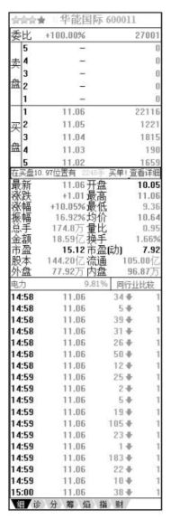

1. 委比

委比是衡量委买盘和委卖盘对比情况的一个实际指标，计算公式为：

委比=（委买手数-委卖手数）÷（委买手数＋委卖手数）×100％

委买手数=现在所有个股委托买入下五档之手数相加总和

委卖手数=现在所有个股委托卖出上五档之手数相加总和

通过委比的计算方法可以看出，其数值为＋100％～-100％，委比值-100％～＋100％是一个买盘逐渐增强、卖盘逐渐减弱的过程；相反，＋100％～-100％则是一个买盘逐渐减弱、卖盘逐渐增强的过程。

2. 涨停板的盘口形态

涨停板是一种极端的价格走势，也是一种特殊的盘口形态，它的出现源于涨跌停交易制度。上海、深圳两交易所规定，上市交易的股票以上一个交易日收市价为基点，在一个交易日内的价格涨跌幅度不得超过10％。

在盘口分时图中，当个股上冲至涨停价位后，若买盘力度依旧强于卖盘力度，股价不回落的话，就会出现“一”字形态的走势，这种形态犹如股价停留在上面的板上，所以称为涨停板。同理，当个股跌至跌停价并无力回升时，也会出现“一”字板走势，这就是跌停板。

下图所示为白云机场（600004）2015年7月9日涨停板分时图，个股早盘阶段受连续大买单向上扫盘推动，向上封住涨停板，并且，在上封涨停板之后，由于大买单并没有撤掉，而是稳稳地挂在买1位置，这使得个股再也没有开板，而是一直牢牢封住涨停板直至收盘。

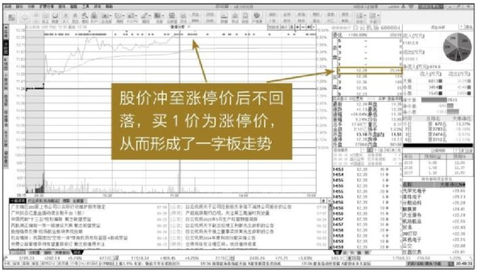

3. 涨停盘口的弱势板特征

弱势型的涨停分时图，可以概括为 “宽”“晚”“开”三点。

“宽”是指个股的盘中振幅相对较大，一般来说，会超过10％。即个股在大盘中出现跳水，随后走高并封板，或早盘低开幅度较大，随后逐渐走高并封板。
“晚”是指个股的封板时间较晚，多在午盘14：00之后。

“开”是指上冲封板后并未牢牢封住，而是在随后较长时间内出现开板，或者封板与开板在很长时间段内不断切换。开的时间越长，反复开合的次数越多，涨停板就越弱势。

下图所示为上汽集团（600104）2015年7月9日分时图，个股振幅较大，从开盘到封盘，振幅超过13％，冲板时间较晚，下午临近15：00才冲顶，而且短暂冲顶后略有回落，直至15：00停止交易也未能牢牢封板，这就是典型的弱势型。

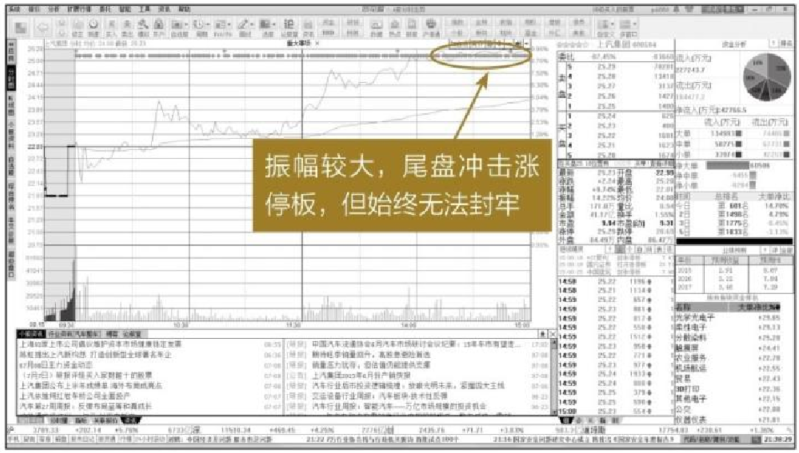

4. 涨停盘口的强势板特征

对于强势型的涨停分时图，其特点概括为 “窄”“早”“牢”三点。

“窄”是指个股的盘中振幅相对较小，一般来说，不宜超过10％。即个股最好适当高开，且盘中回探幅度较小。

“早”是指个股的封板时间宜早不宜晚，能够在早盘10：30之前封板最好，最晚不宜超过14：00。

“牢”是指上冲封板后牢牢地封死了涨停板，或者略作休整，即牢牢封板，此后的盘中交易时间段不再开板，涨停价堆积了大量的委托买单，场外投资者再挂单买入，是无法成交的。“牢”是强势板最关键的特征，只要个股始终无法封牢涨停板，即使封板时间早，盘中振幅小，这样的涨停分时图也绝不是强势型的。

## K线图

K线图（Candlestick Charts，因为candlestick前面的字母发“k”音，故称为K线图）又称蜡烛图、日本线、阴阳线、棒线、红黑线等，常用说法是“K线”，起源于日本18世纪德川幕府时代（1603—1867）的米市交易，用来计算米价每天的涨跌。因其标画方法具有独到之处，人们把它引入股票市场价格走势的分析中，经过300多年的发展，已经广泛应用于股票、期货、外汇、期权等证券市场。

1. 单根K线的构成

单根K线记录了某一交易周期内的价格波动情况，它由开盘价、收盘价、最高价、最低价4个价位组成，中间的矩形称为实体，实体上端的细线叫上影线，下端的细线叫下影线，实体的长短代表收盘价与开盘价之间的价差。开盘价低于收盘价代表价格上涨，这种K线称为阳线，中间实体部分常以空白或红色来表示；开盘价高于收盘价代表价格下跌，这种K线称为阴线，中间实体部分常以黑色或绿色表示。单根K线如下图所示，左边为阳线，右边为阴线。

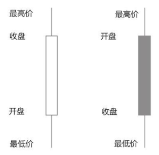

2. K线的形态所代表的市场含义

实体线是开盘价与收盘价之间的一段矩形区域，K线实体的长短代表的是多空双方的力量对比。当出现阳实体时，表明个股在当日开盘后至收盘前一段时间内，多方力量占有优势，阳实体越长，则多方的优势越明显；反之，当出现阴实体时，表明个股在当日开盘后至收盘前一段时间内，空方力量占有优势，阴实体越长，则空方的优势越明显。在上涨行情中，由于多方力量处于主导地位，因而以阳实体居多，且阳实体线较长；在下跌行情中，因为是空方力量处于主导地位，所以以阴实体居多，且阴实体线较长。

影线的出现反映了多空双方当日的盘中交锋情况，且影线越长，则多空双方的交战越激烈。一般来说，上影线的出现说明多方曾在盘中发起过攻击，但成果不是很理想，上影线体现了多方在当日的拉高股价过程中所受到的挫败程度，上影线越长，则说明当日多方受挫力度越大。若长的上影线出现在个股前期涨幅较大的背景下，则多意味着空方力量已开始持续释放，是个股走跌的信号。

下影线与上影线正好是相对应的，下影线的出现说明空方曾在盘中发起过攻击，但是成果并不明显，下影线体现了空方在当日的打压股价过程中所承受的反抗程度，下影线越长，则说明当日空方反抗力度越大。若长的下影线出现在个股前期跌幅较大的背景下，则多意味着空方力量已开始持续枯竭、多方买盘已开始介入，是个股走势止跌上扬的信号。

3. K线所代表的时间周期性

单根K线记录了一定时间周期内的价格波动情况。依据K线所反映的时间周期的不同，把K线分为分钟K线、日K线、周K线、月K线等。其中，日K线和周K线在技术分析时用得最多。

日K线记录了个股股价（或大盘指数）在一天内的价格波动情况，它以每个交易日的开盘价、收盘价、最高价、最低价绘制而成。

周K线记录了个股股价（或大盘指数）在一周内的价格波动情况，它以每个交易周的周一的开盘价、周五的收盘价、本周最高价和本周最低价绘制而成。

在股票行情软件中，出现在日K线下方的柱状图代表了日成交量（出现在分时线下方的柱状图则代表每一分钟的成交量，也称分时量），柱状越长，则当日成交量越大，如下图所示。

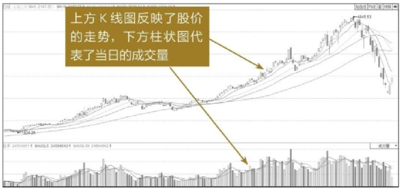

## 同花顺主界面看盘

同花顺的主界面是同花顺软件的核心部分，在同花顺的主界面中，投资者不仅可以看到各个交易所、商品、基金等市场报价情况，还可以看到大盘的分时走势图、大盘的K线走势图、个股的分时走势图、个股的K线走势图。

### 市场行情报价

投资者可以通过同花顺的【报价】菜单来查看市场行情报价，例如，单击【报价】菜单【沪深股票】选项【上海A股】选项，如下图所示。

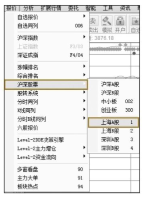

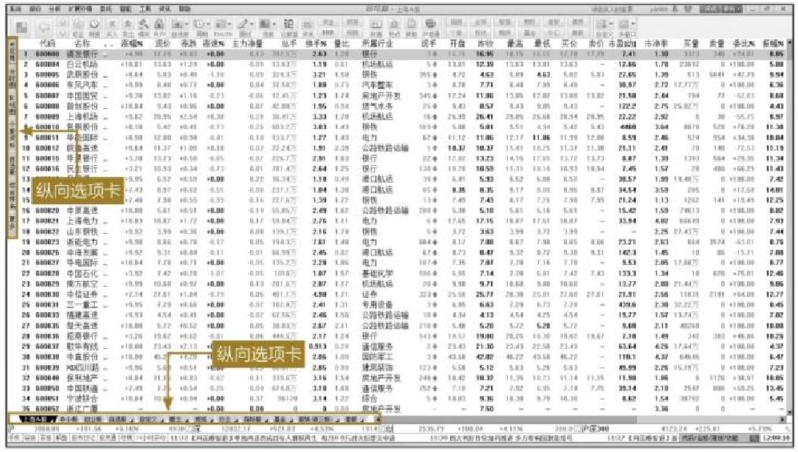

市场行情报价窗口主要包含一个横向列表选项卡和一个纵向列表选项卡。

纵向列表选项卡位于行情窗口的左侧，主要包括【分时图】、【K线图】、【个股资料】、【自选股】、【综合排名】等几个选项卡。

横向选项卡主要包含各个常用板块的名称，通过单击横向选项卡，可以切换到不同的板块报价窗口。一些横向选项卡中可以看到图标，它表明在这个选项卡的下面还有其他内容，单击并在弹出的菜单中选择相应的选项即可进入。例如，单击【行业】右下角的图标，即可打开行业选项，如下图所示。

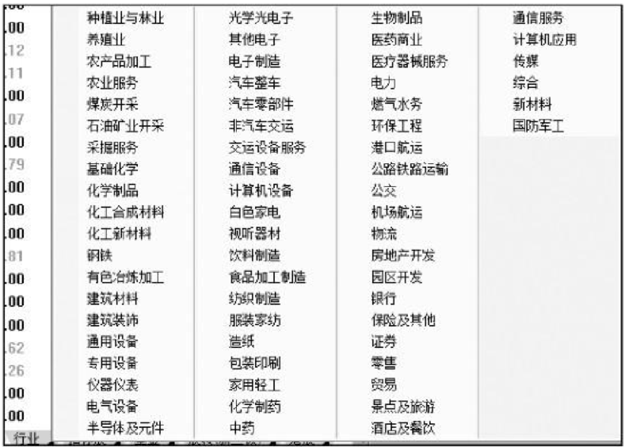

单击【化工合成材料】选项，即可进入化工合成材料个股行情报价页面，如下图所示。

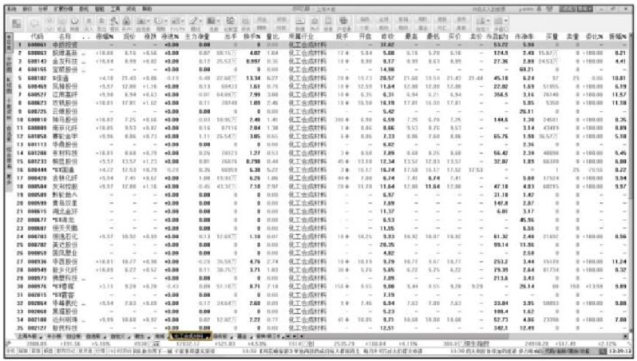

在市场行情报价窗口中，可以看到股票行情的代码、名称、涨幅、涨速等行情统计信息。单击某一项的名称时，股票行情报价的数据信息就会按照该项目的升降序重新排列。

### K线走势

同花顺的K线走势图分大盘K线走势和个股K线走势，在同花顺软件主界面可以通过以下几种方法进入K线图。

单击主界面左侧的K线图选项卡，进入大盘或所选股的K线。

不论主界面位于哪个选项卡下，按【F5】键都可以进入大盘或所选股的K线。

通过键盘精灵直接输入大盘的简称或代码（个股的简称或代码），然后按【Enter】键即可进入大盘（个股）K线图。

> **提示：**当界面位于分时图选项卡时，通过双击可以进入K线图。

1. 大盘K线走势

大盘一般指上证指数和深证成指。在键盘精灵中输入“04（或SZCZ）”，然后按【Enter】键，即可进入深证成指的K线走势图，如下图所示。

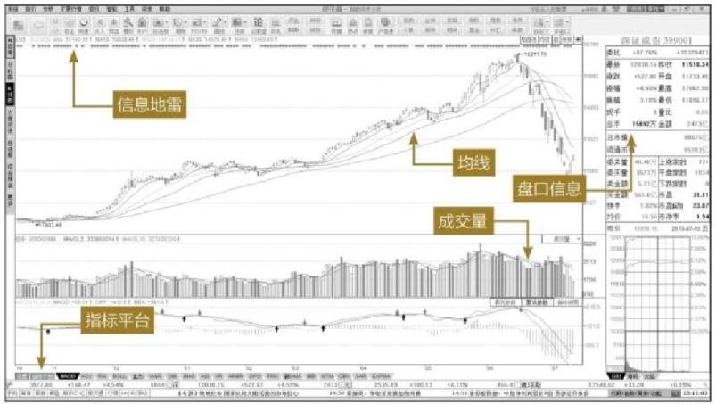

【信息地雷】：信息地雷位于K线图的上方，主要显示K线所对应时期的重要信息，单击每一个信息地雷图标可以打开【历史信息地雷】对话框，如下图所示。

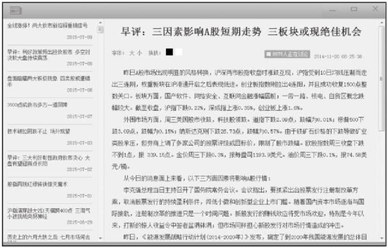

【均线】：均线即“MA（Moving Average）”，原本的意思是移动平均，由于将其制作成与K线交织在一起的一系列线条，所以一般称为移动平均线，简称均线。均线有5日均线、10日均线、20日均线、30日均线、60日均线、120日均线和240日均线。

5日均线、10日均线、20日均线是短线操作的参照指标，称作日均线指标；30日均线和60日均线是中期均线指标，称作季均线指标；120日均线和240日均线是长期均线指标，称作年均线指标。

均线的计算方法是将某一时间段的收盘股价或收盘指数相加的总和，除以时间周期，即得到这一时间的平均线，如5日移动平均线，就是将近5日的收盘价相加除以5，得到的就是第一个5日平均线，再将第一个5日平均线乘以5减去第一日的收盘价加上第6日的收盘价，其总和除以5得到的就是第二个5日平均线，将计算得到的平均数画在坐标图上连成线，即是5日平均线。其他移动平均线的计算方法以此类推。

【成交量】：以柱状线条图显示每个分时周期内成交量的变化情况，单击右侧的【成交量】按钮，在弹出的下拉菜单列表中，可以选择【多周期成交量】、【虚拟成交量】、【金额】、【换手率】、【内盘】、【外盘】等行情图示信息，如下右图所示。

在成交量走势图中，双击成交量走势图标题栏的任意位置，即可打开【技术指标参数设置—成交量】对话框，可以对曲线的参数进行设置，如下左图所示。

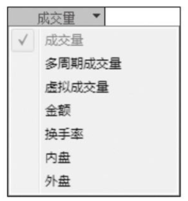

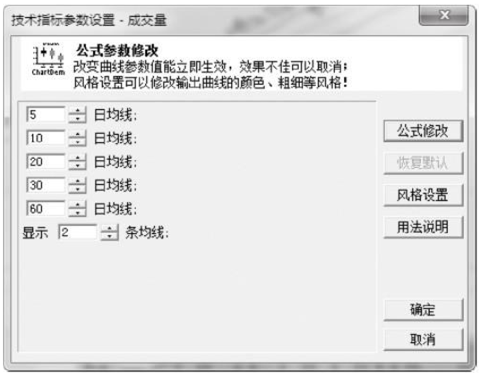

【指标平台】：通过单击不同的选项卡，可以查看相应的指标走势图。单击指标右侧的【指标说明】按钮，可以查看当前所选指标的【指标使用说明】对话框。

【盘口信息】：大盘的盘口信息有【分时】、【筹码】和【火焰】三个选项卡。【分时】选项卡显示了涨跌、涨幅、总市值、流通市值、市盈率以及大盘的分时走势图。【筹码】选项卡显示筹码分布图。【火焰】选项卡显示火焰山图。三个选项卡显示的信息如下图所示。

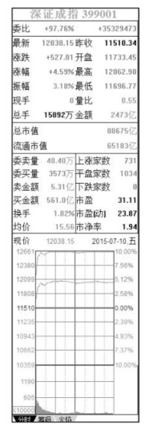

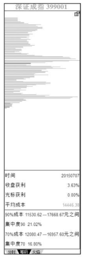

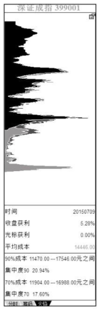

2. 个股K线走势

个股的K线走势图和大盘的K线走势图的形式和包含内容基本相同，所不同的是盘口信息。在键盘精灵输入“601318”并按【Enter】键进入中国平安的走势图，如下图所示。

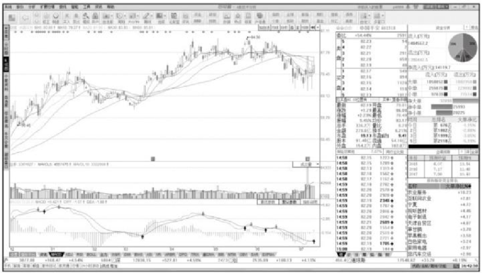

与大盘K线图相比，盘口信息多出了【细】、【诊】、【指】、【财】几个选项卡。

【细】：可以查看委托买卖的详细信息和最新成交的明细数据。

【诊】：可以查看到对当前个股基本面和走势情况的一个简短评价信息。

【指】：可以查看大盘的最近K线走势图和成交量。

【财】：可以看到显示个股最新公布的主要财务数据。

在K线图页面窗口，可以进行坐标系切换、叠加指标、选择指标以及修改指标参数等操作。下面以中国平安和长江投资为例来介绍这些功能。

在键盘精灵输入“601318”并按【Enter】键进入中国平安的走势图。

在K线图中右键单击，在弹出的快捷菜单中选择【坐标切换】【百分比坐标】选项，如下图所示。

　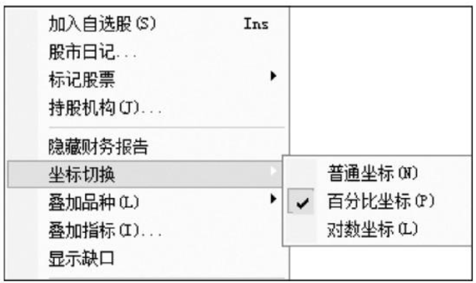

切换到【百分比坐标】后如下图所示。

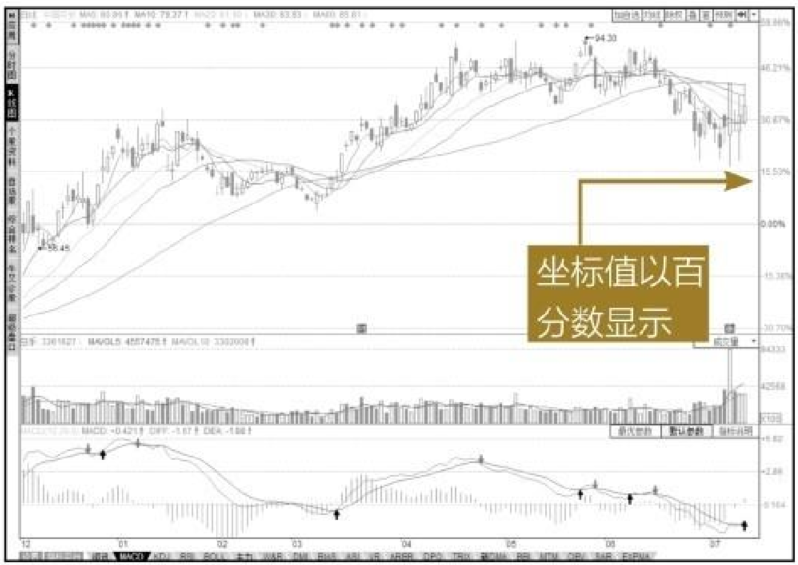

在中国平安的K线图中右键单击，在弹出的快捷菜单中选择【叠加品种】菜单选项，如下图所示。

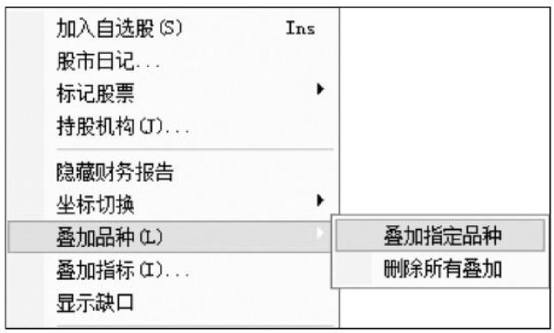

在弹出的【选择股票】对话框中选择一只进行叠加的股票，例如，选择【上证A股】【三一重工】，如下图所示。

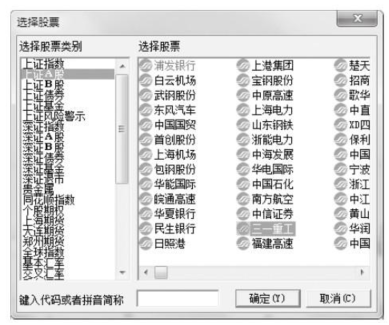

单击【确定】按钮，将三一重工的K线图和中国平安的K线图叠加后如下图所示。

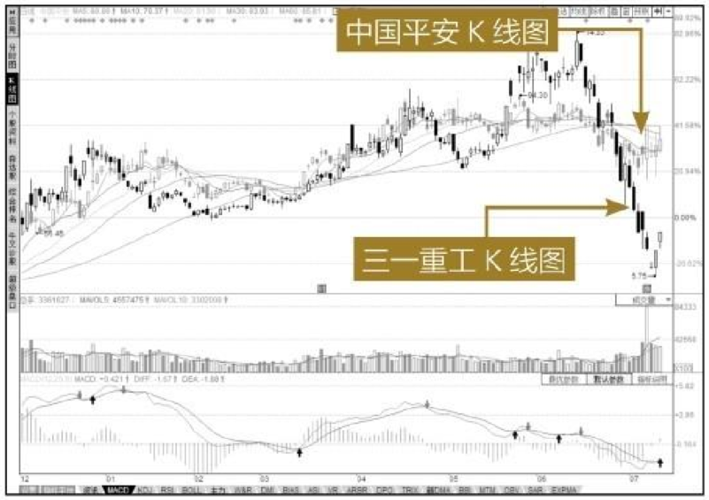

　在叠加后的页面单击右键，在弹出的下拉菜单中选择【平移曲线】，当光标呈现小手的图标时，可以通过拖曳来平移曲线，查看历史走势，如下图所示。再次单击【平移曲线】则取消平移功能。

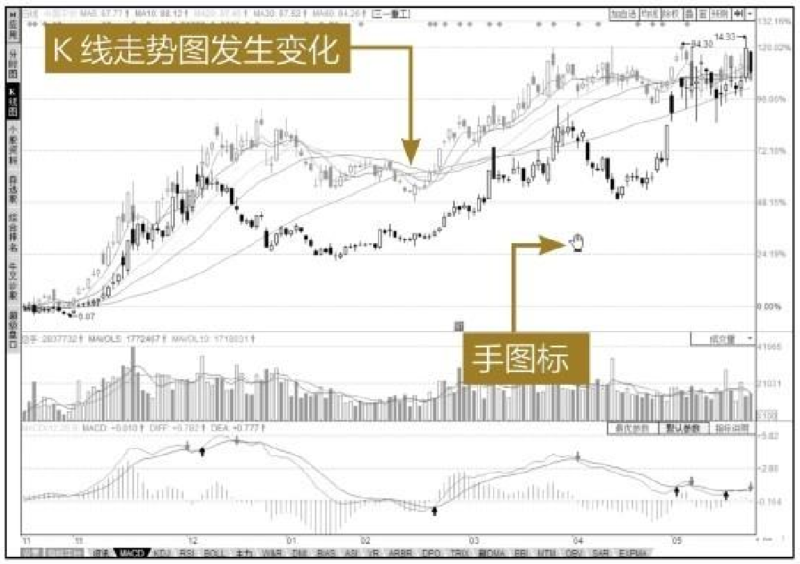

> **提示：**
>
> （1）两只股票的价格差距非常大时，间距较大，两只股票的K线图会变窄，难以辨认，此时最好将坐标切换到百分比坐标。
>
> （2）在叠加的K线上单击右键，可以删除或修改该K线。

## 同花顺的分析菜单

通过同花顺软件的分析菜单，可以查看分时图、超级盘口、成交明细、历史成交及多周期图等分析页面。这些页面的周密分析可以为投资者的决策提供更有力的保障。

### 个股资料

个股资料列出了一只股票的各项基本数据，通过个股资料，投资者可以方便地了解发行该股票的公司的财务状况。

1　打开同花顺软件，然后在键盘精灵输入“000014”（沙河股份）并按【Enter】键，进入沙河股份的分时图，如下图所示。

2　单击【分析】【个股资料】菜单命令（或单击左侧的【个股资料】选项卡也可以），进入沙河股份的个股资料页面，如下图所示。

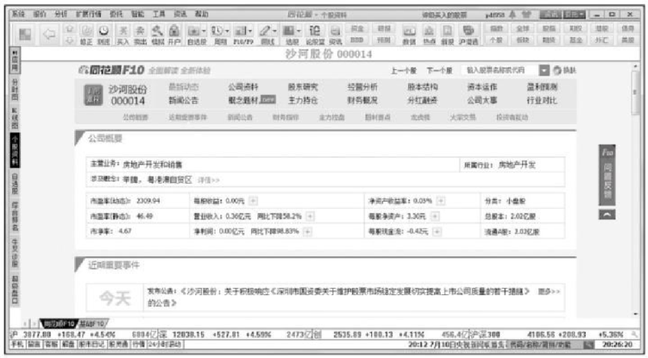

3　单击【股本结构】链接，可以看到该股的股本结构、A股结构图和A股历次股本变动情况，如下图所示。

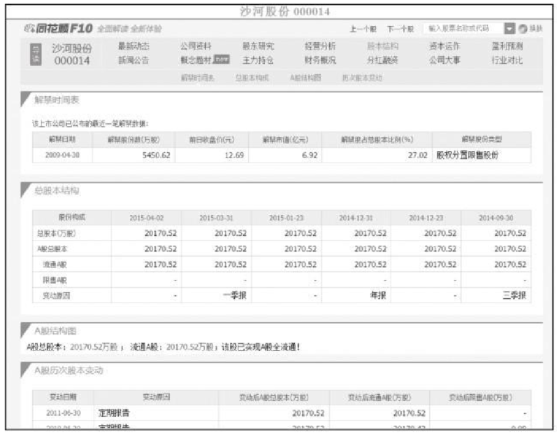

4   单击【财务概况】链接或【分红融资】链接，可以看到该股的财务情况和分红融资情况。如果要更简单直接地查看该股票的情况，可以单击【分时图】选项卡，在分时图界面按【F11】键，在打开的基本资料里可以查看该股的股本结构、权息状况、资产状况、盈利能力以及偿债能力等，基本资料如下图所示。

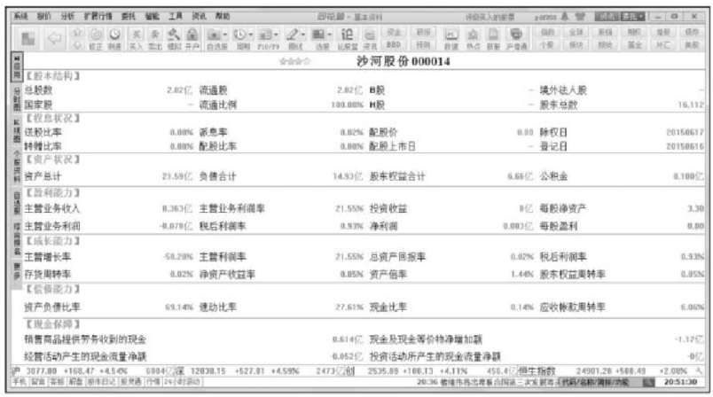

5　单击左侧【更多】选项卡，在弹出的菜单上单击【财务图示年报】选项，可以打开【财务图示年报】页面，如下图所示。

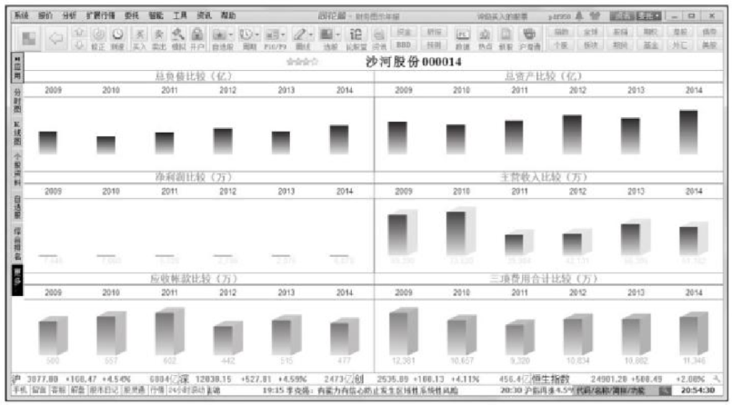

### 超级盘口

同花顺软件的超级盘口功能可查看任一股票的详细成交状况，并能将每一笔成交发生的买卖挂盘变化显示出来。

1　打开同花顺软件，然后在键盘精灵输入“XD中青旅”并按【Enter】键，进入XD中青旅的分时图，然后单击左侧的【超级盘口】选项卡，如下图所示。

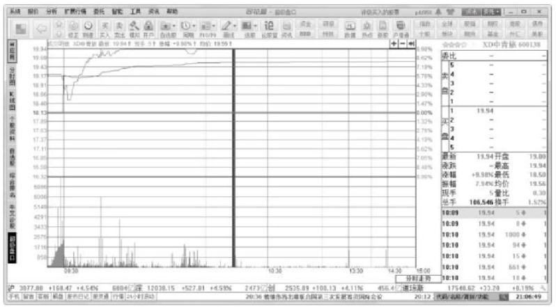

2　在超级盘口页面中，通过移动鼠标，可以查看任意时刻买卖盘状况，如下图是7月10日9：38的详细成交数据及涨幅百分比。

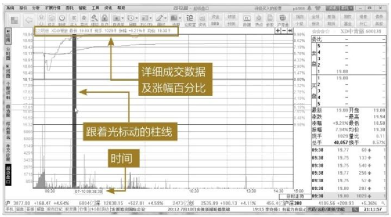

> **提示：**超级盘口除了可以查看个股的详细成交数据外，还可以查看大盘指数在某时间点的具体点位、涨跌点数、涨跌幅度及成交量等。

### 多周期图

周期图有1分钟、5分钟、15分钟、30分钟、60分钟、日线、周线、月线、季线和年线周期K线图，单击【分析】菜单【多周期图】，默认显示的是5分钟、15分钟、60分钟、日线、周线和月线6个周期的K线图。多周期图可以同时将多个周期的技术指标走势状况放在一起进行分析对比。

1　打开同花顺软件，然后在键盘精灵输入“600030（中信证券）”并按【Enter】键，进入到中信证券的分时图，然后单击【分析】菜单【多周期图】，如下图所示。

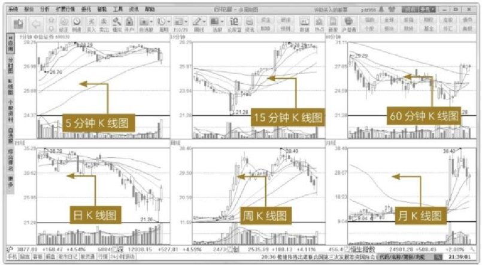

2　在5分钟K线图区域单击右键，然后选择【分析周期】【30分钟】选项，如下图所示。

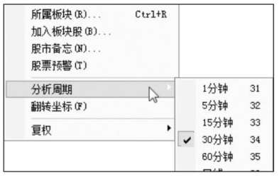

3　选择完毕后，5分钟K线将变成30分钟K线，如下图所示。

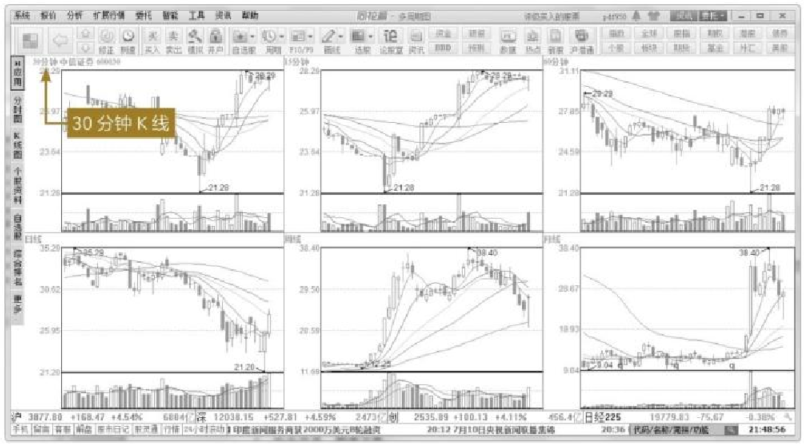

双击任意周期的K线图，可打开这一周期的技术分析页面。例如双击30分钟K线图，结果如下图所示。

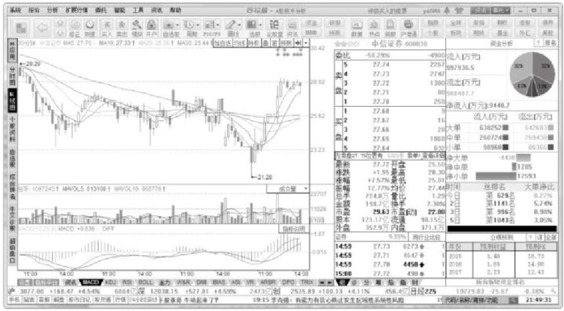

### 历史成交

历史成交页面列出了某只股票每个交易日的数据统计，包括当日开盘价、最高价、收盘价、涨幅、金额、换手率等。打开“600585（海螺水泥）”的历史成交的操作步骤如下。

1 进入海螺水泥分时图，然后单击【分析】菜单【历史成交】，如下图所示。

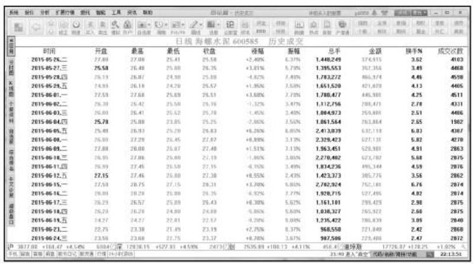

2    单击右键，然后选择【数据导出】【导出所有数据】选项，如下图所示。

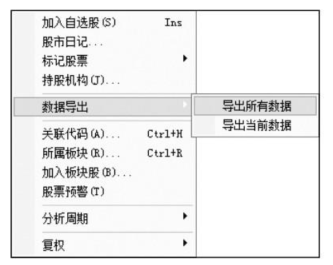

3　在弹出的【导入导出对话框模板】上选择导出文件的位置和类型，如下图所示。

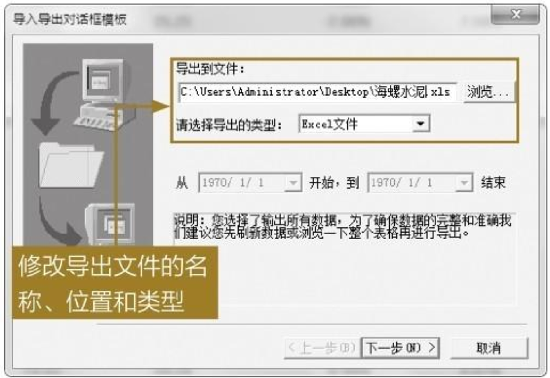

4　单击【下一步】按钮，选择所需要的数据，如下图所示。

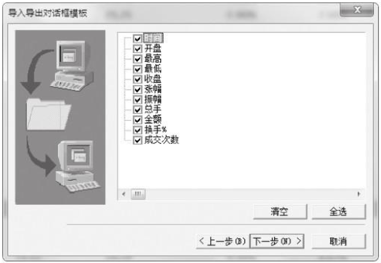

5   单击【下一步】按钮，开始准备和导出数据，当显示操作完成后，单击【完成】按钮，即可将历时成交数据以自己选择的类型导出到自己设置的位置，如下图所示。

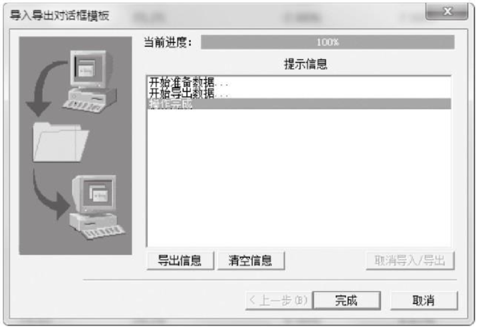

6　找到导出的数据文件，然后将它打开，结果如下图所示。

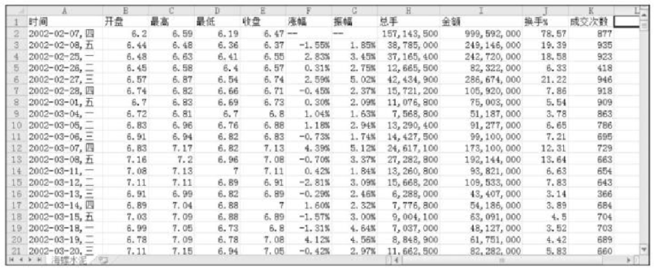

## 模拟炒股

模拟炒股完全仿照真实炒股中的操作，具有极强的真实性和锻炼意义。通过模拟炒股，投资者可以在无风险的情况下成为实战炒股高手，对于初入门的新股民来说，从模拟炒股开始练习更有意义。

1. 激活和下载委托管理

投资者在进行模拟炒股前，首先要激活和下载委托管理，激活和下载委托管理的具体操作步骤如下。

1　单击工具栏的模拟按钮，弹出【模拟炒股】界面，如下图所示。

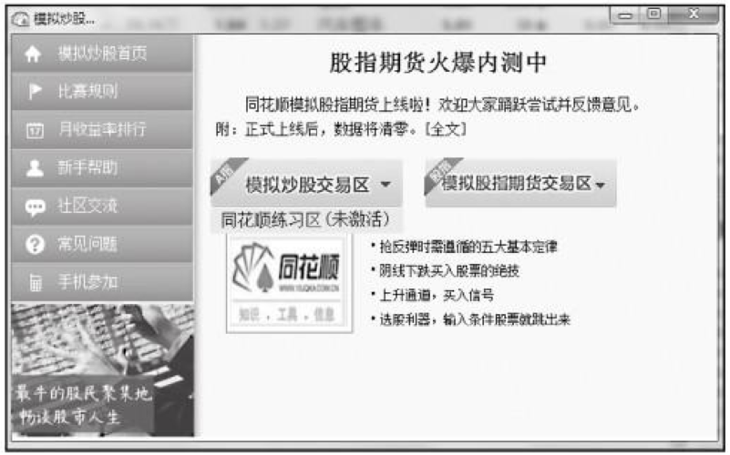

> **提示：**第一次会弹出【未激活】选项，激活后就直接弹出【同花顺练习区】选项。

2　单击【模拟炒股交易区】下拉菜单，弹出【同花顺练习区（未激活）】选项，单击该选项，弹出模拟炒股激活页面，如下图所示。

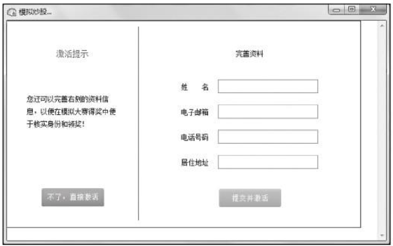

3    单击【不了，直接激活】按钮，弹出【委托管理】窗口，提示下载【模拟平台下单】，下载完成后如下图所示。

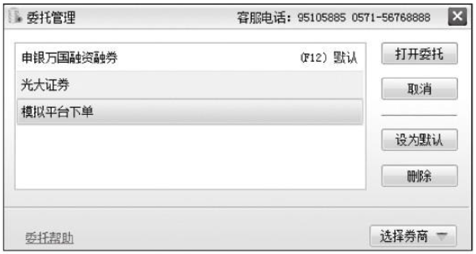

2. 买单

1　下载完成后，单击【打开委托】按钮即可进入模拟交易界面，如下图所示。

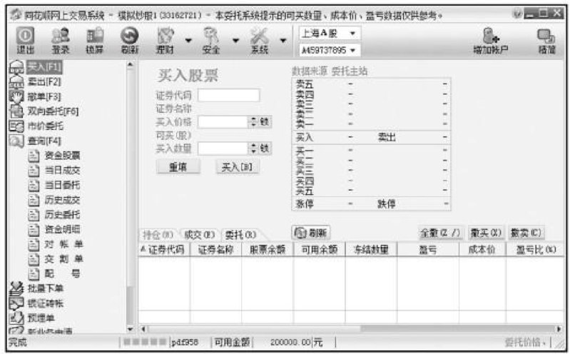

> **提示：**打开委托后，会弹出委托信息框，直接单击【确定】按钮将它关闭即可。第一次打开模拟炒股界面，界面位于当前窗口下方，该窗口是活动的，可以拖动到合适位置。

2　在【买入股票】输入框输入股票代码，输入买入价格及买入股数，如下图所示。

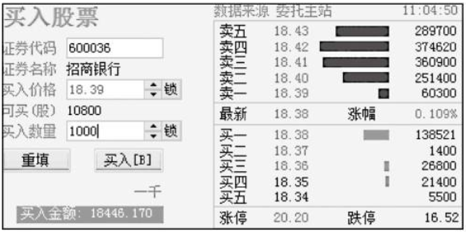

3　单击【买入】按钮，即可按设置买入相应股数的股票，然后弹出【委托确认】提示框，如下图所示。

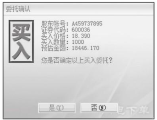

4　买入成功后，会弹出委托成功提示，如下图所示。

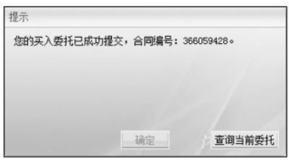

5    买入成功后，单击对话框下面的【持仓】选项卡，即可看到买入股票的信息及盈亏情况，如下图所示。

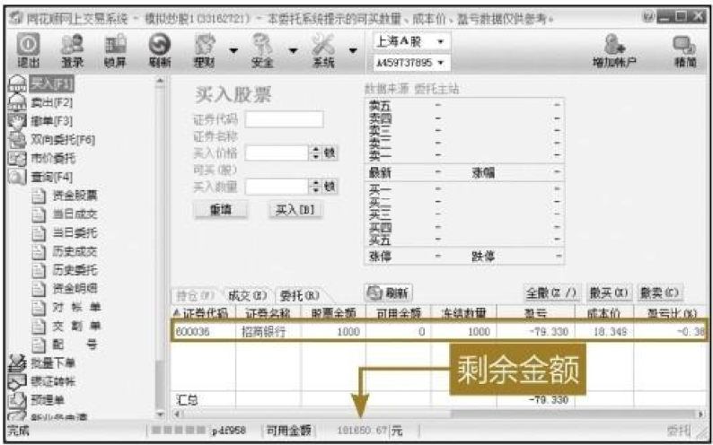

3. 撤单

因为买入时的价格是可以自己改动的，因此，如果设置的买入价格始终低于股票运行价格，则投资者就不会成功买入。在没有买入成功前，投资者是可以后悔，可以撤单的。

1　单击【撤单】选项，跳转到撤单界面，可以看到买入委托成功但未交易成功的股票，如下图所示。

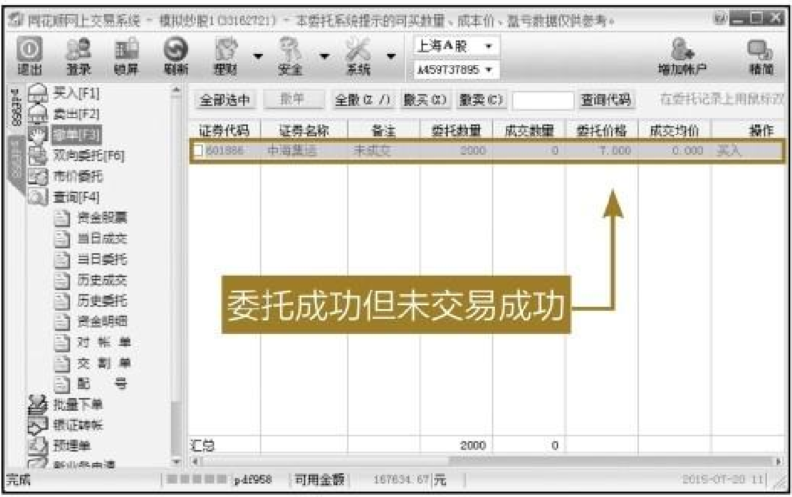

2　勾选未交易成功的股票，然后单击【撤销】按钮，弹出撤销提示框，如下图所示。

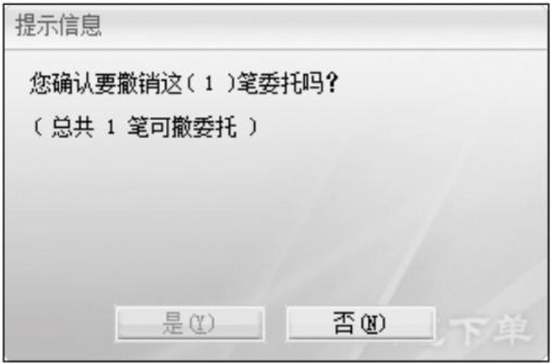

　3    撤单成功后，会弹出撤单成功提示框，如下图所示。

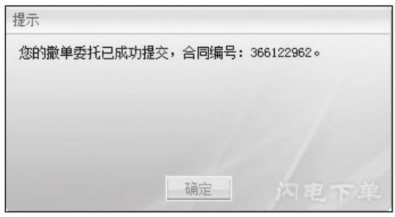

4. 卖出

买入成功后就可以卖出股票，由于我国股市实际交易实行的是“T＋1”制度，即投资者买入股票后第二天才能卖出，所以我们上面刚买入的招商银行股票今天是不能卖出的，但卖出操作是相同的，我们仅以它为例来介绍卖出操作。

1　单击【卖出】选项，跳转到卖出界面，在持仓选项卡下双击要卖出的股票，即可将该股票的当前信息显示在卖出输入框中，输入卖出股数，如下图所示。

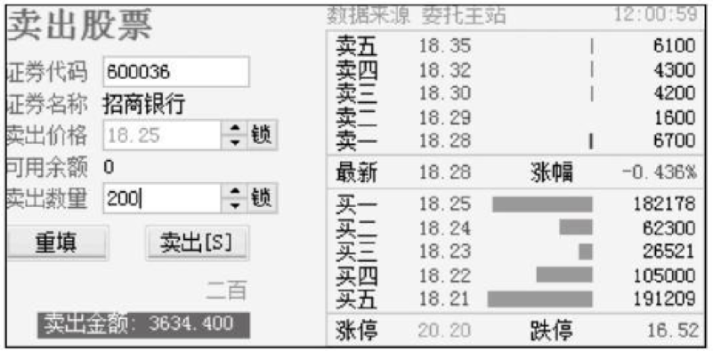

2　单击【卖出】按钮，弹出卖出委托确认提示框，如下图所示。

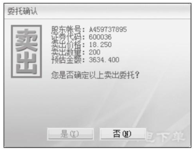

3    单击【是】按钮，即可将选择的股票按输入的股数卖出。

> **提示：**因为我们是违规操作，不符合“T＋1”规定，所以会提示我们提交失败，如下图所示。

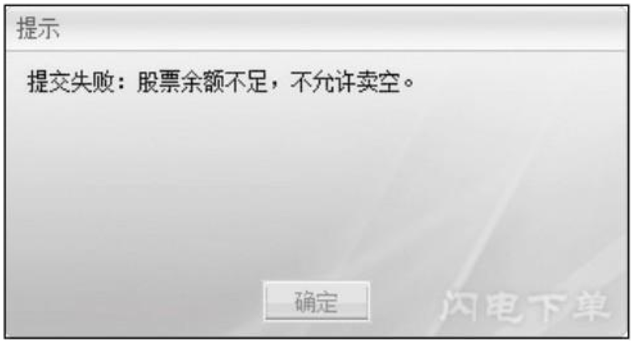

# 高手秘技

## 技巧1 分时同列和K线同列对比

通过同花顺的分时同列和K线同列，可以将几只股票的分时线和K线同时列出进行对比，对于持有几只股票的投资者来说，能非常方便的同时参看几只股票的动态情况。具体操作步骤如下。

1　单击工具栏【多窗口】的下拉按钮，选择【分时同列】【4股】，弹出当前相邻的四只股票的分时图，如下图所示。

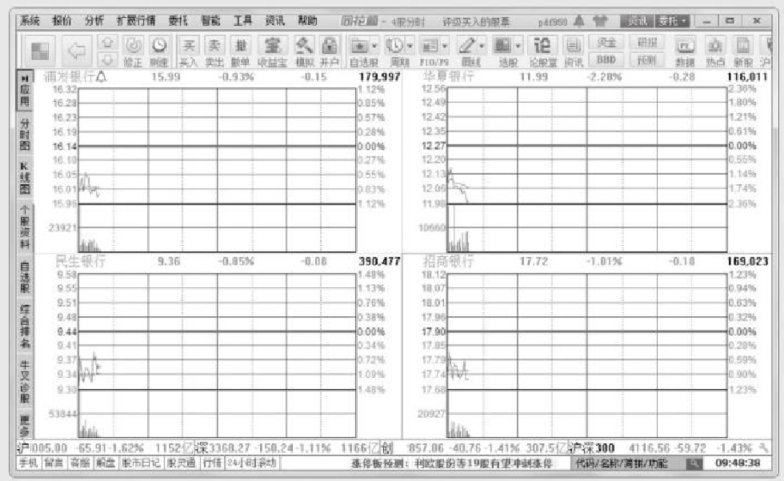

2    单击某个分时图的区域，然后输入需要查看的股票的代码，即可切换到需要的股票的分时图，例如单击浦发银行区域，然后输入代码“600090”（啤酒花），如下图所示。

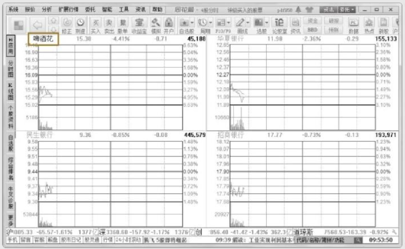

3　单击工具栏【多窗口】的下拉按钮，选择【K线同列】【4股】，弹出当前四只股票的K线图，如下图所示。

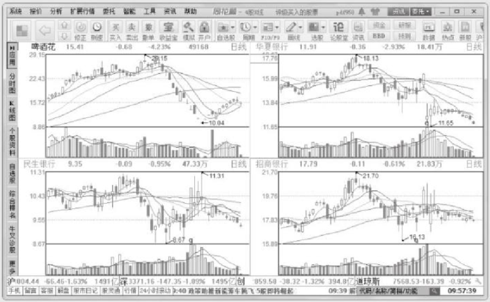

4    单击工具栏【多窗口】的下拉按钮，选择【分时K线同列】【4股】，可以同时查看4只股票的分时图和K线图，如下图所示。

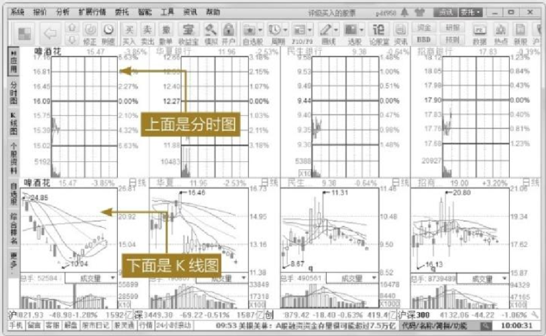

> **提示：**选择9只、16只还可以同时查看9只或16只股票的分时图或K线图，只不过同时查看的越多，显示得越紧凑。

## 技巧2 两股对比与大盘对照

两股对比不仅能显示两只股票的分时图对比，还可以同时对比两只股票的盘口信息。如果选择大盘对比，可以将个股走势和大盘走势进行对比。

1　单击工具栏【多窗口】的下拉按钮，选择两股对比，弹出两只股票（单击该区域接输入其他股票的代码可以切换股票）的分时图和盘口信息，如下图所示。

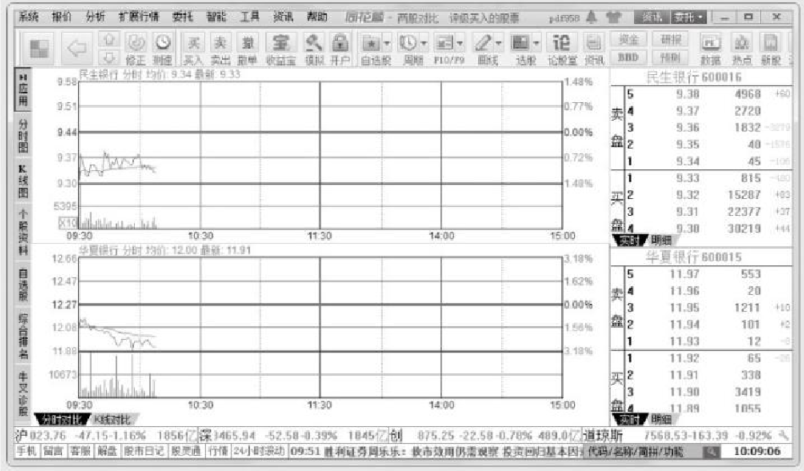

2    单击工具栏【多窗口】的下拉按钮，选择大盘对照，弹出当前股票（单击该区域直接输入其他股票的代码可以切换股票）和大盘的分时图及盘口信息，如下图所示。

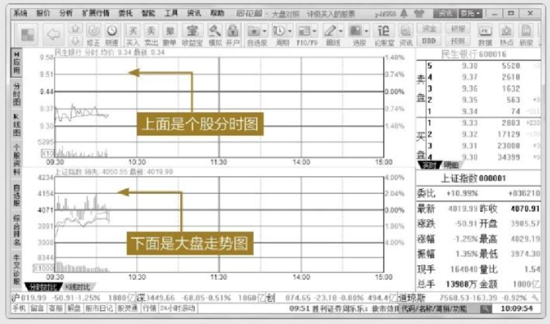