# 同花顺的控制中心

**本章引语**

> 图表能反映出一切股市或公司股民的总体心理状况！
>
> ——伯尼斯·科恩
>
> 同花顺软件不仅有丰富的图表，而且还能下载这些图表数据。此外还提供了公司管理以及画线工具，让投资者在走势图上做出自己的判断和分析。

**本章要点**

> ★ 控制中心相关设置
>
> ★ 数据的下载及管理

## 控制中心相关设置

这里所说的控制中心，主要是指同花顺软件的【工具】菜单，通过同花顺软件的【工具】菜单可以对同花顺软件的界面、工具栏、公式、数据下载等进行设置，同花顺的【工具】菜单如下图所示。

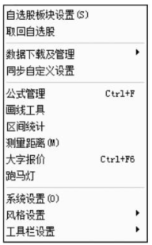

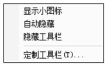

### 工具栏设置

使用【工具栏设置】菜单命令可以对主界面上方的工具栏进行调整。【工具栏设置】菜单有【显示小图标】、【自动隐藏】、【隐藏工具栏】和【定制工具栏】等选项。

1. 显示小图标

选择【工具栏】【工具栏设置】【显示小图标】菜单命令，可以将工具栏中的图标以小图标形式显示。

正常的工具栏图标和小图标对比如下图所示。

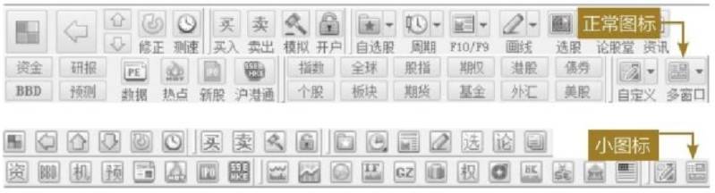

2. 自动隐藏

选择【工具栏】【工具栏设置】【自动隐藏】菜单命令，可以将工具栏中的图标隐藏。当工具栏隐藏后，只有鼠标移动到工具栏的位置，才能看到工具栏，如下图所示。

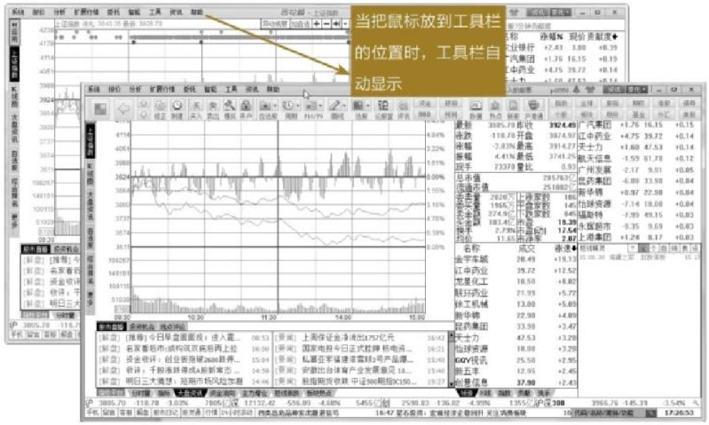

3. 隐藏工具栏

【隐藏工具栏】与【自动隐藏工具栏】的区别在于，前者是将工具栏完全隐藏，后者是当鼠标放在工具栏的位置时工具栏仍然出现。

当执行【隐藏工具栏】后，工具栏设置的其他选项不可用，如下图所示。

4. 定制工具栏

通过【定制工具栏】选项可以在工具栏中添加或删除按钮，并且可以改变各按钮的排列顺序。

1　选择【工具】【工具栏设置】【定制工具栏】菜单命令，在弹出【定制工具栏】对话框中将【测速】选项取消，然后勾选【撤单】和【收益宝】选项，如下图所示。

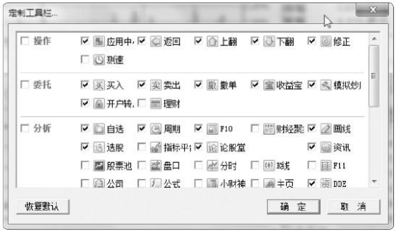

2　单击【确定】按钮，返回同花顺软件界面时，可以看到【测速】选项已经不在了，而同时多了【撤单】和【收益宝】选项，如下图所示。

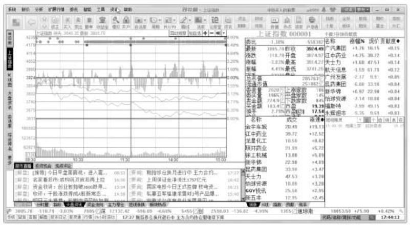

### 画线工具设置

【画线工具】里有直线、射线、平行线、通道线、八浪线、五浪线、头肩底、M头、W底、江恩线、角度线、矩形、圆、文字工具、上涨箭头和下跌箭头等。

在同花顺软件中调用画线工具通常有两种方法：一是通过【工具】【画线工具】菜单命令调用；二是通过单击工具栏【画线】图标。

选择【工具】【画线工具】菜单命令调用，弹出【画线工具】菜单，如下图所示。

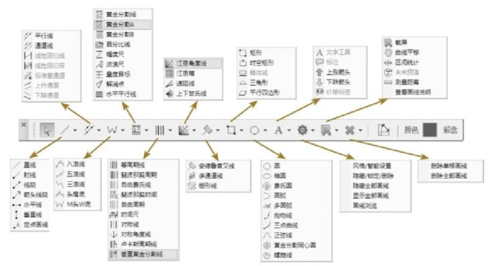

1　进入上证指数的K线图，单击工具栏【画线】图标，在弹出的菜单栏上选择【M头W底】选项，在K线图上拖曳光标选择要画线的区域，如下图所示。

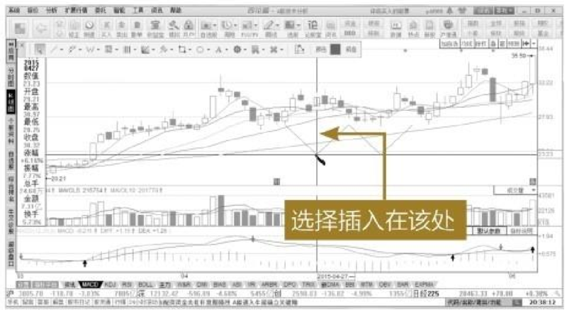

2    插入后，按住端点进行调节，如下图所示。

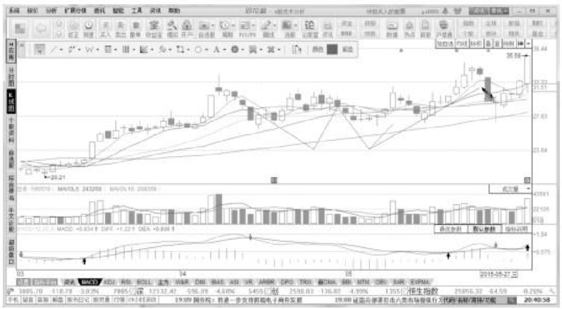

3　重复执行步骤1、2，给K线图添加直线和给成交量区域添加椭圆，结果如下图所示。

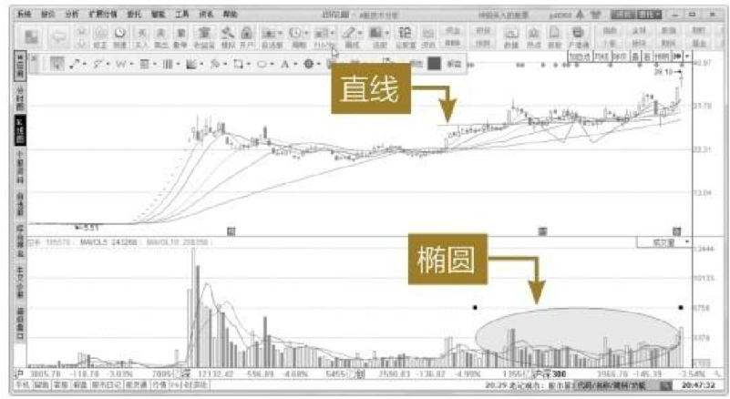

4    选择【删除】【删除单根画线】选项，当鼠标变成“”时，在需要删除的对象上单击，例如单击直线，即可将直线删除，结果如下图所示。

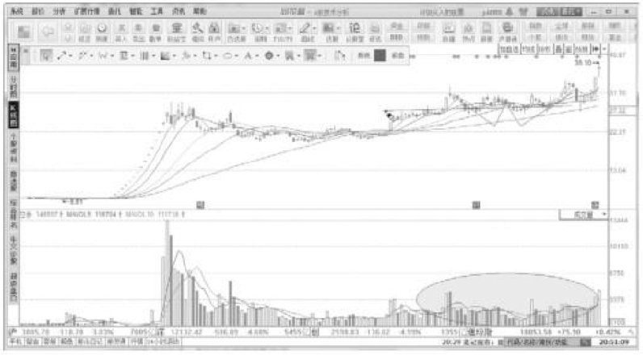

5　选择【删除】【删除全部画线】选项，页面弹出提示框，提示是否删除当前页面所有画线，单击【确定】按钮，即可将当前页面的所有画线删除，结果如下图所示。

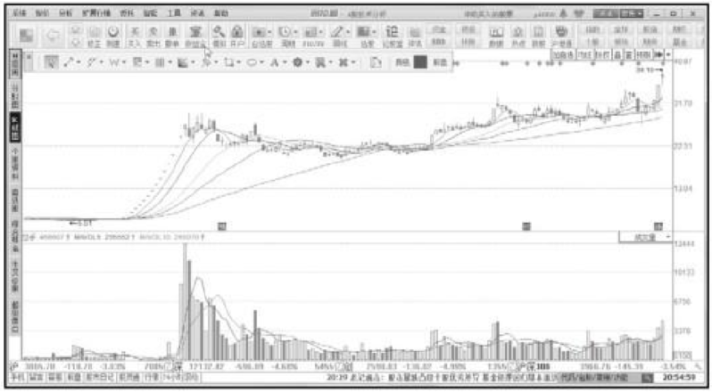

### 自选股板块设置

投资者可通过选择【工具】【自选股板块设置】菜单命令，在打开的【自选股板块设置】对话框中根据自己的需要选择自选股，并根据需要可以将它们分成不同板块，然后进行颜色设置等。

1. 添加自选股

1　选择【工具】【自选股板块设置】菜单命令，弹出【自选股板块设置】对话框，如下图所示。

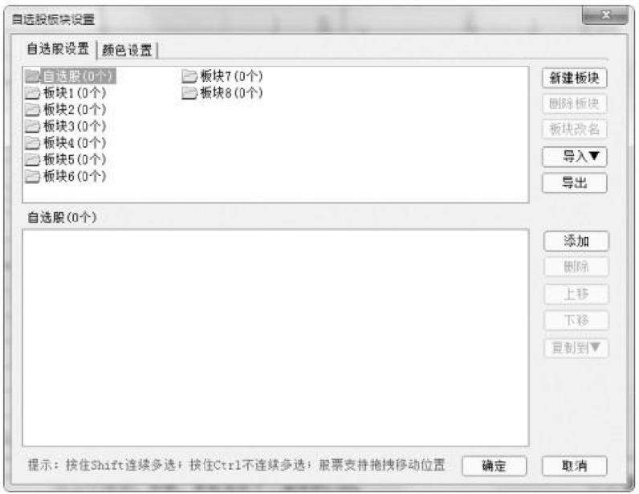

2　单击【自选股】，然后单击【添加】按钮，在弹出的输入框中输入所要添加的自选股的代码，如下图所示。

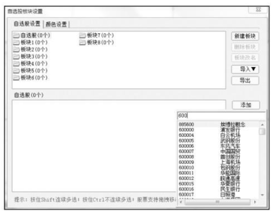

3    输入好代码后，双击所选择的股票或选中后按【Enter】键，即可将该股票添加到自选股中，如下图所示。

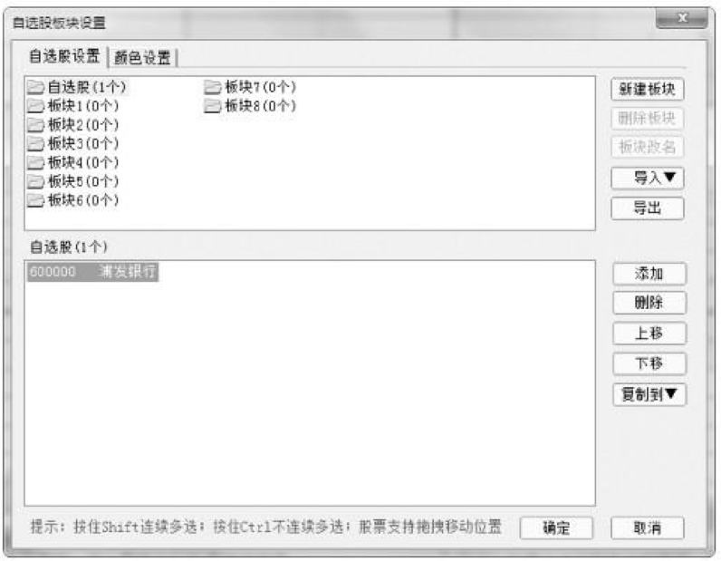

4　重复执行步骤2～3，继续添加自选股，完成后如下图所示。

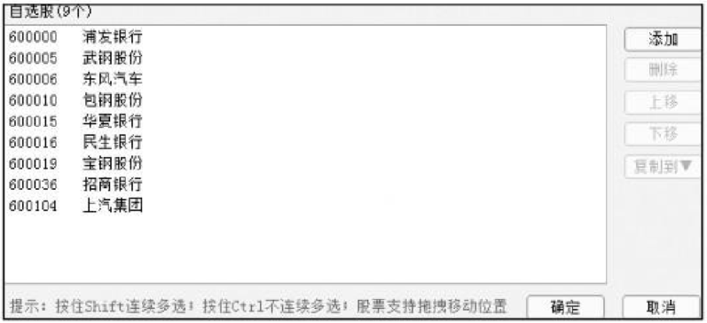

5    按住【Ctrl】键选中华夏银行、民生银行、招商银行，然后拖动鼠标，将它们放到浦发银行下面，完成后如下图所示。

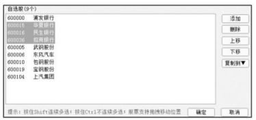

6　重复执行步骤5，将包钢股份和宝钢股份放到武钢股份下面，结果如下图所示。

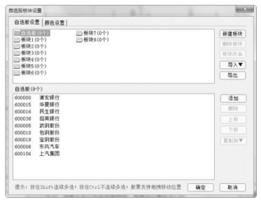

2. 创建板块股

1　选中4个银行股，然后单击【复制到】下拉按钮，选择【板块1】，如下图所示。

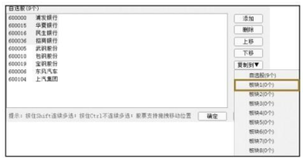

2　重复执行步骤1，将3个钢铁股复制到【板块2】，将2个汽车股复制到【板块3】，结果如下图所示。

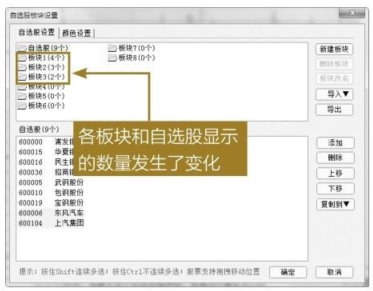

3    单击【板块1】，然后单击【板块改名】按钮，将名称改为【银行板块】，如下图所示。

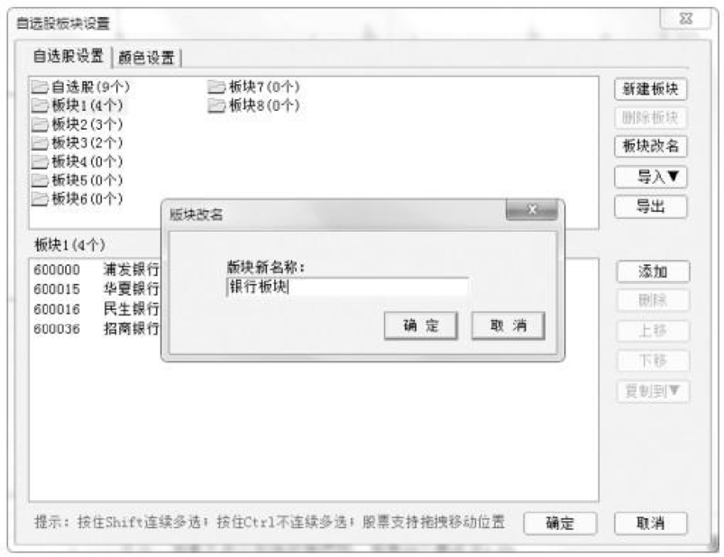

4　重复执行步骤3，将【板块2】的名称改为 【钢铁板块】、将【板块3】的名称改为【汽车板块】，结果如下图所示。

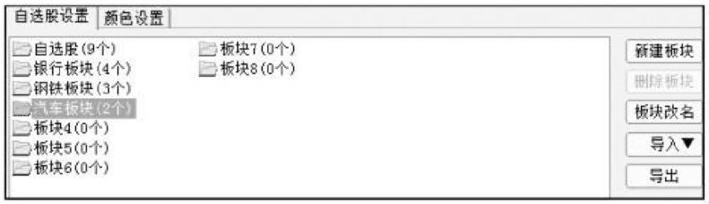

3. 设置板块股的颜色

1　单击【颜色设置】选项卡，如下图所示。

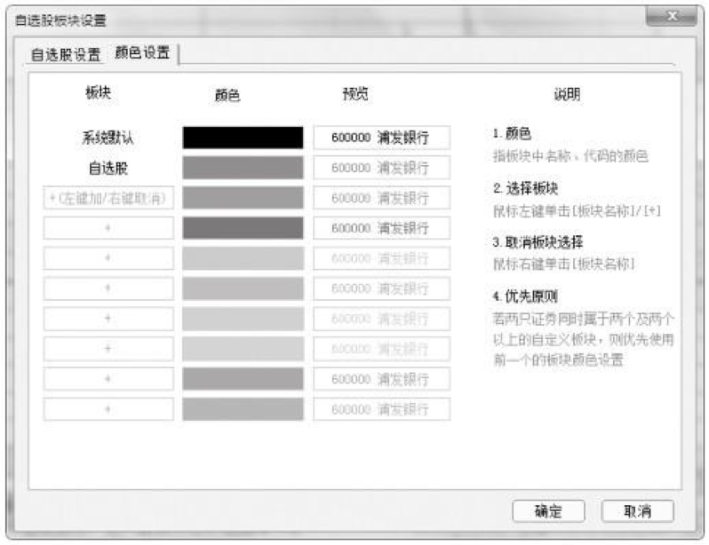

2　在红色对应的板块选项单击鼠标左键，在弹出的【请选择板块】选择框中，选择【银行板块】选项，如下图所示。

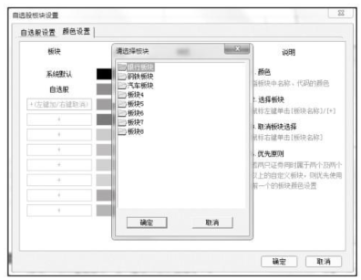

3    单击【确定】按钮，然后分别将钢铁板块的颜色设置为蓝色，将汽车板块的颜色设置为紫色，结果如下图所示。

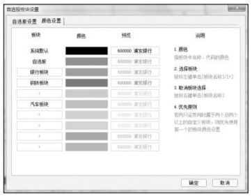

4　单击【确定】按钮，退出【自选股板块设置】对话框。在同花顺软件界面单击左侧的【自选股】选项卡，弹出所选股票的详细情况，如下图所示。

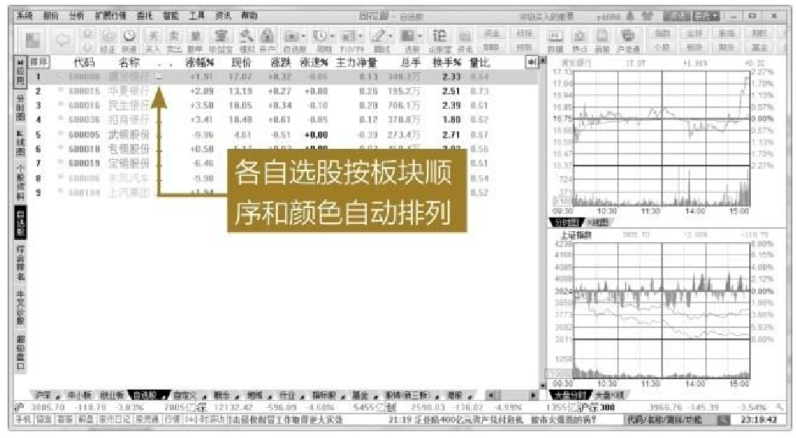

## 数据的下载及管理

同花顺的数据下载及管理主要包括数据下载、维护、导入和导出。选择【工具】【数据下载及管理】菜单选择相应的选项，如下图所示。

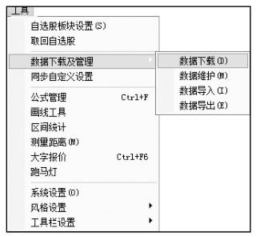

### 数据下载

使用数据下载功能，首先要连接到主站，然后将数据下载到本地计算机上。数据下载后，即使断开连接，也可以对股市行情进行查看和分析。

数据下载的具体操作步骤如下。

1　选择【工具】【数据下载及管理】【数据下载】菜单命令，弹出是否对主站进行测速对话框，如下图所示。

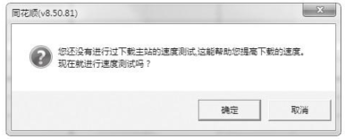

2　单击【确定】按钮，弹出【选择最优下载主站】对话框，如下图所示。

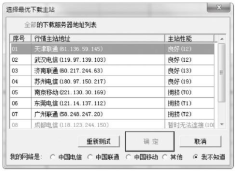

3　单击【中国电信】单选钮，然后在上方服务器地址列表中列出了性能良好的电信主站，如下图所示。

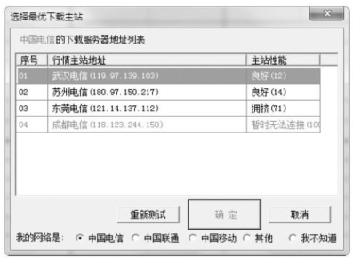

4　选择性能良好的主站，然后单击【确定】按钮，连接到主站后，弹出【数据下载中心】对话框，选择不同的选项卡，下载不同的数据，可以下载沪深选股数据、分钟K线数据、财务数据和扩展市场数据，如下图所示。

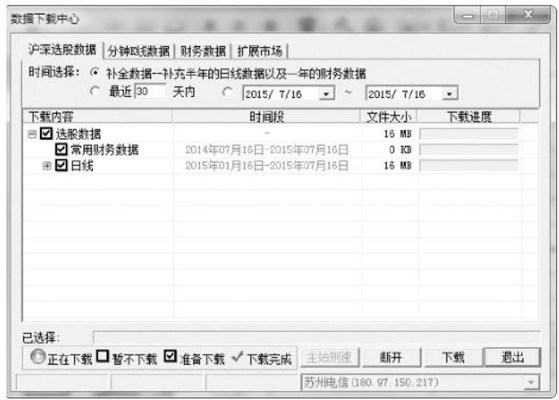

5    选择【沪深选股数据】选项卡，然后在列表框中展开数据类型，选中需要下载的的数据后，单击【下载】按钮，即可开始下载，如下图所示。

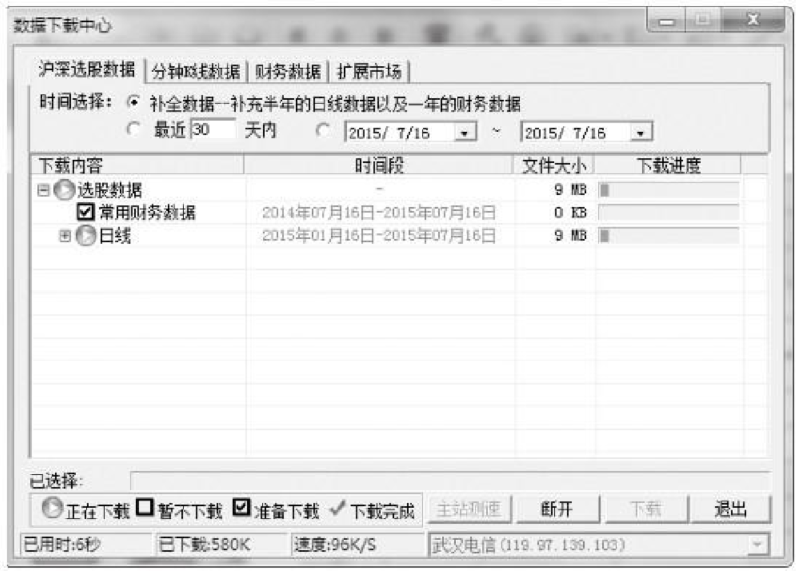

6　下载完成后，系统开始自动将下载数据导入，如下图所示。

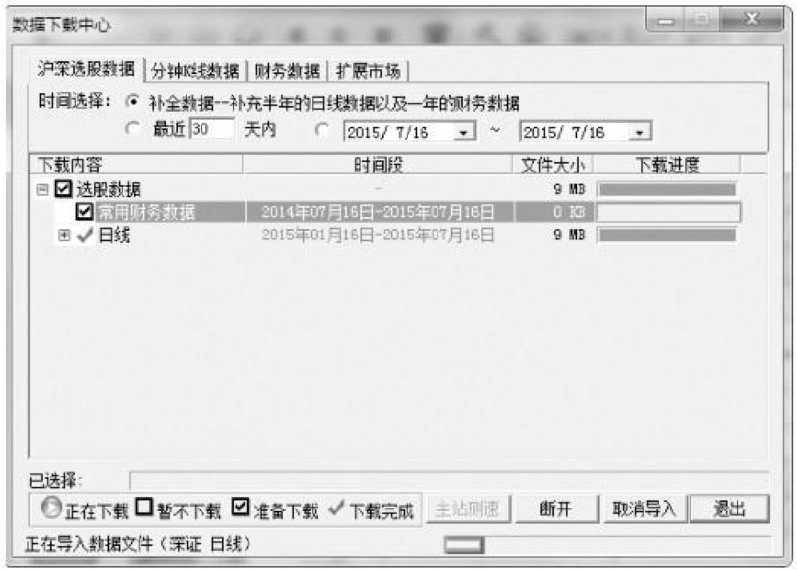

7    数据导入结束后，弹出数据导入完成提示框，单击【确定】按钮，即可退出数据下载中心，如下图所示。

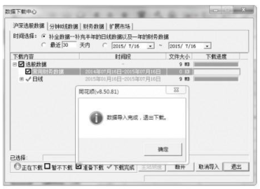

### 数据维护

使用数据维护功能可以对系统中指定的数据进行删除和整理操作，对混乱或错误的数据进行整理，删除掉不需要的数据，以释放更多的磁盘空间。

1　选择【工具】【数据下载及管理】【数据维护】菜单命令，打开【数据维护中心】对话框，如下图所示。

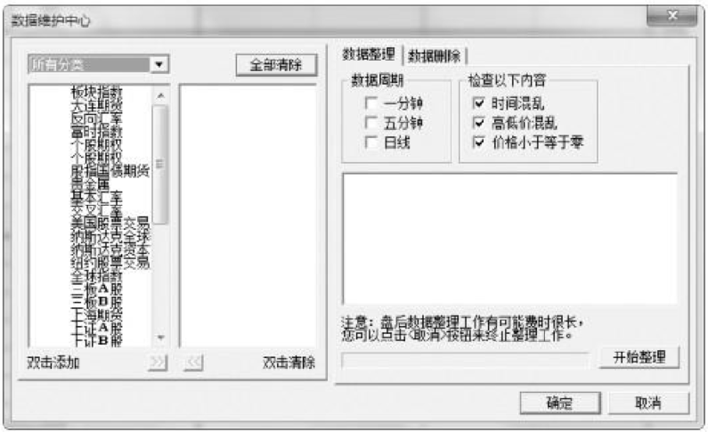

2    双击对话框左侧的数据，即可将它添加到右边的区域，如下图所示。

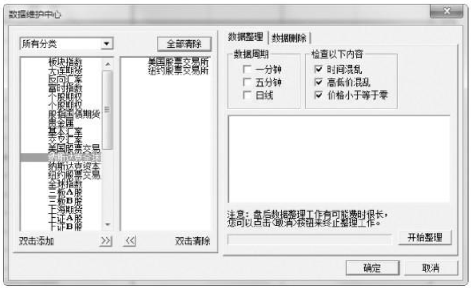

3　在【数据整理】选项卡的【数据周期】选项框中勾选【一分钟】，然后单击【开始整理】按钮，即可对数据进行整理，如下图所示。

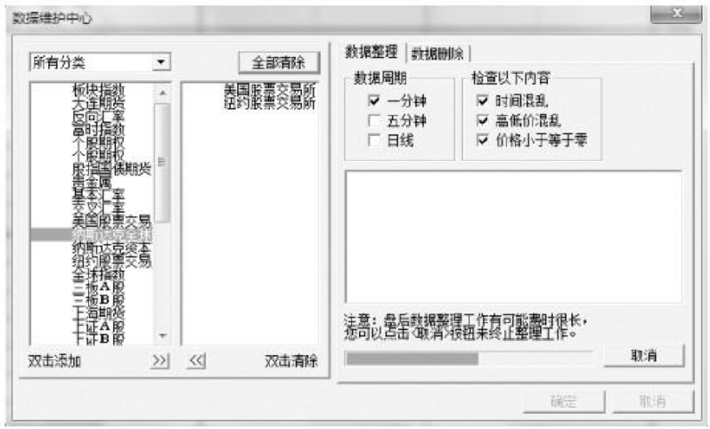

4    单击【数据删除】选项卡，在该选项卡下勾选想要删除的数据，设置好删除范围后，单击【开始删除】按钮，即可将对应的时段内的该数据删除，如下图所示。

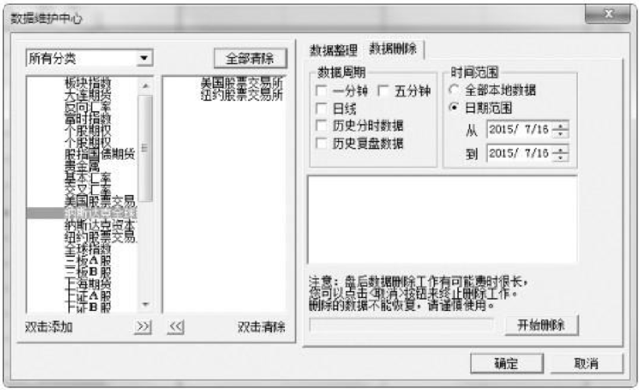

### 数据导入

数据导入功能是将计算机上的数据导入同花顺系统中，这些数据包括行情数据、财务数据、资讯数据等。

导入数据的具体操作步骤如下。

1　选择【工具】【数据下载及管理】【数据导入】菜单命令，弹出【数据导入工具】对话框，如下图所示。

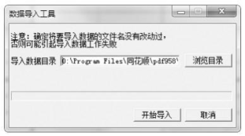

2    单击【浏览目录】按钮可以选择需要导入的数据文件所在的位置，选择完成后返回【数据导入工具】对话框，单击【开始导入】按钮，即可将指定的数据导入同花顺系统中，如下图所示。

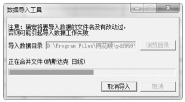

### 数据导出

数据导出与数据导入是一对相反的操作，数据导出是将同花顺系统中存在的各种数据导出到计算机上指定的位置，供他人下载、复制等。

数据导出的具体操作步骤如下。

1　选择【工具】【数据下载及管理】【数据导出】菜单命令，弹出【数据导出】对话框，如下图所示。

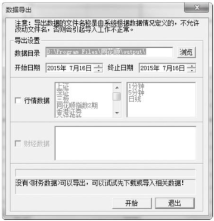

2　单击【浏览】按钮，可以选择导出数据的保存位置，如下图所示。

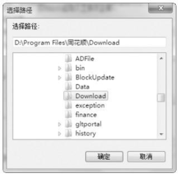

3　导出位置设置完成后，设置导出数据的日期，然后勾选【行情数据】复选框，并选择行情数据和周期，如下图所示。

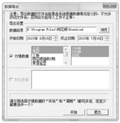

4    单击【开始】按钮，开始导出数据，如右图所示。数据导出成功后，单击【退出】按钮即可。

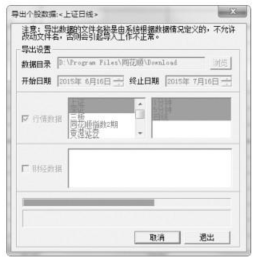

## 其他设置

除了上面这些设置外，工具栏菜单还提供了同步自定义设置、大字报价、跑马灯和系统设置等。这节就来介绍这些设置的具体操作。

### 同步自定义设置

同步自定义设置是将自定义指标、表格修改和预警设置等定义设置同步到服务器上，投资者如果在其他计算机上使用统一账号登录，可以在服务器上取回这些设置。

同步指定已设置的具体操作如下。

1　选择【工具】【同步自定义设置】菜单命令，弹出【用户自定义设置】对话框，如下图所示。

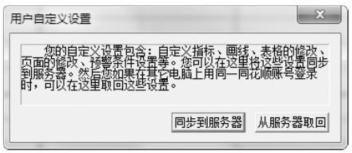

2　单击【同步到服务器】按钮，弹出提示上传配置成功提示框，如下图所示。

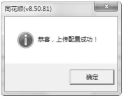

3　单击【确定】按钮，即可完成同步自定义设置。在另外一台电脑登录同花顺账号后，选择【工具】【同步自定义设置】菜单命令，打开【用户自定义设置】对话框，如下图所示。单击【从服务器取回】按钮，在弹出的提示框中，提示服务器上存在的同步自定义设置，如下图所示。

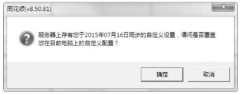

4    单击【确定】按钮，覆盖目前电脑上的自定义配置。然后弹出提示成功下载自定义配置，如下图所示，单击【确定】按钮，重新启动同花顺，并使配置生效。

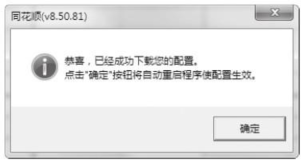

### 大字报价设置

大字报价顾名思义，就是用较大的字体显示股票的报价信息，大字体报价仅仅是将每只股票行情信息以大字体显示而已，其他对表格操作（如排序、移动、插入等操作）没变。

大字报价的具体操作步骤如下。

1　打开同花顺软件，选择【报价】【涨幅排名】【沪深A股涨幅排名】菜单命令，如下图所示。

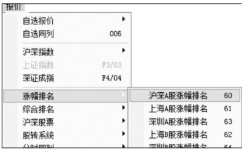

2　结果弹出【沪深A股涨幅排名情况】，排名显示的字体是正常字体，如下图所示。

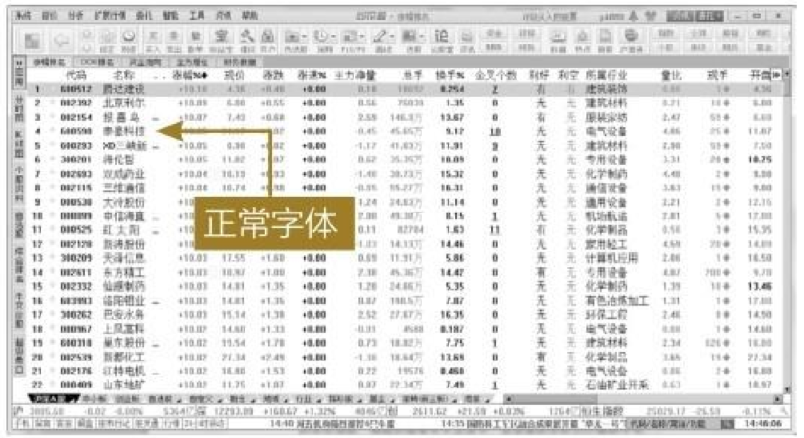

3　选择【工具】【大字报价】菜单命令，结果排名以大字体显示，如下图所示。

### 跑马灯设置

跑马灯是指以一个矩形条采用循环滚动的方式，显示股市行情报价信息。这种信息串首尾相连，向一个方向循环滚动，类似于跑马灯。

跑马灯的具体操作步骤如下。

1　选择【工具】【跑马灯】菜单命令，即可在当前弹出一个滚动矩形条来显示实时自选股的行情，如下图所示。

2　单击矩形条右侧的【设置】按钮，弹出【跑马灯设置】对话框，在该对话框上可以对滚动条的形式和速度进行设置，单击【滚动的内容】选项框的下拉列表，可以选择滚动的内容，如下图所示。

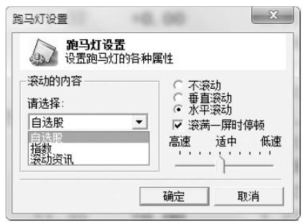

3　单击【改变滚动方式】按钮，可以在垂直滚动和水平滚动两种方式之间切换，如下图所示。

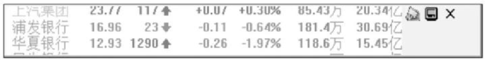

4　单击【关闭】按钮，可以关闭跑马灯效果。

### 统设置

系统设置对话框中包含了用户管理、分析周期、其他设置、性能选项、颜色字体和信息地雷等选项。

1. 用户管理

1　选择【工具】【系统设置】菜单命令，即可打开【系统设置】对话框，如下图所示。

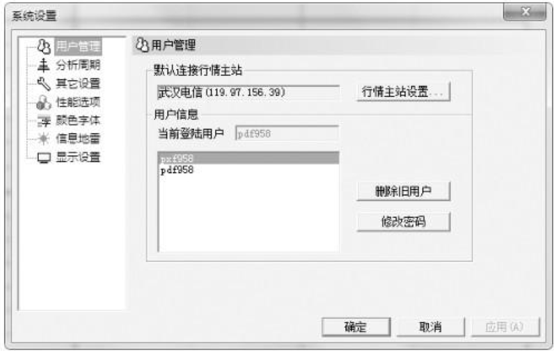

2    选中【用户管理】选项，单击【行情主站设置】按钮，可以打开【通讯设置】对话框，在该对话框中可以选择要登录的行情主站，并设置网络接入方式，如下图所示。

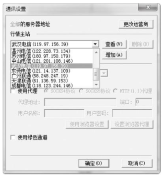

3　【通讯设置】完成后，单击【确定】按钮，返回【用户管理】设置界面后，在【用户信息】列表框中选择一个用户，单击【修改密码】按钮，在弹出的【修改用户属性】对话框中修改所选用户的密码，如下图所示。修改完成后，单击【确定】按钮即可。

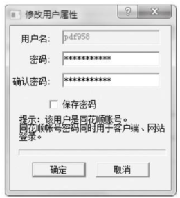

> 提示：如果选中的用户是当前登录的用户，则【删除旧用户】处于不可用状态，即当前用户不能删除。

2. 分析周期

在【系统设置】对话框中选择【分析周期】选项卡，可以看到已有的分析周期和每个分析周期的功能特色，如下图所示。

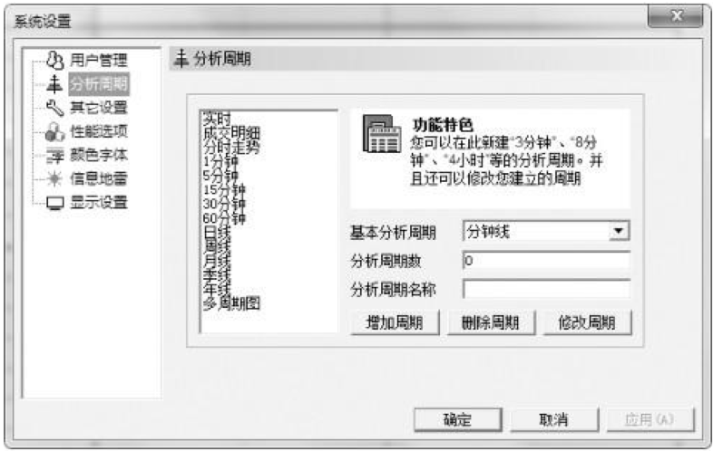

1    在【基本分析周期】下拉列表中选择【日线】选项，然后将分析周期设置为2，分析周期名称设置为【2日线】，如下图所示。

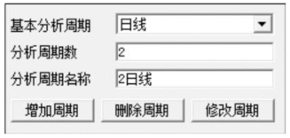

2　单击【增加周期】按钮，可将新建的周期添加到左侧的列表框。重复执行步骤1，继续创建【6分钟】和【半年线】，如下图所示。

3　选择【6分钟】分析周期，然后单击【修改周期】按钮，在弹出的【新增分析周期】对话框中将名称改为【3分钟】，【分析周期数】改为3，如下图所示。

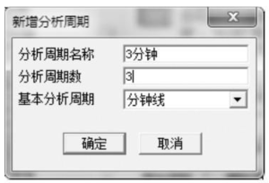

4　单击【确定】按钮，即可将【6分钟】线改为【3分钟】线。然后选中【2日线】选项，单击【删除周期】按钮，即可将【2日线】删除，结果如下图所示。

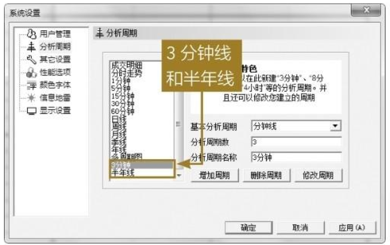

3. 其他设置

单击【系统设置】对话框【其它设置】选项卡，弹出如下图所示的其他设置界面。

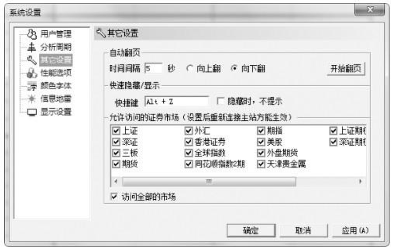

【自动翻页】：可以设置翻页的时间间隔和翻页方向。

【快速隐藏/显示】：在该区域可以设置【隐藏/显示】的快捷键，通过设置的快捷键可以显示或隐藏系统的程序界面。若不勾选【隐藏时，不提示】复选框，则在隐藏界面时会弹出提示框。

【允许访问的证券市场】：设置可以访问的证券市场，此选项需要重新连接主站方可生效。

4. 性能选项

单击【系统设置】对话框中【性能设置】选项卡，弹出如下图所示的性能设置界面。在该选项卡下，投资者可以根据自己的使用习惯和实际需要勾选不同的选项，完成后单击【应用】即可。

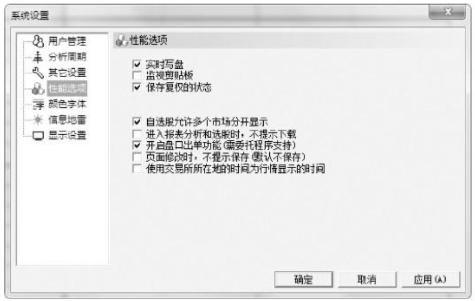

5. 颜色字体

【颜色字体】选项卡可对程序界面的各种颜色和显示字体进行设置，同时，根据需要还可以直接选择适合自己的方案。【颜色字体】选项卡的界面如下图所示。

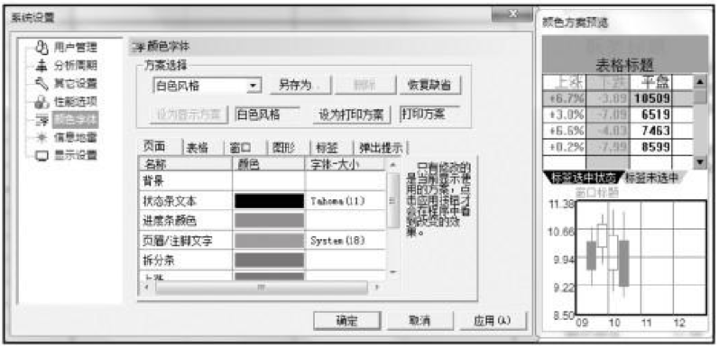

6. 信息地雷

在【信息地雷】选项卡下可以根据需要在【K线】和【分时线】中显示信息地雷的类型，如下图所示。

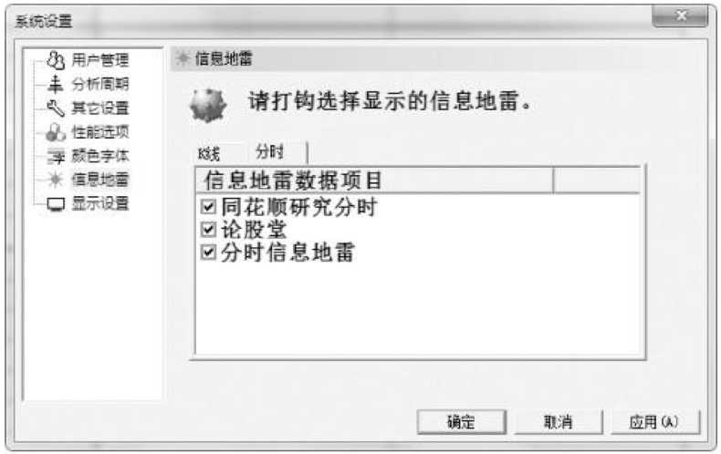

# 高手秘技

## 技巧1 测量涨跌幅度

使用【测量距离】功能可以测量起始日期到终止日期的距离、涨跌和幅度。具体操作步骤如下。

1　选择【工具】【测量距离】菜单命令，如下图所示。

2　当鼠标变成一把尺子的样子，按住鼠标左键，点住测量起点拖动到终点，就会显示这之间的距离、涨跌和幅度，如下图所示。

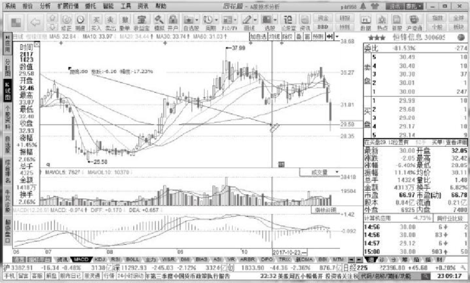

3    松开鼠标左键，鼠标变回尺子的样子，可以继续测量。再次单击【工具】菜单下的【测量距离】菜单命令，则可以正常使用其他功能。

## 技巧2 如何查看主力大单

同花顺系统可以提供每笔成交金额在100万元以上的主力大单异动数据，准确捕捉主力投资目标。

在键盘上输入“91”并按回车键，即可查看主力大单。

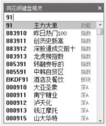

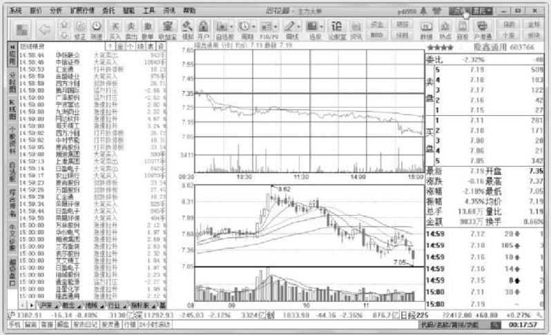

上图中，左侧为短线精灵，中间为个股分时和K线图，右侧为盘口报价。在左侧窗口的右上方可以在全部个股、单一个股间切换，单击【设】按钮，可以进行预警的设置。