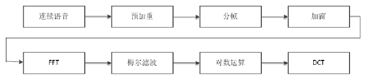

# EPD算法

## 概述

EPD通过能量检测和浊音检测相结合，首先找到能量非平稳的段落，然后在其中检测浊音，并在发现浊音后搜索语音精确起止点，实现了复杂噪声环境中的语音端点检测。算法总体流程如图所示

## 能量判断

首先分帧之后，由L帧语音构成一个分析窗，根据其中前r帧信号估计模型参数，并设定能量阈值 ，          (其中  是灵敏度系数，       ，可根据具体情况适当调节)，则可根据阈值，检验后l—r帧信号的能量是否平稳。每输入一帧信号，分析窗就后移一帧，并校正分布模型，重新计算 。之后根据特定算法[1]对该模型进行初始化以及更新，这样就得到了一个背景噪声的模型。
    之后根据每一个分析窗的信号谐波特征，选取5条相邻的谐波，之后根据这五条谐波是否满足能量大于阈值的要求，且都大于噪声，如果满足则判定语音信号的起点在该分析窗中。

## 浊音判断（共振峰）

浊音是由周期性声门脉冲激励声道而产生的。对纯净浊音信号加窗，则加窗信号在基音及谐波频率存在能量峰起。因为基频变化较缓慢，此特性在窄带语谱图上表现为一系列均匀平行亮线。多数噪声不具有这种谐波特性。

基音和谐波集中了浊音的主要能量，所以浊音在噪声干扰下仍能保持清晰的谐波特性。但是，语音的频域能量分布随基音和共振峰而变化，噪声的频域能量则随环境而改变。因此，在实际噪声环境中，语音的各频率分量所受干扰程度不同，并且处在不断变化中，浊音谐波特征较清晰的频段也随之变化。本算法根据人类浊音特性，在较宽的频率范围中自动搜索最清晰的谐波特征，并结合前后信息判断浊音是否存在。这样不仅可避免低频噪声和基音倍频的干扰，而且能自动适应噪声类型和强度的变化。

## 起点细查找

之后进行起点细查找，若在分析窗内检测到浊音，则结合能量检测的结果，通过能量细搜索寻找语音起点。从b开始，向前搜索语音起点帧b0，它满足如下条件：从b0的下一帧开始，信号能量逐帧递增。由于语音能量较大且变化迅速，所以语音起点附近的能量起伏很大，不会引起噪声模型的变化，能量阈值也不会升高。由于清音位于浊音前，且浊音能量远大于清音，所以根据前后h帧平均能量所找到的起点b一般处在比阈值能量更低的位置，即清音段或清浊音交界处，满足上述条件的b0就是语音起点

## 尾点判断

之后进行终点判决，若分析窗中任何一段长度为h帧的连续信号都不满足每帧能量大于  的条件（即背景噪音），则判定该分析窗的第1帧为语音终点。

# DNNVAD算法

## 概述

DNNVAD是基于DNN模型的VAD算法。对原始语音进行特征提取并输入DNN模型，根据DNN模型的输出概率值并结合维特比算法，对原始语音逐帧判别是否为有效语音，最后根据起尾点判别算法将原始语音中的有效语音截取出来。

## 特征提取

引擎使用梅尔频率倒谱系数（MFCC）作为声学特征，梅尔刻度是一种基于人耳对等距音高变化的感官判断而定的非线性频率刻度，与人耳听觉相符，是语音识别中常用的声学特征。MFCC特征提取模块主要流程图如下，语音输入后分别经过预加重、分帧、加窗、FFT、梅尔滤波、对数运算、DCT后形成每帧40维的MFCC语音特征，特征提取流程图如上

## 前向概率计算

提取特征之后，输入DNN模型中的，模块中的DNN模型执行了一个二分类的任务，即输出某一原始语音帧为有效音帧概率和为噪音帧的概率。我们目前采用全连接的深度神经网络（之后会考虑替换其他结构的神经网络）来得到每帧的概率输出。下图是一个典型的神经网络结构示意图，语音特征先后通过输入层、隐含层、输出层，与有效音帧概率与噪音帧之间建立复杂的映射关系。在实际运行中，将每一帧语音特征联合其前后数帧的特征作为输入矢量，检测该帧的所属的类别，之后将每帧的输出概率做为一个二维向量存储下来。

## 维特比算法

维特比算法的基础可以概括成下面三点：

1. 如果概率最大的路径p(或者说最短路径)经过某个点，比如途中的X22，那么这条路径上的起始点S到X22的这段子路径Q，一定是S到X22之间的最短路径。否则，用S到X22的最短路径R替代Q，便构成一条比P更短的路径，这显然是矛盾的。证明了满足最优性原理。
2. 从S到E的路径必定经过第i个时刻的某个状态，假定第i个时刻有k个状态，那么如果记录了从S到第i个状态的所有k个节点的最短路径，最终的最短路径必经过其中一条，这样，在任意时刻，只要考虑非常有限的最短路即可。
3.  结合以上两点，假定当我们从状态i进入状态i+1时，从S到状态i上各个节的最短路径已经找到，并且记录在这些节点上，那么在计算从起点S到第i+1状态的某个节点Xi+1的最短路径时，只要考虑从S到前一个状态i所有的k个节点的最短路径，以及从这个节点到Xi+1，j的距离即可。

根据DNN模型的输出概率，使用维特比算法，其中每帧的状态数总计有两个，即有效音与噪音，其生成概率为上一步DNN模型的输出结果，转移概率为经验值。之后通过维特比算法，将DNN输出的二维概率序列变为一个由有效音帧以及噪音帧组成的一维序列。

## 起尾点判断

利用DNN输出概率以及维特比算法之后，原始输入语音变为了一个有效音与噪音的一维序列。之后根据起尾点寻找算法来判断该序列中有效音的起点与尾点，其中步骤主要有：

1. 起点寻找算法：当某一有效音帧之后连续的有效音帧超过阈值后，则认为该帧为有效音段的起点；
2. 尾点寻找算法：当某一噪音帧之后连续的噪音帧超过阈值后，则认为该帧为有效音段的尾点；
3. 静音毛刺去除：当某一噪音段的帧数长度低于阈值时，认为该段噪音短为有效音段；