# 离线模型结构

## 总体架构

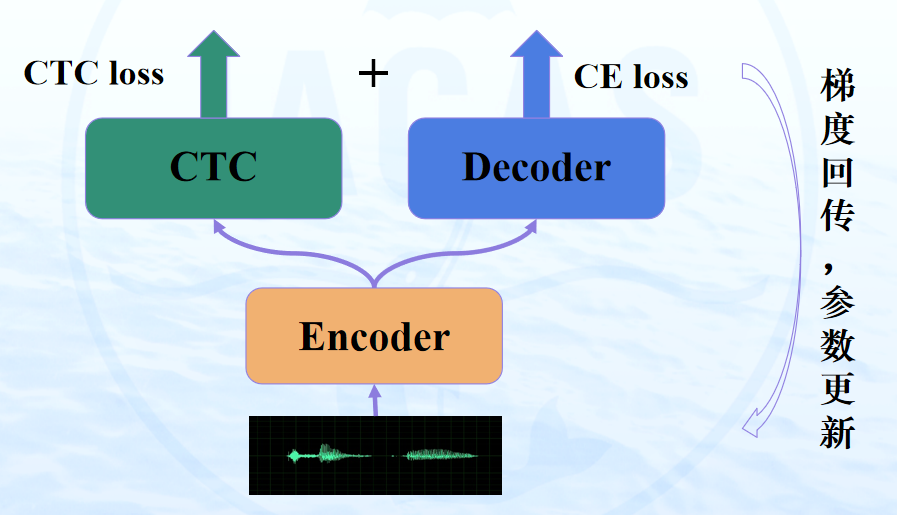

CTC和transfomer对比

|              | **CTC**  | **transfomer** |
| ------------ | -------- | -------------- |
| 输出语言模型 | 无       | 有             |
| 对齐         | 单调、硬 | 不单调、软     |

### 模型结构

#### transfomer

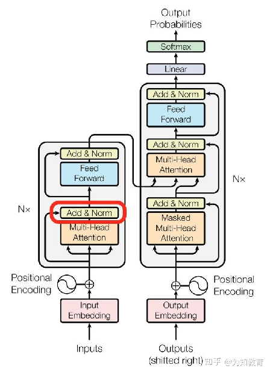

#### 前端神经网络

- 卷积层

1. 第一层卷积为64通道，3\*3卷积核，步长为2；第二层卷积为128通道，3\*3卷积核，步长为2, Y=Linear(ReLU(Conv(ReLU(Conv(X))))
2. 计算公式：**
3. 卷积层作用
    - 对特征进行4倍降采样
    - 利用卷积特性抽取声纹局部特征，获得高维特征

- 位置编码层

1. 位置编码层采用正余弦函数作为位置编码层，其计算公式如下：**
2. i代表位置，2k+1代表特征维度奇数维，2k+2代表特征维度偶数维，d_model代码特征维度
3. 最后位置编码矩阵为 P = [max_que_length,d_model]
4. https://zhuanlan.zhihu.com/p/106644634

- 前端神经网络输出为卷积层输出加位置编码信息：$Z_i = y_i + p_i$

#### Encoder

- 编码层由14个相同的block堆叠而成，每个block依次为一层层规范化网络、一层自注意力网络（SAN）、一层残差网络、一层层规范化网络、一层全连接网络和一层残差网络。

- 层规范化网络 **

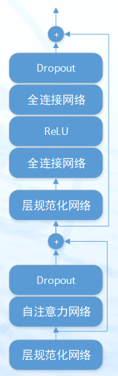

- 自注意力网络

1. encoder编码层输入特征维度320维，采用多头自注意力机制，这里注意力采用8头注意力机制，将特征进行分块，每块特征维度为40维，最后再将分块特征进行拼接，最终输出维度仍为320维，计算公式如下：***
2. 这里$d_k$代表特征块维度，主要对注意力分数进行缩放，防止分子数值过大在过softmax之后值过大或者过小。
3. https://www.zhihu.com/question/298810062

- ReLU激活函数
- 残差网络：网络堆叠很多层时，防止出现梯度消失和梯度爆炸
- Dropout层：Dropout是指在模型训练过程中以一定概率让神经元停止工作（置零），这样可使模型泛化能力更强，不容易过拟合。

#### Decoder

- 解码层由7个相同的block模块堆叠而成，依次为一层层规范化网络、一层自注意力网络（SAN）、一层残差网络、一层src注意力网络、一层层规范化网络、一层全连接网络和一层残差网络。
- 输入层
    - embedding层，将对应单字映射为特定维度的特征向量
    - 添加位置编码信息

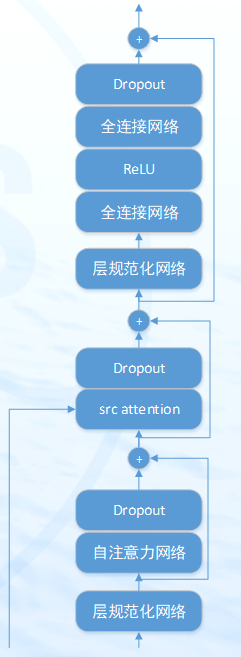

- src attention

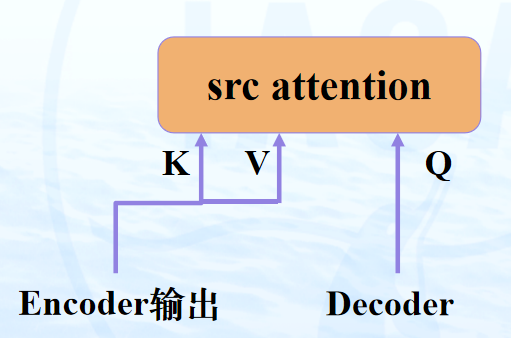

### 损失函数

#### CTC损失函数

- CTC（Connectionist Temporal Classification）损失

- CTC算法可以给定的X求出输出任意Y的概率，对于语音识别，通常X和Y的长度是不相同的，CTC可以自动学习输入和输出label的对齐

- CTC在训练时会在label之间插入<blank>

- CTC Alignment，举例说明，“cat”这个词

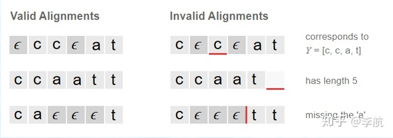

- CTC Loss

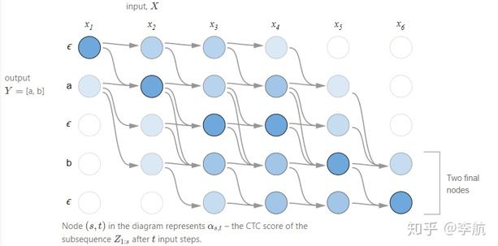

举例说明：Y=ab，Z=[ϵ, a, ϵ , b ,ϵ]

输出对应label的概率 P(Y│X)=α_Z−1+α_Z−1

对于一个训练集Ω，我们要最大化P(Y|X)，即最小化
∑_（X,Y）∈Ω▒−log(P(Y|X))

- CTC inference  **
- 方式一：直接取每一帧的最可能的输出，然后消除重复，移出ϵ  **
- 方式二：beam search

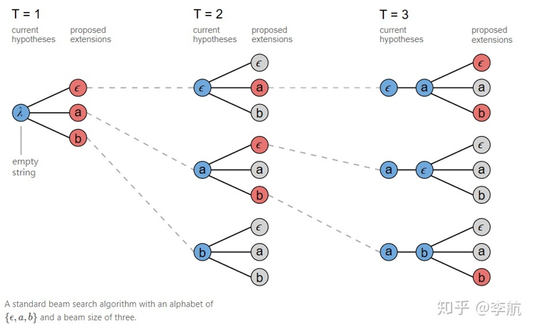

- 方式三：prefix beam search

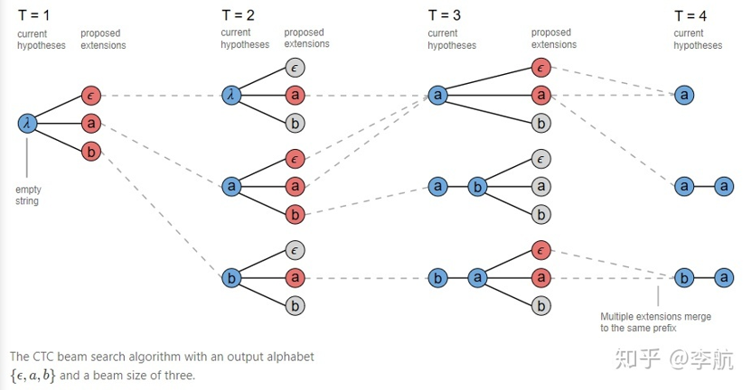

#### Decoder损失函数

标签平滑

1. 对真实标签进行平滑，例如分类目标是5720类,真实标签的概率应该是[0,0,0,…,1,0,…,0]，标签平滑是让真实的标签概率不是1，而是1-label smoothing adjustment，一般平滑值设置为0.1
2. 标签平滑可提高模型在真实数据上的泛化能力，使模型性能更好

- torch.nn.KLDivLoss

1. 损失函数使用KL散度损失，用来描述两个分布的距离，值越小，说明分布越相近

#### 总体损失

$$L_{MTL}=λL_{CTC} +(1− λ) L_{ATT}，0< λ<1$$

# 模型训练流程

- 整体框架回顾

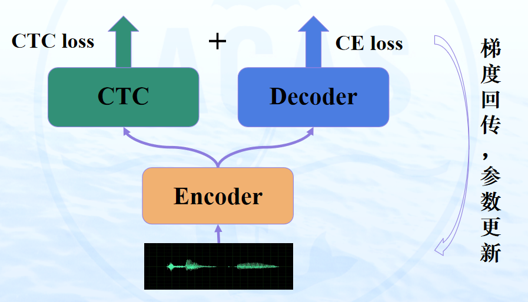

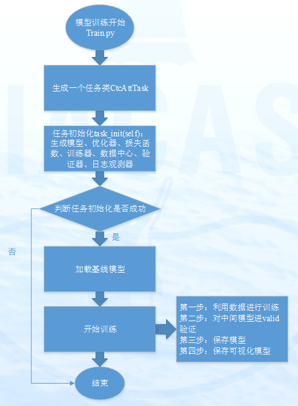

# 源代码

## 语音识别模型

语音识别模型对应代码模块为：

1. bin.taskegs/pytorch_backend.task_ctc_att.py	任务类
2. eteh.models.pytorch_backend.model.e2e: E2E_Transformer_CTC	构建整体模型结构
3. eteh.models.pytorch_backend.net.transformer	transfomer模型组件
4. eteh.models.pytorch_backend.criterion	损失函数

## 训练任务构建

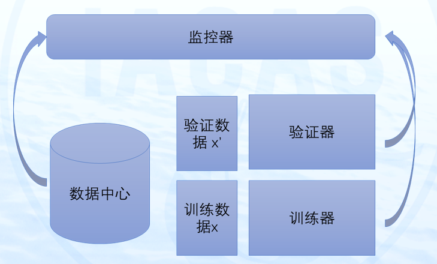

### 数据中心

数据中心主要负责对数据的筛选、排序、切分、打包等预处理工作，对数据进行统一管理

1. eteh.data.data:Data
2. eteh.data.data:Label
3. eteh.data.datacenter: DataCenter				数据管理中心，数据处理的入口
4. eteh.data.dataloader: StandDataLoader				继承torch.utils.data.DataSet类，实现数据加载
5. eteh.data.dataset: BaseDataSet					继承torch.utils.data.DataSet类
6. eteh.data.dataset: JsonDataPacker	对json数据进行封装

### 训练器

训练器使用Adam优化器

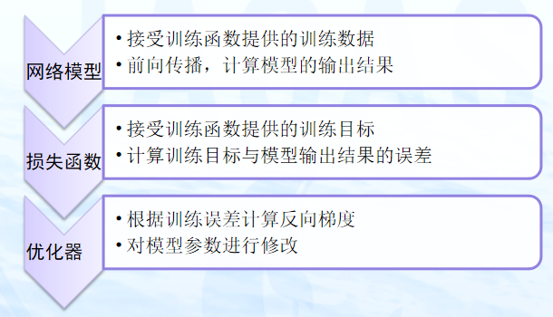

1. eteh.tools.trainer:Trainer
2. eteh.tools.interface.pytorch_backend.th_trainer: TH_Trainer

### 监控器

- 监控器主要实现tensorboard日志输出和其他日志输出，主要代码包括

1. eteh.tools.reporter:Reporter
2. eteh.tools.observer:ReporterObserver
3. eteh.tools.observer: TensorBoardObserver
4. bin.taskegs.pytorch_backend.task_ctc_att: E2E_Observer
5. bin.taskegs.pytorch_backend.task_ctc_att: E2E_Observer_tensorboard
    	

E2E_Observer继承了ReporterObserver，主要输出其他类型日志，E2E_Observer_tensorboard继承了TensorBoardObserver，输出tensorboard日志。

输出日志项包括：{Time：耗时, Lr：学习率, Corr：字正确率, Att-Loss：attention损失, Ctc-Loss：ctc损失}

### 验证器

- 验证器主要实现对验证集进行性能验证

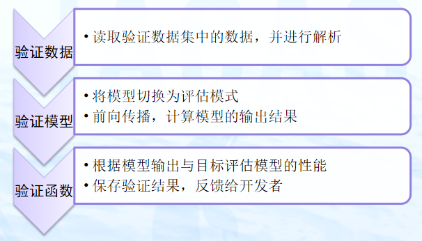

1. eteh.tools.valider: Valider
2. bin.taskegs.pytorch_backend.task_ctc_att: E2E_Valid

### 任务管理器

任务管理器实现对训练任务的管理，管理模型、训练、验证以及数据的获取和传送，是本平台的训练任务的核心模块。

1. bin.taskegs.pytorch_backend.task_ctc_att:CtcAttTask
2. eteh.tools.interface.pytorch_backend.th_task: TH_Task
3. eteh.tools.task: EtehTask 	核心类

# 模型训练、预测、评估

## 模型训练目录结构

eteh-v2-release-JXJK2021_orig_v2_release

1. |--bin				模型训练入口函数
    |--eteh				模型训练核心代码模块
    |--example			示例
    	|--hkust_egs
    		|--baseModel			基线模型
    		|--conf				相关配置
    		|--output			存放输入输出数据
    		|--run_train.sh		训练脚本
    		|--run_predictor.sh 		预测脚本
    		|--run_evaluate.sh		评估脚本
    |--utils				工具类

## 模型训练

模型训练脚本位于example/hkust_egs/run_train.sh

参数说明：

1. exp_dir=output/exp		模型输出路径
2. train_config=conf/ce_espnet_baseline_fintune.yaml 模型训练配置
3. data_conf=conf/data.yaml	训练数据yaml文件
4. checkpoint=baseModel/checkpoint.29		基线模型

运行方法：
				./run_train.sh

## 预测

模型预测脚本位于example/hkust_egs/run_predictor.sh

参数说明：

1. exp_dir=output/exp		模型输出路径
2. train_config=conf/ce_espnet_baseline_fintune.yaml 模型训练配置
3. data_conf=conf/data.yaml	训练数据yaml文件
4. char_list=baseModel/vocab.kefu_cts.txt	字典文件
5. checkpoint=baseModel/checkpoint.29	基线模型

运行方法：
			./run_ predictor.sh

## 评估

模型评估脚本位于example/hkust_egs/run_evaluate.sh

参数说明：

1. rec=your result file		结果文件
2. ref=your ref file			答案文件

运行方法：

​	./run_evaluate.sh

执行完成后，会在结果所在路径生成.sys文件，为识别率测试结果，如下：
			SPKR   |  # Snt # Chr   |  Corr  Sub  Del  Ins  Err  S.Err
			Sum/Avg |   213  6108  |  86.5  10.5  3.0  2.6  16.0  69.0 
			由上述结果可知，字正确率为86.5%，字错误率为16%。

# 模型配置

## 优化器配置

opti_config:

1. name: 'eteh.models.pytorch_backend.optimizer.optimizer:Noam'	优化器类型
2. factor: 1		学习率影响因子，调到，学习率会放大
3.  warm_step: 25000
4.  model_size: 256

## 损失函数配置

criterion_config:

1. name: 'eteh.models.pytorch_backend.criterion.loss:E2E_Loss' 定义要用的损失函数
2. size: 5720					字典大小
3. padding_idx: -1				padding值
4. smoothing: 0.1				标签平滑参数
5. rate: 0.3    					ctc损失函数占比

## 模型配置

model_config:

1.  name: 'eteh.models.pytorch_backend.model.e2e:E2E_Transformer_CTC'	模型
2. idim: 40					输入数据特征维度
3. odim: 5720					输出维度，字典大小
4. encoder_attention_dim: 320			编码器注意力维度
5. encoder_attention_heads: 8			编码器注意力头个数
6. encoder_linear_units: 2048			编码器线性层维度
7. encoder_num_blocks: 14			编码器block个数
8. encoder_input_layer: conv2d		编码器的输入
9. encoder_dropout_rate: 0.1			编码器的dropout概率
10. encoder_attention_dropout_rate: 0	编码器attention的dropout概率
11. decoder_attention_dim: 320			解码器注意力维度
12. decoder_attention_heads: 4			解码器注意力头个数
13. decoder_linear_units: 2048			解码器线性层维度
14. decoder_input_layer: embed			解码器输入
15. decoder_num_block: 7				解码器block个数
16. decoder_dropout_rate: 0.1			解码器dropout概率
17. decoder_src_attention_dropout_rate: 0
18. decoder_self_attention_dropout_rate: 0
19. ctc_dropout: 0.1				ctc dropout概率

## 训练参数配置

train_config:

1.  char_num: 5720				字典大小
2.  accum_grad: 2 #must be 1 when amp is used		梯度累积
3. amp: False
4. batch_size: 16			batch_size大小
5. min_batch_size: 1			最小的batch_size大小
6. shortest_first: True			按最短优先对数据进行排序
7. batch_sort_key: "input"		按input数据长度对数据进行排序
8. count: "seq"		采用seq方式进行batch打包
9. clean_data: True			是否对数据进行清洗
10. ilen_max: 2000			最大输入长度，单位为帧
11. ilen_min: 17			最小输入长度，单位为帧
12. olen_max: 100			最大输出长度