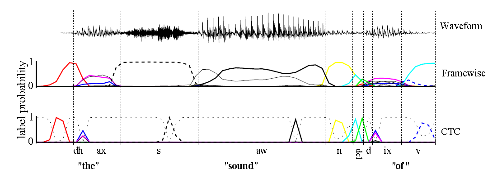
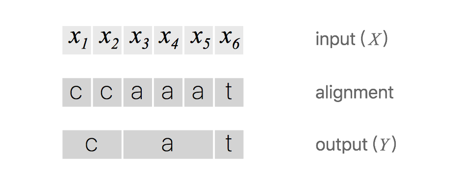
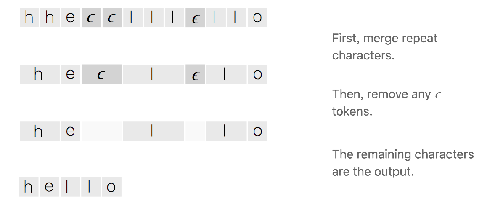
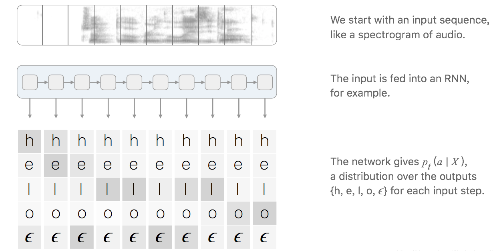
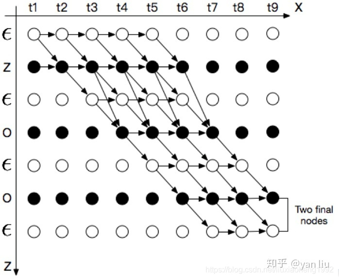
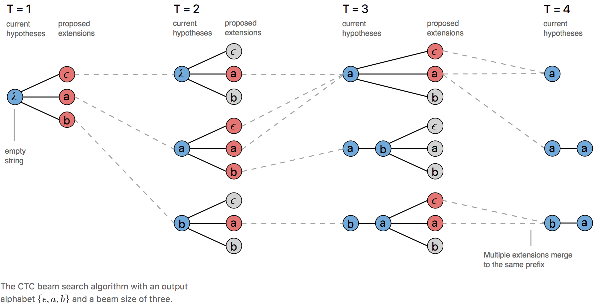

# 背景

**Connectionist temporal classification简称CTC**，可以理解为基于神经网络的时序类分类。其中classification比较好理解，表示分类问题；temporal可以理解为时序类问题，比如语音识别的一帧数据，很难给出一个label，但是几十帧数据就容易判断出对应的发音label，这个词也给出CTC最核心的意义；connectionist可以理解为神经网络中的连接。

语音识别声学模型的训练属于监督学习，需要知道每一帧对应的label才能进行有效的训练，在训练的数据准备阶段必须要对语音进行强制对齐。

CTC的引入可以放宽了这种一一对应的限制要求，只需要一个输入序列和一个输出序列即可以训练。

有两点好处：

- 不需要对数据对齐和一一标注。

- CTC直接输出序列预测的概率，不需要外部的后处理。

如上图，传统的Framewise训练需要进行语音和音素发音的对齐，比如 **s** 对应的一整段语音的标注都是 **s** ；而CTC引入了blank（该帧没有预测值），**s** 对应的一整段语音中只有一个spike（尖峰）被认为是 **s** ，其他的认为是blank。对于一段语音，CTC最后的输出是spike的序列，不关心每一个音素对应的时间长度。

# 简介

先拿语音识别任务来说，如果现在有一个包含剪辑语音和对应的文本，我们不知道如何将语音片段与文本进行对应，这样对于训练一个语音识别器增加了难度。

为了解决上述问题，我们可以先制定一个规则，例如“一个字符对于是个语言片段输入”。对于不同的人来说，他们说话的语速也不一样，这样导致了上述的定义规则不可行。另一个解决办法，手动对齐每个字符在音频中的位置。这种方法对于我们训练模型非常有效，但是不可否认的是这种做法非常耗时。

上面只是拿语音识别来举例，其实在其他一些识别任务中也会出现这个问题，例如手写字符识别，上面两例如下图所示：

Connectionist Temporal Classification (CTC)正适合这种不知道输入输出是否对齐的情况使用的算法，所以CTC适合语音识别和手写字符识别的任务。

为了方便下面的描述，我们做如下定义，输入(如音频信号)用符号序列$X = [ x_1 , x_2 , . . . , x_T ] $表示，对应的输出(如对应的标注文本)用符号序列$Y = [ y_1 , y_2 , . . . , y_U ]$，为了方便训练这些数据我们希望能够找到输入$X$与输出$Y$之间精确的映射关系。

在使用有监督学习算法训练模型之前，有几个难点：

- $X$和$Y$都是变长的
- $X$和$Y$的长度比也是变化的
- $X$和$Y$相应的元素之间没有严格的对齐(即$x_t$ 与$y_u$ 不一定对齐)

使用CTC算法能克服上述问题。到这里可以知道CTC就是可以解决输入输出对应问题的一种算法。

这里我们首先需要明确的是，还拿语音识别来说，现在使用的CTC常用的场景是RNN后接CTC算法，RNN模型输入是个个音频片段，输出个数与输入的维度一样，有$T$个音频片段，就输出T个维度的概率向量，每个向量又由字典个数的概率组成。例如网络输入音频个数定为$T$，字典中不同字的个数为$N$，那么RNN输出的维度为$T\times N$。根据这个概率输出分布，我们就能得到最可能的输出结果。在接下来的讨论中可以把RNN+CTC看成一个整体，当然也可以将RNN替换成其他的提取特征算法。

**损失函数的定义**： 对于给定的输入$X$，我们训练模型希望最大化$Y$的后验概率$P(Y∣X)$，$P(Y∣X)$应该是可导的，这样我们就能利用梯度下降训练模型了。

**测试阶段**： 当我们已经训练好一个模型后，输入$X$，我们希望输出$Y$的条件概率最高即 $Y^{*}=\mathop{\arg\max}_{Y}p(Y|X)$，而且我们希望尽量快速的得到$Y^{*}$ 值，利用CTC我们能在低投入情况下迅速找到一个近似的输出。

# 算法

CTC算法对于输入的$X$能给出非常多的Y的条件概率输出(可以想象RNN输出概率分布矩阵，所以通过矩阵中元素的组合可以得到很多$Y$值作为最终输出)，在计算输出过程的一个关键问题就是CTC算法如何将输入和输出进行对齐的。在接下来的部分中，我们先来看一下对齐的解决方法，然后介绍损失函数的计算方法和在测试阶段中找到合理输出的方法。

## 对齐

CTC算法并不要求输入输出是严格对齐的。但是为了方便训练模型我们需要一个将输入输出对齐的映射关系，知道对齐方式才能更好的理解之后损失函数的计算方法和测试使用的计算方法。

为了更好的理解CTC的对齐方法，先举个简单的对齐方法。假设对于一段音频，我们希望的输出是$Y=[c,a,t]$这个序列，一种将输入输出进行对齐的方式如下图所示，先将每个输入对应一个输出字符，然后将重复的字符删除。

上述对齐方式有两个问题：

- 通常这种对齐方式是不合理的。比如在语音识别任务中，有些音频片可能是无声的，这时候应该是没有字符输出的
- 对于一些本应含有重复字符的输出，这种对齐方式没法得到准确的输出。例如输出对齐的结果为[$[h,h,e,l,l,l,o]$，通过去重操作后得到的不是“hello”而是“helo”

为了解决上述问题，CTC算法引入的一个新的占位符用于输出对齐的结果。这个占位符称为空白占位符，通常使用符号$\epsilon$，这个符号在对齐结果中输出，但是在最后的去重操作会将所有的$\epsilon$删除得到最终的输出。利用这个占位符，可以将输入与输出有了非常合理的对应关系，如下图所示：

在这个映射方式中，如果在标定文本中有重复的字符，对齐过程中会在两个重复的字符当中插入$\epsilon$占位符。利用这个规则，上面的“hello”就不会变成“helo”了。

回到上面$Y=[c,a,t]$这个例子来，下图中有几个示列说明有效的对齐方式和无效的对齐方式，在无效的对齐方式中举了三种例子，占位符插入位置不对导致的输出不对，输出长度与输入不对齐，输出缺少字符a。

CTC算法的对齐方式有下列属性：

- 输入与输出的对齐方式是单调的，即如果输入下一输入片段时输出会保持不变或者也会移动到下一个时间片段
- 输入与输出是多对一的关系
- 输出的长度小于等于输入

## 损失函数

这里要明确一点，对于一个标定好的音频片段，训练该片段时，我们希望的输出就是标定的文本，如下图所示，音频说的一个hello，RNN或者其他模型输出的是相同数量的向量，向量里是每个字母的概率。

对于一对输入输出$(X,Y)$来说，CTC的目标是将下式概率最大化 $p(Y|X)=\sum_{A\in\mathcal{A}_{X,Y}} \prod^{T}_{t=1}p_{t}(a_{t}|X)$

解释一下，对于RNN+CTC模型来说，RNN输出的就是 $p_{t}(a_{t}|X)$概率，$t$ 表示的是RNN里面的时间的概念。乘法表示一条路径的所有字符概率相乘，加法表示多条路径。因为上面说过CTC对齐输入输出是多对一的，例如$he\epsilon l\epsilon lo\epsilon$与$hee\epsilon l\epsilon lo$对应的都是“hello”，这就是输出的其中两条路径，要将所有的路径相加才是输出的条件概率。

但是对于一个输出，路径会非常的多，这样直接计算概率是不现实的，CTC算法采用动态规划的思想来求解输出的条件概率，如下图所示，该图想说明的是通过动态规划来进行路径的合并(看不懂也没关系，下面有详细的解释)

假设我们现在有输入音频$X$对应的标定输出$Y$为单词“ZOO”，为了方便解释下面动态规划的思想，现在每个字符之间还有字符串的首位插入空白占位符$\epsilon$，得到下面结果$Z=\{\epsilon,Z,\epsilon,O,\epsilon,O,\epsilon\}$

为了便于说明，先定义好下图的横纵坐标轴的含义，横轴是$X$的时间片单位为$t$，纵轴为$Z$序列单位为$s$。根据CTC的对齐方式的三个特征，输入有9个时间片，标签内容是“ZOO”，$P(Y|X)$的所有可能的合法路径如下图：

$\alpha$表示对齐结果合并后(如图3.png)节点的概率。$\alpha_{s,t}$表示上图中坐标为(s,t)节点的概率，该点的概率计算分为下面两种情况：

**Case 1：**

1. 如果$\alpha_{s,t}=\epsilon$，则$\alpha_{s,t}$只能由前一个字符$\alpha_{s-1,t-1}$或者本身$\alpha_{s,t-1}$得到。

2. 如果$\alpha_{s,t}$不等于$\epsilon$，但是$\alpha_{s,t}$为连续字符的第二个，即$\alpha_{s}=\alpha_{s-2}(\alpha_{s-1}=\epsilon)$，则$\alpha_{s,t}$只能由一个空白符$\alpha_{s-1,t-1}$或者其本身$\alpha_{s,t-1}$得到，而不能由前一个字符得到。

上述两种情况中，$\alpha_{s,t}$可以由下式算出，其中$p_{t}(z_{s}|X)$表示在时刻t输出字符$z_{s}$的概率。

$\alpha_{s,t}=(\alpha(s,t-1)+\alpha(s-1,t-1))\cdot p_{t}(z_{s}|X)$

**Case 2：**

如果$\alpha_{s,t}$不等于$\epsilon$，则$\alpha_{s,t}$可以由$\alpha_{s,t-1}$，$\alpha_{s-1,t-1}$以及$\alpha_{s-2,t-1}$得来，可以表示为

$\alpha_{s,t}=(\alpha(s,t-1)+\alpha(s-1,t-1)+\alpha(s-2,t-1))\cdot p_{t}(z_{s}|X)$

从图7中可以看到合法路径由两个起始点，输出两个终止点，最后输出的条件概率为两个终止点输出概率的和。使用这种计算方法就能高效的计算损失函数，下一步的工作表示计算梯度用于训练模型。由于$P(Y|X)$的计算只涉及加法和乘法，因此是可导的。对于训练集$\mathcal{D}$，模型优化的目标是最小化负对数似然函数$\sum_{(X,Y)\in \mathcal{D} }-logp(Y|X)$

## 预测

当我们训练好一个模型后，我们输入$X$，我们的目的是计算下式得到输出：$Y*=\mathop{\arg\max}_{Y}p(Y|X)$

1. 一种方法是贪婪算法，取RNN每次输出概率最大的节点，计算方式如下：$A*=\mathop{\arg\max}_{A} \prod^{T}_{t=1}p_{t}(a_{t}|X)$，然后通过去重得到输出结果。

    通常这种启发式的算法很有效，但是这种方法忽略了一个输出可能对应多个对齐结果。例如$[a,a,\epsilon]$和$[a,a,a]$各自的概率均小于$ [b,b,b]$的概率，但是他们相加的概率比$[b,b,b]$概率高。简单的启发是算法得到结果为$Y=[b]$，但是结果为$Y=[a]$更为合理。考虑到这点第二种方式变的更为合理

2. 第二种算法是Beam search的一种变形

    先来说一下Beam search算法，该算法有个参数叫做宽度，假设宽度设为3，在RNN的输出中，该算法每个时间$t$输出时，不同于贪婪算法只找最高的，而是找最高的三个概率作为下一次的输入，依次迭代，如下图所示，每次t时间都是基于$t-1$输出的最高三个查找当前概率最高的三个。(这里也可以看出，当宽度设置为1时就是贪婪算法)

因为我们这里想要结合多个对齐能够映射到同一输出的这种情况，这时每次$t$时间的输出为去重后以及移除$\epsilon$的结果，具体如下图所示：

当输出的前缀字符串遇上重复字符时，可以映射到两个输出，如图9所示，当T=3时，前缀包含a，遇上新的a，则[a]和[a,a]两个输出都是有效的。

当我们将[a]扩展为[a, a]时，我们只需统计之前以空白标记$\epsilon$结尾的所有路径的概率（位于字符中间的$\epsilon$也要统计）。同样的，如果是扩展到[a]，那我们计算的就是不以$\epsilon$结尾的所有路径概率。所以每次的输出只需要记录空白标记$\epsilon$结尾的所有路径的概率和不以$\epsilon$结尾的所有路径概率来进行下一次的概率计算。这个算法的实现，Awni Hannun给出了[示例](https://gist.github.com/awni/56369a90d03953e370f3964c826ed4b0)。

# CTC的特征

1. **条件独立：**CTC的一个非常不合理的假设是其假设每个时间片都是相互独立的，这是一个非常不好的假设。在OCR或者语音识别中，各个时间片之间是含有一些语义信息的，所以如果能够在CTC中加入语言模型的话效果应该会有提升。
2. **单调对齐：**CTC的另外一个约束是输入$X$与输出$Y$之间的单调对齐，在OCR和语音识别中，这种约束是成立的。但是在一些场景中例如机器翻译，这个约束便无效了。
3. **多对一映射：**CTC的又一个约束是输入序列$X$的长度大于标签数据$Y$的长度，但是对于$X$的长度大于$Y$的长度的场景，CTC便失效了。

# 参考

[CTC算法详解_Michaelliu_dev的博客-CSDN博客_ctc](https://blog.csdn.net/michaelshare/article/details/83660557)

[1] https://distill.pub/2017/ctc/

[2] https://gist.github.com/awni/56369a90d03953e370f3964c826ed4b0

[3] https://zhuanlan.zhihu.com/p/42719047

[4] https://www.zhihu.com/question/47642307

[5] https://www.cs.toronto.edu/~graves/icml_2006.pdf