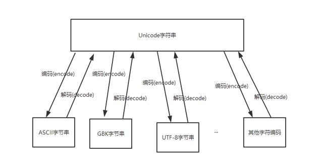

# 数值类型

## 整数

- 1-计算机由于使用二进制，所以，有时候用十六进制表示整数比较方便，十六进制用0x前缀和0-9，a-f表示，例如：0xff00，0xa5b4c3d2，等。
- 2 整数的除法是精确的。在Python中，有两种除法：
  - 一种除法是/ , /除法计算结果是浮点数，即使是两个整数恰好整除，结果也是浮点数。
  - 还有一种除法是//，称为地板除，两个整数的除法仍然是整数。
- 3 % 取余数。
- 4 ** 表示次方，例如 a**b，即 a 的 b 次方。
- 5 pow(x, y)函数，计算x的y次方，例如：pow(2, 10) = 1024，pow(2, 15) = 32768 。

## 浮点数

1. Python将带小数的数字都称为浮点数，之所以称为浮点数，是因为按照科学记数法表示时，一个浮点数的小数点位置是可变的，比如，1.23x109和12.3x108是完全相等的。
2. 对于很大或很小的浮点数，就必须用科学计数法表示，把10用e替代，1.23x109就是1.23e9，或者12.3e8，0.000012可以写成1.2e-5，等。
3. 浮点数精确到小数后15位。

## 复数

1. 使用complex()把数字转化为浮点数。 complex(2) ---> (2+0j)
2. 对于复数 z = 7 + 5j ,可以用z.real得到实数部分，z.imag得到虚数部分。
3. 复数的虚数部分通过加 j 或 J 来标识。

# 序列类型

## 字符串


```python
#获取字所有的符串方法
print(dir(str))
[...,'capitalize', 'casefold', 'center', 'count', 'encode', 'endswith', 'expandtabs', 'find', 'format', 'format_map', 'index', 'isalnum', 'isalpha', 'isascii', 'isdecimal', 'isdigit', 'isidentifier', 'islower', 'isnumeric', 'isprintable', 'isspace', 'istitle', 'isupper', 'join', 'ljust', 'lower', 'lstrip', 'maketrans', 'partition', 'replace', 'rfind', 'rindex', 'rjust', 'rpartition', 'rsplit', 'rstrip', 'split', 'splitlines', 'startswith', 'strip', 'swapcase', 'title', 'translate', 'upper', 'zfill']
```


### 大小写转换

####  capitalize()

**描述：**将字符串的第一个字母变成大写，其余字母变为小写。

**语法：**str.capitalize()

**示例：**

```python
"i Love python".capitalize() 
'I love python'


"i Love pYthoN".capitalize() 
'I love python'
```


####  title()

**描述：**返回一个满足**标题格式**的字符串。即所有英文单词首字母大写，其余英文字母小写。

**语法：**str.title()

**示例：**

```python
"i am very love python".title()
'I Am Very Love Python'
```


####  swapcase()

**描述：**将字符串str中的大小写字母同时进行互换。即将字符串str中的大写字母转换为小写字母，将小写字母转换为大写字母。

**语法：**str.swapcase()

**示例：**

```python
"I Am Love PYTHON".swapcase()
'i aM lOVE python'


"我爱pythoN Python pYTHON".swapcase()
'我爱PYTHOn pYTHON Python'
```


####  lower()

**描述：**将字符串中的所有大写字母转换为小写字母。

**语法：**str.lower()

**示例：**

```python
"我爱pythoN Python!".lower()
'我爱python python!'
```


####  upper()

**描述：**将字符串中的所有小写字母转换为大写字母。

**语法：** str.upper()

**示例：**

```python
"i am very love python".upper()
'I AM VERY LOVE PYTHON'
```


####  casefold()

**描述：**将字符串中的所有大写字母转换为小写字母。也可以将非英文 语言中的大写转换为小写。

注意 ：lower()函数和casefold()函数的区别：lower() 方法只对ASCII编码，即‘A-Z’有效，对于其它语言中把大写转换为小写的情况无效，只能用 casefold() 函数。

**语法：**str.casefold()

**示例：**

```python
 "Groß - α".casefold()#德语 
'gross - α'


"I am verY love python".casefold()
'i am very love python'
```


###  字符串填充

####  center()

**描述：**返回一个长度为width,两边用fillchar(单字符)填充的字符串，即字符串str居中，两边用fillchar填充。若字符串的长度大于width,则直接返回字符串str。

**语法：**str.center(width , "fillchar")

- width —— 指定字符串长度。
- fillchar —— 要填充的单字符，默认为空格。

**示例：**

```python
'shuai'.center(10)
'  shuai   '


'shuai'.center(10,'*')
'**shuai***'


#名字补齐
L = ['Jack','jenny','joe']
[name.center(10,'#') for name in L]
['###Jack###', '##jenny###', '###joe####']
 
for name in L:
    print(name.center(10,'#'))
###Jack###
##jenny###
###joe####    
```


####  ljust()

**描述：**返回一个原字符串左对齐,并使用fillchar填充(默认为空格)至指定长度的新字符串。如果指定的长度小于原字符串的长度则返回原字符串。

**语法：** str.ljust(width, fillchar) -> str 返回一个新的字符串

- width —— 指定字符串的输出长度。
- fillchar—— 将要填充的单字符，默认为空格。

示例：

```python
'shuai'.ljust(10)
'shuai     '


'shuai'.ljust(10,'*')
'shuai*****'


L = ['Jack','jenny','joe']
[name.ljust(10,'#') for name in L]
['Jack######', 'jenny#####', 'joe#######']
 
for name in L:
    print(name.ljust(10,'#'))
Jack######
jenny#####
joe######
```

#### rjust()

**描述：**返回一个原字符串右对齐,并使用fillchar填充(默认为空格)至指定长度的新字符串。如果指定的长度小于原字符串的长度则返回原字符串。

**语法：** str.ljust(width, fillchar)

- width —— 指定字符串的输出长度。
- fillchar—— 将要填充的单字符，默认为空格。

**示例：**

```python
'shuai'.rjust(10)
'     shuai'


'shuai'.rjust(10,'*')
'*****shuai'


L = ['Jack','jenny','joe']
[name.rjust(10,'#') for name in L]
['######Jack', '#####jenny', '#######joe']
 
for name in L:
    print(name.rjust(10,'*'))
******Jack
*****jenny
*******joe


for name in L:
    print(name.rjust(10,'好'))
好好好好好好Jack
好好好好好jenny
好好好好好好好j
```


####  zfill()

**描述：**返回指定长度的字符串，使原字符串右对齐，前面用0填充到指定字符串长度。

**语法：**str.zfill(width)

width —— 指定字符串的长度,但不能为空。若指定长度小于字符串长度，则直接输出原字符串。

**示例：**

```python
'12'.zfill(10)
'0000000012'


 #对用户ID进行填充
L=['56783','34','987766721','326']  
[id.zfill(10) for id in L]
['0000056783', '0000000034', '0987766721', '0000000326']


for id in L:
    print(id.zfill(10))
0000056783
0000000034
0987766721
0000000326    


#等价于用0填充的右对齐
[id.rjust(10,'0') for id in L]
['0000056783', '0000000034', '0987766721', '0000000326
```


### **字符串编码**

####  encode()

**描述：**以指定的编码格式编码字符串，默认编码为 'utf-8'。encode英文原意 编码。

**语法：**str.encode(encoding='utf-8', errors='strict')

- encoding 参数可选，即要使用的编码，默认编码为 'utf-8'。字符串编码常用类型有：utf-8，gb2312，cp936，gbk等。
- errors 参数可选，设置不同错误的处理方案。默认为 'strict',意为编码错误引起一个UnicodeEncodeError。 其它可能值有 'ignore', 'replace', 'xmlcharrefreplace'以及通过 codecs.register_error() 注册其它的值。

**示例：**

```python
"我爱祖国".encode(encoding="utf8",errors="strict")
b'\\xe6\\x88\\x91\\xe7\\x88\\xb1\\xe7\\xa5\\x96\\xe5\\x9b\\xbd'


"I love my country".encode(encoding="utf8",errors="strict")
 b'I love my country'
```


####  decode()

**描述：**以 encoding 指定的编码格式解码字符串，默认编码为字符串编码。decode英文意思是 解码，

**语法：**str.decode(encoding='utf-8', errors='strict')

- encoding ——要使用的编码，如：utf-8,gb2312,cp936,gbk等。
- errors ——设置不同解码错误的处理方案。默认为 'strict',意为编码错误引起一个 UnicodeDecodeError。 其它可能得值有 'ignore', 'replace'以及通过 codecs.register_error() 注册的1其它值。

**示例：**

```python
str1 = "我爱学习".encode(encoding="utf-8")
str1
b'\\xe6\\x88\\x91\\xe7\\x88\\xb1\\xe5\\xad\\xa6\\xe4\\xb9\\xa0'


str1.decode(encoding="utf-8")
'我爱学习'
```




###  字符串查找

#### find()

**描述：**查找字符串中指定的子字符串sub第一次出现的位置，可以规定字符串的索引查找范围。若无则返回 -1。

**语法：**str.find(sub,start,end) -> int 返回整数

**参数：**

- sub —要索引的子字符串。
- start —索引的起始位置。默认值为0。
- end —索引的结束位置。默认值为字符串长度len(str)。[start,end) 不包括end。

**示例：**

```python
#查找子字符串"o"
"I love python".find('o')
3


#索引起始位置为4 索引范围为：ve python
"I love python".find('o',4)
11


#索引起始位置为4,结束位置为12 索引范围为：ve pytho
"I love python".find('o',4,12)
11


"I love python".find('o',4,11)#不包括11位的'o',返回-1
```


####  rfind()

**描述：**查找字符串中指定的子字符串sub最后一次出现的位置，可以规定字符串的索引查找范围。若无则返回 -1。

**语法：**str.rfind(sub,start,end) -> int 返回整数

**参数：**

- sum —要索引的子字符串。
- start —索引的起始位置。默认值为0。
- end —索引的结束位置。默认值为字符串长度len(str)。[start,end) 不包括end。

注：rfind()函数用法与find()函数相似，rfind()函数返回指定子字符串最后一次出现的位置，find()函数返回指定子字符串第一次出现的位置。

**示例：**

```python
#查找子字符串"o"
"I love python".find('o')
3


#索引起始位置为4 索引范围为：ve python
"I love python".find('o',4)
11


#索引起始位置为4,结束位置为12 索引范围为：ve pytho
"I love python".find('o',4,12
```

####  index()

**描述：**查找字符串中第一次出现的子字符串的位置，可以规定字符串的索引查找范围[star,end)。若无则会报错。

**语法：**str.index(sub, start, end) -> int 返回整数

**参数：**

- sub —— 查找的子字符串。
- start —— 索引的起始位置，默认为0。
- end —— 索引的结束位置，默认为字符串的长度。

**示例：**

```python
"I love python".index("o") #默认索引整个字符串


"I love python".index("o",4)  #索引 ve python
11


"I love python".index("o",4,12) #索引 ve pytho
11


"I love python".index("love")    #索引多个字符
2
"I love python".index("k")   #索引字符串不存在，报错
ValueError: substring not fou
```


####  rindex()

**描述：** rindex() 方法返回子字符串最后一次出现在字符串中的索引位置，该方法与 rfind() 方法一样，可以规定字符串的索引查找范围[star,end)，只不过如果子字符串不在字符串中会报一个异常。

**语法：**str.rindex(sub, start, end) -> int 返回整数。

**参数：**

- sub —— 查找的子字符串。
- start —— 索引的起始位置，默认为0。
- end —— 索引的结束位置，默认为字符串的长度。

**示例：**

```python
"I love python".rindex('o')
11


"I love python".index('o')
3


"I love python".rindex('k')
ValueError: substring not found


"I love python".rfind('k'
```


### 字符串格式化

####  format()

**描述：**Python2.6 开始，新增了一种格式化字符串的函数 **str.format()**，它增强了字符串格式化的功能。基本语法是通过 **{}** 和 **:** 来代替以前的 **%** 。使用format()来格式化字符串时，使用在字符串中使用{}作为占位符，占位符的内容将引用format()中的参数进行替换。可以是位置参数、命名参数或者兼而有之。

format 函数可以接受不限个参数，位置可以不按顺序。

**语法：**format(value, format_spec)

**参数：**

**示例：**

```python
# 位置参数
'{}:您{}购买的{}到了！请下楼取快递。'.format('快递小哥','淘宝','快递')
'快递小哥:您淘宝购买的快递到了！请下楼取快递。'


#给批量客户发短息
n_list=['马云','马化腾','麻子','小红','李彦宏','二狗子']
for name in n_list:
    print('{0}：您淘宝购买的快递到了！请下楼取快递！'.format(name))
马云：您淘宝购买的快递到了！请下楼取快递！
马化腾：您淘宝购买的快递到了！请下楼取快递！
麻子：您淘宝购买的快递到了！请下楼取快递！
小红：您淘宝购买的快递到了！请下楼取快递！
李彦宏：您淘宝购买的快递到了！请下楼取快递！
二狗子：您淘宝购买的快递到了！请下楼取快递！  
    
#名字进行填充    
for n in n_list:
    print('{0}：您淘宝购买的快递到了！请下楼取快递！'.format(n.center(3,'*')))
    
*马云：您淘宝购买的快递到了！请下楼取快递！
马化腾：您淘宝购买的快递到了！请下楼取快递！
*麻子：您淘宝购买的快递到了！请下楼取快递！
*小红：您淘宝购买的快递到了！请下楼取快递！
李彦宏：您淘宝购买的快递到了！请下楼取快递！
二狗子：您淘宝购买的快递到了！请下楼取快递！


'{0}, {1} and {2}'.format('gao','fu','shuai')
'gao, fu and shuai'


x=3
y=5
'{0}+{1}={2}'.format(x,y,x+y)


# 命名参数
'{name1}, {name2} and {name3}'.format(name1='gao', name2='fu', name3='shuai')
'gao, fu and shuai'


# 混合位置参数、命名参数
'{name1}, {0} and {name3}'.format("shuai", name1='fu', name3='gao')
'fu, shuai and gao'


#for循环进行批量处理
["vec_{0}".format(i) for i in range(0,5)]
['vec_0', 'vec_1', 'vec_2', 'vec_3', 'vec_4']


['f_{}'.format(r) for r in list('abcde')]
['f_a', 'f_b', 'f_c'
```


####  format_map()

**描述：**返回字符串的格式化版本。在Python3中使用format和format_map方法都可以进行字符串格式化，但format是一种所有情况都能使用的格式化方法，format_map仅使用于字符串格式中可变数据参数来源于字典等映射关系数据时才可以使用。

**语法：**str.format_map(mapping) -> str 返回字符串

**参数：**mapping 是一个字典对象

**示例：**

```python
People = {"name": "john", "age": 33}
"My name is {name},iam{age} old".format_map(People)


#对比案例
定义一个字典
student = {'name':'张三','class':'20200504','score':748}


使用format输出相关信息：
'{st[class]}班{st[name]}总分：{st[score]}'.format(st=student)
'20200504班张三总分：748'


format_map方法后如下


'{class}班{name}总分：{score}'.format_map(student)
'20200504班张三总分：7
```


###  解决判断问题

####  endswith()

**描述：**判断字符串是否以指定字符或子字符串结尾。

**语法：**str.endswith("suffix", start, end) 或str[start,end].endswith("suffix") 用于判断字符串中某段字符串是否以指定字符或子字符串结尾。—> bool 返回值为布尔类型（True,False）

**参数：**

- suffix — 后缀，可以是单个字符，也可以是字符串，还可以是元组（"suffix"中的引号要省略，常用于判断文件类型）。
- start —索引字符串的起始位置。
- end — 索引字符串的结束位置。

注意：空字符的情况。返回值通常为True

**示例：**

```python
 "I love python".endswith('n')
True


"I love python".endswith("python")
True
"I love python".endswith("n",0,6)# 索引 i love 是否以“n”结尾。
False
"I love python".endswith("") #空字符
True
"I love python".endswith(("n","z"))#遍历元组的元素，存在即返回True，否者返回False
True
"I love python".endswith(("k","m"))
False


#元组案例
file = "python.txt"
if file.endswith("txt"):
    print("该文件是文本文件")
elif file.endswith(("AVI","WMV","RM")):
    print("该文件为视频文件")
else:
    print("文件格式未知
```


####  startswith()

**描述：**判断字符串是否以指定字符或子字符串开头。

**语法：**str.endswith("suffix", start, end) 或

str[start,end].endswith("suffix") 用于判断字符串中某段字符串是否以指定字符或子字符串结尾。

—> bool 返回值为布尔类型（True,False）

**参数：**

- suffix — 后缀，可以是单个字符，也可以是字符串，还可以是元组（"suffix"中的引号要省略）。
- start —索引字符串的起始位置。
- end — 索引字符串的结束位置。

注意：空字符的情况。返回值通常也为True

**示例：**

```python
"hello,i love python".startswith("h")
True
"hello,i love python".startswith("l",2,10)# 索引 llo,i lo 是否以“l”开头。
True
"hello,i love python".startswith("") #空字符
True
"hello,i love python"[0:6].startswith("h") # 只索引  hello,
True
"hello,i love python"[0:6].startswith("e")
False
"hello,i love python"[0:6].startswith("")
True
"hello,i love python".startswith(("h","z"))#遍历元组的元素，存在即返回True，否者返回False
True
"hello,i love python".startswith(("k","m"))
False
```


####  isalnum()

**描述：**检测字符串是否由字母和数字组成。str中至少有一个字符且所有字符都是字母或数字则返回 True,否则返回 False

**语法：**str.isalnum() -> bool 返回值为布尔类型（True,False）

**参数：**

**示例：**

```python
"seven-11".isalnum()
False


"seven11".isalnum()
True


"seven".isalnum()
True


"11".isalnum()
Tr
```


#### isalpha()

**描述：**检测字符串是否只由字母组成。字符串中至少有一个字符且所有字符都是字母则返回 True,否则返回 False。

**语法：**str.isalpha() -> bool 返回值为布尔类型（True,False）

**参数：无**

**示例：**

```python
"I love python".isalpha()#存在空格返回False
False


"Ilovepython".isalpha()
True


"Ilovepython123".isalpha()
Fals
```


#### isdecimal()

**描述：**检查字符串是否只包含十进制字符。字符串中若只包含十进制字符返回True，否则返回False。该方法只存在于unicode对象中。注意:定义一个十进制字符串，只需要在字符串前添加前缀 'u' 即可。

**语法：** str.isdecimal() -> bool 返回值为布尔类型（True,False）

**参数：无**

**示例：**

```python
"123456".isdecimal()
True
u"123456".isdecimal()
True


"123456python".isdecimal()
False
```


#### isdigit()

**描述：**检测字符串是否只由数字组成.字符串中至少有一个字符且所有字符都是数字则返回 True,否则返回 False。

**语法：**str.isdigit() -> bool 返回值为布尔类型（True,False）

**参数：无**

注：能判断“①”，不能判断中文数字。但 isnumeric() 函数可以。

**示例：**

```python
"python".isdigit() #全为字母
False


"123".isdigit()  #全为数字
True
"python666".isdigit()   #字母和数字的组合
False
"一二三四五六七".isdigit() #中文数字输出False
False
"①".isdigit()  
True
```


#### isidentifier()

**描述：**判断str是否是有效的标识符。str为符合命名规则的变量，保留标识符则返回True,否者返回False。

**语法：**str.isidentifier() -> bool 返回值为布尔类型（True,False）

**参数：**无

**示例：**

```python
"123".isidentifier()  #变量名为123
False
"def".isidentifier()  #变量名为保留字
True
"_123".isidentifier()  #变量名有下划线开头
True
"student".isidentifier()#变量名由字母开端
True
```


#### islower()

**描述：**检测字符串中的字母是否全由小写字母组成。（字符串中可包含非字母字符）字符串中包含至少一个区分大小写的字符，且所有这些区分大小写的字符都是小写，则返回 True，否则返回 False。

**语法：**str.islower() -> bool 返回值为布尔类型（True,False）

**参数：**无

**示例：**

```python
#字符串中的字母全为小写
"i love python".islower()  
True


 #字符串中的字母全为小写，也存在非字母的字符
"我爱python！".islower() 
True
#字符串中有大写字符
"I love python".islower() 
False
```


#### isupper()

**描述：**检测字符串中的字母是否全由大写字母组成。（字符串中可包含非字母字符）。字符串中包含至少一个区分大小写的字符，且所有这些区分大小写的字符都是大写，则返回 True，否则返回 False。

**语法：**str.isupper() -> bool 返回值为布尔类型（True,False）

**参数：**无

**示例：**

```python
"I LOVE PYTHON".isupper() #全为大写字母
True


"i LOVE PYTHON".isupper()  #存在小写字母
False


"我爱PYTHON".isupper()  #存在非字母的字符
Tru
```


#### inumeric()

**描述：**测字符串是否只由数字组成。这种方法是只适用于unicode对象。字符串中只包含数字字符，则返回 True，否则返回 False。

**语法：**str.isnumeric() -> bool 返回值为布尔类型（True,False）

**参数：**无

**示例：**

```python
u"123456".isnumeric()  #全为数字
True


"123456".isnumeric()
True


"python666".isnumeric()  #字母数字组合
False


"一二三四五六".isnumeric()  #中文数字
True


"①".isnumeric()
Tr
```


#### isprintable()

**描述：**判断字符串中是否有打印后不可见的内容。如：\n \t 等字符。若字符串中不存在\n \t 等不可见的内容，则返回True,否者返回False。

**语法：** str.isprintable() -> bool 返回值为布尔类型（True,False）

**参数：**无

**示例：**

```python
#不存在用print()打印后不可见的内容
"i love  python".isprintable()  
True


#存在用print()打印后不可见的内容 \n
"i love python \n".isprintable() 
False


"i love \t python".isprintable()
Fals
```


#### isspace()

**描述：** 检测字符串是否只由空格组成。若字符串中只包含空格，则返回 True，否则返回 False。

**语法：**str.isspace() -> bool 返回值为布尔类型（True,False）

**参数：**无

**示例：**

```python
str1 = "   "#空格
str2 = "i love python" 
print(str1.isspace())
True
print(str2.isspace())
False
print(str2[1].isspace()) #字符串str2 的第二个字符为空格
True
```


#### istitle()

**描述：**检测判断字符串中所有单词的首字母是否为大写，且其它字母是否为小写，字符串中可以存在其它非字母的字符。若字符串中所有单词的首字母为大写，且其它字母为小写，则返回 True，否则返回 False.

**语法：**str.istitle() -> bool 返回值为布尔类型（True,False）

**参数：**无

**示例：**

```python
"I Love Python".istitle() #各单词的首字母均为大写，其余字母为小写
True
"I love python".istitle() 
False


"I LOVE PYTHON".istitle()
False


"我爱Python".istitle()  #存在其它非字母字符，
Tru
```


### **字符串修剪**

#### strip()

**描述：**该函数的作用是去除字符串开头和结尾处指定的字符，不会去除字符串中间对应的字符

**语法：**str.strip(chars)

**参数：**chars -- 要去除的字符 默认为空格或换行符。

**示例：**

```python
#默认参数，去除了空格，\n \t \r字符，且未除去字符串中间相应的字符
a = ' \n111 aaa  '
print(a.strip())
111 aaa


#去除两端的指定字符
b='.-.word:我很帅.-.'
print(b.strip('.-.'))
word:我很帅


c='参考：来自公众号AI入门学习'
print(c.strip('参考：'))
来自公众号AI入门学
```


#### lstrip()

**描述：**lstrip() 方法用于截掉字符串左边的空格或指定字符。

**语法：**str.lstrip(chars)

**参数：**chars--要去除的字符 默认为空格或换行符。

**示例：**

```python
#去除左边指定字符
a = '--我爱Python--'
a.lstrip('--')
'我爱Python--'


#重复的值只需要写一个
a.lstrip('-')
'我爱Python--'
```


#### rstrip()

**描述：** 删除 str 字符串末尾的指定字符（默认为空格）

**语法：**str.rstrip(chars)

**参数：**chars --要去除的字符 默认为空格或换行符。

**示例：**

```python
#去除左边指定字符
a = '6234412134445533-456'
a.rstrip('-456')
'6234412134445533'


#对一个列表所有的字符串进行去除
ls = ['34667777777-456','62344121344433-456','28993333455-456']
[i.rstrip('-456') for i in ls]
['34667777777', '62344121344433', '28993333']
```


### **字符串加密解密**

#### maketrans()

**描述：**制作翻译表，删除表，常与translate()函数连用。 即：返回用于str.translate方法翻译的转换表。

**语法：**str.maketrans(intab, outtab，delchars)

**参数：**

- intab -- 字符串中要替代的字符组成的字符串。
- outtab -- 相应的映射字符的字符串。
- delchars -- 可选参数，表示要删除的字符组成的字符串。

**示例：**

```python
str.maketrans() 生成一个字符一对一映射的table，然后使用 translate(table) 对字符串S中的每个字符进行映射。
例如，现在想要对"I love fairy"做一个简单的加密，将里面部分字符都替换为数字，这样别人就不知道转换后的这句话是什么意思。
in_str  = 'afcxyo'
out_str = '123456'


# maketrans()生成映射表
map_table=str.maketrans(in_str,out_str)


# 使用translate()进行映射
my_love='I love fairy'
my_love.translate(map_table)
'I l6ve 21ir5'


注意maketrans(x, y, z]) 中的x和y都是字符串，且长度必须相等。
如果maketrans(x, y, z]) 给定了第三个参数z，这这个参数字符串中的每个字符都会被映射为None。


#'yo'都会被隐藏了
map_table=str.maketrans(in_str,out_str,'yo')
my_love='I love fairy'
my_love.translate(map_table)
'I lve 21
```

#### translate()

**描述：**过滤(删除)，翻译字符串。即根据maketrans()函数给出的字符映射转换表来转换字符串中的字符。

注：translate()函数是先过滤(删除)，再根据maketrans()函数返回的转换表来翻译。

**语法：**str.translate(table)

**参数：**

**示例：**

```python
见上述案例
```


### 分割字符串

#### partition()

**描述：**根据指定的分隔符(sep)将字符串进行分割。从字符串左边开始索引分隔符sep,索引到则停止索引。

**语法：** str.partition(sep)

**参数：**sep —— 指定的分隔符。

**返回值：**(head, sep, tail) 返回一个三元元组，head:分隔符sep前的字符串，sep:分隔符本身，tail:分隔符sep后的字符串。如果字符串包含指定的分隔符sep，则返回一个三元元组，第一个为分隔符sep左边的子字符串，第二个为分隔符sep本身，第三个为分隔符sep右边的子字符串。如果字符串不包含指定的分隔符sep,仍然返回一个三元元组，第一个元素为字符串本身，第二第三个元素为空字符串

**示例：**

```python
string = 'https://www.google.com.hk/'


string.partition("://") #字符串str中存在sep"://"
('https', '://', 'www.google.com.hk/')


string.partition(",")  #字符串str中不存在sep",",返回了两个空字符串。
('https://www.google.com.hk/', '', '')


string.partition(".")  #字符串str中存在两个"." 但索引到www后的"."  停止索引。
('https://www', '.', 'google.com.hk/')


type(string.partition("://")) #返回的是tuple类型
tup
```


#### rpartition()

**描述：**根据指定的分隔符(sep)将字符串进行分割。从字符串右边(末尾)开始索引分隔符sep,索引到则停止索引。

**语法：** str.rpartition(sep)

**参数：**sep —— 指定的分隔符。

**返回值：** (head, sep, tail) 返回一个三元元组，head:分隔符sep前的字符串，sep:分隔符本身，tail:分隔符sep后的字符串。如果字符串包含指定的分隔符sep，则返回一个三元元组，第一个为分隔符sep左边的子字符串，第二个为分隔符sep本身，第三个为分隔符sep右边的子字符串。如果字符串不包含指定的分隔符sep,仍然返回一个三元元组，第一个元素为字符串本身，第二第三个元素为空字符串。

注：rpartition()函数与partition()函数用法相似，rpartition()函数从右边(末尾)开始索引，partition()函数从左边开始索引。

**示例：**

```python
string = 'https://www.google.com.hk/'


string.rpartition(".")  #字符串str中不存在sep",",返回了两个空字符串。
 ('https://www.google.com', '.', 'hk/')
string.partition(".")  #字符串str中不存在sep",",返回了两个空字符串。
('https://www', '.', 'google.com.hk/')
```


#### split()

**描述：**拆分字符串。通过指定分隔符sep对字符串进行分割，并返回分割后的字符串列表。

**语法：** str.split(sep=None, maxsplit=-1) [n]

- sep —— 分隔符，默认为空格,但不能为空即(")。
- maxsplit —— 最大分割参数，默认参数为-1。
- [n] —— 返回列表中下标为n的元素。列表索引的用法。

**示例：**

```python
#默认空格分割
str1 = "I love python"
str1.split()
['I', 'love', 'python']


#取第三位
str1.split()[2]
'python'


#以"."为分隔符,maxsplit默认为-1
str2 = '列夫·尼古拉耶维奇·托尔斯泰'
str2.split('·')
['列夫', '尼古拉耶维奇', '托尔斯泰']


#以"."为分隔符,只分割一次。
str2.split('·',1)
 ['列夫', '尼古拉耶维奇·托尔斯泰
```


#### **rsplit()**

**描述：**拆分字符串。通过指定分隔符sep对字符串进行分割，并返回分割后的字符串列表,类似于split()函数，只不过 rsplit()函数是从字符串右边(末尾)开始分割。

**语法：**str.rsplit(sep=None, maxsplit=-1) -> list of strings 返回 字符串列表 或str.rsplit(sep=None, maxsplit=-1)[n]

**参数：**

- sep —— 分隔符，默认为空格,但不能为空即(")。
- maxsplit —— 最大分割参数，默认参数为-1。
- [n] —— 返回列表中下标为n的元素。列表索引的用法。

**示例：**

```python
 # 只搜索到一个sep时，两者结果相同
'abcxyzopq'.partition('xy')
('abc', 'xy', 'zopq')


'abcxyzopq'.rpartition('xy')
('abc', 'xy', 'zopq')


# 搜索到多个sep时，分别从左第一个、右第一个sep分割
'abcxyzopxyq'.partition('xy')
('abc', 'xy', 'zopxyq')


'abcxyzopxyq'.rpartition('xy')
('abcxyzop', 'xy', 'q
```


#### splitlines()

**描述：**按照('\n', '\r', \r\n'等)分隔，返回一个包含各行作为元素的列表，默认不包含换行符。\n 换行符 \r 回车符 \r\n 回车+换行

**语法：**S.splitlines([keepends=False])

**参数：**keepends -- 在输出结果里是否去掉行界符('\r', '\r\n', \n'等)，默认为 False，不包含行界符，如果为 True，则保留行界符。

**示例：**

```python
# 字符串以换行符为分隔符拆分，去掉换行符
'HOW\nSOFT\nWORKS'.splitlines()
['HOW', 'SOFT', 'WORKS']


# 如果keepends为True，保留换行符
'HOW\nSOFT\nWORKS'.splitlines(True)
['HOW\n', 'SOFT\n', 'WORKS']


"123\n456\r789\r\nabc".splitlines()
['123', '456', '789', 'abc'
```


#### join()

**描述：**将iterable变量的每一个元素后增加一个str字符串。

**语法：** sep.join(iterable)

- sep——分隔符。可以为空。
- iterable—— 要连接的变量 ，可以是 字符串，元组，字典，列表等。

**示例：**

```python
python中经常看到join，特别是在自然语言处理的时候，分词什么的，但是很多初学者不理解其中的意思，这里进行详细的介绍，希望对大家能有帮助。
将可迭代对象(iterable)中的字符串使用string连接起来。注意，iterable中必须全部是字符串类型，否则报错。如果你还是python的初学者，还不知道iterable是什么，却想来看看join的具体语法，那么你可以暂时将它理解为：字符串string、列表list、元组tuple、字典dict、集合set。当然还有生成器generator等也可以用该方法。


1）字符串
L='python'
'_'.join(L)
'p_y_t_h_o_n'
'_uu_'.join(L)
'p_uu_y_uu_t_uu_h_uu_o_uu_n'


2）元组
L1=('1','2','3')
'_'.join(L1)
'1_2_3'


3）集合。注意，集合无序。
L2={'p','y','t','h','o','n'}
'_'.join(L2)
't_n_o_h_y_p'


4）列表
L2=['py','th','o','n']
'_'.join(L2)
'py_th_o_n'


5）字典
L3={'name':"malongshuai",'gender':'male','from':'China','age':18}
'_'.join(L3)
'name_gender_from_age'


6）iterable参与迭代的部分必须是字符串类型，不能包含数字或其他类型。
L1=(1,2,3)
'_'.join(L1)
TypeError: sequence item 0: expected str instance, int found


以下两种也不能join。
L1=('ab',2)
L2=('AB',{'a','
```


### 字符串替换

#### replace()函数

**描述：把**str.中的 old 替换成 new,如果 count 指定，则替换不超过 count次.。

**语法：**str.replace(old, new, count)

**参数：**

- old —— 将被替换的子字符串。
- new —— 新子字符串，用于替换old子字符串。
- count —— 替换的次数，默认全部替换。

**案例：**

```python
s = "我的小伙伴张三"
s.replace("张三","马云")
'我的小伙伴马云'


s = "I love python"
#默认字符串中的全部"o" 全部替换为"w"
s.replace("o","w") 
'I lwve pythwn'


#只替换一个"o" 
s.replace("o","w",1)
'I lwve python'


#子字符串可以是多个字符。
s.replace("python","java")
'I love jav
```


#### **expandtabs()**

描述：将字符串S中的 \t 替换为一定数量的空格。默认N=8。

语法： str.expandtabs(tabsize=8)

tabsize 的默认值为8。tabsize值为0到7等效于tabsize=8。tabsize每增加1，原字符串中“\t”的空间会多加一个空格。

示例：

```python
'01\t012\t0123\t01234'.expandtabs(4)
'01  012 0123    01234'


'01\t012\t0123\t01234'.expandtabs(8)
'01      012     0123    01234'
```


### **统计字符次数**

#### count()

**描述：**统计字符串里某个字符出现的次数。可以选择字符串索引的起始位置和结束位置。

**语法：**str.count("char", start,end) 或 str.count("char")

- str —— 为要统计的字符(可以是单字符，也可以是多字符)。
- star —— 为索引字符串的起始位置，默认参数为0。
- end —— 为索引字符串的结束位置，默认参数为字符串长度即len(str)。

**示例：**

```python
'abc--qo-ab'.count('ab')
2
#从第二位开始查找
'abc--qo-ab'.count('ab',1)
1
#不包括边界
'abc--qo-ab'.count('ab',1,9)
0
```


### 转义字符


| 操作符      | 描述                     | 实例       |
| ----------- | ------------------------ | ----------- |
| \(在行尾时) | 续行符                   | 111        |
| \           | 反斜杠符号               | 111       |
| '           | 单引号                   | 111      |
| "           | 双引号                   | 111      |
| \a          | 响铃                     | 111      |
| \b          | 退格(Backspace)          | 111      |
| \000        | 空                       | 111      |
| \n          | 换行                     | 111      |
| \v          | 纵向制表符               | 111       |
| \t          | 横向制表符               | 111       |
| \r          | 回车                     | 111      |
| \f          | 换页                     | 111      |
| \oyy        | 八进制数，yy代表的字符   | \o12代表换行 |
| \xyy        | 十六进制数，yy代表的字符 | \x0a代表换行 |
| \other      | 其它的字符以普通格式输出 | 111          |

### 字符串运算符

#### +

- 字符串连接

```
a='Hello'
b='Python'
a + b 
->>HelloPython
```

#### *

- 重复输出字符串

```
a*2 
->>HelloHello
```

#### []

- 通过索引获取字符串中字符

```
a[1] 
->> e
```

#### [ : ]

- 截取字符串中的一部分，遵循左闭右开原则，str[0,2] 是不包含第 3 个字符的。

```
a[1:4] 
->>ell
```

#### in

- 成员运算符 - 如果字符串中包含给定的字符返回 True

```
'H' in a 
->> True
```

#### not in

- 成员运算符 - 如果字符串中不包含给定的字符返回 True

```
'M' not in a 
->> True
```

#### r/R

- 原始字符串,所有的字符串都是直接按照字面的意思来使用，没有转义特殊或不能打印的字符。

```
print( r'\n' ) 
print( R'\n' )
```

#### %

- 格式字符串


|     方法     | 描述                                                         | 实例                                 |
| :----------: | :----------------------------------------------------------- | ------------------------------------ |
|  capitalize  | 将字符串的第一个字符转换为大写                               | 333                                  |
|   casefold   |                                                              | 334                                  |
|    center    | 让文本居中，而不是左对齐或右对齐。                           | 'Hello'.center(20,  '-')             |
|    count     | 返回str在字符串中出现的次数。可以指定范围，添加参数beg 或者  end。 | 336                                  |
|    encode    |                                                              | 337                                  |
|   endswith   | 如果它们所调用的字符串以该方法传入的字符串结束               | 338                                  |
|  expandtabs  |                                                              | 339                                  |
|     find     |                                                              | 340                                  |
|    format    |                                                              | 341                                  |
|  format_map  |                                                              | 342                                  |
|    index     |                                                              | 343                                  |
|   isalnum    | 如果字符串只包含字母和数字，并且非空                         | 344                                  |
|   isalpha    | 如果字符串只包含字母，并且非空                               | 345                                  |
|  isdecimal   | 如果字符串只包含数字字符，并且非空                           | 346                                  |
|   isdigit    |                                                              | 347                                  |
| isidentifier |                                                              | 348                                  |
|   islower    | 如果字符串至少有一个字母，并且所有字母都是小写               | 349                                  |
|  isnumeric   |                                                              | 350                                  |
|   isupper    | 如果字符串至少有一个字母，并且所有字母都是大写               | 351                                  |
|   istitle    | 如果字符串仅包含以大写字母开头、后面都是小写字母的单词       | 352                                  |
|   isspace    | 如果字符串只包含空格、制表符和换行，并且非空                 | 353                                  |
| isprintable  |                                                              | 354                                  |
|     join     | 在一个字符串上调用，参数是一个字符串列表，返回一个字符串     | ',  '.join(['cats', 'rats', 'bats']) |
|    ljust     | 返回调用它们的字符串的填充版本                               | 'Hello'.ljust(20,  '-')              |
|    lower     | 将字符串改为全部小写                                         | 357                                  |
|    lstrip    | 可以带参数，删除指定内容                                     | 358                                  |
|  maketrans   |                                                              | 359                                  |
|  partition   |                                                              | 360                                  |
|   replace    | 替换指定内容                                                 | a = 'abc'      a.replace('a', 'A')   |
|    rfind     |                                                              | 362                                  |
|    rindex    |                                                              | 363                                  |
|    rjust     | 返回调用它们的字符串的填充版本。                             | 'Hello'.rjust(20,  '')               |
|  rpartition  |                                                              | 365                                  |
|    rsplit    |                                                              | 366                                  |
|    rstrip    | 可以带参数，删除指定内容                                     | 367                                  |
|    split     | 它针对一个字符串调用，返回一个字符串列表。也可以向split()方法传入一  个分割字符串，指定它按照不同的字符串分割 | 'My  name is Simon'.split()          |
|  splitlines  |                                                              | 369                                  |
|  startswith  | 如果它们所调用的字符串以该方法传入的字符串开始               | 370                                  |
|    strip     | 可以带参数，删除指定内容                                     | 371                                  |
|   swapcase   |                                                              | 372                                  |
|    title     | 将每个单词的首字母都改为大写                                 | 373                                  |
|  translate   |                                                              | 374                                  |
|    upper     | 将字符串改为全部大写                                         | 375                                  |
|    zfill     |                                                              | 376                                  |


### 字符串格式化

#### %方式

> %s 字符串


```python
string = "hello"
print("字符串= %s" % string)

>>> 字符串= hello


# %2s意思是字符串长度为2，当原字符串的长度超过2时，按原长度打印
print("字符串=%2s" % string)

>>> 字符串=hello

# %7s意思是字符串长度为7，当原字符串的长度小于7时，在原字符串左侧补空格，

print("字符串=%7s" % string)

>>>字符串=  hello
    
# %-7s意思是字符串长度为7，当原字符串的长度小于7时，在原字符串右侧补空格，
print("字符串=%-7s!" % string)

>>>字符串=hello  !
    

# %.2s意思是截取字符串的前2个字符，所以%.2s的打印结果是he
print("字符串=%.2s" % string)

>>>字符串=he
    
# %.7s意思是截取字符串的前7个字符，当原字符串长度小于7时，即是字符串本身，
print("字符串=%.7s" % string)

>>>字符串=hello
    
# %a.bs这种格式是上面两种格式的综合，首先根据小数点后面的数b截取字符串，
# 当截取的字符串长度小于a时，还需要在其左侧补空格
print("字符串=%7.2s" % string)

>>>字符串=     he
    
print("字符串=%2.7s" % string)

>>>字符串=hello
    
print("字符串=%10.7s" % string)

>>>字符串=     hello
    
# 还可以用%*.*s来表示精度，两个*的值分别在后面小括号的前两位数值指定
print("字符串=%*.*s" % (7, 2, string))

>>>字符串=     he
```

> %d 整型


```python
num = 14
# %d打印时结果是14
print("字符串=%d" % num)

>>>字符串=14
    

# %1d意思是打印结果为1位整数，当整数的位数超过1位时，按整数原值打印，所以%1d的打印结果还是14
print("字符串=%1d" % num)

>>>字符串=14
    
# %3d意思是打印结果为3位整数，当整数的位数不够3位时，在整数左侧补空格，所以%3d的打印结果是 14
print("字符串=%3d" % num)

>>>字符串= 14
    
# %-3d意思是打印结果为3位整数，当整数的位数不够3位时，在整数右侧补空格，所以%3d的打印结果是14_
print("字符串=%-3d" % num)

>>>字符串=14 
    

# %05d意思是打印结果为5位整数，当整数的位数不够5位时，在整数左侧补0，所以%05d的打印结果是00014
print("字符串=%05d" % num)

>>>字符串=00014
    

# %.3d小数点后面的3意思是打印结果为3位整数，
# 当整数的位数不够3位时，在整数左侧补0，所以%.3d的打印结果是014
print("字符串=%.3d" % num)

>>>字符串=014
    

# %.0003d小数点后面的0003和3一样，都表示3，意思是打印结果为3位整数，
# 当整数的位数不够3位时，在整数左侧补0，所以%.3d的打印结果还是014
print("字符串=%.0003d" % num)

>>>字符串=014
    

# %5.3d是两种补齐方式的综合，当整数的位数不够3时，先在左侧补0，还是不够5位时，再在左侧补空格，
# 规则就是补0优先，最终的长度选数值较大的那个，所以%5.3d的打印结果还是 014
print("字符串=%5.3d" % num)

>>>字符串=  014
    
# %05.3d是两种补齐方式的综合，当整数的位数不够3时，先在左侧补0，还是不够5位时，
# 由于是05，再在左侧补0，最终的长度选数值较大的那个，所以%05.3d的打印结果还是00014
print("字符串=%05.3d" % num)

>>>字符串=00014
    

# 还可以用%*.*d来表示精度，两个*的值分别在后面小括号的前两位数值指定
# 如下，不过这种方式4就失去补0的功能，只能补空格，只有小数点后面的3才能补0
print("字符串=%*.*d" % (4, 3, num))

>>>字符串= 014
```

>%f 浮点型


```python
import math
# %a.bf，a表示浮点数的打印长度，b表示浮点数小数点后面的精度
# 只是%f时表示原值，默认是小数点后5位数
print("PI=%f" % math.pi)

>>>PI=3.141593
    
# 只是%9f时，表示打印长度9位数，小数点也占一位，不够左侧补空格
print("PI=%9f" % math.pi)

>>>PI= 3.141593
    
# 只有.没有后面的数字时，表示去掉小数输出整数，03表示不够3位数左侧补0
print("PI=%03.f" % math.pi)

>>>PI=003
    
# %6.3f表示小数点后面精确到3位，总长度6位数，包括小数点，不够左侧补空格
print("PI=%6.3f" % math.pi)

>>>PI= 3.142
    
# %-6.3f表示小数点后面精确到3位，总长度6位数，包括小数点，不够右侧补空格
print("PI=%-6.3f" % math.pi)

>>>PI=3.142 
    
# 还可以用%*.*f来表示精度，两个*的值分别在后面小括号的前两位数值指定
# 如下，不过这种方式6就失去补0的功能，只能补空格
print("PI=%*.*f" % (6, 3, math.pi))

>>>PI= 3.142
```

#### format方式


```python
#通过位置
print('输出：{0},{1}'.format('优惠券', 'http://1668s.com'))
print('输出：{},{}'.format('博客', 'http://hi-laoz.com'))
print('输出：{1},{0},{1}'.format('优惠券', 'http://1668s.com'))

>>>
    输出：优惠券,http://1668s.com
    输出：博客,http://hi-laoz.com
    输出：http://1668s.com,优惠券,http://1668s.com
```


> 通过关键字参数

```python
print('{name},{url}'.format(url='http://1668s.com', name='优惠券'))

>>>优惠券,http://1668s.com
```

>通过下标

　　list和tuple可以通过"打散"成普通参数给函数，而dict可以打散成关键字参数给函数。所以可以轻松的传个list/tuple/dict给format函数。

```python
p = ['博客', 'http://hi-laoz.com']
print('输出：{0[0]},{0[1]}'.format(p))

>>> 输出：博客,http://hi-laoz.com
```

>**格式限定符**

　　它有着丰富的的"格式限定符"（语法是{}中带:号），比如：

- 填充与对齐
- 填充常跟对齐一起使用
- ^、<、>分别是居中、左对齐、右对齐，后面带宽度
- :号后面带填充的字符，只能是一个字符，不指定的话默认是用空格填充


```python
print('{:>8}'.format('189'))
print('{:0>8}'.format('189'))
print('{:a>8}'.format('189'))

>>>
         189
    00000189
    aaaaa189
```

> **精度与类型f**

　　精度常跟类型f一起使用

```python
print('{:.2f}'.format(3.14159))

>>>
    3.14
```

其中.2表示长度为2的精度，f表示float类型。

> **其他类型**

```python
# 主要就是进制了，b、d、o、x分别是二进制、十进制、八进制、十六进制。

print('17的二进制：', '{:b}'.format(17))  #二进制
print('17的十进制：', '{:d}'.format(17))  #十进制
print('17的八进制：', '{:o}'.format(17))  #八进制
print('十的十六进制：', '{:x}'.format(17))  #十六进制

>>>
    17的二进制： 10001
    17的十进制： 17
    17的八进制： 21
    十的十六进制： 11
```

```python
# 用，号还能用来做金额的千位分隔符。

print('{:,}'.format(1234567890))

>>>
    1,234,567,890
```


​	
---
## 列表

### 方法

#### append(x)

**描述：**append() 方法在列表ls最后(末尾)添加一个元素object

**语法：**ls.append(object) object为要添加的元素。

**参数：**object可以添加 列表，字典，元组，集合，字符串等。

```python
list1 = []
list1.append('Google')
list1.append('Runoob') 
list1
['Google', 'Runoob']

list1 = ['physics', 'chemistry'] 
list2 = [1997, 2000] 

list1.append(list2) 
list1 ->>    ['physics', 'chemistry', [1997, 2000]]
```


```python
ls = [1,2,3,4,5,6]
ls.append(12)#添加元素
print(ls)
[1, 2, 3, 4, 5, 6, 12]
ls.append([1,"a"])  #添加列表
print(ls)
[1, 2, 3, 4, 5, 6, 12, [1, 'a']]


ls.append({2:"a",3:"hj"}) #添加字典
print(ls)
[1, 2, 3, 4, 5, 6, 12, [1, 'a'], {2: 'a', 3: 'hj'}]


ls.append((1,"k",3)) #添加元组
print(ls)
[1, 2, 3, 4, 5, 6, 12, [1, 'a'], {2: 'a', 3: 'hj'}, (1, 'k', 3)]


ls.append({"1","2","h"}) #添加集合
print(ls)
[1, 2, 3, 4, 5, 6, 12, [1, 'a'], {2: 'a', 3: 'hj'}, (1, 'k', 3), {'2', 'h', '1'}]


ls.append("123abc") #添加字符串
print(ls)
[1, 2, 3, 4, 5, 6, 12, [1, 'a'], {2: 'a', 3: 'hj'}, (1, 'k', 3), {'2', 'h', '1'}, '123ab
```


#### extend(L)

**描述：**在列表ls末尾添加一个列表iterable。通过添加指定列表的所有元素来扩充列表，相当于 a[len(a):] = L。

**语法：**ls.extend(iterable) -> None 无返回值

**参数：**iterable -- 要添加的列表。可以是整个列表iterable，也可以是列表iterable的一部分。

**注意：**extend() 和 append() 的不同之处在于：extend() 不会把列表或者元祖视为一个整体，而是把它们包含的元素逐个添加到列表中

```python
list1 = ['physics', 'chemistry']
list2 = [1997, 2000] 
list1.extend(list2) 
list1 ->>    
['physics', 'chemistry', 1997, 2000]

ls = [1,2,"a",[4,5,"a"]]
lt = [1,"abc","b",[1,2]]
ls.extend(lt) #返回值为空，将列表lt的元素添加到列表ls末尾。
print(ls.extend(lt)) 
None
print(ls)
[1, 2, 'a', [4, 5, 'a'], 1, 'abc', 'b', [1, 2], 1, 'abc', 'b', [1, 2]]


print(lt) #列表lt元素不变
[1, 'abc', 'b', [1, 2]]
```


#### insert(i, x)

**描述**：  在指定位置插入一个元素。第一个参数是准备插入到其前面的那个元素的索引，例如 a.insert(0, x) 会插入到整个列表之前，而 a.insert(len(a), x) 相当于 a.append(x) 。

**语法**： ls.insert(index, object)

- index —— 元素object插入列表ls的位置。

- objece —— 将要添加的元素。可以是列表，元组，字典，集合，字符串等。

```python
list1 = ['physics', 'chemistry', 'River'] 
list1.insert(2, 'Dun') 
list1 ->>
['physics', 'chemistry', 'Dun', 'River'] 
list1 = ['physics', 'chemistry'] 
list1.insert(1, ['Dun', 'River']) 
list1 ->>
['physics', ['Dun', 'River'], 'chemistry']

ls = [1,2,"a",["a",5,8]]
ls.insert(3,"b")#在列表ls下标为3的位置插入元素 "b"
print(ls)
[1, 2, 'a', 'b', 'b', ['a', 5, 8]]


ls.insert(3,1)  #在列表ls下标为3的位置插入元素 1
print(ls)
[1, 2, 'a', 1, 'b', 'b', ['a', 5, 8]]


ls.insert(1,['a', 5, 8]) #在列表ls的内嵌套列表["a",5,8]
print(ls)
[1, ['a', 5, 8], 2, 'a', 1, 'b', 'b', ['a', 5, 8]]


ls = [1,2,3]
ls.insert(0,[1,2,3]) #插入列表
ls.insert(0,(1,2,3)) #插入元组
ls.insert(0,{1:"a",2:"b"}) #插入字典
ls.insert(0,{1,2,3}) #插入集合
print(ls)
[{1, 2, 3}, {1: 'a', 2: 'b'}, (1, 2, 3), [1, 2, 3], 1, 2
```


#### remove(x)

**描述：**删除列表中值为 x 的第一个元素。如果没有这样的元素，就会返回一个错误。

**语法：**ls.remove(value) -> None 返回值为空

**参数：**value -- 要删除的元素。

```python
list1 = ['physics', 'chemistry', 'River', 'Dun'] list1.remove('chemistry') 

list1 ->>
['physics', 'River', 'Dun']

ls1 = [1,2,"a",3,1,1,55,"a,1"]
ls2 = [1,2,"a",3,1,1,55,"a,1"]
ls1.remove(1) #删除ls1中第一次出现的元素 1
ls2.remove("a") ##删除ls2中第一次出现的元素 "a"
print(ls1.remove(1)) #返回值为空
print(ls1)
print(ls2)
```


#### pop([i])

**描述：**将列表ls中第index项元素取出，并从列表ls中删除该元素。若果省略index,则默认删除列表最后(末尾)一个元素，并返回该元素。

**语法:** ls.pop(index) -> item 返回删除的项

**参数:** index -- 要取出并删除的元素下标的序数。

```python
list1 = ['physics', 'chemistry', 'River', 'Dun'] 
list1.pop() 
->>'Dun' 

list1 = ['physics', 'chemistry', 'River', 'Dun'] <br />list1.pop(2) 
->>'River'

list1 ->>
['physics', 'chemistry', 'Dun']

ls = [1,2,"a","y",[1,2,3],"b"]
ls.pop(0)#取出下标为0的元素，并从列表ls中删除。
1
print(ls) 
[2, 'a', 'y', [1, 2, 3], 'b']


ls.pop() #默认取出列表ls最后一个元素，并删除。
'b'
print(ls)
[2, 'a', 'y', [1, 2, 3]
```


#### clear()

**描述：**删除列表ls中的所有元素，等于del a[:]。

**语法：** ls.clear()

```python
list1 = ['physics', 'chemistry'] 
list1.clear() 
list1 ->>
[]

ls = [1,2,3,"4",5,"a"]
ls.clear()
print(ls)
[]
```


#### del()

```python
list_1 = ['I', 'am', 'very', 'happy'] 
del list_1[0] 

list_1 ->>
['am', 'very', 'happy'] 
list_1 = ['I', 'am', 'very', 'happy'] 

del list_1
list_1 ->>
NameError: name 'list_1' is not define
```


#### index(x)

**描述：**返回列表中第一个值为 x 的元素的索引。如果没有匹配的元素就会返回一个错误。

**语法：** ls.index(value, start, stop) -> integer 返回一个整数

**参数：**

- value —— 要查找的元素。
- star —— 索引的起始位置。
- stop —— 索引的结束位置。

```python
list1 = ["a", "b", "a", "d", "a", "b", "c"] 
list1.index("c") 
->>6

list1 = ["a", "b", "a", "d", "a", "b", "c"] 
list1.index("a")  # 第一次出现的位置
->>0 

list1 = ["a", "b", "a", "d", "a", "b", "c"]
list1.index("e")   # 会报错

ls = [1,2,3,"a",3,5,"a",5,[1,7,"b"]]
ls.index("a") #返回列表ls中"a"第一次出现的位置。
2


ls.index("a",4) #索引的起始位置为下标为4的元素，索引范围为 3, 5, 'a', 5, [1, 7, 'b'
6
         
ls.index("a",4,8) #索引的起始位置为下标为4的元素,结束位置为下标为7的元素。索引范围 3, 5, 'a', 5
6
```


#### count(x)

**描述：**统计列表ls中value元素出现的次数

**语法：**ls.count(value) -> integer 返回一个整数

**参数：**value--要统计的value元素。

```python
list1 = ["a", "b", "a", "d", "a", "b", "c"] 
list1.count("a") 
->>3 

list1 = ["a", "b", "a", "d", "a", "b", "c"] 
list1.count("e") 
->>0
```


#### sort()

**描述：**将原列表ls中的元素进行排序，意味着改变原来的列表，而不是返回一个列表

**语法：ls**.sort([key=None][,reverse=False])--无返回值，但是会对列表中的元素进行排序。

**参数：**

- key-- 可选参数, 如果指定了该参数会使用该参数的方法进行排序。
- reverse-- 可选参数，是否反向排序，默认为False。

```python
list1 = ['physics', 'chemistry', 'alias'] 
list1.sort() 
list1 
->>['alias', 'chemistry','physics'] 

list1 = ['physics', 'chemistry', 'a']
list1.sort(key=len) 
list1
->>['a','physics', 'chemistry']

list1 = [['physics', 'chemistry'], ['a', 'jerry']] list1.sort(key=lambda x: len(x[1]), reverse=True)

list1
->>[['physics', 'chemistry'], ['a', 'jerry']]
```


```python
ls = [1,3,7,2,4,5,6]
ls.sort()
print(ls)
[1, 2, 3, 4, 5, 6, 7]#原来的列表发生了改变


#当用户需要一个排列好的列表，同时又要保留原来的列表时，怎么做
#错误方法1：
ls = [1,3,7,2,4,5,6]
y = ls.sort()
print(y)
None
print(ls)


# 错误方法2：
ls = [1,3,7,2,4,5,6]
y = ls 
y.sort()


print(ls)
[1, 2, 3, 4, 5, 6, 7]
print(y)
[1, 2, 3, 4, 5, 6, 7]


# 正确方法：
ls = [1,3,7,2,4,5,6]
y = ls[:]
y.sort()
print(ls)
[1, 3, 7, 2, 4, 5, 6]#旧的列表未改变
print(y)
[1, 2, 3, 4, 5, 6, 7]#新的列表改变


# 另外一种获取副本的方法，是用sorted() 函数
ls = [1,3,7,2,4,5,6]
y = sorted(ls)
print(y)
[1, 2, 3, 4, 5, 6, 7]
print(ls)
[1, 3, 7, 2, 4, 5, 6] #未发生改变


# 降序的方法，现用sort 或者 sorted() 然后用reverse（）进行反转
ls = [1,3,7,2,4,5,6]
y = sorted(ls)
y.reverse()
print(y)
[7, 6, 5, 4, 3, 2, 1]


# 当然，sort方法还有两个参数，key和reverse
ls = ['a22112x','aaaba','xxvvv','5aa','wodesddddssd']
ls.sort(key=len)
print(ls)
['5aa', 'aaaba', 'xxvvv', 'a22112x', 'wodesddddssd']

##按a的个数进行排序，定义一个计算'a'的个数的函数
ls = ['1a22112x','2aaaba','3xxvvv','4b5aa','5wodesddddssd']
def a_fun(x):
    return str(x).count('a')
    
ls.sort(key=a_fun)
print(ls)
['3xxvvv', '5wodesddddssd', '1a22112x', '4b5aa', '2aaaba']


ls = [1,3,7,2,4,5,6]
ls.sort(reverse=Tr
```


#### reverse()

**描述：**将列表ls中的元素反转。

**语法：**ls.reverse()

```python
list1 = ['physics', 'chemistry', 'River'] 
list1.reverse() 
list1 
->>['River', 'chemistry', 'physics']

ls1 = [1,2,3,4,5,6,7,8,9]
ls1.reverse() #将列表ls1反转输出
print(ls1)
[9, 8, 7, 6, 5, 4, 3, 2, 1]


ls2 = [2,5,8,9,4,1,2,6,2,1,3]
ls2.sort(reverse=True) #ls2.sort()默认将列表ls2按从小到大的序数排列。reverse=True 使排序后的列表反转，reverse=False 则不反转
print(ls2)
[9, 8, 6, 5, 4, 3, 2, 2, 2, 1, 1]
```


#### copy()

**描述：**生成一个新列表，复制ls中的所有元素。 返回列表的浅复制，等于a[:]。

**语法：** ls.copy() -> list 返回一个列表

```python
list1 = ['chemistry', {'name': 'wcl', 'age': 23}] 
list2 = list1.copy() 
list1.remove('chemistry')  # 不可变对象 
list2 
->>['chemistry', {'name': 'wcl', 'age': 23}]

list1 = ['chemistry', {'name': 'wcl', 'age': 23}] 
list2 = list1.copy() 
list1[2]['age'] = 35 
list2
->>['chemistry', {'name': 'wcl', 'age': 35}]

# copy()只是是浅度复制，修改列表不会互相影响但是修改列表里面的对象会影响到对方列表里面对象
```


```python
ls = [1,2,3,[4,5,6]]
lt = ls.copy() #lt复制ls中的所有元素
ls.clear() #删除ls所有元素，lt中的元素没有被删除。
lk = ls #这不是复制，而是给列表ls新关联一个引用，即增加一个别名，ls和lt指向同一个内存地址。
print(id(ls),id(lk))
print(lt)
print(ls)
```


#### +

```python
list_1 = ['I', 'am'] 
list_2 = ['very', 'happy'] 
list_3 = list_1 + list_2 
list_3

->>['I', 'am', 'very', 'happy']
```


### 内置函数


```python
list1 = ['physics', 'chemistry', 'river', 'dun', 'a']
len(list1)
>>>
    5


​```python
list1 = ['physics', 'chemistry', 'river', 'dun', 'a']
min(list1)
>>>
    'a'

list1 = ['physics', 'chemistry', 'river', 'dun', 'a']
max(list1)

>>>

    'river'
```

> 比较sort() 与 sorted()


```python
list_1 = [5, 6, 3, 2, 4, 6]
list_2 = [2, 1, 4, 6, 5, 3]
list_1.sort()
list_1

list_3 = sorted(list_2)  # 原列表不变：
list_2

```


### 列表切片

>基本含义：从第i位索引起，向右取到后n位元素为止，按m间隔过滤

>基本格式：[i : i+n : m] ；i 是切片的起始索引值，为列表首位时可省略；i+n 是切片的结束位置，为列表末位时可省略；m 可以不提供，默认值是1，不允许为0，当m为负数时，列表翻转。注意：这些值都可以大于列表长度，不会报越界。


```python
li = [1, 4, 5, 6, 7, 9, 11, 14, 16]
```


```python
# 以下写法都可以表示整个列表，其中 X >= len(li)
X = 20
li[0:X] == li[0:] == li[:X] == li[:] == li[::] == li[-X:X] == li[-X:]

>>>
    True

li[1:5]  # 从1起，取5-1位元素

>>>
    [4, 5, 6, 7]


li[1:5:2]  # 从1起，取5-1位元素，按2间隔过滤

>>>
    [4, 6]


li[-1:]  # 取倒数第一个元素

>>>
    [16]

li[-4:-2]  # 从倒数第四起，取-2-(-4)=2位元素

>>>
    [9, 11]


li[:-2]  # 从头开始，取-2-(-len(li))=7位元素

>>>
    [1, 4, 5, 6, 7, 9, 11]


li[-len(li):-2]

>>>
    [1, 4, 5, 6, 7, 9, 11]


# 注意列表先翻转，再截取
li[::-1]  # 翻转整个列表

>>>
    [16, 14, 11, 9, 7, 6, 5, 4, 1]


li[::-2]  # 翻转整个列表，再按2间隔过滤

>>>
    [16, 11, 7, 5, 1]


li[:-5:-1]  # 翻转整个列表，取-5-(-len(li))=4位元素

>>>
    [16, 14, 11, 9]

li[:-5:-3]  # 翻转整个列表，取-5-(-len(li))=4位元素，再按3间隔过滤

>>>
    [16, 9]


li[::0]  # 报错（ValueError: slice step cannot be zero）

>>>
    ---------------------------------------------------------------------------

    ValueError                                Traceback (most recent call last)

    <ipython-input-107-924d7b9cdc91> in <module>
    ----> 1 li[::0]  # 报错（ValueError: slice step cannot be zero）
    

    ValueError: slice step cannot be zero
```

### 比较浅拷贝与深拷贝


```python
import copy
list_a = [2018, 10, '2018-10-1', ['hi', 1, 2], (33, 44)]
list_b = ['hi', 1, 2]
list_c = list_a.copy()
list_c
```

```python
list_d = copy.deepcopy(list_a)
list_d
```

```python
# 改变原列表中的可变对象元素
list_a[3].append('new')
list_a
```


```python
# 浅拷贝中的可变对象会随原列表变化而变化
list_c
```


```python
# 深拷贝中的可变对象不会随原列表变化而变化
list_d
```


##  元祖

-------------------------------------------------------
<table class="table_css" style="width:900pt;">
<tr><th style="width:10%">方法</th><th style="width:40%">描述</th><th style="width:50%">实例</th></tr>
<tr><th>len(tuple)</th><td>计算元组元素个数</td><td><pre>
tuple1 = ('Google', 'Runoob', 'Taobao')
len(tuple1)
->>3
</pre></td></tr>
<tr><th>max(tuple)</th><td>返回元组中元素最大值</td><td><pre>
tuple2 = ('5', '4', '8')
max(tuple2)
->>'8'
</pre></td></tr>
<tr><th>min(tuple)</th><td>返回元组中元素最小值</td><td><pre>
tuple2 = ('5', '4', '8')
min(tuple2)
->>'4'
</pre></td></tr>
<tr><th>tuple(seq)</th><td>将列表转换为元组</td><td><pre>
list1= ['Google', 'Taobao', 'Runoob', 'Baidu']
tuple1=tuple(list1)
tuple1
->>('Google', 'Taobao', 'Runoob', 'Baidu')
</pre></td></tr>
</table>
-----------------------------------------------------------------

# 迭代类型

## 容器


# 集合类型

## set

### 方法

#### add()

**描述：**add() 方法用于给集合添加元素，如果添加的元素在集合中已存在，则不执行任何操作。注意：集合中只能包含可哈希的对象，即 list，dict 都不能嵌入到集合

**语法：**set.add(elmnt)

**参数：**elmnt -- 必需，要添加的元素。

```python
thisset = set(("Google", "Runoob", "Taobao")) 
thisset.add("Facebook") 
thisset 
->>{'Facebook', 'Google', 'Runoob', 'Taobao'}

#添加不存在的元素
set1 = {'周扬青','徐怀钰','Makiyo','Selina'}#建一个罗志祥的女友集合
set1.add('罗玉凤')#给他加个凤姐进去
set1
{'Makiyo', 'Selina', '周扬青', '徐怀钰', '罗玉凤'}

set1.add('乔碧萝')#再给罗志祥加个乔碧萝
set1
{'Makiyo', 'Selina', '乔碧萝', '周扬青', '徐怀钰', '罗玉凤'}

#添加存在的元素
set1.add('徐怀钰')
set1
  {'Makiyo', 'Selina', '乔碧萝', '周扬青', '罗玉凤'}#我们发现，还是只有五个
```


#### clear()

**描述：**clear() 方法用于移除集合中的所有元素。

**语法：**set.clear()

**参数：**无。

```python
st = set(['add', 'clear', 'copy']) 
st.clear() 
st 
->>set()

set1 = {'周扬青','徐怀钰','Makiyo','Selina'}#建一个罗志祥的女友集合
set1.clear()#一下全部清除了
set1
set()#返回一个空集合
```


#### copy()

**描述：**copy() 方法用于复制一个集合，会重新生成一个

**语法：**set.copy()

**参数：无**

```python
dict1 = {'user': 'runoob', 'num': [1, 2, 3]} 
dict2 = dict1  # 浅拷贝: 引用对象 - 浅拷贝：深拷贝父对象，子对象不拷贝，还是引用 
dict3 = dict1.copy()   
dict1['user'] = 'root' 
dict1['num'].remove(1) 
print(dict1) 
print(dict2) 
print(dict3)
->>    
{'user': 'root', 'num': [2, 3]}    
{'user': 'root', 'num': [2, 3]}    
{'user': 'runoob', 'num': [2, 3]}

set1 = {'周扬青','徐怀钰','Makiyo','Selina'}#建一个罗志祥的女友集合
set2 = set1.copy()#直接复制产生一个新的集合，要多少有多少
set2 
{'Makiyo', 'Selina', '周扬青', '徐怀钰'}
```


#### difference()

**描述：**difference() 方法用于返回集合的差集，即返回的集合元素包含在第一个集合中，但不包含在第二个集合(方法的参数)中。也可以用set1 - set2 进行差运算，set1 减去 set1&set2 部分

**语法：**set.difference(set)

**参数：**set -- 必需，用于计算差集的集合

```python
t = set(("Google", "Runoob", "Taobao")) 
s = set([1, 2, 3, "Runoob"]) 
a = t.difference(s) 
a 
->>{'Google', 'Taobao'}

set1 = {'周扬青','徐怀钰','Makiyo','Selina'}#建一个罗志祥的女友集合
set2 = {'周扬青','徐怀钰','罗玉凤','乔碧萝'}#再建一个罗志祥的女友集合

set1.difference(set2)
{'Makiyo', 'Selina'}
```


#### difference_update()

**描述：**difference_update() 方法用于移除两个集合中都存在的元素difference_update() 方法与 difference() 方法的区别在于 difference() 方法返回一个移除相同元素的新集合，而 difference_update() 方法是直接在原来的集合中移除元素，没有返回值。

**语法：**set.difference_update(set)

**参数：**set -- 必需，用于计算差集的集合

```python
set1 = {'周扬青','徐怀钰','Makiyo','Selina'}#建一个罗志祥的女友集合
set2 = {'周扬青','徐怀钰','罗玉凤','乔碧萝'}#再建一个罗志祥的女友集合

set1.difference_update(set2)#无返回值

print(set1)
{'Makiyo', 'Selina'}
```


#### discard()

**描述：**discard() 方法用于移除指定的集合元素。该方法不同于 remove() 方法，因为 remove() 方法在移除一个不存在的元素时会发生错误，而 discard() 方法不会。

**语法：**set.discard(value)

**参数：**value -- 必需，要移除的元素

```python
thisset = set(("Google", "Runoob", "Taobao")) thisset.discard("Runoob") 
thisset 
->>{'Google', 'Taobao'} thisset = set(("Google", "Runoob", "Taobao")) thisset.discard("Facebook")  # 不存在不会发生错误 
thisset 
->>{'Google', 'Runoob', 'Taobao'}

#构建一个罗志祥历任女友的集合
set1 = {'周扬青','徐怀钰','Makiyo','Selina'}
#现在我们拿走一个看看
set1.discard('徐怀钰')
set1
{'Makiyo', 'Selina', '周扬青'}#人家还剩3个，真是

#再拿走一个集合里面没有的，发现并没有报错
set1.discard('女助理')
set1
{'Makiyo', 'Selina', '周扬青'}

#用remove方法试试，发现就报错了
set1.remove('女助理')
KeyError: '女助理'
```


#### intersection()

**描述：**intersection() 方法用于返回两个或更多集合中都包含的元素，即交集。set1 & set2 #交运算

**语法：**set.intersection(set1, set2 ... etc)

**参数：**

- set1 -- 必需，要查找相同元素的集合
- set2 -- 可选，其他要查找相同元素的集合，可以多个，多个使用逗号 ,

```python
t = set(("Google", "Runoob", "Taobao")) 
s = set([1, 2, 3, "Runoob"]) 
a = t.intersection(s) 
a 
->>{'Runoob'}

#两个集合取交集
set1 = {'周扬青','徐怀钰','Makiyo','Selina'}#建一个罗志祥的女友集合
set2 = {'周扬青','徐怀钰','罗玉凤','乔碧萝'}#再建一个罗志祥的女友集合
set1.intersection(set2)
 {'周扬青', '徐怀钰'}

#多个集合取交集
x = {"a", "b", "c"}
y = {"c", "d", "e"}
z = {"f", "g", "c"}
result = x.intersection(y, z)
print(result)
{'c'}
```


#### intersection_update()

**描述：**intersection_update() 方法用于获取两个或更多集合中都重叠的元素，即计算交集。intersection_update() 方法不同于 intersection() 方法，因为 intersection() 方法是返回一个新的集合，而 intersection_update() 方法是在原始的集合上移除不重叠的元素。

**语法：**set.intersection_update(set1, set2 ... etc)

**参数：**

- set1 -- 必需，要查找相同元素的集合
- set2 -- 可选，其他要查找相同元素的集合，可以多个，多个使用逗号 , 隔开

```python
set1 = {'周扬青','徐怀钰','Makiyo','Selina'}#建一个罗志祥的女友集合
set2 = {'周扬青','徐怀钰','罗玉凤','乔碧萝'}#再建一个罗志祥的女友集合

set1.intersection_update(set2)

print(set1)
{'周扬青', '徐怀钰'}
```


#### isdisjoint()

**描述：**isdisjoint() 方法用于判断两个集合是否包含相同的元素，如果没有返回 True，否则返回 False。

**语法：**set.isdisjoint(set)

**参数：**set -- 必需，要比较的集合

```python
x = {"apple", "banana", "cherry"}
y = {"google", "runoob", "facebook"}
z = x.isdisjoint(y) 
print(z)
True
```


#### issubset()

**描述：**issubset() 判断 set1 是否是 set2 的子集，如果是则返回 True，否则返回 False。

**语法：**set.issubset(set)

**参数：**set -- 必需，要比查找的集合

```python
x = {"a", "b", "c"}
y = {"f", "e", "d", "c", "b", "a"}
z = x.issubset(y) 
print(z)
True


x = {"a", "b", "c"}
y = {"f", "e", "d", "c", "b"}
z = x.issubset(y)
print(z)
False
```


#### issuperset()

 **描述：**issuperset() 方法用于判断指定集合的所有元素是否都包含在原始的集合中，如果是则返回 True，否则返回 False。

**语法：**set.issuperset(set)

**参数：**set -- 必需，要比查找的集合

```python
x = {"f", "e", "d", "c", "b", "a"}
y = {"a", "b", "c"}
z = x.issuperset(y) 
print(z)
True

x = {"f", "e", "d", "c", "b"}
y = {"a", "b", "c"}
z = x.issuperset(y) 
print(z)
False
```


#### pop()

**描述：**pop() 方法用于**随机**移除一个元素。

**语法：**set.pop()

```python
thisset = set(("Google", "Runoob", "Taobao")) 
x = thisset.pop()  # 删除排序后集合的第一个元素 
x 
->>'Taobao'

set1 = {'周扬青','徐怀钰','Makiyo','Selina'}
set1.pop()
'徐怀钰'


set1
 {'Makiyo', 'Selina', '周扬青'}
```


#### remove()

**描述：**remove() 方法用于移除集合中的指定元素。该方法不同于 discard() 方法，因为 remove() 方法在移除一个不存在的元素时会发生错误，而 discard() 方法不会。

**语法：**set.remove(item)

**参数：**item -- 要移除的元素

```python
thisset = set(("Google", "Runoob", "Taobao")) 
thisset.remove("Taobao") 
thisset 
->>{'Google', 'Runoob'} 
thisset.remove("Facebook") # 不存在会发生错误

#构建一个罗志祥历任女友的集合
set1 = {'周扬青','徐怀钰','Makiyo','Selina'}
#现在我们拿走一个看看
set1.remove('徐怀钰')
set1
{'Makiyo', 'Selina', '周扬青'}#人家还剩3个，真是


#再拿走一个集合里面没有的，发现并没有报错
set1.discard('女助理')
set1
{'Makiyo', 'Selina', '周扬青'}

#用remove方法试试，发现就报错了
set1.remove('女助理')
KeyError: '
```


#### symmetric_difference()

**描述：**symmetric_difference() 方法返回两个集合中不重复的元素集合，即会移除两个集合中都存在的元素。

**语法：**set.symmetric_difference(set)

**参数：**set -- 集合

```python
set1 = {'周扬青','徐怀钰','Makiyo','Selina'}#建一个罗志祥的女友集合


set2 = {'周扬青','徐怀钰','罗玉凤','乔碧萝'}#再建一个罗志祥的女友集合
set1.symmetric_difference(set2)
 {'Makiyo', 'Selina', '乔碧萝', '徐怀钰', '罗玉凤'}
```


#### symmetric_difference _update()

**描述：**symmetric_difference_update() 方法移除当前集合中在另外一个指定集合相同的元素，并将另外一个指定集合中不同的元素插入到当前集合中。

**语法：**set.symmetric_difference_update(set)

**参数：**set -- 要检测的集合

```python
set1 = {'周扬青','徐怀钰','Makiyo','Selina'}#建一个罗志祥的女友集合
set2 = {'周扬青','徐怀钰','罗玉凤','乔碧萝'}#再建一个罗志祥的女友集合
set1.symmetric_difference_update(set2) 
 
print(set1)
```


#### union()

**描述：**union() 取并集，效果等同于 | ，重复元素只会出现一次，但是括号里可以是 list，tuple，其他 ， 甚至是 dict

**语法：**set.union(set1, set2...)

**参数：**

- set1 -- 必需，合并的目标集合
- set2 -- 可选，其他要合并的集合，可以多个，多个使用逗号 , 隔开。

```python
t = set(("Google", "Runoob", "Taobao")) 
s = set([1, 2, 3, "Runoob"]) 
a = t.union(s) 
a 

->>{1, 2, 3, 'Google', 'Runoob', 'Taobao'}

#两个集合的并集
set1 = {'小苹果','大桃子','长香蕉'}
set2 = {'小李子','大萝卜','长香蕉'}
set1.union(set2)
{'大桃子', '大萝卜', '小李子', '小苹果', '长香蕉'}#长香蕉只出现一次


#三个集合并集
set3 = {'烂柿子','罗志祥'}
set1.union(set2,set3)
{'大桃子', '大萝卜', '小李子', '小苹果', '烂柿子', '罗志祥', '长香蕉'}


#集合和列表也可以
set4=['小可爱','西红柿']
set1.union(set4)
 {'大桃子', '小可爱', '小苹果', '西红柿', '长香蕉'}


#利用交集并集来写一个字符串相似的小方法
def jaccard_sim(arg0,arg1):
    set1 = set(arg0)
    set2 = set(arg1)
    sim = len(set1.intersection(set2))/len(set1.union(set2))
    return(sim)#intersection 求集合的交集


arg0 = '（质量问题）标识标签不合格'
arg1 = '（质量问题）涉嫌质量不合格'     
jaccard_sim(arg0,arg1)
0.6428571428571429


#检测下两个标题的相似性
arg0 = '罗志祥道歉人设崩塌:多个品牌商中枪 代言微博遭删除'
arg1 = '凌晨五点的罗志祥:你知不知道为了出轨,我有多努力'     
jaccard_sim(arg0,arg1)
0.1428571428571
```


#### update()

**描述：**update() 方法用于修改当前集合，可以添加新的元素或集合到当前集合中，如果添加的元素在集合中已存在，则该元素只会出现一次，重复的会忽略。

**语法：**set.update(set)

**参数：**set -- 必需，可以是元素或集合

```python
thisset = set(("Google", "Runoob", "Taobao")) 
thisset.update({1, 3}) 
thisset 
->>
{1, 3, 'Google', 'Runoob', 'Taobao'} 

thisset.update([1, 4], [5, 6]) 
thisset 
->>
{1, 3, 4, 5, 6, 'Google', 'Runoob', 'Taobao'}

x = {"apple", "banana", "cherry"}
y = {"google", "runoob", "apple"}
 
x.update(y) 
 
print(x)
{'banana', 'apple', 'google', 'runoob', 'cherry'}
```


> in


```python
thisset = set(("Google", "Runoob", "Taobao"))
"Runoob" in thisset
```


    True


```python
thisset = set(("Google", "Runoob", "Taobao"))

"Facebook" in thisset
```

    False


### 内置函数


```python
thisset = set(("Google", "Runoob", "Taobao"))
len(thisset)
```


    3


```python
thisset = set(("Google", "Runoob", "Taobao"))
min(thisset)
```


    'Google'


```python
thisset = set(("Google", "Runoob", "Taobao"))
max(thisset)
```


    'Taobao'


> |


```python
t = set(("Google", "Runoob", "Taobao"))
s = set([1, 2, 3, "Runoob"])
a = t | s
a
```


    {1, 2, 3, 'Google', 'Runoob', 'Taobao'}


> &


```python
t = set(("Google", "Runoob", "Taobao"))
s = set([1, 2, 3, "Runoob"])
a = t & s
a
```


    {'Runoob'}


> ^


```python
t = set(("Google", "Runoob", "Taobao"))
s = set([1, 2, 3, "Runoob"])
a = t ^ s
a
```


    {1, 2, 3, 'Google', 'Taobao'}


> -


```python
t = set(("Google", "Runoob", "Taobao"))
s = set([1, 2, 3, "Runoob"])
a = t - s
a
```


    {'Google', 'Taobao'}


## frozenset

```python
thisset = set(("Google", "Runoob", "Taobao"))
frozenset(thisset)
```

    frozenset({'Google', 'Runoob', 'Taobao'})


# 映射类型

## dict

### clear()

**描述：**清除字典中所有的元素，得到的是空的字典。 返回值None

**语法：**dict.append(object)

**参数：**object可以添加 列表，字典，元组，集合，字符串等。

```python
dt = {'Year': 2019, 'Month': 7, 'Day': 19}
dt.clear()
dt
->>{}

dic = {"python3":123}
print(dic.clear())
None
```


### copy

**描述：**返回一个字典浅拷贝的副本

**语法：**dict.copy()

**参数：**无

```python
dict1 = {'Name': 'Xiaowuge', 'Age': 17};
 
dict2 = dict1.copy()
str(dict2)
"{'Name': 'Xiaowuge', 'Age': 17}"
```


```python
dict1 = {'user': 'runoob', 'num': [1, 2, 3]}
浅拷贝: 引用对象
dict2 = dict1  
浅拷贝：深拷贝父对象（一级目录），
子对象（二级目录）不拷贝，还是引用
dict3 = dict1.copy()  

修改 data 数据
dict1['user'] = 'root'
dict1['num'].remove(1)

输出结果
print(dict1)
print(dict2)
print(dict3)
->>
    {'user': 'root', 'num': [2, 3]}
    {'user': 'root', 'num': [2, 3]}
    {'user': 'runoob', 'num': [2, 3]}

实例中 dict2 其实是 dict1 的引用（别名），
所以输出结果都是一致的,dict3 父对象进行了深拷贝，
不会随dict1 修改而修改,子对象是浅拷贝所以随dict1的修改而修改。
```


### fromkeys()

**描述：**创建一个新字典，以序列 **seq** 中元素做字典的键，**value** 为字典所有键对应的初始值。

**语法：**dict.fromkeys(seq[, value])

**参数：**

- seq -- 字典键值列表。
- value -- 可选参数, 设置键序列（seq）的值。


```python
str1 = 'abcdefg'
dict1 = {}.fromkeys(str1, 0)
dict1

seq = ('Google', 'Baidu', 'Taobao')
dict.fromkeys(seq)
{'Google': None, 'Baidu': None, 'Taobao': None}

dict.fromkeys(seq, 1)
{'Google': 1, 'Baidu': 1, 'Taobao': 1}
```


### get(key, default=None)

**描述：**返回指定键的值，如果值不在字典中返回default值

**语法：**dict.get(key, default=None)

**参数：**

- key -- 字典中要查找的键。
- default -- 如果指定键的值不存在时，返回该默认值。


```python
list1 = ['a', 'b', 'c', 'd', 'd', 'a', 'a', 'b', 'a']
dict1 = dict()

for i in list1:
    dict1[i] = dict1.get(i, 0) + 1
dict1

dic = {"uiui":"ioio"}
dic.get('uiui')
'ioio'
print(dic.get("uiuiui","我是第二个参数，字典中不存在参数一中的键"))
'我是第二个参数，字典中不存在参数一中的键'


print(dic.get("uiuiui"))
None
```


### key in dict

> 如果键在字典dict里返回true，否则返回false


### items()

**描述：**列表返回可遍历的(键, 值) 元组数组。

**语法：**dict.items()

**参数：**无


```python
dt = {'Year': 2019, 'Month': 7, 'Day': 19}
for key, value in dt.items():
    print(key, value)
->>
    Year 2019
    Month 7
    Day 19

list(dt.items())
->>[('Year', 2019), ('Month', 7), ('Day', 19)]

dict = {'name':'Alice','age':23,'address':'Hangzhou'}
dict.items()
dict_items([('name', 'Alice'), ('age', 23), ('address', 'Hangzhou')])

最终得到的是一个dict_items对象。这个对象也是一个可迭代对象,可以用iter方法将其转化为一个迭代器，其将字典的每一个键值对都转化成了元组

dic1 = iter(dict.items())
for i in dic1:
    print(i)
    print(type(i))

#同时进行引用循环
dict = {'name':'Alice','age':23,'address':'Hangzhou'}
for i,v in dict.items():
    print(i+':'+str(v))
name:Alice
age:23
address:Hangzhou 
```


### keys()

**描述：**以列表返回一个字典所有的键，可以使用 list() 来转换为列表

**语法：**dict.keys()

**参数：**无


```python
dt = {'Year': 2019, 'Month': 7, 'Day': 19}
list(dt.keys())
->>['Year', 'Month', 'Day']

dict = {'name':'Alice','age':23,'address':'Hangzhou'}

dict.keys()

dict_keys(['name', 'age', 'address'])

list(dict.keys())#转换成列表
['name', 'age', 'address']
```


### setdefault(key, default=None)

**描述：**如果键不存在于字典中，将会添加键并将值设为默认值。Python 字典 setdefault() 函数和 get()方法 类似

**语法：**dict.setdefault(key, default=None)

**参数：**

- key -- 查找的键值。
- default -- 键不存在时，设置的默认键值。


```python
list1 = ['a', 'b', 'c', 'd', 'd', 'a', 'a', 'b', 'a']
dict1 = dict()

for i in list1:
    dict1[i] = dict1.setdefault(i, 0) + 1
dict1

dict = {'name':'Alice','age':23,'address':'Hangzhou'}
dict.setdefault('name')
'Alice'
print(dict)
{'name': 'Alice', 'age': 23, 'address': 'Hangzhou'}

#身高这个键，看看有没有，没有就加进去
dict.setdefault('high',178)
178
dict
{'name': 'Alice', 'age': 23, 'address': 'Hangzhou', 'high': 17}
```


### update(dict2)

**描述：**更新字典的键值对,将参数中字典中的键值对更新到字典中，此方法无返回值

**语法：**dict.update(dict)

**参数：**dict-- 添加到指定字典dict里的字典。


```python
dt = {'Year': 2019, 'Month': 7, 'Day': 19}
dt.update({"Hour": 10})
dt
->>{'Year': 2019, 'Month': 7, 'Day': 19, 'Hour': 10}

dict = {'name':'Alice','age':23,'address':'Hangzhou'}
dict.update({'age':80})
print(dict)
{'name': 'Alice', 'age': 80, 'address': 'Hangzhou'}
```


### values()

**描述：**返回字典中所有键对应的值, 返回一个迭代器，可以使用 list() 来转换为列表

**语法：**dict.values()

**参数：**无


```python
dt = {'Year': 2019, 'Month': 7, 'Day': 19}
list(dt.values())
->>[2019, 7, 19]

dict = {'name':'Alice','age':23,'address':'Hangzhou'}
dict.values()
dict_values(['Alice', 23, 'Hangzhou'])


dict = {'nick':'帅气小王子','item':'长袖短款','price':29.99,'prov':'杭州'}
dict.values()
dict_values(['帅气小王子', '长袖短款', 29.99, '杭州'])
```


### pop(key[,default])

**描述：**顾名思义让字典中的某个键对应的项“离开”字典。删除字典给定键 key 所对应的值，返回值为被删除的值。key值必须给出。 否则，返回default值。

**语法：**pop(key[,default])

**参数：**

- key: 要删除的键值
- default: 如果没有 key，返回 default 值

接受两个参数，第一个参数为键，第二个参数为可选参数，如果字典中不存在第一个参数中的键，

则返回第二个参数。如果没有传入第二个参数，则抛出keyerror。


```python
dt = {'Year': 2019, 'Month': 7, 'Day': 19}
dt.pop('Day')
->>19

dt
->>{'Year': 2019, 'Month': 7}

dict = {'name':'Alice','age':23,'address':'Hangzhou'}
dict.pop('age')
23
print(dict)
{'name': 'Alice', 'address': 'Hangzhou'} #age没了
```


### popitem()

**描述：**删除字典中某一键值对，并以元组的形式返回这一键值对，返回并删除字典中的最后一对键和值。

**语法：**dict.popitem()

**参数：**无

注意：pop 和 popitem 是字典中的删除操作。pop 是以字典的 “键” 为参数，删除指定的键 / 值对，pop 中的参数不能省略且如果删除字典中没有的键 / 值对，会报错。


```python
dt = {'Year': 2019, 'Month': 7, 'Day': 19}
dt.popitem()
->>('Day', 19)

dict = {'name':'Alice','age':23,'address':'Hangzhou'}
dict.popitem()
('address', 'Hangzhou')
print(dict)
{'name': 'Alice', 'age': 23}
```