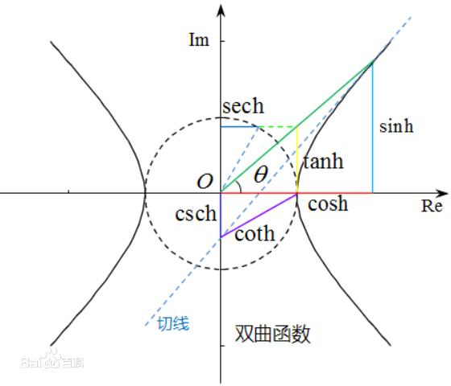

# math模块

Python math 模块提供了许多对浮点数的数学运算函数。主要框架包括

- 数论与表示函数
- 幂函数与对数函数
- 三角函数
- 角度转换
- 双曲函数
- 特殊函数
- 常量

```python
import math
print(dir(math))
[ 'acos', 'acosh', 'asin', 'asinh', 'atan', 'atan2', 'atanh', 'ceil', 'copysign', 'cos', 'cosh', 'degrees', 'e', 'erf', 'erfc', 'exp', 'expm1', 'fabs', 'factorial', 'floor', 'fmod', 'frexp', 'fsum', 'gamma', 'gcd', 'hypot', 'inf', 'isclose', 'isfinite', 'isinf', 'isnan', 'ldexp', 'lgamma', 'log', 'log10', 'log1p', 'log2', 'modf', 'nan', 'pi', 'pow', 'radians', 'remainder', 'sin', 'sinh', 'sqrt', 'tan', 'tanh', 'tau', 'trunc']
```

**注意：**上面的函数是不能直接访问的，需要导入 math 模块，通过静态对象调用该方法。


## **数论与表示函数**

### **ceil()**

**描述：**向上取整数，返回 x 的上限，即大于或者等于 x 的最小整数

**语法：**math.ceil(x)

```python
import math#需要导入数学模块
math.ceil(5.1)
6
math.ceil(5.0)
5
math.ceil(5.8)
6
```


### **copysign()**

**描述：**返回一个基于 x 的绝对值和 y 的符号的浮点数。在支持带符号零的平台上，copysign(1.0, -0.0) 返回 -1.0.

**语法：**math.copysign(x, y)

```python
math.copysign(1,-1)
-1.0

math.copysign(-1,-1)
-1.0

math.copysign(-1,1)
1.
```


### **fabs()**

**描述：**返回数字的绝对值

**语法：**math.fabs( x )

```python
math.fabs(-45.17)
45.17

math.fabs(100)
100.0

math.fabs(math.pi)
3.14159265358979
```


### **factorial()**

**描述：**以一个整数返回 x 的阶乘。 如果 x 不是整数或为负数时则将引发 ValueError。

**语法：**math.factorial( x )

```python
math.factorial(5)#1*2*3*4*5
120
math.factorial(3)#1*2*3
6
```


### **floor()**

**描述：**返回 x 的向下取整，小于或等于 x 的最大整数。如果 x 不是浮点数，则委托 x.__floor__() ，它应返回 Integral 值。

**语法：**math.floor( x )

```python
math.floor(1.2)
1
math.floor(1.99)
1
```


### **fmod()**

**描述：**返回余数，函数 fmod() 在使用浮点数时通常是首选，而Python的 x % y 在使用整数时是首选。

**语法：**math.fmod(x, y)

```python
math.fmod(10, 3)
1.0

math.fmod(8, 3)
2.0

math.fmod(8.2, 3)
2.199999999999999
```


### **frexp()**

**描述：**返回 x 的尾数和指数作为对``(m, e)``。 m 是一个浮点数， e 是一个整数，正好是 x == m * 2**e 。 如果 x 为零，则返回 (0.0, 0) ，否则返回 0.5 <= abs(m) < 1 。这用于以可移植方式“分离”浮点数的内部表示。

**语法：**math.frexp(x)

```python
math.frexp(32)
(0.5, 6)
```


### **fsum()**

**描述：**对迭代器里的每个元素进行求和操作，返回迭代中的精确浮点值。通过跟踪多个中间部分和来避免精度损失

**语法：**math.fsum( x )

```python
math.fsum((1,2,3,4))
10.0

math.fsum([1,2,3,4])
10.0

sum([.1, .1, .1, .1, .1, .1, .1, .1, .1, .1])
0.9999999999999999


math.fsum([.1, .1, .1, .1, .1, .1, .1, .1, .1, .1])
1
```


### **gcd()**

**描述：**返回整数 a 和 b 的最大公约数。如果 a 或 b 之一非零，则 gcd(a, b) 的值是能同时整除 a 和 b 的最大正整数。gcd(0, 0) 返回 0。

**语法：**math.gcd( x,y)

```python
math.gcd(12,6)
6
math.gcd(15,25)
5
```


### **isclose()**

**描述：**若 a 和 b 的值比较接近则返回 True，否则返回 False。根据给定的绝对和相对容差确定两个值是否被认为是接近的。

**语法：**math.isclose(a, b, *, rel_tol=1e-09, abs_tol=0.0)

- rel_tol 是相对容差 —— 它是 a 和 b 之间允许的最大差值，相对于 a 或 b 的较大绝对值。例如，要设置5％的容差，请传递 rel_tol=0.05 。默认容差为 1e-09，确保两个值在大约9位十进制数字内相同。 rel_tol 必须大于零。
- abs_tol 是最小绝对容差 —— 对于接近零的比较很有用。 abs_tol 必须至少为零。

如果没有错误发生，结果将是： abs(a-b) <= max(rel_tol * max(abs(a), abs(b)), abs_tol) 。

IEEE 754特殊值 NaN ， inf 和 -inf 将根据IEEE规则处理。具体来说， NaN 不被认为接近任何其他值，包括 NaN 。 inf 和 -inf 只被认为接近自己。

```python
math.isclose(1.0,1.0000000000001)
True

math.isclose(1.0,1.000000001)
False
```


### **isfinite()**

**描述：**如果 x 既不是无穷大也不是NaN，则返回 True ，否则返回 False 。 （注意 0.0 被认为 是 有限的。）

**语法：**math.isfinite(x)

```python
math.isfinite(2)
True
math.isfinite(math.nan)
False
math.isfinite(math.inf)
False
```


### **isinf()**

**描述：**如果 x 是正或负无穷大，则返回 True ，否则返回 False 。

**语法：**math.isinf()

```python
math.isinf(math.inf)
True
math.isinf(-math.inf)
True
```


### **isnan()**

**描述：**如果 x 是 NaN（不是数字），则返回 True ，否则返回 False 。

**语法：**math.isnan(x)

```python
math.isnan(math.nan)
True
```


### **ldexp()**

**描述：**返回 x * (2**i) 。 这基本上是函数 frexp() 的反函数。

**语法：**math.ldexp(x, i)

```python
math.ldexp(5, 3)
40.0

5 * (2**3)
40
```


### **modf()**

**描述：**返回 x 的小数和整数部分。两个结果都带有 x 的符号并且是浮点数。

**语法：**math.modf(x)

```python
math.modf(3.71828)
(0.71828, 3.0)
```


### **remainder()**

**描述：**返回 IEEE 754 风格的 x 相对于 y 的余数

**语法：**math.remainder(x, y)

```python
math.remainder(14, 5)
-1.0

math.remainder(13, 5)
-2.0

math.remainder(12, 5)
2.0

math.remainder(11, 5)
1
```


### **trunc()**

**描述：**返回 Real 值 x 截断为 Integral （通常是整数）

**语法：**math.trunc(x)

```python
math.trunc(3.718281828459045)
3
```


## **幂函数与对数函数**

### **exp()**

**描述：**返回 e 次 x 幂，其中 e = 2.718281... 是自然对数的基数。这通常比 math.e ** x 或 pow(math.e, x) 更精确。

**语法：**math.exp( x )

**注意：**exp()是不能直接访问的，需要导入 math 模块，通过静态对象调用该方法。

```python
math.exp(1)
2.718281828459045

math.exp(0)
1.0

math.exp(3)
20.08553692318766
```


### **expm1()**

**描述：**返回 e 的 x 次幂，减1。这里 e 是自然对数的基数。对于小浮点数 x ， exp(x) - 1 中的减法可能导致 significant loss of precision； expm1() 函数提供了一种将此数量计算为全精度的方法

**语法：**math.expm1(x)

```python
math.exp(1e-5) - 1 
1.0000050000069649e-05

math.expm1(1e-5)
1.0000050000166667e-05

math.expm1(1)
1.718281828459045
math.expm1(2)
6.3890560989306
```


### **log()**

**描述：**使用一个参数，返回 x 的自然对数（底为 e ）。

**语法：**math.log(x[, base])

**参数：**

- x -- 数值表达式。
- base -- 可选，底数，默认为 e。

```python
math.log(math.e)
1.0

math.log(20)
2.995732273553991

math.log(100,10)#返回以10为底的对数
2.
```


### **log1p()**

**描述：**返回 1+x (base e) 的自然对数。以对于接近零的 x 精确的方式计算结果。

**语法：**math.log1p(x)

```python
math.log1p(1)
0.6931471805599453
```


### **log2()**

**描述：**返回 x 以2为底的对数。这通常比 log(x, 2) 更准确。

**语法：**math.log2(x)

```python
math.log2(8)
3.0
```


### **log10()**

**描述：**返回 x 底为10的对数。这通常比 log(x, 10) 更准确。

**语法：**math.log10( x )

```python
math.log10(100)
2.0
math.log10(1000)
3.0
```


### **pow()**

**描述：**返回 （x的y次方） 的值。与内置的 ** 运算符不同， math.pow() 将其参数转换为 float 类型。使用 ** 或内置的 pow() 函数来计算精确的整数幂。

**语法：**math.pow( x, y )

```python
math.pow( 2, 4 )
16.0

math.pow( 10, 2 )
100.0
```


### **sqrt()**

**描述：**返回数字x的平方根。

**语法：**math.sqrt( x )

```python
math.sqrt(4) 
2.0


math.sqrt(100) 
10.0


math.sqrt(7) 
2.6457513110645907


math.sqrt(math.pi) 
1.77245385090551
```


## **三角函数**

### **acos()**

**描述：**以弧度为单位返回 x 的反余弦值。

**语法：**math.acos(x)

```python
math.acos(.5)
1.0471975511965979
```


### **asin()**

**描述：**以弧度为单位返回 x 的反正弦值。

**语法：**math.asin(x)

```python
math.asin(.5)
0.5235987755982989
```


### **atan()**

**描述：**以弧度为单位返回 x 的反正切值。

**语法：**math.atan(x)

```python
math.atan(1)
0.7853981633974483
```


### **atan2()**

**描述：**以弧度为单位返回 atan(y / x) 。结果是在 -pi 和 pi 之间。从原点到点 (x, y) 的平面矢量使该角度与正X轴成正比。 atan2() 的点的两个输入的符号都是已知的，因此它可以计算角度的正确象限。 例如， atan(1) 和 atan2(1, 1) 都是 pi/4 ，但 atan2(-1, -1) 是 -3*pi/4 。

**语法：**math.atan2(y, x)

```python
math.atan2(1, 1)
0.7853981633974483

math.pi/4
0.7853981633974483
```


### **cos()**

**描述：**返回 x 弧度的余弦值。

**语法：**math.cos(x)

```python
math.cos(math.pi/6)
0.8660254037844387
```


### **hypot()**

**描述：**返回欧几里德范数， sqrt(x*x + y*y) 。 这是从原点到点 (x, y) 的向量长度。

**语法：**math.hypot(x, y)

```python
math.hypot(1, 1)
1.4142135623730951
```


### **sin()**

**描述：**返回 x 弧度的正弦值。

**语法：**math.sin(x)

```python
math.sin(math.pi/6)
0.49999999999999994
```


### **tan()**

**描述：**返回 x 弧度的正切值。

**语法：**math.tan(x)

```python
math.tan(math.pi/4)
0.9999999999999999
```


## **角度转换**

### **degrees()**

**描述：**将角度 x 从弧度转换为度数。

**语法：**math.degrees(x)

```python
math.degrees(math.pi)
180.0

math.degrees(3)
171.88733853924697
```


### **radians()**

**描述：**将角度 x 从度数转换为弧度。

**语法：**math.radians(x)

```python
math.radians(180)
3.141592653589793
```


## **双曲函数**

双曲函数 是基于双曲线而非圆来对三角函数进行模拟。




### **acosh()**

**描述：**返回 x 的反双曲余弦值。

**语法：**math.acosh(x)

```python
math.acosh(3)
1.762747174039086
```


### **asinh()**

**描述：**返回 x 的反双曲正弦值。

**语法：**math.asinh(x)

```python
math.asinh(1)
0.8813735870195429
```


### **atanh()**

**描述：**返回 x 的反双曲正切值。

**语法：**math.atanh(x)

```python
math.atanh(0.5)
0.5493061443340549
```


### **cosh()**

**描述：**返回 x 的双曲余弦值。

**语法：**math.cosh(x)

```python
math.cosh(2)
3.7621956910836314
```


### **sinh()**

**描述：**返回 x 的双曲正弦值。

**语法：**math.sinh(x)

```python
math.sinh(1)
1.1752011936438014
```


### **tanh()**

**描述：**返回 x 的双曲正切值。

**语法：**math.tanh(x)

```python
math.tanh(3)
0.9950547536867305
```


## **特殊函数**

### **erf()**

**描述：**返回 x 处的 error function 。

**语法：**math.erf(x)

```python
math.erf(1)
0.8427007929497149

erf() 函数可用于计算传统的统计函数，如 累积标准正态分布
def phi(x):
    return (1.0 + erf(x / sqrt(2.0))) / 2.0
```


### **erfc()**

**描述：**返回 x 处的互补误差函数。 互补错误函数 定义为 1.0 - erf(x)。 它用于 x 的大值，从其中减去一个会导致 有效位数损失。

**语法：**math.erfc(x)

```python
math.erfc(1)
0.1572992070502851
```


### **gamma()**

**描述：**返回 x 处的 伽马函数 值。

**语法：**math.gamma(x)

```python
math.gamma(4)
6.0
```


### **lgamma()**

**描述：**返回Gamma函数在 x 绝对值的自然对数。

**语法：**math.lgamma(x)

```python
math.lgamma(4)
1.7917594692280554
```


## **常 量**

### **pi**

**描述：**圆周率。数学常数 π = 3.141592...，精确到可用精度。

语法：math.pi

```python
math.pi
3.141592653589793
```


### **e**

**描述：**数学常数 e = 2.718281...，精确到可用精度。

**语法：**math. e

```python
math.e
2.718281828459045
```


### **tau**

**描述：**数学常数 τ = 6.283185...，精确到可用精度。Tau 是一个圆周常数，等于 2π，圆的周长与半径之比

**语法：**math.tau

```python
math.tau
6.283185307179586
```


### **inf**

**描述：**浮点正无穷大。 （对于负无穷大，使用 -math.inf 。）相当于``float('inf')`` 的输出。

**语法：**math.inf

```python
math.inf
inf
```


### **nan**

**描述：**浮点“非数字”（NaN）值。 相当于 float('nan') 的输出。

**语法：**math.nan

```python
math.nan
nan
```

