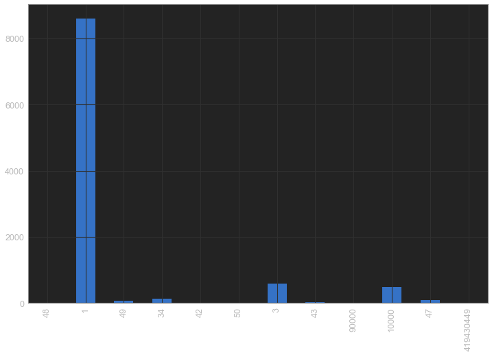
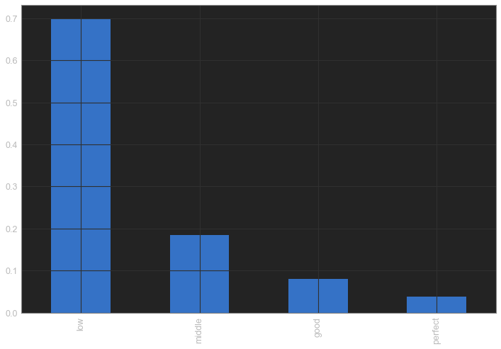

```python
from IPython.core.interactiveshell import InteractiveShell

InteractiveShell.ast_node_interactivity = "all"

import warnings

warnings.filterwarnings("ignore")
```


```python
import pandas as pd
import time
import datetime
import numpy as np
import matplotlib.pyplot as plt
from jupyterthemes import jtplot

jtplot.style()

%matplotlib inline
```


```python
pd.set_option('display.max_rows', 500)
pd.set_option('display.max_columns', 500)
pd.set_option('display.width', 1000)
```

# 数据导入导出

## 数据导入

```python
pd.read_csv(filename)  # 导入csv格式文件中的数据
pd.read_table(filename)  # 导入有分隔符的文本 (如TSV) 中的数据
pd.read_excel(filename)  # 导入Excel格式文件中的数据
pd.read_sql(query, connection_object)  # 导入SQL数据表/数据库中的数据
pd.read_json(json_string)  # 导入JSON格式的字符，URL地址或者文件中的数据
pd.read_html(url)  # 导入经过解析的URL地址中包含的数据框 (DataFrame) 数据
pd.read_clipboard()  # 导入系统粘贴板里面的数据
pd.DataFrame(dict)  # 导入Python字典 (dict) 里面的数据，其中key是数据框的表头，value是数据框的内容。
```

### read_table

```python
with open('CREAT_data.txt', encoding='utf-8') as f:
    df = pd.read_table(f, dtype={'住院号': str}, sep='|', index_col=0, low_memory=False)
```


```python
df = pd.read_csv("data/test_data.txt", sep = "|", index_col=0)
df.head()
```

<table border="1" class="dataframe">
  <thead>
    <tr style="text-align: right;">
      <th></th>
      <th>wechatfriendid</th>
      <th>issend</th>
      <th>content</th>
      <th>msgtype</th>
      <th>createtime</th>
    </tr>
  </thead>
  <tbody>
    <tr>
      <th>2921810</th>
      <td>149297</td>
      <td>0</td>
      <td>学生</td>
      <td>1</td>
      <td>2019-05-07 10:00:52.468027</td>
    </tr>
    <tr>
      <th>3211165</th>
      <td>215107</td>
      <td>0</td>
      <td>我月事已经推迟九天了</td>
      <td>1</td>
      <td>2019-05-20 10:44:21.467885</td>
    </tr>
    <tr>
      <th>899284</th>
      <td>197036</td>
      <td>1</td>
      <td>3、近一周内有无心慌、心悸、头晕、恶心、胸闷等症状？</td>
      <td>1</td>
      <td>2019-05-09 12:55:48.734115</td>
    </tr>
    <tr>
      <th>2684950</th>
      <td>231926</td>
      <td>0</td>
      <td>好的</td>
      <td>1</td>
      <td>2019-05-17 11:06:58.436622</td>
    </tr>
    <tr>
      <th>2361958</th>
      <td>70755</td>
      <td>0</td>
      <td>https://lvshou-wgj.oss-cn-shenzhen.aliyuncs.co...</td>
      <td>3</td>
      <td>2019-05-22 09:13:43.686665</td>
    </tr>
  </tbody>
</table>


```python
df["createtime"] = pd.to_datetime(df["createtime"]).dt.strftime("%Y-%m-%d %H:%M:%S")
df["today"] = datetime.datetime.now()
df["issend"] = df["issend"].apply(lambda x: "老板" if x else "客户")
df["txt_len"] = df["content"].str.len()
```


```python
msgtype_dict = {
    10000: '系统消息',
    1: '文字',
    3: '图片',
    34: '语音',
    42: '名片',
    47: '自定义表情',
    48: '位置',
    49: '链接',
    50: '语音、视频通话',
    43: '视频(mp4等)',
    419430449: '转账',
    436207665: '红包',
    -1879048186: '实时位置',
    90000: '聚侠系统消息',
}

df["msgtype_name"] = df["msgtype"].map(msgtype_dict)
```


```python
df.head()
```

<table border="1" class="dataframe">
  <thead>
    <tr style="text-align: right;">
      <th></th>
      <th>wechatfriendid</th>
      <th>issend</th>
      <th>content</th>
      <th>msgtype</th>
      <th>createtime</th>
      <th>today</th>
      <th>txt_len</th>
      <th>msgtype_name</th>
    </tr>
  </thead>
  <tbody>
    <tr>
      <th>2921810</th>
      <td>149297</td>
      <td>客户</td>
      <td>学生</td>
      <td>1</td>
      <td>2019-05-07 10:00:52</td>
      <td>2020-07-19 23:53:12.856499</td>
      <td>2</td>
      <td>文字</td>
    </tr>
    <tr>
      <th>3211165</th>
      <td>215107</td>
      <td>客户</td>
      <td>我月事已经推迟九天了</td>
      <td>1</td>
      <td>2019-05-20 10:44:21</td>
      <td>2020-07-19 23:53:12.856499</td>
      <td>10</td>
      <td>文字</td>
    </tr>
    <tr>
      <th>899284</th>
      <td>197036</td>
      <td>老板</td>
      <td>3、近一周内有无心慌、心悸、头晕、恶心、胸闷等症状？</td>
      <td>1</td>
      <td>2019-05-09 12:55:48</td>
      <td>2020-07-19 23:53:12.856499</td>
      <td>26</td>
      <td>文字</td>
    </tr>
    <tr>
      <th>2684950</th>
      <td>231926</td>
      <td>客户</td>
      <td>好的</td>
      <td>1</td>
      <td>2019-05-17 11:06:58</td>
      <td>2020-07-19 23:53:12.856499</td>
      <td>2</td>
      <td>文字</td>
    </tr>
    <tr>
      <th>2361958</th>
      <td>70755</td>
      <td>客户</td>
      <td>https://lvshou-wgj.oss-cn-shenzhen.aliyuncs.co...</td>
      <td>3</td>
      <td>2019-05-22 09:13:43</td>
      <td>2020-07-19 23:53:12.856499</td>
      <td>138</td>
      <td>图片</td>
    </tr>
  </tbody>
</table>


```python
df_01 = pd.DataFrame({
    'A': np.array([1, np.nan, 2, 3, 6, np.nan]),
    'B': np.array([np.nan, 4, np.nan, 5, 9, np.nan]),
    'C': 'foo'
})
```

## 数据导出

- df.to_csv(filename)  # 将数据框 (DataFrame)中的数据导入csv格式的文件中
- df.to_excel(filename)  # 将数据框 (DataFrame)中的数据导入Excel格式的文件中
- df.to_sql(table_name, connection_object)  # 将数据框 (DataFrame)中的数据导入SQL数据表/数据库中
- df.to_json(filename)  # 将数据框 (DataFrame)中的数据导入JSON格式的文件中
- df.to_pickle(filename)


```python
# df.to_excel('test_data_v3' + datetime.datetime.now().strftime('%y%m%d%H%M') + '.xlsx')
```

# 数据的查看与检查

## head


```python
df.head(5)
```

<table border="1" class="dataframe">
  <thead>
    <tr style="text-align: right;">
      <th></th>
      <th>wechatfriendid</th>
      <th>issend</th>
      <th>content</th>
      <th>msgtype</th>
      <th>createtime</th>
      <th>today</th>
      <th>txt_len</th>
      <th>msgtype_name</th>
    </tr>
  </thead>
  <tbody>
    <tr>
      <th>2921810</th>
      <td>149297</td>
      <td>客户</td>
      <td>学生</td>
      <td>1</td>
      <td>2019-05-07 10:00:52</td>
      <td>2020-07-19 23:53:12.856499</td>
      <td>2</td>
      <td>文字</td>
    </tr>
    <tr>
      <th>3211165</th>
      <td>215107</td>
      <td>客户</td>
      <td>我月事已经推迟九天了</td>
      <td>1</td>
      <td>2019-05-20 10:44:21</td>
      <td>2020-07-19 23:53:12.856499</td>
      <td>10</td>
      <td>文字</td>
    </tr>
    <tr>
      <th>899284</th>
      <td>197036</td>
      <td>老板</td>
      <td>3、近一周内有无心慌、心悸、头晕、恶心、胸闷等症状？</td>
      <td>1</td>
      <td>2019-05-09 12:55:48</td>
      <td>2020-07-19 23:53:12.856499</td>
      <td>26</td>
      <td>文字</td>
    </tr>
    <tr>
      <th>2684950</th>
      <td>231926</td>
      <td>客户</td>
      <td>好的</td>
      <td>1</td>
      <td>2019-05-17 11:06:58</td>
      <td>2020-07-19 23:53:12.856499</td>
      <td>2</td>
      <td>文字</td>
    </tr>
    <tr>
      <th>2361958</th>
      <td>70755</td>
      <td>客户</td>
      <td>https://lvshou-wgj.oss-cn-shenzhen.aliyuncs.co...</td>
      <td>3</td>
      <td>2019-05-22 09:13:43</td>
      <td>2020-07-19 23:53:12.856499</td>
      <td>138</td>
      <td>图片</td>
    </tr>
  </tbody>
</table>


## tail


```python
df.tail(5)
```

<table border="1" class="dataframe">
  <thead>
    <tr style="text-align: right;">
      <th></th>
      <th>wechatfriendid</th>
      <th>issend</th>
      <th>content</th>
      <th>msgtype</th>
      <th>createtime</th>
      <th>today</th>
      <th>txt_len</th>
      <th>msgtype_name</th>
    </tr>
  </thead>
  <tbody>
    <tr>
      <th>2870499</th>
      <td>1994</td>
      <td>老板</td>
      <td>尊敬的刘俊丽女士，您好！绿瘦集团总部李先生指导您，接下来的用法8天：早起一杯温开水；蛋白粉代...</td>
      <td>1</td>
      <td>2019-05-20 16:38:39</td>
      <td>2020-07-19 23:53:12.856499</td>
      <td>174</td>
      <td>文字</td>
    </tr>
    <tr>
      <th>964986</th>
      <td>306946</td>
      <td>老板</td>
      <td>好的，你今天辛苦一下严格按照饮食建议做</td>
      <td>1</td>
      <td>2019-05-16 22:54:01</td>
      <td>2020-07-19 23:53:12.856499</td>
      <td>19</td>
      <td>文字</td>
    </tr>
    <tr>
      <th>982671</th>
      <td>301817</td>
      <td>老板</td>
      <td>哦，、拿到了微我</td>
      <td>1</td>
      <td>2019-05-20 11:43:59</td>
      <td>2020-07-19 23:53:12.856499</td>
      <td>8</td>
      <td>文字</td>
    </tr>
    <tr>
      <th>2988153</th>
      <td>230777</td>
      <td>客户</td>
      <td>好的</td>
      <td>1</td>
      <td>2019-05-13 13:17:16</td>
      <td>2020-07-19 23:53:12.856499</td>
      <td>2</td>
      <td>文字</td>
    </tr>
    <tr>
      <th>3214160</th>
      <td>307912</td>
      <td>老板</td>
      <td>平时是否有以下症状：1.口干口臭、2.容易疲劳乏力、3.失眠多梦、4.容易头晕眼花、5.冬天...</td>
      <td>1</td>
      <td>2019-05-20 18:49:25</td>
      <td>2020-07-19 23:53:12.856499</td>
      <td>61</td>
      <td>文字</td>
    </tr>
  </tbody>
</table>


## sample


```python
df.sample(5)
```

<table border="1" class="dataframe">
  <thead>
    <tr style="text-align: right;">
      <th></th>
      <th>wechatfriendid</th>
      <th>issend</th>
      <th>content</th>
      <th>msgtype</th>
      <th>createtime</th>
      <th>today</th>
      <th>txt_len</th>
      <th>msgtype_name</th>
    </tr>
  </thead>
  <tbody>
    <tr>
      <th>3236904</th>
      <td>258069</td>
      <td>客户</td>
      <td>http://mmbiz.qpic.cn/mmemoticon/ajNVdqHZLLBG3R...</td>
      <td>47</td>
      <td>2019-05-25 07:03:02</td>
      <td>2020-07-19 23:53:12.856499</td>
      <td>102</td>
      <td>自定义表情</td>
    </tr>
    <tr>
      <th>1693368</th>
      <td>340890</td>
      <td>客户</td>
      <td>是的，说的太对了。</td>
      <td>1</td>
      <td>2019-05-24 20:59:36</td>
      <td>2020-07-19 23:53:12.856499</td>
      <td>9</td>
      <td>文字</td>
    </tr>
    <tr>
      <th>3200383</th>
      <td>231087</td>
      <td>客户</td>
      <td>https://lvshou-wgj.oss-cn-shenzhen.aliyuncs.co...</td>
      <td>3</td>
      <td>2019-05-17 14:42:20</td>
      <td>2020-07-19 23:53:12.856499</td>
      <td>138</td>
      <td>图片</td>
    </tr>
    <tr>
      <th>2041062</th>
      <td>211407</td>
      <td>客户</td>
      <td>那我早上都吃了一顿啦</td>
      <td>1</td>
      <td>2019-05-26 10:03:49</td>
      <td>2020-07-19 23:53:12.856499</td>
      <td>10</td>
      <td>文字</td>
    </tr>
    <tr>
      <th>1084327</th>
      <td>211083</td>
      <td>客户</td>
      <td>你已添加了心安，现在可以开始聊天了。</td>
      <td>10000</td>
      <td>2019-05-09 16:49:49</td>
      <td>2020-07-19 23:53:12.856499</td>
      <td>18</td>
      <td>系统消息</td>
    </tr>
  </tbody>
</table>


```python
df.sample(n=6, replace=False)
```

<table border="1" class="dataframe">
  <thead>
    <tr style="text-align: right;">
      <th></th>
      <th>wechatfriendid</th>
      <th>issend</th>
      <th>content</th>
      <th>msgtype</th>
      <th>createtime</th>
      <th>today</th>
      <th>txt_len</th>
      <th>msgtype_name</th>
    </tr>
  </thead>
  <tbody>
    <tr>
      <th>1920008</th>
      <td>193803</td>
      <td>客户</td>
      <td>是真的能瘦吗？</td>
      <td>1</td>
      <td>2019-05-08 22:46:26</td>
      <td>2020-07-19 23:53:12.856499</td>
      <td>7</td>
      <td>文字</td>
    </tr>
    <tr>
      <th>2357810</th>
      <td>301312</td>
      <td>老板</td>
      <td>这是我们的官网产品</td>
      <td>1</td>
      <td>2019-05-21 09:02:03</td>
      <td>2020-07-19 23:53:12.856499</td>
      <td>9</td>
      <td>文字</td>
    </tr>
    <tr>
      <th>2186678</th>
      <td>280726</td>
      <td>老板</td>
      <td>咱们主要就是在修复期间产生的废弃物代谢不了造成的问题</td>
      <td>1</td>
      <td>2019-05-21 10:06:51</td>
      <td>2020-07-19 23:53:12.856499</td>
      <td>26</td>
      <td>文字</td>
    </tr>
    <tr>
      <th>3177388</th>
      <td>277984</td>
      <td>老板</td>
      <td>收到</td>
      <td>1</td>
      <td>2019-05-14 20:52:56</td>
      <td>2020-07-19 23:53:12.856499</td>
      <td>2</td>
      <td>文字</td>
    </tr>
    <tr>
      <th>3068087</th>
      <td>298490</td>
      <td>老板</td>
      <td>你联系过黄顾问没有</td>
      <td>1</td>
      <td>2019-05-25 16:08:10</td>
      <td>2020-07-19 23:53:12.856499</td>
      <td>9</td>
      <td>文字</td>
    </tr>
    <tr>
      <th>2425712</th>
      <td>186621</td>
      <td>老板</td>
      <td>亲，打扰你了，没有大动作怎敢惊动您[嘿哈]今天朋友圈有优惠活动！全场大特价买一送二礼品[怄...</td>
      <td>1</td>
      <td>2019-05-08 21:08:13</td>
      <td>2020-07-19 23:53:12.856499</td>
      <td>94</td>
      <td>文字</td>
    </tr>
  </tbody>
</table>


## shape


```python
df.shape
```


    (10000, 8)


```python
df.shape[0]
```


    10000


```python
df.shape[1]
```


    8


## dtype


```python
df["msgtype"].dtype
```


    dtype('int64')


## dtypes


```python
df.dtypes
```


    wechatfriendid             int64
    issend                    object
    content                   object
    msgtype                    int64
    createtime                object
    today             datetime64[ns]
    txt_len                    int64
    msgtype_name              object
    dtype: object


## info


```python
df.info()
```

    <class 'pandas.core.frame.DataFrame'>
    Int64Index: 10000 entries, 2921810 to 3214160
    Data columns (total 8 columns):
    wechatfriendid    10000 non-null int64
    issend            10000 non-null object
    content           10000 non-null object
    msgtype           10000 non-null int64
    createtime        10000 non-null object
    today             10000 non-null datetime64[ns]
    txt_len           10000 non-null int64
    msgtype_name      10000 non-null object
    dtypes: datetime64[ns](1), int64(3), object(4)
    memory usage: 703.1+ KB


## describle


```python
df.describe().round(2).T
```

<table border="1" class="dataframe">
  <thead>
    <tr style="text-align: right;">
      <th></th>
      <th>count</th>
      <th>mean</th>
      <th>std</th>
      <th>min</th>
      <th>25%</th>
      <th>50%</th>
      <th>75%</th>
      <th>max</th>
    </tr>
  </thead>
  <tbody>
    <tr>
      <th>wechatfriendid</th>
      <td>10000.0</td>
      <td>233229.08</td>
      <td>87675.95</td>
      <td>1472.0</td>
      <td>182619.0</td>
      <td>223977.0</td>
      <td>314705.0</td>
      <td>356807.0</td>
    </tr>
    <tr>
      <th>msgtype</th>
      <td>10000.0</td>
      <td>168291.56</td>
      <td>8387340.50</td>
      <td>1.0</td>
      <td>1.0</td>
      <td>1.0</td>
      <td>1.0</td>
      <td>419430449.0</td>
    </tr>
    <tr>
      <th>txt_len</th>
      <td>10000.0</td>
      <td>32.79</td>
      <td>59.53</td>
      <td>1.0</td>
      <td>5.0</td>
      <td>12.0</td>
      <td>30.0</td>
      <td>1309.0</td>
    </tr>
  </tbody>
</table>


```python
df.describe(include="all").round(2).T
```

<table border="1" class="dataframe">
  <thead>
    <tr style="text-align: right;">
      <th></th>
      <th>count</th>
      <th>unique</th>
      <th>top</th>
      <th>freq</th>
      <th>first</th>
      <th>last</th>
      <th>mean</th>
      <th>std</th>
      <th>min</th>
      <th>25%</th>
      <th>50%</th>
      <th>75%</th>
      <th>max</th>
    </tr>
  </thead>
  <tbody>
    <tr>
      <th>wechatfriendid</th>
      <td>10000</td>
      <td>NaN</td>
      <td>NaN</td>
      <td>NaN</td>
      <td>NaN</td>
      <td>NaN</td>
      <td>233229</td>
      <td>87675.9</td>
      <td>1472</td>
      <td>182619</td>
      <td>223977</td>
      <td>314705</td>
      <td>356807</td>
    </tr>
    <tr>
      <th>issend</th>
      <td>10000</td>
      <td>2</td>
      <td>客户</td>
      <td>5044</td>
      <td>NaN</td>
      <td>NaN</td>
      <td>NaN</td>
      <td>NaN</td>
      <td>NaN</td>
      <td>NaN</td>
      <td>NaN</td>
      <td>NaN</td>
      <td>NaN</td>
    </tr>
    <tr>
      <th>content</th>
      <td>10000</td>
      <td>7978</td>
      <td>以上是打招呼的内容</td>
      <td>189</td>
      <td>NaN</td>
      <td>NaN</td>
      <td>NaN</td>
      <td>NaN</td>
      <td>NaN</td>
      <td>NaN</td>
      <td>NaN</td>
      <td>NaN</td>
      <td>NaN</td>
    </tr>
    <tr>
      <th>msgtype</th>
      <td>10000</td>
      <td>NaN</td>
      <td>NaN</td>
      <td>NaN</td>
      <td>NaN</td>
      <td>NaN</td>
      <td>168292</td>
      <td>8.38734e+06</td>
      <td>1</td>
      <td>1</td>
      <td>1</td>
      <td>1</td>
      <td>4.1943e+08</td>
    </tr>
    <tr>
      <th>createtime</th>
      <td>10000</td>
      <td>7050</td>
      <td>2019-05-08 21:31:11</td>
      <td>26</td>
      <td>NaN</td>
      <td>NaN</td>
      <td>NaN</td>
      <td>NaN</td>
      <td>NaN</td>
      <td>NaN</td>
      <td>NaN</td>
      <td>NaN</td>
      <td>NaN</td>
    </tr>
    <tr>
      <th>today</th>
      <td>10000</td>
      <td>1</td>
      <td>2020-07-19 23:53:12.856499</td>
      <td>10000</td>
      <td>2020-07-19 23:53:12.856499</td>
      <td>2020-07-19 23:53:12.856499</td>
      <td>NaN</td>
      <td>NaN</td>
      <td>NaN</td>
      <td>NaN</td>
      <td>NaN</td>
      <td>NaN</td>
      <td>NaN</td>
    </tr>
    <tr>
      <th>txt_len</th>
      <td>10000</td>
      <td>NaN</td>
      <td>NaN</td>
      <td>NaN</td>
      <td>NaN</td>
      <td>NaN</td>
      <td>32.79</td>
      <td>59.53</td>
      <td>1</td>
      <td>5</td>
      <td>12</td>
      <td>30</td>
      <td>1309</td>
    </tr>
    <tr>
      <th>msgtype_name</th>
      <td>10000</td>
      <td>12</td>
      <td>文字</td>
      <td>8597</td>
      <td>NaN</td>
      <td>NaN</td>
      <td>NaN</td>
      <td>NaN</td>
      <td>NaN</td>
      <td>NaN</td>
      <td>NaN</td>
      <td>NaN</td>
      <td>NaN</td>
    </tr>
  </tbody>
</table>


```python
df.describe(include=["object"]).round(2).T
```

<table border="1" class="dataframe">
  <thead>
    <tr style="text-align: right;">
      <th></th>
      <th>count</th>
      <th>unique</th>
      <th>top</th>
      <th>freq</th>
    </tr>
  </thead>
  <tbody>
    <tr>
      <th>issend</th>
      <td>10000</td>
      <td>2</td>
      <td>客户</td>
      <td>5044</td>
    </tr>
    <tr>
      <th>content</th>
      <td>10000</td>
      <td>7978</td>
      <td>以上是打招呼的内容</td>
      <td>189</td>
    </tr>
    <tr>
      <th>createtime</th>
      <td>10000</td>
      <td>7050</td>
      <td>2019-05-08 21:31:11</td>
      <td>26</td>
    </tr>
    <tr>
      <th>msgtype_name</th>
      <td>10000</td>
      <td>12</td>
      <td>文字</td>
      <td>8597</td>
    </tr>
  </tbody>
</table>


```python
df.describe(include=["number"]).round(2).T
```

<table border="1" class="dataframe">
  <thead>
    <tr style="text-align: right;">
      <th></th>
      <th>count</th>
      <th>mean</th>
      <th>std</th>
      <th>min</th>
      <th>25%</th>
      <th>50%</th>
      <th>75%</th>
      <th>max</th>
    </tr>
  </thead>
  <tbody>
    <tr>
      <th>wechatfriendid</th>
      <td>10000.0</td>
      <td>233229.08</td>
      <td>87675.95</td>
      <td>1472.0</td>
      <td>182619.0</td>
      <td>223977.0</td>
      <td>314705.0</td>
      <td>356807.0</td>
    </tr>
    <tr>
      <th>msgtype</th>
      <td>10000.0</td>
      <td>168291.56</td>
      <td>8387340.50</td>
      <td>1.0</td>
      <td>1.0</td>
      <td>1.0</td>
      <td>1.0</td>
      <td>419430449.0</td>
    </tr>
    <tr>
      <th>txt_len</th>
      <td>10000.0</td>
      <td>32.79</td>
      <td>59.53</td>
      <td>1.0</td>
      <td>5.0</td>
      <td>12.0</td>
      <td>30.0</td>
      <td>1309.0</td>
    </tr>
  </tbody>
</table>


## value_counts


```python
# help(pd.Series.value_counts)
```


```python
df["msgtype"].value_counts()
```


    1            8597
    3             587
    10000         490
    34            122
    47             91
    49             72
    43             18
    50              8
    42              7
    419430449       4
    90000           3
    48              1
    Name: msgtype, dtype: int64


```python
df["msgtype"].value_counts(ascending=True, dropna=True)
```


    48              1
    90000           3
    419430449       4
    42              7
    50              8
    43             18
    49             72
    47             91
    34            122
    10000         490
    3             587
    1            8597
    Name: msgtype, dtype: int64


```python
df["msgtype"].value_counts(normalize=True ,sort=False)
```


    48           0.0001
    1            0.8597
    49           0.0072
    34           0.0122
    42           0.0007
    50           0.0008
    3            0.0587
    43           0.0018
    90000        0.0003
    10000        0.0490
    47           0.0091
    419430449    0.0004
    Name: msgtype, dtype: float64


```python
# df["msgtype"].value_counts(sort=False).plot(kind='bar', figsize=(12,8))
df["msgtype"].value_counts(sort=False).plot.bar(figsize=(12,8));
```





## columns


```python
df.columns
```


    Index(['wechatfriendid', 'issend', 'content', 'msgtype', 'createtime', 'today', 'txt_len', 'msgtype_name'], dtype='object')


## unique


```python
df['msgtype'].unique()
```


    array([        1,         3,        47,     10000,        43,        50,
                  49,        34, 419430449,     90000,        42,        48],
          dtype=int64)


```python
xcg_dict = {}
for inx, li in enumerate(df['msgtype'].unique()):
    xcg_dict[inx] = "msgtype_" + str(li)

xcg_dict
```


    {0: 'msgtype_1',
     1: 'msgtype_3',
     2: 'msgtype_47',
     3: 'msgtype_10000',
     4: 'msgtype_43',
     5: 'msgtype_50',
     6: 'msgtype_49',
     7: 'msgtype_34',
     8: 'msgtype_419430449',
     9: 'msgtype_90000',
     10: 'msgtype_42',
     11: 'msgtype_48'}


## 统计指标


```python
# d1 = pd.Series(2*np.random.normal(size = 100)+3)
# d1.count()          #非空元素计算
# d1.min()            #最小值
# d1.max()            #最大值
# d1.idxmin()         #最小值的位置，类似于R中的which.min函数
# d1.idxmax()         #最大值的位置，类似于R中的which.max函数
# d1.quantile(0.1)    #10%分位数
# d1.sum()            #求和
# d1.mean()           #均值
# d1.median()         #中位数
# d1.mode()           #众数
# d1.var()            #方差
# d1.std()            #标准差
# d1.mad()            #平均绝对偏差
# d1.skew()           #偏度
# d1.kurt()           #峰度
# d1.describe()       #一次性输出多个描述性统计指标
```

## skew


```python
# 偏度
df["wechatfriendid"].skew()
```


    -0.4789557953478023


## kurt


```python
# 峰度
df["wechatfriendid"].kurt()
```


    -0.5480137074390687


### mean


```python
pd.DataFrame(np.random.rand(10, 5), columns=list('ABCDE')).mean(axis=0)
```


    A    0.444119
    B    0.614088
    C    0.650843
    D    0.576460
    E    0.410111
    dtype: float64


### sum


```python
pd.DataFrame(np.random.rand(10, 5), columns=list('ABCDE')).sum(axis=0)
```


    A    4.649997
    B    6.010489
    C    4.609288
    D    4.764930
    E    3.509595
    dtype: float64


### count


```python
pd.DataFrame(np.random.rand(10, 5), columns=list('ABCDE')).count(axis=0)
```


    A    10
    B    10
    C    10
    D    10
    E    10
    dtype: int64


### std


```python
pd.DataFrame(np.random.rand(10, 5), columns=list('ABCDE')).std(axis=0)
```


    A    0.320589
    B    0.275226
    C    0.219161
    D    0.341879
    E    0.339217
    dtype: float64


### cov


```python
# 协方差
df['msgtype'].cov(df['msgtype'])
```


    70347480647519.38


```python
df.cov()
```

<table border="1" class="dataframe">
  <thead>
    <tr style="text-align: right;">
      <th></th>
      <th>wechatfriendid</th>
      <th>msgtype</th>
      <th>txt_len</th>
    </tr>
  </thead>
  <tbody>
    <tr>
      <th>wechatfriendid</th>
      <td>7.687072e+09</td>
      <td>1.765748e+10</td>
      <td>-2.446959e+04</td>
    </tr>
    <tr>
      <th>msgtype</th>
      <td>1.765748e+10</td>
      <td>7.034748e+13</td>
      <td>2.721272e+07</td>
    </tr>
    <tr>
      <th>txt_len</th>
      <td>-2.446959e+04</td>
      <td>2.721272e+07</td>
      <td>3.543505e+03</td>
    </tr>
  </tbody>
</table>


### corr


```python
pd.DataFrame(np.random.rand(10, 5), columns=list('ABCDE')).corr()
```

<table border="1" class="dataframe">
  <thead>
    <tr style="text-align: right;">
      <th></th>
      <th>A</th>
      <th>B</th>
      <th>C</th>
      <th>D</th>
      <th>E</th>
    </tr>
  </thead>
  <tbody>
    <tr>
      <th>A</th>
      <td>1.000000</td>
      <td>0.398353</td>
      <td>0.367723</td>
      <td>-0.050003</td>
      <td>0.250295</td>
    </tr>
    <tr>
      <th>B</th>
      <td>0.398353</td>
      <td>1.000000</td>
      <td>0.171756</td>
      <td>-0.014634</td>
      <td>-0.242044</td>
    </tr>
    <tr>
      <th>C</th>
      <td>0.367723</td>
      <td>0.171756</td>
      <td>1.000000</td>
      <td>0.316708</td>
      <td>-0.347465</td>
    </tr>
    <tr>
      <th>D</th>
      <td>-0.050003</td>
      <td>-0.014634</td>
      <td>0.316708</td>
      <td>1.000000</td>
      <td>-0.349271</td>
    </tr>
    <tr>
      <th>E</th>
      <td>0.250295</td>
      <td>-0.242044</td>
      <td>-0.347465</td>
      <td>-0.349271</td>
      <td>1.000000</td>
    </tr>
  </tbody>
</table>


### median


```python
pd.DataFrame(np.random.rand(10, 5), columns=list('ABCDE')).median()
```


    A    0.407231
    B    0.797422
    C    0.778306
    D    0.389559
    E    0.510000
    dtype: float64


### max、min


```python
pd.DataFrame(np.random.rand(10, 5), columns=list('ABCDE')).min()
```


    A    0.098717
    B    0.344256
    C    0.002881
    D    0.092539
    E    0.059696
    dtype: float64


### quantile


```python
pd.DataFrame(np.random.rand(10, 5), columns=list('ABCDE')).quantile(0.2)
```


    A    0.175283
    B    0.139023
    C    0.253729
    D    0.183293
    E    0.525111
    Name: 0.2, dtype: float64


```python
np.random.seed(1234)
d1 = pd.Series(2*np.random.normal(size = 100)+3)
d2 = np.random.f(2,4,size = 100)
d3 = np.random.randint(1,100,size = 100)

def status(x):
    return pd.Series([
        x.count(),
        x.min(),
        x.idxmin(),
        x.quantile(.25),
        x.median(),
        x.quantile(.75),
        x.mean(),
        x.max(),
        x.idxmax(),
        x.mad(),
        x.var(),
        x.std(),
        x.skew(),
        x.kurt()
    ],
          index=['总数', '最小值', '最小值位置', '25%分位数', '中位数', '75%分位数', '均值', '最大值', '最大值位数', '平均绝对偏差', '方差', '标准差', '偏度', '峰度' ])

df_tmp = pd.DataFrame(status(d1))
df_tmp
```

<table border="1" class="dataframe">
  <thead>
    <tr style="text-align: right;">
      <th></th>
      <th>0</th>
    </tr>
  </thead>
  <tbody>
    <tr>
      <th>总数</th>
      <td>100.000000</td>
    </tr>
    <tr>
      <th>最小值</th>
      <td>-4.127033</td>
    </tr>
    <tr>
      <th>最小值位置</th>
      <td>81.000000</td>
    </tr>
    <tr>
      <th>25%分位数</th>
      <td>2.040101</td>
    </tr>
    <tr>
      <th>中位数</th>
      <td>3.204555</td>
    </tr>
    <tr>
      <th>75%分位数</th>
      <td>4.434788</td>
    </tr>
    <tr>
      <th>均值</th>
      <td>3.070225</td>
    </tr>
    <tr>
      <th>最大值</th>
      <td>7.781921</td>
    </tr>
    <tr>
      <th>最大值位数</th>
      <td>39.000000</td>
    </tr>
    <tr>
      <th>平均绝对偏差</th>
      <td>1.511288</td>
    </tr>
    <tr>
      <th>方差</th>
      <td>4.005609</td>
    </tr>
    <tr>
      <th>标准差</th>
      <td>2.001402</td>
    </tr>
    <tr>
      <th>偏度</th>
      <td>-0.649478</td>
    </tr>
    <tr>
      <th>峰度</th>
      <td>1.220109</td>
    </tr>
  </tbody>
</table>
</div>


```python
df_tmp = pd.DataFrame(np.array([d1,d2,d3]).T, columns=['x1','x2','x3'])
df_tmp.head()

df_tmp.apply(status)
```

<table border="1" class="dataframe">
  <thead>
    <tr style="text-align: right;">
      <th></th>
      <th>x1</th>
      <th>x2</th>
      <th>x3</th>
    </tr>
  </thead>
  <tbody>
    <tr>
      <th>0</th>
      <td>3.942870</td>
      <td>1.369531</td>
      <td>55.0</td>
    </tr>
    <tr>
      <th>1</th>
      <td>0.618049</td>
      <td>0.943264</td>
      <td>68.0</td>
    </tr>
    <tr>
      <th>2</th>
      <td>5.865414</td>
      <td>0.590663</td>
      <td>73.0</td>
    </tr>
    <tr>
      <th>3</th>
      <td>2.374696</td>
      <td>0.206548</td>
      <td>59.0</td>
    </tr>
    <tr>
      <th>4</th>
      <td>1.558823</td>
      <td>0.223204</td>
      <td>60.0</td>
    </tr>
  </tbody>
</table>


<table border="1" class="dataframe">
  <thead>
    <tr style="text-align: right;">
      <th></th>
      <th>x1</th>
      <th>x2</th>
      <th>x3</th>
    </tr>
  </thead>
  <tbody>
    <tr>
      <th>总数</th>
      <td>100.000000</td>
      <td>100.000000</td>
      <td>100.000000</td>
    </tr>
    <tr>
      <th>最小值</th>
      <td>-4.127033</td>
      <td>0.014330</td>
      <td>3.000000</td>
    </tr>
    <tr>
      <th>最小值位置</th>
      <td>81.000000</td>
      <td>72.000000</td>
      <td>76.000000</td>
    </tr>
    <tr>
      <th>25%分位数</th>
      <td>2.040101</td>
      <td>0.249580</td>
      <td>25.000000</td>
    </tr>
    <tr>
      <th>中位数</th>
      <td>3.204555</td>
      <td>1.000613</td>
      <td>54.500000</td>
    </tr>
    <tr>
      <th>75%分位数</th>
      <td>4.434788</td>
      <td>2.101581</td>
      <td>73.000000</td>
    </tr>
    <tr>
      <th>均值</th>
      <td>3.070225</td>
      <td>2.028608</td>
      <td>51.490000</td>
    </tr>
    <tr>
      <th>最大值</th>
      <td>7.781921</td>
      <td>18.791565</td>
      <td>98.000000</td>
    </tr>
    <tr>
      <th>最大值位数</th>
      <td>39.000000</td>
      <td>53.000000</td>
      <td>96.000000</td>
    </tr>
    <tr>
      <th>平均绝对偏差</th>
      <td>1.511288</td>
      <td>1.922669</td>
      <td>24.010800</td>
    </tr>
    <tr>
      <th>方差</th>
      <td>4.005609</td>
      <td>10.206447</td>
      <td>780.090808</td>
    </tr>
    <tr>
      <th>标准差</th>
      <td>2.001402</td>
      <td>3.194753</td>
      <td>27.930106</td>
    </tr>
    <tr>
      <th>偏度</th>
      <td>-0.649478</td>
      <td>3.326246</td>
      <td>-0.118917</td>
    </tr>
    <tr>
      <th>峰度</th>
      <td>1.220109</td>
      <td>12.636286</td>
      <td>-1.211579</td>
    </tr>
  </tbody>
</table>


# 数据预处理

## drop


```python
df.drop(['txt_len'], axis=1, inplace=False).head(5)
```


<table border="1" class="dataframe">
  <thead>
    <tr style="text-align: right;">
      <th></th>
      <th>wechatfriendid</th>
      <th>issend</th>
      <th>content</th>
      <th>msgtype</th>
      <th>createtime</th>
      <th>today</th>
      <th>msgtype_name</th>
    </tr>
  </thead>
  <tbody>
    <tr>
      <th>2921810</th>
      <td>149297</td>
      <td>客户</td>
      <td>学生</td>
      <td>1</td>
      <td>2019-05-07 10:00:52</td>
      <td>2020-07-19 23:53:12.856499</td>
      <td>文字</td>
    </tr>
    <tr>
      <th>3211165</th>
      <td>215107</td>
      <td>客户</td>
      <td>我月事已经推迟九天了</td>
      <td>1</td>
      <td>2019-05-20 10:44:21</td>
      <td>2020-07-19 23:53:12.856499</td>
      <td>文字</td>
    </tr>
    <tr>
      <th>899284</th>
      <td>197036</td>
      <td>老板</td>
      <td>3、近一周内有无心慌、心悸、头晕、恶心、胸闷等症状？</td>
      <td>1</td>
      <td>2019-05-09 12:55:48</td>
      <td>2020-07-19 23:53:12.856499</td>
      <td>文字</td>
    </tr>
    <tr>
      <th>2684950</th>
      <td>231926</td>
      <td>客户</td>
      <td>好的</td>
      <td>1</td>
      <td>2019-05-17 11:06:58</td>
      <td>2020-07-19 23:53:12.856499</td>
      <td>文字</td>
    </tr>
    <tr>
      <th>2361958</th>
      <td>70755</td>
      <td>客户</td>
      <td>https://lvshou-wgj.oss-cn-shenzhen.aliyuncs.co...</td>
      <td>3</td>
      <td>2019-05-22 09:13:43</td>
      <td>2020-07-19 23:53:12.856499</td>
      <td>图片</td>
    </tr>
  </tbody>
</table>


## drop_duplicates


```python
df.drop_duplicates(inplace=True)
```


```python
df['msgtype'].drop_duplicates()
```


    2921810            1
    2361958            3
    1453015           47
    626705         10000
    651171            43
    3027954           50
    1836365           49
    2906056           34
    678769     419430449
    2058515        90000
    226864            42
    3065258           48
    Name: msgtype, dtype: int64


## astype


```python
df["content"].astype(str).head(5)   # int, float
```


    2921810                                                   学生
    3211165                                           我月事已经推迟九天了
    899284                            3、近一周内有无心慌、心悸、头晕、恶心、胸闷等症状？
    2684950                                                   好的
    2361958    https://lvshou-wgj.oss-cn-shenzhen.aliyuncs.co...
    Name: content, dtype: object


```python
df.dtypes.value_counts()
```


    object            4
    int64             3
    datetime64[ns]    1
    dtype: int64


```python
numeric_features = df.dtypes[df.dtypes == 'int64'].index
numeric_features
# df[numeric_features] = df[numeric_features].apply(lambda x: (x - x.mean()) / (x.std()))  # 归一化
```


    Index(['wechatfriendid', 'msgtype', 'txt_len'], dtype='object')


## rename


```python
# df.columns = [x + "_3" for x in df.columns]
```


```python
df.rename(columns=lambda x: x + "_3").head(5)
```

<table border="1" class="dataframe">
  <thead>
    <tr style="text-align: right;">
      <th></th>
      <th>wechatfriendid_3</th>
      <th>issend_3</th>
      <th>content_3</th>
      <th>msgtype_3</th>
      <th>createtime_3</th>
      <th>today_3</th>
      <th>txt_len_3</th>
      <th>msgtype_name_3</th>
    </tr>
  </thead>
  <tbody>
    <tr>
      <th>2921810</th>
      <td>149297</td>
      <td>客户</td>
      <td>学生</td>
      <td>1</td>
      <td>2019-05-07 10:00:52</td>
      <td>2020-07-19 23:53:12.856499</td>
      <td>2</td>
      <td>文字</td>
    </tr>
    <tr>
      <th>3211165</th>
      <td>215107</td>
      <td>客户</td>
      <td>我月事已经推迟九天了</td>
      <td>1</td>
      <td>2019-05-20 10:44:21</td>
      <td>2020-07-19 23:53:12.856499</td>
      <td>10</td>
      <td>文字</td>
    </tr>
    <tr>
      <th>899284</th>
      <td>197036</td>
      <td>老板</td>
      <td>3、近一周内有无心慌、心悸、头晕、恶心、胸闷等症状？</td>
      <td>1</td>
      <td>2019-05-09 12:55:48</td>
      <td>2020-07-19 23:53:12.856499</td>
      <td>26</td>
      <td>文字</td>
    </tr>
    <tr>
      <th>2684950</th>
      <td>231926</td>
      <td>客户</td>
      <td>好的</td>
      <td>1</td>
      <td>2019-05-17 11:06:58</td>
      <td>2020-07-19 23:53:12.856499</td>
      <td>2</td>
      <td>文字</td>
    </tr>
    <tr>
      <th>2361958</th>
      <td>70755</td>
      <td>客户</td>
      <td>https://lvshou-wgj.oss-cn-shenzhen.aliyuncs.co...</td>
      <td>3</td>
      <td>2019-05-22 09:13:43</td>
      <td>2020-07-19 23:53:12.856499</td>
      <td>138</td>
      <td>图片</td>
    </tr>
  </tbody>
</table>


```python
df.rename(columns={"wechatfriendid":"id", 
                   "issend":"role"}).head(5)  # inplace=True
```


<table border="1" class="dataframe">
  <thead>
    <tr style="text-align: right;">
      <th></th>
      <th>id</th>
      <th>role</th>
      <th>content</th>
      <th>msgtype</th>
      <th>createtime</th>
      <th>today</th>
      <th>txt_len</th>
      <th>msgtype_name</th>
    </tr>
  </thead>
  <tbody>
    <tr>
      <th>2921810</th>
      <td>149297</td>
      <td>客户</td>
      <td>学生</td>
      <td>1</td>
      <td>2019-05-07 10:00:52</td>
      <td>2020-07-19 23:53:12.856499</td>
      <td>2</td>
      <td>文字</td>
    </tr>
    <tr>
      <th>3211165</th>
      <td>215107</td>
      <td>客户</td>
      <td>我月事已经推迟九天了</td>
      <td>1</td>
      <td>2019-05-20 10:44:21</td>
      <td>2020-07-19 23:53:12.856499</td>
      <td>10</td>
      <td>文字</td>
    </tr>
    <tr>
      <th>899284</th>
      <td>197036</td>
      <td>老板</td>
      <td>3、近一周内有无心慌、心悸、头晕、恶心、胸闷等症状？</td>
      <td>1</td>
      <td>2019-05-09 12:55:48</td>
      <td>2020-07-19 23:53:12.856499</td>
      <td>26</td>
      <td>文字</td>
    </tr>
    <tr>
      <th>2684950</th>
      <td>231926</td>
      <td>客户</td>
      <td>好的</td>
      <td>1</td>
      <td>2019-05-17 11:06:58</td>
      <td>2020-07-19 23:53:12.856499</td>
      <td>2</td>
      <td>文字</td>
    </tr>
    <tr>
      <th>2361958</th>
      <td>70755</td>
      <td>客户</td>
      <td>https://lvshou-wgj.oss-cn-shenzhen.aliyuncs.co...</td>
      <td>3</td>
      <td>2019-05-22 09:13:43</td>
      <td>2020-07-19 23:53:12.856499</td>
      <td>138</td>
      <td>图片</td>
    </tr>
  </tbody>
</table>


```python
df.rename(index={2921810:"liu"}).head(5)
```


<table border="1" class="dataframe">
  <thead>
    <tr style="text-align: right;">
      <th></th>
      <th>wechatfriendid</th>
      <th>issend</th>
      <th>content</th>
      <th>msgtype</th>
      <th>createtime</th>
      <th>today</th>
      <th>txt_len</th>
      <th>msgtype_name</th>
    </tr>
  </thead>
  <tbody>
    <tr>
      <th>liu</th>
      <td>149297</td>
      <td>客户</td>
      <td>学生</td>
      <td>1</td>
      <td>2019-05-07 10:00:52</td>
      <td>2020-07-19 23:53:12.856499</td>
      <td>2</td>
      <td>文字</td>
    </tr>
    <tr>
      <th>3211165</th>
      <td>215107</td>
      <td>客户</td>
      <td>我月事已经推迟九天了</td>
      <td>1</td>
      <td>2019-05-20 10:44:21</td>
      <td>2020-07-19 23:53:12.856499</td>
      <td>10</td>
      <td>文字</td>
    </tr>
    <tr>
      <th>899284</th>
      <td>197036</td>
      <td>老板</td>
      <td>3、近一周内有无心慌、心悸、头晕、恶心、胸闷等症状？</td>
      <td>1</td>
      <td>2019-05-09 12:55:48</td>
      <td>2020-07-19 23:53:12.856499</td>
      <td>26</td>
      <td>文字</td>
    </tr>
    <tr>
      <th>2684950</th>
      <td>231926</td>
      <td>客户</td>
      <td>好的</td>
      <td>1</td>
      <td>2019-05-17 11:06:58</td>
      <td>2020-07-19 23:53:12.856499</td>
      <td>2</td>
      <td>文字</td>
    </tr>
    <tr>
      <th>2361958</th>
      <td>70755</td>
      <td>客户</td>
      <td>https://lvshou-wgj.oss-cn-shenzhen.aliyuncs.co...</td>
      <td>3</td>
      <td>2019-05-22 09:13:43</td>
      <td>2020-07-19 23:53:12.856499</td>
      <td>138</td>
      <td>图片</td>
    </tr>
  </tbody>
</table>


## isnull


```python
df.loc[df["wechatfriendid"].isnull(), "wechatfriendid"].head(5)
```


    Series([], Name: wechatfriendid, dtype: int64)


```python
df_01.isnull().head(5)
```


<table border="1" class="dataframe">
  <thead>
    <tr style="text-align: right;">
      <th></th>
      <th>A</th>
      <th>B</th>
      <th>C</th>
    </tr>
  </thead>
  <tbody>
    <tr>
      <th>0</th>
      <td>False</td>
      <td>True</td>
      <td>False</td>
    </tr>
    <tr>
      <th>1</th>
      <td>True</td>
      <td>False</td>
      <td>False</td>
    </tr>
    <tr>
      <th>2</th>
      <td>False</td>
      <td>True</td>
      <td>False</td>
    </tr>
    <tr>
      <th>3</th>
      <td>False</td>
      <td>False</td>
      <td>False</td>
    </tr>
    <tr>
      <th>4</th>
      <td>False</td>
      <td>False</td>
      <td>False</td>
    </tr>
  </tbody>
</table>


```python
df_01.isnull().head(5).sum(axis=0)
```


    A    1
    B    2
    C    0
    dtype: int64


```python
df_01.isnull().head(5).sum(axis=1)
```


    0    1
    1    1
    2    1
    3    0
    4    0
    dtype: int64


## notnull


```python
df.loc[df["wechatfriendid"].notnull(), "wechatfriendid"].head(5)
```


    2921810    149297
    3211165    215107
    899284     197036
    2684950    231926
    2361958     70755
    Name: wechatfriendid, dtype: int64


```python
df_01.notnull().head()
```

<table border="1" class="dataframe">
  <thead>
    <tr style="text-align: right;">
      <th></th>
      <th>A</th>
      <th>B</th>
      <th>C</th>
    </tr>
  </thead>
  <tbody>
    <tr>
      <th>0</th>
      <td>True</td>
      <td>False</td>
      <td>True</td>
    </tr>
    <tr>
      <th>1</th>
      <td>False</td>
      <td>True</td>
      <td>True</td>
    </tr>
    <tr>
      <th>2</th>
      <td>True</td>
      <td>False</td>
      <td>True</td>
    </tr>
    <tr>
      <th>3</th>
      <td>True</td>
      <td>True</td>
      <td>True</td>
    </tr>
    <tr>
      <th>4</th>
      <td>True</td>
      <td>True</td>
      <td>True</td>
    </tr>
  </tbody>
</table>


## dropna


```python
df_01.dropna(how='any', subset=['B'], inplace=False)
```

<table border="1" class="dataframe">
  <thead>
    <tr style="text-align: right;">
      <th></th>
      <th>A</th>
      <th>B</th>
      <th>C</th>
    </tr>
  </thead>
  <tbody>
    <tr>
      <th>1</th>
      <td>NaN</td>
      <td>4.0</td>
      <td>foo</td>
    </tr>
    <tr>
      <th>3</th>
      <td>3.0</td>
      <td>5.0</td>
      <td>foo</td>
    </tr>
    <tr>
      <th>4</th>
      <td>6.0</td>
      <td>9.0</td>
      <td>foo</td>
    </tr>
  </tbody>
</table>


```python
df_01.dropna(axis=0)
```

<table border="1" class="dataframe">
  <thead>
    <tr style="text-align: right;">
      <th></th>
      <th>A</th>
      <th>B</th>
      <th>C</th>
    </tr>
  </thead>
  <tbody>
    <tr>
      <th>3</th>
      <td>3.0</td>
      <td>5.0</td>
      <td>foo</td>
    </tr>
    <tr>
      <th>4</th>
      <td>6.0</td>
      <td>9.0</td>
      <td>foo</td>
    </tr>
  </tbody>
</table>


```python
df_01.dropna(axis=1)
```


<table border="1" class="dataframe">
  <thead>
    <tr style="text-align: right;">
      <th></th>
      <th>C</th>
    </tr>
  </thead>
  <tbody>
    <tr>
      <th>0</th>
      <td>foo</td>
    </tr>
    <tr>
      <th>1</th>
      <td>foo</td>
    </tr>
    <tr>
      <th>2</th>
      <td>foo</td>
    </tr>
    <tr>
      <th>3</th>
      <td>foo</td>
    </tr>
    <tr>
      <th>4</th>
      <td>foo</td>
    </tr>
    <tr>
      <th>5</th>
      <td>foo</td>
    </tr>
  </tbody>
</table>


## fillna


```python
# help(pd.DataFrame.fillna)
```


```python
df_01
```


<table border="1" class="dataframe">
  <thead>
    <tr style="text-align: right;">
      <th></th>
      <th>A</th>
      <th>B</th>
      <th>C</th>
    </tr>
  </thead>
  <tbody>
    <tr>
      <th>0</th>
      <td>1.0</td>
      <td>NaN</td>
      <td>foo</td>
    </tr>
    <tr>
      <th>1</th>
      <td>NaN</td>
      <td>4.0</td>
      <td>foo</td>
    </tr>
    <tr>
      <th>2</th>
      <td>2.0</td>
      <td>NaN</td>
      <td>foo</td>
    </tr>
    <tr>
      <th>3</th>
      <td>3.0</td>
      <td>5.0</td>
      <td>foo</td>
    </tr>
    <tr>
      <th>4</th>
      <td>6.0</td>
      <td>9.0</td>
      <td>foo</td>
    </tr>
    <tr>
      <th>5</th>
      <td>NaN</td>
      <td>NaN</td>
      <td>foo</td>
    </tr>
  </tbody>
</table>


```python
df_01.fillna(value="liu")
```


<table border="1" class="dataframe">
  <thead>
    <tr style="text-align: right;">
      <th></th>
      <th>A</th>
      <th>B</th>
      <th>C</th>
    </tr>
  </thead>
  <tbody>
    <tr>
      <th>0</th>
      <td>1</td>
      <td>liu</td>
      <td>foo</td>
    </tr>
    <tr>
      <th>1</th>
      <td>liu</td>
      <td>4</td>
      <td>foo</td>
    </tr>
    <tr>
      <th>2</th>
      <td>2</td>
      <td>liu</td>
      <td>foo</td>
    </tr>
    <tr>
      <th>3</th>
      <td>3</td>
      <td>5</td>
      <td>foo</td>
    </tr>
    <tr>
      <th>4</th>
      <td>6</td>
      <td>9</td>
      <td>foo</td>
    </tr>
    <tr>
      <th>5</th>
      <td>liu</td>
      <td>liu</td>
      <td>foo</td>
    </tr>
  </tbody>
</table>


## replace


```python
df["content"].head(10)
```


    2921810                                                   学生
    3211165                                           我月事已经推迟九天了
    899284                            3、近一周内有无心慌、心悸、头晕、恶心、胸闷等症状？
    2684950                                                   好的
    2361958    https://lvshou-wgj.oss-cn-shenzhen.aliyuncs.co...
    64738                                      好的， 那你脂肪肝是轻度还是中度？
    1506025                                   我觉得吃完这些产品就不会饿了[偷笑]
    2275139                                         亲什么时候用的绿瘦呢？？
    1453015    http://emoji.qpic.cn/wx_emoji/Wbawe6bhKdybuLCt...
    3235454                                                    嗯
    Name: content, dtype: object


```python
df["content"].replace(["学生", "头晕"], ['老师', '250']).head(10)
```


    2921810                                                   老师
    3211165                                           我月事已经推迟九天了
    899284                            3、近一周内有无心慌、心悸、头晕、恶心、胸闷等症状？
    2684950                                                   好的
    2361958    https://lvshou-wgj.oss-cn-shenzhen.aliyuncs.co...
    64738                                      好的， 那你脂肪肝是轻度还是中度？
    1506025                                   我觉得吃完这些产品就不会饿了[偷笑]
    2275139                                         亲什么时候用的绿瘦呢？？
    1453015    http://emoji.qpic.cn/wx_emoji/Wbawe6bhKdybuLCt...
    3235454                                                    嗯
    Name: content, dtype: object


```python
df["content"].str.replace("，{2，}", '，').head(10)
```


    2921810                                                   学生
    3211165                                           我月事已经推迟九天了
    899284                            3、近一周内有无心慌、心悸、头晕、恶心、胸闷等症状？
    2684950                                                   好的
    2361958    https://lvshou-wgj.oss-cn-shenzhen.aliyuncs.co...
    64738                                      好的， 那你脂肪肝是轻度还是中度？
    1506025                                   我觉得吃完这些产品就不会饿了[偷笑]
    2275139                                         亲什么时候用的绿瘦呢？？
    1453015    http://emoji.qpic.cn/wx_emoji/Wbawe6bhKdybuLCt...
    3235454                                                    嗯
    Name: content, dtype: object


# 排序

## sort_values


```python
df.sort_values(by=["wechatfriendid", "createtime"], ascending=[True, True], inplace=False).head()
```


<table border="1" class="dataframe">
  <thead>
    <tr style="text-align: right;">
      <th></th>
      <th>wechatfriendid</th>
      <th>issend</th>
      <th>content</th>
      <th>msgtype</th>
      <th>createtime</th>
      <th>today</th>
      <th>txt_len</th>
      <th>msgtype_name</th>
    </tr>
  </thead>
  <tbody>
    <tr>
      <th>603665</th>
      <td>1472</td>
      <td>客户</td>
      <td>鸿城公司22周年誌庆     😱重磅推出😱[机智]富豪新城电梯洋房     （原南街大市场）...</td>
      <td>1</td>
      <td>2019-05-14 15:57:47</td>
      <td>2020-07-19 23:53:12.856499</td>
      <td>126</td>
      <td>文字</td>
    </tr>
    <tr>
      <th>89296</th>
      <td>1472</td>
      <td>客户</td>
      <td>https://lvshou-wgj.oss-cn-shenzhen.aliyuncs.co...</td>
      <td>3</td>
      <td>2019-05-14 15:58:11</td>
      <td>2020-07-19 23:53:12.856499</td>
      <td>138</td>
      <td>图片</td>
    </tr>
    <tr>
      <th>3175542</th>
      <td>1472</td>
      <td>老板</td>
      <td>[愉快]</td>
      <td>1</td>
      <td>2019-05-14 15:58:42</td>
      <td>2020-07-19 23:53:12.856499</td>
      <td>4</td>
      <td>文字</td>
    </tr>
    <tr>
      <th>260760</th>
      <td>1472</td>
      <td>老板</td>
      <td>好久没联系了 灶燕</td>
      <td>1</td>
      <td>2019-05-14 15:59:07</td>
      <td>2020-07-19 23:53:12.856499</td>
      <td>9</td>
      <td>文字</td>
    </tr>
    <tr>
      <th>1118153</th>
      <td>1472</td>
      <td>客户</td>
      <td>系啊</td>
      <td>1</td>
      <td>2019-05-14 16:12:41</td>
      <td>2020-07-19 23:53:12.856499</td>
      <td>2</td>
      <td>文字</td>
    </tr>
  </tbody>
</table>
## sort_index


```python
df.sort_index(ascending=False).head()
```


<table border="1" class="dataframe">
  <thead>
    <tr style="text-align: right;">
      <th></th>
      <th>wechatfriendid</th>
      <th>issend</th>
      <th>content</th>
      <th>msgtype</th>
      <th>createtime</th>
      <th>today</th>
      <th>txt_len</th>
      <th>msgtype_name</th>
    </tr>
  </thead>
  <tbody>
    <tr>
      <th>3257576</th>
      <td>70755</td>
      <td>客户</td>
      <td>打扰你了啊，晚安</td>
      <td>1</td>
      <td>2019-05-28 22:23:01</td>
      <td>2020-07-19 23:53:12.856499</td>
      <td>8</td>
      <td>文字</td>
    </tr>
    <tr>
      <th>3257288</th>
      <td>193683</td>
      <td>老板</td>
      <td>好</td>
      <td>1</td>
      <td>2019-05-28 21:05:47</td>
      <td>2020-07-19 23:53:12.856499</td>
      <td>1</td>
      <td>文字</td>
    </tr>
    <tr>
      <th>3256858</th>
      <td>244584</td>
      <td>客户</td>
      <td>现在还在吃饭，等一下</td>
      <td>1</td>
      <td>2019-05-28 19:53:00</td>
      <td>2020-07-19 23:53:12.856499</td>
      <td>10</td>
      <td>文字</td>
    </tr>
    <tr>
      <th>3256156</th>
      <td>306926</td>
      <td>老板</td>
      <td>东亮你的情况不要耽误，本来代谢阶段已经把你身体垃圾清空，属于真空状态。目前阴茎海绵体的状态急...</td>
      <td>1</td>
      <td>2019-05-28 18:21:00</td>
      <td>2020-07-19 23:53:12.856499</td>
      <td>134</td>
      <td>文字</td>
    </tr>
    <tr>
      <th>3255908</th>
      <td>201358</td>
      <td>客户</td>
      <td>忙着不注意[呲牙]</td>
      <td>1</td>
      <td>2019-05-28 17:52:18</td>
      <td>2020-07-19 23:53:12.856499</td>
      <td>9</td>
      <td>文字</td>
    </tr>
  </tbody>
</table>
</div>


# 数据帅选

## 数据过滤


```python
df[df["msgtype"]==1].head()
```


<table border="1" class="dataframe">
  <thead>
    <tr style="text-align: right;">
      <th></th>
      <th>wechatfriendid</th>
      <th>issend</th>
      <th>content</th>
      <th>msgtype</th>
      <th>createtime</th>
      <th>today</th>
      <th>txt_len</th>
      <th>msgtype_name</th>
    </tr>
  </thead>
  <tbody>
    <tr>
      <th>2921810</th>
      <td>149297</td>
      <td>客户</td>
      <td>学生</td>
      <td>1</td>
      <td>2019-05-07 10:00:52</td>
      <td>2020-07-19 23:53:12.856499</td>
      <td>2</td>
      <td>文字</td>
    </tr>
    <tr>
      <th>3211165</th>
      <td>215107</td>
      <td>客户</td>
      <td>我月事已经推迟九天了</td>
      <td>1</td>
      <td>2019-05-20 10:44:21</td>
      <td>2020-07-19 23:53:12.856499</td>
      <td>10</td>
      <td>文字</td>
    </tr>
    <tr>
      <th>899284</th>
      <td>197036</td>
      <td>老板</td>
      <td>3、近一周内有无心慌、心悸、头晕、恶心、胸闷等症状？</td>
      <td>1</td>
      <td>2019-05-09 12:55:48</td>
      <td>2020-07-19 23:53:12.856499</td>
      <td>26</td>
      <td>文字</td>
    </tr>
    <tr>
      <th>2684950</th>
      <td>231926</td>
      <td>客户</td>
      <td>好的</td>
      <td>1</td>
      <td>2019-05-17 11:06:58</td>
      <td>2020-07-19 23:53:12.856499</td>
      <td>2</td>
      <td>文字</td>
    </tr>
    <tr>
      <th>64738</th>
      <td>218763</td>
      <td>老板</td>
      <td>好的， 那你脂肪肝是轻度还是中度？</td>
      <td>1</td>
      <td>2019-05-11 13:40:28</td>
      <td>2020-07-19 23:53:12.856499</td>
      <td>17</td>
      <td>文字</td>
    </tr>
  </tbody>
</table>


## isin


```python
df.loc[df['msgtype'].isin([32,43]), :].head()
```

<table border="1" class="dataframe">
  <thead>
    <tr style="text-align: right;">
      <th></th>
      <th>wechatfriendid</th>
      <th>issend</th>
      <th>content</th>
      <th>msgtype</th>
      <th>createtime</th>
      <th>today</th>
      <th>txt_len</th>
      <th>msgtype_name</th>
    </tr>
  </thead>
  <tbody>
    <tr>
      <th>651171</th>
      <td>258547</td>
      <td>客户</td>
      <td>{"previewImage":"https://lvshou-wgj.oss-cn-she...</td>
      <td>43</td>
      <td>2019-05-22 16:58:10</td>
      <td>2020-07-19 23:53:12.856499</td>
      <td>190</td>
      <td>视频(mp4等)</td>
    </tr>
    <tr>
      <th>87395</th>
      <td>257754</td>
      <td>客户</td>
      <td>{"previewImage":"https://lvshou-wgj.oss-cn-she...</td>
      <td>43</td>
      <td>2019-05-14 10:59:48</td>
      <td>2020-07-19 23:53:12.856499</td>
      <td>190</td>
      <td>视频(mp4等)</td>
    </tr>
    <tr>
      <th>808019</th>
      <td>194776</td>
      <td>客户</td>
      <td>{"previewImage":"https://lvshou-wgj.oss-cn-she...</td>
      <td>43</td>
      <td>2019-05-19 12:49:41</td>
      <td>2020-07-19 23:53:12.856499</td>
      <td>190</td>
      <td>视频(mp4等)</td>
    </tr>
    <tr>
      <th>751004</th>
      <td>217277</td>
      <td>老板</td>
      <td>https://lvshou-wgj.oss-cn-shenzhen.aliyuncs.co...</td>
      <td>43</td>
      <td>2019-05-11 15:01:26</td>
      <td>2020-07-19 23:53:12.856499</td>
      <td>131</td>
      <td>视频(mp4等)</td>
    </tr>
    <tr>
      <th>2187740</th>
      <td>70755</td>
      <td>老板</td>
      <td>https://lvshou-wgj.oss-cn-shenzhen.aliyuncs.co...</td>
      <td>43</td>
      <td>2019-05-21 13:42:29</td>
      <td>2020-07-19 23:53:12.856499</td>
      <td>131</td>
      <td>视频(mp4等)</td>
    </tr>
  </tbody>
</table>
## notin

## between


```python
tmp = pd.DataFrame(np.random.randn(30, 5), columns=list('abcde'))
tmp.loc[tmp["a"].between(0, 0.5)]
```


<table border="1" class="dataframe">
  <thead>
    <tr style="text-align: right;">
      <th></th>
      <th>a</th>
      <th>b</th>
      <th>c</th>
      <th>d</th>
      <th>e</th>
    </tr>
  </thead>
  <tbody>
    <tr>
      <th>2</th>
      <td>0.438801</td>
      <td>-0.961602</td>
      <td>1.245610</td>
      <td>0.502926</td>
      <td>-0.631399</td>
    </tr>
    <tr>
      <th>6</th>
      <td>0.349567</td>
      <td>-1.027469</td>
      <td>-0.306638</td>
      <td>1.406176</td>
      <td>-1.249697</td>
    </tr>
    <tr>
      <th>13</th>
      <td>0.413405</td>
      <td>0.717577</td>
      <td>0.261725</td>
      <td>-0.242771</td>
      <td>-0.501268</td>
    </tr>
  </tbody>
</table>


## query


```python
df.query('msgtype == [1, 47]').head()
```


<table border="1" class="dataframe">
  <thead>
    <tr style="text-align: right;">
      <th></th>
      <th>wechatfriendid</th>
      <th>issend</th>
      <th>content</th>
      <th>msgtype</th>
      <th>createtime</th>
      <th>today</th>
      <th>txt_len</th>
      <th>msgtype_name</th>
    </tr>
  </thead>
  <tbody>
    <tr>
      <th>2921810</th>
      <td>149297</td>
      <td>客户</td>
      <td>学生</td>
      <td>1</td>
      <td>2019-05-07 10:00:52</td>
      <td>2020-07-19 23:53:12.856499</td>
      <td>2</td>
      <td>文字</td>
    </tr>
    <tr>
      <th>3211165</th>
      <td>215107</td>
      <td>客户</td>
      <td>我月事已经推迟九天了</td>
      <td>1</td>
      <td>2019-05-20 10:44:21</td>
      <td>2020-07-19 23:53:12.856499</td>
      <td>10</td>
      <td>文字</td>
    </tr>
    <tr>
      <th>899284</th>
      <td>197036</td>
      <td>老板</td>
      <td>3、近一周内有无心慌、心悸、头晕、恶心、胸闷等症状？</td>
      <td>1</td>
      <td>2019-05-09 12:55:48</td>
      <td>2020-07-19 23:53:12.856499</td>
      <td>26</td>
      <td>文字</td>
    </tr>
    <tr>
      <th>2684950</th>
      <td>231926</td>
      <td>客户</td>
      <td>好的</td>
      <td>1</td>
      <td>2019-05-17 11:06:58</td>
      <td>2020-07-19 23:53:12.856499</td>
      <td>2</td>
      <td>文字</td>
    </tr>
    <tr>
      <th>64738</th>
      <td>218763</td>
      <td>老板</td>
      <td>好的， 那你脂肪肝是轻度还是中度？</td>
      <td>1</td>
      <td>2019-05-11 13:40:28</td>
      <td>2020-07-19 23:53:12.856499</td>
      <td>17</td>
      <td>文字</td>
    </tr>
  </tbody>
</table>


```python
tmp = pd.DataFrame(np.random.randn(10, 2), columns=list('ab'))
tmp.query('a > b')
# tmp[df.a > df.b]  
```


<table border="1" class="dataframe">
  <thead>
    <tr style="text-align: right;">
      <th></th>
      <th>a</th>
      <th>b</th>
    </tr>
  </thead>
  <tbody>
    <tr>
      <th>1</th>
      <td>0.891625</td>
      <td>0.837566</td>
    </tr>
    <tr>
      <th>2</th>
      <td>0.514145</td>
      <td>-0.050050</td>
    </tr>
    <tr>
      <th>3</th>
      <td>0.743953</td>
      <td>-1.724050</td>
    </tr>
    <tr>
      <th>6</th>
      <td>1.050114</td>
      <td>-0.168699</td>
    </tr>
    <tr>
      <th>7</th>
      <td>0.797876</td>
      <td>0.552524</td>
    </tr>
  </tbody>
</table>


## 按位置筛选

### loc


```python
df.head()
```


<table border="1" class="dataframe">
  <thead>
    <tr style="text-align: right;">
      <th></th>
      <th>wechatfriendid</th>
      <th>issend</th>
      <th>content</th>
      <th>msgtype</th>
      <th>createtime</th>
      <th>today</th>
      <th>txt_len</th>
      <th>msgtype_name</th>
    </tr>
  </thead>
  <tbody>
    <tr>
      <th>2921810</th>
      <td>149297</td>
      <td>客户</td>
      <td>学生</td>
      <td>1</td>
      <td>2019-05-07 10:00:52</td>
      <td>2020-07-19 23:53:12.856499</td>
      <td>2</td>
      <td>文字</td>
    </tr>
    <tr>
      <th>3211165</th>
      <td>215107</td>
      <td>客户</td>
      <td>我月事已经推迟九天了</td>
      <td>1</td>
      <td>2019-05-20 10:44:21</td>
      <td>2020-07-19 23:53:12.856499</td>
      <td>10</td>
      <td>文字</td>
    </tr>
    <tr>
      <th>899284</th>
      <td>197036</td>
      <td>老板</td>
      <td>3、近一周内有无心慌、心悸、头晕、恶心、胸闷等症状？</td>
      <td>1</td>
      <td>2019-05-09 12:55:48</td>
      <td>2020-07-19 23:53:12.856499</td>
      <td>26</td>
      <td>文字</td>
    </tr>
    <tr>
      <th>2684950</th>
      <td>231926</td>
      <td>客户</td>
      <td>好的</td>
      <td>1</td>
      <td>2019-05-17 11:06:58</td>
      <td>2020-07-19 23:53:12.856499</td>
      <td>2</td>
      <td>文字</td>
    </tr>
    <tr>
      <th>2361958</th>
      <td>70755</td>
      <td>客户</td>
      <td>https://lvshou-wgj.oss-cn-shenzhen.aliyuncs.co...</td>
      <td>3</td>
      <td>2019-05-22 09:13:43</td>
      <td>2020-07-19 23:53:12.856499</td>
      <td>138</td>
      <td>图片</td>
    </tr>
  </tbody>
</table>


```python
df.loc[[2921810, 899284, 2684950], "wechatfriendid":"createtime"]
```


<table border="1" class="dataframe">
  <thead>
    <tr style="text-align: right;">
      <th></th>
      <th>wechatfriendid</th>
      <th>issend</th>
      <th>content</th>
      <th>msgtype</th>
      <th>createtime</th>
    </tr>
  </thead>
  <tbody>
    <tr>
      <th>2921810</th>
      <td>149297</td>
      <td>客户</td>
      <td>学生</td>
      <td>1</td>
      <td>2019-05-07 10:00:52</td>
    </tr>
    <tr>
      <th>899284</th>
      <td>197036</td>
      <td>老板</td>
      <td>3、近一周内有无心慌、心悸、头晕、恶心、胸闷等症状？</td>
      <td>1</td>
      <td>2019-05-09 12:55:48</td>
    </tr>
    <tr>
      <th>2684950</th>
      <td>231926</td>
      <td>客户</td>
      <td>好的</td>
      <td>1</td>
      <td>2019-05-17 11:06:58</td>
    </tr>
  </tbody>
</table>


```python
df.loc[df["msgtype"]==1,"txt_len"] = df.loc[df["msgtype"]==1,"content"].str.len()
df.head(5)
```


<table border="1" class="dataframe">
  <thead>
    <tr style="text-align: right;">
      <th></th>
      <th>wechatfriendid</th>
      <th>issend</th>
      <th>content</th>
      <th>msgtype</th>
      <th>createtime</th>
      <th>today</th>
      <th>txt_len</th>
      <th>msgtype_name</th>
    </tr>
  </thead>
  <tbody>
    <tr>
      <th>2921810</th>
      <td>149297</td>
      <td>客户</td>
      <td>学生</td>
      <td>1</td>
      <td>2019-05-07 10:00:52</td>
      <td>2020-07-19 23:53:12.856499</td>
      <td>2</td>
      <td>文字</td>
    </tr>
    <tr>
      <th>3211165</th>
      <td>215107</td>
      <td>客户</td>
      <td>我月事已经推迟九天了</td>
      <td>1</td>
      <td>2019-05-20 10:44:21</td>
      <td>2020-07-19 23:53:12.856499</td>
      <td>10</td>
      <td>文字</td>
    </tr>
    <tr>
      <th>899284</th>
      <td>197036</td>
      <td>老板</td>
      <td>3、近一周内有无心慌、心悸、头晕、恶心、胸闷等症状？</td>
      <td>1</td>
      <td>2019-05-09 12:55:48</td>
      <td>2020-07-19 23:53:12.856499</td>
      <td>26</td>
      <td>文字</td>
    </tr>
    <tr>
      <th>2684950</th>
      <td>231926</td>
      <td>客户</td>
      <td>好的</td>
      <td>1</td>
      <td>2019-05-17 11:06:58</td>
      <td>2020-07-19 23:53:12.856499</td>
      <td>2</td>
      <td>文字</td>
    </tr>
    <tr>
      <th>2361958</th>
      <td>70755</td>
      <td>客户</td>
      <td>https://lvshou-wgj.oss-cn-shenzhen.aliyuncs.co...</td>
      <td>3</td>
      <td>2019-05-22 09:13:43</td>
      <td>2020-07-19 23:53:12.856499</td>
      <td>138</td>
      <td>图片</td>
    </tr>
  </tbody>
</table>


```python
df.loc[(df["msgtype"] == 1) &  (df["issend"] == '客户'), ['wechatfriendid', 'issend', 'content']].head()
```


<table border="1" class="dataframe">
  <thead>
    <tr style="text-align: right;">
      <th></th>
      <th>wechatfriendid</th>
      <th>issend</th>
      <th>content</th>
    </tr>
  </thead>
  <tbody>
    <tr>
      <th>2921810</th>
      <td>149297</td>
      <td>客户</td>
      <td>学生</td>
    </tr>
    <tr>
      <th>3211165</th>
      <td>215107</td>
      <td>客户</td>
      <td>我月事已经推迟九天了</td>
    </tr>
    <tr>
      <th>2684950</th>
      <td>231926</td>
      <td>客户</td>
      <td>好的</td>
    </tr>
    <tr>
      <th>1506025</th>
      <td>306630</td>
      <td>客户</td>
      <td>我觉得吃完这些产品就不会饿了[偷笑]</td>
    </tr>
    <tr>
      <th>3235454</th>
      <td>345442</td>
      <td>客户</td>
      <td>嗯</td>
    </tr>
  </tbody>
</table>


## 按索引筛选


```python
# help(pd.Series.reset_index)
```

### reindex

### reset_index


```python
df.reset_index(inplace=True,drop=True)
df.head()
```


<table border="1" class="dataframe">
  <thead>
    <tr style="text-align: right;">
      <th></th>
      <th>wechatfriendid</th>
      <th>issend</th>
      <th>content</th>
      <th>msgtype</th>
      <th>createtime</th>
      <th>today</th>
      <th>txt_len</th>
      <th>msgtype_name</th>
    </tr>
  </thead>
  <tbody>
    <tr>
      <th>0</th>
      <td>149297</td>
      <td>客户</td>
      <td>学生</td>
      <td>1</td>
      <td>2019-05-07 10:00:52</td>
      <td>2020-07-19 23:53:12.856499</td>
      <td>2</td>
      <td>文字</td>
    </tr>
    <tr>
      <th>1</th>
      <td>215107</td>
      <td>客户</td>
      <td>我月事已经推迟九天了</td>
      <td>1</td>
      <td>2019-05-20 10:44:21</td>
      <td>2020-07-19 23:53:12.856499</td>
      <td>10</td>
      <td>文字</td>
    </tr>
    <tr>
      <th>2</th>
      <td>197036</td>
      <td>老板</td>
      <td>3、近一周内有无心慌、心悸、头晕、恶心、胸闷等症状？</td>
      <td>1</td>
      <td>2019-05-09 12:55:48</td>
      <td>2020-07-19 23:53:12.856499</td>
      <td>26</td>
      <td>文字</td>
    </tr>
    <tr>
      <th>3</th>
      <td>231926</td>
      <td>客户</td>
      <td>好的</td>
      <td>1</td>
      <td>2019-05-17 11:06:58</td>
      <td>2020-07-19 23:53:12.856499</td>
      <td>2</td>
      <td>文字</td>
    </tr>
    <tr>
      <th>4</th>
      <td>70755</td>
      <td>客户</td>
      <td>https://lvshou-wgj.oss-cn-shenzhen.aliyuncs.co...</td>
      <td>3</td>
      <td>2019-05-22 09:13:43</td>
      <td>2020-07-19 23:53:12.856499</td>
      <td>138</td>
      <td>图片</td>
    </tr>
  </tbody>
</table>


### set_index


```python
df.set_index("wechatfriendid",inplace=False).head()
```


<table border="1" class="dataframe">
  <thead>
    <tr style="text-align: right;">
      <th></th>
      <th>issend</th>
      <th>content</th>
      <th>msgtype</th>
      <th>createtime</th>
      <th>today</th>
      <th>txt_len</th>
      <th>msgtype_name</th>
    </tr>
    <tr>
      <th>wechatfriendid</th>
      <th></th>
      <th></th>
      <th></th>
      <th></th>
      <th></th>
      <th></th>
      <th></th>
    </tr>
  </thead>
  <tbody>
    <tr>
      <th>149297</th>
      <td>客户</td>
      <td>学生</td>
      <td>1</td>
      <td>2019-05-07 10:00:52</td>
      <td>2020-07-19 23:53:12.856499</td>
      <td>2</td>
      <td>文字</td>
    </tr>
    <tr>
      <th>215107</th>
      <td>客户</td>
      <td>我月事已经推迟九天了</td>
      <td>1</td>
      <td>2019-05-20 10:44:21</td>
      <td>2020-07-19 23:53:12.856499</td>
      <td>10</td>
      <td>文字</td>
    </tr>
    <tr>
      <th>197036</th>
      <td>老板</td>
      <td>3、近一周内有无心慌、心悸、头晕、恶心、胸闷等症状？</td>
      <td>1</td>
      <td>2019-05-09 12:55:48</td>
      <td>2020-07-19 23:53:12.856499</td>
      <td>26</td>
      <td>文字</td>
    </tr>
    <tr>
      <th>231926</th>
      <td>客户</td>
      <td>好的</td>
      <td>1</td>
      <td>2019-05-17 11:06:58</td>
      <td>2020-07-19 23:53:12.856499</td>
      <td>2</td>
      <td>文字</td>
    </tr>
    <tr>
      <th>70755</th>
      <td>客户</td>
      <td>https://lvshou-wgj.oss-cn-shenzhen.aliyuncs.co...</td>
      <td>3</td>
      <td>2019-05-22 09:13:43</td>
      <td>2020-07-19 23:53:12.856499</td>
      <td>138</td>
      <td>图片</td>
    </tr>
  </tbody>
</table>


```python
df.head(10)
```

<table border="1" class="dataframe">
  <thead>
    <tr style="text-align: right;">
      <th></th>
      <th>wechatfriendid</th>
      <th>issend</th>
      <th>content</th>
      <th>msgtype</th>
      <th>createtime</th>
      <th>today</th>
      <th>txt_len</th>
      <th>msgtype_name</th>
    </tr>
  </thead>
  <tbody>
    <tr>
      <th>0</th>
      <td>149297</td>
      <td>客户</td>
      <td>学生</td>
      <td>1</td>
      <td>2019-05-07 10:00:52</td>
      <td>2020-07-19 23:53:12.856499</td>
      <td>2</td>
      <td>文字</td>
    </tr>
    <tr>
      <th>1</th>
      <td>215107</td>
      <td>客户</td>
      <td>我月事已经推迟九天了</td>
      <td>1</td>
      <td>2019-05-20 10:44:21</td>
      <td>2020-07-19 23:53:12.856499</td>
      <td>10</td>
      <td>文字</td>
    </tr>
    <tr>
      <th>2</th>
      <td>197036</td>
      <td>老板</td>
      <td>3、近一周内有无心慌、心悸、头晕、恶心、胸闷等症状？</td>
      <td>1</td>
      <td>2019-05-09 12:55:48</td>
      <td>2020-07-19 23:53:12.856499</td>
      <td>26</td>
      <td>文字</td>
    </tr>
    <tr>
      <th>3</th>
      <td>231926</td>
      <td>客户</td>
      <td>好的</td>
      <td>1</td>
      <td>2019-05-17 11:06:58</td>
      <td>2020-07-19 23:53:12.856499</td>
      <td>2</td>
      <td>文字</td>
    </tr>
    <tr>
      <th>4</th>
      <td>70755</td>
      <td>客户</td>
      <td>https://lvshou-wgj.oss-cn-shenzhen.aliyuncs.co...</td>
      <td>3</td>
      <td>2019-05-22 09:13:43</td>
      <td>2020-07-19 23:53:12.856499</td>
      <td>138</td>
      <td>图片</td>
    </tr>
    <tr>
      <th>5</th>
      <td>218763</td>
      <td>老板</td>
      <td>好的， 那你脂肪肝是轻度还是中度？</td>
      <td>1</td>
      <td>2019-05-11 13:40:28</td>
      <td>2020-07-19 23:53:12.856499</td>
      <td>17</td>
      <td>文字</td>
    </tr>
    <tr>
      <th>6</th>
      <td>306630</td>
      <td>客户</td>
      <td>我觉得吃完这些产品就不会饿了[偷笑]</td>
      <td>1</td>
      <td>2019-05-22 12:23:55</td>
      <td>2020-07-19 23:53:12.856499</td>
      <td>18</td>
      <td>文字</td>
    </tr>
    <tr>
      <th>7</th>
      <td>200723</td>
      <td>老板</td>
      <td>亲什么时候用的绿瘦呢？？</td>
      <td>1</td>
      <td>2019-05-09 14:52:30</td>
      <td>2020-07-19 23:53:12.856499</td>
      <td>12</td>
      <td>文字</td>
    </tr>
    <tr>
      <th>8</th>
      <td>252161</td>
      <td>老板</td>
      <td>http://emoji.qpic.cn/wx_emoji/Wbawe6bhKdybuLCt...</td>
      <td>47</td>
      <td>2019-05-13 22:03:44</td>
      <td>2020-07-19 23:53:12.856499</td>
      <td>88</td>
      <td>自定义表情</td>
    </tr>
    <tr>
      <th>9</th>
      <td>345442</td>
      <td>客户</td>
      <td>嗯</td>
      <td>1</td>
      <td>2019-05-24 17:31:15</td>
      <td>2020-07-19 23:53:12.856499</td>
      <td>2</td>
      <td>文字</td>
    </tr>
  </tbody>
</table>


### iloc


```python
df.iloc[0:4, 0:3]
```


<table border="1" class="dataframe">
  <thead>
    <tr style="text-align: right;">
      <th></th>
      <th>wechatfriendid</th>
      <th>issend</th>
      <th>content</th>
    </tr>
  </thead>
  <tbody>
    <tr>
      <th>0</th>
      <td>149297</td>
      <td>客户</td>
      <td>学生</td>
    </tr>
    <tr>
      <th>1</th>
      <td>215107</td>
      <td>客户</td>
      <td>我月事已经推迟九天了</td>
    </tr>
    <tr>
      <th>2</th>
      <td>197036</td>
      <td>老板</td>
      <td>3、近一周内有无心慌、心悸、头晕、恶心、胸闷等症状？</td>
    </tr>
    <tr>
      <th>3</th>
      <td>231926</td>
      <td>客户</td>
      <td>好的</td>
    </tr>
  </tbody>
</table>


# 数据合并

## merge


```python
df.columns
```


    Index(['wechatfriendid', 'issend', 'content', 'msgtype', 'createtime', 'today', 'txt_len', 'msgtype_name'], dtype='object')


```python
df1 = df[['wechatfriendid', 'issend', 'content']].head(5)
df2 = df[['wechatfriendid', 'msgtype', 'createtime']].head(5)
pd.merge(df1, df2, 
         how="inner", 
         left_on="wechatfriendid", 
         right_on="wechatfriendid")
```


<table border="1" class="dataframe">
  <thead>
    <tr style="text-align: right;">
      <th></th>
      <th>wechatfriendid</th>
      <th>issend</th>
      <th>content</th>
      <th>msgtype</th>
      <th>createtime</th>
    </tr>
  </thead>
  <tbody>
    <tr>
      <th>0</th>
      <td>149297</td>
      <td>客户</td>
      <td>学生</td>
      <td>1</td>
      <td>2019-05-07 10:00:52</td>
    </tr>
    <tr>
      <th>1</th>
      <td>215107</td>
      <td>客户</td>
      <td>我月事已经推迟九天了</td>
      <td>1</td>
      <td>2019-05-20 10:44:21</td>
    </tr>
    <tr>
      <th>2</th>
      <td>197036</td>
      <td>老板</td>
      <td>3、近一周内有无心慌、心悸、头晕、恶心、胸闷等症状？</td>
      <td>1</td>
      <td>2019-05-09 12:55:48</td>
    </tr>
    <tr>
      <th>3</th>
      <td>231926</td>
      <td>客户</td>
      <td>好的</td>
      <td>1</td>
      <td>2019-05-17 11:06:58</td>
    </tr>
    <tr>
      <th>4</th>
      <td>70755</td>
      <td>客户</td>
      <td>https://lvshou-wgj.oss-cn-shenzhen.aliyuncs.co...</td>
      <td>3</td>
      <td>2019-05-22 09:13:43</td>
    </tr>
  </tbody>
</table>


## append


```python
df.head(3).append(df.tail(3))   # 上下拼接
```


<table border="1" class="dataframe">
  <thead>
    <tr style="text-align: right;">
      <th></th>
      <th>wechatfriendid</th>
      <th>issend</th>
      <th>content</th>
      <th>msgtype</th>
      <th>createtime</th>
      <th>today</th>
      <th>txt_len</th>
      <th>msgtype_name</th>
    </tr>
  </thead>
  <tbody>
    <tr>
      <th>0</th>
      <td>149297</td>
      <td>客户</td>
      <td>学生</td>
      <td>1</td>
      <td>2019-05-07 10:00:52</td>
      <td>2020-07-19 23:53:12.856499</td>
      <td>2</td>
      <td>文字</td>
    </tr>
    <tr>
      <th>1</th>
      <td>215107</td>
      <td>客户</td>
      <td>我月事已经推迟九天了</td>
      <td>1</td>
      <td>2019-05-20 10:44:21</td>
      <td>2020-07-19 23:53:12.856499</td>
      <td>10</td>
      <td>文字</td>
    </tr>
    <tr>
      <th>2</th>
      <td>197036</td>
      <td>老板</td>
      <td>3、近一周内有无心慌、心悸、头晕、恶心、胸闷等症状？</td>
      <td>1</td>
      <td>2019-05-09 12:55:48</td>
      <td>2020-07-19 23:53:12.856499</td>
      <td>26</td>
      <td>文字</td>
    </tr>
    <tr>
      <th>9927</th>
      <td>301817</td>
      <td>老板</td>
      <td>哦，、拿到了微我</td>
      <td>1</td>
      <td>2019-05-20 11:43:59</td>
      <td>2020-07-19 23:53:12.856499</td>
      <td>8</td>
      <td>文字</td>
    </tr>
    <tr>
      <th>9928</th>
      <td>230777</td>
      <td>客户</td>
      <td>好的</td>
      <td>1</td>
      <td>2019-05-13 13:17:16</td>
      <td>2020-07-19 23:53:12.856499</td>
      <td>2</td>
      <td>文字</td>
    </tr>
    <tr>
      <th>9929</th>
      <td>307912</td>
      <td>老板</td>
      <td>平时是否有以下症状：1.口干口臭、2.容易疲劳乏力、3.失眠多梦、4.容易头晕眼花、5.冬天...</td>
      <td>1</td>
      <td>2019-05-20 18:49:25</td>
      <td>2020-07-19 23:53:12.856499</td>
      <td>61</td>
      <td>文字</td>
    </tr>
  </tbody>
</table>


## concat


```python
# 纵向，相当于append
tmp1 = pd.DataFrame(np.random.rand(4, 5), columns=list('ABCDE'), index=[0,1,2,3])
tmp2 = pd.DataFrame(np.random.rand(4, 5), columns=list('ABCDE'), index=[0,1,2,3])
pd.concat([tmp1, tmp2], axis=0, ignore_index=True)
```


<table border="1" class="dataframe">
  <thead>
    <tr style="text-align: right;">
      <th></th>
      <th>A</th>
      <th>B</th>
      <th>C</th>
      <th>D</th>
      <th>E</th>
    </tr>
  </thead>
  <tbody>
    <tr>
      <th>0</th>
      <td>0.951440</td>
      <td>0.553120</td>
      <td>0.903735</td>
      <td>0.138505</td>
      <td>0.001544</td>
    </tr>
    <tr>
      <th>1</th>
      <td>0.612834</td>
      <td>0.541703</td>
      <td>0.780631</td>
      <td>0.821494</td>
      <td>0.953410</td>
    </tr>
    <tr>
      <th>2</th>
      <td>0.609956</td>
      <td>0.290082</td>
      <td>0.826808</td>
      <td>0.376017</td>
      <td>0.609177</td>
    </tr>
    <tr>
      <th>3</th>
      <td>0.620022</td>
      <td>0.441500</td>
      <td>0.198772</td>
      <td>0.443954</td>
      <td>0.924767</td>
    </tr>
    <tr>
      <th>4</th>
      <td>0.671434</td>
      <td>0.081523</td>
      <td>0.572659</td>
      <td>0.120662</td>
      <td>0.999964</td>
    </tr>
    <tr>
      <th>5</th>
      <td>0.997380</td>
      <td>0.694712</td>
      <td>0.373880</td>
      <td>0.401511</td>
      <td>0.925099</td>
    </tr>
    <tr>
      <th>6</th>
      <td>0.244859</td>
      <td>0.664013</td>
      <td>0.481221</td>
      <td>0.034944</td>
      <td>0.110895</td>
    </tr>
    <tr>
      <th>7</th>
      <td>0.895369</td>
      <td>0.892101</td>
      <td>0.915161</td>
      <td>0.307402</td>
      <td>0.298420</td>
    </tr>
  </tbody>
</table>


```python
# 横向-索引一样
tmp1 = pd.DataFrame(np.random.rand(4, 5), columns=list('ABCDE'), index=[0,1,2,3])
tmp2 = pd.DataFrame(np.random.rand(4, 5), columns=list('ABCDE'), index=[0,1,2,3])
pd.concat([tmp1, tmp2], axis=1)
```


<table border="1" class="dataframe">
  <thead>
    <tr style="text-align: right;">
      <th></th>
      <th>A</th>
      <th>B</th>
      <th>C</th>
      <th>D</th>
      <th>E</th>
      <th>A</th>
      <th>B</th>
      <th>C</th>
      <th>D</th>
      <th>E</th>
    </tr>
  </thead>
  <tbody>
    <tr>
      <th>0</th>
      <td>0.659252</td>
      <td>0.595138</td>
      <td>0.984369</td>
      <td>0.615622</td>
      <td>0.154716</td>
      <td>0.759585</td>
      <td>0.306184</td>
      <td>0.616139</td>
      <td>0.219291</td>
      <td>0.872524</td>
    </tr>
    <tr>
      <th>1</th>
      <td>0.831469</td>
      <td>0.815697</td>
      <td>0.092042</td>
      <td>0.887790</td>
      <td>0.016439</td>
      <td>0.647865</td>
      <td>0.473003</td>
      <td>0.234190</td>
      <td>0.833822</td>
      <td>0.098516</td>
    </tr>
    <tr>
      <th>2</th>
      <td>0.863930</td>
      <td>0.898771</td>
      <td>0.850367</td>
      <td>0.652869</td>
      <td>0.328755</td>
      <td>0.205027</td>
      <td>0.234731</td>
      <td>0.596974</td>
      <td>0.628468</td>
      <td>0.982651</td>
    </tr>
    <tr>
      <th>3</th>
      <td>0.545379</td>
      <td>0.237935</td>
      <td>0.871785</td>
      <td>0.176734</td>
      <td>0.370636</td>
      <td>0.176317</td>
      <td>0.799977</td>
      <td>0.155264</td>
      <td>0.360992</td>
      <td>0.955075</td>
    </tr>
  </tbody>
</table>


```python
# 横向-索引不一样
tmp1 = pd.DataFrame(np.random.rand(4, 5), columns=list('ABCDE'), index=[0,1,2,3])
tmp2 = pd.DataFrame(np.random.rand(4, 5), columns=list('ABCDE'), index=[4,5,6,7])
pd.concat([tmp1, tmp2], axis=1)
```


<table border="1" class="dataframe">
  <thead>
    <tr style="text-align: right;">
      <th></th>
      <th>A</th>
      <th>B</th>
      <th>C</th>
      <th>D</th>
      <th>E</th>
      <th>A</th>
      <th>B</th>
      <th>C</th>
      <th>D</th>
      <th>E</th>
    </tr>
  </thead>
  <tbody>
    <tr>
      <th>0</th>
      <td>0.130158</td>
      <td>0.272847</td>
      <td>0.809118</td>
      <td>0.965657</td>
      <td>0.092422</td>
      <td>NaN</td>
      <td>NaN</td>
      <td>NaN</td>
      <td>NaN</td>
      <td>NaN</td>
    </tr>
    <tr>
      <th>1</th>
      <td>0.583424</td>
      <td>0.405426</td>
      <td>0.899324</td>
      <td>0.084783</td>
      <td>0.181136</td>
      <td>NaN</td>
      <td>NaN</td>
      <td>NaN</td>
      <td>NaN</td>
      <td>NaN</td>
    </tr>
    <tr>
      <th>2</th>
      <td>0.050665</td>
      <td>0.301279</td>
      <td>0.190184</td>
      <td>0.008605</td>
      <td>0.127523</td>
      <td>NaN</td>
      <td>NaN</td>
      <td>NaN</td>
      <td>NaN</td>
      <td>NaN</td>
    </tr>
    <tr>
      <th>3</th>
      <td>0.112865</td>
      <td>0.730414</td>
      <td>0.239375</td>
      <td>0.901570</td>
      <td>0.328514</td>
      <td>NaN</td>
      <td>NaN</td>
      <td>NaN</td>
      <td>NaN</td>
      <td>NaN</td>
    </tr>
    <tr>
      <th>4</th>
      <td>NaN</td>
      <td>NaN</td>
      <td>NaN</td>
      <td>NaN</td>
      <td>NaN</td>
      <td>0.874043</td>
      <td>0.236530</td>
      <td>0.378455</td>
      <td>0.542291</td>
      <td>0.515794</td>
    </tr>
    <tr>
      <th>5</th>
      <td>NaN</td>
      <td>NaN</td>
      <td>NaN</td>
      <td>NaN</td>
      <td>NaN</td>
      <td>0.413802</td>
      <td>0.388867</td>
      <td>0.340331</td>
      <td>0.402235</td>
      <td>0.457110</td>
    </tr>
    <tr>
      <th>6</th>
      <td>NaN</td>
      <td>NaN</td>
      <td>NaN</td>
      <td>NaN</td>
      <td>NaN</td>
      <td>0.382991</td>
      <td>0.658090</td>
      <td>0.881214</td>
      <td>0.572673</td>
      <td>0.428040</td>
    </tr>
    <tr>
      <th>7</th>
      <td>NaN</td>
      <td>NaN</td>
      <td>NaN</td>
      <td>NaN</td>
      <td>NaN</td>
      <td>0.258378</td>
      <td>0.865269</td>
      <td>0.173278</td>
      <td>0.579953</td>
      <td>0.727377</td>
    </tr>
  </tbody>
</table>


## join


```python
df1 = df[['wechatfriendid', 'issend', 'content']].head(5)
df2 = df[['wechatfriendid', 'msgtype', 'createtime']].head(5)
df1.merge(df2, on="wechatfriendid")
```


<table border="1" class="dataframe">
  <thead>
    <tr style="text-align: right;">
      <th></th>
      <th>wechatfriendid</th>
      <th>issend</th>
      <th>content</th>
      <th>msgtype</th>
      <th>createtime</th>
    </tr>
  </thead>
  <tbody>
    <tr>
      <th>0</th>
      <td>149297</td>
      <td>客户</td>
      <td>学生</td>
      <td>1</td>
      <td>2019-05-07 10:00:52</td>
    </tr>
    <tr>
      <th>1</th>
      <td>215107</td>
      <td>客户</td>
      <td>我月事已经推迟九天了</td>
      <td>1</td>
      <td>2019-05-20 10:44:21</td>
    </tr>
    <tr>
      <th>2</th>
      <td>197036</td>
      <td>老板</td>
      <td>3、近一周内有无心慌、心悸、头晕、恶心、胸闷等症状？</td>
      <td>1</td>
      <td>2019-05-09 12:55:48</td>
    </tr>
    <tr>
      <th>3</th>
      <td>231926</td>
      <td>客户</td>
      <td>好的</td>
      <td>1</td>
      <td>2019-05-17 11:06:58</td>
    </tr>
    <tr>
      <th>4</th>
      <td>70755</td>
      <td>客户</td>
      <td>https://lvshou-wgj.oss-cn-shenzhen.aliyuncs.co...</td>
      <td>3</td>
      <td>2019-05-22 09:13:43</td>
    </tr>
  </tbody>
</table>


# 数据分组

## groupby


```python
# help(pd.DataFrame.groupby)
```


```python
df.groupby(["issend"], sort=True).head(2)  # 取前两个
```


<table border="1" class="dataframe">
  <thead>
    <tr style="text-align: right;">
      <th></th>
      <th>wechatfriendid</th>
      <th>issend</th>
      <th>content</th>
      <th>msgtype</th>
      <th>createtime</th>
      <th>today</th>
      <th>txt_len</th>
      <th>msgtype_name</th>
    </tr>
  </thead>
  <tbody>
    <tr>
      <th>0</th>
      <td>149297</td>
      <td>客户</td>
      <td>学生</td>
      <td>1</td>
      <td>2019-05-07 10:00:52</td>
      <td>2020-07-19 23:53:12.856499</td>
      <td>2</td>
      <td>文字</td>
    </tr>
    <tr>
      <th>1</th>
      <td>215107</td>
      <td>客户</td>
      <td>我月事已经推迟九天了</td>
      <td>1</td>
      <td>2019-05-20 10:44:21</td>
      <td>2020-07-19 23:53:12.856499</td>
      <td>10</td>
      <td>文字</td>
    </tr>
    <tr>
      <th>2</th>
      <td>197036</td>
      <td>老板</td>
      <td>3、近一周内有无心慌、心悸、头晕、恶心、胸闷等症状？</td>
      <td>1</td>
      <td>2019-05-09 12:55:48</td>
      <td>2020-07-19 23:53:12.856499</td>
      <td>26</td>
      <td>文字</td>
    </tr>
    <tr>
      <th>5</th>
      <td>218763</td>
      <td>老板</td>
      <td>好的， 那你脂肪肝是轻度还是中度？</td>
      <td>1</td>
      <td>2019-05-11 13:40:28</td>
      <td>2020-07-19 23:53:12.856499</td>
      <td>17</td>
      <td>文字</td>
    </tr>
  </tbody>
</table>


```python
df.groupby(["issend"]).count()   # sum、mean
```


<table border="1" class="dataframe">
  <thead>
    <tr style="text-align: right;">
      <th></th>
      <th>wechatfriendid</th>
      <th>content</th>
      <th>msgtype</th>
      <th>createtime</th>
      <th>today</th>
      <th>txt_len</th>
      <th>msgtype_name</th>
    </tr>
    <tr>
      <th>issend</th>
      <th></th>
      <th></th>
      <th></th>
      <th></th>
      <th></th>
      <th></th>
      <th></th>
    </tr>
  </thead>
  <tbody>
    <tr>
      <th>客户</th>
      <td>4988</td>
      <td>4988</td>
      <td>4988</td>
      <td>4988</td>
      <td>4988</td>
      <td>4988</td>
      <td>4988</td>
    </tr>
    <tr>
      <th>老板</th>
      <td>4942</td>
      <td>4942</td>
      <td>4942</td>
      <td>4942</td>
      <td>4942</td>
      <td>4942</td>
      <td>4942</td>
    </tr>
  </tbody>
</table>


```python
df.groupby(["msgtype", "issend"])["content"].count().head()
```


    msgtype  issend
    1        客户        4029
             老板        4517
    3        客户         272
             老板         315
    34       客户         110
    Name: content, dtype: int64


```python
df.groupby(["issend"], as_index=False)["content"].count()
```

<table border="1" class="dataframe">
  <thead>
    <tr style="text-align: right;">
      <th></th>
      <th>issend</th>
      <th>content</th>
    </tr>
  </thead>
  <tbody>
    <tr>
      <th>0</th>
      <td>客户</td>
      <td>4988</td>
    </tr>
    <tr>
      <th>1</th>
      <td>老板</td>
      <td>4942</td>
    </tr>
  </tbody>
</table>


```python
df.groupby(["issend"]).count().reset_index()
```

<table border="1" class="dataframe">
  <thead>
    <tr style="text-align: right;">
      <th></th>
      <th>issend</th>
      <th>wechatfriendid</th>
      <th>content</th>
      <th>msgtype</th>
      <th>createtime</th>
      <th>today</th>
      <th>txt_len</th>
      <th>msgtype_name</th>
    </tr>
  </thead>
  <tbody>
    <tr>
      <th>0</th>
      <td>客户</td>
      <td>4988</td>
      <td>4988</td>
      <td>4988</td>
      <td>4988</td>
      <td>4988</td>
      <td>4988</td>
      <td>4988</td>
    </tr>
    <tr>
      <th>1</th>
      <td>老板</td>
      <td>4942</td>
      <td>4942</td>
      <td>4942</td>
      <td>4942</td>
      <td>4942</td>
      <td>4942</td>
      <td>4942</td>
    </tr>
  </tbody>
</table>


```python
df.groupby(["issend"])["txt_len"].rank().head()
```


    0     595.0
    1    3012.5
    2    2959.0
    3     595.0
    4    4688.0
    Name: txt_len, dtype: float64


## agg


```python
df.groupby(["wechatfriendid", "issend"
            ])['msgtype'].agg([len,np.sum, np.mean]).head(10)
```


<table border="1" class="dataframe">
  <thead>
    <tr style="text-align: right;">
      <th></th>
      <th></th>
      <th>len</th>
      <th>sum</th>
      <th>mean</th>
    </tr>
    <tr>
      <th>wechatfriendid</th>
      <th>issend</th>
      <th></th>
      <th></th>
      <th></th>
    </tr>
  </thead>
  <tbody>
    <tr>
      <th rowspan="2" valign="top">1472</th>
      <th>客户</th>
      <td>9</td>
      <td>11</td>
      <td>1.222222</td>
    </tr>
    <tr>
      <th>老板</th>
      <td>11</td>
      <td>11</td>
      <td>1.000000</td>
    </tr>
    <tr>
      <th rowspan="2" valign="top">1994</th>
      <th>客户</th>
      <td>10</td>
      <td>10</td>
      <td>1.000000</td>
    </tr>
    <tr>
      <th>老板</th>
      <td>11</td>
      <td>57</td>
      <td>5.181818</td>
    </tr>
    <tr>
      <th rowspan="2" valign="top">3163</th>
      <th>客户</th>
      <td>12</td>
      <td>22</td>
      <td>1.833333</td>
    </tr>
    <tr>
      <th>老板</th>
      <td>9</td>
      <td>9</td>
      <td>1.000000</td>
    </tr>
    <tr>
      <th rowspan="2" valign="top">7253</th>
      <th>客户</th>
      <td>11</td>
      <td>11</td>
      <td>1.000000</td>
    </tr>
    <tr>
      <th>老板</th>
      <td>12</td>
      <td>12</td>
      <td>1.000000</td>
    </tr>
    <tr>
      <th rowspan="2" valign="top">7605</th>
      <th>客户</th>
      <td>4</td>
      <td>4</td>
      <td>1.000000</td>
    </tr>
    <tr>
      <th>老板</th>
      <td>18</td>
      <td>20</td>
      <td>1.111111</td>
    </tr>
  </tbody>
</table>
### 单列多统计


```python
df.groupby(["wechatfriendid", "issend"])['msgtype'].agg({
    "len": len,
    "sum": np.sum,
    "mean": np.mean
}).reset_index().head(10)
```


<table border="1" class="dataframe">
  <thead>
    <tr style="text-align: right;">
      <th></th>
      <th>wechatfriendid</th>
      <th>issend</th>
      <th>len</th>
      <th>sum</th>
      <th>mean</th>
    </tr>
  </thead>
  <tbody>
    <tr>
      <th>0</th>
      <td>1472</td>
      <td>客户</td>
      <td>9</td>
      <td>11</td>
      <td>1.222222</td>
    </tr>
    <tr>
      <th>1</th>
      <td>1472</td>
      <td>老板</td>
      <td>11</td>
      <td>11</td>
      <td>1.000000</td>
    </tr>
    <tr>
      <th>2</th>
      <td>1994</td>
      <td>客户</td>
      <td>10</td>
      <td>10</td>
      <td>1.000000</td>
    </tr>
    <tr>
      <th>3</th>
      <td>1994</td>
      <td>老板</td>
      <td>11</td>
      <td>57</td>
      <td>5.181818</td>
    </tr>
    <tr>
      <th>4</th>
      <td>3163</td>
      <td>客户</td>
      <td>12</td>
      <td>22</td>
      <td>1.833333</td>
    </tr>
    <tr>
      <th>5</th>
      <td>3163</td>
      <td>老板</td>
      <td>9</td>
      <td>9</td>
      <td>1.000000</td>
    </tr>
    <tr>
      <th>6</th>
      <td>7253</td>
      <td>客户</td>
      <td>11</td>
      <td>11</td>
      <td>1.000000</td>
    </tr>
    <tr>
      <th>7</th>
      <td>7253</td>
      <td>老板</td>
      <td>12</td>
      <td>12</td>
      <td>1.000000</td>
    </tr>
    <tr>
      <th>8</th>
      <td>7605</td>
      <td>客户</td>
      <td>4</td>
      <td>4</td>
      <td>1.000000</td>
    </tr>
    <tr>
      <th>9</th>
      <td>7605</td>
      <td>老板</td>
      <td>18</td>
      <td>20</td>
      <td>1.111111</td>
    </tr>
  </tbody>
</table>


```python
df.groupby(["wechatfriendid", "issend"
            ])["content"].agg("count").to_frame("content_count").reset_index().head(10)
```


<table border="1" class="dataframe">
  <thead>
    <tr style="text-align: right;">
      <th></th>
      <th>wechatfriendid</th>
      <th>issend</th>
      <th>content_count</th>
    </tr>
  </thead>
  <tbody>
    <tr>
      <th>0</th>
      <td>1472</td>
      <td>客户</td>
      <td>9</td>
    </tr>
    <tr>
      <th>1</th>
      <td>1472</td>
      <td>老板</td>
      <td>11</td>
    </tr>
    <tr>
      <th>2</th>
      <td>1994</td>
      <td>客户</td>
      <td>10</td>
    </tr>
    <tr>
      <th>3</th>
      <td>1994</td>
      <td>老板</td>
      <td>11</td>
    </tr>
    <tr>
      <th>4</th>
      <td>3163</td>
      <td>客户</td>
      <td>12</td>
    </tr>
    <tr>
      <th>5</th>
      <td>3163</td>
      <td>老板</td>
      <td>9</td>
    </tr>
    <tr>
      <th>6</th>
      <td>7253</td>
      <td>客户</td>
      <td>11</td>
    </tr>
    <tr>
      <th>7</th>
      <td>7253</td>
      <td>老板</td>
      <td>12</td>
    </tr>
    <tr>
      <th>8</th>
      <td>7605</td>
      <td>客户</td>
      <td>4</td>
    </tr>
    <tr>
      <th>9</th>
      <td>7605</td>
      <td>老板</td>
      <td>18</td>
    </tr>
  </tbody>
</table>


```python
df.groupby(['wechatfriendid']).agg({
    "msgtype": lambda x: set(x),
    "content": lambda x: ", ".join(x)
}).reset_index().head(5)
```


<table border="1" class="dataframe">
  <thead>
    <tr style="text-align: right;">
      <th></th>
      <th>wechatfriendid</th>
      <th>msgtype</th>
      <th>content</th>
    </tr>
  </thead>
  <tbody>
    <tr>
      <th>0</th>
      <td>1472</td>
      <td>{1, 3}</td>
      <td>保释出来就好  慢慢来  会好起来的  不要着急, 嗯嗯, 人暂时保释出来，案子还没有结束,...</td>
    </tr>
    <tr>
      <th>1</th>
      <td>1994</td>
      <td>{1, 47}</td>
      <td>好的, 多种维生素和B族维生素没有了, 俊丽, 有什么事留一下言吧, http://emoj...</td>
    </tr>
    <tr>
      <th>2</th>
      <td>3163</td>
      <td>{1, 3}</td>
      <td>蔬菜不要吃那么多, https://lvshou-wgj.oss-cn-shenzhen.a...</td>
    </tr>
    <tr>
      <th>3</th>
      <td>7253</td>
      <td>{1}</td>
      <td>吃了，你呢, 姐姐,  [愉快], 上了啊, 刚忙完，我躺会, 电话咋不接, 聊天啊, 哈喽...</td>
    </tr>
    <tr>
      <th>4</th>
      <td>7605</td>
      <td>{1, 3}</td>
      <td>张小姐，你产品吃完没有, 你产品现在使用到什么程度了, 那你最近一段时间怎么消失了, 如果不...</td>
    </tr>
  </tbody>
</table>


### 多列多统计


```python
df.groupby('wechatfriendid').agg({
    "msgtype": {
        "msgtype_sum": np.sum,
        "msgtype_mean": np.mean
    },
    "content": {
        "content_merge": lambda x: ", ".join(x)
    }
}).reset_index().head() # 多列多统计
```


<table border="1" class="dataframe">
  <thead>
    <tr>
      <th></th>
      <th>wechatfriendid</th>
      <th colspan="2" halign="left">msgtype</th>
      <th>content</th>
    </tr>
    <tr>
      <th></th>
      <th></th>
      <th>msgtype_sum</th>
      <th>msgtype_mean</th>
      <th>content_merge</th>
    </tr>
  </thead>
  <tbody>
    <tr>
      <th>0</th>
      <td>1472</td>
      <td>22</td>
      <td>1.100000</td>
      <td>保释出来就好  慢慢来  会好起来的  不要着急, 嗯嗯, 人暂时保释出来，案子还没有结束,...</td>
    </tr>
    <tr>
      <th>1</th>
      <td>1994</td>
      <td>67</td>
      <td>3.190476</td>
      <td>好的, 多种维生素和B族维生素没有了, 俊丽, 有什么事留一下言吧, http://emoj...</td>
    </tr>
    <tr>
      <th>2</th>
      <td>3163</td>
      <td>31</td>
      <td>1.476190</td>
      <td>蔬菜不要吃那么多, https://lvshou-wgj.oss-cn-shenzhen.a...</td>
    </tr>
    <tr>
      <th>3</th>
      <td>7253</td>
      <td>23</td>
      <td>1.000000</td>
      <td>吃了，你呢, 姐姐,  [愉快], 上了啊, 刚忙完，我躺会, 电话咋不接, 聊天啊, 哈喽...</td>
    </tr>
    <tr>
      <th>4</th>
      <td>7605</td>
      <td>24</td>
      <td>1.090909</td>
      <td>张小姐，你产品吃完没有, 你产品现在使用到什么程度了, 那你最近一段时间怎么消失了, 如果不...</td>
    </tr>
  </tbody>
</table>


## transform


```python
df.groupby(['issend'])["content"].transform("count").reset_index().head(5)
```


<table border="1" class="dataframe">
  <thead>
    <tr style="text-align: right;">
      <th></th>
      <th>index</th>
      <th>content</th>
    </tr>
  </thead>
  <tbody>
    <tr>
      <th>0</th>
      <td>0</td>
      <td>4988</td>
    </tr>
    <tr>
      <th>1</th>
      <td>1</td>
      <td>4988</td>
    </tr>
    <tr>
      <th>2</th>
      <td>2</td>
      <td>4942</td>
    </tr>
    <tr>
      <th>3</th>
      <td>3</td>
      <td>4988</td>
    </tr>
    <tr>
      <th>4</th>
      <td>4</td>
      <td>4988</td>
    </tr>
  </tbody>
</table>


# 高级接口

## str


```python
df["content"].head().str[0:5]
```


    0       学生
    1    我月事已经
    2    3、近一周
    3       好的
    4    https
    Name: content, dtype: object


### str.contains


```python
df["content"].str.contains("学生").head(10)
```


    0     True
    1    False
    2    False
    3    False
    4    False
    5    False
    6    False
    7    False
    8    False
    9    False
    Name: content, dtype: bool


### str.replace


```python
df["content"].str.replace(r'\s*','', regex=True).head()
```


    0                                                   学生
    1                                           我月事已经推迟九天了
    2                           3、近一周内有无心慌、心悸、头晕、恶心、胸闷等症状？
    3                                                   好的
    4    https://lvshou-wgj.oss-cn-shenzhen.aliyuncs.co...
    Name: content, dtype: object


```python
df["content"].str.replace("，{12,}","，").head(10)
```


    0                                                   学生
    1                                           我月事已经推迟九天了
    2                           3、近一周内有无心慌、心悸、头晕、恶心、胸闷等症状？
    3                                                   好的
    4    https://lvshou-wgj.oss-cn-shenzhen.aliyuncs.co...
    5                                    好的， 那你脂肪肝是轻度还是中度？
    6                                   我觉得吃完这些产品就不会饿了[偷笑]
    7                                         亲什么时候用的绿瘦呢？？
    8    http://emoji.qpic.cn/wx_emoji/Wbawe6bhKdybuLCt...
    9                                                    嗯
    Name: content, dtype: object


### str.startswith


```python
df["content"].str.startswith("h").head(10)  # endswith
```


    0    False
    1    False
    2    False
    3    False
    4     True
    5    False
    6    False
    7    False
    8     True
    9    False
    Name: content, dtype: bool


### str.split


```python
# df["content"].str.split("、",expand=True).head(10) [0]
df["content"].str.split("、", expand=True).head()
```


<table border="1" class="dataframe">
  <thead>
    <tr style="text-align: right;">
      <th></th>
      <th>0</th>
      <th>1</th>
      <th>2</th>
      <th>3</th>
      <th>4</th>
      <th>5</th>
      <th>6</th>
      <th>7</th>
      <th>8</th>
      <th>9</th>
      <th>10</th>
      <th>11</th>
      <th>12</th>
      <th>13</th>
      <th>14</th>
      <th>15</th>
      <th>16</th>
      <th>17</th>
      <th>18</th>
      <th>19</th>
      <th>20</th>
      <th>21</th>
      <th>22</th>
      <th>23</th>
      <th>24</th>
      <th>25</th>
      <th>26</th>
      <th>27</th>
      <th>28</th>
      <th>29</th>
      <th>30</th>
      <th>31</th>
      <th>32</th>
      <th>33</th>
      <th>34</th>
      <th>35</th>
      <th>36</th>
      <th>37</th>
      <th>38</th>
      <th>39</th>
      <th>40</th>
      <th>41</th>
      <th>42</th>
      <th>43</th>
    </tr>
  </thead>
  <tbody>
    <tr>
      <th>0</th>
      <td>学生</td>
      <td>None</td>
      <td>None</td>
      <td>None</td>
      <td>None</td>
      <td>None</td>
      <td>None</td>
      <td>None</td>
      <td>None</td>
      <td>None</td>
      <td>None</td>
      <td>None</td>
      <td>None</td>
      <td>None</td>
      <td>None</td>
      <td>None</td>
      <td>None</td>
      <td>None</td>
      <td>None</td>
      <td>None</td>
      <td>None</td>
      <td>None</td>
      <td>None</td>
      <td>None</td>
      <td>None</td>
      <td>None</td>
      <td>None</td>
      <td>None</td>
      <td>None</td>
      <td>None</td>
      <td>None</td>
      <td>None</td>
      <td>None</td>
      <td>None</td>
      <td>None</td>
      <td>None</td>
      <td>None</td>
      <td>None</td>
      <td>None</td>
      <td>None</td>
      <td>None</td>
      <td>None</td>
      <td>None</td>
      <td>None</td>
    </tr>
    <tr>
      <th>1</th>
      <td>我月事已经推迟九天了</td>
      <td>None</td>
      <td>None</td>
      <td>None</td>
      <td>None</td>
      <td>None</td>
      <td>None</td>
      <td>None</td>
      <td>None</td>
      <td>None</td>
      <td>None</td>
      <td>None</td>
      <td>None</td>
      <td>None</td>
      <td>None</td>
      <td>None</td>
      <td>None</td>
      <td>None</td>
      <td>None</td>
      <td>None</td>
      <td>None</td>
      <td>None</td>
      <td>None</td>
      <td>None</td>
      <td>None</td>
      <td>None</td>
      <td>None</td>
      <td>None</td>
      <td>None</td>
      <td>None</td>
      <td>None</td>
      <td>None</td>
      <td>None</td>
      <td>None</td>
      <td>None</td>
      <td>None</td>
      <td>None</td>
      <td>None</td>
      <td>None</td>
      <td>None</td>
      <td>None</td>
      <td>None</td>
      <td>None</td>
      <td>None</td>
    </tr>
    <tr>
      <th>2</th>
      <td>3</td>
      <td>近一周内有无心慌</td>
      <td>心悸</td>
      <td>头晕</td>
      <td>恶心</td>
      <td>胸闷等症状？</td>
      <td>None</td>
      <td>None</td>
      <td>None</td>
      <td>None</td>
      <td>None</td>
      <td>None</td>
      <td>None</td>
      <td>None</td>
      <td>None</td>
      <td>None</td>
      <td>None</td>
      <td>None</td>
      <td>None</td>
      <td>None</td>
      <td>None</td>
      <td>None</td>
      <td>None</td>
      <td>None</td>
      <td>None</td>
      <td>None</td>
      <td>None</td>
      <td>None</td>
      <td>None</td>
      <td>None</td>
      <td>None</td>
      <td>None</td>
      <td>None</td>
      <td>None</td>
      <td>None</td>
      <td>None</td>
      <td>None</td>
      <td>None</td>
      <td>None</td>
      <td>None</td>
      <td>None</td>
      <td>None</td>
      <td>None</td>
      <td>None</td>
    </tr>
    <tr>
      <th>3</th>
      <td>好的</td>
      <td>None</td>
      <td>None</td>
      <td>None</td>
      <td>None</td>
      <td>None</td>
      <td>None</td>
      <td>None</td>
      <td>None</td>
      <td>None</td>
      <td>None</td>
      <td>None</td>
      <td>None</td>
      <td>None</td>
      <td>None</td>
      <td>None</td>
      <td>None</td>
      <td>None</td>
      <td>None</td>
      <td>None</td>
      <td>None</td>
      <td>None</td>
      <td>None</td>
      <td>None</td>
      <td>None</td>
      <td>None</td>
      <td>None</td>
      <td>None</td>
      <td>None</td>
      <td>None</td>
      <td>None</td>
      <td>None</td>
      <td>None</td>
      <td>None</td>
      <td>None</td>
      <td>None</td>
      <td>None</td>
      <td>None</td>
      <td>None</td>
      <td>None</td>
      <td>None</td>
      <td>None</td>
      <td>None</td>
      <td>None</td>
    </tr>
    <tr>
      <th>4</th>
      <td>https://lvshou-wgj.oss-cn-shenzhen.aliyuncs.co...</td>
      <td>None</td>
      <td>None</td>
      <td>None</td>
      <td>None</td>
      <td>None</td>
      <td>None</td>
      <td>None</td>
      <td>None</td>
      <td>None</td>
      <td>None</td>
      <td>None</td>
      <td>None</td>
      <td>None</td>
      <td>None</td>
      <td>None</td>
      <td>None</td>
      <td>None</td>
      <td>None</td>
      <td>None</td>
      <td>None</td>
      <td>None</td>
      <td>None</td>
      <td>None</td>
      <td>None</td>
      <td>None</td>
      <td>None</td>
      <td>None</td>
      <td>None</td>
      <td>None</td>
      <td>None</td>
      <td>None</td>
      <td>None</td>
      <td>None</td>
      <td>None</td>
      <td>None</td>
      <td>None</td>
      <td>None</td>
      <td>None</td>
      <td>None</td>
      <td>None</td>
      <td>None</td>
      <td>None</td>
      <td>None</td>
    </tr>
  </tbody>
</table>


### str.strip


```python
df['content'].map(str.strip).head()
```


    0                                                   学生
    1                                           我月事已经推迟九天了
    2                           3、近一周内有无心慌、心悸、头晕、恶心、胸闷等症状？
    3                                                   好的
    4    https://lvshou-wgj.oss-cn-shenzhen.aliyuncs.co...
    Name: content, dtype: object


```python
df["content"].str.strip("？").head(10) 
```


    0                                                   学生
    1                                           我月事已经推迟九天了
    2                            3、近一周内有无心慌、心悸、头晕、恶心、胸闷等症状
    3                                                   好的
    4    https://lvshou-wgj.oss-cn-shenzhen.aliyuncs.co...
    5                                     好的， 那你脂肪肝是轻度还是中度
    6                                   我觉得吃完这些产品就不会饿了[偷笑]
    7                                           亲什么时候用的绿瘦呢
    8    http://emoji.qpic.cn/wx_emoji/Wbawe6bhKdybuLCt...
    9                                                    嗯
    Name: content, dtype: object


### str.match


```python
df.loc[df['content'].str.match('^[-+]?[0-9]+\.?[0-9]*$'), :].head(10)
```

<table border="1" class="dataframe">
  <thead>
    <tr style="text-align: right;">
      <th></th>
      <th>wechatfriendid</th>
      <th>issend</th>
      <th>content</th>
      <th>msgtype</th>
      <th>createtime</th>
      <th>today</th>
      <th>txt_len</th>
      <th>msgtype_name</th>
    </tr>
  </thead>
  <tbody>
    <tr>
      <th>42</th>
      <td>179629</td>
      <td>客户</td>
      <td>20</td>
      <td>1</td>
      <td>2019-05-08 21:50:13</td>
      <td>2020-07-19 23:53:12.856499</td>
      <td>2</td>
      <td>文字</td>
    </tr>
    <tr>
      <th>81</th>
      <td>209394</td>
      <td>客户</td>
      <td>55</td>
      <td>1</td>
      <td>2019-05-09 14:51:31</td>
      <td>2020-07-19 23:53:12.856499</td>
      <td>2</td>
      <td>文字</td>
    </tr>
    <tr>
      <th>152</th>
      <td>151662</td>
      <td>老板</td>
      <td>1</td>
      <td>1</td>
      <td>2019-05-07 11:09:56</td>
      <td>2020-07-19 23:53:12.856499</td>
      <td>1</td>
      <td>文字</td>
    </tr>
    <tr>
      <th>325</th>
      <td>264372</td>
      <td>客户</td>
      <td>15</td>
      <td>1</td>
      <td>2019-05-15 12:45:40</td>
      <td>2020-07-19 23:53:12.856499</td>
      <td>2</td>
      <td>文字</td>
    </tr>
    <tr>
      <th>425</th>
      <td>67121</td>
      <td>老板</td>
      <td>4200.</td>
      <td>1</td>
      <td>2019-05-03 19:37:39</td>
      <td>2020-07-19 23:53:12.856499</td>
      <td>5</td>
      <td>文字</td>
    </tr>
    <tr>
      <th>542</th>
      <td>196429</td>
      <td>老板</td>
      <td>8863</td>
      <td>1</td>
      <td>2019-05-08 23:03:13</td>
      <td>2020-07-19 23:53:12.856499</td>
      <td>4</td>
      <td>文字</td>
    </tr>
    <tr>
      <th>544</th>
      <td>243886</td>
      <td>老板</td>
      <td>1</td>
      <td>1</td>
      <td>2019-05-16 09:44:49</td>
      <td>2020-07-19 23:53:12.856499</td>
      <td>1</td>
      <td>文字</td>
    </tr>
    <tr>
      <th>554</th>
      <td>217940</td>
      <td>客户</td>
      <td>35</td>
      <td>1</td>
      <td>2019-05-11 15:56:31</td>
      <td>2020-07-19 23:53:12.856499</td>
      <td>2</td>
      <td>文字</td>
    </tr>
    <tr>
      <th>587</th>
      <td>178845</td>
      <td>客户</td>
      <td>1</td>
      <td>1</td>
      <td>2019-05-08 19:32:10</td>
      <td>2020-07-19 23:53:12.856499</td>
      <td>1</td>
      <td>文字</td>
    </tr>
    <tr>
      <th>588</th>
      <td>205281</td>
      <td>客户</td>
      <td>16</td>
      <td>1</td>
      <td>2019-05-09 14:10:08</td>
      <td>2020-07-19 23:53:12.856499</td>
      <td>2</td>
      <td>文字</td>
    </tr>
  </tbody>
</table>


### str.extract


```python
df['content'].str.extract(r'(\d{1,15})', expand=False).head(10)
```


    0        NaN
    1        NaN
    2          3
    3        NaN
    4    0916586
    5        NaN
    6        NaN
    7        NaN
    8          6
    9        NaN
    Name: content, dtype: object


### str.lower


```python
df['content'].str.lower().head()
```


    0                                                   学生
    1                                           我月事已经推迟九天了
    2                           3、近一周内有无心慌、心悸、头晕、恶心、胸闷等症状？
    3                                                   好的
    4    https://lvshou-wgj.oss-cn-shenzhen.aliyuncs.co...
    Name: content, dtype: object


## dt

### dt.minute


```python
df["createtime"] = pd.to_datetime(df["createtime"])
```


```python
df["createtime"].dtype
```


    dtype('<M8[ns]')


```python
df["createtime"].dt.minute.head()
```


    0     0
    1    44
    2    55
    3     6
    4    13
    Name: createtime, dtype: int64


### dt.second


```python
df["createtime"].dt.second.head()
```


    0    52
    1    21
    2    48
    3    58
    4    43
    Name: createtime, dtype: int64


### dt.hour


```python
df["createtime"].dt.hour.head()
```


    0    10
    1    10
    2    12
    3    11
    4     9
    Name: createtime, dtype: int64


### dt.day


```python
df["createtime"].dt.day.head()
```


    0     7
    1    20
    2     9
    3    17
    4    22
    Name: createtime, dtype: int64


### dt.date


```python
df["时间差"] = df["today"].dt.date - df["createtime"].dt.date
df["绝对时间差"] = abs(df["时间差"])
inx = df.groupby(['wechatfriendid', 'issend']).apply(lambda t: t['绝对时间差'].dt.days.idxmin())
df.loc[inx].head()
```


<table border="1" class="dataframe">
  <thead>
    <tr style="text-align: right;">
      <th></th>
      <th>wechatfriendid</th>
      <th>issend</th>
      <th>content</th>
      <th>msgtype</th>
      <th>createtime</th>
      <th>today</th>
      <th>txt_len</th>
      <th>msgtype_name</th>
      <th>时间差</th>
      <th>绝对时间差</th>
    </tr>
  </thead>
  <tbody>
    <tr>
      <th>1155</th>
      <td>1472</td>
      <td>客户</td>
      <td>人暂时保释出来，案子还没有结束</td>
      <td>1</td>
      <td>2019-05-14 16:14:28</td>
      <td>2020-07-19 23:53:12.856499</td>
      <td>15</td>
      <td>文字</td>
      <td>432 days</td>
      <td>432 days</td>
    </tr>
    <tr>
      <th>601</th>
      <td>1472</td>
      <td>老板</td>
      <td>保释出来就好  慢慢来  会好起来的  不要着急</td>
      <td>1</td>
      <td>2019-05-14 16:14:59</td>
      <td>2020-07-19 23:53:12.856499</td>
      <td>24</td>
      <td>文字</td>
      <td>432 days</td>
      <td>432 days</td>
    </tr>
    <tr>
      <th>1317</th>
      <td>1994</td>
      <td>客户</td>
      <td>有什么事留一下言吧</td>
      <td>1</td>
      <td>2019-05-14 13:53:57</td>
      <td>2020-07-19 23:53:12.856499</td>
      <td>9</td>
      <td>文字</td>
      <td>432 days</td>
      <td>432 days</td>
    </tr>
    <tr>
      <th>9925</th>
      <td>1994</td>
      <td>老板</td>
      <td>尊敬的刘俊丽女士，您好！绿瘦集团总部李先生指导您，接下来的用法8天：早起一杯温开水；蛋白粉代...</td>
      <td>1</td>
      <td>2019-05-20 16:38:39</td>
      <td>2020-07-19 23:53:12.856499</td>
      <td>174</td>
      <td>文字</td>
      <td>426 days</td>
      <td>426 days</td>
    </tr>
    <tr>
      <th>6765</th>
      <td>3163</td>
      <td>客户</td>
      <td>包老师！我的月经已经超过了一个星期都没有来，体重撑撑往上涨</td>
      <td>1</td>
      <td>2019-05-28 09:10:02</td>
      <td>2020-07-19 23:53:12.856499</td>
      <td>29</td>
      <td>文字</td>
      <td>418 days</td>
      <td>418 days</td>
    </tr>
  </tbody>
</table>


### dt.weekday_name


```python
df["createtime"].dt.weekday_name.head(10)
```


    0      Tuesday
    1       Monday
    2     Thursday
    3       Friday
    4    Wednesday
    5     Saturday
    6    Wednesday
    7     Thursday
    8       Monday
    9       Friday
    Name: createtime, dtype: object


### dt.strftime


```python
df["createtime"].dt.strftime("%Y-%m-%d").head()
```


    0    2019-05-07
    1    2019-05-20
    2    2019-05-09
    3    2019-05-17
    4    2019-05-22
    Name: createtime, dtype: object


## cat

# 常用函数


```python
df_tmp = pd.DataFrame(np.random.rand(10, 5))
df_tmp.index = pd.date_range('2020/1/1', periods=df_tmp.shape[0])
df_tmp
```


<table border="1" class="dataframe">
  <thead>
    <tr style="text-align: right;">
      <th></th>
      <th>0</th>
      <th>1</th>
      <th>2</th>
      <th>3</th>
      <th>4</th>
    </tr>
  </thead>
  <tbody>
    <tr>
      <th>2020-01-01</th>
      <td>0.730402</td>
      <td>0.403996</td>
      <td>0.117927</td>
      <td>0.763595</td>
      <td>0.533661</td>
    </tr>
    <tr>
      <th>2020-01-02</th>
      <td>0.722035</td>
      <td>0.597632</td>
      <td>0.422866</td>
      <td>0.933486</td>
      <td>0.993971</td>
    </tr>
    <tr>
      <th>2020-01-03</th>
      <td>0.547839</td>
      <td>0.730235</td>
      <td>0.027984</td>
      <td>0.863591</td>
      <td>0.998631</td>
    </tr>
    <tr>
      <th>2020-01-04</th>
      <td>0.325310</td>
      <td>0.850261</td>
      <td>0.611492</td>
      <td>0.441113</td>
      <td>0.527205</td>
    </tr>
    <tr>
      <th>2020-01-05</th>
      <td>0.779821</td>
      <td>0.251350</td>
      <td>0.462892</td>
      <td>0.847187</td>
      <td>0.678024</td>
    </tr>
    <tr>
      <th>2020-01-06</th>
      <td>0.367862</td>
      <td>0.137983</td>
      <td>0.402809</td>
      <td>0.931297</td>
      <td>0.673163</td>
    </tr>
    <tr>
      <th>2020-01-07</th>
      <td>0.419230</td>
      <td>0.568667</td>
      <td>0.041711</td>
      <td>0.995634</td>
      <td>0.619004</td>
    </tr>
    <tr>
      <th>2020-01-08</th>
      <td>0.779466</td>
      <td>0.931339</td>
      <td>0.341619</td>
      <td>0.811299</td>
      <td>0.872710</td>
    </tr>
    <tr>
      <th>2020-01-09</th>
      <td>0.665988</td>
      <td>0.588787</td>
      <td>0.893352</td>
      <td>0.448584</td>
      <td>0.244384</td>
    </tr>
    <tr>
      <th>2020-01-10</th>
      <td>0.814173</td>
      <td>0.697149</td>
      <td>0.409605</td>
      <td>0.005715</td>
      <td>0.954014</td>
    </tr>
  </tbody>
</table>


## to_datetime


```python
pd.to_datetime(df["createtime"]).head(5)
```


    0   2019-05-07 10:00:52
    1   2019-05-20 10:44:21
    2   2019-05-09 12:55:48
    3   2019-05-17 11:06:58
    4   2019-05-22 09:13:43
    Name: createtime, dtype: datetime64[ns]


## apply


```python
df["issend"].apply(lambda x: "顾问" if x else "客户").head(5)
```


    0    顾问
    1    顾问
    2    顾问
    3    顾问
    4    顾问
    Name: issend, dtype: object


```python
pd.DataFrame(
    np.random.rand(10, 5), columns=list('ABCDE')).apply(
        np.mean, axis=0)  # 列
```


    A    0.448125
    B    0.489418
    C    0.610516
    D    0.567137
    E    0.439708
    dtype: float64


### 自定义函数


```python
df.head()
```


<table border="1" class="dataframe">
  <thead>
    <tr style="text-align: right;">
      <th></th>
      <th>wechatfriendid</th>
      <th>issend</th>
      <th>content</th>
      <th>msgtype</th>
      <th>createtime</th>
      <th>today</th>
      <th>txt_len</th>
      <th>msgtype_name</th>
      <th>时间差</th>
      <th>绝对时间差</th>
    </tr>
  </thead>
  <tbody>
    <tr>
      <th>0</th>
      <td>149297</td>
      <td>客户</td>
      <td>学生</td>
      <td>1</td>
      <td>2019-05-07 10:00:52</td>
      <td>2020-07-19 23:53:12.856499</td>
      <td>2</td>
      <td>文字</td>
      <td>439 days</td>
      <td>439 days</td>
    </tr>
    <tr>
      <th>1</th>
      <td>215107</td>
      <td>客户</td>
      <td>我月事已经推迟九天了</td>
      <td>1</td>
      <td>2019-05-20 10:44:21</td>
      <td>2020-07-19 23:53:12.856499</td>
      <td>10</td>
      <td>文字</td>
      <td>426 days</td>
      <td>426 days</td>
    </tr>
    <tr>
      <th>2</th>
      <td>197036</td>
      <td>老板</td>
      <td>3、近一周内有无心慌、心悸、头晕、恶心、胸闷等症状？</td>
      <td>1</td>
      <td>2019-05-09 12:55:48</td>
      <td>2020-07-19 23:53:12.856499</td>
      <td>26</td>
      <td>文字</td>
      <td>437 days</td>
      <td>437 days</td>
    </tr>
    <tr>
      <th>3</th>
      <td>231926</td>
      <td>客户</td>
      <td>好的</td>
      <td>1</td>
      <td>2019-05-17 11:06:58</td>
      <td>2020-07-19 23:53:12.856499</td>
      <td>2</td>
      <td>文字</td>
      <td>429 days</td>
      <td>429 days</td>
    </tr>
    <tr>
      <th>4</th>
      <td>70755</td>
      <td>客户</td>
      <td>https://lvshou-wgj.oss-cn-shenzhen.aliyuncs.co...</td>
      <td>3</td>
      <td>2019-05-22 09:13:43</td>
      <td>2020-07-19 23:53:12.856499</td>
      <td>138</td>
      <td>图片</td>
      <td>424 days</td>
      <td>424 days</td>
    </tr>
  </tbody>
</table>


```python
def func_app(x1, x2):
    if x1=="客户":
        return ""
    else:
        if x2 > 100:
            return "long"
        else:
            return "short"
        
df.apply(lambda row: func_app(row["issend"], row["txt_len"]), axis=1).sample(10)
```


    8605    short
    8786         
    1038         
    3617         
    9104         
    9410         
    5370         
    143     short
    7168         
    2781    short
    dtype: object


```python
def func_app(string, n):
    if len(string) > n:
        return "long"
    else:
        return "short"
        
df["content"].apply(func_app, args=(100,)).sample(10)
```


    4905    short
    3142     long
    1669    short
    114      long
    7713    short
    5905    short
    2345    short
    7943     long
    9754    short
    8270    short
    Name: content, dtype: object


## map


```python
hour_map = {
    0: "深夜",
    1: "深夜",
    2: "其它",
    3: "其它",
    4: "其它",
    5: "其它",
    6: "其它",
    7: "其它",
    8: "上午",
    9: "上午",
    10: "上午",
    11: "中午",
    12: "中午",
    13: "中午",
    14: "下午",
    15: "下午",
    16: "下午",
    17: "傍晚",
    18: "傍晚",
    19: "傍晚",
    20: "晚上",
    21: "晚上",
    22: "晚上",
    23: "深夜"
}
df["createtime"].dt.hour.map(hour_map).head(10)
```


    0    上午
    1    上午
    2    中午
    3    中午
    4    上午
    5    中午
    6    中午
    7    下午
    8    晚上
    9    傍晚
    Name: createtime, dtype: object


```python
df['content'].map(str.strip).head()
```


    0                                                   学生
    1                                           我月事已经推迟九天了
    2                           3、近一周内有无心慌、心悸、头晕、恶心、胸闷等症状？
    3                                                   好的
    4    https://lvshou-wgj.oss-cn-shenzhen.aliyuncs.co...
    Name: content, dtype: object


## pivot


```python
df.head()
```


<table border="1" class="dataframe">
  <thead>
    <tr style="text-align: right;">
      <th></th>
      <th>wechatfriendid</th>
      <th>issend</th>
      <th>content</th>
      <th>msgtype</th>
      <th>createtime</th>
      <th>today</th>
      <th>txt_len</th>
      <th>msgtype_name</th>
      <th>时间差</th>
      <th>绝对时间差</th>
    </tr>
  </thead>
  <tbody>
    <tr>
      <th>0</th>
      <td>149297</td>
      <td>客户</td>
      <td>学生</td>
      <td>1</td>
      <td>2019-05-07 10:00:52</td>
      <td>2020-07-19 23:53:12.856499</td>
      <td>2</td>
      <td>文字</td>
      <td>439 days</td>
      <td>439 days</td>
    </tr>
    <tr>
      <th>1</th>
      <td>215107</td>
      <td>客户</td>
      <td>我月事已经推迟九天了</td>
      <td>1</td>
      <td>2019-05-20 10:44:21</td>
      <td>2020-07-19 23:53:12.856499</td>
      <td>10</td>
      <td>文字</td>
      <td>426 days</td>
      <td>426 days</td>
    </tr>
    <tr>
      <th>2</th>
      <td>197036</td>
      <td>老板</td>
      <td>3、近一周内有无心慌、心悸、头晕、恶心、胸闷等症状？</td>
      <td>1</td>
      <td>2019-05-09 12:55:48</td>
      <td>2020-07-19 23:53:12.856499</td>
      <td>26</td>
      <td>文字</td>
      <td>437 days</td>
      <td>437 days</td>
    </tr>
    <tr>
      <th>3</th>
      <td>231926</td>
      <td>客户</td>
      <td>好的</td>
      <td>1</td>
      <td>2019-05-17 11:06:58</td>
      <td>2020-07-19 23:53:12.856499</td>
      <td>2</td>
      <td>文字</td>
      <td>429 days</td>
      <td>429 days</td>
    </tr>
    <tr>
      <th>4</th>
      <td>70755</td>
      <td>客户</td>
      <td>https://lvshou-wgj.oss-cn-shenzhen.aliyuncs.co...</td>
      <td>3</td>
      <td>2019-05-22 09:13:43</td>
      <td>2020-07-19 23:53:12.856499</td>
      <td>138</td>
      <td>图片</td>
      <td>424 days</td>
      <td>424 days</td>
    </tr>
  </tbody>
</table>


```python
temp = df.groupby(["wechatfriendid","msgtype"])["content"].agg("count").to_frame("msg_count").reset_index()
temp[["wechatfriendid","msgtype","msg_count"]].pivot('wechatfriendid','msgtype','msg_count').reset_index().head()
```


<table border="1" class="dataframe">
  <thead>
    <tr style="text-align: right;">
      <th>msgtype</th>
      <th>wechatfriendid</th>
      <th>1</th>
      <th>3</th>
      <th>34</th>
      <th>42</th>
      <th>43</th>
      <th>47</th>
      <th>48</th>
      <th>49</th>
      <th>50</th>
      <th>10000</th>
      <th>90000</th>
      <th>419430449</th>
    </tr>
  </thead>
  <tbody>
    <tr>
      <th>0</th>
      <td>1472</td>
      <td>19.0</td>
      <td>1.0</td>
      <td>NaN</td>
      <td>NaN</td>
      <td>NaN</td>
      <td>NaN</td>
      <td>NaN</td>
      <td>NaN</td>
      <td>NaN</td>
      <td>NaN</td>
      <td>NaN</td>
      <td>NaN</td>
    </tr>
    <tr>
      <th>1</th>
      <td>1994</td>
      <td>20.0</td>
      <td>NaN</td>
      <td>NaN</td>
      <td>NaN</td>
      <td>NaN</td>
      <td>1.0</td>
      <td>NaN</td>
      <td>NaN</td>
      <td>NaN</td>
      <td>NaN</td>
      <td>NaN</td>
      <td>NaN</td>
    </tr>
    <tr>
      <th>2</th>
      <td>3163</td>
      <td>16.0</td>
      <td>5.0</td>
      <td>NaN</td>
      <td>NaN</td>
      <td>NaN</td>
      <td>NaN</td>
      <td>NaN</td>
      <td>NaN</td>
      <td>NaN</td>
      <td>NaN</td>
      <td>NaN</td>
      <td>NaN</td>
    </tr>
    <tr>
      <th>3</th>
      <td>7253</td>
      <td>23.0</td>
      <td>NaN</td>
      <td>NaN</td>
      <td>NaN</td>
      <td>NaN</td>
      <td>NaN</td>
      <td>NaN</td>
      <td>NaN</td>
      <td>NaN</td>
      <td>NaN</td>
      <td>NaN</td>
      <td>NaN</td>
    </tr>
    <tr>
      <th>4</th>
      <td>7605</td>
      <td>21.0</td>
      <td>1.0</td>
      <td>NaN</td>
      <td>NaN</td>
      <td>NaN</td>
      <td>NaN</td>
      <td>NaN</td>
      <td>NaN</td>
      <td>NaN</td>
      <td>NaN</td>
      <td>NaN</td>
      <td>NaN</td>
    </tr>
  </tbody>
</table>


## pivot_table


```python
data_ = pd.pivot_table(data=df[df["msgtype"].isin([1,3,34,42])]
                       , index=['wechatfriendid', 'issend']
                       , columns=['msgtype']
                       , values=['txt_len']
                       , aggfunc=np.mean)

data_.reset_index(inplace=True)
cols_ = ['wechatfriendid', 'issend', 'txt_len_1', 'txt_len_3', 'txt_len_34', 'txt_len_42']
pd.DataFrame(data_.values, columns=cols_).head()
```


<table border="1" class="dataframe">
  <thead>
    <tr style="text-align: right;">
      <th></th>
      <th>wechatfriendid</th>
      <th>issend</th>
      <th>txt_len_1</th>
      <th>txt_len_3</th>
      <th>txt_len_34</th>
      <th>txt_len_42</th>
    </tr>
  </thead>
  <tbody>
    <tr>
      <th>0</th>
      <td>1472</td>
      <td>客户</td>
      <td>20.375</td>
      <td>138</td>
      <td>NaN</td>
      <td>NaN</td>
    </tr>
    <tr>
      <th>1</th>
      <td>1472</td>
      <td>老板</td>
      <td>9</td>
      <td>NaN</td>
      <td>NaN</td>
      <td>NaN</td>
    </tr>
    <tr>
      <th>2</th>
      <td>1994</td>
      <td>客户</td>
      <td>9.9</td>
      <td>NaN</td>
      <td>NaN</td>
      <td>NaN</td>
    </tr>
    <tr>
      <th>3</th>
      <td>1994</td>
      <td>老板</td>
      <td>36.9</td>
      <td>NaN</td>
      <td>NaN</td>
      <td>NaN</td>
    </tr>
    <tr>
      <th>4</th>
      <td>3163</td>
      <td>客户</td>
      <td>31.4286</td>
      <td>138</td>
      <td>NaN</td>
      <td>NaN</td>
    </tr>
  </tbody>
</table>


## cut


```python
bins = np.arange(10, 100, 20)
pd.cut(
    df['txt_len'],
    bins,
    right=True,
    labels=['low', 'middle', 'good', 'perfect']).value_counts(
        normalize=True, sort=False).plot(
            kind='bar', figsize=(12, 8));
```





## values


```python
df.values[:3]
```


    array([[149297, '客户', '学生', 1, Timestamp('2019-05-07 10:00:52'),
            Timestamp('2020-07-19 23:53:12.856499'), 2, '文字',
            Timedelta('439 days 00:00:00'), Timedelta('439 days 00:00:00')],
           [215107, '客户', '我月事已经推迟九天了', 1, Timestamp('2019-05-20 10:44:21'),
            Timestamp('2020-07-19 23:53:12.856499'), 10, '文字',
            Timedelta('426 days 00:00:00'), Timedelta('426 days 00:00:00')],
           [197036, '老板', '3、近一周内有无心慌、心悸、头晕、恶心、胸闷等症状？', 1,
            Timestamp('2019-05-09 12:55:48'),
            Timestamp('2020-07-19 23:53:12.856499'), 26, '文字',
            Timedelta('437 days 00:00:00'), Timedelta('437 days 00:00:00')]],
          dtype=object)


## tolist


```python
df.values.tolist()[:3]
```


    [[149297,
      '客户',
      '学生',
      1,
      Timestamp('2019-05-07 10:00:52'),
      Timestamp('2020-07-19 23:53:12.856499'),
      2,
      '文字',
      Timedelta('439 days 00:00:00'),
      Timedelta('439 days 00:00:00')],
     [215107,
      '客户',
      '我月事已经推迟九天了',
      1,
      Timestamp('2019-05-20 10:44:21'),
      Timestamp('2020-07-19 23:53:12.856499'),
      10,
      '文字',
      Timedelta('426 days 00:00:00'),
      Timedelta('426 days 00:00:00')],
     [197036,
      '老板',
      '3、近一周内有无心慌、心悸、头晕、恶心、胸闷等症状？',
      1,
      Timestamp('2019-05-09 12:55:48'),
      Timestamp('2020-07-19 23:53:12.856499'),
      26,
      '文字',
      Timedelta('437 days 00:00:00'),
      Timedelta('437 days 00:00:00')]]


## to_dict


```python
df.to_dict(orient='records')[:3]
```


    [{'wechatfriendid': 149297,
      'issend': '客户',
      'content': '学生',
      'msgtype': 1,
      'createtime': Timestamp('2019-05-07 10:00:52'),
      'today': Timestamp('2020-07-19 23:53:12.856499'),
      'txt_len': 2,
      'msgtype_name': '文字',
      '时间差': Timedelta('439 days 00:00:00'),
      '绝对时间差': Timedelta('439 days 00:00:00')},
     {'wechatfriendid': 215107,
      'issend': '客户',
      'content': '我月事已经推迟九天了',
      'msgtype': 1,
      'createtime': Timestamp('2019-05-20 10:44:21'),
      'today': Timestamp('2020-07-19 23:53:12.856499'),
      'txt_len': 10,
      'msgtype_name': '文字',
      '时间差': Timedelta('426 days 00:00:00'),
      '绝对时间差': Timedelta('426 days 00:00:00')},
     {'wechatfriendid': 197036,
      'issend': '老板',
      'content': '3、近一周内有无心慌、心悸、头晕、恶心、胸闷等症状？',
      'msgtype': 1,
      'createtime': Timestamp('2019-05-09 12:55:48'),
      'today': Timestamp('2020-07-19 23:53:12.856499'),
      'txt_len': 26,
      'msgtype_name': '文字',
      '时间差': Timedelta('437 days 00:00:00'),
      '绝对时间差': Timedelta('437 days 00:00:00')}]


```python
df.head(3).to_dict(orient='list')
```


    {'wechatfriendid': [149297, 215107, 197036],
     'issend': ['客户', '客户', '老板'],
     'content': ['学生', '我月事已经推迟九天了', '3、近一周内有无心慌、心悸、头晕、恶心、胸闷等症状？'],
     'msgtype': [1, 1, 1],
     'createtime': [Timestamp('2019-05-07 10:00:52'),
      Timestamp('2019-05-20 10:44:21'),
      Timestamp('2019-05-09 12:55:48')],
     'today': [Timestamp('2020-07-19 23:53:12.856499'),
      Timestamp('2020-07-19 23:53:12.856499'),
      Timestamp('2020-07-19 23:53:12.856499')],
     'txt_len': [2, 10, 26],
     'msgtype_name': ['文字', '文字', '文字'],
     '时间差': [Timedelta('439 days 00:00:00'),
      Timedelta('426 days 00:00:00'),
      Timedelta('437 days 00:00:00')],
     '绝对时间差': [Timedelta('439 days 00:00:00'),
      Timedelta('426 days 00:00:00'),
      Timedelta('437 days 00:00:00')]}


```python
df.head()
```


<table border="1" class="dataframe">
  <thead>
    <tr style="text-align: right;">
      <th></th>
      <th>wechatfriendid</th>
      <th>issend</th>
      <th>content</th>
      <th>msgtype</th>
      <th>createtime</th>
      <th>today</th>
      <th>txt_len</th>
      <th>msgtype_name</th>
      <th>时间差</th>
      <th>绝对时间差</th>
    </tr>
  </thead>
  <tbody>
    <tr>
      <th>0</th>
      <td>149297</td>
      <td>客户</td>
      <td>学生</td>
      <td>1</td>
      <td>2019-05-07 10:00:52</td>
      <td>2020-07-19 23:53:12.856499</td>
      <td>2</td>
      <td>文字</td>
      <td>439 days</td>
      <td>439 days</td>
    </tr>
    <tr>
      <th>1</th>
      <td>215107</td>
      <td>客户</td>
      <td>我月事已经推迟九天了</td>
      <td>1</td>
      <td>2019-05-20 10:44:21</td>
      <td>2020-07-19 23:53:12.856499</td>
      <td>10</td>
      <td>文字</td>
      <td>426 days</td>
      <td>426 days</td>
    </tr>
    <tr>
      <th>2</th>
      <td>197036</td>
      <td>老板</td>
      <td>3、近一周内有无心慌、心悸、头晕、恶心、胸闷等症状？</td>
      <td>1</td>
      <td>2019-05-09 12:55:48</td>
      <td>2020-07-19 23:53:12.856499</td>
      <td>26</td>
      <td>文字</td>
      <td>437 days</td>
      <td>437 days</td>
    </tr>
    <tr>
      <th>3</th>
      <td>231926</td>
      <td>客户</td>
      <td>好的</td>
      <td>1</td>
      <td>2019-05-17 11:06:58</td>
      <td>2020-07-19 23:53:12.856499</td>
      <td>2</td>
      <td>文字</td>
      <td>429 days</td>
      <td>429 days</td>
    </tr>
    <tr>
      <th>4</th>
      <td>70755</td>
      <td>客户</td>
      <td>https://lvshou-wgj.oss-cn-shenzhen.aliyuncs.co...</td>
      <td>3</td>
      <td>2019-05-22 09:13:43</td>
      <td>2020-07-19 23:53:12.856499</td>
      <td>138</td>
      <td>图片</td>
      <td>424 days</td>
      <td>424 days</td>
    </tr>
  </tbody>
</table>


```python
df[["wechatfriendid","msgtype"]].head().drop_duplicates().set_index("wechatfriendid").to_dict()["msgtype"]
```


    {149297: 1, 215107: 1, 197036: 1, 231926: 1, 70755: 3}

