random模块，用于生成伪随机数，之所以称之为伪随机数，是因为真正意义上的随机数（或者随机事件）在某次产生过程中是按照实验过程中表现的分布概率随机产生的，其结果是不可预测的，是不可见的。而计算机中的随机函数是按照一定算法模拟产生的，对于正常随机而言，会出现某个事情出现多次的情况。

但是伪随机，在事情触发前设定好，就是这个十个事件各发生一次，只不过顺序不同而已。现在MP3的随机列表就是用的伪随机，把要播放的歌曲打乱顺序，生成一个随机列表而已，每个歌曲都播放一次。真实随机的话，会有出现某首歌多放次的情况，歌曲基数越多，重放的概率越大。


**注意：**random()是不能直接访问的，需要导入 random 模块，然后通过 random 静态对象调用该方法。


```python
#加载所需要的包
import random 
import matplotlib.pyplot as plt
import seaborn as sns
```


# **random**

**描述：**random.random() 用于生成一个0到1的随机符点数: 0 <= n < 1.0

**语法：**random.random()

```python
L = [0,1,2,3,4,5]
random.choice(L)
2


L = 'wofeichangshuai'
random.choice(L)
'h'
```


# **choice**

**描述：**从非空序列seq中随机选取一个元素。如果seq为空则弹出 IndexError异常。

**语法：**random.choice（ seq）seq 可以是一个列表，元组或字符串。

```python
L = [0,1,2,3,4,5]
random.choice(L)
2


L = 'wofeichangshuai'
random.choice(L)
'h'
```


# **choices**

**描述：**从集群中随机选取k次数据，返回一个列表，可以设置权重。

注意每次选取都不会影响原序列，每一次选取都是基于原序列。

**语法：**random.choices(population,weights=None,*,cum_weights=None,k=1)

**参数：**

- population：集群。
- weights：相对权重。
- cum_weights：累加权重。
- k：选取次数。

```python
random.getrandbits(10)
379
```


# **getrandbits**

**描述：**返回一个不大于K位的Python整数（十进制），比如k=10，则结果在0~2^10之间的整数。

**语法：**random.getrandbits(k)

```python
random.getrandbits(10)
379
```

# **getstate**

**描述：**返回一个捕获到的 生成器当前内部状态 的对象，可以将此对象传递给 setstate() 以恢复到这个状态。

**语法：**random.getstate()


# **setstate**

**描述：**state 应该是从之前调用 getstate() 获得的，而 setstate() 将生成器的内部状态恢复到调用 getstate() 时的状态。根据下面的例子可以看出，由于生成器内部状态相同时会生成相同的下一个随机数，我们可以使用 getstate() 和 setstate() 对生成器内部状态进行获取和重置到某一状态下。

**语法：**random.setstate(state)

```python
state = random.getstate()
random.random()
0.489148634943

random.random()
0.22359638172661822

random.setstate(state)
random.random()
0.48914863494
```


# **randint**

**描述：**用于生成一个指定范围内的整数。

**语法：**random.randint(a, b)，其中参数a是下限，参数b是上限，生成的随机数n: a <= n <= b

```python
random.randint(1, 8)
3

random.randint(1, 8)
4
```


# **randrange**

**描述：**按指定基数递增的集合中 获取一个随机数。如：random.randrange(10, 100, 2)，结果相当于从[10, 12, 14, 16, … 96, 98]序列中获取一个随机数，random.randrange(10, 100, 2)在结果上与 random.choice(range(10, 100, 2) 等效。

**语法：**random.randrange([start], stop[, step])

- 不指定step，随机生成**[a,b)**范围内一个整数。
- 指定step，step作为步长会进一步限制[a,b)的范围，比如randrange(0,11,2)意即生成[0,11)范围内的随机偶数。
- 不指定a，则默认从**0**开始。

```python
#不限制
[random.randrange(0,11) for i in range(5)]
[4, 6, 3, 9, 5]

#随机偶数，运行5个数
[random.randrange(0,11,2) for i in range(5)]
[2, 4, 8, 8, 6]
```


# **sample**

**描述：**从population样本或集合中随机抽取K个不重复的元素形成新的序列。常用于不重复的随机抽样。返回的是一个新的序列，不会破坏原有序列。要从一个整数区间随机抽取一定数量的整数，请使用sample(range(1000000), k=60)类似的方法，这非常有效和节省空间。如果k大于population的长度，则弹出ValueError异常。

**语法：**random.sample(population, k)

**注意：**与random.choices()的区别：一个是选取k次，一个是选取k个，选取k次的相当于选取后又放回，选取k个则选取后不放回。故**random.sample()的k值不能超出集群的元素个数。**

```python
random.sample(range(1000), k=5)
[82, 678, 664, 177, 376]

L = [0,1,2,3,4,5]
random.sample(L,3)
[5, 3, 1]

random.sample(L,3)
[2, 4, 5]
```


# **10 seed**

**描述：**初始化伪随机数生成器。如果未提供a或者a=None，则使用系统时间为种子。如果a是一个整数，则作为种子。伪随机数生成模块。如果不提供 seed，默认使用系统时间。使用相同的 seed，可以获得完全相同的随机数序列，常用于算法改进测试。

**语法：**random.seed(a=None, version=2)

```python
a = random.Random()
a.seed(1)
[a.randint(1, 100) for i in range(20)]
[14, 85, 77, 26, 50, 45, 66, 79, 10, 3, 84, 44, 77, 1, 45, 73, 23, 95, 91, 4]

b =random.Random()
b.seed(1)
[b.randint(1, 100) for i in range(20)]
[14, 85, 77, 26, 50, 45, 66, 79, 10, 3, 84, 44, 77, 1, 45, 73, 23, 95, 91, 4]
```


# **shuffle**

**描述：**用于将一个列表中的元素打乱。只能针对可变的序列，对于不可变序列，请使用下面的sample()方法。

**语法：**random.shuffle(x)

```python
L = [0,1,2,3,4,5]
random.shuffle(L)
L
[5, 4, 1, 0, 3, 2]
```


# **uniform**

**描述：**产生**[a,b]**范围内一个随机**浮点数**。uniform()的a，b参数不需要遵循a<=b的规则，即a小b大也可以，此时生成[b,a]范围内的随机浮点数。

**语法：**random.uniform(x, y)

```python
random.uniform(10, 11)
10.789198208817488
```


# **vonmisesvariate**

**描述：**卡帕分布

**语法：**vonmisesvariate(mu, kappa)

```python
data = [random.vonmisesvariate(2,2) for i in range(20000)]
#直方图
plt.hist(data, bins=100,  color="#FF0000", alpha=.7)
#密度图
sns.kdeplot(data, shade=True,color="#FF0000")
```

**直方图**


**密度图**

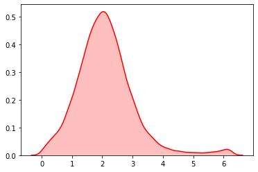


# **triangular**

**描述：**返回一个low <= N <=high的三角形分布的随机数。参数mode指明众数出现位置。

**语法：** random.triangular(low, high, mode)

```python
data = [random.vonmisesvariate(2,2) for i in range(20000)]
#直方图
plt.hist(data, bins=100,  color="#FF0000", alpha=.7)

#密度图
sns.kdeplot(data, shade=True,color="#FF0000")
```

**直方图**

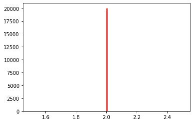


**密度图**无法显示

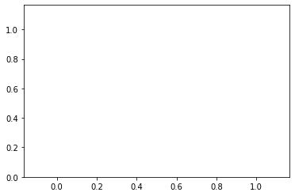


# **weibullvariate**

**描述：**威布尔分布

**语法：**random.weibullvariate(alpha, beta)

```python
data = [random.weibullvariate(1,2) for i in range(20000)]

#直方图
plt.hist(data, bins=100,  color="#FF0000", alpha=.7)
sns.kdeplot(data, shade=True,color="#FF0000")
```

**直方图**

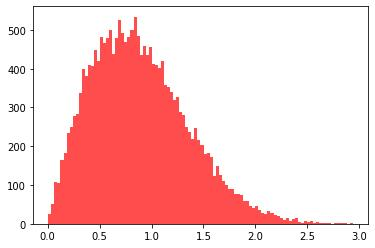


**密度图**

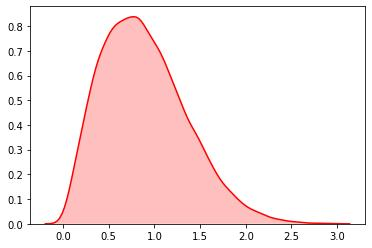


# **betavariate**

**描述：** β分布

**语法：**random.betavariate(alpha, beta)

```python
data = [random.expovariate(2) for i in range(50000)]
#直方图
plt.hist(data, bins=100,  color="#FF0000", alpha=.7)
#密度图
sns.kdeplot(data, shade=True,color="#FF0000")
```

**直方图**

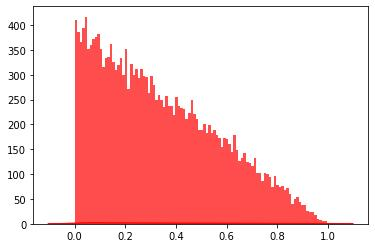


**密度图**

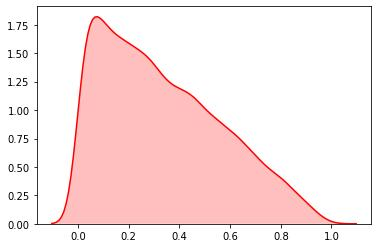


# **expovariate**

**描述：**指数分布

**语法：**random.expovariate(lambd)

```python
data = [random.expovariate(2) for i in range(50000)]
#直方图
plt.hist(data, bins=100,  color="#FF0000", alpha=.7)
#密度图
sns.kdeplot(data, shade=True,color="#FF0000")
```

**直方图**

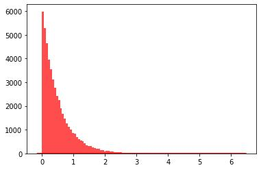


**密度图**

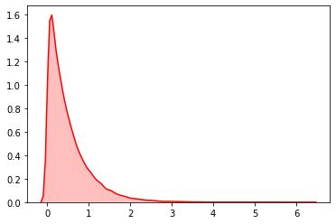


# **gammavariate**

**描述：** 伽马分布

**语法：**random.gammavariate(alpha, beta)

```python
data = [random.gauss(2,2) for i in range(50000)]
#直方图
plt.hist(data, bins=100,  color="#FF0000", alpha=.7)
#密度图
sns.kdeplot(data, shade=True,color="#FF0000")
```

**直方图**

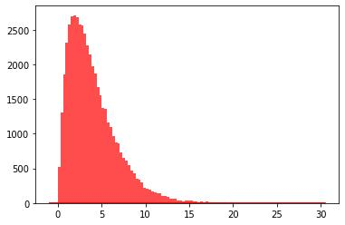


**密度图**

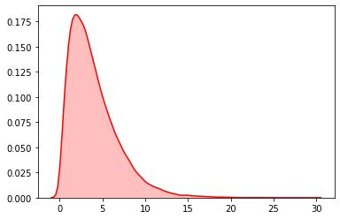


# **gauss**

**描述：**高斯分布

**语法：**random.gauss(mu, sigma)

```python
data = [random.gauss(2,2) for i in range(50000)]
#直方图
plt.hist(data, bins=100,  color="#FF0000", alpha=.7)
#密度图
sns.kdeplot(data, shade=True,color="#FF0000")
```

**直方图**

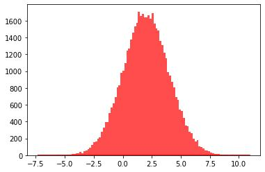


**密度图**

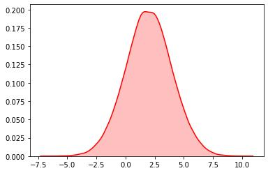


# **lognormvariate**

**描述：**对数正态分布

**语法：**random.lognormvariate(mu, sigma)

**示例：**

```python
data = [random.gauss(2,2) for i in range(50000)]

#直方图
plt.hist(data, bins=100,  color="#FF0000", alpha=.7)

#密度图
sns.kdeplot(data, shade=True,color="#FF0000")
```

**直方图**

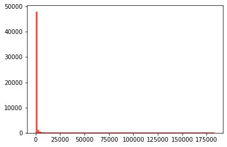


**密度图**


# **normalvariate**

**描述：** 正态分布

**语法：**random.normalvariate(mu, sigma)

```python
data = [random.normalvariate(2,4) for i in range(20000)]
#直方图
plt.hist(data, bins=100,  color="#FF0000", alpha=.7)
#密度图
sns.kdeplot(data, shade=True,color="#FF0000")
```

**直方图**

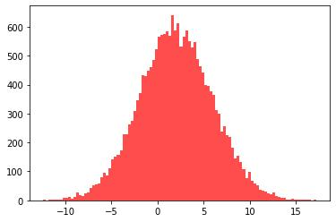


**密度图**

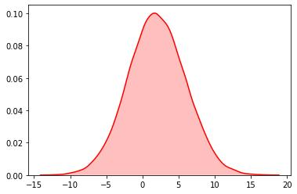


# **paretovariate**

**描述：**帕累托分布

**语法：**random.paretovariate(alpha)

```python
data = [random.paretovariate(4) for i in range(50000)]
#直方图
plt.hist(data, bins=100,  color="#FF0000", alpha=.7)
#密度图
sns.kdeplot(data, shade=True,color="#FF0000")
```

**直方图**

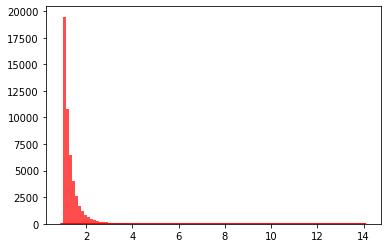


**密度图**

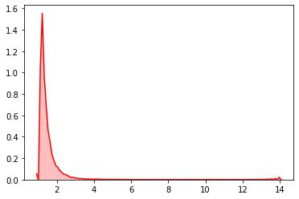