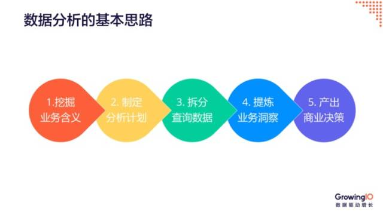
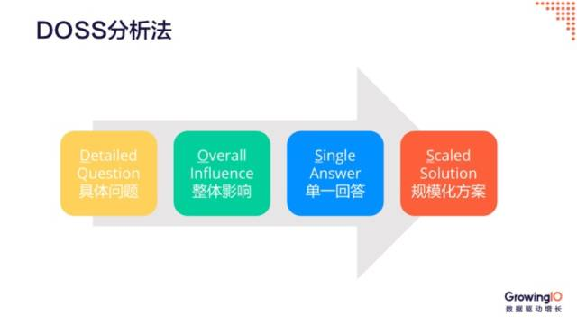
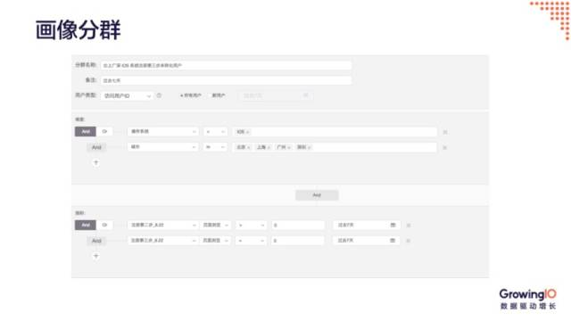
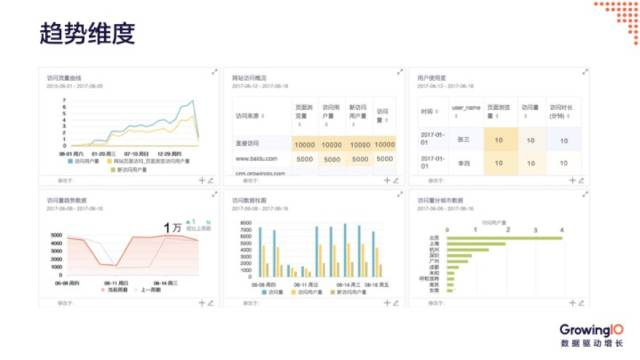
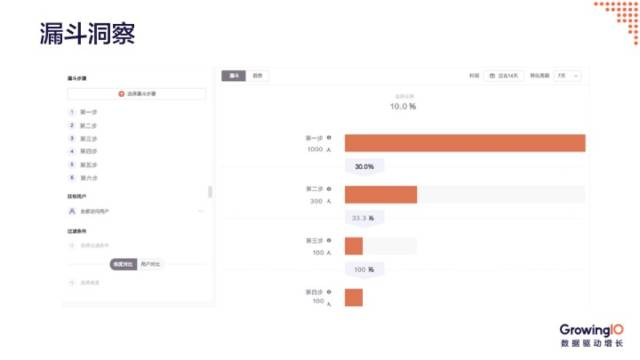
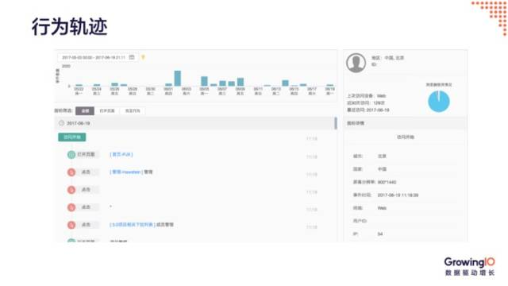
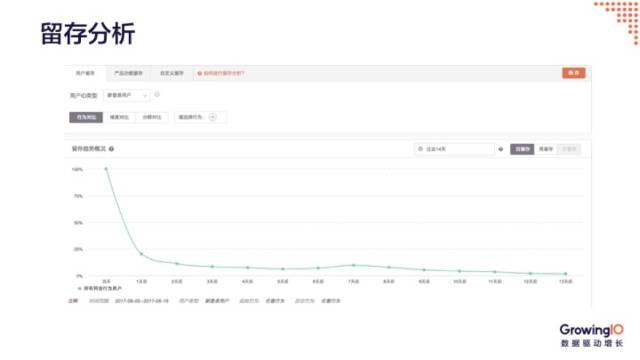
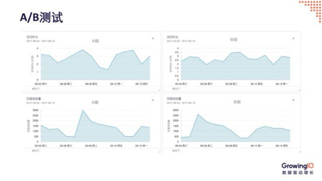
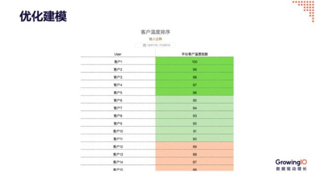

随着**人口和流量红利**的下降，互联网行业必然会朝着**精益化运营的方向**发展。数据分析在很多互联网人的工作中越发显得重要，而对于产品经理来说，更是如此。数据分析应该以业务场景为起始思考点，以业务决策作为终点。

本文基于数据分析的基本思路衍生出 2 个常见方法和 7 个应用手段，希望在数据分析的实际应用中能给大家带来帮助。

# 数据分析的基本思路

数据分析应该以**业务场景**为起始思考点，以**业务决策**作为终点。

基本思路为 5 步，首先要挖掘业务含义、制定分析计划、从分析计划中拆分出需要的数据、再根据数据分析的手段提炼业务洞察，最终产出商业决策。

接下来我们用一个案例来具体说明这 5 步思路：

> 某国内 P2P 借贷类网站，市场部在百度和 hao123 上都有持续的广告投放，吸引网页端流量；最近内部同事建议尝试投放 Google 的 SEM；另外，也需要评估是否加入金山网络联盟进行深度广告投放。在这种多渠道的投放场景下，产品经理该如何进行深度决策？

1. 挖掘业务含义

首先要了解市场部想优化什么，并以此为核心的 KPI 去衡量。渠道效果的评估，最重要的是业务转化：对 P2P 类网站来说，是否『发起借贷』远远比『用户数量』重要。

所以无论是 Google 还是金山渠道，都要根据用户群体的不同，优化相应用户的落地页，提升转化。

2. 制定分析计划

以『发起借贷』为核心转化点，分配一定的预算进行流量测试，观察对比注册数量及 ROI 效果，可以持续观察这部分用户的后续价值。

3. 拆分查询数据

根据各个渠道追踪流量、落地页停留时间、落地页跳出率、网站访问深度以及订单类型数据，进行用户分群。

4. 提炼业务洞察

在不同渠道进行投放时，要根据 KPI 的变化，推测业务含义。比如谷歌渠道的效果不好，可能因为谷歌大部分的流量在海外，可能会造成转化率低。而金山网络联盟有很多展示位置，要持续监测不同位置的效果，做出最后判断。

5. 产出商业决策

最后根据数据洞察，指导渠道的投放决策制。比如停止谷歌渠道的投放，继续跟进金山网络联盟进行评估，而落地页要根据数据指标持续地进行优化。

# 常见的数据分析方法

## 内外因素分解法

内外因素分解法是把问题拆成四部分，包括内部因素、外部因素、可控和不可控，然后再一步步解决每一个问题。

> 社交招聘类网站，一般分为求职者端和企业端，向企业端收费方式之一是购买职位的广告位。业务端人员发现『发布职位』数量在过去的 6 个月里有缓慢下降的趋势。对于这类某一数据下降的问题，从产品经理的角度来说，可以如何拆解？

根据内外因素分解法分析如下：

1. 内部可控因素

产品近期上线更新、市场投放渠道变化、产品粘性、新老用户留存问题、核心目标的转化；

2. 外部可控因素

市场竞争对手近期行为、用户使用习惯的变化、招聘需求随时间的变化；

3. 内部不可控因素

产品策略（移动端/PC端）、公司整体战略、公司客户群定位（比如只做医疗行业招聘）；

4. 外部不可控因素

互联网招聘行业趋势、整体经济形势、季节性变化；

## DOSS

DOSS 是从一个具体问题拆分到整体影响，从单一的解决方案找到一个规模化解决方案的方式。

某在线教育平台，提供免费课程视频，同时售卖付费会员，为付费会员提供更多高阶课程内容。如果我想将一套计算机技术的付费课程，推送给一群持续在看 C++ 免费课程的用户，产品经理应该如何辅助分析？

按 DOSS 的思路分解如下：

1. 具体问题

预测是否有可能帮助某一群组客户购买课程。

2. 整体

首先根据这类人群的免费课程的使用情况进行数据分析，之后进行延伸，比如对整体的影响，除了计算机类，对其他类型的课程都进行关注。

3. 单一回答

针对该群用户进行建模，监控该模型对于最终转化的影响。

4. 规模化

之后推出规模化的解决方案，对符合某种行为轨迹和特征的行为进行建模，将课程推荐模型加入到产品设计中。

 

# 数据分析的应用手段

根据基本分析思路，常见的有 7 种数据分析的手段。

## 画像分群

画像分群是聚合符合某中特定行为的用户，进行特定的优化和分析。

比如在考虑注册转化率的时候，需要区分移动端和 Web 端，以及美国用户和中国用户等不同场景。这样可以在渠道策略和运营策略上，有针对性地进行优化。

## 趋势维度

建立趋势图表可以迅速了解市场， 用户或产品特征的基本表现，便于进行迅速迭代；还可以把指标根据不同维度进行切分，定位优化点，有助于决策的实时性；

## 漏斗洞察

通过漏斗分析可以从先到后的顺序还原某一用户的路径，分析每一个转化节点的转化数据；

所有互联网产品、数据分析都离不开漏斗，无论是注册转化漏斗，还是电商下单的漏斗，需要关注的有两点。第一是关注哪一步流失最多，第二是关注流失的人都有哪些行为。

关注注册流程的每一个步骤，可以有效定位高损耗节点。

## 行为轨迹

行为轨迹是进行全量用户行为的还原。只看 PV、UV 这类数据，无法全面理解用户如何使用你的产品。了解用户的行为轨迹，有助于运营团队关注具体的用户体验，发现具体问题，根据用户使用习惯设计产品，投放内容；

## 留存分析

留存是了解行为或行为组与回访之间的关联，留存老用户的成本要远远低于获取新用户，所以分析中的留存是非常重要的指标之一；

除了需要关注整体用户的留存情况之外，市场团队可以关注各个渠道获取用户的留存度，或各类内容吸引来的注册用户回访率，产品团队关注每一个新功能对于用户的回访的影响等。

## A/B 测试

A/B 测试是对比不同产品设计/算法对结果的影响。

产品在上线过程中经常会使用 A/B 测试来测试产品效果，市场可以通过 A/B 测试来完成不同创意的测试。

要进行 A/B 测试有两个必备因素：

1. 有足够的时间进行测试；
2. 数据量和数据密度较高；

因为当产品流量不够大的时候，做 A/B 测试得到统计结果是很难的。而像 LinkedIn 这样体量的公司，每天可以同时进行上千个 A/B 测试。所以 A/B 测试往往公司数据规模较大时使用会更加精准，更快得到统计的结果。

## 优化建模

当一个商业目标与多种行为、画像等信息有关联性时，我们通常会使用数据挖掘的手段进行建模，预测该商业结果的产生；

**例如**：

作为一家 SaaS 企业，当我们需要预测判断客户的付费意愿时，可以通过用户的行为数据，公司信息，用户画像等数据建立付费温度模型。用更科学的方式进行一些组合和权重，得知用户满足哪些行为之后，付费的可能性会更高。

以上这几种数据分析的方法论，不仅要掌握理论，而且需要将这些方法论应用到日常的数据分析工作中，融会贯通。同时学会使用优秀的数据分析工具，可以事半功倍，更好的利用数据，实现整体增长。
