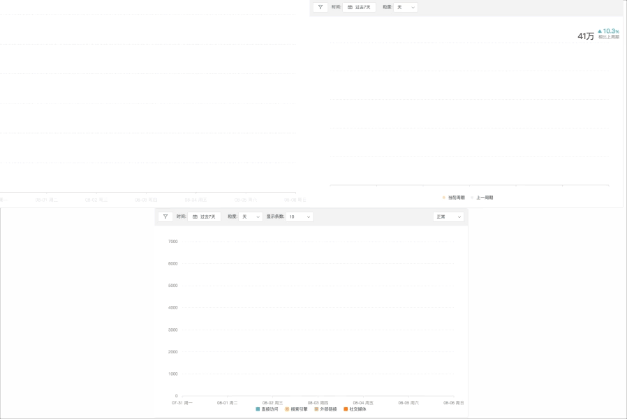
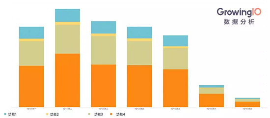
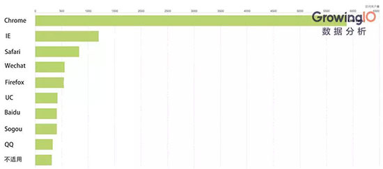
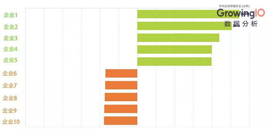
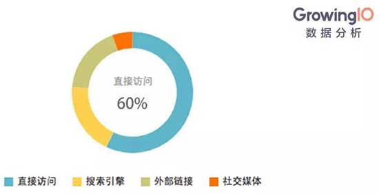
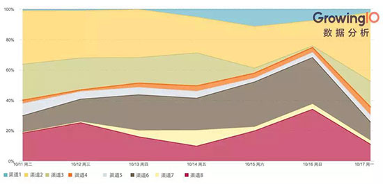
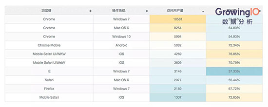
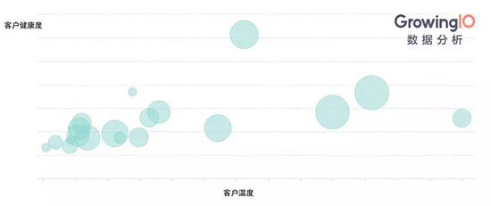

为了更好地进行**数据监控、数据分析以及数据可视化呈现**，本文介绍了 5 种典型的可视化图表，更好的解决以上三个问题

**单图 | 最基础的可视化数据分析工具**
对产品和运营来说，和数据打交道成了日常。总结下来，你的需求具体是什么呢？

1. 数据监控

产品和运营一定要对网站每天的 PV、UV 等总体数据有一个直观的把握，包括它们的数值、趋势等。用 GrowingIO 的单图建立图表，能让信息传达更迅速、直观，一旦出现数据过高或过低的情况，就可以马上拆解，及时介入。再也不用等老板来告诉你今天数据又掉了。

2. 数据分析，拆解问题

当一个总体数据出现异常，比如浏览量突然降低，原因可能有很多，产品本身问题、运营问题等等。这时候就需要对浏览量这一指标进行不同维度的拆解，比如各个访问来源的变化，各个浏览设备的变化等，GrowingIO 的单图提供多种指标和维度，能让你准确定位问题，迅速解决问题。

3. 可视化展示

在集体协作中，需要将分析结果更友好地展示给其他人，比如写周报、项目进展汇报等。

# 趋势图

趋势分析是最基础的图表分析，包括线图、柱状图、堆积图等多种形式。

- 线图

线图可以观察一个或者多个数据指标连续变化的趋势，也可以根据需要与之前的周期进行同比数据分析。

- 柱状图 & 堆积图

柱状图可以观察某一事件的变化趋势；还可以同时将整体拆分可以做成堆积图，同时观察到部分所占比重及变化趋势。

通过趋势图分析流量的实时走向，如每日 PV、UV、DAU 等基本数量指标以及停留时长、平均访问页面数等质量指标，可以及时把握产品的变化趋势。一旦趋势周期对比发生异常（异常高和异常低），我们需要及时介入排查原因、解决问题。

# 频数图

根据业务需求对指标按照一定维度拆分，对比不同组别的频数，便于分清轻重缓急。

条形图清晰展示了用户在不同类别上的频数，并且按照数量从大到小排序。上图展示的是某产品用户使用浏览器的频数分布，在资源有限的情况下产品可以先适配 Chrome 和 IE 浏览器以提升绝大部分用户体验。

 

上面的双向条形图展示了某 B 端产品的客户平均停留时长极端情况（非常高和非常低），企业 1-5 非常活跃，可以让运营人员促进客户增购、续约，而企业 6-10 活跃度非常低，用户即将流失，需要运营人员立刻介入干预。

# 比重图

比重分析主要是用来了解不同部分占总体的比例。

- 横向比较，扇形图、环形图可以满足这类需求；
- 纵向比较，百分比堆积图可以显示不同部分所占比例的趋势变化。

1. 环形图

「环形图」显示了某节点访问用户来源渠道比例。

2. 百分比堆积图

「百分比堆积图」动态显示了不同渠道比例的变化趋势，市场或者运营人员可以据此动态优化我们的资源投放。

# 四、表格

表格信息密集，可以同时分析多维度、多指标数据，适合对数据敏感的人群使用。虽然表格能看到具体的数值，但是不能直观看到趋势、比重。

通过表格不难发现，移动端访问用户占了非常大的比例，但是跳出率非常高。这样的表格数据启示我们有必要优化移动端产品，提升整体访问深度。

# 其他表格

下面介绍的是气泡图，气泡图用来展示一个事件与多个维度之间的关系，如分析 B 端产品客户成单周期与客户活跃度、登录账号数量之间的关系。

除了上述常见的图表，还有散点图、箱线图、股价图、雷达图等图表，在此不一一赘述。

# 写在最后

不同的图表样式可以满足不同的分析需求，可以根据自己的目的来选取最合适的指标、维度和图表样式。工具的作用在于，让上手过程更快更顺畅一些，让更多更高级的需求能够被满足和呈现。

GrowingIO 的单图功能提供了很低的门槛，以及很高的自由度。数据分析小白可以用单图做各种基础的数据分析，生成各种报表；对数据分析有深刻理解的人，可以将各种维度指标组合，针对业务场景做出极具洞察力的数据报表。
