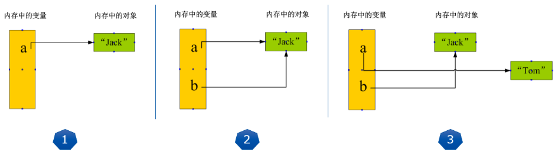
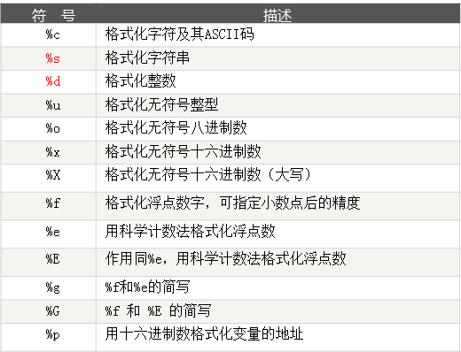

#  【基础】常量与变量

**变量**：在程序运行过程中，值会发生变化的量

**常量**：在程序运行过程中，值不会发生变化的量

无论是变量还是常量，在创建时都会在内存中开辟一块空间，用于保存它的值。

## 变量不需要声明类型

Python 的变量和常量不需要事先声明类型，这是根据Python的动态语言特性而来。

例如下面的 `age`  和 `name` 两个变量，在使用前没有进行任何的诸如 `age int` 和 `name string` 的类型声明，而这在一些静态语言中，比如 JAVA 和 Golang 中是必须的。

```python
>>> age = 18
>>> name = "王炳明"
```

##  赋值与比较

Python 中 用 `=` 号来给变量赋值，比如下面这个表达式，age 这个变量的值就是 18

```python
>>> age = 18
```

与之相似的，新手会容易混淆的是 两个等号 `==` ，它表示的是比较两个值是否相等，如果相等返回 `True`，如果不相等返回 `False`

```python
>>> age = 18
>>> age == 18
True

>>> age == 17
False
```

## 先创建再使用

每个变量在使用前都必须赋值，变量赋值以后才会被创建。

新的变量通过赋值的动作，创建并开辟内存空间，保存值。

如果没有赋值而直接使用，会抛出变量未定义的异常。例如：

```python
>>> age
Traceback (most recent call last):
  File "<stdin>", line 1, in <module>
NameError: name 'age' is not defined

>>> age = 18
>>> age
18
```

## 赋值的方式

赋值的两种方式

第一种：单个直接赋值

```python
>>> age = 18
>>> age
18
```

第二种：多个批量赋值

```python
>>> a = b = c = 1
>>> a
1
>>> b
1
>>> c
1
```

第三种：先计算再赋值

```python
# 先计算 17+1，再把结果赋值给age
>>> age = 17+1
>>> age
18
```

第四种：分别赋值

```python
>>> a, b, c = 1, 2, 3
>>> a
1
>>> b
2
>>> c
3
```

##  理解赋值的背后

理解变量在计算机内存中的表示也非常重要。

当我们写：`a = "Jack"` 时，Python解释器干了两件事情：

1. 在内存中创建了一个`'Jack'`的字符串对象；

2. 在内存中创建了一个名为a的变量，并把它指向 `'Jack'`。


而当你把一个变量a赋值给另一个变量b，这个操作实际上是将变量b指向变量a所指向的数据，例如下面的代码：

```python
>>> a = "Jack"
>>> a
'Jack'
>>> b = a
>>> b
'Jack'
>>> id(a)
4332916664
>>> id(b)
4332916664
```

通过` id()` 可以查看变量值的内存地址，打印出来的 a 和 b的内存地址是一样的，因此二者其实是一个数据。

但如果继续对 a 进行赋值其他值， 会发现 a 的内存地址变了，而 b 的并没有变。

```python
>>> a = "Tom"
>>> a
'Tom'

>>> id(a)
4332974128
>>> id(b)
4332916664
```

请牢记：**Python中的一切都是对象，变量是对象的引用！**：

- 执行a = ‘Jack’，解释器创建字符串‘Jack’对象和变量a，并把a指向‘Jack’对象；
- 执行b = a，解释器创建变量b，并且将其指向变量a指向的字符串‘Jack’对象；
- 执行a = ‘Tom’，解释器创建字符串‘Tom’对象，并把a改为指向‘Tom’对象，与b无关。



## 简单介绍常量

说完变量，还要说下常量。

常量就是不变的变量，比如常用的数学常数圆周率就是一个常量。在Python中，通常用全部大写的变量名表示常量：

```python
>>> PI = 3.14159265359
>>> PI
3.14159265359
```

但事实上，从Python语法角度看，PI仍然是一个变量，因为Python根本没有任何机制保证PI不会被改变。你完全可以给PI赋值为10，不会弹出任何错误。所以，用全部大写的变量名表示常量只是一个习惯上的用法。

常量通常放置在代码的最上部，并作为全局使用。


# 【基础】字符串类型

## 如何定义字符串？

字符串是Python中最常用的数据类型之一。

使用单引号或双引号来创建字符串，使用三引号创建多行字符串。字符串要么使用两个单引号，要么两个双引号，不能一单一双！Python不支持单字符类型，单字符在Python中也是作为一个字符串使用。

以下四种写法是等价的

```python
>>> name_1 = 'Jack'  # 单引号
>>> name_2 = "Jack"  # 双引号
>>> name_3 =  '''Jack''' # 三个单引号
>>> name_4 = """Jack"""  # 三个双引号
>>> name_1 == name_2 == name_3 == name_4
True
```

如果一个字符串里，要有引号，那么最好和外部包裹的引号类型不同，比如

- 外层使用单引号，那么里层使用双引号

```python
>>> msg = "my name is 'Jack'"
>>> msg
"my name is 'Jack'"
```

- 外层使用双引号，那么里层使用单引号

```python
>>> msg = 'my name is "Jack"'
>>> msg
'my name is "Jack"'
```

若想使用一样的符号呢？那字符串里的引号前记得加转义符号：`\`

```python
>>> msg = 'what\'s you name?'
>>> msg
"what's you name?"
```

##  常用的方法

字符串对象本身自带了许多非常实用的方法，考虑到新手的接受程序，在这里也没必要一一给你介绍。

本篇文章只会为你介绍最常用的那些方法，而剩下的你只要在需要的时候去过一下文档就 OK了。

**去除首尾空格**

```python
>>> msg = "    Python编程时光    "
>>>
>>> msg.lstrip()  # 去除左边空格
'Python编程时光    '

>>> msg.rstrip()  # 去除右边空格
'    Python编程时光'

>>> msg.strip()  # 去除左右两边空格
'Python编程时光'
```

**判断字符串是否以某字符串开头**

```python
>>> msg = "Hello, Python"
>>> msg.startswith("Hello")
True

>>> msg.startswith("hello")
False
```

**判断字符串是否以某字符串结尾**

```python
>>> msg = "Hello, Python"
>>> msg.endswith("Python")
True
>>> msg.endswith("python")
False
```

**格式化字符串**：格式化字符串非常重要，在后面的章节中我有非常详细的讲解，这里你简单了解即可

```python
>>> name = "王炳明"
>>> msg = f"你好，我是{name}"
>>> msg
'你好，我是王炳明'
```

**分割字符串**：以逗号为分割符分割字符串

```python
>>> languages = "Python,Java,Golang"
>>> languages.split(",")
['Python', 'Java', 'Golang']
```


# 【基础】整数与浮点数

Python 支持的数字类型有三种：整数、浮点数和复数。

## 整数（Int）

通常被称为整型，是正或负整数，不带小数点。例如：1，100，-8080，0，等等。

```python
>>> a = 100
>>> type(a)
<class 'int'>

>>> b = -100
>>> type(b)
<class 'int'>
```

表示数字的时候，有时我们还会用八进制或十六进制来表示：

- 十六进制：用**0x**前缀和0-9，a-f表示，例如：0xff00，0xa5b4c3d2。

- 八进制：用**0o**前缀和0-7表示，例如0o12

```python
>>> a = 0x0001 # 十六进制
>>> a
1
>>> type(a)
<class 'int'>
>>> 
>>> b = 0o01  # 八进制
>>> b
1
>>> type(b)
<class 'int'>
```

## 浮点数(Float)

浮点数也就是小数，如1.23，3.14，-9.01，等等。

```python
>>> a = 1.23
>>> a
1.23

>>> type(a)
<class 'float'>
```

之所以称为浮点数，是因为按照科学记数法表示时，一个浮点数的小数点位置是可变的，比如，`1.23x10^9`和`12.3x10^8`是完全相等的。浮点数可以用数学写法，如`1.23`，`3.14`，`-9.01`，等等。但是对于很大或很小的浮点数，就必须用科学计数法表示，把10用e替代，1.23x109就是`1.23e9`，或者`12.3e8`，0.000012可以写成`1.2e-5`，等等。

```python
>>> 1.23e9
1230000000.0

>>> 12.3e8
1230000000.0
```

## 复数(Complex)

复数由实数部分和虚数部分构成，可以用`a + bj`，或者 `complex(a,b)` 表示，复数的实部a和虚部b都是浮点型。关于复数，不做科学计算或其它特殊需要，通常很难遇到，这里不做过多解释。

```python
>>> a = 10 + 0.2j
>>> a
(10+0.2j)

>>> type(a)
<class 'complex'>

>>> b = complex(10, 0.2)
>>> b
(10+0.2j)

>>> type(b)
<class 'complex'>
```

## 常用方法

**两数相加减**

```python
>>> a = 10
>>> b = 20
>>> a + b
30

>>> b - a
10
```

**两数相乘除**

```python
>>> a = 10
>>> b = 20
>>> a * b
200

>>> b / a
2.0
```

**取模取余**

```python
>>> a = 10
>>> b = 3
>>> a // b
3

>>> a % b
1
```

**计算绝对值**

```python
>>> a = -10
>>> abs(a)
10
```

**数值直接取整**

```python
>>> a = 3.14
>>> int(a)
3
>>> b = 3.78
>>> int(b)
3
```

**数值四舍五入**

```python
>>> a = 3.14
>>> round(a)
3
>>> b = 3.78
>>> round(b)
4
```

# 【基础】布尔值：真与假

## 什么是布尔值

但在Python语言中，布尔类型只有两个值

- `True`：表示真值
- `False`：表示假值

请注意，首字母要大写，不能是其它花式变型。

所有的计算结果，判断表达式调用返回值是True或者False的过程都可以称为**布尔运算**，例如比较运算。

布尔值通常用来判断条件是否成立。

```python
age = 16

if age >= 18:
    print("你是个成年人")
else:
    print("你还未成年")
```

在 Python Shell 的模式下，很容易看出表达式返回的是真值还是假值。

```python
>>> True
True

>>> False
False

>>> 3 > 2
True

>>> 3 > 5
False

>>> 3 in [1,2,3]
True

>>> 3 == 9/3
True
```


##  布尔类型的转换

Python内置的 `bool()` 函数可以用来测试一个表达式的布尔值结果。

```python
>>> bool(1)
True

>>> bool(0)
False

>>> bool([])
False

>>> bool(())
False

>>> bool({})
False

>>> bool(-1)
True

>>> bool('')
False

>>> bool(None)
False

>>> bool("False")
True

>>> bool("True")
True

>>> bool(0.0)
False

>>> bool(1.0)
True

>>> bool(-0.0)
False
```

看完上面的例子，可以总结出

下面这些值经过 bool 转换后是假值：

- 0、0.0、-0.0
- None：这个后面会讲到
- 空字符串、空列表、空元组、空字典

而这些会转换成真值

- -1、1或者其他非0数值
- 所有非空字符串，包括 `"False"`
- 所有非空字典、非空列表、非空集合，非空元组

## 布尔运算

布尔类型可以进行 and、or和 not运算。

and 运算是与运算，只有所有都为True，and运算的结果才是True：

```python
>>> True and True
True

>>> True and False
False

>>> False and False
False

>>> 5 > 3 and 3 > 1
True
```

or运算是或运算，只要其中有一个为True，or运算结果就是True：

```python
>>> True or True
True
>>> True or False
True
>>> False or False
False
>>> 5 > 3 or 1 > 3
True
```

not运算是非运算，它是单目运算符，把True变成False，False变成True：

```python
>>> not True
False
>>> not False
True
>>> not 1 > 2
True
```

再开下脑洞，布尔类型还能做别的运算吗？试试就知道了！

```python
>>> True > False
True
>>> True < False
False
>>> True >=False
True
>>> True -1
0
>>> True + 1
2
>>> True *3
3
>>> False -1
-1
```

真的可以！比较运算，四则运算都没有问题。并且在做四则运算的时候，明显把True看做1，False看做0。往往是我们不知道的细节，有时候给我们带来巨大的困扰和疑惑。更多的运算种类支持，请大家自行测试。

## 空值：None

空值不是布尔类型，严格的来说放在这里是不合适的，只不过和布尔关系比较紧密。

空值是Python里一个特殊的值，用None表示（首字母大写）。None不能理解为 0，因为0是整数类型，而None是一个特殊的值。

**None也不是布尔类型，而是NoneType**。

```python
>>> bool(None)
False
>>> type(None)
<class 'NoneType'>
```

# 【基础】学会输入与输出

无论是从我们一开始的“hello world”，还是前面章节的里各种例子，基本都是些“自说自话”，展示类的代码片段。只有能够接收用户输入，根据输入动态生成结果，并输出到屏幕上展示出来，才算一个较为完整，起码是有那么点乐趣或者说成就的简单程序。

##  input 输入函数

input函数：获取用户输入，保存成一个**字符串**。重要的话，说两遍，input函数的返回值是一个字符串类型。哪怕你输入的是个数字1，返回给你的只会是字符串“1”，而不是 整数1。下面是一些简单的展示例子：

```python
>>> name  = input("please input your name: ")
please input your name: jack
>>> name
'jack'
>>> type(name)
<class 'str'>
```

第一个例子中，`inp = input("please input your name: ")`，input函数里可以提供一个字符串，用来给用户进行输入提示。input函数的返回值赋值给inp这个变量后，inp里就保存了用户输入的值。

`type()` 是Python内置的函数之一，非常有用，用于查看对象的数据类型。例子中的 name 是一个str字符串类型，这验证了我们前面说的话。

如果你想要输入的是数值，那么需要你手动使用 `int()` 函数转一下类型

```python
>>> age = input("please input your age: ")
please input your age: 18
>>> age
'18'
>>> age = int(age)
>>> age
18
>>> type(age)
<class 'int'>
```

有时候可能输入两边会多敲入几个空格，这时候可以使用 `strip()` 函数去除首尾空格

```python
>>> name  = input("please input your name: ")
please input your name:      jack
>>> name
'     jack'
>>> name = name.strip()
>>> name
'jack'
```

有时候用户输入的内容会不符合程序的预期，比如我想要获取年龄，那输入必然是全数字，而不能是其他非数值，这时候就可以使用 `isdigit` 函数进行判断

```python
>>> age = input("please input your age: ")
please input your age: jack
>>> if age.isdigit():
...     age = int(age)
...     print("你的年龄是: ", age)
... else:
...     print("输入不合法！")
...
输入不合法！
```

input函数有时可以巧妙地用于阻塞或暂停程序

```python
print("程序前面部分执行完毕......")

input("请按回车继续......")       # 在这里程序会暂停，等待你的回车动作

print("继续执行程序的后面部分......")
```

此时的input函数不会将输入保存下来，只是用作暂停程序动作。

##  print 输入函数

print函数我们其实已经不陌生了，前前后后也用了不少次，多少有点经验，明白点它的用法了。

print函数用于将内容格式化显示在标准输出上，主要指的是屏幕显示器。

print可以接受多个字符串，字符串类型的变量或者可print的对象。每个字符串用逗号“,”隔开，连成一串输出。print会依次打印每个字符串，同时，每遇到一个逗号“,”就输出一个空格。

```
>>> a = "i am"
>>> b = "student"
>>> print(a,"a" , b)
i am a student      # 自动以空格分隔
>>> print(a+"a"+b)
i amastudent        # 无分隔
```

对于形如`print(a+"a"+b)`的语句，其实是先计算`a+"a"+b`的值，然后再通过print打印它。print()会自动执行内部的语句，输出想要的结果。再看一个例子：

```
>>> a = 10
>>> b = 2
>>> print(sum((a, a*b)))        # 先求a*b，再求和，再打印
30
```

我们看一下print函数的原型：`print(self, *args, sep=' ', end='\n', file=None)`

**sep参数**: 分隔的符号，默认是一个空格；

**end参数**: 打印后的结束方式，默认为换行符`\n`。如果，设置`end=''`，则可以不换行，让print在一行内连续打印。活用print的参数，可以实现灵活的打印控制。

```
>>> a = "i am"
>>> b = "student"
>>> print(a,"a" , b, sep="*")
i am*a*student
```

# 【基础】字符串格式化

格式化输出，主要有三种方式

1. 使用 % 进行格式化
2. 使用 format 函数进行格式化
3. 使用 f-string 进行格式化

由于这三种格式化的内容都非常的多，这里仅为了你看本教程后面的内容，我只介绍最常用的几种


## 第一种方法：使用 % 

`%s` 表示这个位置接的是一个字符串变量

`%d` 表示这个位置接的是一个整型变量

前面有多少个 %，后面就要有多少个变量，一一对应，多个变量要括号括起来

```python
>>> name = "Jack"
>>> age = 18
>>> print("我的名字是: %s，今年 %d 岁" %(name, age))
我的名字是: Jack，今年 18 岁
```

更多的格式化式符号，可以参考这张表




## 第二种方法：使用 format

在字符串中，使用 `{}` 进行占位，然后在字符串后跟上 `.format()` 函数，这个函数的参数就是我们要往字符串中填充的变量。

format 函数会依次填充，比如第一个 `{}` 会取到第一个参数 name，第二个  `{}` 会取到第二个参数 age

```python
>>> name = "Jack"
>>> age = 18
>>> print("我的名字是:{}, 今年 {} 岁".format(name, age))
我的名字是:Jack, 今年 18 岁
```

然后如果变量值比较多的话，这样往往会看错乱掉。你可以改成使用索引

```python
>>> print("我的名字是:{0}, 今年 {1} 岁".format(name, age))
我的名字是:Jack, 今年 18 岁
```

甚至还可以直接用变量名进行替代

```python
>>> name = "Jack"
>>> age = 18
>>> print("我的名字是:{name}, 今年 {age} 岁".format(name=name, age=age))
我的名字是:Jack, 今年 18 岁
```

更多 format 函数的用法，可详读我另一篇文章：[Python强大的格式化format](https://www.cnblogs.com/wongbingming/p/6848701.html)

## 第三种方法：使用 f-string 

这种方法是 Python 3.9 才支持的写法，只要你在字符串前面加一个 `f`，开启 f-string ，就可以在字符中写入变量。

直接看案例了

```python
>>> name = "Jack"
>>> age = 18
>>> print(f"我的名字是:{name}, 今年 {age} 岁")
我的名字是:Jack, 今年 18 岁
```

# 【基础】运算符（超全整理）

## 什么是运算符？

本章节主要说明Python的运算符。举个简单的例子 **4 +5 = 9** 。 例子中，4和5被称为操作数，"+"号为运算符。

Python语言支持以下类型的运算符:

- 算术运算符
- 比较（关系）运算符
- 赋值运算符
- 逻辑运算符
- 位运算符
- 成员运算符
- 身份运算符
- 运算符优先级

接下来让我们一个个来学习Python的运算符。

------

## Python算术运算符

以下假设变量a为10，变量b为20：

| 运算符 | 描述                                            | 实例                                               |
| :----- | :---------------------------------------------- | :------------------------------------------------- |
| +      | 加 - 两个对象相加                               | a + b 输出结果 30                                  |
| -      | 减 - 得到负数或是一个数减去另一个数             | a - b 输出结果 -10                                 |
| *      | 乘 - 两个数相乘或是返回一个被重复若干次的字符串 | a * b 输出结果 200                                 |
| /      | 除 - x除以y                                     | b / a 输出结果 2                                   |
| %      | 取模 - 返回除法的余数                           | b % a 输出结果 0                                   |
| **     | 幂 - 返回x的y次幂                               | a**b 为10的20次方， 输出结果 100000000000000000000 |
| //     | 取整除 - 返回商的整数部分                       | 9//2 输出结果 4 , 9.0//2.0 输出结果 4.0            |

以下实例演示了Python所有算术运算符的操作

**两数相加减**

```python
>>> a = 10
>>> b = 20
>>> a + b
30
>>> b - a
10
```

**两数相乘除**

```python
>>> a = 10
>>> b = 20
>>> a * b
200
>>> b / a
2.0
```

**取模取余**

```python
>>> a = 10
>>> b = 3
>>> a // b
3
>>> a % b
1
```

## Python比较运算符

以下假设变量a为10，变量b为20：

| 运算符 | 描述                                                         | 实例                  |
| :----- | :----------------------------------------------------------- | :-------------------- |
| ==     | 等于 - 比较对象是否相等                                      | (a == b) 返回 False。 |
| !=     | 不等于 - 比较两个对象是否不相等                              | (a != b) 返回 true.   |
| >      | 大于 - 返回x是否大于y                                        | (a > b) 返回 False。  |
| <      | 小于 - 返回x是否小于y。所有比较运算符返回1表示真，返回0表示假。这分别与特殊的变量True和False等价。注意，这些变量名的大写。 | (a < b) 返回 true。   |
| >=     | 大于等于 - 返回x是否大于等于y。                              | (a >= b) 返回 False。 |
| <=     | 小于等于 - 返回x是否小于等于y。                              | (a <= b) 返回 true。  |

以下实例演示了Python所有比较运算符的操作：

判断两数是否相等

```python
>>> a = 1
>>> b = 1
>>> a == b
True
>>> a != b
False
```

判断 a 是否大于 b

```python
>>> a = 1
>>> b = 2
>>> a > b
False
>>> a < b
True
```

## Python赋值运算符

以下假设变量a为10，变量b为20：

| 运算符 | 描述             | 实例                                  |
| :----- | :--------------- | :------------------------------------ |
| =      | 简单的赋值运算符 | c = a + b 将 a + b 的运算结果赋值为 c |
| +=     | 加法赋值运算符   | c += a 等效于 c = c + a               |
| -=     | 减法赋值运算符   | c -= a 等效于 c = c - a               |
| *=     | 乘法赋值运算符   | c *= a 等效于 c = c * a               |
| /=     | 除法赋值运算符   | c /= a 等效于 c = c / a               |
| %=     | 取模赋值运算符   | c %= a 等效于 c = c % a               |
| **=    | 幂赋值运算符     | c **= a 等效于 c = c ** a             |
| //=    | 取整除赋值运算符 | c //= a 等效于 c = c // a             |

以下实例演示了Python所有赋值运算符的操作：

这里只以加减为例，其它的同理

```python
>>> a = 1
>>> a += 2
>>> a
3
>>> a += 2
>>> a
5
>>> a -= 2
>>> a
3
```

##  Python位运算符

按位运算符是把数字看作二进制来进行计算的。Python中的按位运算法则如下：

| 运算符 | 描述           | 实例                                                         |
| :----- | :------------- | :----------------------------------------------------------- |
| &      | 按位与运算符   | (a & b) 输出结果 12 ，二进制解释： 0000 1100                 |
| \|     | 按位或运算符   | (a \| b) 输出结果 61 ，二进制解释： 0011 1101                |
| ^      | 按位异或运算符 | (a ^ b) 输出结果 49 ，二进制解释： 0011 0001                 |
| ~      | 按位取反运算符 | (~a ) 输出结果 -61 ，二进制解释： 1100 0011， 在一个有符号二进制数的补码形式。 |
| <<     | 左移动运算符   | a << 2 输出结果 240 ，二进制解释： 1111 0000                 |
| >>     | 右移动运算符   | a >> 2 输出结果 15 ，二进制解释： 0000 1111                  |

以下实例演示了Python所有位运算符的操作：

与运算

```python
>>> a = 60  # 60 = 0011 1100 
>>> b = 13  # 13 = 0000 1101 
>>> c = 0
>>>  a & b  # 12 = 0000 1100
12
```

或运算

```python
>>> a | b  #  61 = 0011 1101 
61
```

异或运算

```python
>>> a ^ b  # 49 = 0011 0001
49
```

取反运算

```python
>>> a = 60  # 60 = 0011 1100 
>>> ~a        # -61 = 1100 0011
-61
```

左移动运算符

```python
>>> a = 60  # 60 = 0011 1100 
>>> a << 2  # 240 = 1111 0000
240
```

右移动运算符

```python
>>> a = 60  # 60 = 0011 1100 
>>> a >> 2  # 15 = 0000 1111
15
```

##  Python逻辑运算符

Python语言支持逻辑运算符，以下假设变量 a 为 10, b为 20:

| 运算符 | 逻辑表达式 | 描述                                                         | 实例                    |
| :----- | :--------- | :----------------------------------------------------------- | :---------------------- |
| and    | x and y    | 布尔"与" - 如果 x 为 False，x and y 返回 False，否则它返回 y 的计算值。 | (a and b) 返回 20。     |
| or     | x or y     | 布尔"或" - 如果 x 是非 0，它返回 x 的值，否则它返回 y 的计算值。 | (a or b) 返回 10。      |
| not    | not x      | 布尔"非" - 如果 x 为 True，返回 False 。如果 x 为 False，它返回 True。 | not(a and b) 返回 False |

以上实例输出结果：

and：必须都为True，才能返回True，否则返回False

```python
>>> True and True
True
>>> True and False
False
```

or：只要有一个为True，就返回True，其他返回False

```python
>>> True or False
True
>>> True or True
True
```

not：与原值取反

```python
>>> not True
False
>>> not False
True
```

##  Python成员运算符

除了以上的一些运算符之外，Python还支持成员运算符，测试实例中包含了一系列的成员，包括字符串，列表或元组。

| 运算符 | 描述                                                  | 实例                                        |
| :----- | :---------------------------------------------------- | :------------------------------------------ |
| in     | 如果在指定的序列中找到值返回True，否则返回False。     | x 在 y序列中 , 如果x在y序列中返回True。     |
| not in | 如果在指定的序列中没有找到值返回True，否则返回False。 | x 不在 y序列中 , 如果x不在y序列中返回True。 |

以下实例演示了Python所有成员运算符的操作：

```python
>>> "Apple" in ["Apple", "Huawei"]
True
>>>
>>> "Vivo" not in ["Apple", "Huawei"]
True
```

##  Python身份运算符

身份运算符用于比较两个对象的存储单元

| 运算符 | 描述                                       | 实例                                                       |
| :----- | :----------------------------------------- | :--------------------------------------------------------- |
| is     | is是判断两个标识符是不是引用自一个对象     | x is y, 如果 id(x) 等于 id(y) , **is** 返回结果 1          |
| is not | is not是判断两个标识符是不是引用自不同对象 | x is not y, 如果 id(x) 不等于 id(y). **is not** 返回结果 1 |

以下实例演示了Python所有身份运算符的操作：

```python
>>> a = 1000
>>> b = 1000
>>> id(a)
4532310864
>>> id(b)
4532311632
>>> a is b
False
```

##  Python运算符优先级

以下表格列出了从最高到最低优先级的所有运算符：

| 运算符                   | 描述                                                   |
| :----------------------- | :----------------------------------------------------- |
| **                       | 指数 (最高优先级)                                      |
| ~ + -                    | 按位翻转, 一元加号和减号 (最后两个的方法名为 +@ 和 -@) |
| * / % //                 | 乘，除，取模和取整除                                   |
| + -                      | 加法减法                                               |
| >> <<                    | 右移，左移运算符                                       |
| &                        | 位 'AND'                                               |
| ^ \|                     | 位运算符                                               |
| <= < > >=                | 比较运算符                                             |
| <> == !=                 | 等于运算符                                             |
| = %= /= //= -= += *= **= | 赋值运算符                                             |
| is is not                | 身份运算符                                             |
| in not in                | 成员运算符                                             |
| not or and               | 逻辑运算符                                             |

以下实例演示了Python运算符优先级的操作：

```python
>>> 20 + ( 30 * 2 ) / 5
32.0
```

计算顺序是

1. 30*2 = 60
2. 60/5 = 12.0
3. 20 + 12.0 = 32.0

