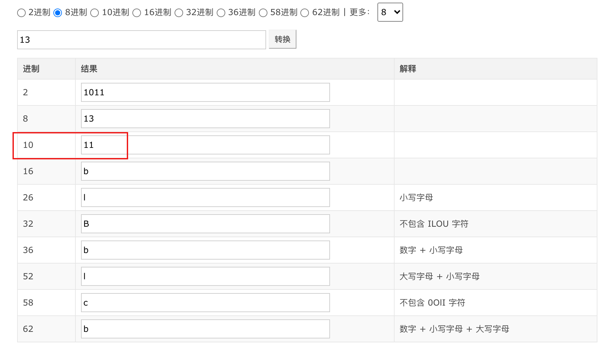
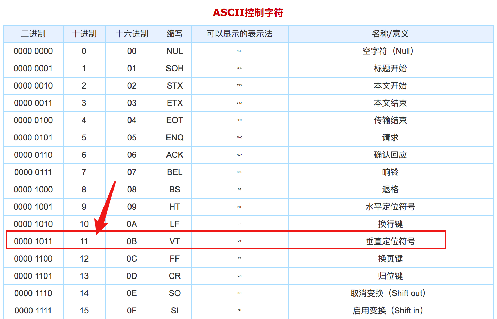
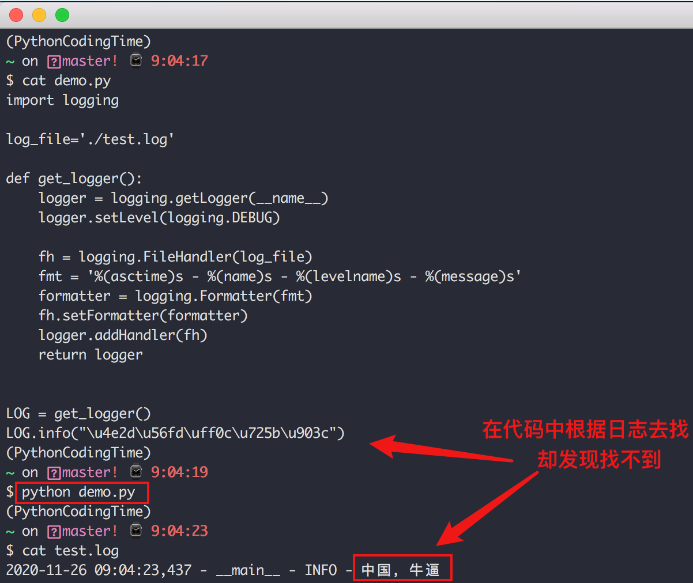

#  八种连接列表的方式

## 最直观的相加

使用 `+` 对多个列表进行相加，你应该懂，不多说了。

```python
>>> list01 = [1,2,3]
>>> list02 = [4,5,6]
>>> list03 = [7,8,9]
>>>
>>> list01 + list02 + list03
[1, 2, 3, 4, 5, 6, 7, 8, 9]
>>> 
```


## 借助 itertools

itertools 在 Python 里有一个非常强大的内置模块，它专门用于操作可迭代对象。

在前面的文章中也介绍过，使用 `itertools.chain()` 函数先将可迭代对象（在这里指的是列表）串联起来，组成一个更大的可迭代对象。

最后你再利用 list 将其转化为 列表。

```python
>>> from itertools import chain
>>> list01 = [1,2,3]
>>> list02 = [4,5,6]
>>> list03 = [7,8,9]
>>>
>>> list(chain(list01, list02, list03))
[1, 2, 3, 4, 5, 6, 7, 8, 9]
>>>
```

## 使用 * 解包

使用 `*` 可以解包列表，解包后再合并。

示例如下：

```python
>>> list01 = [1,2,3]
>>> list02 = [4,5,6]
>>>
>>> [*list01, *list02]
[1, 2, 3, 4, 5, 6]
>>>
```

## 使用 extend

在字典中，使用 update 可实现原地更新，而在列表中，使用 extend 可实现列表的自我扩展。

```python
>>> list01 = [1,2,3]
>>> list02 = [4,5,6]
>>>
>>> list01.extend(list02)
>>> list01
[1, 2, 3, 4, 5, 6]
```

## 使用列表推导式

Python 里对于生成列表、集合、字典，有一套非常 Pythonnic 的写法。

那就是列表解析式，集合解析式和字典解析式，通常是 Python 发烧友的最爱，那么今天的主题：列表合并，列表推导式还能否胜任呢？

当然可以，具体示例代码如下：

```python
>>> list01 = [1,2,3]
>>> list02 = [4,5,6]
>>> list03 = [7,8,9]
>>>
>>> [x for l in (list01, list02, list03) for x in l]
[1, 2, 3, 4, 5, 6, 7, 8, 9]
>>>
```


## 使用 heapq

heapq 是 Python 的一个标准模块，它提供了堆排序算法的实现。

该模块里有一个 merge 方法，可以用于合并多个列表，如下所示

```python
>>> list01 = [1,2,3]
>>> list02 = [4,5,6]
>>> list03 = [7,8,9]
>>>
>>> from heapq import merge
>>>
>>> list(merge(list01, list02, list03))
[1, 2, 3, 4, 5, 6, 7, 8, 9]
>>> 
```

要注意的是，heapq.merge 除了合并多个列表外，它还会将合并后的最终的列表进行排序。

```python
>>> list01 = [2,5,3]
>>> list02 = [1,4,6]
>>> list03 = [7,9,8]
>>> 
>>> from heapq import merge
>>> 
>>> list(merge(list01, list02, list03))
[1, 2, 4, 5, 3, 6, 7, 9, 8]
>>> 
```

它的效果等价于下面这行代码：

```python
sorted(itertools.chain(*iterables))
```

如果你希望得到一个始终有序的列表，那请第一时间想到 heapq.merge，因为它采用堆排序，效率非常高。但若你不希望得到一个排过序的列表，就不要使用它了。

## 借助魔法方法

有一个魔法方法叫 `__add__`，当我们使用第一种方法 list01 + list02 的时候，内部实际上是作用在 `__add__` 这个魔法方法上的。

所以以下两种方法其实是等价的

```python
>>> list01 = [1,2,3]
>>> list02 = [4,5,6]
>>> 
>>> list01 + list02
[1, 2, 3, 4, 5, 6]
>>> 
>>> 
>>> list01.__add__(list02)
[1, 2, 3, 4, 5, 6]
>>> 
```

借用这个魔法特性，我们可以配合 reduce 这个方法来对多个列表进行合并，示例代码如下

```python
>>> list01 = [1,2,3]
>>> list02 = [4,5,6]
>>> list03 = [7,8,9]
>>>
>>> from functools import reduce
>>> reduce(list.__add__, (list01, list02, list03))
[1, 2, 3, 4, 5, 6, 7, 8, 9]
>>>
```


##  使用 yield from

在 yield from 后可接一个可迭代对象，用于迭代并返回其中的每一个元素。

因此，我们可以像下面这样自定义一个合并列表的工具函数。

```python
>>> list01 = [1,2,3]
>>> list02 = [4,5,6]
>>> list03 = [7,8,9]
>>>
>>> def merge(*lists):
...   for l in lists:
...     yield from l
...
>>> list(merge(list01, list02, list03))
[1, 2, 3, 4, 5, 6, 7, 8, 9]
>>
```


#  合并字典的 7 种方法

## 最简单的原地更新

字典对象内置了一个 update 方法，用于把另一个字典更新到自己身上。

```python
>>> profile = {"name": "xiaoming", "age": 27}
>>> ext_info = {"gender": "male"}
>>>
>>> profile.update(ext_info)
>>> print(profile)
{'name': 'xiaoming', 'age': 27, 'gender': 'male'}
```

如果想使用 update 这种最简单、最地道原生的方法，但又不想更新到自己身上，而是生成一个新的对象，那请使用深拷贝。

```python
>>> profile = {"name": "xiaoming", "age": 27}
>>> ext_info = {"gender": "male"}
>>>
>>> from copy import deepcopy
>>>
>>> full_profile = deepcopy(profile)
>>> full_profile.update(ext_info)
>>>
>>> print(full_profile)
{'name': 'xiaoming', 'age': 27, 'gender': 'male'}
>>> print(profile)
{"name": "xiaoming", "age": 27}
```


## 先解包再合并字典

使用 `**` 可以解包字典，解包完后再使用 dict 或者 `{}` 就可以合并。

```python
>>> profile = {"name": "xiaoming", "age": 27}
>>> ext_info = {"gender": "male"}
>>>
>>> full_profile01 = {**profile, **ext_info}
>>> print(full_profile01)
{'name': 'xiaoming', 'age': 27, 'gender': 'male'}
>>>
>>> full_profile02 = dict(**profile, **ext_info)
>>> print(full_profile02)
{'name': 'xiaoming', 'age': 27, 'gender': 'male'}
```

若你不知道 `dict(**profile, **ext_info)` 做了啥，你可以将它等价于

```python
>>> dict((("name", "xiaoming"), ("age", 27), ("gender", "male")))
{'name': 'xiaoming', 'age': 27, 'gender': 'male'}
```


## 借助 itertools

在 Python 里有一个非常强大的内置模块，它专门用于操作可迭代对象。

正好我们字典也是可迭代对象，自然就可以想到，可以使用 `itertools.chain()` 函数先将多个字典（可迭代对象）串联起来，组成一个更大的可迭代对象，然后再使用 dict 转成字典。

```python
>>> import itertools
>>>
>>> profile = {"name": "xiaoming", "age": 27}
>>> ext_info = {"gender": "male"}
>>>
>>>
>>> dict(itertools.chain(profile.items(), ext_info.items()))
{'name': 'xiaoming', 'age': 27, 'gender': 'male'}
```


## 借助 ChainMap

如果可以引入一个辅助包，那我就再提一个， `ChainMap` 也可以达到和 `itertools` 同样的效果。

```python
>>> from collections import ChainMap
>>>
>>> profile = {"name": "xiaoming", "age": 27}
>>> ext_info = {"gender": "male"}
>>>
>>> dict(ChainMap(profile, ext_info))
{'name': 'xiaoming', 'age': 27, 'gender': 'male'}
```

使用 ChainMap 有一点需要注意，当字典间有重复的键时，只会取第一个值，排在后面的键值并不会更新掉前面的（使用 itertools 就不会有这个问题）。

```python
>>> from collections import ChainMap
>>>
>>> profile = {"name": "xiaoming", "age": 27}
>>> ext_info={"age": 30}
>>> dict(ChainMap(profile, ext_info))
{'name': 'xiaoming', 'age': 27}
```


## 使用dict.items() 合并

在 Python 3.9 之前，其实就已经有 `|` 操作符了，只不过它通常用于对集合（set）取并集。

利用这一点，也可以将它用于字典的合并，只不过得绕个弯子，有点不好理解。

你得先利用 `items` 方法将 dict 转成 dict_items，再对这两个 dict_items 取并集，最后利用 dict 函数，转成字典。

```python
>>> profile = {"name": "xiaoming", "age": 27}
>>> ext_info = {"gender": "male"}
>>>
>>> full_profile = dict(profile.items() | ext_info.items())
>>> full_profile
{'gender': 'male', 'age': 27, 'name': 'xiaoming'}
```


当然了，你如果嫌这样太麻烦，也可以简单点，直接使用 list 函数再合并（示例为 Python 3.x ）

```python
>>> profile = {"name": "xiaoming", "age": 27}
>>> ext_info = {"gender": "male"}
>>>
>>> dict(list(profile.items()) + list(ext_info.items()))
{'name': 'xiaoming', 'age': 27, 'gender': 'male'}
```

若你在 Python 2.x 下，可以直接省去 list 函数。

```python
>>> profile = {"name": "xiaoming", "age": 27}
>>> ext_info = {"gender": "male"}
>>>
>>> dict(profile.items() + ext_info.items())
{'name': 'xiaoming', 'age': 27, 'gender': 'male'}
```


## 最酷炫的字典解析式

Python 里对于生成列表、集合、字典，有一套非常 Pythonnic 的写法。

那就是列表解析式，集合解析式和字典解析式，通常是 Python 发烧友的最爱，那么今天的主题：字典合并，字典解析式还能否胜任呢？

当然可以，具体示例代码如下：

```python
>>> profile = {"name": "xiaoming", "age": 27}
>>> ext_info = {"gender": "male"}
>>>
>>> {k:v for d in [profile, ext_info] for k,v in d.items()}
{'name': 'xiaoming', 'age': 27, 'gender': 'male'}
```


## Python 3.9 新特性

在 2 月份发布的 Python 3.9.04a 版本中，新增了一个抓眼球的新操作符： `|`， PEP584 将它称之为合并操作符（Union Operator），用它可以很直观地合并多个字典。

```python
>>> profile = {"name": "xiaoming", "age": 27}
>>> ext_info = {"gender": "male"}
>>>
>>> profile | ext_info
{'name': 'xiaoming', 'age': 27, 'gender': 'male'}
>>>
>>> ext_info | profile
{'gender': 'male', 'name': 'xiaoming', 'age': 27}
>>>
>>>
```

除了 `|` 操作符之外，还有另外一个操作符 `|=`，类似于原地更新。

```python
>>> ext_info |= profile
>>> ext_info
{'gender': 'male', 'name': 'xiaoming', 'age': 27}
>>>
>>>
>>> profile |= ext_info
>>> profile
{'name': 'xiaoming', 'age': 27, 'gender': 'male'}
```


看到这里，有没有涨姿势了，学了这么久的 Python ，没想到合并字典还有这么多的方法。本篇文章的主旨，并不在于让你全部掌握这 7 种合并字典的方法，实际在工作中，你只要选用一种最顺手的方式即可，但是在协同工作中，或者在阅读他人代码时，你不可避免地会碰到各式各样的写法，这时候你能下意识地知道这是在做合并字典的操作，那这篇文章就是有意义的。


#  花式导包的八种方法

##  直接 import

人尽皆知的方法，直接导入即可

```python
>>> import os
>>> os.getcwd()
'/home/wangbm'
```

与此类似的还有，不再细讲

```python
import ...
import ... as ...
from ... import ...
from ... import ... as ...
```

一般情况下，使用 `import` 语句导入模块已经够用的。

但是在一些特殊场景中，可能还需要其他的导入方式。

下面我会一一地给你介绍。

##  使用 \__import__

`__import__` 函数可用于导入模块，import 语句也会调用函数。其定义为：

```
__import__(name[, globals[, locals[, fromlist[, level]]]])
```

参数介绍：

- name (required): 被加载 module 的名称
- globals (optional): 包含全局变量的字典，该选项很少使用，采用默认值 global()
- locals (optional): 包含局部变量的字典，内部标准实现未用到该变量，采用默认值 - local()
- fromlist (Optional): 被导入的 submodule 名称
- level (Optional): 导入路径选项，Python 2 中默认为 -1，表示同时支持 absolute import 和 relative import。Python 3 中默认为 0，表示仅支持 absolute import。如果大于 0，则表示相对导入的父目录的级数，即 1 类似于 '.'，2 类似于 '..'。

使用示例如下：

```python
>>> os = __import__('os')
>>> os.getcwd()
'/home/wangbm'
```

如果要实现 `import xx as yy` 的效果，只要修改左值即可

如下示例，等价于 `import os as myos`：

```python
>>> myos = __import__('os')
>>> myos.getcwd()
'/home/wangbm'
```


上面说过的 `__import__` 是一个内建函数，既然是内建函数的话，那么这个内建函数必将存在于 `__buildins__` 中，因此我们还可以这样导入 os 的模块：

```python
>>> __builtins__.__dict__['__import__']('os').getcwd()
'/home/wangbm'
```


##  使用 importlib 模块

importlib 是 Python 中的一个标准库，importlib 能提供的功能非常全面。

它的简单示例：

```python
>>> import importlib
>>> os=importlib.import_module("os")
>>> os.getcwd()
'/home/wangbm'
```

如果要实现 `import xx as yy`效果，可以这样

```python
>>> import importlib
>>> 
>>> myos = importlib.import_module("os")
>>> myos.getcwd()
'/home/wangbm'
```


##  使用 imp 模块

`imp` 模块提供了一些 import 语句内部实现的接口。例如模块查找（find_module）、模块加载（load_module）等等（模块的导入过程会包含模块查找、加载、缓存等步骤）。可以用该模块来简单实现内建的 `__import__` 函数功能：

```python
>>> import imp
>>> file, pathname, desc = imp.find_module('os')
>>> myos = imp.load_module('sep', file, pathname, desc)
>>> myos
<module 'sep' from '/usr/lib64/python2.7/os.pyc'>
>>> myos.getcwd()
'/home/wangbm'
```

从 python 3 开始，内建的 reload 函数被移到了 imp 模块中。而从 Python 3.4 开始，imp 模块被否决，不再建议使用，其包含的功能被移到了 importlib 模块下。即从 Python 3.4 开始，importlib 模块是之前 imp 模块和 importlib 模块的合集。


##  使用 execfile

在 Python 2 中有一个 execfile 函数，利用它可以用来执行一个文件。

语法如下：

```
execfile(filename[, globals[, locals]])
```

参数有这么几个：

- filename：文件名。
- globals：变量作用域，全局命名空间，如果被提供，则必须是一个字典对象。
- locals：变量作用域，局部命名空间，如果被提供，可以是任何映射对象。

```python
>>> execfile("/usr/lib64/python2.7/os.py")
>>> 
>>> getcwd()
'/home/wangbm'
```


##  使用 exec 执行

`execfile` 只能在 Python2 中使用，Python 3.x 里已经删除了这个函数。

但是原理值得借鉴，你可以使用 open ... read  读取文件内容，然后再用 exec 去执行模块。

示例如下：

```python
>>> with open("/usr/lib64/python2.7/os.py", "r") as f:
...     exec(f.read())
... 
>>> getcwd()
'/home/wangbm'
```


##  import_from_github_com

有一个包叫做 **import_from_github_com**，从名字上很容易得知，它是一个可以从 github 下载安装并导入的包。为了使用它，你需要做的就是按照如下命令使用pip 先安装它。

```shell
$ python3 -m pip install import_from_github_com
```

这个包使用了PEP 302中新的引入钩子，允许你可以从github上引入包。这个包实际做的就是安装这个包并将它添加到本地。你需要 Python 3.2 或者更高的版本，并且 git 和 pip 都已经安装才能使用这个包。

pip 要保证是较新版本，如果不是请执行如下命令进行升级。

```shell
$ python3 -m pip install --upgrade pip
```

确保环境 ok 后，你就可以在 Python shell 中使用 import_from_github_com

示例如下

```python
>>> from github_com.zzzeek import sqlalchemy
Collecting git+https://github.com/zzzeek/sqlalchemy
Cloning https://github.com/zzzeek/sqlalchemy to /tmp/pip-acfv7t06-build
Installing collected packages: SQLAlchemy
Running setup.py install for SQLAlchemy ... done
Successfully installed SQLAlchemy-1.1.0b1.dev0
>>> locals()
{'__builtins__': <module 'builtins' (built-in)>, '__spec__': None,
'__package__': None, '__doc__': None, '__name__': '__main__',
'sqlalchemy': <module 'sqlalchemy' from '/usr/local/lib/python3.5/site-packages/\
sqlalchemy/__init__.py'>,
'__loader__': <class '_frozen_importlib.BuiltinImporter'>}
>>>
```

看了 import_from_github_com的源码后，你会注意到它并没有使用importlib。实际上，它的原理就是使用 pip 来安装那些没有安装的包，然后使用Python的`__import__()`函数来引入新安装的模块。

## 远程导入模块

我在这篇文章里（[深入探讨 Python 的 import 机制：实现远程导入模块](http://mp.weixin.qq.com/s?__biz=MzIzMzMzOTI3Nw==&mid=2247484838&idx=1&sn=1e6fbf5d7546902c6965c60383f7b639&chksm=e8866544dff1ec52e01b6c9a982dfa150b8e34ad472acca35201373dc51dadb5a8630870982a&scene=21#wechat_redirect)），深入剖析了导入模块的内部原理，并在最后手动实现了从远程服务器上读取模块内容，并在本地成功将模块导入的导入器。

具体内容非常的多，你可以点击这个[链接](http://mp.weixin.qq.com/s?__biz=MzIzMzMzOTI3Nw==&mid=2247484838&idx=1&sn=1e6fbf5d7546902c6965c60383f7b639&chksm=e8866544dff1ec52e01b6c9a982dfa150b8e34ad472acca35201373dc51dadb5a8630870982a&scene=21#wechat_redirect)进行深入学习。

示例代码如下：

```python
# 新建一个 py 文件（my_importer.py），内容如下
import sys
import importlib
import urllib.request as urllib2

class UrlMetaFinder(importlib.abc.MetaPathFinder):
    def __init__(self, baseurl):
        self._baseurl = baseurl


    def find_module(self, fullname, path=None):
        if path is None:
            baseurl = self._baseurl
        else:
            # 不是原定义的url就直接返回不存在
            if not path.startswith(self._baseurl):
                return None
            baseurl = path

        try:
            loader = UrlMetaLoader(baseurl)
            return loader
        except Exception:
            return None

class UrlMetaLoader(importlib.abc.SourceLoader):
    def __init__(self, baseurl):
        self.baseurl = baseurl

    def get_code(self, fullname):
        f = urllib2.urlopen(self.get_filename(fullname))
        return f.read()

    def get_data(self):
        pass

    def get_filename(self, fullname):
        return self.baseurl + fullname + '.py'

def install_meta(address):
    finder = UrlMetaFinder(address)
    sys.meta_path.append(finder)
```

并且在远程服务器上开启 http 服务（为了方便，我仅在本地进行演示），并且手动编辑一个名为 my_info 的 python 文件，如果后面导入成功会打印 `ok`。

```shell
$ mkdir httpserver && cd httpserver
$ cat>my_info.py<EOF
name='wangbm'
print('ok')
EOF
$ cat my_info.py
name='wangbm'
print('ok')
$
$ python3 -m http.server 12800
Serving HTTP on 0.0.0.0 port 12800 (http://0.0.0.0:12800/) ...
...
```

一切准备好，验证开始。

```python
>>> from my_importer import install_meta
>>> install_meta('http://localhost:12800/') # 往 sys.meta_path 注册 finder
>>> import my_info  # 打印ok，说明导入成功
ok
>>> my_info.name  # 验证可以取得到变量
'wangbm'
```


好了，8 种方法都给大家介绍完毕，对于普通开发者来说，其实只要掌握 import 这种方法足够了，而对于那些想要自己开发框架的人来说，深入学习` __import__ `以及 importlib 是非常有必要的。


#  条件语句的七种写法

## 第一种：原代码

这是一段非常简单的通过年龄判断一个人是否成年的代码，由于代码行数过多，有些人就不太愿意这样写，因为这体现不出自己多年的 Python 功力。

```python
if age > 18:
    return "已成年"
else:
    return "未成年"
```

下面我列举了六种这段代码的变异写法，一个比一个还 6 ，单独拿出来比较好理解，放在工程代码里，没用过这些学法的人，一定会看得一脸懵逼，理解了之后，又不经意大呼：**卧槽，还可以这样写？**，而后就要开始骂街了：**这是给人看的代码？**  （除了第一种之外）

## 第二种

语法：

```python
<on_true> if <condition> else <on_false> 
```

例子

```python
>>> age1 = 20
>>> age2 = 17
>>> 
>>> 
>>> msg1 = "已成年" if age1 > 18 else "未成年"
>>> print msg1
已成年
>>> 
>>> msg2 = "已成年" if age2 > 18 else "未成年"
>>> print msg2
未成年
>>> 
```

## 第三种

语法

```python
<condition> and <on_true> or <on_false>
```

例子

```python
>>> msg1 = age1 > 18 and "已成年" or "未成年"
>>> msg2 = "已成年" if age2 > 18 else "未成年"
>>> 
>>> print(msg1)
已成年
>>> 
>>> print(msg2)
未成年
```

## 第四种

语法

```python
(<on_false>, <on_true>)[condition]
```

例子

```python
>>> msg1 = ("未成年", "已成年")[age1 > 18]
>>> print(msg1)
已成年
>>> 
>>> 
>>> msg2 = ("未成年", "已成年")[age2 > 18]
>>> print(msg2)
未成年
```

## 第五种

语法

```python
(lambda: <on_false>, lambda:<on_true>)[<condition>]()
```

例子

```python
>>> msg1 = (lambda:"未成年", lambda:"已成年")[age1 > 18]()
>>> print(msg1)
已成年
>>> 
>>> msg2 = (lambda:"未成年", lambda:"已成年")[age2 > 18]()
>>> print(msg2)
未成年
```

## 第六种

语法：

```python
{True: <on_true>, False: <on_false>}[<condition>]
```

例子：

```python
>>> msg1 = {True: "已成年", False: "未成年"}[age1 > 18]
>>> print(msg1)
已成年
>>> 
>>> msg2 = {True: "已成年", False: "未成年"}[age2 > 18]
>>> print(msg2)
未成年
```

## 第七种

语法

```python
((<condition>) and (<on_true>,) or (<on_false>,))[0]
```

例子

```python
>>> msg1 = ((age1 > 18) and ("已成年",) or ("未成年",))[0]
>>> print(msg1)
已成年
>>> 
>>> msg2 = ((age2 > 18) and ("已成年",) or ("未成年",))[0]
>>> print(msg2)
未成年
```

以上代码，都比较简单，仔细看都能看懂，我就不做解释了。

看到这里，有没有涨姿势了，学了这么久的 Python ，这么多骚操作，还真是活久见。。这六种写法里，我最推荐使用的是第一种，自己也经常在用，简洁直白，代码行还少。而其他的写法虽然能写，但是不会用，也不希望在我余生里碰到会在公共代码里用这些写法的同事。


#  判断是否包含子串的七种方法

## 使用 in 和 not in

`in` 和 `not in` 在 Python 中是很常用的关键字，我们将它们归类为 `成员运算符`。

使用这两个成员运算符，可以让我们很直观清晰地判断一个对象是否在另一个对象中，示例如下：

```python
>>> "llo" in "hello, python"
True
>>>
>>> "lol" in "hello, python"
False
```


## 使用 find 方法

使用 字符串 对象的 find 方法，如果有找到子串，就可以返回指定子串在字符串中的出现位置，如果没有找到，就返回 `-1`

```python
>>> "hello, python".find("llo") != -1
True
>>> "hello, python".find("lol") != -1
False
>>
```


## 使用 index 方法

字符串对象有一个 index 方法，可以返回指定子串在该字符串中第一次出现的索引，如果没有找到会抛出异常，因此使用时需要注意捕获。

```python
def is_in(full_str, sub_str):
    try:
        full_str.index(sub_str)
        return True
    except ValueError:
        return False

print(is_in("hello, python", "llo"))  # True
print(is_in("hello, python", "lol"))  # False
```


## 使用 count 方法

利用和 index 这种曲线救国的思路，同样我们可以使用 count 的方法来判断。

只要判断结果大于 0 就说明子串存在于字符串中。

```python
def is_in(full_str, sub_str):
    return full_str.count(sub_str) > 0

print(is_in("hello, python", "llo"))  # True
print(is_in("hello, python", "lol"))  # False
```


## 通过魔法方法

在第一种方法中，我们使用 in 和 not in 判断一个子串是否存在于另一个字符中，实际上当你使用 in 和 not in 时，Python 解释器会先去检查该对象是否有 `__contains__` 魔法方法。

若有就执行它，若没有，Python 就自动会迭代整个序列，只要找到了需要的一项就返回 True 。

示例如下；

```python
>>> "hello, python".__contains__("llo")
True
>>>
>>> "hello, python".__contains__("lol")
False
>>>
```

这个用法与使用 in 和 not in 没有区别，但不排除有人会特意写成这样来增加代码的理解难度。

## 借助 operator

operator模块是python中内置的操作符函数接口，它定义了一些算术和比较内置操作的函数。operator模块是用c实现的，所以执行速度比 python 代码快。

在 operator 中有一个方法 `contains` 可以很方便地判断子串是否在字符串中。

```python
>>> import operator
>>>
>>> operator.contains("hello, python", "llo")
True
>>> operator.contains("hello, python", "lol")
False
>>> 
```


## 使用正则匹配

说到查找功能，那正则绝对可以说是专业的工具，多复杂的查找规则，都能满足你。

对于判断字符串是否存在于另一个字符串中的这个需求，使用正则简直就是大材小用。

```python
import re

def is_in(full_str, sub_str):
    if re.findall(sub_str, full_str):
        return True
    else:
        return False

print(is_in("hello, python", "llo"))  # True
print(is_in("hello, python", "lol"))  # False
```


#  海象运算符的三种用法

Python 版本发展非常快，如今最新的版本已经是 Pyhton 3.9，即便如此，有很多人甚至还停留在 3.6 或者 3.7，连 3.8 还没用上。

很多 Python 3.8 的特性还没来得及了解，就已经成为旧知识了，比如今天要说的海象运算符。

海象运算符是在 PEP 572 被提出的，直到 3.8 版本合入发布。

它的英文原名叫 `Assignment Expressions`，翻译过来也就是 `赋值表达式`，不过现在大家更普遍地称之为海象运算符，就是因为它长得真的太像海象了。


## 第一个用法：if/else

可能有朋友是第一次接触这个新特性，所以还是简单的介绍一下这个海象运算符有什么用？

在 Golang 中的条件语句，可以在 if 中运算变量的获取后，直接对这个变量进行判断，这样可以让你少写一行代码

```go
import "fmt"

func main() {
    if age := 20;age > 18 {
        fmt.Println("已经成年了")
    }
}
```

若在 Python 3.8 之前，Python 必须得这样子写

```python
age = 20
if age > 18:
    print("已经成年了")
```

但有了海象运算符之后，你可以和 Golang 一样（如果你没学过 Golang，那这里要注意，Golang 中的 `:=` 叫短变量声明，意思是声明并初始化，它和 Python 中的 `:=` 不是一个概念）

```python
if (age:= 20) > 18:
    print("已经成年了")
```


## 第二个用法：while

在不使用 海象运算符之前，使用 while 循环来读取文件的时候，你也许会这么写

```python
file = open("demo.txt", "r")
while True:
    line = file.readline()
    if not line:
        break
    print(line.strip())
```

但有了海象运算符之后，你可以这样

```python
file = open("demo.txt", "r")
while (line := file.readline()):
    print(line.strip())
```

使用它替换以往的无限 while 循环写法更为惊艳

比如，实现一个需要命令行交互输入密码并检验的代码，你也许会这样子写

```python
while True:
   p = input("Enter the password: ")
   if p == "youpassword":
      break
```

有了海象运算符之后，这样子写更为舒服

```python
while (p := input("Enter the password: ")) != "youpassword":
   continue
```


## 第三个用法：推导式

这个系列的文章，几乎每篇都能看到推导式的身影，这一篇依旧如此。

在编码过程中，我很喜欢使用推导式，在简单的应用场景下，它简洁且不失高效。

如下这段代码中，我会使用列表推导式得出所有会员中过于肥胖的人的 bmi 指数

```python
members = [
    {"name": "小五", "age": 23, "height": 1.75, "weight": 72},
    {"name": "小李", "age": 17, "height": 1.72, "weight": 63},
    {"name": "小陈", "age": 20, "height": 1.78, "weight": 82},
]

count = 0

def get_bmi(info):
    global count
    count += 1

    print(f"执行了 {count} 次")

    height = info["height"]
    weight = info["weight"]

    return weight / (height**2)

# 查出所有会员中过于肥胖的人的 bmi 指数
fat_bmis = [get_bmi(m) for m in members if get_bmi(m) > 24]

print(fat_bmis)
```

输出如下

```
执行了 1 次
执行了 2 次
执行了 3 次
执行了 4 次
[25.88057063502083]
```

可以看到，会员数只有 3 个，但是 get_bmi 函数却执行了 4 次，原因是在判断时执行了 3 次，而在构造新的列表时又重复执行了一遍。

如果所有会员都是过于肥胖的，那最终将执行 6 次，这种在大量的数据下是比较浪费性能的，因此对于这种结构，我通常会使用传统的for 循环 + if 判断。

```python
fat_bmis = []

# 查出所有会员中过于肥胖的人的 bmi 指数
for m in members:
    bmi = get_bmi(m)
    if bmi > 24:
        fat_bmis.append(bmi)
```

在有了海象运算符之后，你就可以不用在这种场景下做出妥协。

```python
# 查出所有会员中过于肥胖的人的 bmi 指数
fat_bmis = [bmi for m in members if (bmi := get_bmi(m)) > 24]
```

最终从输出结果可以看出，只执行了 3 次

```
执行了 1 次
执行了 2 次
执行了 3 次
[25.88057063502083]
```

这里仅介绍了列表推导式，但在字典推导式和集合推导式中同样适用。不再演示。


海象运算符，是一个新奇的特性，有不少人觉得这样这样会破坏代码的可读性。确实在一个新鲜事物刚出来时是会这样，但我相信经过时间的沉淀后，越来越多的人使用它并享受它带来的便利时，这种争议也会慢慢消失在历史的长河中。


#  模块重载的五种方法

## 环境准备

新建一个 foo 文件夹，其下包含一个 bar.py 文件

```
$ tree foo
foo
└── bar.py

0 directories, 1 file
```

bar.py 的内容非常简单，只写了个 print 语句

```
print("successful to be imported")
```

只要 bar.py 被导入一次，就被执行一次 print

## 禁止重复导入

由于有 sys.modules 的存在，当你导入一个已导入的模块时，实际上是没有效果的。

```
>>> from foo import bar
successful to be imported
>>> from foo import bar
>>>
```

## 重复导入方法一

如果你使用的 python2（记得前面在 foo 文件夹下加一个 `__init__.py`），有一个 reload 的方法可以直接使用

```
>>> from foo import bar
successful to be imported
>>> from foo import bar
>>>
>>> reload(bar)
successful to be imported
<module 'foo.bar' from 'foo/bar.pyc'>
```

如果你使用的 python3 那方法就多了，详细请看下面

## 重复导入方法二

如果你使用 Python3.0 -> 3.3，那么可以使用 imp.reload 方法

```
>>> from foo import bar
successful to be imported
>>> from foo import bar
>>>
>>> import imp
>>> imp.reload(bar)
successful to be imported
<module 'foo.bar' from '/Users/MING/Code/Python/foo/bar.py'>
```

但是这个方法在 Python 3.4+，就不推荐使用了

```
<stdin>:1: DeprecationWarning: the imp module is deprecated in favour of importlib; see the module's documentation for alternative uses
```

## 重复导入方法三

如果你使用的 Python 3.4+，请使用 importlib.reload 方法

```
>>> from foo import bar
successful to be imported
>>> from foo import bar
>>>
>>> import importlib
>>> importlib.reload(bar)
successful to be imported
<module 'foo.bar' from '/Users/MING/Code/Python/foo/bar.py'>
```

## 重复导入方法四

如果你对包的加载器有所了解（详细可以翻阅我以前写的文章：https://iswbm.com/84.html）

还可以使用下面的方法

```
>>> from foo import bar
successful to be imported
>>> from foo import bar
>>>
>>> bar.__spec__.loader.load_module()
successful to be imported
<module 'foo.bar' from '/Users/MING/Code/Python/foo/bar.py'>
```

## 重复导入方法五

既然影响我们重复导入的是 sys.modules，那我们只要将已导入的包从其中移除是不是就好了呢？

```
>>> import foo.bar
successful to be imported
>>>
>>> import foo.bar
>>>
>>> import sys
>>> sys.modules['foo.bar']
<module 'foo.bar' from '/Users/MING/Code/Python/foo/bar.py'>
>>> del sys.modules['foo.bar']
>>>
>>> import foo.bar
successful to be imported
```

有没有发现在前面的例子里我使用的都是 `from foo import bar`，在这个例子里，却使用 `import foo.bar`，这是为什么呢？

这是因为如果你使用 `from foo import bar` 这种方式，想使用移除 sys.modules 来重载模块这种方法是失效的。

这应该算是一个小坑，不知道的人，会掉入坑中爬不出来。

```
>>> import foo.bar
successful to be imported
>>>
>>> import foo.bar
>>>
>>> import sys
>>> del sys.modules['foo.bar']
>>> from foo import bar
>>>
```


#  Python 转义的五种表示法

##  为什么要有转义？

ASCII 表中一共有 128 个字符。这里面有我们非常熟悉的字母、数字、标点符号，都可以直接使用键盘输入。除此之外，还有一些非常特殊的字符，这些字符，通常很难在键盘上的找到，比如制表符、响铃这种。

为了能将那些特殊字符都能写入到字符串变量中，就规定了一个用于转义的字符 `\` ，有了这个字符，你在字符串中看的字符，print 出来后就不一定是你原来看到的了。

举个例子

```python
>>> msg = "hello\013world\013hello\013python"
>>> print(msg)
hello
     world
          hello
               python
>>> 
```

是不是有点神奇？变成阶梯状的输出了。

那个 `\013` 又是什么意思呢？

- `\` 是转义符号，上面已经说过

- ` 013` 是 ASCII 编码的八进制表示，注意前面是  `0` 且不可省略，而不是字母 `o`

把八进制的 13 转成 10 进制后是 11



对照查看 ASCII 码表，11 对应的是一个垂直定位符号，这就能解释，为什么是阶梯状的输出字符串。




##  转义的 5 种表示法

ASCII 有 128 个字符，如果用 八进制表示，至少得有三位数，才能将其全部表示。这就是为什么说上面的首位 `0` 不能省略的原因，即使现在用不上，我也得把它空出来。

而如果使用十六进制，只要两位数就能把 ASCII 的字符全部表示出来。同时为了避免和八进制的混淆起来，所以在 `\` 后面要加上英文字母 `x` 表示十六进制，后面再接两位十六进制的数值。

- `\` 开头并接三位 0-7 的数值，表示 8 进制
- `\x` 开头并接两位 0-f 的数值，表示 16进制

因此，当我定义一个字符串的值为 `hello` + 回车 + `world` 时，就有了多种方法：

```python
# 第一种方法：8进制
>>> msg = "hello\012world"
>>> print(msg)
hello
world
>>> 

# 第二种方法：16 进制
>>> msg = "hello\x0aworld"
>>> print(msg)
hello
world
>>> 
```

通常我们很难记得住一个字符的 ASCII 编号，即使真记住了，也要去转换成八进制或者16进制，实在是太难了。

因此对于一些常用并且比较特殊字符，我们习惯用另一种类似别名的方式，比如使用 `\n` 表示换行，它与 `\012` 、`\x0a` 是等价的。

与此类似的表示法，还有如下这些


于是，要实现 `hello` + 回车 + `world` ，就有了第三种方法

```python
# 第三种方法：使用类似别名的方法
>>> msg = "hello\nworld"
>>> print(msg)
hello
world
>>> 
```

到目前为止，我们掌握了 三种转义的表示法。

已经非常难得了，让我们的脑洞再大一点吧，接下来再介绍两种。

ASCII 码表所能表示字符实在太有限了，想打印一个中文汉字，抱歉，你得借助 Unicode 码。

Unicode 编码由 4 个16进制数值组合而成

```python
>>> print("\u4E2D")
中
```

什么？我为什么知道 `中` 的 unicode 是 `\u4E2D`？像下面这样打印就知道啦

```python
# Python 2.7
>>> a = u"中"
>>> a
u'\u4e2d'
```

由此，要实现 `hello` + 回车 + `world` ，就有了第四种方法。

```python
# 第四种方法：使用 unicode ，\u000a 表示换行
>>> print('hello\u000aworld')
hello
world
```

看到这里，你是不是以为要结束啦？

不，还没有。下面还有一种。

Unicode 编码其实还可以由 8 个32进制数值组合而成，为了与前面的区分开来，这里用 `\U` 开头。

```python
# 第五种方法：使用 unicode ，\U0000000A 表示换行
>>> print('hello\U0000000Aworld')
hello
world
```

好啦，目前我们掌握了五种转义的表示法。

总结一下：

1. `\` 开头并接三位 0-7 的数值（八进制）     --- 可以表示所有ASCII 字符 
2. `\x` 开头并接两位 0-f 的数值（十六进制）  --- 可以表示所有ASCII 字符 
3. `\u` 开头并接四位 0-f 的数值（十六进制）  --- 可以表示所有 Unicode 字符 
4. `\U` 开头并接八位 0-f 的数值（三十二进制）  --- 可以表示所有 Unicode 字符 
5. `\` 开头后接除 x、u、U 之外的特定字符     --- 仅可表示部分字符


为什么标题说，转义也可以炫技呢？

试想一下，假如你的同事，在打印日志时，使用这种 unicode 编码，然后你在定位问题的时候使用这个关键词去搜，却发现什么都搜不到？这就扑街了。



虽然这种行为真的很 sb，但在某些人看来也许是非常牛逼的操作呢？

五种转义的表示法到这里就介绍完成，接下来是更多转义相关的内容，也是非常有意思的内容，有兴趣的可以继续往下看。

##  raw 字符串

当一个字符串中具有转义的字符时，我们使用 print 打印后，正常情况下，输出的不是我们原来在字符串中看到的那样子。

那如果我们需要输出 `hello\nworld` ，不希望 Python 将 `\n` 转义成 换行符呢？

这种情况下，你可以在定义时将字符串定义成 raw 字符串，只要在字符串前面加个 `r` 或者 `R` 即可。

```python
>>> print(r"hello\nworld")
hello\nworld
>>> 
>>> print(R"hello\nworld")
hello\nworld
```

然而，不是所有时候都可以加 `r` 的，比如当你的字符串是由某个程序/函数返回给你的，而不是你自己生成的

```python
# 假设这个是外来数据，返回 "hello\nworld"
>>> body = spider()
>>> print(body)
hello
world
```

这个时候打印它，`\n` 就是换行打印。

##  使用 repr

对于上面那种无法使用 `r` 的情况，可以试一下 `repr` 来解决这个需求：

```python
>>> body = repr(spider())
>>> print(body)
'hello\nworld'
```

经过 `repr` 函数的处理后，为让 print 后的结果，接近字符串本身的样子，它实际上做了两件事

1. 将 `\` 变为了 `\\`

2. 在字符串的首尾添加 `'` 或者 `"`

你可以在 Python Shell 下敲入 变量 回车，就可以能看出端倪。

首尾是添加 `'` 还是 `"` ，取决于你原字符串。

```python
>>> body="hello\nworld"
>>> repr(body)
"'hello\\nworld'"
>>> 
>>> 
>>> body='hello\nworld'
>>> repr(body)
"'hello\\nworld'"
```

##  使用 string_escape

如果你还在使用 Python 2 ，其实还可以使用另一种方法。

那就是使用 `string.encode('string_escape')` 的方法，它同样可以达到 `repr` 的效果

```python
>>> "hello\nworld".encode('string_escape')
'hello\\nworld'
>>> 
```


##  查看原生字符串

综上，想查看原生字符串有两种方法：

1. 如果你在 Python Shell 交互模式下，那么敲击变量回车
2. 如果不在 Python Shell 交互模式下，可先使用 `repr` 处理一下，再使用 print 打印

```python
>>> body="hello\nworld"
>>> 
>>> body
'hello\nworld'
>>> 
>>> print(repr(body))
'hello\nworld'
>>> 
```

##  恢复转义：转成原字符串

经过 `repr` 处理过或者 `\\` 取消转义过的字符串，有没有办法再回退出去，变成原先的有转义的字符串呢？

答案是：有。

如果你使用 Python 2，可以这样：

```python
>>> body="hello\\nworld"
>>> 
>>> body
'hello\\nworld'
>>> 
>>> body.decode('string_escape')
'hello\nworld'
>>> 
```

如果你使用 Python 3 ，可以这样：

```python
>>> body="hello\\nworld"
>>> 
>>> body       
'hello\\nworld'
>>> 
>>> bytes(body, "utf-8").decode("unicode_escape")
'hello\nworld'
>>> 
```

什么？还要区分 Python 2 和 Python 3？太麻烦了吧。

明哥教你用一种可以兼容 Python 2 和 Python 3 的写法。

首先是在 Python 2 中的输出

```python
>>> import codecs 
>>> body="hello\\nworld"
>>> 
>>> codecs.decode(body, 'unicode_escape')
u'hello\nworld'
>>>
```

然后再看看 Python 3 中的输出 

```python
>>> import codecs
>>> body="hello\\nworld"
>>> 
>>> codecs.decode(body, 'unicode_escape')
'hello\nworld'
>>> 
```

可以看到 Pyhton 2 中的输出 有一个 `u` ，而 Python 3 的输出没有了 `u`，但无论如何 ，他们都取消了转义。


以上，就是我为大家整理的关于 Python 中转义的全部内容了，整理的过程，不断的发现新知识，帮助到大家的同时，自己也对转义的一些内容有了更深的理解。

如果本文对你有些许帮助，不如给明哥 **来个四连**  ~ 比心


#  Python 装包的八种方法

##  使用 easy_install

`easy_install` 这应该是最古老的包安装方式了，目前基本没有人使用了。下面是 `easy_install` 的一些安装示例

```shell
# 通过包名，从PyPI寻找最新版本，自动下载、编译、安装
$ easy_install pkg_name

# 通过包名从指定下载页寻找链接来安装或升级包
$ easy_install -f http://pythonpaste.org/package_index.html 

# 指定线上的包地址安装
$ easy_install http://example.com/path/to/MyPackage-1.2.3.tgz

# 从本地的 .egg 文件安装
$ easy_install xxx.egg
```

##  使用 pip install

pip 是最主流的包管理方案，使用 `pip install xxx` 就可以从 PYPI 上搜索并安装 `xxx` （如果该包存在的话）。

下面仅列出一些常用的 `pip install `的安装示例

```shell
$ pip install requests

# 前提你得保证你已经下载 pkg 包到 /local/wheels 目录下
$ pip install --no-index --find-links=/local/wheels pkg

# 所安装的包的版本为 2.1.2
$ pip install pkg==2.1.2

# 所安装的包的版本必须大于等于 2.1.2
$ pip install pkg>=2.1.2

# 所安装的包必须小于等于 2.1.2
$ pip install pkg<=2.1.2
```

更多 pip 的使用方法，可参考我之前写过的文章，介绍得非常清楚：[8.8 pip 的详细使用指南](https://python.iswbm.com/c08/c08_08.html)

##  使用 pipx

pipx 是一个专门用于安装和管理 cli 应用程序的工具，使用它安装的 Python 包会单独安装到一个全新的独有虚拟环境。

由于它是一个第三方工具，因此在使用它之前，需要先安装

```shell
$ python3 -m pip install --user pipx
$ python3 -m userpath append ~/.local/bin
Success!
```

安装后就可以使用 pipx 安装cli 工具了。

```shell
# 创建虚拟环境并安装包
$ pipx install pkg
```

更多 pipx 的使用方法，可参考我之前写过的文章，介绍得非常清楚：[12.4 pipx 安装程序的使用指南](https://python.iswbm.com/c12/c12_04.html)

##  使用 setup.py

如果源码中有编写 setup.py 文件，可以使用如下命令直接安装

```python
# 使用源码直接安装
$ python setup.py install
```

##  使用 yum

Python 包在使用 `setup.py` 构建的时候，对于包的发布格式有多种选项，其中有一个选项是 `bdist_rpm`，以这个选项发布出来的包是 `rpm` 的包格式。

```shell
# 发布 rpm 包
$ python setup.py bdist_rpm
```

对于`rpm` 这种格式，你需要使用 `yum` 或者 `rpm` 来安装。

```shell
# 使用 yum 安装
$ yum install pkg

# 使用 rpm 安装
$ rpm -ivh pkg
```

##  使用 pipenv

如果你在使用 pipenv 创建的虚拟环境中，可以使用下面这条命令把包安装到虚拟环境中

```shell
$ pipenv install pkg
```

##  使用 poetry

如果你有使用 poetry 管理项目依赖，那么可以使用下面这条命令安装包

```shell
# 直接安装包
$ poetry add pkg

# 指定为开发依赖
$ poetry add pytest --dev
```

##  使用 curl + 管道

有一些第三方工具包提供的安装方法，是直接使用 curl 配合管道来安装，比如上面提到的 poetry 就可以用这种方法安装。

```shell
$ curl -sSL https://raw.githubusercontent.com/python-poetry/poetry/master/get-poetry.py | python
```


#  Python装饰器的六种写法

装饰器本质上是一个Python函数，它可以让其他函数在不需要做任何代码变动的前提下增加额外功能，装饰器的返回值也是一个函数对象。

它经常用于有切面需求的场景，比如：插入日志、性能测试、事务处理、缓存、权限校验等场景。

装饰器是解决这类问题的绝佳设计，有了装饰器，我们就可以抽离出大量与函数功能本身无关的雷同代码并继续重用。

装饰器的使用方法很固定

- 先定义一个装饰器（帽子）
- 再定义你的业务函数或者类（人）
- 最后把这装饰器（帽子）扣在这个函数（人）头上

就像下面这样子

```python
# 定义装饰器
def decorator(func):
    def wrapper(*args, **kw):
        return func()
    return wrapper

# 定义业务函数并进行装饰
@decorator
def function():
    print("hello, decorator")
```

实际上，装饰器并不是编码必须性，意思就是说，你不使用装饰器完全可以，它的出现，应该是使我们的代码

- 更加优雅，代码结构更加清晰
- 将实现特定的功能代码封装成装饰器，提高代码复用率，增强代码可读性

接下来，我将以实例讲解，如何编写出各种简单及复杂的装饰器。

##  第一种：普通装饰器

首先咱来写一个最普通的装饰器，它实现的功能是：

- 在函数执行前，先记录一行日志
- 在函数执行完，再记录一行日志

```python
# 这是装饰器函数，参数 func 是被装饰的函数
def logger(func):
    def wrapper(*args, **kw):
        print('我准备开始执行：{} 函数了:'.format(func.__name__))

        # 真正执行的是这行。
        func(*args, **kw)

        print('主人，我执行完啦。')
    return wrapper
```

假如，我的业务函数是，计算两个数之和。写好后，直接给它带上帽子。

```python
@logger
def add(x, y):
    print('{} + {} = {}'.format(x, y, x+y))
```

然后执行一下 add 函数。

```python
add(200, 50)
```

来看看输出了什么？

```
我准备开始执行：add 函数了:
200 + 50 = 250
我执行完啦。
```

##  第二种：带参数的函数装饰器

通过上面两个简单的入门示例，你应该能体会到装饰器的工作原理了。

不过，装饰器的用法还远不止如此，深究下去，还大有文章。今天就一起来把这个知识点学透。

回过头去看看上面的例子，装饰器是不能接收参数的。其用法，只能适用于一些简单的场景。不传参的装饰器，只能对被装饰函数，执行固定逻辑。

装饰器本身是一个函数，做为一个函数，如果不能传参，那这个函数的功能就会很受限，只能执行固定的逻辑。这意味着，如果装饰器的逻辑代码的执行需要根据不同场景进行调整，若不能传参的话，我们就要写两个装饰器，这显然是不合理的。

比如我们要实现一个可以定时发送邮件的任务（一分钟发送一封），定时进行时间同步的任务（一天同步一次），就可以自己实现一个 periodic_task （定时任务）的装饰器，这个装饰器可以接收一个时间间隔的参数，间隔多长时间执行一次任务。

可以这样像下面这样写，由于这个功能代码比较复杂，不利于学习，这里就不贴了。

```python
@periodic_task(spacing=60)
def send_mail():
     pass

@periodic_task(spacing=86400)
def ntp()
    pass 
```

那我们来自己创造一个伪场景，可以在装饰器里传入一个参数，指明国籍，并在函数执行前，用自己国家的母语打一个招呼。

```python
# 小明，中国人
@say_hello("China")
def xiaoming():
    pass

# jack，美国人
@say_hello("America")
def jack():
    pass
```

那我们如何实现这个装饰器，让其可以实现 `传参` 呢？

会比较复杂，需要两层嵌套。

```python
def say_hello(country):
    def wrapper(func):
        def deco(*args, **kwargs):
            if country == "China":
                print("你好!")
            elif country == "America":
                print('hello.')
            else:
                return

            # 真正执行函数的地方
            func(*args, **kwargs)
        return deco
    return wrapper
```

来执行一下

```
xiaoming()
print("------------")
jack()
```

看看输出结果。

```
你好!
------------
hello.
```

##  第三种：不带参数的类装饰器

以上都是基于函数实现的装饰器，在阅读别人代码时，还可以时常发现还有基于类实现的装饰器。

基于类装饰器的实现，必须实现 `__call__` 和 `__init__`两个内置函数。
`__init__` ：接收被装饰函数
`__call__` ：实现装饰逻辑。

还是以日志打印这个简单的例子为例

```python
class logger(object):
    def __init__(self, func):
        self.func = func

    def __call__(self, *args, **kwargs):
        print("[INFO]: the function {func}() is running..."\
            .format(func=self.func.__name__))
        return self.func(*args, **kwargs)

@logger
def say(something):
    print("say {}!".format(something))

say("hello")
```

执行一下，看看输出

```
[INFO]: the function say() is running...
say hello!
```

##  第四种：带参数的类装饰器

上面不带参数的例子，你发现没有，只能打印`INFO`级别的日志，正常情况下，我们还需要打印`DEBUG` `WARNING`等级别的日志。这就需要给类装饰器传入参数，给这个函数指定级别了。

带参数和不带参数的类装饰器有很大的不同。

`__init__` ：不再接收被装饰函数，而是接收传入参数。
`__call__` ：接收被装饰函数，实现装饰逻辑。

```python
class logger(object):
    def __init__(self, level='INFO'):
        self.level = level

    def __call__(self, func): # 接受函数
        def wrapper(*args, **kwargs):
            print("[{level}]: the function {func}() is running..."\
                .format(level=self.level, func=func.__name__))
            func(*args, **kwargs)
        return wrapper  #返回函数

@logger(level='WARNING')
def say(something):
    print("say {}!".format(something))

say("hello")
```

我们指定`WARNING`级别，运行一下，来看看输出。

```
[WARNING]: the function say() is running...
say hello!
```

## 第五种：使用偏函数与类实现装饰器

绝大多数装饰器都是基于函数和闭包实现的，但这并非制造装饰器的唯一方式。

事实上，Python 对某个对象是否能通过装饰器（ `@decorator`）形式使用只有一个要求：**decorator 必须是一个可被调用（callable）的对象**。

对于这个 callable 对象，我们最熟悉的就是函数了。

除函数之外，类也可以是 callable 对象，只要实现了`__call__` 函数（上面几个例子已经接触过了）。

还有容易被人忽略的偏函数其实也是 callable 对象。

接下来就来说说，如何使用 类和偏函数结合实现一个与众不同的装饰器。

如下所示，DelayFunc 是一个实现了 `__call__` 的类，delay 返回一个偏函数，在这里 delay 就可以作为一个装饰器。（以下代码摘自 Python工匠：使用装饰器的小技巧）

```python
import time
import functools

class DelayFunc:
    def __init__(self,  duration, func):
        self.duration = duration
        self.func = func

    def __call__(self, *args, **kwargs):
        print(f'Wait for {self.duration} seconds...')
        time.sleep(self.duration)
        return self.func(*args, **kwargs)

    def eager_call(self, *args, **kwargs):
        print('Call without delay')
        return self.func(*args, **kwargs)

def delay(duration):
    """
    装饰器：推迟某个函数的执行。
    同时提供 .eager_call 方法立即执行
    """
    # 此处为了避免定义额外函数，
    # 直接使用 functools.partial 帮助构造 DelayFunc 实例
    return functools.partial(DelayFunc, duration)
```

我们的业务函数很简单，就是相加

```python
@delay(duration=2)
def add(a, b):
    return a+b
```

来看一下执行过程

```python
>>> add    # 可见 add 变成了 Delay 的实例
<__main__.DelayFunc object at 0x107bd0be0>
>>> 
>>> add(3,5)  # 直接调用实例，进入 __call__
Wait for 2 seconds...
8
>>> 
>>> add.func # 实现实例方法
<function add at 0x107bef1e0>
```

##  第六种：能装饰类的装饰器

用 Python 写单例模式的时候，常用的有三种写法。其中一种，是用装饰器来实现的。

以下便是我自己写的装饰器版的单例写法。

```python
instances = {}

def singleton(cls):
    def get_instance(*args, **kw):
        cls_name = cls.__name__
        print('===== 1 ====')
        if not cls_name in instances:
            print('===== 2 ====')
            instance = cls(*args, **kw)
            instances[cls_name] = instance
        return instances[cls_name]
    return get_instance

@singleton
class User:
    _instance = None

    def __init__(self, name):
        print('===== 3 ====')
        self.name = name
```

可以看到我们用singleton 这个装饰函数来装饰 User 这个类。装饰器用在类上，并不是很常见，但只要熟悉装饰器的实现过程，就不难以实现对类的装饰。在上面这个例子中，装饰器就只是实现对类实例的生成的控制而已。

其实例化的过程，你可以参考我这里的调试过程，加以理解。


#  Python 读取文件的六种方式

## 第一种：使用 open

常规操作

```python
with open('data.txt') as fp:
  content = fp.readlines()
```

## 第二种：使用 fileinput

使用内置库 fileinput

```python
import fileinput

with fileinput.input(files=('data.txt',)) as file:
    content = [line for line in file]
```

## 第三种：使用 filecache

使用内置库 filecache，你可以用它来指定读取具体某一行，或者某几行，不指定就读取全部行。

```python
import linecache

content = linecache.getlines('werobot.toml')
```

## 第四种：使用 codecs

使用 `codecs.open` 来读取

```python
import codecs
file=codecs.open("README.md", 'r')
file.read()
```

如果你还在使用 Python2，那么它可以帮你处理掉 Python 2 下写文件时一些编码错误，一般的建议是：

-   在 Python 3 下写文件，直接使用 open
-   在 Python 2 下写文件，推荐使用 codecs.open，特别是有中文的情况下
-   如果希望代码同时兼容Python2和Python3，那么也推荐用codecs.open 

## 第五种：使用 io 模块

使用 io 模块的 open 函数

```python
import io
file=io.open("README.md")
file.read()
```

经朋友提醒，我才发现 io.open 和 open 是同一个函数

```python
Python 3.9.2 (default, Feb 28 2021, 17:03:44) 
[GCC 10.2.1 20210110] on linux
Type "help", "copyright", "credits" or "license" for more information.
>>> import os
>>> (open1:=open) is (open2:=os.open)
False
>>> import io
>>> (open3:=open) is (open3:=io.open)
True
```

## 第六种：使用 os 模块

os 模块也自带了 open 函数，直接操作的是底层的 I/O 流，操作的时候是最麻烦的

```python
>>> import os
>>> fp = os.open("hello.txt", os.O_RDONLY)
>>> os.read(fp, 12)
b'hello, world'
>>> os.close(fp)
```


#  调用函数的九种方法

## 方法一：直接调用函数运行

这种是最简单且直观的方法

```python
def task():
    print("running task")

task()
```

如果是在类中，也是如此

```python
class Task:
    def task(self):
        print("running task")

Task().task()
```

## 方法二：使用偏函数来执行

在 functools 这个内置库中，有一个 partial 方法专门用来生成偏函数。

```python
def power(x, n):
    s = 1
    while n > 0:
        n = n - 1
        s = s * x
    return s

from functools import partial

power_2=partial(power, n=2)
power_2(2)  # output: 4
power_2(3)  # output: 9
```

## 方法三：使用 eval 动态执行

如果你有需要动态执行函数的需要，可以使用 eval + 字符串 来执行函数。

```python
import sys

def pre_task():
    print("running pre_task")

def task():
    print("running task")

def post_task():
    print("running post_task")

argvs = sys.argv[1:]

for action in argvs:
    eval(action)()
```

运行效果如下

```sh
$ python demo.py pre_task task post_task
running pre_task
running task
running post_task
```

##  方法四：使用 getattr 动态获取执行

若把所有的函数是放在类中，并定义成静态方法，那就不需要用 eval 了，接着使用 getattr 去获取并调用。

```python
import sys

class Task:
    @staticmethod
    def pre_task():
        print("running pre_task")

    @staticmethod
    def task():
        print("running task")

    @staticmethod
    def post_task():
        print("running post_task")

argvs = sys.argv[1:]

task = Task()

for action in argvs:
    func = getattr(task, action)
    func()
```

## 方法五：使用类本身的字典

我们都知道对象都有一个 `__dict__()` 的魔法方法，存放所有对象的属性及方法。

到这里，大家可以思考一下， 如果还是上面的代码，我直接取实例的 `__dict__()` 能不能取到函数呢？

**我相信很多人都会答错。**

上面我们定义的是静态方法，静态方法并没有与实例进行绑定，因此静态方法是属于类的，但是不是属于实例的，实例虽然有使用权（可以调用），但是并没有拥有权。

因此要想通过 `__dict__`  获取函数，得通过类本身 `Task`，取出来的函数，调用方法和平时的也不一样，必须先用 `__func__` 获取才能调用。

```python
import sys

class Task:
    @staticmethod
    def pre_task():
        print("running pre_task")

func = Task.__dict__.get("pre_task")
func.__func__()
```

## 方法六：使用 global() 获取执行

上面放入类中，只是为了方便使用 `getattr` 的方法，其实不放入类中，也是可以的。此时你需要借助 globals() 或者 locals() ，它们本质上就是一个字典，你可以直接 get 来获得函数。

```python
import sys

def pre_task():
    print("running pre_task")

def task():
    print("running task")

def post_task():
    print("running post_task")

argvs = sys.argv[1:]

for action in argvs:
    globals().get(action)()
```

## 方法七：从文本中编译运行

先定义一个字符串，内容是你函数的内容，比如上面的 pre_task ，再通过 `compile` 函数编进 编译，转化为字节代码，最后再使用 `exec` 去执行它。

```python
pre_task = """
print("running pre_task")
"""
exec(compile(pre_task, '<string>', 'exec'))
```

若你的代码是放在一个 txt 文本中，虽然无法直接导入运行，但仍然可以通过 open 来读取，最后使用 compile 函数编译运行。

```python
with open('source.txt') as f:
    source = f.read()
    exec(compile(source, 'source.txt', 'exec'))
```

## 方法八：使用 attrgetter 获取执行

在 operator 这个内置库中，有一个获取属性的方法，叫 `attrgetter` ，获取到函数后再执行。

```python
from operator import attrgetter

class People:
    def speak(self, dest):
        print("Hello, %s" %dest)

p = People()
caller = attrgetter("speak")
caller(p)("明哥")
```

## 方法九：使用 methodcaller 执行

同样还是 operator 这个内置库，有一个 methodcaller 方法，使用它，也可以做到动态调用实例方法的效果。

```python
from operator import methodcaller

class People:
    def speak(self, dest):
        print("Hello, %s" %dest)

caller = methodcaller("speak", "明哥")
p = People()
caller(p)
```

