# 远程登陆服务器的最佳利器

在使用 Python 写一些脚本的时候，在某些情况下，我们需要频繁登陆远程服务去执行一次命令，并返回一些结果。

在 shell 环境中，我们是这样子做的。

```shell
$ sshpass -p ${passwd} ssh -p ${port} -l ${user} -o StrictHostKeyChecking=no xx.xx.xx.xx "ls -l"
```

然后你会发现，你的输出有很多你并不需要，但是又去不掉的一些信息，类似这样

```shell
host: xx.xx.xx.xx, port: xx
Warning: Permanently added '[xx.xx.xx.xx]:xx' (RSA) to the list of known hosts.
Login failure: [Errno 1] This server is not registered to rmp platform, please confirm whether cdn server.
total 4
-rw-r--r-- 1 root root 239 Mar 30  2018 admin-openrc
```

对于直接使用 shell 命令，来执行命令的，可以直接使用管道，或者将标准输出重定向到文件的方法取得执行命令返回的结果 

##  使用 subprocess

若是使用 Python 来做这件事，通常我们会第一时间，想到使用 os.popen，os.system，commands，subprocess 等一些命令执行库来间接获取 。

但是据我所知，这些库获取的 output 不只有标准输出，还包含标准错误（也就是上面那些多余的信息）

所以每次都要对 output 进行数据清洗，然后整理格式化，才能得到我们想要的数据。

用 subprocess 举个例子，就像这样子

```python
import subprocess
ssh_cmd = "sshpass -p ${passwd} ssh -p 22 -l root -o StrictHostKeyChecking=no xx.xx.xx.xx  'ls -l'"
status, output = subprocess.getstatusoutput(ssh_cmd)

# 数据清理，格式化的就不展示了
<code...>
```


通过以上的文字 + 代码的展示 ，可以感觉到 ssh 登陆的几大痛点

- **痛点一**：需要额外安装 sshpass（如果不免密的话）
- **痛点二**：干扰信息太多，数据清理、格式化相当麻烦
- **痛点三**：代码实现不够优雅（有点土），可读性太差
- **痛点四**：ssh 连接不能复用，一次连接仅能执行一次
- **痛点五**：代码无法全平台，仅能在 Linux 和 OSX 上使用


为了解决这几个问题，我搜索了全网关于 Python ssh 的文章，没有看到有完整介绍这方面的技巧的。


为此，我就翻阅了一个很火的 Github 项目： awesome-python-cn （https://github.com/BingmingWong/awesome-python-cn）。

期望在这里，找到有一些关于 远程连接 的一些好用的库。

还真的被我找到了两个

- sh.ssh
- Paramiko


##  使用 sh.ssh

首先来介绍第一个，`sh.ssh`

`sh` 是一个可以让你通过函数的调用来完成 Linxu/OSX 系统命令的一个库，非常好用，关于它有机会也写篇介绍。

```shell
$ python3 -m pip install sh
```


今天只介绍它其中的一个函数：`ssh`

通常两台机器互访，为了方便，可设置免密登陆，这样就不需要输入密码。

这段代码可以实现免密登陆，并执行我们的命令 `ls -l`

```python
from sh import ssh
output=ssh("root@xx.xx.xx.xx", "-p 22", "ls -l")
print(output)
```

但有可能 ，我们并不想设置互信免密，为了使这段代码更通用，我假定我们没有设置免密，只能使用密码进行登陆。

问题就来了，要输入密码，必须得使用交互式的方法来输入呀，在 Python 中要如何实现呢？

原来 ssh 方法接收一个 `_out` 参数，这个参数可以为一个字符串，表示文件路径，也可以是一个文件对象（或者类文件对象），还可以是一个回调函数，意思是当有标准输出时，就会调用将输出内容传给这个函数。

这就好办了呀。

我只要识别到有 `password:` 字样，就往标准输入写入我的密码就好了呀。


完整代码如下：

```python
import sys
from sh import ssh

aggregated = ""
def ssh_interact(char, stdin):
    global aggregated
    sys.stdout.write(char.encode())
    sys.stdout.flush()
    aggregated += char
    if aggregated.endswith("password: "):
        stdin.put("you_password\n")

output=ssh("root@xx.xx.xx.xx", "-p 22", "ls -l",_tty_in=True, _out_bufsize=0, _out=ssh_interact)
print(output)
```

这是官方文档（http://amoffat.github.io/sh/tutorials/interacting_with_processes.html?highlight=ssh）给的一些信息，写的一个demo。

尝试运行后，发现程序会一直在运行中，永远不会返回，不会退出，回调函数也永远不会进入。

通过调试查看源代码，仍然查不到问题所在，于是去 [Github](https://github.com/amoffat/sh/issues/393) 上搜了下，原来在 2017 年就已经存在这个问题了，到现在 2020 年了还没有修复，看来使用 `sh.ssh` 的人并不多，于是我又“追问”了下，期望能得到回复。

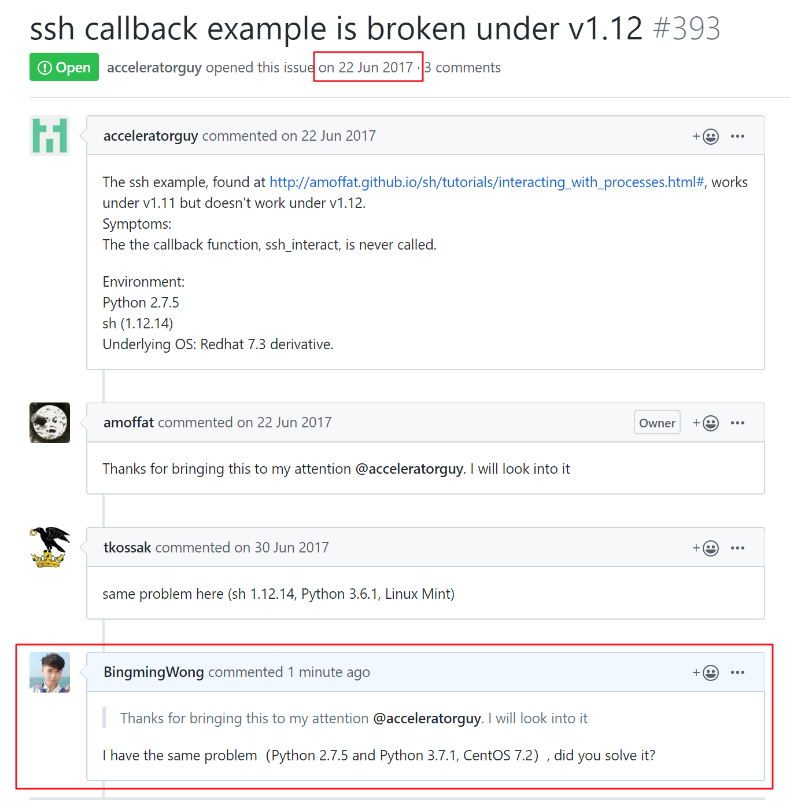

以上这个问题，只有在需要输入密码才会出现，如果设置了机器互信是没有问题的。

为了感受 `sh.ssh` 的使用效果，我设置了机器互信免密，然后使用如下这段代码。

```python
from sh import ssh

my_server=ssh.bake("root@xx.xx.xx.xx", "-p 22")

# 相当于执行登陆一次执行一次命令，执行完就退出登陆
print(my_server.ls())

# 可在 sleep 期间，手动登陆服务器，使用 top ，查看当前有多少终端在连接
time.sleep(5)

# 再次执行这条命令时，登陆终端数将 +1，执行完后，又将 -1
print(my_server.ifconfig())
```

惊奇地发现使用 `bake` 这种方式，`my_server.ls()` 和 `my_server.ifconfig()` 这种看似是通过同一个ssh连接，执行两次命令，可实际上，你可以在远程机器上，执行 top 命令看到已连接的终端的变化，会先 `+1` 再 `-1`，说明两次命令的执行是通过两次连接实现的。

如此看来，使用 `sh.ssh` 可以解决痛点一（如果上述问题能得到解决）、痛点二、痛点三。

但是它仍然无法复用 ssh 连接，还是不太方便，不是我理想中的最佳方案。

最重要的一点是， `sh` 这个模块，仅支持  Linxu/OSX ，在 Windows 你得使用它的兄弟库 - `pbs` ，然后我又去  pypi 看了一眼 [pbs](https://pypi.org/project/pbs/)，已经 “年久失修”，没人维护了。

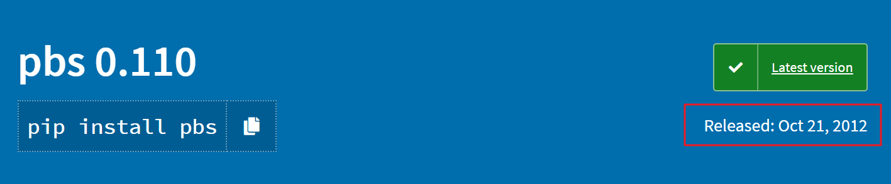

至此，我离 “卒”，就差最后一根稻草了。


##  使用 paramiko

带着最后一丝希望，我尝试使用了 `paramiko` 这个库，终于在 `paramiko` 这里，找回了本应属于 Python 的那种优雅。

你可以通过如下命令去安装它

```
$ python3 -m pip install paramiko
```


然后接下来，就介绍几种常用的 ssh 登陆的方法

### 方法1：基于用户名和密码的 sshclient 方式登录

然后你可以参考如下这段代码，在 Linux/OSX 系统下进行远程连接

```python
import paramiko

ssh = paramiko.SSHClient()
# 允许连接不在know_hosts文件中的主机
ssh.set_missing_host_key_policy(paramiko.AutoAddPolicy())

# 建立连接
ssh.connect("xx.xx.xx.xx", username="root", port=22, password="you_password")

# 使用这个连接执行命令
ssh_stdin, ssh_stdout, ssh_stderr = ssh.exec_command("ls -l")

# 获取输出
print(ssh_stdout.read())

# 关闭连接
ssh.close()
```


###  方法2：基于用户名和密码的 transport 方式登录

方法1 是传统的连接服务器、执行命令、关闭的一个操作，多个操作需要连接多次，无法复用连接[**痛点四**]。

有时候需要登录上服务器执行多个操作，比如执行命令、上传/下载文件，方法1 则无法实现，那就可以使用 transport 的方法。

```python
import paramiko

# 建立连接
trans = paramiko.Transport(("xx.xx.xx.xx", 22))
trans.connect(username="root", password="you_passwd")

# 将sshclient的对象的transport指定为以上的trans
ssh = paramiko.SSHClient()
ssh._transport = trans

# 剩下的就和上面一样了
ssh.set_missing_host_key_policy(paramiko.AutoAddPolicy())
ssh_stdin, ssh_stdout, ssh_stderr = ssh.exec_command("ls -l")
print(ssh_stdout.read())

# 关闭连接
trans.close()
```


### 方法3：基于公钥密钥的 SSHClient 方式登录

```python
import paramiko

# 指定本地的RSA私钥文件
# 如果建立密钥对时设置的有密码，password为设定的密码，如无不用指定password参数
pkey = paramiko.RSAKey.from_private_key_file('/home/you_username/.ssh/id_rsa', password='12345')

# 建立连接
ssh = paramiko.SSHClient()
ssh.connect(hostname='xx.xx.xx.xx',
            port=22,
            username='you_username',
            pkey=pkey)

# 执行命令
stdin, stdout, stderr = ssh.exec_command('ls -l')

# 结果放到stdout中，如果有错误将放到stderr中
print(stdout.read())

# 关闭连接
ssh.close()
```


### 方法4：基于密钥的 Transport 方式登录

```python
import paramiko

# 指定本地的RSA私钥文件
# 如果建立密钥对时设置的有密码，password为设定的密码，如无不用指定password参数
pkey = paramiko.RSAKey.from_private_key_file('/home/you_username/.ssh/id_rsa', password='12345')

# 建立连接
trans = paramiko.Transport(('xx.xx.xx.xx', 22))
trans.connect(username='you_username', pkey=pkey)

# 将sshclient的对象的transport指定为以上的trans
ssh = paramiko.SSHClient()
ssh._transport = trans

# 执行命令，和传统方法一样
stdin, stdout, stderr = ssh.exec_command('df -hl')
print(stdout.read().decode())

# 关闭连接
trans.close()
```


以上四种方法，可以帮助你实现远程登陆服务器执行命令，如果需要复用连接：一次连接执行多次命令，可以使用 **方法二** 和 **方法四**

用完后，记得关闭连接。

### 实现 sftp 文件传输

同时，paramiko 做为 ssh 的完美解决方案，它非常专业，利用它还可以实现 sftp 文件传输。

```python
import paramiko

# 实例化一个trans对象# 实例化一个transport对象
trans = paramiko.Transport(('xx.xx.xx.xx', 22))

# 建立连接
trans.connect(username='you_username', password='you_passwd')

# 实例化一个 sftp对象,指定连接的通道
sftp = paramiko.SFTPClient.from_transport(trans)

# 发送文件
sftp.put(localpath='/tmp/11.txt', remotepath='/tmp/22.txt')

# 下载文件
sftp.get(remotepath='/tmp/22.txt', localpath='/tmp/33.txt')
trans.close()
```


到这里，Paramiko 已经完胜了，但是仍然有一个痛点我们没有提及，就是多平台，说的就是 Windows，这里就有一件好事，一件坏事了。

好事就是：paramiko 支持 windows

坏事就是：你需要做很多复杂的准备，你可 google 解决，但是我建议你直接放弃，坑太深了。


### 注意事项

使用 paramiko 的时候，有一点需要注意一下，这个也是我自己 "踩坑" 后才发现的，其实我觉得这个设计挺好的，如果你不需要等待它返回数据，可以直接实现异步效果，只不过对于不知道这个设计的人，确实是个容易掉坑的点

就是在执行 `ssh.exec_command(cmd)` 时，这个命令并不是同步阻塞的。

比如下面这段代码，执行时，你会发现 脚本立马就结束退出了，并不会等待 5 s 后，再 执行 ssh.close()

```python
import paramiko

trans = paramiko.Transport(("172.20.42.1", 57891))
trans.connect(username="root", password="youpassword")
ssh = paramiko.SSHClient()
ssh._transport = trans
stdin, stdout, stderr = ssh.exec_command("sleep 5;echo ok")
ssh.close()
```


但是如果改成这样，加上一行 stdout.read()， paramiko 就知道，你需要这个执行的结果，就会在 read() 进行阻塞。

```python
import paramiko

trans = paramiko.Transport(("172.20.42.1", 57891))
trans.connect(username="root", password="youpassword")
ssh = paramiko.SSHClient()
ssh._transport = trans
stdin, stdout, stderr = ssh.exec_command("sleep 5;echo ok")

# 加上一行 read()
print(stdout.read())
ssh.close()
```

##  写在最后

经过了一番对比，和一些实例的展示，可以看出 Paramiko 是一个专业、让人省心的 ssh 利器，个人认为 Paramiko 模块是运维人员必学模块之一，如果你恰好需要在 Python 代码中实现 ssh 到远程服务器去获取一些信息，那么我把 Paramiko 推荐给你。


#  代码 BUG 变得酷炫的利器

当我们写的一个脚本或程序发生各种不可预知的异常时，如果我们没有进行捕获处理的时候，通常都会致使程序崩溃退出，并且会在终端打印出一堆 **密密麻麻** 的 traceback 堆栈信息来告诉我们，是哪个地方出了问题。

就像这样子，天呐，密集恐惧症要犯了都

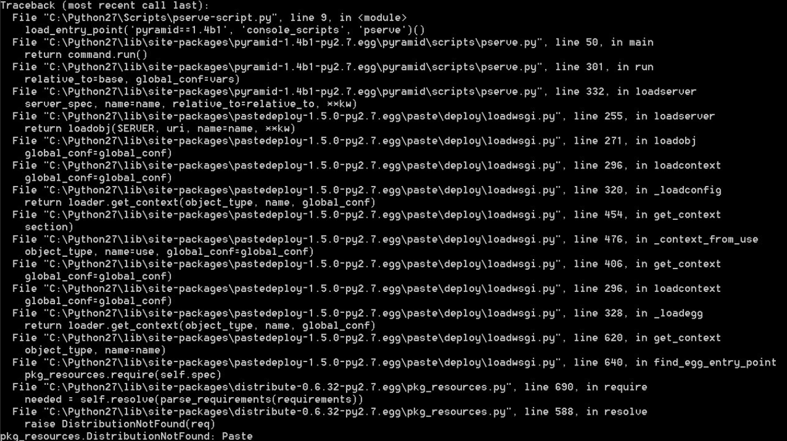

上面这段 traceback 

- 只有黑白两个颜色，无法像代码高亮那样，对肉眼实在太不友好了
- 无法直接显示报错的代码，排查问题慢人一步，效率太低

那有没有一种办法，可以解决这些问题呢？

当然有了，在 Python 中，没有什么问题是一个库解决不了的，如果有，那就等你去开发这个库。

今天要介绍的这个库呢，叫做 `pretty-errors` ，从名字上就可以知道它的用途，是用来美化错误信息的。

通过这条命令你可以安装它

```shell
$ python3 -m pip install pretty-errors
```


## 环境要求

由于使用了 `pretty-errors` 后，你的 traceback 信息输出，会有代码高亮那样的效果，因此当你在测试使用 `pretty-error` 时，请确保你使用的终端可以输出带有颜色的字体。

在 windows 上你可以使用 Powershell，cmder 等

在 Mac 上你可以使用自带的终端，或者安装一个更好用的 iTerm2

##  效果对比

------

随便写一个没有使用 pretty-errors ，并且报错了的程序，是这样子的。

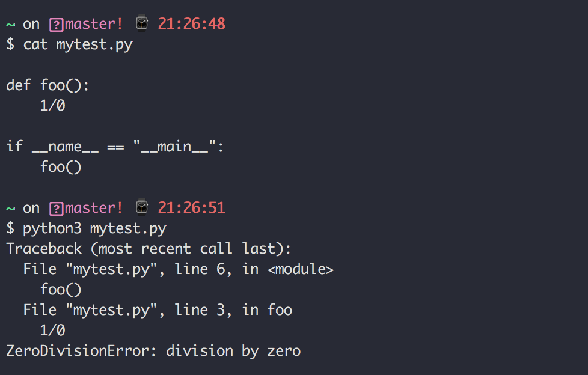

而使用了 pretty_errors 后，报错信息被美化成这样了。

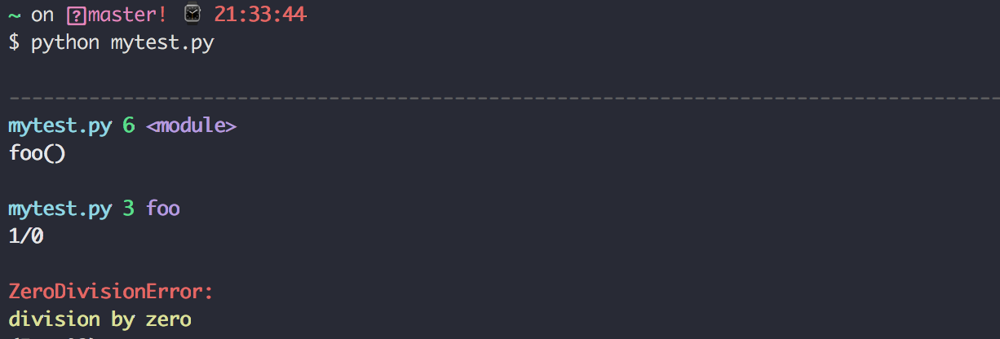

是不是感觉清楚了不少，那种密密麻麻带来的焦虑感是不是都消失了呢？

当然这段代码少，你可能还没感受到，那就来看下 该项目在 Github上的一张效果对比图吧

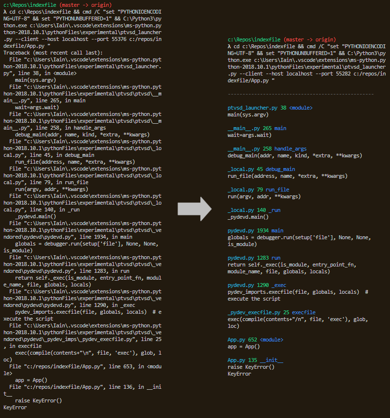


##  配置全局可用

可以看到使用了 pretty_errors 后，无非就是过滤掉了一些干扰我们视线的无用信息，然后把有用的关键信息给我们高亮显示。

既然这样，那 pretty_errors 应该也能支持我们如何自定义想选用什么样的颜色，怎么排版吧？

答案是显而易见的。

pretty_errors 和其他库不太一样，在一定程度上（如果你使用全局配置的话），它并不是开箱即用的，你在使用它之前可能需要做一下配置。

使用这一条命令，会让你进行配置，可以让你在该环境中运行其他脚本时的 traceback 输出都自动美化。

```shell
$ python3 -m pretty_errors
```

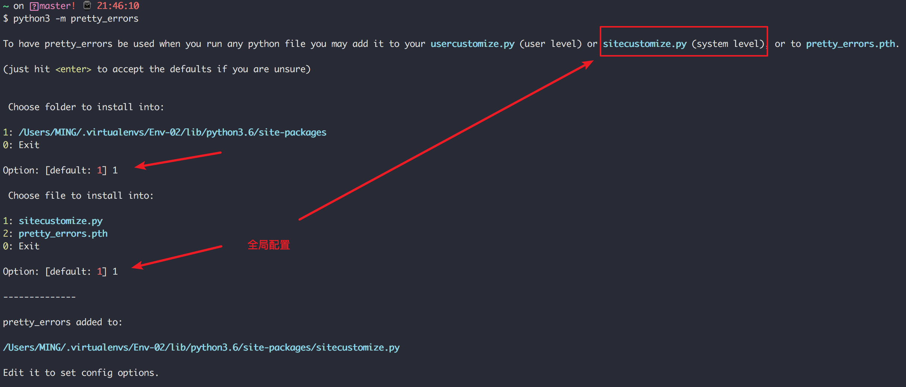

配置完成后，你再运行任何脚本，traceback 都会自动美化了。

不仅是在我的 iTerm 终端下


在 PyCharm 中也会

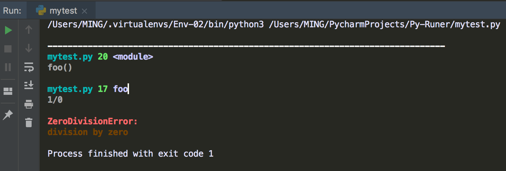

唯一的缺点就是，原先在 PyCharm 中的 traceback 可以直接点击 `文件路径` 直接跳转到对应错误文件代码行，而你如果是在 VSCode 可以使用 下面自定义配置的方案解决这个问题（下面会讲到，参数是：`display_link`）。

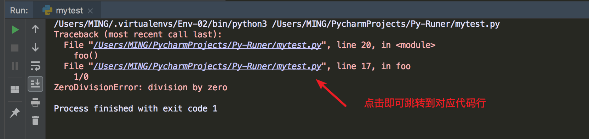

因此，有些情况下，你并不想设置 `pretty_errors` 全局可用。

那怎么取消之前的配置呢？

只需要再次输入 `python -m pretty_errors`，选择 `C` 即可清除。

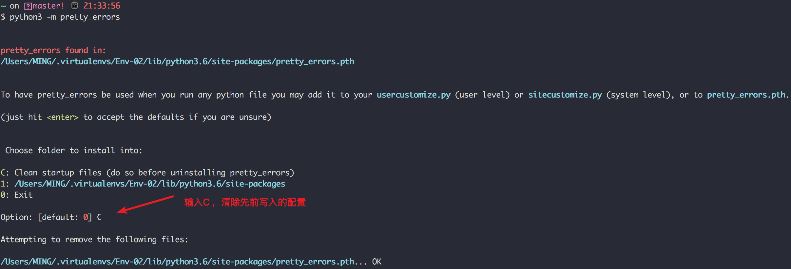


##  单文件中使用

取消全局可用后，你可以根据自己需要，在你需要使用 `pretty-errors` 的脚本文件中导入` pretty_errors `，即可使用

```python
import pretty_errors
```

就像这样

```python
import pretty_errors

def foo():
    1/0

if __name__ == "__main__":
    foo()
```

值得一提的是，使用这种方式，若是你的脚本中，出现语法错误，则输出的异常信息还是按照之前的方式展示，并不会被美化。

因此，为了让美化更彻底，官方推荐你使用 `python -m pretty_errors` 

##  自定义设置

上面的例子里，我们使用的都是 `pretty_errors` 的默认美化格式，展示的信息并没有那么全。

比如

- 它并没有展示报错文件的绝对路径，这将使我们很难定位到是哪个文件里的代码出现错误。
- 如果能把具体报错的代码，给我们展示在终端屏幕上，就不需要我们再到源码文件中排查原因了。

如果使用了 `pretty_errors` 导致异常信息有丢失，那还不如不使用 `pretty_errors` 呢。

不过，可以告诉你的是，`pretty_errors` 并没有你想象的那么简单。

它足够开放，支持自定义配置，可以由你选择你需要展示哪些信息，怎么展示？

这里举一个例子

```python
import pretty_errors

# 【重点】进行配置
pretty_errors.configure(
    separator_character = '*',
    filename_display    = pretty_errors.FILENAME_EXTENDED,
    line_number_first   = True,
    display_link        = True,
    lines_before        = 5,
    lines_after         = 2,
    line_color          = pretty_errors.RED + '> ' + pretty_errors.default_config.line_color,
    code_color          = '  ' + pretty_errors.default_config.line_color,
)

# 原来的代码
def foo():
    1/0

if __name__ == "__main__":
    foo()
```

在你像上面这样使用 `pretty_errrs.configure` 进行配置时，抛出的异常信息就变成这样了。

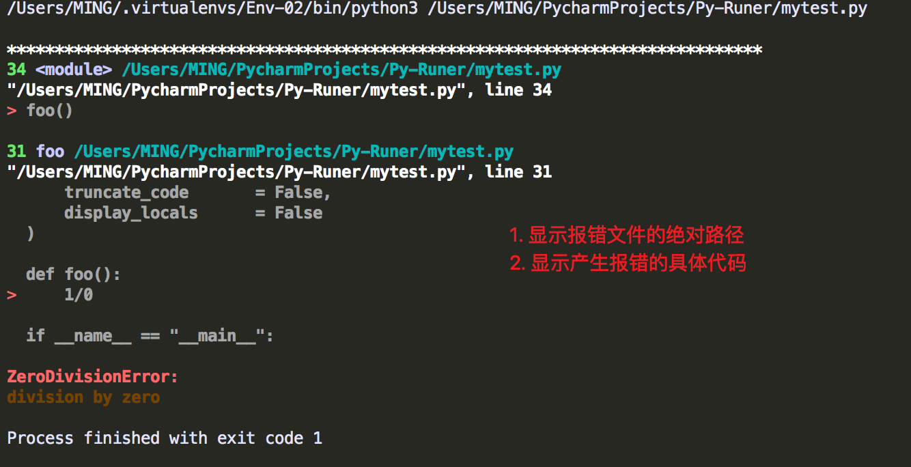


当然了，`pretty_errors.configure()`  还可以接收很多的参数，你可以根据你自己的需要进行配置。

###  设置颜色

- `header_color`：设置标题行的颜色。
- `timestamp_color`：设置时间戳颜色
- `default_color`：设置默认的颜色
- `filename_color`：设置文件名颜色
- `line_number_color`：设置行号颜色。
- `function_color`：设置函数颜色。
- `link_color`：设置链接的颜色。

在设置颜色的时候，`pretty_errors` 提供了一些常用的 颜色常量供你直接调取。

- `BLACK`：黑色
- `GREY`：灰色
- `RED`：红色
- `GREEN`：绿色
- `YELLOW`：黄色
- `BLUE`：蓝色
- `MAGENTA`：品红色
- `CYAN`：蓝绿色
- `WHITE`：白色

而每一种颜色，都有相应匹配的 `BRIGHT_` 变体 和 `_BACKGROUND` 变体，

其中，`_BACKGROUND` 用于设置背景色，举个例子如下。

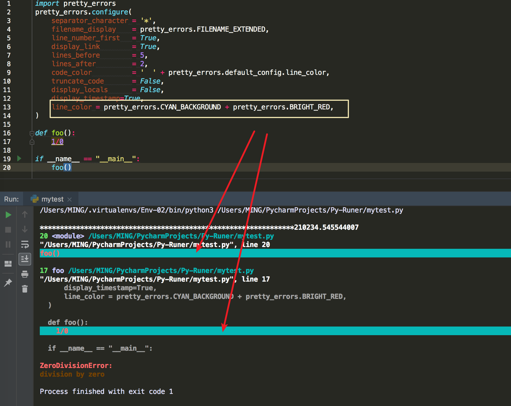

###  设置显示内容

- `line_number_first`
    启用后，将首先显示行号，而不是文件名。
- `lines_before` ： 显示发生异常处的前几行代码
- `lines_after`： 显示发生异常处的后几行代码
- `display_link`：启用后，将在错误位置下方写入链接，VScode将允许您单击该链接。
- `separator_character`：用于创建标题行的字符。默认情况下使用连字符。如果设置为 `''` 或者 `None` ，标题将被禁用。
- `display_timestamp`：启用时，时间戳将写入回溯头中。
- `display_locals`
    启用后，将显示在顶部堆栈框架代码中的局部变量及其值。

- `display_trace_locals`
    启用后，其他堆栈框架代码中出现的局部变量将与它们的值一起显示。

###  设置怎么显示

- `line_length`：设置每行的长度，默认为0，表示每行的输出将与控制台尺寸相匹配，如果你设置的长度刚好与控制台宽度匹配，则可能需要禁用`full_line_newline`，以防止出现明显的双换行符。

- `full_line_newline`：当输出的字符满行时，是否要插入换行符。

- `timestamp_function`
    调用该函数以生成时间戳。默认值为`time.perf_counter`。

- `top_first`
    启用后，堆栈跟踪将反转，首先显示堆栈顶部。

- `display_arrow`
    启用后，将针对语法错误显示一个箭头，指向有问题的令牌。

- `truncate_code`
    启用后，每行代码将被截断以适合行长。

- `stack_depth`
    要显示的堆栈跟踪的最大条目数。`0`将显示整个堆栈，这是默认值。

- `exception_above`
    启用后，异常将显示在堆栈跟踪上方。

- `exception_below`：
    启用后，异常显示在堆栈跟踪下方。

- `reset_stdout`
    启用后，重置转义序列将写入stdout和stderr；如果您的控制台留下错误的颜色，请启用此选项。

- `filename_display`

    设置文件名的展示方式，有三个选项： `pretty_errors.FILENAME_COMPACT` 、`pretty_errors.FILENAME_EXTENDED`，或者`pretty_errors.FILENAME_FULL`


以上，就是我对 `pretty_errors` 的使用体验，总的来说，这个库功能非常强大，使用效果也特别酷炫，它就跟 PEP8 规范一样，没有它是可以，但是有了它会更好一样。对于某些想自定义错误输出场景的人，`pretty_errors`  会是一个不错的解决方案，明哥把它推荐给你。


#  少有人知的 Python "重试机制"

为了避免由于一些网络或其他不可控因素，而引起的功能性问题。比如在发送请求时，会因为网络不稳定，往往会有请求超时的问题。

这种情况下，我们通常会在代码中加入重试的代码。重试的代码本身不难实现，但如何写得优雅、易用，是我们要考虑的问题。

这里要给大家介绍的是一个第三方库 - `Tenacity` ，它实现了几乎我们可以使用到的所有重试场景，比如：

1. 在什么情况下才进行重试？
2. 重试几次呢?
3. 重试多久后结束？
4. 每次重试的间隔多长呢？
5. 重试失败后的回调？

在使用它之前 ，先要安装它

```shell
$ pip install tenacity
```


## 最基本的重试

无条件重试，重试之间无间隔

```python
from tenacity import retry

@retry
def test_retry():
    print("等待重试，重试无间隔执行...")
    raise Exception

test_retry()
```

无条件重试，但是在重试之前要等待 2 秒

```python
from tenacity import retry, wait_fixed

@retry(wait=wait_fixed(2))
def test_retry():
    print("等待重试...")
    raise Exception

test_retry()
```


## 设置停止基本条件

只重试7 次

```python
from tenacity import retry, stop_after_attempt

@retry(stop=stop_after_attempt(7))
def test_retry():
    print("等待重试...")
    raise Exception

test_retry()
```

重试 10 秒后不再重试

```python
from tenacity import retry, stop_after_delay

@retry(stop=stop_after_delay(10))
def test_retry():
    print("等待重试...")
    raise Exception

test_retry()
```

或者上面两个条件满足一个就结束重试

```python
from tenacity import retry, stop_after_delay, stop_after_attempt

@retry(stop=(stop_after_delay(10) | stop_after_attempt(7)))
def test_retry():
    print("等待重试...")
    raise Exception

test_retry()
```

## 设置何时进行重试

在出现特定错误/异常（比如请求超时）的情况下，再进行重试

```python
from requests import exceptions
from tenacity import retry, retry_if_exception_type

@retry(retry=retry_if_exception_type(exceptions.Timeout))
def test_retry():
    print("等待重试...")
    raise exceptions.Timeout

test_retry()
```

在满足自定义条件时，再进行重试。

如下示例，当 `test_retry` 函数返回值为 False 时，再进行重试

```python
from tenacity import retry, stop_after_attempt, retry_if_result

def is_false(value):
    return value is False

@retry(stop=stop_after_attempt(3),
       retry=retry_if_result(is_false))
def test_retry():
    return False

test_retry()
```

## 多个条件注意顺序

如果想对一个异常进行重试，但是最多重试3次。

下面这个代码是无效的，因为它会一直重试，重试三次的限制不会生效，因为它的条件是有顺序的，在前面的条件会先被走到，就永远走不到后面的条件。

```python
import time
from requests import exceptions
from tenacity import retry, retry_if_exception_type, stop_after_attempt

@retry(retry=retry_if_exception_type(exceptions.Timeout), stop=stop_after_attempt(3))
def test_retry():
    time.sleep(1)
    print("retry")
    raise exceptions.Timeout

test_retry()
```

如果你把 stop_after_attempt 写到前边，就没有问题了。

```python
import time
from requests import exceptions
from tenacity import retry, retry_if_exception_type, stop_after_attempt

@retry(stop=stop_after_attempt(5), retry=retry_if_exception_type(exceptions.Timeout))
def test_retry():
    time.sleep(1)
    print("retry")
    raise exceptions.Timeout

test_retry()
```

## 重试后错误重新抛出

当出现异常后，tenacity 会进行重试，若重试后还是失败，默认情况下，往上抛出的异常会变成 RetryError，而不是最根本的原因。

因此可以加一个参数（`reraise=True`），使得当重试失败后，往外抛出的异常还是原来的那个。

```python
from tenacity import retry, stop_after_attempt

@retry(stop=stop_after_attempt(7), reraise=True)
def test_retry():
    print("等待重试...")
    raise Exception

test_retry()
```


## 设置回调函数

当最后一次重试失败后，可以执行一个回调函数

```python
from tenacity import *

def return_last_value(retry_state):
    print("执行回调函数")
    return retry_state.outcome.result()  # 表示返回原函数的返回值

def is_false(value):
    return value is False

@retry(stop=stop_after_attempt(3),
       retry_error_callback=return_last_value,
       retry=retry_if_result(is_false))
def test_retry():
    print("等待重试中...")
    return False

print(test_retry())
```

输出如下

```shell
等待重试中...
等待重试中...
等待重试中...
执行回调函数
False
```


#  规整字符串提取数据的神器

从一段指定的字符串中，取得期望的数据，正常人都会想到正则表达式吧？

写过正则表达式的人都知道，正则表达式入门不难，写起来也容易。

但是正则表达式几乎没有可读性可言，维护起来，真的会让人抓狂，别以为这段正则是你写的就可以驾驭它，过个一个月你可能就不认识它了。

今天给你介绍一个好东西，可以让你在某些场景下摆脱正则的噩梦，那就是 Python 中一个非常冷门的库 --  parse 。

##  真实案例

拿一个最近使用 parse 的真实案例来举例说明。

下面是 ovs 一个条流表，现在我需要收集提取一个虚拟机（网口）里有多少流量、多少包流经了这条流表。也就是每个 in_port 对应的 n_bytes、n_packets 的值 。

```
cookie=0x9816da8e872d717d, duration=298506.364s, table=0, n_packets=480, n_bytes=20160, priority=10,ip,in_port="tapbbdf080b-c2" actions=NORMAL
```

如果是你，你会怎么做呢？

先以逗号分隔开来，再以等号分隔取出值来？

你不妨可以尝试一下，写出来的代码应该和我想象的一样，没有一丝美感可言。

我来给你展示一下，我是怎么做的？

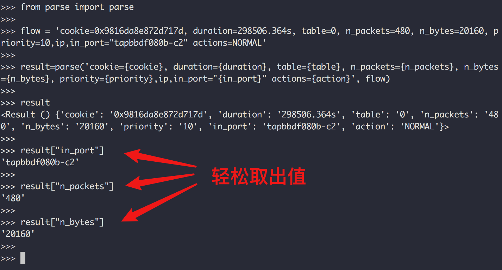

可以看到，我使用了一个叫做 parse 的第三方包，是需要自行安装的

```shell
$ python -m pip install parse
```

从上面这个案例中，你应该能感受到 parse 对于解析规范的字符串，是非常强大的。

##  parse 的结果

parse 的结果只有两种：

1. 没有匹配上，parse 的值为None

```python
>>> parse("halo", "hello") is None
True
>>>
```

2. 如果匹配上，parse 的值则 为 Result 实例

```python
>>> parse("hello", "hello world")
>>> parse("hello", "hello")
<Result () {}>
>>> 
```

如果你编写的解析规则，没有为字段定义字段名，也就是匿名字段， Result 将是一个 类似 list 的实例，演示如下：

```python
>>> profile = parse("I am {}, {} years old, {}", "I am Jack, 27 years old, male")
>>> profile
<Result ('Jack', '27', 'male') {}>
>>> profile[0]
'Jack'
>>> profile[1]
'27'
>>> profile[2]
'male'
```

而如果你编写的解析规则，为字段定义了字段名， Result 将是一个 类似 字典 的实例，演示如下：

```python
>>> profile = parse("I am {name}, {age} years old, {gender}", "I am Jack, 27 years old, male")
>>> profile
<Result () {'gender': 'male', 'age': '27', 'name': 'Jack'}>
>>> profile['name']
'Jack'
>>> profile['age']
'27'
>>> profile['gender']
'male'
```

##  重复利用 pattern

和使用 re 一样，parse 同样支持 pattern 复用。

```python
>>> from parse import compile
>>> 
>>> pattern = compile("I am {}, {} years old, {}")
>>> pattern.parse("I am Jack, 27 years old, male")
<Result ('Jack', '27', 'male') {}>
>>> 
>>> pattern.parse("I am Tom, 26 years old, male")
<Result ('Tom', '26', 'male') {}>
```

##  类型转化

从上面的例子中，你应该能注意到，parse 在获取年龄的时候，变成了一个`"27"` ，这是一个字符串，有没有一种办法，可以在提取的时候就按照我们的类型进行转换呢？

你可以这样写。

```python
>>> from parse import parse
>>> profile = parse("I am {name}, {age:d} years old, {gender}", "I am Jack, 27 years old, male")
>>> profile
<Result () {'gender': 'male', 'age': 27, 'name': 'Jack'}>
>>> type(profile["age"])
<type 'int'>
```

除了将其转为 整型，还有其他格式吗？

内置的格式还有很多，比如

匹配时间

```python
>>> parse('Meet at {:tg}', 'Meet at 1/2/2011 11:00 PM')
<Result (datetime.datetime(2011, 2, 1, 23, 0),) {}>
```

更多类型请参考官方文档：

| Type | Characters Matched                                           | Output   |
| :--- | :----------------------------------------------------------- | :------- |
| l    | Letters (ASCII)                                              | str      |
| w    | Letters, numbers and underscore                              | str      |
| W    | Not letters, numbers and underscore                          | str      |
| s    | Whitespace                                                   | str      |
| S    | Non-whitespace                                               | str      |
| d    | Digits (effectively integer numbers)                         | int      |
| D    | Non-digit                                                    | str      |
| n    | Numbers with thousands separators (, or .)                   | int      |
| %    | Percentage (converted to value/100.0)                        | float    |
| f    | Fixed-point numbers                                          | float    |
| F    | Decimal numbers                                              | Decimal  |
| e    | Floating-point numbers with exponent e.g. 1.1e-10, NAN (all case insensitive) | float    |
| g    | General number format (either d, f or e)                     | float    |
| b    | Binary numbers                                               | int      |
| o    | Octal numbers                                                | int      |
| x    | Hexadecimal numbers (lower and upper case)                   | int      |
| ti   | ISO 8601 format date/time e.g. 1972-01-20T10:21:36Z (“T” and “Z” optional) | datetime |
| te   | RFC2822 e-mail format date/time e.g. Mon, 20 Jan 1972 10:21:36 +1000 | datetime |
| tg   | Global (day/month) format date/time e.g. 20/1/1972 10:21:36 AM +1:00 | datetime |
| ta   | US (month/day) format date/time e.g. 1/20/1972 10:21:36 PM +10:30 | datetime |
| tc   | ctime() format date/time e.g. Sun Sep 16 01:03:52 1973       | datetime |
| th   | HTTP log format date/time e.g. 21/Nov/2011:00:07:11 +0000    | datetime |
| ts   | Linux system log format date/time e.g. Nov 9 03:37:44        | datetime |
| tt   | Time e.g. 10:21:36 PM -5:30                                  | time     |

##  提取时去除空格

去除两边空格

```python
>>> parse('hello {} , hello python', 'hello     world    , hello python')
<Result ('    world   ',) {}>
>>> 
>>> 
>>> parse('hello {:^} , hello python', 'hello     world    , hello python')
<Result ('world',) {}>
```

去除左边空格

```python
>>> parse('hello {:>} , hello python', 'hello     world    , hello python')
<Result ('world   ',) {}>
```

去除右边空格

```python
>>> parse('hello {:<} , hello python', 'hello     world    , hello python')
<Result ('    world',) {}>
```


##  大小写敏感开关

Parse 默认是大小写不敏感的，你写 hello 和 HELLO 是一样的。

如果你需要区分大小写，那可以加个参数，演示如下：

```python
>>> parse('SPAM', 'spam')
<Result () {}>
>>> parse('SPAM', 'spam') is None
False
>>> parse('SPAM', 'spam', case_sensitive=True) is None
True
```

##  匹配字符数

精确匹配：指定最大字符数

```python
>>> parse('{:.2}{:.2}', 'hello')  # 字符数不符
>>> 
>>> parse('{:.2}{:.2}', 'hell')   # 字符数相符
<Result ('he', 'll') {}>
```

模糊匹配：指定最小字符数

```python
>>> parse('{:.2}{:2}', 'hello') 
<Result ('h', 'ello') {}>
>>> 
>>> parse('{:2}{:2}', 'hello') 
<Result ('he', 'llo') {}>
```

若要在精准/模糊匹配的模式下，再进行格式转换，可以这样写

```python
>>> parse('{:2}{:2}', '1024') 
<Result ('10', '24') {}>
>>> 
>>> 
>>> parse('{:2d}{:2d}', '1024') 
<Result (10, 24) {}>
```


##  三个重要属性

Parse 里有三个非常重要的属性

- fixed：利用位置提取的匿名字段的元组
- named：存放有命名的字段的字典
- spans：存放匹配到字段的位置

下面这段代码，带你了解他们之间有什么不同

```python
>>> profile = parse("I am {name}, {age:d} years old, {}", "I am Jack, 27 years old, male")
>>> profile.fixed
('male',)
>>> profile.named
{'age': 27, 'name': 'Jack'}
>>> profile.spans
{0: (25, 29), 'age': (11, 13), 'name': (5, 9)}
>>> 
```

##  自定义类型的转换

匹配到的字符串，会作为参数传入对应的函数

比如我们之前讲过的，将字符串转整型

```python
>>> parse("I am {:d}", "I am 27")
<Result (27,) {}>
>>> type(_[0])
<type 'int'>
>>> 
```

其等价于

```python
>>> def myint(string):
...     return int(string)
... 
>>> 
>>> 
>>> parse("I am {:myint}", "I am 27", dict(myint=myint))
<Result (27,) {}>
>>> type(_[0])
<type 'int'>
>>>
```

利用它，我们可以定制很多的功能，比如我想把匹配的字符串弄成全大写

```python
>>> def shouty(string):
...    return string.upper()
...
>>> parse('{:shouty} world', 'hello world', dict(shouty=shouty))
<Result ('HELLO',) {}>
>>>
```


##  总结一下

parse 库在字符串解析处理场景中提供的便利，肉眼可见，上手简单。

在一些简单的场景中，使用 parse 可比使用 re 去写正则开发效率不知道高几个 level，用它写出来的代码富有美感，可读性高，后期维护起代码来一点压力也没有，推荐你使用。


#  一行代码让代码运行速度提高100倍

python一直被病垢运行速度太慢，但是实际上python的执行效率并不慢，慢的是python用的解释器Cpython运行效率太差。

“一行代码让python的运行速度提高100倍”这绝不是哗众取宠的论调。

我们来看一下这个最简单的例子，从1一直累加到1亿。

最原始的代码：

```python
import time
def foo(x,y):
        tt = time.time()
        s = 0
        for i in range(x,y):
                s += i
        print('Time used: {} sec'.format(time.time()-tt))
        return s

print(foo(1,100000000))
```

结果：

```python
Time used: 6.779874801635742 sec
4999999950000000
```

我们来加一行代码，再看看结果：

```python
from numba import jit
import time
@jit
def foo(x,y):
        tt = time.time()
        s = 0
        for i in range(x,y):
                s += i
        print('Time used: {} sec'.format(time.time()-tt))
        return s
print(foo(1,100000000))
```

结果：

```
Time used: 0.04680037498474121 sec
4999999950000000
```

是不是快了100多倍呢？

那么下面就分享一下“为啥**numba**库的**jit**模块那么牛掰？”

**NumPy**的创始人Travis Oliphant在离开Enthought之后，创建了CONTINUUM，致力于 Python大数据处理方面的应用。最近推出的Numba项目能够将处理NumPy数组的Python函数JIT编译为机器码执行，从而上百倍地提高程序的运算速度。

Numba项目的主页上有Linux下的详细安装步骤。编译LLVM需要花一些时间。Windows用户可以从Unofficial Windows Binaries for Python Extension Packages下载安装LLVMPy、meta和numba等几个扩展库。

下面我们看一个例子：

```python
import numba as nb
from numba import jit

@jit('f8(f8[:])')
def sum1d(array):
    s = 0.0
    n = array.shape[0]
    for i in range(n):
        s += array[i]
    return s

import numpy as np
array = np.random.random(10000)
%timeit sum1d(array)
%timeit np.sum(array)
%timeit sum(array)
10000 loops, best of 3: 38.9 us per loop
10000 loops, best of 3: 32.3 us per loop
100 loops, best of 3: 12.4 ms per loop
```

numba中提供了一些装饰器，它们可以将其修饰的函数**JIT**编译成机器码函数，并返回一个可在Python中调用机器码的包装对象。为了能将Python函数编译成能高速执行的机器码，我们需要告诉JIT编译器函数的各个参数和返回值的类型。我们可以通过多种方式指定类型信息，在上面的例子中，类型信息由一个字符串’f8(f8[:])’指定。其中’f8’表示8个字节双精度浮点数，括号前面的’f8’表示返回值类型，括号里的表示参数类型，’[:]’表示一维数组。因此整个类型字符串表示sum1d()是一个参数为双精度浮点数的一维数组，返回值是一个双精度浮点数。需要注意的是，JIT所产生的函数只能对指定的类型的参数进行运算：

```python
print sum1d(np.ones(10, dtype=np.int32))
print sum1d(np.ones(10, dtype=np.float32))
print sum1d(np.ones(10, dtype=np.float64))
1.2095376009e-312
1.46201599944e+185
10.0
```

如果希望JIT能针对所有类型的参数进行运算，可以使用**autojit**：

```python
from numba import autojit
@autojit
def sum1d2(array):
    s = 0.0
    n = array.shape[0]
    for i in range(n):
        s += array[i]
    return s

%timeit sum1d2(array)
print sum1d2(np.ones(10, dtype=np.int32))
print sum1d2(np.ones(10, dtype=np.float32))
print sum1d2(np.ones(10, dtype=np.float64))
10000 loops, best of 3: 143 us per loop
10.0
10.0
10.0
```

**autoit**虽然可以根据参数类型动态地产生机器码函数，但是由于它需要每次检查参数类型，因此计算速度也有所降低。numba的用法很简单，基本上就是用jit和autojit这两个装饰器，和一些类型对象。下面的程序列出numba所支持的所有类型：

```python
print [obj for obj in nb.__dict__.values() if isinstance(obj, nb.minivect.minitypes.Type)]
[size_t, Py_uintptr_t, uint16, complex128, float, complex256, void, int , long double,
unsigned PY_LONG_LONG, uint32, complex256, complex64, object_, npy_intp, const char *,
double, unsigned short, float, object_, float, uint64, uint32, uint8, complex128, uint16,
int, int , uint8, complex64, int8, uint64, double, long double, int32, double, long double,
char, long, unsigned char, PY_LONG_LONG, int64, int16, unsigned long, int8, int16, int32,
unsigned int, short, int64, Py_ssize_t]
```

工作原理
**numba** 通过**meta**模块解析Python函数的ast语法树，对各个变量添加相应的类型信息。然后调用llvmpy生成机器码，最后再生成机器码的Python调用接口。

## meta模块

通过研究numba的工作原理，我们可以找到许多有用的工具。例如meta模块可在程序源码、ast语法树以及Python二进制码之间进行相互转换。下面看一个例子：

```python
def add2(a, b):
    return a + b
```

decompile_func能将函数的代码对象反编译成ast语法树，而str_ast能直观地显示ast语法树，使用这两个工具学习Python的ast语法树是很有帮助的。

```python
from meta.decompiler import decompile_func
from meta.asttools import str_ast
print str_ast(decompile_func(add2))
FunctionDef(args=arguments(args=[Name(ctx=Param(),
                                      id='a'),
                                 Name(ctx=Param(),
                                      id='b')],
                           defaults=[],
                           kwarg=None,
                           vararg=None),
            body=[Return(value=BinOp(left=Name(ctx=Load(),
                                               id='a'),
                                     op=Add(),
                                     right=Name(ctx=Load(),
                                                id='b')))],
            decorator_list=[],
            name='add2')
```

而python_source可以将ast语法树转换为Python源代码：

```python
from meta.asttools import python_source
python_source(decompile_func(add2))
def add2(a, b):
    return (a + b)
```

decompile_pyc将上述二者结合起来，它能将Python编译之后的pyc或者pyo文件反编译成源代码。下面我们先写一个tmp.py文件，然后通过py_compile将其编译成tmp.pyc。

```python
with open("tmp.py", "w") as f:
    f.write("""
def square_sum(n):
    s = 0
    for i in range(n):
        s += i**2
    return s
""")
import py_compile
py_compile.compile("tmp.py")
```

下面调用decompile_pyc将tmp.pyc显示为源代码：

```python
with open("tmp.pyc", "rb") as f:
    decompile_pyc(f)
def square_sum(n):
    s = 0
    for i in range(n):
        s += (i ** 2)
    return s
```

## llvmpy模块

LLVM是一个动态编译器，llvmpy则可以通过Python调用LLVM动态地创建机器码。直接通过llvmpy创建机器码是比较繁琐的，例如下面的程序创建一个计算两个整数之和的函数，并调用它计算结果。

```python
from llvm.core import Module, Type, Builder
from llvm.ee import ExecutionEngine, GenericValue

# Create a new module with a function implementing this:
#
# int add(int a, int b) {
#   return a + b;
# }
#
my_module = Module.new('my_module')
ty_int = Type.int()
ty_func = Type.function(ty_int, [ty_int, ty_int])
f_add = my_module.add_function(ty_func, "add")
f_add.args[0].name = "a"
f_add.args[1].name = "b"
bb = f_add.append_basic_block("entry")

# IRBuilder for our basic block
builder = Builder.new(bb)
tmp = builder.add(f_add.args[0], f_add.args[1], "tmp")
builder.ret(tmp)

# Create an execution engine object. This will create a JIT compiler
# on platforms that support it, or an interpreter otherwise
ee = ExecutionEngine.new(my_module)

# Each argument needs to be passed as a GenericValue object, which is a kind
# of variant
arg1 = GenericValue.int(ty_int, 100)
arg2 = GenericValue.int(ty_int, 42)

# Now let's compile and run!
retval = ee.run_function(f_add, [arg1, arg2])

# The return value is also GenericValue. Let's print it.
print "returned", retval.as_int()
returned 142
```

f_add就是一个动态生成的机器码函数，我们可以把它想象成C语言编译之后的函数。在上面的程序中，我们通过ee.run_function调用此函数，而实际上我们还可以获得它的地址，然后通过Python的ctypes模块调用它。

首先通过ee.get_pointer_to_function获得f_add函数的地址：

```python
addr = ee.get_pointer_to_function(f_add)
addr
2975997968L
```

然后通过ctypes.PYFUNCTYPE创建一个函数类型：

```python
import ctypes
f_type = ctypes.PYFUNCTYPE(ctypes.c_int, ctypes.c_int, ctypes.c_int)
```

最后通过f_type将函数的地址转换为可调用的Python函数，并调用它：

```python
f = f_type(addr)
f(100, 42)
142
```


numba所完成的工作就是：解析Python函数的ast语法树并加以改造，添加类型信息；将带类型信息的ast语法树通过llvmpy动态地转换为机器码函数，然后再通过和ctypes类似的技术为机器码函数创建包装函数供Python调用。


#  新一代的调试神器：PySnooper

对于每个程序开发者来说，调试几乎是必备技能。

代码写到一半卡住了，不知道这个函数执行完的返回结果是怎样的？调试一下看看

代码运行到一半报错了，什么情况？怎么跟预期的不一样？调试一下看看


调试的方法多种多样，不同的调试方法适合不同的场景和人群。

- 如果你是刚接触编程的小萌新，对很多工具的使用还不是很熟练，那么 print 和 log 大法好
- 如果你在本地（Win或者Mac）电脑上开发，那么 IDE 的图形化界面调试无疑是最适合的；
- 如果你在服务器上排查BUG，那么使用 PDB 进行无图形界面的调试应该是首选；
- 如果你要在本地进行开发，但是项目的进行需要依赖复杂的服务器环境，那么可以了解下 PyCharm 的远程调试

除了以上，今天明哥再给你介绍一款非常好用的调试工具，它能在一些场景下，大幅度提高调试的效率， 那就是 `PySnooper`，它在 Github 上已经收到了 13k 的 star，获得大家的一致好评。

**有了这个工具后，就算是小萌新也可以直接无门槛上手，从此与 print 说再见~**

##  快速安装

执行下面这些命令安装 PySnooper

```shell
$ python3 -m pip install pysnooper

# 或者
$ conda install -c conda-forge pysnooper

# 或者
$ yay -S python-pysnooper
```

##  简单案例

下面这段代码，定义了一个 demo_func 的函数，在里面生成一个 profile 的字典变量，然后去更新它，最后返回。

代码本身没有什么实际意义，但是用来演示 PySnooper 已经足够。

```python
import pysnooper

@pysnooper.snoop()
def demo_func():
    profile = {}
    profile["name"] = "写代码的明哥"
    profile["age"] = 27
    profile["gender"] = "male"

    return profile

def main():
    profile = demo_func()

main()
```

现在我使用终端命令行的方式来运行它

```shell
[root@iswbm ~]# python3 demo.py 
Source path:... demo.py
17:52:49.624943 call         4 def demo_func():
17:52:49.625124 line         5     profile = {}
New var:....... profile = {}
17:52:49.625156 line         6     profile["name"] = "写代码的明哥"
Modified var:.. profile = {'name': '写代码的明哥'}
17:52:49.625207 line         7     profile["age"] = 27
Modified var:.. profile = {'name': '写代码的明哥', 'age': 27}
17:52:49.625254 line         8     profile["gender"] = "male"
Modified var:.. profile = {'name': '写代码的明哥', 'age': 27, 'gender': 'male'}
17:52:49.625306 line        10     return profile
17:52:49.625344 return      10     return profile
Return value:.. {'name': '写代码的明哥', 'age': 27, 'gender': 'male'}
Elapsed time: 00:00:00.000486
```

可以看到 PySnooper 把函数运行的过程全部记录了下来，包括：

- 代码的片段、行号等信息，以及每一行代码是何时调用的？
- 函数内局部变量的值如何变化的？何时新增了变量，何时修改了变量。
- 函数的返回值是什么？
- 运行函数消耗了多少时间？

而作为开发者，要得到这些如此详细的调试信息，你需要做的非常简单，只要给你想要调试的函数上带上一顶帽子（装饰器） -- `@pysnooper.snoop()` 即可。


##  详细使用

###  重定向到日志文件

`@pysnooper.snoop()` 不加任何参数时，会默认将调试的信息输出到标准输出。

对于单次调试就能解决的 BUG ，这样没有什么问题，但是有一些 BUG 只有在特定的场景下才会出现，需要你把程序放在后面跑个一段时间才能复现。

这种情况下，你可以将调试信息重定向输出到某一日志文件中，方便追溯排查。

```python
@pysnooper.snoop(output='/var/log/debug.log')
def demo_func():
    ...
```

###  跟踪非局部变量值

PySnooper 是以函数为单位进行调试的，它默认只会跟踪函数体内的局部变量，若想跟踪全局变量，可以给 `@pysnooper.snoop()` 加上 `watch` 参数

```python
out = {"foo": "bar"}

@pysnooper.snoop(watch=('out["foo"]'))
def demo_func():
    ...
```

如此一来，PySnooper 会在 `out["foo"]` 值有变化时，也将其打印出来

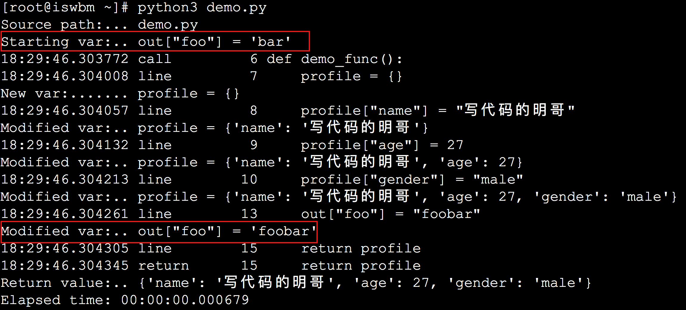

watch 参数，接收一个可迭代对象（可以是list 或者 tuple），里面的元素为字符串表达式，什么意思呢？看下面例子就知道了

```python
@pysnooper.snoop(watch=('out["foo"]', 'foo.bar', 'self.foo["bar"]'))
def demo_func():
		...
```

和 `watch` 相对的，`pysnooper.snoop()` 还可以接收一个函数 `watch_explode`，表示除了这几个参数外的其他所有全局变量都监控。

```python
@pysnooper.snoop(watch_explode=('foo', 'bar'))
def demo_func():
		...
```

###  设置跟踪函数的深度

当你使用 PySnooper 调试某个函数时，若该函数中还调用了其他函数，PySnooper 是不会傻傻的跟踪进去的。

如果你想继续跟踪该函数中调用的其他函数，可以通过指定 `depth` 参数来设置跟踪深度（不指定的话默认为 1）。

```python
@pysnooper.snoop(depth=2)
def demo_func():
		...
```

###  设置调试日志的前缀

当你在使用 PySnooper 跟踪多个函数时，调试的日志会显得杂乱无章，不方便查看。

在这种情况下，PySnooper 提供了一个参数，方便你为不同的函数设置不同的标志，方便你在查看日志时进行区分。

```python
@pysnooper.snoop(output="/var/log/debug.log", prefix="demo_func: ")
def demo_func():
    ...
```

效果如下

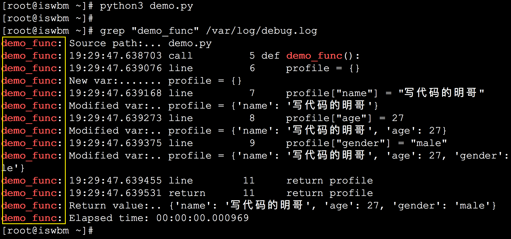

###  设置最大的输出长度

默认情况下，PySnooper 输出的变量和异常信息，如果超过 100 个字符，被会截断为 100 个字符。

当然你也可以通过指定参数 进行修改

```python
@pysnooper.snoop(max_variable_length=200）
def demo_func():
    ...
```

您也可以使用max_variable_length=None 使它从不截断它们。

```python
@pysnooper.snoop(max_variable_length=None）
def demo_func():
    ...
```


###  支持多线程调试模式

PySnooper 同样支持多线程的调试，通过设置参数 `thread_info=True`，它就会在日志中打印出是在哪个线程对变量进行的修改。

```python
@pysnooper.snoop(thread_info=True)
def demo_func():
    ...
```

效果如下

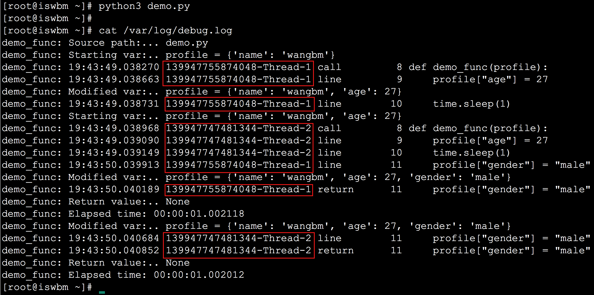


###  自定义对象的格式输出

`pysnooper.snoop()` 函数有一个参数是 `custom_repr`，它接收一个元组对象。

在这个元组里，你可以指定特定类型的对象以特定格式进行输出。


这边我举个例子。

假如我要跟踪 person 这个 Person 类型的对象，由于它不是常规的 Python 基础类型，PySnooper 是无法正常输出它的信息的。

因此我在 `pysnooper.snoop()` 函数中设置了 `custom_repr` 参数，该参数的第一个元素为 Person，第二个元素为 `print_persion_obj` 函数。

PySnooper 在打印对象的调试信息时，会逐个判断它是否是 Person 类型的对象，若是，就将该对象传入 `print_persion_obj` 函数中，由该函数来决定如何显示这个对象的信息。

```python
class Person:pass

def print_person_obj(obj):
    return f"<Person {obj.name} {obj.age} {obj.gender}>"
  
@pysnooper.snoop(custom_repr=(Person, print_person_obj))
def demo_func():
    ...
```


完整的代码如下

```python
import pysnooper

class Person:pass


def print_person_obj(obj):
    return f"<Person {obj.name} {obj.age} {obj.gender}>"

@pysnooper.snoop(custom_repr=(Person, print_person_obj))
def demo_func():
    person = Person()
    person.name = "写代码的明哥"
    person.age = 27
    person.gender = "male"

    return person

def main():
    profile = demo_func()

main()
```

运行一下，观察一下效果。

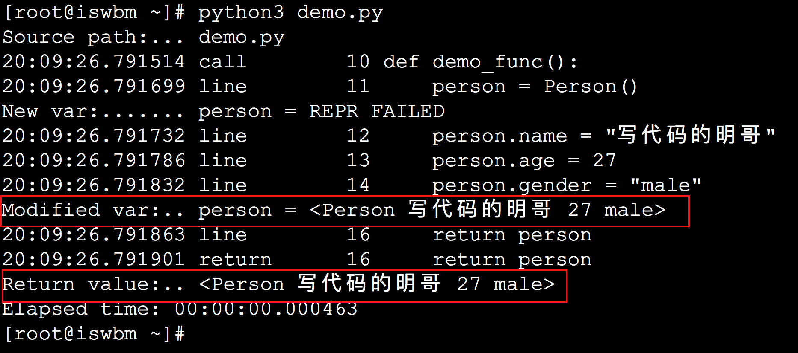


如果你要自定义格式输出的有很多个类型，那么 `custom_repr` 参数的值可以这么写

```python
@pysnooper.snoop(custom_repr=((Person, print_person_obj), (numpy.ndarray, print_ndarray)))
def demo_func():
    ...
```

还有一点我提醒一下，元组的第一个元素可以是类型（如类名Person 或者其他基础类型 list等），也可以是一个判断对象类型的函数。

也就是说，下面三种写法是等价的。

```python
# 【第一种写法】
@pysnooper.snoop(custom_repr=(Person, print_persion_obj))
def demo_func():
    ...


# 【第二种写法】
def is_persion_obj(obj):
    return isinstance(obj, Person)

@pysnooper.snoop(custom_repr=(is_persion_obj, print_persion_obj))
def demo_func():
    ...


# 【第三种写法】
@pysnooper.snoop(custom_repr=(lambda obj: isinstance(obj, Person), print_persion_obj))
def demo_func():
    ...
```


以上就是明哥今天给大家介绍的一款调试神器（`PySnooper`） 的详细使用手册，是不是觉得还不错？


#  比open更好用、更优雅的读取文件

使用 open 函数去读取文件，似乎是所有 Python 工程师的共识。

今天明哥要给大家推荐一个比 open 更好用、更优雅的读取文件方法 -- 使用 `fileinput` 

fileinput 是 Python 的内置模块，但我相信，不少人对它都是陌生的。今天我把 fileinput 的所有的用法、功能进行详细的讲解，并列举了一些非常实用的案例，对于理解和使用它可以说完全没有问题。

##  从标准输入中读取

当你的 Python 脚本没有传入任何参数时，fileinput 默认会以 stdin 作为输入源

```python
# demo.py
import fileinput

for line in fileinput.input():
    print(line) 
```

效果如下，不管你输入什么，程序会自动读取并再打印一次，像个复读机似的。

```shell
$ python demo.py 
hello
hello

python
python
```

##  单独打开一个文件

单独打开一个文件，只需要在 files 中输入一个文件名即可

```python
import fileinput

with fileinput.input(files=('a.txt',)) as file:
    for line in file:
        print(f'{fileinput.filename()} 第{fileinput.lineno()}行: {line}', end='') 
```

其中 `a.txt` 的内容如下

```
hello
world
```

执行后就会输出如下

```shell
$ python demo.py
a.txt 第1行: hello
a.txt 第2行: world
```

需要说明的一点是，`fileinput.input()` 默认使用 `mode='r'` 的模式读取文件，如果你的文件是二进制的，可以使用`mode='rb'` 模式。fileinput 有且仅有这两种读取模式。

##  批量打开多个文件

从上面的例子也可以看到，我在 `fileinput.input` 函数中传入了 `files` 参数，它接收一个包含多个文件名的列表或元组，传入一个就是读取一个文件，传入多件就是读取多个文件。

```python
import fileinput

with fileinput.input(files=('a.txt', 'b.txt')) as file:
    for line in file:
        print(f'{fileinput.filename()} 第{fileinput.lineno()}行: {line}', end='') 
```

`a.txt` 和 `b.txt` 的内容分别是

```shell
$ cat a.txt
hello
world
$ cat b.txt
hello
python
```

运行后输出结果如下，由于 `a.txt` 和 `b.txt` 的内容被整合成一个文件对象 `file` ，因此 `fileinput.lineno()` 只有在读取一个文件时，才是原文件中真实的行号。

```shell
$ python demo.py
a.txt 第1行: hello
a.txt 第2行: world
b.txt 第3行: hello
b.txt 第4行: python
```

如果想要在读取多个文件的时候，也能读取原文件的真实行号，可以使用 `fileinput.filelineno()` 方法

```python
import fileinput

with fileinput.input(files=('a.txt', 'b.txt')) as file:
    for line in file:
        print(f'{fileinput.filename()} 第{fileinput.filelineno()}行: {line}', end='') 
```

运行后，输出如下

```shell
$ python demo.py
a.txt 第1行: hello
a.txt 第2行: world
b.txt 第1行: hello
b.txt 第2行: python
```

这个用法和 glob 模块简直是绝配

```python
import fileinput
import glob
 
for line in fileinput.input(glob.glob("*.txt")):
    if fileinput.isfirstline():
        print('-'*20, f'Reading {fileinput.filename()}...', '-'*20)
    print(str(fileinput.lineno()) + ': ' + line.upper(), end="")
```

运行效果如下

```python
$ python demo.py
-------------------- Reading b.txt... --------------------
1: HELLO
2: PYTHON
-------------------- Reading a.txt... --------------------
3: HELLO
4: WORLD
```

##  读取的同时备份文件

`fileinput.input` 有一个 backup 参数，你可以指定备份的后缀名，比如 `.bak`

```python
import fileinput


with fileinput.input(files=("a.txt",), backup=".bak") as file:
    for line in file:
        print(f'{fileinput.filename()} 第{fileinput.lineno()}行: {line}', end='') 
```

运行的结果如下，会多出一个 `a.txt.bak` 文件

```shell
$ ls -l a.txt*
-rw-r--r--  1 MING  staff  12  2 27 10:43 a.txt

$ python demo.py
a.txt 第1行: hello
a.txt 第2行: world

$ ls -l a.txt*
-rw-r--r--  1 MING  staff  12  2 27 10:43 a.txt
-rw-r--r--  1 MING  staff  42  2 27 10:39 a.txt.bak
```

##  标准输出重定向替换

`fileinput.input` 有一个 inplace 参数，表示是否将标准输出的结果写回文件，默认不取代

请看如下一段测试代码

```python
import fileinput

with fileinput.input(files=("a.txt",), inplace=True) as file:
    print("[INFO] task is started...") 
    for line in file:
        print(f'{fileinput.filename()} 第{fileinput.lineno()}行: {line}', end='') 
    print("[INFO] task is closed...") 
```

运行后，会发现在 for 循环体内的 print 内容会写回到原文件中了。而在 for 循环体外的 print 则没有变化。

```shell
$ cat a.txt
hello
world

$ python demo.py
[INFO] task is started...
[INFO] task is closed...

$ cat a.txt 
a.txt 第1行: hello
a.txt 第2行: world
```

利用这个机制，可以很容易的实现文本替换。

```python
import sys
import fileinput

for line in fileinput.input(files=('a.txt', ), inplace=True):
    #将Windows/DOS格式下的文本文件转为Linux的文件
    if line[-2:] == "\r\n":  
        line = line + "\n"
    sys.stdout.write(line)
```

附：如何实现 DOS 和 UNIX 格式互换以供程序测试，使用 vim 输入如下指令即可

```
DOS转UNIX：:setfileformat=unix
UNIX转DOS：:setfileformat=dos
```

##  不得不介绍的方法

如果只是想要 `fileinput` 当做是替代 open 读取文件的工具，那么以上的内容足以满足你的要求。

- `fileinput.filenam()`
    返回当前被读取的文件名。 在第一行被读取之前，返回 `None`。

- `fileinput.fileno()`
    返回以整数表示的当前文件“文件描述符”。 当未打开文件时（处在第一行和文件之间），返回 `-1`。

- `fileinput.lineno()`
    返回已被读取的累计行号。 在第一行被读取之前，返回 `0`。 在最后一个文件的最后一行被读取之后，返回该行的行号。

- `fileinput.filelineno()`
    返回当前文件中的行号。 在第一行被读取之前，返回 `0`。 在最后一个文件的最后一行被读取之后，返回此文件中该行的行号。

但若要想基于 fileinput 来做一些更加复杂的逻辑，也许你会需要用到如下这几个方法

- `fileinput.isfirstline()`
    如果刚读取的行是其所在文件的第一行则返回 `True`，否则返回 `False`。
- `fileinput.isstdin()`
    如果最后读取的行来自 `sys.stdin` 则返回 `True`，否则返回 `False`。
- `fileinput.nextfile()`
    关闭当前文件以使下次迭代将从下一个文件（如果存在）读取第一行；不是从该文件读取的行将不会被计入累计行数。 直到下一个文件的第一行被读取之后文件名才会改变。 在第一行被读取之前，此函数将不会生效；它不能被用来跳过第一个文件。 在最后一个文件的最后一行被读取之后，此函数将不再生效。
- `fileinput.close()`
    关闭序列。

##  进阶一点的玩法

在 `fileinput.input()` 中有一个 `openhook` 的参数，它支持用户传入自定义的对象读取方法。

若你没有传入任何的勾子，fileinput 默认使用的是 open 函数。

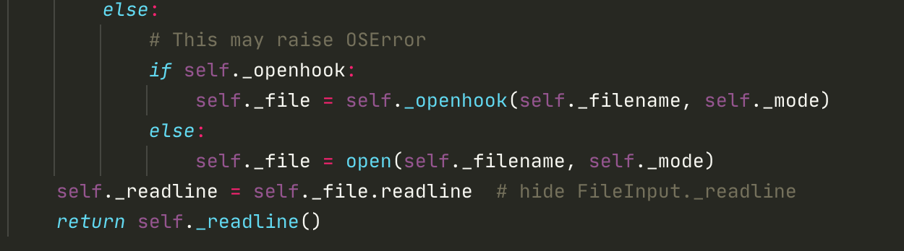

`fileinput`  为我们内置了两种勾子供你使用

1. `fileinput.hook_compressed(*filename*, *mode*)`

    使用 `gzip` 和 `bz2` 模块透明地打开 gzip 和 bzip2 压缩的文件（通过扩展名 `'.gz'` 和 `'.bz2'` 来识别）。 如果文件扩展名不是 `'.gz'` 或 `'.bz2'`，文件会以正常方式打开（即使用 [`open()`](https://docs.python.org/zh-cn/3/library/functions.html#open) 并且不带任何解压操作）。使用示例: `fi = fileinput.FileInput(openhook=fileinput.hook_compressed)`

2. `fileinput.hook_encoded(*encoding*, *errors=None*)`

  返回一个通过 `open()` 打开每个文件的钩子，使用给定的 *encoding* 和 *errors* 来读取文件。使用示例: `fi = fileinput.FileInput(openhook=fileinput.hook_encoded("utf-8", "surrogateescape"))`

如果你自己的场景比较特殊，以上的三种勾子都不能满足你的要求，你也可以自定义。

这边我举个例子来抛砖引玉下

假如我想要使用 fileinput 来读取网络上的文件，可以这样定义勾子。

1.  先使用 requests 下载文件到本地
2.  再使用 open 去读取它

```python
def online_open(url, mode):
    import requests
    r = requests.get(url) 
    filename = url.split("/")[-1]
    with open(filename,'w') as f1:
        f1.write(r.content.decode("utf-8"))
    f2 = open(filename,'r')
    return f2
```

直接将这个函数传给 openhook 即可

```python
import fileinput

file_url = 'https://www.csdn.net/robots.txt'
with fileinput.input(files=(file_url,), openhook=online_open) as file:
    for line in file:
        print(line, end="")
```

运行后按预期一样将 CSDN 的 robots 的文件打印了出来

```
User-agent: * 
Disallow: /scripts 
Disallow: /public 
Disallow: /css/ 
Disallow: /images/ 
Disallow: /content/ 
Disallow: /ui/ 
Disallow: /js/ 
Disallow: /scripts/ 
Disallow: /article_preview.html* 
Disallow: /tag/
Disallow: /*?*
Disallow: /link/

Sitemap: https://www.csdn.net/sitemap-aggpage-index.xml
Sitemap: https://www.csdn.net/article/sitemap.txt 
```


##  列举一些实用案例

**案例一**：读取一个文件所有行

```python
import fileinput
for line in fileinput.input('data.txt'):
  print(line, end="")
```

**案例二**：读取多个文件所有行

```python
import fileinput
import glob
 
for line in fileinput.input(glob.glob("*.txt")):
    if fileinput.isfirstline():
        print('-'*20, f'Reading {fileinput.filename()}...', '-'*20)
    print(str(fileinput.lineno()) + ': ' + line.upper(), end="")
```

**案例三**：利用fileinput将CRLF文件转为LF

```python
import sys
import fileinput

for line in fileinput.input(files=('a.txt', ), inplace=True):
    #将Windows/DOS格式下的文本文件转为Linux的文件
    if line[-2:] == "\r\n":  
        line = line + "\n"
    sys.stdout.write(line)
```

**案例四**：配合 re 做日志分析：取所有含日期的行

```python
#--样本文件--：error.log
aaa
1970-01-01 13:45:30  Error: **** Due to System Disk spacke not enough...
bbb
1970-01-02 10:20:30  Error: **** Due to System Out of Memory...
ccc
 
#---测试脚本---
import re
import fileinput
import sys
 
pattern = '\d{4}-\d{2}-\d{2} \d{2}:\d{2}:\d{2}'
 
for line in fileinput.input('error.log',backup='.bak',inplace=1):
    if re.search(pattern,line):
        sys.stdout.write("=> ")
        sys.stdout.write(line)
 
#---测试结果---
=> 1970-01-01 13:45:30  Error: **** Due to System Disk spacke not enough...
=> 1970-01-02 10:20:30  Error: **** Due to System Out of Memory...
```

**案例五**：利用fileinput实现类似于grep的功能

```python
import sys
import re
import fileinput
 
pattern= re.compile(sys.argv[1])
for line in fileinput.input(sys.argv[2]):
    if pattern.match(line):
        print(fileinput.filename(), fileinput.filelineno(), line)

$ ./demo.py import.*re *.py
#查找所有py文件中，含import re字样的
addressBook.py  2   import re
addressBook1.py 10  import re
addressBook2.py 18  import re
test.py         238 import re
```

##  写在最后

fileinput 是 Python 的内置模块，但我相信，不少人对它都是陌生的。今天我把 fileinput 的所有的用法、功能进行详细的讲解，并列举了一些非常实用的案例，对于理解和使用它可以说完全没有问题。

fileinput 是对 open 函数的再次封装，在仅需读取数据的场景中， fileinput 显然比 open 做得更专业、更人性，当然在其他有写操作的复杂场景中，fileinput 就无能为力啦，本身从 fileinput 的命名上就知道这个模块只专注于输入（读）而不是输出（写）。


#  像操作路径一样，操作嵌套字典

在使用前先安装它，要注意的是该模块只能在 Python 3.8+ 中使用

```shell
$ python3 -m pip install dpath
```

下边是一个简单的使用案例

```python
import dpath.util

data = {
    "foo": {
        "bar": {
        "a": 10,
        "b": 20,
        "c": [],
        "d": ['red', 'buggy', 'bumpers'],
        }
    }
}

print(dpath.util.get(data, "/foo/bar/d"))
```

使用 `[ab]` 会把 键为 `a` 和 `b` 的都筛选出来

```python
print(dpath.util.search(data, "/foo/bar/[ab]"))
# output: {'foo': {'bar': {'a': 10, 'b': 20}}}
```

获取所有匹配的键值对的 value 值列表

```python
print(dpath.util.values(data, "/foo/bar/*"))
# output: [10, 20, [], ['red', 'buggy', 'bumpers']]
```


更多案例，请前往 [官方文档](https://pypi.org/project/dpath/) 查阅。


#  读取文件中任意行的数据

`linecache` 是 Python 中的一个内置模块。

它允许从任何文件中获取任意行，同时尝试使用缓存进行内部优化，这是一种常见的情况，即从单个文件读取多行。它被`traceback`模块用来检索包含在格式化回溯中的源代码行。

这是一个简单的例子。

```python
>>> import linecache
>>> linecache.getline('/etc/passwd', 4)
'sys:x:3:3:sys:/dev:/bin/sh\n'
```

如果你指定的行数超过了文件原有的行数，该函数也不会抛出错误，而是返回空字符串。

```python
>>> import linecache
>>> linecache.getline('/etc/passwd', 10000)

>>>
```


#  让你的装饰器写得更轻松的神库

本篇文章会为你介绍的是一个已经存在十三年，但是依旧不红的库 decorator，好像很少有人知道他的存在一样。

这个库可以帮你做什么呢 ？

其实很简单，就是可以帮你更方便地写python装饰器代码，更重要的是，它让 Python 中被装饰器装饰后的方法长得更像装饰前的方法。

本篇文章不会过多的向你介绍装饰器的基本知识，我会默认你知道什么是装饰器，并且懂得如何写一个简单的装饰器。

不了解装饰器的可以先去阅读我之前写的文章，非常全且详细的介绍了装饰器的各种实现方法。

##  常规的装饰器

下面这是一个最简单的装饰器示例，在运行 `myfunc` 函数的前后都会打印一条日志。

```python
def deco(func):
    def wrapper(*args, **kw):
        print("Ready to run task")
        func(*args, **kw)
        print("Successful to run task")
    return wrapper

@deco
def myfunc():
    print("Running the task")

myfunc()
```

装饰器使用起来，似乎有些高端和魔幻，对于一些重复性的功能，往往我们会封装成一个装饰器函数。

在定义一个装饰器的时候，我们都需要像上面一样机械性的写一个嵌套的函数，对装饰器原理理解不深的初学者，往往过段时间就会忘记如何定义装饰器。

有一些比较聪明的同学，会利用 PyCharm 来自动生成装饰器模板

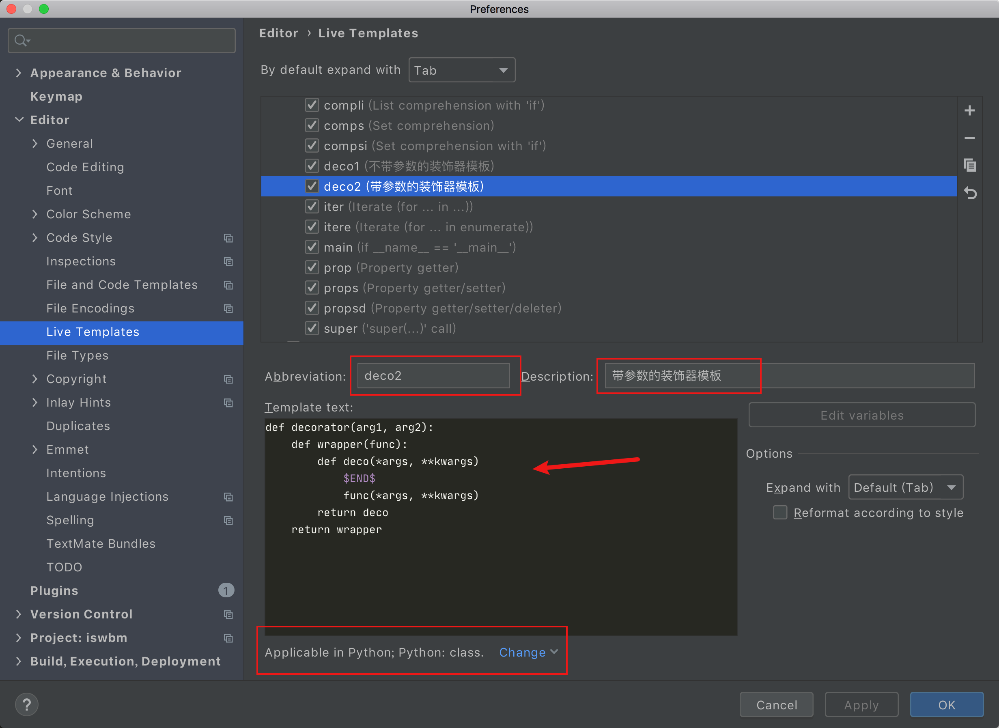

然后要使用的时候，直接敲入 `deco` 就会生成一个简单的生成器代码，提高编码的准备效率

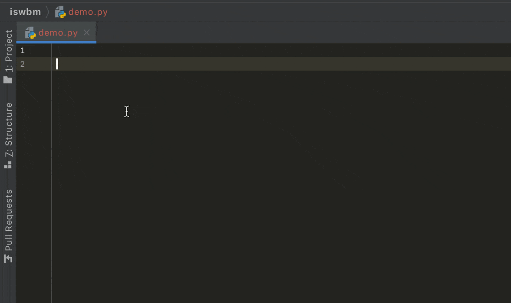

##  使用神库

使用 PyCharm 的 Live Template ，虽然能降低编写装饰器的难度，但却要依赖 PyCharm 这一专业的代码编辑器。

这里，明哥要教你一个更加简单的方法，使用这个方法呢，你需要先安装一个库 ： `decorator`，使用 pip 可以很轻易地去安装它

```shell
$ python3 -m pip install decorator
```

从库的名称不难看出，这是一个专门用来解决装饰器问题的第三方库。

有了它之后，你会惊奇的发现，以后自己定义的装饰器，就再也不需要写嵌套的函数了

```python
from decorator import decorator

@decorator
def deco(func, *args, **kw):
    print("Ready to run task")
    func(*args, **kw)
    print("Successful to run task")

@deco
def myfunc():
    print("Running the task")

myfunc()
```

deco 作为装饰函数，第一个参数是固定的，都是指被装饰函数，而后面的参数都固定使用 可变参数 `*args` 和 `**kw` 的写法，代码被装饰函数的原参数。

这种写法，不得不说，更加符合直觉，代码的逻辑也更容易理解。

##  带参数的装饰器可用？

装饰器根据有没有携带参数，可以分为两种

**第一种**：不带参数，最简单的示例，上面已经举例

```python
def decorator(func):
    def wrapper(*args, **kw):
        func(*args, **kw)
    return wrapper
```

**第二种**：带参数，这就相对复杂了，理解起来了也不是那么容易。

```python
def decorator(arg1, arg2):
    def wrapper(func):
        def deco(*args, **kwargs)
            func(*args, **kwargs)
        return deco
    return wrapper
```

那么对于需要带参数的装饰器，`decorator` 是否也一样能很好的支持呢？

下面是一个官方的示例

```python
from decorator import decorator

@decorator
def warn_slow(func, timelimit=60, *args, **kw):
    t0 = time.time()
    result = func(*args, **kw)
    dt = time.time() - t0
    if dt > timelimit:
        logging.warn('%s took %d seconds', func.__name__, dt)
    else:
        logging.info('%s took %d seconds', func.__name__, dt)
    return result
  
@warn_slow(timelimit=600)  # warn if it takes more than 10 minutes
def run_calculation(tempdir, outdir):
    pass
```

可以看到

-   装饰函数的第一个参数，还是被装饰器 func ，这个跟之前一样
-   而第二个参数 timelimit 写成了位置参数的写法，并且有默认值
-   再往后，就还是跟原来一样使用了可变参数的写法

不难推断，只要你在装饰函数中第二个参数开始，使用了非可变参数的写法，这些参数就可以做为装饰器调用时的参数。

##  签名问题有解决？

我们在自己写装饰器的时候，通常都会顺手加上一个叫 `functools.wraps` 的装饰器，我想你应该也经常见过，那他有啥用呢？

先来看一个例子

```python
def wrapper(func):
    def inner_function():
        pass
    return inner_function

@wrapper
def wrapped():
    pass

print(wrapped.__name__)
#inner_function
```

为什么会这样子？不是应该返回 `func ` 吗？

这也不难理解，因为上边执行`func` 和下边 `decorator(func)`  是等价的，所以上面 `func.__name__` 是等价于下面`decorator(func).__name__` 的，那当然名字是 `inner_function`

```python
def wrapper(func):
    def inner_function():
        pass
    return inner_function

def wrapped():
    pass

print(wrapper(wrapped).__name__)
#inner_function
```

目前，我们可以看到当一个函数被装饰器装饰过后，它的签名信息会发生变化（譬如上面看到的函数名）

那如何避免这种情况的产生？

**解决方案就是使用我们前面所说的 functools .wraps 装饰器。**

它的作用就是将 被修饰的函数(wrapped) 的一些属性值赋值给 修饰器函数(wrapper) ，最终让属性的显示更符合我们的直觉。

```python
from functools import wraps

def wrapper(func):
    @wraps(func)
    def inner_function():
        pass
    return inner_function

@wrapper
def wrapped():
    pass

print(wrapped.__name__)
# wrapped
```

那么问题就来了，我们使用了 decorator 之后，是否还会存在这种签名的问题呢？

写个例子来验证一下就知道啦

```python
from decorator import decorator

@decorator
def deco(func, *args, **kw):
    print("Ready to run task")
    func(*args, **kw)
    print("Successful to run task")

@deco
def myfunc():
    print("Running the task")

print(myfunc.__name__)
```

输出的结果是 `myfunc`，说明 `decorator` 已经默认帮我们处理了一切可预见的问题。 

##  总结一下

`decorator` 是一个提高装饰器编码效率的第三方库，它适用于对装饰器原理感到困惑的新手，可以让你很轻易的写出更符合人类直觉的代码。对于带参数装饰器的定义，是非常复杂的，它需要要写多层的嵌套函数，并且需要你熟悉各个参数的传递路径，才能保证你写出来的装饰器可以正常使用。这时候，只要用上 `decorator` 这个库，你就可以很轻松的写出一个带参数的装饰器。同时你也不用担心他会出现签名问题，这些它都为你妥善的处理好了。

这么棒的一个库，推荐你使用起来。

#  国际化模块，让翻译更优雅

## 国际化与本地化

国际化 （internationalization），简称 **i18n** 

很多人并不知道，为什么要叫 i18n 呢？怎么谐音都不对。

实际上 18 是指在 ”internationalization” 这个单词中，i 和 n之间有18个字母。


而与之相对的，本地化（localization），简称 L10 n，10 就是指在 ”localization”这个单词中，l 和 n 之间有10个字母

本地化是指使一个国际化的软件为了在某个特定地区使用而进行实际翻译的过程。

国际化的软件具备这样一种能力，当软件被移植到不同的语言及地区时，软件本身不用做内部工程上的改变或修正。

## gettext 模块

gettext 是一套 GNU下的国际化工具。主要有工具：

-   xgettext: 从源码中抽取字符串，生成po文件(portable object)
-   msgfmt: 将po文件编译成mo文件(machine object)
-   gettext: 进行翻译，如果找不到gettext命令，或者找不到msgfmt命令。请重新安装一遍gettext套件。


很多系统中都内置了 gettext 模块

如果你在 ubuntu系统中，可能需要如下命令进行安装

```
sudo apt-get install gettext
```

## 简单示例演示

首先新建一个目录

```shell
$ mkdir -p locale/zh_CN/LC_MESSAGES
```

然后在这个目录下新建一个 `hello.po` 文件

```
msgid "hello world"
msgstr "你好世界"
```

然后执行如下一条命令，将 po 文件翻译成 mo文件

```shell
$ msgfmt locale/zh_CN/LC_MESSAGES/hello.po -o locale/zh_CN/LC_MESSAGES/hello.mo
```

然后在 local 同级目录下进入 Console 模式，就可以使用 `_` 进行翻译了，为什么 `_` 能这么用，原因是 `zh.install() ` 这个调用将其绑定到了 Python 内建命名空间中，以便在应用程序的所有模块中轻松访问它。

```python
>>> import gettext
>>> zh = gettext.translation("hello", "locale", languages=["zh_CN"])
>>> zh.install()
>>> _('hello world')
'你好世界'
```


#  非常好用的调度模块

Python 自带一个调度器模块`sched`，它能为你实现优先级队列/延迟队列和定时队列。

这个模块的使用非常简单，首先以延迟队列为例：

```python
import sched

def do_work(name):
    print(f'你好：{name}')

sch = sched.scheduler()
sch.enter(5, 1, do_work, argument=('iswbm', ))
sch.run()
```

代码运行以后，会卡在`sch.run()`这里，5秒钟以后执行`do_work('iswbm')`，运行效果如下图所示：

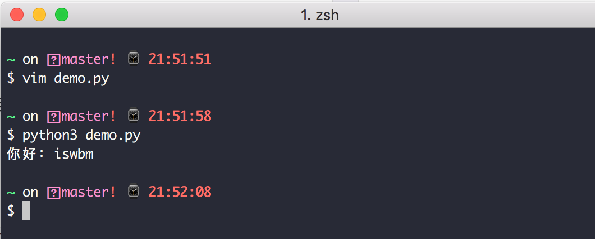

其中，`sch.enter()`的第一个参数为延迟的时间，单位为秒，第二个参数为优先级，数字越小优先级越高。当两个任务同时要执行时，优先级高的先执行。但需要注意的是，如果你这样写：

```python
import sched

def do_work(name):
    print(f'你好：{name}')

sch = sched.scheduler()
sch.enter(5, 2, do_work, argument=('python', ))
sch.enter(5, 1, do_work, argument=('iswbm', ))
sch.run()
```

那么先打印出来的是`你好：python` 

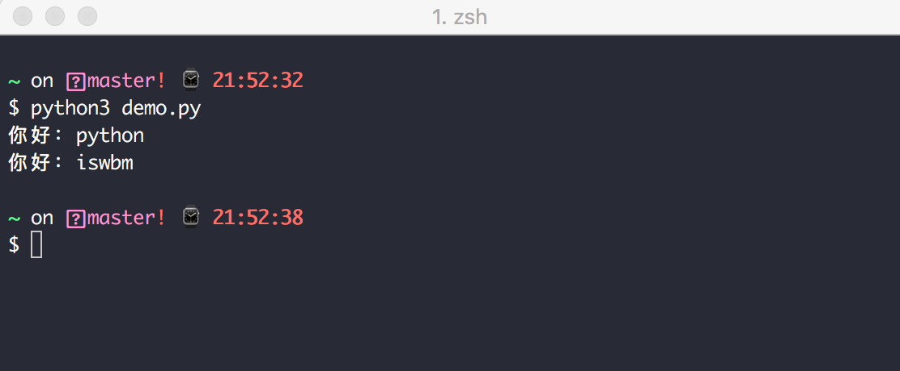

为什么这里优先级失效了？1的优先级大于2，应该先运行下面的才对啊。

这是由于，只有当两个任务同时运行的时候，才会去检查优先级。如果两个任务触发的时间一前一后，那么还轮不到比较优先级。由于延迟队列的`延迟`是相对于当前运行这一行代码的时间来计算的，后一行代码比前一行代码晚了几毫秒，所以实际上产品经理这一行会先到时间，所以就会先运行。

为了使用绝对的精确时间，我们可以使用另外一个方法：

```python
import sched
import time
import datetime

def do_work(name):
    print(f'你好：{name}')

sch = sched.scheduler(time.time, time.sleep)
start_time = datetime.datetime.now() + datetime.timedelta(seconds=10)
start_time_ts = start_time.timestamp()
sch.enterabs(start_time_ts, 2, do_work, argument=('python', ))
sch.enterabs(start_time_ts, 1, do_work, argument=('iswbm', ))
sch.run()
```

运行效果如下图所示：

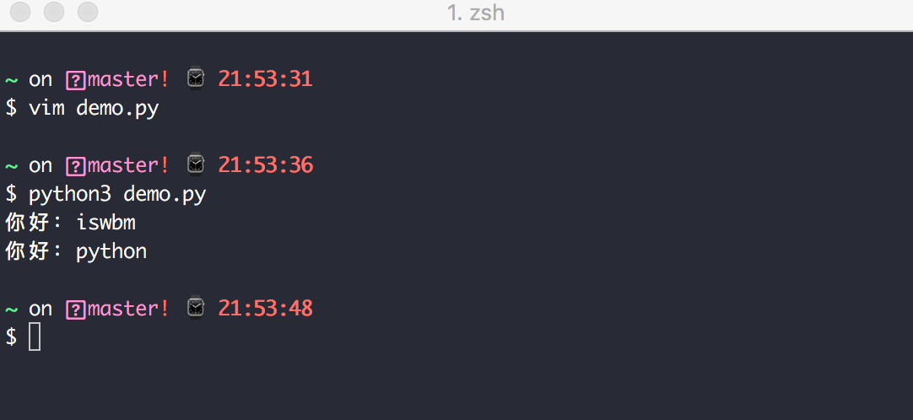

`sch.enterabs()`的第一个参数是任务开始时间的时间戳，这是一个绝对时间，这个时间可以使用datetime模块来生成，或者其他你熟悉的方式。后面的参数和`sch.enter()`完全一样。

如果你要运行的函数带有多个参数或者默认参数，那么可以使用下面的方式传入参数：

```python
import sched
import time
import datetime

def do_work(name, place, work='写代码'):
    print(f'你好：{name}，你在：{place}{work}')

sch = sched.scheduler(time.time, time.sleep)
start_time = datetime.datetime.now() + datetime.timedelta(seconds=10)
start_time_ts = start_time.timestamp()
sch.enter(5, 2, do_work, argument=('产品经理', '杭州'), kwargs={'work': '写需求文档'})
sch.enterabs(start_time_ts, 1, do_work, argument=('开发人员', '产品经理旁边'), kwargs={'work': '看着她'})
sch.run()
```

argument参数对应的元组存放普通参数，kwargs对应的字典存放带参数名的参数。

本文来源于：公众号"未闻Code"，作者：kingname


#  实现字典的点式操作

字典是 Python 中基础的数据结构之一，字典的使用，可以说是非常的简单粗暴，但即便是这样一个与世无争的数据结构，仍然有很多人 "用不惯它" 。

也许你并不觉得，但我相信，你看了这篇文章后，一定会和我一样，对原生字典开始有了偏见。

我举个简单的例子吧

当你想访问字典中的某个 key 时，你需要使用字典特定的访问方式，而这种方式需要你键入 一对中括号 还有 一对引号

```python
>>> profile = dict(name="iswbm")
>>> profile
{'name': 'iswbm'}
>>> profile["name"]
'iswbm'
```

是不是开始觉得忍无可忍了？

如果可以像调用对象属性一样使用 `.` 去访问 key 就好了，可以省去很多多余的键盘击入，就像这样子

```python
>>> profile.name
'iswbm'
```

是的，今天这篇文章就是跟大家分享一种可以直接使用 `.` 访问和操作字典的一个黑魔法库 -- `munch`。

##  安装方法

使用如下命令进行安装

```shell
$ python -m pip install munch
```

##  简单示例

munch 有一个 Munch 类，它继承自原生字典，使用 isinstance 可以验证

```python
>>> from munch import Munch
>>> profile = Munch()
>>> isinstance(profile, dict)
True
>>>
```

并实现了点式赋值与访问，`profile.name` 与 `profile['name']` 是等价的

```python
>>> profile.name = "iswbm"
>>> profile.age = 18
>>> profile
Munch({'name': 'iswbm', 'age': 18})
>>>
>>> profile.name
'iswbm'
>>> profile["name"]
'iswbm'
```

##  兼容字典的所有操作

本身 Munch 继承自 dict，dict 的操作也同样适用于 Munch 对象，不妨再来验证下

首先是：增删改查

```python
# 新增元素
>>> profile["gender"] = "male"
>>> profile
Munch({'name': 'iswbm', 'age': 18, 'gender': 'male'})

# 修改元素
>>> profile["gender"] = "female"
>>> profile
Munch({'name': 'iswbm', 'age': 18, 'gender': 'female'})

# 删除元素
>>> profile.pop("gender")
'female'
>>> profile
Munch({'name': 'iswbm', 'age': 18})
>>>
>>> del profile["age"]
>>> profile
Munch({'name': 'iswbm'})
```

再者是：一些常用方法

```python
>>> profile.keys()
dict_keys(['name'])
>>>
>>> profile.values()
dict_values(['iswbm'])
>>>
>>> profile.get('name')
'iswbm'
>>> profile.setdefault('gender', 'male')
'male'
>>> profile
Munch({'name': 'iswbm', 'gender': 'male'})
```

##  设置返回默认值

当访问一个字典中不存在的 key 时，会报 KeyError 的错误

```python
>>> profile = {}
>>> profile["name"]
Traceback (most recent call last):
  File "<stdin>", line 1, in <module>
KeyError: 'name'
```

对于这种情况，通常我们会使用 get 来规避

```python
>>> profile = {}
>>> profile.get("name", "undefined")
'undefined'
```

当然你在 munch 中仍然可以这么用，不过还有一种更好的方法：使用 DefaultMunch，它会在你访问不存在的 key 时，给你返回一个设定好的默认值

```python
>>> from munch import DefaultMunch
>>> profile = DefaultMunch("undefined", {"name": "iswbm"})
>>> profile
DefaultMunch('undefined', {'name': 'iswbm'})
>>> profile.age
'undefined'
>>> profile
DefaultMunch('undefined', {'name': 'iswbm'})
```

##  工厂函数自动创建key

上面使用 `DefaultMunch ` 仅当你访问不存在的 key 是返回一个默认值，但这个行为并不会修改原 munch 对象的任何内容。

若你想访问不存在的 key 时，自动触发给原 munch 中新增你想要访问的 key ，并为其设置一个默认值，可以试一下 `DefaultFactoryMunch` 传入一个工厂函数。

```python
>>> from munch import DefaultFactoryMunch
>>> profile = DefaultFactoryMunch(list, name='iswbm')
>>> profile
DefaultFactoryMunch(list, {'name': 'iswbm'})
>>>
>>> profile.brothers
[]
>>> profile
DefaultFactoryMunch(list, {'name': 'iswbm', 'brothers': []})
```

##  序列化的支持

Munch 支持序列化为 JSON 或者 YAML 格式的字符串对象

**转换成 JSON**

```python
>>> from munch import Munch
>>> munch_obj = Munch(foo=Munch(lol=True), bar=100, msg='hello')
>>>
>>> import json
>>> json.dumps(munch_obj)
'{"foo": {"lol": true}, "bar": 100, "msg": "hello"}'
```

**转换成 YAML**

```python
>>> from munch import Munch
>>> munch_obj = Munch(foo=Munch(lol=True), bar=100, msg='hello')
>>> import yaml
>>> yaml.dump(munch_obj)
'!munch.Munch\nbar: 100\nfoo: !munch.Munch\n  lol: true\nmsg: hello\n'
>>>
>>> print(yaml.dump(munch_obj))
!munch.Munch
bar: 100
foo: !munch.Munch
  lol: true
msg: hello

>>>
```

建议使用 `safe_dump` 去掉 `!munch.Munch`

```python
>>> print(yaml.safe_dump(munch_obj))
bar: 100
foo:
  lol: true
msg: hello
```


##  说说局限性

以上就是关于 munch 的使用全解，munch 的进一步封装使得数据的访问及操作更得更加 Pythonic ，替换原生字典在大部分场景下都不会有太大问题。

但同时也不得不承认，munch 在一些场景下无法达到原生字典的效果，比如我想字典里的 key 为 `"1.2"` 的时候，原生字典能很好的表示它。

```python
>>> dict_obj = {"1.2": "hello"}
>>> dict_obj["1.2"]
'hello'
```

切换到 munch ，你会发现无法在初始化 munch 对象的时候，传入 1.2 的 key

```python
>>> from munch import Munch
>>> dict_obj = Munch(1.2="hello")
  File "<stdin>", line 1
    dict_obj = Munch(1.2="hello")
                     ^
SyntaxError: expression cannot contain assignment, perhaps you meant "=="?
```

就算你用原生的字典的方式添加了这个 key-value，也根本无法使用 `.` 的方式取到 `1.2` 对应的 value。

```python
>>> from munch import Munch
>>> dict_obj = Munch()
>>> dict_obj["1.2"]="hello"
>>> dict_obj
Munch({'1.2': 'hello'})
>>> dict_obj.1.2
  File "<stdin>", line 1
    dict_obj.1.2
            ^
SyntaxError: invalid syntax
```

也正是因为这样，原生字典至今还是不可替代的存在。
