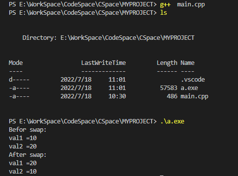
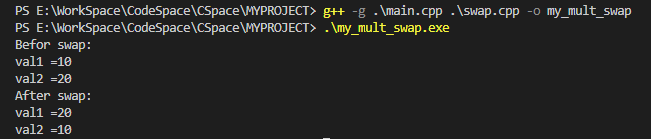
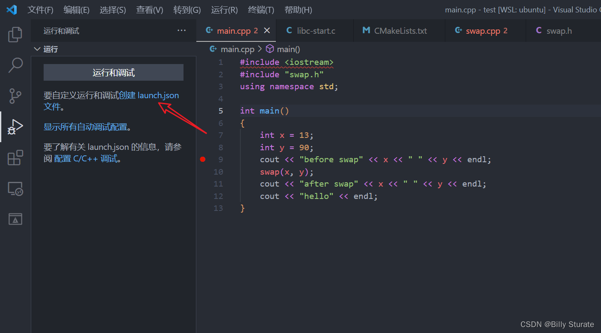
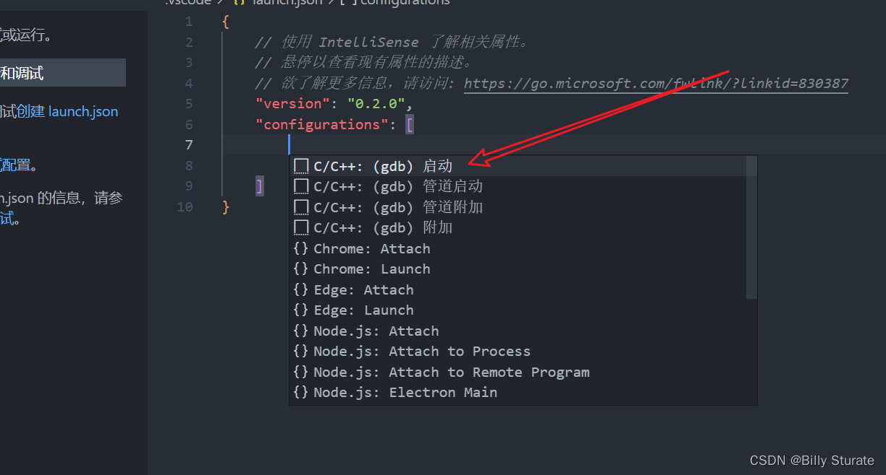
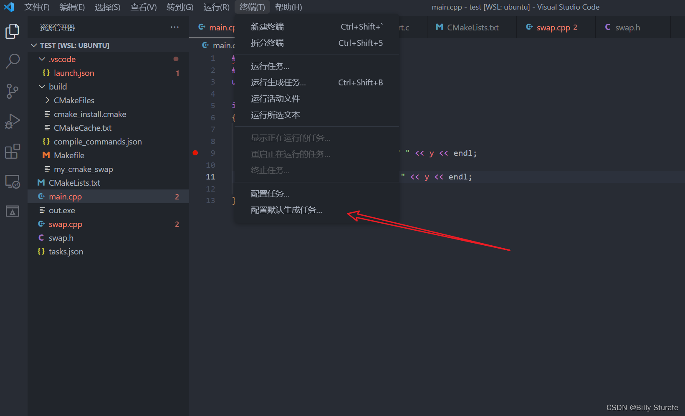
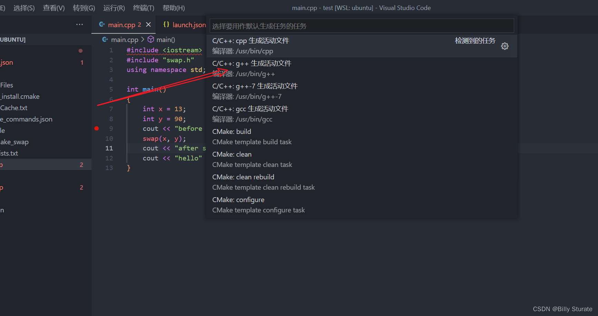
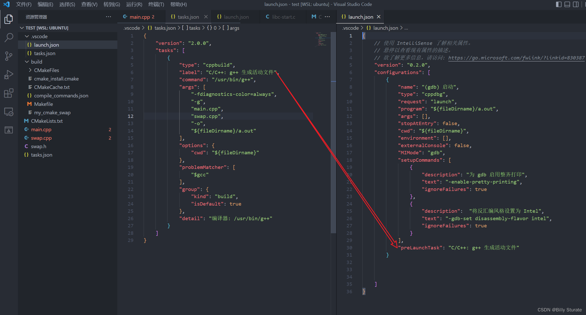

# 开发环境搭建

## mingw-w64编译器

mingw-w64编译器（GCC forWindows 64 & 32 bits)

设置环境变量，检测是否成功。

## VScode插件安装

- C/C++
- cmake
- cmake tools

# 基于命令行实战

## 基于g++命令

创建文件夹MYPROJECT

### g++编译单文件

新建文件main.cpp

```c++
#include <iostream>
using namespace std;

void swap(int &a, int &b)
{
    int temp;
    temp = a;
    a = b;
    b = temp;
}

int main(int argc, char **argv)
{
    int val1 = 10;
    int val2 = 20;

    cout << "Befor swap:" << endl;
    cout << "val1 =" << val1 << endl;
    cout << "val2 =" << val2 << endl;
    swap(val1, val2);
    cout << "After swap:" << endl;
    cout << "val1 =" << val1 << endl;
    cout << "val2 =" << val2 << endl;

    return 0;
}
```

1. 不带调试信息

```shell
g++ main.cpp
```

自动生成a.exe可执行文件

```shell
./a.exe
```



2. 带调试信息

```shell
g++ -g main.cpp -o my_single_swap
```

自动生成my_single_swap可执行文件

```
.\my_single_swap.exe
```


### g++编译多文件

新建main.cpp

```c++
#include <iostream>
#include "swap.h"
using namespace std;

int main(int argc, char **argv)
{
    int val1 = 10;
    int val2 = 20;

    cout << "Befor swap:" << endl;
    cout << "val1 =" << val1 << endl;
    cout << "val2 =" << val2 << endl;
    swap(val1, val2);
    cout << "After swap:" << endl;
    cout << "val1 =" << val1 << endl;
    cout << "val2 =" << val2 << endl;

    return 0;
}

```

新建swap.cpp文件

```c++
#include "swap.h"
void swap(int &a, int &b)
{
    int temp;
    temp = a;
    a = b;
    b = temp;
}
```

新建swap.h文件

```c++
void swap(int &a, int &b);
```

终端执行：

```shell
g++ -g main.cpp swap.cpp -o my_multi_swap
```

```
.\my_mult_swap.exe
```




---

**调试：**

1. 命令行方式

```shell
g++ -g main.cpp swap.cpp -o main
```

2. 文件配置方式

修改launch.json

```json
{
    // 使用 IntelliSense 了解相关属性。 
    // 悬停以查看现有属性的描述。
    // 欲了解更多信息，请访问: https://go.microsoft.com/fwlink/?linkid=830387
    "version": "0.2.0",
    "configurations": [
        {
            "name": "(gdb) 启动",
            "type": "cppdbg",
            "request": "launch",
            "program": "${fileDirname}\\${fileBasenameNoExtension}.exe",
            "args": [],
            "stopAtEntry": false,
            "cwd": "${fileDirname}",
            "environment": [],
            "externalConsole": false,
            "MIMode": "gdb",
            "setupCommands": [
                {
                    "description": "为 gdb 启用整齐打印",
                    "text": "-enable-pretty-printing",
                    "ignoreFailures": true
                },
                {
                    "description":  "将反汇编风格设置为 Intel",
                    "text": "-gdb-set disassembly-flavor intel",
                    "ignoreFailures": true
                }
            ],
            "preLaunchTask":"Build"
        }
    ]
}
```

修改tasks.json文件，**添加"main.cpp", "swap.cpp"**

```json
{
	"version": "2.0.0",
	"tasks": [
		{
			"type": "cppbuild",
			"label": "Build",
			"command": "D:\\developer_tools\\mingw64\\bin\\g++.exe",
			"args": [
				"-fdiagnostics-color=always",
				"-g",
				"main.cpp",
				"swap.cpp",
				"-o",
				"${fileDirname}\\${fileBasenameNoExtension}.exe"
			],
			"options": {
				"cwd": "${fileDirname}"
			},
			"problemMatcher": [
				"$gcc"
			],
			"group": {
				"kind": "build",
				"isDefault": true
			},
			"detail": "编译器: D:\\developer_tools\\mingw64\\bin\\g++.exe"
		}
	]
}
```


## 基于cmake

编写简单CMakeLists.txt

```cmake
project(MYSWAP)
add_executable(cmake_task main.cpp swap.cpp)
```

### 方式一：选择

1. ctrl + shift + p，点击CMake Configure，选择GCC 8.1，自动生成build文件夹
2. cd .\build\
3. cmake ..
4. windows下：mingw32-make.exe

### 方式二：手动

1. mkdir build
2. cd build
3. cmake ..  或 cmake -G "MinGW Makefiles" ..
4. mingw32-make.exe

**说明**：

1. 如果电脑上已安装了VS，可能会调用微软MSVC编译器，使用（cmake -G "MinGW Makefiles" ..）代替（cmake ..）
2. 仅第一次使用cmake时使用（cmake -G "MinGW Makefiles" ..） 后面可使用（cmake ..）

---

修改launch.json文件，program 对于build文件夹下cmake_task

手动编译，需要注释：**"preLaunchTask":"Build"**

```json
{
    // 使用 IntelliSense 了解相关属性。 
    // 悬停以查看现有属性的描述。
    // 欲了解更多信息，请访问: https://go.microsoft.com/fwlink/?linkid=830387
    "version": "0.2.0",
    "configurations": [
        {
            "name": "(gdb) 启动",
            "type": "cppdbg",
            "request": "launch",
            //"program": "${fileDirname}\\${fileBasenameNoExtension}.exe",
            "program": "${fileDirname}\\build\\cmake_task.exe",
            "args": [],
            "stopAtEntry": false,
            "cwd": "${fileDirname}",
            "environment": [],
            "externalConsole": false,
            "MIMode": "gdb",
            "setupCommands": [
                {
                    "description": "为 gdb 启用整齐打印",
                    "text": "-enable-pretty-printing",
                    "ignoreFailures": true
                },
                {
                    "description":  "将反汇编风格设置为 Intel",
                    "text": "-gdb-set disassembly-flavor intel",
                    "ignoreFailures": true
                }
            ],
            // "preLaunchTask":"Build"
        }
    ]
}
```

### 方式三：自动

修改launch.json

```json
{
    // 使用 IntelliSense 了解相关属性。 
    // 悬停以查看现有属性的描述。
    // 欲了解更多信息，请访问: https://go.microsoft.com/fwlink/?linkid=830387
    "version": "0.2.0",
    "configurations": [
        {
            "name": "(gdb) 启动",
            "type": "cppdbg",
            "request": "launch",
            //"program": "${fileDirname}\\${fileBasenameNoExtension}.exe",
            "program": "${fileDirname}\\build\\cmake_task.exe",
            "args": [],
            "stopAtEntry": false,
            "cwd": "${fileDirname}",
            "environment": [],
            "externalConsole": false,
            "MIMode": "gdb",
            "setupCommands": [
                {
                    "description": "为 gdb 启用整齐打印",
                    "text": "-enable-pretty-printing",
                    "ignoreFailures": true
                },
                {
                    "description":  "将反汇编风格设置为 Intel",
                    "text": "-gdb-set disassembly-flavor intel",
                    "ignoreFailures": true
                }
            ],
            "preLaunchTask":"Build"
        }
    ]
}
```

修改tasks.json

```json
{   
    "version": "2.0.0",
    "options": {
        "cwd": "${workspaceFolder}/build"
    },
    "tasks": [
        {
            "type": "shell",
            "label": "cmake",
            "command": "cmake",
            "args": [
                ".."
            ],
        },
        {
            "label": "make",
            "group": {
                "kind": "build",
                "isDefault": true
            },
            "command": "mingw32-make",
            "args": [
 
            ],
        },
        {
            "label": "Build",
            "dependsOn":[
                "cmake",
                "make"
            ]
        }
    ],
}
```


# 环境配置

`参考`：[(43条消息) VScode 调试教程 tasks.json和launch.json的设置（超详细）_Billy Sturate的博客-CSDN博客_vscode打开tasks.json](https://blog.csdn.net/qq_59084325/article/details/125662393?spm=1001.2014.3001.5502)

## launch.json







```json
{
    // 使用 IntelliSense 了解相关属性。 
    // 悬停以查看现有属性的描述。
    // 欲了解更多信息，请访问: https://go.microsoft.com/fwlink/?linkid=830387
    "version": "0.2.0",
    "configurations": [
        {
            "name": "(gdb) 启动",
            "type": "cppdbg",
            "request": "launch",
            "program": "${fileDirname}\\${fileBasenameNoExtension}.exe",
            "args": [],
            "stopAtEntry": false,
            "cwd": "${fileDirname}",
            "environment": [],
            "externalConsole": false,
            "MIMode": "gdb",
            "setupCommands": [
                {
                    "description": "为 gdb 启用整齐打印",
                    "text": "-enable-pretty-printing",
                    "ignoreFailures": true
                },
                {
                    "description":  "将反汇编风格设置为 Intel",
                    "text": "-gdb-set disassembly-flavor intel",
                    "ignoreFailures": true
                }
            ],
            "preLaunchTask":"Build"
        }
    ]
}
```

## task.json







```json
{
	"version": "2.0.0",
	"tasks": [
		{
			"type": "cppbuild",
			"label": "Build",
			"command": "D:\\developer_tools\\mingw64\\bin\\g++.exe",
			"args": [
				"-fdiagnostics-color=always",
				"-g",
				"$file",
				"-o",
				"${fileDirname}\\${fileBasenameNoExtension}.exe"
			],
			"options": {
				"cwd": "${fileDirname}"
			},
			"problemMatcher": [
				"$gcc"
			],
			"group": {
				"kind": "build",
				"isDefault": true
			},
			"detail": "编译器: D:\\developer_tools\\mingw64\\bin\\g++.exe"
		}
	]
}
```

## 自动添加编译文件啊

修改task.json

```json
{   
    "version": "2.0.0",
    "options": {
        "cwd": "${workspaceFolder}/build"
    },
    "tasks": [
        {
            "type": "shell",
            "label": "cmake",
            "command": "cmake",
            "args": [
                ".."
            ],
        },
        {
            "label": "make",
            "group": {
                "kind": "build",
                "isDefault": true
            },
            "command": "mingw32-make",
            "args": [
 
            ],
        },
        {
            "label": "Build",
            "dependsOn":[
                "cmake",
                "make"
            ]
        }
    ],
 
}
```

# 小技巧

## Code Runner设置

1. 设置 --> 拓展 --> C/C++ Runner
2. 搜索：Executor Map
3. 在settings.json中编辑

```json
"cpp": "cd $dir && g++ $fileName -o $fileNameWithoutExt && $dir$fileNameWithoutExt && del $dir$fileNameWithoutExt.exe",
```

