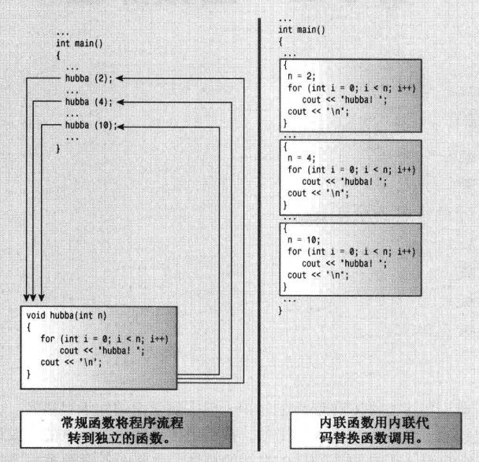
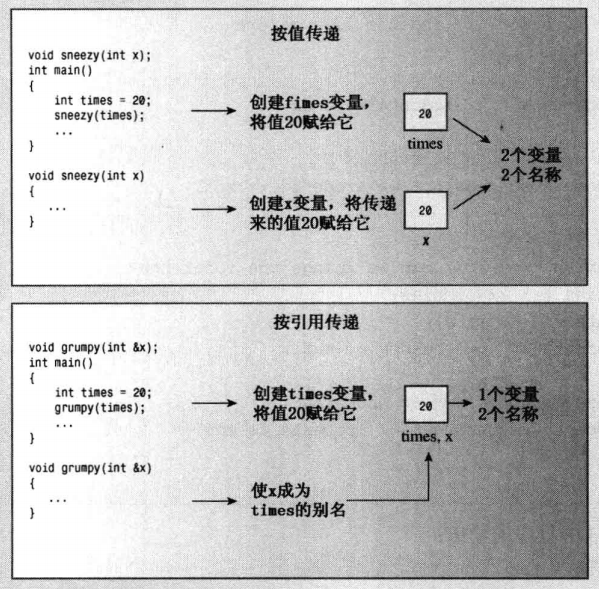

```
# 第1章-预备知识
# 第2章-开始学习C++
# 第3章-处理数据
# 第4章-复合类型
# 第5章-循环和关系表达式
# 第6章-分支语句和逻辑运算符
# 第7章-函数——C++的编程模块
```

# 第08章-函数探幽

本章内容包括：

- 内联函数。
- 引用变量。
- 如何按引用传递函数参数。
- 默认参数。
- 函数重载。
- 函数模板。
- 函数模板具体化。

通过第7章，您了解到很多有关C++函数的知识，但需要学习的知识还很多。C++还提供许多新的函数特性，使之有别于C语言。新特性包括**内联函数**、**按引用传递变量**、**默认的参数值**、**函数重载（多态）**以及**模板函数**。本章介绍的C++在C语言基础上新增的特性，比前面各章都多，这是您进入加加（++）领域的重要一步。

## C++内联函数

内联函数是C++为提高程序运行速度所做的一项改进。常规函数和内联函数之间的主要区别不在于编写方式，而在于C++编译器如何将它们组合到程序中。要了解内联函数与常规函数之间的区别，必须深入到程序内部。

编译过程的最终产品是可执行程序，由一组机器语言指令组成。运行程序时，操作系统将这些指令载入到计算机内存中，因此每条指令都有特定的内存地址。计算机随后将逐步执行这些指令。有时（如有循环或分支语句时），将跳过一些指令，向前或向后跳到特定地址。

常规函数调用也使程序跳到另一个地址（函数的地址），并在函数结束时返回。下面更详细地介绍这一过程的典型实现。执行到函数调用指令时，程序将在函数调用后立即存储该指令的内存地址，并将函数参数复制到堆栈（为此保留的内存块），跳到标记函数起点的内存单元，执行函数代码（也许还需将返回值放入到寄存器中），然后跳回到地址被保存的指令处（这与阅读文章时停下来看脚注，并在阅读完脚注后返回到以前阅读的地方类似）。来回跳跃并记录跳跃位置意味着以前使用函数时，需要一定的开销。

C++内联函数提供了另一种选择。 内联函数的编译代码与其他程序代码“内联”起来了。也就是说，**编译器将使用相应的函数代码替换函数调用**。对于内联代码，程序无需跳到另一个位置处执行代码，再跳回来。因此，**内联函数的运行速度比常规函数稍快，但代价是需要占用更多内存**。如果程序在10个不同的地方调用同一个内联函数，则该程序将包含该函数代码的10个副本（参见图8.1）。

应有选择地使用内联函数。如果执行函数代码的时间比处理函数调用机制的时间长，则节省的时间将只占整个过程的很小一部分。如果代码执行时间很短，则内联调用就可以节省非内联调用使用的大部分时间。另一方面，由于这个过程相当快，因此尽管节省了该过程的大部分时间，但节省的时间绝对值并不大，除非该函数经常被调用。



<center>图8.1内联函数与常规函数

要使用这项特性，必须采取下述措施之一：

- 在函数声明前加上关键字inline;
- 在函数定义前加上关键字inline。

**通常的做法是省略原型**，将整个定义（即函数头和所有函数代码）放在本应提供原型的地方。

程序员请求将函数作为内联函数时，编译器并不一定会满足这种要求。它可能认为该函数过大或注意到函数调用了自已（**内联函数不能递归**），因此不将其作为内联函数；而有些编译器没有启用或实现这种特性。

程序清单8.1通过内联函数square( ) 计算参数的平方，演示了内联技术。注意到整个函数定义都放在一行中，但并不一定非得这样做。然而，如果函数定义占用多行（假定没有使用冗长的标识符），则将其作为内联函数就不太合适。

`程序清单8.1 inline.cpp`

```c++
// inline.cpp -- using an inline function
#include <iostream>

// an inline function definition
inline double square(double x) { return x * x; }
int main()
{
    using namespace std;
    double a, b;
    double c = 13.0;

    a = square(5.0);
    b = square(4.5 + 7.5); // can pass expressions
    cout << "a = " << a << ", b = " << b << "\n";
    cout << "c = " << c;
    cout << ", c squared = " << square(c++) << "\n";
    cout << "Now c = " << c << "\n";
    // cin.get();
    return 0;
}
```

下面是该程序的输出：

```
a = 25, b = 144
c = 13, c squared = 169
Now c = 14
```

输出表明，内联函数和常规函数一样， 也是按值来传递参数的。如果参数为表达式，如4.5 + 7.5，则函数将传递表达式的值，这里为12。 这使得C++的内联功能远远胜过C语言的宏定义，请参见旁注“内联与宏”。

尽管程序没有提供独立的原型，但C++原型特性仍在起作用。这是因为在函数首次使用前出现的整个函数定义充当了原型。这意味着可以给square( )传递int或long值，将值传递给函数前，程序自动将这个值强制转换为double类型。


---

**内联与宏**

inline工具是C++新增的特性。C语言使用预处理器语句#define来提供宏——内联代码的原始实现。例如，下面是一个计算平方的宏：

```c++
#define SQUARE(X) X*X
```

这并不是通过传递参数实现的，而是通过文本替换来实现的一一X是“参数”的符号标记。

```c++
a = SQUARE(5.0); is replaced by a = 5.0*5.0;
b = SQUARE(4.5 + 7.5); is replaced by b = 4.5 + 7.5 * 4.5 + 7.5;
d = SQUARE(C++); is replaced by d = C++*C++;
```

上述示例只有第一个能正常工作。可以通过使用括号来进行改进：

```c++
#define SQUARE(X) ((X)* (X))
```

但仍然存在这样的问题，即宏不能按值传递。即使使用新的定义，SQUARE (C++)仍将c递增两次，但是程序清单8.1中的内联函数square()计算c的结果，传递它，以计算其平方值，然后将c递增一次。

这里的目的不是演示如何编写C宏，而是要指出，如果使用C语言的宏执行了类似函数的功能，应考虑将它们转换为C++内联函数。

---

## 引用变量

C++新增了一种复合类型——引用变量。 引用是已定义的变量的别名(另一个名称)。例如，如果将twain作为clement变量的引用，则可以交替使用twain 和clement来表示该变量。那么，这种别名有何作用呢？是否能帮助那些不知道如何选择变量名的人呢？有可能，但**引用变量的主要用途是用作函数的形参**。通过将引用变量用作参数，**函数将使用原始数据，而不是其副本**。这样除指针之外，引用也为函数处理大型结构提供了一种非常方便的途径，同时对于设计类来说，引用也是必不可少的。然而，介绍如何将引用用于函数之前，先介绍一下定义和使用引用的基本知识。请记住，下述讨论旨在说明引用是如何工作的，而不是其典型用法。

### 创建引用变量

前面讲过，**C和C++使用&符号来指示变量的地址。C++给&符号赋予了另一个含义，将其用来声明引用**。例如，要将rodents作为rats 变量的别名，可以这样做：

```c++
int rats;
int & rodents = rats;  // makes rodents an alias for rats
```

其中，&不是地址运算符，而是类型标识符的一部分。就像声明中的char*指的是指向char的指针一样，**int &指的是指向int 的引用**。上述引用声明允许将rats 和rodents互换，它们指向相同的值和内存单元，程序清单8.2表明了这一点。

`程序清单8.2 firstref.cpp`

```c++
// firstref.cpp -- defining and using a reference
#include <iostream>
int main()
{
    using namespace std;
    int rats = 101;
    int &rodents = rats; // rodents is a reference

    cout << "rats = " << rats;
    cout << ", rodents = " << rodents << endl;
    
    rodents++;
    cout << "rats = " << rats;
    cout << ", rodents = " << rodents << endl;

    // some implementations require type casting the following
    // addresses to type unsigned
    cout << "rats address = " << &rats;
    cout << ", rodents address = " << &rodents << endl;
    // cin.get();
    return 0;
}
```

请注意，下述语句中的&运算符不是地址运算符，而是将rodents的类型声明为int &，即指向int变量的引用：

```c++
int & rodents = rats;
```

但下述语句中的&运算符是地址运算符，其中&rodents表示rodents引用的变量的地址：

```c++
cout <<"， rodents address = " << &rodents << endl ；
```

下面是程序清单8.2中程序的输出：

```
rats = 101, rodents = 101
rats = 102, rodents = 102
rats address = 0x61fe14, rodents address = 0x61fe14
```

从中可知，rats 和rodents的值和地址都相同，具体的地址和显示格式随系统而异。将rodents加1将影响这两个变量。更准确地说，rodents++操作将一个有两个名称的变量加1。

同样，虽然该示例演示了引用是如何工作的，但并没有说明引用的典型用途，即作为函数参数，具体地说是结构和对象参数，稍后将介绍这些用法。

对于C语言用户而言，首次接触到引用时可能也会有些困惑，因为这些用户很自然地会想到指针，但它们之间还是有区别的。例如，可以创建指向rats 的引用和指针：

```c++
int rats = 101;
int & rodents = rats; // rodents a reference
int * prats = &rats;  // prats a pointer
```

这样，表达式rodents和\*prats都可以同rats互换，而表达式&rodents和prats都可以同&rats互换。从这一点来说，引用看上去很像伪装表示的指针，其中，*解除引用运算符被隐式理解。

实际上，引用还是不同于指针的。除了表示法不同外，还有其他的差别。例如，差别之一是， **必须在声明引用时将其初始化，而不能像指针那样，先声明，再赋值**：

```c++
int rat;
int & rodent;
rodent = rat; // No, you can't do this.
```

**注意**：必须在声明引用变量时进行初始化。

**引用更接近const 指针**，必须在创建时进行初始化，一旦与某个变量关联起来，就将一直效忠于它。也就是说：

```c++
int & rodents = rats;
```

实际上是下述代码的伪装表示：

```c++
int * const pr = &rats;
```

其中，引用rodents扮演的角色与表达式*pr相同。

程序清单8.3演示了试图将rats变量的引用改为bunnies变量的引用时，将发生的情况。

`程序清单8.3 sceref.cpp`

```c++
// secref.cpp -- defining and using a reference
#include <iostream>
int main()
{
    using namespace std;
    int rats = 101;
    int &rodents = rats; // rodents is a reference

    cout << "rats = " << rats;
    cout << ", rodents = " << rodents << endl;

    cout << "rats address = " << &rats;
    cout << ", rodents address = " << &rodents << endl;

    int bunnies = 50;
    rodents = bunnies; // can we change the reference?
    cout << "bunnies = " << bunnies;
    cout << ", rats = " << rats;
    cout << ", rodents = " << rodents << endl;

    cout << "bunnies address = " << &bunnies;
    cout << ", rodents address = " << &rodents << endl;
    // cin.get();
    return 0;
}
```

下面是程序清单8.3中程序的输出： 

```
rats = 101, rodents = 101
rats address = 0x61fe14, rodents address = 0x61fe14
bunnies = 50, rats = 50, rodents = 50
bunnies address = 0x61fe10, rodents address = 0x61fe14
```

最初，rodents 引用的是rats，但随后程序试图将rodents作为bunnies 的引用：

```c++
rodents = bunnies;
```

咋一看，这种意图暂时是成功的，因为rodents 的值从101变为了50。但仔细研究将发现，rats 也变成了50，同时rats和rodents的地址相同，而该地址与bunnies的地址不同。由于rodents是rats的别名，因此上述赋值语句与下面的语句等效：

```c++
rats = bunnies;
```

也就是说，这意味着“将bunnies变量的值赋给rat 变量”。简而言之，**可以通过初始化声明来设置引用，但不能通过赋值来设置。**

假设程序员试图这样做：

```c++
int rats = 101;
int * pt = &rats;
int & rodents = *pt;
int bunnies = 50;
pt = &bunnies;
```

将rodents初始化为*pt使得rodents指向rats。接下来将pt改为指向bunnies，并不能改变这样的事实，即rodents引用的是rats。

### 将引用用作函数参数

引用经常被用作函数参数，使得函数中的变量名成为调用程序中的变量的别名。这种传递参数的方法称为**按引用传递**。按引用传递允许被调用的函数能够访问调用函数中的变量。

C++新增的这项特性是对C语言的超越，C语言只能按值传递。按值传递导致被调用函数使用调用程序的值的拷贝（参见图8.2）。当然，C语言也允许避开按值传递的限制，采用按指针传递的方式。



<center>图8.2 按值传递和按引用传递

现在我们通过一个常见的的计算机问题一交换两个变量的值，对使用引用和使用指针做一下比较。交换函数必须能够修改调用程序中的变量的值。这意味着按值传递变量将不管用，因为函数将交换原始变量副本的内容，而不是变量本身的内容。但传递引用时，函数将可以使用原始数据。另一种方法是传递指针来访问原始数据。

程序清单8.4演示了这三种方法，其中包括一种不可行的方法，以便您能对这些方法进行比较。

`程序清单8.4 swaps.cpp`

```c++
// swaps.cpp -- swapping with references and with pointers
#include <iostream>
void swapr(int &a, int &b); // a, b are aliases for ints
void swapp(int *p, int *q); // p, q are addresses of ints
void swapv(int a, int b);   // a, b are new variables

int main()
{
    using namespace std;
    int wallet1 = 300;
    int wallet2 = 350;

    cout << "wallet1 = $" << wallet1;
    cout << " wallet2 = $" << wallet2 << endl;

    cout << "Using references to swap contents:\n";
    swapr(wallet1, wallet2); // pass variables
    cout << "wallet1 = $" << wallet1;
    cout << " wallet2 = $" << wallet2 << endl;

    cout << "Using pointers to swap contents again:\n";
    swapp(&wallet1, &wallet2); // pass addresses of variables
    cout << "wallet1 = $" << wallet1;
    cout << " wallet2 = $" << wallet2 << endl;

    cout << "Trying to use passing by value:\n";
    swapv(wallet1, wallet2); // pass values of variables
    cout << "wallet1 = $" << wallet1;
    cout << " wallet2 = $" << wallet2 << endl;
    // cin.get();
    return 0;
}

void swapr(int &a, int &b) // use references
{
    int temp;

    temp = a; // use a, b for values of variables
    a = b;
    b = temp;
}

void swapp(int *p, int *q) // use pointers
{
    int temp;

    temp = *p; // use *p, *q for values of variables
    *p = *q;
    *q = temp;
}

void swapv(int a, int b) // try using values
{
    int temp;

    temp = a; // use a, b for values of variables
    a = b;
    b = temp;
}
```

下面是程序清单8.4中程序的输出：

```
wallet1 = $300 wallet2 = $350
Using references to swap contents:
wallet1 = $350 wallet2 = $300
Using pointers to swap contents again:
wallet1 = $300 wallet2 = $350
Trying to use passing by value:
wallet1 = $300 wallet2 = $350
```

正如您预想的，引用和指针方法都成功地交换了两个钱夹( wallet)中的内容，而按值传递的方法没能完成这项任务。

**程序说明**

首先来看程序清单8.4中每个函数是如何被调用的：

```c++
swapr(wallet1, wallet2);  // pass variables
swapp( &wallet1, &wallet2);  // pass addresses of variables
swapv(wallet1, wallet2);  // pass values of variables 
```

按引用传递(swapr(wallet1, wallet2))和按值传递( swapv(wallet1, waller2))看起来相同。只能通过原型或函数定义才能知道swapr( )是按引用传递的。然而，地址运算符(&)使得按地址传递(swapp(&wallet1,&wallet2))一目了然，类型声明int*p表明，p是一个int指针，因此与p对应的参数应为地址如&wallet1。

接下来，比较函数swapr( ) (按引用传递)和swapv() (按值传递)的代码，唯一的外在区别是声明函数参数的方式不同：

```c++
void swapr(int & a，int & b)
void swapv(int a, int b)
```

当然还有内在区别：在swapr()中，变量a和b是wallet1和wallet2的别名，所以交换a和b的值相当于交换wallet1和wallet2的值；但在swapv()中，变量a和b是复制了wallet1 和waller2的值的新变量，因此交换a和b的值并不会影响walletI和wallet2 的值。

最后，比较函数swapr( ) (传递引用)和swapp() (传递指针)。第一个区别是声明函数参数的方式不同：

```c++
void swapr(int & a, int & b)
void swapp(int * p, int * q)
```

另一个区别是指针版本需要在函数使用p和q的整个过程中使用解除引用运算符*。

前面说过，应在定义引用变量时对其进行初始化。函数调用使用实参初始化形参，因此函数的引用参数被初始化为函数调用传递的实参。也就是说，下 面的函数调用将形参a和b分别初始化为wallet1 和wallet2：

```c++
swapr(wallet1, wallet2);
```


### 引用的属性和特别之处

使用引用参数时，需要了解其一些特点。 首先，请看程序清单8.5。它使用两个函数来计算参数的立方，其中一个函数接受double类型的参数，另一个接受 double引用。为了说明这一点我们有意将计算立方的代码编写得比较奇怪。

`程序清单8.5 cubes.cpp`

```c++
// cubes.cpp -- regular and reference arguments
#include <iostream>
double cube(double a);
double refcube(double &ra);
int main()
{
    using namespace std;
    double x = 3.0;

    cout << cube(x);
    cout << " = cube of " << x << endl;
    cout << refcube(x);
    cout << " = cube of " << x << endl;
    // cin.get();
    return 0;
}

double cube(double a)
{
    a *= a * a;
    return a;
}

double refcube(double &ra)
{
    ra *= ra * ra;
    return ra;
}
```

下面是该程序的输出：

```
27 = cube of 3
27 = cube of 27
```

refcube( )函数修改了main( )中的x值，而cube( )没有，这提醒我们为何通常按值传递。变量a位于cube()中，它被初始化为x的值，但修改a并不会影响x。但由于refcube()使用了引用参数，因此修改ra实际上就是修改x。**如果程序员的意图是让函数使用传递给它的信息，而不对这些信息进行修改，同时又想使用引用，则应使用常量引用**。例如，在这个例子中，应在函数原型和函数头中使用const:

```c++
double refcube (const double &ra);
```

如果这样做，当编译器发现代码修改了ra的值时，将生成错误消息。

顺便说一句，**如果要编写类似于上述示例的函数，即使用基本数值类型，应采用按值传递的方式，而不要采用按引用传递的方式。当数据比较大， 如结构和类时，引用参数将很有用**，您稍后便会明白这一点。

按值传递的函数，如程序清单8.5中的函数cube( )，可使用多种类型的实参。例如，下面的调用都是合法的：

```c++
double z = cube(x + 2.0); // evaluate x + 2.0， pass value
z = cube(8.0);			  // pass the value 8.0
int k = 10;
z = cube(k); // convert value of k to double, pass value
double yo[3] = {2.2, 3.3, 4.4};
z = cube(yo[2]); // pass the value 4.4
```

如果将与上面类似的参数传递给接受引用参数的函数，将会发现，传递引用的限制更严格。毕竟，如果ra是一个变量的别名，则实参应是该变量。下面的代码不合理，因为表达式x + 3.0并不是变量：

```c++
double z = refcube(x + 3.0); // should not compile
```

例如，不能将值赋给该表达式：

```c++
x + 3.0 = 5.0; // nonsensical
```

如果试图使用像refcube(x + 3.0)这样的函数调用，将发生什么情况呢？在现代的C++中，这是错误的，大多数编译器都将指出这一点；而有些较老的编译器将发出这样的警告：

```
Warning: Temporary used for parameter ral in call to refcube (double &)
```

之所以做出这种比较温和的反应是由于早期的C++确实允许将表达式传递给引用变量。有些情况下，仍然是这样做的。这样做的结果如下：由于x + 3.0不是double类型的变量，因此程序将创建一个临时的无名变量，并将其初始化为表达式x+ 3.0的值。然后，ra将成为该临时变量的引用。下面详细讨论这种临时变量，看看什么时候创建它们，什么时候不创建。


---

**临时变量、引用参数和const**

如果实参与引用参数不匹配，C++将生成临时变量。当前，仅当参数为const引用时，C++才允许这样做，但以前不是这样。下面来看看何种情况下，C++将生成临时变量，以及为何对const引用的限制是合理的。

首先，什么时候将创建临时变量呢？如果引用参数是const，则编译器将在下面两种情况下生成临时变量：

- 实参的类型正确，但不是左值；
- 实参的类型不正确，但可以转换为正确的类型。

左值是什么呢？**左值参数是可被引用的数据对象**，例如，变量、数组元素、结构成员、引用和解除引用的指针都是左值。**非左值**包括字面常量（用引号括起的字符串除外，它们由其地址表示）和包含多项的表达式。

在C语言中，左值最初指的是可出现在赋值语句左边的实体，但这是引入关键字const 之前的情况。现在，常规变量和const变量都可视为左值，因为可通过地址访问它们。但常规变量属于可修改的左值，而const变量属于不可修改的左值。

回到前面的示例。假设重新定义了refcube()， 使其接受一个常量引用参数：

```c++
double refcube (const double &ra)
{
    return ra * ra * ra;
}
```

现在考虑下面的代码：

```c++
double side = 3.0;
double * pd = &side;
double & rd = side;
long edge = 5L;
double lens[4] = { 2.0, 5.0, 10.0, 12.0};
double c1 = refcube (side);  // ra is side
double c2 = refcube (lens[2]);  // ra is lens [2]
double c3 = refcube (rd);  //ra is rd is side
double C4 = refcube (*pd);  // ra is *pd is side
double c5 = refcube (edge);  // ra is temporary variable
double C6 = refcube(7.0);  // ra is temporary variable
double c7 = refcube(side + 10.0);  // ra is temporary variable
```

参数side、lens[2]、 rd和\*pd都是有名称的、double 类型的数据对象，因此可以为其创建引用，而不需要临时变量（还记得吗，数组元素的行为与同类型的变量类似）。

然而，edge 虽然是变量，类型却不正确，double引用不能指向long。另一方面，参数7.0和side + 10.0 的类型都正确，但没有名称，在这些情况下，编译器都将生成一个临时匿名变量，并让ra指向它。这些临时变量只在函数调用期间存在，此后编译器便可以随意将其删除。

那么为什么对于常量引用，这种行为是可行的，其他情况下却不行的呢？对于程序清单8.4中的函数swapr( )：

```c++
void swapr(int & a, int & b) // use references
{
    int temp;
    temp = a;  // use a, b for values of variables
    a = b;
    b = temp;
}
```

如果在早期C++较宽松的规则下，执行下面的操作将发生什么情况呢?

```c++
long a = 3, b = 5;
swapr(a, b);
```

这里的类型不匹配，因此编译器将创建两个临时int变量，将它们初始化为3和5，然后交换临时变量的内容，而a和b保持不变。

简而言之，如果接受引用参数的函数的意图是修改作为参数传递的变量，则创建临时变量将阻止这种意图的实现。解决方法是，禁止创建临时变量，现在的C++标准正是这样做的，然而，在默认情况下，有些编译器仍将发出警告，而不是错误消息，因此如果看到了有关临时变量的警告，请不要忽略。

现在来看refcube( )函数。该函数的目的只是使用传递的值，而不是修改它们，因此临时变量不会造成任何不利的影响，反而会使函数在可处理的参数种类方面更通用。因此，如果声明将引用指定为const，C++将在必要时生成临时变量。实际上，对于形参为const 引用的C++函数，如果实参不匹配，则其行为类似于按值传递，为确保原始数据不被修改，将使用临时变量来存储值。

**注意**：如果函数调用的参数不是左值或与相应的const引用参数的类型不匹配，则C++将创建类型正确的匿名变量，将函数调用的参数的值传递给该匿名变量，并让参数来引用该变量。


---

**应尽可能使用const**

将引用参数声明为常量数据的引用的理由有三个：

- 使用const可以避免无意中修改数据的编程错误；
- 使用const使函数能够处理const和非const实参，否则将只能接受非const数据；
- 使用const引用使函数能够正确生成并使用临时变量。

因此，应尽可能将引用形参声明为const

---


C++11新增了另一种引用——**右值引用**(rvalue reference)。这种引用可指向右值，是**使用&&声明的**：

```c++
double && rref = std::sqrt(36.00); // not allowed for double &
double j = 15.0;
double && jref = 2.0* j + 18.5;  // not allowed for double &
std::cout << rref << '\n';  // display 6.0
std::cout << jref << '\n';  // display 48.5;
```

新增右值引用的主要目的是，让库设计人员能够提供有些操作的更有效实现。第18章将讨论如何使用右值引用来实现移动语义(move semantics)。以前的引用(使用&声明的引用)现在称为左值引用。

### 将引用用于结构

引用非常适合用于结构和类（C++的用户定义类型）。确实，引入引用主要是为了用于这些类型的，而不是基本的内置类型。

使用结构引用参数的方式与使用基本变量引用相同，只需在声明结构参数时使用引用运算符&即可。例如，假设有如下结构定义：

```c++
struct free_throws
{
    std::string name;
    int made;
    int attempts;
    float percent;
}
```

则可以这样编写函数原型，在函数中将指向该结构的引用作为参数：

```c++
void set_pc(free_throws & ft);  // use a reference to a structure
```

如果不希望函数修改传入的结构，可使用const：

```c++
void display(const free_throws & ft); // don't allow changes to structure
```

程序清单8.6中的程序正是这样做的。它还通过让函数返回指向结构的引用添加了一个有趣的特点，这与返回结构有所不同。对此，有一些需要注意的地方，稍后将进行介绍。

`程序清单8.6 strc_ref.cpp`

```c++
// strc_ref.cpp -- using structure references
#include <iostream>
#include <string>
struct free_throws
{
    std::string name;
    int made;
    int attempts;
    float percent;
};

void display(const free_throws &ft);
void set_pc(free_throws &ft);
free_throws &accumulate(free_throws &target, const free_throws &source);

int main()
{
    free_throws one = {"Ifelsa Branch", 13, 14};
    free_throws two = {"Andor Knott", 10, 16};
    free_throws three = {"Minnie Max", 7, 9};
    free_throws four = {"Whily Looper", 5, 9};
    free_throws five = {"Long Long", 6, 14};
    free_throws team = {"Throwgoods", 0, 0};
    free_throws dup;
    set_pc(one);
    display(one);
    accumulate(team, one);
    display(team);
    
    // use return value as argument
    display(accumulate(team, two));
    accumulate(accumulate(team, three), four);
    display(team);
    // use return value in assignment
    dup = accumulate(team, five);
    std::cout << "Displaying team:\n";
    display(team);
    std::cout << "Displaying dup after assignment:\n";
    display(dup);
    set_pc(four);
    // ill-advised assignment
    accumulate(dup, five) = four;
    std::cout << "Displaying dup after ill-advised assignment:\n";
    display(dup);
    // std::cin.get();
    return 0;
}

void display(const free_throws &ft)
{
    using std::cout;
    cout << "Name: " << ft.name << '\n';
    cout << "  Made: " << ft.made << '\t';
    cout << "Attempts: " << ft.attempts << '\t';
    cout << "Percent: " << ft.percent << '\n';
}

void set_pc(free_throws &ft)
{
    if (ft.attempts != 0)
        ft.percent = 100.0f * float(ft.made) / float(ft.attempts);
    else
        ft.percent = 0;
}

free_throws &accumulate(free_throws &target, const free_throws &source)
{
    target.attempts += source.attempts;
    target.made += source.made;
    set_pc(target);
    return target;
}
```

下面是该程序的输出：

```
Name: Ifelsa Branch
  Made: 13      Attempts: 14    Percent: 92.8571
Name: Throwgoods
  Made: 13      Attempts: 14    Percent: 92.8571
Name: Throwgoods
  Made: 23      Attempts: 30    Percent: 76.6667
Name: Throwgoods
  Made: 35      Attempts: 48    Percent: 72.9167
Displaying team:
Name: Throwgoods
  Made: 41      Attempts: 62    Percent: 66.129
Displaying dup after assignment:
Name: Throwgoods
  Made: 41      Attempts: 62    Percent: 66.129
Displaying dup after ill-advised assignment:
Name: Whily Looper
  Made: 5       Attempts: 9     Percent: 55.5556
```

1. 程序说明

该程序首先初始化了多个结构对象。本书前面说过，如果指定的初始值比成员少，余下的成员将被设置为零，这里只有percent。第一个函数调用如下：

```c++
set_pc(one);
```

由于函数set pcO的形参ft 为引用，因此ft指向one,函数set pc0)的代码设置成员one.percent。 就这里而言，按值传递不可行，因此这将导致设置的是one的临时拷贝的成员percent.根据前一章介绍的知识，另一种方法是使用指针参数并传递地址，但要复杂些：

```c++
set_pcp ( &one) ；// using pointers instead - &one instead of one
    ...
void set_pcp(free_throws * pt)
{
    if (pt->attempts != 0)
        pt->percent = 100.0f *float (pt->made)/ float (pt->attempts);
    else
        pt->percent = 0;
}
```

下一个函数调用如下：

```c++
display(one) ；
```

由于display0显示结构的内容，而不修改它，因此这个函数使用了一个const引用参数。就这个函数而言，也可按值传递结构，但与复制原始结构的拷贝相比，使用引用可节省时间和内存。

再下一个函数调用如下：

```c++
accumulate (team, one) ；
```

函数accumulate0接收两个结构参数，并将第二个结构的成员attempts和made的数据添加到第一个结构的相应成员中。只修改了第一个结构， 因此第一个参数为引用，而第二个参数为const引用：

```c++
free_throws & accuulate(free_throws & target, const free_throws & source) ；
```

返回值呢?当前讨论的函数调用没有使用它；就目前而言，原本可以将返回值声明为void,但请看下述函数调用：

```c++
display(accumulate(team, two));
```

上述代码是什么意思呢?首先，将结构对象team作为第一个参 数传递给了accumulate()。 这意味着在函数accumulate(中，target 指向的是team。函数accumulate()修改team,再返回指向它的引用。注意到返回语句如下：

```c++
return target ；
```

光看这条语句并不能知道返回的是引用，但函数头和原型指出了这一点：

```c++
free_throws & accumulate(free_throws & target, const free_throws & source )
```

如果返回类型被声明为free throws 而不是free_throws &，上述 返回语句将返回target (也就是team )的拷贝。但返回类型为引用，这意味着返回的是最初传递给accumulate()的team对象。

接下来，将accumulateO的返回值作 为参数传递给了display, 这意味着将team传递给了display(。display0的参数为引用，这意味着函数display(中的ft指向的是team,因此将显示team的内容。所以，下述代码：

```c++
display (accumulate(team, two))；
```

与下面的代码等效：

```c++
accumulate (team, two) ；
display (team) ；
```

 上述逻辑也适用于如下语句：

```c++
accumulate ( accumulate (team, three) ，four) ；
```

因此，该语句与下面的语句等效：

```c++
accumulate (team, three) ；
accumulate(team, four) ；
```

接下来，程序使用了--条赋值语句：

```c++
dup = accumulate (team, five);
```

正如您预期的，这条语句将team中的值复制到dup中。

最后，程序以独特的方式使用了accumulate()：

```c++
accumulate(dup, five) = four;
```

这条语句将值赋给函数调用，这是可行的，因为函数的返回值是一个引用。如果函数accumulate(O按值返回，这条语句将不能通过编译。由于返回的是指向dup的引用，因此上述代码与下面的代码等效：

```c++
accumulate (dup, five)； // add five's data to dup
dup = four;  // overwrite the contents of dup with the contents of four
```

其中第二条语句消除了第-条语句所做的工作，因此在原始赋值语句使用accumulate(的方式并不好。

2. 为何要返回引用

下面更深入地讨论返回引用与传统返回机制的不同之处。传统返回机制与按值传递函数参数类似：计算关键字return后面的表达式，并将结果返回给调用函数。从概念上说，这个值被复制到一个临时位置，而调用程序将使用这个值。请看下面的代码：

```c++
double m = sqrt(16.0)；
cout << sqrt(25.0) ；
```

在第-条语句中，值4.0被复制到一个临时位置，然后被复制给m。在第二条语句中，值5.0被复制到一个临时位置，然后被传递给cout (这里理论上的描述，实际上，编译器可能合并某些步骤)。现在来看下面的语句：

```c++
dup = accumulate (team, five)；
```

如果accumulate(0返回一个结构，而不是指向结构的引用，将把整个结构复制到一个临时位置，再将这个拷贝复制给dup。但在返回值为引用时，将直接把team复制到dup,其效率更高。

注意：返回引用的函数实际.上是被引用的变量的别名。

3. 返回引用时需要注意的问题

返回引用时最重要的一点是， 应避免返回函数终止时不再存在的内存单元引用。您应避免编写下面这样的代码：

```c++
const free_throws & clone2(free_throws & ft)
{
    free_throws newguy; // first step to big error
    newguy = ft;
    copy info
    return newguy;  // return reference to copy
}
```

该函数返回一个指向临时变量(newguy) 的引用，函数运行完毕后它将不再存在。第9章将讨论各种变量的持续性。同样，也应避免返回指向临时变量的指针。

为避免这种问题，最简单的方法是，返回一个作为参数传递给函数的引用。作为参数的引用将指向调用函数使用的数据，因此返回的引用也将指向这些数据。程序清单8.6中的accumulateO正是这样做的。

另一种方法是用new来分配新的存储空间。前面见过这样的函数，它使用new为字符串分配内存空间，并返回指向该内存空间的指针。下 面是使用引用来完成类似工作的方法：

```c++
const free_throws & clone(free_throws & ft)
{
    free_ throws * Pt
    *pt = ft;  // COpY info
    return *pt;  // return reference to copy
}
```

第一条语句创建一个无名 的free_throws 结构，并让指针pt指向该结构，因此*pt就是该结构。上述代码似乎会返回该结构，但函数声明表明，该函数实际上将返回这个结构的引用。这样，便可以这样使用该函数：

```c++
free_throws & jolly = clone (three) ；
```

这使得jolly成为新结构的引用。这种方法存在一个问题：在不再需要new分配的内存时，应使用delete来释放它们。调用clone( )隐藏了对new的调用，这使得以后很容易忘记使用delete来释放内存。第16章讨论的auto_ ptr 模板以及C++11新增的unique ptr 可帮助程序员自动完成释放工作。

4. 为何将const用于引用返回类型

程序清单8.6包含如下语句：

```c++
accumulate(dup, five) = four;
```

其效果如下：首先将five的数据添加到dup中，再使用four的内容覆盖dup的内容。这条语句为何能够通过编译呢?在赋值语句中，左边必须是可修改的左值。也就是说，在赋值表达式中，左边的子表达式必须标识一个可修改的内存块。在这里，函数返回指向dup的引用，它确实标识的是一个这样的内存块，因此这条语句是合法的。

另一方面，常规(非引用)返回类型是右值一不 能通过地址访问的值。这种表达式可出现在赋值语句的右边，但不能出现在左边。其他右值包括字面值(如10.0) 和表达式(如x+y)。显然，获取字面值(如10.0)的地址没有意义，但为何常规函数返回值是右值呢?这是因为这种返回值位于临时内存单元中，运行到下一条语句时，它们可能不再存在。

假设您要使用引用返回值，但又不允许执行像给accumulate(赋值这样的操作，只需将返回类型声明为const引用：

```c++
const free_throws &
accumulate(free_throws & target, const free_throws & source) ；
```

现在返回类型为const,是不可修改的左值，因此下面的赋值语句不合法：

```c++
accumulate(dup,five) = four; // not allowed for const reference return
```

该程序中的其他函数调用又如何呢?返回类型为const 引用后，下面的语句仍合法：

```c++
display (accumulate (team, two)) ；
```

这是因为displayO的形参也是const free. throws &类型。但下面的语句不合法，因此accumulate()的第一个形参不是const:

```c++
accumulate (accumulate (team, three) ，four) ；
```

这影响大吗?就这里而言不大，因为您仍可以这样做：

```c++
accumulate(team, three) ；
accumulate(team, four) ；
```

另外，您仍可以在赋值语句右边使用accumulate()。

通过省略const,可以编写更简短代码，但其含义也更模糊。

通常，应避免在设计中添加模糊的特性，因为模糊特性增加了犯错的机会。将返回类型声明为const引用，可避免您犯糊涂。然而，有时候省略const确实有道理，第11章将讨论的重载运算符<<就是一个这样的例子。

### 将引用用于类对象

将类对象传递给函数时，C++通 常的做法是使用引用。例如，可以通过使用引用，让函数将类string、ostream、istream、 ofstream 和ifstream等类的对象作为参数。

下面来看一个例子，它使用了string 类，并演示了一些不同的设计方案，其中的一些是糟糕的。这个例子的基本思想是，创建一- 个函数，它将指定的字符串加入到另一个字符串的前面和后面。程序清单8.7提供了三个这样的函数，然而其中的一个存在非常大的缺陷，可能导致程序崩溃甚至不同通过编译。

`程序清单8.7 strquote.cpp`

```c++
// strquote.cpp  -- different designs
#include <iostream>
#include <string>
using namespace std;
string version1(const string & s1, const string & s2);
const string & version2(string & s1, const string & s2);  // has side effect
const string & version3(string & s1, const string & s2);  // bad design
 
int main()
{
    string input;
    string copy;
    string result;

    cout << "Enter a string: ";
    getline(cin, input);
    copy = input;
    cout << "Your string as entered: " << input << endl;
    result = version1(input, "***");
    cout << "Your string enhanced: " << result << endl;
    cout << "Your original string: " << input << endl;
 
    result = version2(input, "###");
    cout << "Your string enhanced: " << result << endl;
    cout << "Your original string: " << input << endl;

    cout << "Resetting original string.\n";
    input = copy;
    result = version3(input, "@@@");
    cout << "Your string enhanced: " << result << endl;
    cout << "Your original string: " << input << endl;
	// cin.get();
	// cin.get();
    return 0;
}

string version1(const string & s1, const string & s2)
{
    string temp;

    temp = s2 + s1 + s2;
    return temp;
}

const string & version2(string & s1, const string & s2)   // has side effect
{
    s1 = s2 + s1 + s2;
// safe to return reference passed to function
    return s1; 
}

const string & version3(string & s1, const string & s2)   // bad design
{
    string temp;

    temp = s2 + s1 + s2;
// unsafe to return reference to local variable
    return temp;
}
```

下面是该程序的运行情况：

```
Enter a string: It's not my fault.
Your string as entered: It's not my fault.
Your string enhanced: ***It's not my fault. ***
Your original string: It's not my fault .
Your string enhanced: ##It's not my fault. ##井
lour original string: ###It's not my fault. ###
Resetting original string .
```

此时，该程序已经崩溃。

**程序说明**

在程序清单8.7的三个函数中，versionl 最简单：

```c++
string versionl (const string & s1，const string & s2)
{
string temp ；
temp=s2+s1+s2;
return temp ；
}
```

它接受两个string 参数，并使用string 类的相加功能来创建一个满 足要求的新字符串。这两个函数参数都是const引用。如果使用string对象作为参数，最终结果将不变：

```c++
string version4 (string s1, string s2) // would work the same
```

在这种情况下，s1和s2将为string对象。使用引用的效率更高，因为函数不需要创建新的string对象，并将原来对象中的数据复制到新对象中。限定符const指出，该函数将使用原来的string对象，但不会修改它。

temp是一个新的string对象，只在函数version1( )中有效，该函数执行完毕后，它将不再存在。因此，返回指向temp的引用不可行，因此该函数的返回类型为string,这意味着temp的内容将被复制到--个临时存储单元中，然后在main()中，该存储单元的内容被复制到一个名为result的string中：

```
result = version1 (input, "***") ；
```


---

**将C-风格字符串用作string对象引用参数**

对于函数version1()，您可能注意到了很有趣的一点：该函数的两个形参(s1和s2)的类型都是conststring &，但实参( input和“\*\*\*”)的类型分别是string和const char*。由于input的类型为string,因此让s1指向它没有任何问题。然而，程序怎么能够接受将char指针赋给string引用呢?

这里有两点需要说明。首先，string 类定义了一种char *到string 的转换功能，这使得可以使用C=风格字符串来初始化string对象。其次是本章前面讨论过的类型为const引用的形参的一个属性。假设实参的类型与引用参数类型不匹配，但可被转换为引用类型，程序将创建一个正确类型的临时变量，使用转换后的实参值来初始化它，然后传递一个指向该临时变量的引用。例如，在本章前面，将int实参传递给constdouble&形参时，就是以这种方式进行处理的。同样，也可以将实参har \*或const char \*传递给形参const string &。

这种属性的结果是，如果形参类型为const string &，在调用函数时，使用的实参可以是string 对象或C~风格字符串，如用引号括起的字符串字面量、以空字符结尾的char 数组或指向char 的指针变量。因此， 下面的代码是可行的：

```c++
result = versionl (input, "***") ；
```

---


函数version2( )不创建临时string 对象，而是直接修改原来的string对象： 

```c++
const string & version2 (string & s1, const string & s2)  // has side effect
s1=s2+s1+s2;  // safe to return reference passed to function
return s1;
```

该函数可以修改s1，因为不同于s2，s1 没有被声明为const

由于s1是指向main( )中一个对象(input) 的引用，因此将s1最为引用返回是安全的。由于s1是指向input的引用，因此，下面一行代码：

```c++
result = version2 (input, "###") ；
```

与下面的代码等价： 

```c++
version2 (input，"###") ；  // input altered directly by version2 ()
result = input;  // reference to s1 is reference to input
```

然而，由于s1是指向input 的引用，调用该函数将带来修改input的副作用： 

```
Your original string: It's not my fault .
Your string enhanced: ###It's not my fault. ###
Your original string: ###It's not my fault. ##
```

因此，如果要保留原来的字符串不变，这将是一种错误设计。

程序清单8.7中的第三个函数版本指出了什么不能做：

```c++
const string & version3 (string & s1，const string & s2)  // bad design
string temp;
temp=s2+s1+s2;  // unsafe to return reference to local variable
return temp ；
```

它存在一个致命 的缺陷：返回一个指向version3( )中声明的变量的引用。这个函数能够通过编译(但编译器会发出警告)，但当程序试图执行该函数时将崩溃。具体地说，问题是由下面的赋值语句引发的：

```c++
result = version3 (input, "@@@") ；
```

程序试图引用已经释放的内存。

### 对象、 继承和引用

ostream和ofstream类凸现了引用的一个有趣属性。正如第6章介绍的，ofstream 对象可以使用ostream类的方法，这使得文件输入/输出的格式与控制台输入/输出相同。使得能够将特性从一个类传递给另一个类的语言特性被称为继承，这将在第13章详细讨论。简单地说，ostream 是基类(因为ofstream 是建立在它的基础之上的)，而ofstream是派生类( 因为它是从ostream 派生而来的)。派生类继承了基类的方法，这意味着ofstream对象可以使用基类的特性，如格式化方法precision( )和setf( )。

继承的另一个特 征是，基类引用可以指向派生类对象，而无需进行强制类型转换。这种特征的一个实际结果是，可以定义一个接受基类引用作为参数的函数，调用该函数时，可以将基类对象作为参数，也可以将派生类对象作为参数。例如，参数类型为ostream&的函数可以接受ostream对象(如cout)或您声明的ofstream对象作为参数。

程序清单8.8通过调用同一个函数（只有函数调用参数不同）将数据写入文件和显示到屏幕上来说明了这一点。该程序要求用户输入望远镜物镜和一些目镜的焦距，然后计算并显示每个目镜的放大倍数。放大倍数等于物镜的焦距除以目镜的焦距，因此计算起来很简单。该程序还使用了一些格式化方法，这些方法用于cout和ofstream对象(在这个例子中为fout)时作用相同。

`程序清单8.8 filefunc.cpp`

```c++
// filefunc.cpp -- function with ostream & parameter
#include <iostream>
#include <fstream>
#include <cstdlib>
using namespace std;

void file_it(ostream &os, double fo, const double fe[], int n);
const int LIMIT = 5;

int main()
{
    ofstream fout;
    const char *fn = "ep-data.txt";
    fout.open(fn);
    if (!fout.is_open())
    {
        cout << "Can't open " << fn << ". Bye.\n";
        exit(EXIT_FAILURE);
    }
    double objective;
    cout << "Enter the focal length of your "
            "telescope objective in mm: ";
    cin >> objective;
    double eps[LIMIT];
    cout << "Enter the focal lengths, in mm, of " << LIMIT
         << " eyepieces:\n";
    for (int i = 0; i < LIMIT; i++)
    {
        cout << "Eyepiece #" << i + 1 << ": ";
        cin >> eps[i];
    }
    file_it(fout, objective, eps, LIMIT);
    file_it(cout, objective, eps, LIMIT);
    cout << "Done\n";
    // cin.get();
    // cin.get();
    return 0;
}

void file_it(ostream &os, double fo, const double fe[], int n)
{
    // save initial formatting state
    ios_base::fmtflags initial;
    initial = os.setf(ios_base::fixed, ios_base::floatfield);
    std::streamsize sz = os.precision(0);
    os << "Focal length of objective: " << fo << " mm\n";
    os.precision(1);
    os.width(12);
    os << "f.l. eyepiece";
    os.width(15);
    os << "magnification" << endl;
    for (int i = 0; i < n; i++)
    {
        os.width(12);
        os << fe[i];
        os.width(15);
        os << int(fo / fe[i] + 0.5) << endl;
    }
    // restore initial formatting state
    os.setf(initial, ios_base::floatfield);
    os.precision(sz);
}
```

下面是该程序的运行情况：

```
Enter the focal length of your telescope objective in mm: 1800
Enter the focal lengths, in mm, of 5 eyepieces:
Eyepiece #1: 30
Eyepiece #2: 19
Eyepiece #3: 14
Eyepiece #4: 8
Eyepiece #5: 7.5
Focal length of objective: 1800 mm
f.l. eyepiece  magnification
        30.0             60
        19.0             95
        14.0            129
         8.0            225
         7.5            240
Done
```

下述代码行将目镜数据写入到文件ep-data.txt中：

```c++
file_it(fout， objective, eps, LIMIT);
```

而下述代码行将同样的信息以同样的格式显示到屏幕.上：

```c++
file_it (cout, objective, eps, LIMIT);
```


**程序说明**

对于该程序，最重要的一点是，参数os (其类型为ostream &)可以指向ostream对象(如cout)，世可以指向ofstream对象(如fout)。该程序还演示了如何使用ostream类中的格式化方法。下面复习(介绍)其中的一些，更详细的讨论请参阅第17章。

方法setf( )让您能够设置各种格式化状态。例如，方法调用setf(ios base::fixed)将对象置于使用定点表示法的模式； set(fios base::showpoint)将对 象置于显示小数点的模式，即使小数部分为零。方法precision( )指定显示多少位小数(假定对象处于定点模式下)。所有这些设置都将一直保持不变， 直到再次调用相应的方法重新设置它们。方法width( )设置下一次输 出操作使用的字段宽度，这种设置只在显示下一个值时有效，然后将恢复到默认设置。默认的字段宽度为零，这意味着刚好能容纳下要显示的内容。

函数file_it( )使用了两个有趣的方法调用：

```c++
ios_base::fmtflags initial;
initial = os.setf(ios_base::fixed); // save initial formatting statie
...
os.setf (initial); // restore initial formatting state
```

方法setf( )返回调用它之前有效的所有格式化设置。ios base::fmtflags 是存储这种信息所需的数据类型名称。因此，将返回值赋给initial将存储调用file it( )之前的格式化设置，然后便可以使用变量inital作为参数来调用setf( )，将所有的格式化设置恢复到原来的值。因此，该函数将对象回到传递给file_it )之前的状态。

了解更多有关类的知识将有助于更好地理解这些方法的工作原理，以及为何在代码中使用ios_base。然而，您不用等到第17章才使用这些方法。

需要说明的最后一点是，每个对象都存储了自己的格式化设置。因此，当程序将cout传递给file_it( )时，cout的设置将被修改，然后被恢复；当程序将fout 传递给file_it( )时，fout 的设置将被修改，然后被恢复。

### 何时使用引用参数

使用引用参数的主要原因有两个。

- 程序员能够修改调用函数中的数据对象。
- 通过传递引用而不是整个数据对象，可以提高程序的运行速度。

当数据对象较大时(如结构和类对象)，第二个原因最重要。这些也是使用指针参数的原因。这是有道理的，因为引用参数实际上是基于指针的代码的另一个接口。

那么，什么时候应使用引用、什么时候应使用指针呢？什么时候应按值传递呢？下面是一些指导原则：

对于使用传递的值而不作修改的函数：

1. 如果数据对象是数组，则使用指针，因为这是唯一的选择，并将指针声明为指向const的指针。
2. 如果数据对象是较大的结构，则使用const指针或const引用，以提高程序的效率。这样可以节省复制结构所需的时间和空间。
3. 如果数据对象是类对象， 则使用const 引用。类设计的语义常常要求使用引用，这是C++新增这项特性的主要原因。因此，传递类对象参数的标准方式是按引用传递。

对于修改调用函数中数据的函数：

1. 如果数据对象是内置数据类型，则使用指针。如果看到诸如fixit (&x)这样的代码（其中x是int）， 则很明显，该函数将修改x。
2. 如果数据对象是数组，则只能使用指针。
3. 如果数据对象是结构，则使用引用或指针。
4. 如果数据对象是类对象，则使用引用。

当然，这只是一些指导原则，很可能有充分的理由做出其他的选择。例如，对于基本类型，cin 使用引用，因此可以使用cin>>n，而不是cin>> &n. 

## 默认参数

下面介绍C++的另一项新内容——默认参数。默认参数指的是当函数调用中省略了实参时自动使用的一个值。例如，如果将void wow (int n)设置成n有默认值为1，则函数调用wow( )相当于wow (1)。 这极大地提高了使用函数的灵活性。

假设有一个名为left( )的函数，它将字符串和n作为参数，并返回该字符串的前n个字符。更准确地说，该函数返回一个指针，该指针指向由原始字符串中被选中的部分组成的字符串。例如，函数调用lf("theory"， 3)将创建新字符串“the”， 并返回一个指向该字符串的指针。现在假设第二个参数的默认值被设置为1，则函数调用left("theory”， 3)仍像前面讲述的那样工作，3将覆盖默认值。但函数调用lf("theory")不会出错， 它认为第二个参数的值为1, 并返回指向字符串“t” 的指针。如果程序经常需要抽取一个字符组成的字符串，而偶尔需要抽取较长的字符串，则这种默认值将很有帮助。

如何设置默认值呢？必须通过函数原型。由于编译器通过查看原型来了解函数所使用的参数数目，因此函数原型也必须将可能的默认参数告知程序。方法是将值赋给原型中的参数。例如，left()的原型如下：

```c++
char * left(const char * str, int n= 1)
```

您希望该函数返回一个新的字符串，因此将其类型设置为char *（**指向char的指针**）；您希望原始字符串保持不变，因此对第一个参数使用了const 限定符；您希望n的默认值为1，因此将这个值赋给n。默认参数值是初始化值，因此上面的原型将n初始化为1。如果省略参数n，则它的值将为1；否则，传递的值将覆盖1。

对于带参数列表的函数，**必须从右向左添加默认值**。也就是说，要为某个参数设置默认值，则必须为它右边的所有参数提供默认值：

```c++
int harpo(int n, int m=4, int j = 5); // VALID
int chico(int n, int m = 6, int j); // INVALID
int groucho(int k=1, int m=2, int n=3); // VALID
```

例如，harpo( )原型允许调用该函数时提供1个、2个或3个参数：

```c++
beeps = harpo(2); // same as harpo(2,4,5)
beeps = harpo(1, 8); // same as harpo(1,8,5)
beeps = harpo (8, 7, 6); // no default arguments used
```

实参按从左到右的顺序依次被赋给相应的形参，而不能跳过任何参数。因此，下面的调用是不允许的：

```c++
beeps = harpo(3, ，8)； // invalid, doesn't set m to 4
```

默认参数并非编程方面的重大突破，而只是提供了一种便捷的方式。在设计类时您将发现，通过使用默认参数，可以减少要定义的析构函数、方法以及方法重载的数量。

程序清单8.9使用了默认参数。请注意，只有原型指定了默认值。函数定义与没有默认参数时完全相同。

`程序清单8.9 left.cpp`

```c++
// left.cpp -- string function with a default argument
#include <iostream>

const int ArSize = 80;
char *left(const char *str, int n = 1);

int main()
{
    using namespace std;
    char sample[ArSize];
    cout << "Enter a string:\n";
    cin.get(sample, ArSize);
    char *ps = left(sample, 4);
    cout << ps << endl;
    delete[] ps; // free old string

    ps = left(sample);
    cout << ps << endl;
    delete[] ps; // free new string
    // cin.get();
    // cin.get();
    return 0;
}

// This function returns a pointer to a new string
// consisting of the first n characters in the str string.
char *left(const char *str, int n)
{
    if (n < 0)
        n = 0;
    char *p = new char[n + 1];
    int i;
    for (i = 0; i < n && str[i]; i++)
        p[i] = str[i]; // copy characters
        
    while (i <= n)
        p[i++] = '\0'; // set rest of string to '\0'
    return p;
}
```

下面是该程序的运行情况： 

```
Enter a string:
forthcoming
fort
f
```

**程序说明**

该程序使用new创建一个新的字符串，以存储被选择的字符。一种可能出现的尴尬情况是，不合作的用户要求的字符数目可能为负。在这种情况下，函数将字符计数设置为0，并返回一个空字符串。另一种可能出现的尴尬情况是，不负责任的用户要求的字符数目可能多于字符串包含的字符数，为预防这种情况，函数使用了一个组合测试：

```c++
i < n && str[i]
```

i< n测试让循环复制了n个字符后终止。测试的第二部分——表达式 str[j]，是要复制的字符的编码。遇到空值字符(其编码为0)后，循环将结束。这样，while 循环将使字符串以空值字符结束，并将余下的空间(如果有的话)设置为空值字符。

另一种设置新字符串长度的方法是，将n设置为传递的值和字符串长度中较小的一个：

```c++
int len = strlen(str);
n = (n < len) ? n : len;  //thelesserofnandlen
char * p = new char [n+1];
```

这将确保new分配的空间不会多于存储字符串所需的空间。如果用户执行像left("Hi!"， 32767)这样的调用，则这种方法很有用。第一种方法将把“Hi!"复制到由32767个字符组成的数组中，并将除前3个字符之外的所有字符都设置为空值字符；第二种方法将“Hi!"复制到由4个字符组成的数组中。但由于添加了另外一个函数调用(strlen( ))，因此程序将更长，运行速度将降低，同时还必须包含头文件cstring (或string.h)。c程序员倾向于选择运行速度更快、更简洁的代码，因此需要程序员在正确使用函数方面承担更多责任。然而，C++的传统是更强调可靠性。毕竟，速度较慢但能正常运行的程序，要比运行速度虽快但无法正常运行的程序好。如果调用strlen()所需的时间很长，则可以让lef()直接确定n和字符串长度哪个小。例如，当m的值等于n或到达字符串结尾时，下面的循环都将终止：

```c++
int m = 0;
while (m <= n && str[m] != \0')
       m++;
char p = new char [m+1]; // use m instead of n in rest of code
```

别忘了，在str[m]不是空值字符时，表达式str[m] != '0'的结果为true，否则为false。由于在&&表达式中，非零值被转换为true，而零被转换为false,因此也可以这样编写这个while测试：

```c++
while (m<=n && str[m] )
```


## 函数重载

函数多态是C++在C语言的基础上新增的功能。默认参数让您能够使用不同数目的参数调用同一个函数，而函数多态(函数重载)让您能够使用多个同名的函数。术语“多态”指的是有多种形式，因此函数多态允许函数可以有多种形式。类似地，术语“函数重载”指的是可以有多个同名的函数，因此对名称进行了重载。这两个术语指的是同一回事，但我们通常使用函数重载。可以通过函数重载来设计一系列函数——它们完成相同的工作，但使用不同的参数列表。

重载函数就像是有多种含义的动词。例如，Piggy 小姐可以在棒球场为家乡球队助威(root)，也可以在地里种植(root) 菌类作物。根据上下文可以知道在每一种情况下，root 的含义是什么。同样，C++使用上下文来确定要使用的重载函数版本。

函数重载的关键是函数的参数列表——也称为**函数特征标**(function signature)。如果两个函数的参数数目和类型相同，同时参数的排列顺序也相同，则它们的特征标相同，而变量名是无关紧要的。C++允许定义名称相同的函数，条件是它们的特征标不同。如果参数数目和/或参数类型不同，则特征标也不同。例如，可以定义一组原型如下的print( )函数：

```c++
void print(const char * str, int width); // #1
void print(double d, int width);  // #2
void print(long l, int width);  // #3
void print(int i, int width); // #4
void print(const char *str);  // #5
```

使用print()函数时，编译器将根据所采取的用法使用有相应特征标的原型：

```c++
print("Pancakes", 15); // use #1
print("Syrup"); // use #5
print(1999.0, 10);  // use #2
print(1999, 12); // use #4
print(19991, 15); // use #3
```

例如，print("Pancakes”， 15)使用一个字符串和一个整数作为参数，这与#1原型匹配。

使用被重载的函数时，需要在函数调用中使用正确的参数类型。例如，对于下面的语句：

```c++
unsigned int year = 3210;
print(year, 6);  // ambiguous call
```

print( )调用与哪个原型匹配呢？它不与任何原型匹配！没有匹配的原型并不会自动停止使用其中的某个函数，因为C++将尝试使用标准类型转换强制进行匹配。如果#2原型是print()唯一的原型，则函数调用print(year, 6)将把year转换为double 类型。但在上面的代码中，有3个将数字作为第一个参数的原型，因此有3种转换year的方式。在这种情况下，C++将拒绝这种函数调用，并将其视为错误。

一些看起来彼此不同的特征标是不能共存的。例如，请看下面的两个原型：

```c++
double cube (double x);
double cube (double & x);
```

您可能认为可以在此处使用函数重载，因为它们的特征标看起来不同。然而，请从编译器的角度来考虑这个问题。假设有下面这样的代码：

```c++
cout << cube(x);
```

参数x与double x原型和double &x原型都匹配，因此编译器无法确定究竟应使用哪个原型。为避免这种混乱，编译器在检查函数特征标时，将把类型引用和类型本身视为同一个特征标。

匹配函数时，并不区分const和非const变量。请看下面的原型：

```c++
void dribble(char * bits); // overloaded
void dribble(const char *cbits); // overloaded
void dabble(char * bits); // not overloaded
void drivel(const Char * bits);// not overloaded
```

下面列出了各种函数调用对应的原型：

```c++
const char p1[20] = "HOw's the weather?" ；
char p2[20] = "How's business?"；
aribble(p1) ；// dribble(const char *) ；
dribble(p2) ；// dribble(char *)；
dabble(p1)；// no match
dabble(P2)；// dabble(char *) ；
drivel (p1)；// drivel (const char *)；
drivel (p2) ；// drivel (const Char *) ；
```

dribble( )函数有两个原型，一个用于const指针，另一个用于常规指针，编译器将根据实参是否为const来决定使用哪个原型。dribble( )函数只与带非const参数的调用匹配，而drivel( )函数可以与带const或非const参数的调用匹配。drivel( )和dabble( )之所以在行为上有这种差别，主要是由于将非const值赋给const变量是合法的，但反之则是非法的。

请记住，是特征标，而不是函数类型使得可以对函数进行重载。例如，下面 的两个声明是互斥的：

```c++
long gronk(int n, float m) ；  // same signatures ，
double gronk(int n, float m) ；  // hence not al lowed
```

因此，C++不允许以这种方式重载gronk()。返回类型可以不同，但特征标也必须不同：

```c++
long gronk(int n，float m) ；  // different signatures,
double gronk(float n, float m)  // hence allowed
```

在本章稍后讨论过模板后，将进-步讨论函数匹配的问题。


---

**重载引用参数**

类设计和STL经常使用引用参数，因此知道不同引用类型的重载很有用。请看下面三个原型：

```c++
void sink (double & r1) ；// matches modifiable Ivalue
void sank (const double & r2) ； // matches modifiable or const lvalue, rvalue
void Sunk (double && r3) ； // matches rvalue 
```

左值引用参数r1与可修改的左值参数(如double变量)匹配； const左值引用参数r2与可修改的左值参数、const 左值参数和右值参数( 如两个double值的和)匹配；最后，左值引用参数r3与左值匹配。注意到与r1或r3匹配的参数都与r2匹配。这就带来了一个问题：如果重载使用这三种参数的函数，结果将如何?答案是将调用最匹配的版本：

```c++
void staff (double & rs) ；
ma tches
difiable lvalue
voit staff (const double & rcs) ； // matches rvalue, const lvalue
void stove (double & r1) ； // matches modifiable lvalue
void stove (const double & r2) ； // matches const lvalue
void stove (double && r3) ； // matches rvalue
```

这让您能够根据参数是左值、const 还是右值来定制函数的行为：

```c++
double x = 55.5;
const double y = 32.0;
stove(x) ；  // calls stove (double &
stove(y) ；  // calls stove (const double &)
stove (x+y) ；  // calls stove (double &)
```

如果没有定义函数stove(double &)，stove(x+y)将 调用函数stove(const double &)。

---

### 重载示例

本章前面创建了一个left( )函数，它返回一个指针，指向字符串的前n个字符。下面添加另一个left( )函数，它返回整数的前n位。例如，可以使用该函数来查看被存储为整数的、美国邮政编码的前3位一如果要根据城区分拣邮件，则这种操作很有用。

该函数的整数版本编写起来比字符串版本更困难些，因为并不是整数的每一位被存储在相应的数组元素中。一种方法是，先计算数字包含多少位。将数字除以10便可以去掉一位， 因此可以使用除法来计算数位。更准确地说，可以用下面的循环完成这种工作：

```c++
unsigned digits = 1;
while (n /= 10)
    digits++;
```

上述循环计算每次删除n中的一位时，需要多少次才能删除所有的位。前面讲过，n/=10是n=n/ 10的缩写。例如，如果n为8,则该测试条件将8/10的值(0, 由于这是整数除法)赋给n。这将结束循环，digits的值仍然为1。但如果n为238,第一轮循环测试将n设置为238/10,即23。这个值不为零，因此循环将digits增加到2。下一轮循环将n设置为23/10，即2。这个值还是不为零，因此digits将增加到3。下一轮循环将n设置为2/10,即0，从而结束循环，而digits被设置为正确的值——3。

现在假设知道数字共有5位，并要返回前3位，则将这个数除以10后再除以10，便可以得到所需的值。每除以10次就删除数字的最后-位。要知道需要删除多少位，只需将总位数减去要获得的位数即可。例如，要获得9位数的前4位，需要删除后面的5位。可以这样编写代码：

```c++
ct = digits - ct;
while (ct--)
    num /= 10
return num;
```

程序清单8.10将上述代码放到了一个新的left( )函数中。该函数还包含一些用 于处理特殊情况的代码，如用户要求显示0位或要求显示的位数多于总位数。由于新left( )的特征标不同于旧的left( )，因此可以在同一个程序中使用这两个函数。

`程序清单8.10 leftover.cpp`

```c++
// leftover.cpp -- overloading the left() function
#include <iostream>
unsigned long left(unsigned long num, unsigned ct);
char *left(const char *str, int n = 1);

int main()
{
    using namespace std;
    char *trip = "Hawaii!!";    // test value
    unsigned long n = 12345678; // test value
    int i;
    char *temp;

    for (i = 1; i < 10; i++)
    {
        cout << left(n, i) << endl;
        temp = left(trip, i);
        cout << temp << endl;
        delete[] temp; // point to temporary storage
    }
    // cin.get();
    return 0;
}

// This function returns the first ct digits of the number num.
unsigned long left(unsigned long num, unsigned ct)
{
    unsigned digits = 1;
    unsigned long n = num;

    if (ct == 0 || num == 0)
        return 0; // return 0 if no digits
    while (n /= 10)
        digits++;
    if (digits > ct)
    {
        ct = digits - ct;
        while (ct--)
            num /= 10;
        return num; // return left ct digits
    }
    else            // if ct >= number of digits
        return num; // return the whole number
}

// This function returns a pointer to a new string
// consisting of the first n characters in the str string.
char *left(const char *str, int n)
{
    if (n < 0)
        n = 0;
    char *p = new char[n + 1];
    int i;
    for (i = 0; i < n && str[i]; i++)
        p[i] = str[i]; // copy characters
    while (i <= n)
        p[i++] = '\0'; // set rest of string to '\0'
    return p;
}

```

下面是该程序的输出：

```
1
H
12
Ha
123
Haw
1234
Hawa
12345
Hawai
123456
Hawaii
1234567
Hawaii!
12345678
Hawaii!!
12345678
Hawaii!!
```


### 何时使用函数重载

虽然函数重载很吸引人，但也不要滥用。仅当函数基本上执行相同的任务，但使用不同形式的数据时，才应采用函数重载。另外，您可能还想知道，是否可以通过使用默认参数来实现同样的目的。例如，可以用两个重载函数来代替面向字符串的left()函数：

```c++
Char * left(const char * str, unsigned n); // two arguments
char * left(const char * str); // one argument
```

使用一个带默认参数的函数要简单些。只需编写一个函数（而不是两个函数），程序也只需为一个函数（而不是两个）请求内存；需要修改函数时，只需修改一个。然而，如果需要使用不同类型的参数，则默认参数便不管用了，在这种情况下，应该使用函数重载。


---

**什么是名称修饰**

C++如何跟踪每一个重载函数呢？它给这些函数指定了秘密身份。使用C++开发工具中的编辑器编写和编译程序时，C++编译器将执行一些神奇的操作——名称修饰( name decoration) 或名称矫正( name mangling)，它根据函数原型中指定的形参类型对每个函数名进行加密。请看下述未经修饰的函数原型：

```c++
long MyFunctionFoo(int, float);
```

这种格式对于人类来说很适合；我们知道函数接受两个参数（一个为int类型，另一个为foat类型），并返回一个long值。而编译器将名称转换为不太好看的内部表示，来描述该接口，如下所示：

```c++
?MyFunctionFoo@@YAXH
```

对原始名称进行的表面看来无意义的修饰(或矫正，因人而异)将对参数数目和类型进行编码。添加的一组符号随函数特征标而异，而修饰时使用的约定随编译器而异。

---

## 函数模板

现在的C++编译器实现了C++新增的一项特性一一函数模板。函数模板是通用的函数描述，也就是说，它们使用泛型来定义函数，其中的泛型可用具体的类型(如int 或double)替换。通过将类型作为参数传递给模板，可使编译器生成该类型的函数。由于模板允许以泛型（而不是具体类型）的方式编写程序，因此有时也被称为**通用编程**。由于类型是用参数表示的，因此模板特性有时也被称为**参数化类型**(parameterized types)。下面介绍为何需要这种特性以及其工作原理。

在前面的程序清单8.4中，定义了一个交换两个int值的函数。假设要交换两个double值，则一种方法是复制原来的代码，并用double替换所有的int。如果需要交换两个char值，可以再次使用同样的技术。进行这种修改将浪费宝贵的时间，且容易出错。如果进行手工修改，则可能会漏掉一个 int。如果进行全局查找和替换（如用double替换int）时，可能将：

```c++
int X;
short interval;
```

转换为：

```c++
double x;  // intended change of type
short doubleerval;  // unintended change of variable name
```

C++的函数模板功能能自动完成这一过程， 可以节省时间，而且更可靠。

函数模板允许以任意类型的方式来定义函数。例如，可以这样建立一个交换模板：

```c++
template <typename AnyType>
void Swap (AnyType &a, AnyType &b)
{
    AnyType temp;
    temp = a;
    a= b;
    b = temp;
}
```

第一行指出，要建立一个模板，并将类型命名为AnyType。关键字template和typename是必需的，除非可以使用关键字class代替typename。另外，必须使用尖括号。

类型名可以任意选择，这里为AnyType，只要遵守C++命名规则即可；许多程序员都使用简单的名称，如T。余下的代码描述了交换两个AnyType值的算法。模板并不创建任何函数，而只是告诉编译器如何定义函数。需要交换int 的函数时，编译器将按模板模式创建这样的函数，并用int代替AnyType。同样，需要交换double的函数时，编译器将按模板模式创建这样的函数，并用double 代替AnyType。

在标准C++98添加关键字typename之前，C++使用关键字class来创建模板。也就是说，可以这样编写模板定义：

```c++
template <class AnyType>
void Swap (AnyType &a, AnyType &b)
{
    AnyType temp;
    temp = a;
    a= b;
    b = temp;
}
```

typename关键字使得参数AnyType表示类型这一点更为明显；然而，有大量代码库是使用关键字class开发的。在这种上下文中，这两个关键字是等价的。本书使用了这两种形式，旨在让您在其他地方遇到它们时不会感到陌生。

**提示**：如果需要多个将同一种算法用于不同类型的函数，请使用模板。如果不考虑向后兼容的问题，并愿意键入较长的单词，则声明类型参数时，应使用关键字typename而不使用class。

要让编译器知道程序需要一个特定形式的交换函数，只需在程序中使用Swap()函数即可。编译器将检查所使用的参数类型，并生成相应的函数。程序清单8.11演示为何可以这样做。该程序的布局和使用常规函数时相同，在文件的开始位置提供模板函数的原型，并在main()后面提供模板函数的定义。这个示例采用了更常见的做法，即将T而不是AnyType用作类型参数。

`程序清单8.11 funtemp.cpp`

```c++
// funtemp.cpp -- using a function template
#include <iostream>
// function template prototype
template <typename T> // or class T
void Swap(T &a, T &b);

int main()
{
    using namespace std;
    int i = 10;
    int j = 20;
    cout << "i, j = " << i << ", " << j << ".\n";
    cout << "Using compiler-generated int swapper:\n";
    Swap(i, j); // generates void Swap(int &, int &)
    cout << "Now i, j = " << i << ", " << j << ".\n";

    double x = 24.5;
    double y = 81.7;
    cout << "x, y = " << x << ", " << y << ".\n";
    cout << "Using compiler-generated double swapper:\n";
    Swap(x, y); // generates void Swap(double &, double &)
    cout << "Now x, y = " << x << ", " << y << ".\n";
    // cin.get();
    return 0;
}

// function template definition
template <typename T> // or class T
void Swap(T &a, T &b)
{
    T temp; // temp a variable of type T
    temp = a;
    a = b;
    b = temp;
}
```

程序清单8.11中的第一个Swap( )函数接受两个int 参数，因此编译器生成该函数的int 版本。也就是说，用int替换所有的T，生成下面这样的定义：

```c++
void Swap(int &a, int &b)
{
    int temp;
    temp = a;
    a = b;
    b = temp;
}
```

程序员看不到这些代码，但编译器确实生成并在程序中使用了它们。第二个Swap()丽数接受两个double参数，因此编译器将生成double版本。也就是说，用double替换T，生成下述代码：

```c++
void Swap (double &a, double &b)
{
    double temp;
    temp = a;
    a=b;
    b=temp;
}

```

下面是程序清单8.11中程序的输出，从中可知，这种处理方式是可行的：

```
i, j = 10, 20.
Using compiler-generated int swapper:
Now i, j = 20, 10.
x, y = 24.5, 81.7.
Using compiler-generated double swapper:
Now x, y = 81.7, 24.5.
```

注意，函数模板不能缩短可执行程序。对于程序清单8.11，最终仍将由两个独立的函数定义，就像以手工方式定义了这些函数一样。 最终的代码不包含任何模板，而只包含了为程序生成的实际函数。使用模板的好处是，它使生成多个函数定义更简单、更可靠。

更常见的情形是，将模板放在头文件中，并在需要使用模板的文件中包含头文件。头文件将在第9章讨论。

### 重载的模板

需要多个对不同类型使用同一种算法的函数时，可使用模板，如程序清单8.11所示。然而，并非所有的类型都使用相同的算法。为满足这种需求，可以像重载常规函数定义那样重载模板定义。和常规重载一样，被重载的模板的函数特征标必须不同。例如，程序清单8.12新增了一个交换模板，用于交换两个数组中的元素。原来的模板的特征标为(T &， T &)，而新模板的特征标为(T[], T[]， int)。注意，在后一个模板中，最后一个参数的类型为具体类型(int)，而不是泛型。并非所有的模板参数都必须是模板参数类型。编译器见到twotemps.cpp中第一个Swap()函数调用时，发现它有两个int参数，因此将它与原来的模板匹配。但第二次调用将两个int数组和一个int值用作参数，这与新模板匹配。

`程序清单8.12 twotemps.cpp`

```c++
// twotemps.cpp -- using overloaded template functions
#include <iostream>
template <typename T> // original template
void Swap(T &a, T &b);

template <typename T> // new template
void Swap(T *a, T *b, int n);

void Show(int a[]);
const int Lim = 8;
int main()
{
    using namespace std;
    int i = 10, j = 20;
    cout << "i, j = " << i << ", " << j << ".\n";
    cout << "Using compiler-generated int swapper:\n";
    Swap(i, j); // matches original template
    cout << "Now i, j = " << i << ", " << j << ".\n";

    int d1[Lim] = {0, 7, 0, 4, 1, 7, 7, 6};
    int d2[Lim] = {0, 7, 2, 0, 1, 9, 6, 9};
    cout << "Original arrays:\n";
    Show(d1);
    Show(d2);
    Swap(d1, d2, Lim); // matches new template
    cout << "Swapped arrays:\n";
    Show(d1);
    Show(d2);
    // cin.get();
    return 0;
}

template <typename T>
void Swap(T &a, T &b)
{
    T temp;
    temp = a;
    a = b;
    b = temp;
}

template <typename T>
void Swap(T a[], T b[], int n)
{
    T temp;
    for (int i = 0; i < n; i++)
    {
        temp = a[i];
        a[i] = b[i];
        b[i] = temp;
    }
}

void Show(int a[])
{
    using namespace std;
    cout << a[0] << a[1] << "/";
    cout << a[2] << a[3] << "/";
    for (int i = 4; i < Lim; i++)
        cout << a[i];
    cout << endl;
}
```

下面是程序清单8.12中程序的输出：

```
i, j = 10, 20.
Using compiler-generated int swapper:
Now i, j = 20, 10.
Original arrays:
07/04/1776
07/20/1969
Swapped arrays:
07/20/1969
07/04/1776
```


### 模板的局限性

假设有如下模板函数：

```c++
template <class T> // or template <typename T>
void f(T a, T b)
{...}
```

通常，代码假定可执行哪些操作。例如，下面的代码假定定义了赋值，但如果T为数组，这种假设将不成立：

```c++
a = b;
```

同样，下面的语句假设定义了\<，但如果T为结构，该假设便不成立：

```c++
if (a > b)
```

另外，为数组名定义了运算符>，但由于数组名为地址，因此它比较的是数组的地址，而这可能不是您希望的。下面的语句假定为类型T定义了乘法运算符，但如果T为数组、指针或结构，这种假设便不成立：

```c++
T C = a*b;
```

总之，编写的模板函数很可能无法处理某些类型。另一方面，有时候通用化是有意义的，但C++语法不允许这样做。例如，将两个包含位置坐标的结构相加是有意义的，虽然没有为结构定义运算符+。一种解决方案是，C++允许您重载运算符+，以便能够将其用于特定的结构或类(运算符重载将在第11章讨论)。这样使用运算符+的模板便可处理重载了运算符+的结构。另一种解决方案是，为特定类型提供具体化的模板定义，下面就来介绍这种解决方案。

### 显式具体化

假设定义了如下结构：

```c++
struct job
{
    char name[40];
    double salary;
    int floor;
};
```

另外，假设希望能够交换两个这种结构的内容。原来的模板使用下面的代码来完成交换：

```c++
temp = a;
a = b;
b = temp;
```

由于C++允许将一个结构赋给另一个结构，因此即使T是一个job结构，上述代码也适用。 然而，假设只想交换salary和floor 成员，而不交换name成员，则需要使用不同的代码，但Swap( )的参数将保持不变(两个job结构的引用)，因此无法使用模板重载来提供其他的代码。

然而，可以提供一个具体化函数定义——称为**显式具体化**(explicit specialization)，其中包含所需的代码。当编译器找到与函数调用匹配的具体化定义时，将使用该定义，而不再寻找模板。

具体化机制随着C++的演变而不断变化。下面介绍C++标准定义的形式。

1. 第三代具体化( ISO/ANSI C++标准)

试验其他具体化方法后，C++98标准选择了下面的方法。

- 对于给定的函数名，可以有非模板函数、模板函数和显式具体化模板函数以及它们的重载版本。
- 显式具体化的原型和定义应以template<>打头，并通过名称来指出类型。
- 具体化优先于常规模板，而非模板函数优先于具体化和常规模板。

下面是用于交换job结构的非模板函数、模板函数和具体化的原型：

```c++
// non template function prototype
void Swap(job &, job &);

// template prototype
template < typename T>
void Swap(T &， T &);
    
// explicit specialization for the job type
template <> void Swap<job>(job &, job &);
```

正如前面指出的，如果有多个原型，则编译器在选择原型时，**非模板版本优先于显式具体化和模板版本，而显式具体化优先于使用模板生成的版本**。例如，在下面的代码中，第一次调用Swap( )时使用通用版本，而第二次调用使用基于job类型的显式具体化版本。

```c++
...
template <class T>  // template
void Swap(T &, T &);
    
// explicit specialization for the job type
template <> void Swap<job>(job &, job &);
    
int main()
{
double u，v;
    ...
Swap(u,v) ； / / use template
job a, b;
    ...
Swap(a,b)； // use void Swap<job>(job &，job &)
}
```

Swap<job>中的<job>是可选的，因为函数的参数类型表明，这是job的一个具体化。因此，该原型也可以这样编写： 

```c++
template <> void Swap(job &, job &); // simpler form
```

下面来看一看显式具体化的工作方式。

2. 显式具体化示例

程序清单8.13演示了显式具体化的工作方式。

`程序清单8.13 twoswap.cpp`

```c++
// twoswap.cpp -- specialization overrides a template
#include <iostream>
template <typename T>
void Swap(T &a, T &b);

struct job
{
    char name[40];
    double salary;
    int floor;
};

// explicit specialization 
template <> void Swap<job>(job &j1, job &j2);
void Show(job &j);

int main()
{
    using namespace std;
    cout.precision(2);
    cout.setf(ios::fixed, ios::floatfield);
    int i = 10, j = 20;
    cout << "i, j = " << i << ", " << j << ".\n";
    cout << "Using compiler-generated int swapper:\n";
    Swap(i,j);    // generates void Swap(int &, int &)
    cout << "Now i, j = " << i << ", " << j << ".\n";

    job sue = {"Susan Yaffee", 73000.60, 7};
    job sidney = {"Sidney Taffee", 78060.72, 9};
    cout << "Before job swapping:\n";
    Show(sue);
    Show(sidney);
    Swap(sue, sidney); // uses void Swap(job &, job &)
    cout << "After job swapping:\n";
    Show(sue);
    Show(sidney);
    // cin.get();
    return 0;
}

template <typename T>
void Swap(T &a, T &b)    // general version
{
    T temp;
    temp = a;
    a = b;
    b = temp;
}

// swaps just the salary and floor fields of a job structure

template <> void Swap<job>(job &j1, job &j2)  // specialization
{
    double t1;
    int t2;
    t1 = j1.salary;
    j1.salary = j2.salary;
    j2.salary = t1;
    t2 = j1.floor;
    j1.floor = j2.floor;
    j2.floor = t2;
}

void Show(job &j)
{
    using namespace std;
    cout << j.name << ": $" << j.salary
         << " on floor " << j.floor << endl;
}
```

下面是该程序的输出：

```
i，j=10,20.
Using compiler-generated int swapper ；
Nowi,j=20，10
Before job swapping:
Susan Yaffee: 573000.60 on floor 7
Sidney Taffee: $78060.72 on floor 9
After job swapping:
Susan Yaffee: $78060.72 on floor 9
Sidney Taffee: $73000.60 on floor 7
```


### 实例化和具体化

为进一步了解模板，必须理解术语实例化和具体化。记住，在代码中包含函数模板本身并不会生成函数定义，它只是一个用于生成函数定义的方案。编译器使用模板为特定类型生成函数定义时，得到的是模板实例(instantiation)。例如，在程序清单8.13中，函数调用Swap(i, j)导致编译器生成Swap( )的一个实例，该实例使用int类型。模板并非函数定义，但使用int的模板实例是函数定义。这种实例化方式被称为隐式实例化(implicit instantiation)，因为编译器之所以知道需要进行定义，是由于程序调用Swap( )函数时提供了int 参数。

最初，编译器只能通过隐式实例化，来使用模板生成函数定义，但现在C++还允许显式实例化(explicit instantiation)。这意味着可以直接命令编译器创建特定的实例，如Swap<int>( )。其语法是，声明所需的种类一-用<符 号指示类型，并在声明前加上关键字template:

```c++
template void Swap<int>(int, int)； // explicit instantiation
```

实现了这种特性的编译器看到上述声明后，将使用Swap( )模板生成一个使用 int类型的实例。也就是说，该声明的意思是“使用Swap()模板生成int类型的函数定义。”

与显式实例化不同的是，显式具体化使用下面两个等价的声明之一：

```c++
template <> void Swap<int>(int &, int &);  // explicit specialization 
template <> void Swap(int &,int &);  // explicit special ization
```

区别在于，这些声明的意思是：不要使用Swap( )模板来生成函数定义，而应使用专门为int 类型显式地定义的函数定义。这些原型必须有自己的函数定义。显式具体化声明在关键字template后包含>,而显式实例化没有。

**警告**：试图在同一个文件(或转换单元)中使用同一种类型的显式实例和显式具体化将出错。

还可通过在程序中使用函数来创建显式实例化。例如，请看下面的代码：

```c++
template <class T>
TAda(T a, T b)  // pass by value
{
return a + b;
}
int m=6;
double x = 10.2;
cout << Add<double>(x, m) << endl; // explicit instantiation
```

这里的模板与函数调用Add(x,m)不匹配，因为该模板要求两个函数参数的类型相同。但通过使用Add<double>(x, m)，可强制为double 类型实例化，并将参数m强制转换为double 类型，以便与函数Add<double>(double, double)的第二个参数匹配。

如果对Swap0做类似的处理，结果将如何呢?

```c++
intm=5;
double x = 14.3;
Swap<double>(m, x)； // almost works
```

这将为类型double生成一个显式实例化。不幸的是，这些代码不管用，因为第一个形参的类型为double &，不能指向int 变量m。

隐式实例化、显式实例化和显式具体化统称为具体化(specialization)。 它们的相同之处在于，它们表示的都是使用具体类型的函数定义，而不是通用描述。

引入显式实例化后，必须使用新的语法——在声明中使用前缀template和template>，以区分显式实例化和显式具体化。通常，功能越多，语法规则也越多。下 面的代码片段总结了这些概念： ，

```c++
...
template <class T>
void Swap (T &， T &)； // template prototype
    
template <> void Swap<job>(job &，job &)； // explicit specialization for job
    
int main (void)
{
template void Swap<char> (char &， Char &) ； // explicit instantiation for char
short a,b；
...
Swap(a,b)； // implicit template instantiation for short
jobn n,m;
    ...
Swap(n, m) ； // use explicit specialization for job
char g, h;
    ...
Swap(g，h)； // use explicit template instantiation for char
    ...
}
```

编译器看到char的显式实例化后，将使用模板定义来生成Swap()的char版本。对于其他Swap()调用，编译器根据函数调用中实际使用的参数，生成相应的版本。例如，当编译器看到函数调用Swap(a, b)后，将生成Swap( )的short版本，因为两个参数的类型都是short。当编译器看到Swap(n, m)后，将使用为job类型提供的独立定义(显式具体化)。当编译器看到Swap(B, h)后，将使用处理显式实例化时生成的模板具体化。

### 编译器选择使用哪个函数版本

对于函数重载、函数模板和函数模板重载，C++需要(且有) 一个定义良好的策略，来决定为函数调用使用哪一个函数定义，尤其是有多个参数时。这个过程称为**重载解析**(overloading resolution)。详细解释这个策略将需要将近一章的篇幅，因此我们先大致了解一下 这个过程是如何进行的。

- 第1步：创建候选函数列表。其中包含与被调用函数的名称相同的函数和模板函数。
- 第2步：使用候选函数列表创建可行函数列表。这些都是参数数目正确的函数，为此有一个隐式转换序列，其中包括实参类型与相应的形参类型完全匹配的情况。例如，使用float参数的函数调用可以将该参数转换为double,从而与double形参匹配，而模板可以为float生成一个实例。
- 第3 步：确定是否有最佳的可行函数。如果有，则使用它，否则该函数调用出错。

考虑只有一个函数参数的情况，如下面的调用：

```c++
may('B'); // actual argument is type char
```

首先，编译器将寻找候选者，即名称为may( )的函数和函数模板。然后寻找那些可以用一个参数调用的函数。例如，下面的函数符合要求，因为其名称与被调用的函数相同，且可只给它们传递一个参数：

```c++
void may(int)；// #I
float may(float, float = 3) ；// #2
void may (Char) ；// #3
char * may(const char *)；// #4
char may(const char &) ；// #5
template<class T> void may (const T &) ；// #6
template<class T> void may(T *) ；// #7
```

注意，只考虑特征标，而不考虑返回类型。其中的两个候选函数(#4 和#7)不可行，因为整数类型不能被隐式地转换(即没有显式强制类型转换)为指针类型。剩余的一个模板可用来生成具体化，其中T被替换为char 类型。这样剩下5个可行的函数，其中的每一个函数， 如果它是声明的唯~个函数，都可以被使用。

接下来，编译器必须确定哪个可行函数是最佳的。它查看为使函数调用参数与可行的候选函数的参数匹配所需要进行的转换。通常，从最佳到最差的顺序如下所述。

1. 完全匹配，但常规函数优先于模板。
2. 提升转换(例如，char 和shorts自动转换为int, float 自动转换为double )。
3. 标准转换(例如，int 转换为char, long 转换为double)。
4. 用户定义的转换，如类声明中定义的转换。

例如，函数#1优于函数#2，因为char到int的转换是提升转换(参见第3章)，而char到float的转换是标准转换(参见第3章)。函数#3、函数#5和函数#6都优于函数#1和#2，因为它们都是完全匹配的。#3和#5优于#6，因为#6 函数是模板。这种分析引出了两个问题。什么是完全匹配?如果两个函数(如#3和#5)都完全匹配，将如何办呢?通常，有两个函数完全匹配是一种错误，但这一规则有两个例外。 显然，我们需要对这一点做更深入的探讨。

1. 完全匹配和最佳匹配

进行完全匹配时，C++允许某些“无关紧要的转换”。表8.1 列出了这些转换——Type 表示任意类型。例如，int 实参与int &形参完全匹配。注意，Type 可以是char &这样的类型，因此这些规则包括从char &到const char &的转换。Type(argument-list)意味着用作实参的函数名与用作形参的函数指针只要返回类型和参数列表相同，就是匹配的(第7章介绍了函数指针以及为何可以将函数名作为参数传递给接受函数指针的函数)。第9章将介绍关键字volatile。

<center>表8.1 完全匹配允许的无关紧要转换

|        从实参        | 到形参                    |
| :------------------: | ------------------------- |
|         Type         | Type &                    |
|        Type &        | Type                      |
|        Type[]        | Type                      |
| Type ( argument-ist) | Type (*) ( argument-list) |
|         Type         | const Type                |
|         Type         | volatile Type             |
|        Type *        | const Type                |
|        Type *        | volatile Type *           |

假设有下面的函数代码：

```c++
struct blot {int a; char b[10];};
blot ink = {25, "spots"};
    ...
recycle(ink);
```

在这种情况下，下面的原型都是完全匹配的： 

```c++
void recycle(blot); // #1 blot-to-blot
void recycle (const blot); // #2 blot-to- (const blot)
void recycle(blot &); // #3 blot-to-(blot &)
void recycle (const blot &); // #4 blot-to- (const blot &)
```

正如您预期的，如果有多个匹配的原型，则编译器将无法完成重载解析过程；如果没有最佳的可行函数，则编译器将生成一条错误消息，该消息可能会使用诸如“ambiguous(二义性)”这样的词语。

然而，有时候，即使两个函数都完全匹配，仍可完成重载解析。首先，指向非const数据的指针和引用优先与非const指针和引用参数匹配。也就是说，在recycle( )示例中，如果只定义了函数#3和#4是完全匹配的，则将选择#3，因为ink 没有被声明为const。 然而，const 和非const之间的区别只适用于指针和引用指向的数据。也就是说，如果只定义了#l和#2，则将出现二义性错误。

一个完全匹配优于另一个的另一种情况是，其中一个是非模板函数，而另一个不是。在这种情况下，非模板函数将优先于模板函数(包括显式具体化)。

如果两个完全匹配的函数都是模板函数，则较具体的模板函数优先。例如，这意味着显式具体化将优于使用模板隐式生成的具体化：

```c++
struct blot {int a; char b[10];};
template <class Type> void recycle (Type t); // template
template <> void recycle<blot> (blot & t);  // specialization for blot
...
blot ink = {25, "spots"};
...
recycle(ink); // use specialization
```

术语“最具体(mostspecialized)”并不一定意味着显式具体化，而是指编译器推断使用哪种类型时执行的转换最少。例如，请看下面两个模板：

```c++
template <class Type> void recycle (Type t); // #1
template <class Type> void recycle (TyPe * t); // #2
```

假设包含这些模板的程序也包含如下代码：

```c++
struct blot {int a; char b[10];};
blot ink = {25, "spots"};
...
recycle(&ink);  // address of a structure
```

recycle(&ink)调用与#1模板匹配，匹配时将Type解释为blot *。recycle (&ink)函数调用也与#2模板匹配，这次Type被解释为ink.因此将两个隐式实例——recycle<blot *>(blot *)和recycle <blot>(blot *)发送到可行函数池中。

在这两 个模板函数中，recycle<blot *>(blot *)被认为是更具体的，因为在生成过程中，它需要进行的转换更少。也就是说，#2模板已经显式指出，函数参数是指向Type的指针，因此可以直接用blot标识Type;而#1模板将Type作为函数参数，因此Type必须被解释为指向blot的指针。也就是说，在#2模板中，Type已经被具体化为指针，因此说它“更具体”。

用于找出最具体的模板的规则被称为函数模板的部分排序规则(partial ordering rules)。和显式实例样，这也是C++98新增的特性。

2. 部分排序规则示例

我们先看一个完整的程序，它使用部分排序规则来确定要使用哪个模板定义。程序清单8.14有两个用来显示数组内容的模板定义。第一个定义(模板A)假设作为参数传递的数组中包含了要显示的数据；第二个定义(模板B)假设数组元素为指针，指向要显示的数据。

`程序清单8.14 tempover.cpp`

```c++
// tempover.cpp --- template overloading
#include <iostream>

template <typename T> // template A
void ShowArray(T arr[], int n);

template <typename T> // template B
void ShowArray(T *arr[], int n);

struct debts
{
    char name[50];
    double amount;
};

int main()
{
    using namespace std;
    int things[6] = {13, 31, 103, 301, 310, 130};
    struct debts mr_E[3] =
        {
            {"Ima Wolfe", 2400.0},
            {"Ura Foxe", 1300.0},
            {"Iby Stout", 1800.0}
    };
    double *pd[3];

    // set pointers to the amount members of the structures in mr_E
    for (int i = 0; i < 3; i++)
        pd[i] = &mr_E[i].amount;

    cout << "Listing Mr. E's counts of things:\n";
    // things is an array of int
    ShowArray(things, 6); // uses template A
    cout << "Listing Mr. E's debts:\n";
    // pd is an array of pointers to double
    ShowArray(pd, 3); // uses template B (more specialized)
    // cin.get();
    return 0;
}

template <typename T>
void ShowArray(T arr[], int n)
{
    using namespace std;
    cout << "template A\n";
    for (int i = 0; i < n; i++)
        cout << arr[i] << ' ';
    cout << endl;
}

template <typename T>
void ShowArray(T *arr[], int n)
{
    using namespace std;
    cout << "template B\n";
    for (int i = 0; i < n; i++)
        cout << *arr[i] << ' ';
    cout << endl;
}
```

请看下面的函数调用： 

```c++
ShowArray(things, 6);
```

标识符things是一个int 数组的名称，因此与下面的模板匹配：

```c++
template < typename T>  // template A
void ShowArray(T arr[]， int n);
```

其中T被替换为int 类型。

接下来，请看下面的函数调用：

```c++
ShowArray(pd, 3);
```

其中pd是一个double*数组的名称。这与模板A匹配：

```c++
template <typename T> // template A
void ShowArray(T arr[]， int n) ；
```

其中，T被替换为类型double*。在这种情况下，模板函数将显示pd数组的内容，即3个地址。该函数调用也与模板B匹配：

```c++
template <typename T>  // template B
void ShowArray(T * arr[], int n);
```

在这里，T被替换为类型double，而函数将显示被解除引用的元素*arr[i]，即数组内容指向的double值。在这两个模板中，模板B更具体，因为它做了特定的假设——数组内容是指针，因此被使用。

下面是程序清单8.14中程序的输出：

```
Listing Mr. E's counts of things:
template A
13 31 103 301 310 130
Listing Mr. E's debts:
template B
2400 1300 1800
```

如果将模板B从程序中删除，则编译器将使用模板A来显示pd的内容，因此显示的将是地址，而不是值。请试试看。

简而言之，重载解析将寻找最匹配的函数。如果只存在一个这样的函数， 则选择它；如果存在多个这样的函数，但其中只有一个是非模板函数， 则选择该函数；如果存在多个适合的函数，且它们都为模板函数，但其中有一个函数比其他函数更具体，则选择该函数。如果有多个同样合适的非模板函数或模板函数，但没有一个函数比其他函数更具体，则函数调用将是不确定的，因此是错误的；当然，如果不存在匹配的函数，则也是错误。

3. 自己选择

在有些情况下，可通过编写合适的函数调用，引导编译器做出您希望的选择。请看程序清单8.15，该程序将模板函数定义放在文件开头，从而无需提供模板原型。与常规函数一样，通过在使用函数前提供模板函数定义，它让它也充当原型。

`程序清单8.15 choices.cpp`

```c++
// choices.cpp -- choosing a template
#include <iostream>

template <class T>
T lesser(T a, T b) // #1
{
    return a < b ? a : b;
}

int lesser(int a, int b) // #2
{
    a = a < 0 ? -a : a;
    b = b < 0 ? -b : b;
    return a < b ? a : b;
}

int main()
{
    using namespace std;
    int m = 20;
    int n = -30;
    double x = 15.5;
    double y = 25.9;

    cout << lesser(m, n) << endl;      // use #2
    cout << lesser(x, y) << endl;      // use #1 with double
    cout << lesser<>(m, n) << endl;    // use #1 with int
    cout << lesser<int>(x, y) << endl; // use #1 with int

    // cin.get();
    return 0;
}
```

最后的函数调用将double转换为int,有些编译器会针对这一点发出警告。

该程序的输出如下：

```
20
15.5
-30
15
```

程序清单8.15提供了一个模板和一个标准函数，其中模板返回两个值中较小的一个，而标准函数返回两个值中绝对值较小的那个。如果函数定义是在使用函数前提供的，它将充当函数原型，因此这个示例无需提供原型。请看下面的语句：

```c++
cout << lesser(m, n) << endl; // use #2
```

这个函数调用与模板函数和非模板函数都匹配，因此选择非模板函数，返回20。

接下来，下述语句中的函数调用与模板匹配(T为double)：

```c++
cout << lesser(x, y) << endl;  // use #1 with double
```

现在来看下面的语句：

```c++
cout << lesser<>(m, n) << endl;  // use #1 with int
```

lesser<(m,n)中的<指出，编译器应选择模板函数，而不是非模板函数；编译器注意到实参的类型为int, 因此使用int替代T对模板进行实例化。

最后，请看下面的语句：

```c++
cout << lesser<int>(x, y) << endl; // use #1 with int
```

这条语句要求进行显式实例化(使用int 替代T)，将使用显式实例化得到的函数。x和y的值将被强制转换为int,该函数返回一个int 值，这就是程序显示15而不是15.5的原因所在。

4. 多个参数的函数

将有多个参数的函数调用与有多个参数的原型进行匹配时，情况将非常复杂。编译器必须考虑所有参数的匹配情况。如果找到比其他可行函数都合适的函数，则选择该函数。一个函数要比其他函数都合适，其所有参数的匹配程度都必须不比其他函数差，同时至少有一个参数的匹配程度比其他函数都高。本书并不是要解释复杂示例的匹配过程，这些规则只是为了让任何-组函数原型和模板都存在确定的结果。

### 模板函数的发展

在C++发展的早期，大多数人都没有想到模板函数和模板类会有这么强大而有用，它们甚至没有就这个主题发挥想象力。但聪明而专注的程序员挑战模板技术的极限，阐述了各种可能性。根据熟悉模板的程序员提供的反馈，C++98 标准做了相应的修改，并添加了标准模板库。从此以后，模板程序员在不断探索各种可能性，并消除模板的局限性。C++11 标准根据这些程序员的反馈做了相应的修改。下面介绍一些相关的问题及其解决方案。

1. 是什么类型

在C++98中，编写模板函数时，一个问题是并非总能知道应在声明中使用哪种类型。请看下面这个不完整的示例：

```c++
template<class T1, class T2>
void ft(T1 x, T2 y)
{
    ...
    ?type? XPY=x + Y;
    ...
}

```

xpy应为什么类型呢？由于不知道ft()将如何使用，因此无法预先知道这一点。 正确的类型可能是T1、T2或其他类型。例如，T1可能是double,而T2可能是int,在这种情况下，两个变量的和将为double类型。T1可能是short,而T2可能是int, 在这种情况下，两个变量的和为int类型。T1还可能是short,而T2可能是char,在这种情况下，加法运算将导致自动整型提升，因此结果类型为int。 另外，结构和类可能重载运算符+，这导致问题更加复杂。因此，在C++98中，没有办法声明xpy的类型。

2. 关键字decltype (C++11 )

C++11新增的关键字decltype提供了解决方案。可这样使用该关键字：

```c++
int x;
decltype(x) y; // make y the same type as x
```

给decltype提供的参数可以是表达式，因此在前面的模板函数ft()中，可使用下面的代码：

```c++
decltype(x + y) xpy; // make xpy the same type as x + y 
xpy = X + Y;
```

另一种方法是，将这两条语句合而为一：

```c++
decltype(x +y)  xpy = x + y;
```

因此，可以这样修复前面的模板函数ft()：

```c++
template<class T1, class T2>
void ft(T1 X, T2 y)
{
    ...
    decltype(x+y) xpy = x + y;
    ...
}

```

decltype比这些示例演示的要复杂些。为确定类型，编译器必须遍历一个核对表。假设有如下声明：

```c++
decltype(expression) var;
```

则核对表的简化版如下：

第一步：如果expression是一个没有用括号括起的标识符，则var的类型与该标识符的类型相同，包括const等限定符：

```c++
double x = 5.5;
double y = 7.9;
double &rx = x;
const double * pd;
decltype(x) w;  // w is type double
decltype(rx) u = y; // u is type double &
decltype(pd) v;  // v is type const double
```

第二步：如果expression是一个 函数调用，则var的类型与函数的返回类型相同：

```c++
long indeed(int) ；
decltype (indeed(3)) m; // m is type int
```

注意：并不会实际调用函数。编译器通过查看函数的原型来获悉返回类型，而无需实际调用函数。

第三步：如果expression是一个左值，则var 为指向其类型的引用。这好像意味着前面的w应为引用类型，因为x是一个左值。但别忘了，这种情况已经在第一步处理过了 。要进入第三步，expression 不能是未用括号括起的标识符。那么，expression 是什么时将进入第三步呢?一种 显而易见的情况是，expression 是用括号括起的标识符：

```c++
double Xx = 4.4;
decltype ((xx)) r2 = xx; // r2 is double &
decltype(xx) w = XX;  // w is double (Stage 1 match)
```

顺便说一句，括号并不会改变表达式的值和左值性。例如，下面两条语句等效：

```c++
xXx = 98.6;
(xx) = 98.6; // () don't affect use of xXX
```

第四步：如果前面的条件都不满足，则var的类型与expression的类型相同：

```c++
int j = 3;
int &k = j;
int &n = j;
decltype(j+6) il;  // i1 type int
decltype (100L) i2; // i2 type long 
decltype(k+n) i3;  // i3 type int;
```

请注意，虽然k和n都是引用，但表达式k+n不是引用；它是两个int的和，因此类型为into

如果需要多次声明，可结合使用typedef和dectype:

```c++
template<class T1, class T2>
void ft(T1 X, T2 y)
{
    ...
    typedef decltype(x + y) xytype;
    xytype xpY= X + y;
    xytype arr[10];
    xytype & rxy = arr[2];  // rxy a reference
    ...
}
```


3. 另一种函数声明语法(C++11后置返回类型)

有一个相关的问题是decltype本身无法解决的。请看下面这个不完整的模板函数：

```c++
template<class T1, class T2>
?type? gt(T1 x, T2 y)
{
    ...
    return X + y;
}

```

同样，无法预先知道将x和y相加得到的类型。好像可以将返回类型设置为decltype(x+y)，但不幸的是，此时还未声明参数x和y，它们不在作用域内，编译器看不到它们，也无法使用它们。必须在声明参数后使用decltype。为此，C++新增了一种声明和定义函数的语法。下面使用内置类型来说明这种语法的工作原理。对于下面的原型：

```c++
double h(int X, float y);
```

使用新增的语法可编写成这样：

```c++
auto h(int x, float y) -> double; 
```

这将返回类型移到了参数声明后面。->double 被称为**后置返回类型**(trailing return type)。其中auto是一个**占位符**，表示后置返回类型提供的类型，这是C++11给auto新增的一种角色。这种语法也可用于函数定义：

```c++
auto h(int x, float y) -> double
{/* function body */};
```

通过结合使用这种语法和decltype，便可给gt()指定返回类型，如下所示：

```c++
template<class T1, class T2>
auto gt(T1 X, T2 y) -> decltype(x + y)
{
    ...
    return x + y;
}
```

现在，decltype 在参数声明后面，因此x和y位于作用域内，可以使用它们。

## 总结

C++扩展了C语言的函数功能。通过将inline关键字用于函数定义，并在首次调用该函数前提供其函数定义，可以使得C++编译器将该函数视为内联函数。也就是说，编译器不是让程序跳到独立的代码段，以执行函数，而是用相应的代码替换函数调用。只有在函数很短时才能采用内联方式。

引用变量是一种伪装指针， 它允许为变量创建别名(另一个名称)。引用变量主要被用作处理结构和类对象的函数的参数。通常，被声明为特定类型引用的标识符只能指向这种类型的数据；然而，如果一个类(如ofstream)是从另一个类(如ostream)派生出来的，则基类引用可以指向派生类对象。

C++原型让您能够定义参数的默认值。如果函数调用省略了相应的参数，则程序将使用默认值；如果函数调用提供了参数值，则程序将使用这个值(而不是默认值)。只能在参数列表中从右到左提供默认参数。因此，如果为某个参数提供了默认值，则必须为该参数右边所有的参数提供默认值。

函数的特征标是其参数列表。程序员可以定义两个同名函数，只要其特征标不同。这被称为函数多态或函数重载。通常，通过重载函数来为不同的数据类型提供相同的服务。

函数模板自动完成重载函数的过程。只需使用泛型和具体算法来定义函数，编译器将为程序中使用的特定参数类型生成正确的函数定义。

## 复习题

1、哪种函数适合定义为内联函数?

2、假设song( )函数的原型如下：

```
void song(const char * name, int times) ；
a.如何修改原型，使times的默认值为1?
b.函数定义需要做哪些修改?
c.能否为name提供默认值“O. My Papa”?
```

3、编写iquote( )的重载版本——显示其用双引号括起的参数。编写3个版本：一个用于int参数，一个用于double参数，另一个用于string参数。

4、下面是一个结构模板：

```c++
struct box
char maker[40];
float height;
float width;
float length;
float vol ume ;
};
```

a. 请编写一个函数，它将box结构的引用作为形参，并显示每个成员的值。

b. 请编写一个函数，它将box结构的引用作为形参，并将volume成员设置为其他3边的乘积。

5、为让函数fl(0和show0使用引用参数，需要对程序清单7.15做哪些修改?

6、指出下面每个目标是否可以使用默认参数或函数重载完成，或者这两种方法都无法完成，并提供合适的原型。

a. mass(density, volume)返回密度为density、 体积为volume的物体的质量，而mass(denstity)返回密度为density、体积为1.0 立方米的物体的质量。这些值的类型都为double。

b. repeat(10, "I'm 0K”)将指定的字符串显示10次，而repeat("But you're kind of stupid")将指定的字符串显示5次。

c. average(3, 6)返回两个int 参数的平均值(int 类型)，而average(3.0, 6.0)返回两个double值的平均值( double类型)。

d. mangle(*T'm glad to meet you")根据是将值赋给char变量还是char*变量，分别返回字符I和指向字符串“Im mad to gleet you”的指针。

7、编写返回两个参数中较大值的函数模板。

8、给定复习题6的模板和复习题4的box结构，提供一个模板具体化，它接受两个box参数，并返回体积较大的一一个。

9、在下述代码(假定这些代码是一一个完整程序的一部分)中，v1、v2、v3、v4和v5分别是哪种类型?

```c++
int g(int x)；
    ...
float m = 5.5f;
float&rm=m;
decltype(m) v1 = m;
decltype(rm) v2 = m
decltyRe((m)) v3 = m;
decltype (g(100)) v4;
decltype (2.0 * m) v5 ；
```


## 编程练习

1、编写通常接受一个参数(字符串的地址)，并打印该字符串的函数。然而，如果提供了第二个参数(int类型)，且该参数不为0，则该函数打印字符串的次数将为该函数被调用的次数(注意，字符串的打印次数不等于第二个参数的值，而等于函数被调用的次数)。是的，这是一个非常可笑的函数，但它让您能够使用本章介绍的一些技术。在一个简单的程序中使用该函数，以演示该函数是如何工作的。

2、CandyBar 结构包含3个成员。第一个成员存储candy bar 的品牌名称；第二个成员存储candy bar的重量(可能有小数)；第三个成员存储candy bar的热量(整数)。请编写一个程序，它使用一个这样的函数，即将CandyBar的引用、char 指针、double 和int 作为参数，并用最后3个值设置相应的结构成员。最后3个参数的默认值分别为“Milennium Munch”、 2.85 和350。另外，该程序还包含一个以CandyBar的引用为参数，并显示结构内容的函数。请尽可能使用consto

3、编写一个函数，它接受一个指向string 对象的引用作为参数，并将该string 对象的内容转换为大写，为此可使用表6.4描述的函数toupper( )。然后编写一个程序， 它通过使用一个循环让您能够用不同的输入来测试这个函数，该程序的运行情况如下：

```
Enter a string (q to quit)： go away
G0 AWAY
Next string (q to quit)： good grief!
GOOD GRIEF !
Next string (q to quit)： 9
```

4、下面是一个程序框架：

```c++
#include <iostream>
using namespace sta
#include <cstring>
// for strlen()， strcpy ()
struct stringy {
char * str;
// points to a string
int ct;
// length of string (not counting \01)
}；
// prototypes for set()， show()， and show() go here
nt main()
stringy beany;
char testing[] = "Reality isn't what it used to be."；
set (beany, testing)； // first argument is a reference,
// allocates space to hold copy of testing,
// sets str member of beany to point to the
// new block, copies testing to new block,
// and sets ct member of beany
show (beany) ；
// prints member string once
show(beany, 2)； // prints member string twice
testing[0] = 'D'；
testing[1] = u'；
show(testing)； // prints testing string once
show(testing, 3)； // prints testing string thrice
show ( "Done!")；
return 0;
```

请提供其中描述的函数和原型，从而完成该程序。注意，应有两个show( )函数，每个都使用默认参数。请尽可能使用cosnt参数。set()使用new分配足够的空间来存储指定的字符串。这里使用的技术与设计和实现类时使用的相似。(可能还必须修改头文件的名称，删除using编译指令，这取决于所用的编译器。)

5、编写模板函数max5()，它将一个包含 5个T类型元素的数组作为参数，并返回数组中最大的元素(由于长度固定，因此可以在循环中使用硬编码，而不必通过参数来传递)。在一个程序中使用该函数，将T替换为一个包含5个int值的数组和一个包含5个dowble值的数组，以测试该函数。

6、编写模板函数maxn( )，它将由一个T类型元素组成的数组和一个表示数组元素数目的整数作为参数，并返回数组中最大的元素。在程序对它进行测试，该程序使用一个包含6个int 元素的数组和一个包含4个double元素的数组来调用该函数。程序还包含一个 具体化，它将char 指针数组和数组中的指针数量作为参数，并返回最长的字符串的地址。如果有多个这样的字符串，则返回其中第一个字符串 的地址。使用由5个字符串指针组成的数组来测试该具体化。

7、修改程序清单8.14，使其使用两个名为SumArray(的模板函数来返回数组元素的总和，而不是显示数组的内容。程序应显示thing的总和以及所有debt的总和。