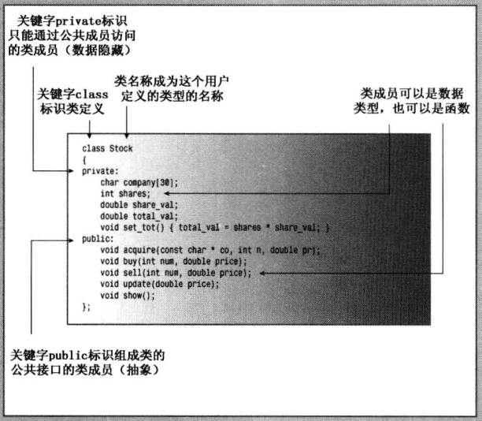
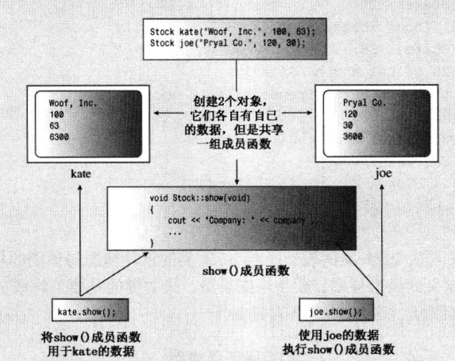
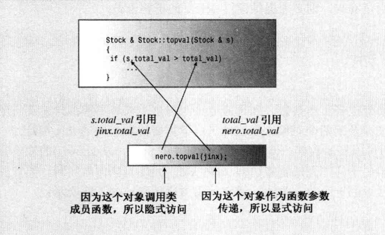
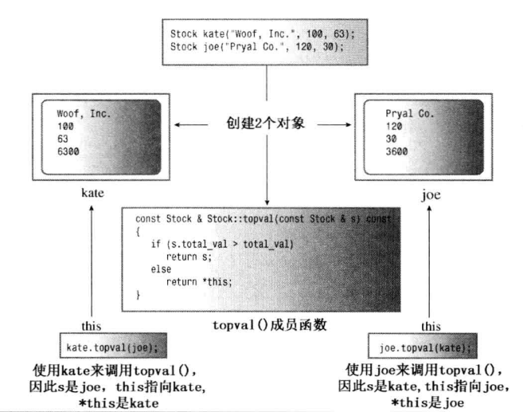

```
# 第1章-预备知识
# 第2章-开始学习C++
# 第3章-处理数据
# 第4章-复合类型
# 第5章-循环和关系表达式
# 第6章-分支语句和逻辑运算符
# 第7章-函数一C++ 的编程模块
# 第08章-函数探幽
# 第09章-内存模型和名称空间
```


# 第10章-对象和类

本章内容包括：

- 过程性编程和面向对象编程。
- 类概念。
- 如何定义和实现类。
- 公有类访问和私有 类访问。
- 类的数据成员。
- 类方法(类函数成员)。
- 创建和使用类对象。
- 类的构造函数和析构函数。
- const成员函数。
- this指针。
- 创建对象数组。
- 类作用域。
- 抽象数据类型。

面向对象编程(OOP)是一种特殊的、设计程序的概念性方法，C++通过一些特性改进了 C语言，使得应用这种方法更容易。下面是最重要的OOP特性：

- 抽象；
- 封装和数据隐藏；
- 多态；
- 代码的可重用性。

为了实现这些特性并将它们组合在一起，C++所做的最重要的改进是提供了类。本章首先介绍类，将解释抽象、封装、数据隐藏，并演示类是如何实现这些特性的。本章还将讨论如何定义类、如何为类提供公有部分和私有部分以及如何创建使用类数据的成员函数。另外，还将介绍构造函数和析构函数，它们是特殊的成员函数，用于创建和删除属于当前类的对象。最后介绍this 指针，对于有些类编程而言，它是至关重要的。后面的章节还将把讨论扩展到运算符重载(另一种多态)和继承，它们是代码重用的基础。

## 过程性编程和面向对象编程

虽然本书前面偶尔探讨过OOP在编程方面的前景，但讨论的更多的还是诸如C、Pascal 和BASIC等语言的标准过程性方法。下面来看一个例子，它揭示了OOP的观点与过程性编程的差别。

GenreGiants垒球队的一名新成员被要求记录球队的统计数据。很自然，会求助于计算机来完成这项工作。如果是一位过程性程序员，可能会这样考虑：

我要输入每名选手的姓名、击球次数、击中次数、命中率（命中率指的是选手正式的击球次数除以击中次数；当选手在垒上或被罚出局时，击球停止，但某些情况不计作正式击球次数，如选手走步时）以及其他重要的基本统计数据。之所以使用计算机，是为了简化工作，因此让它来计算某些数据，如命中率。另外，我还希望程序能够显示这些结果。应如何组织呢?我想我能正确地完成这项工作，并使用了函数。是的，我让main( )调用一个函数来获取输入，调用另一个函数来进行计算， 然后再调用第三个函数来显示结果。那么，获得下一场比赛的数据后，又该做什么呢?我不想再从头开始，可以添加一个函数来更新统计数据。可能需要在main( )中提供一个菜单， 选择是输入、计算、更新还是显示数据。则如何表示这些数据呢?可以用一个字符串数组来存储选手的姓名，用另一个数组存储每一位选手的击球数，再用一个数组存储击中数目等等。这种方法太不灵活了，可以设计一个结构来存储每位选手的所有信息，然后用这种结构组成的数组来表示整个球队。

总之，采用过程性编程方法时，首先考虑要遵循的步骤，然后考虑如何表示这些数据(并不需要程序一直运行，用户可能希望能够将数据存储在一个文件中，然后从这个文件中读取数据)。

如果换成一位00P程序员，又将如何呢?首先考虑数据一不仅要考虑如何表示数据，还要考虑如何使用数据：

我要跟踪的是什么?当然是选手。因此要有一个对象表示整个选手的各个方面(而不仅仅是命中率或击球次数)。是的，这将是基本数据单元一-个表示选手的姓名和统计数据的对象。我需要一些处理该对象的方法。首先需要-种将基本信息加入到该单元中的方法；其次，计算机应计算一些东西， 如命中率，因此需要添加一些执行计算的方法。程序应自动完成这些计算，而无需用户干涉。另外，还需要-些更新和显示信息的方法。所以，用户与数据交互的方式有三种：初始化、更新和报告一这 就是用户接口。

总之，采用OOP方法时，首先从用户的角度考虑对象一描述对 象所需的数据以及描述用户与数据交互所需的操作。完成对接口的描述后，需要确定如何实现接口和数据存储。最后，使用新的设计方案创建出程序。

## 抽象和类

生活中充满复杂性，处理复杂性的方法之一是简化和抽象。人的身体是由无数个原子组成的，而一些学者认为人的思想是由半自主的主体组成的。但将人自己看作一个实体将简单得多。在计算中，为了根据信息与用户之间的接口来表示它，抽象是至关重要的。也就是说，将问题的本质特征抽象出来，并根据特征来描述解决方案。在垒球统计数据示例中，接口描述了用户如何初始化、更新和显示数据。抽象是通往用户定义类型的捷径，在C++中，用户定义类型指的是实现抽象接口的类设计。

### 类型是什么

我们来看看是什么构成了类型。例如，讨厌鬼是什么?受流行的固定模式影响，可能会指出讨厌鬼的一些外表特点：胖、戴黑宽边眼镜、兜里插满钢笔等。稍加思索后，又可能觉得从行为上定义讨厌鬼可能更合适，如他(或她)是如何应对尴尬的社交场面的。如果将这种类比扩展到过程性语言(如c语言)，我们得到类似的情形。首先，倾向于根据数据的外观( 在内存中如何存储)来考虑数据类型。例如，char占用1个字节的内存，而double通常占用8个字节的内存。但是稍加思索就会发现，也可以根据要对它执行的操作来定义数据类型。例如，int 类型可以使用所有的算术运算，可对整数执行加、减、乘除运算，还可以对它们使用求模运算符(%)。

而指针需要的内存数量很可能与int相同，甚至可能在内部被表示为整数。但不能对指针执行与整数相同的运算。例如，不能将两个指针相乘，这种运算没有意义的，因此C++没有实现这种运算。因此，将变量声明为int 或float指针时，不仅仅是分配内存，还规定了可对变量执行的操作。总之，指定基本类型完成了三项工作：

- 决定数据对象需要的内存数量；
- 决定如何解释内存中的位(long和foat在内存中占用的位数相同，但将它们转换为数值的方法不同)；
- 决定可使用数据对象执行的操作或方法。

对于内置类型来说，有关操作的信息被内置到编译器中。但在C++中定义用户自定义的类型时，必须自己提供这些信息。付出这些劳动换来了根据实际需要定制新数据类型的强大功能和灵活性。

### C++中的类

类是一种将抽象转换为用户定义类型的C++工具，它将数据表示和操纵数据的方法组合成一个整洁的包。下面来看一个表示股票的类。

首先，必须考虑如何表示股票。可以将一股作为基本单元，定义一个表示一股股票的类。然而，这意味着需要100个对象才能表示100股，这不现实。相反，可以将某人当前持有的某种股票作为一个基本单元，数据表示中包含他持有的股票数量。一种比较现实的方法是，必须记录最初购买价格和购买日期(用于计算纳税)等内容。另外，还必须管理诸如如拆股等事件。首次定义类就考虑这么多因素有些困难，因此我们对其进行简化。具体地说，应该将可执行的操作限制为：

- 获得股票；
- 增持；
- 卖出股票；
- 更新股票价格；
- 显示关于所持股票的信息。

可以根据上述清单定义stock类的公有接口( 如果您有兴趣，还可以添加其他特性)。为支持该接口，需要存储一些信息。 我们再次进行简化。例如，不考虑标准的美式股票计价方式(八分之一美元的倍数。显然，纽约证券交易所一定看到过本书以前的版本中关于简化的论述，因为它已经决定将系统转换为书中采用的方式)。我们将存储下面的信息：

- 公司名称；
- 所持股 票的数量；
- 每股的价格；
- 股票总值。

接下来定义类。一般来说，类规范由两个部分组成。

- 类声明： 以数据成员的方式描述数据部分，以成员函数( 被称为方法)的方式描述公有接口。
- 类方法定义：描述如何实现类成员函数。

简单地说，类声明提供了类的蓝图，而方法定义则提供了细节。

`什么是接口`

> 接口是一个共享框架，供两个系统(如在计算机和打印机之间或者用户或计算机程序之间)交互时使用；例如，用户可能是您，而程序可能是字处理器。使用字处理器时，您不能直接将脑子中想到的词传输到计算机内存中，而必须同程序提供的接口交互。您敲打键盘时，计算机将字符显示到屏幕上；您移动鼠标时，计算机移动屏幕上的光标；您无意间单击鼠标时，计算机对您输入的段落进行奇怪的处理。程序接口将您的意图转换为存储在计算机中的具体信息。
>
> 对于类，我们说公共接口。在这里，公众(public)是使用类的程序，交互系统由类对象组成，而接口由编写类的人提供的方法组成。接口让程序员能够编写与类对象交互的代码，从而让程序能够使用类对象。例如，要计算string对象中包含多少个字符，您无需打开对象，而只需使用string 类提供的size()方法。类设计禁止公共用户直接访问类，但公众可以使用方法size()。方法size()是用户和string类对象之间的公共接口的组成部分。通常，方法getline( )是istream类的公共接口的组成部分，使用cin 的程序不是直接与cin对象内部交互来读取一行输入，而是使用getine( )。
>
> 如果希望更人性化，不要将使用类的程序视为公共用户，而将编写程序的人视为公共用户。然而，要使用某个类，必须了解其公共接口；要编写类，必须创建其公共接口。

为开发一个类并编写一个使用它的程序，需要完成多个步骤。这里将开发过程分成多个阶段，而不是一次性完成。通常，C++程序员将接口(类定义)放在头文件中，并将实现(类方法的代码)放在源代码文件中。这里采用这种典型做法。程序清单10.1 是第一个阶段的代码，它是Stock类的类声明。这个文件按第9章介绍的那样，使用了#ifndef等来访问多次包含同一个文件。

为帮助识别类，本书遵循一种常见但不通用的约定一将类名 首字母大写。您将发现，程序清单10.1 看起来就像一个结构声明，只是还包括成员函数、公有部分和私有部分等内容。稍后将对该声明进行改进(所以不要将它用作模型)，但先来看一看该定义的工作方式。

`程序清单10.1 stock00.h`

```c++
// stock00.h -- Stock class interface
// version 00
#ifndef STOCK00_H_
#define STOCK00_H_

#include <string>  

class Stock  // class declaration
{
private: 
    std::string company;
    long shares;
    double share_val;
    double total_val;
    void set_tot() { total_val = shares * share_val; }
public:
    void acquire(const std::string & co, long n, double pr);
    void buy(long num, double price);
    void sell(long num, double price);
    void update(double price);
    void show();
};    // note semicolon at the end

#endif
```

稍后将详细介绍类的细节，但先看一下更通用的特性。首先，C++关键字class指出这些代码定义了一个类设计(不同于在模板参数中，在这里，关键字class和typename不是同义词，不能使用typename代替class)。这种语法指出，Stock是这个新类的类型名。该声明让我们能够声明Stock类型的变量一称为对象或实例。每个对象都表示一支股票。例如，下面的声明创建两个Stock对象，它们分别名为sally和solly: 

```c++
Stock sally;
Stock solly;
```

例如，sally对象可以表示Sally持有的某公司股票。

接下来，要存储的数据以类数据成员(如company和Shares)的形式出现。例如，sally 的company成员存储了公司名称，sShare成员存储了Sally持有的股票数量，shareval成员存储了每股的价格，total val成员存储了股票总价格。同样，要执行的操作以类函数成员(方法，如sel( )和update())的形式出现。成员函数可以就地定义(如set_ tot( ))，也可以用原型表示( 如其他成员函数)。其他成员函数的完整定义稍后将介绍，它们包含在实现文件中；但对于描述函数接口而言，原型足够了。将数据和方法组合成一个单元是类最吸引人的特性。有了这种设计，创建Stock对象时，将自动制定使用对象的规则。

istream和ostream类有成员函数，如get()和getine()，而Stock类声明中的函数原型说明了成员函数是如何建立的。例如，头文件iostream将getline( )的原型放在istream类的声明中。

1. 访问控制

关键字private和public 也是新的，它们描述了对类成员的访问控制。使用类对象的程序都可以直接访问公有部分，但只能通过公有成员函数(或友元函数，参见第11章)来访问对象的私有成员。例如，要修改Stock类的shares 成员，只能通过Stock的成员函数。因此，公有成员函数是程序和对象的私有成员之间的桥梁，提供了对象和程序之间的接口。防止程序直接访问数据被称为数据隐藏(参见图10.1)。 C++还提供了第三个访问控制关键字protected, 第13章介绍类继承时将讨论该关键字。



<center>图10.1 Stock 类
类设计尽可能将公有接口与实现细节分开。公有接口表示设计的抽象组件。将实现细节放在一起并将它们与抽象分开被称为封装。数据隐藏(将数据放在类的私有部分中)是一~种封装，将实现的细节隐藏在私有部分中，就像Stock类对set tot( )所做的那样，也是一种封装。封装的另一个例子是，将类函数定义和类声明放在不同的文件中。

`OOP和C++`

> OOP是一种编程风格，从某种程度说，它用于任何一种语言中。当然，可以将0OP思想融合到常规的C语言程序中。例如，在第9章的一个示例(程序清单9.1、程序清单9.2、程序清单9.3)中，头文件中包含结构原型和操纵该结构的函数的原型，便是这样的例子。因此，main( )函数只需定义这个结构类型的变量，并使用相关函数处理这些变量即可； main( )不直接访问结构成员。实际上，该示例定义了一种抽象类型，它将存储格式和函数原型置于头文件中，对main( )隐藏了实际的数据表示。然而，C++中包括了许多专门用来实现00P方法的特性，因此它使程序员更进一步。首先，将数据表示和函数原型放在一个类声明中(而不是放在一个文件中)，通过将所有内容放在一个类声明中，来使描述成为一个整体。其次，让数据表示成为私有，使得数据只能被授权的函数访问。在c语言的例子中，如果main( )直接访问了结构成员，则违反了00P的精神，但没有违反C语言的规则。然而，试图直接访问Stock 对象的shares 成员便违反了C++语言的规则，编译器将捕获这种错误。

数据隐藏不仅可以防止直接访问数据，还让开发者(类的用户)无需了解数据是如何被表示的。例如，show( )成员将显示某支股票的总价格(还有其他内容)，这个值可以存储在对象中(上述代码正是这样做的)，也可以在需要时通过计算得到。从使用类的角度看，使用哪种方法没有什么区别。所需要知道的只是各种成员函数的功能；也就是说，需要知道成员函数接受什么样的参数以及返回什么类型的值。原则是将实现细节从接口设计中分离出来。如果以后找到了更好的、实现数据表示或成员函数细节的方法，可以对这些细节进行修改，而无需修改程序接口，这使程序维护起来更容易。

2. 控制对成员的访问：公有还是私有

无论类成员是数据成员还是成员函数，都可以在类的公有部分或私有部分中声明它。但由于隐藏数据是OOP主要的目标之一，因此数据项通常放在私有部分，组成类接口的成员函数放在公有部分；否则，就无法从程序中调用这些函数。正如Stock声明所表明的，也可以把成员函数放在私有部分中。不能直接从程序中调用这种函数，但公有方法却可以使用它们。通常，程序员使用私有成员函数来处理不属于公有接口的实现细节。，

不必在类声明中使用关键字private,因为这是类对象的默认访问控制：

```c++
class world
{
    float mass ；// private by default
    char name[20] ；// private by default
        
public:
    void tellall (void) ；
    ...
}
```

然而，为强调数据隐藏的概念，本书显式地使用了private。

`类和结构`

> 类描述看上去很像是包含成员函数以及public和private可见性标签的结构声明。实际上，C++对结构进行了扩展，使之具有与类相同的特性。它们之间唯一的区别是，结构的默认访问类型是public, 而类为private。C++程序员通常使用类来实现类描述，而把结构限制为只表示纯粹的数据对象(常被称为普通老式数据( POD, Plain Old Data)结构)。

### 实现类成员函数

还需要创建类描述的第二部分：为那些由类声明中的原型表示的成员函数提供代码。成员函数定义与常规函数定义非常相似，它们有函数头和函数体，也可以有返回类型和参数。但是它们还有两个特殊的特征：

- 定义成员函数时，使用作用域解析运算符(::) 来标识函数所属的类；
- 类方法可 以访问类的private组件。

首先，成员函数的函数头使用作用域运算符解析(::)来指出函数所属的类。例如，update()成员函数的函数头如下：

```c++
void Stock: :update (double price)
```

这种表示法意味着我们定义的update()函数是Stock类的成员。这不仅将update()标识为成员函数，还意味着我们可以将另--个类的成员函数也命名为update()。例如，Buffoon()类的update()函数的函数头如下：

```c++
void Buffoon: :update()
```

因此，作用域解析运算符确定了方法定义对应的类的身份。我们说，标识符update( )具有类作用域( classscope)。Stock 类的其他成员函数不必使用作用域解析运算符，就可以使用update( )方法，这是因为它们属于同一个类，因此update( )是可见的。然而，在类声明和方法定义之外使用update( )时，需要采取特殊的措施，稍后将作介绍。

类方法的完整名称中包括类名。我们说，Stock::update( )是函数的限定名( qualified name)；而简单的update( )是全名的缩写(非限定名，unqualified name)，它只能在类作用域中使用。

方法的第二个特点是，方法可以访问类的私有成员。例如，show( )方法可以使用这样的代码：

```c++
std::cout << "Company: " <
company
Shares: " << shares << endl
hare Price: $" << share _val
Total worth: $"《< total _val《< endl ；
```

其中，company、shares等都是Stock类的私有数据成员。如果试图使用非成员函数访问这些数据成员，编译器禁止这样做(但第11章中将介绍的友元函数例外)。

了解这两点后，就可以实现类方法了，如程序清单10.2所示。这里将它们放在了一个独立的实现文件中，因此需要包含头文件stock0.h,让编译器能够访问类定义。为让您获得更多有关名称空间的经验，在有些方法中使用了限定符std:;在其他方法中则使用了using声明。

`程序清单10.2 stock00.cpp`

```c++
// stock00.cpp -- implementing the Stock class
// version 00
#include <iostream>
#include "stock00.h"

void Stock::acquire(const std::string & co, long n, double pr)
{
    company = co;
    if (n < 0)
    {
        std::cout << "Number of shares can't be negative; "
                  << company << " shares set to 0.\n";
        shares = 0;
    }
    else
        shares = n;
    share_val = pr;
    set_tot();
}

void Stock::buy(long num, double price)
{
     if (num < 0)
    {
        std::cout << "Number of shares purchased can't be negative. "
             << "Transaction is aborted.\n";
    }
    else
    {
        shares += num;
        share_val = price;
        set_tot();
    }
}

void Stock::sell(long num, double price)
{
    using std::cout;
    if (num < 0)
    {
        cout << "Number of shares sold can't be negative. "
             << "Transaction is aborted.\n";
    }
    else if (num > shares)
    {
        cout << "You can't sell more than you have! "
             << "Transaction is aborted.\n";
    }
    else
    {
        shares -= num;
        share_val = price;
        set_tot();
    }
}

void Stock::update(double price)
{
    share_val = price;
    set_tot();
}

void Stock::show()
{
    std::cout << "Company: " << company
              << "  Shares: " << shares << '\n'
              << "  Share Price: $" << share_val
              << "  Total Worth: $" << total_val << '\n';
}

```

1. 成员函数说明

acquire( )函数管理对某个公司股票的首次购买，而buy( )和sell( )管理增加或减少持有的股票。方法buy( )和sell( )确保买入或卖出的股数不为负。另外，如果用户试图卖出超过他持有的股票数量，则sell( )函数将结束这次交易。这种使数据私有并限于对公有函数访问的技术允许我们能够控制数据如何被使用；在这个例子中，它允许我们加入这些安全防护措施，避免不适当的交易。

4个成员函数设置或重新设置了total val 成员值。这个类并非将计算代码编写4次，而是让每个函数都调用set. tot( )函数。由于set tot( )只是实现代码的一种方式，而不是公有接口的组成部分，因此这个类将其声明为私有成员函数(即编写这个类的人可以使用它，但编写代码来使用这个类的人不能使用)。如果计算代码很长，则这种方法还可以省去许多输入代码的工作，并可节省空间。然而，这种方法的主要价值在于，通过使用函数调用，而不是每次重新输入计算代码，可以确保执行的计算完全相同。另外，如果必须修订计算代码(在这个例子中，这种可能性不大)，则只需在一个地方进行修改即可。

2. 内联方法

其定义位于类声明中的函数都将自动成为内联函数，因此Stock::set_tot( )是一个内联函数。类声明常将短小的成员函数作为内联函数，set_tot()符合这样的要求。

如果愿意，也可以在类声明之外定义成员函数，并使其成为内联函数。为此，只需在类实现部分中定义函数时使用inline限定符即可：

```c++
class Stock
{
    private:
    	...
        void set_ tot()； // definition kept separate
            
	public: 
    	...
};

inline void Stock::set_tot() // use inline in definition
{
    total_ val = shares * share_ val;
}
```

内联函数的特殊规则要求在每个使用它们的文件中都对其进行定义。确保内联定义对多文件程序中的所有文件都可用的、最简便的方法是：将内联定义放在定义类的头文件中(有些开发系统包含智能链接程序，允许将内联定义放在一个独立的实现文件)。

顺便说一句， 根据改写规则(rewrite rule)，在类声明中定义方法等同于用原型替换方法定义，然后在类声明的后面将定义改写为内联函数。也就是说，程序清单10.1中set .tot( )的内联定义与上述代码(定义紧跟在类声明之后)是等价的。

3. 方法使用哪个对象

下面介绍使用对象时最重要的一个方面：如何将类方法应用于对象。下面的代码使用了一个对象的shares成员：

```c++
shares += num;
```

是哪个对象呢?问得好!要回答这个问题，首先来看看如何创建对象。最简单的方式是声明类变量：

```c++
Stock kate, joe;
```

这将创建两个Stock类对象，一个为kate,另一个为joe。

接下来，看看如何使用对象的成员函数。和使用结构成员一样，通过成员运算符：

```c++
kate. show() ；// the kate object calls the member function
joe . show() ；// the joe object calls the member function
```

第1条语句调用kate 对象的show( )成员。这意味着show( )方法将把shares 解释为kate.shares, 将share_vla解释为kate.share_val。 同样，函数调用joe.show( )使show( )方法将shares 和share val分别解释为joe.share和joe.share_val。

**注意**：调用成员函数时，它将使用被用来调用它的对象的数据成员。

同样，函数调用kate.sel( )在调用set tot( )函数时，相当于调用kate.set tot( )，这样该函数将使用kate对象的数据。

所创建的每个新对象都有自己的存储空间，用于存储其内部变量和类成员；但同一个类的所有对象共享同一组类方法， 即每种方法只有一个副本。例如，假设kate和joe都是Stock对象，则kate.shares 将占据一个内存块， 而joe.shares占用另一个内存块，但kate.show( )和joe.show( )都调用同一个方法，也就是说，它们将执行同一个代码块，只是将这些代码用于不同的数据。在00P中，调用成员函数被称为发送消息，因此将同样的消息发送给两个不同的对象将调用同一个方法，但该方法被用于两个不同的对象(参见图10.2)。



<center>图10.2对象、 数据和成员函数

### 使用类

知道如何定义类及其方法后，来创建一个程序，它创建并使用类对象。C++的 目标是使得使用类与使用基本的内置类型( 如int 和char)尽可能相同。要创建类对象，可以声明类变量，也可以使用new为类对象分配存储空间。可以将对象作为函数的参数和返回值，也可以将一个对象赋给另一个。 C+ +提供了一些工具，可用于初始化对象、让cin和cout 识别对象，甚至在相似的类对象之间进行自动类型转换。虽然要做到这些工作还需要一-段时间，但可以先从比较简单的属性着手。实际上，您已经知道如何声明类对象和调用成员函数。程序清单10.3提供了一个使用上述接口和实现文件的程序，它创建了一个名为fuffy_the_cat 的Stock对象。该程序非常简单，但确实测试了这个类的特性。要编译该程序，可使用用于多文件程序的方法，这在第1章和第9章介绍过。具体地说，将其与stock00.cpp-起编译， 并确保stock00.h位于当前文件夹中。

`程序清.单10.3 usestock0.cpp`

```c++
// usestok0.cpp -- the client program
// compile with stock.cpp
#include <iostream>
#include "stock00.h"

int main()
{
    Stock fluffy_the_cat;
    fluffy_the_cat.acquire("NanoSmart", 20, 12.50);
    fluffy_the_cat.show();
    fluffy_the_cat.buy(15, 18.125);
    fluffy_the_cat.show();
    fluffy_the_cat.sell(400, 20.00);
    fluffy_the_cat.show();
    fluffy_the_cat.buy(300000,40.125);
    fluffy_the_cat.show();
    fluffy_the_cat.sell(300000,0.125);
    fluffy_the_cat.show();
    // std::cin.get();
    return 0;
}

```

下面是该程序的输出：

```
Company: NanoSmart Shares: 20
Share Price: $12.5 Total worth: $250
Company: NanoSmart Shares: 3
Share Price: $18.125 Total Worth: $634.375
You can't sell more than you have! Transaction is aborted.
Company: NanoSmart Shares: 3
Share Price: $18.125 Total worth: $634.375
Company: NanoSmart Shares: 300035
Share Price: $40.125 Total worth: $1.20389e+007
Company: NanoSmart Shares: 3
Share Price: $0.125 Total worth: $4.375
```

注意，main( )只是用来测试Stock类的设计。当Stock类的运行情况与预期的相同后，便可以在其他程序中将Stock类作为用户定义的类型使用。要使用新类型，最关键的是要了解成员函数的功能，而不必考虑其实现细节。请参阅后面的旁注“客户/服务器模型”。

`客户/服务器模型`

> OOP程序员常依照客户/服务器模型来讨论程序设计。在这个概念中，客户是使用类的程序。类声明(包括类方法)构成了服务器，它是程序可以使用的资源。客户只能通过以公有方式定义的接口使用服务器，这意味着客户(客户程序员)唯一的责任是了解该接口。服务器(服务器设计人员)的责任是确保服务器根据该接口可靠并准确地执行。服务器设计人员只能修改类设计的实现细节，而不能修改接口。这样程序员独立地对客户和服务器进行改进，对服务器的修改不会客户的行为造成意外的影响。

### 修改实现

在前面的程序输出中，可能有一个方面让您恼火一数字的格式不一致。 现在可以改进实现，但保持接口不变。ostream类包含--些可用于控制格式的成员函数。这里不做太详细的探索，只需像在程序清单8.8那样使用方法setf0,便可避免科学计数法：

```c++
std::cout.setf (std::ios_ base::fixed, std::ios_ base::floatfield) ；
```

这设置了cout 对象的一个标记，命令cout使用定点表示法。同样，下 面的语句导致cout在使用定点表示法时，显示三位小数：

```c++
std::cout.precision(3);
```

第17章将介绍这方面的更多细节。

可在方法show0中使用这些工具来控制格式，但还有一点需要 考虑。修改方法的实现时，不应影响客户程序的其他部分。上述格式修改将一 直有效，直到您再次修改，因此它们可能影响客户程序中的后续输出。因此，show()应重置格式信息，使其恢复到自己被调用前的状态。为此，可以像程序清单8.8 那样，
使用返回的值：

```c++
sta::streamsize prec =
std::cout. precision(3)； // save preceding value for precision
sta::cout.precision(prec) ；
// reset to o1d value
// store original flags
std::ios_base::fmtflags orig = std::cout.setf(std::ios_ base::fixed) ；
// reset to stored values
std::cout.setf (orig, sta: :ios_ base: :floatfield) ；
```

您可能还记得，fntfags 是在ios base 类中定义的一种类型， 而ios base 类又是在名称空间std中定义的，因此orig的类型名非常长。其次，orig存储了所有的标记，而重置语句使用这些信息来重置foatfield,而foatfield包含定点表示法标记和科学表示法标记。第三，请不要过多考虑这里的细节。这里的要旨是，将修改限定在实现文件中，以免影响程序的其他方面。

根据上面的介绍，可在实现文件中将方法showO的定义修改成如下所示： 

```c++
void Stock: ： show()
using std: :cout;
using std: :ios_ _base ；
// set format to #，##
ios_base: ： fmtflags orig =
cout.setf (ios_base::fixed, ios_base::floatfield) ；
std::streamsize prec = cout.precision(3) ；
cout << "Company: " << company
Shares: "
shares
cout << " Share Price: $" << share_val;
// set format to #.##
cout.precision(2)；
cout << " Total worth: $" << total_val << \n'；
// restore original format
cout.setf(orig, ios_base::floatfiela) ；
cout.precision(prec) ；
```

完成上述修改后(保留头文件和客户文件不变)，可重新编译该程序。该程序的输出将类似于下面这样： 

```
Company: NanoSmart Shares: 20
Share Price: $12.500 Total Worth: $250. 00
Company: NanoSmart Shares: 3
Share Price: $18.125 Total Worth: $634.38
You can't sell more than you have! Transaction is aborted.
Company: NanoSmart Shares: 3
Share Price: $18.125 Total Worth: $634.38
Company: NanoSmart Shares: 300035
Share Price: $40.125 Total Worth: $12038904.38
Company: NanoSmart Shares: 35
Share Price: $0.125 Total Worth: $4.38
```

### 小结

指定类设计的第一步 是提供类声明。类声明类似结构声明，可以包括数据成员和函数成员。声明有私有部分，在其中声明的成员只能通过成员函数进行访问；声明还具有公有部分，在其中声明的成员可被使用类对象的程序直接访问。通常，数据成员被放在私有部分中，成员函数被放在公有部分中，因此典型的类声明的格式如下：

```c++
class className
{
    private:
    	data member declarations
    public:
    	member function prototypes
};
```

公有部分的内容构成了设计的抽象部分——公有接口。将数据封装到私有部分中可以保护数据的完整性，这被称为数据隐藏。因此，C++通过类使得实现抽象、数据隐藏和封装等00P特性很容易。

指定类设计的第二步是实现类成员函数。可以在类声明中提供完整的函数定义，而不是函数原型，但是通常的做法是单独提供函数定义(除非函数很小)。在这种情况下，需要使用作用域解析运算符来指出成员函数属于哪个类。例如，假设Bozo有一个名为Retort( )的成员函数，该函数返回char 指针，则其函数头如下所示： 

```c++
char * BozO::Retort()
```

换句话来说，Retort( )不仅是一个char *类型的函数，而是一个属于Bozo类的char *函数。该函数的全名(或限定名)为Bozo::Retort( )。而名称Retort( )是限定名的缩写，只能在某些特定的环境中使用，如类方法的代码中。

另一种描述这种情况的方式是，名称Retort的作用域为整个类，因此在类声明和类方法之外使用该名称时，需要使用作用域解析运算符进行限定。

要创建对象(类的实例)，只需将类名视为类型名即可：

```c++
Boz bozetta;
```

这样做是可行的，因为类是用户定义的类型。

类成员函数(方法)可通过类对象来调用。为此，需要使用成员运算符句点：

```c++
cout << Bozetta.Retort()；
```

这将调用Retort()成员函数，每当其中的代码引用某个数据成员时，该函数都将使用bozetta对象中相应成员的值。

## 类的构造百数和析构雨数

对于Stock类，还有其他一些工作要做。应为类提供被称为构造函数和析构函数的标准函数。下面来看一看为什么需要这些函数以及如何使用这些函数。

C++的目标之一是让使用类对象就像使用标准类型一~样，然而，到现在为止，本章提供的代码还不能让您像初始化int或结构那样来初始化Stock对象。也就是说，常规的初始化语法不适用于类型

```c++
Stock:
	int year = 2001;  // valid initialization
	struct thing
    {
        char *
        int m;
    };

	thing amabob = { "wodget"， -23}；// valid initialization
	Stock hot = {"Sukie's Autos, Inc."， 200，50.25}；// NO! compile error
```

不能像上面这样初始化Stock对象的原因在于，数据部分的访问状态是私有的，这意味着程序不能直接访问数据成员。您已经看到，程序只能通过成员函数来访问数据成员，因此需要设计合适的成员函数，才能成功地将对象初始化(如果使数据成员成为公有，而不是私有，就可以按刚才介绍的方法初始化类对象，但使数据成为公有的违背了类的一个主要初衷：数据隐藏)。

一般来说， 最好是在创建对象时对它进行初始化。例如，请看下面的代码：

```c++
Stock gift;
gift.buy(10, 24.75)；
```

就Stock类当前的实现而言，gift对象的company成员是没有值的。类设计假设用户在调用任何其他成员函数之前调用acquire()，但无法强加这种假设。避开这种问题的方法之一是在创建对象时，自动对它进行初始化。为此，C++提供了一个特殊的成员函数——类构造函数， 专门用于构造新对象、将值赋给它们的数据成员。更准确地说，C++为这些成员函数提供了名称和使用语法，而程序员需要提供方法定义。名称与类名相同。例如，Stock类一个可能的构造函数是名为Stock()的成员函数。构造函数的原型和函数头有一个有趣的特征一虽然没有返回值， 但没有被声明为void类型。实际上，构造函数没有声明类型。

### 声明和定义构造函数

现在需要创建Stock的构造函数。由于需要为Stock 对象提供3个值，因此应为构造函数提供3个参数。(第4个值，total val 成员，是根据shares和share_ val 计算得到的，因此不必为构造函数提供这个值。)程序员可能只想设置company成员，而将其他值设置为0;这可以使用默认参数来完成(参见第8章)。因此，原型如下所示： 

```c++
// constructor prototype with some default arguments
Stock (const string & co，long n = 0，double pr = 0.0)；
```

第一个参数是指向字符串的指针，该字符串用于初始化成员companyon和pr参数为shares和share_val成员提供值。注意，没有返回类型。原型位于类声明的公有部分。

下面是构造函数的一种可能定义：

```c++
// constructor definition
Stock: :Stock(const string & co，long n，double pr)
{
company = CO;
if(n<0)
{
std: :cerr << "INumber of shares can't be negative;
company << " shares set to 0. \n"；
shares = 0;
}
else
    shares = n;
share. _val = pr;
set_ tot()；
}
```

上述代码和本章前面的函数acquire( )相同。区别在于，程序声明对象时，将自动调用构造函数。


---

`成员名和参数名`

不熟悉构造函数的您会试图将类成员名称用作构造函数的参数名，如下所示：

```c++
// NO!
Stock: :Stock (const string & company, long shares, double share_ val)
```

这是错误的。构造函数的参数表示的不是类成员，而是赋给类成员的值。因此，参数名不能与类成员相同，否则最终的代码将是这样的：

```c++
shares = shares;
```


另一种常见的做法是，在成员名中使用后缀：

```c++
class Stock
{
private:
    string company_;
    long shares_;
    ...
```

无论采用哪种做法，都可在公有接口中在参数名中包含company和shareso

---

### 使用构造函数

C++提供了两种使用构造函数来初始化对象的方式。第一种方式是显式地调用构造函数：

```c++
Stock food = Stock ("Wor1d Cabbage"， 250， 1.25)；
```

这将food对象的company成员设置为字符串“WorldCabbage”，将shares成员设置为250，依此类推。

另一种方式是隐式地调用构造函数：

```c++
Stock garment ("Furry Mason"，50， 2.5) ；
```

这种格式更紧凑，它与下面的显式调用等价：

```c++
Stock garment = Stock("Furry Mason"， 50， 2.5))；
```

每次创建类对象(甚至使用new动态分配内存)时， C++都使用类构造函数。下面是将构造函数与new一起使用的方法：

```c++
Stock *pstock = new Stock ("Electroshock Games"， 18，19.0) ；
```

这条语句创建一个 Stock对象，将其初始化为参数提供的值，并将该对象的地址赋给pstock 指针。在这种情况下，对象没有名称，但可以使用指针来管理该对象。我们将在第11 章进一步讨论对象指针。

构造函数的使用方式不同于其他类方法。一 般来说，使用对象来调用方法：

```c++
stock1. show()； // stock1 object invokes show() method
```

但无法使用对象来调用构造函数，因为在构造函数构造出对象之前，对象是不存在的。因此构造函数被用来创建对象，而不能通过对象来调用。

### 默认构造函数

默认构造函数是在未提供显式初始值时，用来创建对象的构造函数。也就是说，它是用于下面这种声明的构造函数：

```c++
Stock fluffy_the_cat; // uses the default constructor
```

程序清.单10.3就是这样做的!这条语句管用的原因在于，如果没有提供任何构造函数，则C++将自动提供默认构造函数。它是默认构造函数的隐式版本，不做任何工作。对于Stock 类来说，默认构造函数可能如下：

```c++
Stock::Stock() { }
```

因此将创建fuffy_the_cat 对象，但不初始化其成员，这和下面的语句创建x,但没有提供值给它一样：

```c++
int x;
```

默认构造函数没有参数，因为声明中不包含值。

奇怪的是，当且仅当没有定义任何构造函数时，编译器才会提供默认构造函数。为类定义了构造函数后，程序员就必须为它提供默认构造函数。如果提供了非默认构造函数(如Stock(constchar*co,intn,double pr)，但没有提供默认构造函数，则下面的声明将出错：

```c++
Stock stock1; // not possible with current constructor
```

这样做的原因可能是想禁止创建未初始化的对象。然而，如果要创建对象，而不显式地初始化，则必须定义一个不接受任何参数的默认构造函数。定义默认构造函数的方式有两种。一种 是给已有构造函数的所有参数提供默认值：

```c++
Stock(const string & co = "Error"， int n = 0, double pr = 0.0)；
```

另一种方式是通过函数重载来定义另一个构造函数一个没有参数的构造函数：

```c++
Stock()；
```

由于只能有一个默认构造函数，因此不要同时采用这两种方式。实际上，通常应初始化所有的对象，以确保所有成员-开始就有已知的合理值。因此，用户定义的默认构造函数通常给所有成员提供隐式初始值。例如，下面是为Stock 类定义的一个默认构造函数：

```c++
Stock: :Stock()  // default constructor
{
    company = "no name";
    shares = 0;
    share_ val = 0.0;
    total_ val = 0.0;
}
```

**提示**：在设计类时，通常应提供对所有类成员做隐式初始化的默认构造函数。

使用上述任何一种方式(没有参数或所有参数都有默认值)创建了默认构造函数后，便可以声明对象变量，而不对它们进行显式初始化： 

```c++
Stock first;  // calls default constructor implicitly
Stock first = Stock() ；// calls it explicitly
Stock *prelief = new Stock; // calls it implicitly
```

然而，不要被非默认构造函数的隐式形式所误导：

```c++
Stock first ("Concrete Congl omerate")；// calls constructor
Stock second() ；// declares a function
Stock third;  // calls default constructor
```

第一个声明调用非默认构造函数，即接受参数的构造函数；第二个声明指出， second( )是一个返回Stock对象的函数。隐式地调用默认构造函数时，不要使用圆括号。

### 析构函数

用构造函数创建对象后，程序负责跟踪该对象，直到其过期为止。对象过期时，程序将自动调用一个特殊的成员函数，该函数的名称令人生畏——析构函数。 析构函数完成清理工作，因此实际上很有用。例如， 如果构造函数使用new来分配内存，则析构函数将使用delete来释放这些内存。Stock的构造函数没有使用new,因此析构函数实际上没有需要完成的任务。在这种情况下，只需让编译器生成一个什么要不做的隐式析构函数即可，Stock 类第一版正是这样做的。 然而，了 解如何声明和定义析构函数是绝对必要的，下面为Stock类提供一个析构函数。

和构造函数一样， 析构函数的名称也很特殊：在类名前加上~。因此，Stock 类的析构函数为~Stock( )。另外，和构造函数一样，析构函数也可以没有返回值和声明类型。与构造函数不同的是，析构函数没有参数，因此Stock析构函数的原型必须是这样的：

```c++
~Stock() ；
```

由于Stock的析构函数不承担任何重要的工作，因此可以将它编写为不执行任何操作的函数：

```c++
Stock: ：~Stock()
```

然而，为让您能看出析构函数何时被调用，这样编写其代码： 

```c++
Stock::~Stock()  // class destructor
{
    cout << "Bye, " << company < "!\n"；
}
```

什么时候应调用析构函数呢?这由编译器决定，通常不应在代码中显式地调用析构函数(有关例外情形，请参阅第12章的“再谈定位new运算符”)。如果创建的是静态存储类对象，则其析构丽数将在程序结束时自动被调用。如果创建的是自动存储类对象(就像前面的示例中那样)，则其析构函数将在程序执行完代码块时(该对象是在其中定义的)自动被调用。如果对象是通过new创建的，则它将驻留在栈内存或自由存储区中，当使用delete来释放内存时，其析构函数将自动被调用。最后，程序可以创建临时对象来完成特定的操作，在这种情况下，程序将在结束对该对象的使用时自动调用其析构函数。

由于在类对象过期时析构函数将自动被调用，因此必须有一个析构函数。如果程序员没有提供析构函数，编译器将隐式地声明--个默认析构数，并在发现导致对象被删除的代码后，提供默认析构函数的定义。

### 改进Stock类

下面将构造函数和析构函数加入到类和方法的定义中。鉴于添加构造函数的重大意义，这里将名称从stock0.h改为stock10.h。类方法放在文件stock10.cpp中。最后，将使用这些资源的程序放在第三个文件中，这个文件名为usestock2.cpp.

1. 头文件

程序清单10.4列出了头文件。它将构造函数和析构函数的原型加入到原来的类声明中。另外，它还删除了acquire( )函数一现在已经不再需要它 了，因为有构造函数。该文件还使用第9章介绍的#ifndef技术来防止多重包含。

`程序清单10.4 stock10.h`

```c++
// stock10.h � Stock class declaration with constructors, destructor added
#ifndef STOCK1_H_
#define STOCK1_H_
#include <string>
class Stock
{
private:
    std::string company;
    long shares;
    double share_val;
    double total_val;
    void set_tot() { total_val = shares * share_val; }
public:
    Stock();        // default constructor
    Stock(const std::string & co, long n = 0, double pr = 0.0);
    ~Stock();       // noisy destructor
    void buy(long num, double price);
    void sell(long num, double price);
    void update(double price);
    void show();
};

#endif
```


2. 实现文件

程序清单10.5提供了方法的定义。它包含了文件stock10.h,以提供类声明(将文件名放在双引号而不是方括号中意味着编译器将源文件所在的目录中搜索它)。另外，程序清单10.5还包含了头文件iostream,以提供IO支持。该程序清单还使用using声明和限定名称(如st::string)来访问头文件中的各种声明。该文件将构造函数和析构函数的方法定义添加到以前的方法定义中。为让您知道这些方法何时被调用，它们都显示一条消息。这并不是构造函数和析构函数的常规功能，但有助于您更好地了解类是如何使用它们的。

`程序清单10.5 stock10.cpp`

```c++
// stock1.cpp � Stock class implementation with constructors, destructor added
#include <iostream>
#include "stock10.h"

// constructors (verbose versions)
Stock::Stock()        // default constructor
{
    std::cout << "Default constructor called\n";
    company = "no name";
    shares = 0;
    share_val = 0.0;
    total_val = 0.0;
}

Stock::Stock(const std::string & co, long n, double pr)
{
    std::cout << "Constructor using " << co << " called\n";
    company = co;

    if (n < 0)
    {
        std::cout << "Number of shares can't be negative; "
                   << company << " shares set to 0.\n";
        shares = 0;
    }
    else
        shares = n;
    share_val = pr;
    set_tot();
}
// class destructor
Stock::~Stock()        // verbose class destructor
{
    std::cout << "Bye, " << company << "!\n";
}

// other methods
void Stock::buy(long num, double price)
{
     if (num < 0)
    {
        std::cout << "Number of shares purchased can't be negative. "
             << "Transaction is aborted.\n";
    }
    else
    {
        shares += num;
        share_val = price;
        set_tot();
    }
}

void Stock::sell(long num, double price)
{
    using std::cout;
    if (num < 0)
    {
        cout << "Number of shares sold can't be negative. "
             << "Transaction is aborted.\n";
    }
    else if (num > shares)
    {
        cout << "You can't sell more than you have! "
             << "Transaction is aborted.\n";
    }
    else
    {
        shares -= num;
        share_val = price;
        set_tot();
    }
}

void Stock::update(double price)
{
    share_val = price;
    set_tot();
}

void Stock::show()
{
    using std::cout;
    using std::ios_base;
    // set format to #.###
    ios_base::fmtflags orig = 
        cout.setf(ios_base::fixed, ios_base::floatfield); 
    std::streamsize prec = cout.precision(3);

    cout << "Company: " << company
        << "  Shares: " << shares << '\n';
    cout << "  Share Price: $" << share_val;
    // set format to #.##
    cout.precision(2);
    cout << "  Total Worth: $" << total_val << '\n';

    // restore original format
    cout.setf(orig, ios_base::floatfield);
    cout.precision(prec);
}

```

3. 客户文件

程序清单10.6提供了一个测试这些新方法的小程序；由于它只是使用Stock类，因此是Stock类的客户。和stock10.cpp一样，它也包含了文件stock10.h以提供类声明。该程序显示了构造函数和析构函数，它还使用了程序清单10.3调用的格式化命令。要编译整个程序，必须使用第1章和第9章介绍的多文件程序技术。

`程序清单10.6 usestock2.cpp`

```c++
// usestok2.cpp -- using the Stock class
// compile with stock20.cpp
#include <iostream>
#include "stock20.h"

const int STKS = 4;
int main()
{{
// create an array of initialized objects
    Stock stocks[STKS] = {
        Stock("NanoSmart", 12, 20.0),
        Stock("Boffo Objects", 200, 2.0),
        Stock("Monolithic Obelisks", 130, 3.25),
        Stock("Fleep Enterprises", 60, 6.5)
        };

    std::cout << "Stock holdings:\n";
    int st;
    for (st = 0; st < STKS; st++)
        stocks[st].show();
// set pointer to first element
    const Stock * top = &stocks[0];
    for (st = 1; st < STKS; st++)
        top = &top->topval(stocks[st]);
// now top points to the most valuable holding
    std::cout << "\nMost valuable holding:\n";
	top->show();}
    // std::cin.get();
    return 0; 
}

```

编译程序清单10.4、 程序清单10.5 和程序清单10.6 所示的程序，得到一个可执行程序。下面是使用某个编译器得到的可执行程序的输出：

```
Using constructors to create new objects
Constructor using NanoSmart called
Company: NanoSmart Shares: 12
Share Price: $20.00 Total Worth: $240. 00
Constructor using Boffo 0bjects called
Company: Boffo 0bjects Shares: 2
Share Price: $2.00 Total Worth: $4. 00
Assigning stock1 to stock2 ：
Listing stockl and stock2 ：
Company: NanoSmart Shares: 1
Share Brice: $20.00 Total Worth: $240.00 
Company: NanoSmart Shares ： 12
Share Price: $20.00 Total worth: $240. 00
Using a constructor to reset an object
Constructor using Nifty Foods called
Bye, Nifty Foods!
Revised stock1:
Company: Nifty Foods Shares: 10
Share Price: $50.00 Total Worth: $500.00
Done
Bye, NanoSmart !
Bye, Nifty Foods!
```

使用某些编译器编译该程序时，该程序输出的前半部分可能如下(比前面多了一行)：

```
Using constructors to create new objects
Constructor using NanoSmart called
Company: NanoSmart Shares: 12
Share Price: $20.00 Total worth: $240.00 
Constructor using Boffo 0bjects called
Bye, Boffo 0bjects !
《additional line
Company: Boffo 0bjects Shares: 2
Share Price: $2.00 Total Worth: $4.00
```

下一小节将解释输出行“Bye, Boffo Objects!”。

提示：您可能注意到了，在程序清单10.6中,main()的开头和末尾多了一个大括号。诸如stock1和stock2等自动变量将在程序退出其定义所属代码块时消失。如果没有这些大括号，代码块将为整个main(，因此仅当main()执行完毕后，才会调用析构函数。在窗口环境中，这意味着将在两个析构函数调用前关闭，导，致您无法看到最后两条消息。但添加这些大括号后，最后两个析构函数调用将在到达返回语句前执行，从而显示相应的消息。

4. 程序说明

程序清单10.6中的下述语句：

```c++
Stock stock1 ( "NanoSmart"， 12， 20.0)；
```

创建一个名为stock1的Stock对象，并将其数据成员初始化为指定的值：

```c++
Constructor using NanoSmart called
Company: NanoSmart Shares: 12
```

下面的语句使用另一种语法创建并初始化一个 名为stock2的对象：

```c++
stock2:
Stock stock2 = Stock ("Boffo 0bjects"， 2, 2.0)；
```

C++标准允许编译器使用两种方式来执行第二种语法。一种是使其行为和第一种语法完全相同：

```
Constructor using Boffo 0bjects called
Company: Boffo 0bjects Shares: 2
```

另-种方式是允许调用构造函数来创建一个临时对象，然后将该临时对象复制到stock2中，并丢弃它。如果编译器使用的是这种方式，则将为临时对象调用析构函数，因此生成下面的输出：

```
Constructor using Boffo 0bjects called
Bye, Boffo 0bjects !
Company: Boffo 0bjects Shares: 2
```

生成上述输出的编译器可能立刻删除临时对象，但也可能会等一段时间， 在这种情况下，析构函数的消息将会过一段时 间才显示。

下面的语句表明可以将一一个 对象赋给同类型的另一个对象：

```c++
stock2 = stock1;  // object assignment
```

与给结构赋值一样，在默认情况下，给类对象赋值时，将把一个对象的成员复制给另一个。在这个例子中，stock2 原来的内容将被覆盖。

注意：在默认情况下，将一个对象赋给同类型的另一个对象时，C++将源对象的每个数据成员的内容复制到目标对象中相应的数据成员中。

构造函数不仅仅可用于初始化新对象。例如，该程序的main( )中包含下面的语句：

```c++
stockl = Stock("Nifty Foods"， 10，50.0)；
```

stockl对象已经存在，因此这条语句不是对stock1进行初始化，而是将新值赋给它。这是通过让构造程序创建一个新的、临时的对象，然后将其内容复制给stock1来实现的。随后程序调用析构函数，以删除该临时对象，如下面经过注释后的输出所示：

```
Using a constructor to reset an object
Constructor using Nifty Foods called >> temporary object created
Bye, Nifty Foods !

temporary object destroyed
Revised stock1:
Company: Nifty Foods Shares: 10 >> data now copied to stock 1
Share Price: $50.00 Total worth: $500.00
```

有些编译器可能要过一段时间才删除临时对象，因此析构函数的调用将延迟。

最后，程序显示了下面的内容：

```
Done
Bye, NanoSmart !
Bye, Nifty Foods!
```

函数main( )结束时，其局部变量(stockl 和stock2)将消失。由于这种自动变量被放在栈中，因此最后创建的对象将最先被删除，最先创建的对象将最后被删除(“ NanoSmart"最初位于stock1中，但随后被传输到stock2中，然后stock1被重置为“Nifty Food”)。

输出表明，下面两条语句有根本性的差别：

```c++
Stock stock2 = Stock ("Boffo 0bjects"， 2， 2.0)；
stock1 = Stock("Nifty Foods"， 10， 50.0)； // temporary object
```

第一条语句是初始化，它创建有指定值的对象，可能会创建临时对象(也可能不会)；第二条语句是赋值。像这样在赋值语句中使用构造函数总会导致在赋值前创建--个临时对象。

提示：如果既可以通过初始化，也可以通过赋值来设置对象的值，则应采用初始化方式。通常这种方式的效率更高。

5. C++11 列表初始化

在C++11中，可将列表初始化语法用于类吗?可以，只要提供与某个构造函数的参数列表匹配的内容，并用大括号将它们括起：

```c++
Stock hot_ tip = {"Derivatives Plus Plus"， 100， 45.0}；
Stock jock {"Sport Age Storage, Inc"}；
Stock temp { } ；
```

在前两个声明中，用大括号括起的列表与下面的构造函数匹配：

```c++
Stock: ： Stock (const std::string & co, long n = 0，double pr = 0.0) ；
```

因此，将使用该构造函数来创建这两个对象。创建对象jock时，第二和第三个参数将为默认值0和0.0。第三个声明与默认构造函数匹配，因此将使用该构造函数创建对象temp

另外，C++11还提供了名为st:initialize_ list 的类，可将其用作函数参数或方法参数的类型。这个类可表示任意长度的列表，只要所有列表项的类型都相同或可转换为相同的类型，这将在第16章介绍。

6. const成员函数

请看下面的代码片段：

```c++
const Stock land = Stock ("Kludgehorn Properties") ；
land. show() ；
```

对于当前的C+来说，编译器将拒绝第二行。 这是什么原因呢?因为show( )的代码无法确保调用对象不被修改——调用对象和const一样，不应被修改。我们以前通过将函数参数声明为const引用或指向const的指针来解决这种问题。但这里存在语法问题： show( )方法没有任何参数。相反，它所使用的对象是由方
法调用隐式地提供的。需要一种新的语法一保 证函数不会修改调用对象。C++的解决方法是将const关键字放在函数的括号后面。也就是说，show( )声明应像这样：

```c++
oid show() const;  // promises not to change invoking object
```

同样，函数定义的开头应像这样：

```c++
void stock: :show() const  // promises not to change invoking object
```

以这种方式声明和定义的类函数被称为const成员函数。就像应尽可能将const引用和指针用作函数形参一样，只要类方法不修改调用对象，就应将其声明为const从现在开始，我们将遵守这一规则。

### 构造函数和析构函数小结

介绍一些构造函数和析构函数的例子后，您可能想停下来，整理一下学到的知识。为此，下面对这些方法进行总结。

构造函数是一种特殊的类成员函数，在创建类对象时被调用。构造丽数的名称和类名相同，但通过函数重载，可以创建多个同名的构造函数，条件是每个函数的特征标(参数列表)都不同。另外，构造函数没有声明类型。通常，构造函数用于初始化类对象的成员，初始化应与构造函数的参数列表匹配。例如，假设Bozo类的构造函数的原型如下：

```c++
Bozo (const char * fname, const char * Iname) ；  // constructor prototype
```

则可以使用它来初始化新对象：

```c++
BozO bozetta = bozo ("Bozetta"， "Biggens") ； // primary form
Bozo fufu ("Fufu"， "O' Dweeb") ； // short form
BozO *pC = new Bozo("PopO"， "Le Peu") ； // dynamic object
```

如果编译器支持C++11,则可使用列表初始化：

```c++
Bozo bozetta = {"Bozetta"， "Biggens"}； // C++11
Bozo fufu{"Fufu"， "O' Dweeb" }  // C++11;
Bozo *pc = new Bozo{"Popo"， "Le Peu"}；  // C++11
```

如果构造函数只有一个参数，则将对象初始化为一个与参数的类型相同的值时，该构造函数将被调用。例如，假设有这样一个构造函数原型：

```c++
cout << trip;
```

则可以使用下面的任何--种形式来初始化对象：

```c++
Bozo dribble = bozo(44) ； // primary form
Bozo roon(66) ； // secondary form
Bozo tubby = 32;  // special form for one-argument const ructors
```

实际上，第三个示例是新内容，不属于复习内容，但现在正是介绍它的好时机。第11章将介绍一种关闭这项特性的方式，因为它可能带来令人不愉快的意外。

警告：接受一个参数的构造函数允许使用赋值语法将对象初始化为一个值：

```c++
Classname object = value;
```

这种特性可能导致问题，但正如第11章将介绍的，可关闭这项特性。

默认构造函数没有参数，因此如果创建对象时没有进行显式地初始化，则将调用默认构造函数。如果程序中没有提供任何构造函数，则编译器会为程序定义一个默认构造函数；否则，必须自己提供默认构造函数。默认构造函数可以没有任何参数；如果有，则必须给所有参数都提供默认值：

```c++
Bozo()；  // default constructor prototype
Bistro (const char * s = "Chez Zero") ；  // default for Bistro class
```

对于未被初始化的对象，程序将使用默认构造函数来创建：

```c++
Bozo bubi;  // use default
Bozo *pb = new Bozo;  // use default
```

就像对象被创建时程序将调用构造函数一样，当对象被删除时，程序将调用析构函数。每个类都只能有一个析构函数。析构函数没有返回类型(连void都没有)，也没有参数，其名称为类名称前加上~。例如，Bozo类的析构函数的原型如下：

```c++
~Bozo() ；  // class destructor
```

如果构造函数使用了new,则必须提供使用delete 的析构函数。

## this指针

对于Stock 类，还有很多工作要做。到目前为止，每个类成员函数都只涉及一个对象，即调用它的对象。但有时候方法可能涉及到两个对象，在这种情况下需要使用C++的this指针。

虽然Stock类声明可以显示数据，但它缺乏分析能力。例如，从show( )的输出我们可以知道持有的哪-支股票价格最高，但由于程序无法直接访问total val, 因此无法作出判断。要让程序知道存储的数据，最直接的方式是让方法返回一个值。为此，通常使用内联代码，如下例所示：

```
class Stock
private:
double total val;
public:
double total() const { return total_ val; }
```

就直接程序访问而言，上述定 义实际上是使total val 为只读的。也就是说，可以使用方法total va( )来获得total \_val 的值，但这个类没有提供专门用于重新设置total val 的值的方法(作为一种副产品，其他方法，如buy( ) sll(l )和update( )确实在重新设置成员shares和share val 的值的同时修改了total val 的值)。

通过将该函数添加到类声明中，可以让程序查看- - 系列股票，找到价格最高的那一支。然而，可以采用另一~种方法一种帮助您了 解this 指针的方法。这种方法是，定义一个成员函数，它查看两个Stock对象，并返回股价较高的那个对象的引用。实现这种方法时，将出现一些有趣的问题，下面就来讨论这些问题。

首先，如何将两个要比较的对象提供给成员函数呢?例如，假设将该方法命名为topval( )，则函数调用stock1.topval( )将访问stock1 对象的数据，而stock2.topval( )将访问stock2 对象的数据。如果希望该方法对两个对象进行比较，则必须将第二个对象作为参数传递给它。出于效率方面的考虑，可以按引用来传递参数，也就是说，topval( )方法使用一个类型为const Stock &的参数。

其次，如何将方法的答案传回给调用程序呢?最直接的方法是让方法返回一个引用，该引用指向股价总值较高的对象。因此，用于比较的方法的原型如下：

```c++
const Stock & topval (const Stock & s) const;
```

该函数隐式地访问一个对象，而显式地访问另一个对象，并返回其中一个对象的引用。括号中的const表明，该函数不会修改被显式地访问的对象；而括号后的const表明，该函数不会修改被隐式地访问的对象。由于该函数返回了两个const对象之一的引用，因此返回类型也应为const 引用。

假设要对Stock对象stockl和stock2进行比较，并将其中股价总值较高的那一个赋给top对象，则可以使用下面两条语句之一：

```c++
top = stock1.topval(stock2) ；
top = stock2.topval(stock1) ；
```

第一种格式隐式地访问stock1, 而显式地访问stock2; 第二=种格式显式地访问stock1, 而隐式地访问stock2 (参见图10.3)。 无论使用哪一种方式， 都将对这两个对象进行比较，并返回股价总值较高的那一个对象。



<center>图10.3 使用成员函数访问两个对象

实际上，这种表示法有些混乱。如果可以使用关系运算符>来比较这两个对象，将更为清晰。可以使用运算符重载(参见第11章)完成这项工作。

同时，还要注意的是topval( )的实现，它将引发一个小问题。 下面的部分实现强调了这个问题：

```c++ 
const Stock & Stock:: topval (const Stock & s) const
{
    if (s.total val > total_ val)
        return s;  // argument object
    else
        return ????? ；  // invoking object
}
```

其中，s.total_val是作为参数传递的对象的总值，total val 是用来调用该方法的对象的总值。如果s.total val大于toat1_val， 则函数将返回指向s的引用；否则，将返回用来调用该方法的对象(在OOP中，是topval消息要发送给的对象)。问题在于，如何称呼这个对象?如果调用stock1.topval(stock2)，则s是stock2的引用(即stock2的别名)，但stockl没有别名。

C++解决这种问题的方法是：使用被称为this的特殊指针。this指针指向用来调用成员函数的对象(this被作为隐藏参数传递给方法)。这样，函数调用stock 1.topval (stock2) 将this设置为stock1 对象的地址，使得这个指针可用于topval( )方法。同样，函数调用stock2.topval (stock1) 将this设置为stock2 对象的地址。一般来说，所有的类方法都将this指针设置为调用它的对象的地址。确实，topval()中的totalval只不过是this->total val 的简写(第4章使用->运算符，通过指针来访问结构成员。这也适用于类成员) (参见图10.4)。

**注意：**

每个成员函数(包括构造函数和析构函数)都有一个this 指针。this 指针指向调用对象。如果方法需要引用整个调用对象，则可以使用表达式\*hiso在函数的括号后面使用onst限定符将this 限定为const,这样将不能使用this来修改对象的值。

然而，要返回的并不是this, 因为this 是对象的地址，而是对象本身，即\*this (将解除引用运算符*用于指针，将得到指针指向的值)。现在，可以将\*this 作为调用对象的别名来完成前面的方法定义。



<center>图10.4 this 指向调用对象

```c++
const Stock & Stock::topval (const Stock & s) const
{
    if (s.total_ val > total_ val)
        return S  // argument object
    else
        return *this ；// invoking object
    
}
```

返回类型为引用意味着返回的是调用对象本身，而不是其副本。程序清单10.7 列出了新的头文件。

`程序清单10.7 stock20.h`

```c++
// stock20.h -- augmented version
#ifndef STOCK20_H_
#define STOCK20_H_
#include <string>

class Stock
{
private:
    std::string company;
    int shares;
    double share_val;
    double total_val;
    void set_tot() { total_val = shares * share_val; }
public:
  //  Stock();        // default constructor
    Stock(const std::string & co, long n = 0, double pr = 0.0);
    ~Stock();       // do-nothing destructor
    void buy(long num, double price);
    void sell(long num, double price);
    void update(double price);
    void show()const;
    const Stock & topval(const Stock & s) const;
};

#endif

```

程序清单10.8 列出了修订后的类方法文件，其中包括新的topval( )方法。另外，现在您已经了解了构造丽数和析构函数的工作原理，因此这里没有显示消息。

`程序清单10.8 stock20.cpp`

```c++
// stock20.cpp -- augmented version
#include <iostream>
#include "stock20.h"
using namespace std;
// constructors
Stock::Stock()        // default constructor
{
    shares = 0;
    share_val = 0.0;
    total_val = 0.0;
}

Stock::Stock(const std::string & co, long n, double pr)
{
    company = co;
    if (n < 0)
    {
        std::cout << "Number of shares can't be negative; "
                   << company << " shares set to 0.\n";
        shares = 0;
    }
    else
        shares = n;
    share_val = pr;
    set_tot();
}

// class destructor
Stock::~Stock()        // quiet class destructor
{
}

// other methods
void Stock::buy(long num, double price)
{
     if (num < 0)
    {
        std::cout << "Number of shares purchased can't be negative. "
             << "Transaction is aborted.\n";
    }
    else
    {
        shares += num;
        share_val = price;
        set_tot();
    }
}

void Stock::sell(long num, double price)
{
    using std::cout;
    if (num < 0)
    {
        cout << "Number of shares sold can't be negative. "
             << "Transaction is aborted.\n";
    }
    else if (num > shares)
    {
        cout << "You can't sell more than you have! "
             << "Transaction is aborted.\n";
    }
    else
    {
        shares -= num;
        share_val = price;
        set_tot();
    }
}

void Stock::update(double price)
{
    share_val = price;
    set_tot();
}

void Stock::show() const
{
    using std::cout;
    using std::ios_base;
    // set format to #.###
    ios_base::fmtflags orig = 
        cout.setf(ios_base::fixed, ios_base::floatfield); 
    std::streamsize prec = cout.precision(3);

    cout << "Company: " << company
        << "  Shares: " << shares << '\n';
    cout << "  Share Price: $" << share_val;
    // set format to #.##
    cout.precision(2);
    cout << "  Total Worth: $" << total_val << '\n';

    // restore original format
    cout.setf(orig, ios_base::floatfield);
    cout.precision(prec);
}

const Stock & Stock::topval(const Stock & s) const
{
    if (s.total_val > total_val)
        return s;
    else
        return *this; 
}

```

当然，我们想知道this 指针是否有用。显然，应在一个包含对象数组的程序中使用这种新方法。因此接下来介绍对象数组这一主题。

## 对象数组

和Stock示例一样，用户通常要创建同一个类的多个对象。可以创建独立对象变量，就像本章前面的示例所做的，但创建对象数组将更合适。这似平是在介绍一个未知领域， 但实际上，声明对象数组的方法与声明标准类型数组相同：

```c++
Stock mystuff[4] ； // creates an array of 4 Stock objects
```

前面讲过，当程序创建未被显式初始化的类对象时，总是调用默认构造函数。上述声明要求， 这个类要么没有显式地定义任何构造函数(在这种情况下，将使用不执行任何操作的隐式默认构造函数)，要么定义了一个显式默认构造函数(就像这个例子那样)。每个元素(mystufT0]、 mystuff[1]等) 都是Stock对象，可以使用Stock方法：

```c++
mystuff [0] .update() ；// app1y update() to 1st element
mystuff [3] . show()；// apply show() to 4th element
const Stock * tops = mystuff[2].topval(mystuff[1]);
// compare 3rd and 2nd elements and set tops
// to point at the one with a higher total value
```

可以用构造函数来初始化数组元素。在这种情况下，必须为每个元素调用构造函数：

```c++
const int STKS = 4;
Stock stocks [STKS] = {
Stock ("NanoSmart"， 12.5， 20) ，
Stock ("Boffo 0bjects"，200， 2.0) ，
Stock ( "Monolithic Obelisks"， 130， 3.25) ，
Stock ("Fleep Enterprises"， 60， 6.5)
}
```

这里的代码使用标准格式对数组进行初始化：用括号括起的、以逗号分隔的值列表。其中，每次构造函数调用表示一个值。 如果类包含多个构造函数，则可以对不同的元素使用不同的构造函数：

```c++
const int STKS = 10;
Stock stocks [STKS] = {
    Stock ("NanoSmart"， 12.5， 20) ，
	Stock()，
	Stock ( "Monolithic Obelisks"， 130， 3.25) ，
};

```

上述代码使用Stock(const string & co, long n, double pr)初始化stock[0]和stock[2]，使用构造函数Stock( )初始化stock[1]。由于该声明只初始化了数组的部分元素，因此余下的7个元素将使用默认构造函数进行初始化。

初始化对象数组的方案是，首先使用默认构造函数创建数组元素，然后花括号中的构造函数将创建临时对象，然后将临时对象的内容复制到相应的元素中。因此，要创建类对象数组，则这个类必须有默认构造函数。

程序清单10.9 在一个小程序中使用了这些原理，该程序对4个数组元素进行初始化，显示它们的内容，并找出这些元素中总值最高的一个。 由于topval( )每次只检查两个对象，因此程序使用for循环来检查整个数组。另外，它使用stock指针来跟踪值最高的元素。该程序使用程序清单10.7中的头文件和程序清单10.8中的方法文件。

`程序清单10.9 usestock2.cpp`

```c++
// usestok2.cpp -- using the Stock class
// compile with stock20.cpp
#include <iostream>
#include "stock20.h"

const int STKS = 4;
int main()
{{
// create an array of initialized objects
    Stock stocks[STKS] = {
        Stock("NanoSmart", 12, 20.0),
        Stock("Boffo Objects", 200, 2.0),
        Stock("Monolithic Obelisks", 130, 3.25),
        Stock("Fleep Enterprises", 60, 6.5)
        };

    std::cout << "Stock holdings:\n";
    int st;
    for (st = 0; st < STKS; st++)
        stocks[st].show();
// set pointer to first element
    const Stock * top = &stocks[0];
    for (st = 1; st < STKS; st++)
        top = &top->topval(stocks[st]);
// now top points to the most valuable holding
    std::cout << "\nMost valuable holding:\n";
	top->show();}
    // std::cin.get();
    return 0; 
}

```

下面是该程序的输出：

```
Stock holdings:
Company: NanoSmart Shares: 12
Share Price: $20.000 Total Worth: $240.00
Company: Boffo 0bjects Shares: 200
Share Price: $2.000 Total Worth: $400. 00
Company: Monolithic Obelisks Shares: 130
Share Price: 53.250 Total Worth: $422.50
Company: Fleep Enterprises Shares: 60
Share Price: $6.500 Total Worth: $390. 00
Most valuable holding:
Company: Monolithic Obelisks Shares: 130
Share Price: $3.250 Total Worth: $422.50
```

有关程序清单10.9，需要注意的一点是，大部分工作是在类设计中完成的。完成类设计后，编写程序的工作本身便相当简单。

顺便说一句，知道this指针就可以更深入了解C++的工作方式。例如，最初的UNIX实现使用C++前端cfront将C++程序转换为c程序。处理方法的定义时，只需将下面这样的C+方法定义：

```c++
void Stock: :show() const
{
cout << "Company: " << company
<< "  Shares ：" << shares << "\n'
<< "  Share Price: $" << share_val
<< "  Total Worth: $" << total_val << '\n' ；
```

转换为下面这样的C-风格定义：

```c++
void show(const Stock * this)
{
    cout << "Company: " << this->company
        << "  Shares: " << this->shares << \n'
        << "  Share Price: $"<  < this->share_ _val
        << " Total Worth: $" << this->total_ val << "\n' ；
}

```

即将Stock.：限定符转换为函数参数(指向Stock的指针)，然后用这个指针来访问类成员。

同样，该前端将下面的函数调用：

```c++
top.show()；
```

转换为：

```c++
show(&top) ；
```

这样，将调用对象的地址赋给了this指针(实际情况可能更复杂些)。

## 类作用域

第9章介绍了全局(文件)作用域和局部(代码块)作用域。可以在全局变量所属文件的任何地方使用它，而局部变量只能在其所属的代码块中使用。函数名称的作用域也可以是全局的，但不能是局部的。C++类引入了一种新的作用域：类作用域。

在类中定义的名称(如类数据成员名和类成员函数名)的作用域都为整个类，作用域为整个类的名称只在该类中是已知的，在类外是不可知的。因此，可以在不同类中使用相同的类成员名而不会引起冲突。例如，Stock类的shares成员不同于JobRide类的shares成员。另外，类作用域意味着不能从外部直接访问类的成员，公有成员函数也是如此。也就是说，要调用公有成员函数，必须通过对象：

```c++
Stock sleeper ("Exclusive 0re"， 100， 0.25)； // create object
sleeper . show() ；
// use object to invoke a member funct ion
show() ；
// invalid -- can't call method directly
```

同样，在定义成员函数时，必须使用作用域解析运算符：

```c++
void Stock: :update (double price)
```

总之，在类声明或成员函数定义中，可以使用未修饰的成员名称(未限定的名称)，就像sell( )调用set_tot()成员函数时那样。构造函数名称在被调用时，才能被识别，因为它的名称与类名相同。在其他情况下，使用类成员名时，必须根据上下文使用直接成员运算符(.)、 间接成员运算符(->) 或作用域解析运算符(：)。下面的代码片段演示了如何访问具有类作用域的标识符：

```
class Ik
private:
int fuss;
// fuss has class scope
public:
Ik(intf=9){fuss=f;}//fussisinscope
void ViewIk() const ；
/ ViewIk has class scope
}；
void Ik: :ViewIk() const
//Ik: ： places ViewIk into Ik scope
;out << fuss << endl; // fuss in scope within class methods
int main()
Ik*pik=newIk;
Ik ee = Ik(8) ； // constructor in scope because has class name
ee. ViewIk() ；// class object brings ViewIk into scope
pik->ViewIk()； // pointer-to-Ik brings ViewIk into scope 
```


### 作用域为 类的常量

有时候，使符号常量的作用域为类很有用。例如，类声明可能使用字面值30来指定数组的长度，由于该常量对于所有对象来说都是相同的，因此创建一个由所有对象共享的常量是个不错的主意。您可能以为这样做可行：

```c++
class Bakery
private:
const int Months = 12;
// declare a constant? FAILS
double costs [Months] ；
```

但这是行不通的，因为声明类只是描述了对象的形式，并没有创建对象。因此，在创建对象前，将没有用于存储值的空间(实际上，C++11 提供了成员初始化，但不适用于前述数组声明，第12 章将介绍该主题)。然而，有两种方式可以实现这个目标，并且效果相同。

第一种方式是在类中声明一个枚举。在类声明中声明的枚举的作用域为整个类，因此可以用枚举为整型常量提供作用域为整个类的符号名称。也就是说，可以这样开始Bakery 声明：

```c++
class Bakery
private:
enum {Months = 12}；
double costs [Months] ；
```

注意，用这种方式声明枚举并不会创建类数据成员。也就是说，所有对象中都不包含枚举。另外，Months只是一个符号名称，在作用域为整个类的代码中遇到它时，编译器将用30来替换它。

由于这里使用枚举只是为了创建符号常量，并不打算创建枚举类型的变量，因此不需要提供枚举名。顺便说一句， 在很多实现中，ios base类在其公有部分中完成了类似的工作，诸如ios base::fixed 等标识符就来自这里。其中，fixed是iosbase类中定义的典型的枚举量。

C++提供了另一种在类中定义常量的方式一使用 关键字static:

```c++
class Bakery
private:
static const int Months = 12;
double costs [Months] ；
```

这将创建一个名 为Months 的常量，该常量将与其他静态变量存储在一起， 而不是存储在对象中。因此，只有一个Months常量，被所有Bakery对象共享。第12章将深入介绍静态类成员。在C++98中，只能使用这种技术声明值为整数或枚举的静态常量，而不能存储double常量。C++11消除了这种限制。

### 作用域内枚举 (C++11)

传统的枚举存在一些问题， 其中之一是两个枚举定义中的枚举量可能发生冲突。假设有一个处理鸡蛋和T恤的项目，其中可能包含类似下面这样的代码：

```c++
enum egg { Small, Medium, Large, Jumbo} ；
enum t_shirt {Small, Medium, Large, Xlarge} ；
```

这将无法通过编译，因为egg Small和t shirt Small位于相同的作用域内，它们将发生冲突。为避免这种问题，C++11 提供了一种新枚举，其枚举量的作用域为类。这种枚举的声明类似于下面这样：

```c++
enum class egg {Small, Medium, Large, Jumbo} ；
enum class t_ shirt { Small, Medium, Large, Xlarge}；
```

也可使用关键字struct代替class. 无论使用哪种方式，都需要使用枚举名来限定枚举量；

```c++
egg choice = egg::Large;
// the Large enumerator of the egg enum
t_shirt Floyd = t_ shirt: :Large; // the Large enumerator of the t_ shirt enum
```

枚举量的作用域为类后，不同枚举定义中的枚举量就不会发生名称冲突了，而您可继续编写处理鸡蛋和T恤的项目。

C++11还提高了作用域内枚举的类型安全。在有些情况下，常规枚举将自动转换为整型，如将其赋给int变量或用于比较表达式时，但作用域内枚举不能隐式地转换为整型：

```c++
enum egg_ old {Small, Medium, Large, Jumbo} ；
// unscoped
enum class t_ shirt {Small, Medium, Large, Xlarge}； // scoped
egg_ old one = Medium;
/ unscoped
t_ shirt rolf = t_ shirt: :Large ；
// scoped
int king = one;
// implicit type conversion for unscoped
int ring = rolf;
// not allowed, no implicit type conversion
if (king < Jumbo)
// allowed
std: :cout << "Jumbo converted to int before comparison. \n" ；
if (king < t_ shirt: :Medium)
1/ not allowed
std: :cout << "Not allowed: < not defined for scoped enum. \n" ；
```

但在必要时，可进行显式类型转换：

```c++
int Frodo = int(t_Shirt: :Small) ； // Frodo set to 0
```

枚举用某种底层整型类型表示，在C++98中，如何选择取决于实现，因此包含枚举的结构的长度可能随系统而异。对于作用域内枚举，C++11 消除了这种依赖性。默认情况下，C++11 作用域内枚举的底层类型为int。另外，还提供了-种语法，可用于做出不同的选择： 

```c++
// underlying type for pizza is short
enum class ： short pizza { Small, Medium, Large, XLarge} ；
```

:short将底层类型指定为short。底层类型必须为整型。在C++11中，也可使用这种语法来指定常规枚举的底层类型，但如果没有指定，编译器选择的底层类型将随实现而异。

## 抽象数据类型

Stock类非常具体。然而，程序员常常通过定义类来表示更通用的概念。例如，就实现计算机专家们所说的抽象数据类型(abstract data type, ADT)而言，使用类是一种非常好的方式。顾名思义，ADT以通用的方式描述数据类型，而没有引入语言或实现细节。例如，通过使用栈，可以以这样的方式存储数据，即总是从堆顶添加或删除数据。例如，C+ +程序使用栈来管理自动变量。当新的自动变量被生成后，它们被添加到堆顶；消亡时，从栈中删除它们。

下面简要地介绍一下栈的特征。 首先，栈存储了多个数据项( 该特征使得栈成为一一个容器一种更为通用的抽象)；其次，栈由可对它执行的操作来描述。

- 可创建空栈。
- 可将数据项添加到堆顶(压入)。
- 可从栈顶删除数据项(弹出)。
- 可 查看栈否填满。
- 可查看栈是否为空。

可以将上述描述转换为一个类声明，其中公有成员函数提供了表示栈操作的接口，而私有数据成员负责存储栈数据。类概念非常适合于ADT方法。

私有部分必须表明数据存储的方式。例如，可以使用常规数组、动态分配数组或更高级的数据结构(如链表)。然而，公有接口应隐藏数据表示，而以通用的术语来表达，如创建栈、压入等。程序清单10.10 演示了一种方法，它假设系统实现了bool类型。如果您使用的系统没有实现，可以使用int、0和1代替bool、
false和trueo

`程序清单10.10 stack.h`

```c++
// stack.h -- class definition for the stack ADT
#ifndef STACK_H_
#define STACK_H_

typedef unsigned long Item;

class Stack
{
private:
    enum {MAX = 10};    // constant specific to class
    Item items[MAX];    // holds stack items
    int top;            // index for top stack item
public:
    Stack();
    bool isempty() const;
    bool isfull() const;
    // push() returns false if stack already is full, true otherwise
    bool push(const Item & item);   // add item to stack
    // pop() returns false if stack already is empty, true otherwise
    bool pop(Item & item);          // pop top into item
};
#endif

```

在程序清单10.10 所示的示例中，私有部分表明，栈是使用数组实现的；而公有部分隐藏了这一点。因此，可以使用动态数组来代替数组，而不会改变类的接口。这意味着修改栈的实现后，不需要重新编写使用栈的程序，而只需重新编译栈代码，并将其与已有的程序代码链接起来即可。

接口是冗余的，因为pop( )和push( )返回有关栈状态的信息(满或空)，而不是void类型。在如何处理超出栈限制或者清空栈方面，这为程序员提供了两种选择。他可以在修改栈前使用isempty( )和isful( )来查看，也可以使用push()和pop()的返回值来确定操作是否成功。

这个类不是根据特定的类型来定义栈，而是根据通用的Item类型来描述。在这个例子中，头文件使用typedef用Item代替unsigned long。如果需要double栈或结构类型的栈，则只需修改typedef语句，而类声明和方法定义保持不变。类模板(参见第14章)提供了功能更强大的方法，来将存储的数据类型与类设计隔离开来。

接下来需要实现类方法，程序清单10.11 提供了-种可行的实现。

`程序清单10.11 stack.cpp`

```c++
// stack.cpp -- Stack member functions
#include "stack.h"
Stack::Stack()    // create an empty stack
{
    top = 0;
}

bool Stack::isempty() const
{
    return top == 0;
}

bool Stack::isfull() const
{
    return top == MAX;
}

bool Stack::push(const Item & item) 
{
    if (top < MAX)
    {
        items[top++] = item;
        return true;
    }
    else
        return false;
}

bool Stack::pop(Item & item)
{
    if (top > 0)
    {
        item = items[--top];
        return true;
    }
    else
        return false; 
}

```

默认构造函数确保所有栈被创建时都为空。pop( )和push( )的代码确保栈顶被正确地处理。这种保证措施是00P更可靠的原因之一。假设要创建一个独 立数组来表示栈，创建一个独立变量来表示栈顶索引。则每次创建新栈时，都必须确保代码是正确的。没有私有数据提供的保护，则很可能由于无意修改了数据而导致程序出现非常严重的故障。

下面来测试该栈。程序清单10.12模拟了售货员的行为一使用栈的后进先出方式，从购物筐的最上面开始处理购物订单。

`程序清单10.12 stacker.cpp`

```c++
// stacker.cpp -- testing the Stack class
#include <iostream>
#include <cctype>  // or ctype.h
#include "stack.h"
int main()
{
    using namespace std;
    Stack st; // create an empty stack
    char ch;
    unsigned long po;
    cout << "Please enter A to add a purchase order,\n"
        << "P to process a PO, or Q to quit.\n";
    while (cin >> ch && toupper(ch) != 'Q')
    {
        while (cin.get() != '\n')   
            continue;
        if (!isalpha(ch))
        {
            cout << '\a';
            continue;
        }
        switch(ch)
        {
             case 'A':
             case 'a': cout << "Enter a PO number to add: ";
                       cin >> po;
                       if (st.isfull())
                           cout << "stack already full\n";
                       else
                           st.push(po);
                       break;
             case 'P':
             case 'p': if (st.isempty())
                           cout << "stack already empty\n";
                       else {
                           st.pop(po);
                           cout << "PO #" << po << " popped\n";
                       }
                       break;
        }
        cout << "Please enter A to add a purchase order,\n"
             << "P to process a PO, or Q to quit.\n";
    }
    cout << "Bye\n";
    return 0; 
}

```

程序清单10.12中的whil循环删除输入行中剩余部分，就现在而言这并非是必不可少的，但它使程序的修改更方便(第14章将对这个程序进行修改)。下 面是该程序的运行情况： 

```
Please enter A to add a purchase order,
P to process a PO，or Q to quit.c++
Enter a PO number to add: 17885
Please enter A to add a purchase order,
P to process a PO, or Q to quit.
0 #17885 popped
Please enter A to add a purchase order,
P to process a PO，or Q to quit.
Enter a PO number to add: 17965
Please enter A to add a purchase order,
P to process a PO，or Q to quit.
Enter a PO number to add: 18002
Please enter A to add a purchase order,
P to process a PO, or Q to quit.
PO #18002 popped
Please enter A to add a purchase order,
P to process a RO, or Q to quit.
0 #17965 popped
Please enter A to add a purchase order ，
P to process a PO, or Q to quit.
stack already empty
Please enter A to add a purchase order,
P to process a PO，or Q to quit.
Bye
```


## 总结

面向对象编程强调的是程序如何表示数据。使用OOP方法解决编程问题的第一步是根据它与程序之间的接口来描述数据，从而指定如何使用数据。然后，设计一个类来实现该接口。一般来说，私有数据成员存储信息，公有成员函数(又称为方法)提供访问数据的唯一途径。 类将数据和方法组合成一个单元，其私有性实现数据隐藏。

通常，将类声明分成两部分组成，这两部分通常保存在不同的文件中。类声明(包括由函数原型表示的方法)应放到头文件中。定义成员函数的源代码放在方法文件中。这样便将接口描述与实现细节分开了。从理论上说，只需知道公有接口就可以使用类。当然，可以查看实现方法(除非只提供了编译形式)，但程序不应依赖于其实现细节，如知道某个值被存储为int。只要程序和类只通过定义接口的方法进行通信，程序员就可以随意地对任何部分做独立的改进，而不必担心这样做会导致意外的不良影响。

类是用户定义的类型，对象是类的实例。这意味着对象是这种类型的变量，例如由new按类描述分配的内存。C++试图让用户定义的类型尽可能与标准类型类似，因此可以声明对象、指向对象的指针和对象数组。可以按值传递对象、将对象作为函数返回值、将-个对象赋给同类型的另一个对象。如果提供了构造函数，则在创建对象时，可以初始化对象。如果提供了析构函数方法，则在对象消亡后，程序将执行该函数。

每个对象都存储自己的数据，而共享类方法。如果mr_ object 是对象名，try me( )是成员函数，则可以使用成员运算符句点调用成员函数： mr_ bject.try me( )。在OOP中，这种函数调用被称为将try_ me消息发送给mr object 对象。在try me( )方法中引用类数据成员时，将使用mr_object 对象相应的数据成员。同样，函数调用i object.try_ me( )将访问i object对象的数据成员。

如果希望成员函数对多个对象进行操作，可以将额外的对象作为参数传递给它。如果方法需要显式地引用调用它的对象，则可以使用this指针。由于this指针被设置为调用对象的地址，因此*this是该对象的别名。

类很适合用于描述ADT。公有成员函数接口提供了ADT描述的服务，类的私有部分和类方法的代码提供了实现，这些实现对类的客户隐藏。

## 复习题

1、什么是类?

2、类如何实现抽象、封装和数据隐藏?

3.对象和类之间的关系是什么?

4.除了是函数之外，类函数成员与类数据成员之间的区别是什么?

5.定义一个类来表示银行帐户。数据成员包括储户姓名、账号(使用字符串)和存款。成员函数执行
如下操作：
显示储户姓名、账号和存款；
存入参 数指定的存款；
D取出参数指定的款项。
请提供类声明，而不用给出方法实现。(编程练习1将要求编写实现)

6.类构造函数在何时被调用?类析构函数呢?

7.给出复习题5中的银行账户类的构造函数的代码。

8.什么是默认构造函数，拥有默认构造函数有何好处?

9.修改Stock类的定义(stock20.h 中的版本)，使之包含返回各个数据成员值的成员函数。注意：返
回公司名的成员函数不应为修改数组提供便利，也就是说，不能简单地返回string引用。

this 和*this是什么?

## 编程练习

1.为复习题5描述的类提供方法定义，并编写一个小程序来演示所有的特性。

2.下面是一个非常简单的类定义：
class Person
private ：
static const LIMIT = 25;
string Iname;
// Person's last name
char fname [LIMIT] ； // Person's first name
public
Rerson() {Iname = ""； fname[0] = '\0'； } // #1
Person(const string & In, const char * fn = "Heyyou")；
// #2
// the following methods display Iname anc
fname
void Show() const;
// firstname lastname format
void FormalShow() const; // lastname, firstname format
}
它使用了一一个sting对象和一个字符数组，让您能够比较它们的用法。请提供未定义的方法的代码，
以完成这个类的实现。再编写一个使用这个类的程序，它使用了三种可能的构造函数调用(没有参数、一
个参数和两个参数)以及两种显示方法。下面是一个使用这些构造函数和方法的例子：
Person one ；
// use default constructor
Person two (" Smythecraft")；
// use #2 with one default argument
Person three("Dimwiddy"， "Sam") ； // use #2，no defaults
one. Show() ；
cout << endl;
one . FormalShow() ；
// etc. for two and three

3.完成第9章的编程练习1,但要用正确的golf类声明替换那里的代码。用带合适参数的构造函数替
换setgolf (golf &， const char *， int)，以提供初始值。保留setgolf( )的交互版本，但要用构造函数来实现它
(例如，setgolf( )的代码应该获得数据，将数据传递给构造函数来创建一个临时对象， 并将其赋给调用对象，
即*this)。

4.完成第9章的编程练习4，但将Sales结构及相关的函数转换为一一个类及其方法。用构造函数替换
setSales (sales &，double[ ]，int) 函数。用构造函数实现setSales (Sales &)方法的交互版本。将类保留
在名称空间SALES中。

5.考虑下面的结构声明：
struct customer
char fulname [35] ；
double payment;
编写一一个程序， 它从栈中添加和删除customer 结构(栈用Stack 类声明表示)。每次customer结构被
删除时，其payment的值都被加入到总数中，并报告总数。注意：应该可以直接使用Stack类而不作修改；
只需修改typedef声明，使Item的类型为customer,而不是unsigned long即可。

6.下面是一个类声明：
class Move
private:
double x;
double y;
public:
Move(doublea=0，doubleb=0)；//setsx，ytoa,b
showmove() const;
// shows current X, y values
Move add (const Move & m) const;
// this function adds x of m to x of invoking object to get new x,
// adds y of m to y of invoking object to get new y，creates a new
// move object initialized to new x, y values and returns 
reset (double a = 0，double b = 0)； // resets x,y to a, b
请提供成员函数的定义和测试这个类的程序。

Betelgeusean plorg有这些特征。
数据：
●plorg的名称不超过19个字符；
●plorg有满意指数(CI)， 这是一一个整数。
操作：
●新的 plorg将有名称，其CI值为50;
plorg 的CI可以修政；
plorg可以报告其名称和CI; 
●plorg 的默认名称为“Plorga”。
请编写一个Plorg类声明(包括数据成员和成员函数原型)来表示plorg,并编写成员函数的函数定义。
然后编写一个小程序，以演示Plorg类的所有特性。

8.可以将简单列表描述成下面这样：
可存储0或多个某种类型的列表；
可创建空列表；
可在列表中添加数据项；
可确定列表是否为空；
可确定列表是否为满；
可访问列表中的每一一个数据项， 并对它执行某种操作。
可以看到，这个列表确实很简单，例如，它不允许插入或删除数据项。
请设计一个List类来表示这种抽象类型。您应提供头文件listh 和实现文件list.cpp,前者包含类定义，
后者包含类方法的实现。您还应创建一一个 简短的程序来使用这个类。
该列表的规范很简单，这主要旨在简化这个编程练习。可以选择使用数组或链表来实现该列表，但公
有接口不应依赖于所做的选择。也就是说，公有接口不应有数组索引、节点指针等。应使用通用概念来表
达创建列表、在列表中添加数据项等操作。对于访问数据项以及执行操作，通常应使用将函数指针作为参
数的函数来处理：
void visit(void (*pf) (Item &))；
其中，pf指向一个将Item引用作为参数的数(不是成员函数)，Item 是列表中数据项的类型。visit( )
函数将该函数用于列表中的每个数据项。