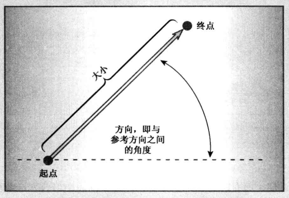
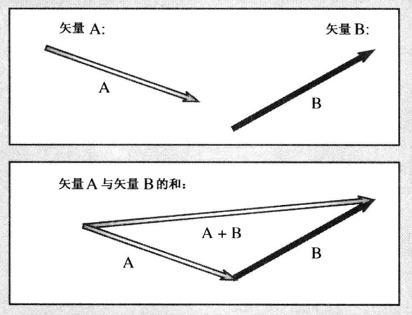
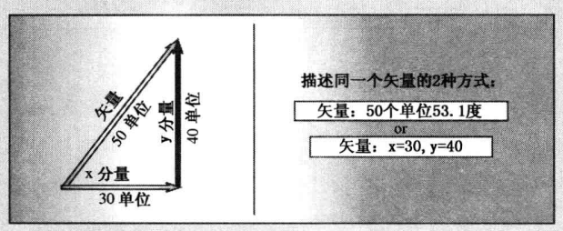

```
# 第1章-预备知识
# 第2章-开始学习C++
# 第3章-处理数据
# 第4章-复合类型
# 第5章-循环和关系表达式
# 第6章-分支语句和逻辑运算符
# 第7章-函数一C++ 的编程模块
# 第08章-函数探幽
# 第09章-内存模型和名称空间
# 第10章-对象和类
```

# 第11章-使用类

本章内容包括：

- 运算符重载。
- 友元函数。
- 重载<<运算符，以便用于输出。
- 状态成员。
- 使用rand( )生成随机值。
- 类的自动转换和强制类型转换。
- 类转换函数。

C++类特性丰富、复杂、功能强大。在第9章，您通过学习定义和使用简单的类，已踏上了面向对象编程之旅。通过定义用于表示对象的数据的类型以及(通过成员函数)定义可对数据执行的操作，您知道了类是如何定义数据类型的。我们还学习了两个特殊的成员函数一构造函数和析构函数，其作用是管理类对象的创建和删除。本章将进一步探讨类的特征，重点是类设计技术，而不是通用原理。您可能发现，本章介绍的一些特性很容易，而另一些很微妙。 要更好地理解这些新特性，应使用这些示例进行练习。如果函数使用常规参数而不是引用参数，将发生什么情况呢?如果忽略了析构函数，又将发生什么情况呢?不要害怕犯错误，因为在解决问题的过程中学到的知识，比生搬硬套而不犯错误时要多得多(然而， 不要认为所有的错误就都会让人增长见识)。这样，您将更全面地了解C++是如何工作的以及它可以为我们做哪些工作。

本章首先介绍运算符重载，它允许将标准C++运算符(如=和+)用于类对象。然后介绍友元，这种C++机制使得非成员函数可以访问私有数据。最后介绍如何命令C+ +对类执行自动类型转换。学习本章和第12章后，您将对类构造函数和类析构函数所起的作用有更深入的了解。另外，您还将知道开发和改进类设计时，需要执行的步骤。

学习C++的难点之一是需要记住大量的东西，但在拥有丰富的实践经验之前，根本不可能全部记住这些东西。从这种意义上说，学习C++就像学习功能复杂的字处理程序或电子制表程序一样。任何特性都不可怕，但多数人只掌握了那些经常使用的特性，如查找文本或设置为斜体等。您可能在那里曾经学过如何生成替换字符或者创建目录，除非经常使用它们，否则这些技能可能根本与日常工作无关。也许，学习本章知识的最好方法是，在我们自己开发的C++程序中使用其中的新特性。对这些新特性有了充分的认识后，就可以添加其他C++特性了。正如C++创始人Bjarne Stroustrup在一一次 C++专业程序员大会上所建议的：“轻松地使用这种语言。不要觉得必须使用所有的特性，不要在第一次学习时就试图使用所有的特性。

## 运算符重载

下面介绍一种使对象操作更美观的技术。运算符重载是一种形式的C++多态。第8章介绍了C++是如何使用户能够定义多个名称相同但特征标(参数列表)不同的函数的。这被称为函数重载或函数多态，旨在让您能够用同名的函数来完成相同的基本操作，即使这种操作被用于不同的数据类型（想象一下，如果必须对不同的物体使用不同的动词，如抬起左脚(lift_Ift)， 拿起汤匙(lift_sp)， 英语将会多么笨拙）。运算符重载将重载的概念扩展到运算符上，允许赋予C++运算符多种含义。实际上，很多C++ (也包括C语言)运算符已经被重载。例如，将*运算符用于地址，将得到存储在这个地址中的值；但将它用于两个数字时，得到的将是它们的乘积。C++根据操作数的数目和类型来决定采用哪种操作。

C++允许将运算符重载扩展到用户定义的类型，例如，允许使用+将两个对象相加。编译器将根据操作数的数目和类型决定使用哪种加法定义。重载运算符可使代码看起来更自然。例如，将两个数组相加是一种常见的运算。通常，需要使用下面这样的for循环来实现：

```c++
for(inti=0;i<20;i++)
evening[i] = sam[i] + janet[i] ；
// add element by element
```

但在C++中，可以定义一个表示数组的类，并重载+运算符。于是便可以有这样的语句：

```c++
evening = sam + janet;
// add two array objects
```

这种简单的加法表示法隐藏了内部机理，并强调了实质，这是00P的另一个目标。

要重载运算符，需使用被称为运算符函数的特殊函数形式。运算符函数的格式如下：

```c++
operator op (argument-list)
```

例如，operator +( )重载+运算符，operator *( )重载*运算符。op 必须是有效的C++运算符，不能虚构个新的符号。例如，不能有operator@( )这样的函数，因为C++中没有@运算符。然而，operator \[ ]( )函数将重载[ ]运算符，因为[ ]是数组索引运算符。例如，假设有一个Salesperson类，并为它定义了一个operator+( )成员函数，以重载+运算符，以便能够将两个Saleperson 对象的销售额相加，则如果district2、sid 和sara都是Salesperson类对象，便可以编写这样的等式： 

```c++
district2 = sid + sara;
```

编译器发现，操作数是Salesperson类对象，因此使用相应的运算符函数替换上述运算符：

```c++
district2 = sid. operator+(sara) ；
```

然后该函数将隐式地使用sid(因为它调用了方法)，而显式地使用sara对象(因为它被作为参数传递)，来计算总和，并返回这个值。当然最重要的是，可以使用简便的+运算符表示法，而不必使用笨拙的函数表示法。

虽然C++对运算符重载做了一些限制，但了解重载的工作方式后，这些限制就很容易理解了。因此，下面首先通过一些示例对运算符重载进行阐述，然后再讨论这些限制。

## 计算时间：一个运算符重载示例

如果今天早.上在Priggs的账户上花费了2小时35分钟，下午又花费了2小时40分钟，则总共花了多少时间呢?这个示例与加法概念很吻合，但要相加的单位(小时与分钟的混合)与内置类型不匹配。第7章通过定义一个travel time 结构和将这种结构相加的sum( )函数来处理类似的情况。现在将其推广，采用一个使用方法来处理加法的Time类。首先使用一个名为Sum()的常规方法，然后介绍如何将其转换为重载运算符。程序清单11.1列出了这个类的声明。

`程序清单11.1 mytime0.h`

```c++
// mytime0.h -- Time class before operator overloading
#ifndef MYTIME0_H_
#define MYTIME0_H_

class Time
{
private:
    int hours;
    int minutes;
public:
    Time();
    Time(int h, int m = 0);
    void AddMin(int m);
    void AddHr(int h);
    void Reset(int h = 0, int m = 0);
    const Time Sum(const Time & t) const;
    void Show() const;
};
#endif

```

Time类提供了用于调整和重新设置时间、显示时间、将两个时间相加的方法。程序清单11.2列出了方法定义。请注意，当总的分钟数超过59时，AddMin( )和Sum( )方法是如何使用整数除法和求模运算符来调整minutes和hours值的。另外，由于这里只使用了iostream 的cout,且只使用了-次，因此使用st:cout比导入整个名称空间更经济。

`程序清单11.2 mytime0.cpp`

```c++
// mytime1.cpp  -- implementing Time methods
#include <iostream>
#include "mytime1.h"

Time::Time()
{
    hours = minutes = 0;
}

Time::Time(int h, int m )
{
    hours = h;
    minutes = m;
}

void Time::AddMin(int m)
{
    minutes += m;
    hours += minutes / 60;
    minutes %= 60;
}

void Time::AddHr(int h)
{
    hours += h;
}

void Time::Reset(int h, int m)
{
    hours = h;
    minutes = m;
}

Time Time::operator+(const Time & t) const
{
    Time sum;
    sum.minutes = minutes + t.minutes;
    sum.hours = hours + t.hours + sum.minutes / 60;
    sum.minutes %= 60;
    return sum;
}

void Time::Show() const
{
    std::cout << hours << " hours, " << minutes << " minutes";
}

```

来看一下Sum( )函数的代码。注意参数是引用，但返回类型却不是引用。将参数声明为引用的目的是为了提高效率。如果按值传递Time对象，代码的功能将相同，但传递引用，速度将更快，使用的内存将更少。

然而，返回值不能是引用。因为函数将创建一个新的Time对象(sum)， 来表示另外两个Time对象的和。返回对象(如代码所做的那样)将创建对象的副本，而调用函数可以使用它。然而，如果返回类型为Time&，则引用的将是sum对象。但由于sum对象是局部变量，在函数结束时将被删除，因此引用将指向个不存在的对象。使用返回类型Time意味着程序将在删除sum之前构造它的拷贝，调用函数将得到该拷贝。

**警告**：不要返回指向局部变量或临时对象的引用。函数执行完毕后，局部变量和临时对象将消失，引用将指向不存在的数据。

最后，程序清单11.3 对Time类中计算时间总和的部分进行了测试。

`程序清单11.3 usetime0.cpp`

```c++
// usetime0.cpp -- using the first draft of the Time class
// compile usetime0.cpp and mytime0.cpp together
#include <iostream>
#include "mytime0.h"

int main()
{
    using std::cout;
    using std::endl;
    Time planning;
    Time coding(2, 40);
    Time fixing(5, 55);
    Time total;

    cout << "planning time = ";
    planning.Show();
    cout << endl;
 
    cout << "coding time = ";
    coding.Show();
    cout << endl;
    
    cout << "fixing time = ";
    fixing.Show();
    cout << endl;

    total = coding.Sum(fixing);
    cout << "coding.Sum(fixing) = ";
  	total.Show();
    cout << endl;
    // std::cin.get();
    return 0;
}

```

下面是程序清单11.1、程序清单11.2和程序清单11.3组成的程序的输出：

```
planning time = 0 hours, 0 minutes
coding time = 2 hours, 40 minutes
fixing time = 5 hours, 55 minutes
coding . Sum(fixing) = 8 hours, 35 minutes
```


### 添加加法运算符

将Time类转换为重载的加法运算符很容易，只要将Sum( )的名称改为operator +( )即可。这样做是对的，只要把运算符(这里为+)放到operator的后面，并将结果用作方法名即可。在这里，可以在标识符中使用字母、数字或下划线之外的其他字符。程序清单11.4 和程序清单11.5 反映了这些细微的修改。

`程序清单11.4 mytime1 .h`

```c++
// mytime1.h -- Time class before operator overloading
#ifndef MYTIME1_H_
#define MYTIME1_H_

class Time
{
private:
    int hours;
    int minutes;
public:
    Time();
    Time(int h, int m = 0);
    void AddMin(int m);
    void AddHr(int h);
    void Reset(int h = 0, int m = 0);
    Time operator+(const Time & t) const;
    void Show() const;
};
#endif

```

`程序清单11.5 mytime1 .cpp`

```c++
// mytime1.cpp  -- implementing Time methods
#include <iostream>
#include "mytime1.h"

Time::Time()
{
    hours = minutes = 0;
}

Time::Time(int h, int m )
{
    hours = h;
    minutes = m;
}

void Time::AddMin(int m)
{
    minutes += m;
    hours += minutes / 60;
    minutes %= 60;
}

void Time::AddHr(int h)
{
    hours += h;
}

void Time::Reset(int h, int m)
{
    hours = h;
    minutes = m;
}

Time Time::operator+(const Time & t) const
{
    Time sum;
    sum.minutes = minutes + t.minutes;
    sum.hours = hours + t.hours + sum.minutes / 60;
    sum.minutes %= 60;
    return sum;
}

void Time::Show() const
{
    std::cout << hours << " hours, " << minutes << " minutes";
}

```

和Sum( )一样，operator +( )也是由Time对象调用的，它将第二个Time对象作为参数，并返回一个Time对象。因此，可以像调用Sum( )那样来调用operator +( )方法：

```c++
total = coding . operator+ (fixing)； // function notation
```

但将该方法命令为operator +( )后，也可以使用运算符表示法：

```c++
total = coding + fixing;
// operator notation
```

这两种表示法都将调用operator+()方法。注意，在运算符表示法中，运算符左侧的对象(这里为coding)是调用对象，运算符右边的对象(这里为fixing) 是作为参数被传递的对象。程序清单11.6 说明了这一点。

`程序清单11.6 usetime1 .cpp`

```c++
// usetime1.cpp -- using the second draft of the Time class
// compile usetime1.cpp and mytime1.cpp together
#include <iostream>
#include "mytime1.h"

int main()
{
    using std::cout;
    using std::endl;
    Time planning;
    Time coding(2, 40);
    Time fixing(5, 55);
    Time total;

    cout << "planning time = ";
    planning.Show();
    cout << endl;
 
    cout << "coding time = ";
    coding.Show();
    cout << endl;
    
    cout << "fixing time = ";
    fixing.Show();
    cout << endl;

    total = coding + fixing;
    // operator notation
    cout << "coding + fixing = ";
    total.Show();
    cout << endl;

    Time morefixing(3, 28);
    cout << "more fixing time = ";
    morefixing.Show();
    cout << endl;
    total = morefixing.operator+(total);
    // function notation
    cout << "morefixing.operator+(total) = ";
    total.Show();
    cout << endl;
    // std::cin.get();
    return 0;
}

```

下面是程序清单11.4~程序清单11.6 组成的程序的输出： 

```
planning time = 0 hours, 0 minutes
coding time = 2 hours, 40 minutes
fixing time = 5 hours, 55 minutes
coding + fixing = 8 hours, 35 minutes
more fixing time = 3 hours, 28 minutes
moref ixing . operator+ (total) = 12 hours, 3 minutes
```

总之，operator+()函数的名称使得可以使用函数表示法或运算符表示法来调用它。编译器将根据操作数的类型来确定如何做：

```c++
int a, b，c;
Time A, B，C;
// use int addition
C=A+B
// use addition as defined for Time objects
```

可以将两个以上的对象相加吗?例如，如果tl、口、t3 和t4都是Time对象，可以这样做吗：

```c++
t4=t1+t2+t3;
// valid?
```

为回答这个问题，来看一些上述语句将被如何转换为函数调用。由于+是从左向右结合的运算符，因此上述语句首先被转换成下面这样：

```c++
t4 = t1. operator+(t2 + t3)；
// valid?
```


然后，函数参数本身被转换成一个函数调用，结果如下： 

```c++
t4 = t1.operator+ (t2. operator+(t3))；
// valid? YES
```

上述语句合法吗?是的。函数调用t2.operator+(t3)返回一个Time对象，后者是2和t3的和。然而，该对象成为函数调用t1 .operator+( )的参数，该调用返回t1与表示口和t3之和的Time对象的和。总之，最后的返回值为t1、t2和之和，这正是我们期望的。

### 重载限制

多数C++运算符(参见表11.1)都可以用这样的方式重载。重载的运算符(有些例外情况)不必是成员函数，但必须至少有一个操作数是用户定义的类型。下面详细介绍C++对用户定义的运算符重载的限制。

1. 重载后的运算符必须至少有一个操作数是用户定义的类型，这将防止用户为标准类型重载运算符。因此，不能将减法运算符(-)重载为计算两个double 值的和，而不是它们的差。虽然这种限制将对创造性有所影响，但可以确保程序正常运行。

2. 使用运算符时不能违反运算符原来的句法规则。例如，不能将求模运算符(%)重载成使用一个操作数：

```c++
int x;
rime shiva;
号x;
// invalid for modulus operator
号shiva;
// invalid for overloaded operator
```

同样，不能修改运算符的优先级。因此，如果将加号运算符重载成将两个类相加，则新的运算符与原来的加号具有相同的优先级。

3. 不能创建新运算符。例如，不能定义operator **( )函数来表示求幂。

4. 不能重载下面的运算符。

- sizeof: sizeof 运算符。
- .：成员运算符。
- . *：成员指针运算符。
- ：:作用域解析运算符。
- ?:: 条件运算符。
- typeid: 一个RTTI运算符。
- const cast: 强制类型转换运算符。
- dynamic cast: 强制类型转换运算符。
- reinterpret cast: 强制类型转换运算符。
- static cast:强制类型转换运算符。
- 然而，表11.1中所有的运算符都可以被重载。

5. 表11.1中的大多数运算符都可以通过成员或非成员函数进行重载，但下面的运算符只能通过成员函数进行重载。

- =:赋值运算符。
- ()： 函数调用运算符。
- []：下标运算符。
- ->:通过指针访问类成员的运算符。

**注意**：本章不介绍这里列出的所有运算符，但附录E对本书正文中没有介绍的运算符进行了总结。

<center>表11.1 可重载的运算符

|      |      |      |        |        |           |
| :--: | :--: | :--: | :----: | :----: | :-------: |
|  +   |  -   |  *   |   /    |   %    |     ^     |
|  &   |  \|  |      |        |        |           |
|      |      |      |        |        |           |
|      |      |      |        |        |           |
|      |      |      |        |        |           |
|      |      |      |        |        |           |
|  ()  |  []  | new  | delete | new [] | delete [] |

除了这些正式限制之外，还应在重载运算符时遵循一些明智的限制。例如，不要将*运算符重载成交换两个Time对象的数据成员。表示法中没有任何内容可以表明运算符完成的工作，因此最好定义一个其名称具有说明性的类方法，如Swap( )。

### 其他重 载运算符

还有-些其他的操作对Time 类来说是有意义的。例如，可能要将两个时间相减或将时间乘以一个因子，这需要重载减法和乘法运算符。这和重载加法运算符采用的技术相同，即创建operator - ( )和operator \*()方法。也就是说，将下面的原型添加到类声明中：

```c++
ime operator- (const Time & t) const;
ime operator* (double n) const;
```

程序清单11.7是新的头文件。

`程序清单11.7 mytime2.h`

```c++
// mytime2.h -- Time class after operator overloading
#ifndef MYTIME2_H_
#define MYTIME2_H_

class Time
{
private:
    int hours;
    int minutes;
public:
    Time();
    Time(int h, int m = 0);
    void AddMin(int m);
    void AddHr(int h);
    void Reset(int h = 0, int m = 0);
    Time operator+(const Time & t) const;
    Time operator-(const Time & t) const;
    Time operator*(double n) const;
    void Show() const;
};
#endif

```

然后将新增方法的定义添加到实现文件中，如程序清单11.8 所示。

`程序清单11.8 mytime2.cpp`

```c++
// mytime2.cpp  -- implementing Time methods
#include <iostream>
#include "mytime2.h"

Time::Time()
{
    hours = minutes = 0;
}

Time::Time(int h, int m )
{
    hours = h;
    minutes = m;
}

void Time::AddMin(int m)
{
    minutes += m;
    hours += minutes / 60;
    minutes %= 60;
}
void Time::AddHr(int h)
{
    hours += h;
}

void Time::Reset(int h, int m)
{
    hours = h;
    minutes = m;
}

Time Time::operator+(const Time & t) const
{
    Time sum;
    sum.minutes = minutes + t.minutes;
    sum.hours = hours + t.hours + sum.minutes / 60;
    sum.minutes %= 60;
    return sum;
}

Time Time::operator-(const Time & t) const
{
    Time diff;
    int tot1, tot2;
    tot1 = t.minutes + 60 * t.hours;
    tot2 = minutes + 60 * hours;
    diff.minutes = (tot2 - tot1) % 60;
    diff.hours = (tot2 - tot1) / 60;
    return diff;
}

Time Time::operator*(double mult) const
{
    Time result;
    long totalminutes = hours * mult * 60 + minutes * mult;
    result.hours = totalminutes / 60;
    result.minutes = totalminutes % 60;
    return result;
}

void Time::Show() const
{
    std::cout << hours << " hours, " << minutes << " minutes";
}

```

完成上述修改后，就可以使用程序清单11.9 中的代码来测试新定义了。

`程序清单11.9 usetime2.cpp`

```c++
// usetime2.cpp -- using the third draft of the Time class
// compile usetime2.cpp and mytime2.cpp together
#include <iostream>
#include "mytime2.h"

int main()
{
    using std::cout;
    using std::endl;
    Time weeding(4, 35);
    Time waxing(2, 47);
    Time total;
    Time diff;
    Time adjusted;

    cout << "weeding time = ";
    weeding.Show();
    cout << endl;
 
    cout << "waxing time = ";
    waxing.Show();
    cout << endl;
    
    cout << "total work time = ";
    total = weeding + waxing;   // use operator+()
    total.Show();
    cout << endl;

    diff = weeding - waxing;    // use operator-()
    cout << "weeding time - waxing time = ";
    diff.Show();
    cout << endl;

    adjusted = total * 1.5;      // use operator+()
    cout << "adjusted work time = ";
    adjusted.Show();
    cout << endl;
    // std::cin.get();    
    return 0;
}

```

下面是程序清单11.7~程序清单11.9组成的程序得到的输出：

```
weeding time = 4 hours, 35 minutes
waxing time = 2 hours， 47 minutes
total work time = 7 hours, 22 minutes
weeding time - waxing time = 1 hours, 48 minutes
adjusted work time = 11 hours, 3 minutes
```


## 友元

您知道，C++控制对类对象私有部分的访问。通常，公有类方法提供唯-的访问途径，但是有时候这种限制太严格，以致于不适合特定的编程问题。在这种情况下，C++提供了另外- -种形式的访问权限：友元。友元有3种：

- 友元函数；
- 友元类；
- 友元成员 函数。

通过让函数成为类的友元，可以赋予该函数与类的成员函数相同的访问权限。下面介绍友元函数，其他两种友元将在第15章介绍。

介绍如何成为友元前，先介绍为何需要友元。在为类重载二元运算符时( 带两个参数的运算符)常常需要友元。将Time对象乘以实数就属于这种情况，下面来看看。

在前面的Time 类示例中，重载的乘法运算符与其他两种重载运算符的差别在于，它使用了两种不同的类型。也就是说，加法和减法运算符都结合两个Time值，而乘法运算符将一个Time值与一个double值结合在一起。这限制了该运算符的使用方式。记住，左侧的操作数是调用对象。也就是说，下面的语句：

```c++
A=B* 2.75;
```

将被转换为下面的成员函数调用：

```c++
A = B.operator*(2.75)；
```

但下F面的语句又如何呢?

```c++
A=2.75*B;
// cannot correspond to a member function
```

B应与B *2.75相同，但第一个表达式不对应于成员函数，因为2.75不是Time类型的对象。记住，左侧的操作数应是调用对象，但2.75不是对象。因此，编译器不能使用成员函数调用来替换该表达式。

解决这个难题的一种方式是， 告知每个人(包括程序员自己)，只能按B * 2.75这种格式编写，不能写成2.75*B。这是一种对服务器友好客户警惕的( server- friendly, client-beware)解决方案，与00P无关。

然而，还有另一种解决方式一非成员函数(记住，大多数运算符都可以通过成员或非成员函数来重载)。非成员函数不是由对象调用的，它使用的所有值(包括对象)都是显式参数。这样，编译器能够将下面的表达式：

```c++
A=2.75 * B;
// cannot correspond to a member funct ion
```

与下面的非成员函数调用匹配：

```c++
A = operator*(2.75, B)；
```

该函数的原型如下：

```c++
Time operator* (double m, const Time & t) ；
```

对于非成员重载运算符函数来说，运算符表达式左边的操作数对应于运算符函数的第一个参数， 运算符表达式右边的操作数对应于运算符函数的第二个参数。而原来的成员函数则按相反的顺序处理操作数，也就是说，double 值乘以Time值。

使用非成员函数可以按所需的顺序获得操作数(先是double,然后是Time)，但引发了一个新问题：非成员函数不能直接访问类的私有数据，至少常规非成员函数不能访问。然而，有一类特殊的非成员函数可以访问类的私有成员，它们被称为友元函数。

### 创建友元

创建友元函数的第一步 是将其原型放在类声明中，并在原型声明前加上关键字friend:

```c++
friend Time operator* (double m，const Time & t)； // goes in class declaration
```

该原型意味着下面两点： 

- 虽然operator\*()函数是在类声明中声明的，但它不是成员函数，因此不能使用成员运算符来调用；
- 虽然operator\*()函数不是成员函数，但它与成员函数的访问权限相同。

第二步是编写函数定义。因为它不是成员函数，所以不要使用Time::限定符。另外，不要在定义中使用关键字friend,定义应该如下：

```c++
Time operator* (double m，const Time & t) // friend not used in definition
ime result;
long totalminutes = t. hours * mult * 60 +t. minutes * mult;
result.hours = totalminutes / 60;
result.minutes = totalminutes 号60;
return result;
```

有了.上述声明和定义后，下面的语句：

```c++
A=2.75*B;
```

将转换为如下语句，从而调用刚才定义的非成员友元函数：

```c++
A = operator*(2.75, B)；
```

总之，类的友元函数是非成员函数，其访问权限与成员函数相同。


---

`友元是否有悖于00P`

乍一看，您可能会认为友元违反了OOP数据隐藏的原则，因为友元机制允许非成员函数访问私有数据。然而，这个观点太片面了。相反，应将友元函数看作类的扩展接口的组成部分。例如，从概念上看，double乘以Time和Time乘以double是完全相同的。也就是说，前一个要求有友元函数，后一个使用成员函数，这是C++句法的结果，而不是概念上的差别。通过使用友元函数和类方法，可以用同一个用户接口表达这两种操作。另外请记住，只有类声明可以决定哪一个函数是友元，因此类声明仍然控制了哪些函数可以访问私有数据。总之，类方法和友元只是表达类接口的两种不同机制。

实际上，按下面的方式对定义进行修改(交换乘法操作数的顺序)，可以将这个友元函数编写为非友元函数：

Time operator* (double m, const Time & t)
return t * m;
// use t. operator* (m)

原来的版本显式地访问t.minutes和t,hours,所以它必须是友元。这个版本将Time对象t作为一个整体使用，让成员函数来处理私有值，因此不必是友元。然而，将该版本作为友元也是一个好主意。最重要的是，它将该作为正式类接口的组成部分。其次，如果以后发现需要函数直接访问私有数据，则只要修改函数定义即可，而不必修改类原型。

**提示**：如果要为类重载运算符，并将非类的项作为其第一个操作数，则可以用友元函数来反转操作数的顺序。

---


### 常用的友元：重载<<运算符

一个很有用的类特性是，可以对<<运算符进行重载，使之能与cout 一起来显示对象的内容。与前面介绍的示例相比，这种重载要复杂些，因此我们分两步(而不是一步)来完成。

假设trip是一个Time对象。为显示Time的值，前面使用的是Show()。然而，如果可以像下面这样操作将更好：

```c++
cout << trip; // make cout recognize Time class?
```

之所以可以这样做，是因为<<是可被重载的C++运算符之一。实际上，它已经被重载很多次了。最初，<<运算符是C和C++的位运算符，将值中的位左移(参见附录E)。ostream 类对该运算符进行了重载，将其转换为一个输出工具。前面讲过，cout 是一个ostream 对象，它是智能的，能够识别所有的C++基本类型。这是因为对于每种基本类型，ostream 类声明中都包含了相应的重载的operator<<( )定义。也就是说，一个定义使用int 参数，一个定义使用double参数，等等。因此，要使cout能够识别Time对象，一种方法是将一个新的函数运算符定义添加到ostream类声明中。但修改iostream 文件是个危险的主意，这样做会在标准接口上浪费时间。相反，通过Time类声明来让Time类知道如何使用cout.

1. <<的第一种重载版本

要使Time类知道使用cout,必须使用友元函数。这是什么原因呢?因为下面这样的语句使用两个对，其中第一个是ostream类对象(cout)：

```c++
cout << trip;
```

如果使用一个Time成员函数来重载<<，Time对象将是第一一个操作数，就像使用成员函数重载*运算符那样。这意味着必须这样使用<<: 

```c++
trip << cout; // if operator<<() were a Time member function
```

这样会令人迷惑。但通过使用友元函数，可以像下面这样重载运算符：

```c++
void operator<< (ostream & os，const Time & t)
Os << t.hours << " hours, " << t.minutes << " minutes" ；
```

这样可以使用下面的语句：

```c++
cout<< trip;
```

按下面这样的格式打印数据：

```
4 hours, 23 minutes
```


---

`友元还是非友元?`

新的Time类声明使operatro<<( )函数成为Time类的一个友元函数。但该函数不是ostream类的友元(尽管对ostream类并无害处)。operator<<( )函数接受一个ostream参数和一个Time参数，因此表面看来它必须同时是这两个类的友元。然而，看看函数代码就会发现，尽管该函数访问了Time 对象的各个成员，但从始至终都将ostream对象作为一个整体使用。因为operator<<( )直接访问Time对象的私有成员，所以它必须是Time类的友元。但由于它并不直接访问ostream 对象的私有成员，所以并不一定必须是ostream 类的友元。这很好，因为这就意味着不必修订ostream的定义。

注意，新的operator<<( )定义使用ostream引用os作为它的第一个参数。 通常情况下，os 引用cout对象，如表达式cout《< trip所示。但也可以将这个运算符用于其他ostream对象，在这种情况下，os 将引用相应的对象。

---

`不知道其他ostream对象?`

另一个ostream 对象是cerr, 它将输出发送到标准输出流一默认为 显示器，但在UNIX、Linux 和Windows命令行环境中，可将标准错误流重定向到文件。另外，第6章介绍的ofstream对象可用于将输出写入到文件中。通过继承(参见第13章),ofstream对象可以使用ostream的方法。这样，便可以用operator<<( )定义来将Time的数据写入到文件和屏幕上，为此只需传递一个经过适当初始化的ofstream 对象(而不是cout对象)。

---

调用cout《trip应使用cout对象本身，而不是它的拷贝，因此该函数按引用(而不是按值)来传递该对象。这样，表达式cout<< trip将导致os成为cout的一个别名；而表达式cerr <<trip将导致os成为cerr的一个别名。Time对象可以按值或按引用来传递，因为这两种形式都使函数能够使用对象的值。按引用传
递使用的内存和时间都比按值传递少。

2. <<的 第二种重载版本

前面介绍的实现存在一个问题。 像下面这样的语句可以正常工作：

```c++
cout << trip;
```

但这种实现不允许像通常那样将重新定义的<<运算符与cout-起使用：

```c++
cout << "Trip time: " << trip << " (Tuesday)\n"； // can't do
```

要理解这样做不可行的原因以及必须如何做才能使其可行，首先需要了解关于cout操作的一点知识。请看下面的语句：

```c++
intx=5;
inty= 8;
cout<< x << Y;
```

C++从左至右读取输出语句，意味着它等同于：

```c++
(cout << x)<< Y;
```

正如iosream中定义的那样，<<运算符要求左边是一个 ostream对象。显然，因为cout是ostream对象，所以表达式cout<< x满足这种要求。然而，因为表达式cout<<x位于<<y的左侧，所以输出语句也要求该表达式是一个ostream类型的对象。因此，ostream 类将operator<<( )函数实现为返回一个指向ostream对象的引用。具体地说，它返回一个指向调用对象(这里是cout)的引用。因此，表达式(cout << x)本身就是ostream对象cout,从而可以位于<<运算符的左侧。

可以对友元函数采用相同的方法。只要修改operator<<( )函数，让它返回ostream对象的引用即可：

```c++
ostream & operator<< (ostream & os，const Time & t)
os << t.hours << " hours, " << t. minutes << " minutes" ；
return Os
```

注意，返回类型是ostream &。这意味着该函数返回ostream对象的引用。因为函数开始执行时，程序传递了一个对象引用给它，这样做的最终结果是，函数的返回值就是传递给它的对象。也就是说，下面的语句：

```c++
cout << trip;
```

将被转换为下面的调用：

```c++
operator<(cout, trip)；
```

而该调用返回cout对象。因此，下面的语句可以正常工作：

```c++
cout<< "Trip time: " << trip《" (Tuesday)\n"； // can do
```

我们将这条语句分成多步，来看看它是如何工作的。首先，下面的代码调用ostream中的<<定义，它显示字符串并返回cout对象：

```c++
cout << "Trip time: '
```

因此表达式cout <<“Trip time:"将显示字符串，然后被它的返回值cout所替代。原来的语句被简化为下面的形式：

```c++
cout << trip << " (Tuesday) \n"；
```

接下来，程序使用<<的Time声明显示trip值，并再次返回cout 对象。这将语句简化为：

```c++
cout << " (Tuesday) \n" ；
```

现在，程序使用ostream中用于字符串的<<定义，来显示最后一个字符串，并结束运行。有趣的是，这个operator<<( )版本还可用于将输出写入到文件中：

```c++
#include <fstream>
ofstream fout;
fout . open("savetime. txt") ；
Time trip(12, 40)；
fout << trip;
```

其中最后-条语句将被转换为这样：

```c++
operator<<(fout, trip) ；
```

另外，正如第8章指出的，类继承属性让ostream引用能够指向ostream对象和ofstream对象。

提示： 一般来说，要重载<<运算符来显示c name 的对象，可使用一个友元函数，其定义如下：

```c++
ostream & operator<< (ostream & os，const c_ name & obj)
// display object contents
return os;
```

程序清单11.10列出了修改后的类定义，其中包括operator\*( )和operator<<( )这两个友元函数。它将第一一个友元函数作为内联函数，因为其代码很短。(当定义同时也是原型时，就像这个例子中那样，要使用friend前缀。)警告：只有在类声明中的原型中才能使用friend 关键字。除非函数定义也是原型，否则不能在函数定义中使用该关键字。

`程序清单11.10 mytime3.h`

```c++
// mytime3.h -- Time class with friends
#ifndef MYTIME3_H_
#define MYTIME3_H_
#include <iostream>

class Time
{
private:
    int hours;
    int minutes;
public:
    Time();
    Time(int h, int m = 0);
    void AddMin(int m);
    void AddHr(int h);
    void Reset(int h = 0, int m = 0);
    Time operator+(const Time & t) const;
    Time operator-(const Time & t) const;
    Time operator*(double n) const;
    friend Time operator*(double m, const Time & t)
        { return t * m; }   // inline definition
    friend std::ostream & operator<<(std::ostream & os, const Time & t);

};
#endif

```

程序清单11.11 列出了修改后的定义。方法使用了Time::限定符，而友元函数不使用该限定符。另外，由于在mytime3.h中包含了iostream 并提供了using声明st::ostream,因此在mytime3.cpp中包含mytime3.h后，便提供了在实现文件中使用ostream 的支持。

`程序清单11.11 mytime3.cpp`

```c++
// mytime3.cpp  -- implementing Time methods
#include "mytime3.h"

Time::Time()
{
    hours = minutes = 0;
}

Time::Time(int h, int m )
{
    hours = h;
    minutes = m;
}

void Time::AddMin(int m)
{
    minutes += m;
    hours += minutes / 60;
    minutes %= 60;
}

void Time::AddHr(int h)
{
    hours += h;
}

void Time::Reset(int h, int m)
{
    hours = h;
    minutes = m;
}

Time Time::operator+(const Time & t) const
{
    Time sum;
    sum.minutes = minutes + t.minutes;
    sum.hours = hours + t.hours + sum.minutes / 60;
    sum.minutes %= 60;
    return sum;
}

Time Time::operator-(const Time & t) const
{
    Time diff;
    int tot1, tot2;
    tot1 = t.minutes + 60 * t.hours;
    tot2 = minutes + 60 * hours;
    diff.minutes = (tot2 - tot1) % 60;
    diff.hours = (tot2 - tot1) / 60;
    return diff;
}

Time Time::operator*(double mult) const
{
    Time result;
    long totalminutes = hours * mult * 60 + minutes * mult;
    result.hours = totalminutes / 60;
    result.minutes = totalminutes % 60;
    return result;
}

std::ostream & operator<<(std::ostream & os, const Time & t)
{
    os << t.hours << " hours, " << t.minutes << " minutes";
    return os; 
}

```


程序清单11.12 是一个示例程序。从技术上说，在usetime3.cpp中不必包含头文件iostream,因为在mytime3.h中已经包含了该文件。然而，作为Time类的用户，您并不知道在类代码文件中已经包含了哪些文件，因此您应负责将您编写的代码所需的头文件包含进来。

`程序清单11.12 usetime3.cpp`

```c++
//usetime3.cpp -- using the fourth draft of the Time class
// compile usetime3.cpp and mytime3.cpp together
#include <iostream>
#include "mytime3.h"

int main()
{
    using std::cout;
    using std::endl;
    Time aida(3, 35);
    Time tosca(2, 48);
    Time temp;

    cout << "Aida and Tosca:\n";
    cout << aida<<"; " << tosca << endl;
    temp = aida + tosca;     // operator+()
    cout << "Aida + Tosca: " << temp << endl;
    temp = aida* 1.17;  // member operator*()
    cout << "Aida * 1.17: " << temp << endl;
    cout << "10.0 * Tosca: " << 10.0 * tosca << endl;
	// std::cin.get();
    return 0; 
}

```

下面是程序清单11.10~程序清单11.12组成的程序的输出：

```
Aida and Tosca:
3 hours, 35 minutes; 2 hours, 48 minutes
Aida + Tosca: 6 hours, 23 minutes
Aida * 1.17: 4 hours, 11 minutes
10.0 * Tosca: 28 hours, 0 minutes
```


## 重载运算符：作为成员函数还是非成员函数

对于很多运算符来说，可以选择使用成员函数或非成员函数来实现运算符重载。一般来说， 非成员函数应是友元函数，这样它才能直接访问类的私有数据。例如，Time 类的加法运算符在Time类声明中的原型如下：

```c++
Time operator+ (const Time & t) const; // member version
```

这个类也可以使用下面的原型：

```c++
// nonmember version
friend Time operator+(const Time & t1, const Time & t2)；
```

加法运算符需要两个操作数。对于成员函数版本来说，一个操作数通过this 指针隐式地传递，另一个操作数作为函数参数显式地传递；对于友元版本来说，两个操作数都作为参数来传递。

注意：非成员版本的重载运算符函数所需的形参数目与运算符使用的操作数数目相同；而成员版本所需的参数数目少一个，因为其中的一个操作数是被隐式地传递的调用对象。

这两个原型都与表达式T2+T3匹配，其中T2和T3都是Time类型对象。也就是说，编译器将下面的语句：

```c++
T1=T2+T3;
```

转换为下面两个的任何一个：

```c++
T1 = T2. operator+(T3)；
//
member function
T1 = operator+(T2， T3)； // nonmember function
```

记住，在定义运算符时，必须选择其中的一种格式， 而不能同时选择这两种格式。因为这两种格式都与同一个表达式匹配，同时定义这两种格式将被视为二义性错误，导致编译错误。

那么哪种格式最好呢?对于某些运算符来说(如前所述)，成员函数是唯一合法的选择。在其他情况下，这两种格式没有太大的区别。有时，根据类设计，使用非成员函数版本可能更好(尤其是为类定义类型转换时)。本章后面的“转换和友元”一节将更深入地讨论这种情形。

## 再谈重载：一个矢量类

下面介绍另一种使用了运算符重载和友元的类设计一-个表示矢量的类。 这个类还说明了类设计的其他方面，例如，在同一个对象中包含两种描述同一样东西的不同方式等。即使并不关心矢量，也可以在其他情况下使用这里介绍的很多新技术。矢量(vector)， 是工程和物理中使用的一一个术语，它是一个有大小和方向的量。例如，推东西时，推的效果将取决于推力的大小和推的方向。从某个方向推可能会省力，而从相反的方向推则要费很大的劲。为完整地描述汽车的运动情况，应指出其运动速度(大小)和运动方向；如果逆行，则向高速公路的巡警辩解没有超速、超载是徒劳的(免疫学家和计算机专家使用术语矢量的方式不同，请不要考虑这一点， 至少在第16章介绍计算机科学版本一vector 模板类之前应如此)。下面的旁注介绍了更多有关矢量的知识，但对于下面的C++示例来说，并不必完全理解这些知识。

`矢量`

假设工蜂发现了一个非凡的花蜜储藏处，它匆忙返回蜂巢，告知其他蜜蜂，该花蜜储藏处离蜂巢120码。“这种信息是不完整的”，其他蜜蜂感到很茫然一“ 还必须告知方向!”，该工蜂答道：“太阳方向偏北30度”。知道了距离(大小)和方向，其他的蜜蜂能很快找到蜜源。蜜蜂懂得矢量。

许多数量都有大小和方向。例如，推的效果取决于力气的大小和方向。在计算机屏幕上移动对象时也涉及到距离和方向。可以使用矢量来描述这类问题。例如，可以用矢量来描述如何在屏幕上移动(放置)对象，即用箭头从起始位置画到终止位置，来对它作形象化处理。矢量的长度是其大小描述了移动的距离；箭头的指向描述了方向(参见图11.1 )。 表示这种位置变化的矢量称为位移矢量( displacement vector )。

现在，假设您是Lhanappa——伟大的毛象猎手。 猎狗报告毛象群位于西北14.1公里处。但由于当时刮的是东南风，您不想从东南方向接近毛象群，因此先向西走了10公里，再向北走了10 公里，最终从南面接近毛象群。您知道这两个位移矢量与指向西北的14.1公里的矢量的方向相同。伟大的毛象猎手Lhanappa
也知道如何将两个矢量相加。

将两个矢量相加有一种简单的几何解释。首先，画一个矢量，然后从第一个矢量的尾部开始画第二个矢量。最后从第一一个矢量的开始处向第二个矢量的结尾处画一个矢量。第三个矢量表示前两个矢量的和(参见图11.2)。注意，两个矢量之和的长度可能小于它们的长度之和。

显然，应为矢量重载运算符。首先，无法用一个数来表示矢量，因此应创建一个类来表示矢量。其次，矢量与普通数学运算(如加法、减法)有相似之处。这种相似表明，应重载运算符，使之能用于矢量。

出于简化的目的，本节将实现一个二维矢量(如屏幕位移)，而不是三维矢量(如表示直升机或体操运动员的运动情况)。描述二维矢量只需两个数，但可以选择到底使用哪两个数：



<center>图11.1使用矢量 描述位移



<center>图11.2将两个矢量相加

- 可以用大小(长度)和方向(角度)描述矢量； 
- 可以用分量x 和y表示矢量。

两个分量分别是水平矢量(x 分量)和垂直矢量(y 分量)，将其相加可以得到最终的矢量。例如，可以这样描述点的运动：向右移动30个单位，再向上移动40个单位(参见图11.3)。 这将把该点沿与水平方向呈53.1度的方向移动50个单位，因此，水平分量为30个单位、垂直分量为40个单位的矢量，与长度为50个单位、方向为53.1度的矢量相同。位移矢量指的是从何处开始、到何处结束，而不是经过的路线。这种表示基本上和第7章在直角坐标与极坐标之间转换的程序中介绍的相同。



<center>图11.3矢量的x和y分量

有时一种表示形式更方便，而有时另- -种更方便，因此类描述中将包含这两种表示形式(参见本章后面的旁注“多种表示方式和类”)。另外，设计这个类时，将使得用户修改了矢量的一一种表示后，对象将自动更新另一种表示。使对象有这种智能，是C++类的另一个优点。程序清单11.13 列出了这个类的声明。为复习名称空间，该清单将类声明放在VECTOR名称空间中。另外，该程序使用枚举创建了两个常量(RECT和POL)，用于标识两种表示法(枚举在第10章介绍过，因此这里直接使用它)。

`程序清单11.13 vector.h`

```c++
// vect.h -- Vector class with <<, mode state
#ifndef VECTOR_H_
#define VECTOR_H_
#include <iostream>
namespace VECTOR
{
    class Vector
    {
    public:
        enum Mode {RECT, POL};
    // RECT for rectangular, POL for Polar modes
    private:
        double x;          // horizontal value
        double y;          // vertical value
        double mag;        // length of vector
        double ang;        // direction of vector in degrees
        Mode mode;         // RECT or POL
    // private methods for setting values
        void set_mag();
        void set_ang();
        void set_x();
        void set_y();
    public:
       Vector();
        Vector(double n1, double n2, Mode form = RECT);
        void reset(double n1, double n2, Mode form = RECT);
        ~Vector();
        double xval() const {return x;}       // report x value
        double yval() const {return y;}       // report y value
        double magval() const {return mag;}   // report magnitude
        double angval() const {return ang;}   // report angle
        void polar_mode();                    // set mode to POL
        void rect_mode();                     // set mode to RECT
    // operator overloading
        Vector operator+(const Vector & b) const;
        Vector operator-(const Vector & b) const;
        Vector operator-() const;
        Vector operator*(double n) const;
    // friends
        friend Vector operator*(double n, const Vector & a);
        friend std::ostream & operator<<(std::ostream & os, const Vector & v);
    };

}   // end namespace VECTOR
#endif

```

注意，程序清单11.13中4个报告分量值的函数是在类声明中定义的，因此将自动成为内联函数。这些函数非常短，因此适于声明为内联函数。因为它们都不会修改对象数据，所以声明时使用了const 限定符。第10章介绍过，这种句法用于声明那些不会对其显式访问的对象进行修改的函数。

程序清单11.14列出了程序清单11.13中声明的方法和友元函数的定义，该清单利用了名称空间的开放性，将方法定义添加到VECTOR名称空间中。请注意，构造函数和reset( )函数都设置了矢量的直角坐标和极坐标表示，因此需要这些值时，可直接使用而无需进行计算。另外，正如第4章和第7章指出的， c++的内置数学函数在使用角度时以弧度为单位，所以函数在度和弧度之间进行转换。该Vector类实现对用户隐藏了极坐标和直角坐标之间的转换以及弧度和度之间的转换等内容。用户只需知道：类在使用角度时以度为单位，可以使用两种等价的形式来表示矢量。

`程序清单1.14 vector.cpp`

```c++
// vect.cpp -- methods for the Vector class
#include <cmath>
#include "vect.h"   // includes <iostream>
using std::sqrt;
using std::sin;
using std::cos;
using std::atan;
using std::atan2;
using std::cout;

namespace VECTOR
{
    // compute degrees in one radian
    const double Rad_to_deg = 45.0 / atan(1.0);
    // should be about 57.2957795130823

    // private methods
    // calculates magnitude from x and y
    void Vector::set_mag()
    {
        mag = sqrt(x * x + y * y);
    }

    void Vector::set_ang()
    {
        if (x == 0.0 && y == 0.0)
            ang = 0.0;
        else
            ang = atan2(y, x);
    }

    // set x from polar coordinate
    void Vector::set_x()
    {
        x = mag * cos(ang);
    }

    // set y from polar coordinate
    void Vector::set_y()
    {
        y = mag * sin(ang);
    }

    // public methods
    Vector::Vector()             // default constructor
    {
        x = y = mag = ang = 0.0;
        mode = RECT;
    }

    // construct vector from rectangular coordinates if form is r
    // (the default) or else from polar coordinates if form is p
    Vector::Vector(double n1, double n2, Mode form)
    {
        mode = form;
        if (form == RECT)
         {
             x = n1;
             y = n2;
             set_mag();
             set_ang();
        }
        else if (form == POL)
        {
             mag = n1;
             ang = n2 / Rad_to_deg;
             set_x();
             set_y();
        }
        else
        {
             cout << "Incorrect 3rd argument to Vector() -- ";
             cout << "vector set to 0\n";
             x = y = mag = ang = 0.0;
             mode = RECT;
        }
    }

    // reset vector from rectangular coordinates if form is
    // RECT (the default) or else from polar coordinates if
    // form is POL
    void Vector:: reset(double n1, double n2, Mode form)
    {
        mode = form;
        if (form == RECT)
         {
             x = n1;
             y = n2;
             set_mag();
             set_ang();
        }
        else if (form == POL)
        {
             mag = n1;
             ang = n2 / Rad_to_deg;
             set_x();
             set_y();
        }
        else
        {
             cout << "Incorrect 3rd argument to Vector() -- ";
             cout << "vector set to 0\n";
             x = y = mag = ang = 0.0;
             mode = RECT;
        }
    }

    Vector::~Vector()    // destructor
    {
    }

    void Vector::polar_mode()    // set to polar mode
    {
        mode = POL;
    }

    void Vector::rect_mode()     // set to rectangular mode
    {
        mode = RECT;
    }

    // operator overloading
    // add two Vectors
    Vector Vector::operator+(const Vector & b) const
    {
        return Vector(x + b.x, y + b.y);
    }

    // subtract Vector b from a
    Vector Vector::operator-(const Vector & b) const
    {
        return Vector(x - b.x, y - b.y);
    }

    // reverse sign of Vector
    Vector Vector::operator-() const
    {
        return Vector(-x, -y);
    }

    // multiply vector by n
    Vector Vector::operator*(double n) const
    {
        return Vector(n * x, n * y);
    }

    // friend methods
    // multiply n by Vector a
    Vector operator*(double n, const Vector & a)
    {
        return a * n;
    }

    // display rectangular coordinates if mode is RECT,
    // else display polar coordinates if mode is POL
    std::ostream & operator<<(std::ostream & os, const Vector & v)
    {
        if (v.mode == Vector::RECT)
             os << "(x,y) = (" << v.x << ", " << v.y << ")";
        else if (v.mode == Vector::POL)
        {
             os << "(m,a) = (" << v.mag << ", "
                 << v.ang * Rad_to_deg << ")";
        }
        else
             os << "Vector object mode is invalid";
        return os; 
    }

}  // end namespace VECTOR

```

也可以以另一种方式来设计这个类。例如，在对象中存储直角坐标而不是极坐标，并使用方法magval( )和angval( )来计算极坐标。对于很好进行坐标转换的应用来说，这将是一种效率更高的设计。 另外，方法reset( )并非必不可少的。假设shove是一个Vector对象，而您编写了如下代码：

```c++
shove . reset (100, 300)；
```

可以使用构造函数来得到相同的结果：

```c++
shove = Vector (100,300) ；
// create and assign a temporary object
```

然而，方法set( )直接修改shove的内容，而使用构造函数将增加额外的步骤：创建一个临时对象，然后将其赋给shove。

这些设计决策遵守了00P传统，即将类接口的重点放在其本质上(抽象模型)，而隐藏细节。这样，当用户使用Vector类时，只需考虑矢量的通用特性，例如，矢量可以表示位移，可以将两个矢量相加等。使用分量还是大小和方向来表示矢量已无关紧要，因为程序员可以设置矢量的值，并选择最方便的格式来显示它们。

下面更详细地介绍Vector类的一些特性。

### 使用状态成员

Vector类储存了矢量的直角坐标和极坐标。它使用名为mode的成员来控制使用构造函数、reset()方法和重载的operator<<( )函数使用哪种形式，其中枚举RECT表示直角坐标模式(默认值)、POL表示极坐标模式。这样的成员被称为状态成员(statemember)，因为这种成员描述的是对象所处的状态。要知道具体
含义，请看构造函数的代码：

```c++
Vector: :Vector (double n1, double n2，Mode form)
mode = form;
if (form == RECT)
Y=n2;
set_ mag() ；
set_ ang() ；
else if (form == POL)
mag = nl;
ang=n2/Radto_deg;
set_ x()；
set_ y() ；
else
cout << "Incorrect 3rd argument to Vector() -- "；
cout << "vector set to 0\n"；
x =y= mag= ang=0.0;
mode = RECT ；
```

如果第三个参数是RECT或省略了( 原型将默认值设置为RECT)，则将输入解释为直角坐标；如果为POL,则将输入解释为极坐标：

```c++
Vector folly(3.0, 4.0)；
// setx=3,y= 4
vector foolery(20.0， 30.0， VECTOR: :Vector: :POL) ；// set mag = 20，ang = 30
```

标识符POL的作用域为类，因此类定义可使用未限定的名称。但全限定名为VECTOR::Vector::POL,因为POL是在Vector类中定义的，而Vector是在名称空间VECTOR中定义的。注意，如果用户提供的是x值和y值，则构造函数将使用私有方法setmag()和setang()来设置距离和角度值；如果提供的是距离和角度值，则构造函数将使用set x( )和set y( )方法来设置x值和y值。另外，如果用户指定的不是RECT或POL,则构造函数将显示一条警告 消息，并将状态设置为RECT。

看起来好像难以将RECT和POL外的其他值传递给构造函数，因为第三个参数的类型为VECTOR::Vector:Mode.像下面这样的调用无法通过编译，因为诸如2等整数不能隐式地转换为枚举类型：

```c++
Vector rector(20.0, 30.0， 2)； // type mi smatch
2 not an enum type
```

然而，机智而好奇的用户可尝试下面这样的代码，看看结果如何：

```c++
vector rector(20.0, 30.0， VECTOR::Vector::Mode (2))； // type cast
```

就这里而言，编译器将发出警告。

接下来，operator<<()函数也使用模式来确定如何显示值：

```c++
// display rectangular coordinates if mode is REcr,
// else display polar coordinates if mode is POL
std: :ostream & operator<<(std::ostream & os, const Vector & v)
if (v.mode == Vector: :RECT)
Os<<"(x,y)=("<<v.x<<"，"<<v.y<<")"；
else if (v .mode == Vector: :POL)
Os<<"(m,a)=("<<v.mag
<< v.ang * Rad_ to_ _deg << ")"；
else
os << "Vector object mode is invalid" ；
returr
```

由于operator<<(是一个友元函数，而不在类作用域内，因此必须使用Vector.RECT,而不能使用RECT。但这个友元函数在名称空间VECTOR中，因此无需使用全限定名VECTOR:: Vecto::.RECT。

设置模式的各种方法只接受RECT和POL为合法值，因此该函数中的else永远不会执行。但进行检查还是一个不错的主意，它有助于捕获难以发现的编程错误。

`多种表示方式和类`

可以用不同但等价的方式表示的量很常见。例如，可以按每加仑汽油消耗汽车能行驶的英里数来计算油耗(美国)，也可以按每100公里消耗多少公升汽油来计算(欧洲)。可以用字符串表示数字，也可以用数值方式表示，可以使用IQ或kiloturkey的方法表示智商。类非常适于在一个对象中表示实体的不同方面。首先在一个对象中存储多种表示方式；然后，编写这样的类函数，以便给一种表示方式赋值时，将自动给其他表示方式赋值。例如，Vector类的setby_polar()方法将mag和ang成员设置为函数参数的值，并同时设置成员x和yo也可存储一种表示方式，并使用方法来提供其他表示方式。通过在内部处理转换，类允许从本质(而不是表示方式)，上来看待一个量。

### 为Vector类重载算术运算符

在使用x、y坐标时，将两个矢量相加将非常简单，只要将两个x分量相加，得到最终的x分量，将两个y分量相加，得到最终的y分量即可。根据这种描述，可能使用下面的代码：

```c++
Vector Vector: ： operator+ (const Vector & b) const
Vector sum;
sum.x = x + b.X;
sum.y = y + b.y;
return sum;
// incomplete version
```

如果对象只存储x和y分量，则这很好。遗憾的是，上述代码无法设置极坐标值。可以通过添加另外一些代码来解决这种问题：

```c++
Vector Vector ： :operator+ (const Vector & b) const
Vector sum;
sum.X = X + b.X;
sum.y = y + b.y;
sum. set ang(sum.x, sum.y)；
sum. S
t mag(sum.x, sum.y) ；
return sum;
// version duplicates needlessly
```

然而，使用构造函数来完成这种工作，将更简单、更可靠： 

```c++
Vector Vector: :operator+ (const Vector & b) const
return Vector(x + b.X, y + b.y) ；
// return the constructed Vector
```

上述代码将新的x分量和y分量传递给Vector构造函数，而后者将使用这些值来创建无名的新对象，并返回该对象的副本。这确保了新的Vector对象是根据构造函数制定的标准规则创建的。

提示：如果方法通过计算得到一个新的类对象，则应考虑是否可以使用类构造函数来完成这种工作。这样做不仅可以避免麻烦，而且可以确保新的对象是按照正确的方式创建的。

1. 乘法

将矢量与一个数相乘，将使该矢量加长或缩短(取决于这个数)。因此，将矢量乘以3得到的矢量的长度为原来的三倍，而方向不变。要在Vector类中实现矢量的这种行为很容易。对于极坐标，只要将长度进行伸缩，并保持角度不变即可；对于直角坐标，只需将x和y分量进行伸缩即可。也就是说，如果矢量的分量为5和12，则将其乘以3后，分量将分别是15和36。这正是重载的乘法运算符要完成的工作：

```c++
Vector Vector: :operator* (double n) const
return Vector(n * X, n*y)；
```

和重载加法一样，上述代码允许构造函数使用新的x和y分量来创建正确的Vector对象。上述函数用于处理Vector值和double值相乘。可以像Time示例那样，使用一个内联友元函数来处理double与Vector相乘：

```c++
Vector operator* (double n, const Vector & a) // friend function
return a * n; // convert double times Vector to Vector times double
```

2. 对已重载的运算符进行重载

在C++中，运算符已经有两种含义。首先，使用两个操作数，它是减法运算符。减法运算符是一个二元运算符，因为它有两个操作数。其次，使用一个操作数时(如-x)，它是负号运算符。这种形式被称为一元运算符，即只有一个操作数。对于矢量来说，这两种操作( 减法和符号反转)都是有意义的，因此Vector类有这两种操作。

要从矢量A中减去矢量B，只要将分量相减即可，因此重载减法与重载加法相似：

```c++
Vector operator- (const Vector & b) const;
/ prototype
Vector Vector: ： operator- (const Vector & b) const
// definition
return Vector(x一b.x, y一b.y)； // return the constructed Vector
```

操作数的顺序非常重要。下 面的语句：

```c++
diff=v1-v2;
```

将被转换为下面的成员函数调用：

```c++
diff = v1 . operator- (v2)；
```

这意味着将从隐式矢量参数减去以显式参数传递的矢量，所以应使用x-b.x, 而不是b.x-x。

接下来，来看一元负号运算符，它只使用一个操作数。将这个运算符用于数字(如-x)时，将改变它的符号。因此，将这个运算符用于矢量时，将反转矢量的每个分量的符号。更准确地说，函数应返回一个与原来的矢量相反的矢量(对于极坐标，长度不变，但方向相反)。下面是重载负号的原型和定义：

```c++
Vector operator-() const;
Vector Vector: :operator-() const
return Vector (-x, -y) ；
```

现在，operator-( )有两种不同的定义。这是可行的，因为它们的特征标不同。可以定义一运算符的一元和二元版本，因为C++提供了该运算符的一元和二元版本。对于只有二元形式的运算符( 如除法运算符)，只能将其重载为二元运算符。

注意：因为运算符重载是通过函数来实现的，所以只要运算符函数的特征标不同，使用的运算符数量与相应的内置C++运算符相同，就可以多次重载同一个运算符。

### 对实现的说明

前几节介绍的实现在Vector 对象中存储了矢量的直角坐标和极坐标，但公有接口并不依赖于这一事实。所有接口都只要求能够显示这两种表示，并可以返回各个值。内部实现方式可以完全不同。正如前面指出的，对象可以只存储x和y分量，而返回矢量长度的magva( )方法可以根据x和y的值来计算出长度，而不是查找对象中存储的这个值。这种方法改变了实现，但用户接口不变。将接口与实现分离是OOP的目标之一，这样允许对实现进行调整，而无需修改使用这个类的程序中的代码。

这两种实现各有利弊。存储数据意味着对象将占据更多的内存，每次Vector对象被修改时，都需要更新直角坐标和极坐标表示；但查找数据的速度比较快。如果应用程序经常需要访问矢量的这两种表示，则这个例子采用的实现比较合适；如果只是偶尔需要使用极坐标，则另一种实现更好。可以在一个程序中使用一种实现，而在另一个程序中使用另- ~种实现，但它们的用户接口相同。

### 使用Vector类来模拟随机漫步

程序清单11.15 是一个小程序，它使用了修订后的Vector 类。该程序模拟了著名的醉鬼走路问题(Drunkard Walk problem)。实际上，醉鬼被认为是一个有许多健康问题的人，而不是大家娱乐消遣的谈资，因此这个问题通常被称为随机漫步问题。其意思是，将一个人领到街灯柱下。 这个人开始走动，但每-步的方向都是随机的(与前-步不同)。这个问题的一种表述是，这个人走到离灯柱50英尺处需要多少步。从矢量的角度看，这相当于不断将方向随机的矢量相加，直到长度超过50英尺。

程序清单11.15 允许用户选择行走距离和步长。该程序用一个变量来表示位置(一个矢量)，并报告到达指定距离处(用两种格式表示)所需的步数。可以看到，行走者前进得相当慢。虽然走了1000 步，每步的距离为2英尺，但离起点可能只有50英尺。这个程序将行走者所走的净距离(这里为50英尺)除以步数，来指出这种行走方式的低效性。随机改变方向使得该平均值远远小于步长。为了随机选择方向，该程序使用了标准库函数rand( )、srand( )和time( ) (参见程序说明)。请务必将程序清单11.14和程序清单11.15一起进行编译。

`程序清单11.15 randwalk.cpp`

```c++
// randwalk.cpp -- using the Vector class
// compile with the vect.cpp file
#include <iostream>
#include <cstdlib>      // rand(), srand() prototypes
#include <ctime>        // time() prototype
#include "vect.h"
int main()
{
    using namespace std;
    using VECTOR::Vector;
    srand(time(0));     // seed random-number generator
    double direction;
    Vector step;
    Vector result(0.0, 0.0);
    unsigned long steps = 0;
    double target;
    double dstep;
    cout << "Enter target distance (q to quit): ";
    while (cin >> target)
    {
        cout << "Enter step length: ";
        if (!(cin >> dstep))
            break;

        while (result.magval() < target)
        {
            direction = rand() % 360;
            step.reset(dstep, direction, POL);
            result = result + step;
            steps++;
        }
        cout << "After " << steps << " steps, the subject "
            "has the following location:\n";
        cout << result << endl;
        result.polar_mode();
        cout << " or\n" << result << endl;
        cout << "Average outward distance per step = "
            << result.magval()/steps << endl;
        steps = 0;
        result.reset(0.0, 0.0);
        cout << "Enter target distance (q to quit): ";
    }
    cout << "Bye!\n";
/* keep window open
    cin.clear();
    while (cin.get() != '\n')
        continue;
    cin.get();
*/
    return 0; 
}

```

该程序使用using 声明导入了Vector, 因此该程序可使用Vecto::POL, 而不必使用VECTOR::Vector::POL。

下面是程序清单11.13~程序清单11.15组成的程序的运行情况：

```
Enter target distance (q to quit)： 50
Enter step length: 2
After 253 steps, the subject has the following location:
x,y)
(46.1512，20. 4902)
m,a) = (50.495， 23.9402)
Average outward distance per step = 0.199587
Enter target distance (q to quit)： 50
Enter step length: 2
After 951 steps, the subject has the following location:
(x,y) = (21.9577, 45.3019)
m,a) = (50.3429, 115.8593)
Average Outward distance per step = 0.0529362
Enter target distance (q to quit)： 50
Enter step length: 1
After 1716 steps, the subject has the following location:
(x,y) = (40.0164， 31.1244)
br
(m,a) = (50.6956， 37.8755)
Average outward distance per step = 0. 0295429
Enter target distance (q to quit) ： q
Bye!
```

这种处理的随机性使得每次运行结果都不同，即使初始条件相同。然而，平均而言，步长减半，步数将为原来的4倍。概率理论表明，平均而言，步数(N)、步长(s)， 净距离D之间的关系如下：

```
N = (D/S)
```

这只是平均情况，但每次试验结果可能相差很大。例如，进行1000次试验(走50英尺，步长为2英尺)时，平均步数为636 (与理论值625非常接近)，但实际步数位于91~3951。同样，进行1000次试验(走50英尺，步长为1英尺)时，平均步数为2557(与理论值2500非常接近)，但实际步数位于345 ~ 10882.因此，如果发现自己在随机漫步时，请保持自信，迈大步走。虽然在蜿蜒前进的过程中仍旧无法控制前进的方向，但至少会走得远一~点。

**程序说明**

首先需要指出的是，在程序清单11.15中使用VECTOR名称空间非常方便。下面的using声明使Vector类的名称可用：

```c++
using VECTOR: :Vector;
```

因为所有的Vector类方法的作用域都为整个类，所以导入类名后，无需提供其他using声明，就可以使用Vector 的方法。

接下来谈谈随机数。标准ANSIC库(C++也有)中有一个rand( )函数，它返回一个从0到某个值(取决于实现)之间的随机整数。该程序使用求模操作数来获得一个 0~359的角度值。rand( )函数将一种算法用于一个初始种子值来获得随机数，该随机值将用作下一次函数调用的种子)依此类推。这些数实际上是，伪随机数，因为10 次连续的调用通常将生成10个同样的随机数(具体值取决于实现)。然而，srand( )函数允许覆盖默认的种子值，重新启动另一个随机数序列。该程序使用time (0) 的返回值来设置种子。time(0)函数返回当前时间，通常为从某一个日期开始的秒数(更广义地，time( )接受time t变量的地址，将时间放到该变量中，并返回它。将0用作地址参数，可以省略time t变量声明)。因此，下 面的语句在每次运行程序时，都将设置不同的种子，使随机输出看上去更为随机：

```c++
srand(time(0)) ；
```

头文件cstdlib ( 以前为stdlib.h)包含了srand( )和rand( )的原型，而ctime ( 以前是time.h)包含了time( )的原型。C++11使用头文件radom中的函数提供了更强大的随机数支持。

该程序使用result矢量记录行走者的前进情况。内循环每轮将step矢量设置为新的方向，并将它与当前的result矢量相加。当result的长度超过指定的距离后，该循环结束。

程序通过设置矢量的模式，用直角坐标和极坐标显示最终的位置。

下面这条语句将result设置为RECT模式，而不管result和step 的初始模式是什么：

```c++
result = result + step;
```

这样做的原因如下。首先，加法运算符函数创建并返回一个新矢量，该矢量存储了这两个参数的和。该函数使用默认构造函数以RECT模式创建矢量。因此，被赋给result 的矢量的模式为RECT。默认情况下，赋值时将分别给每个成员变量赋值，因此将RECT赋给了result.mode。如果偏爱其他方式，例如,result
保留原来的模式，可以通过为类定义赋值运算符来覆盖默认的赋值方式。第12章将介绍这样的示例。

顺便说一-句， 在将一系列位 置存储到文件中很容易。首先包含头文件fstream,声明一一个ofstream对象，将其同一个文件关联起来：

```c++
#include <fstream>
ofstream fout ；
fout . open ("thewalk. txt")；
```

然后，在计算结果的循环中加入类似于下面的代码：

```c++
fout << result << endl ； 
```

这将调用友元函数operator<<(fout, result)，导致引用参数os指向fout,从而将输出写入到文件中。您还可以使用fout将其他信息写入到文件中，如当前由cout显示的总结信息。

## 类的自动转换和强制类型转换

下面介绍类的另一个主题一类型转换。 本节讨论C++如何处理用户定义类型的转换。在讨论这个问题之前，我们先来复习一下C++是如何处理内置类型转换的。将一个标准类型变量的值赋给另一种标准类型的变量时，如果这两种类型兼容，则C++自动将这个值转换为接收变量的类型。例如，下 面的语句都将导致数值类型转换：

```c++
long count = 8;
// int value 8 converted to type long
double time = 11;
// int value 11 converted to type double
int side = 3.33;
// double value 3.33 converted to type int 3
```

上述赋值语句都是可行的，因为在C++看来，各种数值类型都表示相同的东西个数字，同时C++包含用于进行转换的内置规则。然而，第3章介绍过，这些转换将降低精度。例如，将3.33赋给int变量时，转换后的值为3，丢失了0.33。

C++语言不自动转换不兼容的类型。例如，下面的语句是非法的，因为左边是指针类型，而右边是数字：

```c++
int*口=10;//typeclash
```

虽然计算机内部可能使用整数来表示地址，但从概念上说，整数和指针完全不同。例如，不能计算指针的平方。然而，在无法自动转换时，可以使用强制类型转换：

```c++
int*口=(int*)10;//ok，口and(int*)10bothpointers
```

上述语句将10强制转换为int指针类型(即int *类型)，将指针设置为地址10。这种赋值是否有意义是另一回事。

可以将类定义成与基本类型或另一个类相关，使得从一种类型转换为另一种类型是有意 义的。在这种情况下，程序员可以指示C++如何自动进行转换，或通过强制类型转换来完成。为了说明这是如何进行的，我们将第3章中的磅转换为英石的程序改写成类的形式。首先，设计一种合适的类型。我们基本上是以两种方式(磅和英石)来表示重量的。对于在一一个实体中包含一 个概念的两种 表示来说，类提供了一种非常好的方式。因此可以将重量的两种表示放在同一一个类中，然后提供以这两种方式表达重量的类方法。程序清单11.16提供了这个类的头文件。

`程序清单11.16 stonewt.h`

```c++
// stonewt.h -- definition for the Stonewt class
#ifndef STONEWT_H_
#define STONEWT_H_
class Stonewt
{
private:
    enum {Lbs_per_stn = 14};      // pounds per stone
    int stone;                    // whole stones
    double pds_left;              // fractional pounds
    double pounds;                // entire weight in pounds
public:
    Stonewt(double lbs);          // constructor for double pounds
    Stonewt(int stn, double lbs); // constructor for stone, lbs
    Stonewt();                    // default constructor
    ~Stonewt();
    void show_lbs() const;        // show weight in pounds format
    void show_stn() const;        // show weight in stone format
};
#endif

```

正如第10章指出的，对于定义类特定的常量来说，如果它们是整数，enum 提供了一种 方便的途径。也可以采用下面这种方法：

```c++
static const int Lbs per stn = 14;
```

Stonewt类有3个构造函数，让您能够将Stonewt对象初始化为一个浮 点数(单位为磅)或两个浮点数(分别代表英石和磅)。也可以创建Stonewt对象，而不进行初始化：

```c++
Stonewt blossem(132.5)； // weight = 132.5 pounds ，
Stonewt buttercup(10, 2) ； // weight = 10 stone, 2 pounds
Stonewt bubbles;
// weight = default value
```

这个类并非真的需要声明构造函数，因为自动生成的默认构造函数就很好。另一方面， 提供显式的声明可为以后做好准备，以防必须定义构造函数

另外,Stonewt类还提供了两个显示函数。一个以磅为单位来显示重量，另一个以英石和磅为单位来显示重量。程序清单11.17列出了类方法的实现。每个构造函数都给这三个私有成员全部赋了值。因此创建Stonewt对象时，将自动设置这两种重量表示。

`程序清单11.17 stonewt.cpp`

```c++
// stonewt.cpp -- Stonewt methods
#include <iostream>
using std::cout;
#include "stonewt.h"

// construct Stonewt object from double value
Stonewt::Stonewt(double lbs)
{
    stone = int (lbs) / Lbs_per_stn;    // integer division
    pds_left = int (lbs) % Lbs_per_stn + lbs - int(lbs);
    pounds = lbs;
}

// construct Stonewt object from stone, double values
Stonewt::Stonewt(int stn, double lbs)
{
    stone = stn;
    pds_left = lbs;
    pounds =  stn * Lbs_per_stn +lbs;
}

Stonewt::Stonewt()          // default constructor, wt = 0
{
    stone = pounds = pds_left = 0;
}

Stonewt::~Stonewt()         // destructor
{
}

// show weight in stones
void Stonewt::show_stn() const
{
    cout << stone << " stone, " << pds_left << " pounds\n";
}

// show weight in pounds
void Stonewt::show_lbs() const
{
    cout << pounds << " pounds\n";
}

```

因为Stonewt对象表示一个 重量，所以可以提供一些将 整数或浮点值转换为Stonewt对象的方法。我们已经这样做了!在C++中，接受一个参数的构造函数为将类型与该参数相同的值转换为类提供了蓝图。因此，下面的构造函数用于将double类型的值转换为Stonewt类型：

```c++
Stonewt (double 1bs)； // template for double-to- Stonewt conversion
```

也就是说，可以编写这样的代码：

```c++
Stonewt myCat;
// create a Stonewt object
myCat = 19.6;
// use Stonewt (double) to convert 19.6 to Stonewt
```

程序将使用构造函数Stonewt(double)来创建一个临时的Stonewt对象，并将19.6 作为初始化值。随后，采用逐成员赋值方式将该临时对象的内容复制到myCat中。这一过程称为隐式转换，因为它是自动进行的，而不需要显式强制类型转换。

只有接受一个参数的构造函数才能作为转换函数。下面的构造函数有两个参数，因此不能用来转换类型：

```c++
Stonewt (int stn, double lbs) ； // not a conversion function
```

然而，如果给第二个参数提供默认值，它便可用于转换int:

```c++
Stonewt (int stn, double Ibs = 0)； // int-to-Stonewt conversion
```

将构造函数用作自动类型转换函数似乎是--项不错的特性。然而，当程序员拥有更丰富的C++经验时，将发现这种自动特性并非总是合乎需要的，因为这会导致意外的类型转换。因此，C++新增了关键字explicit,用于关闭这种自动特性。也就是说，可以这样声明构造函数：

```c++
explicit Stonewt (double bs) ；
// no implicit conversions allowed
```

这将关闭上述示例中介绍的隐式转换，但仍然允许显式转换，即显式强制类型转换：

```c++
Stonewt myCat ；
// create a Stonewt object
myCat = 19.6;
// not valid if Stonewt (double) is declared as explicit
mycat = Stonewt(19.6)； // ok，an explicit conversion 
mycat = (Stonewt) 19.6; // ok, old form for explicit typecast
```

注意：只接受一个参数的构造函数定义了从参数类型到类类型的转换。如果使用关键字explicit 限定了这种构造函数，则它只能用于显示转换，否则也可以用于隐式转换。

编译器在什么时候将使用Stonewt(double)函 数呢?如果在声明中使用了关键字explicit, 则Stonewt(double)将只用于显式强制类型转换，否则还可以用于下面的隐式转换。

- 将 Stonewt对象初始化为double值时。
- 将double值赋给Stonewt对象时。
- 将 double值传递给接受Stonewt参数的函数时。
- 返回值 被声明为Stonewt的函数试图返回double值时。
- 在上述任意一种情况下，使用可转换为double类型的内置类型时。

下面详细介绍最后一点。 函数原型化提供的参数匹配过程，允许使用Stonewt (double) 构造函数来转换其他数值类型。也就是说，下 面两条语句都首先将int转换为double, 然后使用Stonewt (double)构造函数。

```c++
Stonewt Jumbo (7000) ；
// uses Stonewt (double)，converting int to double
Jumbo = 7300;
// uses Stonewt (double)， converting int to double
```

然而，当且仅当转换不存在二义性时，才会进行这种二步转换。也就是说，如果这个类还定义了构造函数Stonewt (long)，则编译器将拒绝这些语句，可能指出： int 可被转换为long或double,因此调用存在

程序清单11.18 使用类的构造函数初始化了一些Stonewt 对象，并处理类型转换。请务必将程序清单11.18和程序清单11.17 -起编译。

`程序清单11.18 stone.cpp`

```c++
// stone.cpp -- user-defined conversions
// compile with stonewt.cpp
#include <iostream>
using std::cout;
#include "stonewt.h"
void display(const Stonewt & st, int n);
int main()
{
    Stonewt incognito = 275; // uses constructor to initialize
    Stonewt wolfe(285.7);    // same as Stonewt wolfe = 285.7;
    Stonewt taft(21, 8);

    cout << "The celebrity weighed ";
    incognito.show_stn();
    cout << "The detective weighed ";
    wolfe.show_stn();
    cout << "The President weighed ";
    taft.show_lbs();
    incognito = 276.8;      // uses constructor for conversion
    taft = 325;             // same as taft = Stonewt(325);
    cout << "After dinner, the celebrity weighed ";
    incognito.show_stn();
    cout << "After dinner, the President weighed ";
    taft.show_lbs();
    display(taft, 2);
    cout << "The wrestler weighed even more.\n";
    display(422, 2);
    cout << "No stone left unearned\n";
    // std::cin.get();
    return 0;
}

void display(const Stonewt & st, int n)
{
    for (int i = 0; i < n; i++)
    {
        cout << "Wow! ";
        st.show_stn();
    }
}

```

下面是程序清单11.18所示程序的输出：

```
he celebrity weighed 19 stone, 9 pounds
The detective weighed 20 stone, 5.7 pounds
he President weighed 302 pounds
After dinner, the celebrity weighed 19 stone ，
10.8 pounds
After dinner, the President weighed 325 pounds
Wow! 23 stone, 3 pounds
Wow! 23 stone, 了pounds
The wrestler weighed even more .
Wow! 30 stone, 2 pounds
Wow! 30 stone, 2 pounds
No stone left unearned
```

**程序说明**

当构造函数只接受一个参数时，可以使用下面的格式来初始化类对象：

```c++
// a syntax for initializing a class object when
// using a constructor with one argument
Stonewt incognito = 275;
```

这等价于前面介绍过过的另外两种格式：

```c++
// standard syntax forms for initializing class objects
Stonewt incognito (275) ；
Stonewt incognito = Stonewt (275)；
```

然而，后两种格式可用于接受多个参数的构造函数。

接下来，请注意程序清单11.18 的下面两条赋值语句：

```c++
incognito = 276.8;
taft = 325;
```

第一条赋值语句使用接受double参数的构造函数，将276.8转换为- - 个Stonewt值，这将把incognito的pound成员设置为276.8.因为该语句使用了构造函数，所以还将设置stone和pds left 成员。同样，第二条赋值语句将一个int值转换为double类型，然后使用Stonewt(double)来设置全部3个成员。

最后，请注意下面的函数调用：

```c++
display(422, 2)； // convert 422 to double, then to Stonewt
```

display( )的原型表明，第一个 参数应是Stonewt对象( Stonewt和Stonewt &形参都与Stonewt实参匹配)。遇到int参数时，编译器查找构造函数Stonewt(int)，以便将该int转换为Stonewt类型。由于没有找到这样的构造函数，因此编译器寻找接受其他内置类型(int 可以转换为这种类型)的构造函数。Stone(double)构造函数满足这种要求，因此编译器将int转换为double,然后使用Stonewt(double)将其转换为一个Stonewt对象。

### 转换函数

程序清单11.18将数字转换为Stonewt对象。可以做相反的转换吗?也就是说，是否可以将Stonewt对象转换为double值，就像如下所示的那样?

```c++
Stonewt wolfe(285.7)；
double host = wolfe; // ?? possible ??
```

可以这样做，但不是使用构造函数。构造函数只用于从某种类型到类类型的转换。要进行相反的转换，必须使用特殊的C++运算符函数一转 换函数。

转换函数是用户定义的强制类型转换，可以像使用强制类型转换那样使用它们。例如，如果定义了从Stonewt到double的转换函数，就可以使用下面的转换：

```c++
Stonewt wolfe(285.7)；
double host = double (wolfe) ；
// sytax #
double thinker = (double) wolfe;
/ / syntax #2
```

也可以让编译器来决定如何做：

```c++
Stonewt wells(20, 3)；
double star = wells; // implicit use of conversion function
```

编译器发现，右侧是Stonewt类型，而左侧是double类型，因此它将查看程序员是否定义了与此匹配的转换函数。(如果没有找到这样的定义，编译器将生成错误消息，指出无法将Stonewt 赋给double。)

那么，如何创建转换函数呢?要转换为typeName类型，需要使用这种形式的转换函数：

```c++
operator typeName()；
```

请注意以下几点：

- 转 换函数必须是类方法； 
- 转 换函数不能指定返回类型；
- 转换函数不能有参数。

例如，转换为double类型的函数的原型如下：

```c++
operator double()；
```

typeName (这里为double)指出了要转换成的类型，因此不需要指定返回类型。转换函数是类方法意味着：它需要通过类对象来调用，从而告知函数要转换的值。因此，函数不需要参数。

要添加将stonewt对象转换为int类型和double类型的函数，需要将下面的原型添加到类声明中：

```c++
operator int() ；
operator double() ；
```

程序清单11.19 列出了修改后的类声明。

`程序清单11.19 stonewt1.h`

```
// stonewt1.h -- revised definition for the Stonewt class
#ifndef STONEWT1_H_
#define STONEWT1_H_
class Stonewt
{
private:
    enum {Lbs_per_stn = 14};      // pounds per stone
    int stone;                    // whole stones
    double pds_left;              // fractional pounds
    double pounds;                // entire weight in pounds
public:
    Stonewt(double lbs);          // construct from double pounds
    Stonewt(int stn, double lbs); // construct from stone, lbs
    Stonewt();                    // default constructor
    ~Stonewt();
    void show_lbs() const;        // show weight in pounds format
    void show_stn() const;        // show weight in stone format
// conversion functions
    operator int() const;
    operator double() const;
};
#endif

```

程序清单11.20 是在程序清单11.18 的基础上修改而成的，包括了这两个转换函数的定义。注意，虽然没有声明返回类型，这两个函数也将返回所需的值。另外,int转换将待转换的值四舍五入为最接近的整数，而不是去掉小数部分。例如，如果pounds为114.4,则pounds +0.5 等于114.9， int (114.9) 等于114。但
是如果pounds为114.6， 则pounds+0.5是115.1，而int (115.1) 为115。

`程序清单11.20 stonewt1.cpp`

```c++
// stonewt1.cpp -- Stonewt class methods + conversion functions
#include <iostream>
using std::cout;
#include "stonewt1.h"

// construct Stonewt object from double value
Stonewt::Stonewt(double lbs)
{
    stone = int (lbs) / Lbs_per_stn;    // integer division
    pds_left = int (lbs) % Lbs_per_stn + lbs - int(lbs);
    pounds = lbs;
}

// construct Stonewt object from stone, double values
Stonewt::Stonewt(int stn, double lbs)
{
    stone = stn;
    pds_left = lbs;
    pounds =  stn * Lbs_per_stn +lbs;
}

Stonewt::Stonewt()          // default constructor, wt = 0
{
    stone = pounds = pds_left = 0;
}

Stonewt::~Stonewt()         // destructor
{
}

// show weight in stones
void Stonewt::show_stn() const
{
    cout << stone << " stone, " << pds_left << " pounds\n";
}

// show weight in pounds
void Stonewt::show_lbs() const
{
    cout << pounds << " pounds\n";
}

// conversion functions
Stonewt::operator int() const
{

    return int (pounds + 0.5);

}

Stonewt::operator double()const
{
    return pounds; 
}

```

程序清单11.21对新的转换函数进行测试。该程序中的赋值语句使用隐式转换，而最后的cout语句使用显式强制类型转换。请务必将程序清单11.20与程序清单11.21 一起编译。

`程序清单11.21 stone1.cpp`

```c++
// stone1.cpp -- user-defined conversion functions
// compile with stonewt1.cpp
#include <iostream>
#include "stonewt1.h"

int main()
{
    using std::cout;
    Stonewt poppins(9,2.8);     // 9 stone, 2.8 pounds
    double p_wt = poppins;      // implicit conversion
    cout << "Convert to double => ";
    cout << "Poppins: " << p_wt << " pounds.\n";
    cout << "Convert to int => ";
    cout << "Poppins: " << int (poppins) << " pounds.\n";
	// std::cin.get();
    return 0; 
}

```

下面是程序清单11.19~程序清单11.21 组成的程序的输出；它显示了将Stonewt对象转换为double类型和int类型的结果：

```
Convert to double => Poppins: 128.8 pounds .
Convert to int => Poppins: 129 pounds .
```

**自动应用类型转换**

程序清单11.21 将int(poppins)和cout -起使用。 假设省略了显式强制类型转换：

```c++
cout《< "Poppins: "《< poppins《< " pounds.\n"；
```

程序会像在下面的语句中那样使用隐式转换吗?

```c++
double口wt = poppins;
```

答案是否定的。在p wt示例中，上下文表明，poppins 应被转换为double类型。但在cout示例中，并没有指出应转换为int 类型还是double 类型。在缺少信息时，编译器将指出，程序中使用了二义性转换。该语句没有指出要使用什么类型。

有趣的是，如果类只定义了double转换函数，则编译器将接受该语句。这是因为只有一种转换可能，因此不存在二义性。

赋值的情况与此类似。对于当前的类声明来说，编译器将认为下面的语句有=二义性而拒绝它。

```c++
long gone = poppins; // ambiguous
```

在C+中，int和double值都可以被赋给long变量，所以编译器使用任意一个转换函数都是合法的。编译器不想承担选择转换函数的责任。然而，如果删除了这两个转换函数之，---，编译器将接受这条语句。例如，假设省略了double 定义，则编译器将使用int转换，将poppins转换为一个int类型的值。然后在将它赋给gone时，将int类型值转换为long类型。

当类定义了两种或更多的转换时，仍可以用显式强制类型转换来指出要使用哪个转换函数。可以使用下面任何一种强制类型转换表示法：

```c++
long gone = (double) poppins;,
/ use double conversion
long gone = int (poppins) ；
// use int conversion
```

第一条语句将poppins转换为一个double值，然后赋值操作将该double值转换为long类型。同样，第二条语句将poppins首先转换为int类型，随后转换为long。

和转换构造函数一样，转换函数也有其优缺点。提供执行自动、隐式转换的函数所存在的问题是：在用户不希望进行转换时，转换函数也可能进行转换。例如，假设您在睡眠不足时编写了下面的代码：

```c++
int ar[20]；
Stonewt temp(14, 4)；
it Temp = 1;
cout << ar[temp] << "!\n"； // used temp instead of Temp
```

通常，您以为编译器能够捕获诸如使用了对象而不是整数作为数组索引等错误，但Stonewt类定义了一个operator int( )，因此Stonewt对象temp将被转换为int 200,并用作数组索引。原则上说，最好使用显式转换，而避免隐式转换。在C++98中，关键字explicit不能用于转换函数，但C++11消除了这种限制。
因此，在C+11中，可将转换运算符声明为显式的：

```c++
class Stonewt
// conversion functions
explicit operator int() const;
explicit operator double() const;
```

有了这些声明后，需要强制转换时将调用这些运算符。

另一种方法是，用一个功能相同的非转换函数替换该转换函数即可，但仅在被显式地调用时，该函数才会执行。也就是说，可以将：

```c++
Stonewt: :operator int() { return int (pounds + 0.5)； }
```

替换为：

```c++
int Stonewt: :Stone_ to_ Int(){ return int (pounds + 0.5) ；}
```

这样，下 面的语句将是非法的：

```c++
int plb = poppins ；
```

但如果确实需要这种转换，可以这样做：

```c++
int plb = poppins.Stone_ to_ Int()；
```

警告：应谨慎地使用隐式转换函数。通常，最好选择仅在被显式地调用时才会执行的函数。

总之，C++为类提供了下面的类型转换。

- 只有一个参数的类构造函数用于将类型与该参数相同的值转换为类类型。例如，将int值赋给Stonewt对象时，接受int 参数的Stonewt类构造函数将自动被调用。然而，在构造函数声明中使用explicit可防止隐式转换，而只允许显式转换。
- 被称为转换函数的特殊类成员运算符函数，用于将类对象转换为其他类型。转换函数是类成员，没有返回类型、没有参数、名为operator typeName( )，其中，typeName是对象将被转换成的类型。将类对象赋给typeName变量或将其强制转换为typeName类型时，该转换函数将自动被调用。

### 转换函数和友元函数

下面为Stonewt类重载加法运算符。在讨论Time类时指出过，可以使用成员函数或友元函数来重载加法。(出于简化的目的，我们假设没有定义operatordouble()转换函数。)可以使用下面的成员函数实现加法：

```c++
Stonewt Stonewt ： ： operator+ (const Stonewt & st) const
double pds = pounds + st. pounds;
Stonewt sum (pds) ；
return sum;
```

也可以将加法作为友元函数来实现，如下所示：

```c++
Stonewt operator+ (const Stonewt & stl, const Stonewt & st2)
double pds = stl. pounds + st2 . pounds;
Stonewt sum(pds) ；
return sum;
```

别忘了，可以提供方法定义或友元函数定义，但不能都提供。上面任何一种 格式都允许这样做：

```c++
Stonewt jennyst(9, 12)；
Stonewt bennyst(12, 8)；
Stonewt total;
total = jennySt + bennySt; 
```

另外，如果提供了Stonewt (double) 构造函数，则也可以这样做：

```c++
Stonewt jennySt(9， 12)；
double kennyD = 176.0;
Stonewt total ；
total = jennyst + kennyD;
```

但只有友元函数才允许这样做：

```c++
Stonewt jennySt(9, 12) ；
double pennyD = 146.0;
Stonewt total;
total = pennyD + jennySt;
```

为了解其中的原因，将每一种加法都转换为相应的函数调用。首先：

```c++
total = jennyst + bennyst ；
```

被转换为：

```c++
total = jennySt. operator+ (bennySt)； // member function
```

或：

```c++
total = operator+ (jennyst, bennySt)； // friend function
```

上述两种转换中，实参的类型都和形参匹配。另外，成员函数是通过Stonewt对象调用的。

其次：

```c++
total = jennyst + kennyD;
```

被转换为：

```c++
total = jennySt . operator+ (kennyD)； // member function
```

或：

```c++
total = operator+ (jennySt, kennyD)； // friend function
```

同样，成员函数也是通过Stonewt对象调用的。这一次，每个调用中都有一个参数(kennyD)是double类型的，因此将调用Stonewt (double) 构造函数，将该参数转换为Stonewt对象。

另外，在这种情况下，如果定义了operator double( )成员函数，将造成混乱，因为该函数将提供另一种解释方式。编译器不是将kennyD转换为double并执行Stonewt加法，而是将jennySt转换为double并执行double加法。过多的转换函数将导致二义性。

最后：

```c++
total = pennyD + jennyst;
```

被转换为：

```c++
total = operator+ (pennyD, jennySt)； // friend function
```

其中，两个参数都是double类型，因此将调用构造丽数Stonewt(double)，将它们转换为Stonewt对象。然而，不能调用成员函数将jennySt和peenyD相加。将加法语法转换为函数调用将类似于下面这样：

```c++
total = pennyD. perator+ (jennyst)； // not meaningful
```

这没有意义，因为只有类对象才可以调用成员函数。C++不会试图将pennyD转换为Stonewt对象。将对成员函数参数进行转换，而不是调用成员函数的对象。

这里的经验是，将加法定义为友元可以让程序更容易适应自动类型转换。原因在于，两个操作数都成为函数参数，因此与函数原型匹配。

**实现加法时的选择**

要将double量和Stonewt量相加，有两种选择。第一种方法是(刚介绍过)将下面的函数定义为友元函数，让Stonewt(double)构造函数将double类型的参数转换为Stonewt类型的参数：

```c++
operator+ (const Stonewt &，const Stonewt &
```

第二种方法是，将加法运算符重载为一个显式使用double类型参数的函数：

```c++
Stonewt operator+ (double x) ； // member function
friend Stonewt operator+ (double X，Stonewt & s) ；
```

这样，下 面的语句将与成员函数operator + (double x)完全匹配：

```c++
total = jennySt + kennyD; // Stonewt + double
```

而下面的语句将与友元函数operator + (double x, Stonewt &s)完全匹配：

```c++
total = pennyD + jennySt; // double + Stonewt
```

前面对Vector 乘法做了类似的处理。

每一种方法都有其优点。第一种方法(依赖于隐式转换)使程序更简短，因为定义的函数较少。这也意味程序员需要完成的工作较少，出错的机会较小。这种方法的缺点是，每次需要转换时，都将调用转换构造函数，这增加时间和内存开销。第二种方法(增加一个显式地匹配类型的函数)则正好相反。它使程序较长，程序员需要完成的工作更多，但运行速度较快。

如果程序经常需要将double值与Stonewt对象相加，则重载加法更合适；如果程序只是偶尔使用这种加法，则依赖于自动转换更简单，但为了更保险，可以使用显式转换。

## 总结

本章介绍了定义和使用类的许多重要方面，其中的一-些内容可能较难理解，但随着实践经验的不断增加，您将逐渐掌握它们。

一般来说，访问私有类成员的唯--方法是使用类方法。C++使用友元函数来避开这种限制。要让函数成为友元，需要在类声明中声明该函数，并在声明前加上关键字friend。

C+扩展了对运算符的重载，允许自定义特殊的运算符函数，这种函数描述了特定的运算符与类之间的关系。运算符函数可以是类成员函数，也可以是友元函数(有一些运算符函数只能是类成员函数)。要调用运算符函数，可以直接调用该函数，也可以以通常的句法使用被重载的运算符。对于运算符op,其运算符函数的格式如下：

```c++
operatorop (argument -1ist)
```

argument-list表示该运算符的操作数。如果运算符函数是类成员函数，则第一 个操作数是调用对象，它不在argument-list中。例如，本章通过为Vector 类定义operator +( )成员函数重载了加法。如果up、right和result都是Vector对象，则可以使用下面的任何一条语句来调用矢量加法：

```c++
result = up. operator+ (right) ；
result = up + right;
```

在第二条语句中，由于操作数up和right的类型都是Vector,因此C++将使用Vector的加法定义。

当运算符函数是成员函数时，则第一个操作数将是调用该函数的对象。例如，在前面的语句中，up对象是调用函数的对象。定义运算符函数时，如果要使其第一一个操作 数不是类对象，则必须使用友元函数。这样就可以将操作数按所需的顺序传递给函数了。

最常见的运算符重载任务之一是定义<<运算符， 使之可与cout -起使用，来显示对象的内容。要让ostream对象成为第一个操作数，需要将运算符函数定义为友元；要使重新定义的运算符能与其自身拼接，需要将返回类型声明为ostream&。下面的通用格式能够满足这种要求：

```c++
ostream & operator<< (ostream & os，const c_ name & obj)
os << ... ； // display object contents
return OS;
```

然而，如果类包含这样的方法，它返回需要显示的数据成员的值，则可以使用这些方法，无需在operator<<( )中直接访问这些成员。在这种情况下，函数不必(也不应当)是友元。

C++.允许指定在类和基本类型之间进行转换的方式。首先，任何接受唯一-个参 数的构造函数都可被用作转换函数，将类型与该参数相同的值转换为类。如果将类型与该参数相同的值赋给对象，则C++将自动调用该构造函数。例如，假设有- 一个String 类，它包含一个将char *值作为其唯一参 数的构造函数，那么如果bean是String对象，则可以使用下面的语句：

```c++
bean = "pinto"； // converts type char * to type String
```

然而，如果在该构造函数的声明前加上了关键字explicit,则该构造函数将只能用于显式转换：

```c++
bean = String("pinto")； // converts type char * to type String explicitly
```

要将类对象转换为其他类型，必须定义转换函数，指出如何进行这种转换。转换函数必须是成员函数。将类对象转换为typeName类型的转换函数的原型如下：

```c++
operator typeName()；
```

注意，转换函数没有返回类型、没有参数，但必须返回转换后的值( 虽然没有声明返回类型)。例如，下面是将Vector转换为double类型的函数：

```c++
Vector: :operator double()
return a double value ；
```

经验表明，最好不要依赖于这种隐式转换函数。

您可能已经注意到了，与简单的C-风格结构相比，使用类时，必须更谨慎、更小心，但作为补偿，它们为我们完成的工作也更多。

## 复习题

1.使用成员函数为Stonewt类重载乘法运算符，该运算符将数据成员与double类型的值相乘。注意，用英石和磅表示时，需要进位。也就是说，将10英石8磅乘以2等于21英石2磅。

2.友元函数与成员函数之间的区别是什么?

3.非成员函数必须是友元才能访问类成员吗?

4.使用友元函数为Stonewt类重载乘法运算符，该运算符将double值与Stone值相乘。

5.哪些运算符不能重载?

6.在重载运算符=、() []和->时，有什么限制?

7.为Vector类定义一一个转换函数，将Vector类转换为一个double类型的值，后者表示矢量的长度。

## 编程练习

1.修改程序清单11.5, 使之将-系列连续的随机漫步者位置写入到文件中。对于每个位置，用步号进行标示。另外，让该程序将初始条件( 目标距离和步长)以及结果小结写入到该文件中。该文件的内容与下面类似：
Target Distance: 100， Step Size: 20
(0，0
1: (x,y) = (-11.4715，16.383)
2: (x,y) = (-8.68807， -3.42232)
第11章使用类
423
26: (x,y) = (42.2919， -78.2594)
27: (x,y) = (58. 6749，-89.7309)
After 27 steps, the subject has the following location:
(x,y) = (58.6749， -89.7309)
0
(m,a) = (107.212， -56.8194)
Average outward distance per step = 3.97081

2.对Vector类的头文件(程序清单11.13)和实现文件(程序清单11.14) 进行修改，使其不再存储矢量的长度和角度，而是在magval( )和angval( )被调用时计算它们。应保留公有接口不变(公有方法及其参数不变)，但对私有部分(包括-些私有方法)和方法实现进行修改。然后，使用程序清单11.15 对修改后的版本进行测试，结果应该与以前相同，因为Vector类的公有接口与原来相同。

3.修改程序清单11.15,使之报告N次测试中的最高、最低和平均步数(其中N是用户输入的整数)， 而不是报告每次测试的结果。

4.重新编写最后的Time类示例(程序清单11.10、 程序清单11.11 和程序清单11.12)，使用友元函数来实现所有的重载运算符。

5.重新编写Stonewt类(程序清单11.16 和程序清单11.17)，使它有一个状态成员，由该成员控制对象应转换为英石格式、整数磅格式还是浮点磅格式。重载<<运算符，使用它来替换show_ stn( )和show_ 1Ibs()方法。重载加法、减法和乘法运算符，以便可以对Stonewt值进行加、减、乘运算。编写一个使用所有类方法和友元的小程序，来测试这个类。

6.重新编写Stonewt类(程序清单11.16 和程序清单11.17)， 重载全部6个关系运算符。运算符对pounds成员进行比较，并返回一个bool值。编写一个程序，它声明一个包含6个Stonewt对象的数组，并在数组声明中初始化前3个对象。然后使用循环来读取用于设置剩佘3个数组元素的值。接着报告最小的元素、最大的元素以及大于或等于11英石的元素的数量(最简单的方法是创建一一个 Stonewt 对象，并将其初始化为11英石，然后将其同其他对象进行比较)。

7.复数有两个部分组成：实数部分和虚数部分。复数的一种书写方式是： (3.0, 4.0)， 其中，3.0 是实数部分，4.0 是虚数部分。假设a=(A, Bi)， c=(C, Di)，则下面是一一些复数运算。
加法： a+c= (A+C, (B+D)i)。
减法： a-c=(A-C, (B-D)j)。
●乘法： a*c=(A*C-B*D, (A*D + B*C)i)。
乘法：:x*c=(x*C,x*Di)，其中x为实数。
●共轭： ~a=(A, -Bi)。
请定义一个复数类，以便下面的程序可以使用它来获得正确的结果。
#include < iostream>
using namespace std;
#include "complex0.h" // to avoid confusion with complex. h
int main()
complex a(3.0，4.0) ；
/ initialize to (3,4i)
cout << "Enter a complex number (q to quit) ：\n"；
while (cin 》> c)
cout<<"Cis"<<C<<\n'；
cout << "complex conjugate is " << ~C << \n' ；
cout<<"ais"<<a<<\n"；
cout << "a- C is "<< a- C<<'\n'
cout 《< "a * c is "<《< a*c <《<'\n'；
424
C++ Primer Plus (第6版)中文版
cout<<"2*Cis"<<2*C<<'\n'；
cout << "Enter a complex number (q to quit) ：\n"；
cout << "Done! \n" ；
return 0;
注意，必须重载运算符<<和>>。标准C+ +使用头文件complex提供了比这个示例更广泛的复数支持，
因此应将自定义的头文件命名为complex0.h,以免发生冲突。 应尽可能使用const。
下面是该程序的运行情况。
Enter a complex number (q to quit) ：
real: 10
imaginary: 12
c is (10,12i)
complex conjugate is (10,-12i)
a is (3,4i)
a + c is (13,161)
a * c is (-18,76i)
2 * c is (20,24i)
Enter a complex number (q to quit) ：
real: q
Done !
请注意，经过重载后，cin >>c将提示用户输入实数和虚数部分。