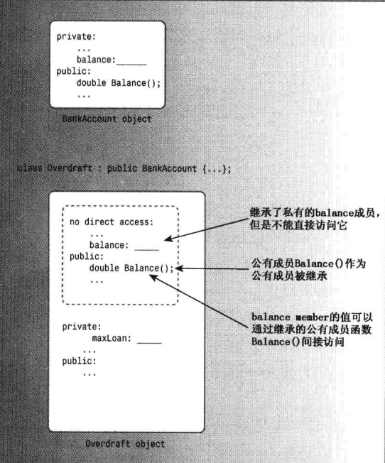
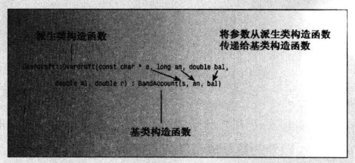
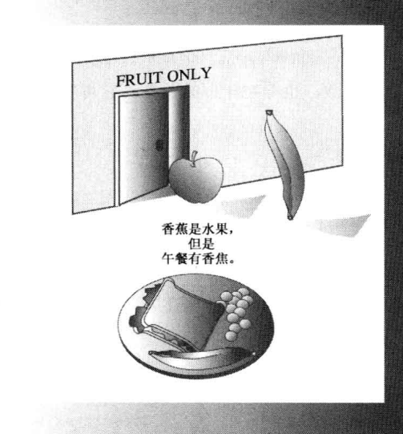
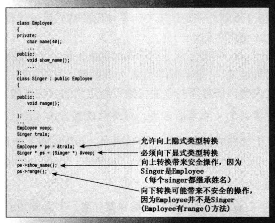
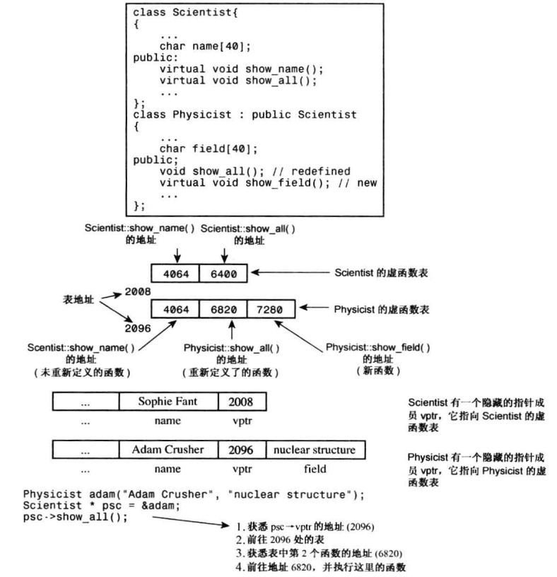

```
# 第1章-预备知识
# 第2章-开始学习C++
# 第3章-处理数据
# 第4章-复合类型
# 第5章-循环和关系表达式
# 第6章-分支语句和逻辑运算符
# 第7章-函数一C++ 的编程模块
# 第08章-函数探幽
# 第09章-内存模型和名称空间
# 第10章-对象和类
# 第11章-使用类
# 第12章-类和动态内存分配
```

# 第13章-类继承

本章内容包括：

- is-a关系的继承。
- 如何以公有方式从一个类派生出另一个类。
- 保护访问。
- 构造函数成员初始化列表。
- 向上和向下强制转换。
- 虚成员函数。
- 早期(静态)联编与晚期(动态)联编。
- 抽象基类。
- 纯虚函数。
- 何时及如何使用公有继承。

面向对象编程的主要目的之.- -是提供可重用的代码。开发新项目，尤其是当项目十分庞大时，重用经过测试的代码比重新编写代码要好得多。使用已有的代码可以节省时间，由于已有的代码已被使用和测试过，因此有助于避免在程序中引入错误。另外，必须考虑的细节越少，便越能专注于程序的整体策略。

传统的C函数库通过预定义、预编译的函数(如strlen( )和rand( )，可以在程序中使用这些函数)提供了可重用性。很多厂商都提供了专用的C库，这些专用库提供标准C库没有的函数。例如，可以购买数据库管理函数库和屏幕控制函数库。然而，函数库也有局限性。除非厂商提供了库函数的源代码(通常是不提供的)，否则您将无法根据自己特定的需求，对函数进行扩展或修改，而必须根据库的情况修改自己的程序。即使厂商提供了源代码，在修改时也有一定的风险，如不经意地修改了函数的工作方式或改变了库函数之间的关系。

C+ +类提供了更高层次的重用性。目前，很多厂商提供了类库，类库由类声明和实现构成。因为类组合了数据表示和类方法，因此提供了比函数库更加完整的程序包。例如，单个类就可以提供用于管理对话框的全部资源。通常，类库是以源代码的方式提供的，这意味着可以对其进行修改，以满足需求。然而，C++提供了比修改代码更好的方法来扩展和修改类。这种方法叫作类继承，它能够从已有的类派生出新的类，而派生类继承了原有类(称为基类)的特征，包括方法。正如继承一笔财产要比自己白手起家容易-样，通过继承派生出的类通常比设计新类要容易得多。下面是可以通过继承完成的一些工作。

- 可以在已有 类的基础上添加功能。例如，对于数组类，可以添加数学运算。
- 可以给类添加数据。例如，对于字符串类，可以派生出一个类，并添加指定字符串显示颜色的数据成员。
- 可以修改类方法的行为。例如，对于代表提供给飞机乘客的服务的Passenger类，可以派生出提供更高级别服务的FirstClassPassenger类。

当然，可以通过复制原始类代码，并对其进行修政来完成上述工作，但继承机制只需提供新特性，甚至不需要访问源代码就可以派生出类。因此，如果购买的类库只提供了类方法的头文件和编译后代码，仍可以使用库中的类派生出新的类。而且可以在不公开实现的情况下将自己的类分发给其他人，同时允许他们在类中添加新特性。

继承是一种非常好的概念，其基本实现非常简单。但要对继承进行管理，使之在所有情况下都能正常工作，则需要做一些调整。本章将介绍继承简单的一面和复杂的一面。

## 一个简单的基类

从一个类派生出另一个类时，原始类称为基类，继承类称为派生类。为说明继承，首先需要一个基类。Webtown俱乐部决定跟踪乒乓球会会员。作为俱乐部的首席程序员，需要设计一个简 单的TableTennisPlayer类，如程序清单13.1和13.2所示。

`程序清单13.1 tabtenn0.h`

```c++
// tabtenn0.h -- a table-tennis base class
#ifndef TABTENN0_H_
#define TABTENN0_H_
#include <string>
using std::string;
// simple base class
class TableTennisPlayer
{
private:
    string firstname;
    string lastname;
    bool hasTable;
public:
    TableTennisPlayer (const string & fn = "none",
                       const string & ln = "none", bool ht = false);
    void Name() const;
    bool HasTable() const { return hasTable; };
    void ResetTable(bool v) { hasTable = v; };
};
#endif

```

`程序清单13.2 tabtenn0.cpp`

```c++
//tabtenn0.cpp -- simple base-class methods
#include "tabtenn0.h"
#include <iostream>

TableTennisPlayer::TableTennisPlayer (const string & fn, 
    const string & ln, bool ht) : firstname(fn),
	    lastname(ln), hasTable(ht) {}
    
void TableTennisPlayer::Name() const
{
    std::cout << lastname << ", " << firstname;
}
```

TableTennisPlayer类只是记录会员的姓名以及是否有球桌。有两点需要说明。首先，这个类使用标准string类来存储姓名，相比于使用字符数组，这更方便、更灵活、更安全，而与第12章的String 类相比，这更专业。其次，构造函数使用了第12章介绍的成员初始化列表语法，但也可以像下面这样做：

```c++
TableTennisPlayer: ： TableTennisPlayer (const string & fn
const string & In, bool ht
firstname = fn;
lastname = In;
hasTable = ht
```

这将首先为firstname 调用string 的默认构造函数，再调用string 的赋值运算符将firstname 设置为fn,但初始化列表语法可减少一一个步骤， 它直接使用string 的复制构造函数将firstname 初始化为fn。

程序清单133使用了这个类。

`程序清单13.3 usetto.cpp`

```c++
// usett0.cpp -- using a base class
#include <iostream>
#include "tabtenn0.h"

int main ( void )
{
    using std::cout;
    TableTennisPlayer player1("Chuck", "Blizzard", true);
    TableTennisPlayer player2("Tara", "Boomdea", false);
    player1.Name();
    if (player1.HasTable())
        cout << ": has a table.\n";
    else
        cout << ": hasn't a table.\n";
    player2.Name();
    if (player2.HasTable())
        cout << ": has a table";
    else
        cout << ": hasn't a table.\n";
    // std::cin.get();
    return 0;
}

```

下面是程序清单13.1.-13.3 组成的程序的输出：

```
Blizzard, Chuck: has a table.
Boomdea, Tara: hasn't a table.
```

注意到该程序实例化对象时将C-风格字符串作为参数：

```c++
TableTennisPlayer playerl ("Chuck"，"Blizzard"， true) ；
TableTennisPlayer player2 ("Tara"，"Boomdea"， false) ；
```

但构造函数的形参类型被声明为const string &。这导致类型不匹配，但与第12章创建的String类一样，string类有一个将constchar*作为参数的构造函数，使用C-风格字符串初始化string对象时，将自动调用这个构造函数。总之，可将string对象或C-风格字符串作为构造函数Table TennisPlayer的参数；将前者作为参数时，将调用接受conststring&作为参数的string构造函数，而将后者作为参数时，将调用接受const  char *作为参数的string构造函数。

### 派生一个类

Webtown俱乐部的一些成 员曾经参加过当地的乒乓球锦标赛，需要这样一个类， 它能包括成员在比赛中的比分。与其从零开始，不如从TableTennisClass 类派生出一个类。 首先将RatedPlayer 类声明为从TableTennisClass类派生而来：

```c++
// Ratedplayer derives from the TableTennisPlayer base class
class RatedPlayer ： public TableTennisPlayer
}
```

冒号指出RatedPlayer 类的基类是TableTennisplayer类。上述特殊的声明头表明TableTennisPlayer是一个公有基类，这被称为公有派生。派生类对象包含基类对象。使用公有派生，基类的公有成员将成为派生类的公有成员；基类的私有部分也将成为派生类的一部分，但只能通过基类的公有和保护方法访问(稍后
将介绍保护成员)。

上述代码完成了哪些工作呢? Ratedplayer 对象将具有以下特征：

- 派生类对象存储了基类的数据成员( 派生类继承了基类的实现)；
- 派生类对 象可以使用基类的方法(派生类继承了基类的接口)。

因此，RatedPlayer 对象可以存储运动员的姓名及其是否有球桌。另外，RatedPlayer 对象还可以使用TableTennisPlayer类的Name( )、hasTable( )和ResetTable( )方法(参见图13.1)。



<center>图13.1基类对 象和派生类对象

需要在继承特性中添加什么呢?

- 派生类需要 自己的构造函数。
- 派生类可以根据需要添加额外的数据成员和成员函数。

在这个例子中，派生类需要另一个数据成员来存储比分，还应包含检索比分的方法和重置比分的方法。因此，类声明与下面类似：

```c++
// simple derived class
class RatedPlayer ： public TableTennisPlayer
484
C++ Primer Plus (第6版)中文版
private:
unsigned int rating;
// add a data member
public:
RatedPlayer (unsigned int r = 0，const string & fn = "none"，
const string & In = "none"， bool ht = false) ；
RatedPlayer (unsigned int r，const TableTennisPlayer & tp) ；
unsigned int Rating() const { return rating; } // add a method
void ResetRating (unsigned int r) {rating = r;} // add a method
}，
```

构造函数必须给新成员( 如果有的话)和继承的成员提供数据。在第一个RatedPlayer构造函数中，每个成员对应一个形参；而第二个Ratedplayer 构造函数使用-个TableTennisPlayer 参数，该参数包括firstname、lastname 和hasTable。

### 构造函数： 访问权限的考虑

派生类不能直接访问基类的私有成员，而必须通过基类方法进行访问。例如，RatedPlayer 构造函数不能直接设置继承的成员(firstname、lastname和hasTable)，而必须使用基类的公有方法来访问私有的基类成员。具体地说，派生类构造函数必须使用基类构造函数。

创建派生类对象时， 程序首先创建基类对象。从概念上说，这意味着基类对象应当在程序进入派生类构造函数之前被创建。C+ +使用成员初始化列表语法来完成这种工作。例如，下面是第一个RatedPlayer构造函数的代码：

```c++
RatedPlayer: :RatedPlayer (unsigned int r, const string & fn
const string & 1n, bool ht) ： TableTennisPlayer(fn, In, ht)
rating = r;
```

其中:TableTennisPlayer (fn,1n,ht)是成员初始化列表。它是可执行的代码，调用TableTennisPlayer构造函数。例如，假设程序包含如下声明：

```c++
RatedPlayer rplayer1 (1140，"Mallory"， "Duck"， true) ；
```

则RealPlayer构造函数将把实参“Mallory”、“Duck”和true赋给形参fn、In 和ht,然后将这些参数作为实参传递给TableTennisPlayer构造函数，后者将创建--个嵌套TableTennisPlayer对象，并将数据“Mallory”、“Duck” 和true存储在该对象中。然后，程序进入RealPlayer构造函数体，完成RealPlayer对
象的创建，并将参数r的值(即1140)赋给rating成员(参见图13.2)。



<center>图13.2 将参数传递给基类构造函数

如果省略成员初始化列表，情况将如何呢?

```c++
RatedPlayer: ： RatedPlayer (unsigned int r，const string & fn,
const string & n，bool ht) // what if no initializer list?
rating = r;
```

必须首先创建基类对象，如果不调用基类构造函数，程序将使用默认的基类构造函数，因此上述代码与下面等效：

```c++
RatedPlayer: ： RatedPlayer (unsigned int r，const string & fn,
const string & In, bool ht) // ： TableTennisPlayer()
rating = r;
```

除非要使用默认构造函数，否则应显式调用正确的基类构造函数。

下面来看第二个构造函数的代码：

```c++
RatedPlayer: ： RatedPlayer unsigned int r，const TableTennisPlayer & tp)
TableTennisPlayer (tp)
rating = r;
```

这里也将TableTennisPlayer的信息传递给了TableTennisPlayer 构造函数：

```c++
TableTennisPlayer(tp)
```

由于tp的类型为TableTennisPlayer &，因此将调用基类的复制构造函数。基类没有定义复制构造函数，但第12章介绍过，如果需要使用复制构造函数但又没有定义，编译器将自动生成一个。在这种情况下，执行成员复制的隐式复制构造函数是合适的，因为这个类没有使用动态内存分配(string成员确实使用了动态内存分配，但本书前面说过，成员复制将使用string类的复制构造函数来复制string成员)。

如果愿意，也可以对派生类成员使用成员初始化列表语法。在这种情况下，应在列表中使用成员名，而不是类名。所以，第二个构造函数可以按照下述方式编写：

```c++
// alternative version
RatedPlayer: :RatedPlayer (unsigned int r，const TableTennisPlayer & tp)
： TableTennisPlayer(tp) ，rating (r)
```

有关派生类构造函数的要点如下：

- 首 先创建基类对象；
- 派生类构造函数应通过成员初始化列表将基类信息传递给基类构造函数；
- 派生类构造 函数应初始化派生类新增的数据成员。

这个例子没有提供显式构造函数，因此将使用隐式构造函数。释放对象的顺序与创建对象的顺序相反，即首先执行派生类的析构函数，然后自动调用基类的析构函数。

注意：创建派生类对象时，程序首先调用基类构造函数，然后再调用派生类构造函数。基类构造函数负责初始化继承的数据成员；派生类构造函数主要用于初始化新增的数据成员。派生类的构造函数总是调用一个基类构造函数。可以使用初始化器列表语法指明要使用的基类构造函数，否则将使用默认的基类构造函数。

派生类对象过期时，程序将首先调用派生类析构函数，然后再调用基类析构函数。

**成员初始化列表**

派生类构造函数可以使用初始化器列表机制将值传递给基类构造函数。请看下面的例子：

```c++
derived: :derived(typeI x，type2 y) ： base(x,y) // initializer list
```

其中derived是派生类，base是基类,x和y是基类构造函数使用的变量。例如，如果派生类构造函数接收到参数10和12，则这种机制将把10和12传递给被定义为接受这些类型的参数的基类构造函数。除虚基类外(参见第14章)，类只能将值传递回相邻的基类，但后者可以使用相同的机制将信息传递给相邻的基类，依此类推。如果没有在成员初始化列表中提供基类构造函数，程序将使用默认的基类构造函数。成员初始化列表只能用于构造函数。

### 使用派生类

要使用派生类，程序必须要能够访问基类声明。程序清单13.4将这两种类的声明置于同一个头文件中。也可以将每个类放在独立的头文件中，但由于这两个类是相关的，所以把其类声明放在一起更合适。

`程序清单13.4 tabtenn1.h`

```c++
// tabtenn1.h -- a table-tennis base class
#ifndef TABTENN1_H_
#define TABTENN1_H_
#include <string>
using std::string;
// simple base class
class TableTennisPlayer
{
private:
    string firstname;
    string lastname;
    bool hasTable;
public:
    TableTennisPlayer (const string & fn = "none",
                       const string & ln = "none", bool ht = false);
    void Name() const;
    bool HasTable() const { return hasTable; };
    void ResetTable(bool v) { hasTable = v; };
};

// simple derived class
class RatedPlayer : public TableTennisPlayer
{
private:
    unsigned int rating;
public:
    RatedPlayer (unsigned int r = 0, const string & fn = "none",
                 const string & ln = "none", bool ht = false);
    RatedPlayer(unsigned int r, const TableTennisPlayer & tp);
    unsigned int Rating() const { return rating; }
    void ResetRating (unsigned int r) {rating = r;}
};

#endif

```

程序清单13.5是这两个类的方法定义。同样，也可以使用不同的文件，但将定义放在-起更简单。

`程序清单13.5 tabtenn1 .cpp`

```c++
//tabtenn1.cpp -- simple base-class methods
#include "tabtenn1.h"
#include <iostream>

TableTennisPlayer::TableTennisPlayer (const string & fn, 
    const string & ln, bool ht) : firstname(fn),
	    lastname(ln), hasTable(ht) {}
    
void TableTennisPlayer::Name() const
{
    std::cout << lastname << ", " << firstname;
}

// RatedPlayer methods
RatedPlayer::RatedPlayer(unsigned int r, const string & fn,
     const string & ln, bool ht) : TableTennisPlayer(fn, ln, ht)
{
    rating = r;
}

RatedPlayer::RatedPlayer(unsigned int r, const TableTennisPlayer & tp)
    : TableTennisPlayer(tp), rating(r)
{
}

```

程序清单13.6创建了TableTennisPlayer 类和RatedPlayer类的对象。请注意这两个类对象是如何使用TableTennisPlayer类的Name( )和HasTable( )方法的。

`程序清单13.6 usett1.cpp`

```c++
// usett1.cpp -- using base class and derived class
#include <iostream>
#include "tabtenn1.h"

int main ( void )
{
    using std::cout;
    using std::endl;
    TableTennisPlayer player1("Tara", "Boomdea", false);
    RatedPlayer rplayer1(1140, "Mallory", "Duck", true);
    rplayer1.Name();          // derived object uses base method
    if (rplayer1.HasTable())
        cout << ": has a table.\n";
    else
        cout << ": hasn't a table.\n";
    player1.Name();           // base object uses base method
    if (player1.HasTable())
        cout << ": has a table";
    else
        cout << ": hasn't a table.\n";
    cout << "Name: ";
    rplayer1.Name();
    cout << "; Rating: " << rplayer1.Rating() << endl;
// initialize RatedPlayer using TableTennisPlayer object
    RatedPlayer rplayer2(1212, player1);
    cout << "Name: ";
    rplayer2.Name();
    cout << "; Rating: " << rplayer2.Rating() << endl;
    // std::cin.get();
    return 0;
}

```

下面是程序清单13.4~程序清单13.6组成的程序的输出： 

```
Duck, Mallory: has a table.
Boomdea, Tara: hasn't a table.
Name: Duck, Mallory; Rating: 1140
Name: Boomdea, Tara; Rating: 1212
```


### 派生 类和基类之间的特殊关系

派生类与基类之间有一些特殊关系。其中之一是派生类对象可以使用基类的方法，条件是方法不是私有的：

```c++
RatedPlayer rplayer1 (1140，"Mallory"， "Duck"， true) ；
rplayer1 . Name()； // derived object uses base method
```

另外两个重要的关系是：基类指针可以在不进行显式类型转换的情况下指向派生类对象；基类引用可以在不进行显式类型转换的情况下引用派生类对象：

```c++
RatedPlayer rplayer1 (1140，"Mallory"， "Duck"， true) ；
TableTennisPlayer & r比t = rplayer;
TableTennisPlayer * pt = &rplayer ；
rt.Name()； // invoke Name() with reference
pt->Name()； // invoke Name() with pointer
```

然而，基类指针或引用只能用于调用基类方法，因此，不能使用t或pt来调用派生类的ResetRanking方法。

通常，C++要求引用和指针类型与赋给的类型匹配，但这一-规 则对继承来说是例外。然而，这种例外只是单向的，不可以将基类对象和地址赋给派生类引用和指针：

```c++
TableTennisPlayer Player ("Betsy"， "Bloop"， true)；
RatedPlayer & rr = player;
// NOT ALLOWED
Ratedplayer * pr = player;
// NOT ALLOWED
```

上述规则是有道理的。例如，如果允许基类引用隐式地引用派生类对象，则可以使用基类引用为派生类对象调用基类的方法。因为派生类继承了基类的方法，所以这样做不会出现问题。如果可以将基类对象赋给派生类引用，将发生什么情况呢?派生类引用能够为基对象调用派生类方法，这样做将出现问题。例如，将RatedPayer:Rating( )方法用于TableTennisPlayer对象是没有意义的，因为TableTennisPlayer对象没有rating成员。

如果基类引用和指针可以指向派生类对象，将出现一些很有趣的结果。 其中之一是基类引用定 义的函数或指针参数可用于基类对象或派生类对象。例如，在下面的函数中：

```c++
voi3 Show (const TableTennisPlayer & rt)
using std: :cout;
cout << "Name: "
rt .Name() ；
cout << "\nTable: "
if (rt . HasTable())
cout << "yes\n"；
cout << "no\n"；
```

形参是一个基类引用，它可以指向基类对象或派生类对象，所以可以在Show( )中使用TableTennis参数或Ratedplayer参数：

```c++
TableTennisplayer player1 ("Tara"， "Boomdea"， false) ；
RatedPlayer rplayer1 (1140，"Mallory"， "Duck"， true) ；
Show(player1)； // works with TableTennisPlayer argument
Show (rplayer1)； // works with RatedPlayer argument
```

对于形参为指向基类的指针的函数，也存在相似的关系。它可以使用基类对象的地址或派生类对象的地址作为实参： 

```c++
void Wohs (const TableTennisPlayer * pt)； // function with pointer parameter
TableTennisPlayer player1 ("Tara"， "Boomdea"， false) ；
RatedPlayer rplayer1 (1140，"Mallory"， "Duck"， true) ；
Wohs ( &player1) ； // works with TableTennisPlayer * argument
Wohs (&rplayerl)； // works with RatedPlayer * argument
```

引用兼容性属性也让您能够将基类对象初始化为派生类对象，尽管不那么直接。假设有这样的代码：

```c++
RatedPlayer olaf1(1840， "Olaf"， "Loaf"， true) ；
TableTennisPlayer olaf2(olaf1) ；
```

要初始化olaf2,匹配的构造函数的原型如下：

```c++
TableTennisPlayer (const RatedPlayer &) ；
// doesn't exist
```

类定义中没有这样的构造函数，但存在隐式复制构造函数：

```c++
// implicit copy constructor
TableTennisPlayer (const TableTennisPlayer &)；
```

形参是基类引用，因此它可以引用派生类。这样，将olaf2初始化为olafl 时，将要使用该构造函数，它复制firstname、lastname 和hasTable成员。换句话来说，它将olaf2初始化为嵌套在RatedPlayer对象olaf1中的TableTennisPlayer对象。

同样，也可以将派生对象赋给基类对象：

```c++
RatedPlayer olaf1(1840， "0laf"， "Loaf"， true) ；
TableTennisPlayer winner ；
winner = olaf1; // assign derived to base object
```

在这种情况下，程序将使用隐式重载赋值运算符：

```c++
TableTennislayer & operator= (const TableTennisPlayer &) const;
```

基类引用指向的也是派生类对象，因此olaf1的基类部分被复制给winner。

## 继承： is-a关系

派生类和基类之间的特殊关系是基于C++继承的底层模型的。实际上，C++有3种继承方式：公有继承、保护继承和私有继承。公有继承是最常用的方式，它建立一种is-a 关系，即派生类对象也是一个基类对象，可以对基类对象执行的任何操作，也可以对派生类对象执行。例如，假设有一个 Fruit类，可以保存水果的重量和热量。因为香蕉是一种特殊的水果，所以可以从Fruit 类派生出Banana类。新类将继承原始类的所有数据成员，因此，Banana对象将包含表示香蕉重量和热量的成员。新的Banana类还添加了专门用于香蕉的成员，这些成员通常不用于水果，例如Banana Institute Peel Index ( 香蕉机构果皮索引)。因为派生类可以添加特性，所以，将这种关系称为is-a-kind-of (是一种) 关系可能更准确，但是通常使用术语is-a。

为阐明is-a 关系，来看一些 与该模型不符的例子。公有继承不建立has-a关系。例如，午餐可能包括水果，但通常午餐并不是水果。所以，不能通过从Fruit类派生出Lunch类来在午餐中添加水果。在午餐中加入水果的正确方法是将其作为一种has-a关系：午餐有水果。正如将在第14章介绍的，最容易的建模方式是，将Fruit对象作为Lunch类的数据成员(参见图13.3)。



<center>图13.3 is-a 关系和has-a关系

公有继承不能建立is-like-a 关系，也就是说，它不采用明喻。人们通常说律师就像鲨鱼，但律师并不是鲨鱼。例如，鲨鱼可以在水下生活。所以，不应从Shark类派生出Lawyer类。继承可以在基类的基础上添加属性，但不能删除基类的属性。在有些情况下，可以设计一个包含共有特征的类，然后以is-a或has-a关系，在这个类的基础上定义相关的类。

公有继承不建立is-implemented-as-a (作为....来实现)关系。例如，可以使用数组来实现栈，但从Array类派生出Stack 类是不合适的，因为栈不是数组。例如，数组索引不是栈的属性。另外，可以以其他方式实现栈，如链表。正确的方法是，通过让栈包含一个私有Array对象成员来隐藏数组实现。

公有继承不建立uses-a 关系。例如，计算机可以使用激光打印机，但从Computer类派生出Printer 类(或反过来)是没有意义的。然而，可以使用友元函数或类来处理Printer对象和Computer对象之间的通信。

在C+中，完全可以使用公有继承来建立has-a、is implemented-as-a或uses-a 关系；然而，这样做通常会导致编程方面的问题。因此，还是坚持使用is-a关系吧。

## 多态公有继承

RatedPlayer继承示例很简单。派生类对象使用基类的方法，而未做任何修改。然而，可能会遇到这样的情况，即希望同一个方法在派生类和基类中的行为是不同的。换句话来说，方法的行为应取决于调用该方法的对象。这种较复杂的行为称为多态一具有 多种形态，即同一个方法的行为随上下文而异。有两种重要的机制可用于实现多态公有继承；

- 在派生类中重新定义基类的方法。
- 使用虚方法。

现在来看另一个例子。由于Webtown俱乐部的工作经历，您成了Pontoon 银行的首席程序员。银行要求您完成的第一项工作是开发两个类。一个类用于表示基本支票账户一Brass Account, 另一个类用于表示代表Brass Plus 支票账户，它添加了透支保护特性。也就是说，如果用户签出一张超出其存款余额的支票一但是超出的数额并不是很大，银行将支付这张支票，对超出的部分收取额外的费用，并追加罚款。可以根据要保存的数据以及允许执行的操作来确定这两种账户的特征。

下面是用于BrassAccount支票账户的信息：

- 客户姓名；
- 账号；
- 当前结余。

下面是可以执行的操作：

- 创建账户；
- 存款；
- 取款；
- 显示账户信息。

Pontoon银行希望Brass Plus支票账户包含Brass Account的所有信息及如下信息：

- 透支上限；
- 透支贷款利率；
- 当前的透支总额。

不需要新增操作，但有两种操作的实现不同：

- 对 于取款操作，必须考虑透支保护；
- 显示操作必须显示BrassPlus账户的其他信息。

假设将第一一个类命 名为Brass,第二个类为BrassPlus。应从Brass公有派生出BrassPlus 吗?要回答这个问题，必须先回答另一个问题： BrassPlus 类是否满足is-a 条件?当然满足。对于Brass对象是正确的事情，对于BrassPlus对象也是正确的。它们都将保存客户姓名、账号以及结余。使用这两个类都可以存款、取款和显示账户信息。请注意，is-a 关系通常是不可逆的。也就是说，水果不是香蕉；同样，Brass 对象不具备BrassPlus对象的所有功能。

### 开发Brass类和BrassPlus类

BrassAccount类的信息很简单，但是银行没有告诉您有关透支系统的细节。当您向友好的Pontoon银行代表询问时，他提供了如下信息：

- BrassPlus账户限制了客户的透支款额。默认为500元，但有些客户的限额可能不同；
- 银行可以修改客户的透支限额；
- Brass Plus账户对贷款收取利息。默认为11.125%，但有些客户的利率可能不同；
- 银行可以修改客户的利率；
- 账户记录客户所欠银行的金额(透支数额加利息)。用户不能通过常规存款或从其他账户转账的方式偿付，而必须以现金的方式交给特定的银行工作人员。如果有必要，工作人员可以找到该客户。欠款偿还后，欠款金额将归零。

最后一种特性是银行出于做生意的考虑而采用的，这种方法有它有利的一面一使编程更简 单。

上述列表表明，新的类需要构造函数，而且构造函数应提供账户信息，设置透支上限(默认为500元)和利率(默认为11.125%)。 另外，还应有重新设置透支限额、利率和当前欠款的方法。要添加到Brass类中的就是这些，这将在BrassPlus类声明中声明。

有关这两个类的信息声明，类声明应类似于程序清单13.7。

`程序清单13.7 brass.h`

```c++
// brass.h  -- bank account classes
#ifndef BRASS_H_
#define BRASS_H_
#include <string>
// Brass Account Class
class Brass
{
private:
    std::string fullName;
    long acctNum;
    double balance;
public:
    Brass(const std::string & s = "Nullbody", long an = -1,
                double bal = 0.0);
    void Deposit(double amt);
    virtual void Withdraw(double amt);
    double Balance() const;
    virtual void ViewAcct() const;
    virtual ~Brass() {}
};

//Brass Plus Account Class
class BrassPlus : public Brass
{
private:
    double maxLoan;
    double rate;
    double owesBank;
public:
    BrassPlus(const std::string & s = "Nullbody", long an = -1,
            double bal = 0.0, double ml = 500,
            double r = 0.11125);
    BrassPlus(const Brass & ba, double ml = 500, 
		                        double r = 0.11125);
    virtual void ViewAcct()const;
    virtual void Withdraw(double amt);
    void ResetMax(double m) { maxLoan = m; }
    void ResetRate(double r) { rate = r; };
    void ResetOwes() { owesBank = 0; }
};

#endif

```

对于程序清单13.7，需要说明的有下面几点：

- BrassPlus 类在Brass类的基础上添加了3个私有数据成员和3个公有成员函数；
- Brass类和BrassPlus类都声明了ViewAcct( )和Withdraw( )方法，但BrassPlus对象和Brass对象的这些方法的行为是不同的；
- Brass类在声明ViewAcc( )和Withdraw( )时使用了新关键字virtual.这些方法被称为虚方法( virtual method)；
- Brass类还声明了一个虚析构函数，虽然该析构函数不执行任何操作。

第一点没有什么新鲜的。RatedPlayer 类在Table TennisPlayer类的基础上添加新数据成员和2个新方法的方式与此类似。

第二点介绍了声明如何指出方法在派生类的行为的不同。两个ViewAcct( )原型表明将有2个独立的方法定义。基类版本的限定名为Brass:ViewAcct( )，派生类版本的限定名为BrassPlus:ViewAcct()o 程序将使用对象类型来确定使用哪个版本：

```c++
Brass dom ("Dominic Banker"， 11224， 4183.45) ；
BrassPlus dot ("Dorothy Banker"， 12118， 2592.00) ；
dom. ViewAcct() ；
// use Brass: :ViewAcct() 
dot. ViewAcct() ；
// use BrassPlus: :ViewAcct()
```

同样，Withdraw( )也有2个版本，一个供Brass对象使用，另一个供BrassPlus对象使用。对于在两个类中行为相同的方法(如Deposit( )和Balance( )，则只在基类中声明。

第三点(使用virtual) 比前两点要复杂。如果方法是通过引用或指针而不是对象调用的，它将确定使用哪一种方法。如果没有使用关键字virtual,程序将根据引用类型或指针类型选择方法；如果使用了virtual,程序将根据引用或指针指向的对象的类型来选择方法。如果ViewAcct( )不是虛的，则程序的行为如下：

```c++
// behavior with non-virtual ViewAcct() 
// method chosen according to reference type
Brass dom("Dominic Banker"， 11224， 4183.45) ；
BrassPlus dot ("Dorothy Banker"， 12118， 2592.00) ；
Brass & b1 ref = dom;
Brass & b2_ ref = dot;
b1_ ref .ViewAcct() ；
// use Brass: :ViewAcct ()
b2 ref .ViewAcct() ；
// use Brass: :ViewAcct ()
```

引用变量的类型为Brass,所以选择了Brass:ViewAccount( )。使用Brass指针代替引用时，行为将与此类似。

如果ViewAcct( )是虚的，则行为如下：

```c++
// behavior with virtual ViewAcct ()
// method chosen according to object type
rass dom ("Dominic Banker"， 11224， 4183.45) ；
BrassPlus dot ("Dorothy Banker"， 12118， 2592.00) ；
Brass & bl ref = dom;
Brass&b2_ref=dot;
b1_ ref .ViewAcct()；
// use Brass: :ViewAcct ()
b2 ref .ViewAcct()；
// use BrassPlus: :ViewAcct()
```

这里两个引用的类型都是Brass, 但b2 ref引用的是一个BrassPlus 对象，所以使用的是BrassPu:ViewAcct( )。使用Brass指针代替引用时，行为将类似。

稍后您将看到，虚函数的这种行为非常方便。因此，经常在基类中将派生类会重新定义的方法声明为虚方法。方法在基类中被声明为虚的后，它在派生类中将自动成为虚方法。然而，在派生类声明中使用关键字virtual来指出哪些函数是虚函数也不失为一个好办法。

第四点是，基类声明了一个虚析构函数。这样做是为了确保释放派生对象时，按正确的顺序调用析构函数。本章后面将详细介绍这个问题。

注意：如果要在派生类中重新定义基类的方法，通常应将基类方法声明为虚的。这样，程序将根据对象类型而不是引用或指针的类型来选择方法版本。为基类声明一个虚析构函数也是一种惯例。

1. 类实现

接下来需要实现类，其中的部分工作已由头文件中的内联函数定义完成了。程序清单13.8列出了其他方法的定义。注意，关键字virtual只用于类声明的方法原型中，而没有用于程序清单13.8 的方法定义中。

`程序清单13.8 brass.cpp`

```c++
// dma.cpp --dma class methods

#include "dma.h"
#include <cstring>

// baseDMA methods
baseDMA::baseDMA(const char * l, int r)
{
    label = new char[std::strlen(l) + 1];
    std::strcpy(label, l);
    rating = r;
}

baseDMA::baseDMA(const baseDMA & rs)
{
    label = new char[std::strlen(rs.label) + 1];
    std::strcpy(label, rs.label);
    rating = rs.rating;
}

baseDMA::~baseDMA()
{
    delete [] label;
}

baseDMA & baseDMA::operator=(const baseDMA & rs)
{
    if (this == &rs)
        return *this;
    delete [] label;
    label = new char[std::strlen(rs.label) + 1];
    std::strcpy(label, rs.label);
    rating = rs.rating;
    return *this;
}
    
std::ostream & operator<<(std::ostream & os, const baseDMA & rs)
{
    os << "Label: " << rs.label << std::endl;
    os << "Rating: " << rs.rating << std::endl;
    return os;
}

// lacksDMA methods
lacksDMA::lacksDMA(const char * c, const char * l, int r)
    : baseDMA(l, r)
{
    std::strncpy(color, c, 39);
    color[39] = '\0';
}

lacksDMA::lacksDMA(const char * c, const baseDMA & rs)
    : baseDMA(rs)
{
    std::strncpy(color, c, COL_LEN - 1);
    color[COL_LEN - 1] = '\0';
}

std::ostream & operator<<(std::ostream & os, const lacksDMA & ls)
{
    os << (const baseDMA &) ls;
    os << "Color: " << ls.color << std::endl;
    return os;
}

// hasDMA methods
hasDMA::hasDMA(const char * s, const char * l, int r)
         : baseDMA(l, r)
{
    style = new char[std::strlen(s) + 1];
    std::strcpy(style, s);
}

hasDMA::hasDMA(const char * s, const baseDMA & rs)
         : baseDMA(rs)
{
    style = new char[std::strlen(s) + 1];
    std::strcpy(style, s);
}

hasDMA::hasDMA(const hasDMA & hs)
         : baseDMA(hs)  // invoke base class copy constructor
{
    style = new char[std::strlen(hs.style) + 1];
    std::strcpy(style, hs.style);
}

hasDMA::~hasDMA()
{
    delete [] style;
}

hasDMA & hasDMA::operator=(const hasDMA & hs)
{
    if (this == &hs)
        return *this;
    baseDMA::operator=(hs);  // copy base portion
    delete [] style;         // prepare for new style
    style = new char[std::strlen(hs.style) + 1];
    std::strcpy(style, hs.style);
    return *this;
}
    
std::ostream & operator<<(std::ostream & os, const hasDMA & hs)
{
    os << (const baseDMA &) hs;
    os << "Style: " << hs.style << std::endl;
    return os;
}

```

介绍程序清单13.8的具体细节(如一些方法的格式化处理)之前，先来看一下与继承直接相关的方面。记住，派生类并不能直接访问基类的私有数据，而必须使用基类的公有方法才能访问这些数据。访问的方式取决于方法。构造函数使用-种技术，而其他成员函数使用另-种技术。

派生类构造函数在初始化基类私有数据时，采用的是成员初始化列表语法。RatedPlayer类构造函数和BrassPlus构造函数都使用这种技术：

```c++
BrassPlus: ： BrassPlus (const string & s，long an, double bal ，
double m1，double 上) ： Brass(s， an, bal)
maxLoan = ml ；
owesBank = 0.0;
rate = r;
BrassPlus: :BrassPlus(const Brass & ba, double ml, double r)
Brass(ba) // uses implicit copy constructor
maxLoan = ml ；
owesBank = 0.0 ；
rate = r;
```

这几个构造函数都使用成员初始化列表语法，将基类信息传递给基类构造函数，然后使用构造函数体初始化BrassPlus 类新增的数据项。

非构造函数不能使用成员初始化列表语法，但派生类方法可以调用公有的基类方法。例如，BrassPlus 版本的ViewAcct( )核心内容如下(忽略了格式方面)：

```c++
// redefine how ViewAcct() works
void BrassPlus: :ViewAcct() const ，
Brass: :ViewAcct() ； . // display base portion
cout << "Maximum loan:
$”<< maxLoan << endl;
cout << "Owed to bank: $" << owesBank << endl ；
cout << "Loan Rate: " << 100 * rate << "号\n"；
```

换句话说，BrassPlus:ViewAcct( )显示新增的BrassPlus 数据成员，并调用基类方法Bras:ViewAcct( )来显示基类数据成员。在派生类方法中，标准技术是使用作用域解析运算符来调用基类方法。

代码必须使用作用域解析运算符。假如这样编写代码：

```c++
// redefine erroneously how ViewAcct() works
void BrassPlus: :ViewAcct() const
ViewAcct() ；
// o0pS! recursive call
```

如果代码没有使用作用域解析运算符，编译器将认为ViewAcct )是BrassPlus:ViewAcct( )，这将创建一个不会终止的递归函数一这 可不好。

接下来看BrassPlus:Withdraw( )方法。如果客户提取的金额超过了结余，该方法将安排贷款。它可以使用Bras:Withdraw( )来访问balance 成员，但如果取款金额超过了结余，Brass:: Withdraw( )将发出一个错误消息。这种实现使用Deposit( )方法进行放贷，然后在得到了足够的结余后调用Brass:Withdraw,从而避免了错误消息：

```c++
// redefine how Wi thdraw() works
void BrassPlus: :Wi thdraw (double. amt
double bal = Balance() ；
if (amt <= bal)
Brass: :Withdraw (amt) ；
else if ( amt <= bal + maxLoan 一owesBank)
double advance = amt - bal ；
owesBank += advance
(1.0 + rate) ；
cout << "Bank advance: $" << advance << endl ；
cout << "Finance charge: $" << advance * rate << endl ；
Deposit (advance)；
Brass: :Withdraw (amt) ；
else
cout << "Credit limit exceeded. Transaction cancelled. \n"；
```

该方法使用基类的Balance( )函数来确定结余。因为派生类没有重新定义该方法，代码不必对Balance( )使用作用域解析运算符。

方法ViewAcc( )和Withdraw( )使用格式化方法setf( )和precision( )将浮点值的输出模式设置为定点，即包含两位小数。设置模式后，输出的模式将保持不变，因此该方法将格式模式重置为调用前的状态。这与程序清单8.8和程序清单10.5类似。为避免代码重复，该程序将设置格式的代码放在辅助函数中：

```c++
// formatting stuff
typedef std: :ios_ base: :fmtflags format;
typedef std: :streamsize precis;
format setFormat () ；
oid restore(format f, precis p)；
```

函数setFormat()设置定点表示法并返回以前的标记设置：

```c++
format setFormat()
// set up ###. ## format
return cout. setf (std: :ios_ base: :fixed ，
std: :ios_ base: :floatfield) ；
```

而函数restore()重置格式和精度：

```c++
roid restore (format f，precis p)
cout . setf(f, std: :ios_ base: :floatfield)；
cout. precision(p) ；
```

有关设置输出格式的更详细信息，请参阅第17章。

2. 使用Brass和BrassPlus类

清单13.9使用了一个Brass对象和一个BrassPlus对象来测试类定义。

`程序清单13.9 usebrass1 .cpp`

```c++
// usebrass1.cpp -- testing bank account classes
// compile with brass.cpp
#include <iostream>
#include "brass.h"

int main()
{
    using std::cout;
    using std::endl;

    Brass Piggy("Porcelot Pigg", 381299, 4000.00);
    BrassPlus Hoggy("Horatio Hogg", 382288, 3000.00);
    Piggy.ViewAcct();
    cout << endl;
    Hoggy.ViewAcct();
    cout << endl;
    cout << "Depositing $1000 into the Hogg Account:\n";
    Hoggy.Deposit(1000.00);
    cout << "New balance: $" << Hoggy.Balance() << endl;
    cout << "Withdrawing $4200 from the Pigg Account:\n";
    Piggy.Withdraw(4200.00);
    cout << "Pigg account balance: $" << Piggy.Balance() << endl;
    cout << "Withdrawing $4200 from the Hogg Account:\n";
    Hoggy.Withdraw(4200.00);
    Hoggy.ViewAcct();
	// std::cin.get();
    return 0; 
}

```

3. 演示虚方法的行为

在程序清单13.9中，方法是通过对象(而不是指针或引用)调用的，没有使用虚方法特性。下面来看一个使用了虚方法的例子。假设要同时管理Brass和BrassPlus账户，如果能使用同一个数组来保存Brsss和BrassPlus对象，将很有帮助，但这是不可能的。数组中所有元素的类型必须相同，而Brass和BrassPlus是不同的类型。然而，可以创建指向Brass 的指针数组。这样，每个元素的类型都相同，但由于使用的是公有继承模型，因此Brass指针既可以指向Brass 对象，也可以指向BrassPlus对象。因此，可以使用- 一个数组来表示多种类型的对象。这就是多态性，程序清单13.10是一个简单的例子。

`程序清单13.10 usebrass2.cpp`

```c++
// usebrass2.cpp -- polymorphic example
// compile with brass.cpp
#include <iostream>
#include <string>
#include "brass.h"
const int CLIENTS = 4;

int main()
{
   using std::cin;
   using std::cout;
   using std::endl;

   Brass * p_clients[CLIENTS];
   std::string temp;
   long tempnum;
   double tempbal;
   char kind;

   for (int i = 0; i < CLIENTS; i++)
   {
       cout << "Enter client's name: ";
       getline(cin,temp);
       cout << "Enter client's account number: ";
       cin >> tempnum;
       cout << "Enter opening balance: $";
       cin >> tempbal;
       cout << "Enter 1 for Brass Account or "
            << "2 for BrassPlus Account: ";
       while (cin >> kind && (kind != '1' && kind != '2'))
           cout <<"Enter either 1 or 2: ";
       if (kind == '1')
           p_clients[i] = new Brass(temp, tempnum, tempbal);
       else
       {
           double tmax, trate;
           cout << "Enter the overdraft limit: $";
           cin >> tmax;
           cout << "Enter the interest rate "
                << "as a decimal fraction: ";
           cin >> trate;
           p_clients[i] = new BrassPlus(temp, tempnum, tempbal,
                                        tmax, trate);
        }
        while (cin.get() != '\n')
            continue;
   }
   cout << endl;
   for (int i = 0; i < CLIENTS; i++)
   {
       p_clients[i]->ViewAcct();
       cout << endl;
   }
              
   for (int i = 0; i < CLIENTS; i++)
   {
       delete p_clients[i];  // free memory
   }
   cout << "Done.\n";         
 /* code to keep window open 
   if (!cin)
      cin.clear();
   while (cin.get() != '\n')
      continue;
*/
   return 0; 
}

```

程序清单13.10根据用户的输入来确定要添加的账户类型，然后使用new创建并初始化相应类型的对象。您可能还记得，getine (cin, temp)从cin读取- 行输入， 并将其存储到string对象temp中。

下面是该程序的运行情况：

```
Enter client's name: Harry Fishsong
Enter client's account number: 112233
Enter opening balance: $1500
Enter 1 for Brass Account or 2 for BrassPlus Account: 1
Enter client's name: Dinah Otternoe
Enter client's account number: 121213
Enter opening balance: $1800
Enter 1 for Brass Account or 2 for BrassPlus Account: 2
Enter the overdraft limit: $350
Enter the interest rate as a decimal fraction: 0.12
Enter client's name: Brenda Birdherd
Enter client's account number: 212118
Enter opening balance: $5200
Enter 1 for Brass Account or 2 for BrassPlus Account: 2
Enter the overdraft limit: $800
Enter the interest rate as a decimal fraction: 0.10
Enter client's name: Tim Turtletop
Enter client's account number: 233255
Enter opening balance: $688
Enter 1 for Brass Account or 2 for BrassPlus Account: 1
Client: Harry Fishsong
Account Number ： 112233
Balance: $1500. 00
Client: Dinah otternoe
Account Number ： 121213
Balance: $1800 .00
Maximum loan: $350. 00
Owed to bank: $0.00
Loan Rate: 12.00号
Client: Brenda Birdherd
Account Number: 212118
Balance: $5200. 00
Maximum loan: $800 .00
Owed to bank: $0.00
Loan Rate: 10.00号
Client: Tim Turtletop
Account Number: 233255
Balance: $688.00
Done .
```

多态性是由下述代码提供的：

```c++
for (i = 0; i < CLIENTS; i++)
p_ clients [i]->ViewAcct() ；
cout << endl;
```

如果数组成员指向的是Brass对象，则调用Brass:ViewAcct( )；如果指向的是BrassPlus 对象，则调用BrassPlus:ViewAcct( )。如果Brass:ViewAcct( )被声明为虚的，则在任何情况下都将调用Brass:ViewAcct( )。

4. 为何需要虚析构函数

在程序清单13.10 中，使用delete释放由new分配的对象的代码说明了为何基类应包含一个虚析构函数，虽然有时好像并不需要析构函数。如果析构函数不是虛的，则将只调用对应于指针类型的析构函数。对于程序清单13.10，这意味着只有Brass的析构函数被调用，即使指针指向的是一一个BrassPlus 对象。如果析构函数是虚的，将调用相应对象类型的析构函数。因此，如果指针指向的是BrassPlus对象，将调用BrassPlus 的析构函数，然后自动调用基类的析构函数。因此，使用虚析构函数可以确保正确的析构函数序列被调用。又于程序清单13.10，这种正确的行为并不是很重要，因为析构函数没有执行任何操作。然而，如果BrassPlus 包含一个执行某些操作的析构函数，则Brass必须有一个虚析构函数，即使该析构函数不执行任何操作。

## 静态联编和动态联编

程序调用函数时，将使用哪个可执行代码块呢?编译器负责回答这个问题。将源代码中的函数调用解释为执行特定的函数代码块被称为函数名联编(binding)。在C语言中，这非常简单，因为每个函数名都对应一个不同的函数。在C++中，由于函数重载的缘故，这项任务更复杂。编译器必须查看函数参数以及函数名才能确定使用哪个函数。然而，C/C++编译器可以在编译过程完成这种联编。在编译过程中进行联编被称为静态联编(static binding)，又称为早期联编( early binding)。然而，虚函数使这项工作变得更困难。正如在程序清单13.10所示的那样，使用哪一个函数是不能在编译时确定的，因为编译器不知道用户将选择哪种类型的对象。所以，编译器必须生成能够在程序运行时选择正确的虚方法的代码，这被称为动态联编(dynamic binding)，又称为晚期联编( late binding)。

知道虚方法的行为后，下 面深入地探讨这一过程， 首先介绍C++如何处理指针和引用类型的兼容性。

### 指针和引用类型的兼容 性

在C++中，动态联编与通过指针和引用调用方法相关，从某种程度上说，这是由继承控制的。公有继承建立is-a关系的一~种方法是如何处理指向对象的指针和引用。通常，C++不允许将一种类型的地址赋给另一种类型的指针，也不允许一种类型的引用指向另一种类型：

```c++
int * pi = &X; // invalid assignment, mi smatched pointer types
long & r1= X;
/ invalid assignment, mi smatched reference type
```

然而，正如您看到的，指向基类的引用或指针可以引用派生类对象，而不必进行显式类型转换。例如，下面的初始化是允许的：

```c++
BrassPlus ailly ("Annie D111"， 493222 2000)；
Brass * pb = &dilly;
// ok
Brass & rb = ailly;
// o}
```

将派生类引用或指针转换为基类引用或指针被称为向上强制转换(upcasting)，这使公有继承不需要进行显式类型转换。该规则是is-a 关系的一部分。 BrassPlus 对象都是Brass对象，因为它继承了Brass 对象所有的数据成员和成员函数。所以，可以对Brass对象执行的任何操作，都适用于BrassPlus对象。因此，为处理Brass引用而设计的函数可以对BrassPlus对象执行同样的操作，而不必担心会导致任何问题。将指向对象的指针作为函数参数时，也是如此。向. 上强制转换是可传递的，也就是说，如果从BrassPlus派生出BrassPlusPlus类，则Brass指针或引用可以引用Brass对象、BrassPlus 对象或BrassPlusPlus对象。

相反的过程一将 基类指针或引用转换为派生类指针或引用--称为向下强制转换(downcasting)。如果不使用显式类型转换，则向下强制转换是不允许的。原因是is-a关系通常是不可逆的。派生类可以新增数据成员，因此使用这些数据成员的类成员函数不能应用于基类。例如，假设从Employee类派生出Singer类，并添加了表示歌手音域的数据成员和用于报告音域的值的成员函数range()，则将range()方法应用于Employee对象是没有意义的。但如果允许隐式向下强制转换，则可能无意间将指向Singer的指针设置为一个Employee对象的地址，并使用该指针来调用range( )方法(参见图13.4)。

对于使用基类引用或指针作为参数的函数调用，将进行向上转换。请看下面的代码段，这里假定每个函数都调用虚方法ViewAcct( )：

```c++
void fr(Brass & rb)； // uses rb. ViewAcct ()
void fp(Brass * pb)； // uses pb->ViewAcct ()
void fv(Brass b) ；
// uses b.ViewAcct () 
int main()
Brass b("Billy Bee"， 123432， 10000.0) ；
BrassPlus bp("Betty Beep"， 232313， 12345.0) ；
fr(b)； // uses Brass: :ViewAcct ()
fr(bp)； // uses BrassPlus: :ViewAcct()
fp(b)； // uses Brass: :ViewAcct()
fp(bp)； // uses BrassPlus: :ViewAcct()
fv(b)； // uses Brass: :ViewAcct ()
fv(bp) ； // uses Brass: :ViewAcct ()
```



<center>图13.4 向上强制转换和向下强制转换

按值传递导致只将BrassPlus对象的Brass部分传递给函数fv()。但随引用和指针发生的隐式向上转换导致函数ff( )和fp( )分别为Brass对象和BrassPlus对象使用Brass:ViewAcct( )和BrasPlus:ViewAcct( )。

隐式向上强制转换使基类指针或引用可以指向基类对象或派生类对象，因此需要动态联编。C++使用虚成员函数来满足这种需求。

### 虛成员函数和动态联编

来回顾一下使用引用或指针调用方法的过程。请看下面的代码：

```c++
BrassPlus ophelia;
// derived-class object
Brass * bp;
// base-class pointer
bp = &ophelia;
// Brass pointer to BrassPlus object
bp->ViewAcct() ；
// which version?
```

正如前面介绍的，如果在基类中没有将ViewAcct( )声明为虛的，则bp->ViewAcct( )将根据指针类型(Brass *)调用Brass:ViewAcct( )。指针类型在编译时已知，因此编译器在编译时，可以将ViewAcct( )关联到Brass:ViewAcct()。总之，编译器对非虛方法使用静态联编。

然而，如果在基类中将ViewAcct( )声明为虚的，则bp->ViewAcc( )根据对象类型(BrassPlus) 调用BrasspPlus::ViewAcct( )。在这个例子中，对象类型为BrassPlus,但通常( 如程序清单13.10 所示)只有在运行程序时才能确定对象的类型。所以编译器生成的代码将在程序执行时，根据对象类型将ViewAcct( )关联
到Brs:ViewAcc( )或BrassPlus:ViewAcct()。总之，编译器对虚方法使用动态联编。

在大多数情况下，动态联编很好，因为它让程序能够选择为特定类型设计的方法。因此，您可能会问：

- 为什么有两种类型的联编?
- 既然动态联编如此之好，为什么不将它设置成默认的?
- 动态联编是 如何工作的?

下面来看看这些问题的答案。

1. 为什么有两种类型的联编以及为什么默认为静态联编

如果动态联编让您能够重新定义类方法，而静态联编在这方面很差，为何不摒弃静态联编呢?原因有两个一效率 和概念模型。

首先来看效率。为使程序能够在运行阶段进行决策，必须采取- - 些方法来跟踪基类指针或引用指向的对象类型，这增加了额外的处理开销(稍后将介绍一~种动态联编方法)。例如，如果类不会用作基类，则不需要动态联编。同样，如果派生类(如RatedPlayer) 不重新定义基类的任何方法，也不需要使用动态联编。在这些情况下，使用静态联编更合理，效率也更高。由于静态联编的效率更高，因此被设置为C+的默认选择。Strousstrup 说，C++的指导原则之一是，不要为不使用的特性付出代价(内存或者处理时间)。仅当程序设计确实需要虚函数时，才使用它们。

接下来看概念模型。在设计类时，可能包含一些不在派生类 重新定义的成员函数。例如，Brass:Balance( )函数返回账户结余，不应该重新定义。不将该函数设置为虚函数，有两方面的好处：首先效率更高；其次，指出不要重新定义该函数。这表明，仅将那些预期将被重新定义的方法声明为虚的。

提示：如果要在派生类中重新定义基类的方法，则将它设置为虚方法；否则，设置为非虛方法。

当然，设计类时，方法属于哪种情况有时并不那么明显。与现实世界中的很多方面一一样， 类设计并不是一个线性过程。

2. 虛函数的工作原理

C++规定了虚函数的行为，但将实现方法留给了编译器作者。不需要知道实现方法就可以使用虚函数，但了解虚函数的工作原理有助于更好地理解概念，因此，这里对其进行介绍。

通常，编译器处理虚函数的方法是：给每个对象添加--个隐藏成员。隐藏成员中保存了一个指向函数地址数组的指针。这种数组称为虚函数表(virtual function table, vtbl)。 虚函数表中存储了为类对象进行声明的虚函数的地址。例如，基类对象包含一个指针，该指针指向基类中所有虚函数的地址表。派生类对象将包含一个指向独立地址表的指针。如果派生类提供了虚函数的新定义，该虚函数表将保存新函数的地址；如果派生类没有重新定义虚函数，该vtbl将保存函数原始版本的地址。如果派生类定义了新的虚函数，贝该函数的地址也将被添加到vtb1中(参见图13.5)。注意，无论类中包含的虚函数是1个还是10个，都只需要在对象中添加1个地址成员，只是表的大小不同而已。



<center>图13.5 一种虚函数机制

调用虛函数时，程序将查看存储在对象中的vtbl地址，然后转向相应的函数地址表。如果使用类声明中定义的第一个虛函数，则程序将使用数组中的第一个函数地址，并执行具有该地址的函数。如果使用类声明中的第三个虚函数，程序将使用地址为数组中第三个元素的函数。

总之，使用虚函数时，在内存和执行速度方面有-定的成本，包括：

- 每个对 象都将增大，增大量为存储地址的空间；
- 对于每个类， 编译器都创建一一个 虚函数地址表(数组)；
- 对于每个函 数调用，都需要执行一项额外的操作，即到表中查找地址。

虽然非虛函数的效率比虚函数稍高，但不具备动态联编功能。

### 有 关虛函数注意事项

我们已经讨论了虚函数的一一些要点。

- 在基类方法的声 明中使用关键字virtual可使该方法在基类以及所有的派生类(包括从派生类派生出来的类)中是虚的。
- 如果使用指向对象的引用或指针来调用虚方法，程序将使用为对象类型定义的方法，而不使用为引用或指针类型定义的方法。这称为动态联编或晚期联编。这种行为非常重要，因为这样基类指针或引用可以指向派生类对象。
- 如果定义的类将被用作基类，则应将那些要在派生类中重新定义的类方法声明为虚的。

对于虚方法，还需要了解其他一些知识，其中有的已经介绍过。下面来看看这些内容。

1. 构造函数

构造函数不能是虚函数。创建派生类对象时，将调用派生类的构造函数，而不是基类的构造函数，然后，派生类的构造函数将使用基类的一个构造函数，这种顺序不同于继承机制。因此，派生类不继承基类的构造函数，所以将类构造函数声明为虚的没什么意义。

2. 析构函数

析构函数应当是虚函数，除非类不用做基类。例如，假设Employee是基类，Singer 是派生类，并添加一个char *成员，该成员指向由new分配的内存。当Singer 对象过期时，必须调用~Singer( )析构函数来释放内存。

请看下面的代码：

```c++
Employee * pe = new Singer; // legal because Employee is base for Singer
delete pe;
// ~Employee() or ~Singer()?
```

如果使用默认的静态联编，delete语句将调用~Employee()析构函数。这将释放由Singer对象中的Employee部分指向的内存，但不会释放新的类成员指向的内存。但如果析构函数是虚的，则上述代码将先调用~Singer析构函数释放由Singer组件指向的内存，然后，调用~ Employee( )析构函数来释放由Employee组件指向的内存。

这意味着，即使基类不需要显式析构函数提供服务，也不应依赖于默认构造函数，而应提供虛析构函数，即使它不执行任何操作：

```c++
virtual ~BaseClass() {
```

顺便说一句，给类定义一个虚析构函数并非错误，即使这个类不用做基类；这只是一个效率方面的问

提示：通常应给基类提供一个虚析构函数，即使它并不需要析构函数。

3. 友元

友元不能是虛函数，因为友元不是类成员，而只有成员才能是虛函数。如果由于这个原因引起了设计问题，可以通过让友元函数使用虚成员函数来解决。

4. 没有重新定义

如果派生类没有重新定义函数，将使用该函数的基类版本。如果派生类位于派生链中，则将使用最新的虚函数版本，例外的情况是基类版本是隐藏的(稍后将介绍)。

5. 重新定义将隐藏方法

假设创建了如下所示的代码：

```c++
class Dwelling
public:
virtual void showperks(int a) const ；
class Hovel ： public Dwelling
public:
virtual void showperks() const;
```

这将导致问题，可能会出现类似于下面这样的编译器警告：

```c++
Warning: Hovel: ： showperks (void) hides Dwell ing: :showperks (int)
```

也可能不会出现警告。但不管结果怎样，代码将具有如下含义：

```c++
Hovel trump;
trump . showperks() ；
// valid
trump. showperks(5) ；
// invalid
```

新定义将showperks()定义为一个不接受任何参数的函数。重新定义不会生成函数的两个重载版本，而是隐藏了接受一个int 参数的基类版本。总之，重新定义继承的方法并不是重载。如果在派生类中重新定义函数，将不是使用相同的函数特征标覆盖基类声明，而是隐藏同名的基类方法，不管参数特征标如何。

这引出了两条经验规则：第一，如果重新定义继承的方法，应确保与原来的原型完全相同，但如果返回类型是基类引用或指针，则可以修改为指向派生类的引用或指针(这种例外是新出现的)。这种特性被称为返回类型协变(covariance of return type)，因为允许返回类型随类类型的变化而变化：

```c++
class Dwelling
public:
// a base method
virtual Dwelling & build(int n) ；
}
class Hovel ： public Dwelling
public:
// a derived method with a covariant return type
virtual Hovel & build(int n)； // same function signature
}
```

注意，这种例外只适用于返回值，而不适用于参数。

第二，如果基类声明被重载了，则应在派生类中重新定义所有的基类版本。

```c++
class Dwelling
{
public:
// three overloaded showperks ()
virtual void showperks(int a) const ；
virtual void showperks (double x) const;
virtual void showperks() const;
；
class Hovel ： public Dwelling
public:
// three redef ined showperks()
virtual void showperks(int a) const;
virtual void showperks (double x) const;
virtual void showperks() const;
```

如果只重新定义一个版本，则另外两个版本将被隐藏，派生类对象将无法使用它们。注意，如果不需要修改，则新定义可只调用基类版本：

```c++
void Hovel: ： showperks() const { Dwelling: ： showperks() ；}
```


## 访问控制： protected

到目前为止，本书的类示例已经使用了关键字public和private 来控制对类成员的访问。还存在另一个访问类别，这种类别用关键字protected 表示。关键字protected 与private 相似，在类外只能用公有类成员来访问protected部分中的类成员。private和protected之间的区别只有在基类派生的类中才会表现出来。派生类的成员可以直接访问基类的保护成员，但不能直接访问基类的私有成员。因此，对于外部世界来说，保护成员的行为与私有成员相似；但对于派生类来说，保护成员的行为与公有成员相似。

例如，假如Brass类将balance成员声明为保护的：

```c++
class Brass
protected ：
double balance ；
}；
```

在这种情况下，BrassPlus 类可以直接访问balance, 而不需要使用Brass 方法。例如，可以这样编写BrassPlus:: Withdraw( )的核心：

```c++
void BrassPlus: ： withdraw (double amt)
f(amt<0)
cout << "Withdrawal amount must be positive;
<< "withdrawal canceled. \n"；
else if (amt <= balance) // access balance directly
balance一= amt ；
else if ( amt <= balance + maxLoan
owesBank)
double advance = amt一balance ；
owesBank += advance * (1.0 + rate) ；
cout << "Bank advance: $" << advance << endl ；
cout << "Finance charge: $" << advance * rate << endl;
Deposit (advance) ；
balance -= amt ；
el se
cout << "Credit limit exceeded. Transaction cancelled. \n"；
```

使用保护数据成员可以简化代码的编写工作，但存在设计缺陷。例如，继续以BrassPlus 为例，如果balance是受保护的，则可以按下面的方式编写代码：

```c++
void BrassPIlus: :Reset (double amt)
balance = amt;
```

Brass类被设计成只能通过Deposit( )和Withdraw( )才能修改balance.但对于BrassPlus 对象，Reset( )方法将忽略Withdraw( )中的保护措施，实际上使balance成为公有变量，

**警告**：最好对类数据成员采用私有访问控制，不要使用保护访问控制；同时通过基类方法使派生类能够访问基类数据。

然而，对于成员函数来说，保护访问控制很有用，它让派生类能够访问公众不能使用的内部函数。

## 抽象基类

至此，介绍了简单继承和较复杂的多态继承。接下来更为复杂的是抽象基类(abstractbaseclass,ABC)。我们来看一些可使用ABC的编程情况。

有时候，使用is-a规则并不是看上去的那样简单。例如，假设您正在开发一个图形程序，该程序会显示圆和椭圆等。圆是椭圆的一个特殊情况一长轴和短轴等长的椭圆。因此，所有的圆都是椭圆，可以从Ellipse类派生出Circle 类。但涉及到细节时，将发现很多问题。

首先考虑Ellipse 类包含的内容。数据成员可以包括椭圆中心的坐标、半长轴(长轴的一一半)短半轴(短轴的一半)以及方向角(水平坐标轴与长轴之间的角度)。另外，还可以包括-些移动椭圆、返回椭圆面积、旋转椭圆以及缩放长半轴和短半轴的方法：

```c++
class Ellipse 
private:
double x;
// x-coordinate of the ellipse's center
double Y;
// y-coordinate of the ellipse's center
double a;
// semimajor axis
double b;
! semiminor axis
double angle; // orientation angle in degrees 
public:
roid Move(int nx, ny) { X= nx;y= ny;
virtual double Area() const { return 3.14159 * a * b; }
virtual void Rotate (double nang) { angle += nang;
virtual void Scale(double sa, double sb) { a *= sa; b *= sb; }
```

现在假设从Ellipse类派生出一个Circle 类：

```c++
class Circle ： public Ellipse
}；
```

虽然圆是一种椭圆，但是这种派生是笨拙的。例如，圆只需要一个值(半径)就可以描述大小和形状，并不需要有长半轴(a)和短半轴(b)。Circle构造函数可以通过将同一个值赋给成员a和b来照顾这种情况，但将导致信息冗余。angle 参数和Rotate( )方法对圆来说没有实际意义；而Scale( )方法(顾名思义)会将两个轴作不同的缩放，将圆变成椭圆。可以使用一些技巧来修 正这些问题，例如在Circle类中的私有部分包含重新定义的Rotate( )方法，使Rotate( )不能以公有方式用于圆。但总的来说，不使用继承，直接定义Circle类更简单：

```c++
class Circle
// no inheri tance
private:
double X
// x-coordinate of the circle's center
double Y;
// y-coordinate of the circle's center 
double r;
// radius
pubic:
void Move(int nx, ny) { x= nx; y = ny; }
double Area() const { return 3.14159 * r * r; }
void Scale (double sr){ r *= sr;}
```

现在，类只包含所需的成员。但这种解决方法的效率也不高。Circle 和Ellipse 类有很多共同点，将它们分别定义则忽略了这一事实。

还有一种解决方法， 即从Ellipse和Circle类中抽象出它们的共性，将这些特性放到一个ABC中。然后从该ABC派生出Circle 和Ellipse类。这样，便可以使用基类指针数组同时管理Circle和Ellipse对象，即可以使用多态方法)。在这个例子中，这两个类的共同点是中心坐标、Move( )方法(对于这两个类是相同的)和Area( )方法(对于这两个类来说，是不同的)。确实，甚至不能在ABC中实现Area( )方法，因为它没有包含必要的数据成员。C++通过使用纯虚函数( pure virtual function)提供未实现的函数。纯虚函数声明的结尾处为=0，参见Area( )方法：

```
class BaseEllipse // abstract base class
private:
double X; // x-coordinate of center
double Y; // y-coordinate of center
public:
BaseEllipse(double x0 = 0，double y0 = 0) ： x(x0) ,y(y0) { }
virtual ~BaseElipse() {}
void Move(int nx，ny) { x = nx;y=ny;}
virtual double Area() const = 0; // a pure virtual function
```

当类声明中包含纯虚函数时，则不能创建该类的对象。这里的理念是，包含纯虛函数的类只用作基类。要成为真正的ABC,必须至少包含一个纯虚函数。原型中的=0使虚丽数成为纯虚函数。这里的方法Area()没有定义，但C++甚至允许纯虚函数有定义。例如，也许所有的基类方法都与Move()一样， 可以在基类中进行定义，但您仍需要将这个类声明为抽象的。在这种情况下，可以将原型声明为虚的：

```c++
oid Move(int nx，ny) = 0;
```

这将使基类成为抽象的，但您仍可以在实现文件中提供方法的定义：

```c++
void BaseEllipse: :Move(int nx， ny) { x = nx; y= ny;
```

总之，在原型中使用=0指出类是一个抽象基类，在类中可以不定义该函数。

现在，可以从BaseEllipse类派生出Ellips 类和Circle类，添加所需的成员来完成每个类。需要注意的-点是，Circle 类总是表示圆，而Ellipse类总是表示椭圆一也 可以是圆。然而，Ellipse 类圆可被重新缩放为非圆，而Ciecle类圆必须始终为圆。

使用这些类的程序将能够创建Ellipse 对象和Circle对象，但是不能创建BaseEllipse对象。由于Circle和Ellipse对象的基类相同，因此可以用BaseEllipse指针数组同时管理这两种对象。像Circle和Ellipse这样的类有时被称为具体(concrete) 类，这表示可以创建这些类型的对象。

总之，ABC描述的是至少使用一个纯虚函数的接口，从ABC派生出的类将根据派生类的具体特征，使用常规虚函数来实现这种接口。

### 应用 ABC概念

您可能希望看到一个完整的ABC示例，因此这里将这一概念用于Brass和BrassPlus 账户，首先定义一个名为AcctABC 的ABC。这个类包含Brass 和BrassPlus 类共有的所有方法和数据成员，而那些在BrassPlus类和Brass类中的行为不同的方法应被声明为虚函数。至少应有一个虚函数是纯虛函数，这样才能使AcctABC成为抽象类。

程序清单13.11 的头文件声明了AcctABC类(ABC)、 Brass 类和BrassPlus类(两者都是具体类)。为帮助派生类访问基类数据，AcctABC 提供了一些保护方法； 派生类方法可以调用这些方法，但它们并不是派生类对象的公有接口的组成部分。AcctABC还提供一个保护成员函数，用于处理格式化(以前是使用非
成员函数处理的)。另外，AcctABC类还有两个纯虚函数，所以它确实是抽象类。

`程序清单13.11 acctabc.h`

```
// acctabc.h  -- bank account classes
#ifndef ACCTABC_H_
#define ACCTABC_H_
#include <iostream>
#include <string>

// Abstract Base Class
class AcctABC
{
private:
    std::string fullName;
    long acctNum;
    double balance;
protected:
    struct Formatting 
    {
         std::ios_base::fmtflags flag;
         std::streamsize pr;
    };
    const std::string & FullName() const {return fullName;}
    long AcctNum() const {return acctNum;}
    Formatting SetFormat() const;
    void Restore(Formatting & f) const;
public: 
    AcctABC(const std::string & s = "Nullbody", long an = -1,
                double bal = 0.0);
    void Deposit(double amt) ;
    virtual void Withdraw(double amt) = 0; // pure virtual function
    double Balance() const {return balance;};
    virtual void ViewAcct() const = 0;     // pure virtual function
    virtual ~AcctABC() {}
};

// Brass Account Class
class Brass :public AcctABC
{
public:
    Brass(const std::string & s = "Nullbody", long an = -1,
           double bal = 0.0) : AcctABC(s, an, bal) { }
    virtual void Withdraw(double amt);
    virtual void ViewAcct() const;
    virtual ~Brass() {}
};

//Brass Plus Account Class
class BrassPlus : public AcctABC
{
private:
    double maxLoan;
    double rate;
    double owesBank;
public:
    BrassPlus(const std::string & s = "Nullbody", long an = -1,
            double bal = 0.0, double ml = 500,
            double r = 0.10);
    BrassPlus(const Brass & ba, double ml = 500, double r = 0.1);
    virtual void ViewAcct()const;
    virtual void Withdraw(double amt);
    void ResetMax(double m) { maxLoan = m; }
    void ResetRate(double r) { rate = r; };
    void ResetOwes() { owesBank = 0; }
};

#endif

```

接下来需要实现那些不是内联函数的方法，如程序清单13.12所示。

`程序清单13.12 acctABC.cpp`


```c++
// acctabc.cpp -- bank account class methods
#include <iostream>
#include "acctabc.h"
using std::cout;
using std::ios_base;
using std::endl;
using std::string;

// Abstract Base Class
AcctABC::AcctABC(const string & s, long an, double bal)
{
    fullName = s;
    acctNum = an;
    balance = bal;
}

void AcctABC::Deposit(double amt)
{
    if (amt < 0)
        cout << "Negative deposit not allowed; "
             << "deposit is cancelled.\n";
    else
        balance += amt;
}

void AcctABC::Withdraw(double amt)
{
    balance -= amt;
}

// protected methods for formatting
AcctABC::Formatting AcctABC::SetFormat() const
{
 // set up ###.## format
    Formatting f;
    f.flag = 
        cout.setf(ios_base::fixed, ios_base::floatfield);
    f.pr = cout.precision(2);
    return f; 
}

void AcctABC::Restore(Formatting & f) const
{
    cout.setf(f.flag, ios_base::floatfield);
    cout.precision(f.pr);
}

// Brass methods
void Brass::Withdraw(double amt)
{
    if (amt < 0)
        cout << "Withdrawal amount must be positive; "
             << "withdrawal canceled.\n";
    else if (amt <= Balance())
        AcctABC::Withdraw(amt);
    else
        cout << "Withdrawal amount of $" << amt
             << " exceeds your balance.\n"
             << "Withdrawal canceled.\n";
}

void Brass::ViewAcct() const
{
   
    Formatting f = SetFormat();
    cout << "Brass Client: " << FullName() << endl;
    cout << "Account Number: " << AcctNum() << endl;
    cout << "Balance: $" << Balance() << endl;
    Restore(f);
}

// BrassPlus Methods
BrassPlus::BrassPlus(const string & s, long an, double bal,
           double ml, double r) : AcctABC(s, an, bal)
{
    maxLoan = ml;
    owesBank = 0.0;
    rate = r; 
}

BrassPlus::BrassPlus(const Brass & ba, double ml, double r)
           : AcctABC(ba)   // uses implicit copy constructor
{
    maxLoan = ml;
    owesBank = 0.0;
    rate = r;
}

void BrassPlus::ViewAcct() const
{
    Formatting f = SetFormat();

    cout << "BrassPlus Client: " << FullName() << endl;
    cout << "Account Number: " << AcctNum() << endl;
    cout << "Balance: $" << Balance() << endl;
    cout << "Maximum loan: $" << maxLoan << endl;
    cout << "Owed to bank: $" << owesBank << endl;
    cout.precision(3);
    cout << "Loan Rate: " << 100 * rate << "%\n";
    Restore(f);
}

void BrassPlus::Withdraw(double amt)
{
    Formatting f = SetFormat();

    double bal = Balance();
    if (amt <= bal)
        AcctABC::Withdraw(amt);
    else if ( amt <= bal + maxLoan - owesBank)
    {
        double advance = amt - bal;
        owesBank += advance * (1.0 + rate);
        cout << "Bank advance: $" << advance << endl;
        cout << "Finance charge: $" << advance * rate << endl;
        Deposit(advance);
        AcctABC::Withdraw(amt);
    }
    else
        cout << "Credit limit exceeded. Transaction cancelled.\n";
    Restore(f); 
}

```


保护方法FullName( )和AcctNum( )提供了对数据成员fullName和acctNum的只读访问，使得可以进一步定制每个派生类的ViewAcct( )。

这个版本在设置输出格式方面做了两项改进。前一个版本使用两个函数调用来设置输出格式，并使用一个函数调用来恢复格式；

```c++
format initialstate = setFormat()；
precis prec = cout . precision(2) ；
restore (initialstate, prec)； // restore original format
```

这个版本定义了一个结构，用于存储两项格式设置；并使用该结构来设置和恢复格式，因此只需两个函数调用：

```c++
struct Formatting
std: :ios_ base: :fmtfglas flag;
std: :streamsize pr;
Formatting f = SetFormat() ；
Restore(f) ；
```

因此代码更整洁。

旧版本存在的问题是，setFormat( )和restore( )都是独立的函数，这些函数与客户定义的同名函数发生冲突。解决这种问题的方式有多种，一种方式是将这些函数声明为静态的，这样它们将归文件brass.cpp及其继任acctabc.cpp私有。另一种方式是， 将这些函数以及结构Formatting放在一个独立的名称空间中。但这个示例探讨的主题之一是保护访 问权限，因此将这些结构和函数放在了类定义的保护部分。这使得它们对基类和派生类可用，同时向外隐藏了它们。

对于Brass和BrassPlus账户的这种新实现，使用方式与旧实现相同，因为类方法的名称和接口都与以前一样。例如，为使程序清单13.10 能够使用新的实现，需要采取下面的步骤将usebrass2.cpp 转换为usebrass3.cpp:

使用acctabc.cpp 而不是brass.cpp来链接usebrass2.cppo

包含文件acctabc.h,而不是brass.h。

将下面的代码：

```c++
Brass * p clients [CLIENTS] ；
```

替换为：

```c++
AcctABC * p_ clients [CLIENTS] ；
```

程序清单13.13 是修改后的文件，并将其重命名为usebrass3.cppo

`程序清单13.13 usebrass3.cpp`

```c++
// usebrass3.cpp -- polymorphic example
// compile with acctacb.cpp
#include <iostream>
#include <string>
#include "acctabc.h"
const int CLIENTS = 4;

int main()
{
   using std::cin;
   using std::cout;
   using std::endl;

   AcctABC * p_clients[CLIENTS];
   std::string temp;
   long tempnum;
   double tempbal;
   char kind;

   for (int i = 0; i < CLIENTS; i++)
   {
       cout << "Enter client's name: ";
       getline(cin,temp);
       cout << "Enter client's account number: ";
       cin >> tempnum;
       cout << "Enter opening balance: $";
       cin >> tempbal;
       cout << "Enter 1 for Brass Account or "
            << "2 for BrassPlus Account: ";
       while (cin >> kind && (kind != '1' && kind != '2'))
           cout <<"Enter either 1 or 2: ";
       if (kind == '1')
           p_clients[i] = new Brass(temp, tempnum, tempbal);
       else
       {
           double tmax, trate;
           cout << "Enter the overdraft limit: $";
           cin >> tmax;
           cout << "Enter the interest rate "
                << "as a decimal fraction: ";
           cin >> trate;
           p_clients[i] = new BrassPlus(temp, tempnum, tempbal,
                                        tmax, trate);
        }
        while (cin.get() != '\n')
            continue;
   }
   cout << endl;
   for (int i = 0; i < CLIENTS; i++)
   {
       p_clients[i]->ViewAcct();
       cout << endl;
   }
              
   for (int i = 0; i < CLIENTS; i++)
   {
       delete p_clients[i];  // free memory
   }
   cout << "Done.\n";    
   // cin.get();
   return 0; 
}

```

该程序本身的行为与非抽象基类版本相同，因此如果输入与给程序清单13.10 提供的输入相同，输出也将相同。

### ABC 理念

在处理继承的问题上，RatedPlayer 示例使用的方法比较随意，而ABC方法比它更具系统性、更规范。设计ABC之前，首先应开发一个模型

指出编程问题所需的类以及它们之间相互关系。一种学院派思

想认为，如果要设计类继承层次，则只能将那些不会被用作基类的类设计为具体的类。这种方法的设计更清晰，复杂程度更低。

可以将ABC看作是一种必须实施的接口。ABC要求具体派生类覆盖其纯虚函数一迫使派生类遵循ABC设置的接口规则。这种模型在基于组件的编程模式中很常见，在这种情况下，使用ABC使得组件设计人员能够制定“ 接口约定”，这样确保了从ABC派生的所有组件都至少支持ABC指定的功能。

## 继承和动态内存分配

继承是怎样与动态内存分配(使用new和delete)进行互动的呢?例如，如果基类使用动态内存分配，并重新定义赋值和复制构造函数，这将怎样影响派生类的实现呢?这个问题的答案取决于派生类的属性。如果派生类也使用动态内存分配，那么就需要学习几个新的小技巧。下面来看看这两种情况。

### 第一种情况： 派生类不使用new

假设基类使用了动态内存分配：

```c++
/ Base Class Using DMA
class baseDMA
private:
char * label ；
int rating;
public:
baseDMA(const char * 1 = "null"， int r= 0)；
baseDMA (const baseDMA & rs)；
virtual ~baseDMA() ； ，
baseDMA & operator= (const baseDMA & rs) ； 
}；
```

声明中包含了构造函数使用new时需要的特殊方法：析构函数、复制构造函数和重载赋值运算符。

现在，从baseDMA派生出lackDMA类，而后者不使用new,也未包含其他一些不常用的、需要特殊处理的设计特性：

```c++
// derived class without DMA
class lacksDMA :public baseDMA
private:
char color [40] ；
public:
```

是否需要为lackDMA类定义显式析构函数、复制构造函数和赋值运算符呢?不需要。

首先，来看是否需要析构函数。如果没有定义析构函数，编译器将定义- -个不执行任何操作的默认构造函数。实际上，派生类的默认构造函数总是要进行一些操作：执行自身的代码后调用基类析构函数。因为我们假设lackDMA成员不需执行任何特殊操作，所以默认析构函数是合适的。

接着来看复制构造函数。第12章介绍过，默认复制构造函数执行成员复制，这对于动态内存分配来说是不合适的，但对于新的lacksDMA成员来说是合适的。因此只需考虑继承的baseDMA对象。要知道，成员复制将根据数据类型采用相应的复制方式，因此，将long复制到long中是通过使用常规赋值完成的；但复制类成员或继承的类组件时则是使用该类的复制构造函数完成的。所以,lacksDMA类的默认复制构造数使用显式baseDMA复制构造函数来复制lacksDMA对象的baseDMA部分。因此，默认复制构造函数对于新的lacksDMA成员来说是合适的，同时对于继承的baseDMA对象来说也是合适的。

对于赋值来说，也是如此。类的默认赋值运算符将自动使用基类的赋值运算符来对基类组件进行赋值。因此，默认赋值运算符也是合适的。

派生类对象的这些属性也适用于本身是对象的类成员。例如，第10章介绍过，实现Stock类时，可以使用string对象而不是char数组来存储公司名称。标准string类和本书前面创建的String类一样，也采用动态内存分配。现在，读者知道了为何这不会引发问题。Stock的默认复制构造函数将使用string的复制构造函数来复制对象的company成员； Stock 的默认赋值运算符将使用string 的赋值运算符给对象的company成员赋值；而Stock的析构函数(默认或其他析构函数)将自动调用string的析构函数。

### 第 二种情况：派生类使用new

假设派生类使用了new:

```c++
// derived class with DMA
class hasDMA :public baseDMA
private:
char * style; // use new in constructors
public:
```

在这种情况下，必须为派生类定义显式析构函数、复制构造函数和赋值运算符。下面依次考虑这些方法。

派生类析构函数自动调用基类的析构函数，故其自身的职责是对派生类构造函数执行工作的进行清理。因此，hasDMA析构函数必须释放指针style管理的内存，并依赖于baseDMA的析构函数来释放指针label管理的内存。

```c++
baseDMA: ： ~baseDMA() // takes care of baseDMA stuff
delete [] label;
hasDMA: ： ~hasDMA()
// takes care of hasDMA stuff
delete [] style;
```

接下来看复制构造函数。BaseDMA的复制构造函数遵循用于har数组的常规模式，即使用strlen()来获悉存储C-风格字符串所需的空间、分配足够的内存(字符数加.上存储空字符所需的1字节)并使用函数strcpy()将原始字符串复制到目的地：

```c++
baseDMA: ： baseDMA (const baseDMA & rs)
label = new char [std: :strlen(rs.1abel) + 1]；
sta: :strcpy(label, rs.label)；
rating = rs. rating;
```

hasDMA复制构造函数只能访问hasDMA的数据，因此它必须调用baseDMA复制构造函数来处理共享的baseDMA数据：

```c++
hasDMA: :hasDMA (const hasDMA & hs )
baseDMA (hs)
style = new char [std: :strlen(hs.style) + 1]
std: :strcpy(style, hs.style) ；
```

需要注意的一点是， 成员初始化列表将一个 hasDMA引用传递给baseDMA构造函数。没有参数类型为hasDMA引用的baseDMA构造函数，也不需要这样的构造函数。因为复制构造数baseDMA有一个baseDMA引用参数，而基类引用可以指向派生类型。因此，baseDMA复制构造函数将使用hasDMA参数
的baseDMA部分来构造新对象的baseDMA部分。

接下来看赋值运算符。BaseDMA 赋值运算符遵循下述常规模式：

```c++
baseDMA & baseDMA: ： operator= (const baseDMA & rs)
f (this == &rs)
return *this ；
delete [] label;
label = new char [std: :strlen(rs.1abel) + 1] ；
sta: :strcpy(label, rs.1abel) ；
rating = rs. rating;
return *this;
```

由于hasDMA也使用动态内存分配，所以它也需要一个显式赋值运算符。作为hasDMA的方法，它只能直接访问hasDMA的数据。然而，派生类的显式赋值运算符必须负贵所有继承的baseDMA基类对象的赋值，可以通过显式调用基类赋值运算符来完成这项工作，如下所示： 

```c++
hasDMA & hasDMA: ： operator= (const hasDMA & hs)
if (this == &hs)
return *this;
baseDMA: :operator=(hs) ； // copy base portion
delete [] style; // prepare for new style
style = new char [std: :strlen(hs.style) + 1] ；
sta: :strcpy(style, hs.style) ；
return *this;
```

下述语句看起来有点奇怪：

```c++
baseDMA: :operator=(hs)； // copy base portion
```

但通过使用函数表示法，而不是运算符表示法，可以使用作用域解析运算符。实际上，该语句的含义如下：

```c++
*this = hs; // use baseDMA: :operator= ()
```

当然编译器将忽略注释，所以使用后面的代码时，编译器将使用hasDMA:operator=()，从而形成递归调用。使用函数表示法使得赋值运算符被正确调用。

总之，当基类和派生类都采用动态内存分配时，派生类的析构函数、复制构造函数、赋值运算符都必须使用相应的基类方法来处理基类元素。这种要求是通过三种不同的方式来满足的。对于析构函数，这是自动完成的；对于构造函数，这是通过在初始化成员列表中调用基类的复制构造函数来完成的；如果不这样做，将自动调用基类的默认构造函数。对于赋值运算符，这是通过使用作用域解析运算符显式地调用基类的赋值运算符来完成的。

### 使用动态内存分配和友元的继承示例

为演示这些有关继承和动态内存分配的概念，我们将刚才介绍过的baseDMA、acksDMA和hasDMA类集成到一个示例中。程序清单13.14 是这些类的头文件。除了前面介绍的内容外，这个头文件还包含一个友元函数，以说明派生类如何访问基类的友元。

`程序清单13.14 dma.h`

```c++
// dma.h  -- inheritance and dynamic memory allocation
#ifndef DMA_H_
#define DMA_H_
#include <iostream>

//  Base Class Using DMA
class baseDMA
{
private:
    char * label;
    int rating;
    
public:
    baseDMA(const char * l = "null", int r = 0);
    baseDMA(const baseDMA & rs);
    virtual ~baseDMA();
    baseDMA & operator=(const baseDMA & rs);
    friend std::ostream & operator<<(std::ostream & os, 
                                     const baseDMA & rs);
};

// derived class without DMA
// no destructor needed
// uses implicit copy constructor
// uses implicit assignment operator
class lacksDMA :public baseDMA
{
private:
    enum { COL_LEN = 40};
    char color[COL_LEN];
public:
    lacksDMA(const char * c = "blank", const char * l = "null",
              int r = 0);
    lacksDMA(const char * c, const baseDMA & rs);
    friend std::ostream & operator<<(std::ostream & os, 
                                     const lacksDMA & rs);
};

// derived class with DMA
class hasDMA :public baseDMA
{
private:
    char * style;
public:
    hasDMA(const char * s = "none", const char * l = "null",
              int r = 0);
    hasDMA(const char * s, const baseDMA & rs);
    hasDMA(const hasDMA & hs);
    ~hasDMA();
    hasDMA & operator=(const hasDMA & rs);  
    friend std::ostream & operator<<(std::ostream & os, 
                                     const hasDMA & rs);
};

#endif

```

程序清单13.15 列出了类baseDMA、lackDMA 和hasDMA的方法定义。

`程序清单13.15 dma.cpp`

```c++
// dma.cpp --dma class methods

#include "dma.h"
#include <cstring>

// baseDMA methods
baseDMA::baseDMA(const char * l, int r)
{
    label = new char[std::strlen(l) + 1];
    std::strcpy(label, l);
    rating = r;
}

baseDMA::baseDMA(const baseDMA & rs)
{
    label = new char[std::strlen(rs.label) + 1];
    std::strcpy(label, rs.label);
    rating = rs.rating;
}

baseDMA::~baseDMA()
{
    delete [] label;
}

baseDMA & baseDMA::operator=(const baseDMA & rs)
{
    if (this == &rs)
        return *this;
    delete [] label;
    label = new char[std::strlen(rs.label) + 1];
    std::strcpy(label, rs.label);
    rating = rs.rating;
    return *this;
}
    
std::ostream & operator<<(std::ostream & os, const baseDMA & rs)
{
    os << "Label: " << rs.label << std::endl;
    os << "Rating: " << rs.rating << std::endl;
    return os;
}

// lacksDMA methods
lacksDMA::lacksDMA(const char * c, const char * l, int r)
    : baseDMA(l, r)
{
    std::strncpy(color, c, 39);
    color[39] = '\0';
}

lacksDMA::lacksDMA(const char * c, const baseDMA & rs)
    : baseDMA(rs)
{
    std::strncpy(color, c, COL_LEN - 1);
    color[COL_LEN - 1] = '\0';
}

std::ostream & operator<<(std::ostream & os, const lacksDMA & ls)
{
    os << (const baseDMA &) ls;
    os << "Color: " << ls.color << std::endl;
    return os;
}

// hasDMA methods
hasDMA::hasDMA(const char * s, const char * l, int r)
         : baseDMA(l, r)
{
    style = new char[std::strlen(s) + 1];
    std::strcpy(style, s);
}

hasDMA::hasDMA(const char * s, const baseDMA & rs)
         : baseDMA(rs)
{
    style = new char[std::strlen(s) + 1];
    std::strcpy(style, s);
}

hasDMA::hasDMA(const hasDMA & hs)
         : baseDMA(hs)  // invoke base class copy constructor
{
    style = new char[std::strlen(hs.style) + 1];
    std::strcpy(style, hs.style);
}

hasDMA::~hasDMA()
{
    delete [] style;
}

hasDMA & hasDMA::operator=(const hasDMA & hs)
{
    if (this == &hs)
        return *this;
    baseDMA::operator=(hs);  // copy base portion
    delete [] style;         // prepare for new style
    style = new char[std::strlen(hs.style) + 1];
    std::strcpy(style, hs.style);
    return *this;
}
    
std::ostream & operator<<(std::ostream & os, const hasDMA & hs)
{
    os << (const baseDMA &) hs;
    os << "Style: " << hs.style << std::endl;
    return os;
}

```

在程序清单13.14和程序清单13.15 中，需要注意的新特性是，派生类如何使用基类的友元。例如，请考虑下面这个hasDMa类的友元：

```
friend sta: :ostream & operator<< (std: :ostream & os,
const hasDMA & rs) ；
```

作为hasDMA类的友元，该函数能够访问style 成员。然而，还存在一个问题：该函数如不是baseDMA类的友元，那它如何访问成员lable 和rating呢?答案是使用baseDMA类的友元函数operator<<()。下一个问题是，因为友元不是成员函数，所以不能使用作用域解析运算符来指出要使用哪个函数。这个问题的解决方法是使用强制类型转换，以便匹配原型时能够选择正确的函数。因此，代码将参数consthasDMA&转换成类型为const baseDMA &的参数：

```c++
std: :ostream & operator<< (std: :ostream & os，const hasDMA & hs)
// type cast to match operator<< (ostream &，const baseDMA &)
os << (const baseDMA &) hs;
s << "Style: " << hs.style << endl ；
return os;
```

程序清单13.16是一个测试类baseDMA、lackDMA 和hasDMA的小程序。

`程序清单13.16 usedma.cpp`

```c++
// usedma.cpp -- inheritance, friends, and DMA
// compile with dma.cpp
#include <iostream>
#include "dma.h"
int main()
{
    using std::cout;
    using std::endl;

    baseDMA shirt("Portabelly", 8);
    lacksDMA balloon("red", "Blimpo", 4);
    hasDMA map("Mercator", "Buffalo Keys", 5);
    cout << "Displaying baseDMA object:\n";
    cout << shirt << endl;
    cout << "Displaying lacksDMA object:\n";
    cout << balloon << endl;
    cout << "Displaying hasDMA object:\n";
    cout << map << endl;
    lacksDMA balloon2(balloon);
    cout << "Result of lacksDMA copy:\n";
    cout << balloon2 << endl;
    hasDMA map2;
    map2 = map;
    cout << "Result of hasDMA assignment:\n";
    cout << map2 << endl;
    // std::cin.get();
    return 0; 
}

```

程序清单13.14~程序清单13.16 组成的程序的输出如下：

```
Displaying baseDMA object:
Label: Portabelly
Rating:
Displaying lacksDMA object ：
Label: B1 impo
Rating: 4
Color: re
Displaying hasDMA object:
Label: Buffalo Key;
Rating: 5
Style: Mercator
Result of lacksDMA copy:
Label: B1 impo
Rating: 4
Color: red
Result of hasDMA assignment ：
Label: Buffalo Keys
Rating: 5
Style: Mercator
```


## 类设计回顾

C++可用于解决各种类型的编程问题，但不能将类设计简化成带编号的例程。然而，有些常用的指导原则，下面复习并拓展前面的讨论，以介绍这些原则。

### 编译 器生成的成员函数

第12章介绍过，编译器会自动生成一些公有成员函数一特殊成员函数。这表明这些特殊成员函数很重要，下面回顾其中的一些。

1. 默认构造函数

默认构造函数要么没有参数，要么所有的参数都有默认值。如果没有定义任何构造函数，编译器将定义默认构造函数，让您能够创建对象。例如，假设Star是一个类，则下述代码需要使用默认构造函数：

```c++
Star rigel;
// create an object without explicit initialization
Star pleiades[6]； // create an array of objects
```

自动生成的默认构造函数的另-项功能是，调用基类的默认构造函数以及调用本身是对象的成员所属类的默认构造函数。

另外，如果派生类构造函数的成员初始化列表中没有显式调用基类构造函数，则编译器将使用基类的默认构造函数来构造派生类对象的基类部分。在这种情况下，如果基类没有构造函数，将导致编译阶段错误。

如果定义了某种构造函数，编译器将不会定义默认构造函数。在这种情况下，如果需要默认构造函数，则必须自己提供。

提供构造函数的动机之-是确保对象总能被正确地初始化。另外，如果类包含指针成员，则必须初始化这些成员。因此，最好提供一个显式默认构造函数，将所有的类数据成员都初始化为合理的值。

2. 复制构造函数

复制构造函数接受其所属类的对象作为参数。例如，Star类的复制构造函数的原型如下：

```c++
Star(const Star &)；
```

在下述情况下，将使用复制构造函数：

- 将新对 象初始化为一个同类对象；
- 按值将对象传递给函数；
- 函数按值返回对 象；
- 编译器生成临时对象。

如果程序没有使用( 显式或隐式)复制构造函数，编译器将提供原型，但不提供函数定义；否则，程序将定义一个执行成员初始化的复制构造函数。也就是说，新对象的每个成员都被初始化为原始对象相应成员的值。如果成员为类对象，则初始化该成员时，将使用相应类的复制构造函数。

在某些情况下，成员初始化是不合适的。例如，使用new初始化的成员指针通常要求执行深复制(参见baseDMA类示例)，或者类可能包含需要修改的静态变量。在上述情况下，需要定义自己的复制构造函数。

3. 赋值运算符

默认的赋值运算符用于处理同类对象之间的赋值。不要将赋值与初始化混淆了。如果语句创建新的对象，则使用初始化；如果语句修改已有对象的值，则是赋值：

```c++
Star sirius;
Star alpha = sirius;
/ initialization (one notation)
Star dogstar;
dogstar = sirius;
// assignment
```

默认赋值为成员赋值。如果成员为类对象，则默认成员赋值将使用相应类的赋值运算符。如果需要显式定义复制构造函数，则基于相同的原因，也需要显式定义赋值运算符。Star 类的赋值运算符的原型如下： 

```c++
Star & Star: :operator= (const Star &) ；
```

赋值运算符函数返回一个Star对象引用。baseDMA类演示了一个典型的显式赋值运算符函数示例。编译器不会生成将一种类型赋给另-种类型的赋值运算符。如果希望能够将字符串赋给Star对象，则方法之一是显式定义下面的运算符：

```c++
Star & Star: :operator= (const char *) {.
```

另一种方法是使用转换函数(参见下一=节中的“转换”小节)将字符串转换成Star对象，然后使用将Star赋给Star的赋值函数。第一种方法的运行速度较快，但需要的代码较多，而使用转换函数可能导致编译器出现混乱。

第18章将讨论C++11新增的两个特殊方法：移动构造函数和移动赋值运算符。

### 其他的类方法 

定义类时，还需要注意其他几点。下面的几小节将分别介绍。

1. 构造函数

构造函数不同于其他类方法，因为它创建新的对象，而其他类方法只是被现有的对象调用。这是构造函数不被继承的原因之一。继承意味着派生类对象可以使用基类的方法，然而，构造函数在完成其工作之前，对象并不存在。

2. 析构函数

一定要定义显式析构函数来释放类构造函数使用new分配的所有内存，并完成类对象所需的任何特殊的清理工作。对于基类，即使它不需要析构函数，也应提供一个虚析构函数。

3. 转换

使用一个参数就可以调用的构造函数定义了从参数类型到类类型的转换。例如，下述Star类的构造函数原型：

```c++
Star (const char *) ；
// converts char * to Star
Star (const Spectral &，int members = 1) ； // converts Spectral to Star
```

将可转换的类型传递给以类为参数的函数时，将调用转换构造函数。例如，在如下代码中：

```c++
Star north;
north = "polaris"；
```

第二条语句将调用Star::operator= (const Star \*)函数，使用Star::star (const char \*)生成一一个 Star对象，该对象将被用作上述赋值运算符函数的参数。这里假设没有定义将char*赋给Star的赋值运算符。

在带一个参数的构造函数原型中使用explicit将禁止进行隐式转换，但仍允许显式转换：

```c++
class Star
public:
explicit Star (const char *) ；
}；
Star north;
north = "polaris"；
// not allowed
north = Star("polaris")； // allowed
```

要将类对象转换为其他类型，应定义转换函数(参见第11章)。转换函数可以是没有参数的类成员函数，也可以是返回类型被声明为目标类型的类成员函数。即使没有声明返回类型，函数也应返回所需的转换值。下面是一些示例：

```c++
Star::Star double() {...}
// converts star to double
Star: :Star const char * () {...}
converts
to const Cha
```

应理智地使用这样的函数，仅当它们有帮助时才使用。另外，对于某些类，包含转换函数将增加代码的二义性。例如，假设已经为第11章的Vector 类型定义了double 转换，并编写了下面的代码：

```c++
Vector ius(6.0， 0.0)；
Vector lux = ius + 20.2;
// ambiguous
```

编译器可以将ius转换成double并使用double加法，或将20.2转换成veotor(使用构造函数之一)并使用vector 加法。但除了指出二义性外，它什么也不做。

C++11支持将关键字explicit 用于转换函数。与构造函数一样， explicit 允许使用强制类型转换进行显式转换，但不允许隐式转换。

4. 按值传递对象与传递引用

通常，编写使用对象作为参数的函数时，应按引用而不是按值来传递对象。这样做的原因之一一是为 了提高效率。按值传递对象涉及到生成临时拷贝，即调用复制构造函数，然后调用析构函数。调用这些函数需要时间，复制大型对象比传递引用花费的时间要多得多。如果函数不修改对象，应将参数声明为const
引用。

按引用传递对象的另外一一个原因是，在继承使用虚函数时，被定义为接受基类引用参数的函数可以接受派生类。这在本章前面介绍过(同时请参见本章后面的“虚方法”一节)。

**返回对象和返回引用**

有些类方法返回对象。您可能注意到了，有些成员函数直接返回对象，而另一些则返回引用。有时方法必须返回对象，但如果可以不返回对象，则应返回引用。来具体看一一下。

首先，在编码方面，直接返回对象与返回引用之间唯一-的区 别在于函数原型和函数头：

```c++
Star noval (const Star &) ；
// returns a Star object
Star & nova2 (const Star &)； // returns a reference to a Star
```

其次，应返回引用而不是返回对象的的原因在于，返回对象涉及生成返回对象的临时副本，这是调用函数的程序可以使用的副本。因此，返回对象的时间成本包括调用复制构造函数来生成副本所需的时间和调用析构函数删除副本所需的时间。返回引用可节省时间和内存。直接返回对象与按值传递对象相似：它们都生成临时副本。同样，返回引用与按引用传递对象相似：调用和被调用的函数对同一一个对象进行操作。

然而，并不总是可以返回引用。函数不能返回在函数中创建的临时对象的引用，因为当函数结束时，临时对象将消失，因此这种引用将是非法的。在这种情况下，应返回对象，以生成一个调用程序可以使用的副本。

通用的规则是，如果函数返回在函数中创建的临时对象，则不要使用引用。例如，下面的方法使用构造函数来创建一个 新对象，然后返回该对象的副本： 

```c++
Vector Vector: ： operator+ (const Vector & b) const
return Vector(x + b.X, y + b.y) ；
```

如果函数返回的是通过引用或指针传递给它的对象，则应按引用返回对象。例如，下 面的代码按引用返回调用函数的对象或作为参数传递给函数的对象：

```c++
const Stock & Stock: :topval (const Stock & s) const
if (s.total val > total _val)
return s;
/ argument object
return *this;
// invoking object
```

6. 使用const

使用const时应特别注意。可以用它来确保方法不修改参数：

```c++
Star: :Star (const char * s) { . ..} // won't change the string to which s points
```

可以使用const来确保方法不修改调用它的对象：

```c++
void Star::show() const {...} // won't change invoking object
```

这里const表示constStar*this,而this指向调用的对象。

通常，可以将返回引用的丽数放在赋值语句的左侧，这实际上意味着可以将值赋给引用的对象。但可以使用const来确保引用或指针返回的值不能用于修改对象中的数据：

```c++
const Stock & Stock: ： topval (const Stock & s) const
if (s.total val > total_ val)
return s;
/ argument object
else
return *this;
/ invoking object
```

该方法返回对this或s的引用。因为this和s都被声明为const,所以函数不能对它们进行修改，这意味着返回的引用也必须被声明为const。

注意，如果函数将参数声明为指向const 的引用或指针，则不能将该参数传递给另一个函数，除非后者也确保了参数不会被修改。

### 公有继承的考虑因素

通常，在程序中使用继承时，有很多问题需要注意。下面来看其中的一些问题。

1. is-a关系

要遵循is-a关系。如果派生类不是一种特殊的基类，则不要使用公有派生。例如，不应从Brain类派生出Programmer类。如果要指出程序员有大脑，应将Brain类对象作为Programmer类的成员。

在某些情况下，最好的方法可能是创建包含纯虚函数的抽象数据类，并从它派生出其他的类。

请记住，表示is-a 关系的方式之一是，无需进行显式类型转换，基类指针就可以指向派生类对象，基类引用可以引用派生类对象。另外，反过来是行不通的，即不能在不进行显式类型转换的情况下，将派生类指针或引用指向基类对象。这种显式类型转换( 向下强制转换)可能有意义，也可能没有，这取决于类吉明(参见图13.4)。

2. 什么不能被继承

构造函数是不能继承的，也就是说，创建派生类对象时，必须调用派生类的构造函数。然而，派生类构造函数通常使用成员初始化列表语法来调用基类构造函数，以创建派生对象的基类部分。如果派生类构造函数没有使用成员初始化列表语法显式调用基类构造函数，将使用基类的默认构造函数。在继承链中，每个类都可以使用成员初始化列表将信息传递给相邻的基类。C++11新增了一种让您能够继承构造函数的机制，但默认仍不继承构造函数。

析构函数也是不能继承的。然而，在释放对象时，程序将首先调用派生类的析构函数，然后调用基类的析构函数。如果基类有默认析构函数，编译器将为派生类生成默认析构函数。通常，对于基类，其析构函数应设置为虚的。

赋值运算符是不能继承的，原因很简单。派生类继承的方法的特征标与基类完全相同，但赋值运算符的特征标随类而异，这是因为它包含一个类型为其所属类的形参。赋值运算符确实有一些有趣的特征，下面介绍它们。

3. 赋值运算符

如果编译器发现程序将一一个对象赋给同- 一个类的另一个对象，它将自动为这个类提供一个赋值运算符。这个运算符的默认或隐式版本将采用成员赋值，即将原对象的相应成员赋给目标对象的每个成员。然而，如果对象属于派生类，编译器将使用基类赋值运算符来处理派生对象中基类部分的赋值。如果显式地为基类提供了赋值运算符，将使用该运算符。与此相似，如果成员是另一一个类的对象，则对于该成员，将使用其所属类的赋值运算符。

正如多次提到的，如果类构造函数使用new来初始化指针，则需要提供一个显式赋值运算符。因为对于派生对象的基类部分，C++将使用基类的赋值运算符，所以不需要为派生类重新定义赋值运算符，除非它添加了需要特别留意的数据成员。例如，baseDMA 类显式地定义了赋值，但派生类lackDMA使用为它生成的隐式赋值运算符。

然而，如果派生类使用了new, 则必须提供显式赋值运算符。必须给类的每个成员提供赋值运算符，而不仅仅是新成员。HasDMA类演示了如何完成这项工作：

```c++
hasDMA & hasDMA: :operator= (const hasDMA & hs) 
f (this == &hs)
return *this;
baseDMA: :operator=(hs)； // copy base portion
delete [] style;
// prepare for new style
style = new char [std: :strlen(hs.style) + 1] ；
std: :strcpy(style, hs.style)；
return *this;
```

将派生类对象赋给基类对象将会如何呢?(注意，这不同于将基类引用初始化为派生类对象。)请看下面的例子：

```c++
Brass blips ；
/ base class
BrassPlus snips("Rafe Plosh"， 91191,3993.19， 600.0， 0.12)； // derived class
blips = snips;
// assign derived object to base object
```

这将使用哪个赋值运算符呢?赋值语句将被转换成左边的对象调用的一个方法：

```c++
bl ips . operator= (snips) ；
```

其中左边的对象是Brass对象，因此它将调用Brass operator= (const Brass &)函数。is-a 关系允许Brass引用指向派生类对象，如Snipso赋值运算符只处理基类成员，所以上述赋值操作将忽略Snips的maxLoan成员和其他BrassPlus成员。总之，可以将派生对象赋给基类对象，但这只涉及基类的成员。

相反的操作将如何呢?即可以将基类对象赋给派生类对象吗?请看下面的例子：

```c++
Brass gp("Griff Hexbait"， 21234， 1200) ； // base class 
BrassPluus temp;
/ derived class
temp = gp; // possible?
```

上述赋值语句将被转换为如下所示：

```c++
temp .operator=(gP)；
```

左边的对象是BrassPlus对象，所以它调用BrassPlus ：:operator= ( const BrassPlus &)函数。然而，派生类引用不能自动引用基类对象，因此上述代码不能运行，除非有下面的转换构造函数：

```c++
BrassPlus(const Brass &)；
```

与BrassPlus类的情况相似，转换构造函数可以接受一个类型为基类的参数和其他参数，条件是其他参数有默认值：

```c++
BrassPlus(const Brass & ba, double ml = 500, double 上= 0.1)；
```

如果有转换构造函数，程序将通过它根据gp来创建一个临时BrassPlus 对象，然后将它用作赋值运算符的参数。

另一种方法是，定义一个用于将基类赋给派生类的赋值运算符：

```c++
BrassPlus & BrassP1us ： :operator=(const Brass &) {...}
```

该赋值运算符的类型与赋值语句完全匹配，因此无需进行类型转换。

总之，问题“是否可以将基类对象赋给派生对象?”的答案是“也许”。如果派生类包含了这样的构造函数，即对将基类对象转换为派生类对象进行了定义，则可以将基类对象赋给派生对象。如果派生类定义了用于将基类对象赋给派生对象的赋值运算符，则也可以这样做。如果上述两个条件都不满足，则不能这样做，除非使用显式强制类型转换。

4. 私有成员与保护成员

对派生类而言，保护成员类似于公有成员；但对于外部而言，保护成员与私有成员类似。派生类可以直接访问基类的保护成员，但只能通过基类的成员函数来访问私有成员。因此，将基类成员设置为私有的可以提高安全性，而将它们设置为保护成员则可简化代码的编写工作，并提高访问速度。Stroustrup在其<The Design and Evolution of C++》一书中指出，使用私用数据成员比使用保护数据成员更好，但保护方法很有用。

5. 虚方法

设计基类时，必须确定是否将类方法声明为虚的。如果希望派生类能够重新定义方法，则应在基类中将方法定义为虚的，这样可以启用晚期联编(动态联编)；如果不希望重新定义方法，则不必将其声明为虛的，这样虽然无法禁止他人重新定义方法，但表达了这样的意思：您不希望它被重新定义。

请注意，不适当的代码将阻止动态联编。例如，请看下面的两个函数：

```c++
void show(const Brass & rba)
rba. ViewAcct() ；
cout << endl;
void inadequate (Brass ba)
ba. ViewAcct ()
cout << endl;
```

第一个函数按引用传递对象，第二个按值传递对象。

现在，假设将派生类参数传递给上述两个函数：

```c++
BrassPlus buzz ("Buzz Parsec"， 00001111， 4300)；
show (buzz) ；
inadequate (buzz) ；
```

show( )函数调用使rba参数成为BrassPlus 对象buzz的引用，因此，rba.ViewAcct( )被解释为BrassPlus版本，正如应该的那样。但在inadequate( )函数中(它是按值传递对象的)，ba 是Brass (const Brass &)构造函数创建的一一个Brass对象(自动向上强制转换使得构造函数参数可以引用一一个BrassPlus对象)。因此，在inadequate( )中，ba.ViewAcct( )是Brass版本，所以只有buzz的Brass 部分被显示。

6. 析构函数

正如前面介绍的，基类的析构函数应当是虚的。这样，当通过指向对象的基类指针或引用来删除派生对象时，程序将首先调用派生类的析构函数，然后调用基类的析构函数，而不仅仅是调用基类的析构函数。

7. 友元函数

由于友元函数并非类成员，因此不能继承。然而，您可能希望派生类的友元函数能够使用基类的友元函数。为此，可以通过强制类型转换将，派生类引用或指针转换为基类引用或指针，然后使用转换后的指针或引用来调用基类的友元函数：

```c++
ostream & operator<< lostream & oS，const hasDMA & hs)
// type cast to match operator<< (ostream &，const baseDMA &)
Os << (const baseDMA &) hs;
os << "Style: " << hs.style << endl;
return os;
```

也可以使用第15章将讨论的运算符dynamic castO 来进行强制类型转换：

```c++
os << dynamic_ cast<const baseDMA &> (hs) ；
```

鉴于第15章将讨论的原因，这是更佳的强制类型转换方式。

8. 有关使用基类方法的说明

以公有方式派生的类的对象可以通过多种方式来使用基类的方法。

- 派生类对 象自动使用继承而来的基类方法，如果派生类没有重新定义该方法。
- 派生类的构造函数自动调用基类的构造函数。
- 派生类的构造函数自动调用基类的默认构造函数，如果没有在成员初始化列表中指定其他构造函数。
- 派生类构造函数显式地调用成员初始化列表中指定的基类构造函数。
- 派生类方法可以使用作用域解析运算符来调用公有的和受保护的基类方法。
- 派生类的有元函数可以通过强制类型转换，将派生类引用或指针转换为基类引用或指针，然后使用该引用或指针来调用基类的友元函数。

### 类函数小结

C+ +类函数有很多不同的变体，其中有些可以继承，有些不可以。有些运算符函数既可以是成员函数，也可以是友元，而有些运算符函数只能是成员函数。表13.1 (摘自<The Annotated C++ Reference Manual )总结了这些特征，其中op=表示诸如+=、\*=等格式的赋值运算符。注意，op=运算符的特征与“其他运算符”类别并没有区别。单独列出op=旨在指出这些运算符与=运算符的行为是不同的。

<center>表13.1 成员函数属性

|    函数    | 能否继承 | 成员还是友元 | 默认能否生成 | 能否为虛函数 | 是否可以有返回类型 |
| :--------: | :------: | :----------: | :----------: | :----------: | :----------------: |
|  构造函数  |    否    |     成员     |      能      |      否      |         否         |
|  析构函数  |    否    |     成员     |      能      |      能      |         否         |
|     =      |    否    |     成员     |      能      |      能      |         能         |
|     &      |    能    |     任意     |      能      |      能      |         能         |
|  转换函数  |    能    |     成员     |      否      |      能      |         否         |
|    （）    |    能    |     成员     |      否      |      能      |         能         |
|     []     |    能    |     成员     |      否      |      能      |         能         |
|     ->     |    能    |     成员     |      否      |      能      |         能         |
|    op=     |    能    |     任意     |      否      |      能      |         能         |
|    new     |    能    |   静态成员   |      否      |      否      |       void*        |
|   delete   |    能    |   静态成员   |      否      |      否      |        void        |
| 其他运算符 |    能    |     任意     |      否      |      能      |         能         |
|  其他成员  |    能    |     成员     |      否      |      能      |         能         |
|    友元    |    否    |     友元     |      否      |      否      |         能         |


## 总结

继承通过使用已有的类(基类)定义新的类(派生类)，使得能够根据需要修改编程代码。公有继承建立is-a关系，这意味着派生类对象也应该是某种基类对象。作为is-a模型的一部分， 派生类继承基类的数据成员和大部分方法，但不继承基类的构造函数、析构函数和赋值运算符。派生类可以直接访问基类的公有成员和保护成员，并能够通过基类的公有方法和保护方法访问基类的私有成员。可以在派生类中新增数据成员和方法，还可以将派生类用作基类，来做进一步的开发。 每个派生类都必须有自己的构造函数。程序创建派生类对象时，将首先调用基类的构造函数，然后调用派生类的构造函数；程序删除对象时，将首先调用派生类的析构函数，然后调用基类的析构函数。

如果要将类用作基类，则可以将成员声明为保护的，而不是私有的，这样，派生类将可以直接访问这些成员。然而，使用私有成员通常可以减少出现编程问题的可能性。如果希望派生类可以重新定义基类的方法，则可以使用关键字virtual将它声明为虚的。这样对于通过指针或引用访问的对象，能够根据对象类型来处理，而不是根据引用或指针的类型来处理。具体地说，基类的析构函数通常应当是虚的。

可以考虑定义一个ABC:只定义接口，而不涉及实现。例如，可以定义抽象类Shape,然后使用它派生出具体的形状类，如Circle和Square. ABC必须至少包含一个纯虚方法， 可以在声明中的分号前面加上=0来声明纯虚方法。

```c++
virtual double area() const = 0;
```

不一定非得定义纯虚方法。对于包含纯虚成员的类，不能使用它来创建对象。纯虚方法用于定义派生类的通用接口。


## 复习题

1、派生类从基类那里继承了什么? 

2、派生类不能从基类那里继承什么?

3、假设baseDMA ：:operator=( )函数的返回类型为void,而不是baseDMA &，这将有什么后果?如果
返回类型为baseDMA，而不是baseDMA &，又将有什么后果?

4、创建和删除派生类对象时，构造函数和析构函数调用的顺序是怎样的?

5、如果派生类没有添加任何数据成员，它是否需要构造函数?

6、如果基类和派生类定义了同名的方法，当派生类对象调用该方法时，被调用的将是哪个方法?

7、在什么情况下，派生类应定义赋值运算符?

8、可以将派生类对象的地址赋给基类指针吗?可以将基类对象的地址赋给派生类指针吗?

9、可以将派生类对象赋给基类对象吗?可以将基类对象赋给派生类对象吗?

10、假设定义了一个函数，它将基类对象的引用作为参数。为什么该函数也可以将派生类对象作为
参数?

11、假设定义了一个函数，它将基类对象作为参数(即函数按值传递基类对象)。为什么该函数也可以
将派生类对象作为参数?

12、为什么通常按引用传递对象比按值传递对象的效率更高?

13、假设Corporation是基类，PublicCorporation 是派生类。再假设这两个类都定义了head( )函数，ph
是指向Corporation类型的指针，且被赋给了一个PublicCorporation对象的地址。如果基类将head( )定义为：
a.常规非虚方法；
b.虚方法；
则ph->head( )将被如何解释?

14、下述代码有什么问题?

```c++
class Kitchen
private:
double kit sq_ ft;
public:
Kitchen() {kit_ _sq ft = 0.0;
virtual double area() const { return kit sq ft * kit sq ft; }
class House ： public Ki tchen
private:
double all sq ft;
public:
House() {all sq ft += kit_ sq ft;}
double area(const char *s) const { cout < s; return all _sq ft; }
}；
```


## 编程练习

1.以下面的类声明为基础：
// base class
class cd { // represents a CD disk
private:
cha,
performers[50] ；
char label[20] ；
nt selections;
// number of selections
double playtime; // playing time in minutes
public:
Ca(char * s1， char * s2，int n, double x) ；
Cd(const ca & a) ；
d()；
~Cd() ；
void Report() const; // reports all CD data
ca & operator=(const cd & d) ；
}
派生出一一个Classic类，并添加-组char成员，用于存储指出CD中主要作品的字符串。修改上述声明，使基
类的所有函数都是虚的。如果上述定义声明的某个方法并不需要，则请删除它。使用下面的程序测试您的产品：

```
# include < iostream>

using namespace std;
#include "classic.h"
// which will contain #include cd.h
oid Bravo(const Cd & disk) ；
int main()
cd c1("Beatles"， "Capitol"， 14, 35.5)；
Classic c2 = Classic("Piano Sonata in B flat, Fantasia in C"，
"Alfred Brendel"， "Philips"， 2，57.17) ；
cd *pcd = &c1;
cout << "Using object directly: \n"；
c1. Report() ；
// use Cd method
c2. Report()；
// use Classic method
cout << "Using type cd * pointer to objects: \n" ；
pcd- >Report() ； // use ca method for ca object
pcd = &C2;
pcd->Report()； // use Classic method for classic object
cout << "Calling a function with a ca reference argument:\n" ；
Bravo(cl) ；
Bravo(c2) ；
cout << "Testing assignment: "；
Classic copy;
copY = c2;
copy. Report()
return 0;
void Bravo(const ca & disk)
disk . Report() ；
```

2.完成练习1，但让两个类使用动态内存分配而不是长度固定的数组来记录字符串。

3.修改baseDMA-lacksDMA-hasDMA类层次，让三个类都从一个ABC派生而来，然后使用与程序清
单13.10相似的程序对结果进行测试。也就是说，它应使用ABC指针数组，并让用户决定要创建的对象类
型。在类定义中添加virtualView()方法以处理数据显示。

Benevolent Order of Programmers 用来维护瓶装葡萄酒箱。为描述它，BOP Portmaster 设置了一个
#include <iostream>
using namespace std;
class Por
private ：
char * brand;
char style[20]； // i.e.， tawny, ruby, vintage
int bottles;
public
Port (const char * br = "none"， const Char * st = "none"， int b = 0) ；
Port (const Port & p) ；
// copy constructor
virtual ~Port() { delete [] brand;
Port & operator= (const Port & p) ；
Port & operator+= (int上
// adds b to bottles
Rort & operator-=(int b)；
// subtracts b from bottles, if
available
int BottleCount() const { return bottles;
virtual void Show() const;
friend ostream & operator<< (ostream & os，const Port & p)；
}；
show()方法按下面的格式显示信息：
Brand: Gallo
Kind: tawny
Bottles: 2
operator<<( )函数按下面的格式显示信息(末尾没有换行符)： 
Gallo, tawny, 20
PortMaster完成了Port 类的方法定义后派生了VintagePort 类，然后被解职一因为不小心将- 瓶 45
度Cockburn泼到了正在准备烤肉调料的人身上，VintagePort 类如下所示：
class VintagePort ： public Port // style necessarily = "vintage"
private ：
char * nickname ；
// i.e.， "The Noble" or "0ld Velvet"， etc.
intyear;
// vintage year
public:
VintagePort() ；
VintagePort (const char * br, int b，const char * nn, int y)；
~VintagePort() { delete [] nickname;}
VintagePort & operator= (const VintagePort & vp) ；
void Show() const;
friend ostream & operator<< (ostream & OS，const VintagePort & vp) ；
}；
您被指定负责完成VintagePort.
a.第一个任务是重新创建Port方法定义，因为前任被开除时销毁了方法定义。
b.第二个任务是解释为什么有的方法重新定义了，而有些没有重新定义。
c.第三个任务是解释为何没有将operator=( )和operator<<( )声明为虚的。
d.第四个任务是提供VintagePort中各个方法的定义。