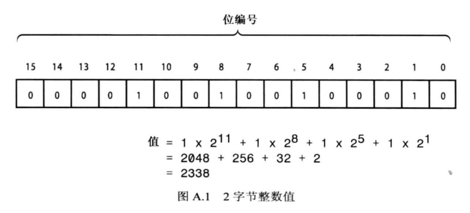
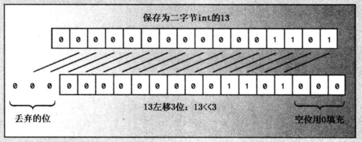
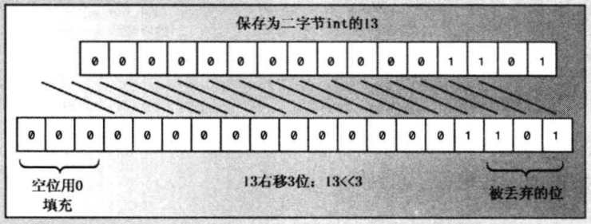

[TOC]


```
# 第1章-预备知识
# 第2章-开始学习C++
# 第3章-处理数据
# 第4章-复合类型
# 第5章-循环和关系表达式
# 第6章-分支语句和逻辑运算符
# 第7章-函数一C++ 的编程模块
# 第08章-函数探幽
# 第09章-内存模型和名称空间
# 第10章-对象和类
# 第11章-使用类
# 第12章-类和动态内存分配
# 第13章-类继承
# 第14章-C++中的代码重用
# 第15章-友元、异常和其他
# 第16章-string类和标准模板库
# 第17章-输入、输出和文件
# 第18章-探讨C++新标准
```

# 附录

## 附录A计数系统

人们使用很多计数系统来表示数字。有些计数系统（如罗马数字）不适合用于算术运算；而印度计数系统经过改进，并传入到欧洲后变成了阿拉伯计数系统，这种数字方便了数学、科学和商业计算。现代的计算机计数系统是基于占位符概念的，使用了最先出现在印度计数系统中的零。然而，这种原理被推广到其他计数系统。因此，虽然在日常生活中使用的是下一节将介绍的十进制，但计算领域通常使用八进制、十六进制和二进制。

### A.1 十进制数

数字的书写方式是基于10的幂数。例如，对于数字2468, 2表示2个1000，4表示4个100，6表示6个10，8表示8个1。

```c++
2468 = 2x1000 + 4X100 + 6x10 + 8X1
```

一千是10x10X10或10的3次幂，用103表示。使用这种表示法，可以这样书写上述关系：

```c++
2468=2x10^3 + 4x10^2 + 6x10^1 + 8x10^0
```

因为这种数字表示法是基于10的幂，所以将它称作基数为10 的表示法或十进制表示法。可以用任何数作基数。例如，C++允许使用基数8 (八进制)和基数16 (十六进制)来书写整数(请注意，10^0 为1，任何非零数的0次幂都为1)。

### A.2 八进制整数

八进制数是基于8的幂的，所以基数为8的表示法用数字0-7来书写数字。C++用前缀0来表示八进制表示法。也就是说，0177 是一个八进制值。可以用8的幂来找到对应的+进制值：

| 八进制 | 十进制                 |
| ------ | ---------------------- |
| 177    | =1x8^2 + 7x8^1 + 7x8^0 |
|        | =1x64 + 7x8 + 7x1      |
|        | =127                   |


由于UNIX操作系统常使用八进制来表示值，因此C++和C提供了八进制表示法。

### A.3 十六进制数

十六进制数是基于16的幂的。这意味着十六进制的10表示16+0, 即16。 为表示9-16值，需要其他一些数字，标准的十六进制表示法使用字母a-f。C++接受这些字符的大写和小写版本，如表A.1所示。


<center>表A.1 十六进制数

</center>

| 十六进制数 | 十进制值 |
| :--------: | -------- |
|    a或A    | 10       |
|    b或B    | 11       |
|    c或C    | 12       |
|    d或D    | 13       |
|    e或E    | 14       |
|    f或F    | 15       |

C++使用0x或0X来指示十六进制表示法。因此0x2B3是一个十六进制值，可使用16 的幂来得到对应的十进制值。

| 十六进制 | 十进制                     |
| -------- | -------------------------- |
| 0x2B3    | =2x16^2 + 11x16^1 + 3x16^0 |
|          | =2x256 + 11x16 + 3x1       |
|          | =691                       |

硬件文档常使用十六进制来表示诸如内存单元和端口号等值。

### A.4 二进制数

不管是使用十进制、八进制，还是十六进制表示法来书写整数，计算机都将它存储为二进制值(即基数为2)。二进制表示法只使用两个数字——0 和1。例如，10011011 就是二进制数。但C++没有提供二进制表示法来书写数字的方式。二进制数是基于2的幂。

| 二进制   | 十进制                                                       |
| -------- | ------------------------------------------------------------ |
| 10011011 | =1x2^7 + 0x2^6 + 0x2^5 + 1x2^4 +1x2^3 + 0x2^2 + 1x2^1 + 1x2^0 |
|          | =128 +0+0+ 16+8+0+2+1                                        |
|          | =155                                                         |

二进制表示法与计算机内存完全对应，在内存中，每个单元(位)都可以设置成开或关。只是将关表示为0，将开表示为1。内存通常是以字节为单位组织的，每个字节包含8位（正如第2章指出的，C++字节并非一定是8位，但本附录采用常见的做法，用字节表示八位组）。字节中的位被编号，对应于相关的2的幂。这样，最右侧的位编号为0，然后是1，依此类推。例如，图A.1表示一个2字节的整数。



<center>图A.1 2字节整数值


### A.5 二进制和十六进制

十六进制表示法常用于提供更为方便的二进制数据(如内存地址或存储位标记设置的整数)视图。这样做的原因是，每个十六进制位对应于4位。表A.2说明了这种对应关系。
<center>表A.2 十六进制数和对应的二进制数

</center>

| 十六进制位 | 对应的二进制数 |
| :--------: | -------------- |
|     0      | 0000           |
|     1      | 0001           |
|     2      | 0010           |
|     3      | 0011           |
|     4      | 0100           |
|     5      | 0101           |
|     6      | 0110           |
|     7      | 0111           |
|     8      | 1000           |
|     9      | 1001           |
|     A      | 1010           |
|     B      | 1011           |
|     C      | 1100           |
|     D      | 1101           |
|     E      | 1110           |
|     F      | 1111           |

要将十六进制值转换为二进制，只需将每个十六进制位替换为相应的二进制数即可。例如，十六进制0xA4对应于二进制数10100100。同样，可以轻松地将二进制值转换为十六进制，方法是将每4位转换为对应的十六进制位。例如，二进制值10010101将被转换为0x95。

***

**Big Endian和Lttle Endian**

奇怪的是，都使用整数的二进制表示的两个计算平台对同一个值的表示可能并不相同。例如，Intel 计算机使用LittleEndian体系结构来存储字节，而Motorola处理器、IBM大型机、SPARC处理器和ARM处理器使用Big Endian方案( 但最后的两种系统可配置成使用上述任何一种方案)。

术语Big Endian和Little Endian是从"Big End In”和“Little End In”(指内存中单词( 通常为两个字节)的字节顺序)衍生而来的。在Intel计算机(Little Endian) 中，先存储低位字节，这意味着十六进制值0xABCD在内存中将被存储为0xCD 0xAB。Motorola ( Big Endian) 计算机按相反的顺序存储，因此0xABCD在内存中被存储为0xAB0xCD。

这些术语最先出现在JonathanSwift编写的《Gulliver'sTravels》一书中。为讽刺众多政治斗争的非理性，Swift杜撰了假想国中两个喜欢争论的政治派别:BigEndians和LittleEndians,前者坚持认为从大的一头打破鸡蛋更合理，而后者坚持认为从小的一头打破鸡蛋更合理。

作为软件工程师，应了解目标平台的词序，它会影响对通过网络传输的数据的解释方式以及数据在二进制文件中的存储方式。在上面的例子中，二字节内存模式0xABCD在Little Endian计算机上表示十进制值52651，而在BigEndian计算机上表示十进制值43981。

***

## 附录B C++保留字

C++保留了一些单词供自己和C++库使用。程序员不应将保留字用作声明中的标识符。保留字分三类：
关键字、替代标记(alternative token)和C++库保留名称。

### B.1 C++关键字

关键字是组成编程语言词汇表的标识符，它们不能用于其他用途，如用作变量名。表B.1列出了C++ 关键字，其中以粗体显示的关键字也是ANSI C99标准中的关键字，而以斜体显示的关键字是C++11新增的。

<center>表B.1 C++关键字

|      关键字      | 描述 |    关键字    | 描述 |
| :--------------: | :--: | :----------: | :--: |
|     alignas      |      |   alignof    |      |
|       asm        |      |     auto     |      |
|       bool       |      |    break     |      |
|       case       |      |    catch     |      |
|       char       |      |   char16_t   |      |
|     char32_t     |      |    class     |      |
|      const       |      |  const_cast  |      |
|    constexpr     |      |   continue   |      |
|     decltype     |      |   default    |      |
|      delete      |      |      do      |      |
|      double      |      | dynamic_cast |      |
|       else       |      |     enum     |      |
|     explicit     |      |    export    |      |
|      extern      |      |    false     |      |
|      float       |      |     for      |      |
|      friend      |      |     goto     |      |
|        if        |      |    inline    |      |
|       int        |      |     long     |      |
|     mutable      |      |  namespace   |      |
|       new        |      |   noexcept   |      |
|     nullptr      |      |   operator   |      |
|     private      |      |  protected   |      |
|      public      |      |   register   |      |
| reinterpret_cast |      |    return    |      |
|      short       |      |    signed    |      |
|      sizeof      |      |    static    |      |
|  static_assert   |      | static_cast  |      |
|      struct      |      |    switch    |      |
|     template     |      |     this     |      |
|   thread_local   |      |    throw     |      |
|       ture       |      |     try      |      |
|     typedef      |      |    typeid    |      |
|     typename     |      |    union     |      |
|     unsigned     |      |    using     |      |
|     virtual      |      |     void     |      |
|     volatile     |      |   wchar_t    |      |
|      while       |      |              |      |


### B.2 替代标记

除关键字外，C++还有- -些运算符的字母替代表示，它们被称为替代标记。替代标记也被保留，表B.2列出了替代标记及其表示的运算符。
<center>表B.2  C++保留的替代标记及其含义

</center>

|  标记  | 含义 |
| :----: | ---- |
|  and   | &&   |
| and_eq | &=   |
| bitand | &    |
| bitor  | \|   |
| compl  | ~    |
|  not   | !    |
| not_eq | !=   |
|   or   | \|\| |
| or_eq  | \|=  |
|  xor   | ^    |
| xor_eq | ^=   |


### B.3 C++库保留名称

编译器不允许程序员将关键字和替代标记用作名称。还有另--类禁止使用(但并非绝对不能用)的名称——保留名称，它们是保留给C++库使用的名称。如果您将这种名称用作标识符，后果将是不确定的。也就是说，可能导致编译器错误、警告、程序不能正确运行或根本不会导致任何问题。

C++语言保留了库头文件中使用的宏名。如果程序包含某个头文件，则不应将该头文件(以及该头文件包含的头文件，依此类推)中定义的宏名用作其他目的。例如，如果您直接或间接地包含了头文件<climits>,则不应将CHAR BIT用作标识符，因为它已被用作该头文件中一个宏的名称。

C++语言保留了以两个下划线或下划线和大写字母打头的名称，还将以单个下划线打头的名称保留用作全局变量。因此，程序员不能在全局名称空间使用诸如gink、__ Lynx 和lynx 等名称。

C++语言保留了在库头文件中被声明为链接性为外部的名称。对于函数，这包括函数的特征标(名称和参数列表)。例如，假设有如下代码：

```c++
#include <cmath>
using namespace std;
```

则函数特征标tan(double)被保留。这意味着您的程序不应声明一个原型如下所示的函数：

```c++
int tan(double); // don't do it
```

该原型确实与库函数tan()的原型不同，因为后者的返回类型为double,但特征标部分确实相同。然而，定义下面的原型是可以的：

```c++
char * tan(char *); // ok
```

这是因为虽然其名称与库函数tan( )相同，但特征标不同。

### B.4 有特殊含义的标识符

C++社区讨厌新增关键字，因为它们可能与现有代码发生冲突。这就是标准委员会改变关键字auto的用法，并赋予其他关键字(如virtual 和delete)新用法的原因所在。C++11 提供了另一种避免新增关键字的机制，即使用具有特殊含义的标识符。这些标识符不是关键字，但用于实现语言功能。编译器根据上下文来判断它们是常规标识符还是用于实现语言功能：

```c++
class F
int final;  // #1
public:
...
virtual void unfold() {...} = final; // #2
}；
```

在上述代码中，语句#1中的final是一个常规标识符，而语句#2中的final 使用了一一种语言功能。这两种用法彼此不会冲突。

另外，C++还有很多经常出现在程序中，但不被保留的标识符。这包括头文件名、库函数名和main (必不可少的函数的名称，程序从该函数开始执行)。只要不发生名称空间冲突，就可将这些标识符用于其他，目的，但没有理由这样做。也就是说，完全可以编写下面的代码，但常识告诉您不应这样做：

```c++
// allowable but silly
#include <iostream>
int iostream(int a);
int main ()
{
std::
cout << iostream(5) << '\n';
return 0;
}
int iostream(int a)
{
int main= a + 1;
int cout = a -l;
}
return main*cout;
}
```


## 附录C ASCII字符集

计算机使用数字代码来存储字符。ASCII 码是美国最常用的编码，它是Unicode 的一个 子集(一个非常小的子集)。C++使得能够直接表示大多数字符，方法是将字符用单引号括起，例如'A'表示字符A。也可以用前面带反斜杠的八进制或十六进制编码来表示单个字符，例如，'\012' 和'0xa'表示的都是换行符(LF)。这种转义序列还可放在字符串中，如“Hello, \012my dear”。

表C.1列出了以各种方式表示的ASCII字符集。在该表中，当被用作前缀时，^字符表示使用Ctrl键。

<center>表C.1 ASCI字符集

</center>

| 十进制 | 八进制 | 十六进制 | 二进制 | 字符 | ASCII名称 |
| :----: | :----: | :------: | :----: | :--: | :-------: |
|   0    |        |          |        |      |           |
|   1    |        |          |        |      |           |
|   2    |        |          |        |      |           |
|   3    |        |          |        |      |           |
|   4    |        |          |        |      |           |
|   5    |        |          |        |      |           |
|   6    |        |          |        |      |           |
|   7    |        |          |        |      |           |
|   8    |        |          |        |      |           |
|   9    |        |          |        |      |           |
|   10   |        |          |        |      |           |


## 附录D 运算符优先级

运算符优先级决定了运算符用于值的顺序。C++运算符分为18个优先级组，如表D.1所示。第1组中的运算符的优先级最高，第2组中运算符的优先级次之，依此类推。如果两个运算符被用于同一个操作数，则首先应用优先级高的运算符。如果两个运算符的优先级相同，则C++使用结合性规则来决定哪个运算符结合得更为紧密。**同一组中运算符的优先级和结合性相同**，不管是从左到右(表中L-R)还是从右到左(表中R-L)结合。从左到右的结合性意味着首先应用最左边的运算符，而从右到左的结合性则意味着首先应用最右边的运算符。

<center>表D.1 C++运算符的优先级和结合性

</center>

| 优先级 |      运算符      | 结合性 | 含义                    |
| :----: | :--------------: | :----: | ----------------------- |
|   1    |        ::        |        | 作用域解析运算符        |
|   2    |    （表达式）    |        | 分组                    |
|   2    |       （）       |  L-R   | 函数调用                |
|   2    |       （）       |  L-R   | 值构造，即type(expr)    |
|   2    |        []        |  L-R   | 数组下标                |
|   2    |        ->        |  L-R   | 间接成员运算符          |
|   2    |        .         |  L-R   | 直接成员运算符          |
|   2    |    const_cast    |  L-R   | 专用的类型转换          |
|   2    |   dynamic_cast   |  L-R   | 专用的类型转换          |
|   2    | reinterpret_cast |  L-R   | 专用的类型转换          |
|   2    |   static_cast    |  L-R   | 专用的类型转换          |
|   2    |      typeid      |  L-R   | 类型标识                |
|   2    |        ++        |  L-R   | 加1运算符，后缀         |
|   2    |        --        |  L-R   | 减1运算符，后缀         |
|   3    |        ！        |  R-L   | 逻辑非                  |
|   3    |        ~         |  R-L   | 位非                    |
|   3    |        +         |  R-L   | 一元加号（正号）        |
|   3    |        -         |  R-L   | 一元减号（负号）        |
|   3    |        ++        |  R-L   | 加1运算符，前缀         |
|   3    |        --        |  R-L   | 减1运算符，前缀         |
|   3    |        &         |  R-L   | 地址                    |
|   3    |        *         |  R-L   | 解除引用（间接值）      |
|   3    |       （）       |  R-L   | 类型转换，即（type)expr |
|   3    |      sizeof      |  R-L   | 长度，以字节为单位      |
|   3    |       new        |  R-L   | 动态分配内存            |
|   3    |      new []      |  R-L   | 动态分配数组            |
|   3    |      delete      |  R-L   | 动态释放内存            |
|   3    |    delete []     |  R-L   | 动态释放数组            |
|   4    |        .*        |  L-R   | 成员解除引用            |
|   4    |       ->*        |  L-R   | 间接成员解除引用        |
|   5    |        *         |  L-R   | 乘                      |
|   5    |        /         |  L-R   | 除                      |
|   5    |        ^         |  L-R   | 模（余数）              |
|   6    |        +         |  L-R   | 加                      |
|   6    |        -         |  L-R   | 减                      |
|   7    |        <<        |  L-R   | 左移                    |
|   7    |        >>        |  L-R   | 右移                    |
|   8    |        <         |  L-R   | 小于                    |
|   8    |        <=        |  L-R   | 小于或等于              |
|   8    |        >=        |  L-R   | 大于或等于              |
|   8    |        >         |  L-R   | 大于                    |
|   9    |        ==        |  L-R   | 等于                    |
|   9    |        !=        |  L-R   | 不等于                  |
|   10   |        &         |  L-R   | 按位AND                 |
|   11   |        ^         |  L-R   | 按位XOF（异或）         |
|   12   |        \|        |  L-R   | 按位OR                  |
|   13   |        &&        |  L-R   | 逻辑AND                 |
|   14   |       \|\|       |  L-R   | 逻辑OR                  |
|   15   |        :?        |  R-L   | 条件                    |
|   16   |        =         |  R-L   | 简单赋值                |
|   16   |        *=        |  R-L   | 乘并赋值                |
|   16   |        /=        |  R-L   | 除并赋值                |
|   16   |        %=        |  R-L   | 求模并赋值              |
|   16   |        +=        |  R-L   | 加并赋值                |
|   16   |        -=        |  R-L   | 减并赋值                |
|   16   |        &=        |  R-L   | 按位AND并赋值           |
|   16   |        ^=        |  R-L   | 按位XOR并赋值           |
|   16   |       \|=        |  R-L   | 按位OR并赋值            |
|   16   |       <<=        |  R-L   | 左移并赋值              |
|   16   |       >>=        |  R-L   | 右移并赋值              |
|   17   |      throw       |  L-R   | 引发异常                |
|   18   |        ,         |  L-R   | 将两个表达式合并成一个  |

有些符号(如\*或&)被用作多个运算符。在这种情况下，-种形式是一元(一个操作数)，另- 种形式是二元(两个操作数)，编译器将根据上下文来确定使用哪种形式。对于同一个符号可以两种方式使用的情况，表D.1将运算符标记为一元组或 二元组。

下面介绍一一些优先级和结合性的例子。

对于下面的例子，编译器必须决定先将5和3相加，还是先将5和6相乘：

```
3+5*6
```

\*运算符的优先级比+运算符高，所以它被首先用于5，因此表达式变成3 +30，即33。

对于下面的例子，编译器必须决定先将120除以6，还是先将6和5相乘： 

```
120 / 6 * 5
```

/和\*的优先级相同，但这些运算符从左到右结合的。这意味着首先应用操作数(6) 左侧的运算符，因
此表达式变为20*5,即100。

对于下面的例子，编译器必须决定先对str递增还是先对str解除引用：

```
char * str = "Whoa"；
char ch = *str++i
```

后缀++运算符的优先级比一元运算符*高， 这意味着加号运算符将对str进行操作，而不是对*str进行
操作。也就是说，将指针加1, 使之指向下一个字符，而不是修改被指针指向的字符。不过，由于++是后
缀形式，因此将在将*str 的值赋给ch后，再将指针加1。因此，上述表达式将字符 W赋给ch,然后移动
指针str,使之指向字符h。

下面是一个类似的例子：

```
char * str = "Whoa"；
char ch = *++str;
```

前缀++运算符和一元运算符\*的优先级相同，但它们是从右到左结合的。因此，str (不是\*str)将被加1。因为++运算符是前缀形式，所以首先将str加1，然后将得到的指针执行解除引用的操作。因此，str将指向字符h,并将字符h赋给ch。

注意，表D.1在“优先级”行中使用-元或二元来区分使用同一个符号的两个运算符，如一元地址运算符和二元按位AND运算符。

附录B列出了一些运算符的替代表示。

## 附录E其他运算符

为了避免篇幅过长，有三组运算符没有在本书正文部分介绍。第一组是按位运算符，能够操纵值中的各个位；这些运算符是从C语言继承而来的；第二组运算符是两个成员解除引用运算符，它们是C++新增的；第三组是C++11新增的运算符： alignof 和noexcept。本附录将简要地对这些运算符做~总结。

### E.1 按位运算符

按位运算符对整数值的位进行操作。例如，左移运算符将位向左移，按位非运算符将所有的1 变成0，所有的0变成1，C++共有6个这样的运算符： <<、>>、~、&、|和^。

#### E.1.1 移位运算符

左移运算符的语法如下：

```
value << shift
```

其中，value 是要被操作的整数值，shift 是要移动的位数。例如，下面的代码将值13的所有位都向左移3位：

```
13<<3
```

腾出的位置用0填充，超出边界的位被丢弃(参见图E.1)。

由于每个位都表示右边一位的2倍(参见附录A)，所以左移一位相当于乘以2。同样，左移2位相当于乘以2^2，左移n位相当于乘以2^n。因此，13<<3 的值为13x2^3,即104。



<center>图E.1 左移运算符
左移运算符提供了通常可以在汇编语言中找到的功能。不过，左移运算符在汇编语言中会直接修改寄存器的内容，而C+左移运算符生成- 一个新值，而不修改原来的值。例如，请看下面的代码：

```
intx=20;
inty=x<<3;
```

上述代码不会修改x的值。表达式x<<3使用x的值来生成一个新值，就像x+3会生成一个新值，而不会修改x-样。

如果要用左移运算符来修改变量的值，则还必须使用赋值运算符。可以使用常规的赋值运算符或<<=运算符(该运算符将移动与赋值结合在-起)：

```c++
x=x<<4; // regular ass ignment
y<<=2; // shift and assign
```

正如所期望的，右移运算符(>>)将位向右移，其语法如下：

```
value >> shift
```

其中，value 是要移动的整数值，shift 是要移动的位数。例如，下面的代码将值17中所有的位向右移两位：

```
17>>2
```

对于无符号整数，腾出的位置用0填充，超过边界的位被删除。对于有符号整数，腾出的位置可能用0填充，也可能用原来最左边的位填充，这取决于C++实现(图E.2是一个用0填充的例子)。


<center>图E.2右移运算符

向右移动一位相当于除以2。向右移动n位相当于除以2^n。

C++还定义了一个“右移并赋值”运算符，如果要用移动后的值替换变量的值，可以这样做：

```c++
int q=43;
q >>= 2; //replace43by43》>2，or10
```

在有些系统上，使用左移运算符(右移运算符)实现将整数乘(除)以2的速度比使用乘(除)法运算符更快，但由于编译器在优化代码方面越来越好，因此这种差异正在减小。

#### E.1.2 逻辑按位运算符

逻辑按位运算符类似于常规的逻辑运算符，只是它们用于值的每一位， 而不是整个值。例如，请看常规的非运算符(!) 和位非(或求反)运算符(~)。!运算符将true (或非零值)转换为false, 将false值转换为trueo ~运算符将每一位转换为它的反面 (1 转换为0, 0转换为1)。例如，对于unsigned char值3:

```
unsigned char x = 3;
```

表达式!x的值为0。要知道x的值，先把它写成二进制形式： 0000011。 然后将每个0转换为1,将每个1转换为0。这样将得到值1111100在十进制中，为252 (图E.3是一个16位的例子)。新值是原值，的补值。

按位运算符OR ()对两个整数值进行操作，生成一一个新的整数值。如果被操作的两个值的对应位至少有一个为1，则新值中相应位为1，否则为0 (参见图E.4)。

存储为两字节int 的13
|o000。0oo。。00110|1
~13:所有1都变成0，所有0都变成1
| 1111 | 11111111001 0
图E.3按位非运算符
0000000010001101 |
1020020000000110
102010010010002211
1,因为
o,因为
1,因为a
，因为8
中对应
和b中对应
中对应的
和中对应
的位是I
的位都是0
位是1
的位都是1
图E.4按位运算符OR
表E.1对|运算符的操作方式进行了总结。
表E.1
b1|b2的值
立值
b1=0
b1= 1
b2=0
0
b2= 1
运算符| =组合了按位运算符OR与赋值运算符的功能：
a|=b;//setatoa|b
按位运算符XOR (^)将两个整数值结合起来，生成一个新的整数值。如果原始值中对应的位有一个(而不是两个)为1，则新值中相应位为1;如果对应的位都为0或1，则新值中相应位为0 (参见图E.5)。
0000000010001101 ]
01010010000000210
1010010010001012
1,因为
0,因为a
l,因为
0，因为
b中对应
和b中对应
a中对应
和b中对应
的位是1
的位都是0
的位是1
的位都是1
图E.5按位运算符 XOR
附录E其他运算符
表E.2总结了^运算符的结合方式。
表E.2
b1^b2的值
值
b1=0
b1=1
b2= 0
)
b2= 1
^=运算符结合了按位运算符XOR和赋值运算符的功能：
a^=b;//setatoa^b
按位运算符AND (&)将两个整数结合起来，生成- 一个新的整数值。如果原始值中对应位都为1，则新值中相应位为1,否则为0 (参见图E.6)。
。0000000010001101
01010010000000110
800000000000000100
0,因为
0,因为a
1因为a
行为
比头
六告为1
对应位为1
位百为
位百为
图E.6按位运算符 AND
表E.3总结了&运算符是如何运算的。
表E.3
b1&b2的值
位
值
bl=0
b2= 1
b2= 0
b2=1
& =运算符结合了按位运算符AND和赋值运算符的功能：
a&=b;//setatoa&b

#### E.1.3 按位运算 符的替代表示

对于几种按位运算符，C++提供了替代表示，如表E.4 所示。它们适用于字符集中不包含传统按位运算符的区域。
表E.4
按位运算符的替代表示
标准表示
春代表示
bitand
&=
and eq
0r eq
compl
xr
=
x0r_ eq
这些替代表示让您能够编写下面这样的语句：

```
b=complabitandb;//sameasb=~a&b;
C=axorb;
//sameasC=a^C;
```


#### E.1.4 几种常用的按位运算符技术

控制硬件时，常涉及打开/关闭特定的位或查看它们的状态。按位运算符提供了执行这种操作的途径。下面简要地介绍一下这些方法。

在下面的示例中，lottabits 表示一个值， bit 表示特定位的值。位从右到左进行编号，从0开始，因此，第n位的值为2"。例如，只有第3位为1的整数的值为23 (8)。-般来说，正如附录A介绍的，各个位都对应于2的幂。因此我们使用术语位(bit) 表示2的幂；这对应于特定位为1，其他所有位都为0的
情况

1. 打开位

下面两项操作打开lottabits中对应于bit表示的位：
lottabits = lottabits| bit;
lottabits |= bit;
它们都将对应的位设置为1，而不管这- -位以前的值是多少。这是因为对1和1或者0和1执行OR操作时，都将得到1。lottabits 中其他所有位都保持不变，这是因为对0和0做OR操作将得到0，对1和0做OR操作将生成1。

2. 切换位

下面两项操作切换lottabits中对应于bit表示的位。也就是说，如果位是关闭的，则将被打开；如果位是打开的，将被关闭：

```
lottabits = lottabits ^ bit;
lottabits ^= bit;
```

对0和1执行XOR操作的结果为1，因此将关闭已打开的位；对1和1执行XOR操作的结果为0,因此将打开已关闭的位。lottabits 中其他所有位都保持不变，这是因为对0和0执行XOR操作的结果为0,对1和0执行XOR操作的结果为1。

3. 关闭位

下面的操作将关闭lottabits中对应于bit表示的位：
lottabits = lottabits & ~bit;
该语句关闭相应的位，而不管它以前的状态如何。首先，运算符~bit将原来为1的位设置为0，原来为0的位设置为1。 对0和任意值执行AND操作都将得到0，因此关闭相应的位。lottabits 中其他所有位都保持不变，这是因为对1和任意值执行AND操作时，该位的值将保持不变。
下面是一~种更简洁的方法：
lottabits &= ~bit;

4. 测试位的值

如果要确定lottabits中对应于bit的位是否为1，则下面的测试不一定管用：
if (lottabits == bit)
// no good
这是因为即使lottabits中对应的位为1，而其他位也可能为1。仅当对应的位为1，而其他位皆为0时，上述等式才为true。因此修补的方式是，首先对lotabits 和bit执行AND操作，这样生成的值的对应位保持不变，因为对1和任何值执行AND操作都将保持该值不变；而其他位都为0，因为对0和任何值执行
AND操作的结果都为0。正确的测试如下：
if (lottabits & bit == bit)
' testing a bit
实际应用中，程序员常将上述测试简化为：
if (lottabits & bit)
/ testing a bit
附录E其他运算符
857
因为bit中有一位为1,而其他位都为0，因此lottabits & bit的结果要么为0 (测试结果为false)，要么
为bit (非零值，测试结果为true)。

### E.2 成员解除引用运算符

C++允许定义指向类成员的指针，对这种指针进行声明或解除引用时，需要使用--种特殊的表示法。为说明需要使用的特殊表示法，先来看一个样本类：

```
class Example
private:
int feet;
int inches;
public:
Example() ；
Example(int ft) ；
~Example() ；
void show_ in() const;
void show_ ft() const;
void use_ ptr() const;
```

如果没有具体的对象，则inches成员只是一个标签。也就是说，这个类将inches定义为一个成员标识符，但要为它分配内存，必须声明这个类的一一个对象：
Example ob; // now ob. inches exists
因此，可以结合使用标识符inches 和特定的对象，来引用实际的内存单元(对于成员函数，可以省略对象名，但对象被认为是指针指向的对象)。
C++允许这样定义一个指向标识符inches的成员指针：

```
int Example::*pt = &Example: :inches;
```

这种指针与常规指针有所差别。常规指针指向特定的内存单元，而pt指针并不指向特定的内存单元，因为声明中没有指出具体的对象。指针pt指的是inches 成员在任意Example对象中的位置。和标识符inches

样，pt 被设计为与对象标识符一起使用。 实际上，表达式\*pt对标识符inches 的角色做了假设，因此，可以使用对象标识符来指定要访问的对象，使用pt指针来指定该对象的inches成员。例如，类方法可以使
用下面的代码： 

```
.nt Example: ：*pt = &Example: ： inches;
Example ob1;
Example ob2;
Example *pq = new Example;
cout << ob1.*pt << endl; // display inches member of ob1
cout < <
ob2.*pt << endl; // display inches member of ob2
cout << po->*pt < endl; // display inches member of *po
```

其中，*和->\*都是成员解除引用运算符(member dereferencing operator)。声明对象(如obl)后，ob1.\*pi指的将是ob1对象的inches成员。同样，pq->\*pt 指的是pq指向的对象的inches成员。
改变上述示例中使用的对象，将改变使用的inches成员。不过也可以修改pt指针本身。由于feet 的类型与inches相同，因此可以将pt重新设置为指向feet 成员( 而不指向inches成员)，这样ob1.*pt将是ob1
的feet成员：

```
pt = &Example: :feet;
reset P
cout << ob1.*pt << endl; // display feet member of ob1
```

实际上，*pt 相当于一个成员名，因此可用于标识(相同类型的)其他成员。
也可以使用成员指针来标识成员函数，其语法稍微复杂点。对于不带任何参数、返回值为void的函数，
声明一个指向该函数的指针的代码如下：
void (*pf) ()； // pf points to a function
声明指向成员函数的指针时，必须指出该函数所属的类。例如，下 面的代码声明了一个指向Example
类方法的指针：

```
void (Example: ：*pf) () const; // pf points to an Example member function
```

这表明pf可用于可使用Example方法的地方。注意，Example:: *pf 必须放在括号中，可以将特定成
员函数的地址赋给该指针：

```
pf = &Example: :show inches;
```

注意，和普通函数指针的赋值情况不同，这里必须使用地址运算符。完成赋值操作后，便可以使用一
个对象来调用该成员函数：
Example ob3 (20) ；
(ob3. *pf)()； // invoke show_ inches() using the ob3 object
必须将ob3.*pf放在括号中，以明确地指出，该表达式表示的是一一个 函数名。
由于show_ fee( )的原型与show_ inches( )相同，因此也可以使用pf来访问show_ feet( )方法：

```
pf = &Example: :show_ feet ；
(ob3.*pf) ()；
// apply show_ feet() to the ob3 object
```

程序清单E.1中的类定义包含一一个useptr()方法，该方法使用成员指针来访问Example类的数据成员
和函数成员。
程序清单E.1
memb_ pt.cpp
// memb pt.CpP -- dereferencing pointers to class members
#include <iostream>
using namespace sta ；
class Example
private:
nt feet ；
int inches ；
public:
Example()；
Example(int ft) ；
~ Example() ；
void sShow_ in() const;
void show_ ft() const;
void use ptr() const;
}；
Example: :Example()
feet = 0;
inches
= 0;
Example: :Example(int ft)
feet = ft;
附录E其他运算符
859
inches = 12 * feet;
Example: ：~Example()
void Example: :Show_ in() const
cout << inches << " inches\n" ；
void Example: :show_ ft() const
cout << feet <<“feet\n" ；
void Example: :use_ ptr() const
Example yard(3) ；
int Example:: *pt;
t = &Example::inches;
cout << "Set pt to &Example: :inches ： \n"
cout << "this->pt: " << this->*pt << endl ；
cout
yard.*pt << endl;
pt = &Example: ： feet;
cout << "Set pt to &Example: :feet: \n" ；
cout << "this->pt: “<< this->*pt << endl i
cout << "yard.*pt: “<< yard.*pt << endl;
void (Example: ：*pf) () const;
pf = &Example: :show in;
cout << "Set pf to &Example::show in:\n"；
cout << "Using (this->*pf) ()： "；
(this->*pf) ()；
cout《"Using (yard.*Pf)()： “；
(yard. *pf) () ；
int main()
Example car(15) ；
Example van(20) ；
Example garage ；
cout << "car.use. Ptr() output:\n" ；
Car .use_ ptr() ；
cout << "\nvan.use_ ptr() output: \n" ；
van.use_ ptr() ；
return 0;
下面是程序清单E.1中程序的运行情况

```
car .use_ _ptr() output ：
Set pt to &Example: ： inches:
this->pt: 180
860
C++ Primer Plus (第6版)中文版
yard. *pt: 36
Set pt to &Example: :feet ：
this->pt: 15
yard.*pt: 3
Set pf to &Example: :show_ in:
Using (this->*pf) () ： 180 inches
Using (yard.*pf) ()： 36 inches
van.use_ ptr() output:
Set pt to &Example: ： inches: 
this->pt: 240
yard. *pt: 36
Set pt to &Example: :feet:
this->pt: 20
yard. *pt: 3
Set pf to &Example: :show_ in:
Using (this->*pf)()： 240 inches
Using (yard.*pf)()： 36 inches
```

：

这个例子在编译期间给指针赋值。在更复杂的类中，可以使用指向数据成员和方法的成员指针，以便在运行阶段确定与指针关联的成员。

### E.3 alignof ( C++11 )

计算机系统可能限制数据在内存中的存储方式。例如，一个系统可能要求double值存储在编号为偶数的内存单元中，而另一个系统可能要求其起始地址为8个整数倍。运算符alignof将类型作为参数，并返回一个整数，指出要求的对齐方式。例如，对齐要求可能决定结构中信息的组织方式，如程序清单E.2所示。
程序清单E.2 align.cpp

```
// align.cpp -- checking al ignment
#include <iostream>
using namespace std;
struct thingsl
char ch ；
int a
}
double x;
struct things2
int a
double x;
char Ch ；
int main()
things1 th1 ；
things2 th2;
cout《< "char alignment: " << alignof (char) << endl;
附录E其他运算符
861
cout
<< "int al ignment ：
" << alignof(int) << endl;
cout << "double al ignment ：
" << alignof (double) << endl ；
cout << "things1 alignment:“<< alignof (things1) << endl;
cout《< "things2 al ignment:
《< alignof (things2)《< endl; 
cout《< "things1 size: " < sizeof (things1) << endl;
cout <<“things2 size:“<< sizeof (things2) << endl ；
return 
```

下面是该程序在一-个系统中的输出：

```
har al ignment: 1
nt alignment: 4
double alignment: 8
things1 al ignment: 8
things2 alignment: 8
things1 size: 16
things2 size: 2
```

两个结构的对齐要求都是8。这意味着结构长度将是8的整数倍，这样创建结构数组时，每个元素的起始位置都是8的整数倍。在程序清单E.2中，每个结构的所有成员只占用13位，但结构要求占用的位数为8的整数倍，这意味着需要填充一些位。 在每个结构中，double 成员的对齐要求为8的整数倍，但在结构thing1和thing2中，成员的排列顺序不同，这导致thing2需要更多的内部填充，以便其边界处于正确的位置。

### E.4 noexcept ( C++11 )

关键字noexcept用于指出函数不会引发异常。它也可用作运算符，判断操作数(表达式)是否可能引发异常；如果操作数可能引发异常，则返回false,否则返回true。例如，请看下面的声明：

```
int hilt(int) ；
int halt (int) noexcept;
```

表达式noexcept(hilt)的结果为false,因为hilt( )的声明未保证不会引发异常，但noexcept(hal)的结果为trueo

## 附录F 模板类 string

本附录的技术性较强，但如果您只想了解模板类string的功能，可以将重点放在对各种string类方法的描述上。
string 类是基于下述模板定义的：

```
template<class CharT, class traits = Char_ traits<charT>,
class Allocator = allocator<charT> >
class basic_ string
```

其中，chatT 是存储在字符串中的类型； traits 参数是一个类，它定义了类型要被表示为字符串时，所必须具备的特征。例如，它必须有length( )方法，该方法返回被表示为charT数组的字符串的长度。这种数组结尾用charT(O)值(广义的空值字符) 表示。(表达式charT(0)将 0转换为charT类型。它可以像类型为 char
时那样为零，也可以是charT的一一个构造函数创建的对象)。这个类还包含用于对值进行比较等操作的方法。Allocator参数是用于处理字符串内存分配的类。默认的allocator<char>模板按标准方式使用new和delete。
有4种预定义的具体化：

```
typedef basic_ string<char string;
typedef basic_ string<char16 t> u16string;
typedef basic_ string<char32_ t> u32string;
typedef basic_ string<wchar t> wstring;
```

上述具体化又使用下面的具体化：

```
char_ traits<char>
allocator<char>
char_ traits<char16 t>
allocator<char_ 16>
char traits<char 32>
allocator<char 32>
char_ traits<wchar_ t>
allocator<wchar_ t>
```

除char和wchar t外，还可以通过定义traits类和使用basic string 模板来为其他一些类型创建一一个 sting类。

### F.1 13种类型和一一个常量

模板basic string 定义了几种类型，供以后定义方法时使用：

```
typedef traits
traits_ type;
typedef typename traits: :char_ type
value_ type;
typedef Allocator
allocator_ type;
typedef typename Allocator: :size_ type
size_ type;
typedef typename Allocator: :difference_ type
difference_ type;
typedef typename Allocator: :reference
reference;
typedef typename Allocator: ： const_ reference
const_ reference;
typedef typename Allocator: :pointer
pointer;
typedef typename Allocator: :const_ pointer
const_ pointer ；
```

附录F模板类string
863
traits是对应于特定类型(如char_ traits<char>) 的模板参数； traits type 将成为该特定类型的typedef。
下述表示法意味着char type 是traits表示的类中定义的一个类型名：

```
typedef typename traits::char_ tyPe
value_ type;
```

关键字typename告诉编译器，表达式trait:char_ type 是一种类型。 例如，对于string 具体化，value_ type为char。
size_ type与size_ of的用法相似，只是它根据存储的类型返回字符串的长度。对于string 具体化，将根据char返回字符串的长度，在这种情况下，size_type与size_of等效。size_type是一种无符号类型。
dffrrence type 用于度量字符串中两个元素之间的距离(单位为元素的长度)。通常，它是底层类型size_ type 有符号版本。
对于char具体化来说，pointer 的类型为char *而reference的类型为char &类型。然而，如果要为自己设计的类型创建具体化，则这些类型(pointer和reference)可以指向类，与基本指针和引用有相同的特征。
为将标准模板库(STL) 算法用于字符串，该模板定义了一些迭代器类型：

```
typedef (models random access iterator)
iterator;
typedef (models random access iterator)
const_ iterator ；
typedef std: :reverse_ iterator<iterator>
reverse_ iterator ；
typedef std: :reverse_ iterator<const_ iterator> const_ reverse_ iterator;
```

该模板还定义了一个静态常量：

```
static const size_ type npos = -1;
```

由于sizetype是无符号的，因此将-1赋给npos相当于将最大的无符号值赋给它，这个值比可能的最大数组索引大1。

### F.2 数据信息、构造函数及其他

可以根据其效果来描述构造函数。由于类的私有部分可能依赖于实现，因此可根据公用接口中可用的数据来描述这些效果。表F1列出了-些方法，它们的返回值可用来描述构造函数和其他方法的效果。注意，其中的大部分术语来自STL。
表F.1

~些string数据方法
方法
返回值
begin( )
指向字符串第一个字符的迭代器
cbegin()
一个const iterator, 指向字符串中的第一个字符(C++11)
end( )
为超尾值的迭代器
cend( )
为超尾值的const iterator (C++11)
rbegin( )
为超尾值的反转迭代器
crbegin( )
为超尾值的反转const iterator (C++11)
rend( )
指向第一个字符的反转迭代器
crend( )
指向第一个字符的反转const iterator (C++11)
size()
字符串中的元素数，等于begin( )到end( )之间的距离
length( )
与size( )相同
给字符串分配的元素数。这可能大于实际的字符数，capacity( ) - size( )的值表示在字符串末尾附加多少字
capacity()
符后需要分配更多的内存
max size( )
字符串的最大长度
864
C++ Primer Plus (第6版)中文版
续表
方法
返回值
个指向数组第- -个元素的const charT*指针，其第一 个size( )元素等于*this控制的字符串中对应的元素，
data( )
其下一个元素为charT类型的charT(0)字符(字符串末尾标记)。当string对象本身被修改后，该指针可
能无效
一个指向数组第一一个 元素的const charT*指针，其第一一个 size( )元素等于*this控制的字符串中对应的元素，
c_ str( )
其下一个元素是charT类型的harT (0)字符(字符串尾标识)。当string对象本身被修改后，该指针可
能无效
get allocator( )用 于为字符串object分配内存的allocator对象的副本
请注意begin( )、rend( )、data( )和c_ str( )之间的差别。它们都与字符串的第一一个字符相关，但相关的方式不同。begin( )和rend( )方法返回一一个迭代器，正如第16章讨论的，这是一一种广义指针。具体地说，begin( )返回一个正向迭代器模型，而rend( )返回反转迭代器的一个副本。 这两种方法都引用了string 对象管理的字符串(由于string 类使用动态内存分配，因此实际的string 内容不一定位于对象中，因此，我们使用术语“管理”来描述对象和字符串之间的关系)。可以将返回迭代器的方法用于基于迭代器的STL算法中。例如，可以使用STL reverse( )函数来反转字符串的内容：
string word;
in》> word;
reverse (word. begin()，word. end())；
而data( )和c str( )方法返回常规指针。另外，返回的指针将指向存储字符串字符的数组的第一一个元素 。该数组可能(但不一定) 是string对象管理的字符串的副本(string 对象采用的内部表示可以是数组，但不一定非得是数组)。由于返回的指针可能指向原始数据，而原始数据是const,因此不能用它们来修改数据。
另外，当字符串被修改后，将不能保证这些指针是有效的，这表明它们可能指向原始数据。data( )和c str( )的区别在于，c str( )指向的数组以空值字符(或与之等价的其他字符)结束，而data( )只是确保实际的字符串字符是存在的。因此，c str( )方法期望接受一个C-风格字符串参数：

```
string file("tofu. man")；
ofstream outFile(file.c str())；
```

同样，data()和size()可用作这种函数的参数，即接受指向数组元素的指针和表示要处理的元素数目的值：

```
string vampire("Do not stake me, oh my darling!") ；
int vlad = byte_ check (vampire.data()， vampire.size())；
```

c++实现可能将string对象的字符串表示为动态分配的C-风格字符串，并使用char*指针来实现正向迭
代器。在这种情况下，实现可能让begin( ) data( )和c str( )都返回同样的指针，但返回指向3个不同的数
据对象的引用也是合法的(虽然更复杂)。
在C++11中，模板类basic string 有11个构造函数(在C++98中只有6个)和一个析构函数：
explicit basic_ string (const Allocator& a = Allocator())；
basic_ string (const charT* s，const Allocator& a = Allocator()) ；
basic_ string (const charT* s，size_ type n，const Allocator& a = Allocator()) ；
basic string(const basic_ string& str)；
basic_ string (const basic_ string& str, const Allocator&) ；
basic string (const basic_ string& str, size_ type pOS,
size_ type n = npos, const Allocator& a = Allocator()) ；
basic_ string (basic_ string&& str) noexcept;
basic_ string (const basic_ _string&& str, const Allocator&) ；
basic_ string(size_ type n, charT C，const Allocator& a = Allocator()) ；
template<class InputIterator>
basic string (InputIterator begin, InputIterator end,
附录F模板 类string
865
const Allocator& a = Allocator()) ；
basic_ string (initializer_ list<charT>, const Allocator& = Allocator()) ；
~basic_ _string() ；
有些新增的构造函数以不同的方式处理参数。例如，C++98 包含如下复制构造函数： 
basic_ string (const basic_ string& str, size_ type pos = 0,
size_ type n = npos, const Allocator& a = Allocatc
而C++11用三个构造函数取代了它一上述列表中的第 2~4个，这提高了编码效率。真正新增的只有移动构造函数(使用右值引用的构造函数，这在第18章讨论过)以及使用initializer list 参数的构造函数。
注意到大多数构造函数构造函数都有一个下面这样的参数：
const Allocator& a = Allocator()
Allocator是用于管理内存的allocator类的模板参数名； Allocator( )是这个类的默认构造函数。因此，在默认情况下，构造函数将使用allocator对象的默认版本，但它们使得能够选择使用allocator对象的其他版本。下面分别介绍这些构造函数。

#### F.2.1默认构造函数

默认构造函数的原型如下：
explicit basic_ string (const Allocator& a = Allocator()) ；
通常，接受allocator类的默认参数，并使用该构造函数来创建空字符串：

```
string bean;
wstring theory;
```

调用该默认构造函数后，将存在下面的关系：
data( )方法返回一个非空指针，可以将该指针加上0;
●size()方法返回0;
●capacity( )的返回值不确定。
将data( )返回的值赋给指针str后，第一个条件意味着str+ 0是有效的。

#### F.2.2使用 C-风格字符串的构造函数

使用C-风格字符串的构造函数让您能够将string对象初始化为一个C-风格字符串；从更普遍的意义上看，它使得能够将charT具体化初始化为一个charT数组：
basic_ string(const harT* s, const Allocator& a = Allocator())；
为确定要复制的字符数，该构造函数将traits:length()方法用于s指向的数组(s不能为空指针)。例如，下面的语句使用指定的字符串来初始化toast对象：

```
string toast("Here's looking at you, kid.")；
```

char类型的traits:length( )方法将使用空值字符来确定要复制多少个字符。
该构造函数被调用后，将存在下面的关系：
●data( )方法返回一个指针，该指针指向数组s的一个副本的第一一个元素；
●size( )方法返回的值等于trains:length( )的值；
●capacity( )方法返回一个至少等于size( )的值。

#### F.2.3使用 部分C-风格字符串的构造函数

使用部分C风格字符串的构造函数让您能够使用C-风格字符串的一部分来初始化string对象；从更广泛的意义上说，该构造函数使得能够使用charT数组的一部分来初始化charT具体化：
basic_ string (const charT* s，size_ type n，const Allocator& a = Allocator())；
该构造函数将s指向的数组中的n个字符复制到构造的对象中。请注意，如果s包含的字符数少于n,则复制过程将不会停止。如果n大于s的长度，该构造函数将把字符串后面的内存内容解释为charT类型的数据。
该构造函数要求s不能是空值指针，同时n<npos(npos是一个静态类常量，它是字符串可能包含的最大元素数目)。如果n等于npos,该构造函数将引发一个out of range异常(由于n的类型为size type,而
npos是size_ type 的最大值，因此n不能大于npos)；否则，在该构造函数被调用后，将存在下面的关系：
 data( )方法返回一个指针，该指针指向数组s的副本的第一一个元素；
D size( )方法返回 n;
●capacity( )方法返回一一个至少等于size( )的值。

#### F.2.4使用 左值引用的构造函数

复制构造函数类似于下面这样：
basic_ string (const basic_ string& str)；
它使用一个string参数初始化一一个新的 string对象： 

```
string mel("I'm ok!")；
string ida (mel) ；
```

其中，ida将是mel管理的字符串副本。
下一个构造函数要求您指定一个分配器：

```
basic_ string(const basic_ string& str, const Allocator&) ；
```

调用这两个构造函数中的任何一个后，将存在如下关系：
●data( )方法返回一个指针，该指针指向分配的数组副本，该数组的第一 一个元素是str.data( )指向的；
●size( )方法返回str.size(的值；
capacity( )方法返回一个至少等于size( )的值。
再下一个构造函数让您能够指定多项内容：

```
basic_ _string(const basic_ string& str，size_ type pos, size_ type n = npos ，
const Allocator& a = Allocator()) ；
```

第二个参数(pos)指定了源字符串中的位置，将从这个位置开始进行复制：

```
string att ("Telephone home.")；
string et(att, 4)；
```

位置编号从0开始，因此，位置4是字符p。所以，et 被初始化为“phone home”。
第3个参数n是可选的，它指定要复制的最大字符数目，因此下面的语句将pt初始化为字符串“phone"：

```
string att ("Telephone home.") ；
string pt(att, 4, 5)；
```

然而，该构造函数不能跨越源字符串的结尾，例如，下面的语句将在复制句点后停止：
string pt(att, 4，200)
因此，该构造函数实际复制的字符数量等于n和st.size( )-pos中较小的一一个。
该构造函数要求pos不大于str.size( )，也就是说，被复制的初始位置必须位于源字符串中。如果情况并非如此，该构造函数将引发out of range 异常；否则，该构造函数被调用后，copy len 将是n和st.size( )-pos
中较小的一一个，并存在下面的关系：
●data( )方法返回一个指向字符串的指针，该字符串包含copy_ len 个元素，这些元素是从str的pos
位置开始复制而得到的；
0 size( )方法返回copy_ len;
●capacity( )方法返回一个不小于size( )的值。

#### F.2.5使用右 值引用的构造函数(C++11)

C++11给string类添加了移动语义。正如第18章介绍的，这意味着添加一个移动构造函数，它使用右
附录F模板类string
867
值引用而不是左值引用：

```
basic_ string (basic_ string&& str) noexcept ；
```

在实参为临时对象时将调用这个构造函数：

```
string one ("din")；
// C-style string constructor
string two (one) ；
// copy constructor一one is an lvalue
```

string three (one+two)； // move constructor, sum is an rvalue
正如第18章讨论的，three 将获取operator + 0创建的对象的所有权，而不是将该对象复制给three,再销毁原始对象。
第二个使用右值引用的构造函数让您能够指定分配器：

```
basic_ string (const basic_ string&& str, const Allocator&) ；
```

调用这两个构造函数中的任何一个后，将存在如下关系：
odata( )方法返回一个 指针，该指针指向分配的数组副本，该数组的第一一个 元素是str.data( )指向的；
●size( )方法返回str.sizeO的值；
●capacity( )方法返回一个至少等于size( )的值。

#### F.2.6使用 一个字符的n个副本的构造函数

使用一一个字符的n个副本的构造函数创建一个由n个c组成的string对象：
basic_ string(size_ type n, CharT C, const Allocator& a = Allocator())；
该构造函数要求n<npos。如果n等于npos,该构造函数将引发out_ of range 异常；否则，该构造函数被调用后，将存在下面的关系：
●data( )方法返回一个指向字符串第一个元素的指针， 该字符串由n个元素组成，其中每个元素的
值都为C;
●size( )方法返回n;
capacity( )方法返回不小于size( )的值。

#### F.2.7使用 区间的构造函数

使用区间的构造函数使用一个用迭代器定义的、STL-风格的区间：

```
template<class InputIterator>
basic_ string (InputIterator begin, InputIterator end
const Allocator& a = Allocator()) ；
```

begin迭代器指向源字符串中要复制的第一个元素，end指向要复制的最后-一个元素的后面。
这种构造函数可用于数组、字符串或STL容器：

```
char cole[40] = "0ld King Cole was a merry old soul."；
string title(cole + 4, cole + 8)；
vector<char> input ；
char ch;
while (cin.get(ch) && ch != '\n')
input . push back (ch) ；
string str_ input (input.begin()，input.end()) ；
```

在第-种用法中，InputIterator 的类型为const char *；在第二种用法中，InputIterator 的类型为
vector<char::iterator。
调用该构造函数后，将存在下面的关系：
●data( )方法返回一个指向字符串的第一一个元素的指针，该字符串是通过复制区间[begin, end) 中的元素得到的；
●size()方法返回begin到end之间的距离(度量距离时，使用的单位为对迭代器解除引用得到的数据类型的长度)；
capacity( )方法返回一个不小于size( )的值。

#### F.2.8使 用初始化列表的构造函数(C++11)

这个构造函数接受一一个initializer_ list<charT>参 数： 

```
basic_ string (initializer_ list<charT> il, const Allocator& a = Allocator()) ；
```

可将一个用大括号括起的字符列表作为参数：

```
string slow({'s'， n'， 'a'， 'il '1'})；
```

这并非初始化string的最方便方式，但让string的接口类似于STL容器类。
initializer_list类包含成员函数begin()和end()，调用该构造函数的影响与调用使用区间的构造函数相同：

```
basic_ string(il . begin()，il.end()， a) ；
```


#### F.2.9内存杂记

有些方法用于处理内存，如清除内存的内容、调整字符串长度或容量。表F2列出了一些与内存相关的方法。
表F.2
一些与内存有关的方法
方法
作用

```
void resize(size_ type n)
```

如果n>npos,将引发out of range 异常；否则，将字符串的长度改为n,如果n<size( )，
则截短字符串，如果n>size( )，则使用charT(0)中的字符填充字符串
void resize(size_ type n, charT c)
如果n>npos,将引发out of range 异常；否则，将字符串长度改为n，如果n<size( )， ，
则截短字符串，如果n>size( )，则使用字符c填充字符串

```
void reserve(size_ _ype res arg= 0)
```

将capacity( )设置为大于或等于res arg。 由于这将重新分配字符串，因此以前的引
用、迭代器和指针将无效

```
void shrink_ to fit( )
```

请求让capacity( )的值与size( )相同，这是c++11新增的

```
void clear( ) noexcept
```

删除字符串中所有的字符

```
bool empty( )const noexcept
```

如果size( )==0，则返回true 

### F.3字符串存取

有4种方法可以访问各个字符，其中两种方法使用[ ]运算符，另外两种方法使用at( )方法：
reference operator[] (size_ type pos) ；
const_ reference operator[] (size_ type pos) const;
reference at(size_ type n) ；
const_ reference at(size_ type n) const;
第一个operator[ ]( )方法使得能够使用数组表示法来访问字符串的元素，可用于检索或更改值。第二个operator[ ]( )方法可用于const对象，但只能用于检索值：

```
string word ("tack") ；
cout《< word[0] ；
// display the t
word[3] = 't'；
overwrite the k with a t
const ward ("garlic") ；
cout << ward[2] ；
// display the r
```

附录F模板类string
869
at()方法提供了相似的访问功能，只是索引是通过函数参数提供的：

```
string word ("tack")；
cout << word.at(0)； // display the t
```

差别在于(除语法差别外)： at( )方法执行边界检查，如果pos>=size()，将引发out of range异常。
pos的类型为size_ type, 是无符号的，因此pos的值不能为负；而operator[ ]( )方法不进行边界检查，
因此，如果pos>=size( )，则其行为将是不确定的( 如果pos= =size( )，const 版本将返回空值字符的等价物)。
因此，可以在安全性(使用at( )检测异常)和执行速度(使用数组表示)之间进行选择。
还有一个这样的函数，它返回原始字符串的子字符串：

```
basic_ string substr(size_ type pos = 0，size_ type n = npos) const;
```

它返回一个字符串~
-这是从pos开始，复制n个字符(或到字符串尾部)得到的。例如，下面的代码将pet初始化为“donkey”：

```
string message("Maybe the donkey will learn to sing. ")；
string pet (message. substr(10, 6)) ；
C++11新增了如下四个存取方法：
const charT& front() const;
charT& front()；
const charT& back() const ；
charT& back() ；
```

其中front( )方法访问string的第一个元素， 相当于operator(] (0)； back( )方法访问string的最后一个元
素，相当于operator[] (size()- 1)。

### F.4 基本赋值

在C++11中，有5个重载的赋值方法，在C++98的基础上增加了两个： 

```
basic_ string& operator=(const basic_ string& str) ；
basic_ string& operator=(const charT* s) ；
basic_ string& operator= (charT c
basic_ string& operator= (basic_ string&& str) noexcept; // C++11
basic string& operator= (initializer 1ist<charT>) ；
// C++11
```

第一个方法将一个string 对象赋给另一个；第二个方法将C-风格字符串赋给string对象；第三个方法将一个字符赋给string对象；第四个方法使用移动语义，将一个右值string对象赋给一一个 string对象；第五个方法让您能够使用初始化列表进行赋值。因此，下面的操作都是可能的：

```
string name ("George wash")；
string pres, veep, source, join, awkward;
pres = name ；
veep = "Road Runner"；
source = X'
join = name + source; // now with move semantics!
awkward = { 'C'，'l'，'o''u'l's'，'el,'a'，'u'}；
```


### F.5字符串搜索

string类提供了6种搜索函数，其中每个函数都有4个原型。下面简要地介绍它们。

#### F.5.1 find( )系列

在C++11中，find( )的原型如下：

```
size_ type find (const basic_ string& str, size_ type pos = 0) const noexcept;
size_ type find (const charT* s，size_ type pos = 0) const;
size_ type find (const chart* s，size_ type pos, size_ type n) const;
size_ type find (charT C, size_ type pos = 0) const noexcept;
```

第一个返回str在调用对象中第一次出现时的起始位置。搜索从pos开始，如果没有找到子字符串，将返回nposo
下面的代码在一个字符串中查找字符串“hat” 的位置：

```
string longer("That is a funny hat.")；
string shorter("hat") ；
size_ type 1oc1 = longer . find (shorter) ；
// sets 1oc1 to 1
size_ type 1oc2 = longer .find(shorter, 1oc1 + 1)； // sets 1oc2 to 16
```

由于第二条搜索语句从位置2开始(That 中的a)，因此它找到的第一一个 hat位于字符串尾部。要测试是否失败，可使用string:npos 值：

```
if (1oc1 == string: :npos) 
cout << "Not found\n" ；
```

第二个方法完成同样的工作，但它使用字符数组而不是string对象作为子字符串：

```
size_ type 1oc3 = longer. find("is")；
//sets 1oc3 to 5
```

第三个方法完成相同的工作，但它只使用字符串s的前n个字符。这与使用basic string ( const charT *s, size ypen)构造函数，然后将得到的对象用作第一种格式的find( )的string参数的效果完全相同。例如，
下面的代码搜索子字符串“fun"：

```
size_ type 1oc4 = longer . find("funds"， 3) 
//sets 1oc4 to 10
```

第四个方法的功能与第一一个相同， 但它使用一一个字符而不是string对象作为子字符串：

```
size_ type loc5 = longer. find('a') ；
//sets 1oc5 to 2
```


#### F.5.2 find( )系列

rfind( )方法的原型如下：

```
size_ type rfind(const basic_ string& str,
size_ type pos = npos) const noexcept;
size_ type rfind (const charT* s, size_ type pos = npos) const;
size_ type rfind (const charT* s，size_ type pos，size_ type n) const ；
size_ type rfind(charT C, size_ type poS = npos) const noexcept;
```

这些方法与相应find()方法的工作方式相似，但它们搜索字符串最后一-次出现的位置，该位置位于pos之前(包括pos)。如果没有找到，该方法将返回npos。
下面的代码从字符串末尾开始查找子字符串“hat” 的位置：

```
string longer("That is a funny hat.") ；
string shorter ("hat")；
size_ type locl = longer . rf ind (shorter) ；
// sets loc1 to 16
size_ type 1oc2 = longer . rfind (shorter, loc1 - 1)； // sets loc2 to 1
```


#### F.5.3 find_ first _of( )系列

find_ first of( )方法的原型如下：

```
size_ type find first_ of (const basic_ string& str,
size_ type poS = 0) const noexcept;
size_ type find first_ of (const charT* s，size_ type poS, size_ type n) const;
size type find first_ of (const charT* s，size_ type pos = 0) const;
size_ type find first_ of (charT C，size_ type pos = 0) const noexcept;
```


这些方法与对应find( )方法的工作方式相似，但它们不是搜索整个子字符串，而是搜索子字符串中的字符首次出现的位置。

```
string longer ("That is a funny hat.")；
string shorter ("fluke") ；
size_ type loc1 = longer.find first_ of (shorter) ； // sets loc1 to 10
size_ type 1oc2 = longer.find first of("fat")；
// sets 1oc2 to 2
```

在longer中，首次出现的fluke中的字符是funny中的f,而首次出现的fat中的字符是That中的a。

#### F.5.4 find_ last _of( )系列

find last of( )方法的原型如下：

```
size_ type find_ last_ of (const basic_ string& str,
size_ type pos = npos) const noexcept;
size_ type find last_ of (const charT* S，size_ type pos, size_ type n) const;
size_ type find last_ of (const charT* s，size_ type pos = npos) const
size_ type find last_ of (charT c，size_ type pos = npos) const noexcept ；
```

这些方法与对应rfind( )方法的工作方式相似，但它们不是搜索整个子字符串，而是搜索子字符串中的字符出现的最后位置。
下面的代码在一一个字符串中查找字符串“hat”和“any”中字母最后出现的位置：

```
string longer("That is a funny hat.") ；
tring shorter ("hat")；
size_ type 1oc1 = longer. find last_ of (shorter) ； // sets 1oc1 to 18
size_ type 1oc2 = longer. find last of ("any") ；
// sets loc2 to 17
```

在longer中，最后出现的hat中的字符是hat中的t,而最后出现的any中的字符是hat中的a。

#### F.5.5 find first not of( )系列

find first not of( )方法的原型如下：

```
size_ type find first_ not_ of (const basic_ string& str,
size_ type pos = 0) const noexcept;
size_ type find first not of (const charT* s，size_ tye PoS,
size_ type n) const;
size_ type find_ first_ not_ of (const charT* s，size_ type pos = 0) const;
size_ type find_ first_ not_ of (charT C, size_ type pos = 0) const noexcept;
```

这些方法与对应find first of( )方法的工作方式相似，但它们搜索第一- 个不位于子字符串中的字符。
下面的代码在字符串中查找第一一个没有 出现在“This” 和“Thatch”中的字母：

```
string longer ("That is a funny hat.")；
string shorter ("This") ；
size_ type loc1 = longer. find first_ not_ of (shorter)； // sets loc1 to 2
size_ type 1oc2 = longer.find first_ not_ of ("Thatch")； // sets 1oc2 to 4
```

在longer中，That中的a是第一一个在 This中没有出现的字符，而字符串longer中的第一一个空格是第一个没有在Thatch中出现的字符。

#### F.5.6 find_ last_ not _of( )系列

find 1ast not of( )方法的原型如下：
C++ Primer Plus (第6版)中文版

```
size_ type find last_ not_ of (const basic_ string& str,
size_ type pos = npos) const noexcept;
size_ type find last_ not_ _of (const charT* s，size_ type pos,
size_ type n) const;
size_ type find last_ not_ _of (const charT* s，
size_ type pos = npos) const;
size_ type find last_ not_ of (charT C，size_ type pos = npos) const noexcept ；
```

这些方法与对应find last of( )方法的工作方式相似，但它们搜索的是最后一个没有在子字符串中出现的字符。
下面的代码在字符串中查找最后一个没有出现在“That."中的字符：

```
string longer("That is a funny hat. ")；
string shorter ("That.") ；
size_ type locl = longer.find last_ not_ of (shorter) ；
// sets loc1 to 15
size_ type 1oc2 = longer.find last_ not_ of (shorter, 10)； // sets 1oc2 to 10 
```

在longer中，最后的空格是最后一个没有出现在shorter中的字符，而longer字符串中的f是搜索到位置10时，最后一个没有出现在shorter中的字符。

### F.6比较方法和函数，

string类提供了用于比较2个字符串的方法和函数。下面是方法的原型：

```
int compare (const basic_ string& str) const noexcept ；
int compare(size_ tyPe pos1, size_ type n1,
const basic_ string& str) const;
int compare(size_ type pos1, size_ type n1
const basic_ string& str,
size_ type pos2，size_ type n2) const;
int compare (const CharT* s) const;
int compare(size_ type pos1, size_ type n1, const CharT* s) const;
int compare(size_ type pos1, size_ type n1,
const charT* s
size_ type n2 ) const;
```

这些方法使用traits:compare( )方法，后者是为用于字符串的字符类型定义的。如果根据tats:compare()提供的顺序，第一个字符串位于第二个字符串之前，则第一个方法将返回一个小于0的值；如果这两个字符串相同，则它将返回0;如果第一一个字符串位于第二个字符串的后面，则它将返回一个大于0的值。如
果较长的字符串的前半部分与较短的字符串相同，则较短的字符串将位于较长的字符串之前。

```
string s1 ("bellflower") ；
string s2 ("be11")；
string s3("cat")；
int a13 = s1. compare(s3)； // a13 is < 0
int a12 = s1.compare(s2)； // a12 is > 0
```

第二个方法与第一个方法相似，但它进行比较时，只使用第一个字符串中从位置pos1开始的n1个字符。
下面的示例将字符串s1的前4个字符同字符串s2进行比较：

```
string s1 ("bellflower") ；
string s2 ("bell")；
int a2 = s1.compare(0， 4，s2)； // a2 is 0
```

第三个方法与第一一个方法相似，但它使用第一一个字符 串中从posI位置开始的n1个字符和第二个字符串
附录F模板类string
873
中从pos2位置开始的n2个字符进行比较。例如，、下 面的语句将对stout 中的out和about中的out进行比较：

```
string stl ("stout boar")；
string st2("mad about ewe") ；
int a3 = st1. compare(2, 3，st2, 6, 3)； // a3 is 0
```

第四个方法与第一一个方法相似，但它将一一个 字符数组而不是string对象作为第二个字符串。
第五和六个方法与第三个方法相似，但将一个字符串数组而不是string对象作为第二个字符串。
非成员比较函数是重载的关系运算符：

```
operator==()
operator<()
operator<=()
operator>()
operator>=()
operator!=()
```

每一个运算符都被重载，使之将string 对象与string对象进行比较、将string对象与C-风格字符串进行比较、将C-风格字符串与string对象进行比较。它们都是根据compare( )方法定义的，因此提供了- ~种在表示方面更为方便的比较方式。

### F.7字符串修改方法

string 类提供了多个用于修改字符串的方法，其中绝大多数都拥有大量的重载版本，因此可用于string对象、字符串数组、单个字符和迭代器区间。

#### F.7.1用于 追加和相加的方法

可以使用重载的+=运算符或append()方法将一个字符串追加到另-一个字符串的后面。如果得到的字符串长于最大字符串长度，将引发length error 异常。+=运算符使得能够将string对象、字符串数组或单个字符追加到string对象的后面：

```
basic_ string& operator+= (const basic_ string& str) ；
basic_ string& operator+= (const charT* s) ；
basic_ string& operator+= (chart c)；
```

append( )方法也使得能够将string对象、字符串数组或单个字符追加到string对象的后面。此外，通过指定初始位置和追加的字符数，或者通过指定区间，还可以追加string对象的一部分。通过指定要使用字符串中的多少个字符，可以追加字符串的一-部分。追加字符的版本使得能够指定要复制该字符的多少个实
例。下面是各种append( )方法的原型：

```
basic_ string& append (const basic string& str)；
basic_ string& append (const basic_ string& str, size_ type poS,
size_ type n) ；
template<class InputIterator>
basic_ string& append (InputIterator first, InputIterator last) ；
basic_ string& append (const charT* s) ； 
basic_ string& append (const charT* s，size_ type n) ；
basic_ string& append(size_ type n, CharT C)； // append n copies of c
void push back (charT c)；
// appends 1 copy of c
```

下面是几个示例：

```
string test ("The")；
test. append ("ory")； // test is "Theory"
test. append(3,' !') ； // test is "Theory!! !"
```

operator+( )函数被重载，以便能够拼接字符串。该重载函数不修改字符串，而是创建一 个新的字符串，该字符串是通过将第二个字符串追加到第一个字符串后面得到的。加法函数不是成员函数，它们使得能够将string对象和string对象、string 对象和字符串数组、字符串数组和string对象、string 对象和字符以及字符和string对象相加。下面是一些例子：

```
string stl ("red")；
string st2 ("rain") ；
strng st3 = stl + "uce"； // st3 is "reduce"
string st4 =+ st2;
// st4 is "train"
string st5 = st1 + st2;
// st5 is "redrain"
```


#### F.7.2其他赋值方法

除了基本的赋值运算符外，string 类还提供了assign( )方法，该方法使得能够将整个字符串、字符串的一部分 或由相同字符组成的字符序列赋给string 对象。下 面是各种assign( )方法的原型：

```
basic_ string& assign(const basic_ string& str) ；
basic string& assign (basic_ _string&& str) noexcept; // C++11
basic string& assign(const basic_ string& str, size_ type pos,
size_ type n
basic_ string& assign(const charT* s， size_ type n)；
basic_ _string& assign(const charT* s) ；
basic_ string& assign(size_ type n, CharT c) ； // assign n copies of c
template<class InputIterator>
basic_ string& assign (InputIterator first, InputIterator last) ；
basic_ string& assign (initializer_ list<charT>)； // C++11
```

下面是几个例子：

```
string test;
string stuff ("set tubs clones ducks") ；
test.assign(stuff, 1, 5)； // test is "et tu"
test.assign(6, '#") ；
// test is "######"
```

接受右值引用作为参数的assign( )方法是C++11新增的，它支持移动语义；另一个新增的assign( )方法让您能够将initializer_ list 赋给string 对象。

#### F.7.3插入方法

insert(l )方法使得能够将string对象、字符串数组或几个字符插入到string对象中。这个方法与append( )方法相似，但它还接受另一个指定插入位置的参数，该参数可以是位置，也可以是迭代器。数据将被插入到插入点的前面。有几种方法返回一个指向得到的字符串的引用。如果pos1超过了目标字符串结尾，或者pos2超过了要插入的字符串结尾，该方法将引发out of range 异常。如果得到的字符串长于最大长度，该方法将引发lengtherror异常。下面是各种insert()方法的原型：

```
basic_ string& insert(size_ type pos1, const basic_ _string& str) ；
basic_ string& insert(size_ type pos1, const basic_ string& str,
size_ type pos2， size_ type n) ；
basic string& insert(size_ type pos, const charT* s，size_ type n)；
basic_ string& insert(size_ type pos，const charT* s)；
basic_ string& insert(size_ type pos，size_ type n，charT c) ；
iterator insert (const_ iterator p，charT c) ；
iterator insert (const_ iterator D，size_ type n, charT c) ；
template<class InputIterator>
void insert (iterator P，InputIterator first, InputIterator last) ；
iterator insert (const_ iterator P，initializer list<charT>)； // C++11
```

例如，下面的代码将字符串“former”字符串插入到“The banker."中b的前面：

```
string st3 ("The banker. ")；
st3. insert(4, "former ")；
```

而下面的代码将字符串“waltzed” (不包括!，它是第9个字符)插入到“The former banker."末尾的句号之前：

```
st3. insert(st3.size()一1, " waltzed!"， 8) ；
```


#### F.7.4 清除方法

erase( )方法从字符串中删除字符，其原型如下：

```
basic_ string& erase(size_ type pos = 0, size_ tyPe n = pos) ；
iterator erase (const_ iterator position) ；
iterator erase (const_ iterator first, iterator last) ；
void pop _back() ；
```

第一一种格式将从pos位置开始，删除n个字符或删除到字符串尾。第二种格式删除迭代器位置引用的字符，并返回指向下一个元素的迭代器；如果后面没有其他元素，则返回end( )。第三种格式删除区间[first,last)中的字符，即从first (包括)到last (不包括)之间的字符；它返回最后一个迭代器，该迭代器指向最后一个被删除的元素后面的一一个元素。最后，方法pop back( )删除字符串中的最后一个字符。

#### F.7.5 替换方法

各种replace( )方法都指定了要替换的字符串部分和用于替换的内容。可以使用初始位置和字符数目或迭代器区间来指定要替换的部分。替换内容可以是string 对象、字符串数组，也可以是特定字符的多个实例。对于用于替换的string 对象和数组，可以通过指定特定部分(使用位置和计数或只使用计数)或迭代
器区间做进一步的修改。 下面是各种replace( )方法的原型：

```
basic_ string& replace(size_ type pos1, size_ type n1, const basic_ _string& str)；
basic_ string& replace(size_ type pos1, size_ type n1, const basic_ string& str,
size_ type pos2, size_ type n2) ；
basic_ string& replace(size_ type pos，size_ type n, const CharT* s,
size_ type n2) ；
basic_ string& replace(size_ type POS, size_ type n1, const charT* s) ；
basic_ string& replace(size_ tyPe POS, size_ type nI, size_ type n2, CharT C) ；
basic_ string& replace (const_ iterator i1，const_ iterator i2,
const basic_ string& str) ；
basic_ string& replace (const_ iterator i1, const_ iterator i2,
const charT* s，size_ type n)
basic_ string& replace (const_ iterator i1， const_ iterator i2,
const CharT* s) ；
basic_ string& replace (const_ iterator i1， const_ iterator i2,
size_ type n, charT c) ；
template<class InputIterator>
basic_ string& replace (const_ iterator i1，const_ iterator i2,
Inputiterator j1, Inputiterator j2)；
basic_ string& replace (const_ iteraor i1, const iteator i2,
initializer)list<charT> il)；
```

下面是一个例子：

```
string test ( "Take a right turn at Main Street.") ；
test. replace(7,5, "left")； // replace right with left
```

注意，您可以使用find()来找出要在replace()中使用的位置：

```
string s1 = "old"；
string s2 = "mature"；
string s3 = "The o1d man and the sea"；
string::size_ type pos = s3. find(s1)；
if (pos != string: :npos)
s3. replace (pos, s1.size()， s2) ；
```

上述代码将old 替换为mature.

#### F.7.6其他修改方法： copy( )和swap( )

copy()方法将string对象或其中的一部分复制到指定的字符串数组中：

```
size_ type copy(charT* s，size_ type n, size_ type pos = 0) const;
```

其中，s指向目标数组，n是要复制的字符数，pos指出从string对象的什么位置开始复制。复制将一直进行下去，直到复制了n个字符或到达string对象的最后一个字符。函数返回复制的字符数，该方法不追加空值字符，同时由程序员负责检查数组的长度是否足够存储复制的内容。
警告： copy( )方法不追加空值字符，也不检查目标数组的长度是否足够。
swap( )方法使用一个时间恒定的算法来交换两个string对象的内容：

```
void swap (basic_ string& str) ；
```


### F.8输出和输入

string类重载了<<运算符来显示string对象，该运算符返回istream对象的引用，因此可以拼接输出：

```
string claim("The string class has many features. ")；
cout << claim << endl;
```

string 类重载了>运算符，使得能够将输入读入到字符串中：

```
string who ；
cin >> who;
```

到达文件尾、读取字符串允许的最大字符数或遇到空白字符后，输入将终止(空白的定义取决于字符集以及charT表示的类型)。
有两个getline( )函数，第一个的原型如下：

```
template<class charT, class traits, class Allocator>
basic_ istream<charT, traits>& getline (basic_ istream<charT,traits>& is,
basic_ string<charT, traits,Allocator>& str, charT delim) ；
```

这个函数将输入流is中的字符读入到字符串str中，直到遇到定界字符delim、到达文件尾或者到达字符串的最大长度。delim 字符将被读取(从输入流中删除)，但不被存储。第二个版本没有第三个参数，同时使用换行符(或其广义形式)，而不是delim:

```
string str1, str2;
getline(cin, str1) ；
// read to end-of-line 
getline(cin, str2, 1. ')； // read to period
```


## 附录G

标准模板库方法和函数
标准模板库(STL)旨在提供通用算法的高效实现，它通过通用函数(可用于满足特定算法要求的任何容器)和方法(可用于特定容器类实例)来表达这些算法。本附录假设您对STL有一定的了解(如通过阅读第16章)。例如，本章假设您了解迭代器和构造函数。

### G.1STL和C++11

C++11对C++语言做了大量修改，本书无法全面介绍，同样C++11对STL也做了大量修改，本附录无法全面介绍。然而，可以对新增的内容做一总结 。

C++11给STL新增了多个元素。首先，它新增了多个容器；其次，给旧容器新增了多项功能；第三，在算法系列中新增了一些模板函数。本附录介绍了所有这些变化，对前两类变化有大致了解将很有帮助。

#### G.1.1 新增的容器

C++11新增了如下容器： array、 forward list、 unordered st以及无序关联容器unordered _multiset、 unordered _map和unordered multimap。

array容器一旦声明， 其长度就是固定的，它使用静态(栈)内存，而不是动态分配的内存。提供它旨在替代数组； array 受到的限制比vector多，但效率更高。

容器list是一种双向链表，除两端的节点外，每个节点都链接到它前面和后面的节点。forward list 是一种单向链表，除最后一一个节点外，每个节点都链接到下一个节点。相对于list, 它更紧凑，但受到的限制更多。

与set和其他关联容器一~样，无序关联容器让您能够使用键快速检索数据，差别在于关联容器使用的底层数据结构为树，而无序关联容器使用的是哈希表。

#### G.1.2 对C++98容器所做的修改

C++11对容器类的方法做了三项主要修改。

首先，新增的右值引用使得能够给容器提供移动语义(参见第18章)。因此，STL现在给容器提供了移动构造函数和移动赋值运算符，这些方法将右值引用作为参数。

其次，由于新增了模板类initlizer_ list (参见第18章)，因此新增了将initilizer_ list 作为参数的构造函数和赋值运算符。这使得可以编写类似于下面的代码：

```
vector<int> vi{100, 99, 97, 98}；
vi = {96， 99, 94，95，102}；
```

第三，新增的可变参数模板(variadic template)和函数参数包( parameter pack)使得可以提供就地创建(emplacement)方法。这意味着什么呢?与移动语义一样，就地创建旨在提高效率。请看下面的代码段：

```
class Items
double x
double y;
int m;
public:
Items() ；
// #1
Items (double XX，double yy, int mm) ； // #2
}；
vector<Items> vt(10) ；
vt. push back(Items(8.2, 2.8, 3))； //
```

调用insert( )将导致内存分配函数在vt末尾创建一个默认Items 对象。接下来，构造函数Items( )创建一个临时Items 对象，该对象被复制到vt的开头，然后被删除。在C++11中，您可以这样做：
vi. emplace_ _back(8.2, 2.8, 3)；
方法emplace_back()是一个可变参数模板，将一个函数参数包作为参数：
template <class... Args> voia emplace_ back (Args&&... args) ；
上述三个实参(8.2、 2.8 和3)将被封装到参数args 中。参数args被传递给内存分配函数，而内存分配函数将其展开，并使用接受三个参数的Items构造函数(#2)， 而不是默认构造函数(#1)。 也就是说，它使用Items(args...)， 这里将展开为Items(8.2, 2.8, 3)。因此，将在矢量中就地创建所需的对象，而不是创
建一个临时对象，再将其复制到矢量中。STL在多个就地创建方法中使用了这种技术。

### G.2 大部分容器都有的成员

所有容器都定义了表G1列出的类型。在这个表中，x为容器类型，如vector<int>; T为存储在容器中的类型，如into表G1中的示例阐明了含义
表G.1
为所有容器定义的类型
类型
值
x:value-type
T，元素类型
x::reference
x::const .reterence
const T &
x::iterator
指向T的迭代器类型，行为与T*相似
x::const iterator
指向constT的迭代器类型，行为与constT*相似
x:different_ type
用于表示两个迭代器之间距离的符号整型，如两个指针的差
Xx:size_ type
无符号整型size_ type可以表示数据对象的长度、元素数目和下标类定义使用typedef定义这些成员。可以使用这些类型来声明适当的变量。例如，下面的代码使用迂回的方式，将由string对象组成的矢量中的第一一个 “bonus”替换为“bogus”， 以演示如何使用成员类型来声
明变量。

```
using namespace std;
vector<string> input;
string temp;
while (cin 》temp && tempo != "quit")
input . push back (temp) ；
vector<string>: :iterator want=
find (input .begin()， input.end()， string("bonus"))；
f (want != input. end())
vector<string>: :reference r = *want ；
r = "bogus" ；
```

上述代码使r成为一一个指向( want指向的) input 中元素的引用。同样，继续前面的例子，可以编写下面这样的代码：

```
vector<string>: :value_ type s1 = input[0]； // s1 is type string
vector<string>: ： reference
2 = input[1] ；
// s2 is type string &
```

这将导致s1为一一个新string对象，它是input[0]的拷贝；而s2为指向input[]的引用。在这个例子中，由于已经知道模板是基于string类型的，因此编写下面的等效代码将更简单：

```
string s1 = input[0]；
// s1 is type string
string & s2 = input[1] ；
// s2 is type string &
```

然而，还可以在更通用的代码中使用表G1中较精致(其中容器和元素的类型是通用的)的类型。例如，假设希望min()函数将一个指向容器的引用作为参数，并返回容器中最小的项目。这假设为用于实例化模板的值类型定义了<运算符，而不想使用STL min element( )算法，这种算法使用迭代器接口。由于参数可能是vector<int> 、list<strint>或 deque<double>,因此需要使用带模板参数(如Bag)的模板来表示容器(也就是说，Bag 是一一个模板类型，可能被实例化为vector <int>、list<string>或 其他一些容器类型)。因此，函数的参数类型应为const Bag & b。返回类型是什么呢?应为容器的值类型，即Bag::value type。 然而，在这种情况下，Bag 只是一个模板参数，编译器无法知道value type成员实际上是一~种类型。但可以
使用typename关键字来指出，类成员是typedef:

```
vector<string>: :value_ type st;
// vector<string> a defined class
typename Bag::value_ type m;
// Bag an as yet undefined type
```

对于上述第一个定义， 编译器能够访问vector模板定义，该定义指出，value type 是一个typedef;对于第二个定义，typename 关键字指出，无论Bag将会是什么，Bag::value-type 都将是类型的名称。这些考虑因素导致了下面的定义：

```
templ ate<typename Bag>
typename Bag: :value_ type min(const Bag & b)
typename Bag: :const_ iterator it
typename Bag: :value_ type m = *b.begin() ；
for (it = b.begin()； it != b.end()； ++it)
if (*it < m)
m= *it;
return m;
```

这样，便可以这样使用该模板函数：

```
vector<int> temperatures;
// input temperature values into the vector
int coldest = min(temperatures) ；
```

temperatures参数将使得Bag被谓词为vector nt,而ypename Bag:value-type被谓词为vectorit::value ype,进而为int。
所有的容器都还可以包含表G2列出的成员函数或操作。其中，X是容器类型，如vector<int;而T是存储在容器中的类型，如int。另外，a和b是类型为X的值； u是标识符； r 是类型为X的非const值；
v是类型为X的非const右值，而移动操作是C++11新增的。
880
C++ Primer Plus (第6版)中文版
表G.2
为所有容器定义的操作
操作
描述
X u;
创建一个名为 u的空对象
x()
创建一个空对象
创建对象x的拷贝
X u(a)
u是a的拷贝(复制构造函数)
Xu=a;
u是a的拷贝(复制构造函数)
r=a
r等于a的值(复制赋值)
Xu(v)
u等于rv的原始值(移动构造函数)
Xu= rv
u等于rv的原始值(移动构造函数)
a=rv
u等于rv的原始值(移动赋值)
(&a)->~X()
对a的每个元素执行析构函数
begin( )
返回一个指向第一个元素的迭代器
end( )
返回一个指向超尾的迭代器
cbegin( ) 
返回一个指向第一一个元素的 const迭代器
cend( )
返回一个指向超尾的const迭代器
size( )
返回元素数目
maxsize()
返回容器的最大可能长度
empty()
如果容器为空，则返回true
swap( )

交换两个容器的内容

如果两个容器的长度相同、包含的元素相同且元素排列的顺序相同，则返回true
a!=b返回!(a= =b)
使用双向或随机迭代器的容器(vector、 list、 deque、 array、 set 和map)是可反转的，它们提供了表
G3所示的方法。
表G.3
为可反转容器定义的类型和操作
操作
描述
X::reverse_ iterator
指向类型T的反向迭代器
X:const_ reverse. .iterator
指向类型T的const 反向迭代器
arbegin( )
返回一个反向迭代器，指向a的超尾
arend( )
返回一个指向a的开头的反向迭代器
a.crbegin( )
返回一个const反向迭代器，指向a的超尾
a.crend( )
返回一个指向a的开头的const反向迭代器
无序集合(set) 和无序映射(map)无需支持表G4所示的可选容器操作，但其他容器必须支持。
表G.4
可选的容器操作
操作
如果a按词典顺序排在b之前，则a<b返回true
8>b返回b<a
a<=b返回!(a>b)

=
a>=b返回!(a<b)
容器的>运算符假设已经为值类型定义了>运算符。词典比较是- 种广义的按字母顺序排序，它逐元素地比较两个容器，直到两个容器中对应的元素相同时为止。在这种情况下，元素对的顺序将决定容器的顺序。例如，如果两个容器的前10个元素都相同，但第一- 个容器的第11个元素比第二个容器的第11个元素
小，则第一个容器将排在第二个容器之前。如果两个容器中的元素一直相同， 直到其中一个 容器中的元素用完，则较短的容器将排在较长的容器之前。

### G.3序列容器的其他成 员

模板类vector、forward_ list、 list、 deque和array 都是序列容器，它们都前面列出的方法，但forward list不是可反转的，不支持表G3所示的方法。序列容器以线性顺序存储- -组类型相同的值。如果序列包含的元素数是固定的，通常选择使用array; 否则，应首先考虑使用vector,它让array的随机存取功能以及添加和删除元素的功能于-身。然而，如果经常需要在序列中间添加元素，应考虑使用list 或forward list.如果添加和删除操作主要是在序列两端进行的，应考虑使用deque.array对象的长度是固定的，因此无法使用众多序列方法。表G5列出除array外的序列容器可用的其他方法( forward list 的resize( )方法的定义稍有不同)。同样，其中X是容器类型，如vector<int; T是存储在容器中的类型，如int; a是类型为X的值； t 是类型为x::value_ type 的左值或const右值； i 和j是输
入迭代器； [i, j]是有效的区间； il 是类型为initilizer_ list<value_ type>的对象； p 是指向a的有效const迭代器； q是可解除引用的有效const迭代器； [q1, q2]是有效的const迭代器区间； n是x:size_ type 类型的整数；
Args是模板参数包，而args是形式为Args&&的函数参数包。
表G.5 
为序列容器定义的其他操作
噪作
描述
X(n,t)
创建一个序列容器，它包含t的n个拷贝
X a(n, )
创建一个名为a的序列容器，它包含t的n个拷贝
X(i,j)
使用区间[i; j]内的值创建- - 个序列容器
X a(i,j)
使用区间[i, j)内的值创建一个 名为a的序列容器
X(il)
创建一个序列容器，并将其初始化为il的内容
1= il;
将il的值复制到a中
a.emplace(p, args)；
在p前面插入一个类型为T的对象，创建该对象时使用与args封装的参数匹配的构造函数
在p之前插入t的拷贝，并返回指向该拷贝的迭代器。T的默认值为T()，即在没有显式初始化时，
a.insert(P, )
用于T类型的值
ainsert(P, rv)
在p之前插入rv的拷贝，并返回指向该拷贝的迭代器；可能使用移动语义
a.insert(P, n, )
在p之前插入t的n个拷贝
a.insert(p, i, j)
在p之前插入[i, j)区间内元素的拷贝
ainsert(p, il)
等价于ainsert(p, il.begin( )， il.end( ))
如果n> asize( )，则在a.end( )之前插入n- asize( )个元素；用于新元素的值为没有显式初始化时，
a.resize(n)
用于T类型的值；如果n<asize( )，则删除第n个元素之后的所有元素
如果n> asize()，则在a.end( )之前插入t的n-asize()个拷贝；如果n<a.size()，则删除第n个元素
a.resize(n, 0)
之后的所有元素
aassign(i,j)
使用区间[i, j)内的元素拷贝替换a当前的内容
aassign(n, t)
使用t的n个拷贝替换a的当前内容。t的默认值为T()，即在没有显式初始化时，用于T类型的值
a,assign(il)
等价于assign(l.begin( )， il.end( ))
a.erase(q)
删除q指向的元素；返回-个指向q后面的元素的迭代器
a.erase(q1, q2)
删除区间[q1, q2]内的元素；返回一个迭代器，该迭代器指向q2原来指向的元素
a.clear( )
与erase(abegin( )， a.end( ))等效
a.front( )
返回*a.begin() (第- 一个元素 )
882
C++ Primer Plus (第6版)中文版
表G.6列出了一些序列类(vector、 forward list、 list 和deque)都有的方法。
表G.6
为某些序列定义的操作
操作
描述
容器
aback( )
返回*a.end() (最后一个元素)
vector、list、 deque
a,push_ back(t)
将t插入到a.end( )前面
vector、
ist、 deque
a,push_ back(rv)
将rv插入到a.end( )前面；可能使用移动语义
vector、list、 deque
apop_ back( )
删除最后一个元素
vector、list、 deque
追加一一个类型为T的对象，创建该对象时使用与args封装的参数匹配的
a.emplace back(args)
构造函数
ector、 list、 deque
apush front(t)
将t的拷贝插入到第一-个元素前面
forward list、 list deque
apush front(rv)
将rv的拷贝插入到第一个元素 前面；可能使用移动语义
forward list、 list、 deque
a.emplace_ front( )
在最前面插入一一个类型为T的对象，创建该对象时使用与args 封装的参
forward list、 list、 deque
数匹配的构造函数
a.pop front( )
删除第一个元素
forward_ list、 list
a[n]
返回*(a.begin( )+ n)
vector、deque、 array
a.at(n)
返回*(a.begin( )+n)；如果n>asize,则引发out of range 异常
vector、deque、 array
模板vector还包含表G.7列出的方法。其中，a是vector容器，n是x::size_ type 型整数。
表G.7
vector的其他操作
噪作
描述
a.capacity( )
返回在不要求重新分配内存的情况下，矢量能存储的元素总量
提醒a对象：至少需要存储n个元素的内存。调用该方法后，容量至少为n个元素。如果n大于当前的容
a.reserve(n)
量，则需要重新分配内存。如果n大于a.max size( )，该方法将引发length error 异常模板list还包含表G.8列出的方法。其中，a和b是list容器； T是存储在链表中的类型，如int; t是类型为T的值； i和j是输入迭代器； q2 和p是迭代器； q和q1是可解除引用的迭代器； n是x::size type型整数。该表使用了标准的STL表示法[i,j)，这指的是从i到j (不包括j)的区间。
表G.8
list的其他操作
方法
描述
a.splice(p, b)
将链表b的内容移到链表a中，并将它们插在p之前
asplice(p, b, i)
将i指向的链表b中的元素移到链表a的p位置之前
a.splice(p, b, ij)
将链表b中[i, j)区间内的元素移到链表a的p位置之前
a.remove(const T& t)
删除链表a中值为t的所有元素
如果i是指向链表a中元素的迭代器，则删除pred(*i)为true 的所有值(Predicate 是布
a.remove if(Predicate pred)
尔值函数或函数对象，参见第15章) 
aunique( )
删除连续的相同元素组中除第一一个元 素之外的所有元素
删除连续的binpred(*i,*(i-1))为true的元素组中除第一个元素之外的所有元素
aunique(BinaryPredicate bin pred)
(BinaryPredicate是布尔值函数或函数对象，参见第15章)
使用为值类型定义的<运算符将链表b与链表a的内容合并。如果链表a的某个元素
a.merge(b)
与链表b的某个元素相同，则a中的元素将放在前面。合并后，链表b为空
使用comp函数或函数对象将链表b与链表a的内容合并。如果链表a的某个元素与链
amerge(b, Compare comp)
表b的某个元素相同，则链表a中的元素将放在前面。合并后，链表b为空
附录G标准模板库方法和函数
883
续表
方法
苗述
a.sort( )
使用<运算符对链表a进行排序
a.sort(Compare comp)
使用comp函数或函数对象对链表a进行排序
a.reverse( )
将链表a中的元素顺序反转
forward_ list 的操作与此类似，但由于模板类forward list 的迭代器不能后移，有些方法必须调整。因
此，用insert after( )、erase after ( )和splice_ after( )替代了inser( )、erase( )和splice()，这些方法都对迭代
器后面而不是前面的元素进行操作。

### G.4set和map的其他操作

关联容器(集合和映射是这种容器的模型)带有模板参数Key和Compare,这两个参数分别表示用来对内容进行排序的键类型和用于对键值进行比较的函数对象(被称为比较对象)。对于set和multiset容器，存储的键就是存储的值，因此键类型与值类型相同。对于map和multimap容器，存储的值(模板参数T)与键类型(模板参数Key)相关联，值类型为pair<const Key, T>。关联容器有其他成员来描述这些特性，
如表G9所示。
表G.9
为关联容器定义的类型
类型
值
X::key ype
Key, 键类型
X::key_ compare
Compare,默认为lesskey type>
二元谓词类型，与set和multiset的key_ compare 相同，为map或multimap容器中的pair<const Key,T>
X::value_ compare
值提供了排序功能
X::mapped ype
，关联数据类型(仅限于map和mutimap)
关联容器提供了表G10列出的方法。通常，比较对象不要求键相同的值是相同的；等价键( equivalent key)意味着两个值(可能相同，也可能不同)的键相同。在该表中，X为容器类，a是类型为X的对象。
如果X使用唯一键(即为 set 或map)，则a _uniq 将是类型为X的对象。如果x使用多个键(即为multiset
或multimap)，则a eq将是类型为X的对象。和前面一样， i和j也是指向value_ type 元素的输入迭代器，
[i, j]是一个有效的区间，p和q2是指向a的迭代器，q和q1是指向a的可解除引用的迭代器，[q1, q2]
是有效区间，t是X::value type 值(可能是一~对)， k是X::key_ type 值，而il是initializer list<value_ type>
对象。
表G.10
为set、multiset、 map和multimap定义的操作
作
描述
X(i,j,c)
创建一个空容器，插入区间[i, j]中的元素，并将c用作比较对象
X a(i,j, c)
创建一个名为a的空容器，插入区间[i, j]中的元素，并将c用作比较对象
X(,j)
创建一个空容器，插入区间[;, j]中的元素，并将Compare( )用作比较对象
X a(i,j)
创建一一个名为 a的空容器，插入区间[;, j]中的元素，并将Compare( )用作比较对象
X(il)；
等价于X(il.begin( )， ilend( )》)
a= il
将区间[l.begjin( )， il.end( )]的内容赋给a
a.key_ comp( )
返回在构造a时使用的比较对象
a.value_ comp( )
返回一个value compare对象
884
C++ Primer Plus(第6版)中文版
续表
描述
当且仅当a不包含具有相同键的值时，将t值插入到容器a中。该方法返回一个pair<iterator, bool
a uniq.insert(t)
值。如果进行了插入，则bool的值为true,否则为false。 iterator 指向键与t相同的元素
a_ eq.insert(t)
插入t并返回一个指向其位置的迭代器
将p作为inser()开始搜索的位置，将t插入。如果a是键唯一的容器，则当且仅当a不包含拥有相
ainsert(p, t)
同键的元素时，才插入；否则，将进行插入。无论是否进行了插入，该方法都将返回一个迭代器，
该迭代器指向拥有相同键的位置
a.insert(i,j)
将区间[i, j]中的元素插入到a中
a.insert(il)
将initializer list il中的元素插入到a中
a uniq.emplace(args)
类似于a_uniq.insert(t)，但使用参数列表与参数包args的内容匹配的构造函数
a eq.emplace(args)
类似于a eq.insert(t)， 但使用参数列表与参数包args的内容匹配的构造函数
a.emplace_ hint(args)
类似于a.insert(p, )，但使用参数列表与参数包args的内容匹配的构造函数
a.erase(k)
删除a中键与k相同的所有元素，并返回删除的元素数目
a,erase(q)
删除q指向的元素
a.erase(q1, q2)
删除区间[ql, q2)中的元素
a.clear( )
与erase(a.begin( )， a.end( )等效
a.find(k)
返回一个迭代器，该迭代器指向键与k相同的元素；如果没有找到这样的元素，则返回a.end()
a.count(k)
返回键与k相同的元素的数量
alower_ bound(k)
返回一个迭代器，该迭代器指向第一一个键不小于 k的元素
a.upper_ bound(k)
返回一个迭代器，该迭代器指向第一一个键 大于k的元素
a.equal range(k)
返回第一个成 员为a.lower. bound(k)， 第二个成员为a.upper bound()的值对
a.operator[ ](k)
返回一个引用，该引用指向与键k关联的值(仅限于map容器)

### G.4 无序关联容器( C++11 )

前面说过，无序关联容器(unordered set、 unordered multiset、 unordered map和unordered multimap)使用键和哈希表，以便能够快速存取数据。下面简要地介绍这些概念。哈希函数(hashfunction)将键转换为索引值。例如，如果键为string对象，哈希函数可能将其中每个字符的数字编码相加，再计算结果除以13的余数，从而得到一一个 0~12的索引。而无序容器将使用13个桶(bucket) 来存储string,所有索引为4的string都将存储在第4个桶中。如果您要在容器中搜索键，将对键执行哈希函数，进而只在索引对应的桶中搜索。理想情况下，应有足够多的桶，每个桶只包含为数不多的string。
C++11库提供了模板hash<key>,无序关联容器默认使用该模板。为各种整型、浮点型、指针以及一
些模板类(如string)定义了该模板的具体化。
表G11列出了用于这些容器的类型。
无序关联容器的接口类似于关联容器。具体地说，表G10也适用于无序关联容器，但存在如下例外： 
不需要方法lower bound( )和upper_ bound( )，构造函数X(i, j, c)亦如此。常规关联容器是经过排序的，这
让它们能够使用表示“小于”概念的比较谓词。这种比较不适用于无序关联容器，因此它们使用基于概念
“等于”的比较谓词。
表G.11
为无序关联容器定义的类型
类型
值
X:key type
Key,键类型
X::key_ equal
Pred, 一个二元谓词，检查两个类型为Key的参数是否相等
附录G标准模板库方 法和函数
885
续表
类型
直
Hash, - 一个这样的二元函数对象，即如果hf的类型为Hash, k的类型为Key,则hf(k)的类型为
X:hasher
std::size_ t
X::local_ iterator
个类型与X:iterator相同的迭代器，但只能用于一一个相
X::const_ local iterator
个类型与X::const iterator相同的迭代器，但只能用于一个桶
X::mapped type
T，关联数据类型(仅限于map和multimap)
除表G10所示的方法外，无序关联容器还包含其他一些必不可少的方法，如表G12所示。在该表中，
X为无序关联容器类，a是类型为X的对象，b可能是类型为X的常量对象，a _uniq 是类型为unordered set
或unordered map的对象,a eq 是类型为unordered multiset 或unordered multimap 的对象， hf是类型为hasher
的值，eq 是类型为key_ equal 的值，n 是类型为size type 的值，z 是类型为float 的值。与以前- ~样， i和j
也是指向value type 元素的输入迭代器，[i, j]是一一个有效的区间，p和q2是指向a的迭代器，q和q1 是指
向a的可解除引用迭代器，[ql, q2]是有效区间，t是X:value_ type 值(可能是一-对)，k是X:key_ type 值，
而il是initializer_ list<value_ type>对象。
表G.12
为无序关联容器定义的操作
创建一个至少包含 n个桶的空容器，并将hf用作哈希函数，将eq用作键值相等谓词。如果
X(n, hf, eq)
省略了eq,则将key equal( )用作键值相等谓词；如果也省略了hf,则将hasher( )用作哈希函数
创建一个名为a的空容器，它至少包含n个桶，并将hf用作哈希函数，将eq用作键值相等
X a(n, hf, eq)
谓词。如果省略eq,则将key_ equa( )用作键值相等谓词；如果也省略了hf,则将hasher( )用
作哈希函数
创建一个至少包含n个桶的空容器，将hf用作哈希函数，将eq用作键值相等谓词，并插入
X(i, j n, hf, eq)
区间[i, j]中的元素。如果省略了eq,将key equal( )用作键值相等谓词；如果省略了hf,将
hasher( )用作哈希函数；如果省略了n,则包含桶数不确定
创建一个名为a的的空容器，它至少包含n个桶，将hf用作哈希函数，将eq用作键值相等
X a(i,j, n, hf, eq)
谓词，并插入区间[i, j冲的元素。如果省略了eq,将key_ equa( )用作键值相等谓词；如果省
略了hf,将hasher( )用作哈希函数；如果省略了n，则包含桶数不确定
bhash function( )
返回b使用的哈希函数
b.key eq()
返回创建b时使用的键值相等谓词
b.bucket count( )
返回b包含的桶数
b.max bucket count ( )
返回一个上限数，它指定了b最多可包含多少个桶
b.bucket(k)
返回键值为k的元素所属桶的索引
b.bucket size(n)
返回索引为n的桶可包含的元素数
b.begin(n)
返回一个迭代器，它指向索引为n的桶中的第一个元素
b.end(n)
返回一个迭代器，它指向索引为n的桶中的最后一个元素
b.cbegin(n)
返回一个常量迭代器，它指向索引为n的桶中的第一一个元素
bcend(n)
返回一个常量迭代器，它指向索引为n的桶中的最后一个元素
b.load factor(O
返回每个桶包含的平均元素数
b.max_ load factor(O
返回负载系数的最大可能取值；超过这个值后，容器将增加桶
b.max_ load factor(z)
可能修改最大负载系统，建议将它设置为z
a.rehash(n)
将桶数调整为不小于n,并确保a.bucket count( )> asize( )/ amax load factor( )
a.reserve(n)
等价于a.rehash(ei(n/a.max_ load factor( ))，其中ceil(x)返回不小于x的最小整数
886
C++ Primer Plus (第6版)中文版

### G.5STL函数

STL算法库(由头文件algorithm和numeric支持)提供了大量基于迭代器的非成员模板函数。正如第16章介绍的，选择的模板参数名指出了特定参数应模拟的概念。例如，Forwardlterator 用于指出，参数至少应模拟正向迭代器的要求； Predicate 用于指出，参数应是一个接受一一个参 数并返回bool 值的函数对象。C+ +标准将算法分成4组：非修改式序列操作、修改式序列操作、排序和相关运算符以及数值操作(C++11将数值操作从STL移到了numeric 库中，但这不影响它们的用法)。序列操作(sequence operation)表明，函数将接受两个迭代器作为参数，它们定义了要操作的区间或序列。修改式(mutating) 意味着函数可以修改容器的内容。

#### G.5.1非修改式序 列操作

表G13对非修改式序列操作进行了总结。这里没有列出参数，而重载函数只列出了一~次。表后做了更详细的说明，其中包括原型。因此，可以浏览该表，以了解函数的功能，如果对某个函数非常感兴趣，则可以了解其细节。
表G.13
非修改式序列操作
描述
all of()
如果对于所有元素的谓词测试都为true,则返回true.这是C++11新增的
any of()
只要对于任何一个元素的谓词测试为true, 就返回true。这是C++11新增的
lone_ of( )
如果对于所有元素的谓词测试都为false,则返回true.这是C++11新增的
for_ each( )
将一个非修改式函数对象用于区间中的每个成员
find()
在区间中查找某个值首次出现的位置
ind if( )
在区间中查找第一一个满足谓词测试条件的值
find if .not()
在区间中查找第一个不满足谓词测试条件的值。这是C++11新增的
find end( )
在序列中查找最后一个与另一个序列匹配的值。匹配时可以使用等式或二元谓词
ind first of()
在第二个序列中查找第一一个 与第一一个序列的值匹配的元素。匹配时可以使用等式或二元谓词
adjacent find
查找第一个与其后面的元素匹配的元素。匹配时可以使用等式或二元谓词
count( )
返回特定值在区间中出现的次数
count if( )
返回特定值与区间中的值匹配的次数，匹配时使用二元谓词
查找区间中第~一个与另一个区间中对应元素不匹配的元素，并返回指向这两个元素的迭代器。匹配时可
mismatch( )
以使用等式或二元谓词
qual( )
如果一个区间中的每个元素都与另一个区间中的相应元素匹配，则返回true。匹配时可以使用等式或二元谓词
is permutation( )
如果可通过重新排列第二个区间，使得第一个区间和第二个区间对应的元素都匹配，则返回true,否则返
回falseo匹配可以是相等，也可以使用二元谓词进行判断。这是C++11新增的
search( )
在序列中查找第一个 与另一个序列的值匹配的值。匹配时可以使用等式或二元谓词
search n( )
查找第一一个由n个元素组成的序列，其中每个元素都与给定值匹配。匹配时可以使用等式或二元谓词下面更详细地讨论这些非修改型序列操作。对于每个函数，首先列出其原型，然后做简要地描述。和前面一=样，迭代器对指出了区间，而选择的模板参数名指出了迭代器的类型。通常，[first, 1ast]区间指的是
从first到last (不包括last)。有些函数接受两个区间，这两个区间的容器类型可以不同。例如，可以使用equal()来对链表和矢量进行比较。作为参数传递的函数是函数对象，这些函数对象可以是指针(如函数名)，也可以是定义了( )操作的对象。正如第16章介绍的，谓词是接受一个参数的布尔函数，二元谓词是接受2 
个参数的布尔函数( 函数可以不是bool类型，只要它对于false 返回0，对于true返回非0值)。

all_ _of() (C++11 )
template<class InputIterator, class Predicate>
bool all of (InputIterator first, Inputiterator last,
Predicate pred)；
如果对于区间[first, 1ast]中的每个迭代器， pred(*i)都为 true,或者该区间为空，则函数all of( )返回true;
否则返回false。

any _of() (C++11)
templ ate<class InputIterator, class Predicate>
bool any_ of (InputIterator first, InputIterator last,
Predicate pred) ；
如果对于区间[first, 1ast]中的每个迭代器，pred(*i)都为 false,或者该区间为空，则函数any_ _of( )返回
false;否则返回true。


1. none of() (C++11 )
    template<class Inputiterator, class Predicate>
    bool none_ of (InputIterator first, Inputiterator last,
    Predicate pred) ；
    如果对于区间[first, last]中的每个迭代器，pred(*i)都为 false,或者该区间为空，则函数all of( )返回true;
    否则返回false。
2. for_ each( )
    template<class InputIterator, class Function>
    Function for_ each (InputIterator first, InputIterator last ，
    Function f)；
    for_ each( )函数将函数对象f用于[first, 1ast]区间中的每个元素，它也返回fo 
3. find()
    template<class InputIterator, class T
    Inputiterator find (InputIterator first, InputIterator last,
    Const T& value) ；
    find( )函数返回一个迭代器，该迭代器指向区间[first, 1ast]中第一一 个值为value的元素；如果没有找到这
    样的元素，则返回last。
4. find if()
    template<class Inputiterator, class Predicate>
    InputIterator find if (InputIterator first, InputIterator last,
    Predicate pred)；
    findif()函数返一个迭代器，该迭代器指向[first,1ast]区间中第一-个对其调用函数对象pred(*i)时结果为
    true的元素；如果没有找到这样的元素，则返回last。
5. find if not( )
    template<class InputIterator, class Predicate>
    InputIterator find if not (InputIterator first, Inputiterator last,
    Predicate pred) ；
    findifnot()函数返一个迭代器，该迭代器指向[first,last]区间中第一个对其调用函数对象pred(*i)时结
    果为false 的元素；如果没有找到这样的元素，则返回last。
6. find end( )
    template<class ForwardIteratorl, class ForwardIterator2>
    ForwardIterator1 find end (
    ForwardIterator1 first1, Forwarditeratorl last1,
    C++ Primer Plus (第6版)中文版
    Forwarditerator2 first2, ForwardIterator2 last2) ；
    template<class ForwardIterator1, class ForwardIterator2,
    class BinaryPredicate>
    Forwardteratorl find_ end(
    ForwardIteratorl first1, ForwardIteratorl lastl,
    ForwardIterator2 first2, Forwarditerator2 last2,
    Binarypredicate pred) ；
    find end( )函数返回一个迭代器，该迭代器指向[first1, last1]区间中最后- - 个与[first2, 1ast2]区间的内容
    匹配的序列的第一一个元素 。第一个版本使用值类型的= =运算符来比较元素；第二个版本使用二元谓词函数
    对象pred来比较元素。也就是说，如果pred(*it1, *i2)为true, 则it1和it2指向的元素匹配。如果没有找到这样
    的元素，则它们都返回1ast1。
7. find first of( )
    template<class ForwardIterator1, class ForwardIterator2>
    ForwardIteratorl find first_ of (
    ForwardIteratorl first1, ForwardIteratorl last1,
    ForwardIterator2 first2, ForwardIterator2 last2) ；
    template<class ForwardIterator1, class ForwardIterator2 ，
    class BinaryPredicate>
    ForwardIteratorl find first_ of (
    Forwarditeratorl first1, ForwardIteratorl lastl,
    ForwardIterator2 first2, ForwardIterator2 last2,
    BinaryPredicate pred) ；
    find first of( )函数返回一个迭代器， 该迭代器指向区间[first1, last1]中 第一一个 与[first2, 1last2]区间中的
    任何元素匹配的元素。第一一 个版本使用值类型的= =运算符对元素进行比较；第二个版本使用二元谓词函数
    对象pred来比较元素。也就是说，如果pred(*it1, *t2)为true, 则it1和it2指向的元素匹配。如果没有找到
    这样的元素，则它们都将返回last1。
8. adjacent_ find( )
    template<class ForwardIterator>
    ForwardIterator adj acent_ f ind (ForwardIterator first,
    ForwardIterator last) ；
    template<class ForwardIterator, class BinaryPredicate>
    ForwardIterator adjacent_ f ind (ForwardIterator first ，
    ForwardIterator last, BinaryPredicate pred) ；
    adjacent find( )函数返回一个迭代器， 该迭代器指向first1, last1]区间中第一个 与其后面的元素匹配的元素。
    如果没有找到这样的元素，则返回last。第一个版本使用值类型的= =运算符来对元素进行比较；第二个版本
    使用二元谓词函数对象pred来比较元素。也就是说，如果pred(*it1, *it2)为ftrue,则it1和it2指向的元素匹配。
9. count( )
    template<class InputIterator, class T>
    typename iterator traits< InputIterator>: :difference_ type
    count (InputIterator first, InputIterator last, const T& value)；
    count( )函数返回[first, last)区 间中与值value匹配的元素数目。对值进行比较时，将使用值类型的= =
    运算符。返回值类型为整型，它足以存储容器所能存储的最大元素数。
10. count if( )
    template<class InputIterator, class Predicate>
    typename iterator traits< InputIterator>: :difference type
    count - if (InputIterator first, Inputiterator last, Predicate Pred>;
    附录G标准模板库方法和函数
    889
    count if( )函数返回[first, 1ast]区间中这样的元素数目，即将其作为参数传递给函数对象pred时，后者的
    返回值为true.
11. mismatch( )
    template<class InputIteratorl, class InputIterator2>
    pair< InputIterator1, InputIterator2>
    mi smatch (Inputiterator1 first1,
    InputIteratorl last1, InputIterator2 first2) ；
    template<class InputIterator1, class InputIterator2,
    class BinaryPredicate>
    pair< InputIteratorl, InputIterator2>
    mi smatch (InputIterator1 firstl,
    InputIteratorl lastl, InputIterator2 first2,
    Binarypredicate pred) ；
    每个mismatch( )函数都在[first1, 1ast1 )区间中查找第一一个 与从first2开始的区间中相应元素不匹配的元
    素，并返回两个迭代器，它们指向不匹配的两个元素。如果没有发现不匹配的情况，则返回值为pair<last1,
    first2 + (ast1 - first)>。第一个版本使用= =运算符来测试匹配情况；第二个版本使用二元谓词函数对象pred
    来比较元素。也就是说，如果pred(*it1, *it2)为false, 则it1和it2指向的元素不匹配。
12. equal( )
    template<class InputIterator1, class InputIterator2>
    bool equal (InputIteratorl first1, InputIterator1 last1,
    InputIterator2 first2) ；
    template<class InputIterator1, class InputIterator2 ，
    class BinaryPredicate>
    )ool equal (InputIterator1 firstl, InputIterator1 lastl,
    InputIterator2 first2, BinaryPredicate pred) ；
    如果[first1, 1ast1)区间中每个元素都与以first2 开始的序列中相应元素匹配，则equal( )函数返回ftrue,
    否则返回false。 第一 个版本使用值类型的= =运算符来比较元素；第二个版本使用二元谓词函数对象pred
    来比较元素。也就是说，如果pred(*it1, *it2)为true,则it1和it2指向的元素匹配。
13. is permutation( ) (C++11 )
    template<class InputIterator1, class InputIterator2>
    bool equal (InputIterator1 first1, InputIterator1 last1,
    InputIterator2 first2) ；
    template<class InputIterator1, class InputIterator2,
    class BinaryPredicate>
    bool equal (InputIteratorl first1, Inputiteratorl lastl ，
    InputIterator2 first2， Binarypredicate pred) ；
    如果通过对从first2开始的序列进行排列，可使其与区间[first1, 1ast1]相应的元素匹配，则函数is pemutation( )
    返回true,否则返回false。第一一个版本使用值类型的=运算符来比较元素；第二个版本使用二元谓词函数
    对象pred来比较元素，也就是说，如果pred(*it1, *it2)为true,则it1和it2指向的元素匹配。
14. search( )
    template<class ForwardIteratorl, class ForwardIterator2>
    ForwardIteratorl search (
    ForwardIterator1 first1, ForwardIteratorl lastl,
    ForwardIterator2 first2， ForwardIterator2 last2) ；
    template<class ForwardIteratorl, class ForwardIterator2 ，
    890
    C++ Primer Plus(第6版)中文版
    class BinaryPredicate>
    ForwardIterator1 search (
    ForwardIterator1 first1, ForwardIteratorl last1,
    ForwardIterator2 first2, ForwardIterator2 last2,
    BinaryPredicate pred) ；
    search( )函数在[first1, last1 ]区间中搜索第- - 个与[first2, last2]区间中相应的序列匹配的序列；如果没
    有找到这样的序列，则返回1ast1。 第一个版本使用值类型的= =运算符来对元素进行比较；第二个版本
    使用二元谓词函数对象pred 来比较元素。也就是说，如果pred(*it1, *t2)为true,则it1和it2指向的元素
    是匹配的。

search _n( )
template<class ForwardIterator, class Size, class T>
ForwardIterator search n (ForwardIterator first, ForwardIterator last,
Size count, const T& value) ；
template<class ForwardIterator, class Size, class T，class BinaryPredicate>
ForwardIterator search n (Forwardterator first, ForwardIterator last,
Size count, const T& value, BinaryPredicate pred) ；
search n( )函数在[first1, 1ast1)区间中查找第- 一个与count个value组成的序列匹配的序列；如果没有找
到这样的序列，则返回last1。第一个版本 使用值类型的= =运算符来对元素进行比较；第二个版本使用二元
谓词函数对象pred来比较元素。也就是说，如果pred(*it1, *it2)为true,则it1和it2指向的元素是匹配的。

#### G.5.2修改式序列操作

表G14对修改式序列操作进行了总结。其中没有列出参数，而重载函数也只列出了一次。表后做了更详细的说明，其中包括原型。因此，可以浏览该表，以了解函数的功能，如果对某个函数非常感兴趣，则可以了解其细节。
表G.14
修改式序列操作
函娄
描述
copy()
将一个区间中的元素复制到迭代器指定的位置
copy n()
从一个迭代器指定的地方复制n个元素到另一个迭代器指定的地方，这是c++11新增的
copy if()
将一个区间中满足谓词测试的元素复制到迭代器指定的地方，这是C++11新增的
copy_ backward( )
将一个区间中的元素复制到迭代器指定的地方。复制时从区间结尾开始，由后向前进行
move( )
将一个区间中的元素移到迭代器指定的地方，这是C++11新增的
move_ backward( )
将一个区间中的元素移到迭代器指定的地方：移动时从区间结尾开始，由后向前进行。这是C++11新增的
swap( )
交换引用指定的位置中存储的值
swap ranges( )
对两个区间中对应的值进行交换
iter_ swap( )
交换迭代器指定的位置中存储的值
将函数对象用于区间中的每- 个元素(或区间对中的每对元素)，并将返回的值复制到另一个区间的相
transform( )
replace( )
用另外一一个值替换区间中某个值的每个实例
replace if(
如果用于原始值的谓词函数对象返回true,则使用另一个值来替换区间中某个值的所有实例
replace copy( )
将一个区间复制到另一一个区间中，使用另外一个值替换指定值的每个实例
replace_ copy if( )
将一个区间复制到另一个区间，使用指定值替换谓词函数对象为true的每个值
6i1()
将区间中的每一个值设置为指定的值
fill n()
将n个连续元素设置为一个值
generate( )
将区间中的每个值设置为生成器的返回值，生成器是--个不接受任何参数的函数对象
generate n( )
将区间中的前n个值设置为生成器的返回值，生成器是一一个不接受任何參数的函数对象
remove(
删除区间中指定值的所有实例，并返回一个迭代器，该迭代器指向得到的区间的超尾
remove_ if( )
将谓词对象返回true的值从区间中删除，并返回一个迭代器，该迭代器指向得到的区间的超尾
附录G标准模板库方法和函 数
891
续表
函数
描述
remove_ copy( )
将一个区间中的元素复制到另一个区间中，复制时忽略与指定值相同的元素
remove_ copy if(
将一个区间中的元素复制到另一个区间中，复制时忽略谓词函数对象返回true的元素
unique( )
将区间内两个或多个相同元素组成的序列压缩为一个元素
unique copy()
将一个区间中的元素复制到另一个区间中，并将两个或多个相同元素组成的序列压缩为一个元素
reverse( )
反转区间中的元素的排列顺序
reverse copy( )
按相反的顺序将一个区间中的元素复制到另一个区间中
rotate()
将区间中的元素循环排列，并将元素左转
rotate opy( )
以旋转顺序将区间中的元素复制到另- 一个区间中
random_ shuffle( )
随机重新排列区间中的元素
shuffle( )
随机重新排列区间中的元素，使用的函数对象满足C++11对统一~随机生成器的要求
is partitioned( )
如果区间根据指定的谓词进行了分区，则返回true
partition( )
将满足谓词函数对象的所有元素都放在不满足谓词雨数对象的元素之前
stable_ partition( )
将满足谓词函数对象的所有元素放置在不满足谓词函数对象的元素之前，每组中元素的相对顺序保持不变
将满足谓词函数对象的所有元素都复制到一个输出区间中，并将其他元素都复制到另一个输出区间中，
partition copy()
这是C++11新增的
partition point( )
对于根据指定谓词进行了分区的区间，返回一个迭代器，该迭代器指向第一个不满足该谓词的元素下面详细地介绍这些修改型序列操作。对于每个函数，首先列出其原型，然后做简要的描述。正如前面介绍的，迭代器对指出了区间，而选择的模板参数名指出了迭代器的类型。通常，[first, 1ast]区间指的是从first到last (不包括last)。作为参数传递的函数是函数对象，这些函数对象可以是指针，也可以是定义了( )操作的对象。正如第16章介绍的，谓词是接受一个参数的布尔函数，二元谓词是接受两个参数的布尔函数(函数可以不是bool类型，只要它对于false 返回0,对于ftrue返回非0值)。另外，正如第16章介绍的，-元函数对象接受一个参 数，而二元函数对象接受两个参数。

copy( )
templ ate<class InputIterator, class OutputIterator>
OutputIterator copy (InputIterator first, InputIterator last ，
Outputiterator result) ；
copy( )函数将[first, last)区间中的元素复制到区间[result, result + (last - first)中，并返回result + (last-
first)，即指向被复制到的最后一- 个位置后面的迭代器。该函数要求result不位于[first, 1ast)区间中，也就是
说，目标不能与源重叠。

copy n() (C++11 )
template<class Inputiterator, class Size class OutputIterator>
OutputIterator copy (InputIterator first, Size n,
OutputIterator result)；
函数copy n( )从位置first开始复制n个元素到区间[result, result +n]中，并返回result + n,即指向被
复制到的最后一个位置后面的迭代器。该函数不要求目标和源不重叠。

copy_ if() (C++11)
template<class InputIterator, class OutputIterator,
class Predicate>
Outputiterator copY_ if (InputIterator first, InputIterator last,
OutputIterator result, Predicate pred) ；
函数copy_ if( )将[first, 1ast)区间中满足谓词pred 的元素复制到区间[result, result + (ast - first)中，并返
回result+(ast-first)，即指向被复制到的最后一个位置后面的迭代器。该函数要求tresult不位于[first,last)
区间中，也就是说，目标不能与源重叠。
C++ Primer Plus(第6版)中文版

copy backward( )
template<class Bidirectional Iteratorl,
class Bidirectionaliterator2>
Bidirectional Iterator2 copy_ backward (Bidirect ionalIteratorl first,
Bidirect ionalIteratorl last, Bidirect ionaliterator2 result) ；
函数copy_ backward( )将[first, 1ast)区间中的元素复制到区间[fresult - (ast - first)， result)中。复制从last- 1
开始，该元素被复制到位置result- 1,然后由后向前处理，直到first。该函数返回result - (ast - first)，即指向被复制到的最后一个位置后面的迭代器。该函数要求result不位于[first, last)区间中。然而，由于复制是从后向前进行的，因此目标和源可能重叠。

move() (C++11 )
template<class InputIterator, class OutputIterator>
Outputiterator copy (InputIterator first, InputIterator last,
OutputIterator result) ；
函数move( )使用st::move( )将[first, 1ast)区间中的元素移到区间[result, result + (ast - first)中，并返回result+(ast一first)，即指向被复制到的最后一个位置后面的迭代器。该函数要求result不位于[first,1ast)区间中，也就是说，目标不能与源重叠。
6 move_ backward() (C++11 )
template<class BidirectionalIterator1,
class BidirectionalIterator2>
Bidirect ional Iterator2 copy backward (Bidirect ionalIteratorl first,
BidirectionalIteratorl last, BidirectionalIterator2 result) ；
函数move backward( ) st:move( )将[first, 1ast)区间中的元素移到区间[result - (ast - first, result)中。复制从last- 1开始，该元素被复制到位置result-1,然后由后向前处理，直到first。该函数返回result - (ast-first)，即指向被复制到的最后--个位置后面的迭代器。该函数要求result不位于[first,1ast)区间中。然而，由于复制是从后向前进行的，因此目标和源可能重叠。

swap( )
template<class T> void swap(T& a, T& b)；
swap( )函数对引用指定的两个位置中存储的值进行交换(C++11 将这个函数移到了头文件utility中)。

swap. ranges( )
template<class ForwardIterator1, class ForwardIterator2>
ForwardIterator2 swap_ ranges (
ForwardIteratorl firstl, Forwarditeratorl last1,
ForwardIterator2 first2) ；
swap tranges( )函数将irst1, last1]区间中的值与从first2 开始的区间中对应的值交换。这两个区间不能重叠。

iter swap( )
template<class ForwardIteratorl, class ForwardIterator2>
void iter swap (ForwardIterator1 a, Forwarditerator2 b)；
iter.swap()函数将迭代器指定的两个位置中存储的值进行交换。

transform( )
template<class Inputiterator, class OutputIterator, class Unary0peration>
OutputIterator transform (InputIterator first， InputIterator last,
Outputiterator result, Unary0peration op) ；
附录G标准模板库方法和函数
893 .
template<class InputIterator1, class InputIterator2, class OutputIterator,
class BinaryOperation>
OutputIterator transform (InputIteratorl first1, InputIterator1 last1,
InputIterator2 first2, OutputIterator result,
Binaryoperation binary_ 0P) ；
第一个版本的transform( )将一元 函数对象op应用到[first, 1ast)区间中每个元素，并将返回值赋给从result开始的区间中对应的元素。因此，*result 被设置为op(*first)，依此类推。该函数返回result + (ast - first)，即目标区间的超尾值。
第二个版本的transform( )将二元函数对象op应用到[first1, 1ast1)区间和[first2, last2)区间中的每个元素，并将返回值赋给从result开始的区间中对应的元素。因此，*result 被设置成op(* first1, *first2)，依此类推。该函数返回result + (last - first)，即目标区间的超尾值。

replace( )
template<class
For
ForwardIterator, c]
void replace (ForwardIterator first, Forwaraiterator last,
const T& o1d_ value, const T& new_ value) ；
replace( )函数将[first, last]中 的所有old value 替换为new value.

replace_ if( )
template<class ForwardIterator, class Predicate, class T
void replace_ if (ForwardIterator first, ForwardIterator last,
Predicate pred, const T& new _value)；
replace_ if( )函数使用new value 值替换[first, last]区 间中pred (old)为true的每个old值。

replace copy( )
template<class InputIterator, class OutputIterator, class T>
OutputIterator replace_ copy (InputIterator first, InputIterator last ，
OutputIterator result,const T& o1a_ value, const T& new_ value) ；
replace_ copy( )函数将[first, 1ast]区间中的元素复制到从result 开始的区间中，但它使用new value 代替
所有的old value。该函数返回result + (ast- first)，即目标区间的超尾值。

replace_ copy_ .if( )
template<class Iiterator, class OutputIterator, class Predicate, class T>
OutputIterator replace_ copy_ if(Iterator first, Iterator last,
OutputIterator result, Predicate pred, const T& new_ value) ；
replace_ copy_ if( )函数将[first, last]区间中的元素复制到从result 开始的区间中，但它使用new _value 代替pred(old)为true的所有old值。该函数返回result + (ast - first)，即目标区间的超尾值。

fl()
template<class ForwardIterator, class T>
void fill (ForwardIterator first, ForwardIterator last, const T& value)；
fill(l )函数将[first, 1ast]区间中的每个元素都设置为value。

fill n()
template<class OutputIterator, class Size, class T>
void fill_ n (0utputIterator first, Size n，const T& value) ； 
fill n( )函数将从first位置开始的前n个元素都设置为value。

generate( )
template<class ForwardIterator, class Generator>
void generate (ForwardIterator first, ForwardIterator last, Generator gen) ；
generate( )函数将[first, 1ast)区间中的每个元素都设置为gen()，其中gen是一一个生成器函数对象，即不
894
C++ PrimerPlus (第6版)中文版
接受任何参数。例如，gen 可以是一-个指向rand( )的指针。

generate_ n( )
template<class OutputIterator, class Size, class Generator>
void generate_ n (OutputIterator first, Size n, Generator gen) ；
generate_ n( )函数将从first开始的区间中前n个元素都设置为gen( )，其中，gen 是一个生成器函数对
象，即不接受任何参数。例如，gen可以是- - -个指向rand( )的指针。

remove( )
template<class ForwardIterator, class T>
ForwardIterator remove (ForwardIterator first, ForwardIterator last,
const T& value)
remove( )函数刪除[first, last)区间中所有值为value 的元素，并返回得到的区间的超尾迭代器。该函数是稳定的，这意味着未删除的元素的顺序将保持不变。
注意：由于所有的remove()和unique()函数都不是成员函数，同时这些函数并非只能用于STL容器，因此它们不能重新设置容器的长度。相反，它们返回一个指示新超尾位置的迭代器。通常，被删除的元素只是被移到容器尾部。然而，对于STL容器，可以使用返回的迭代器和erase()方法来重新设置end()。

remove_ if( )
template<class ForwardIterator, class Predicate>
ForwardIterator remove_ if (ForwardIterator first, ForwardIterator last,
Predicate pred) ；
remove_ if( )函数将pred(val)为true的所有val值从[first, 1ast)区间删除，并返回得到的区间的超尾迭代器。该函数是稳定的，这意味着未删除的元素的顺序将保持不变。

remove_ copy( )
template<class Inputiterator, class OutputIterator, class T>
OutputIterator remove_ copy (InputIterator first, Inputiterator last,
OutputIterator result, const T& value) ；
remove_ copy( )函数将[first, last)区 间中的值复制到从result开始的区间中，复制时将忽略value。该函数返回得到的区间的超尾迭代器。该函数是稳定的，这意味着没有被删除的元素的顺序将保持不变。

remove copy_ if( )
template<class InputIterator, class OutputIterator, class Predicate>
OutputIterator remove_ copy_ if (InputIterator first, InputIterator last,
Outputiterator result, Predicate pred) ；
remove_ copy if( )函数将[first, 1ast)区间中的值复制到从result开始的区间，但复制时忽略pred(val)为true 的val。该函数返回得到的区间的超尾迭代器。该函数是稳定的，这意味着没有删除的元素的顺序将保持不变。

unique( )
template<class ForwardIterator>
ForwardIterator unique (ForwardIterator first, ForwardIterator last) ；
template<class ForwardIterator, class BinaryPredicate>
ForwardIterator unique (ForwardIterator first， ForwardIterator last,
BinaryPredicate pred) ；
unique( )函数将[first, 1ast)区间中由两个或更多相同元素构成的序列压缩为一个元素，并返回新区间的超尾迭代器。第一个版本使用值类型的==运算符对元素进行比较；第二个版本使用二元谓词函数对象pred来比较元素。也就是说，如果pred(*it1, *it2)为true,则it1和it2指向的元素是匹配的。
附录G标准模板库方法和函数
895
24.
unique_ copy( )
template<class InputIterator, class OutputIterator>
OutputIterator unique_ copy (Inputiterator first, InputIterator last ，
OutputIterator result) ；
template<class InputIterator, class OutputIterator, class Binarypredicate>
OutputIterator unique_ copy ( InputIterator first, InputIterator last,
OutputIterator result, BinaryPredicate pred) ；
unique. copy( )函数将[first, last)区间中的元素复制到从result开始的区间中，并将由两个或更多个相同元素组成的序列压缩为一个元素。该函数返回新区间的超尾迭代器。第一个版本 使用值类型的= =运算符，对元素进行比较；第二个版本使用二元谓词函数对象pred来比较元素。也就是说，如果pred(*t1, *it2)为true,则it1和it2指向的元素是匹配的。

reverse( )
template<class BidirectionalIterator>
roid reverse (BidirectionalIterator first, Bidirect ionalterator last) ；
reverse( )函数通过调用swap(first, last - 1)等来反转[first, 1ast]区间中的元素。

reverse_ copy
template<class BidirectionalIterator, class Outputiterator>
OutputIterator reverse_ copy (BidirectionalIterator first,
BidirectionalIterator last,
OutputIterator result)；
reverse_ copy( )函数按相反的顺序将[first, 1ast)区间中的元素复制到从result开始的区间中。这两个区间
不能重叠。

rotate()
template<class
ForwardIterator>
void rotate (ForwardIterator first, ForwardIterator middle,
ForwardIterator last) ；
rotate( )函数将[first, 1ast)区间中的元素左旋。middle 处的元素被移到first 处，middle + 1处的元素被移到first+ 1处，依此类推。middle前的元素绕回到容器尾部，以便first处的元素可以紧接着last- 1处的元素。

rotate copy( )
template<class ForwardIterator, class OutputIterator >
OutputIterator rotate_ copy (ForwardIterator first, Forwarditerator middle,
ForwardIterator last, Outputiterator result)；
rotate_ copy( )函数使用为rotate( )函数描述的旋转序列，将first, last)区间中的元素复制到从result开始的区间中。

random shuffle( )
template<class RandomAccessIterator>
void random_ shuffle (RandomAccessIterator first, RandomAccessIterator last) ；
这个版本的random shuffle( )函数将[first, last)区间中的元素打乱。分布是一-致的，即原始顺序的每种可能排列方式出现的概率相同。

random shuffle( )
template<class RandomAccessIterator, class RandomNumberGenerator>
void random_ shuf fle (RandomAccessIterator first, RandomAccessIterator last，
RandomNumberGenerator&& random) ；
C++ Primer Plus(第6版)中文版
这个版本的random shuffe( )函数将[first, 1ast)区间中的元素打乱。函数对象random确定分布。假设有n个元素，表达式random(n)将返回[0, n)区间中的一一个值。在C++98中，参数random是一个左值引用，而在C++11中是一个右值引用。

shuffle( )
template<class RandomAccessIterator, class Uni form RandomNumberGenerator >
void shuffle (RandomAccessIterator first, RandomAccessIterator last,
Uni formRandomNumberGenerator&& rgen) ； 
函数shuff1e( )将[first, 1ast)区 间中的元素打乱。函数对象rgen确定分布，它应满足C++11指定的有关均匀随机数生成器的要求。假设有n个元素，表达式rgen(n)将返回[0, n]区间中的一一个值。

is partitioned() (C++11 )
template<class InputIterator, class Predicate>
bool is_ partitioned (InputIterator first,
InputIterator last, Predicate pred) ；
如果区间为空或根据pred进行了分区( 即满足谓词pred的元素都在不满足该谓词的元素前面)，函数is partitioned( )将返回true, 否则返回false。

partition( )
template<class BidirectionalIterator, class Predicate>
BidirectionalIterator partition (BidirectionalIterator first,
BidirectionalIterator last,
Predicate pred) ；
函数partition( )将其值val使得pred(val)为true的元素都放在不满足该测试条件的所有元素之前。这个函数返回一个迭代器，指向最后---个使得谓词对象函数为true的值的后面。

stable partition( )
template<class Bidirect ionalIterator, class Predicate>
Bidirect ionalIterator stable_ partition (BidirectionalIterator first ，
Bidirect ionalIterator last,
Predicate pred) ；
函数stable partition( )将其值val使得pred(val)为true的元素都放在不满足该测试条件的所有元素之前；在这两组中，元素的相对顺序保持不变。这个函数返回一个迭代器，指向最后一一个使得 谓词对象函数为true的值的后面。

partition copy()(C++11 )
template<class InputIterator, class OutputIteratorl ，
classs OutputIterator2, class Predicate>
pair<OutputIteratorl, OutputIterator2> partition copy(
InputIterator first, InputIterator last,
Outputiteratorl out_ true, OutputIterator2 out_ false
Predicate pred) ；
函数partition copy( )将所有这样的元素都复制到从out true 开始的区间中，即其值val使得pred(val)为true;并将其他的元素都复制到从out false 开始的区间中。它返回一个pair对象，该对象包含两个迭代器，分别指向从out true 和out false 开始的区间的末尾。

partition point() (C++11 )
template<class ForwardIterator, class Predicate>
ForewardIterator partition point (ForwardIterator first,
ForwardIterator last ，
Predicate pred) ；
函数partition point( )要求区间根据pred进行了分区。它返回一个迭代器，指向最后一个让谓词对象函数为true的值所在的位置。

#### G.5.3排序和相关操作

表G15对排序和相关操作进行了总结。其中没有列出参数，而重载函数也只列出了一一次。 每一一个 函数都有一个使用<对元素进行排序的版本和一个使用比较函数对象对元素进行排序的版本。表后做了更详细的说明，其中包括原型。因此，可以浏览该表，以了解函数的功能，如果对某个函数非常感兴趣，则可以了解其细节。
表G.15
排序和相关操作
K娄
描述
sort( )
对区间进行排序
stable_ sort( )
对区间进行排序，并保留相同元素的相对顺序
partial sort( )
对区间进行部分排序，提供完整排序的前n个元素
partial sort copy( )
将经过部分排序的区间复制到另一个区间中
is sorted( )
如果对区间进行了排序，则返回true,这是C++11新增的
is sorted _until( )
返回一个迭代器，指向经过排序的区间末尾，这是C++11新增的
nth element( )
对于给定指向区间的迭代器，找到区间被排序时，相应位置将存储哪个元素，并将该元素放到这里
对于给定的一一个值，在一个排序后的区间中找到第一个这样 的位置，使得将这个值插入到这个
lower_ bound( )
位置前面时，不会破坏顺序
对于给定的一一个值，在一一个排序后的区间中找到最后--个这样的位置，使得将这个值插入到这
upper_ bound( )
个位置前面时，不会破坏顺序
对于给定的一一个值， 在- -个排序后的区间中找到一一个最大的区间，使得将这个值插入其中的任
equal range( )
何位置，都不会破坏顺序
binary_ search( )
如果排序后的区间中包含了与给定的值相同的值，则返回true,否则返回false
merge( )
将两个排序后的区间合并为第三个区间
inplace merge( )
就地合并两个相邻的、排序后的区间
includes()
如果对于一个集合中的每个元素都可以在另外一个集合中找到，则返回true
et union( )
构造两个集合的并集，其中包含在任何一个集合中出现过的元素
set intersection( )
构造两个集合的交集，其中包含在两个集合中都出现过的元素
set difference(
构造两个集合的差集，即包含第一个集 合中且没有出现在第二个集合中的所有元素
t symmetric. dffrenece() 构造由只出现在其中一个集合中的元素组成的集合
make heap( )
将区间转换成堆
push heap( )
将一个元素添加到堆中
pop heap( )
删除堆中最大的元素
sort heap( )
对堆进行排序
is heap( )
如果区间是堆，则返回true,这是C++11新增的
is heap until( )
返回一个迭代器，指向属于堆的区间的末尾，这是C++11新增的
min( )
返回两个值中较小的值，如果参数为initializer. list, 则返回最小的元素(这是c++11新增的)
max( )
返回两个值中较大的值，如果参数为initializer. list, 则返回最大的元素(这是C++11新增的)
返回一一个pair对象，其中包含按递增顺序排列的两个参数；如果参数为initializer list, 则返回
minmax( )
pair对象包含最小和最大的元素。这是C++11新增的
min_ element( )
在区间找到最小值第一次出现的位置
max element( )
在区间找到最大值第一- 次出现的位置
返回一个pair对象，其中包含两个迭代器，它们分别指向区间中最小值第--次出现的位置和区
minmax element( )
间中最大值最后-次出现的位置。这是C++11新增的
898
C++ Primer Plus ( 第6版)中文版
续表
描
lexicographic_ compare( )
按字母顺序比较两个序列，如果第- - 个序列小于第二个序列，则返回true,否则返回false
next-permutation( )
生成序列的下一种排列方式
previous_ permutation( )
生成序列的前一种排列方式
本节中的函数使用为元素定义的<运算符或模板类型Compare指定的比较对象来确定两个元素的顺序。
如果comp是一个Compare类型的对象，则comp(a, b)就是a<b的统称，如果在排序机制中，a在b之前，
则返回true.如果a<b返回fasle,同时b<a也返回false,则说明a和b相等。比较对象必须至少提供严格
弱排序功能(strict weak ordering)。这意味着：
D表达式comp(a, a)- -定为false, 这是“值不能比其本身小”的统称(这是严格部分)。
●如果comp(a, b)为true, 且comp(b, c)也为true, 则comp(a, c)为true (也就是说，比较是一 一种可传
递的关系)。
●如果a与b等价，且b与c也等价，则a与c等价(也就是说，等价也是- ~种可传递的关系)。
如果想将<运算符用于整数，则等价就意味着相等，但这一结论不能推而广之。例如，可以用几个描述邮件地址的成员来定义一一个结构，同时定义一个根据邮政编码对结构进行排序的comp对象。则邮政编码相同的地址是等价的，但它们并不相等。
下面更详细地介绍排序及相关操作。对于每个函数，首先列出其原型，然后做简要的说明。我们将这一节分成几个小节。正如前面介绍的，迭代器对指出了区间，而选择的模板参数名指出了迭代器的类型。通常，[first, 1ast)区间指的是从first到ast (不包括last)。作为参数传递的函数是函数对象，这些函数对象可以是指针，也可以是定义了( )操作的对象。正如第16章介绍的，谓词是接受一个参数的布尔函数，二元谓词是接受2个参数的布尔函数(函数可以不是bool类型，只要它对于false 返回0，对于true 返回非0值)。另外，正如第16章介绍的，一元函数对象接受- 一个 参数，而二元函数对象接受两个参数。
1.排序
首先来看看排序算法。
(1) sort( )
template<class RandomAccessIterator>
void sort (RandomAccessIterator first, RandomAccessIterator last) ；
template<class RandomAccessIterator, class Compare>
void sort (RandomAccessIterator first, RandomAccessIterator last,
Compare comp) ；
sort( )函数将[first, last)区间按升序进行排序，排序时使用值类型的<运算符进行比较。第一一个版本使用
<来确定顺序，而第二个版本使用比较对象comp。
(2) stable_ sor( )
template<class RandomAccessIterator>
void stable_ sort (RandomAccessIterator first, RandomAccessIterator last) ；
template<class RandomAccessIterator, class Compare>
void stable_ sort (RandomAccessIterator first, RandomAccessIterator last,
Compare comp) ；
stable_ sort( )函数对[first, ast)区间进行排序，并保持等价元素的相对顺序不变。第一个版本使用<来确
定顺序，而第二个版本使用比较对象comp。
(3) partial sort( )
template<class RandomAccessIterator >
void partial_ sort (RandomAccessIterator first, RandomAccessIterator middle ，
附录G标准模板库方法和函数
RandomAccessIterator last) ；
template<class RandomAccessIterator, class Compare>
void partial sort (RandomAccessIterator first, RandonAccessIterator middle,
RandomAccessIterator last, Compare comp) ；
partial sort( )函数对[first, last)区间进行部分排序。将排序后的区间的前middle - first 个元素置于[first,middle]区间内，其余元素没有排序。第一个版本使用<来确定顺序，而第二个版本使用比较对象comp。
(4) partial sort copy( )
templatecclass InputIterator, class RandomAccessIterator>
RandomAccessIterator partial sort_ copy ( InputIterator first,
Inputiterator last,
RandomAccessIterator result_ first,
RandomAccessIterator result_ last) ；
template<class InputIterator, class RandomAccessIterator, class Compare>
RandomAccessIterator
partial_ sort_ copy (InputIterator first, InputIterator last,
RandomAccessIterator result_ first,
RandomAccessIterator result_ last,
Compare comp) ；
partial sort copy( )函数将排序后的区间[first, last]中 的前n个元素复制到区间[result. first, result_ first + n]
中。n的值是last- first和result last - result first中较小的一 一个。 该函数返回result- first+n。 第一个版
本使用<来确定顺序，第二个版本使用比较对象compo
(5) is sorted (C++11)
template<class ForwardIterator>
bool is_ sorted (ForwardIterator first, Forwarditerator last) ；
template<class ForwardIterator, class Compare>
bool is sorted (ForwardIterator first, ForwardIterator last
Compare comp)；
如果区间[first, 1ast]是经过排序的，函数is sorted( )将返回true,否则返回false。第一一个版本 使用<来确
定顺序，而第二个版本使用比较对象comp。
(6) is sorted until (C++11)
template<class ForwardIterator>
ForwardIterator is_ sorted_ until (Forwarditerator first, Forwardterator last) ；
template<class ForwardIterator, class Compare>
ForwardIterator is_ sorted_ until (ForwardIterator first, ForwardIterator last
Compare comp) ；
如果区间[first, 1ast]包含的元素少于两个，函数is sorted until 将返回last; 否则将返回迭代器it, 确保区间[first, it]是经过排序的。第一一个版 本使用<来确定顺序，而第二个版本使用比较对象comp。
(7) nth element()
template<class RandomAccessIterator>
void nth element (RandomAccessIterator first, RandomAccessIterator nth,
RandomAccessIterator last)
template<class RandomAccessIterator, class Compare>
void nth element (RandomAccessIterator first, RandomAccessIterator nth,
RandomAccessIterator last, Compare comp) ；
nth element( )函数找到将[frst, 1ast)区间排序后的第n个元素，并将该元素置于第n个位置。第一一个版本使用<来确定顺序，而第二个版本使用比较对象compo
C++ Primer Plus (第6版)中文版
2.二分法搜索
二分法搜索组中的算法假设区间是经过排序的。这些算法只要求正向迭代器，但使用随机迭代器时，效率最高。
(1) lower_ bound( )
template<class ForwardIterator, class T>
ForwardIterator lower_ bound (ForwardIterator first, ForwardIterator last,
const T& value) ；
template<class ForwardIterator, class T，class Compare>
ForwardIterator lower_ bound (ForwardIterator first, ForwardIterator last,
const T& value, Compare comp) ；
lower_ bound( )函数在排序后的区间[first, last)中 找到第一个 这样的位置，即将value 插入到它前面时不会破坏顺序。它返回一个指向这个位置的迭代器。第一个版本使用<来确定顺序，而第二个版本使用比较对象comp。

upper bound( )
template<class ForwardIterator, class T>
ForwardIterator upper_ bound ( ForwardIterator first, ForwardIterator last,
const T& value) ；
template<class ForwardIterator, class T，class Compare>
Forwarditerator upper_ bound (ForwardIterator first, ForwardIterator last,
const T& value, Compare comp) ；
upper_ bound( )函数在排序后的区间[first, last)中找到最后一个这样的位置，即将value插入到它前面时不会破坏顺序。它返回一个指向这个位置的迭代器。第一-个版本使用<来确定顺序，而第二个版本使用比较对象comp.
(3) equal range( )
template<class ForwardIterator, class T>
pair<ForwardIterator, ForwardIterator> equal_ range (
ForwardIterator first， ForwardIterator last, const T& value) ；
template<class ForwardIterator, class T，class Compare>
pair<ForwardIterator, ForwardIterator> equal_ range (
ForwardIterator first, ForwardIterator last, const T& value,
Compare comp)；
equal range( )函数在排序后的区间[first, last)区间中找到这样一个 最大的子区间[itl, it2)，即将value插入到该区间的任何位置都不会破坏顺序。该函数返回一个由it1和it2组成的pair.第一一个版本使用<来确定顺序，第二个版本使用比较对象comp。
(4) binary_ search( )
template<class ForwardIterator, class T>
bool binary search (ForwardIterator first, ForwardIterator last,
const T& value)；
template<class ForwardIterator, class T，class Compare>
bool binary_ search (ForwardIterator first, ForwardIterator last,
const T& value, Compare comp) ；
如果在排序后的区间[first, last]中 找到与value等价的值，则binary_ search( )函数返回true,否则返回false。第一个版本使用<来确定顺序，而第二个版本使用比较对象comp。
注意：前面说过，使用<进行排序时，如果a<b和b<a都为false, 则a和b等价。对于常规数字来说，等价意味着相等；但对于只根据一个成员进行排序的结构来说，情况并非如此。因此，在确保顺序不被破

附录G标准模板库方法和函数
901
坏的情况下，可插入新值的位置可能不止一一个。同样，如果使用比较对象comp进行排序，等价意味着comp(a,b)和comp (b, a)都为false (这是“如果a不小于b, b也不小于a，则a与b等价”的统称)。
3.合并
合并函数假设区间是经过排序的。
(1) merge()
template<class InputIterator1, class InputIterator2 ，
class Outputiterator>
OutputIterator merge ( InputIteratorl firstl, InputIteratorl last1,
InputIterator2 first2， Inputiterator2 last2,
OutputIterator result) ；
template<class InputIterator1, class InputIterator2,
class OutputIterator ，
class Compare>
OutputIterator merge (InputIteratorl firstl, InputIteratorl last1,
InputIterator2 first2, InputIterator2 last2,
Outputiterator result, Compare comp) ；
merge( )函数将排序后的区间[first1, 1ast1]中的元素与排序后的区间[first2, 1ast2]中的元素进行合并，并将结果放到从result 开始的区间中。目标区间不能与被合并的任何- -个区间重叠。在两个区间中发现了等价元素时，第一个区间中的元素将位于第二个区间中的元素前面。返回值是合并的区间的超尾迭代器。第
一个版本使用<来确定顺序，第二个版本使用比较对象compo
(2) inplace merge( )
template<class BiairectionalIterator>
void inplace_ merge (Bidirectionaliterator first,
Bidirectionaliterator middle, Bidi rect ionalIterator last)；
template<class Bidi rectional Iterator, class Compare>
void inplace_ merge (Bidi rectionalIterator first,
BidirectionalIterator middle, Bidirect ionalIterator last,
Compare comp) ；
inplace_ merge( )函数将两个连续的、排序后的区间一-[first, middle]和[middle, 1ast] 一合 并为一个经过排序的序列，并将其存储在[first, 1ast]区间中。第一个区间中 的元素将位于第二个区间中的等价元素之前。
第一个版本使用<来确定顺序，而第二个版本使用比较对象compo
4.使用集合
集合操作可用于所有排序后的序列，包括集合(set) 和多集合(multiset)。 对于存储一个值的多 个实例的容器(如multiset)来说，定义是广义的。对于两个多集合的并集，将包含较大数目的元素实例，而交集将包含较小数目的元素实例。例如，假设多集合A包含了字符串“apple” 7次，多集合B包含该字符串4次。则A和B的并集将包含7个“apple”实例，它们的交集将包含4个实例。
(1) includes( )
template<class Inputiterator1, class InputIterator2>
bool includes (InputIteratorl first1, InputIteratorl lastl ，
Inputiterator2 first2，InputIterator2 last2) ；
template<class InputIterator1, class InputIterator2, class Compare>
bool includes (Inputiteratorl firstl, InputIteratorl last1,
InputIterator2 first2, InputIterator2 last2, Compare comp) ；
如果first2, 1ast2)区间中的每一一个元素在[irst1, last1 )区间中都可以找到，则includes( )函数返回true,
902
C++ Primer Plus(第6版)中文版
否则返回false。第一个版本使用<来确定顺序， 而第二个版本使用比较对象comp。
(2) set union( )
template<class Inputiterator1, class InputIterator2,
class OutputIterator>
OutputIterator set_ union (InputIteratorl firstl, InputIterator1 last1,
Inputiterator2 first2, InputIterator2 last2,
OutputIterator result) ；
template<class InputIterator1, class Inputiterator2,
class OutputIterator, class Compare>
OutputIterator set_ union (InputIteratorl firstl, InputIteratorl lastl,
InputIterator2 first2, InputIterator2 last2,
OutputIterator result, Compare comp) ；
set union( )函数构造一个由[first1, 1ast1]区间和[first2, ast2] 区间组合而成的集合，并将结果复制到result指定的位置。得到的区间不能与原来的任何--个区间重叠。该函数返回构造的区间的超尾迭代器。并集包含在任何一个集合(或两个集合)中出现的所有元素。第一一个版本使用<来确定顺序，而第二个版本使用比较对象compo
(3) set intersection( )
template<class InputIterator1, class InputIterator2,
class OutputIterator>
OutputIterator set_ intersection (InputIteratorl first1,
InputIterator1 last1, InputIterator2 first2,
InputIterator2 last2, OutputIterator result) ；
template<class InputIteratorl, class Inputiterator2,
class OutputIterator, class Compare>
OutputIterator set_ intersect ion (Inputiterator1 first1,
InputIteratorl last1, InputIterator2 first2,
InputIterator2 last2, OutputIterator result,
Compare comp) ；
set intersection( )函数构造[first1, last1 )区间和[first2, last2)区间的交集，并将结果复制到result指定的位置。得到的区间不能与原来的任何一个区间重叠。该函数返回构造的区间的超尾迭代器。交集包含两个集合中共有的元素。第--个版本使用<来确定顺序，而第二个版本使用比较对象comp。
(4) set difference( )
template<class InputIteratorl, class InputIterator2,
class OutputIterator>
OutputIterator set_ difference (InputIteratorl first1,
InputIterator1 last1, Inputiterator2 first2,
InputIterator2 last2, OutputIterator result) ；
template<class InputIteratorl, class InputIterator2,
class OutputIterator, class Compare>
OutputIterator set_ difference (InputIteratorl first1,
InputIteratorl last1, InputIterator2 first2,
InputIterator2 last2, Outputiterator result,
Compare comp) ；
set difference( )函数构造[first1, last1)区 间与[first2, last2)区 间的差集，并将结果复制到result 指定的位置。得到的区间不能与原来的任何一个区间重叠。 该函数返回构造的区间的超尾迭代器。差集包含出现在第一个集合中，但不出现在第二个集合中的所有元素。第- -个版本使用<来确定顺序，而第二个版本使用
比较对象compo
附录G标准模板库方法和函数
903
(5) set. symmetric difference( )
template<class Inputiterator1, class InputIterator2,
class Outputiterator>
outputIterator set symmetric difference(
InputIteratorl first1, InputIteratorl last1,
InputIterator2 first2， InputIterator2 last2,
OutputIterator result) ；
template<class InputIterator1, class InputIterator2,
class OutputIterator, class Compare>
OutputIterator set_ symmetric difference (
InputIterator1 first1, InputIteratorl last1 ，
InputIterator2 first2, InputIterator2 last2 ，
OutputIterator result, Compare comp)
set symmetric difference( )函数构造[first1, last1 )区间和[first2, 1ast2)区间的对称(symmeric)差集，并将结果复制到result 指定的位置。得到的区间不能与原来的任何一个区 间重叠。该函数返回构造的区间的超尾迭代器。对称差集包含出现在第一个集合中，但不出现在第二个集合中，或者出现在第二个集合中，
但不出现在第一一个集合中的所有元素。第一- 个版本使用<来确定顺序，第二个版本使用比较对象compo
5.使用堆
堆(heap)是一种常用的数据形式，具有这样特征：第- 一个元素是最大的。每当第一个元 素被删除或
添加了新元素时，堆都可能需要重新排列，以确保这一特征。设计堆是为了提高这两种操作的效率。
(1) make heap( )
template<class RandomAccessIterator>
void make_ heap (RandomAccessIterator first, RandomAccessIterator last) ；
template<class RandomAccessIterator, class Compare>
void make_ heap (RandomAccessIterator first, RandomAccessIterator last,
Compare comp) ；
make_ heap( )函数将[first, last)区 间构造成一一个堆。 第一个版本使用<来确定顺序，而第二个版本使用
comp比较对象。
(2) push heap( )
template<class RandomAccessIterator>
void push heap (RandomAccessIterator first, RandomAccessIterator last) ；
template<class RandomAccessIterator, class Compare>
void push heap (RandomAccessIterator first, RandomAccessIterator last,
Compare comp) ；
push heap( )函数假设[first, last- 1)区间是一一个有效的堆，并将last- 1位置(即被假设为有效堆的区间后面的一个位置)上的值添加到堆中， 使[first, 1ast)区间成为 一个有效堆。第- -个版本使用<来确定顺序，而第二个版本使用comp比较对象。
(3) pop heap()
template<class RandomAccessIterator>
void pop heap (RandomAccessIterator first, RandomAccessIterator last) ；
template<class RandomAccessIterator, class Compare>
void pop_ heap (RandomAccessIterator first, RandomAccessIterator last ，
Compare comp) ；
pop_ heap( )函数假设[first, 1ast)区间是一一个有效堆， 并将位置1ast- 1处的值与first处的值进行交换，使[first,last一1]区间成为一个有效堆。第--个版本使用<来确定顺序，而第二个版本使用comp比较对象。
904
C++ Primer Plus (第6版)中文版
(4) sort. heap( )
template<class RandomAccessIterator >
void sort_ heap (RandomAccessIterator first, RandomAccessIterator last) ；
template<class RandomAccessIterator, class Compare>
void sort_ heap (RandomAccessIterator first, RandomAccessIterator last,
Compare comp) ；
sort. heap( )函数假设[first, last)区间是一 一个有效堆，并对其进行排序。第一个版本使用<来确定顺序，而第二个版本使用comp比较对象。
(5) is heap() (C++11)
template<class RandomAccessIterator>
bool is_ heap (RandomAccessIterator first, RandomAccessIterator last) ；
template<class RandomAccessIterator, class Compare>
bool is_ heap (RandomAccessIterator first, RandomAccessIterator last
Compare comp) ；
如果区间[first, 1ast]是一一个有效的堆，函数is heap( )将返回true,否则返回false.第一个版本使用<来
确定顺序，而第二个版本使用comp比较对象。
(6) is heap unti() (C++11)
template<class RandomAccessIterator>
RandomAccessIterator is_ heap until (RandomAccessIterator first,
RandomAccessIterator last) ；
template<class RandomAccessIterator, class Compare>
RandomAccessIterator is_ heap_ until (
RandomAccessIterator first， RandomAccessIterator last
Compare comp) ； 
如果区间[first, last)包含的元素少于两个，则返回last;否则返回迭代器it,而区间[first, it)是- 一个有效的堆。第一个版本使用<来确定顺序，而第二个版本使用comp比较对象。
6.查找最小和最大值
最小函数和最大函数返回两个值或值序列中的最小值和最大值。
(1) min( )
template<class T> const T& min(const T& a, const T& b)；
template<class T，class Compare>
const T& min(const T& a, const T& b，Compare comp) ；
这些版本的min( )函数返回两个值中较小一一个；如果这两个值相等，则返回第一一个值。 第一个版本使用<来确定顺序，而第二个版本使用comp比较对象。
template<class T> T min(initializer list<T> t)；
template<class T，class Compare>
T min(initializer list<T> t)， Compare comp) ；
这些版本的min( )函数是C++11新增的，它返回初始化列表t中最小的值。如果有多个相等的值且最小，则返回第一一个。第一个版本使用<来确定顺序，而第二个版本使用comp比较对象。
(2) max()
template<class T> const T& max (const T& a, const T& b) ；
template<class T，class Compare>
const T& max(const T& a, const T& b，Compare comp) ；
附录G标准模板库方法和函数
905
这些版本的max( )函数返回这两个值中较大的一一个； 如果这两个值相等，则返回第一个值。 第一一个版本使用<来确定顺序，而第二个版本使用comp比较对象。
template<class T> T max(initializer_ 1ist<T> t) ；
template<class T, class Compare>
T max(initializer_ 1ist<T> t) ，Compare comp) ；
这些版本的max( )函数是C++11新增的，它返回初始化列表t中最大的值。如果有多个相等的值且最大，则返回第一个。第一个版本使用<来确定顺序，而第二个版本使用comp比较对象。
(3) minmax() (C++11)
template<class T>
pair<const T&,const T&> minmax(const T& a, const T& b)；
template<class T，class Compare>
pair<const T&， const T&> minmax(const T& a, const T& b,
Compare comp) ；
如果b小于a，这些版本的minmax( )函数返回pair(b, a)，否则返回pair(a, b)。第一个版本 使用<来确定顺序，而第二个版本使用comp比较对象。
template<class T> pair<T,T> minmax (initializer list<T> t) ；
template<class T，class Compare>
pair<T,T> minmax(initializer list<T> t)，Compare comp) ；
这些版本的minmax( )函数返回初始化列表t中最小元素和最大元素的拷贝。如果有多个最小的元素，则返回其中的第一一个；如果有多个最大的元素，则返回其中的最后一个。第一一个版本使用<来确定顺序，而第二个版本使用comp比较对象。
(4) min element( )
template<class ForwardIterator>
ForwardIterator min_ element (ForwardIterator first， ForwardIterator last) ； 
template<class ForwardIterator, class Compare>
ForwardIterator min el ement (ForwardIterator first, ForwardIterator last,
Compare comp) ；
min element( )函数返回这样一一个迭代器， 该迭代器指向[first, last)区间中第一一个最小的元素。 第一一个版本使用<来确定顺序，而第二个版本使用comp比较对象。
(5) max element( )
template<class ForwardIterator>
ForwardIterator max_ element (ForwardIterator first, ForwardIterator last) ；
template<class ForwardIterator, class Compare>
ForwardIterator max_ element (ForwardIterator first, ForwardIterator last,
Compare comp) ；max_ element( )函数返回这样一一个迭代器， 该迭代器指向[first, ast]区间中第一一个最 大的元素。第一个
版本使用<来确定顺序，而第二个版本使用comp比较对象。
(6) minmax element() (C++11)
template<class ForwardIterator>
pair<ForwardIterator ， ForwardIterator>
minmax_ el ement ( ForwardIterator first, ForwardIterator last) ；
template<class ForwardIterator, class Compare>
906
C++ Primer Plus (第6版)中文版
pai
ir<ForwardIterator ， ForwardIterator>
minmax el ement (ForwardIterator first， Forwarditerator last,
Compare comp) ；
函数minmax_ element( )返回一个pair 对象，其中包含两个迭代器，分别指向区间[first, last)中最小和最大的元素。第一个版本使用<来确定顺序，而第二个版本使用comp比较对象。
(7) lexicographical compare( )
template<class InputIteratorl, class InputIterator2>
bool lexicographical compare (
InputIteratorl first1, InputIteratorl last1,
InputIterator2 first2， InputIterator2 last2) ；
template<class InputIteratorl, class Input Iterator2, class Compare>
bool lexicographical
compare (
InputIteratorl first1, InputIteratorl last1,
InputIterator2 first2, InputIterator2 last2,
Compare comp) ；
如果[first1, last1]区 间中的元素序列按字典顺序小于[first2, ast2]区 间中的元素序列，则
lexicographical compare( )函数返回true, 否则返回false。字典比较将两个序列的第一一个 元素进行比较，即
对*first1和*first2 进行比较。如果*first1 小于*first2, 则该数返回true;如果*first2 小于* first1,则返回
fasle;如果相等，则继续比较两个序列中的下一个元素。直到对应的元素不相等或到达了某个序列的结尾，
比较才停止。如果在到达某个序列的结尾时，这两个序列仍然是等价的，则较短的序列较小。如果两个序
列等价，且长度相等，则任何一个序列都不小于另一个序列，因此函数将返回false。 第一一个版本使 用<来
比较元素，而第二个版本使用comp比较对象。字典比较是按字母顺序比较的统称。
7.排列组合
序列的排列组合是对元素重新排序。例如，由3个元素组成的序列有6种可能的排列方式，因为对于第一个位置，有3种选择；给第一个位置选定元素后，第二个位置有两种选择；第三个位置有1种选择。
例如，数字1、2和3的6种排列如下：
123 132 213 232 312 321
通常，由n个元素组成的序列有n*(-1)..*1或n!种排列。
排列函数假设按字典顺序排列各种可能的排列组合，就像前一个例子中的6种排列那样。这意味着，通常，在每个排列之前和之后都有一个特定的排列。例如，213 在231之前，312在231之后。然而，第-个排列(如示例中的123)前面没有其他排列，而最后一个排列(321) 后面没有其他排列。
(1) next permutation( )
template<class Bidirectional Iterator>
bool next permutation (BidirectionalIterator first,
BidirectionalIterator last) ；
template<class BidirectionalIterator, class Compare>
bool next permutation (Bidirectional Iterator first ，
Bidirect ionaliterator last, Compare comp) ；
next_ permutation( )函数将[first, last]区 间中的序列转换为字典顺序的下一个排列。如果下一个排列存在，则该函数返回true;如果下一个排列不存在(即区间中包含的是字典顺序的最后一个排列)，则该函数返回false,并将区间转换为字典顺序的第一一个排列。第一个版本使用<来确定顺序，而第二个版本则使用
comp比较对象。
(2) prev permutation( )
template<class Bidi rectional Iterator>
bool prev_ permutat ion (Bidirectionaterator first,
附录G标准模板库方 法和函数
907
Bidi rectionalIterator last) ；
template<class BidirectionalIterator, class Compare>
bool prev_ permutat ion (BidirectionalIterator first,
Bidirectional Iterator last, Compare comp) ；
previous permutation( )函数将[first, 1ast]区间中的序列转换为字典顺序的前一一个序列。如果前一一个排列存在，则该函数返回true;如果前一个序列不存在(即区间包含的是字典顺序的第一一个排列)， 则该函数返可false,并将该区间转换为字典顺序的最后一个排列。第-个版本使用<来确定顺序，而第二个版本则使
用comp比较对象。

#### G.5.4数值运算

表G16对数值运算进行了总结，这些操作是由头文件numeric描述的。其中没有列出参数，而重载函数也只列出了一次。每一个函数都有一个使用<对元素进行排序的版本和一个使用比较函数对象对元素进行排序的版本。表后做了更详细的说明，其中包括原型。因此，可以浏览该表，以了解函数的功能；如果
对某个函数非常感兴趣，则可以了解其细节。
表G.16
数值运算
数
描述
accumulate()
计算区间中的值的总和
inner product()
计算2个区间的内部乘积
partial_ sum()
将使用一个区间计算得到的小计复制到另一个区间中
adjacent_ difference( )
将使用一个区间的元素计算得到的相邻差集复制到另一个区间中
iota( )
将使用运算符++生成的一系列相邻的值赋给一个区间中的元素， 这是c++11新增的

accumulate( )
template <class InputIterator, class T>
T accumulate (InputIterator first, InputIterator last, T init) ；
template <class InputIterator, class T, class BinaryOperation>
T accumulate (InputIterator first, InputIterator last, T init,
Binary0peration binary 0p) ；
accumulate( )函数将acc的值初始化为init, 然后按顺序对[first, 1ast]区间中的每一 个迭代器i执行acc =
acc+*i (第- 一个版本)或acc = binary_ op(acc, *i) (第二个版本)。然后返回acc的值。

inner. _product( )
template <class Inputiteratorl, class InputIiterator2,， class T>
T inner product (InputIteratorl first1, InputIterator1 last1 ，
InputIterator2 first2, T init) ；
template <class InputIteratorl, class InputIterator2, class T,
class Binary0perationl, class Binary0peration2>
T inner_ product ( InputIteratorl firstl, InputIteratorl lastl,
Inputiterator2 first2, T init,
Binary0peration binary op1， Binary0peration2 binary_ 0p2) ；
inner_ product( )函数将acc的值初始化为init, 然后按顺序对[first1, 1ast1]区 间中的每一个迭代器 i和
[first2, first2 + (last1-first1)]区间中对应的迭代器j执行acc=*i**j(第一一个版本) 或acc = binary_ op(*i, *j)
(第二个版本)。也就是说，该函数对每个序列的第一一个元素进行计算，得到一个值，然后对每个序列中的
908
C++ PrimerPlus (第6版)中文版
第二个元素进行计算，得到另一个值，依此类推，直到到达第一一个序列的结尾( 因此，第二个序列至少应
同第一个序列- =样长)。然后，函数返回acc的值。

partial sum( )
template <class InputIterator, class OutputIterator>
OutputIterator partial Sum (InputIterator first， InputIterator last,
OutputIterator result)；
template <class InputIterator, class OutputIterator, class Binary0peration>
Output. Iterator partial sum ( InputIterator first, InputIterator last,
OutputIterator result,
Binary0peration binary op) ；
partial Sum( )函数将*first赋给*result,将*first + *(first + 1)赋给*(result + 1) (第一一个版本)，或者将
binary_ op(*first, *(first + 1))赋给*(result+ l) (第二个版本)，依此类推。也就是说，从result开始的序列的
第n个元素将包含从first开始的序列的前n个元素的总和(或binary_ op 的等价物)。该函数返回结果的超
尾迭代器。该算法允许result等于first,也就是说， 如果需要，该算法允许使用结果覆盖原来的序列。

adjacent difference( )
template <class Inputiterator, class OutputIterator>
OutputIterator adjacent_ difference (InputIterator first, InputIterator last ，
OutputIterator result) ；
template <class InputIterator, class OutputIterator, class BinaryOperation>
OutputIterator adjacent_ difference (InputIterator first, InputIterator last,
OutputIterator result,
Binaryperation binary 0p)；
adjacent difference( )函数将* first赋给result(*result = *first)。目标区间中随后的位置将被赋值为源区间
中相邻位置的差集(或binary op等价物)。也就是说，目标区间的下一个位置(result +1)将被赋值为*first +
1)-* first (第一个版本) 或binary op(*(first+ 1)， * first) (第二个版本)，依此类推。该函数返回结果的超
尾迭代器。该算法允许result等于first, 也就是说，如果需要，该算法允许结果覆盖原来的序列。

iota() (C++11)
template <class ForwardIterator, class T>
void iota (ForwardIterator first, ForwardIterator last,I value) ；
函数iota( )将value赋给*first,再将value递增(就像执行运算++value)，并将结果赋给下一个元素，依次类推，直到最后一个元素。

## 附录H精选读物和网.上资源

有很多有关C++和编程的优秀图书和网上资源。下述清 单只是其中的一些代表作而不是全部，因此还有很多优秀的图书和网站这里没有列出；然后该清单确实具有广泛的代表性。

### H.1 精选读物

●Becker, Pete. The C++ Standard Library Extensions. Upper Saddle River, NJ: Addison-Wesley, 2007。本书讨论第一一个 TRI (Technical Report)库。这是一一个可选的C++98库，但C++11包含其大部分元素。
涉及的主题包括无序集合模板、智能指针、正则表达式库、随机数库和元组。
●Booch, Grady, Robert A. Maksimchuk, Michael W. Engel, and Bobbi J. Young.0bject-Oriented Analysis
and Design, Third Edition. Upper Saddle River, NJ: Addison- Wesley, 2007。
本书介绍了OOP概念，讨论了OOP方法，并提供一些示例应用程序，示例是使用C++编写的。
●Cline, Marshall, Greg Lomow and Mike Girou. C+ +FAQ, Second Edition (C++常见问题解答，第二
版)。Reading, MA: Addison- Wesley, 1998
本书解答了多个经常问到的有关C++语言的问题。
●Josuttis, Nicolai M. The C++ Standard Library: A Tutorial and Reference (C++标准库教程和参考手
册)。Reading. MA: Addison-Wesley, 1999。
本书介绍了标准模板库(STL)以及其他C++库特性，如复数支持、区域和输入/输出流。
●Karlsson, Bjirm. Beyond the C++ Standard Library:An Introduction to Boost. Upper Saddle River, NJ:
Addison-Wesley, 2006。
顾名思义，本书探讨多个Boost库。
●Meyers, Scott. IEffective c+ +： 55 Specific Ways to Improve Your Programs and Designs, Third Edition.
Upper Saddle River, NJ: Addison-Wesley, 2005。
本书针对的是了解C++的程序员，提供了55条规定和指南。其中一些是技术性的，如解释何时应定
义复制构造函数和赋值运算符；其他一些更为通用，如对is-a和has-a关系的讨论。
●Meyers, Scott. Effctive STL: 50 Specific Ways to Improve Your Use of the Stadard Template Library。
Reading, MA: Addison- Wesley, 2001 。
本书提供了选择容器和算法的指南，并讨论了使用STL的其他方面。
●Meyers, Scott. More Effecitve C+ +： 35 New Ways to Improve Your Programs and Designso Reading,
MA: Addison-Wesley, 1996。
本书秉承了《Effecitve C++》的传统，对语言中的一些较模糊的问题进行了解释，介绍了实现各种目
标的方法，如设计智能指针，并反映了C++程序员在过去几年中获得的其他一些经验。
@ Musser, David R, Gillmer J. Derge, and Atul Saini. STL Tutorial and Reference Guide: C++
Programming with the Standard Template Library, Second Edition. Reading, MA: Addison-Wesley, 2001。
要介绍并演示STL的功能，需要一整本书，该书可满足您的需求。
●Stroustrup, Bjame. The C++ Programming Language. Third Edition。Reading, MA: Addison-Wesley, 1997。
Stroustrup创建了C++，因此这是一部权威作品。 不过，如果对C++有一-定的了解，将可以很容易地掌
910
C++ Primer Plus (第6版)中文版
握它。它不仅介绍了语言，而且提供了多个如何使用该语言的示例，同时讨论了00P方法。随着语言的发
展，这本书已有多个版本，该版本增加了对标准库元素的讨论，如STL和字符串。
●Stroustrup, Bjarne. The Design and Evolution ofC+ +。Reading, MA: Addison- Wesley, 1994。
如果想了解C++的演进过程及其为何以这种方式演进，请阅读该书。
●Vandevoorde, David and Nocoli M. Jpsittos C++Templates: The Complete Guide. Reading, MA:
Addison-Wesley, 2003。
有关模板的内容很多，该参考手册做了详细介绍。

### H.2 网上资源

●ISO/ANSI 2011 C++标准(ISO/EC 14882:2011)。 美国国家标准化组织(ANSI)和国际标准化组织(ISO) 都提供。
ANSI提供PDF格式的电子版下载(售价381美元)，这通过下述网址订购：
http://webstore.ansi.org
ISO通过下述网址提供该文档的PDF文件下载和光盘，售价都是352瑞士法郎：
www.iso.org
价格可能有变。
●C++FAQ Lite站点可以回答常见问题(英语、汉语、法语、俄语和葡萄牙语)，它是Cline等编著的一本图书的删节版本。当前的网址如下：
htp://www.parashif.com/C++-faq-lite
●在 下面的新闻组，可以找到有关C++问题的比较中肯的讨论：
group:comp.lang.C++ .moderated
●使用Google、Bing和其他搜索引擎可找到有关特定C++主题的信息。

## 附录I 转换为ISO标准C++

您可能想将一些用C或老式C++版本开发的程序转换为标准C++，本附录提供了这方面的一-些指南。其中的一些内容是关于从C转换为C++的，另一些是关于从老式C++转换为标准C++的。

### 1.1使用一些预处理器编译指令的替代品

C/C++预处理器提供了-系列的编译指令。通常，C++惯例是使用这些编译指令来管理编译过程，而避免用编译指令替换代码。例如，#include 编译指令是管理程序文件的重要组件。其他编译指令( 如# ifndef 和#endif)使得能够控制是否对特定的代码块进行编译。#pragma编译指令使得能够控制编译器特定的编译选项。这些都是非常有帮助(有时是必不可少)的工具。但使用# define编译指令时应谨慎。

#### 1.1.1使用 const而不是#define来定义常量

符号常量可提高代码的可读性和可维护性。常量名指出了其含义，如果要修改它的值，只需定义修改一次，然后重新编译即可。C使用预处理器来创建常量的符号名称。
#define MAX LENGTH 100
这样，预处理器将在编译之前对源代码执行文本置换，即用100替换所有的MAX_ LENGTH。
而C++则在变量声明使用限定符const:
const int MAX LENGTH = 100;
这样MAX_ LENGTH将被视为一一个只读的int变量。
使用const的方法有很多优越性。首先，声明显式指明了类型。使用# define时，必须在数字后加上各种后缀来指出除char、int或double之外的类型。例如，使用100L 来表明long类型，使用3.14F来表明float类型。更重要的是，const 方法可以很方便地用于复合类型，如下例所示： 
const int base_ vals[5] = {1000， 2000， 3500，6000， 10000}；
const string ans[3] = {"yes"， "no"， "maybe"}；
最后，const 标识符遵循变量的作用域规则，因此，可以创建作用域为全局、名称空间或数据块的常量。在特定函数中定义常量时，不必担心其定义会与程序的其他地方使用的全局常量冲突。例如，对于下面的
代码：
#define n 5
const int dz = 12;
void fizzle()
int I
int dz
预处理器将把：
int n;
912
C++ Primer Plus (第6版)中文版
替换为：
int 5;
从而导致编译错误。而fizzle( )中定义的dz是本地变量。另外，必要时，fizzle( )可以使用作用域解析运算符(：)， 以：:dz 的方式访问该常量。
虽然C++借鉴了C语言中的关键字const,但C++版本更有用。例如，对于外部const值，C+版本有内部链接，而不是变量和C中const所使用的默认外部链接。这意味着使用const的程序中的每个文件都必须定义该const。这好像增加了工作量，但实际上，它使工作更简单。使用内部链接时，可以将const定义
放在工程中的各种文件使用的头文件中。对于外部链接，这将导致编译错误，但对于内部链接，情况并非如此。另外，由于const必须在使用它的文件中定义(在该文件使用的头文件中定义也满足这样的要求)， 
因此可以将const值用作数组长度参数：
onst int MAX LENGTH = 100;
double loads [MAX LENGTH] ；
ior (int i = 0; i < MAX_ LENGTH; i++)
loads[i] = 50;
这在C语言中是行不通的，因为定义MAX_ LENGTH 的声明可能位于一个独立的文件中，在编译时，该文件可能不可用。坦白地说，在C语言中，可以使用static限定符来创建内部链接常量。也就是说，C++通过默认使用static, 让您可以少记住一件事。
顺便说一句，修订后的C标准(C99)允许将const用作数组长度，但必须将数组作为一~种新式数组一一变量数组，而这不是C++标准的一部分。
在控制何时编译头文件方面，#define编译指令仍然很有帮助：
// blooper.h
#ifndef_ BLOOPER_ H_
#define_ BLOOPER_ H
// code goes here
#endif
但对于符号常量，习惯上还是使用const,而不是#define。另一个好方法一尤其是在有 一组相关的整型常量时一是使 用enum:
enum {LEVEL1 = 1，LEVEL2 = 2，LEVEL3 = 4， LEVEL4 = 8}；

#### .1.2 使用inline而不是# define来定义小型函数

在创建类似于内联函数的东西时，传统的C语言方式是使用一个#define宏定义：
#define Cube(X) X*X*X
这将导致预处理器进行文本置换，将X替换为Cube( )的参数：
y=Cube(x)；
// replaced with y = x***x;
y = Cube(x + z++)； // replaced with x + z++*x + z+-
由于预处理器使用文本置换，而不是真正地传递参数，因此使用这种宏可能导致意外的、错误的结果。
要避免这种错误，可以在宏中使用大量的圆括号来确保正确的运算顺序：
#define Cube(x) ((X)*(X)*(X))
但即使这样做，也无法处理使用诸如Z+等值的情况。
C++方法是使用关键字inline 来标识内联函数，这种方法更可靠，因为它采用的是真正的参数传递。
另外，C++内联函数可以是常规函数，也可以是类方法：
class dormant
private:
int Period;
附录I转换为ISO标准C++
13
public:
int Period() const { return period; } // automatically inline
#define宏的一个优点是，它是无类型的，因此将其用于任何类型，运算都是有意义的。在C++中，可以创建内联模板来使函数独立于类型，同时传递参数。
总之，请使用C++内联技术，而不是C语言中的#define宏。

### I.2使用函数原型

实际上，您没有选择的余地。虽然在C语言中，原型是可选的，但在C+中，它确实是必不可少的。请注意，在使用之前定义的函数(如内联函数)是其原型。
应尽可 能在函数原型和函数头中使用consto具体地说，对于表示不可修改的数据的指针参数和引用参数，应使用consto这不仅使编译器能够捕获修改数据的错误，也使函数更为通用。也就是说，接受const指针或引用的函数能够同时处理const数据和非const数据，而不使用const指针或引用的函数只能处理非const数据。

### 1.3使用类型转换

Stroustrup对c语言的抱怨之一是其无规律可循的类型转换运算符。确实，类型转换通常是必需的，但标准类型转换太不严格。例如，对于下面的代码： 
struct Doof
double feeb;
double steeb;
char sgif[10] ；
}；
oof leam;
short * ps = (short *) & leam; // old symtax
int * pi = int * (&leam)；
// new sytax
C语言不能防止将-种类型的指针转换为另一种完全不相关的类型的指针。从某种意义上看，这种情况与goto语句相似。goto 语句的问题太灵活了，导致代码混乱。解决方法是提供更严格的、结构化程度更高的goto版本，来处理需要使用goto语句的常见任务，诸如for 循环、while循环和if else语句等语言元素应运而生。对于类型转换不严格的问题，标准C++提供了类似的解决方案，即用严格的类型转换来处理最常见的、需要进行类型转换的情况。下面是第 15章介绍的类型转换运算符：
。 dynamic_ cast;
static_ cast;
const_ cast;
reinterpret_ cast。
因此，在执行涉及指针的类型转换时，应尽可能使用上述运算符之- - 。这样做不但可以指出类型转换的目的，并可以检查类型转换是否是按预期那样使用的。

### 1.4熟悉C++特性

如果使用的是malloc( )和fre( )，请改用new和delete;如果是使用setjmp( )和longjimp( )处理错误，则请改用try、throw 和catch。另外，对于表示true和false的值，应将其类型声明为bool。

### 1.5使用新的头文件

C++标准指定了头文件的新名称，请参见第2章。如果使用的是老式头文件，则应当改用新名称。这样做不仅仅是形式上的改变，因为新版本有时新增了特性。例如，头文件ostream 提供了对宽字符输入和输出的支持，还提供了新的控制符，如boolalpha和fixed (请参见第17 章)。对于众多格式化选项的设置
来说，这些控制符提供的接口比使用setf( )或iomanip函数更简单。如果确实使用的是setf( )，则在指定常量时，请使用ios base 而不是ios,即使用ios base:fixed 而不是ios:fixed. 另外，新的头文件包含名称空间。

### 1.6使用名称空间

名称空间有助于组织程序中使用的标识符，避免名称冲突。由于标准库是使用新的头文件组织实现的，它将名称放在std名称空间中，因此使用这些头文件需要处理名称空间。出于简化的目的，本书的示例通常使用编译指令using来使std名称空间中的名称可用：
#include <iostream>
#include <string>
#include <vector>
using namespace std;
// a using-directive
然而，不管需要与否，都导出名称空间中的所有名称，是与名称空间的初衷背道而驰的。稍微要好些的方法是，在函数中使用using编译指令，这将使名称在该函数中可用。更好也是推荐的方法是，使用using声明或作用域解析运算符(：:)， 只使程序需要的名称可用。例如，
下面的代码使cin、cout 和end1可用于文件的剩余部分：
#include < iostream>
using sta: :cin;
// a using-declaration
using std: ： cout ；
using std: :endl ；
但使用作用域解析运算符只能使名称在使用该运算符的表达式中可用：
cout << sta::fixed < x << endl;
//using the scope resolut ion operator
这样做可能很麻烦，但可以将通用的using声明放在一一个头文件中：
// mynames 一a header file
using std: :cin;
// a using-declaration
using std: :cout ；
using std: :endl;
还可以将通用的using声明放在一一个 名称空间中： 
// mynames 一a header file
#include <iostream>
namespace io
using std: :cin;
using std: :cout;
using std: :endl;
namespace formats
附录I转换为ISO标准c++
915
using std: :fixed;
lsing std: :scientific;
sing sta: boolalpha;
这样，程序可以包含该文件，并使用所需的名称空间：

```
#include "mynames "

using namespace io;
```

### 1.7使用智能指针

每个new都应与delete配对使用。如果使用new的函数由于引发异常而提前结束，将导致问题。正如第15章介绍的，使用autoptr 对象跟踪new创建的对象将自动完成delete操作。C++11 新增的unique ptr和shared ptr 提供了更佳的替代方案。

### 1.8 使用string类

传统的C风格字符串深受不是真正的类型之苦。可以将字符串存储在字符数组中，也可以将字符数组初始化为字符串。但不能使用赋值运算符将字符串赋给字符数组，而必须使用strcpy( )或strncpy( )。不能使用关系运算符来比较C风格字符串，而必须使用strcmp( ) (如果忘记了这一点， 使用了>运算符，将不
会出现语法错误，程序将比较字符串的地址，而不是字符串的内容)。而string类(参见第16章和附录F)使得能够使用对象来表示字符串，并定义了赋值运算符、关系运算符和加法运算符(用于拼接)。另外，string 类还提供了自动内存管理功能，因此通常不用担心字符串被保存前，有人可能会跨越数组边界或将字符串截短。
String 类提供了许多方便的方法。例如，可以将一一个 string对象追加到另一个对象的后面，也可以将c风格的字符串，甚至char值追加到string对象的后面。对于接受C风格字符串参数的函数，可以使用c str( )方法来返回一个适当的char指针。
string 类不仅提供了- ~组设计良好的方法来处理与字符串相关的工作(如查找子字符串)，而且与STL兼容，因此，可以将STL算法用于string对象。

### I.9使用STL

标准模板库(请参见第16 章和附录G)为许多编程需要提供了现成的解决方案，应使用它。例如，与其声明一个double或string对象数组，不如创建vector<double>对象或vector<string>对象。这样做的好处与使用string对象(而不是C风格字符串)相似。赋值运算符已被定义，因此可以使用赋值运算符将一个vector对象赋给另一个vector对象。可以按引用传递vector对象，接收这种对象的函数可以使用size( )方法来确定vector对象中元素数目。内置的内存管理功能使得当使用pushback()方法在vector对象中添加元素时，其大小将自动调整。当然，还可以根据实际需要来使用其他有用的类方法和通用算法。在C+11中，如果长度固定的数组是更好的解决方案，可使用array<double>或array<string>。如果需要链表、双端队列(或队列)、栈、常规队列、集合或映射，应使用STL，它提供了有用的容器模板。算法库使得可以将矢量的内容轻松地复制到链表中，或将集合的内容同矢量进行比较。这种设计使得STL成为一一个工具箱，它提供了基本部件，可以根据自己的需要进行装配。在设计内容广泛的算法库时，效率是一一个主要的设计目标，因此只需要完成少量的编程工作，便可以得到最好的结果。另外，实现算法时使用了迭代器的概念，这意味着这些算法不仅可用于STL容器。具体地说，它们也可用于传统数组。

## 附录J复习题答案

### 第2章复习题答案

1、它们叫作函数。

2、这将导致在最终的编译之前，使用iostream文件的内容替换该编译指令。

3、它使得程序可以使用std名称空间中的定义。

4、cout << "Hello, world\n"；

或

cout << "Hello, world" << endl;

5、int cheeses;

6、cheeses = 32;

7、cin 》cheeses;

8、cout << "We have " < < cheeses << " varieties of cheese\n"；

9、调用函数froop( )时，应提供一个 参数，该参数的类型为double, 而该函数将返回一个int 值。例如，
可以像下面这样使用它：

函数rattle( )接受一个 int参数且没有返回值。例如，可以这样使用它：

rattle(37) ；

函数prune( )不接受任何参数且返回一个int值。例如，可以这样使用它：

int residue = prune() ；

10、当函数的返回类型为void时，不用在函数中使用return。然而，如果不提供返回值，则可以使
用它：

return ；

### 第3章复习题答案

1.有多种整型类型，可以根据特定需求选择最适合的类型。例如，可以使用short来存储空格，使用
long来确保存储容量，也可以寻找可提高特定计算的速度的类型。
. short rbis = 80;
// or short int rbis = 80;
unsigned int q = 42110;
// or unsigned q = 42110;
unsigned long ants = 3000000000
// or long long ants = 3000000000 
注意：不要指望int变量能够存储300000000;另外，如果系统支持通用的列表初始化，可使用它：
short rbis = {80}；
// = is optional
unsigned int q {42110}；
// could use = {42110}
long long ants { 30000000000;
3.C++没有提供自动防止超出整型限制的功能，可以使用头文件climits来确定限制情况。
4.常量33L的类型为long,常量33的类型为int。
5.这两条语句并不真正等价，虽然对于某些系统来说，它们是等效的。最重要的是，只有在使用ASCII
附录J复习题答案
917
码的系统上，第一条语句才将得分设置为字母A，而第二条语句还可用于使用其他编码的系统。其次，65
是一个int常量，而A是一个char 常量。
6.下面是4种方式：
charc=88
out<<C<<endl;
// char type prints as character
cout . put (char (88)) ；
// put() prints char as character 
cout << char(88) << endl ；
// new-style type cast value to char
cout << (char)88 << endl ；
// o1d-style type cast value to char
7.这个问题的答案取决于这两个类型的长度。如果long 为4个字节，则没有损失。因为最大的long
值将是20亿，即有10位数。由于double提供了至少13位有效数字，因而不需要进行任何舍入。longlong
类型可提供19位有效数字，超过了double 保证的13位有效数字。
8.a.8*9+2is72+2 is 74
b.6*3/ 4is 18/ 4is4
c.3/ 4*6is0*6is0
d. 6.0* 3/ 4is 18.0/ 4is4.5
e.15 %4 is3
9.下 面的代码都可用于完成第一项任务：
int pos = (int) x1 + (int) x2;
int pOs = int(x1) + int (x2)；
要将它们作为double 类型相加，再进行转换，可采取下述方式之一：
intpos=(int)(x1+x2)；
int pos = int(x1 + x2)；

a. int
b. float
C. char
d. char32_ t
e. double

### 第4章复习题答案

1， a. char actors[30] ；
b. short betsie[100] ；
c. float chuck [13]；
d. long double dipsea[64] ；

4. a. array<char,30> actors;
    b. array<short, 100> betsie;
    C. array<float, 13> chuck;
    d. array<long double, 64> dipsea;
5. int oddly[5]={1, 3, 5，7，9}；
6. int even = oddly[0] + oddly[4]；
    918
    C++ Primer Plus(第6版)中文版
7. cout << ideas[] < "\n"； // or << endl;
8. char lunch[13] = "cheeseburger"；// number of characters+ 1
    或者
    char lunch] = "cheeseburger"； 1/ let the compiler count elements
9. string lunch = "Waldorf Salad"；
    如果没有using 编译指令，则为：
    std::string lunch = "Waldorf Salad" ；
10. struct fish {
    char kind[20] ；
    int weight;
    float length;
    }；
11. fish petes =
      "trout" ，
      l2,
      26.25
      }；
12. enum Response {No, Yes, Maybe}；
13. double * pd = &ted;
    cout << *pd << "\n"；
14. float * pf = treacle;
    // or = &treacle[0]
    cout << pf[0] < " " << pf[9] << "\n"；
    13.这里假设已经包含了头文件iostream和vector,并有-条using编译指令：
    unsigned int size;
    cout << "Enter a positive integer: "；
    cin >> size;
    int * dyn = new int [size] ；
    vector<int> dv(size) ；
    14.是的，它是有效的。表达式“home of the jolly bytes”是一一个字符串常量，因此，它将判定为字符
    串开始的地址。cout对象将char地址解释为打印字符串，但类型转换(int*)将地址转换为int指针，然后作
    为地址被打印。总之，该语句打印字符串的地址，只要int类型足够宽，能够存储该地址。
15. struct fish
      char kind[20] ；
      int weight ；
      float length;
      }
      fish * pole = new fish; 
      cout << "Enter kind of fish: "；
      cin》> pole->kind;
      16.使用cin >>address将使得程序跳过空白，直到找到非空白字符为止。然后它将读取字符，直到再
      次遇到空白为止。因此，它将跳过数字输入后的换行符，从而避免这种问题。另一方面，它只读取一个单
      词，而不是整行。

#include <string>
#include <vector>
附录J复习题答案
919
#include <array>
const int Str_ num {10}； // or = 10
sta: :vector<std: :string> vstr (Str_ num) ；
std: :array<std: :string, Str num> astr;

### 第5章复习题答案

1.输入条件循环在进入输入循环体之前将评估测试表达式。如果条件最初为false, 则循环不会执行其循环体。退出条件循环在处理循环体之后评估测试表达式。因此，即使测试表达式最初为false,循环也将执行一一次。 for 和while循环都是输入条件循环，而do while循环是退出条件循环。
2.它将打印下面的内容：
01234
注意，cout<< endl;不是循环体的组成部分，因为没有大括号。
3.它将打印下面的内容： 
0369
12
4.它将打印下面的内容：
5.它将打印下面的内容：
k= 8
6.使用*=运算符最简单：
for(intnum=1;num<=64;num*=2)
7.将语句放在一-对大括 号中将形成一一个复 合语句或代码块。
8.当然，第一条语句是有效的。表达式1，024由两个表达式组成一1 和024，用逗号运算符连接。值为右侧表达式的值。这是024,八进制为20,因此该声明将值20赋给X。第二条语句也是有效的。然而，运算符优先级将导致它被判定成这样：
(y = 1)， 024;
也就是说，左侧表达式将y设置成1,整个表达式的值(没有使用)为024或20 (八进制)。

cin>> ch将跳过空格、换行符和制表符，其他两种格式将读取这些字符。

### 第6章复习题答案

1.这两个版本将给出相同的答案，但if else版本的效率更高。例如，考虑当ch为空格时的情况。版，本1对空格加1,然后看它是否为换行符。这将浪费时间，因为程序已经知道ch为空格，因此它不是换行符。在这种情况下，版本2将不会查看字符是否为换行符。

4. ++ch和ch+ 1得到的数值相同。但++ch的类型为char,将作为字符打印，而ch+ 1是int类型(因
    为将char和int相加)，将作为数字打印。
5. 由于程序使用ch='$， 而不是ch = ='$， 因此输入和输出将如下：
    Hi !
    H$is!$
    $Send $10 or $20 now!
    S$e$n$d$ $ctl = 9，ct2 = 9
    在第二次打印前，每个字符都被转换为$字符。另外，表达式h=$的值为$字符的编码，因此它是非o
    值，因而为true;所以每次ct2将被加1。
    92
    C++ Primer Plus (第6版)中文版
6. a. weight >= 115 && weight < 125
    b.ch=='q'11ch=='Q'
    c.x&2==0&&x!=26
    d.x号2==0 &&!(x号26==0
    e. donation >= 1000 && donation <= 200011 guest == 1
    f.(ch>='a'&&ch<=z')||(ch>='A'&&ch<=Z')
    5.不一定。例如，如果x为10， 则!x为0，!!x为1。然而，如果x为bool变量，则!x为x。
    6.(x<0)?-x:x
    或
    (x>=0)?x:-x;
7. switch (ch)
    case 'A'： a_ grade++；
    break;
    case 'B'： b _grade++；
    break ；
    case 'C'： c_ grade++；
    break;
    case ID'： d _grade++；
    break;
    default: f_ grade++；
    break;

如果使用整数标签，且用户输入了非整数(如q)，则程序将因为整数输入不能处理字符而挂起。但是，如果使用字符标签，而用户输入了整数(如5)，则字符输入将5作为字符处理。然后，switch 语句的default部分将提示输入另一个字符。
9.下面是- 一个版本：
int line = 0;
char ch;
while (cin.get(ch) && ch != 'Q'
if (ch ==八\n
line++；

### 第7章复习题答案

1.这3个步骤是定义函数、提供原型、调用函数。

4. a. void igor (void) ； // or void igor ()
    b. float tofu(int n)； // or float tofu(int) ；
    c. double mpg (double miles, double gallons) ；
    d. long summation (long harray[] ，int size) ；
    e. double doctor (const char * str) ；
    f. void ofcourse (boss dude) ；
    g char * plot (map *pmap) ；
    附录J复习题答案
    921
5. void set_ array(int arr[]， int size， int value) 
    for(inti=0;i<size;i++)
    arr[i] = value;
6. void set_ array(int * begin, int * end, int value)
    for (int * pt = begin; pt != end; pt++)
    pt* = value;
7. double biggest (const double foot[]， int size)
    double max ；
    if (size < 1)
    cout << "Invalid array size of " << size << endl;
    cout << "Returning a value of 0\n"；
    return 0;
    else
    // not necessary because return terminates program
    nax = foot[0] ；
    for(inti=1;i<size;i++)
    if (foot[i] > max)
    max = foot[i]；
    return max;
    6.将const限定符用于指针，以防止指向的原始数据被修改。程序传递基本类型(如int 或double)
    时，它将按值传递，以便函数使用副本。这样，原始数据将得到保护。
    7.字符串可以存储在char数组中，可以用带双引号的字符串来表示，也可以用指向字符串第一个字
    符的指针来表示。
8. int replace(char * str，char c1，char c2)
    nt count = 0
    while (*str)
    // while not at end of string
    if (*str == c1)
    *str = c2;
    count++ ；
    str++ ；
    / advance to next character
    return count;
    9.由于C++将“pizza”解释为其第一- 个元素的地址，因此使用*运算符将得到第一一个 元素的值，即字
    符p。由于C++将“taco”解释为第一一个元素的地址，因此它将“taco”[2]解释为第二个元素的值，即字符
    C。换句话来说，字符串常量的行为与数组名相同。
    10.要按值传递它，只要传递结构名glitz 即可。要传递它的地址，请使用地址运算符&glitz。按值传
    递将自动保护原始数据，但这是以时间和内存为代价的。按地址传递可节省时间和内存，但不能保护原始
    922
    C++ Primer Plus (第6版)中文版
    数据，除非对函数参数使用了const 限定符。另外，按值传递意味着可以使用常规的结构成员表示法，但
    传递指针则必须使用间接成员运算符。
9. int judge (int (*pf) (const char *)) ；
10. a. 注意，如果ap是一个applicant结构，则ap.credit ratings就是一一个数组名，而ap.credit ratings[i]
    是一个数组元素：
    void display (applicant ap)
    cout << ap.name << endl ；
    Eor(inti=0;i<3;i++)
    cout << ap. credit ratings[i] << endl;
    b.注意，如果pa是一个指向applicant 结构的指针，则pa->credit ,ratings 就是一一个数组名，而
    pa->credit_ ratings[i]是- 一个数组元素：
    voia show (const applicant * pa)
    cout << pa->name << endl ；
    for(inti=0;i<3;i++)
    cout << pa->credit_ ratings[i] << endl ；

typedef void (*P_ f1) (applicant *)
p_f1p1=f1;
typedef const char * (*p_ f2) (const applicant *， const applicant *)；
D_f2P2=f2;
B_ f1 ap[5]；
p_ f2 (*pa) [10]；

### 第8章复习题答案

1.只有一=行代码的小型、非递归函数适合作为内联函数。

4. a. void song(const char * name, int times= 1)；
    b.没有。只有原型包含默认值的信息。，
    c.是的，如果保留times的默认值：
    void song(char * name = "O， My Papa"， int times = 1)；
    3.可以使用字符串""或字符"来打印引号，下面的函数演示了这两种方法。
    #include <iostream. h>
    void iquote(int n)
    cout << "\"" < n << "\""；
    void iquote (double x)
    cout << '"' << X << '"'；
    void iquote (const char * str)
    cout << "\"" << str << "\""；
    附录J复习题答案
    923
5. a.该函数不应修改结构成员，所以使用const 限定符。
    void show_ box (const box & container)
    cout << "Made by " << container. maker << endl ；
    cout << "Height = " << container .height << endl ；
    cout << "Width = "《container.width 《endl;
    cout << "Length = " << container.length << endl;
    cout << "Volume = " << container. volume << endl ；
    b. void set_ _volume(box & crate)
    crate.volume = crate. height * crate.wiath * crate. length;
    5.首先，将原型修改成下面这样：
    // function to modify array object
    void fill (std: :array<double, Seasons> & pa) ；
    // function that uses array object without modifying it
    roid show (const std: :array<double, Seasons> & da) ；
    注意，show( )应使用const,以禁止修改对象。
    接下来，在main( )中，将fil( )调用改为下面这样：
    fill (expenses) ；
    函数show()的调用不需要修改。
    接下来，新的fil( )应类似于下面这样：
    void fill (std: :array<double, Seasons> & pa) // changed
    using namespace std;
    for (int i = 0; i < Seasons; i++)
    cout << "Enter " << Snames[i] << " expenses: " ；
    cin >> pa[i] ；
    // changed
    注意到( pa)i]变成了更简单的paj].
    最后，修改show( )的函数头：
    void show (std: :array<double, Seasons> & da)
6. a.通过为第二个参数提供默认值：
    double mass (double d, double v = 1.0) ；
    也可以通过函数重载：
    double mass (double d, double v) ；
    double mass (double d)
    b.不能为重复的值使用默认值，因为必须从右到左提供默认值。可以使用重载：
    void repeat(int times, const char * str) ；
    void repeat (const char * str) ；
    924
    C++ Primer Plus (第6版)中文版
    .可以使用函数重载：
    int average(int a, int b) ；
    double average (double X, double y) ；
    d.不能这样做，因为两个版本的特征标将相同。
7. template<class T
    Tmax(Tt1,Tt2)//orTmax(constT&t1,constT&t2)
    return tl > t2? t1 ： t2;
8. template<> box max(box b1, box b2)
    return b1.volume > b2 .volume? b1 ： b2;

v1的类型为float, v2的类型为float &， v3的类型为float &， v4的类型为int, v5的类型为double.
字面值2.0的类型为double,因此表达式2.0 * m的类型为double。

### 第9章复习题答案

4. a. homer将自动成为自动变量。
    b.应该在一一个文件中将secret定义为外部变量，并在第二个文件中使用extern来声明它。
    c.可以在外部定义前加上关键字static,将topsecret定义为一一个 有内部链接的静态变量。也可在一
    个未命名的名称空间中进行定义。
    d.应在函数中的声明前加上关键字static,将beencalled定义为一个本地静态变量。
5. using 声明使得名称空间中的单个名称可用，其作用域与using所在的声明区域相同。using 编译指
    令使名称空间中的所有名称可用。使用using编译指令时，就像在一个包含using声明和名称空间本身的最
    小声明区域中声明了这些名称-样。
    . #include <iostream>
    it main()
    double x
    std::cout << "Enter value: "；
    while (! (std: :cin >》> x) )
    std::cout << "Bad input. Please enter a number: "；
    std: :cin.clear() ；
    hile std::cin.get() != \n'
    continue;
    sta: :cout << "Value = " << x << std: :endl ；
    return 0;
    4.下面是修改后的代码：
    #include <iostream>
    int main()
    using std: :cin;
    using std: :cout;
    using std: ： endl ；
    double x;
    cout << "Enter value: "；
    附录J复习题答案
    925
    while (! (cin > x) )
    cout << "Bad input. Please enter a number: "；
    while (cin.get() != \n'
    continue;
    cout《< "Value = " << x << endl;
    return 0;
    5.可以在每个文件中包含单独的静态函数定义。或者每个文件都在未命名的名称空间中定义一一个合适
    的average( )函数。

10
other: 10， 1
another()： 10， -4
，1，2

### 第10章复习题答案

1.类是用户定义的类型的定义。类声明指定了数据将如何存储，同时指定了用来访问和操纵这些数据的方法(类成员函数)。
2.类表示人们可以类方法的公有接口对类对象执行的操作，这是抽象。类的数据成员可以是私有的(默认值)，这意味着只能通过成员函数来访问这些数据，这是数据隐藏。实现的具体细节(如数据表示和方法的代码)都是隐藏的，这是封装。
3.类定义了- - ~种类型，包括如何使用它。对象是一个变量或其他数据对象( 如由new生成的)，并根据类定义被创建和使用。类和对象之间的关系同标准类型与其变量之间的关系相同。
4.如果创建给定类的多个对象，则每个对象都有其自己的数据内存空间；但所有的对象都使用同一组成员函数(通常，方法是公有的，而数据是私有的，但这只是策略方面的问题，而不是对类的要求)。
5.这个示例使用char数组来存储字符数据，但可以使用string类对象。
 #include <cstring>
// class definition
class BankAccount
private:
char name [40]，
// or std: :string name;
char acctnum[25] ； // or std: :string acctnum;
double balance;
public:
BankAccount (const char * client, const char * num, double bal = 0.0) ；
//or BankAccount (const std: :string & client,
/
const std: :string & num, double bal = 0.0) ；
roid
show (void
d) const ；
void deposit (double cash) ；
926
C++ Primer Plus (第6版)中文版
void wi thdraw (double cash) ；
}；
6.在创建类对象或显式调用构造函数时，类的构造函数都将被调用。当对象过期时，类的析构丽数将被调用。
7.有两种可能的解决方案(要使用strncpy()，必须包含头文件cstring或string.h;要使用string 类，必须包含头文件string)：
BankAccount ： :BankAccount (const char * client， const char * num, double bal)
strncpy (name, client, 39)；
name[39] = \0'；
strncpy (actnum, num, 24) ；
acctnum[24] = '\0'；
balance = bal ；
或者：
BankAccount: :BankAccount (const sta: :string & client,
const sta: :string & num, double bal)
name =
client ；
acctnum = num;
balance = bal ；
请记住，默认参数位于原型中，而不是函数定义中。
8.默认构造函数是没有参数或所有参数都有默认值的构造函数。拥有默认构造函数后，可以声明对象， 而不初始化它，即使已经定义了初始化构造函数。它还使得能够声明数组。
). // stock30.h
#ifndef STOCK30 H_
#define STOCK30 H_
class Stock
private:
std: :string company;
long shares;
double share val;
double total val ；
void set_ tot() { total_ _val = shares * share_ val; }
public:
Stock() ；
// default constructor
Stock (const std: :string & co, long n, double pr) ；
~Stock() {}
// do-nothing destructor
void buy(long num, double price) ； 
void sell (1ong num, double price) ；
void update (double price) ；
void show() const;
const Stock & topval (const Stock & s) const ；
nt numshares() const { return shares; }
double shareval() const { return share_ val;
double totalval() const { return total val; }
const string & co_ name() const { return company ；
}；

this 指针是类方法可以使用的指针，它指向用于调用方法的对象。因此，this 是对象的地址，*this是对象本身。

### 第11章复习题答案

1.下面是类定义文件的原型和方法文件的函数定义：
// prototype
Stonewt operator* (double mult) ；
// definition 一let constructor do the work
Stonewt Stonewt: :operator* (double mult)
return Stonewt (mult * pounds) ；
2.成员函数是类定义的一部分，通过特定的对象来调用。成员函数可以隐式访问调用对象的成员，而无需使用成员运算符。友元函数不是类的组成部分，因此被称为直接函数调用。友元函数不能隐式访问类成员，而必须将成员运算符用于作为参数传递的对象。请比较复习题1和复习题4的答案。
3.要访问私有成员，它必须是友元，但要访问公有成员，可以不是友元。
4.下面是类定义文件的原型和方法文件的函数定义：
// prototype 
friend Stonewt operator* (double mult, const Stonewt & s) ；
// definition一let constructor do the work
Stonewt operator* (double mult, const Stonewt & s)
return Stonewt (mult * s. pounds) ；
5.下面的5个运算符不能重载：
●sizeofo
6.这些运算符必须使用成员函数来定义。
7.下面是一个可能的原型和定义：
// prototype and inline definition
operator double () {return mag;}
但请注意，使用magval( )方法比定义该转换函数更符合逻辑。

### 第12章复习题答案

4. a.语法是正确的，但该构造函数没有将str 指针初始化。该构造函数应将指针设置成NULL或使
    用new [ ]来初始化它。
    b.该构造函数没有创建新的字符串，而只是复制了原有字符串的地址。它应当使用new [ ]和
    strcpy( )。
    c.它复制了字符串，但没有给它分配存储空间，应使用new char[len + 1]来分配适当数量的内存。
    2.首先，当这种类型的对象过期时，对象的成员指针指向的数据仍将保留在内存中，这将占用空间，
    同时不可访问，因为指针已经丢失。可以让类析构函数删除构造函数中new分配的内存，来解决这种问题。
    其次，析构函数释放这种内存后，如果程序将这样的对象初始化为另一个对象，则析构函数将试图释放这
    928
    C++ Primer Plus (第6版)中文版
    些内存两次。这是因为将一个对象初始化为另一个对象的默认初始化，将复制指针值，但不复制指向的数
    据，这将使两个指针指向相同的数据。解决方法是，定义一-个复制构造函数，使初始化复制指向的数据。
    第三，将一个对象赋给另一个对象也将导致两个指针指向相同的数据。解决方法是重载赋值运算符，使之
    复制数据，而不是指针。
    3.C++自动提供下面的成员函数：
    如果没有定义构造函数，将提供默认构造函数。
    如果没有定义复制构造函数，将提供复制构造函数。
    如果没有 定义赋值运算符，将提供赋值运算符。
    如果没有定义析构函数，将提供默认析构函数。
    如果没有定义地址运算符，将提供地址运算符。
    默认构造函数不完成任何工作，但使得能够声明数组和未初始化的对象。默认复制构造承数和默认赋
    值运算符使用成员赋值。默认析构函数也不完成任何工作。隐式地址运算符返回调用对象的地址( 即this
    指针的值)。
    4.应将personality成员声明为字符数组或car指针，或者将其声明为String 对象或string 对象。该
    声明没有将方法设置为公有的，因此会有几个小错误。下面是一一种可能的解决方法，修改的地方以粗体
    显示：
    #include <iostream>
    #include <cstring>
    using namespace std
    class nifty
    private: // opt ional
    char personality[40] ；
    // provide array size
    int talents;
    public: // needed
    // methods
    nifty()； ，
    nifty(conat char * s) ；
    friend ostream & operator<< (ostream & os, const nifty & n)；
    ；
    // note closing semicolon
    nifty: :nifty()
    personality[0] = \0' ；
    talents = 0
    nifty: :nifty (const char * s)
    strcpy (personality, s)
    talents = 0;
    ostream & operator<< (ostream & os, con8t nifty & n)
    os << n. personality << 八\n'；
    os << n.talent << '\n' ；
    return os;
    下面是另一种解 决方案：
    附录J复习题答案
    929
    #include <iostream>
    #include <cstring>
    using namespace std;
    class nifty
    private: // optional
    har * personality;
    / create a pointer
    nt talents;
    public: // needed
    / methods
    nifty()；
    nifty(const char * s)；
    nifty(conet nifty & n)；
    ~nifty() { delete [] personality; }
    nifty & operator= (const nifty & n) const;
    frlend ostream & operator<< (ostream & os，coast nifty & n) ；
    }；
    // note closing semicolon
    nifty::nifty()
    personality = NULL;
    talents = 0;
    nifty: :nifty(const char * s)
    personality = new char [strlen(s) + 1]；
    strCpy (personality, s)；
    talents = 0
    ostream & operator<< (ostream & os，const nifty & n)
    os << n. personality << \n'；
    os << n.talent << '\n'；
    return Os

a. Golfer nancy; // default constructor
Golfer lulu("Little Lulu")； // Golfer (const char * name, int g)
Golfer roy("Roy Hobbs"， 12)； // Golfer (const char * name， int g
Golfer * Par = new Golfer; // default constructor
Golfer next = lulu; // Golfer (const Golfer &g)
Golfer hazard = "Weed Thwacker"； // Golfer (const char * name, int g)
*par = nancy; // default assignment operator
nancy = "Nancy Putter"；// Golfer (const char * name, int g)，then
// the default assignment operator
注意，对于语句5和6,有些编译器还将调用默认的赋值运算符。
b.类应定义一个复制数据(而不是地址)的赋值运算符。

### 第13章复习题答案

1.基类的公有成员成为派生类的公有成员。基类的保护成员成为派生类的保护成员。基类的私有成员被继承，但不能直接访问。复习题2的答案提供了这些通用规定的特例。

2.不能继承构造函数、析构函数、赋值运算符和友元。
3.如果返回的类型为void,仍可以使用单个赋值，但不能使用连锁赋值：
baseDMA magazine ("Pandering to Glitz"， 1)
baseDMA giftl, gift2, gift3;
giftl = magazine;
/ ok
gift 2 = gift3 = gift1; // no longer valid
如果方法返回一个对象，而不是引用，则该方法的执行速度将有所减慢，这是因为返回语句需要复制对象。
4.按派生的顺序调用构造函数，最早的构造函数最先调用。调用析构函数的顺序正好相反。
5.是的，每个类都必须有自己的构造函数。如果派生类没有添加新成员，则构造函数可以为空，但必须存在。
6.只调用派生类方法。它取代基类定义。仅当派生类没有重新定义方法或使用作用域解析运算符时，才会调用基类方法。然而，应把将所有要重新定义的函数声明为虛函数。
7.如果派生类构造函数使用new或new[]运算符来初始化类的指针成员，则应定义一-个赋值运算符。更普遍地说，如果对于派生类成员来说，默认赋值不正确，则应定义赋值运算符。
8.当然，可以将派生类对象的地址赋给基类指针；但只有通过显式类型转换，才可以将基类对象的地址赋给派生类指针(向下转换)，而使用这样的指针不一定安全。
9.是的，可以将派生类对象赋给基类对象。对于派生类中新增的数据成员都不会传递给基类对象。然而，程序将使用基类的赋值运算符。仅当派生类定义了转换运算符(即包含将基类引用作为唯一参数的构造函数)或使用基类为参数的赋值运算符时，相反方向的赋值才是可能的。
11.按值传递对象将调用复制构造函数。由于形参是基类对象，因此将调用基类的复制构造函数。复制构造丽数以基类引用为参数，该引用可以指向作为参数传递的派生对象。最终结果是，将生成一一个新的基类对象，其成员对应于派生对象的基类部分。

按引用(而不是按值)传递对象，这样可以确保函数从虛函数受益。另外，按引用(而不是按值)传递对象可以节省内存和时间，尤其对于大型对象。按值传递对象的主要优点在于可以保护原始数据，但可以通过将引用作为const类型传递，来达到同样的目的。
13.如果head( )是一- 个常规方法，则ph->head( )将调用Corporation:head( )；如果head( )是一个虚函数，则ph->head( )将调用PublicCorporation:head( )。
14.首先，这种情况不符合is-a模型，因此公有继承不适用。其次，House中的area( )定义隐藏了area( )的Kitchen版本，因为这两个方法的特征标不同。

### 第14章复习题答案，

1
Class Bear
class PolarBear
公有，北极熊是一-种熊
class Kitchen
class Home
私有，家里有厨房
class Person
class Programmer
公有，程序员是一种人
class Person
class HorseAndJockey
私有，马和驯马师的组合中包含一个人
class Person
class Driver
人是公有的，因为司机是- 一个人；汽车是私有的，
class Automobile
因为司机有一-辆汽车

4. Gloam::Gloam(int g，const char * s) ： glip(g)， fb(s) { }
    Gloam: :G1oam(int g，const Frabjous & fr) ： glip(g)， fb(fr) { }
    // note: the above uses the default Frabjous copy constructor
    void Gloam: :tell ()
    fb. tell()；
    cout << glip << endl;
    附录J复习题答案
    931
    3 Gloam::Gloam(int g，const char * s)
    glip(g)，Frabjous(s) { }
    Gloam::Gloam(int g，const Frabjous & fr)
    ： glip(g)， Frabjous(fr) {
    // note: the above uses the default Frabjous copy constructor
    void Gloam: :tell()
    Frabjous: :tell() ；
    cout << glip << endl ；
    4， class Stack<Worker *>
    private:
    enum {MAX = 10}；
    // constant specific to class
    Worker * items [MAX] ；
    // holds stack items 
    int top;
    // index for top stack item
    public:
    Stack() ；
    Boolean isempty() ；
    Boolean isfull()；
    Boolean push (const Worker * & item) ； // add item to stack
    Boolean pop (Worker * & item) ；
    // POP top into item

ArrayTP<string> sa;
StackTP< ArrayTP<double> > stck_ arr_ db;
ArrayTP< StackTP<Worker *> > arr_ _stk_ wpr;
程序清单14.18生成4个模板： ArrayTP<int, 10>、ArrayTP<double, 10>、ArrayTP<int, 5>和Array<ArrayTP
<int, 5>, 10>。
6.如果两条继承路线有相同的祖先，则类中将包含祖先成员的两个拷贝。将祖先类作为虚基类可以解决这种问题。

### 第15章复习题答案

4. a.友元声明如下：
    friend class clasp;
    b.这需要一个前向声明，以便编译器能够解释voidsnip(muff&)：
    snip (muff &)：
    class muff
    // forward declaration
    class cuff
    public:
    void snip (muff &) { ... }
    class muff
    friend void cuff: :snip(muff &)；
    ；
    c.首先，cuff类声明应在muff类之前，以便编译器可以理解cuff:snip()。其次，编译器需要muff的
    一个前向声明，以便可以理解snip(muff &)。
    932
    C++ Primer Plus (第6版)中文版
    class muff;
    // forward declaration
    class cuff<
    public:
    void snip(muff &) { ... }
    class muff
    friend void cuff: :snip (muff &) ；
    }
    2.不。为使类A拥有一个本身为类B的成员函数的友元，B的声明必须位于A的声明之前。一个前
    向声明是不够的，因为这种声明可以告诉A: B是一个类；但它不能指出类成员的名称。同样，如果B拥有
    一个本身是A的成员函数的友元，则A的这个声明必须位于B的声明之前。这两个要求是互斥的。
    3.访问类的唯一方法是通过其有 接口，这意味着对于Sauce对象，只能调用构造函数来创建一个。 其
    他成员(soy 和sugar)在默认情况下是私有的。
5. 假设函数f1( )调用函数f2()。f2( )中的返回语句导致程序执行在函数fl( )中调用函数2( )后面的一
    条语句。throw 语句导致程序沿函数调用的当前序列回溯，直到找到直接或间接包含对f2( )的调用的try语
    句块为止。它可能在f1( )中、调用f1( )的函数中或其他函数中。找到这样的try语句块后，将执行下一个
    匹配的catch语句块，而不是函数调用后的语句。
    s. 应按从子孙到祖先的顺序排列catch语句块。
    6.对于示例#1,如果pg指向一个Superb对象或从Superb派生而来的任何类的对象，则if条件为true。
    具体地说，如果pg指向Magnificent对象，则if条件也为true. 对于示例#2，仅当指向Superb对象时，if
    条件才为true,如果指向的是从Superb派生出来的对象，则if条件不为true.

Dynamic cast 运算符只允许沿类层次结构向上转换，而static cast 运算符允许向上转换和向下转换。static_cast运算符还允许枚举类型和整型之间以及数值类型之间的转换。

### 第16章复习题答案

. #include <string>
using namespace std
class RQ1
private ：
string st;
// a string object
public:
RQ1() ： st("") {}
RQ1 (const char * s) ： st(s) {}
~RQ1() {}
// more stuff
不再需要显式复制构造函数、析构程序和赋值运算符，因为string对象提供了自己的内存管理功能。
2.可以将一个 string对象赋给另一个。string 对象提供了自己的内存管理功能，所以一般不需要担心字符串超出存储容量。

4. #include <string>
    #include <cctype>
    using namespace std;
    void ToUpper (string & str)
    附录J复习题答案
    933
    for (int i = 0; i < str.size() ； i++)
    str[i] = toupper (str[i])；

auto_ ptr<int> pia= new int[20] ； // wrong, use with new, not new[]
auto_ ptr<string> (new string) ；
// wrong， no name for pointer
int rigue = 7;
auto_ ptr<int> (&rigue) ；
// wrong, memory not allocated by new
auto_ ptr dbl (new double) ；
// wrong, omits <double>
5.栈的LIFO特征意味着可能必须在到达所需要的球棍(club)之前删除很多球棍。
6.集合将只存储每个值的一一个拷贝，因此，5个5分将被存储为1个5分。
7.使用迭代器使得能够使用接口类似于指针的对象遍历不以数组方式组织的数据，如双向链表中的数据。
8.STL方法使得可以将STL函数用于指向常规数组的常规指针以及指向STL容器类的迭代器，因此提高了通用性。
9.可以将一个vector对象赋给另一个。vector 管理自己的内存，因此可以将元素插入到矢量中，并让它自动调整长度。使用at( )方法，可以自动检查边界。
10.这两个vector函数和random shuffl( )函数要求随机访问迭代器，而list 对象只有双向迭代器。可以使用list 模板类的sort( )成员函数( 参见附录G)，而不是通用函数来排序，但没有与random shuffle( )等效的成员函数。然而，可以将链表复制到矢量中，然后打乱矢量，并将结果重新复制到链表中。

### 第17章复习题答案

1.iostream文件定义了用于管理输入和输出的类、常量和操纵符，这些对象管理用于处理I/O的流和缓冲区。该文件还创建了一些标准对象(cin、cout、 cerr 和clog以及对应的宽字符对象)，用于处理与每个程序相连的标准输入和输出流。
2.键盘输入生成一系列字符。 输入121将生成3个字符，每个字符都由一个1字节的二进制码表示。要将这个值存储为int 类型，则必须将这3个字符转换为121值的二进制表示。
3.在默认情况下，标准输出和标准错误都将输出发送给标准输出设备(通常为显示器)。然而，如果要求操作系统将输出重定向到文件，则标准输出将与文件(而不是显示器)相连，但标准错误仍与显示器相连。

4. ostream 类为每种C++基本类型定义了一个operator <<( )函数的版本。编译器将下面的表达式；
    cout《< spot
    解释为：
    cout . operator<< (spot)
    这样，它便能够将该方法调用与具有相同参数类型的函数原型匹配。
    5.可以将返回ostream &类型的输出方法拼接。这样，通过- 一个对象调用方法时，将返回该对象。然
    后，返回对象将可以调用序列中的下一个方法。
5. //rq17-6 . CPP
    #include <iostream>
    #include <iomanip>
    int main()
    us ing namespace sta;
    934
    C++ Primer Plus (第6版)中文版
    cout << "Enter an integer: "；
    int n;
    cin》> n;
    cout << setw(15) << "base ten" << setw(15)
    ：< "base sixteen" << setw(15) << "base eight" << "\n"；
    cout . setf (ios: :showbase)； // or cout < showbase;
    cout << setw(15) << n << hex << setw(15) << n
    << oct << setw(15) << n << "\n"；
    return 0 ；

//5q17-7.cPP
#include <iostream>
#include <iomanip>
int main()
using namespace std ；
char name [20]；
float hourly; 
float hours ；
cout << "Enter your name: "；
cin.get (name, 20) .get() ；
cout << "Enter your hourly wages: "；
cin >> hourly;
cout << "Enter number of hours worked: "；
cin》> hours; 
cout .setf (ios ： ： showpoint) ；
cout.setf (ios: :fixed, ios: :floatfield) ；
cout. setf (ios: :right, ios: :adjustfield) ；
// or cout << showpoint < fixed << right;
cout << "First format: \n"
cout << setw(30) << name << "： $" << setprecision (2)
<< setw(10) << hour
setprecision(1)
<< setw(5) << hours < "\n"；
cout << "Second format: \n"；
cout . setf (ios: :left，ios: :adjustfield) ；
cout << setw(30) << name << "： $" << setprecision(2)
：< setw(10) << hourly << "：" << setprecision (1)
<< setw(5) << hours << "\n"；
return 0;
8.下面是输出：
ct1=5;ct2=9
该程序的前半部分忽略空格和换行符，而后半部分没有。注意，程序的后半部分从第一个q后面的换行符开始读取，将换行符计算在内。
9.如果输入行超过80个字符，ignore( )将不能正常工作。在这种情况下，它将跳过前80个字符。
附录J复习题答案
935

### 第18章复习题答案

4. class Z200
    private:
    int j;
    char ch;
    double z
    public:
    Z2001int jv, char chv, zv) ： j(jv)， ch(chv)， z(zv) {}
    double x {8.8}； // or = {8.8}
    std: :string s { "What a bracing effect!"}；
    int k{99}；
    Z200 zip{200, Z'，0.67}) ；
    std::vector<int> ai {3， 9, 4, 7，I}；
5. r1(w)合法， 形参rx指向Wo
    r1(w+1)合法，形参rx指向一个临时变量，这个变量被初始化为w+1。
    r1(up(w)合法，形参rx指向- - 个临时变量，这个变量被初始化为up(w)的返回值。
    一般而言， 将左值传递给const左值引用参数时，参数将被初始化为左值。将右值传递给函数时，const
    左值引用参数将指向右值的临时拷贝。
    r2(w)合法，形参rx指向W。
    r2(w+1)非法，因为w+1是一个右值。
    r2(up(w)非法，因为up(w)的返回值是一一个右值。
    一般而言，将左值传递给非const左值引用参数时，参数将被初始化为左值；但非const左值形参不能
    接受右值实参。
    r3(w)非法，因为右值引用不能指向左值(如w)。
    r3(w+1)合法，rx 指向表达式w+1的临时拷贝。
    r3(up(w)合法，x指向up(w)的临时返回值。
6. a. double & rx
    const double & rx
    const double & rx
    非const左值引用与左值实参w匹配。其他两个实参为右值，const 左值引用可指向它们的拷贝。
    b. double & rx ，
    double & rx
    double && rx
    左值引用与左值实参w匹配，而右值引用与两个右值实参匹配。
    c. const double & rx
    double && rx
    double && rx
    const左值引用与左值实参w匹配，而右值引用与两个右值实参匹配。
    总之，非const左值形参与左值实参匹配，非const 右值形参与右值实参匹配； const 左值形参可与左
    值或右值形参匹配，但编译器优先选择前两种方式(如果可供选择的话)
7. 它们是默认构造函数、复制构造函数、移动构造函数、析构函数、复制赋值运算符和移动赋值运算
    936
    C++ PrimerPlus (第6版)中文版
    符。这些函数之所以特殊，是因为编译器将根据情况自动提供它们的默认版本。
    5.在转让数据所有权(而不是复制数据)可行时，可使用移动构造函数，但对于标准数组，没有转让
    其所有权的机制。如果Fizzle使用指针和动态内存分配，则可将数据的地址赋给新指针，以转让其所有权。
8. include <iostream>

```
# include <algor ithm>

template<typename T
void show2 (double X, T fp) {std::cout 《x << "-> "<< fp(x) 《八\n'；}
int main()
show2(18.0, [] (double x){return 1.8*x + 32;})；
return 0;
```


7. #include <iostream>
#include <array>
#include <algorithm>
const int Size = 5
template<typename T>
void sum (std: :array<double,Size> a, T& fp)；
int main()
double total = 0.0;
std: :array<double, Size> temp c = {32.1，34.3, 37.8, 35.2, 34.7}；
sum(temp_ c，[&total] (double w) {total += w;})；
std: :cout << "total: " << total << '\n' ；
std: :cin.get()；
return 0;
template<typename T:
void sum (std: :array<double,Size> a, T& fp)
for(auto pt = a.begin()； pt != a.end()； ++pt)
fp(*pt)；