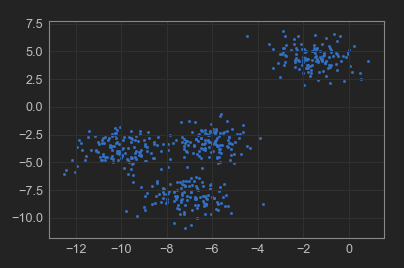

# metrics

1. 在scikit-learn中有三种方法来评估estimator 的预测性能：

- estimator 的.score方法。
- 通过使用model_selection中的模型评估工具来评估，如model_selection.cross_val_score等方法。
- 通过scikit-learn的metrics模块中的函数来评估estimator 的预测性能。这里重点讲解这些函数。

2. metrics模块中的性能评价函数的通用参数：

- y_true：一个数组，给出了真实的标记集合。
- y_pred：一个数组，给出了预测的标记集合。
- sample_weight：一个浮点数，给出了样本权重。默认每个样本的权重为 1。

```python
from sklearn.datasets import load_breast_cancer
from sklearn.linear_model import LogisticRegression

breast_cancer = load_breast_cancer()

x_train, x_test, y_train, y_test = train_test_split(breast_cancer.data,
                                                    breast_cancer.target,
                                                    test_size=0.3,
                                                    random_state=33)

lr = LogisticRegression()
lr.fit(x_train, np.ravel(y_train.astype("int")))

y_pred = lr.predict(x_test)

lr.score(x_test, y_test)
```


    0.9590643274853801


## confusion_matrix

1. confusion_matrix函数给出了分类结果的混淆矩阵。其原型为：

```python
sklearn.metrics.confusion_matrix(y_true, y_pred, labels=None)
```

> 返回值：

一个格式化的字符串，给出了分类结果的混淆矩阵。

> 参数：

参考classification_report 。

2. 混淆矩阵的内容如下，其中$C_{i,j}$表示真实标记为$i$但是预测为$j$的样本的数量。

	Confusion Matrix:
	[[5 0]
	[3 2]]


```python
from sklearn.datasets import load_breast_cancer
from sklearn.linear_model import LogisticRegression
from sklearn.metrics import confusion_matrix

breast_cancer = load_breast_cancer()

x_train, x_test, y_train, y_test = train_test_split(breast_cancer.data,
                                                    breast_cancer.target,
                                                    test_size=0.3,
                                                    random_state=33)

lr = LogisticRegression()
lr.fit(x_train, np.ravel(y_train.astype("int")))
y_pred = lr.predict(x_test)

labels = ['故障', '正常']
pd.DataFrame(confusion_matrix(y_true=y_test, y_pred=y_pred, labels=[0, 1]), 
             columns=labels, 
             index=labels)
```

|      | 故障 | 正常 |
| ---- | ---- | ---- |
| 故障 | 61   | 5    |
| 正常 | 2    | 103  |


## accuracy_score

1. accuracy_score函数用于计算分类结果的准确率，其原型为：

```python
sklearn.metrics.accuracy_score(
	y_true, 
	y_pred, 
	normalize=True, 
	sample_weight=None)
```
> 返回值：

如果normalize为True，则返回准确率；如果normalize为False，则返回正确分类的数量。

> 参数：

- y_true：真实的标记集合。
- y_pred：预测的标记集合。
- normalize：一个布尔值，指示是否需要归一化结果。
  - 如果为True，则返回分类正确的比例（准确率）。
  - 如果为False，则返回分类正确的样本数量。
- sample_weight：样本权重，默认每个样本的权重为 1 。

```python
from sklearn.metrics import accuracy_score
from sklearn.datasets import load_breast_cancer
from sklearn.linear_model import LogisticRegression

breast_cancer = load_breast_cancer()

x_train, x_test, y_train, y_test = train_test_split(breast_cancer.data,
                                                    breast_cancer.target,
                                                    test_size=0.3,
                                                    random_state=33)

lr = LogisticRegression()
lr.fit(x_train, np.ravel(y_train.astype("int")))

y_pred = lr.predict(x_test)

acc = accuracy_score(y_true=y_test, y_pred=y_pred)
acc
```


    0.9590643274853801


```python
cm = confusion_matrix(y_true=y_test, y_pred=y_pred, labels=[1, 0])
print(cm)
(61 + 103) / (61 + 5 + 2 + 103)
```

    [[103   2]
     [  5  61]]
    
    0.9590643274853801


## precision_score

1. precision_score函数用于计算分类结果的查准率，其原型为：

```python
sklearn.metrics.precision_score(y_true,
                                y_pred,
                                labels=None,
                                pos_label=1,
                                average='binary',
                                sample_weight=None)
```
> 返回值：

查准率。即预测结果为正类的那些样本中，有多少比例确实是正类。

> 参数：

- y_true：真实的标记集合。
- y_pred：预测的标记集合。
- labels：一个列表。当average 不是'binary' 时使用。
  - 对于多分类问题，它指示：将计算哪些类别。不在labels 中的类别，计算macro precision 时其成分为 0 。
  - 对于多标签问题，它指示待考察的标签的索引。
  - 除了average=None 之外，labels 的元素的顺序也非常重要。
  - 默认情况下，y_true 和 y_pred 中所有的类别都将被用到。
- pos_label：一个字符串或者整数，指定哪个标记值属于正类。
  - 如果是多分类或者多标签问题，则该参数被忽略。
  - 如果设置label=[pos_label] 以及average!='binary' 则会仅仅计算该类别的precision 。
- average：一个字符串或者None，用于指定二分类或者多类分类的precision 如何计算。
  - 'binary'：计算二类分类的precision。 此时由pos_label 指定的类为正类，报告其precision 。它要求y_true、y_pred 的元素都是0,1 。
  - 'micro'：通过全局的正类和父类，计算precision 。
  - 'macro'：计算每个类别的precision，然后返回它们的均值。
  - 'weighted'：计算每个类别的precision，然后返回其加权均值，权重为每个类别的样本数。
  - 'samples'：计算每个样本的precision，然后返回其均值。该方法仅仅对于多标签分类问题有意义。
  - None：计算每个类别的precision，然后以数组的形式返回每个precision 。
- sample_weight：样本权重，默认每个样本的权重为 1

```python
from sklearn.metrics import precision_score
from sklearn.datasets import load_breast_cancer
from sklearn.linear_model import LogisticRegression

breast_cancer = load_breast_cancer()

x_train, x_test, y_train, y_test = train_test_split(breast_cancer.data,
                                                    breast_cancer.target,
                                                    test_size=0.3,
                                                    random_state=33)

lr = LogisticRegression()
lr.fit(x_train, np.ravel(y_train.astype("int")))

y_pred = lr.predict(x_test)

pre = precision_score(y_true=y_test, y_pred=y_pred)
pre
```


    0.9537037037037037


```python
cm = confusion_matrix(y_true=y_test, y_pred=y_pred, labels=[1, 0])
print(cm)
103 / (103 + 5)
```

    [[103   2]
     [  5  61]]
    
    0.9537037037037037


## recall_score

1. recall_score函数用于计算分类结果的查全率，其原型为：

```python
sklearn.metrics.recall_score(
	y_true, 
	y_pred, 
	labels=None, 
	pos_label=1, 
	average='binary', 
	sample_weight=None)
```

> 返回值：

查全率。即真实的正类中，有多少比例被预测为正类。

> 参数：

参考precision_score 。

```python
from sklearn.metrics import recall_score
from sklearn.datasets import load_breast_cancer
from sklearn.linear_model import LogisticRegression

breast_cancer = load_breast_cancer()

x_train, x_test, y_train, y_test = train_test_split(breast_cancer.data,
                                                    breast_cancer.target,
                                                    test_size=0.3,
                                                    random_state=33)

lr = LogisticRegression()
lr.fit(x_train, np.ravel(y_train.astype("int")))

y_pred = lr.predict(x_test)

rs = recall_score(y_true=y_test, y_pred=y_pred)
rs
```


    0.9809523809523809


```python
cm = confusion_matrix(y_true=y_test, y_pred=y_pred, labels=[1, 0])
print(cm)
103 / (103 + 2)
```

    [[103   2]
     [  5  61]]
    
    0.9809523809523809


## f1_score

1. f1_score函数用于计算分类结果的$F_1$值，其原型为：

```python
sklearn.metrics.f1_score(
	y_true, 
	y_pred, 
	labels=None, 
	pos_label=1, 
	average='binary', 
	sample_weight=None)
```
> 返回值： 

即查准率和查全率的调和均值。

> 参数：

参考precision_score 。


```python
from sklearn.metrics import f1_score
from sklearn.datasets import load_breast_cancer
from sklearn.linear_model import LogisticRegression

breast_cancer = load_breast_cancer()

x_train, x_test, y_train, y_test = train_test_split(breast_cancer.data,
                                                    breast_cancer.target,
                                                    test_size=0.3,
                                                    random_state=33)

lr = LogisticRegression()
lr.fit(x_train, np.ravel(y_train.astype("int")))

y_pred = lr.predict(x_test)

f1 = f1_score(y_true=y_test, y_pred=y_pred)
f1
```


    0.9671361502347416


```python
cm = confusion_matrix(y_true=y_test, y_pred=y_pred, labels=[0, 1])
print(cm)
# 2PR / (P+R)
2 * ((103 / (103 + 5)) * (103 / (103 + 2))) / \
    ((103 / (103 + 5)) + (103 / (103 + 2)))
```

    [[ 61   5]
     [  2 103]]
    
    0.9671361502347416


## r2_score

相关指数$R^{2}$ （也称 决定系数 coefficient of determination）


```python
sklearn.metrics.r2_score(y_true,
                         y_pred,
                         sample_weight=None,
                         multioutput='uniform_average')
```

> 参数：

- y_true：真实值。
- y_pred：预测值。
- sample_weight：样本权重。multioutput：多维输入输出，可选‘raw_values’, ‘uniform_average’, ‘variance_weighted’或None。
	- 默认为’uniform_average’;
	- ‘variance_weighted’对所有输出的分数进行平均，并根据每个输出的方差进行加权。
	- ‘raw_values’对每一对应列求其R2指数，返回一个与列数相同的一维数组。
		

```python
from sklearn.metrics import r2_score
from sklearn.datasets import load_breast_cancer
from sklearn.linear_model import LogisticRegression

breast_cancer = load_breast_cancer()

x_train, x_test, y_train, y_test = train_test_split(breast_cancer.data,
                                                    breast_cancer.target,
                                                    test_size=0.3,
                                                    random_state=33)

lr = LogisticRegression()
lr.fit(x_train, np.ravel(y_train.astype("int")))

y_pred = lr.predict(x_test)

f1 = r2_score(y_true=y_test, y_pred=y_pred)
f1
```


## mean_squared_error

1. mean_squared_error函数用于计算回归预测误差平方的均值(mean square error:MSE)，其原型为：

```python
sklearn.metrics.mean_squared_error(
	y_true, 
	y_pred, 
	sample_weight=None,
	multioutput='uniform_average')
```

> 返回值：

预测误差的平方的平均值。

> 参数：

参考mean_absolute_error 。

## mean_absolute_error

1. mean_absolute_error函数用于计算回归预测误差绝对值的均值(mean absolute error:MAE)，其原型为：

```python
sklearn.metrics.mean_absolute_error(
y_true, 
y_pred, 
sample_weight=None,
multioutput='uniform_average')
```

> 返回值：

预测误差绝对值的均值。

> 参数：

- y_true：真实的标记集合。
- y_pred：预测的标记集合。
- multioutput：指定对于多输出变量的回归问题的误差类型。可以为：
  - 'raw_values'：对每个输出变量，计算其误差 。
  - 'uniform_average'：计算其所有输出变量的误差的平均值。
- sample_weight：样本权重，默认每个样本的权重为 1。

```python
from sklearn.model_selection import train_test_split
import numpy as np
from sklearn.datasets import load_boston
from sklearn.preprocessing import StandardScaler
from sklearn.linear_model import LinearRegression
from sklearn.metrics import r2_score, mean_squared_error, mean_absolute_error

boston = load_boston()
x_train, x_test, y_train, y_test = train_test_split(boston.data,
                                                    boston.target,
                                                    random_state=33,
                                                    test_size=0.25)

ss_x = StandardScaler()
x_train = ss_x.fit_transform(x_train)
x_test = ss_x.transform(x_test)

ss_y = StandardScaler()
y_train = ss_y.fit_transform(y_train.reshape(-1, 1))
y_test = ss_y.transform(y_test.reshape(-1, 1))


lr = LinearRegression()
lr.fit(x_train, y_train)
y_pred = lr.predict(x_test)

print('>>>The value of default measurement of LinearRegression is\n',
      lr.score(x_test, y_test))

print('>>>The value of R-squared of LinearRegression is\n',
      r2_score(y_test, y_pred))

print(
    '>>>The mean squared error of LinearRegression is\n',
    mean_squared_error(ss_y.inverse_transform(y_test),
                       ss_y.inverse_transform(y_pred)))

print(
    '>>>The mean absoluate error of LinearRegression is\n',
    mean_absolute_error(ss_y.inverse_transform(y_test),
                        ss_y.inverse_transform(y_pred)))
```

    >>>The value of default measurement of LinearRegression is
     0.675795501452948
    >>>The value of R-squared of LinearRegression is
     0.675795501452948
    >>>The mean squared error of LinearRegression is
     25.139236520353457
    >>>The mean absoluate error of LinearRegression is
     3.5325325437053983


## fbeta_score

1. fbeta_score函数用于计算分类结果的$F_\beta$值，其原型为：

```python
sklearn.metrics.fbeta_score(y_true,
                            y_pred,
                            beta,
                            labels=None,
                            pos_label=1,
                            average='binary',
                            sample_weight=None)
```
> 返回值：$F_\beta$值。

> 参数：

beta： $\beta$值
其它参数参考precision_score 。 

```python
from sklearn.datasets import load_breast_cancer
from sklearn.linear_model import LogisticRegression
from sklearn.metrics import fbeta_score

breast_cancer = load_breast_cancer()
x_train, x_test, y_train, y_test = train_test_split(breast_cancer.data,
                                                    breast_cancer.target,
                                                    test_size=0.3,
                                                    random_state=33)

lr = LogisticRegression()
lr.fit(x_train, np.ravel(y_train.astype("int")))

y_pred = lr.predict(x_test)

print('Fbeta Score(beta=0.001):', fbeta_score(y_true=y_test, y_pred=y_pred, beta=0.001))
print('Fbeta Score(beta=1):', fbeta_score(y_true=y_test, y_pred=y_pred, beta=1))
print('Fbeta Score(beta=10):', fbeta_score(y_true=y_test, y_pred=y_pred, beta=10))
print('Fbeta Score(beta=10000):', fbeta_score(y_true=y_test, y_pred=y_pred, beta=10000))
```

    Fbeta Score(beta=0.001): 0.9537037301954475
    Fbeta Score(beta=1): 0.9671361502347416
    Fbeta Score(beta=10): 0.9806749622926095
    Fbeta Score(beta=10000): 0.9809523806721087


## precision_recall_curve

1. precision_recall_curve函数用于计算分类结果的P-R曲线。其原型为：

```python
sklearn.metrics.precision_recall_curve(y_true,
                                       probas_pred,
                                       pos_label=None,
                                       sample_weight=None)
```

> 返回值：

一个元组，元组内的元素分别为：

- P-R曲线的查准率序列。该序列是递增序列，序列第$i$个元素是当正类概率的判定阈值为 thresholds[i]时的查准率。
- P-R曲线的查全率序列。该序列是递减序列，序列第$i$个元素是当正类概率的判定阈值为 thresholds[i]时的查全率。
- P-R曲线的阈值序列thresholds。该序列是一个递增序列，给出了判定为正例时的正类概率的阈值。

> 参数：

- y_true：真实的标记集合。
- probas_pred：每个样本预测为正类的概率的集合。
- pos_label：正类的类别标记。
- sample_weight：样本权重，默认每个样本的权重为 1。

```python
from sklearn.datasets import load_breast_cancer
from sklearn.linear_model import LogisticRegression
from sklearn.metrics import precision_recall_curve

breast_cancer = load_breast_cancer()

x_train, x_test, y_train, y_test = train_test_split(breast_cancer.data,
                                                    breast_cancer.target,
                                                    test_size=0.3,
                                                    random_state=33)

lr = LogisticRegression()
lr.fit(x_train, np.ravel(y_train.astype("int")))

y_pred = lr.predict(x_test)
precision, recall, _ = precision_recall_curve(y_test, y_pred)
```


```python
precision
```


    array([0.61403509, 0.9537037 , 1.        ])


```python
recall
```


    array([1.        , 0.98095238, 0.        ])


```python
from sklearn.metrics import precision_recall_curve

from sklearn.datasets import load_iris
from sklearn.multiclass import OneVsRestClassifier
from sklearn.svm import SVC
from sklearn.model_selection import train_test_split

from sklearn.preprocessing import label_binarize
import numpy as np

import matplotlib.pyplot as plt
%matplotlib inline

# 加载数据
iris = load_iris()
x = iris.data
y = iris.target

# 二元化标记
y = label_binarize(y, classes=[0, 1, 2])
n_classes = y.shape[1]

# 添加噪音
np.random.seed(0)
n_samples, n_features = x.shape
x = np.c_[x, np.random.randn(n_samples, 200 * n_features)]

x_train, x_test, y_train, y_test = train_test_split(x,
                                                    y,
                                                    test_size=0.5,
                                                    random_state=0)
# 训练模型
clf = OneVsRestClassifier(
    SVC(kernel='linear', probability=True, random_state=0))
clf.fit(x_train, y_train)
y_score = clf.fit(x_train, y_train).decision_function(x_test)

# 获取 P-R
fig = plt.figure(figsize=(12, 8))
ax = fig.add_subplot(1, 1, 1)
precision = dict()
recall = dict()
for i in range(n_classes):
    precision[i], recall[i], _ = precision_recall_curve(
        y_test[:, i], y_score[:, i])

    ax.plot(recall[i], precision[i], label="target=%s" % i)

ax.set_xlabel("Recall Score")
ax.set_ylabel("Precision Score")
ax.set_title("P-R")
ax.legend(loc='best')
ax.set_xlim(0, 1.1)
ax.set_ylim(0, 1.1)
ax.grid()
plt.show()
```


## roc_auc_score

1. roc_auc_score函数用于计算分类结果的ROC曲线的面积AUC。其原型为：

```python
sklearn.metrics.roc_auc_score(
	y_true, 
	y_score, 
	average='macro', 
	sample_weight=None)
```

返回值：AUC值。

参数：参考 roc_curve 。

```python
from sklearn.datasets import load_breast_cancer
from sklearn.linear_model import LogisticRegression
from sklearn.metrics import roc_auc_score

breast_cancer = load_breast_cancer()

x_train, x_test, y_train, y_test = train_test_split(breast_cancer.data,
                                                    breast_cancer.target,
                                                    test_size=0.3,
                                                    random_state=33)

lr = LogisticRegression()
lr.fit(x_train, np.ravel(y_train.astype("int")))

y_pred = lr.predict(x_test)

auc = roc_auc_score(y_true=y_test, y_score=y_pred)
auc
```


    0.9525974025974026


## roc_curve

1. roc_curve函数用于计算分类结果的ROC曲线。其原型为：

```python
sklearn.metrics.roc_curve(
y_true, 
y_score, 
pos_label=None, 
sample_weight=None,
drop_intermediate=True)
```

> 返回值：

一个元组，元组内的元素分别为：

- ROC曲线的$FPR$序列。该序列是递增序列，序列第$i$个元素是当正类概率的判定阈值为 thresholds[i]时的假正例率。
- ROC曲线的$TPR$序列。该序列是递增序列，序列第$i$个元素是当正类概率的判定阈值为 thresholds[i]时的真正例率。
- ROC曲线的阈值序列thresholds。该序列是一个递减序列，给出了判定为正例时的正类概率的阈值。

> 参数：

- y_true：真实的标记集合。
- y_score：每个样本预测为正类的概率的集合。
- pos_label：正类的类别标记。
- sample_weight：样本权重，默认每个样本的权重为 1。
- drop_intermediate：一个布尔值。如果为True，则抛弃某些不可能出现在ROC曲线上的阈值。

```python
from sklearn.datasets import load_breast_cancer
from sklearn.linear_model import LogisticRegression
from sklearn.metrics import roc_curve, auc

breast_cancer = load_breast_cancer()

x_train, x_test, y_train, y_test = train_test_split(breast_cancer.data,
                                                    breast_cancer.target,
                                                    test_size=0.3,
                                                    random_state=33)

lr = LogisticRegression()
lr.fit(x_train, np.ravel(y_train.astype("int")))

y_pred = lr.predict(x_test)
```


```python
fpr, tpr, _ = roc_curve(y_test, y_pred)

auc = auc(fpr, tpr)
auc
```


    0.9525974025974026


```python
from sklearn.metrics import roc_auc_score, roc_curve, auc
from sklearn.datasets import load_iris
from sklearn.multiclass import OneVsRestClassifier
from sklearn.svm import SVC
from sklearn.model_selection import train_test_split

from sklearn.preprocessing import label_binarize
import numpy as np

import matplotlib.pyplot as plt
%matplotlib inline

# 加载数据
iris = load_iris()
x = iris.data
y = iris.target
# 二元化标记
y = label_binarize(y, classes=[0, 1, 2])
n_classes = y.shape[1]

# 添加噪音
np.random.seed(0)
n_samples, n_features = x.shape
x = np.c_[x, np.random.randn(n_samples, 200 * n_features)]

x_train, x_test, y_train, y_test = train_test_split(x,
                                                    y,
                                                    test_size=0.5,
                                                    random_state=0)
# 训练模型
clf = OneVsRestClassifier(
    SVC(kernel='linear', probability=True, random_state=0))
clf.fit(x_train, y_train)
y_score = clf.fit(x_train, y_train).decision_function(x_test)

# 获取 ROC
fig = plt.figure(figsize=(12, 8))
ax = fig.add_subplot(1, 1, 1)
fpr = dict()
tpr = dict()
roc_auc = dict()

for i in range(n_classes):
    fpr[i], tpr[i], _ = roc_curve(y_test[:, i], y_score[:, i])
    # roc_auc[i] = roc_auc_score(fpr[i], tpr[i])
    roc_auc[i] = auc(fpr[i], tpr[i])
    ax.plot(fpr[i], tpr[i], label="target=%s,auc=%s" % (i, roc_auc[i]))

ax.plot([0, 1], [0, 1], 'k--')
ax.set_xlabel("FPR")
ax.set_ylabel("TPR")
ax.set_title("ROC")
ax.legend(loc="best")
ax.set_xlim(0, 1.0)
ax.set_ylim(0, 1.0)
ax.grid()
plt.show()
```


## classification_report

1. classification_report函数以文本方式给出了分类结果的主要预测性能指标。其原型为：

```python
sklearn.metrics.classification_report(y_true,
                                      y_pred,
                                      labels=None,
                                      target_names=None,
                                      sample_weight=None,
                                      digits=2)
```
> 返回值：

一个格式化的字符串，给出了分类评估报告。

> 参数：

- y_true：真实的标记集合。
- y_pred：预测的标记集合。
- labels：一个列表，指定报告中出现哪些类别。
- target_names：一个列表，指定报告中类别对应的显示出来的名字。
- digits：用于格式化报告中的浮点数，保留几位小数。
- sample_weight：样本权重，默认每个样本的权重为 1


2. 分类评估报告的内容如下，其中：

- precision列：给出了查准率。它依次将类别 0 作为正类，类别 1 作为正类...
- recall列：给出了查全率。它依次将类别 0 作为正类，类别 1 作为正类...
- f1-score列：给出了$F_1$值。
- support列：给出了该类有多少个样本。
- avg / total行：(???)
  - 对于precision,recall,recall，给出了该列数据的算术平均。
  - 对于support列，给出了该列的算术和（其实就等于样本集总样本数量）。
  
  

同时还会给出总体的微平均值，宏平均值和加权平均值。

- 微平均值：micro average，所有数据结果的平均值
- 宏平均值：macro average，所有标签结果的平均值
- 加权平均值：weighted average，所有标签结果的加权平均值


	Classification Report:
	precision    recall  f1-score   support
	class_0       0.62      1.00      0.77         5
	class_1       1.00      0.40      0.57         5
	avg / total       0.81      0.70      0.67        10

```python
from sklearn.datasets import load_breast_cancer
from sklearn.linear_model import LogisticRegression
from sklearn.metrics import classification_report

breast_cancer = load_breast_cancer()

x_train, x_test, y_train, y_test = train_test_split(breast_cancer.data,
                                                    breast_cancer.target,
                                                    test_size=0.3,
                                                    random_state=33)

lr = LogisticRegression()
lr.fit(x_train, np.ravel(y_train.astype("int")))

y_pred = lr.predict(x_test)

cp = classification_report(y_true=y_test,
                           y_pred=y_pred,
                           target_names=breast_cancer["target_names"])
print(cp)
```

                  precision    recall  f1-score   support
    
       malignant       0.97      0.92      0.95        66
          benign       0.95      0.98      0.97       105
    
       micro avg       0.96      0.96      0.96       171
       macro avg       0.96      0.95      0.96       171
    weighted avg       0.96      0.96      0.96       171


## precision_recall_fscore_support


```python
from sklearn.datasets import load_breast_cancer
from sklearn.linear_model import LogisticRegression
from sklearn.metrics import precision_recall_fscore_support

breast_cancer = load_breast_cancer()

x_train, x_test, y_train, y_test = train_test_split(breast_cancer.data,
                                                    breast_cancer.target,
                                                    test_size=0.3,
                                                    random_state=33)

lr = LogisticRegression()
lr.fit(x_train, np.ravel(y_train.astype("int")))

y_pred = lr.predict(x_test)

cp = precision_recall_fscore_support(y_true=y_test, y_pred=y_pred)
cp
```


    (array([0.96825397, 0.9537037 ]),
     array([0.92424242, 0.98095238]),
     array([0.94573643, 0.96713615]),
     array([ 66, 105], dtype=int64))


```python
from sklearn.metrics import precision_recall_fscore_support
import numpy as np


def eval_model(y_true, y_pred, labels):
    # 计算每个分类的Precision, Recall, f1, support
    p, r, f1, s = precision_recall_fscore_support(y_true, y_pred)
    # 计算总体的平均Precision, Recall, f1, support
    tot_p = np.average(p, weights=s)
    tot_r = np.average(r, weights=s)
    tot_f1 = np.average(f1, weights=s)
    tot_s = np.sum(s)
    res1 = pd.DataFrame({
        u'Label': labels,
        u'Precision': p,
        u'Recall': r,
        u'F1': f1,
        u'Support': s
    })
    res2 = pd.DataFrame({
        u'Label': ['总体'],
        u'Precision': [tot_p],
        u'Recall': [tot_r],
        u'F1': [tot_f1],
        u'Support': [tot_s]
    })
    res2.index = ["2"]
    res = pd.concat([res1, res2])
    return res[['Label', 'Precision', 'Recall', 'F1', 'Support']]


eval_model(y_true=y_test, 
           y_pred=y_pred, 
           labels=breast_cancer["target_names"])
```

|      | Label     | Precision | Recall   | F1       | Support |
| ---- | --------- | --------- | -------- | -------- | ------- |
| 0    | malignant | 0.968254  | 0.924242 | 0.945736 | 66      |
| 1    | benign    | 0.953704  | 0.980952 | 0.967136 | 105     |
| 2    | 总体      | 0.95932   | 0.959064 | 0.958877 | 171     |


## adjusted_rand_score


```python
from sklearn.datasets import make_blobs
import matplotlib.pyplot as plt

x, y = make_blobs(n_samples=500, n_features=2, centers=4, random_state=1)
plt.scatter(
    x[:, 0],
    x[:, 1],
    marker='o',  # 点的形状
    s=8  # 点的大小
)
plt.show()

from sklearn.cluster import KMeans

n_clusters=4
cluster=KMeans(n_clusters=n_clusters,random_state=0).fit(x)

y_pred=cluster.fit_predict(x)   ## 每个样本所对应的簇的标签

centroid=cluster.cluster_centers_  ##  返回质心
print("质心:\n", centroid)

inertia=cluster.inertia_  ## 返回SSE簇内平方和

print("SSE:", inertia)

# 可视化
color = ['green', 'yellow', 'blue', 'red']

for i in range(n_clusters):
    plt.scatter(x[y_pred == i, 0],
                x[y_pred == i, 1],
                marker='o',
                s=8,
                c=color[i])
plt.scatter(centroid[:, 0], centroid[:, 1], marker='x', s=35, c='black')
plt.show()

# 评估
from sklearn.metrics import adjusted_mutual_info_score  ##普通互信息
from sklearn.metrics import mutual_info_score  ## 调整的互信息
from sklearn.metrics import normalized_mutual_info_score  ## 标准化互信息

me = adjusted_mutual_info_score(y_pred, y)  # 有标签时，以普通互信息作为评估指标
print(me)

from sklearn.metrics import adjusted_rand_score  #调整兰德系数
me = adjusted_rand_score(y_pred, y)
print(me)

from sklearn.metrics import silhouette_score
from sklearn.metrics import silhouette_samples

silhouette_score(x, y_pred)  # 返回轮廓系数
silhouette_score(x, cluster.labels_)  #与上面一样
#silhouette_samples(x,y_pred)   # 返回每个样本自己的轮廓系数
```




