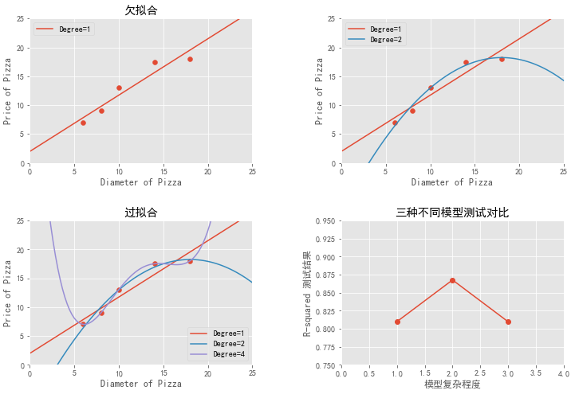
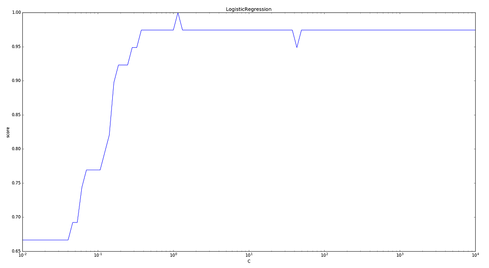
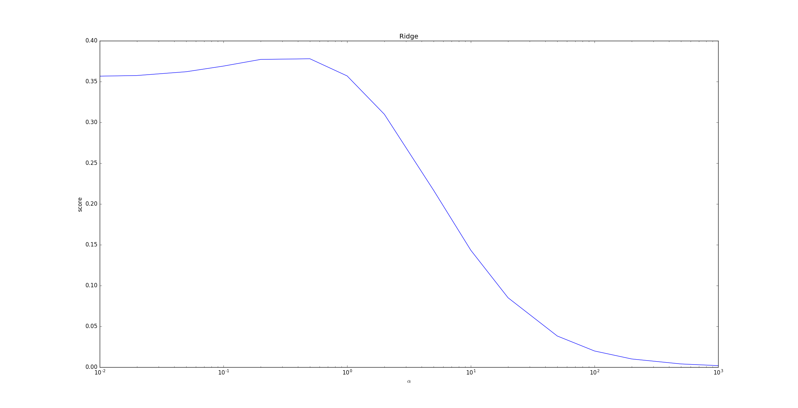

# 通用参数

>1. 模型的一些通用方法：

- `get_params`([deep])：返回模型的参数。
  - deep： 如果为True，则可以返回模型参数的子对象。
- `set_params`(**params)：设置模型的参数。
  - params：待设置的关键字参数。
- `fit`(X, y[,sample_weight])：训练模型。
  - X ：训练集样本集合。通常是一个numpy array，每行代表一个样本，每列代表一个特征。
  - y ：训练样本的标签集合。它与X 的每一行相对应。
  - sample_weight： 每个样本的权重。它与X 的每一行相对应。
- `predict`(x)： 利用模型执行预测。返回一个预测结果序列。
  - X：测试集样本集合。通常是一个numpy array，每行代表一个样本，每列代表一个特征。
- `score`(X,y[,sample_weight])：对模型进行评估，返回模型的性能评估结果。
  - X：验证集样本集合。通常是一个numpy array，每行代表一个样本，每列代表一个特征。
  - y：验证集样本的标签集合。它与X 的每一行相对应。
  - sample_weight： 每个样本的权重。它与X 的每一行相对应。

对于分类模型，其评估的是accuracy ；对于回归模型，其评估的是R2 。

如果希望有其它的评估指标，则可以执行predict() 方法，然后把预测结果、真实标记作为参数来调用一些打分函数即可。

---

>２.模型的一些通用参数：

- `n_jobs`：一个正数，指定任务并形时指定的 CPU数量。如果为 -1 则使用所有可用的 CPU。
- `verbose`：一个正数。用于开启/关闭迭代中间输出日志功能。
- 数值越大，则日志越详细。
  
  - 数值为0或者None，表示关闭日志输出。
- `warm_start`：一个布尔值。如果为True，那么使用前一次训练结果继续训练。否则从头开始训练。
- `max_iter`：一个整数，指定最大迭代次数。如果为None则为默认值（不同solver的默认值不同）。
- `random_state`：一个整数或者一个RandomState实例，或者None。
  - 如果为整数，则它指定了随机数生成器的种子。
  - 如果为RandomState实例，则指定了随机数生成器。
  - 如果为None，则使用默认的随机数生成器。
  
  ---

>3.对于回归模型，其评估性能的指标为$R^2$  。

　　假设验证集为$\mathbb{D}_{\text {validate}}$，`真实标签`记作$\tilde{y}$, `预测值`记作$\hat{y}$，则有：
$$
R^{2}=1-\frac{\sum_{\mathbb{D}_{\text {validate}}}\left(\tilde{y}_{i}-\hat{y}_{i}\right)^{2}}{\left(\tilde{y}_{i}-\bar{y}\right)^{2}}
$$
　　其中$\bar{y}$为`所有真实标记的均值`。

　　根据定义有：**$R^2$不超过 1 ，但是有可能小于 0 。$R^2$越大，模型的预测性能越好。**


# linear_model

1. 线性模型的一些通用参数：

- `fit_intercept`：一个布尔值，指定是否需要计算截距项。如果为False，那么不会计算截距项。当满足下式时， 可以设置 fit_intercept=False 。
	$$
	\overrightarrow{\tilde{\mathbf{w}}}=\left(w^{(1)}, w^{(2)}, \cdots, w^{(n)}, b\right)^{T}=\left(\overrightarrow{\mathbf{w}}^{T}, b\right)^{T} \\
	\overrightarrow{\tilde{\mathbf{x}}}=\left(x^{(1)}, x^{(2)}, \cdots, x^{(n)}, 1\right)^{T}=\left(\overrightarrow{\mathbf{x}}^{T}, 1\right)^{T}
	$$
	
- `intercept_scaling`：一个浮点数，用于缩放截距项的正则化项的影响。
	- 当采用fit_intercept 时，相当于人造一个特征出来，该特征恒为 1 ，其权重为 b 。
	- 在计算正则化项的时候，该人造特征也被考虑了。为了降低这个人造特征的影响，需要提供intercept_scaling。

- `tol`：一个浮点数，指定判断迭代收敛与否的阈值。


## LinearRegression

1. LinearRegression是线性回归模型，它的原型为：

```python
from sklearn.linear_model import LinearRegression

model = LinearRegression()
model.get_params()
```

```Python
{'copy_X': True, 'fit_intercept': True, 'n_jobs': None, 'normalize': False}
```


- fit_intercept：一个布尔值，指定是否需要计算截距项。
- normalize：一个布尔值。如果为True，那么训练样本会在训练之前会被归一化。
- copy_X：一个布尔值。如果为True，则会拷贝X 。
- n_jobs：一个整数，指定计算并行度。


2. 模型属性：

- coef_：权重向量。
- intercept_： 截距值。


3. 模型方法：

- fit(X,y[,sample_weight])：训练模型。
- predict(X)：用模型进行预测，返回预测值。
- score(X,y[,sample_weight])：返回模型的预测性能得分。 


```python
from sklearn.metrics import r2_score, mean_squared_error, mean_absolute_error
from sklearn.linear_model import LinearRegression
from sklearn.preprocessing import StandardScaler
from sklearn.model_selection import train_test_split
from sklearn.datasets import load_boston
import numpy as np
from IPython.core.interactiveshell import InteractiveShell

InteractiveShell.ast_node_interactivity = "all"

boston = load_boston()

# 随机采样25%的数据构建测试样本，其余作为训练样本
x_train, x_test, y_train, y_test = train_test_split(boston.data,
                                                    boston.target,
                                                    random_state=33,
                                                    test_size=0.25)

# 分析回归目标值的差异
# print("The max target value is", np.max(boston.target))
# print("The min target value is", np.min(boston.target))
# print("The average target value is", np.mean(boston.target))

ss_x = StandardScaler()
ss_y = StandardScaler()

# 分别对训练和测试数据的特征以及目标值进行标准化处理
x_train = ss_x.fit_transform(x_train)
y_train = ss_y.fit_transform(y_train.reshape(-1, 1))

x_test = ss_x.transform(x_test)
y_test = ss_y.transform(y_test.reshape(-1, 1))

params = {
    'copy_X': True,
    'fit_intercept': True,
    'n_jobs': None,
    'normalize': False
}

lr = LinearRegression(**params)
lr.fit(x_train, y_train)
y_pred = lr.predict(x_test)

print('The value of default measurement of LinearRegression is',
      lr.score(x_test, y_test))

# 使用r2_score模块，并输出评估结果。
print('The value of R-squared of LinearRegression is',
      r2_score(y_test, y_pred))

# 使用mean_squared_error模块，并输出评估结果。
print(
    'The mean squared error of LinearRegression is',
    mean_squared_error(ss_y.inverse_transform(y_test),
                       ss_y.inverse_transform(y_pred)))

print(
    'The mean absoluate error of LinearRegression is',
    mean_absolute_error(ss_y.inverse_transform(y_test),
                        ss_y.inverse_transform(y_pred)))

lr.coef_
lr.intercept_
```

```python
LinearRegression(copy_X=True, fit_intercept=True, n_jobs=None, normalize=False)

The value of default measurement of LinearRegression is 0.6757955014529482
The value of R-squared of LinearRegression is 0.6757955014529482
The mean squared error of LinearRegression is 25.139236520353442
The mean absoluate error of LinearRegression is 3.532532543705398

array([[-0.1147262 ,  0.13081062,  0.01168159,  0.09047604, -0.17816355,
         0.3189522 , -0.01783831, -0.33316307,  0.26809803, -0.21757932,
        -0.20355027,  0.05513145, -0.40687576]])
        
array([5.46798511e-15])
```

## 欠拟合、过拟合


```python
from sklearn.preprocessing import PolynomialFeatures
import matplotlib.pyplot as plt
import numpy as np
from sklearn.linear_model import LinearRegression

%matplotlib inline

plt.style.use('ggplot')

# ### 中文和负号的正常显示-rcParams

plt.rcParams['font.sans-serif'] = 'SimHei'  
plt.rcParams['axes.unicode_minus'] = False

X_train = [[6], [8], [10], [14], [18]]
y_train = [[7], [9], [13], [17.5], [18]]


regressor = LinearRegression()
regressor.fit(X_train, y_train)

xx = np.linspace(0, 26, 100)
xx = xx.reshape(xx.shape[0], 1)
yy = regressor.predict(xx)


plt.figure(figsize=(12, 8))
plt.subplot(2, 2, 1)
plt.scatter(X_train, y_train)
plt1, = plt.plot(xx, yy, label="Degree=1")
plt.axis([0, 25, 0, 25])
plt.title(u'欠拟合')
plt.xlabel('Diameter of Pizza')
plt.ylabel('Price of Pizza')
plt.legend(handles=[plt1])
# plt.show();

# 输出线性回归模型在训练样本上的R-squared值
print('The R-squared value of Linear Regressor performing on the training data is\n',
      regressor.score(X_train, y_train))


# 使用PolynominalFeatures(degree=2)映射出2次多项式特征，存储在变量X_train_poly2中。
poly2 = PolynomialFeatures(degree=2)
X_train_poly2 = poly2.fit_transform(X_train)
# 以线性回归器为基础，初始化回归模型。尽管特征的维度有提升，但是模型基础仍然是线性模型。
regressor_poly2 = LinearRegression()
regressor_poly2.fit(X_train_poly2, y_train)  # 对2次多项式回归模型进行训练。

# 从新映射绘图用x轴采样数据
xx_poly2 = poly2.transform(xx)
# 使用2次多项式回归模型对应x轴采样数据进行回归预测
yy_poly2 = regressor_poly2.predict(xx_poly2)

# 分别对训练数据点、线性回归直线、2次多项式回归曲线进行作图
plt.subplot(2, 2, 2)
plt.scatter(X_train, y_train)
plt1, = plt.plot(xx, yy, label='Degree=1')
plt2, = plt.plot(xx, yy_poly2, label='Degree=2')
plt.axis([0, 25, 0, 25])
plt.xlabel('Diameter of Pizza')
plt.ylabel('Price of Pizza')
plt.legend(handles=[plt1, plt2])
# plt.show();

# 输出2次多项式回归模型在训练样本上的R-squared值。
print('The R-squared value of Polynominal Regressor (Degree=2) performing on the training data is',
      regressor_poly2.score(X_train_poly2, y_train))


# 初始化4次多项式特征生成器
poly4 = PolynomialFeatures(degree=4)
X_train_poly4 = poly4.fit_transform(X_train)
regressor_poly4 = LinearRegression()
regressor_poly4.fit(X_train_poly4, y_train)

# 从新映射绘图用x轴采样数据
xx_poly4 = poly4.transform(xx)
# 使用4次多项式回归模型对应x轴采样数据进行回归预测。
yy_poly4 = regressor_poly4.predict(xx_poly4)

# 分别对训练数据点、线性回归直线、2次多项式以及4次多项式回归曲线进行作图。
plt.subplot(2, 2, 3)
plt.scatter(X_train, y_train)
plt1, = plt.plot(xx, yy, label='Degree=1')
plt2, = plt.plot(xx, yy_poly2, label='Degree=2')
plt4, = plt.plot(xx, yy_poly4, label='Degree=4')
plt.axis([0, 25, 0, 25])
plt.title(u'过拟合')
plt.xlabel('Diameter of Pizza')
plt.ylabel('Price of Pizza')
plt.legend(handles=[plt1, plt2, plt4])
# plt.show()

print('The R-squared value of Polynominal Regressor (Degree=4) performing on the training data is',
      regressor_poly4.score(X_train_poly4, y_train))


# 三种回归模型在测试集上的性能表现**********************************************************
# 准备测试数据
X_test = [[6], [8], [11], [16]]
y_test = [[8], [12], [15], [18]]

# 使用测试数据对线性回归模型的性能进行评估。
regressor_sc = regressor.score(X_test, y_test)

# 使用测试数据对2次多项式回归模型的性能进行评估。
X_test_poly2 = poly2.transform(X_test)
regressor_poly2_sc = regressor_poly2.score(X_test_poly2, y_test)

# 使用测试数据对4次多项式回归模型的性能进行评估
X_test_poly4 = poly4.transform(X_test)
regressor_poly4_sc = regressor_poly4.score(X_test_poly4, y_test)

x = range(1, 4)
y = [regressor_sc, regressor_poly2_sc, regressor_poly4_sc]
# 分别对训练数据点、线性回归直线、2次多项式以及4次多项式回归曲线进行作图。
plt.subplot(2, 2, 4)
plt.plot(x, y, marker='o')
plt.axis([0, 4, 0.75, 0.95])
plt.title(u'三种不同模型测试对比')
plt.xlabel(u'模型复杂程度')
plt.ylabel(u'R-squared 测试结果')
plt.subplots_adjust(left=None, bottom=None, right=None,
                    top=None, wspace=0.4, hspace=0.4)
plt.show();
```

    The R-squared value of Linear Regressor performing on the training data is
     0.9100015964240102
    The R-squared value of Polynominal Regressor (Degree=2) performing on the training data is 0.9816421639597427
    The R-squared value of Polynominal Regressor (Degree=4) performing on the training data is 1.0





## LogisticRegression

1. LogisticRegression实现了对数几率回归模型。其原型为：

```python
from sklearn.linear_model import LogisticRegression

model = LogisticRegression()
model.get_params()
```

```python
{'C': 1.0,
 'class_weight': None,
 'dual': False,
 'fit_intercept': True,
 'intercept_scaling': 1,
 'l1_ratio': None,
 'max_iter': 100,
 'multi_class': 'auto',
 'n_jobs': None,
 'penalty': 'l2',
 'random_state': None,
 'solver': 'lbfgs',
 'tol': 0.0001,
 'verbose': 0,
 'warm_start': False}
```


- `penalty`：一个字符串，指定了正则化策略。
	- 如果为'l2'， 则为L2正则化。
	- 如果为'l1'，则为L2正则化。
- `dual `：一个布尔值。
- 如果为True，则求解对偶形式（只在penalty='l2'且solver='liblinear'有对偶形式）。
  - 如果为False，则求解原始形式。
- `C`：一个浮点数。它指定了罚项系数的倒数。如果它的值越小，则正则化项越大。
- `class_weight`：一个字典或者字符串'balanced' ，指定每个类别的权重。
- 如果为字典：则字典给出了每个分类的权重。如{class_label: weight} 。
  - 如果为字符串'balanced'：则每个分类的权重与该分类在样本集中出现的频率成反比。
  - 如果未指定，则每个分类的权重都为 1 。
- `solver`：一个字符串，指定了求解最优化问题的算法。可以为下列的值：
- 'newton-cg'：使用牛顿法。
  - 'lbfgs'：使用L-BFGS拟牛顿法。
  - 'liblinear'：使用liblinear 。
  - 'sag'：使用Stochastic Average Gradient descent算法。

注意：

  - 对于规模小的数据集，'liblinear'比较适用；对于规模大的数据集，'sag'比较适用。
  - 'newton-cg'、'lbfgs'、'sag'只处理penalty='l2'的情况。
- multi_class：一个字符串，指定对于多分类问题的策略。可以为：

  - 'ovr'：采用one-vs-rest策略。
  - 'multinomial'：直接采用多分类 logistic回归策略。
- 其它参数参考ElasticNet 。


2. 模型属性：参考ElasticNet 。

3. 模型方法：

- fit(X,y[,sample_weight])：训练模型。
- predict(X)：用模型进行预测，返回预测值。
- score(X,y[,sample_weight])：返回模型的预测性能得分。
- predict_log_proba(X)：返回一个数组，数组的元素依次是X预测为各个类别的概率的对数值。
- predict_proba(X)：返回一个数组，数组的元素依次是X预测为各个类别的概率值。


4. 下面的示例给出了不同的 C 值对模型预测能力的影响。

　　C是正则化项系数的倒数，它越小则正则化项的权重越大。

- 随着C的增大（即正则化项的减小），LogisticRegression的预测准确率上升。

- 当 C增大到一定程度（即正则化项减小到一定程度），LogisticRegression的预测准确率维持在较高的水准保持不变。

>事实上，当 C 太大时，正则化项接近于0，此时容易发生过拟合，预测准确率会下降。




```python
params = model.get_params()
li = [i for i in dir(model) if not i.startswith("_") and i not in params]
li
```


```python
['decision_function',
 'densify',
 'fit',
 'get_params',
 'predict',
 'predict_log_proba',
 'predict_proba',
 'score',
 'set_params',
 'sparsify']
```


`参数详解`

参数|默认值|值域|说明
:-:|:-:|:-:|---
C|1.0|---|正则化系数，正则化强度的导数，必须是一个正数，**值越小，正则化强度越大，即防止过拟合的程度更大**。
class_weight|None|---| 用来调节正负样本比例的                                       
dual|False|[True,False]|用来指明是否将原问题改成他的对偶问题，适用于样本较小的数据集，因样本小时，计算复杂度较低。
fit_intercept|True|[True,False]|是否将截距/方差加入到决策模型中
intercept_scaling|1||
max_iter|100|---|算法收敛的最大迭代次数，即求取损失函数最小值的迭代次数
multi_class|ovr|[ovr，multinomial]| 分类方法参数选择                                             
n_jobs|None|---|并行运算数量(核的数量)，默认为（None）1，如果设置为-1，则表示将电脑的cpu全部用上。
penalty|l2|[l1,l2]|正则化选择参数，参数可选值为l1和l2，分别对应l1正则化和l2正则化 
random_state|None|---|随机种子的设置，如果设置了随机种子，那么每次使用的训练集和测试集都是一样的
solver|liblinear|---|用来指明损失函数的优化方法，默认是‘liblinear’方法 
tol|0.0001|---|残差收敛条件，只要收敛的时候两步只差＜tol就停止，可以设置更大或更小。(逻辑回归模型的损失函数是残差平方和)
verbose|0|---|就是会输出一些模型运算过程中的东西（任务进程），默认是0，也就是不需要输出一些不重要的计算过程。
warm_start|False|---|是否使用上次的模型结果作为初始化，默认是False，表示不使用

**class_weight**
>class_weight是很重要的一个参数，是用来`调节正负样本比例`的，默认是值为None，也就是正负样本的权重是一样的，你可以以dict的形式给模型传入任意你认为合适的权重比，也可以直接指定一个值“balanced”，模型会根据正负样本的绝对数量比来设定模型最后结果的权重比。

>比如，有一数据集的正负样本绝对数量比为4:6,如果你给参数class_weight赋予balanced值，那么最后模型结果中，正负样本的权重比就会变成6:4。

**multi_class**
>分类方法参数选择，‘ovr’和‘multinomial’两个值可以选择，默认值为‘ovr’，如果分类问题是二分类问题，那么这两个参数的效果是一样的，主要体现在多分类问题上。

>对于多分类问题，"ovr"分类方法是：针对每一类别进行判断时，都会把这个分类问题简化为是/非两类问题；而‘multinomial’是从众多类别中选出两个类别，对这两个类别进行判断，待判断完成后，再从剩下的类别中再选出两类进行判断，直至最后判断完成。

**penalty**
>调整该参数的目的主要是为了防止过拟合，一般penalty选择l2正则化就够啦，但是如果选择l2正则化发现依然过拟合，即预测效果还是很差的时候，就可以考虑l1正则化。如果模型的特征非常多，我们希望做一些特征选择（即把一些不重要的特征过滤掉），这个时候也可以考虑用l1正则化。

>penalty参数的选择会影响我们损失函数优化算法的选择，即参数solver的选择

>如果是l2正则化，可选的优化算法 {‘newton-cg’, ‘lbfgs’, ‘liblinear’, ‘sag’}都可以选择。

>如果penalty是L1正则化的话，就只能选择‘liblinear’了。这是因为L1正则化的损失函数不是连续可导的，而{‘newton-cg’, ‘lbfgs’,‘sag’}这三种优化算法时都需要损失函数的一阶或者二阶连续导数。而‘liblinear’并没有这个依赖。这几个优化方法在solver参数环节进行讲述。

**solver**
>用来指明损失函数的优化方法，默认是‘liblinear’方法，sklearn自带了如下几种：  

参数值|优化方法
---|---
liblinear|使用了坐标轴下降法来迭代优化损失函数
lbfgs|拟牛顿法的一种，利用损失函数二阶导数矩阵即海森矩阵来迭代优化损失函数
newton-cg|也是牛顿法法的一种，利用损失函数二阶导数矩阵即海森矩阵来迭代优化损失函数
sag|即随机平均梯度下降，是梯度下降法的变种，是一种线性收敛算法，和普通梯度下降法的区别是每次迭代仅仅用一部分的样本来计算梯度，适合于样本数据多的时候

>newton-cg, lbfgs和sag这三种优化算法时都需要损失函数的一阶或者二阶连续导数，因此不能用于没有连续导数的L1正则化，只能用于L2正则化。而liblinear对L1正则化和L2正则化都适用。同时，因sag每次仅仅使用了部分样本进行梯度迭代，所以当数据量较少时不宜选用，而当数据量很大时，为了速度，sag是第一选择。

**模型对象**

    coef_:返回各特征的系数,绝对值大小可以理解成特征重要性
    intercept_:返回模型的截距
    n_iter_:模型迭代次数


**模型方法**

    decision_function(X):返回决策函数值（比如svm中的决策距离）
    predict_proba(X):返回每个类别的概率值（有几类就返回几列值）
    predict_log_proba(X):返回概率值的log值（即将概率取对数）
    predict(X)：返回预测结果值（0/1）
    score(X, y=None):返回函数
    get_params(deep=True):返回估计器的参数
    set_params(**params):为估计器设置参数

>案例


```python
from sklearn.datasets import load_breast_cancer
from sklearn.linear_model import LogisticRegression
from sklearn.model_selection import train_test_split
from sklearn.metrics import classification_report

breast_cancer = load_breast_cancer()

x_train, x_test, y_train, y_test = train_test_split(breast_cancer.data,
                                                    breast_cancer.target,
                                                    test_size=0.3,
                                                    random_state=33)

lr = LogisticRegression()
lr.fit(x_train, np.ravel(y_train.astype("int")))

y_pred = lr.predict(x_test)

cp = classification_report(y_true=y_test,
                           y_pred=y_pred,
                           target_names=breast_cancer["target_names"])
print(cp)
```

                  precision    recall  f1-score   support
    
       malignant       0.97      0.92      0.95        66
          benign       0.95      0.98      0.97       105
    
       micro avg       0.96      0.96      0.96       171
       macro avg       0.96      0.95      0.96       171
    weighted avg       0.96      0.96      0.96       171


​    


```python
intercept = lr.intercept_
coef = lr.coef_[0, :]
lx = np.arange(0, 12)
# lx * coef[0] + coef[1] * ly + intercept = 0
ly = (-intercept - lx * coef[0]) / coef[1]
```


## SGDClassifier


```python
from sklearn.linear_model import SGDClassifier

model = SGDClassifier()
model.get_params()
```


```python
{'alpha': 0.0001,
 'average': False,
 'class_weight': None,
 'early_stopping': False,
 'epsilon': 0.1,
 'eta0': 0.0,
 'fit_intercept': True,
 'l1_ratio': 0.15,
 'learning_rate': 'optimal',
 'loss': 'hinge',
 'max_iter': None,
 'n_iter': None,
 'n_iter_no_change': 5,
 'n_jobs': None,
 'penalty': 'l2',
 'power_t': 0.5,
 'random_state': None,
 'shuffle': True,
 'tol': None,
 'validation_fraction': 0.1,
 'verbose': 0,
 'warm_start': False}
```


<font color=bleu size=5>参数详解</font>

参数|默认值|值域|说明
---|---|---|---
alpha|0.0001
average|False
class_weight|None
early_stopping|False
epsilon|0.1
eta0|0.0
fit_intercept|True
l1_ratio|0.15
learning_rate|optimal
loss|hinge
max_iter|None
n_iter|None
n_iter_no_change|5
n_jobs|None
penalty|l2
power_t|0.5
random_state|None
shuffle|True
tol|None
validation_fraction|0.1
verbose|0
warm_start|False


```python
# data = pd.read_csv('https://archive.ics.uci.edu/ml/machine-learning-databases/breast-cancer-wisconsin/breast-cancer-wisconsin.data', names = column_names )
# data.to_csv('breast-cancer-wisconsin.csv')
```


```python
column_names = ['Sample code number', 'Clump Thickness', 'Uniformity of Cell Size', 'Uniformity of Cell Shape', 'Marginal Adhesion', 'Single Epithelial Cell Size', 'Bare Nuclei', 'Bland Chromatin', 'Normal Nucleoli', 'Mitoses', 'Class']
data = pd.read_csv('breast-cancer-wisconsin.csv', index_col=0)
data = data.replace(to_replace='?', value=np.nan)
data = data.dropna(how='any')
data.head()
```


<div>
<style scoped>
    .dataframe tbody tr th:only-of-type {
        vertical-align: middle;
    }

    .dataframe tbody tr th {
        vertical-align: top;
    }
    
    .dataframe thead th {
        text-align: right;
    }

<table border="1" class="dataframe">
  <thead>
    <tr style="text-align: right;">
      <th></th>
      <th>Sample code number</th>
      <th>Clump Thickness</th>
      <th>Uniformity of Cell Size</th>
      <th>Uniformity of Cell Shape</th>
      <th>Marginal Adhesion</th>
      <th>Single Epithelial Cell Size</th>
      <th>Bare Nuclei</th>
      <th>Bland Chromatin</th>
      <th>Normal Nucleoli</th>
      <th>Mitoses</th>
      <th>Class</th>
    </tr>
  </thead>
  <tbody>
    <tr>
      <th>0</th>
      <td>1000025</td>
      <td>5</td>
      <td>1</td>
      <td>1</td>
      <td>1</td>
      <td>2</td>
      <td>1</td>
      <td>3</td>
      <td>1</td>
      <td>1</td>
      <td>2</td>
    </tr>
    <tr>
      <th>1</th>
      <td>1002945</td>
      <td>5</td>
      <td>4</td>
      <td>4</td>
      <td>5</td>
      <td>7</td>
      <td>10</td>
      <td>3</td>
      <td>2</td>
      <td>1</td>
      <td>2</td>
    </tr>
    <tr>
      <th>2</th>
      <td>1015425</td>
      <td>3</td>
      <td>1</td>
      <td>1</td>
      <td>1</td>
      <td>2</td>
      <td>2</td>
      <td>3</td>
      <td>1</td>
      <td>1</td>
      <td>2</td>
    </tr>
    <tr>
      <th>3</th>
      <td>1016277</td>
      <td>6</td>
      <td>8</td>
      <td>8</td>
      <td>1</td>
      <td>3</td>
      <td>4</td>
      <td>3</td>
      <td>7</td>
      <td>1</td>
      <td>2</td>
    </tr>
    <tr>
      <th>4</th>
      <td>1017023</td>
      <td>4</td>
      <td>1</td>
      <td>1</td>
      <td>3</td>
      <td>2</td>
      <td>1</td>
      <td>3</td>
      <td>1</td>
      <td>1</td>
      <td>2</td>
    </tr>
  </tbody>
</table>


```python
from sklearn.model_selection import train_test_split
from sklearn.preprocessing import StandardScaler
from sklearn.linear_model import SGDClassifier
from sklearn.metrics import classification_report

x_train, x_test, y_train, y_test = train_test_split(data[column_names[1:10]],
                                                    data[column_names[10]],
                                                    test_size=0.25,
                                                    random_state=33)

ss = StandardScaler()
x_train = ss.fit_transform(x_train)
x_test = ss.transform(x_test)

sgdc = SGDClassifier()
sgdc.fit(x_train, y_train)
print('>>>Accuarcy of SGD Classifier:\n', sgdc.score(x_test, y_test))

y_pred = sgdc.predict(x_test)
print(classification_report(y_test, y_pred,
                            target_names=['Benign', 'Malignant']))
```

    >>>Accuarcy of SGD Classifier:
     0.9824561403508771
                  precision    recall  f1-score   support
    
          Benign       0.99      0.98      0.98       100
       Malignant       0.97      0.99      0.98        71
    
       micro avg       0.98      0.98      0.98       171
       macro avg       0.98      0.98      0.98       171
    weighted avg       0.98      0.98      0.98       171


​    


```python
"""
LogisticRegression与SGDClassifier
前者对参数的计算采用精确解析的方式，计算时间长但是模型性能略高
后者采用随机梯度上升算法估计模型参数，计算时间短但是产出的模型性能略低
一般而言，训练集数据规模在10万以上，推荐用后者
"""
```

## SGDRegressor


```python
import numpy as np
from sklearn.datasets import load_boston
from sklearn.model_selection import train_test_split
from sklearn.preprocessing import StandardScaler
from sklearn.linear_model import SGDRegressor
from sklearn.metrics import r2_score, mean_squared_error, mean_absolute_error

boston = load_boston()

x_train, x_test, y_train, y_test = train_test_split(boston.data,
                                                    boston.target,
                                                    random_state=33,
                                                    test_size=0.25)

# 分析回归目标值的差异。
# print("The max target value is", np.max(boston.target))
# print("The min target value is", np.min(boston.target))
# print("The average target value is", np.mean(boston.target))

ss_x = StandardScaler()
ss_y = StandardScaler()

x_train = ss_x.fit_transform(x_train)
x_test = ss_x.transform(x_test)

y_train = ss_y.fit_transform(y_train.reshape(-1, 1))
y_test = ss_y.transform(y_test.reshape(-1, 1))

sgdr = SGDRegressor(max_iter=1000)
sgdr.fit(x_train, y_train.ravel())
y_pred = sgdr.predict(x_test)

print('The value of default measurement of SGDRegressor is',
      sgdr.score(x_test, y_test))

print('The value of R-squared of SGDRegressor is', r2_score(y_test, y_pred))

print(
    'The mean squared error of SGDRegressor is',
    mean_squared_error(ss_y.inverse_transform(y_test),
                       ss_y.inverse_transform(y_pred)))

print(
    'The mean absoluate error of SGDRegressor is',
    mean_absolute_error(ss_y.inverse_transform(y_test),
                        ss_y.inverse_transform(y_pred)))
```

    The value of default measurement of SGDRegressor is 0.6757830698805176
    The value of R-squared of SGDRegressor is 0.6757830698805176
    The mean squared error of SGDRegressor is 25.140200480573164
    The mean absoluate error of SGDRegressor is 3.5347225313717865


## Lasso

1.Lasso类实现了Lasso回归模型。其原型为：

```python
sklearn.linear_model.Lasso(alpha=1.0, fit_intercept=True, normalize=False,
precompute=False, copy_X=True, max_iter=1000, tol=0.0001, warm_start=False, 
positive=False, random_state=None, selection='cyclic')
```

- alpha：$\alpha$值，用于缓解过拟合。

- precompute：一个布尔值或者一个序列。是否提前计算Gram矩阵来加速计算。

- warm_start：是否从头开始训练。

- positive：一个布尔值。如果为True，那么强制要求权重向量的分量都为正数。

- selection：一个字符串，可以为'cyclic'或者'random'。它指定了当每轮迭代的时候，选择权重向量的哪个分量来更新。

  - 'random'：更新的时候，随机选择权重向量的一个分量来更新
  - 'cyclic'：更新的时候，从前向后依次选择权重向量的一个分量来更新 

- 其它参数参考Ridge 。

2.模型属性：参考Ridge 。

3.模型方法： 参考LinearRegression 。

4.下面的示例给出了不同的  值对模型预测能力的影响。

当$\alpha$超过 1 之后，随着$\alpha$的增长，预测性能急剧下降。原因同Ridge中的分析。


```python
from sklearn.preprocessing import PolynomialFeatures
from sklearn.linear_model import Lasso

x_train = [[6], [8], [10], [14], [18]]
y_train = [[7], [9], [13], [17.5], [18]]

x_test = [[6], [8], [11], [16]]
y_test = [[8], [12], [15], [18]]

# 初始化4次多项式特征生成器
poly4 = PolynomialFeatures(degree=4)
x_train_poly4 = poly4.fit_transform(x_train)
x_test_poly4 = poly4.transform(x_test)

lasso_poly4 = Lasso()
lasso_poly4.fit(x_train_poly4, y_train)

# 对Lasso模型在测试样本上的回归性能进行评估
print(lasso_poly4.score(x_test_poly4, y_test))

# 输出Lasso模型的参数列表
print(lasso_poly4.coef_)
```

    0.8388926873604382
    [ 0.00000000e+00  0.00000000e+00  1.17900534e-01  5.42646770e-05
     -2.23027128e-04]


## Ridge

1.Ridge类实现了岭回归模型。其原型为：

```python
class sklearn.linear_model.Ridge(
    alpha=1.0, 
    fit_intercept=True, 
    normalize=False, 
    copy_X=True, 
    max_iter=None, 
    tol=0.001, 
    solver='auto', 
    random_state=None)
```

- alpha： 值，用于缓解过拟合。

- max_iter： 指定最大迭代次数。

- tol：一个浮点数，指定判断迭代收敛与否的阈值。

- solver：一个字符串，指定求解最优化问题的算法。可以为：

  - 'auto'：根据数据集自动选择算法。

  - 'svd'：使用奇异值分解来计算回归系数。

  - 'cholesky'：使用scipy.linalg.solve函数来求解。

  - 'sparse_cg'：使用scipy.sparse.linalg.cg函数来求解。

  - 'lsqr'：使用scipy.sparse.linalg.lsqr函数求解。

它运算速度最快，但是可能老版本的scipy不支持。

  - 'sag'：使用Stochastic Average Gradient descent算法求解最优化问题。

- random_state：用于设定随机数生成器，它在solver=sag时使用。

- 其它参数参考LinearRegression 。

2. 模型属性：

- coef_：权重向量。
- intercept_： 值。
- n_iter_：实际迭代次数。

3.模型方法： 参考LinearRegression 。

4.下面的示例给出了不同的  值对模型预测能力的影响。

- 当$\alpha$超过 1 之后，随着$\alpha$的增长，预测性能急剧下降。

这是因为$\alpha$较大时，正则化项$\alpha\|\overrightarrow{\mathbf{w}}\|_{2}^{2}$影响较大，模型趋向于简单。

- 极端情况下当$\alpha \rightarrow \infty$时，$\overrightarrow{\mathbf{w}}=\overrightarrow{\mathbf{0}}$从而使得正则化项$\alpha\|\overrightarrow{\mathbf{w}}\|_{2}^{2}=0$，此时的模型最简单。

但是预测预测性能非常差，因为对所有的未知样本，模型都预测为同一个常数$b$。



```python
from sklearn.preprocessing import PolynomialFeatures
from sklearn.linear_model import Ridge

x_train = [[6], [8], [10], [14], [18]]
y_train = [[7], [9], [13], [17.5], [18]]

x_test = [[6], [8], [11], [16]]
y_test = [[8], [12], [15], [18]]

# 初始化4次多项式特征生成器
poly4 = PolynomialFeatures(degree=4)
x_train_poly4 = poly4.fit_transform(x_train)
x_test_poly4 = poly4.transform(x_test)

ridge_poly4 = Ridge()

# 使用Ridge模型对4次多项式特征进行拟合
ridge_poly4.fit(x_train_poly4, y_train)
# 输出Ridge模型在测试样本上的回归性能
print(ridge_poly4.score(x_test_poly4, y_test))

# 输出Ridge模型的参数列表，观察参数差异
print(ridge_poly4.coef_)
# 计算Ridge模型拟合后参数的平方和
print(np.sum(ridge_poly4.coef_ ** 2))
```

    0.8374201759366577
    [[ 0.         -0.00492536  0.12439632 -0.00046471 -0.00021205]]
    0.015498965203571016


## ElasticNet

1.ElasticNet类实现了ElasticNet回归模型。其原型为：
```python
class sklearn.linear_model.ElasticNet(
    alpha=1.0, 
    l1_ratio=0.5, 
    fit_intercept=True,
    normalize=False, 
    precompute=False, 
    max_iter=1000, 
    copy_X=True, 
    tol=0.0001,
    warm_start=False, 
    positive=False, 
    random_state=None, 
    selection='cyclic')
```

- alpha： $\alpha$值 。
- l1_ratio： $\beta$值 。
- 其它参数参考 Lasso 。

2.模型属性：参考 Lasso 。

3.模型方法：参考 Lasso 。

4.下面的示例给出了不同的$\alpha$值和$\beta$值对模型预测能力的影响。

- 随着$\alpha$的增大，预测性能下降。因为正则化项为：
$$
\alpha \rho\|\overrightarrow{\mathbf{w}}\|_{1}+\frac{\alpha(1-\rho)}{2}\|\overrightarrow{\mathbf{w}}\|_{2}^{2} \quad, \alpha \geq 0,1 \geq \rho \geq 0
$$
- $\beta$影响的是性能下降的速度，因为这个参数控制着$\| \overrightarrow{\mathbf{w}}||_{1}, \quad|| \overrightarrow{\mathbf{w}}||_{2}^{2}$$之间的比例 。


