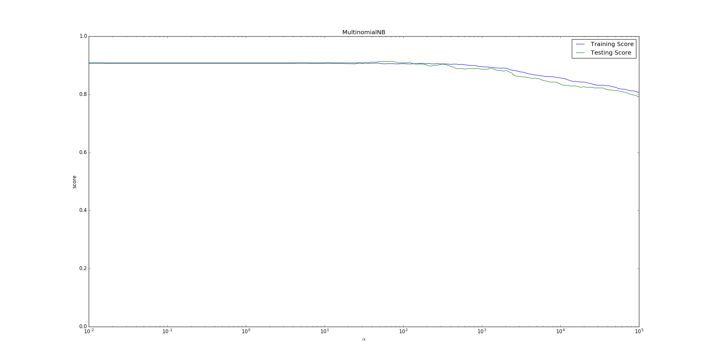

# naive_bayes

## GaussianNB

1. 高斯贝叶斯分类器GaussianNB ：它假设特征$x_{j}$的条件概率分布满足高斯分布：
$$
p\left(x_{j} | y=c_{k}\right)=\frac{1}{\sqrt{2 \pi \sigma_{k, j}^{2}}} \exp \left(-\frac{\left(x_{j}-\mu_{k, j}\right)^{2}}{2 \sigma_{k, j}^{2}}\right)
$$
其中：$\mu_{k, j}$为第$j$个特征的条件概率分布的均值，$\sigma_{k, j}$为第$j$个特征的条件概率分布的方差。

2. GaussianNB 的原型为：

```python
class sklearn.naive_bayes.GaussianNB()
```

3. 模型属性：

- class_prior_：一个数组，形状为(n_classes,)，是每个类别的概率 。
- class_count_：一个数组，形状为(n_classes,)，是每个类别包含的训练样本数量。
- theta_：一个数组，形状为(n_classes,n_features)，是每个类别上，每个特征的均值。
- sigma_：一个数组，形状为(n_classes,n_features)，是每个类别上，每个特征的标准差。

4.模型方法：

- fit(X, y[, sample_weight])：训练模型。
- partial_fit(X, y[, classes, sample_weight])：分批训练模型。
该方法主要用于大规模数据集的训练。此时可以将大数据集划分成若干个小数据集，然后在这些小数据集上连续调用partial_fit方法来训练模型。
- predict(X)：用模型进行预测，返回预测值。
- predict_log_proba(X)：返回一个数组，数组的元素依次是X预测为各个类别的概率的对数值。
- predict_proba(X)：返回一个数组，数组的元素依次是X预测为各个类别的概率值 。
- score(X, y[, sample_weight])：返回模型的预测性能得分。

```python
from sklearn.naive_bayes import GaussianNB

model = GaussianNB()
model.get_params()
```


    {'priors': None, 'var_smoothing': 1e-09}


<font color=bleu size=5>参数详解</font>

参数|默认值|值域|说明
---|---|---|---
priors|None|---|先验概率大小，如果没有给定，模型则根据样本数据自己计算（利用极大似然法）
var_smoothing|1e-09

**对象**

        class_prior_:每个样本的概率
        class_count:每个类别的样本数量
        theta_:每个类别中每个特征的均值
        sigma_:每个类别中每个特征的方差


```python

```

## MultinomialNB

1. 多项式贝叶斯分类器MultinomialNB ：它假设特征的条件概率分布满足多项式分布：
$$
p\left(x_{j}=a_{j, t} | y=c_{k}\right)=\frac{N_{k, j, t}+\alpha}{N_{k}+\alpha n}
$$
其中：

- $N_{k}=\sum_{i=1}^{N} I\left(\tilde{y}_{i}=c_{k}\right)$，表示属于类别$c_{k}$的样本的数量。
- $N_{k, j, t}=\sum_{i=1}^{N} I\left(\tilde{y}_{i}=c_{k}, x_{j}=a_{j, t}\right)$，表示属于类别$c_{k}$且第$j$个特征取值为$x_{j}=a_{j, t}$的样本的数量。

2. MultinomialNB 的原型为：
```python
class sklearn.naive_bayes.MultinomialNB(alpha=1.0, fit_prior=True, class_prior=None)
```

- alpha：一个浮点数，指定  值。
- fit_prior：一个布尔值。
  - 如果为True，则不去学习   ，替代以均匀分布。
  - 如果为False ，则去学习   。
- class_prior：一个数组。它指定了每个分类的先验概率  。

如果指定了该参数，则每个分类的先验概率不再从数据集中学得

3. 模型属性：

- class_log_prior_：一个数组对象，形状为(n_classes,)。给出了每个类别的调整后的的经验概率分布的对数值。
- feature_log_prob_: 一个数组对象，形状为(n_classes, n_features)。给出了   的经验概率分布的对数值。
- class_count_：一个数组，形状为(n_classes,)，是每个类别包含的训练样本数量。
- feature_count_：一个数组，形状为(n_classes, n_features)。训练过程中，每个类别每个特征遇到的样本数。

4. 模型方法：参考 GaussianNB 。

5. 下面的示例给出了不同的$\alpha$值对模型预测能力的影响。 运行结果如下。

为了便于观察将x轴设置为对数坐标。可以看到随着$\alpha>100$之后，随着$\alpha$的增长，预测准确率在下降。

这是因为，当$\alpha \rightarrow \infty$时，$p\left(x_{j}=a_{j, t} | y=c_{k}\right)=\frac{N_{k, j, t}+\alpha}{N_{k}+\alpha n} \rightarrow \frac{1}{n}$。即对任何类型的特征、该类型特征的任意取值，出现的概率都是$\frac{1}{n}$。它完全忽略了各个特征之间的差别，也忽略了每个特征内部的分布。


<font color=bleu size=5>参数详解</font>

参数|默认值|值域|说明
---|---|---|---
alpha|1.0|---|先验平滑因子，当等于1时表示拉普拉斯平滑
class_prior|None|---|各个类别的先验概率，如果没有指定，则模型会根据数据自动学习， 每个类别的先验概率相同，等于类标记总个数N分之一。
fit_prior|True|---|是否去学习类的先验概率

**对象**

        class_log_prior_:每个类别平滑后的先验概率
        intercept_:是朴素贝叶斯对应的线性模型，其值和class_log_prior_相同
        feature_log_prob_:给定特征类别的对数概率(条件概率)。 特征的条件概率=（指定类下指定特征出现的次数+alpha）/（指定类下所有特征出现次数之和+类的可能取值个数*alpha）
        coef_: 是朴素贝叶斯对应的线性模型，其值和feature_log_prob相同
        class_count_: 训练样本中各类别对应的样本数
        feature_count_: 每个类别中各个特征出现的次数


```python
from sklearn.naive_bayes import MultinomialNB

model = MultinomialNB()
model.get_params()
```


    {'alpha': 1.0, 'class_prior': None, 'fit_prior': True}


```python
from sklearn.metrics import classification_report
from sklearn.datasets import fetch_20newsgroups
from sklearn.feature_extraction.text import CountVectorizer
from sklearn.model_selection import train_test_split
from sklearn.naive_bayes import MultinomialNB

news = fetch_20newsgroups(subset='all')

x_train, x_test, y_train, y_test = train_test_split(news.data,
                                                    news.target,
                                                    test_size=0.25,
                                                    random_state=33)


vec = CountVectorizer(analyzer='word', stop_words='english')
x_train = vec.fit_transform(x_train)
x_test = vec.transform(x_test)

mnb = MultinomialNB()
mnb.fit(x_train, y_train)
y_predict = mnb.predict(x_test)


print('The accuracy of Naive Bayes Classifier is\n', mnb.score(x_test, y_test))
print(classification_report(y_test, y_predict, target_names=news.target_names))

"""
朴素贝叶斯模型被广泛应用于海量互联网文本分类任务，由于其较强的特征条件独立假设，
使得模型预测所需要的估计的参数规模从幂指数量级向线性量级减少，
极大地节约了内存消耗和计算时间，但是，也正是受这种强假设的限制，
规模训练时无法将个特征之间的联系考量在内，
使得该模型在其它数据特征关联性较强的分类任务上的性能表现欠佳
"""

```
    The accuracy of Naive Bayes Classifier is
     0.8637521222410866
                              precision    recall  f1-score   support
    
                 alt.atheism       0.85      0.89      0.87       201
               comp.graphics       0.62      0.88      0.73       250
     comp.os.ms-windows.misc       0.93      0.22      0.36       248
    comp.sys.ibm.pc.hardware       0.62      0.88      0.73       240
       comp.sys.mac.hardware       0.93      0.85      0.89       242
              comp.windows.x       0.82      0.85      0.84       263
                misc.forsale       0.90      0.79      0.84       257
                   rec.autos       0.91      0.91      0.91       238
             rec.motorcycles       0.98      0.94      0.96       276
          rec.sport.baseball       0.98      0.92      0.95       251
            rec.sport.hockey       0.92      0.99      0.95       233
                   sci.crypt       0.91      0.97      0.93       238
             sci.electronics       0.87      0.89      0.88       249
                     sci.med       0.94      0.95      0.95       245
                   sci.space       0.91      0.96      0.93       221
      soc.religion.christian       0.87      0.94      0.90       232
          talk.politics.guns       0.89      0.96      0.93       251
       talk.politics.mideast       0.95      0.98      0.97       231
          talk.politics.misc       0.84      0.90      0.87       188
          talk.religion.misc       0.91      0.53      0.67       158
    
                   micro avg       0.86      0.86      0.86      4712
                   macro avg       0.88      0.86      0.85      4712
                weighted avg       0.88      0.86      0.85      4712


朴素贝叶斯模型被广泛应用于海量互联网文本分类任务，由于其较强的特征条件独立假设，使得模型预测所需要的估计的参数规模从幂指数量级向线性量级减少，极大地节约了内存消耗和计算时间，但是，也正是受这种强假设的限制，规模训练时无法将个特征之间的联系考量在内，使得该模型在其它数据特征关联性较强的分类任务上的性能表现欠佳.


## BernoulliNB

1. 伯努利贝叶斯分类器BernoulliNB：它假设特征的条件概率分布满足二项分布：
$$
p\left(x_{j} | y\right)=p \times x_{j}+(1-p)\left(1-x_{j}\right)
$$
其中$p=p\left(x_{j}=1 | y\right)$，且要求特征的取值为$x_{j} \in\{0,1\}$。

2. BernoulliNB的原型为：

```python
class sklearn.naive_bayes.BernoulliNB(
    alpha=1.0, 
    binarize=0.0, 
    fit_prior=True,
    class_prior=None)
```

- binarize：一个浮点数或者None。
  - 如果为None，那么会假定原始数据已经是二元化的。
  - 如果是浮点数，则执行二元化策略：以该数值为界：
    - 特征取值大于它的作为 1 。
    - 特征取值小于它的作为 0 。
- 其它参数参考MultinomialNB 。

3.模型属性：参考MultinomialNB 。

4.模型方法：参考MultinomialNB 。

```python
from sklearn.naive_bayes import BernoulliNB

model = BernoulliNB()
model.get_params()
```


    {'alpha': 1.0, 'binarize': 0.0, 'class_prior': None, 'fit_prior': True}


参数|默认值|值域|说明
---|---|---|---
alpha|1.0|---|平滑因子，与多项式中的alpha一致
binarize|0.0|---|样本特征二值化的阈值，默认是0。如果不输入，则模型会认为所有特征都已经是二值化形式了；如果输入具体的值，则模型会把大于该值的部分归为一类，小于的归为另一类。
class_prior|None|---|各个类别的先验概率，如果没有指定，则模型会根据数据自动学习， 每个类别的先验概率相同，等于类标记总个数N分之一。
fit_prior|True|---|是否去学习类的先验概率

**对象**

        class_log_prior_:每个类别平滑后的先验对数概率。
        feature_log_prob_:给定特征类别的经验对数概率。
        class_count_:拟合过程中每个样本的数量。
        feature_count_:拟合过程中每个特征的数量。


**方法**

        fit(X,Y):在数据集(X,Y)上拟合模型。
        get_params():获取模型参数。
        predict(X):对数据集X进行预测。
        predict_log_proba(X):对数据集X预测，得到每个类别的概率对数值。
        predict_proba(X):对数据集X预测，得到每个类别的概率。
        score(X,Y):得到模型在数据集(X,Y)的得分情况。
