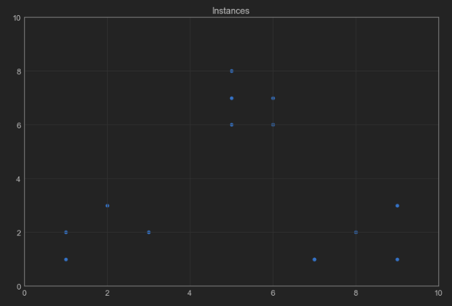
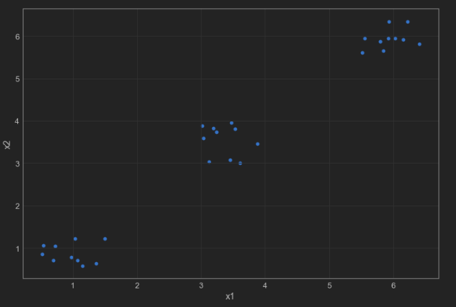
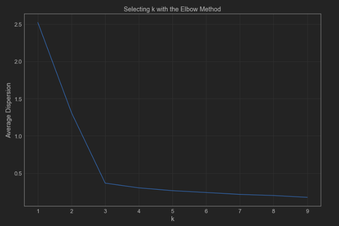
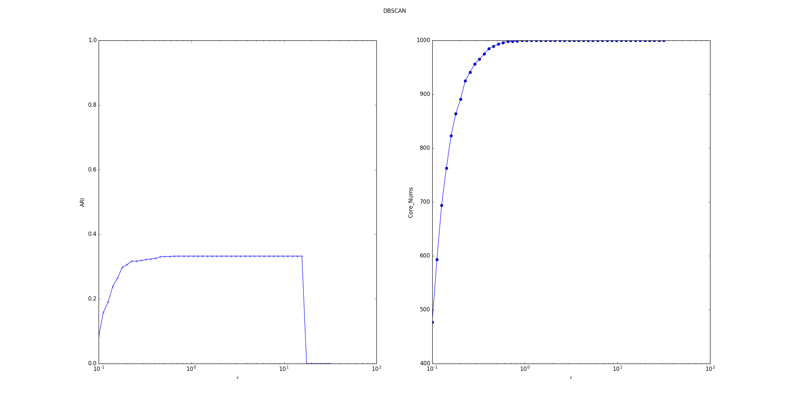

# cluster

1. 模型的一些通用方法：

- get_params([deep])：返回模型的参数。
  - deep： 如果为True，则可以返回模型参数的子对象。
- set_params(**params)：设置模型的参数。
  - params：待设置的关键字参数。
- fit(X[, y, sample_weight]) ：训练模型。
  - X ：样本集合。通常是一个numpy array，每行代表一个样本，每列代表一个特征。
  - y ：样本的标签集合。它与X 的每一行相对应。
  - sample_weight：样本的权重。其形状为 [n_samples,]，每个元素代表一个样本的权重。
- predict(X, sample_weight)：返回每个样本所属的簇标记。
  - X ：样本集合。通常是一个numpy array，每行代表一个样本，每列代表一个特征。
  - sample_weight：样本的权重。其形状为 [n_samples,]，每个元素代表一个样本的权重。
- fit_predict(X[, y, sample_weight]) ：训练模型并执行聚类，返回每个样本所属的簇标记。
  - X ：样本集合。通常是一个numpy array，每行代表一个样本，每列代表一个特征。
  - y ：样本的标签集合。它与X 的每一行相对应。
  - sample_weight：样本的权重。其形状为 [n_samples,]，每个元素代表一个样本的权重。

- transform(X)：将数据集 X 转换到cluster center space 。在cluster center space 中，样本的维度就是它距离各个聚类中心的距离。
  - X ：样本集合。通常是一个numpy array，每行代表一个样本，每列代表一个特征。
- fit_transform(X[, y, sample_weight])：训练模型并执行聚类，将数据集 X 转换到cluster center space 。
  - X ：样本集合。通常是一个numpy array，每行代表一个样本，每列代表一个特征。
  - y ：样本的标签集合。它与X 的每一行相对应。
  - sample_weight：样本的权重。其形状为 [n_samples,]，每个元素代表一个样本的权重。

2. 模型的一些通用参数：

- n_jobs：一个正数，指定任务并形时指定的 CPU数量。如果为 -1 则使用所有可用的 CPU。
- verbose：一个正数。用于开启/关闭迭代中间输出日志功能。
  - 数值越大，则日志越详细。
  - 数值为0或者None，表示关闭日志输出。
- max_iter ：一个整数，指定最大迭代次数。如果为None则为默认值（不同solver的默认值不同）。
- tol：一个浮点数，指定了算法收敛的阈值。
- random_state：一个整数或者一个RandomState实例，或者None。
  - 如果为整数，则它指定了随机数生成器的种子。
  - 如果为RandomState实例，则指定了随机数生成器。
  - 如果为None，则使用默认的随机数生成器。

## KMeans

1. KMeans是 scikit-learn提供的 k均值算法模型，其原型为：

```python
class sklearn.cluster.KMeans(
	n_clusters=8, 
	init='k-means++', 
	n_init=10,
	max_iter=300,
	tol=0.0001, 
	precompute_distances='auto', 
	verbose=0, 
	random_state=None, 
	copy_x=True, 
	n_jobs=1,
	algorithm='auto')
```
- n_clusters：一个整数，指定分类簇的数量。
- init：一个字符串，指定初始均值向量的策略。可以为：
  - 'k-means++'：该初始化策略选择的初始均值向量相互之间都距离较远，它的效果较好。
  - 'random'：从数据集中随机选择  个样本作为初始均值向量。
  - 或者提供一个数组，数组的形状为 (n_clusters,n_features)，该数组作为初始均值向量。

>K均值算法总能够收敛，但是其收敛情况高度依赖于初始化的均值。有可能收敛到局部极小值。因此通常都是用多组初始均值向量来计算若干次，选择其中最优的那一次。而k-means++策略选择的初始均值向量可以一定程度上的解决这个问题。

- n_init：一个整数，指定了k均值算法运行的次数。每次都会选择一组不同的初始化均值向量，最终算法会选择最佳的分类簇来作为最终的结果。
- max_iter：一个整数，指定了单轮k均值算法中，最大的迭代次数。算法总的最大迭代次数为 max_iter * n_init 。
- precompute_distances：指定是否提前计算距离。如果提前计算距离，则需要更多的内存，但是算法会运行的更快。可以为布尔值或者字符串 'auto'：
  - 'auto'：如果 n_samples*n_clusters > 12 million，则不提前计算。
  - True：总是提前计算。
  - False：总是不提前计算。

- tol：指定收敛阈值。
- n_jobs：指定并行度。
- verbose：指定开启/关闭迭代中间输出日志功能。
- random_state：指定随机数种子。
- copy_x：布尔值，主要用于precompute_distances=True的情况。
  - 如果为True，则预计算距离的时候，并不修改原始数据。
  - 如果为False，则预计算距离的时候，会修改原始数据用以节省内存；然后当算法结束的时候，会将原始数据还原。但是可能会因为浮点数的表示，会有一些精度误差。
- algorithm：一个字符串，优化算法的选择，有auto、full和elkan三种选择。
  - 'full'：使用经典的EM 风格的算法，是一般意义上的K-Means算法。
  - 'elkan'：使用'elkan' 变种算法。它通过使用三角不等式来优化算法，但是不支持稀疏数据。
  - 'auto'：自动选择算法。对于稀疏数据，使用'full'；对于密集数据，使用'elkan' 。


2. 属性：

- cluster_centers_：一个形状为[n_clusters,n_features]的数组，给出分类簇的均值向量。
- labels_：一个形状为[n_samples,] 的数组，给出了每个样本所属的簇的标记。
- inertia_：一个浮点数，聚类平方误差$\operatorname { err } = \sum _ { k = 1 } ^ { K } \sum _ { \vec { x } _ { i } \in \mathbb { C } _ { k } } \left\| \overrightarrow { \mathbf { x } } _ { i } - \vec { \mu } _ { k } \right\| _ { 2 } ^ { 2 }$。
- n_iter_：一个整数，指定运行的迭代次数。


3. 方法：

- fit(X[,y ,sample_weight])：训练模型。
- fit_predict(X[, y, sample_weight])：训练模型并执行聚类，返回每个样本所属的簇标记。
- predict(X, sample_weight)：返回每个样本所属的簇标记。
- transform(X)：将数据集 X 转换到cluster center space 。
- fit_transform(X[, y, sample_weight])：训练模型并执行聚类，将数据集 X 转换到cluster center space 。
- score(X[, y, sample_weight])：一个浮点数，给出了聚类平方误差的相反数：$- \sum _ { k = 1 } ^ { K } \sum _ { \vec { x } _ { i } \in \mathbb { C } _ { k } } \left\| \overrightarrow { \mathbf { x } } _ { i } - \vec { \mu } _ { k } \right\| _ { 2 } ^ { 2 }$。


```python
from sklearn.cluster import KMeans

model = KMeans()
model.get_params()
```


    {'algorithm': 'auto',
     'copy_x': True,
     'init': 'k-means++',
     'max_iter': 300,
     'n_clusters': 8,
     'n_init': 10,
     'n_jobs': None,
     'precompute_distances': 'auto',
     'random_state': None,
     'tol': 0.0001,
     'verbose': 0}


```python
import numpy as np
import matplotlib.pyplot as plt
import pandas as pd
from sklearn.cluster import KMeans
from sklearn.metrics import adjusted_rand_score

# 使用pandas分别读取训练数据与测试数据集。
# digits_train = pd.read_csv('https://archive.ics.uci.edu/ml/machine-learning-databases/optdigits/optdigits.tra', header=None)
# digits_test = pd.read_csv('https://archive.ics.uci.edu/ml/machine-learning-databases/optdigits/optdigits.tes', header=None)
# digits_train.to_csv('optdigits_train.csv',index=False)
# digits_test.to_csv('optdigits_test.csv',index=False)

digits_train = pd.read_csv('optdigits_train.csv')
digits_test = pd.read_csv('optdigits_test.csv')

x_train = digits_train[[str(i) for i in np.arange(64)]]
y_train = digits_train['64']

x_test = digits_test[[str(i) for i in np.arange(64)]]
y_test = digits_test['64']


kmeans = KMeans(n_clusters=10)
kmeans.fit(x_train)
y_pred = kmeans.predict(x_test)

print(adjusted_rand_score(y_test, y_pred))
```

    0.6621773801044615


```python
# 利用伦敦系数评价不同类簇数量的K-Means
import numpy as np
from sklearn.cluster import KMeans
from sklearn.metrics import silhouette_score
import matplotlib.pyplot as plt


plt.subplot(3, 2, 1)
x1 = np.array([1, 2, 3, 1, 5, 6, 5, 5, 6, 7, 8, 9, 7, 9])
x2 = np.array([1, 3, 2, 2, 8, 6, 7, 6, 7, 1, 2, 1, 1, 3])
# X = np.array(zip(x1, x2)).reshape(len(x1), 2)
x = np.vstack((x1, x2)).T

# 在1号子图做出原始数据点阵的分布
plt.xlim([0, 10])
plt.ylim([0, 10])
plt.title('Instances')
plt.scatter(x1, x2)

colors = ['b', 'g', 'r', 'c', 'm', 'y', 'k', 'b']
markers = ['o', 's', 'D', 'v', '^', 'p', '*', '+']

clusters = [2, 3, 4, 5, 8]
subplot_counter = 1
sc_scores = []
for t in clusters:
    subplot_counter += 1
    plt.subplot(3, 2, subplot_counter)
    kmeans_model = KMeans(n_clusters=t).fit(x)
    for i, l in enumerate(kmeans_model.labels_):  # kmeans_model.labels_:每个点对应的标签值
        plt.plot(x1[i], x2[i], color=colors[l], marker=markers[l], ls='None')
    plt.xlim([0, 10])
    plt.ylim([0, 10])
    sc_score = silhouette_score(X, kmeans_model.labels_, metric='euclidean')
    sc_scores.append(sc_score)

    # 绘制轮廓系数与不同类簇数量的直观显示图
    plt.title('K = %s, silhouette coefficient= %0.03f' % (t, sc_score))

# 绘制轮廓系数与不同类簇数量的关系曲线
plt.figure()
plt.plot(clusters, sc_scores, '*-')
plt.xlabel('Number of Clusters')
plt.ylabel('Silhouette Coefficient Score')
plt.show()
```





```python
# 肘部观察法
import numpy as np
from sklearn.cluster import KMeans
from scipy.spatial.distance import cdist
import matplotlib.pyplot as plt

# 使用均匀分布函数随机三个簇，每个簇周围10个数据样本。
cluster1 = np.random.uniform(0.5, 1.5, (2, 10))
cluster2 = np.random.uniform(5.5, 6.5, (2, 10))
cluster3 = np.random.uniform(3.0, 4.0, (2, 10))

# 绘制30个数据样本的分布图像
X = np.hstack((cluster1, cluster2, cluster3)).T
plt.scatter(X[:, 0], X[:, 1])
plt.xlabel('x1')
plt.ylabel('x2')
plt.show()

# 测试9种不同聚类中心数量下，每种情况的聚类质量，并作图
K = range(1, 10)
meandistortions = []

for k in K:
    kmeans = KMeans(n_clusters=k)
    kmeans.fit(X)
    meandistortions.append(
        sum(np.min(cdist(X, kmeans.cluster_centers_, 'euclidean'), axis=1)) / X.shape[0])

plt.plot(K, meandistortions, 'bx-')
plt.xlabel('k')
plt.ylabel('Average Dispersion')
plt.title('Selecting k with the Elbow Method')
plt.show()
```







##  MiniBatchKMeans

1. MiniBatchKMeans是 scikit-learn提供的 批量k均值算法模型，其原型为：
```python
class sklearn.cluster.MiniBatchKMeans(n_clusters=8, init='k-means++',max_iter=300,
batch_size=100, verbose=0, compute_labels=True,random_state=None,tol=0.0,
max_no_improvement=10, init_size=None, n_init=3, reassignment_ratio=0.01)
```

- batch_size：一个整数，指定batch 大小。
- compute_labels：一个布尔值，指定当算法收敛时，是否对全量数据集重新计算其完整的簇标记。
- tol：一个浮点数，指定收敛阈值。它可以用于早停。当迭代前后聚类中心的变化小于它时，执行早停。如果为0.0，则不开启这种早停。
- max_no_improvement：一个整数，用于控制早停的轮数。如果优化目标在连续 max_no_improvement 个 batch 内没有改善时，执行早停。这里的优化目标不是聚类中心的变化，而是平方误差$
\operatorname { err } = \sum _ { k = 1 } ^ { K } \sum _ { \vec { x } _ { i } \in \mathbb { C } _ { k } } \left\| \overrightarrow { \mathbf { x } } _ { i } - \vec { \mu } _ { k } \right\| _ { 2 } ^ { 2 }$。
- init_size：一个整数，为加速初始化而随机采样的样本数。通常是 3 倍的 batch_size 。它必须大于 n_clusters 。
- n_init：一个整数，指定了初始化的尝试次数。与KMeans 不同，MiniBatchKMeans 只会运行一轮（而不是多轮）。
- reassignment_ratio：一个浮点数，控制每次迭代中最多有多少个簇中心被重新赋值。如果该值较大，则模型可能收敛可能时间更长，但是聚类效果也会更好。
- 其他参数参考sklearn.cluster.KMeans 。
2. 属性：参考sklearn.cluster.KMeans 。
3. 方法：

- partial_fit(X, y=None, sample_weight=None)：训练k means 一个批次。
- 其它方法参考sklearn.cluster.KMeans 。

## MeanShift

1. MeanShift 是scikit-learn提供的一种密度聚类模型。其原型为：

```python
class sklearn.cluster.MeanShift(
	bandwidth=None, 
	seeds=None, 
	bin_seeding=False,
	min_bin_freq=1, 
	cluster_all=True, 
	n_jobs=None)
```
- bandwidth：一个浮点数，指定带宽参数。如果未指定，则通过sklearn.cluster.estimate_bandwith() 函数来自动计算。
- seeds：一个形状为[n_samples,n_features] 的数组，用于初始化核函数。如果未指定，则通过sklearn.cluster.get_bin_seeds() 函数来自动计算。
- bin_seeding：一个布尔值。
  - 如果为True，则并不会使用所有的点来计算核函数，而是使用网格边界上的点（网格宽度为带宽）来计算。这会加速算法的执行，因为核函数的初始化需要的点大大降低。
  - 如果为False，则使用所有的点来计算核函数。
- min_bin_freq：一个整数值，指定有效网格包含的数据点的最少数量。当bin_seeding=True 时，仅仅接收那些网格内包含超过min_bin_freq 个数据点的网格。
- cluster_all：一个布尔值，指定是否对所有数据点进行聚类。
  - 如果为False，则对离群点不聚类，将离群点的簇标记设置为-1 。
  - 如果为True，则对离群点也聚类，将离群点划分到离它最近的簇中。
- n_jobs：一个整数，指定并行度。

2. 属性：

- claster_centers_：一个形状为[n_clusters,n_features] 的数组，给出了每个簇中心的坐标。
- labels_：一个形状为[n_samples,] 的数组，给出了每个样本所属的簇标记。如果cluster_all=False，则对于离群样本，其簇标记为 -1。

3. 方法：

- fit(X[, y])：训练模型。
- fit_predict(X[, y])：训练模型并执行聚类，返回每个样本所属的簇标记。
- predict(X)：对每个样本预测其簇标记。每个样本距离最近的簇就是该样本所属的簇。


## AgglomerativeClustering

1. AgglomerativeClustering是scikit-learn提供的一种层次聚类模型。其原型为：

```python
class sklearn.cluster.AgglomerativeClustering(
	n_clusters=2, 
	affinity='euclidean',
	memory=Memory(cachedir=None), 
	connectivity=None, 
	n_components=None,
	compute_full_tree='auto', 
	linkage='ward', 
	pooling_func=<function mean>)
```

- n_clusters：一个整数，指定簇的数量。
- connectivity：一个数组或者可调用对象或者为None，用于指定连接矩阵。它给出了每个样本的可连接样本。
- affinity：一个字符串或者可调用对象，用于计算距离。可以为：'euclidean', 'l1', 'l2', 'manhattan', 'cosine', 'precomputed' 。如果linkage='ward'，则 'affinity必须是 'euclidean'
- memory：用于缓存输出的结果，默认为不缓存。如果给定一个字符串，则表示缓存目录的路径。
- n_components：将在scikit-learn v 0.18中移除
- compute_full_tree：通常当已经训练了n_clusters之后，训练过程就停止。但是如果compute_full_tree=True，则会继续训练从而生成一颗完整的树。
- linkage：一个字符串，用于指定链接算法。
  - 'ward'：采用方差恶化距离variance incress distance 。
  - 'complete'：全链接complete-linkage算法，采用   。
  - 'average'：均链接average-linkage算法,采用   。
  - 'single'：单链接single-linkage算法，采用  。
- pooling_func：即将被废弃的接口。

2. 属性：

- labels_：一个形状为[n_samples,] 的数组，给出了每个样本的簇标记。
- n_leaves_：一个整数，给出了分层树的叶结点数量。
- n_components_：一个整数，给除了连接图中的连通分量的估计值。
- children_：一个形状为[n_samples-1,2]数组，给出了每个非叶结点中的子节点数量。

3. 方法：

- fit(X[, y])：训练模型。
- fit_predict(X[, y])：训练模型并执行聚类，返回每个样本所属的簇标记。


```python
from sklearn.cluster import AgglomerativeClustering

model = AgglomerativeClustering()
model.get_params()
```


    {'affinity': 'euclidean',
     'compute_full_tree': 'auto',
     'connectivity': None,
     'linkage': 'ward',
     'memory': None,
     'n_clusters': 2,
     'pooling_func': 'deprecated'}


<font color=bleu size=5>参数详解</font>

参数|默认值|值域|说明
---|---|---|---
<font color=blue size=2.5>affinity</font>|euclidean|---|样本点之间距离计算方式，可以是euclidean(欧式距离), l1、 l2、manhattan(曼哈顿距离)、cosine(余弦距离)、precomputed(可以预先设定好距离)，如果参数linkage选择“ward”的时候只能使用euclidean。
<font color=blue size=2.5>compute_full_tree</font>|auto|---|
<font color=blue size=2.5>connectivity</font>|None|---|
<font color=blue size=2.5>linkage</font>|ward|---|链接标准，即样本点的合并标准，主要有ward、complete、average三个参数可选，默认是ward。每个簇（类）本身就是一个集合，我们在合并两个簇的时候其实是在合并两个集合，所以我们需要找到一种计算两个集合之间距离的方式，主要有这三种方式：ward、complete、average，分别表示使用两个集合方差、两个集合中点与点距离之间的平均值、两个集合中距离最小的两个点的距离。
<font color=blue size=2.5>memory</font>|None|---|
<font color=blue size=2.5>n_clusters</font>|2|---|目标类别数，默认是2。
<font color=blue size=2.5>pooling_func</font>|deprecated|---|

**对象/属性**

        labels_:每个样本点的类别。
        n_leaves_:层次树中叶结点树。

## DBSCAN

1. DBSCAN是scikit-learn提供的一种密度聚类模型。其原型为：

```python
class sklearn.cluster.DBSCAN(
    eps=0.5, 
    min_samples=5, 
    metric='euclidean', 
    metric_params=None, 
    algorithm='auto', 
    leaf_size=30, 
    p=None, 
    n_jobs=None)
```

- eps： $\epsilon$参数，用于确定邻域大小。
- min_samples：$MinPts$参数，用于判断核心对象。
- metric：一个字符串或者可调用对象，用于计算距离。如果是字符串，则必须是metrics.pairwise.calculate_distance中指定的。
- metric_params：一个字典，当metric 为可调用对象时，为metric 提供关键字参数。
- algorithm：一个字符串，用于计算两点间距离并找出最近邻的点。可以为：
  - 'auto'：由算法自动选取合适的算法。
  - 'ball_tree'：用ball树来搜索。
  - 'kd_tree'：用kd树来搜索。
  - 'brute'：暴力搜索。
- leaf_size：一个整数，用于指定当algorithm=ball_tree或者kd_tree时，树的叶结点大小。该参数会影响构建树、搜索最近邻的速度，同时影响存储树的内存。
- p：一个浮点数，指定闵可夫斯基距离的  值。
- n_jobs：指定并行度。

2. 属性：

- core_sample_indices_：一个形状为[n_core_samples,] 的数组，给出了核心样本在原始训练集中的位置。
- components_：一个形状为[n_core_samples,n_features] 的数组，给出了核心样本的一份拷贝
- labels_：一个形状为[n_samples,] 的数组，给出了每个样本所属的簇标记。对于噪音样本，其簇标记为 -1。

3. 方法：

- fit(X[, y, sample_weight])：训练模型。
- fit_predict(X[, y, sample_weight])：训练模型并执行聚类，返回每个样本所属的簇标记。

4. 考察$\epsilon$参数的影响：

- ARI指数随着$\epsilon$的增长，先上升后保持平稳最后断崖下降。断崖下降是因为产生的训练样本的间距比较小，最远的两个样本点之间的距离不超过 30。当$\epsilon$过大时，所有的点都在一个邻域中。

- 核心样本数量随着$\epsilon$的增长而上升。这是因为随着$\epsilon$的增长，样本点的邻域在扩展，则样本点邻域内的样本会更多，这就产生了更多满足条件的核心样本点。但是样本集中的样本数量有限，因此核心样本点数量的增长到一定数目后稳定。


5. 考察$MinPts$参数的影响：

- ARI指数随着$MinPts$的增长，平稳的下降。
- 核心样本数量随着$MinPts$的增长基本上线性下降。这是因为随着$MinPts$的增长，样本点的邻域中必须包含更多的样本才能使它成为一个核心样本点。因此产生的核心样本点越来越少。


```python
from sklearn.cluster import DBSCAN

model = DBSCAN()
model.get_params()
```


    {'algorithm': 'auto',
     'eps': 0.5,
     'leaf_size': 30,
     'metric': 'euclidean',
     'metric_params': None,
     'min_samples': 5,
     'n_jobs': None,
     'p': None}


<font color=bleu size=5>参数详解</font>

参数|默认值|值域|说明
---|---|---|---
algorithm|auto|---|最近邻搜索算法参数，auto、ball_tree(球树)、kd_tree（kd树）、brute(暴力搜索)，默认是auto。
eps|0.5|---|即邻域中的r值，可以理解为圆的半径。
leaf_size|30|---|最近邻搜索算法参数，当algorithm使用kd_tree或者ball_tree时，停止建子树的叶子节点数量的阈值。
metric|euclidean|---|距离计算方式，和层次聚类中的affinity参数类似，同样也可以是precomputed。
metric_params|None|---|其他度量函数的参数。
min_samples|5|---|要成为核心对象的必要条件，即邻域内的最小样本数，默认是5个。
n_jobs|None|
p|None|---|最近邻距离度量参数。只用于闵可夫斯基距离和带权重闵可夫斯基距离中p值的选择，p=1为曼哈顿距离，p=2为欧式距离。

**对象/属性**

        core_sample_indices_：核心对象数。
        labels_：每个样本点的对应的类别，对于噪声点将赋值为-1。


## BIRCH
1. BIRCH 是scikit-learn提供的一种层次聚类模型。其原型为：

```python
class sklearn.cluster.Birch(
	threshold=0.5, 
	branching_factor=50, 
	n_clusters=3, 
	compute_labels=True, 
	copy=True)
```

- threshold：一个浮点数，指定空间阈值  。
- branching_facto：一个整数，指定枝平衡因子  。叶平衡因子  也等于该数值。
- n_clusters：一个整数或者None 或者sklearn.cluster 模型，指定最终聚类的数量。
  - 如果为None，则由算法自动给出。
  - 如果为一个整数，则使用AgglomerativeClustering 算法来对CF 本身执行聚类，并将聚类结果返回。这使得最终的聚类数量就是n_clusters 。
  - 如果为一个sklearn.cluster 模型，则该模型对CF 本身执行聚类，并将聚类结果返回。
- compute_labels：一个布尔值，指定是否需要计算簇标记。
- copy：一个布尔值，指定是否拷贝原始数据。

2. 属性：

- root_：一个_CFNode对象，表示CF树的根节点。
- subcluster_centers_：一个数组，表示所有子簇的中心点。它直接从所有叶结点中读取。
- subcluster_labels_：一个数组，表示所有子簇的簇标记。可能多个子簇会有同样的簇标记，因为子簇可能会被执行进一步的聚类。
- labels_：一个形状为[n_samples,] 的数组，给出了每个样本的簇标记。如果执行分批训练，则它给出的是最近一批样本的簇标记。

3. 方法：

- fit(X[, y])：训练模型。
- partial_fit(X[, y])：分批训练模型（在线学习）。
- fit_predict(X[, y])：训练模型并执行聚类，返回每个样本所属的簇标记。
- predict(X)：对每个样本预测其簇标记。根据每个子簇的中心点来预测样本的簇标记。
- transform(X)：将样本转换成子簇中心点的坐标：维度$d$代表样本距离第$d$个子簇中心的距离。
- fit_transform(X[, y])：训练模型并将样本转换成子簇中心点的坐标。

## GaussianMixture

1. GaussianMixture 是scikit-learn给出的混合高斯模型。其原型为

```python
class sklearn.mixture.GaussianMixture(
	n_components=1, 
	covariance_type='full',
	tol=0.001, 
	reg_covar=1e-06, 
	max_iter=100, 
	n_init=1, 
	init_params='kmeans',
	weights_init=None, 
	means_init=None, 
	precisions_init=None, 
	random_state=None,
	warm_start=False, 
	verbose=0, 
	verbose_interval=10)
```

- n_components：一个整数，指定分模型的数量，默认为1。
- covariance_type：一个字符串，指定协方差的类型。必须为下列值之一：
  - 'spherical'  ：球型，每个分模型的协方差矩阵都是各自的标量值。
  - 'tied'：结点型，所有的分模型都共享一个协方差矩阵。
  - 'diag'：对角型，每个分模型的协方差矩阵都是各自的对角矩阵
  - 'full'：全型，每个分模型都有自己的协方差矩阵。
- tol：一个浮点数，用于指定收敛的阈值。 EM迭代算法中，当对数似然函数平均增益低于此阈值时，迭代停止。
- reg_covar：一个浮点数，添加到协方差矩阵对角线上元素，确保所有的协方差都是正数。
- max_iter：一个整数，指定EM算法迭代的次数。
- n_init：一个整数，用于指定初始化次数。即算法会运行多轮，只有表现最好的哪个结果作为最终的结果。
- init_params:一个字符串，可以为'kmeans'/'random'，用于指定初始化权重的策略。
  - 'kmeans'：通过 kmeans 算法初始化。
  - 'random'：随机初始化。
- weights-init：一个序列，形状为 (n_components,)，指定初始化的权重。如果提供该参数，则不会使用init_params 来初始化权重。
- means_init：一个数组，形状为(n_components,n_features)，指定了初始化的均值。如果为None，则使用init_params 来初始化均值。
- precision_init：用户提供的初始precisions（协方差矩阵的逆矩阵）。如果为None，则使用init_params 来初始化。根据covariance_type的不同，该参数值的形状为不同。
  - 'spherical'  ：形状为[n_components,]。
  - 'tied'：形状为[n_features,n_features]。
  - 'diag'：形状为[n_components,n_features]。
  - 'full'：形状为[n_components,n_features,n_featuress]。
- random_state：指定随机数种子。
- warm_start：一个布尔值。如果为True，则上一次训练的结果将作为本次训练的开始条件。此时忽略n_init，并且只有一次初始化过程发生。
- verbose：一个整数，指定日志打印级别。
- verbose_interval：一个整数，指定输出日志的间隔。

2. 属性：

- weights_ ：一个形状为(n_components,) 的数组，表示每个分模型的权重。
- means_ ：一个形状为(n_components, n_features)的数组，表示每个分模型的均值 。
- covariances_ ：一个数组，表示每个分模型的方差$\sigma _ { k } ^ { 2 }$。数组的形状根据方差类型有所不同。
  - 'spherical'  ：形状为[n_components,]。
  - 'tied'：形状为[n_features,n_features]。
  - 'diag'：形状为[n_components,n_features]。
  - 'full'：形状为[n_components,n_features,n_featuress]。
- precision_：一个数组，表示精度矩阵（协方差矩阵的逆矩阵），与covariances_ 形状相同。
- precisions_cholesky_：一个数组，表示精度矩阵的Cholesky 分解。Cholesky 分解：如果$A\in \mathbb{R}^{n\times n}$是对称正定矩阵，则存在一个对角元为正数的下三角矩阵$L\in \mathbb{R}^{n\times n}$，使得$A=LL^{T}$成立。
- converged_ ：一个布尔值。当训练过程收敛时，该值为True；不收敛时，为False 。
- n_iter_：一个整数，给出EM 算法收敛时的迭代步数。
- lower_bound_：一个浮点数，给出了训练集的对数似然函数的下界。

3. 方法：

- fit(X[, y])：训练模型。
- predict(X)：预测样本所属的簇标记。
- fit_predict(X[, y])：训练模型并执行聚类，返回每个样本所属的簇标记。
- predict_proba(X)：预测样本所属各个簇的后验概率。
- sample([n_samples])：根据模型来随机生成一组样本。n_samples 指定待生成样本的数量。
- score(X[, y])：计算模型在样本总体上的对数似然函数。
- score_samples(X)：给出每个样本的对数似然函数。
- aic(X)：给出样本集的 AKaike 信息准则。
- bic(X)：给出样本集的贝叶斯信息准则。

4. AIC 和 BIC 都是用于评估模型好坏的准则，用于衡量模型的复杂度和模型的精度。

- AIC：Akaike Information Criterion 准则的目标是：选取AIC 最小的模型。其中AIC定义为$AIC=2k-2logL$，$k$为模型的参数个数，$L$为模型的似然函数。
  - 当模型之间的预测能力存在较大差异时，似然函数占主导地位。
  - 当模型之间的预测能力差异不大时，模型复杂度占主导地位。  
- BIC：Bayesian Information Criterion 准则的目标是：选取BIC 最小的模型。其中BIC 定义为：$BIC = klogN - 2logL$， $k$为模型的参数个数， $L$为模型的似然函数，$N$为训练样本的数量。BIC认为增加参数的数量也会增加模型复杂度。

>$k$并不是超参数的数量，而是训练参数的数量。

## SpectralClustering

1. SpectralClustering 是scikit-learn给出的谱聚类模型。其原型为

```python
class sklearn.cluster.SpectralClustering(
	n_clusters=8, 
	eigen_solver=None,
	random_state=None, 
	n_init=10, 
	gamma=1.0, 
	affinity='rbf', 
	n_neighbors=10, 
	eigen_tol=0.0, 
	assign_labels='kmeans', 
	degree=3, 
	coef0=1, 
	kernel_params=None,
	n_jobs=None)
```

- n_clusters：一个整数，指定降维的维数，即  。
- eigen_solver：一个字符串或者None，指定求解特征值的求解器。可以为：
  - 'arpack'：使用arpack 求解器。
  - 'lobpcg'：使用lobpcg 求解器。
  - 'amg'：使用amg 求解器。它要求安装pyamg。优点是计算速度快，支持大规模、稀疏数据，但是可能导致不稳定。
- random_state：指定随机数种子。
- n_init：一个整数，指定二次聚类时的k-means 算法的n_init 参数，它会重复执行k-means 算法n_init 轮，选择效果最好的那轮作为最终聚类的输出。
- affinity：一个字符串、数组或者可调用对象，指定相似度矩阵的计算方式。
  - 如果是字符串，则必须是'nearest_neighbors'、'precomputed'、'rbf'、或者由sklearn.metrics.pairwise_kernels 支持的其它核函数。
  - 如果是一个数组，则直接给出相似度矩阵。
  - 如果是可调用对象，则输入两个样本，输出其相似度。
- gamma：一个浮点数，它给出了rbf,poly,sigmoid,laplacian,chi2 核的系数。如果affinity='nearest_neighbors'，则忽略该参数。
- degree：一个整数，当使用多项式核时，指定多项式的度。
- coef0：一个整数，当使用多项式核和sigmoid 核时，指定偏置。
- kernel_params：一个字典，当affinity 是可调用对象时，传给该可调用对象的关键词参数。
- n_neighbors：一个整数，指定当计算相似度矩阵时，考虑样本周围近邻的多少个样本。如果affinity='rbf'，则忽略该参数。
- eigen_tol：一个浮点数，当使用arpack 求解器求解特征值时，指定收敛阈值。
- assign_labels：一个字符串，指定二次聚类的算法。
  - 'kmeans'：使用k-means 算法执行二次聚类。
  - 'discretize'：使用discretize 执行二次聚类。
- n_jobs：指定并行度。

2. 属性：

- affinity_matrix：一个形状为(n_samples,n_samples) 的数组，给出了相似度矩阵。
- labels_：一个形状为(n_samples,) 的数组，给出了每个样本的簇标记。

3. 方法：

- fit(X[,y])：训练模型。
- fit_predict(X[, y])：训练模型并执行聚类，返回每个样本所属的簇标记。