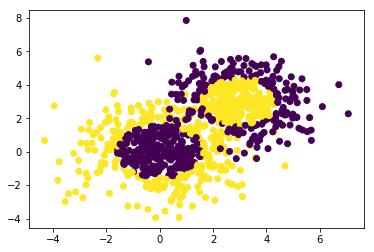
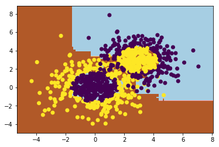

在集成学习原理小结中，我们讲到了集成学习按照个体学习器之间是否存在依赖关系可以分为两类，第一个是个体学习器之间存在强依赖关系，另一类是个体学习器之间不存在强依赖关系。前者的代表算法就是是boosting系列算法。在boosting系列算法中，Adaboost是最著名的算法之一。Adaboost既可以用作分类，也可以用作回归。本文就对Adaboost算法做一个总结。

# 回顾boosting算法的基本原理

在集成学习原理小结中，我们已经讲到了boosting算法系列的基本思想，如下图：


从图中可以看出，Boosting算法的工作机制是首先从训练集用初始权重训练出一个弱学习器1，根据弱学习器的学习误差率表现来更新训练样本的权重，**使得之前弱学习器1学习误差率高的训练样本点的权重变高**，使得这些误差率高的点在后面的弱学习器2中得到更多的重视。 

然后基于调整权重后的训练集来训练弱学习器2，如此重复进行，直到弱学习器数达到事先指定的数目$T$，最终将这$T$个弱学习器通过集合策略进行整合，得到最终的强学习器。　


不过有几个具体的问题Boosting算法没有详细说明。

1. 如何计算**学习误差率**$e$
2. 如何得到**弱学习器权重系数**$\alpha$
3. 如何更新**样本权重**$D$
4. 使用何种**结合策略**

只要是boosting大家族的算法，都要解决这4个问题。那么Adaboost是怎么解决的呢？


# Adaboost算法的基本思路

我们这里讲解Adaboost是如何解决上一节这4个问题的。

假设我们的训练集样本是:
$$
T=\{(x_1,y_1),(x_2,y_2),...,(x_m,y_m)\}
$$

训练集的在第$k$个弱学习器的输出样本初始权重为:
$$
D(k) = (w_{k1}, w_{k2}, ...w_{km}) ;\;\; w_{ki}=\frac{1}{m};\;\; i =1,2...m
$$

## Adaboost的分类问题

### 加权误差率

首先我们看看Adaboost的分类问题。

分类问题的误差率很好理解和计算。由于多元分类是二元分类的推广，这里假设我们是二元分类问题，输出为 {-1，1}，则第$k$个弱分类器$G_k(x)$在训练集上的**加权误差率**为:
$$
e_k = P(G_k(x_i) \neq y_i) = \sum\limits_{i=1}^{m}w_{ki}I(G_k(x_i) \neq y_i)
$$

这里注意分类错误率指的是被分类器分类错误的样本前面**权值相加的和**，不是分类错误样本比总样本。


### 分类器权重系数

接着我们看弱学习器权重系数,对于二元分类问题，第$k$个弱分类器$G_k(x)$的**权重系数**为:
$$
\alpha_k = \frac{1}{2}log\frac{1-e_k}{e_k}
$$
为什么这样计算弱学习器权重系数？从上式可以看出，**如果分类误差率$e_k$越大，则对应的弱分类器权重系数$\alpha_k$越小。也就是说，误差率小的弱分类器权重系数越大。**具体为什么采用这个权重系数公式，我们在讲Adaboost的损失函数优化时再讲。


### 样本权重系数

第三个问题，更新样本权重$D$。假设第$k$个弱分类器的样本集权重系数为$D(k) = (w_{k1}, w_{k2}, ...w_{km})$，则对应的第$k+1$个弱分类器的样本集权重系数为:
$$
w_{k+1,i} = \frac{w_{ki}}{Z_k}exp(-\alpha_ky_iG_k(x_i))  = \begin {cases} 
\frac{w_{ki}}{Z_k}exp(\alpha_k) & if \quad G_k(x_i) \neq y_i \\
\frac{w_{ki}}{Z_k}exp(-\alpha_k) & if \quad G_k(x_i) = y_i
\end {cases}
$$
这里$Z_k$是规范化因子:
$$
Z_k = \sum\limits_{i=1}^{m}w_{ki}exp(-\alpha_ky_iG_k(x_i))
$$

从$w_{k+1,i}$ 计算公式可以看出，**如果第$i$个样本分类错误，则$y_iG_k(x_i) < 0$，导致样本的权重在第$k+1$个弱分类器中增大，如果分类正确，则权重在第$k+1$个弱分类器中减少**。具体为什么采用样本权重更新公式，我们在讲Adaboost的损失函数优化时再讲。


### 集合策略

Adaboost分类采用的是加权表决法，最终的强分类器为

$$
f(x) = sign(\sum\limits_{k=1}^{K}\alpha_kG_k(x))
$$


## Adaboost的回归问题

由于Adaboost的回归问题有很多变种，这里我们以Adaboost R2算法为准。


### 误差率

​	我们先看看回归问题的误差率的问题，对于第$k$个弱学习器，计算他在训练集上的**最大误差**:
$$
E_k= max|y_i - G_k(x_i)|\;i=1,2...m
$$
​	然后计算每个样本的**相对误差**:
$$
e_{ki}= \frac{|y_i - G_k(x_i)|}{E_k}
$$

​	这里是误差损失为线性时的情况，如果我们用**平方误差**，则:
$$
e_{ki}= \frac{(y_i - G_k(x_i))^2}{E_k^2}
$$

如果我们用的是**指数误差**，则:
$$
e_{ki}= 1 - exp(\frac{-y_i + G_k(x_i)}{E_k})
$$


最终得到第$k$个弱学习器的**误差率**:
$$
e_k =  \sum\limits_{i=1}^{m}w_{ki}e_{ki}
$$


### 学习器权重系数

我们再来看看如何得到弱学习器权重系数$\alpha$。这里有：
$$
\alpha_k =\frac{e_k}{1-e_k}
$$


### 样本权重系数

对于更新样本权重$D$，第$k+1$个弱学习器的样本集权重系数为:
$$
w_{k+1,i} = \frac{w_{ki}}{Z_k}\alpha_k^{1-e_{ki}}
$$
这里$Z_k$是规范化因子:
$$
Z_k = \sum\limits_{i=1}^{m}w_{ki}\alpha_k^{1-e_{ki}}
$$


### 结合策略

和分类问题稍有不同，采用的是对加权的弱学习器取权重**中位数对应的弱学习器**作为强学习器的方法，最终的强回归器为：
$$
f(x) =G_{k^*}(x)
$$


其中，$G_{k^*}(x)$是所有$ln\frac{1}{\alpha_k}, k=1,2,....K$的中位数值对应序号$k^*$对应的弱学习器。


# AdaBoost分类问题的损失函数优化

刚才上一节我们讲到了分类Adaboost的弱学习器权重系数公式和样本权重更新公式。但是没有解释选择这个公式的原因，让人觉得是魔法公式一样。其实它可以从Adaboost的损失函数推导出来。 

从另一个角度讲，Adaboost是模型为加法模型，学习算法为前向分步学习算法，损失函数为指数函数的分类问题。 

模型为加法模型好理解，我们的最终的强分类器是若干个弱分类器加权平均而得到的。 

前向分步学习算法也好理解，我们的算法是通过一轮轮的弱学习器学习，利用前一个弱学习器的结果来更新后一个弱学习器的训练集权重。也就是说，第k-1轮的强学习器为
$$
f_{k-1}(x) = \sum\limits_{i=1}^{k-1}\alpha_iG_{i}(x)
$$
而第k轮的强学习器为:
$$
f_{k}(x) = \sum\limits_{i=1}^{k}\alpha_iG_{i}(x)
$$
上两式一比较可以得到：
$$
f_{k}(x) = f_{k-1}(x) + \alpha_kG_k(x)
$$
可见强学习器的确是通过前向分步学习算法一步步而得到的。

***

​	

Adaboost损失函数为**指数函数**，即定义损失函数为:
$$
\underbrace{arg\;min\;}_{\alpha, G} \sum\limits_{i=1}^{m}exp(-y_if_{k}(x))
$$
利用前向分步学习算法的关系可以得到损失函数为：
$$
(\alpha_k, G_k(x)) = \underbrace{arg\;min\;}_{\alpha, G}\sum\limits_{i=1}^{m}exp[(-y_i) (f_{k-1}(x) + \alpha G(x))]
$$
令$w_{ki}^{’} = exp(-y_if_{k-1}(x))$, 它的值不依赖于$\alpha, G$,因此与最小化无关，仅仅依赖于$f_{k-1}(x)$, 随着每一轮迭代而改变。

将这个式子带入损失函数, 损失函数转化为:
$$
(\alpha_k, G_k(x)) = \underbrace{arg\;min\;}_{\alpha, G}\sum\limits_{i=1}^{m}w_{ki}^{’}exp[-y_i\alpha G(x)]
$$
首先，我们求$G_k(x)$，可以得到:
$$
G_k(x) = \underbrace{arg\;min\;}_{G}\sum\limits_{i=1}^{m}w_{ki}^{’}I(y_i \neq G(x_i))
$$
将$G_k(x)$带入损失函数，并对$\alpha$求导，使其等于0:
$$
\begin{array} {1}
& \quad \sum_{i=1}^{N} w_{ki}^{’} \exp [-y_{i} \alpha G(x_{i})] \\

&=\sum_{i=1}^{N} w_{ki}^{’} e^{-\alpha} I\{y_{i}=G(x_{i})\}+\sum_{i=1}^{N} w_{ki}^{’} e^{\alpha} I\{y_{i} \neq G(x_{i})\} \\

& = e^{-\alpha} \sum_{i=1}^{N} w_{ki}^{’} I\{y_{i}=G(x_{i})\}+e^{\alpha} \sum_{i=1}^{N} w_{ki}^{’} I\{y_{i} \neq G(x_{i})\} + \\ 
& e^{-\alpha} \sum_{i=1}^{N} w_{ki}^{’} I\{y_{i} \neq G(x_{i})\} - e^{-\alpha} \sum_{i=1}^{N} w_{ki}^{’} I \{f_{i} \neq G(x_{i})\} \\

&=e^{-\alpha} \sum_{i=1}^{N} w_{ki}^{’}+\left(e^{\alpha}-e^{-\alpha}\right) \sum_{i=1}^{N} w_{k i}^{’} I\{y_{i} \neq G(x_{i})\}
\end{array}
$$
求导：
$$
\begin{array}{c}
\frac{\partial}{\partial \alpha}(e^{-\alpha} \sum_{i=1}^{N} w_{ki}^{’}+(e^{\alpha}-e^{-\alpha}) \sum_{i=1}^{N} w_{ki}^{’} I\{y_{i} \neq G(x_{i})\}) \\
=-e^{-\alpha} \sum_{i=1}^{N} w_{ki}^{’}+(e^{\alpha}+e^{-\alpha}) \sum_{i=1}^{N} w_{ki}^{’} I\{y_{i} \neq G(x_{i})\}=0
\end{array}
$$

$$
\frac{e^{\alpha}+e^{-\alpha}}{e^{-\alpha}}=\frac{\sum_{i=1}^{N} w_{ki}^{’}}{\sum_{i=1}^{N} w_{ki}^{’} I\{y_{i} \neq G(x_{i})\}} = \frac {1}{e_k}
$$

$$
\alpha = \frac{1}{2}log\frac{1-e_k}{e_k}
$$
其中，$e_k$即为我们前面的分类误差率。
$$
e_k = \frac{\sum\limits_{i=1}^{m}w_{ki}^{’}I(y_i \neq G(x_i))}{\sum\limits_{i=1}^{m}w_{ki}^{’}} = \sum\limits_{i=1}^{m}w_{ki}I(y_i \neq G(x_i))
$$
​	最后看样本权重的更新。利用$f_{k}(x) = f_{k-1}(x) + \alpha_kG_k(x)$ 和 $w_{ki}^{’} = exp(-y_if_{k-1}(x))$，即可得：
$$
w_{k+1,i}^{’} = w_{ki}^{’}exp[-y_i\alpha_kG_k(x)]
$$
​	这样就得到了我们第二节的样本权重更新公式。

***


# AdaBoost二元分类问题算法流程

这里我们对AdaBoost二元分类问题算法流程做一个总结。

- 输入为样本集$T=\{(x_,y_1),(x_2,y_2), ...(x_m,y_m)\}$，输出为{-1, +1}，弱分类器算法, 弱分类器迭代次数$K$。
- 输出为最终的强分类器$f(x)$

 1) 初始化样本集权重为
$$
D(1) = (w_{11}, w_{12}, ...w_{1m}) ;\;\; w_{1i}=\frac{1}{m};\;\; i =1,2...m
$$
 2) 对于$k=1,2，...K$:

a) 使用具有权重$D_k$的样本集来训练数据，得到弱分类器$G_k(x)$ 
b) 计算$G_k(x)$的分类误差率
$$
e_k = P(G_k(x_i) \neq y_i) = \sum\limits_{i=1}^{m}w_{ki}I(G_k(x_i) \neq y_i)
$$
c) 计算弱分类器的系数
$$
\alpha_k = \frac{1}{2}log\frac{1-e_k}{e_k}
$$
d) 更新样本集的权重分布
$$
w_{k+1,i} = \frac{w_{ki}}{Z_K}exp(-\alpha_ky_iG_k(x_i)) \;\; i =1,2,...m
$$
这里$Z_k$是规范化因子
$$
Z_k = \sum\limits_{i=1}^{m}w_{ki}exp(-\alpha_ky_iG_k(x_i))
$$

 3) 构建最终分类器为：
$$
f(x) = sign(\sum\limits_{k=1}^{K}\alpha_kG_k(x))
$$

 对于Adaboost多元分类算法，其实原理和二元分类类似，最主要区别在弱分类器的系数上。比如Adaboost SAMME算法，它的弱分类器的系数
$$
\alpha_k = \frac{1}{2}log\frac{1-e_k}{e_k} + log(R-1)
$$
 其中R为类别数。从上式可以看出，如果是二元分类，R=2，则上式和我们的二元分类算法中的弱分类器的系数一致。

---


# Adaboost回归问题的算法流程

 这里我们对AdaBoost回归问题算法流程做一个总结。AdaBoost回归算法变种很多，下面的算法为Adaboost R2回归算法过程。

- 输入为样本集$T=\{(x_,y_1),(x_2,y_2), ...(x_m,y_m)\}$，弱学习器算法, 弱学习器迭代次数$K$。
- 输出为最终的强学习器$f(x)$

  

1) 初始化样本集权重为
$$
D(1) = (w_{11}, w_{12}, ...w_{1m}) ;\;\; w_{1i}=\frac{1}{m};\;\; i =1,2...m
$$

2) 对于$k=1,2，...K$:

a) 使用具有权重$D_k$的样本集来训练数据，得到弱学习器$G_k(x)$ 

b) 计算训练集上的最大误差
$$
E_k= max|y_i - G_k(x_i)|\;i=1,2...m
$$

c) 计算每个样本的相对误差:

如果是线性误差，则$e_{ki}= \frac{|y_i - G_k(x_i)|}{E_k}$；
如果是平方误差，则$e_{ki}= \frac{(y_i - G_k(x_i))^2}{E_k^2}$ 
如果是指数误差，则$e_{ki}= 1 - exp（\frac{-|y_i -G_k(x_i)|}{E_k}）$

d) 计算回归误差率
$$
e_k =  \sum\limits_{i=1}^{m}w_{ki}e_{ki}
$$
e) 计算弱学习器的系数
$$
\alpha_k =\frac{e_k}{1-e_k}
$$

f) 更新样本集的权重分布为
$$
w_{k+1,i} = \frac{w_{ki}}{Z_k}\alpha_k^{1-e_{ki}}
$$
这里$Z_k$是规范化因子
$$
Z_k = \sum\limits_{i=1}^{m}w_{ki}\alpha_k^{1-e_{ki}}
$$

3) 构建最终强学习器为：
$$
f(x) =G_{k^*}(x)
$$
其中，$G_{k^*}(x)$是所有$G_{k^*}(x)$的中位数值对应序号$k^*$对应的弱学习器。

---


# Adaboost算法的正则化

为了防止Adaboost过拟合，我们通常也会加入正则化项，这个正则化项我们通常称为步长(learning rate)。定义为$\nu$,对于前面的弱学习器的迭代
$$
f_{k}(x) = f_{k-1}(x) + \alpha_kG_k(x)
$$
如果我们加上了正则化项，则有
$$
f_{k}(x) = f_{k-1}(x) + \nu\alpha_kG_k(x)
$$

$\nu$的取值范围为$0 < \nu \leq 1$。对于同样的训练集学习效果，较小的$\nu$意味着我们需要更多的弱学习器的迭代次数。通常我们用步长和迭代最大次数一起来决定算法的拟合效果。


# Adaboost小结

到这里Adaboost就写完了，前面有一个没有提到，就是弱学习器的类型。理论上任何学习器都可以用于Adaboost。但一般来说，使用最广泛的Adaboost弱学习器是决策树和神经网络。对于决策树，Adaboost分类用了CART分类树，而Adaboost回归用了CART回归树。


>Adaboost的主要优点有：

1）Adaboost作为分类器时，分类精度很高。

2）在Adaboost的框架下，可以使用各种回归分类模型来构建弱学习器，非常灵活。

3）作为简单的二元分类器时，构造简单，结果可理解。

4）不容易发生过拟合。


>Adaboost的主要缺点有：

1）**对异常样本敏感**，异常样本在迭代中可能会获得较高的权重，影响最终的强学习器的预测准确性。


# Adaboost类库概述

scikit-learn中Adaboost类库比较直接，就是AdaBoostClassifier和AdaBoostRegressor两个，从名字就可以看出AdaBoostClassifier用于分类，AdaBoostRegressor用于回归。

AdaBoostClassifier使用了两种Adaboost分类算法的实现，SAMME和SAMME.R。而AdaBoostRegressor则使用了我们原理篇里讲到的Adaboost回归算法的实现，即Adaboost.R2。

当我们对Adaboost调参时，主要要对两部分内容进行调参，第一部分是对我们的Adaboost的框架进行调参， 第二部分是对我们选择的弱分类器进行调参。两者相辅相成。下面就对Adaboost的两个类：AdaBoostClassifier和AdaBoostRegressor从这两部分做一个介绍。


## AdaBoostClassifier和AdaBoostRegressor框架参数

> base_estimator

- base_estimator：AdaBoostClassifier和AdaBoostRegressor都有，即我们的弱分类学习器或者弱回归学习器。理论上可以选择任何一个分类或者回归学习器，不过需要支持样本权重。我们常用的一般是CART决策树或者神经网络MLP。  
- 默认是决策树，即AdaBoostClassifier默认使用CART分类树DecisionTreeClassifier，而AdaBoostRegressor默认使用CART回归树DecisionTreeRegressor。   
- 另外有一个要注意的点是，如果我们选择的AdaBoostClassifier算法是SAMME.R，则我们的弱分类学习器还需要支持概率预测，也就是在scikit-learn中弱分类学习器对应的预测方法除了predict还需要有predict_proba。


> algorithm

- algorithm：这个参数只有AdaBoostClassifier有。  
- 主要原因是scikit-learn实现了两种Adaboost分类算法，SAMME和SAMME.R。两者的主要区别是弱学习器权重的度量，SAMME使用了和我们的原理篇里二元分类Adaboost算法的扩展，即用对样本集分类效果作为弱学习器权重，而SAMME.R使用了对样本集分类的预测概率大小来作为弱学习器权重。  
- 由于SAMME.R使用了概率度量的连续值，迭代一般比SAMME快，因此AdaBoostClassifier的默认算法algorithm的值也是SAMME.R。  
- 我们一般使用默认的SAMME.R就够了，但是要注意的是使用了SAMME.R， 则弱分类学习器参数base_estimator必须限制使用支持概率预测的分类器。SAMME算法则没有这个限制。


> loss

- loss：这个参数只有AdaBoostRegressor有，Adaboost.R2算法需要用到。
- 有线性'linear', 平方'square'和指数 'exponential'三种选择,
- 默认是线性，一般使用线性就足够了，除非你怀疑这个参数导致拟合程度不好。这个值的意义在原理篇我们也讲到了，它对应了我们对第k个弱分类器的中第i个样本的误差的处理，
  - 即：如果是线性误差，则$e_{ki}= \frac{|y_i - G_k(x_i)|}{E_k}$；
  - 如果是平方误差，则$e_{ki}= \frac{(y_i - G_k(x_i))^2}{E_k^2}$，
  - 如果是指数误差，则$e_{ki}= 1 - exp（\frac{-y_i + G_k(x_i))}{E_k}）$， 

   $E_k$为训练集上的最大误差$E_k= max|y_i - G_k(x_i)|\;i=1,2...m$
  
  

> n_estimators

- n_estimators： AdaBoostClassifier和AdaBoostRegressor都有，就是我们的弱学习器的**最大迭代次数**，或者说最大的**弱学习器的个数**。
- 一般来说n_estimators太小，容易欠拟合，n_estimators太大，又容易过拟合，一般选择一个适中的数值。
- 默认是50。在实际调参的过程中，我们常常将n_estimators和下面介绍的参数learning_rate一起考虑。


> learning_rate

- learning_rate:AdaBoostClassifier和AdaBoostRegressor都有，即每个弱学习器的权重缩减系数$\nu$，在原理篇的正则化章节我们也讲到了，加上了正则化项，我们的强学习器的迭代公式为$f_{k}(x) = f_{k-1}(x) + \nu\alpha_kG_k(x)$。$\nu$的取值范围为$0 < \nu \leq 1$。  
- 对于同样的训练集拟合效果，较小的$\nu$意味着我们需要更多的弱学习器的迭代次数。通常我们用步长和迭代最大次数一起来决定算法的拟合效果。所以这两个参数n_estimators和learning_rate要一起调参。一般来说，可以从一个小一点的$\nu$开始调参，默认是1。


## AdaBoostClassifier和AdaBoostRegressor弱学习器参数

这里我们再讨论下AdaBoostClassifier和AdaBoostRegressor弱学习器参数，由于使用不同的弱学习器，则对应的弱学习器参数各不相同。这里我们仅仅讨论默认的决策树弱学习器的参数。即CART分类树DecisionTreeClassifier和CART回归树DecisionTreeRegressor。

DecisionTreeClassifier和DecisionTreeRegressor的参数基本类似，在scikit-learn决策树算法类库使用小结这篇文章中我们对这两个类的参数做了详细的解释。这里我们只拿出调参数时需要尤其注意的最重要几个的参数再拿出来说一遍：


> 划分时考虑的最大特征数max_features

- 默认是"None", 味着划分时考虑所有的特征数；
- 如果是"log2"意味着划分时最多考虑$log_2N$个特征；
- 如果是"sqrt"或者"auto"意味着划分时最多考虑$\sqrt{N}$个特征。
- 如果是整数，代表考虑的特征绝对数。
- 如果是浮点数，代表考虑特征百分比，即考虑（百分比xN）取整后的特征数。其中N为样本总特征数。

一般来说，如果样本特征数不多，比如小于50，我们用默认的"None"就可以了，如果特征数非常多，我们可以灵活使用刚才描述的其他取值来控制划分时考虑的最大特征数，以控制决策树的生成时间。


> 决策树最大深max_depth

默认可以不输入，如果不输入的话，决策树在建立子树的时候不会限制子树的深度。

一般来说，数据少或者特征少的时候可以不管这个值。

如果模型样本量多，特征也多的情况下，推荐限制这个最大深度，具体的取值取决于数据的分布。常用的可以取值10-100之间。


> 内部节点再划分所需最小样本数min_samples_split

这个值限制了子树继续划分的条件，如果某节点的样本数少于min_samples_split，则不会继续再尝试选择最优特征来进行划分。 默认是2.

如果样本量不大，不需要管这个值。如果样本量数量级非常大，则推荐增大这个值。


> 叶子节点最少样本数min_samples_leaf

这个值限制了叶子节点最少的样本数，如果某叶子节点数目小于样本数，则会和兄弟节点一起被剪枝。 默认是1,可以输入最少的样本数的整数，或者最少样本数占样本总数的百分比。

如果样本量不大，不需要管这个值。

如果样本量数量级非常大，则推荐增大这个值。


> 叶子节点最小的样本权重和min_weight_fraction_leaf

这个值限制了叶子节点所有样本权重和的最小值，如果小于这个值，则会和兄弟节点一起被剪枝。 默认是0，就是不考虑权重问题。

一般来说，如果我们有较多样本有缺失值，或者分类树样本的分布类别偏差很大，就会引入样本权重，这时我们就要注意这个值了。


> 最大叶子节点数max_leaf_nodes

通过限制最大叶子节点数，可以防止过拟合，默认是"None”，即不限制最大的叶子节点数。

如果加了限制，算法会建立在最大叶子节点数内最优的决策树。

如果特征不多，可以不考虑这个值，但是如果特征分成多的话，可以加以限制，具体的值可以通过交叉验证得到。


# AdaBoostClassifier实战


```python
import numpy as np
import matplotlib.pyplot as plt
%matplotlib inline
from sklearn.ensemble import AdaBoostClassifier
from sklearn.tree import DecisionTreeClassifier
from sklearn.datasets import make_gaussian_quantiles
```


```python
# 生成2维正态分布，生成的数据按分位数分为两类，500个样本,2个样本特征，协方差系数为2
X1, y1 = make_gaussian_quantiles(cov=2.0,n_samples=500, n_features=2,n_classes=2, random_state=1)
# 生成2维正态分布，生成的数据按分位数分为两类，400个样本,2个样本特征均值都为3，协方差系数为2
X2, y2 = make_gaussian_quantiles(mean=(3, 3), cov=1.5,n_samples=400, n_features=2, n_classes=2, random_state=1)
#讲两组数据合成一组数据
X = np.concatenate((X1, X2))
y = np.concatenate((y1, - y2 + 1))
```


```python
plt.scatter(X[:, 0], X[:, 1], marker='o', c=y)
```




可以看到数据有些混杂，我们现在用基于决策树的Adaboost来做分类拟合。

这里我们选择了SAMME算法，最多200个弱分类器，步长0.8，在实际运用中你可能需要通过交叉验证调参而选择最好的参数。拟合完了后，我们用网格图来看看它拟合的区域。


```python
bdt = AdaBoostClassifier(DecisionTreeClassifier(max_depth=2, min_samples_split=20, min_samples_leaf=5),
                         algorithm="SAMME",
                         n_estimators=200, learning_rate=0.8)
bdt.fit(X, y)
```


    AdaBoostClassifier(algorithm='SAMME',
              base_estimator=DecisionTreeClassifier(class_weight=None, criterion='gini', max_depth=2,
                max_features=None, max_leaf_nodes=None,
                min_impurity_decrease=0.0, min_impurity_split=None,
                min_samples_leaf=5, min_samples_split=20,
                min_weight_fraction_leaf=0.0, presort=False, random_state=None,
                splitter='best'),
              learning_rate=0.8, n_estimators=200, random_state=None)


```python
x_min, x_max = X[:, 0].min() - 1, X[:, 0].max() + 1
y_min, y_max = X[:, 1].min() - 1, X[:, 1].max() + 1
xx, yy = np.meshgrid(np.arange(x_min, x_max, 0.02),
                     np.arange(y_min, y_max, 0.02))

Z = bdt.predict(np.c_[xx.ravel(), yy.ravel()])
Z = Z.reshape(xx.shape)
cs = plt.contourf(xx, yy, Z, cmap=plt.cm.Paired)
plt.scatter(X[:, 0], X[:, 1], marker='o', c=y)
plt.show()
```





```python
print("Score:", bdt.score(X,y))
```

    Score: 0.9133333333333333


现在我们将最大弱分离器个数从200增加到300。再来看看拟合分数。


```python
bdt = AdaBoostClassifier(DecisionTreeClassifier(max_depth=2, min_samples_split=20, min_samples_leaf=5),
                         algorithm="SAMME",
                         n_estimators=300, learning_rate=0.8)
bdt.fit(X, y)
print("Score:", bdt.score(X, y))
```

    Score: 0.9622222222222222


这印证了我们前面讲的，弱分离器个数越多，则拟合程度越好，当然也越容易过拟合。

现在我们降低步长，将步长从上面的0.8减少到0.5，再来看看拟合分数。


```python
bdt = AdaBoostClassifier(DecisionTreeClassifier(max_depth=2, min_samples_split=20, min_samples_leaf=5),
                         algorithm="SAMME",
                         n_estimators=300, learning_rate=0.5)
bdt.fit(X, y)
print("Score:", bdt.score(X,y))
```

    Score: 0.8944444444444445


可见在同样的弱分类器的个数情况下，如果减少步长，拟合效果会下降。

最后我们看看当弱分类器个数为700，步长为0.7时候的情况：


```python
bdt = AdaBoostClassifier(DecisionTreeClassifier(max_depth=2, min_samples_split=20, min_samples_leaf=5),
                         algorithm="SAMME",
                         n_estimators=600, learning_rate=0.7)
bdt.fit(X, y)
print("Score:", bdt.score(X,y))
```

    Score: 0.9611111111111111


此时的拟合分数和我们最初的300弱分类器，0.8步长的拟合程度相当。  

也就是说，在我们这个例子中，如果步长从0.8降到0.7，则弱分类器个数要从300增加到700才能达到类似的拟合效果。


# 参考资料

1. https://blog.csdn.net/u014106644/article/details/83718705
2. https://zhuanlan.zhihu.com/p/39972832
3. https://blog.csdn.net/l1078530758/article/details/88929411


# 答题

1. 说一下Adaboost，权值更新公式。当弱分类器是Gm时，每个样本的的权重是w1，w2…，请写出最终的决策公式。

> http://www.360doc.com/content/14/1109/12/20290918_423780183.shtml


