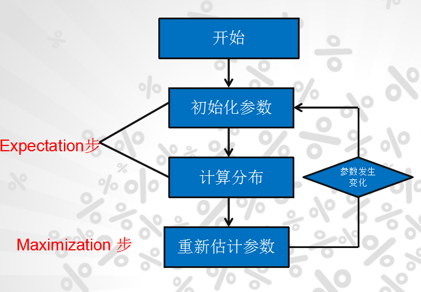

EM算法

EM算法也称**期望最大化**（Expectation-Maximum, 简称EM）算法，它是一个基础算法，是很多机器学习领域算法的基础，比如隐式马尔科夫算法（HMM）， LDA主题模型的变分推断等等。

# EM算法要解决的问题

我们经常会从样本观察数据中，找出样本的模型参数。 最常用的方法就是**极大化模型分布的对数似然函数**。

但是在一些情况下，我们得到的观察数据有未观察到的隐含数据，此时我们未知的有隐含数据和模型参数，因而无法直接用极大化对数似然函数得到模型分布的参数。怎么办呢？这就是EM算法可以派上用场的地方了。

EM算法解决这个的思路是使用**启发式的迭代方法**，既然我们无法直接求出模型分布参数，那么我们可以**先猜想隐含数据（EM算法的E步），接着基于观察数据和猜测的隐含数据一起来极大化对数似然**，求解我们的模型参数（EM算法的M步)。由于我们之前的隐藏数据是猜测的，所以此时得到的模型参数一般还不是我们想要的结果。不过没关系，我们基于当前得到的模型参数，继续猜测隐含数据（EM算法的E步），然后继续极大化对数似然，求解我们的模型参数（EM算法的M步)。以此类推，不断的迭代下去，**直到模型分布参数基本无变化，算法收敛，找到合适的模型参数**。

从上面的描述可`以看出，EM算法是迭代求解最大值的算法，同时算法在每一次迭代时分为两步，E步和M步。一轮轮迭代更新隐含数据和模型分布参数，直到收敛，即得到我们需要的模型`参数。

一个最直观了解EM算法思路的是K-Means算法，见之前写的K-Means聚类算法原理。在K-Means聚类时，每个聚类簇的质心是隐含数据。我们会假设K个初始化质心，即EM算法的E步；然后计算得到每个样本最近的质心，并把样本聚类到最近的这个质心，即EM算法的M步。重复这个E步和M步，直到质心不再变化为止，这样就完成了K-Means聚类。

当然，K-Means算法是比较简单的，实际中的问题往往没有这么简单。上面对EM算法的描述还很粗糙，我们需要用数学的语言精准描述。

# EM算法的推导

对于$m$个样本观察数据$x=(x^{(1)},x^{(2)},...x^{(m)})$中，找出样本的模型参数$\theta$, 极大化模型分布的对数似然函数如下：
$$
\theta = arg \max \limits_{\theta}\sum\limits_{i=1}^m logP(x^{(i)};\theta)
$$

如果我们得到的观察数据有未观察到的隐含数据$z=(z^{(1)},z^{(2)},...z^{(m)})$，此时我们的极大化模型分布的对数似然函数如下：
$$
\theta = arg \max \limits_{\theta}\sum\limits_{i=1}^m logP(x^{(i)};\theta) = arg \max \limits_{\theta}\sum\limits_{i=1}^m log\sum\limits_{z^{(i)}}P(x^{(i)}， z^{(i)};\theta)
$$

> **例如：**观察数据 $x=(x^{(1)},x^{(2)},...x^{(m)})$ 为客户身高数据，而未观察到的隐含数据$z=(z^{(1)},z^{(2)},...z^{(m)})$可以理解为每个客户所属省份。注意这个$m$不是前面的$m$，后面的$i$也不是前面的$i$。
>
> 引入了一个未知的新的分布$Q_i(z^{(i)})$，即隐含数据$z$的概率。

上面这个式子是没有办法直接求出$\theta$的。因此需要一些特殊的技巧，我们首先对这个式子进行缩放如下：
$$
\begin{align} \sum\limits_{i=1}^m log\sum\limits_{z^{(i)}}P(x^{(i)}， z^{(i)};\theta)   & = \sum\limits_{i=1}^m log\sum\limits_{z^{(i)}}Q_i(z^{(i)})\frac{P(x^{(i)}， z^{(i)};\theta)}{Q_i(z^{(i)})} \\ & \geq  \sum\limits_{i=1}^m \sum\limits_{z^{(i)}}Q_i(z^{(i)})log\frac{P(x^{(i)}， z^{(i)};\theta)}{Q_i(z^{(i)})} \end{align}
$$
上面第(3)式引入了一个未知的新的分布$Q_i(z^{(i)})$，第(4)式用到了**Jensen不等式**：
$$
log\sum\limits_j\lambda_jy_j \geq \sum\limits_j\lambda_jlogy_j\;\;,  \lambda_j \geq 0, \sum\limits_j\lambda_j =1
$$

或者说由于对数函数是凹函数，所以有：
$$
f(E(x)) \geq E(f(x))\;\; 如果f(x) 是凹函数
$$

**此时如果要满足Jensen不等式的等号**，则有：
$$
\frac{P(x^{(i)}， z^{(i)};\theta)}{Q_i(z^{(i)})} =c, c为常数
$$

由于$Q_i(z^{(i)})$是一个分布，所以满足：
$$
\sum\limits_{z}Q_i(z^{(i)}) = \sum\limits_{z}\frac{P(x^{(i)}， z^{(i)};\theta)}{c} =1
$$

从上面两式，我们可以得到：
$$
\begin{align}
Q_i(z^{(i)})  &= \frac{P(x^{(i)}， z^{(i)};\theta)}{c} 
= \frac{P(x^{(i)}， z^{(i)};\theta)}{\sum\limits_{z}P(x^{(i)}， z^{(i)};\theta)} 
=  \frac{P(x^{(i)}， z^{(i)};\theta)}{P(x^{(i)};\theta)} 
= P( z^{(i)}|x^{(i)};\theta)) 
\end{align}
$$

如果$Q_i(z^{(i)}) = P( z^{(i)}|x^{(i)};\theta))$, 则第(4)式是我们的包含隐藏数据的对数似然的一个下界。

> 横坐标是参数，纵坐标是似然函数，首先我们初始化一个$θ1$，根据它求似然函数一个紧的下界，也就是图中第一条黑短线，黑短线上的值虽然都小于似然函数的值，但至少有一点可以满足等号（所以称为紧下界），最大化小黑短线我们就hit到至少与似然函数刚好相等的位置，对应的横坐标就是我们的新的$θ2$，如此进行，只要保证随着$θ$的更新，每次最大化的小黑短线值都比上次的更大，那么算法收敛，最后就能最大化到似然函数的极大值处。

如果我们能极大化这个下界，则也在尝试极大化我们的对数似然。即我们需要最大化下式：
$$
arg \max \limits_{\theta} \sum\limits_{i=1}^m \sum\limits_{z^{(i)}}Q_i(z^{(i)})log\frac{P(x^{(i)}， z^{(i)};\theta)}{Q_i(z^{(i)})}
$$

去掉上式中为常数的部分，则我们需要极大化的对数似然下界为：
$$
arg \max \limits_{\theta} \sum\limits_{i=1}^m \sum\limits_{z^{(i)}}Q_i(z^{(i)})log{P(x^{(i)}, z^{(i)};\theta)}
$$

上式也就是我们的EM算法的M步，那E步呢？注意到上式中$Q_i(z^{(i)})$是一个分布，**因此$\sum\limits_{z^{(i)}}Q_i(z^{(i)})log{P(x^{(i)}， z^{(i)};\theta)}$可以理解为$logP(x^{(i)}， z^{(i)};\theta)$基于条件概率分布$Q_i(z^{(i)})$的`期望`**。

至此，我们理解了EM算法中E步和M步的具体数学含义。

# EM算法流程

现在我们总结下EM算法的流程。

`输入`：观察数据$x=(x^{(1)},x^{(2)},...x^{(m)})$，联合分布$p(x,z ;\theta)$, 条件分布$p(z|x; \theta)$, 最大迭代次数$J$。

1)   随机初始化模型参数$\theta$的初值$\theta^{0}$。

2） for j  from 1 to J 开始EM算法迭代：

a) **E步**：计算联合分布的条件概率期望：
$$
Q_i(z^{(i)}) = P( z^{(i)}|x^{(i)}，\theta^{j})
$$

$$
L(\theta, \theta^{j}) = \sum\limits_{i=1}^m\sum\limits_{z^{(i)}}Q_i(z^{(i)})log{P(x^{(i)}， z^{(i)};\theta)}
$$

b) **M步**：极大化$L(\theta, \theta^{j})$,得到$\theta^{j+1}$:
$$
\theta^{j+1} = arg \max \limits_{\theta}L(\theta, \theta^{j})
$$

c) 如果$\theta^{j+1}$已收敛，则算法结束。否则继续回到步骤 a) 进行 E步 迭代。

`输出`：模型参数$\theta$。

# EM算法的收敛性思考

EM算法的流程并不复杂，但是还有两个问题需要我们思考：

1） EM算法能保证收敛吗？

2） EM算法如果收敛，那么能保证收敛到全局最大值吗？

首先我们来看第一个问题, EM算法的收敛性。要证明EM算法收敛，则我们需要证明我们的对数似然函数的值在迭代的过程中一直在增大。即：
$$
\sum\limits_{i=1}^m logP(x^{(i)};\theta^{j+1}) \geq \sum\limits_{i=1}^m logP(x^{(i)};\theta^{j})
$$

由于
$$
L(\theta, \theta^{j}) = \sum\limits_{i=1}^m\sum\limits_{z^{(i)}}P( z^{(i)}|x^{(i)};\theta^{j})log{P(x^{(i)}， z^{(i)};\theta)}
$$

令：
$$
H(\theta, \theta^{j}) =  \sum\limits_{i=1}^m\sum\limits_{z^{(i)}}P( z^{(i)}|x^{(i)};\theta^{j})log{P( z^{(i)}|x^{(i)};\theta)}
$$

上两式相减得到：
$$
\sum\limits_{i=1}^m logP(x^{(i)};\theta) = L(\theta, \theta^{j}) - H(\theta, \theta^{j})
$$

在上式中分别取$\theta$为$\theta^j$和$\theta^{j+1}$，并相减得到：
$$
\sum\limits_{i=1}^m logP(x^{(i)};\theta^{j+1})  - \sum\limits_{i=1}^m logP(x^{(i)};\theta^{j}) = [L(\theta^{j+1}, \theta^{j}) - L(\theta^{j}, \theta^{j}) ] -[H(\theta^{j+1}, \theta^{j}) - H(\theta^{j}, \theta^{j}) ]
$$

要证明EM算法的收敛性，我们只需要证明上式的右边是非负的即可。

由于$\theta^{j+1}$使得$L(\theta, \theta^{j})$极大，因此有:
$$
L(\theta^{j+1}, \theta^{j}) - L(\theta^{j}, \theta^{j})  \geq 0
$$

而对于第二部分，我们有：
$$\begin{align} H(\theta^{j+1}, \theta^{j}) - H(\theta^{j}, \theta^{j})  & = \sum\limits_{i=1}^m\sum\limits_{z^{(i)}}P( z^{(i)}|x^{(i)};\theta^{j})log\frac{P( z^{(i)}|x^{(i)};\theta^{j+1})}{P( z^{(i)}|x^{(i)};\theta^j)} \\ & \leq  \sum\limits_{i=1}^mlog(\sum\limits_{z^{(i)}}P( z^{(i)}|x^{(i)};\theta^{j})\frac{P( z^{(i)}|x^{(i)};\theta^{j+1})}{P( z^{(i)}|x^{(i)};\theta^j)}) \\ & = \sum\limits_{i=1}^mlog(\sum\limits_{z^{(i)}}P( z^{(i)}|x^{(i)};\theta^{j+1})) = 0  \end{align}$$

其中第（25）式用到了Jensen不等式，只不过和第二节的使用相反而已，第（26）式用到了概率分布累积为1的性质。

至此，我们得到了：$\sum\limits_{i=1}^m logP(x^{(i)};\theta^{j+1})  - \sum\limits_{i=1}^m logP(x^{(i)};\theta^{j})  \geq 0$, 证明了EM算法的收敛性。

从上面的推导可以看出，**EM算法可以保证收敛到一个稳定点，但是却不能保证收敛到全局的极大值点，因此它是局部最优的算法，当然，如果我们的优化目标$L(\theta, \theta^{j})$是凸的，则EM算法可以保证收敛到全局最大值**，这点和梯度下降法这样的迭代算法相同。至此我们也回答了上面提到的第二个问题。

# EM算法的一些思考

如果我们从算法思想的角度来思考EM算法，我们可以发现我们的算法里**已知的是观察数据，未知的是隐含数据和模型参数，在E步，我们所做的事情是固定模型参数的值，优化隐含数据的分布，而在M步，我们所做的事情是固定隐含数据分布，优化模型参数的值**。比较下其他的机器学习算法，其实很多算法都有类似的思想。比如SMO算法，坐标轴下降法(Lasso回归算法： 坐标轴下降法与最小角回归法小结), 都使用了类似的思想来求解问题。

大家也可以去比较下这些算法的优化方法，看思路上是不是有共同之处。

# 资料

1. [刘建平](https://www.cnblogs.com/pinard/p/6912636.html)

2. [[EM算法详细推导和讲解](https://www.cnblogs.com/bigmoyan/p/4550375.html)](https://www.cnblogs.com/bigmoyan/p/4550375.html)

# 试题

## EM算法、HMM、CRF

这三个放在一起不是很恰当，但是有互相有关联，所以就放在这里一起说了。注意重点关注算法的思想。

1. EM算法

EM算法是用于**含有隐变量模型的极大似然估计或者极大后验估计**，有两步组成：E步，求期望（expectation）；M步，求极大（maxmization）。本质上EM算法还是一个迭代算法，通过不断用上一代参数对隐变量的估计来对当前变量进行计算，直到收敛。

注意：EM算法是对初值敏感的，而且EM是不断求解下界的极大化逼近求解对数似然函数的极大化的算法，也就是说EM算法不能保证找到全局最优值。对于EM的导出方法也应该掌握。

2. HMM算法

隐马尔可夫模型是用于标注问题的生成模型。有几个参数（π，A，B）：初始状态概率向量π，状态转移矩阵A，观测概率矩阵B。称为马尔科夫模型的三要素。

马尔科夫三个基本问题：

- **概率计算问题**：给定模型和观测序列，计算模型下观测序列输出的概率。–》前向后向算法
- **学习问题**：已知观测序列，估计模型参数，即用极大似然估计来估计参数。–》Baum-Welch(也就是EM算法)和极大似然估计。
- **预测问题**：已知模型和观测序列，求解对应的状态序列。–》近似算法（贪心算法）和维比特算法（动态规划求最优路径）

3. 条件随机场CRF

**给定一组输入随机变量的条件下另一组输出随机变量的条件概率分布密度**。条件随机场假设输出变量构成马尔科夫随机场，而我们平时看到的大多是线性链条随机场，也就是由输入对输出进行预测的判别模型。求解方法为极大似然估计或正则化的极大似然估计。

之所以总把HMM和CRF进行比较，主要是因为CRF和HMM都利用了图的知识，但是CRF利用的是马尔科夫随机场（无向图），而HMM的基础是贝叶斯网络（有向图）。而且CRF也有：概率计算问题、学习问题和预测问题。大致计算方法和HMM类似，只不过不需要EM算法进行学习问题。

4. HMM和CRF对比

其根本还是在于基本的理念不同，一个是生成模型，一个是判别模型，这也就导致了求解方式的不同。