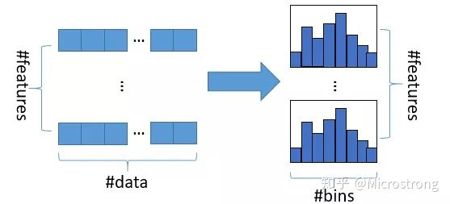
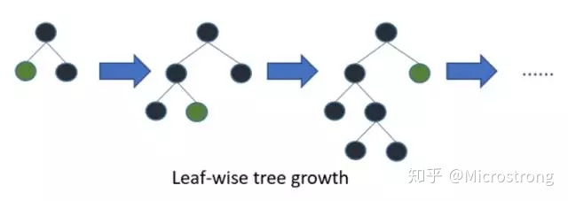
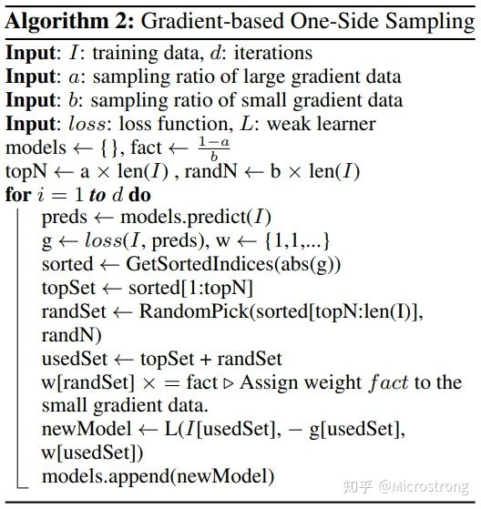
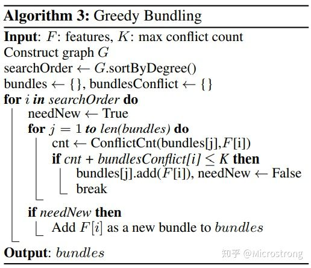
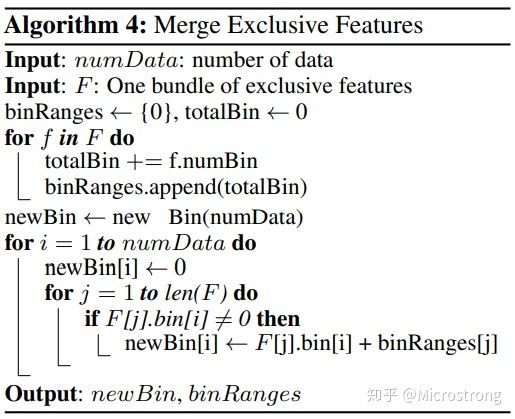
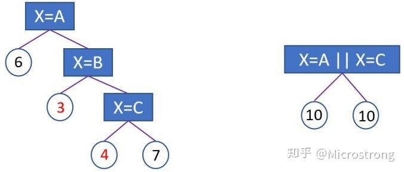
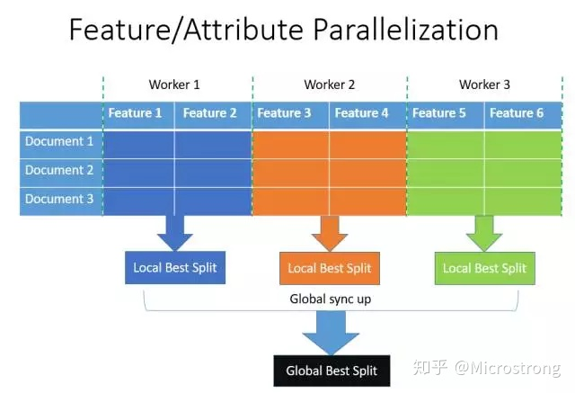
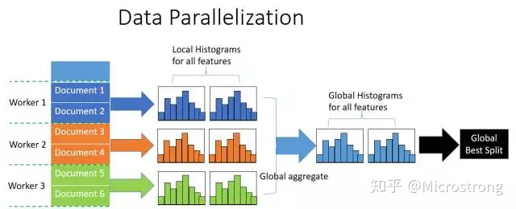
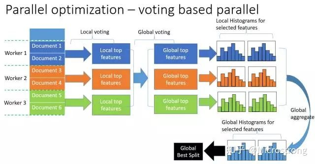
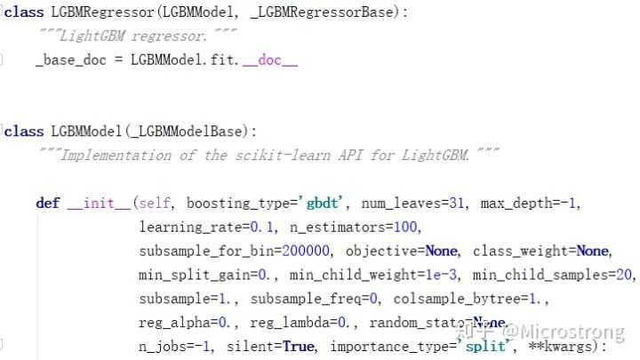

# LightGBM简介

GBDT (Gradient Boosting Decision Tree) 是机器学习中一个长盛不衰的模型，其主要思想是利用弱分类器（决策树）迭代训练以得到最优模型，该模型具有训练效果好、不易过拟合等优点。GBDT不仅在工业界应用广泛，通常被用于多分类、点击率预测、搜索排序等任务；在各种数据挖掘竞赛中也是致命武器，据统计Kaggle上的比赛有一半以上的冠军方案都是基于GBDT。而**LightGBM（Light Gradient Boosting Machine）是一个实现GBDT算法的框架，支持高效率的并行训练，并且具有更快的训练速度、更低的内存消耗、更好的准确率、支持分布式可以快速处理海量数据等优点**。

## LightGBM提出的动机

常用的机器学习算法，例如神经网络等算法，都可以以mini-batch的方式训练，训练数据的大小不会受到内存限制。而GBDT在每一次迭代的时候，都需要遍历整个训练数据多次。如果把整个训练数据装进内存则会限制训练数据的大小；如果不装进内存，反复地读写训练数据又会消耗非常大的时间。尤其面对工业级海量的数据，普通的GBDT算法是不能满足其需求的。

LightGBM提出的主要原因就是为了解决GBDT在海量数据遇到的问题，让GBDT可以更好更快地用于工业实践。

## XGBoost的缺点及LightGBM的优化

**（1）XGBoost的缺点**

在LightGBM提出之前，最有名的GBDT工具就是XGBoost了，它是基于预排序方法的决策树算法。这种构建决策树的算法基本思想是：**首先，对所有特征都按照特征的数值进行`预排序`。其次，在遍历分割点的时候用O(#data)的代价找到一个特征上的最好分割点。最后，在找到一个特征的最好分割点后，将数据分裂成左右子节点**。

这样的预排序算法的优点是能精确地找到分割点。但是缺点也很明显：

1. 首先，**空间消耗大**。这样的算法需要保存数据的特征值，还保存了特征排序的结果（例如，为了后续快速的计算分割点，保存了排序后的索引），这就需要消耗训练数据两倍的内存。
2. 其次，**时间上也有较大的开销**，在遍历每一个分割点的时候，都需要进行分裂增益的计算，消耗的代价大。
3. 最后，**对cache优化不友好**。在预排序后，特征对梯度的访问是一种随机访问，并且不同的特征访问的顺序不一样，无法对cache进行优化。同时，在每一层长树的时候，需要随机访问一个行索引到叶子索引的数组，并且不同特征访问的顺序也不一样，也会造成较大的cache miss。


**（2）LightGBM的优化**

为了避免上述XGBoost的缺陷，并且能够在不损害准确率的条件下加快GBDT模型的训练速度，lightGBM在传统的GBDT算法上进行了如下优化：

1. 基于**Histogram**的决策树算法。
2. **单边梯度采样** Gradient-based One-Side Sampling(GOSS)：使用GOSS可以减少大量只具有小梯度的数据实例，这样在计算信息增益的时候只利用剩下的具有高梯度的数据就可以了，相比XGBoost遍历所有特征值节省了不少时间和空间上的开销。
3. **互斥特征捆绑** Exclusive Feature Bundling(EFB)：使用EFB可以将许多互斥的特征绑定为一个特征，这样达到了降维的目的。
4. **带深度限制的Leaf-wise的叶子生长策略**：大多数GBDT工具使用低效的按层生长 (level-wise) 的决策树生长策略，因为它不加区分的对待同一层的叶子，带来了很多没必要的开销。实际上很多叶子的分裂增益较低，没必要进行搜索和分裂。LightGBM使用了带有深度限制的按叶子生长 (leaf-wise) 算法。
5. 直接支持类别特征(Categorical Feature)
6. 支持高效并行
7. Cache命中率优化


下面我们就详细介绍以上提到的lightGBM优化算法。

# LightGBM的基本原理

## 基于Histogram的决策树算法

**（1）直方图算法**

Histogram algorithm应该翻译为直方图算法，直方图算法的基本思想是：**先把连续的浮点特征值离散化成$k$个整数，同时构造一个宽度为$k$的直方图。在遍历数据的时候，根据离散化后的值作为索引在直方图中累积统计量，当遍历一次数据后，直方图累积了需要的统计量，然后根据直方图的离散值，遍历寻找最优的分割点。**



<center>图：直方图算法</center>

直方图算法简单理解为：首先确定对于每一个特征需要多少个箱子（bin）并为每一个箱子分配一个整数；然后将浮点数的范围均分成若干区间，区间个数与箱子个数相等，将属于该箱子的样本数据更新为箱子的值；最后用直方图（#bins）表示。看起来很高大上，其实就是直方图统计，将大规模的数据放在了直方图中。

我们知道特征离散化具有很多优点，如存储方便、运算更快、鲁棒性强、模型更加稳定等。对于直方图算法来说最直接的有以下两个优点：

- **内存占用更小：**直方图算法不仅不需要额外存储预排序的结果，而且可以只保存特征离散化后的值，而这个值一般用8位整型存储就足够了，内存消耗可以降低为原来的1/8。也就是说XGBoost需要用32位的浮点数去存储特征值，并用32位的整形去存储索引，而 LightGBM只需要用8位去存储直方图，内存相当于减少为1/8；


<center>图：内存占用优化为预排序算法的1/8</center>

- **计算代价更小：**预排序算法XGBoost每遍历一个特征值就需要计算一次分裂的增益，而直方图算法LightGBM只需要计算$k$次（$k$可以认为是常数），直接将时间复杂度从O(#data∗#feature)降低到O(k∗#feature)，而我们知道#data>>k。

当然，Histogram算法并不是完美的。由于特征被离散化后，找到的并不是很精确的分割点，所以会对结果产生影响。但在不同的数据集上的结果表明，离散化的分割点对最终的精度影响并不是很大，甚至有时候会更好一点。原因是决策树本来就是弱模型，分割点是不是精确并不是太重要；较粗的分割点也有正则化的效果，可以有效地防止过拟合；即使单棵树的训练误差比精确分割的算法稍大，但在梯度提升（Gradient Boosting）的框架下没有太大的影响。

**（2）直方图做差加速**

LightGBM另一个优化是Histogram（直方图）做差加速。一个叶子的直方图可以由它的父亲节点的直方图与它兄弟的直方图做差得到，在速度上可以提升一倍。通常构造直方图时，需要遍历该叶子上的所有数据，但直方图做差仅需遍历直方图的k个桶。在实际构建树的过程中，LightGBM还可以先计算直方图小的叶子节点，然后利用直方图做差来获得直方图大的叶子节点，这样就可以用非常微小的代价得到它兄弟叶子的直方图。


<center>图：直方图做差</center>

**注意：**XGBoost 在进行预排序时只考虑非零值进行加速，而 LightGBM 也采用类似策略：只用非零特征构建直方图。

## 带深度限制的 Leaf-wise 算法

在Histogram算法之上，LightGBM进行进一步的优化。首先它抛弃了大多数GBDT工具使用的按层生长 (level-wise) 的决策树生长策略，而使用了带有深度限制的按叶子生长 (leaf-wise) 算法。

XGBoost 采用 Level-wise 的增长策略，该策略遍历一次数据可以同时分裂同一层的叶子，容易进行多线程优化，也好控制模型复杂度，不容易过拟合。但实际上Level-wise是一种低效的算法，因为它不加区分的对待同一层的叶子，实际上很多叶子的分裂增益较低，没必要进行搜索和分裂，因此带来了很多没必要的计算开销。


<center>图：按层生长的决策树</center>

LightGBM采用Leaf-wise的增长策略，该策略每次从当前所有叶子中，找到分裂增益最大的一个叶子，然后分裂，如此循环。因此同Level-wise相比，Leaf-wise的优点是：在分裂次数相同的情况下，Leaf-wise可以降低更多的误差，得到更好的精度；Leaf-wise的缺点是：可能会长出比较深的决策树，产生过拟合。因此LightGBM会在Leaf-wise之上增加了一个最大深度的限制，在保证高效率的同时防止过拟合。



<center>图：按叶子生长的决策树</center>

## 单边梯度采样算法

Gradient-based One-Side Sampling 应该被翻译为单边梯度采样（GOSS）。**GOSS算法从减少样本的角度出发**，排除大部分小梯度的样本，仅用剩下的样本计算信息增益，它是一种在减少数据量和保证精度上平衡的算法。

AdaBoost中，样本权重是数据重要性的指标。然而在GBDT中没有原始样本权重，不能应用权重采样。幸运的是，我们观察到GBDT中每个数据都有不同的梯度值，对采样十分有用。即梯度小的样本，训练误差也比较小，说明数据已经被模型学习得很好了，直接想法就是丢掉这部分梯度小的数据。然而这样做会改变数据的分布，将会影响训练模型的精确度，为了避免此问题，提出了GOSS算法。

GOSS是一个样本的采样算法，目的是丢弃一些对计算信息增益没有帮助的样本留下有帮助的。根据计算信息增益的定义，梯度大的样本对信息增益有更大的影响。因此，GOSS在进行数据采样的时候只保留了梯度较大的数据，但是如果直接将所有梯度较小的数据都丢弃掉势必会影响数据的总体分布。所以，GOSS首先将要进行分裂的特征的所有取值按照绝对值大小降序排序（XGBoost一样也进行了排序，但是LightGBM不用保存排序后的结果），选取绝对值最大的a \* 100% 个数据。然后在剩下的较小梯度数据中随机选择b \*100%个数据。接着将这b \* 100%个数据乘以一个常数$\frac{1-a}{b}$，这样算法就会更关注训练不足的样本，而不会过多改变原数据集的分布。最后使用这(a+b) \* 100%个数据来计算信息增益。下图是GOSS的具体算法。



<center>图：单边梯度采样算法</center>

## 互斥特征捆绑算法

高维度的数据往往是稀疏的，这种稀疏性启发我们设计一种无损的方法来减少特征的维度。通常被捆绑的特征都是互斥的（即特征不会同时为非零值，像one-hot），这样两个特征捆绑起来才不会丢失信息。如果两个特征并不是完全互斥（部分情况下两个特征都是非零值），可以用一个指标对特征不互斥程度进行衡量，称之为冲突比率，当这个值较小时，我们可以选择把不完全互斥的两个特征捆绑，而不影响最后的精度。互斥特征捆绑算法（Exclusive Feature Bundling, EFB）指出如果将一些特征进行融合绑定，则可以降低特征数量。这样在构建直方图时的时间复杂度从 O(#data\*#feature)变为*O*(#data\*#bundle)，这里#bundle指特征融合绑定后特征包的个数，且#bundle远小于#feature。

针对这种想法，我们会遇到两个问题：

- 怎么判定哪些特征应该绑在一起（build bundled）？
- 怎么把特征绑为一个（merge feature）？

**（1）解决哪些特征应该绑在一起**

将相互独立的特征进行绑定是一个 NP-Hard 问题，LightGBM的EFB算法将这个问题转化为图着色的问题来求解，将所有的特征视为图的各个顶点，将不是相互独立的特征用一条边连接起来，边的权重就是两个相连接的特征的总冲突值，这样需要绑定的特征就是在图着色问题中要涂上同一种颜色的那些点（特征）。此外，我们注意到通常有很多特征，尽管不是100％相互排斥，但也很少同时取非零值。 如果我们的算法可以允许一小部分的冲突，我们可以得到更少的特征包，进一步提高计算效率。经过简单的计算，随机污染小部分特征值将影响精度最多$O\left([(1-\gamma) n]^{-2 / 3}\right)$， $\gamma$是每个绑定中的最大冲突比率，当其相对较小时，能够完成精度和效率之间的平衡。具体步骤可以总结如下：

1. 构造一个加权无向图，顶点是特征，边有权重，其权重与两个特征间冲突相关；
2. 根据节点的度进行降序排序，度越大，与其它特征的冲突越大；
3. 遍历每个特征，将它分配给现有特征包，或者新建一个特征包，使得总体冲突最小。

算法允许两两特征并不完全互斥来增加特征捆绑的数量，通过设置最大冲突比率$\gamma$来平衡算法的精度和效率。EFB 算法的伪代码如下所示：



<center>图：贪心绑定算法</center>

算法3的时间复杂度是$O\left(\# \text { feature }^{2}\right)$，训练之前只处理一次，其时间复杂度在特征不是特别多的情况下是可以接受的，但难以应对百万维度的特征。为了继续提高效率，LightGBM提出了一种更加高效的无图的排序策略：将特征按照非零值个数排序，这和使用图节点的度排序相似，因为更多的非零值通常会导致冲突，新算法在算法3基础上改变了排序策略。

**（2）解决怎么把特征绑为一捆**

特征合并算法，其关键在于原始特征能从合并的特征中分离出来。绑定几个特征在同一个bundle里需要保证绑定前的原始特征的值可以在bundle中识别，考虑到histogram-based算法将连续的值保存为离散的bins，我们可以使得不同特征的值分到bundle中的不同bin（箱子）中，这可以通过在特征值中加一个偏置常量来解决。比如，我们在bundle中绑定了两个特征A和B，A特征的原始取值为区间[0,10)，B特征的原始取值为区间[0,20），我们可以在B特征的取值上加一个偏置常量10，将其取值范围变为[10,30），绑定后的特征取值范围为 [0, 30），这样就可以放心的融合特征A和B了。具体的特征合并算法如下所示：



<center>图：特征合并算法</center>

# LightGBM的工程优化

我们将论文《Lightgbm: A highly efficient gradient boosting decision tree》中没有提到的优化方案，而在其相关论文《A communication-efficient parallel algorithm for decision tree》中提到的优化方案，放到本节作为LightGBM的工程优化来向大家介绍。

## 直接支持类别特征

实际上大多数机器学习工具都无法直接支持类别特征，一般需要把类别特征，通过 one-hot 编码，转化到多维的0/1特征，降低了空间和时间的效率。但我们知道对于决策树来说并不推荐使用 one-hot 编码，尤其当类别特征中类别个数很多的情况下，会存在以下问题：

1. 会产生样本切分不平衡问题，导致切分增益非常小（即浪费了这个特征）。使用 one-hot编码，意味着在每一个决策节点上只能使用one vs rest（例如是不是狗，是不是猫等）的切分方式。例如，动物类别切分后，会产生是否狗，是否猫等一系列特征，这一系列特征上只有少量样本为 1，大量样本为 0，这时候切分样本会产生不平衡，这意味着切分增益也会很小。较小的那个切分样本集，它占总样本的比例太小，无论增益多大，乘以该比例之后几乎可以忽略；较大的那个拆分样本集，它几乎就是原始的样本集，增益几乎为零。比较直观的理解就是不平衡的切分和不切分没有区别。
2. 会影响决策树的学习。因为就算可以对这个类别特征进行切分，独热编码也会把数据切分到很多零散的小空间上，如下图左边所示。而决策树学习时利用的是统计信息，在这些数据量小的空间上，统计信息不准确，学习效果会变差。但如果使用下图右边的切分方法，数据会被切分到两个比较大的空间，进一步的学习也会更好。下图右边叶子节点的含义是X=A或者X=C放到左孩子，其余放到右孩子。



<center>图：左图为基于 one-hot 编码进行分裂，右图为 LightGBM 基于 many-vs-many 进行分裂</center>

而类别特征的使用在实践中是很常见的。且为了解决one-hot编码处理类别特征的不足，LightGBM优化了对类别特征的支持，可以直接输入类别特征，不需要额外的0/1展开。LightGBM采用 many-vs-many 的切分方式将类别特征分为两个子集，实现类别特征的最优切分。假设某维特征有 k 个类别，则有$2^{k-1}-1$种可能，时间复杂度为$O(2^k)$，LightGBM 基于 Fisher的《On Grouping For Maximum Homogeneity》论文实现了$O(klogk)$的时间复杂度。

算法流程如下图所示，在枚举分割点之前，先把直方图按照每个类别对应的label均值进行排序；然后按照排序的结果依次枚举最优分割点。从下图可以看到，$\frac{Sum(y)}{Count(y)}$为类别的均值。当然，这个方法很容易过拟合，所以LightGBM里面还增加了很多对于这个方法的约束和正则化。


<center>图：LightGBM求解类别特征的最优切分算法</center>

在Expo数据集上的实验结果表明，相比0/1展开的方法，使用LightGBM支持的类别特征可以使训练速度加速8倍，并且精度一致。更重要的是，LightGBM是第一个直接支持类别特征的GBDT工具。

## 支持高效并行

**（1）特征并行**

特征并行的主要思想是不同机器在不同的特征集合上分别寻找最优的分割点，然后在机器间同步最优的分割点。XGBoost使用的就是这种特征并行方法。这种特征并行方法有个很大的缺点：就是对数据进行垂直划分，每台机器所含数据不同，然后使用不同机器找到不同特征的最优分裂点，划分结果需要通过通信告知每台机器，增加了额外的复杂度。

LightGBM 则不进行数据垂直划分，而是在每台机器上保存全部训练数据，在得到最佳划分方案后可在本地执行划分而减少了不必要的通信。具体过程如下图所示。



<center>图：特征并行</center>

**（2）数据并行**

传统的数据并行策略主要为水平划分数据，让不同的机器先在本地构造直方图，然后进行全局的合并，最后在合并的直方图上面寻找最优分割点。这种数据划分有一个很大的缺点：通讯开销过大。如果使用点对点通信，一台机器的通讯开销大约为O(#machine \* #feature \* #bin)；如果使用集成的通信，则通讯开销为O(2 \* #feature \* #bin) 。

LightGBM在数据并行中使用分散规约 (Reduce scatter) 把直方图合并的任务分摊到不同的机器，降低通信和计算，并利用直方图做差，进一步减少了一半的通信量。具体过程如下图所示。



<center>图：数据并行</center>

**（3）投票并行**

基于投票的数据并行则进一步优化数据并行中的通信代价，使通信代价变成常数级别。在数据量很大的时候，使用投票并行的方式只合并部分特征的直方图从而达到降低通信量的目的，可以得到非常好的加速效果。具体过程如下图所示。

大致步骤为两步：

1. 本地找出 Top K 特征，并基于投票筛选出可能是最优分割点的特征；
2. 合并时只合并每个机器选出来的特征。



<center>图：投票并行</center>

## Cache命中率优化

XGBoost对cache优化不友好，如下图所示。在预排序后，特征对梯度的访问是一种随机访问，并且不同的特征访问的顺序不一样，无法对cache进行优化。同时，在每一层长树的时候，需要随机访问一个行索引到叶子索引的数组，并且不同特征访问的顺序也不一样，也会造成较大的cache miss。为了解决缓存命中率低的问题，XGBoost 提出了缓存访问算法进行改进。


<center>图：随机访问会造成cache miss</center>

而 LightGBM 所使用直方图算法对 Cache 天生友好：

1. 首先，所有的特征都采用相同的方式获得梯度（区别于XGBoost的不同特征通过不同的索引获得梯度），只需要对梯度进行排序并可实现连续访问，大大提高了缓存命中率；
2. 其次，因为不需要存储行索引到叶子索引的数组，降低了存储消耗，而且也不存在 Cache Miss的问题。


<center>图：LightGBM增加缓存命中率</center>

# LightGBM的优缺点

## **优点**

这部分主要总结下 LightGBM 相对于 XGBoost 的优点，从内存和速度两方面进行介绍。

**（1）速度更快**

- LightGBM 采用了直方图算法将遍历样本转变为遍历直方图，极大的降低了时间复杂度；
- LightGBM 在训练过程中采用单边梯度算法过滤掉梯度小的样本，减少了大量的计算；
- LightGBM 采用了基于 Leaf-wise 算法的增长策略构建树，减少了很多不必要的计算量；
- LightGBM 采用优化后的特征并行、数据并行方法加速计算，当数据量非常大的时候还可以采用投票并行的策略；
- LightGBM 对缓存也进行了优化，增加了缓存命中率；

**（2）内存更小**

- XGBoost使用预排序后需要记录特征值及其对应样本的统计值的索引，而 LightGBM 使用了直方图算法将特征值转变为 bin 值，且不需要记录特征到样本的索引，将空间复杂度从O(2 \* #data)降低为O(#bin)，极大的减少了内存消耗；
- LightGBM 采用了直方图算法将存储特征值转变为存储 bin 值，降低了内存消耗；
- LightGBM 在训练过程中采用互斥特征捆绑算法减少了特征数量，降低了内存消耗。

## **缺点**

- 可能会长出比较深的决策树，产生过拟合。因此LightGBM在Leaf-wise之上增加了一个最大深度限制，在保证高效率的同时防止过拟合；
- Boosting族是迭代算法，每一次迭代都根据上一次迭代的预测结果对样本进行权重调整，所以随着迭代不断进行，误差会越来越小，模型的偏差（bias）会不断降低。由于LightGBM是基于偏差的算法，所以会对噪点较为敏感；
- 在寻找最优解时，依据的是最优切分变量，没有将最优解是全部特征的综合这一理念考虑进去；

# LightGBM实例

本篇文章所有数据集和代码均在我的GitHub中，地址：[https://github.com/Microstrong0305/WeChat-zhihu-csdnblog-code/tree/master/Ensemble%20Learning/LightGBM](https://link.zhihu.com/?target=https%3A//github.com/Microstrong0305/WeChat-zhihu-csdnblog-code/tree/master/Ensemble%20Learning/LightGBM)

## **安装LightGBM依赖包**

```bash
pip install lightgbm
```

## **LightGBM分类和回归**

LightGBM有两大类接口：LightGBM原生接口 和 scikit-learn接口 ，并且LightGBM能够实现分类和回归两种任务。

**（1）基于LightGBM原生接口的分类**

```python
import lightgbm as lgb
from sklearn import datasets
from sklearn.model_selection import train_test_split
import numpy as np
from sklearn.metrics import roc_auc_score, accuracy_score

# 加载数据
iris = datasets.load_iris()

# 划分训练集和测试集
X_train, X_test, y_train, y_test = train_test_split(iris.data, iris.target, test_size=0.3)

# 转换为Dataset数据格式
train_data = lgb.Dataset(X_train, label=y_train)
validation_data = lgb.Dataset(X_test, label=y_test)

# 参数
params = {
    'learning_rate': 0.1,
    'lambda_l1': 0.1,
    'lambda_l2': 0.2,
    'max_depth': 4,
    'objective': 'multiclass',  # 目标函数
    'num_class': 3,
}

# 模型训练
gbm = lgb.train(params, train_data, valid_sets=[validation_data])

# 模型预测
y_pred = gbm.predict(X_test)
y_pred = [list(x).index(max(x)) for x in y_pred]
print(y_pred)

# 模型评估
print(accuracy_score(y_test, y_pred))
```

**（2）基于Scikit-learn接口的分类**

```python
from lightgbm import LGBMClassifier
from sklearn.metrics import accuracy_score
from sklearn.model_selection import GridSearchCV
from sklearn.datasets import load_iris
from sklearn.model_selection import train_test_split
from sklearn.externals import joblib

# 加载数据
iris = load_iris()
data = iris.data
target = iris.target

# 划分训练数据和测试数据
X_train, X_test, y_train, y_test = train_test_split(data, target, test_size=0.2)

# 模型训练
gbm = LGBMClassifier(num_leaves=31, learning_rate=0.05, n_estimators=20)
gbm.fit(X_train, y_train, eval_set=[(X_test, y_test)], early_stopping_rounds=5)

# 模型存储
joblib.dump(gbm, 'loan_model.pkl')
# 模型加载
gbm = joblib.load('loan_model.pkl')

# 模型预测
y_pred = gbm.predict(X_test, num_iteration=gbm.best_iteration_)

# 模型评估
print('The accuracy of prediction is:', accuracy_score(y_test, y_pred))

# 特征重要度
print('Feature importances:', list(gbm.feature_importances_))

# 网格搜索，参数优化
estimator = LGBMClassifier(num_leaves=31)
param_grid = {
    'learning_rate': [0.01, 0.1, 1],
    'n_estimators': [20, 40]
}
gbm = GridSearchCV(estimator, param_grid)
gbm.fit(X_train, y_train)
print('Best parameters found by grid search are:', gbm.best_params_)
```

**（3）基于LightGBM原生接口的回归**

对于LightGBM解决回归问题，我们用Kaggle比赛中回归问题：House Prices: Advanced Regression Techniques，地址：[https://www.kaggle.com/c/house-prices-advanced-regression-techniques](https://link.zhihu.com/?target=https%3A//www.kaggle.com/c/house-prices-advanced-regression-techniques) 来进行实例讲解。

该房价预测的训练数据集中一共有81列，第一列是Id，最后一列是label，中间79列是特征。这79列特征中，有43列是分类型变量，33列是整数变量，3列是浮点型变量。训练数据集中存在缺失值。

```python
import pandas as pd
from sklearn.model_selection import train_test_split
import lightgbm as lgb
from sklearn.metrics import mean_absolute_error
from sklearn.preprocessing import Imputer

# 1.读文件
data = pd.read_csv('./dataset/train.csv')

# 2.切分数据输入：特征 输出：预测目标变量
y = data.SalePrice
X = data.drop(['SalePrice'], axis=1).select_dtypes(exclude=['object'])

# 3.切分训练集、测试集,切分比例7.5 : 2.5
train_X, test_X, train_y, test_y = train_test_split(X.values, y.values, test_size=0.25)

# 4.空值处理，默认方法：使用特征列的平均值进行填充
my_imputer = Imputer()
train_X = my_imputer.fit_transform(train_X)
test_X = my_imputer.transform(test_X)

# 5.转换为Dataset数据格式
lgb_train = lgb.Dataset(train_X, train_y)
lgb_eval = lgb.Dataset(test_X, test_y, reference=lgb_train)

# 6.参数
params = {
    'task': 'train',
    'boosting_type': 'gbdt',  # 设置提升类型
    'objective': 'regression',  # 目标函数
    'metric': {'l2', 'auc'},  # 评估函数
    'num_leaves': 31,  # 叶子节点数
    'learning_rate': 0.05,  # 学习速率
    'feature_fraction': 0.9,  # 建树的特征选择比例
    'bagging_fraction': 0.8,  # 建树的样本采样比例
    'bagging_freq': 5,  # k 意味着每 k 次迭代执行bagging
    'verbose': 1  # <0 显示致命的, =0 显示错误 (警告), >0 显示信息
}

# 7.调用LightGBM模型，使用训练集数据进行训练（拟合）
# Add verbosity=2 to print messages while running boosting
my_model = lgb.train(params, lgb_train, num_boost_round=20, valid_sets=lgb_eval, early_stopping_rounds=5)

# 8.使用模型对测试集数据进行预测
predictions = my_model.predict(test_X, num_iteration=my_model.best_iteration)

# 9.对模型的预测结果进行评判（平均绝对误差）
print("Mean Absolute Error : " + str(mean_absolute_error(predictions, test_y)))
```

**（4）基于Scikit-learn接口的回归**

```python
import pandas as pd
from sklearn.model_selection import train_test_split
import lightgbm as lgb
from sklearn.metrics import mean_absolute_error
from sklearn.preprocessing import Imputer

# 1.读文件
data = pd.read_csv('./dataset/train.csv')

# 2.切分数据输入：特征 输出：预测目标变量
y = data.SalePrice
X = data.drop(['SalePrice'], axis=1).select_dtypes(exclude=['object'])

# 3.切分训练集、测试集,切分比例7.5 : 2.5
train_X, test_X, train_y, test_y = train_test_split(X.values, y.values, test_size=0.25)

# 4.空值处理，默认方法：使用特征列的平均值进行填充
my_imputer = Imputer()
train_X = my_imputer.fit_transform(train_X)
test_X = my_imputer.transform(test_X)

# 5.调用LightGBM模型，使用训练集数据进行训练（拟合）
# Add verbosity=2 to print messages while running boosting
my_model = lgb.LGBMRegressor(objective='regression', num_leaves=31, learning_rate=0.05, n_estimators=20,
                             verbosity=2)
my_model.fit(train_X, train_y, verbose=False)

# 6.使用模型对测试集数据进行预测
predictions = my_model.predict(test_X)

# 7.对模型的预测结果进行评判（平均绝对误差）
print("Mean Absolute Error : " + str(mean_absolute_error(predictions, test_y)))
```

## **LightGBM调参**

在上一部分中，LightGBM模型的参数有一部分进行了简单的设置，但大都使用了模型的默认参数，但默认参数并不是最好的。要想让LightGBM表现的更好，需要对LightGBM模型进行参数微调。下图展示的是回归模型需要调节的参数，分类模型需要调节的参数与此类似。



# 关于LightGBM若干问题的思考

## LightGBM与XGBoost的联系和区别有哪些？

（1）LightGBM使用了基于histogram的决策树算法，这一点不同于XGBoost中的贪心算法和近似算法，histogram算法在内存和计算代价上都有不小优势。1）内存上优势：很明显，直方图算法的内存消耗为  (#data \* #features \* 1Bytes) (因为对特征分桶后只需保存特征离散化之后的值)，而XGBoost的贪心算法内存消耗为：(2 \*#data \* #features \* 4Bytes) ，因为XGBoost既要保存原始feature的值，也要保存这个值的顺序索引，这些值需要32位的浮点数来保存。2）计算上的优势：预排序算法在选择好分裂特征计算分裂收益时需要遍历所有样本的特征值，时间为 O(#data \* #feature)，而直方图算法只需要遍历桶就行了，时间为 O(#bin \* #feature)。

（2）XGBoost采用的是level-wise的分裂策略，而LightGBM采用了leaf-wise的策略，区别是XGBoost对每一层所有节点做无差别分裂，可能有些节点的增益非常小，对结果影响不大，但是XGBoost也进行了分裂，带来了不必要的开销。leaft-wise的做法是在当前所有叶子节点中选择分裂收益最大的节点进行分裂，如此递归进行，很明显leaf-wise这种做法容易过拟合，因为容易陷入比较高的深度中，因此需要对最大深度做限制，从而避免过拟合。

（3）XGBoost在每一层都动态构建直方图，因为XGBoost的直方图算法不是针对某个特定的特征，而是所有特征共享一个直方图(每个样本的权重是二阶导)，所以每一层都要重新构建直方图，而LightGBM中对每个特征都有一个直方图，所以构建一次直方图就够了。

（4）LightGBM使用直方图做差加速，一个子节点的直方图可以通过父节点的直方图减去兄弟节点的直方图得到，从而加速计算。

（5）LightGBM支持类别特征，不需要进行独热编码处理。

（6）LightGBM优化了特征并行和数据并行算法，除此之外还添加了投票并行方案。

（7）LightGBM采用基于梯度的单边采样来减少训练样本并保持数据分布不变，减少模型因数据分布发生变化而造成的模型精度下降。

（8）特征捆绑转化为图着色问题，减少特征数量。

# Reference

由于参考的文献较多，我把每篇参考文献按照自己的学习思路，进行了详细的归类和标注。

https://blog.csdn.net/program_developer/article/details/103838846

**LightGBM论文解读：**

【1】Ke G, Meng Q, Finley T, et al. Lightgbm: A highly efficient gradient boosting decision tree[C]//Advances in Neural Information Processing Systems. 2017: 3146-3154.

【2】Taifeng Wang分享LightGBM的视频，地址：[https://v.qq.com/x/page/k0362z6lqix.html](https://link.zhihu.com/?target=https%3A//v.qq.com/x/page/k0362z6lqix.html)

【3】开源|LightGBM：三天内收获GitHub 1000+ 星，地址：[https://mp.weixin.qq.com/s/M25d_43gHkk3FyG_Jhlvog](https://link.zhihu.com/?target=https%3A//mp.weixin.qq.com/s/M25d_43gHkk3FyG_Jhlvog)

【4】Lightgbm源论文解析：LightGBM: A Highly Efficient Gradient Boosting Decision Tree，地址：[https://blog.csdn.net/anshuai_aw1/article/details/83048709](https://link.zhihu.com/?target=https%3A//blog.csdn.net/anshuai_aw1/article/details/83048709)

【5】快的不要不要的lightGBM - 王乐的文章 - 知乎 https://zhuanlan.zhihu.com/p/31986189

【6】『 论文阅读』LightGBM原理-LightGBM: A Highly Efficient Gradient Boosting Decision Tree，地址：[https://blog.csdn.net/shine19930820/article/details/79123216](https://link.zhihu.com/?target=https%3A//blog.csdn.net/shine19930820/article/details/79123216)

**LightGBM算法讲解：**

【7】【机器学习】决策树（下）——XGBoost、LightGBM（非常详细） - 阿泽的文章 - 知乎 https://zhuanlan.zhihu.com/p/87885678

【8】入门 | 从结构到性能，一文概述XGBoost、Light GBM和CatBoost的同与不同，地址：[https://mp.weixin.qq.com/s/TD3RbdDidCrcL45oWpxNmw](https://link.zhihu.com/?target=https%3A//mp.weixin.qq.com/s/TD3RbdDidCrcL45oWpxNmw)

【9】CatBoost vs. Light GBM vs. XGBoost，地址：[https://towardsdatascience.com/catboost-vs-light-gbm-vs-xgboost-5f93620723db](https://link.zhihu.com/?target=https%3A//towardsdatascience.com/catboost-vs-light-gbm-vs-xgboost-5f93620723db)

【10】机器学习算法之LightGBM，地址：[https://www.biaodianfu.com/lightgbm.html](https://link.zhihu.com/?target=https%3A//www.biaodianfu.com/lightgbm.html)

**LightGBM工程优化：**

【11】Meng Q, Ke G, Wang T, et al. A communication-efficient parallel algorithm for decision tree[C]//Advances in Neural Information Processing Systems. 2016: 1279-1287.

【12】Zhang H, Si S, Hsieh C J. GPU-acceleration for Large-scale Tree Boosting[J]. arXiv preprint arXiv:1706.08359, 2017.

【13】LightGBM的官方GitHub代码库，地址：[https://github.com/microsoft/LightGBM](https://link.zhihu.com/?target=https%3A//github.com/microsoft/LightGBM)

【14】关于sklearn中的决策树是否应该用one-hot编码？ - 柯国霖的回答 - 知乎 https://www.zhihu.com/question/266195966/answer/306104444

**LightGBM实例：**

【15】LightGBM使用，地址：[https://bacterous.github.io/2018/09/13/LightGBM%E4%BD%BF%E7%94%A8/](https://link.zhihu.com/?target=https%3A//bacterous.github.io/2018/09/13/LightGBM%E4%BD%BF%E7%94%A8/)

【16】[LightGBM两种使用方式](https://link.zhihu.com/?target=https%3A//www.cnblogs.com/chenxiangzhen/p/10894306.html) ，地址：[https://www.cnblogs.com/chenxiangzhen/p/10894306.html](https://link.zhihu.com/?target=https%3A//www.cnblogs.com/chenxiangzhen/p/10894306.html)

**LightGBM若干问题的思考：**

【17】GBDT、XGBoost、LightGBM的区别和联系，地址：[https://www.jianshu.com/p/765efe2b951a](https://link.zhihu.com/?target=https%3A//www.jianshu.com/p/765efe2b951a)

【18】xgboost和lightgbm的区别和适用场景，地址：[https://www.nowcoder.com/ta/review-ml/review?page=101](https://link.zhihu.com/?target=https%3A//www.nowcoder.com/ta/review-ml/review%3Fpage%3D101)