# 从GBDT到XGBoost

作为GBDT的高效实现，XGBoost是一个上限特别高的算法，因此在算法竞赛中比较受欢迎。简单来说，对比原算法GBDT，XGBoost主要从下面三个方面做了优化：

一是算法**本身的优化**：在算法的**弱学习器模型选择**上，对比GBDT只支持决策树，还可以直接很多其他的弱学习器。在算法的**损失函数**上，除了本身的损失，还加上了正则化部分。在算法的**优化方式**上，GBDT的损失函数只对误差部分做负梯度（一阶泰勒）展开，而XGBoost损失函数对误差部分做二阶泰勒展开，更加准确。

二是算法**运行效率的优化**：对每个弱学习器，比如决策树建立的过程做并行选择，找到合适的子树分裂特征和特征值。在并行选择之前，先对所有的特征的值进行**排序分组**，方便前面说的并行选择。对分组的特征，选择合适的分组大小，使用CPU缓存进行读取加速。将各个分组保存到多个硬盘以提高IO速度。

三是算法**健壮性的优化**：对于缺失值的特征，通过枚举所有缺失值在当前节点是进入左子树还是右子树来决定缺失值的处理方式。算法本身加入了L1和L2正则化项，可以防止过拟合，泛化能力更强。

在上面三方面的优化中，第一部分算法本身的优化是重点也是难点。现在我们就来看看算法本身的优化内容。


# xgboost树的定义

举个例子，我们要预测一家人对电子游戏的喜好程度，考虑到年轻和年老相比，年轻更可能喜欢电子游戏，以及男性和女性相比，男性更喜欢电子游戏，故先根据年龄大小区分小孩和大人，然后再通过性别区分开是男是女，逐一给各人在电子游戏喜好程度上打分，如下图所示。

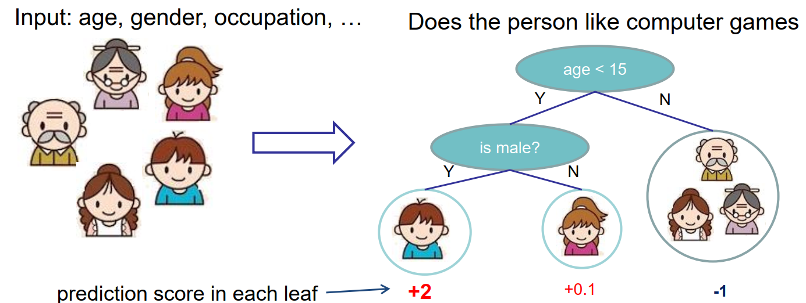


就这样，训练出了2棵树tree1和tree2，类似之前gbdt的原理，两棵树的结论累加起来便是最终的结论，所以小孩的预测分数就是两棵树中小孩所落到的结点的分数相加：2 + 0.9 = 2.9。爷爷的预测分数同理：-1 + （-0.9）= -1.9。具体如下图所示

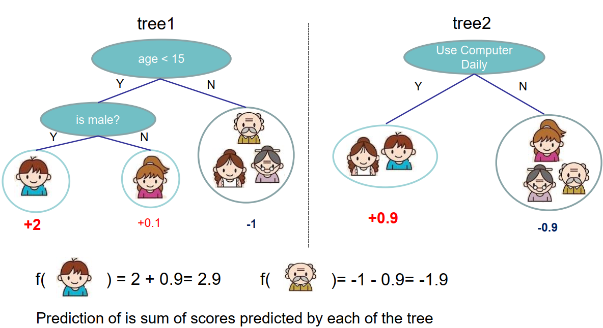

事实上，如果不考虑工程实现、解决问题上的一些差异，xgboost与gbdt比较大的不同就是目标函数的定义。


# 构造目标函数

假设有$k$棵树
$$
\hat{y}_{i}=\sum_{k=1}^{K} f_{k}(x_{i}), \quad f_{k} \in \mathcal{F}
$$

**目标函数**：损失函数+复杂度
$$
Obj=\sum_{i=1}^{n} l(y_{i}, \hat{y}_{i})+\sum_{k=1}^{K} \Omega(f_{k})
$$


XGBoost的**核心算法思想**不难，基本就是：

1. 不断地添加树，不断地进行特征分裂来生长一棵树，每次添加一个树，其实是学习一个新函数**f(x)**，去拟合上次预测的残差。
2. 当我们训练完成得到k棵树，我们要预测一个样本的分数，其实就是根据这个样本的特征，在每棵树中会落到对应的一个叶子节点，每个叶子节点就对应一个分数。
3. 最后只需要将每棵树对应的分数加起来就是该样本的预测值。


$$
\begin{aligned}
&\hat{y}_{i}^{(0)}=0\\
&\hat{y}_{i}^{(1)}=f_{1}\left(x_{i}\right)=\hat{y}_{i}^{(0)}+f_{1}\left(x_{i}\right)\\
&\hat{y}_{i}^{(2)}=f_{1}\left(x_{i}\right)+f_{2}\left(x_{i}\right)=\hat{y}_{i}^{(1)}+f_{2}\left(x_{i}\right)\\
&\quad \cdots \\
&\hat{y}_{i}^{(k)}=\sum_{k=1}^{k} f_{k}\left(x_{i}\right)=\hat{y}_{i}^{(k-1)}+f_{k}\left(x_{i}\right)
\end{aligned}
$$


**目标函数**
$$
\begin {aligned}
Obj^{(k)} &= \sum_{i=1}^{n} l(y_i, \hat{y}_{i}^{(k)}) +  \sum _ {k=1}^{k}\Omega(f_{k}) \\
&= \sum_{i=1}^{n} l(y_i, \hat{y}_{i}^{(k-1)} + f_{k}(x_{i})) + \sum_{k=1}^{k-1} \Omega(f_{k}) + \Omega(f_{k}) \\
& = \sum_{i=1}^{n} l(y_i, \hat{y}_{i}^{(k-1)} + f_{k}(x_{i})) + \Omega(f_{k})
\end {aligned}
$$

XGBoost没有和GBDT一样去拟合泰勒展开式的一阶导数，而是期望直接基于损失函数的二阶泰勒展开式来求解

$$
f(x+\Delta x) \simeq f(x)+f^{\prime}(x) \Delta x+\frac{1}{2} f^{\prime \prime}(x) \Delta x^{2} \\
$$

$$
\begin {aligned}
Obj^{(k)} & = \sum_{i=1}^{n} l(y_i, \hat{y}_{i}^{(k-1)} + f_{k}(x_{i})) + \Omega(f_{k}) \\

& \simeq \sum_{i=1}^{n}\left[l\left(y_{i}, \hat{y}_{i}^{(k-1)}\right)+\partial_{\hat{y}^{(k-1)}} l(y_{i}, \hat{y}^{(k-1)}) f_{k}(x_{i})+\frac{1}{2} \partial_{\hat{y}^{(k-1)}}^{2} l(y_{i}, \hat{y}^{(k-1)}) f_{k}^{2}(x_{i})\right]+\Omega(f_{k}) \\

&\simeq \sum_{i=1}^{n}\left[l\left(y_{i}, \hat{y}_{i}^{(k-1)}\right)+g_{i} f_{k}\left(x_{i}\right)+\frac{1}{2} h_{i} f_{k}^{2}\left(x_{i}\right)\right]+\Omega\left(f_{k}\right) \\

&\simeq \sum_{i=1}^{n}\left[g_{i} f_{k}\left(x_{i}\right)+\frac{1}{2} h_{i} f_{k}^{2}\left(x_{i}\right)\right]+\Omega\left(f_{k}\right)

\end {aligned}
$$

损失函数里面$l\left(y_{i}, \hat{y}_{i}^{(k-1)}\right)$是常数，对最小化无影响，可以去掉。为了方便，我们把第$i$个样本在第$k$个弱学习器的一阶和二阶导数分别记为:
$$
g_{i}=\partial_{\hat{y}^{(k-1)}} l\left(y_{i}, \hat{y}^{(k-1)}\right)
$$

$$
h_{i}=\partial_{\hat{y}^{(k-1)}}^{2} l\left(y_{i}, \hat{y}^{(k-1)}\right)​
$$

以**平方损失函数**为例：$l\left(y_{i}, \hat{y}_{i}^{(t-1)}\right)=\left(y_{i}-\hat{y}_{i}^{(t-1)}\right)^{2}$

则有：
$$
\begin{align}
g_{i}&=\frac{\partial l\left(y_{i}, \hat{y}_{i}^{(k-1)}\right)}{\partial \hat{y}_{i}^{(k-1)}}=-2\left(y_{i}-\hat{y}_{i}^{(k-1)}\right) \\
h_{i}&=\frac{\partial^{2} l\left(y_{i}, \hat{y}_{i}^{(k-1)}\right)}{\partial\left(\hat{y}_{i}^{(k-1)}\right)^{2}}=2
\end{align}
$$


# 树的定义

$$
f_{t}(x)=w_{q(x)}, \quad w \in \mathbf{R}^{T}, q: \mathbf{R}^{d} \rightarrow\{1,2, \cdots, T\}
$$


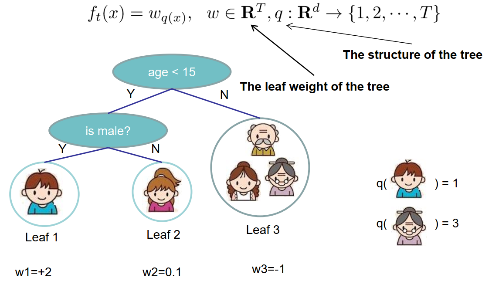


- $f_{t}(x)=w_{q(x)}$  ，树参数化
- $w \in \mathbf{R}^{T}$, $w = (w_1,w_2,w_3) = (2,0.1,-1)$  ，叶节点的值
- $q: \mathbf{R}^{d} \rightarrow\{1,2, \cdots, T\}$  , 样本的位置, 树里面叶子节点的个数T
- $I_j = \{i|q(x_i)=j\}$, $I_j$为每个叶节点 j 上面样本下标的集合, $I_1=\{男孩\},I_2=\{女孩\},I_3=\{爷爷、奶奶、阿姨\}$


XGBoost对**树的复杂度**包含了两个部分：

- 一个是树里面叶子节点的个数T
- 一个是树上叶子节点的得分w的L2模平方（对w进行L2正则化，相当于针对每个叶结点的得分增加L2平滑，目的是为了避免过拟合）

$$
\begin {aligned}
\Omega\left(f_{k}\right) & = \gamma T+\frac{1}{2} \lambda \sum_{j=1}^{T} w_{j}^{2} \\
& =\gamma 3+\frac{1}{2} \lambda(4+0.01+1)
\end {aligned}
$$

目标函数，由于每个决策树的第$j$个叶子节点的取值最终会是同一个值$w_{j}$, 因此我们的损失函数可以继续化简。将属于第$j$个叶子结点的所有样本$x_i$划入到一个叶子结点的样本集合中，即：$I_{j}=\left\{i | q\left(x_{i}\right)=j\right\}$ 
$$
\begin {aligned}
Obj^{(k)} &\simeq \sum_{i=1}^{n}\left[g_{i} f_{k}\left(x_{i}\right)+\frac{1}{2} h_{i} f_{k}^{2}\left(x_{i}\right)\right]+\Omega\left(f_{k}\right) \\

&=\sum_{i=1}^{n}\left[g_{i} w_{q\left(x_{i}\right)}+\frac{1}{2} h_{i} w_{q\left(x_{i}\right)}^{2}\right]+\gamma T+ \frac{1}{2} \lambda \sum_{j=1}^{T} w_{j}^{2} \\

&=\sum_{j=1}^{T}\left[\left(\sum_{i \in I_{j}} g_{i}\right) w_{j}+\frac{1}{2}\left(\sum_{i \in I_{j}} h_{i}+\lambda\right) w_{j}^{2}\right]+\gamma T \\

&=\sum_{j=1}^{T}\left[G_{j} w_{j}+\frac{1}{2}\left(H_{j}+\lambda\right) w_{j}^{2}\right]+\gamma T

\end {aligned}
$$

把每个叶子节点区域样本的一阶和二阶导数的和单独表示，其中$G_{j}=\sum_{i \in I_{j}} g_{i}$   ,   $H_{j}=\sum_{i \in I_{j}} h_{i}$

- $G_{j}$：叶子结点$j$所包含样本的一阶偏导数累加之和，是一个常量；
- $H_{j}$：叶子结点$j$所包含样本的二阶偏导数累加之和，是一个常量；


---


- 如果我们已经求出了第$k$个决策树的$T$个最优的叶子节点区域，如何求出每个叶子节点区域的最优解$w_{j}$？


> 根据一元二次方程的求解公式，可得：

$$
w_{j}^{*}=-\frac{G_{j}}{H_{j}+\lambda}
$$


> 代入得到：

$$
Obj=-\frac{1}{2} \sum_{j=1}^{T} \frac{G_{j}^{2}}{H_{j}+\lambda}+\gamma T
$$

> Obj代表了当我们指定一个树的结构的时候，我们在目标上面最多减少多少。可以把它叫做结构分数(structure score), 分数越小，代表树的结构越好。


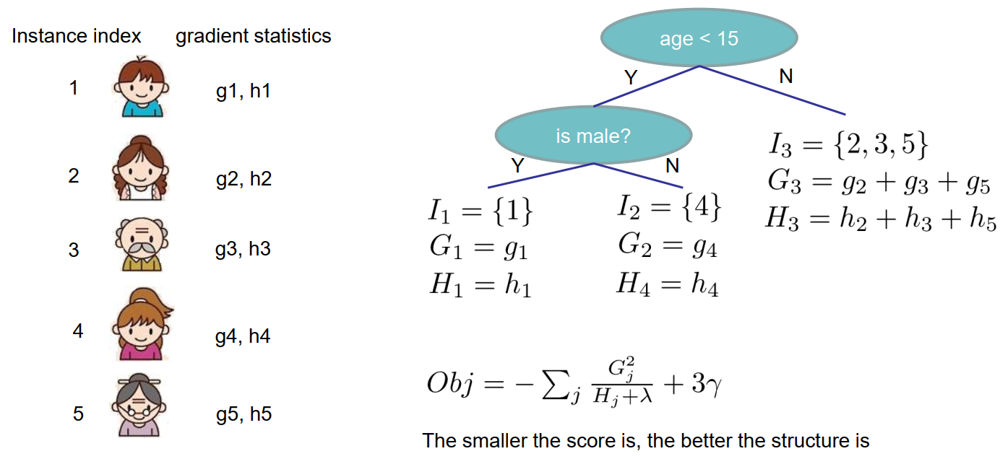


# 如何确定树的结构

- 树该怎么长

> 很有意思的一个事是，我们从头到尾了解了xgboost如何优化、如何计算，但树到底长啥样，我们却一直没看到。很显然，一棵树的生成是由一个节点一分为二，然后不断分裂最终形成为整棵树。那么树怎么分裂的就成为了接下来我们要探讨的关键。对于一个叶子节点如何进行分裂，XGBoost作者在其原始论文中给出了一种分裂节点的方法：**枚举所有不同树结构的贪心法**

> 不断地枚举不同树的结构，然后利用打分函数来寻找出一个最优结构的树，接着加入到模型中，不断重复这样的操作。这个寻找的过程使用的就是**贪心算法**。选择一个feature分裂，计算loss function最小值，然后再选一个feature分裂，又得到一个loss function最小值，你枚举完，找一个效果最好的，把树给分裂，就得到了小树苗。

> 总而言之，XGBoost使用了和CART回归树一样的想法，利用贪婪算法，遍历所有特征的所有特征划分点，不同的是使用的目标函数不一样。具体做法就是分裂后的目标函数值比单子叶子节点的目标函数的增益，同时为了限制树生长过深，还加了个阈值，只有当增益大于该阈值才进行分裂。从而继续分裂，形成一棵树，再形成一棵树，**每次在上一次的预测基础上取最优进一步分裂/建树。**


- 对当前决策树做子树分裂决策时，应该如何选择哪个特征和特征值进行分裂，使最终我们的损失函数最小？


> 在GBDT里面，我们是直接拟合的CART回归树，所以树节点分裂使用的是均方误差。XGBoost这里不使用均方误差，而是使用贪心法，即每次分裂都期望最小化我们的损失函数的误差。


$$
\begin {aligned}
Gain &= -\frac{1}{2}\frac{(G_L+G_R)^2}{H_L+H_R+ \lambda} +\gamma J  -(  -\frac{1}{2}\frac{G_L^2}{H_L + \lambda}  -\frac{1}{2}\frac{G_{R}^2}{H_{R} + \lambda}+ \gamma (J+1) ) \\

&= \frac{1}{2}\frac{G_L^2}{H_L + \lambda} + \frac{1}{2}\frac{G_R^2}{H_R+\lambda}  - \frac{1}{2}\frac{(G_L+G_R)^2}{H_L+H_R+ \lambda} - \gamma \\

&= \frac{1}{2}\left[\frac{G_{L}^{2}}{H_{L}+\lambda}+\frac{G_{R}^{2}}{H_{R}+\lambda}-\frac{\left(G_{L}+G_{R}\right)^{2}}{H_{L}+H_{R}+\lambda}\right]-\gamma
\end {aligned}
$$


> 具体如何分裂呢？举个简单的年龄特征的例子如下，假设我们选择年龄这个 特征的值a作为决策树的分裂标准，则可以得到左子树2个人，右子树3个人，这样可以分别计算出左右子树的一阶和二阶导数和，进而求出最终的上式的值。
>

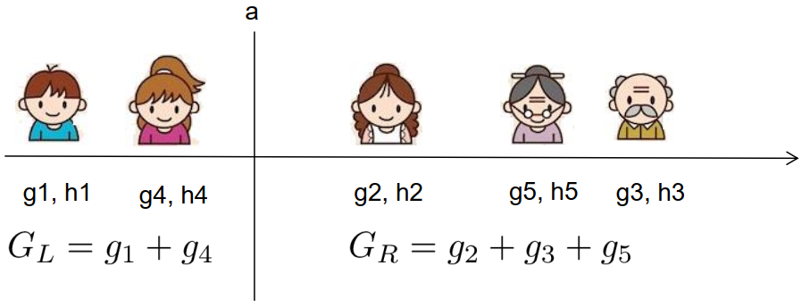


-  如何停止树的循环生成

> 凡是这种循环迭代的方式必定有停止条件，什么时候停止呢？简言之，设置树的最大深度、当样本权重和小于设定阈值时停止生长以防止过拟合。具体而言，则
>
> 1. 当引入的分裂带来的增益小于设定阀值的时候，我们可以忽略掉这个分裂，所以并不是每一次分裂loss function整体都会增加的，有点预剪枝的意思，阈值参数为（即正则项里叶子节点数T的系数）；
> 2. 当树达到最大深度时则停止建立决策树，设置一个超参数max_depth，避免树太深导致学习局部样本，从而过拟合；
> 3. 样本权重和小于设定阈值时则停止建树。什么意思呢，即涉及到一个超参数-最小的样本权重和min_child_weight，和GBM的 min_child_leaf 参数类似，但不完全一样。大意就是一个叶子节点样本太少了，也终止同样是防止过拟合；


> 值得注意的是引入分割不一定会使得情况变好，所以我们有一个引入新叶子的惩罚项。优化这个目标对应了树的剪枝， 当引入的分割带来的增益小于一个阀值$\gamma$ 的时候，则忽略这个分割。


> 总而言之，XGBoost使用了和CART回归树一样的想法，利用贪婪算法，遍历所有特征的所有特征划分点，不同的是使用的目标函数不一样。具体做法就是分裂后的目标函数值比单子叶子节点的目标函数的增益，同时为了限制树生长过深，还加了个阈值，只有当增益大于该阈值才进行分裂。


# XGBoost算法主流程

这里我们总结下XGBoost的算法主流程，基于决策树弱分类器。不涉及运行效率的优化和健壮性优化的内容。

- 输入是训练集样本$I=\{(x_,y_1),(x_2,y_2), ...(x_m,y_m)\}$， 最大迭代次数$T$, 损失函数$L$， 正则化系数$\lambda,\gamma$。
- 输出是强学习器$f(x)$


对迭代轮数t=1,2,...T有：

1. 计算第$i$个样本$(i-1,2,..m)$在当前轮损失函数L基于$f_{k-1}(x_i)$的一阶导数$g_{ki}$，二阶导数$h_{ki}$,计算所有样本的一阶导数和$G_k = \sum\limits_{i=1}^mg_{ki}$, 二阶导数和$H_k = \sum\limits_{i=1}^mh_{ki}$ 
2.  基于当前节点尝试分裂决策树，默认分数score=0

对特征序号 $k=1,2...K$:

 a) $G_L=0, H_L=0$ 
	   b) 将样本按特征$k$从小到大排列，依次取出第$i$个样本，依次计算当前样本放入左子树后，左右子树一阶和二阶导数和：
$$
G_L = G_L+ g_{ki}, G_R=G-G_L
$$

$$
H_L = H_L+ h_{ki}, H_R=H-H_L
$$


c) 尝试更新最大的分数：
$$
score = max(score, \frac{1}{2}\frac{G_L^2}{H_L + \lambda} + \frac{1}{2}\frac{G_R^2}{H_R+\lambda}  - \frac{1}{2}\frac{(G_L+G_R)^2}{H_L+H_R+ \lambda} )
$$
3.  基于最大score对应的划分特征和特征值分裂子树。
4.  如果最大score为0，则当前决策树建立完毕，计算所有叶子区域的$w_{kj}$, 得到弱学习器$h_k(x)$，更新强学习器$f_k(x)$,进入下一轮弱学习器迭代。如果最大score不是0，则转到第2)步继续尝试分裂决策树。


# 面试题

## 简单介绍一下XGBoost

首先需要说一说GBDT，它是一种基于boosting增强策略的加法模型，训练的时候采用前向分布算法进行贪婪的学习，每次迭代都学习一棵CART树来拟合之前 t-1 棵树的预测结果与训练样本真实值的残差。

XGBoost对GBDT进行了一系列优化，比如损失函数进行了二阶泰勒展开、目标函数加入正则项、支持并行和默认缺失值处理等，在可扩展性和训练速度上有了巨大的提升，但其核心思想没有大的变化。


## XGBoost与GBDT有什么不同-1

1. **基分类器**：XGBoost的基分类器不仅支持CART决策树，还支持线性分类器，此时XGBoost相当于带L1和L2正则化项的Logistic回归（分类问题）或者线性回归（回归问题）。
2. **导数信息**：XGBoost对损失函数做了二阶泰勒展开，GBDT只用了一阶导数信息，并且XGBoost还支持自定义损失函数，只要损失函数一阶、二阶可导。
3. **正则项**：XGBoost的目标函数加了正则项， 相当于预剪枝，使得学习出来的模型更加不容易过拟合。
4. **列抽样**：XGBoost支持列采样，与随机森林类似，用于防止过拟合。
5. **缺失值处理**：对树中的每个非叶子结点，XGBoost可以自动学习出它的默认分裂方向。如果某个样本该特征值缺失，会将其划入默认分支。
6. **并行化**：注意不是tree维度的并行，而是特征维度的并行。XGBoost预先将每个特征按特征值排好序，存储为块结构，分裂结点时可以采用多线程并行查找每个特征的最佳分割点，极大提升训练速度。

## XGBoost与GBDT有什么不同-2

除了算法上与传统的GBDT有一些不同外，XGBoost还在工程实现上做了大量的优化。总的来说，两者之间的区别和联系可以总结成以下几个方面。

1. GBDT是机器学习算法，XGBoost是该算法的工程实现。
2. 在使用CART作为基分类器时，XGBoost显式地加入了**正则项**来控制模型的复杂度，有利于防止过拟合，从而提高模型的泛化能力。
3. GBDT在模型训练时只使用了代价函数的一阶导数信息，XGBoost对代价函数进行二阶泰勒展开，可以同时使用一阶和二阶导数。
4. 节点分裂的方式不同，GBDT是用的基尼系数，XGBoost是经过优化推导后的。
5. 传统的GBDT采用CART作为基分类器，XGBoost支持多种类型的基分类器，比如线性分类器。
6. 传统的GBDT在每轮迭代时使用全部的数据，XGBoost则采用了与随机森林相似的策略，支持对数据进行采样。
7. 传统的GBDT没有设计对缺失值进行处理，XGBoost能够自动学习出缺失值的处理策略。


## XGBoost为什么使用泰勒二阶展开

- **精准性**：相对于GBDT的一阶泰勒展开，XGBoost采用二阶泰勒展开，可以更为精准的逼近真实的损失函数
- **可扩展性**：损失函数支持自定义，只需要新的损失函数二阶可导。
- XGBoost使用了一阶和二阶偏导, 二阶导数有利于梯度下降的更快更准. 使用泰勒展开取得函数做自变量的二阶导数形式, 可以在不选定损失函数具体形式的情况下, 仅仅依靠输入数据的值就可以进行叶子分裂优化计算, 本质上也就把损失函数的选取和模型算法优化/参数选择分开了。 这种去耦合增加了XGBoost的适用性, 使得它按需选取损失函数, 可以用于分类, 也可以用于回归。


## XGBoost为什么可以并行训练

- XGBoost的并行，并不是说每棵树可以并行训练，XGB本质上仍然采用boosting思想，每棵树训练前需要等前面的树训练完成才能开始训练。
- XGBoost的并行，指的是特征维度的并行：在训练之前，每个特征按特征值对样本进行预排序，并存储为Block结构，在后面查找特征分割点时可以重复使用，而且特征已经被存储为一个个block结构，那么在寻找每个特征的最佳分割点时，可以利用多线程对每个block并行计算。


## XGBoost为什么快

- **分块并行**：训练前每个特征按特征值进行排序并存储为Block结构，后面查找特征分割点时重复使用，并且支持并行查找每个特征的分割点
- **候选分位点**：每个特征采用常数个分位点作为候选分割点
- **CPU cache 命中优化**： 使用缓存预取的方法，对每个线程分配一个连续的buffer，读取每个block中样本的梯度信息并存入连续的Buffer中。
- **Block 处理优化**：Block预先放入内存；Block按列进行解压缩；将Block划分到不同硬盘来提高吞吐


## XGBoost防止过拟合的方法

XGBoost在设计时，为了防止过拟合做了很多优化，具体如下：

- **目标函数添加正则项**：叶子节点个数+叶子节点权重的L2正则化
- **列抽样**：训练的时候只用一部分特征（不考虑剩余的block块即可）
- **子采样**：每轮计算可以不使用全部样本，使算法更加保守
- **shrinkage**: 可以叫学习率或步长，为了给后面的训练留出更多的学习空间


## XGBoost如何处理缺失值

XGBoost模型的一个优点就是允许特征存在缺失值。对缺失值的处理方式如下：

- 在特征k上寻找最佳 split point 时，不会对该列特征 missing 的样本进行遍历，而只对该列特征值为 non-missing 的样本上对应的特征值进行遍历，通过这个技巧来减少了为稀疏离散特征寻找 split point 的时间开销。
- 在逻辑实现上，为了保证完备性，会将该特征值missing的样本分别分配到左叶子结点和右叶子结点，两种情形都计算一遍后，选择分裂后增益最大的那个方向（左分支或是右分支），作为预测时特征值缺失样本的默认分支方向。
- 如果在训练中没有缺失值而在预测中出现缺失，那么会自动将缺失值的划分方向放到右子结点。


## XGBoost中叶子结点的权重如何计算出来

XGBoost目标函数最终推导形式如下：
$$
O b j^{(t)}=\sum_{j=1}^{T}\left[G_{j} w_{j}+\frac{1}{2}\left(H_{j}+\lambda\right) w_{j}^{2}\right]+\gamma T
$$
利用一元二次函数求最值的知识，当目标函数达到最小值Obj时，每个叶子结点的权重为$w_j^*$。

具体公式如下：

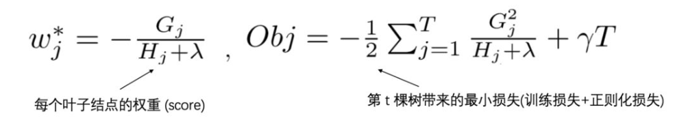


## XGBoost中的一棵树的停止生长条件

- 当新引入的一次分裂所带来的增益Gain<0时，放弃当前的分裂。这是训练损失和模型结构复杂度的博弈过程。
- 当树达到最大深度时，停止建树，因为树的深度太深容易出现过拟合，这里需要设置一个超参数max_depth。
- 当引入一次分裂后，重新计算新生成的左、右两个叶子结点的样本权重和。如果任一个叶子结点的样本权重低于某一个阈值，也会放弃此次分裂。这涉及到一个超参数:最小样本权重和，是指如果一个叶子节点包含的样本数量太少也会放弃分裂，防止树分的太细。


## RF和GBDT的区别

**相同点：**

- 都是由多棵树组成，最终的结果都是由多棵树一起决定。

**不同点：**

- **集成学习**：RF属于bagging思想，而GBDT是boosting思想
- **偏差-方差权衡**：RF不断的降低模型的方差，而GBDT不断的降低模型的偏差
- **训练样本**：RF每次迭代的样本是从全部训练集中有放回抽样形成的，而GBDT每次使用全部样本
- **并行性**：RF的树可以并行生成，而GBDT只能顺序生成(需要等上一棵树完全生成)
- **最终结果**：RF最终是多棵树进行多数表决（回归问题是取平均），而GBDT是加权融合
- **数据敏感性**：RF对异常值不敏感，而GBDT对异常值比较敏感
- **泛化能力**：RF不易过拟合，而GBDT容易过拟合


## XGBoost如何处理不平衡数据

对于不平衡的数据集，例如用户的购买行为，肯定是极其不平衡的，这对XGBoost的训练有很大的影响，XGBoost有两种自带的方法来解决：

第一种，如果你在意AUC，采用AUC来评估模型的性能，那你可以通过设置scale_pos_weight来平衡正样本和负样本的权重。例如，当正负样本比例为1:10时，scale_pos_weight可以取10；

第二种，如果你在意概率(预测得分的合理性)，你不能重新平衡数据集(会破坏数据的真实分布)，应该设置max_delta_step为一个有限数字来帮助收敛（基模型为LR时有效）。

除此之外，还可以通过上采样、下采样、SMOTE算法或者自定义代价函数的方式解决正负样本不平衡的问题。


## 比较LR和GBDT，说说什么情景下GBDT不如LR

先说说LR和GBDT的区别：

- LR是线性模型，可解释性强，很容易并行化，但学习能力有限，需要大量的人工特征工程
- GBDT是非线性模型，具有天然的特征组合优势，特征表达能力强，但是树与树之间无法并行训练，而且树模型很容易过拟合；

当在高维稀疏特征的场景下，LR的效果一般会比GBDT好。原因如下：

先看一个例子：

> 假设一个二分类问题，label为0和1，特征有100维，如果有1w个样本，但其中只要10个正样本1，而这些样本的特征 f1的值为全为1，而其余9990条样本的f1特征都为0(在高维稀疏的情况下这种情况很常见)。
>
> 我们都知道在这种情况下，树模型很容易优化出一个使用f1特征作为重要分裂节点的树，因为这个结点直接能够将训练数据划分的很好，但是当测试的时候，却会发现效果很差，因为这个特征f1只是刚好偶然间跟y拟合到了这个规律，这也是我们常说的过拟合。

那么这种情况下，如果采用LR的话，应该也会出现类似过拟合的情况呀：$y = W1*f1 + Wi*fi+….$，其中 W1特别大以拟合这10个样本。为什么此时树模型就过拟合的更严重呢？

仔细想想发现，因为现在的模型普遍都会带着正则项，而 LR 等线性模型的正则项是对权重的惩罚，也就是 W1一旦过大，惩罚就会很大，进一步压缩 W1的值，使他不至于过大。但是，树模型则不一样，树模型的惩罚项通常为叶子节点数和深度等，而我们都知道，对于上面这种 case，树只需要一个节点就可以完美分割9990和10个样本，一个结点，最终产生的惩罚项极其之小。

这也就是为什么在高维稀疏特征的时候，线性模型会比非线性模型好的原因了：**带正则化的线性模型比较不容易对稀疏特征过拟合。**


## XGBoost中如何对树进行剪枝

- 在目标函数中增加了正则项：使用叶子结点的数目和叶子结点权重的L2模的平方，控制树的复杂度。
- 在结点分裂时，定义了一个阈值，如果分裂后目标函数的增益小于该阈值，则不分裂。
- 当引入一次分裂后，重新计算新生成的左、右两个叶子结点的样本权重和。如果任一个叶子结点的样本权重低于某一个阈值（最小样本权重和），也会放弃此次分裂。
- XGBoost 先从顶到底建立树直到最大深度，再从底到顶反向检查是否有不满足分裂条件的结点，进行剪枝。


## XGBoost如何选择最佳分裂点？

XGBoost在训练前预先将特征按照特征值进行了排序，并存储为block结构，以后在结点分裂时可以重复使用该结构。

因此，可以采用特征并行的方法利用多个线程分别计算每个特征的最佳分割点，根据每次分裂后产生的增益，最终选择增益最大的那个特征的特征值作为最佳分裂点。

如果在计算每个特征的最佳分割点时，对每个样本都进行遍历，计算复杂度会很大，这种全局扫描的方法并不适用大数据的场景。XGBoost还提供了一种直方图近似算法，对特征排序后仅选择常数个候选分裂位置作为候选分裂点，极大提升了结点分裂时的计算效率。


## XGBoost的Scalable性如何体现

- **基分类器的scalability**：弱分类器可以支持CART决策树，也可以支持LR和Linear。
- **目标函数的scalability**：支持自定义loss function，只需要其一阶、二阶可导。有这个特性是因为泰勒二阶展开，得到通用的目标函数形式。
- **学习方法的scalability**：Block结构支持并行化，支持 Out-of-core计算。


## XGBoost如何评价特征的重要性

我们采用三种方法来评判XGBoost模型中特征的重要程度：

```javascript
 官方文档：	
（1）weight - the number of times a feature is used to split the data across all trees. 	
（2）gain - the average gain of the feature when it is used in trees. 	
（3）cover - the average coverage of the feature when it is used in trees.
```


- **weight** ：该特征在所有树中被用作分割样本的特征的总次数。
- **gain** ：该特征在其出现过的所有树中产生的平均增益。
- **cover** ：该特征在其出现过的所有树中的平均覆盖范围。

> 注意：覆盖范围这里指的是一个特征用作分割点后，其影响的样本数量，即有多少样本经过该特征分割到两个子节点。


## XGBooost参数调优的一般步骤

首先需要初始化一些基本变量，例如：

- max_depth = 5
- min_child_weight = 1
- gamma = 0
- subsample, colsample_bytree = 0.8
- scale_pos_weight = 1

**(1) 确定learning rate和estimator的数量**

learning rate可以先用0.1，用cv来寻找最优的estimators

**(2) max_depth和 min_child_weight**

我们调整这两个参数是因为，这两个参数对输出结果的影响很大。我们首先将这两个参数设置为较大的数，然后通过迭代的方式不断修正，缩小范围。

max_depth，每棵子树的最大深度，check from range(3,10,2)。

min_child_weight，子节点的权重阈值，check from range(1,6,2)。

如果一个结点分裂后，它的所有子节点的权重之和都大于该阈值，该叶子节点才可以划分。

**(3) gamma**

也称作最小划分损失`min_split_loss`，check from 0.1 to 0.5，指的是，对于一个叶子节点，当对它采取划分之后，损失函数的降低值的阈值。

- 如果大于该阈值，则该叶子节点值得继续划分
- 如果小于该阈值，则该叶子节点不值得继续划分

**(4) subsample, colsample_bytree**

subsample是对训练的采样比例

colsample_bytree是对特征的采样比例

both check from 0.6 to 0.9

**(5) 正则化参数**

alpha 是L1正则化系数，try 1e-5, 1e-2, 0.1, 1, 100

lambda 是L2正则化系数

**(6) 降低学习率**

降低学习率的同时增加树的数量，通常最后设置学习率为0.01~0.1


## XGBoost模型如果过拟合了怎么解决

当出现过拟合时，有两类参数可以缓解：

第一类参数：用于直接控制模型的复杂度。包括`max_depth,min_child_weight,gamma` 等参数

第二类参数：用于增加随机性，从而使得模型在训练时对于噪音不敏感。包括`subsample,colsample_bytree`

还有就是直接减小`learning rate`，但需要同时增加`estimator` 参数。


## 为什么XGBoost相比某些模型对缺失值不敏感

对存在缺失值的特征，一般的解决方法是：

- 离散型变量：用出现次数最多的特征值填充；
- 连续型变量：用中位数或均值填充；

一些模型如SVM和KNN，其模型原理中涉及到了对样本距离的度量，如果缺失值处理不当，最终会导致模型预测效果很差。

而树模型对缺失值的敏感度低，大部分时候可以在数据缺失时时使用。原因就是，一棵树中每个结点在分裂时，寻找的是某个特征的最佳分裂点（特征值），完全可以不考虑存在特征值缺失的样本，也就是说，如果某些样本缺失的特征值缺失，对寻找最佳分割点的影响不是很大。

XGBoost对缺失数据有特定的处理方法，[详情参考上篇文章第7题](http://mp.weixin.qq.com/s?__biz=Mzg2MjI5Mzk0MA==&mid=2247484181&idx=1&sn=8d0e51fb0cb974f042e66659e1daf447&chksm=ce0b59cef97cd0d8cf7f9ae1e91e41017ff6d4c4b43a4c19b476c0b6d37f15769f954c2965ef&scene=21#wechat_redirect)。

因此，对于有缺失值的数据在经过缺失处理后：

- 当数据量很小时，优先用朴素贝叶斯
- 数据量适中或者较大，用树模型，优先XGBoost
- 数据量较大，也可以用神经网络
- 避免使用距离度量相关的模型，如KNN和SVM


## XGBoost和LightGBM的区别

（1）树生长策略：XGB采用`level-wise`的分裂策略，LGB采用`leaf-wise`的分裂策略。XGB对每一层所有节点做无差别分裂，但是可能有些节点增益非常小，对结果影响不大，带来不必要的开销。Leaf-wise是在所有叶子节点中选取分裂收益最大的节点进行的，但是很容易出现过拟合问题，所以需要对最大深度做限制 。

（2）分割点查找算法：XGB使用特征预排序算法，LGB使用基于直方图的切分点算法，其优势如下：

- 减少内存占用，比如离散为256个bin时，只需要用8位整形就可以保存一个样本被映射为哪个bin(这个bin可以说就是转换后的特征)，对比预排序的exact greedy算法来说（用int_32来存储索引+ 用float_32保存特征值），可以节省7/8的空间。
- 计算效率提高，预排序的Exact greedy对每个特征都需要遍历一遍数据，并计算增益，复杂度为?(#???????×#????)。而直方图算法在建立完直方图后，只需要对每个特征遍历直方图即可，复杂度为?(#???????×#????)。
- LGB还可以使用直方图做差加速，一个节点的直方图可以通过父节点的直方图减去兄弟节点的直方图得到，从而加速计算

> 但实际上xgboost的近似直方图算法也类似于lightgbm这里的直方图算法，为什么xgboost的近似算法比lightgbm还是慢很多呢？
>
> xgboost在每一层都动态构建直方图， 因为xgboost的直方图算法不是针对某个特定的feature，而是所有feature共享一个直方图(每个样本的权重是二阶导)，所以每一层都要重新构建直方图，而lightgbm中对每个特征都有一个直方图，所以构建一次直方图就够了。

（3）支持离散变量：无法直接输入类别型变量，因此需要事先对类别型变量进行编码（例如独热编码），而LightGBM可以直接处理类别型变量。

（4）缓存命中率：XGB使用Block结构的一个缺点是取梯度的时候，是通过索引来获取的，而这些梯度的获取顺序是按照特征的大小顺序的，这将导致非连续的内存访问，可能使得CPU cache缓存命中率低，从而影响算法效率。而LGB是基于直方图分裂特征的，梯度信息都存储在一个个bin中，所以访问梯度是连续的，缓存命中率高。

（5）LightGBM 与 XGboost 的并行策略不同：

- **特征并行** ：LGB特征并行的前提是每个worker留有一份完整的数据集，但是每个worker仅在特征子集上进行最佳切分点的寻找；worker之间需要相互通信，通过比对损失来确定最佳切分点；然后将这个最佳切分点的位置进行全局广播，每个worker进行切分即可。XGB的特征并行与LGB的最大不同在于XGB每个worker节点中仅有部分的列数据，也就是垂直切分，每个worker寻找局部最佳切分点，worker之间相互通信，然后在具有最佳切分点的worker上进行节点分裂，再由这个节点广播一下被切分到左右节点的样本索引号，其他worker才能开始分裂。二者的区别就导致了LGB中worker间通信成本明显降低，只需通信一个特征分裂点即可，而XGB中要广播样本索引。
- **数据并行** ：当数据量很大，特征相对较少时，可采用数据并行策略。LGB中先对数据水平切分，每个worker上的数据先建立起局部的直方图，然后合并成全局的直方图，采用直方图相减的方式，先计算样本量少的节点的样本索引，然后直接相减得到另一子节点的样本索引，这个直方图算法使得worker间的通信成本降低一倍，因为只用通信以此样本量少的节点。XGB中的数据并行也是水平切分，然后单个worker建立局部直方图，再合并为全局，不同在于根据全局直方图进行各个worker上的节点分裂时会单独计算子节点的样本索引，因此效率贼慢，每个worker间的通信量也就变得很大。
- **投票并行（LGB）**：当数据量和维度都很大时，选用投票并行，该方法是数据并行的一个改进。数据并行中的合并直方图的代价相对较大，尤其是当特征维度很大时。大致思想是：每个worker首先会找到本地的一些优秀的特征，然后进行全局投票，根据投票结果，选择top的特征进行直方图的合并，再寻求全局的最优分割点。

## XGBoost如何寻找最优特征？是又放回还是无放回的呢？

XGBoost在训练的过程中给出各个特征的评分，从而表明每个特征对模型训练的重要性.。XGBoost利用梯度优化模型算法, 样本是不放回的(想象一个样本连续重复抽出,梯度来回踏步会不会高兴)。但XGBoost支持子采样, 也就是每轮计算可以不使用全部样本。


# 李文哲公开课


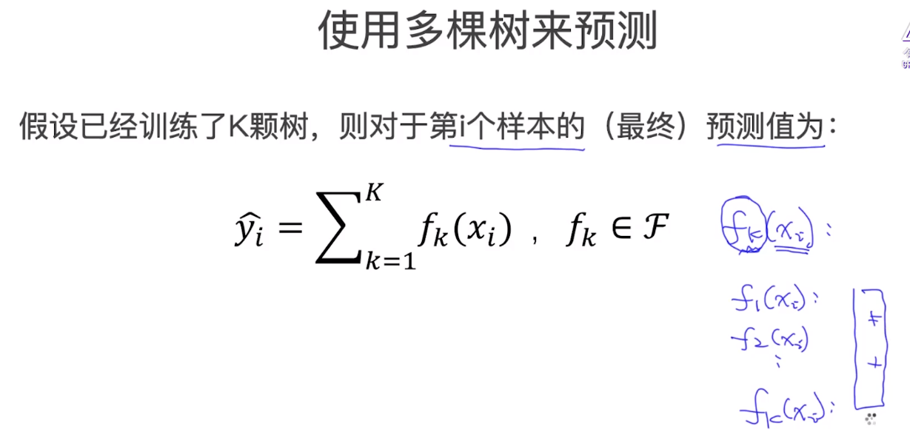

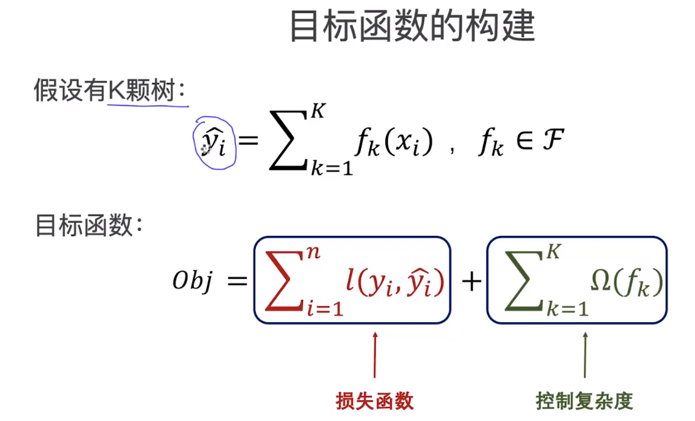

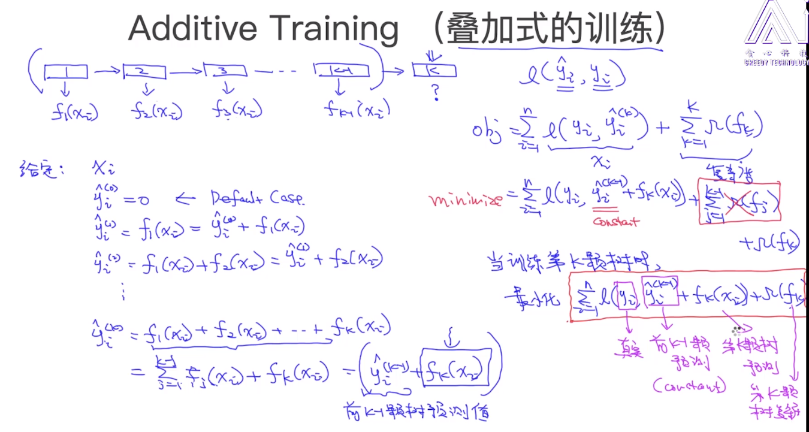

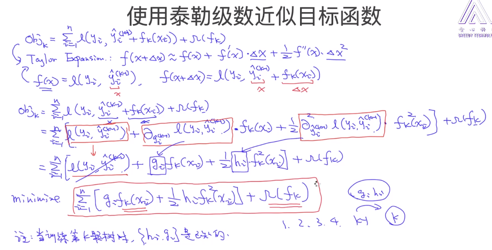

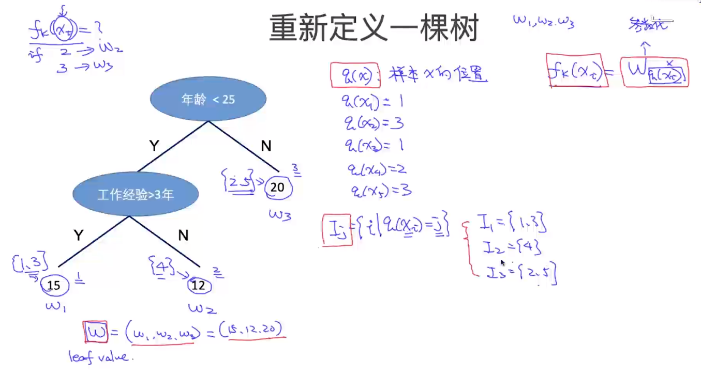

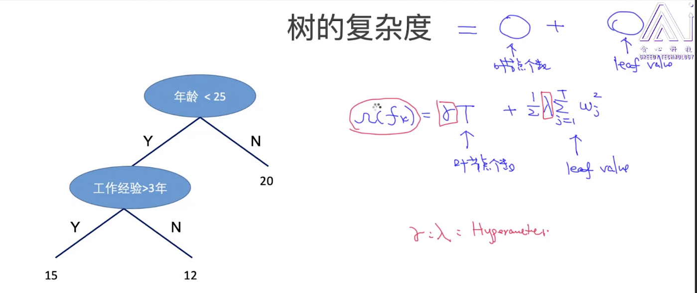

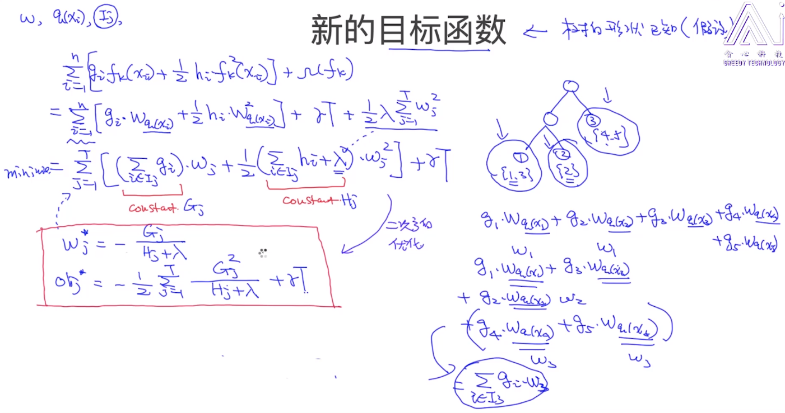

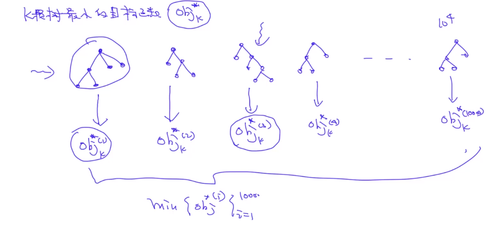

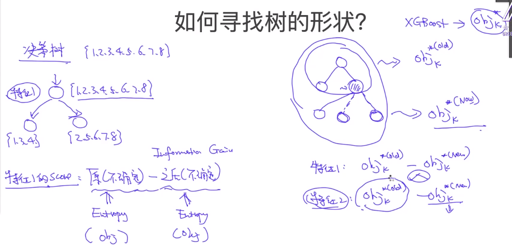

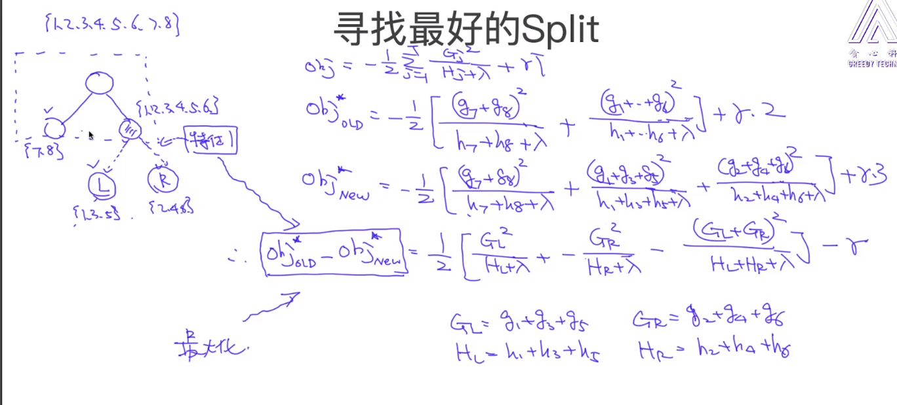


# 参考资料

1. https://mp.weixin.qq.com/s/18O9wZPZv0KSoguJHZk-GQ

2. [NLP-LOVE/ML-NLP](https://github.com/NLP-LOVE/ML-NLP/blob/master/Machine Learning/3.3 XGBoost/3.3 XGBoost.md)

3. 参考：

	1.https://blog.csdn.net/u010665216/article/details/78532619

	2.https://blog.csdn.net/jamexfx/article/details/93780308