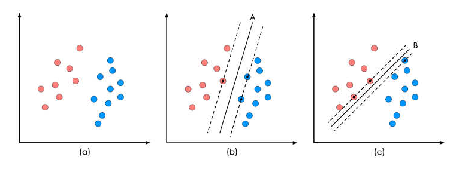
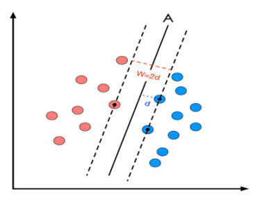

支持向量机

# 支持向量机的简介

Support Vector Machine 。20世纪90年代由Vapnik提出 。监督学习算法，主要用于两分类问题 。坚实的理论基础，直观的几何解释，完美的数学形式 。在文本分类、生物信息、故障识别、信息安全等诸多领域有成功的应用  。

# 二分类问题描述

A分类器和B分类器，那个更好？ 

最大间隔的决策面就是SVM要寻找的最优解。 

两条平行虚线正中间的分界线就是在保持当前决策面方向不变的前提下的最优决策面。 

最优解对应的两侧虚线所穿过的样本点，就是SVM中的支持样本点，称为**支持向量**。 

SVM算法要解决的是一个最优分类器的设计问题。  

## 分类间隔的计算模型

间隔的大小实际上就是支持向量对应的样本点到决策面的距离的二倍 

支持向量到决策面的距离
$$
d=\frac{\left|\omega^{T} \boldsymbol{x}+\gamma\right|}{\|\boldsymbol{\omega}\|}
$$

$$
\left\{\begin{array}{ll}{{\omega}^{T} {x}_{i}+\gamma>0} & {\text {for  }{y}_{i}=1} \\ {{\omega}^{T} {x}_{i}+\gamma<0} & {\text {for  } y_{i}=-1}\end{array}\right.
$$

$$
\left\{\begin{array}{ll}{\left({\omega}^{T} \boldsymbol{x}_{i}+\gamma\right) /\|{\omega}\| \geq d} & {\forall y_{i}=1} \\ {\left({\omega}^{T} {x}_{i}+\gamma\right) /\|{\omega}\| \leq-d} & {\forall y_{i}=-1}\end{array}\right.
$$

$$
\omega_{d}=\frac{\omega}{\|\omega\| d}, \gamma_{d}=\frac{\gamma}{\|\omega\| d}
$$

$$
\left\{\begin{array}{ll}{{\omega}_{d}^{T} {x}_{i}+\gamma_{d} \geq 1} & {\text { for  }  y_{i}=1} \\ {{\omega}_{d}^{T} {x}_{i}+\gamma_{d} \leq-1} & {\text { for  } y_{i}=-1}\end{array}\right.
$$

对于存在分类间隔的两类样本点，我们一定可以找到一些决策面，使其对于所有的样本点均满足下面的约束条件:

$$
\left\{\begin{array}{ll}{{\omega}_{d}^{T} {x}_{i}+\gamma_{d} \geq 1} & {\text { for } y_{i}=1} \\ {{\omega}_{d}^{T} {x}_{i}+\gamma_{d} \leq-1} & {\text { for } y_{i}=-1}\end{array}\right.
$$

$$
y_{i}\left({\omega}^{T} {x}_{i}+\gamma\right) \geq 1 , \forall   {x}_{i}
$$

$$
d=\frac{\left|{\omega}^{T} {x}_{i}+\gamma\right|}{\|{\omega}\|}=\frac{1}{\|{\omega}\|}, \text { if } {x}_{i}
$$

线性可分SVM最优化问题的**数学描述**：

$$
\begin{array}{l}{\min _{\omega, \gamma} \frac{1}{2}\|{\omega}\|^{2}} \\ {\text { s.t. } y_{i}\left({\omega}^{T} {x}_{i}+\gamma\right) \geq \mathbf{1}, \quad i=1,2, \ldots, m}\end{array}
$$

## 有约束最优化问题的数学模型

1. 有约束的原始目标函数优化问题

$$
\begin{array}{cl}{\min _{w, b}} & {\frac{1}{2}\|w\|^{2}} \\ {\text {s.t.}} & {y_{i}\left(w^{T} \cdot x_{i}+b\right) \geq 1, \quad i=1, \cdots, l}\end{array}
$$
2. 新构造的拉格朗日目标函数优化问题

$$
\begin{array}{c}{L(w, b, \alpha)=\frac{1}{2}\|w\|^{2}-\sum_{i=1}^{l} \alpha_{i}\left(y_{i}\left(w^{T} \cdot x_{i}+b\right)-1\right)} \\ {\text {s.t.} \quad \alpha_{i} \geq 0, \quad i=1, \cdots, l}\end{array}
$$
3. 拉格朗日对偶函数的优化问题

$$
\min _{w, b} \max _{\alpha} L(w, b, \alpha) \rightarrow \max _{\alpha} \min _{w, b} L(w, b, \alpha)
$$
## 拉格朗日乘子法

原始目标函数（有约束条件）
$$
\begin{array}{ll}{\min _{x}} & {f(\boldsymbol{x})} \\ {\text { s.t. }} & {h_{i}(\boldsymbol{x})=0 \quad i=1,2, \ldots, m} \\ {} & {g_{j}(\boldsymbol{x}) \leq 0 \quad j=1,2, \ldots, n}\end{array}
$$
广义拉格朗日函数
$$
\begin{array}{c}{L(\boldsymbol{x}, \boldsymbol{\alpha}, \boldsymbol{\beta})=f(\boldsymbol{x})+\sum_{i=1}^{m} \alpha_{i} h_{i}(\boldsymbol{x})+\sum_{j=1}^{n} \beta_{j} g_{i}(\boldsymbol{x})} \\ {\boldsymbol{\alpha}=\left[\alpha_{1}, \alpha_{2}, \ldots, \alpha_{m}\right]^{T}, \boldsymbol{\beta}=\left[\beta_{1}, \beta_{2}, \ldots, \beta_{n}\right]^{T}}\end{array}
$$
新构造的目标函数（没有约束条件）
$$
\theta_{P}({x})=\max _{\alpha, \beta; \beta_{j} \geq 0} L({x}, {\alpha}, {\beta})
$$

$$
\theta_{P}(\boldsymbol{x})=\max _{\boldsymbol{\alpha}, \boldsymbol{\beta} ; \beta_{j} \geq 0} L(\boldsymbol{x}, \boldsymbol{\alpha}, \boldsymbol{\beta})=f(\boldsymbol{x})+\max _{\boldsymbol{\alpha}, \boldsymbol{\beta} ; \beta_{j} \geq 0}\left[\sum_{i=1}^{m} \alpha_{i} h_{i}(\boldsymbol{x})+\sum_{j=1}^{n} \beta_{j} g_{i}(\boldsymbol{x})\right]
$$
可行解区域内
$$
\max _{\alpha, \beta ; \beta_{j} \geq 0}\left[\sum_{i=1}^{m} \alpha_{i} h_{i}(\boldsymbol{x})+\sum_{j=1}^{n} \beta_{j} g_{i}(\boldsymbol{x})\right]=0, \text { for } \boldsymbol{x} \in \mathbf{\Phi}
$$
可行解区域内外
$$
\max _{\alpha, \beta ; \beta_{j} \geq 0}\left[\sum_{i=1}^{m} \alpha_{i} h_{i}(\boldsymbol{x})+\sum_{j=1}^{n} \beta_{j} g_{i}(\boldsymbol{x})\right]=+\infty, \text { for } \boldsymbol{x} \notin \mathbf{\Phi}
$$

$$
\theta_{P}(\boldsymbol{x})=\left\{\begin{array}{ll}{f(\boldsymbol{x})} & {\boldsymbol{x} \in \Phi} \\ {+\infty} & {\text { otherwise }}\end{array}\right.
$$
## 对偶问题
$$
\theta_{P}(\boldsymbol{x})=\max _{\boldsymbol{\alpha}, \beta ; \beta_{j} \geq 0} L(\boldsymbol{x}, \boldsymbol{\alpha}, \boldsymbol{\beta})=f(\boldsymbol{x})+\max _{\boldsymbol{\alpha}, \boldsymbol{\beta} ; \beta_{j} \geq 0}\left[\sum_{i=1}^{m} \alpha_{i} h_{i}(\boldsymbol{x})+\sum_{j=1}^{n} \beta_{j} g_{i}(\boldsymbol{x})\right]
$$

$$
\min _{\boldsymbol{x}}\left[\theta_{P}(\boldsymbol{x})\right]=\min _{\boldsymbol{x}}\left[\max _{\boldsymbol{\alpha}, \boldsymbol{\beta} : \boldsymbol{\beta}_{j} \geq 0} L(\boldsymbol{x}, \boldsymbol{\alpha}, \boldsymbol{\beta})\right]
$$
没有约束条件的新目标函数的优化问题就与原来有约束条件的原始目标函数的优化是等价的问题。
$$
\theta_{D}(\boldsymbol{\alpha}, \boldsymbol{\beta})=\min _{\boldsymbol{x}} L(\boldsymbol{x}, \boldsymbol{\alpha}, \boldsymbol{\beta})
$$

$$
\max _{\boldsymbol{\alpha}, \boldsymbol{\beta} ; \beta_{j} \geq 0}\left[\theta_{D}(\boldsymbol{\alpha}, \boldsymbol{\beta})\right]=\max _{\boldsymbol{\alpha}, \boldsymbol{\beta} ; \beta_{j} \geq 0}\left[\min _{\boldsymbol{x}} L(\boldsymbol{x}, \boldsymbol{\alpha}, \boldsymbol{\beta})\right]
$$
## 最优化求解
$$
\begin{aligned} \min _{w, b} & \frac{1}{2}\|w\|^{2} \\ \text {s.t.} & y_{i}\left(w^{T} \cdot x_{i}+b\right) \geq 1, \quad i=1, \cdots, l \end{aligned}
$$
拉格朗日函数：
$$
\begin{array}{cl}{L(w, b, \alpha)=} & {\frac{1}{2}\|w\|^{2}-\sum_{i=1}^{l} \alpha_{i}\left(y_{i}\left(w^{T} \cdot x_{i}+b\right)-1\right)} \\ {\text {s.t.}} & {\alpha_{i} \geq 0, \quad i=1, \cdots, l}\end{array}
$$

$$
L(w, b, \alpha)=\frac{1}{2}\|w\|^{2}-\sum_{i=1}^{l} \alpha_{i}\left(y_{i}\left(w^{T} \cdot x_{i}+b\right)-1\right)
$$

$$
\min _{w, b} \max _{\alpha} L(w, b, \alpha) \rightarrow \max _{\alpha} \min _{w, b} L(w, b, \alpha)
$$
$L(w, b, \alpha)$分别对$w$,$b$求偏导：
$$
\frac{\partial L(w, b, \alpha)}{\partial w}=w-\sum_{i=1}^{l} \alpha_{i} y_{i} x_{i}=0
$$

$$
\frac{\partial L(w, b, \alpha)}{\partial b}=\sum_{i=1}^{l} \alpha_{i} y_{i}=0
$$

$$
\begin{aligned} L(w, b, \alpha)&= \frac{1}{2}\|w\|^{2}-\sum_{i=1}^{l} \alpha_{i}\left(y_{i}\left(w^{T} \cdot x_{i}+b\right)-1\right) \\ 
&=\frac{1}{2} w^{T} w-\sum_{i=1}^{l} \alpha_{i} y_{i} w^{T} \cdot x_{i}-\sum_{i=1}^{l} \alpha_{i} y_{i} b+\sum_{i=1}^{l} \alpha_{i} \\ 
&=\frac{1}{2} w^{T} \sum_{i=1}^{l} \alpha_{i} y_{i} x_{i}-w^{T} \sum_{i=1}^{l} \alpha_{i} y_{i} \cdot x_{i}+\sum_{i=1}^{l} \alpha_{i} \\ 
&=-\frac{1}{2} w^{T} \sum_{i=1}^{l} \alpha_{i} y_{i} x_{i}+\sum_{i=1}^{l} \alpha_{i} \\
&=-\frac{1}{2}\left(\sum_{i=1}^{l} \alpha_{i} y_{i} x_{i}\right)^{T} \sum_{i=1}^{l} \alpha_{i} y_{i} x_{i}+\sum_{i=1}^{l} \alpha_{i} \\ 
&=-\frac{1}{2} \sum_{i=1}^{l} \alpha_{i} y_{i}\left(x_{i}\right)^{T} \sum_{i=1}^{l} \alpha_{i} y_{i} x_{i}+\sum_{i=1}^{l} \alpha_{i} \\
&=-\frac{1}{2} \sum_{i=1}^{l} \sum_{j=1}^{l} \alpha_{i} y_{i}\left(x_{i}\right)^{T} \alpha_{j} y_{j} x_{j}+\sum_{i=1}^{l} \alpha_{i} \\ 
&=-\frac{1}{2} \sum_{i=1}^{l} \sum_{j=1}^{l} \alpha_{i} \alpha_{j} y_{i} y_{j}\left(x_{i} \cdot x_{j}\right)+\sum_{i=1}^{l} \alpha_{i}\end{aligned}
$$
## 最优化求解

凸二次规划问题的对偶问题为：
$$
\begin{array}{c}{\max _{\alpha}-\frac{1}{2} \sum_{i=1}^{l} \sum_{j=1}^{l} \alpha_{i} \alpha_{j} y_{i} y_{j}\left(x_{i} \cdot x_{j}\right)+\sum_{i=1}^{l} \alpha_{i}} \\ {\text {s.t. } \quad \sum_{i=1}^{l} \alpha_{i} y_{i}=0} \\ {\qquad \alpha_{i} \geq 0, \quad i=1, \cdots, l}\end{array}
$$
进一步等价为下面的形式：
$$
\begin{array}{c}{\min _{\alpha} \frac{1}{2} \sum_{i=1}^{l} \sum_{j=1}^{l} \alpha_{i} \alpha_{j} y_{i} y_{j}\left(x_{i} \cdot x_{j}\right)-\sum_{i=1}^{l} \alpha_{i}} \\ {\text {s.t. } \sum_{i=1}^{l} \alpha_{i} y_{i}=0} \\ {\qquad \alpha_{i} \geq 0, \quad i=1, \cdots, l}\end{array}
$$
# 线性可分SVM

(1) 对给定训练集$T=\left\{\left(x_{1}, y_{1}\right), \cdots,\left(x_{l}, y_{l}\right)\right\} \in\left(R^{n} \times \gamma\right)^{l}$，其中：$x_{i} \in R^{n}$，$y_{i} \in \gamma=\{-1,1\}, \quad i=1, \cdots, l$

(2) 构造并求解凸二次规划问题
$$
\begin{array}{c}{\min _{\alpha} \frac{1}{2} \sum_{i=1}^{l} \sum_{j=1}^{l} \alpha_{i} \alpha_{j} y_{i} y_{j}\left(x_{i} \cdot x_{j}\right)-\sum_{i=1}^{l} \alpha_{i}} \\ {\text {s.t. } \sum_{i=1}^{l} \alpha_{i} y_{i}=0} \\ {\alpha_{i} \geq 0, \quad i=1, \cdots, l}\end{array}
$$
求得其解为：$\alpha^{*}=\left(\alpha_{1}^{*}, \cdots \alpha_{l}^{*}\right)^{T}$

(3) 求解出$b^{*}$的大小，通过选取$\alpha$中一个正的$\alpha_{j}^{*}$，并由此计算出：
$$
b^{*}=y_{j}-\sum_{i=1}^{l} \alpha_{i}^{*} y_{i}\left(x_{i} \cdot x_{j}\right)
$$

(4) 根据$w-\sum_{i=1}^{l} \alpha_{i} y_{i} x_{i}=0$和$b^{*}$求出超平面$\left(w^{*}\right)^{T} \cdot x+b^{*}=0$的表达式，则$f(x)=\operatorname{sgn}(g(x))$，其中：
$$
g(x)=\left(w^{*}\right)^{T} \cdot x+b^{*}=\sum_{i=1}^{l} \alpha_{i}^{*} y_{i}\left(x_{i} \cdot x\right)+b^{*}
$$

## 线性可分支持向量机—示例 

# 线性不可分SVM

# 支持向量机 

# 试题

## SVM如何解决过拟合问题？

## SVM如何做到多分类的？

有三种方式， 1-1 1-多  多-多

- **1-1**：每次取出两种类进行训练，结果训练出n*（n-1）/2个分类器，然后对预测结果进行投票

- **1-多** ：一类为正类，其余全部为负类，但是当出现数据不平衡时会出现问题

- **多-多**：采用的是层次支持向量机，先将数据分为两个子类，然后将子类再划分为次子类，这样逐步划分下去最终不再出现子类为止

## 请简要介绍下SVM

SVM，全称是support vector machine，中文名叫支持向量机。SVM是一个面向数据的分类算法，它的目标是为确定一个分类超平面，从而将不同的数据分隔开。

**扩展**：

支持向量机学习方法包括构建由简至繁的模型：线性可分支持向量机、线性支持向量机及非线性支持向量机。当训练数据线性可分时，通过硬间隔最大化，学习一个线性的分类器，即线性可分支持向量机，又称为硬间隔支持向量机；当训练数据近似线性可分时，通过软间隔最大化，也学习一个线性的分类器，即线性支持向量机，又称为软间隔支持向量机；当训练数据线性不可分时，通过使用核技巧及软间隔最大化，学习非线性支持向量机。

## **LR和SVM的联系与区别？**

`联系`：

1. LR和SVM都可以处理分类问题，且一般都用于处理线性二分类问题（在改进的情况下可以处理多分类问题）
2. 两个方法都可以增加不同的正则化项，如L1、L2等等。所以在很多实验中，两种算法的结果是很接近的。

`区别`：

1. LR是参数模型，SVM是非参数模型。
2. 从目标函数来看，区别在于逻辑回归采用的是Logistical Loss，SVM采用的是hinge loss.这两个损失函数的目的都是增加对分类影响较大的数据点的权重，减少与分类关系较小的数据点的权重。
3. SVM的处理方法是只考虑Support Vectors，也就是和分类最相关的少数点，去学习分类器。而逻辑回归通过非线性映射，大大减小了离分类平面较远的点的权重，相对提升了与分类最相关的数据点的权重。
4. 逻辑回归相对来说模型更简单，好理解，特别是大规模线性分类时比较方便。而SVM的理解和优化相对来说复杂一些，SVM转化为对偶问题后,分类只需要计算与少数几个支持向量的距离,这个在进行复杂核函数计算时优势很明显,能够大大简化模型和计算。
5. Logic 能做的 SVM能做，但可能在准确率上有问题，SVM能做的Logic有的做不了。
	

## svm中间隔和对偶是怎么回事，hinge loss和核函数是怎么引入的

## 解释对偶的概念。

一个优化问题可以从两个角度进行考察，一个是primal 问题，一个是dual 问题，就是对偶问题，一般情况下对偶问题给出主问题最优值的下界，在强对偶性成立的情况下由对偶问题可以得到主问题的最优下界，对偶问题是凸优化问题，可以进行较好的求解，SVM中就是将Primal问题转换为dual问题进行求解，从而进一步引入核函数的思想。

## 带核的SVM为什么能分类非线性问题？

核函数的本质是两个函数的內积，而这个函数在SVM中可以表示成对于输入值的高维映射。注意核并不是直接对应映射，核只不过是一个内积。

## 常用核函数及核函数的条件。

核函数选择的时候应该从线性核开始，而且在特征很多的情况下没有必要选择高斯核，应该从简单到难的选择模型。我们通常说的核函数指的是正定和函数，其充要条件是对于任意的x属于X，要求K对应的Gram矩阵要是半正定矩阵。

RBF核径向基，这类函数取值依赖于特定点间的距离，所以拉普拉斯核其实也是径向基核。

线性核：主要用于线性可分的情况

多项式核

## SVM、LR、决策树的对比。

**模型复杂度**：

1. SVM支持核函数，可处理线性非线性问题;
2. LR模型简单，训练速度快，适合处理线性问题;
3. 决策树容易过拟合，需要进行剪枝。

**损失函数**：

1. SVM hinge loss，合页损失函数

hinge-loss的公式是：
$$
\begin{array}{c}
\sum_{i=1}^{N}\left[1-y_{i}\left(w \cdot x_{i}+b\right)\right]_{+}+\lambda\|w\|^{2} \\
{[z]_{+}=\left\{\begin{array}{l}
z, z>0 \\
0 . z \leq 0
\end{array}\right.}
\end{array}
$$
第一项是损失，第二项是正则化项。这个公式就是说$y_{i}\left(w \cdot x_{i}+b\right)$大于1时loss为0， 否则loss为$1-y_{i}\left(w \cdot x_{i}+b\right)$ 。

对比感知机的损失函数  $\left[-y_{i}\left(w \cdot x_{i}+b\right)\right]_{+}$来说，hinge loss不仅要分类正确，而且置信度足够高的时候，损失才为0，对学习有更高的要求。对比一下感知机损失和hinge loss的图像，明显Hinge loss更加严格。

2. LR 对数损失。
3. Adaboost 指数损失。？

**数据敏感度**：

1. SVM添加容忍度对outlier不敏感，只关心支持向量，且需要先做归一化; 
2. LR对远点敏感。

**数据量**：

1. 数据量大就用LR，数据量小且特征少就用SVM非线性核。

简单介绍SVM：

从分类平面，到求两类之间的最大间隔，到转化为max 1/w^2 即min w^2,带限制条件的优化问题，然后就是找到优化问题的解决办法，首先是用拉格朗日乘子把约束优化转化为无约束优化，对各个变量求导令其为0，并且增加KKT条件，对α(y(wx+b))=0 以及α>=0,将得到的式子带入拉格朗日式子中转化为对偶问题，最后利用SMO来解决这个对偶问题

SVM推导：

解释原问题和对偶问题，一般一个最优化问题对偶问题给出的是主问题的最优解的下界，当强对偶条件成立时，两者相等

SVM和LR最大区别：

损失函数不同。LR损失函数是对数损失，SVM损失是hinge损失，SVM只考虑分类面上的点，而LR考虑所有点，在SVM中，在支持向量之外添加减少任何点都对结果没有影响，而LR则是会对每一个点都会影响决策；SVM不能产生概率，LR可以产生概率，SVM不是改了模型，基于的假设不是关于概率的
