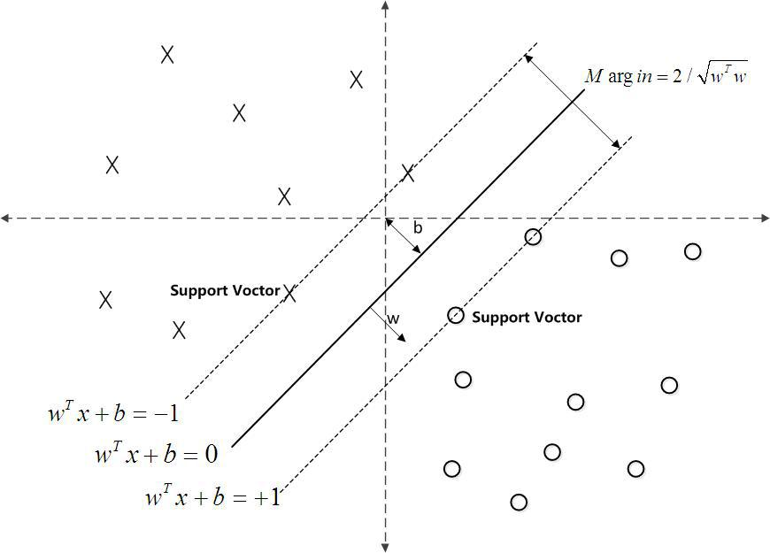
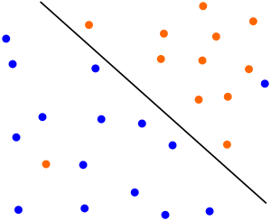
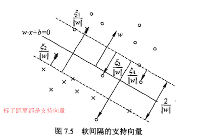
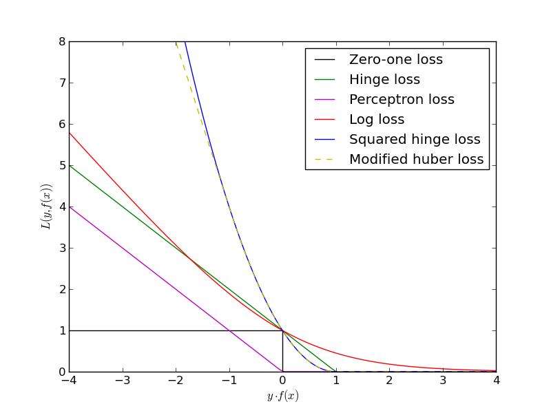
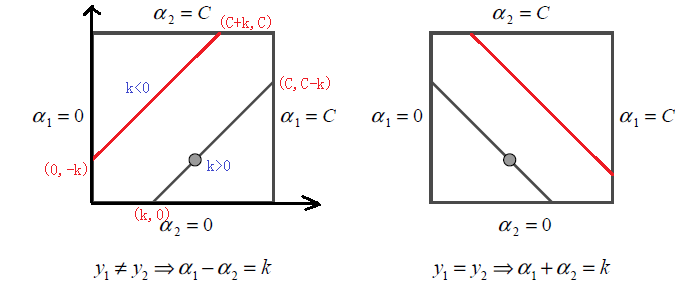
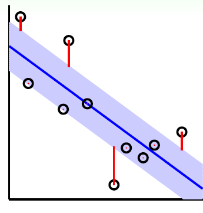

# [线性支持向量机](https://www.cnblogs.com/pinard/p/6097604.html)

支持向量机(Support Vecor Machine，以下简称SVM)虽然诞生只有短短的二十多年，但是自一诞生便由于它良好的分类性能席卷了机器学习领域，并牢牢压制了神经网络领域好多年。如果不考虑集成学习的算法，不考虑特定的训练数据集，在分类算法中的表现SVM说是排第一估计是没有什么异议的。

SVM是一个二元分类算法，线性分类和非线性分类都支持。经过演进，现在也可以支持多元分类，同时经过扩展，也能应用于回归问题。本系列文章就对SVM的原理做一个总结。本篇的重点是SVM用于线性分类时模型和损失函数优化的一个总结。

## 回顾感知机模型

在[感知机原理小结](http://www.cnblogs.com/pinard/p/6042320.html)中，我们讲到了感知机的分类原理，感知机的模型就是尝试找到一条直线，能够把二元数据隔离开。放到三维空间或者更高维的空间，感知机的模型就是尝试找到一个超平面，能够把所有的二元类别隔离开。

对于这个分离的超平面，我们定义为$w^Tx+b=0$，如下图。在超平面$w^Tx+b=0$上方的我们定义为$y=1$，在超平面$w^Tx+b=0$下方的我们定义为$y=−1$。可以看出满足这个条件的超平面并不止一个。那么我们可能会尝试思考，这么多的可以分类的超平面，哪个是最好的呢？或者说哪个是泛化能力最强的呢?

 

接着我们看感知机模型的损失函数优化，它的思想是让所有误分类的点(定义为M)到超平面的距离和最小，即最小化下式：

$$
\sum\limits_{x_i \in M}- y^{(i)}(w^Tx^{(i)} +b)\big / ||w||_2
$$
当$w$和$b$成比例的增加，比如，当分子的$w$和$b$扩大$N$倍时，分母的L2范数也会扩大N倍。也就是说，分子和分母有固定的倍数关系。那么我们可以固定分子或者分母为1，然后求另一个即分子自己或者分母的倒数的最小化作为损失函数，这样可以简化我们的损失函数。在感知机模型中，我们采用的是保留分子，固定分母$||w||_2 = 1$，即最终感知机模型的损失函数为：

$$
\sum\limits_{x_i \in M}- y^{(i)}(w^Tx^{(i)} +b)
$$
如果我们不是固定分母，改为固定分子，作为分类模型有没有改进呢？

这些问题在我们引入SVM后会详细解释。

## 函数间隔与几何间隔

在正式介绍SVM的模型和损失函数之前，我们还需要先了解下函数间隔和几何间隔的知识。

在分离超平面固定为$w^Tx+b=0$的时候，$|w^Tx+b|$表示点$x$到超平面的相对距离。通过观察$w^Tx+b$和$y$是否同号，我们判断分类是否正确，这些知识我们在感知机模型里都有讲到。这里我们引入函数间隔的概念，定义函数间隔$\gamma^{'}$为：

$$
\gamma^{'} = y(w^Tx + b)
$$
可以看到，它就是感知机模型里面的误分类点到超平面距离的分子。对于训练集中$m$个样本点对应的$m$个函数间隔的最小值，就是整个训练集的函数间隔。

函数间隔并不能正常反应点到超平面的距离，在感知机模型里我们也提到，当分子成比例的增长时，分母也是成倍增长。为了统一度量，我们需要对法向量$w$加上约束条件，这样我们就得到了**几何间隔**$\gamma$， 定义为：

$$
\gamma = \frac{y(w^Tx + b)}{||w||_2} =  \frac{\gamma^{'}}{||w||_2}
$$
几何间隔才是点到超平面的真正距离，感知机模型里用到的距离就是几何距离。

## 支持向量

在感知机模型中，我们可以找到多个可以分类的超平面将数据分开，并且优化时希望所有的点都被准确分类。但是实际上离超平面很远的点已经被正确分类，它对超平面的位置没有影响。我们最关心是那些离超平面很近的点，这些点很容易被误分类。如果我们可以让离超平面比较近的点尽可能的远离超平面，最大化几何间隔，那么我们的分类效果会更好一些。SVM的思想起源正起于此。

如下图所示，分离超平面为$w^Tx+b=0$，如果所有的样本不光可以被超平面分开，还和超平面保持一定的函数距离（下图函数距离为1），那么这样的分类超平面是比感知机的分类超平面优的。可以证明，这样的超平面只有一个。和超平面平行的保持一定的函数距离的这两个超平面对应的向量，我们定义为支持向量，如下图虚线所示。

支持向量到超平面的距离为$1/||w||_2$，两个支持向量之间的距离$2/||w||_2$。

## SVM模型目标函数与优化

SVM的模型是让所有点到超平面的距离大于一定的距离，也就是所有的分类点要在各自类别的支持向量两边。用数学式子表示为：

$$
max \;\; \gamma = \frac{y(w^Tx + b)}{||w||_2}  \;\; s.t \;\; y_i(w^Tx_i + b) = \gamma^{'(i)} \geq \gamma^{'} (i =1,2,...m)
$$
一般我们都取函数间隔$\gamma^{'}$为1，这样我们的优化函数定义为：

$$
max \;\; \frac{1}{||w||_2}  \;\; s.t \;\; y_i(w^Tx_i + b)  \geq 1 (i =1,2,...m)
$$
也就是说，我们要在约束条件$y_i(w^Tx_i + b)  \geq 1 (i =1，2，...m)$下，最大化$\frac{1}{||w||_2}$。可以看出，这个感知机的优化方式不同，感知机是固定分母优化分子，而SVM是固定分子优化分母，同时加上了支持向量的限制。

由于$\frac{1}{||w||_2}$的最大化等同于$\frac{1}{2}||w||_2^2$的最小化。这样SVM的优化函数等价于：

$$
min \;\; \frac{1}{2}||w||_2^2  \;\; s.t \;\; y_i(w^Tx_i + b)  \geq 1 (i =1,2,...m)
$$
由于目标函数$\frac{1}{2}||w||_2^2$是凸函数，同时约束条件不等式是仿射的，根据凸优化理论，我们可以通过拉格朗日函数将我们的优化目标转化为无约束的优化函数，这和[最大熵模型原理小结](http://www.cnblogs.com/pinard/p/6093948.html)中讲到了目标函数的优化方法一样。具体的，优化函数转化为：

$$
L(w,b,\alpha) = \frac{1}{2}||w||_2^2 - \sum\limits_{i=1}^{m}\alpha_i[y_i(w^Tx_i + b) - 1] \; 满足\alpha_i \geq 0
$$
由于引入了朗格朗日乘子，我们的优化目标变成：

$$
\underbrace{min}_{w,b}\; \underbrace{max}_{\alpha_i \geq 0} L(w,b,\alpha)
$$
和最大熵模型一样的，我们的这个优化函数满足KKT条件，也就是说，我们可以通过拉格朗日对偶将我们的优化问题转化为等价的对偶问题来求解。如果对凸优化和拉格朗日对偶不熟悉，建议阅读鲍德的《凸优化》。

也就是说，现在我们要求的是：

$$
\underbrace{max}_{\alpha_i \geq 0} \;\underbrace{min}_{w,b}\;  L(w,b,\alpha)
$$
从上式中，我们可以先求优化函数对于$w$和$b$的极小值。接着再求拉格朗日乘子$\alpha$的极大值。

首先我们来求$L(w，b，\alpha)$基于$w$和$b$的极小值，即$\underbrace{min}_{w，b}\; L(w，b，\alpha)$。这个极值我们可以通过对$w$和$b$分别求偏导数得到：

$$
\frac{\partial L}{\partial w} = 0 \;\Rightarrow w = \sum\limits_{i=1}^{m}\alpha_iy_ix_i
$$

$$
\frac{\partial L}{\partial b} = 0 \;\Rightarrow \sum\limits_{i=1}^{m}\alpha_iy_i = 0
$$

从上两式子可以看出，我们已经求得了$w$和$\alpha$的关系，只要我们后面接着能够求出优化函数极大化对应的$\alpha$，就可以求出我们的$w$了，至于$b$，由于上两式已经没有$b$，所以最后的$b$可以有多个。

好了，既然我们已经求出$w$和$\alpha$的关系，就可以带入优化函数$L(w，b，\alpha)$消去$w$了。我们定义:

$$
\psi(\alpha) = \underbrace{min}_{w,b}\;  L(w,b,\alpha)
$$
现在我们来看将$w$替换为$\alpha$的表达式以后的优化函数$\psi(\alpha)$的表达式：

$$
\begin{align} \psi(\alpha) & =  \frac{1}{2}||w||_2^2 - \sum\limits_{i=1}^{m}\alpha_i[y_i(w^Tx_i + b) - 1] \tag{1}\\
& = \frac{1}{2}w^Tw-\sum\limits_{i=1}^{m}\alpha_iy_iw^Tx_i - \sum\limits_{i=1}^{m}\alpha_iy_ib + \sum\limits_{i=1}^{m}\alpha_i  \tag{2}\\
& = \frac{1}{2}w^T\sum\limits_{i=1}^{m}\alpha_iy_ix_i -\sum\limits_{i=1}^{m}\alpha_iy_iw^Tx_i - \sum\limits_{i=1}^{m}\alpha_iy_ib + \sum\limits_{i=1}^{m}\alpha_i \tag{3}\\
& = \frac{1}{2}w^T\sum\limits_{i=1}^{m}\alpha_iy_ix_i - w^T\sum\limits_{i=1}^{m}\alpha_iy_ix_i - \sum\limits_{i=1}^{m}\alpha_iy_ib + \sum\limits_{i=1}^{m}\alpha_i  \tag{4}\\
& = - \frac{1}{2}w^T\sum\limits_{i=1}^{m}\alpha_iy_ix_i - \sum\limits_{i=1}^{m}\alpha_iy_ib + \sum\limits_{i=1}^{m}\alpha_i  \tag{5}\\
& = - \frac{1}{2}w^T\sum\limits_{i=1}^{m}\alpha_iy_ix_i - b\sum\limits_{i=1}^{m}\alpha_iy_i + \sum\limits_{i=1}^{m}\alpha_i \tag{6}\\
& = -\frac{1}{2}(\sum\limits_{i=1}^{m}\alpha_iy_ix_i)^T(\sum\limits_{i=1}^{m}\alpha_iy_ix_i) - b\sum\limits_{i=1}^{m}\alpha_iy_i + \sum\limits_{i=1}^{m}\alpha_i  \tag{7}\\
& = -\frac{1}{2}\sum\limits_{i=1}^{m}\alpha_iy_ix_i^T\sum\limits_{i=1}^{m}\alpha_iy_ix_i - b\sum\limits_{i=1}^{m}\alpha_iy_i + \sum\limits_{i=1}^{m}\alpha_i \tag{8}\\
& = -\frac{1}{2}\sum\limits_{i=1}^{m}\alpha_iy_ix_i^T\sum\limits_{i=1}^{m}\alpha_iy_ix_i + \sum\limits_{i=1}^{m}\alpha_i \tag{9}\\
& = -\frac{1}{2}\sum\limits_{i=1,j=1}^{m}\alpha_iy_ix_i^T\alpha_jy_jx_j + \sum\limits_{i=1}^{m}\alpha_i \tag{10}\\
& = \sum\limits_{i=1}^{m}\alpha_i  - \frac{1}{2}\sum\limits_{i=1,j=1}^{m}\alpha_i\alpha_jy_iy_jx_i^Tx_j  \end{align} \tag{11}
$$
其中，

> 1. (1)式到(2)式用到了范数的定义$||w||_2^2 =w^Tw$， 
> 2. (2)式到(3)式用到了上面的$w = \sum\limits_{i=1}^{m}\alpha_iy_ix_i$，
> 3.  (3)式到(4)式把和样本无关的$w^T$提前，
> 4. (4)式到(5)式合并了同类项，
> 5. (5)式到(6)式把和样本无关的$b$提前，
> 6. (6)式到(7)式继续用到$w = \sum\limits_{i=1}^{m}\alpha_iy_ix_i$，
> 7. (7)式到(8)式用到了向量的转置。由于常量的转置是其本身，所有只有向量$x_i$被转置，
> 8. (8)式到(9)式用到了上面的$\sum\limits_{i=1}^{m}\alpha_iy_i = 0$，
> 9. (9)式到(10)式使用了$(a+b+c+…)(a+b+c+…)=aa+ab+ac+ba+bb+bc+…$的乘法运算法则，
> 10. (10)式到(11)式仅仅是位置的调整。

从上面可以看出，通过对$w$，$b$极小化以后，我们的优化函数$\psi(\alpha)$仅仅只有$\alpha$向量做参数。只要我们能够极大化$\psi(\alpha)$，就可以求出此时对应的$\alpha$，进而求出$w$，$b$

对$\psi(\alpha)$求极大化的数学表达式如下:

$$
\underbrace{max}_{\alpha} -\frac{1}{2}\sum\limits_{i=1}^{m}\sum\limits_{j=1}^{m}\alpha_i\alpha_jy_iy_j(x_i \bullet x_j) + \sum\limits_{i=1}^{m} \alpha_i
$$

$$
s.t. \; \sum\limits_{i=1}^{m}\alpha_iy_i = 0
$$

$$
\alpha_i \geq 0  \; i=1,2,...m
$$

可以去掉负号，即为等价的极小化问题如下：

$$
\underbrace{min}_{\alpha} \frac{1}{2}\sum\limits_{i=1}^{m}\sum\limits_{j=1}^{m}\alpha_i\alpha_jy_iy_j(x_i \bullet x_j) -  \sum\limits_{i=1}^{m} \alpha_i
$$

$$
s.t. \; \sum\limits_{i=1}^{m}\alpha_iy_i = 0
$$

$$
\alpha_i \geq 0  \; i=1,2,...m
$$

只要我们可以求出上式极小化时对应的$\alpha$向量就可以求出$w$和$b$了。具体怎么极小化上式得到对应的$\alpha$，一般需要用到SMO算法，这个算法比较复杂，我们后面会专门来讲。在这里，我们假设通过SMO算法，我们得到了对应的$\alpha$的值$\alpha^{*}$。

那么我们根据$w = \sum\limits_{i=1}^{m}\alpha_iy_ix_i$，可以求出对应的$w$的值

$$
w^{*} = \sum\limits_{i=1}^{m}\alpha_i^{*}y_ix_i
$$
求$b$则稍微麻烦一点。注意到，对于任意支持向量$(x_x， y_s)$，都有

$$
y_s(w^Tx_s+b) = y_s(\sum\limits_{i=1}^{m}\alpha_iy_ix_i^Tx_s+b) = 1
$$
假设我们有$S$个支持向量，则对应我们求出$S$个$b^{*}$，理论上这些$b^{*}$都可以作为最终的结果， 但是我们一般采用一种更健壮的办法，即求出所有支持向量所对应的$b_s^{*}$，然后将其平均值作为最后的结果。注意到对于严格线性可分的SVM，$b$的值是有唯一解的，也就是这里求出的所有$b^*$都是一样的，这里我们仍然这么写是为了和后面加入软间隔后的SVM的算法描述一致。

怎么得到支持向量呢？根据KKT条件中的对偶互补条件$\alpha_{i}^{*}(y_i(w^Tx_i + b) - 1) = 0$，如果$\alpha_i>0$则有$y_i(w^Tx_i + b) =1$ 即点在支持向量上，否则如果$\alpha_i=0$则有$y_i(w^Tx_i + b) \geq 1$，即样本在支持向量上或者已经被正确分类。

## 线性可分SVM的算法过程

这里我们对线性可分SVM的算法过程做一个总结。

**输入**是线性可分的$m$个样本${(x_1，y_1)， (x_2，y_2)， ...， (x_m，y_m)，}$，其中$x$为$n$维特征向量。$y$为二元输出，值为1，或者-1。

**输出**是分离超平面的参数$w^{*}$和$b^{*}$和分类决策函数。

**算法过程如下：**

1. 构造约束优化问题
$$
\underbrace{min}_{\alpha} \frac{1}{2}\sum\limits_{i=1}^{m}\sum\limits_{j=1}^{m}\alpha_i\alpha_jy_iy_j(x_i \bullet x_j) -  \sum\limits_{i=1}^{m} \alpha_i
$$

$$
s.t. \; \sum\limits_{i=1}^{m}\alpha_iy_i = 0
$$

$$
\alpha_i \geq 0  \; i=1,2,...m
$$

2. 用SMO算法求出上式最小时对应的$\alpha$向量的值$\alpha^{*}$向量.
3.  计算$w^{*} = \sum\limits_{i=1}^{m}\alpha_i^{*}y_ix_i$
4. 找出所有的S个支持向量，即满足$\alpha_s > 0$对应的样本$(x_s，y_s)$，通过$y_s(\sum\limits_{i=1}^{m}\alpha_iy_ix_i^Tx_s+b) = 1$，计算出每个支持向量$(x_x， y_s)$对应的$b_s^{*}$，计算出这些$b_s^{*} = y_s - \sum\limits_{i=1}^{m}\alpha_iy_ix_i^Tx_s$，所有的$b_s^{*}$对应的平均值即为最终的$b^{*} = \frac{1}{S}\sum\limits_{i=1}^{S}b_s^{*}$

 这样最终的分类超平面为：$w^{*} \bullet x + b^{*} = 0$，最终的分类决策函数为：$f(x) = sign(w^{*} \bullet x + b^{*})$

线性可分SVM的学习方法对于非线性的数据集是没有办法使用的， 有时候不能线性可分的原因是线性数据集里面多了少量的异常点，由于这些异常点导致了数据集不能线性可分， 那么怎么可以处理这些异常点使数据集依然可以用线性可分的思想呢？ 我们在下一节的线性SVM的软间隔最大化里继续讲。

 

# [线性支持向量机的软间隔最大化模型](https://www.cnblogs.com/pinard/p/6100722.html)

在[支持向量机原理(一) 线性支持向量机](http://www.cnblogs.com/pinard/p/6097604.html)中，我们对线性可分SVM的模型和损失函数优化做了总结。最后我们提到了有时候不能线性可分的原因是线性数据集里面多了少量的异常点，由于这些异常点导致了数据集不能线性可分，本篇就对线性支持向量机如何处理这些异常点的原理方法做一个总结。

## 线性分类SVM面临的问题

有时候本来数据的确是可分的，也就是说可以用 线性分类SVM的学习方法来求解，但是却因为混入了异常点，导致不能线性可分，比如下图，本来数据是可以按下面的实线来做超平面分离的，可以由于一个橙色和一个蓝色的异常点导致我们没法按照上一篇[线性支持向量机](http://www.cnblogs.com/pinard/p/6097604.html)中的方法来分类。

另外一种情况没有这么糟糕到不可分，但是会严重影响我们模型的泛化预测效果，比如下图，本来如果我们不考虑异常点，SVM的超平面应该是下图中的红色线所示，但是由于有一个蓝色的异常点，导致我们学习到的超平面是下图中的粗虚线所示，这样会严重影响我们的分类模型预测效果。

如何解决这些问题呢？SVM引入了软间隔最大化的方法来解决。

## 线性分类SVM的软间隔最大化

所谓的软间隔，是相对于硬间隔说的，我们可以认为上一篇线性分类SVM的学习方法属于硬间隔最大化。

回顾下硬间隔最大化的条件：
$$
min\;\; \frac{1}{2}||w||_2^2  \;\; s.t \;\; y_i(w^Tx_i + b)  \geq 1 (i =1,2,...m)
$$
接着我们再看如何可以软间隔最大化呢？

SVM对训练集里面的每个样本$(x_i，y_i)$引入了一个松弛变量$\xi_i \geq 0$，使函数间隔加上松弛变量大于等于1，也就是说：
$$
y_i(w\bullet x_i +b) \geq 1- \xi_i
$$
对比硬间隔最大化，可以看到我们对样本到超平面的函数距离的要求放松了，之前是一定要大于等于1，现在只需要加上一个大于等于0的松弛变量能大于等于1就可以了。当然，松弛变量不能白加，这是有成本的，每一个松弛变量$\xi_i$， 对应了一个代价$\xi_i$，这个就得到了我们的软间隔最大化的SVM学习条件如下：
$$
min\;\; \frac{1}{2}||w||_2^2 +C\sum\limits_{i=1}^{m}\xi_i
$$

$$
s.t.  \;\; y_i(w^Tx_i + b)  \geq 1 - \xi_i \;\;(i =1,2,...m)
$$

$$
\xi_i \geq 0 \;\;(i =1,2,...m)
$$

这里，$C>0$为惩罚参数，可以理解为我们一般回归和分类问题正则化时候的参数。$C$越大，对误分类的惩罚越大，$C$越小，对误分类的惩罚越小。

也就是说，我们希望$\frac{1}{2}||w||_2^2$尽量小，误分类的点尽可能的少。$C$是协调两者关系的正则化惩罚系数。在实际应用中，需要调参来选择。

这个目标函数的优化和上一篇的线性可分SVM的优化方式类似，我们下面就来看看怎么对线性分类SVM的软间隔最大化来进行学习优化。

## 线性分类SVM的软间隔最大化目标函数的优化

和线性可分SVM的优化方式类似，我们首先将软间隔最大化的约束问题用拉格朗日函数转化为无约束问题如下：
$$
L(w,b,\xi,\alpha,\mu) = \frac{1}{2}||w||_2^2 +C\sum\limits_{i=1}^{m}\xi_i - \sum\limits_{i=1}^{m}\alpha_i[y_i(w^Tx_i + b) - 1 + \xi_i] - \sum\limits_{i=1}^{m}\mu_i\xi_i
$$
其中$\mu_i \geq 0， \alpha_i \geq 0$，均为拉格朗日系数。

也就是说，我们现在要优化的目标函数是：
$$
\underbrace{min}_{w,b,\xi}\; \underbrace{max}_{\alpha_i \geq 0, \mu_i \geq 0,} L(w,b,\alpha, \xi,\mu)
$$
这个优化目标也满足KKT条件，也就是说，我们可以通过拉格朗日对偶将我们的优化问题转化为等价的对偶问题来求解如下：
$$
\underbrace{max}_{\alpha_i \geq 0, \mu_i \geq 0,} \; \underbrace{min}_{w,b,\xi}\; L(w,b,\alpha, \xi,\mu)
$$
我们可以先求优化函数对于$w， b， \xi$的极小值， 接着再求拉格朗日乘子$\alpha$和$\mu$的极大值。

首先我们来求优化函数对于$w， b， \xi$的极小值，这个可以通过求偏导数求得：
$$
\frac{\partial L}{\partial w} = 0 \;\Rightarrow w = \sum\limits_{i=1}^{m}\alpha_iy_ix_i
$$

$$
\frac{\partial L}{\partial b} = 0 \;\Rightarrow \sum\limits_{i=1}^{m}\alpha_iy_i = 0
$$

$$
\frac{\partial L}{\partial \xi} = 0 \;\Rightarrow C- \alpha_i - \mu_i = 0
$$

好了，我们可以利用上面的三个式子去消除$w$和$b$了。
$$
\begin{align} L(w,b,\xi,\alpha,\mu) & = \frac{1}{2}||w||_2^2 +C\sum\limits_{i=1}^{m}\xi_i - \sum\limits_{i=1}^{m}\alpha_i[y_i(w^Tx_i + b) - 1 + \xi_i] - \sum\limits_{i=1}^{m}\mu_i\xi_i 　\tag{1}\\
&= \frac{1}{2}||w||_2^2 - \sum\limits_{i=1}^{m}\alpha_i[y_i(w^Tx_i + b) - 1 + \xi_i] + \sum\limits_{i=1}^{m}\alpha_i\xi_i \tag{2}\\
& = \frac{1}{2}||w||_2^2 - \sum\limits_{i=1}^{m}\alpha_i[y_i(w^Tx_i + b) - 1] \tag{3}\\
& = \frac{1}{2}w^Tw-\sum\limits_{i=1}^{m}\alpha_iy_iw^Tx_i - \sum\limits_{i=1}^{m}\alpha_iy_ib + \sum\limits_{i=1}^{m}\alpha_i \tag{4}\\
& = \frac{1}{2}w^T\sum\limits_{i=1}^{m}\alpha_iy_ix_i -\sum\limits_{i=1}^{m}\alpha_iy_iw^Tx_i - \sum\limits_{i=1}^{m}\alpha_iy_ib + \sum\limits_{i=1}^{m}\alpha_i \tag{5}\\
& = \frac{1}{2}w^T\sum\limits_{i=1}^{m}\alpha_iy_ix_i - w^T\sum\limits_{i=1}^{m}\alpha_iy_ix_i - \sum\limits_{i=1}^{m}\alpha_iy_ib + \sum\limits_{i=1}^{m}\alpha_i \tag{6}\\
& = - \frac{1}{2}w^T\sum\limits_{i=1}^{m}\alpha_iy_ix_i - \sum\limits_{i=1}^{m}\alpha_iy_ib + \sum\limits_{i=1}^{m}\alpha_i \tag{7}\\
& = - \frac{1}{2}w^T\sum\limits_{i=1}^{m}\alpha_iy_ix_i - b\sum\limits_{i=1}^{m}\alpha_iy_i + \sum\limits_{i=1}^{m}\alpha_i \tag{8}\\
& = -\frac{1}{2}(\sum\limits_{i=1}^{m}\alpha_iy_ix_i)^T(\sum\limits_{i=1}^{m}\alpha_iy_ix_i) - b\sum\limits_{i=1}^{m}\alpha_iy_i + \sum\limits_{i=1}^{m}\alpha_i \tag{9}\\
& = -\frac{1}{2}\sum\limits_{i=1}^{m}\alpha_iy_ix_i^T\sum\limits_{i=1}^{m}\alpha_iy_ix_i - b\sum\limits_{i=1}^{m}\alpha_iy_i + \sum\limits_{i=1}^{m}\alpha_i \tag{10}\\
& = -\frac{1}{2}\sum\limits_{i=1}^{m}\alpha_iy_ix_i^T\sum\limits_{i=1}^{m}\alpha_iy_ix_i + \sum\limits_{i=1}^{m}\alpha_i \tag{11}\\
& = -\frac{1}{2}\sum\limits_{i=1,j=1}^{m}\alpha_iy_ix_i^T\alpha_jy_jx_j + \sum\limits_{i=1}^{m}\alpha_i \tag{12}\\
& = \sum\limits_{i=1}^{m}\alpha_i - \frac{1}{2}\sum\limits_{i=1,j=1}^{m}\alpha_i\alpha_jy_iy_jx_i^Tx_j \tag{13}\end{align}
$$
其中，

> 1. (1)式到(2)式用到了$C- \alpha_i - \mu_i = 0$， 
> 2. (2)式到(3)式合并了同类项，
> 3. (3)式到(4)式用到了范数的定义$||w||_2^2 =w^Tw$， 
> 4. (4)式到(5)式用到了上面的$w = \sum\limits_{i=1}^{m}\alpha_iy_ix_i$， 
> 5. (5)式到(6)式把和样本无关的$w^T$提前，
> 6. (6)式到(7)式合并了同类项，
> 7. (7)式到(8)式把和样本无关的$b$提前，
> 8. (8)式到(9)式继续用到$w = \sum\limits_{i=1}^{m}\alpha_iy_ix_i$，
> 9. (9)式到(10)式用到了向量的转置。由于常量的转置是其本身，所有只有向量$x_i$被转置，
> 10. (10)式到(11)式用到了上面的$\sum\limits_{i=1}^{m}\alpha_iy_i = 0$，
> 11. (11)式到(12)式使用了$(a+b+c+…)(a+b+c+…)=aa+ab+ac+ba+bb+bc+…$的乘法运算法则，
> 12. (12)式到(13)式仅仅是位置的调整。

仔细观察可以发现，这个式子和我们上一篇线性可分SVM的一样。唯一不一样的是约束条件。现在我们看看我们的优化目标的数学形式：
$$
\underbrace{ max }_{\alpha} \sum\limits_{i=1}^{m}\alpha_i - \frac{1}{2}\sum\limits_{i=1,j=1}^{m}\alpha_i\alpha_jy_iy_jx_i^Tx_j
$$

$$
s.t. \; \sum\limits_{i=1}^{m}\alpha_iy_i = 0
$$

$$
C- \alpha_i - \mu_i = 0
$$

$$
\alpha_i \geq 0 \;(i =1,2,...,m)
$$

$$
\mu_i \geq 0 \;(i =1,2,...,m)
$$

对于$C- \alpha_i - \mu_i = 0 ， \alpha_i \geq 0 ，\mu_i \geq 0$这3个式子，我们可以消去$\mu_i$，只留下$\alpha_i$，也就是说$0 \leq \alpha_i \leq C$。 同时将优化目标函数变号，求极小值，如下：
$$
\underbrace{ min }_{\alpha}  \frac{1}{2}\sum\limits_{i=1,j=1}^{m}\alpha_i\alpha_jy_iy_jx_i^Tx_j - \sum\limits_{i=1}^{m}\alpha_i
$$

$$
s.t. \; \sum\limits_{i=1}^{m}\alpha_iy_i = 0
$$

$$
0 \leq \alpha_i \leq C
$$

这就是软间隔最大化时的线性可分SVM的优化目标形式，和上一篇的硬间隔最大化的线性可分SVM相比，我们仅仅是多了一个约束条件$0 \leq \alpha_i \leq C$。我们依然可以通过SMO算法来求上式极小化时对应的$\alpha$向量就可以求出$w$和$b$了。

## 软间隔最大化时的支持向量

在硬间隔最大化时，支持向量比较简单，就是满足$y_i(w^Tx_i + b) -1 =0$就可以了。根据KKT条件中的对偶互补条件$\alpha_{i}^{*}(y_i(w^Tx_i + b) - 1) = 0$，如果$\alpha_{i}^{*}>0$则有$y_i(w^Tx_i + b) =1$，即点在支持向量上，否则如果$\alpha_{i}^{*}=0$则有$y_i(w^Tx_i + b) \geq 1$，即样本在支持向量上或者已经被正确分类。

在软间隔最大化时，则稍微复杂一些，因为我们对每个样本$(x_i，y_i)$引入了松弛变量$\xi_i$。我们从下图来研究软间隔最大化时支持向量的情况，第$i$个点到对应类别支持向量的距离为$\frac{\xi_i}{||w||_2}$。根据软间隔最大化时KKT条件中的对偶互补条件$\alpha_{i}^{*}(y_i(w^Tx_i + b) - 1 + \xi_i^{*}) = 0$我们有：

1. 如果$\alpha = 0$，那么$y_i(w^Tx_i + b) - 1 \geq 0$，即样本在间隔边界上或者已经被正确分类。如图中所有远离间隔边界的点。
2. 如果$0 < \alpha < C$，那么$\xi_i = 0 ，\;\; y_i(w^Tx_i + b) - 1 =  0$，即点在间隔边界上。
3. 如果$\alpha = C$，说明这是一个可能比较异常的点，需要检查此时$\xi_i$
	- i) 如果$0 \leq \xi_i \leq 1$，那么点被正确分类，但是却在超平面和自己类别的间隔边界之间。如图中的样本2和4.
	- ii) 如果$\xi_i =1$，那么点在分离超平面上，无法被正确分类。
	- iii) 如果$\xi_i > 1$，那么点在超平面的另一侧，也就是说，这个点不能被正常分类。如图中的样本1和3.

## 软间隔最大化的线性可分SVM的算法过程

这里我们对软间隔最大化时的线性可分SVM的算法过程做一个总结。

**输入**是线性可分的$m$个样本${(x_1，y_1)， (x_2，y_2)， ...， (x_m，y_m)，}$，其中$x$为$n$维特征向量。$y$为二元输出，值为1，或者-1.

**输出**是分离超平面的参数$w^{*}$和$b^{*}$和分类决策函数。

**算法过程如下**：

1. 选择一个惩罚系数$C>0$， 构造约束优化问题
$$
\underbrace{ min }_{\alpha}  \frac{1}{2}\sum\limits_{i=1,j=1}^{m}\alpha_i\alpha_jy_iy_jx_i^Tx_j - \sum\limits_{i=1}^{m}\alpha_i
$$

$$
s.t. \; \sum\limits_{i=1}^{m}\alpha_iy_i = 0
$$

$$
0 \leq \alpha_i \leq C
$$
2. 用SMO算法求出上式最小时对应的$\alpha$向量的值$\alpha^{*}$向量.
3. 计算$w^{*} = \sum\limits_{i=1}^{m}\alpha_i^{*}y_ix_i$
4.  找出所有的$S$个支持向量对应的样本$(x_s，y_s)$，通过$y_s(\sum\limits_{i=1}^{m}\alpha_iy_ix_i^Tx_s+b) = 1$，计算出每个支持向量$(x_x， y_s)$对应的$b_s^{*}$，计算出这些$b_s^{*} = y_s - \sum\limits_{i=1}^{m}\alpha_iy_ix_i^Tx_s$，所有的$b_s^{*}$对应的平均值即为最终的$b^{*} = \frac{1}{S}\sum\limits_{i=1}^{S}b_s^{*}$

这样最终的分类超平面为：$w^{*} \bullet x + b^{*} = 0$，最终的分类决策函数为：$f(x) = sign(w^{*} \bullet x + b^{*})$

 

## 合页损失函数

线性支持向量机还有另外一种解释如下：
$$
\underbrace{ min}_{w, b}[1-y_i(w \bullet x + b)]_{+} + \lambda ||w||_2^2
$$
其中$L(y(w \bullet x + b)) = [1-y_i(w \bullet x + b)]_{+}$称为**合页损失函数**(hinge loss function)，下标+表示为：
$$
[z]_{+}= \begin{cases} z & {z >0}\\ 0& {z\leq 0} \end{cases}
$$
也就是说，如果点被正确分类，且函数间隔大于1，损失是0，否则损失是$1-y(w \bullet x + b)$，如下图中的绿线。我们在下图还可以看出其他各种模型损失和函数间隔的关系：对于0-1损失函数，如果正确分类，损失是0，误分类损失1， 如下图黑线，可见0-1损失函数是不可导的。对于感知机模型，感知机的损失函数是$[-y_i(w \bullet x + b)]_{+}$，这样当样本被正确分类时，损失是0，误分类时，损失是$-y_i(w \bullet x + b)$，如下图紫线。对于逻辑回归之类和最大熵模型对应的对数损失，损失函数是$log[1+exp(-y(w \bullet x + b))]$， 如下图红线所示。

线性可分SVM通过软间隔最大化，可以解决线性数据集带有异常点时的分类处理，但是现实生活中的确有很多数据不是线性可分的，这些线性不可分的数据也不是去掉异常点就能处理这么简单。那么SVM怎么能处理中这样的情况呢？我们在下一篇就来讨论线性不可分SVM和核函数的原理。

 

# [线性不可分支持向量机与核函数](https://www.cnblogs.com/pinard/p/6103615.html)

在前面两篇我们讲到了线性可分SVM的硬间隔最大化和软间隔最大化的算法，它们对线性可分的数据有很好的处理，但是对完全线性不可分的数据没有办法。本文我们就来探讨SVM如何处理线性不可分的数据，重点讲述核函数在SVM中处理线性不可分数据的作用。

## 回顾多项式回归

在[线性回归原理小结](http://www.cnblogs.com/pinard/p/6004041.html)中，我们讲到了如何将多项式回归转化为线性回归。

比如一个只有两个特征的$p$次方多项式回归的模型：
$$
h_\theta(x_1, x_2) = \theta_0 + \theta_{1}x_1 + \theta_{2}x_{2} + \theta_{3}x_1^{2} + \theta_{4}x_2^{2} + \theta_{5}x_{1}x_2
$$
我们令$x_0 = 1， x_1 = x_1， x_2 = x_2， x_3 =x_1^{2}， x_4 = x_2^{2}， x_5 = x_{1}x_2$，这样我们就得到了下式：
$$
h_\theta(x_1, x_2) = \theta_0 + \theta_{1}x_1 + \theta_{2}x_{2} + \theta_{3}x_3 + \theta_{4}x_4 + \theta_{5}x_5
$$
可以发现，我们又重新回到了线性回归，这是一个五元线性回归，可以用线性回归的方法来完成算法。对于每个二元样本特征$(x_1，x_2)$，我们得到一个五元样本特征$(1， x_1， x_2， x_{1}^2， x_{2}^2， x_{1}x_2)$，通过这个改进的五元样本特征，我们重新把不是线性回归的函数变回线性回归。

也就是说，对于二维的不是线性的数据，我们将其映射到了五维以后，就变成了线性的数据。

这给了我们启发，也就是说对于在低维线性不可分的数据，在映射到了高维以后，就变成线性可分的了。这个思想我们同样可以运用到SVM的线性不可分数据上。也就是说，对于SVM线性不可分的低维特征数据，我们可以将其映射到高维，就能线性可分，此时就可以运用前两篇的线性可分SVM的算法思想了。

## 核函数的引入

上一节我们讲到线性不可分的低维特征数据，我们可以将其映射到高维，就能线性可分。现在我们将它运用到我们的SVM的算法上。回顾线性可分SVM的优化目标函数：
$$
\underbrace{ min }_{\alpha}  \frac{1}{2}\sum\limits_{i=1,j=1}^{m}\alpha_i\alpha_jy_iy_jx_i \bullet x_j - \sum\limits_{i=1}^{m}\alpha_i
$$

$$
s.t. \; \sum\limits_{i=1}^{m}\alpha_iy_i = 0
$$

$$
0 \leq \alpha_i \leq C
$$

注意到上式低维特征仅仅以内积$x_i \bullet x_j$的形式出现，如果我们定义一个低维特征空间到高维特征空间的映射$\phi$（比如上一节2维到5维的映射），将所有特征映射到一个更高的维度，让数据线性可分，我们就可以继续按前两篇的方法来优化目标函数，求出分离超平面和分类决策函数了。也就是说现在的SVM的优化目标函数变成：
$$
\underbrace{ min }_{\alpha}  \frac{1}{2}\sum\limits_{i=1,j=1}^{m}\alpha_i\alpha_jy_iy_j\phi(x_i) \bullet \phi(x_j) - \sum\limits_{i=1}^{m}\alpha_i
$$

$$
s.t. \; \sum\limits_{i=1}^{m}\alpha_iy_i = 0
$$

$$
0 \leq \alpha_i \leq C
$$

可以看到，和线性可分SVM的优化目标函数的区别仅仅是将内积$x_i \bullet x_j$替换为$\phi(x_i) \bullet \phi(x_j)$。

看起来似乎这样我们就已经完美解决了线性不可分SVM的问题了，但是事实是不是这样呢？我们看看，假如是一个2维特征的数据，我们可以将其映射到5维来做特征的内积，如果原始空间是三维，可以映射到到19维空间，似乎还可以处理。但是如果我们的低维特征是100个维度，1000个维度呢？那么我们要将其映射到超级高的维度来计算特征的内积。这时候映射成的高维维度是爆炸性增长的，这个计算量实在是太大了，而且如果遇到无穷维的情况，就根本无从计算了。

怎么办？似乎我们刚提出了一种好的解决线性不可分的办法，接着就把自己否决了。

好吧，核函数该隆重出场了！

假设$\phi$是一个从低维的输入空间$\chi$（欧式空间的子集或者离散集合）到高维的希尔伯特空间的$\mathcal{H}$映射。那么如果存在函数$K(x，z)$，对于任意$x， z \in \chi$，都有：
$$
K(x, z) = \phi(x) \bullet \phi(z)
$$
那么我们就称$K(x， z)$为核函数。

从上面的式子乍一看还是不明白核函数怎么帮我们解决线性不可分的问题的。仔细观察上式可以发现，$K(x， z)$的计算是在低维特征空间来计算的，它避免了在刚才我们提到了在高维维度空间计算内积的恐怖计算量。也就是说，我们可以好好享受在高维特征空间线性可分的红利，却避免了高维特征空间恐怖的内积计算量。

至此，我们总结下线性不可分时核函数的引入过程：

我们遇到线性不可分的样例时，常用做法是把样例特征映射到高维空间中去(如上一节的多项式回归）但是遇到线性不可分的样例，一律映射到高维空间，那么这个维度大小是会高到令人恐怖的。此时，核函数就体现出它的价值了，核函数的价值在于它虽然也是将特征进行从低维到高维的转换，但核函数好在它在低维上进行计算，而将实质上的分类效果（利用了内积）表现在了高维上，这样避免了直接在高维空间中的复杂计算，真正解决了SVM线性不可分的问题。

## 核函数的介绍

事实上，核函数的研究非常的早，要比SVM出现早得多，当然，将它引入SVM中是最近二十多年的事情。对于从低维到高维的映射，核函数不止一个。那么什么样的函数才可以当做核函数呢？这是一个有些复杂的数学问题。这里不多介绍。由于一般我们说的核函数都是正定核函数，这里我们直说明正定核函数的充分必要条件。一个函数要想成为正定核函数，必须满足他里面任何点的集合形成的Gram矩阵是半正定的。也就是说，对于任意的$x_i \in \chi ， i=1，2，3...m$， $K(x_i，x_j)$对应的Gram矩阵$K = \bigg[ K(x_i， x_j )\bigg]$是半正定矩阵，则$K(x，z)$是正定核函数。　

从上面的定理看，它要求任意的集合都满足Gram矩阵半正定，所以自己去找一个核函数还是很难的，怎么办呢？还好牛人们已经帮我们找到了很多的核函数，而常用的核函数也仅仅只有那么几个。下面我们来看看常见的核函数， 选择这几个核函数介绍是因为scikit-learn中默认可选的就是下面几个核函数。

### 线性核函数

线性核函数（Linear Kernel）其实就是我们前两篇的线性可分SVM，表达式为：
$$
K(x, z) = x \bullet z
$$
也就是说，线性可分SVM我们可以和线性不可分SVM归为一类，区别仅仅在于线性可分SVM用的是线性核函数。

### 多项式核函数

多项式核函数（Polynomial Kernel）是线性不可分SVM常用的核函数之一，表达式为：
$$
K(x, z) = （\gamma x \bullet z  + r)^d
$$
其中，$\gamma， r， d$都需要自己调参定义。

### 高斯核函数

高斯核函数（Gaussian Kernel），在SVM中也称为径向基核函数（Radial Basis Function，RBF），它是非线性分类SVM最主流的核函数。libsvm默认的核函数就是它。表达式为：
$$
K(x, z) = exp(-\gamma||x-z||^2)
$$
其中，$\gamma$大于0，需要自己调参定义。

### Sigmoid核函数

Sigmoid核函数（Sigmoid Kernel）也是线性不可分SVM常用的核函数之一，表达式为：
$$
K(x, z) = tanh（\gamma x \bullet z  + r)
$$
其中，$\gamma， r$都需要自己调参定义。

## 分类SVM的算法小结

引入了核函数后，我们的SVM算法才算是比较完整了。现在我们对分类SVM的算法过程做一个总结。不再区别是否线性可分。

**输入**是$m$个样本${(x_1，y_1)， (x_2，y_2)， ...， (x_m，y_m)，}$，其中$x$为$n$维特征向量。$y$为二元输出，值为1，或者-1.

**输出**是分离超平面的参数$w^{*}$和$b^{*}$和分类决策函数。

**算法过程如下：**

1. 选择适当的核函数$K(x，z)$和一个惩罚系数$C>0$， 构造约束优化问题
$$
\underbrace{ min }_{\alpha}  \frac{1}{2}\sum\limits_{i=1,j=1}^{m}\alpha_i\alpha_jy_iy_jK(x_i,x_j) - \sum\limits_{i=1}^{m}\alpha_i
$$

$$
s.t. \; \sum\limits_{i=1}^{m}\alpha_iy_i = 0
$$

$$
0 \leq \alpha_i \leq C
$$
2. 用SMO算法求出上式最小时对应的$\alpha$向量的值$\alpha^{*}$向量.
3. 得到$w^{*} = \sum\limits_{i=1}^{m}\alpha_i^{*}y_i\phi(x_i)$，此处可以不直接显式的计算$w^{*}$。
4. 找出所有的$S$个支持向量，即满足$0 < \alpha_s$对应的样本$(x_s，y_s)$，通过$y_s(\sum\limits_{i=1}^{m}\alpha_iy_iK(x_i，x_s)+b) = 1$，计算出每个支持向量$(x_s， y_s)$对应的$b_s^{*}$，计算出这些$b_s^{*} = y_s - \sum\limits_{i=1}^{m}\alpha_iy_iK(x_i，x_s)$ 。所有的$b_s^{*}$对应的平均值即为最终的$b^{*} = \frac{1}{S}\sum\limits_{i=1}^{S}b_s^{*}$

这样最终的分类超平面为：$\sum\limits_{i=1}^{m}\alpha_i^{*}y_iK(x， x_i)+ b^{*} = 0$，最终的分类决策函数为：$f(x) = sign(\sum\limits_{i=1}^{m}\alpha_i^{*}y_iK(x， x_i)+ b^{*})$

至此，我们的分类SVM算是总结完毕，唯一的漏网之鱼是SMO算法，这个算法关系到，我们如何求出优化函数极小化时候的$\alpha^{*}$，进而求出$w，b$，我们将在下一篇讨论这个问题。

 

# [SMO算法原理](https://www.cnblogs.com/pinard/p/6111471.html)

在SVM的前三篇里，我们优化的目标函数最终都是一个关于$\alpha$向量的函数。而怎么极小化这个函数，求出对应的$\alpha$向量，进而求出分离超平面我们没有讲。本篇就对优化这个关于$\alpha$向量的函数的SMO算法做一个总结。

## 回顾SVM优化目标函数

我们首先回顾下我们的优化目标函数：
$$
\underbrace{ min }_{\alpha}  \frac{1}{2}\sum\limits_{i=1,j=1}^{m}\alpha_i\alpha_jy_iy_jK(x_i,x_j) - \sum\limits_{i=1}^{m}\alpha_i
$$

$$
s.t. \; \sum\limits_{i=1}^{m}\alpha_iy_i = 0
$$

$$
0 \leq \alpha_i \leq C
$$

我们的解要满足的KKT条件的对偶互补条件为：
$$
\alpha_{i}^{*}(y_i(w^Tx_i + b) - 1 + \xi_i^{*}) = 0
$$
根据这个KKT条件的对偶互补条件，我们有：
$$
\alpha_{i}^{*} = 0 \Rightarrow y_i(w^{*} \bullet \phi(x_i) + b) \geq 1
$$

$$
0 <\alpha_{i}^{*} < C  \Rightarrow y_i(w^{*} \bullet \phi(x_i) + b) = 1
$$

$$
\alpha_{i}^{*}= C \Rightarrow y_i(w^{*} \bullet \phi(x_i) + b) \leq 1
$$

由于$w^{*} = \sum\limits_{j=1}^{m}\alpha_j^{*}y_j\phi(x_j)$， 我们令$g(x) = w^{*} \bullet \phi(x) + b =\sum\limits_{j=1}^{m}\alpha_j^{*}y_jK(x， x_j)+ b^{*}$，则有：
$$
\alpha_{i}^{*} = 0 \Rightarrow y_ig(x_i) \geq 1
$$

$$
0 < \alpha_{i}^{*} < C  \Rightarrow y_ig(x_i)  = 1
$$

$$
\alpha_{i}^{*}= C \Rightarrow y_ig(x_i)  \leq 1
$$

## SMO算法的基本思想

上面这个优化式子比较复杂，里面有$m$个变量组成的向量$\alpha$需要在目标函数极小化的时候求出。直接优化时很难的。SMO算法则采用了一种启发式的方法。它每次只优化两个变量，将其他的变量都视为常数。由于$\sum\limits_{i=1}^{m}\alpha_iy_i = 0$。假如将$\alpha_3， \alpha_4， ...， \alpha_m$固定，那么$\alpha_1， \alpha_2$之间的关系也确定了。这样SMO算法将一个复杂的优化算法转化为一个比较简单的两变量优化问题。

为了后面表示方便，我们定义$K_{ij} = \phi(x_i) \bullet \phi(x_j)$

由于$\alpha_3， \alpha_4， ...， \alpha_m$都成了常量，所有的常量我们都从目标函数去除，这样我们上一节的目标优化函数变成下式：
$$
\;\underbrace{ min }_{\alpha_1, \alpha_1} \frac{1}{2}K_{11}\alpha_1^2 + \frac{1}{2}K_{22}\alpha_2^2 +y_1y_2K_{12}\alpha_1 \alpha_2 -(\alpha_1 + \alpha_2) +y_1\alpha_1\sum\limits_{i=3}^{m}y_i\alpha_iK_{i1} + y_2\alpha_2\sum\limits_{i=3}^{m}y_i\alpha_iK_{i2}
$$

$$
s.t. \;\;\alpha_1y_1 +  \alpha_2y_2 = -\sum\limits_{i=3}^{m}y_i\alpha_i = \varsigma
$$

$$
0 \leq \alpha_i \leq C \;\; i =1,2
$$

## SMO算法目标函数的优化

为了求解上面含有这两个变量的目标优化问题，我们首先分析约束条件，所有的$\alpha_1， \alpha_2$都要满足约束条件，然后在约束条件下求最小。

根据上面的约束条件$\alpha_1y_1 +  \alpha_2y_2 = \varsigma\;\;0 \leq \alpha_i \leq C \;\; i =1，2$，又由于$y_1，y_2$均只能取值1或者-1， 这样$\alpha_1， \alpha_2$在[0，C]和[0，C]形成的盒子里面，并且两者的关系直线的斜率只能为1或者-1，也就是说$\alpha_1， \alpha_2$的关系直线平行于[0，C]和[0，C]形成的盒子的对角线，如下图所示：

由于$\alpha_1， \alpha_2$的关系被限制在盒子里的一条线段上，所以两变量的优化问题实际上仅仅是一个变量的优化问题。不妨我们假设最终是$\alpha_2$的优化问题。由于我们采用的是启发式的迭代法，假设我们上一轮迭代得到的解是$\alpha_1^{old}， \alpha_2^{old}$，假设沿着约束方向$\alpha_2$未经剪辑的解是$\alpha_2^{new，unc}$。本轮迭代完成后的解为$\alpha_1^{new}， \alpha_2^{new}$

由于$\alpha_2^{new}$必须满足上图中的线段约束。假设L和H分别是上图中$\alpha_2^{new}$所在的线段的边界。那么很显然我们有：
$$
L \leq \alpha_2^{new} \leq H
$$
而对于L和H，我们也有限制条件如果是上面左图中的情况，则
$$
L = max(0, \alpha_2^{old}-\alpha_1^{old}) \;\;\;H = min(C, C+\alpha_2^{old}-\alpha_1^{old})
$$
如果是上面右图中的情况，我们有：
$$
L = max(0, \alpha_2^{old}+\alpha_1^{old}-C) \;\;\; H = min(C, \alpha_2^{old}+\alpha_1^{old})
$$
也就是说，假如我们通过求导得到的$\alpha_2^{new，unc}$，则最终的$\alpha_2^{new}$应该为：
$$
\alpha_2^{new}= \begin{cases} H& { \alpha_2^{new,unc} > H}\\ \alpha_2^{new,unc}& {L \leq \alpha_2^{new,unc} \leq H}\\ L& {\alpha_2^{new,unc} < L} \end{cases}
$$
那么如何求出$\alpha_2^{new，unc}$呢？很简单，我们只需要将目标函数对$\alpha_2$求偏导数即可。

首先我们整理下我们的目标函数。

为了简化叙述，我们令
$$
E_i = g(x_i)-y_i = \sum\limits_{j=1}^{m}\alpha_j^{*}y_jK(x_i, x_j)+ b - y_i
$$
其中$g(x)$就是我们在第一节里面的提到的
$$
g(x) = w^{*} \bullet \phi(x) + b =\sum\limits_{j=1}^{m}\alpha_j^{*}y_jK(x, x_j)+ b^{*}
$$
我们令
$$
v_i = \sum\limits_{j=3}^{m}y_j\alpha_jK(x_i,x_j) = g(x_i) -  \sum\limits_{j=1}^{2}y_j\alpha_jK(x_i,x_j) -b
$$
这样我们的优化目标函数进一步简化为：
$$
W(\alpha_1,\alpha_2) = \frac{1}{2}K_{11}\alpha_1^2 + \frac{1}{2}K_{22}\alpha_2^2 +y_1y_2K_{12}\alpha_1 \alpha_2 -(\alpha_1 + \alpha_2) +y_1\alpha_1v_1 +  y_2\alpha_2v_2
$$
由于$\alpha_1y_1 +  \alpha_2y_2 =  \varsigma$，并且$y_i^2 = 1$，可以得到$\alpha_1$用$ \alpha_2$表达的式子为：
$$
\alpha_1 = y_1(\varsigma  - \alpha_2y_2)
$$
将上式带入我们的目标优化函数，就可以消除$\alpha_1$，得到仅仅包含$\alpha_2$的式子。
$$
W(\alpha_2) = \frac{1}{2}K_{11}(\varsigma  - \alpha_2y_2)^2 + \frac{1}{2}K_{22}\alpha_2^2 +y_2K_{12}(\varsigma - \alpha_2y_2) \alpha_2 - (\varsigma  - \alpha_2y_2)y_1 -  \alpha_2 +(\varsigma  - \alpha_2y_2)v_1 +  y_2\alpha_2v_2
$$
忙了半天，我们终于可以开始求$\alpha_2^{new，unc}$了，现在我们开始通过求偏导数来得到$\alpha_2^{new，unc}$。
$$
\frac{\partial W}{\partial \alpha_2} = K_{11}\alpha_2 +  K_{22}\alpha_2 -2K_{12}\alpha_2 -  K_{11}\varsigma y_2 + K_{12}\varsigma y_2 +y_1y_2 -1 -v_1y_2 +y_2v_2 = 0
$$
整理上式有：
$$
(K_{11} +K_{22}-2K_{12})\alpha_2 = y_2(y_2-y_1 + \varsigma  K_{11} - \varsigma  K_{12} + v_1 - v_2)
$$

$$
= y_2(y_2-y_1 + \varsigma  K_{11} - \varsigma  K_{12} + (g(x_1) -  \sum\limits_{j=1}^{2}y_j\alpha_jK_{1j} -b ) -(g(x_2) -  \sum\limits_{j=1}^{2}y_j\alpha_jK_{2j} -b))
$$

将$\varsigma = \alpha_1y_1 +  \alpha_2y_2$带入上式，我们有：
$$
(K_{11} +K_{22}-2K_{12})\alpha_2^{new,unc} = y_2((K_{11} +K_{22}-2K_{12})\alpha_2^{old}y_2 +y_2-y_1 +g(x_1) - g(x_2))
$$

$$
\;\;\;\; = (K_{11} +K_{22}-2K_{12}) \alpha_2^{old} + y_2(E_1-E_2)
$$

我们终于得到了$\alpha_2^{new，unc}$的表达式：
$$
\alpha_2^{new,unc} = \alpha_2^{old} + \frac{y_2(E_1-E_2)}{K_{11} +K_{22}-2K_{12})}
$$
利用上面讲到的$\alpha_2^{new，unc}$和$\alpha_2^{new}$的关系式，我们就可以得到我们新的$\alpha_2^{new}$了。利用$\alpha_2^{new}$和$\alpha_1^{new}$的线性关系，我们也可以得到新的$\alpha_1^{new}$。

## SMO算法两个变量的选择

SMO算法需要选择合适的两个变量做迭代，其余的变量做常量来进行优化，那么怎么选择这两个变量呢？

### 第一个变量的选择

SMO算法称选择第一个变量为外层循环，这个变量需要选择在训练集中违反KKT条件最严重的样本点。对于每个样本点，要满足的KKT条件我们在第一节已经讲到了： 
$$
\alpha_{i}^{*} = 0 \Rightarrow y_ig(x_i) \geq 1
$$

$$
0 < \alpha_{i}^{*} < C  \Rightarrow y_ig(x_i)  =1
$$

$$
\alpha_{i}^{*}= C \Rightarrow y_ig(x_i)  \leq 1
$$

一般来说，我们首先选择违反$0 < \alpha_{i}^{*} < C  \Rightarrow y_ig(x_i) =1$这个条件的点。如果这些支持向量都满足KKT条件，再选择违反$\alpha_{i}^{*} = 0 \Rightarrow y_ig(x_i) \geq 1$ 和 $\alpha_{i}^{*}= C \Rightarrow y_ig(x_i) \leq 1$的点。

### 第二个变量的选择

SMO算法称选择第二一个变量为内层循环，假设我们在外层循环已经找到了$\alpha_1$， 第二个变量$\alpha_2$的选择标准是让$|E1-E2|$有足够大的变化。由于$\alpha_1$定了的时候，$E_1$也确定了，所以要想$|E1-E2|$最大，只需要在$E_1$为正时，选择最小的$E_i$作为$E_2$， 在$E_1$为负时，选择最大的$E_i$作为$E_2$，可以将所有的$E_i$保存下来加快迭代。

如果内存循环找到的点不能让目标函数有足够的下降， 可以采用遍历支持向量点来做$\alpha_2$，直到目标函数有足够的下降， 如果所有的支持向量做$\alpha_2$都不能让目标函数有足够的下降，可以跳出循环，重新选择$\alpha_1$　

### 计算阈值$b$和差值$E_i$

在每次完成两个变量的优化之后，需要重新计算阈值b。当$0 < \alpha_{1}^{new} < C$时，我们有
$$
y_1 - \sum\limits_{i=1}^{m}\alpha_iy_iK_{i1} -b_1 = 0
$$
于是新的$b_1^{new}$为：
$$
b_1^{new} = y_1 - \sum\limits_{i=3}^{m}\alpha_iy_iK_{i1} - \alpha_{1}^{new}y_1K_{11} - \alpha_{2}^{new}y_2K_{21}
$$
计算出$E_1$为：
$$
E_1 = g(x_1) - y_1 = \sum\limits_{i=3}^{m}\alpha_iy_iK_{i1} + \alpha_{1}^{old}y_1K_{11} + \alpha_{2}^{old}y_2K_{21} + b^{old} -y_1
$$
可以看到上两式都有$y_1 - \sum\limits_{i=3}^{m}\alpha_iy_iK_{i1}$，因此可以将$b_1^{new}$用$E_1$表示为：
$$
b_1^{new} = -E_1 -y_1K_{11}(\alpha_{1}^{new} - \alpha_{1}^{old}) -y_2K_{21}(\alpha_{2}^{new} - \alpha_{2}^{old}) + b^{old}
$$
同样的，如果$0 < \alpha_{2}^{new} < C$， 那么有：
$$
b_2^{new} = -E_2 -y_1K_{12}(\alpha_{1}^{new} - \alpha_{1}^{old}) -y_2K_{22}(\alpha_{2}^{new} - \alpha_{2}^{old}) + b^{old}
$$
最终的$b^{new}$为：
$$
b^{new} = \frac{b_1^{new} + b_2^{new}}{2}
$$
得到了$b^{new}$我们需要更新$E_i$:
$$
E_i = \sum\limits_{S}y_j\alpha_jK(x_i,x_j) + b^{new} -y_i
$$
其中，S是所有支持向量$x_j$的集合。

好了，SMO算法基本讲完了，我们来归纳下SMO算法。

## SMO算法总结

**输入**是$m$个样本${(x_1，y_1)， (x_2，y_2)， ...， (x_m，y_m)}$，其中$x$为$n$维特征向量。$y$为二元输出，值为1，或者-1.精度$e$。

**输出**是近似解$\alpha$

1. 取初值$\alpha^{0} = 0， k =0$
2. 按照4.1节的方法选择$\alpha_1^k$，接着按照4.2节的方法选择$\alpha_2^k$，求出新的$\alpha_2^{new，unc}$。

$$
\alpha_2^{new,unc} = \alpha_2^{k} + \frac{y_2(E_1-E_2)}{K_{11} +K_{22}-2K_{12})}
$$
3. 按照下式求出$\alpha_2^{k+1}$

$$
\alpha_2^{k+1}= \begin{cases} H& {L \leq \alpha_2^{new,unc} > H}\\ \alpha_2^{new,unc}& {L \leq \alpha_2^{new,unc} \leq H}\\ L& {\alpha_2^{new,unc} < L} \end{cases}
$$
4. 利用$\alpha_2^{k+1}$和$\alpha_1^{k+1}$的关系求出$\alpha_1^{k+1}$
5. 按照4.3节的方法计算$b^{k+1}$和$E_i$
6. 在精度$e$范围内检查是否满足如下的终止条件：

$$
\sum\limits_{i=1}^{m}\alpha_iy_i = 0
$$

$$
0 \leq \alpha_i \leq C, i =1,2...m
$$

$$
\alpha_{i}^{k+1} = 0 \Rightarrow y_ig(x_i) \geq 1
$$

$$
0 <\alpha_{i}^{k+1} < C  \Rightarrow y_ig(x_i)  = 1
$$

$$
\alpha_{i}^{k+1}= C \Rightarrow y_ig(x_i)  \leq 1
$$
7. 如果满足则结束，返回$\alpha^{k+1}$，否则转到步骤2）。

 SMO算法终于写完了，这块在以前学的时候是非常痛苦的，不过弄明白就豁然开朗了。希望大家也是一样。写完这一篇， SVM系列就只剩下支持向量回归了，胜利在望！

# [线性支持回归](https://www.cnblogs.com/pinard/p/6113120.html)

在前四篇里面我们讲到了SVM的线性分类和非线性分类，以及在分类时用到的算法。这些都关注与SVM的分类问题。实际上SVM也可以用于回归模型，本篇就对如何将SVM用于回归模型做一个总结。重点关注SVM分类和SVM回归的相同点与不同点。

## SVM回归模型的损失函数度量

回顾下我们前面SVM分类模型中，我们的目标函数是让$\frac{1}{2}||w||_2^2$最小，同时让各个训练集中的点尽量远离自己类别一边的的支持向量，即$y_i(w \bullet \phi(x_i )+ b) \geq 1$。如果是加入一个松弛变量$\xi_i \geq 0$，则目标函数是$\frac{1}{2}||w||_2^2 +C\sum\limits_{i=1}^{m}\xi_i$，对应的约束条件变成：
$$
y_i(w \bullet \phi(x_i ) + b )  \geq 1 - \xi_i
$$
但是我们现在是回归模型，优化目标函数可以继续和SVM分类模型保持一致为$\frac{1}{2}||w||_2^2$，但是约束条件呢？不可能是让各个训练集中的点尽量远离自己类别一边的的支持向量，因为我们是回归模型，没有类别。对于回归模型，我们的目标是让训练集中的每个点$(x_i，y_i)$，尽量拟合到一个线性模型$y_i ~= w \bullet \phi(x_i ) +b$。对于一般的回归模型，我们是用均方差作为损失函数，但是SVM不是这样定义损失函数的。

SVM需要我们定义一个常量$\epsilon > 0$，对于某一个点$(x_i，y_i)$，如果$|y_i - w \bullet \phi(x_i ) -b| \leq \epsilon$，则完全没有损失，如果$|y_i - w \bullet \phi(x_i ) -b| > \epsilon$，则对应的损失为$|y_i - w \bullet \phi(x_i ) -b| - \epsilon$，这个均方差损失函数不同，如果是均方差，那么只要$y_i - w \bullet \phi(x_i ) -b \neq 0$，那么就会有损失。

如下图所示，在蓝色条带里面的点都是没有损失的，但是外面的点的是有损失的，损失大小为红色线的长度。

总结下，我们的SVM回归模型的损失函数度量为：
$$
err(x_i,y_i) =  \begin{cases} 0 & {|y_i - w \bullet \phi(x_i ) -b| \leq \epsilon}\\ |y_i - w \bullet \phi(x_i ) -b| - \epsilon & {|y_i - w \bullet \phi(x_i ) -b| > \epsilon} \end{cases}
$$

## SVM回归模型的目标函数的原始形式

上一节我们已经得到了我们的损失函数的度量，现在可以可以定义我们的目标函数如下：
$$
min\;\; \frac{1}{2}||w||_2^2  \;\; s.t \;\; |y_i - w \bullet \phi(x_i ) -b| \leq \epsilon (i =1,2,...m)
$$
和SVM分类模型相似，回归模型也可以对每个样本$(x_i，y_i)$加入松弛变量$\xi_i \geq 0$， 但是由于我们这里用的是绝对值，实际上是两个不等式，也就是说两边都需要松弛变量，我们定义为$\xi_i^{\lor}， \xi_i^{\land}$， 则我们SVM回归模型的损失函数度量在加入松弛变量之后变为：
$$
min\;\; \frac{1}{2}||w||_2^2 + C\sum\limits_{i=1}^{m}(\xi_i^{\lor}+ \xi_i^{\land})
$$

$$
s.t. \;\;\; -\epsilon - \xi_i^{\lor} \leq y_i - w \bullet \phi(x_i ) -b \leq \epsilon + \xi_i^{\land}
$$

$$
\xi_i^{\lor} \geq 0, \;\; \xi_i^{\land} \geq 0 \;(i = 1,2,..., m)
$$

依然和SVM分类模型相似，我们可以用拉格朗日函数将目标优化函数变成无约束的形式，也就是拉格朗日函数的原始形式如下：
$$
L(w,b,\alpha^{\lor}, \alpha^{\land}, \xi_i^{\lor}, \xi_i^{\land}, \mu^{\lor}, \mu^{\land}) = \frac{1}{2}||w||_2^2 + C\sum\limits_{i=1}^{m}(\xi_i^{\lor}+ \xi_i^{\land}) + \sum\limits_{i=1}^{m}\alpha^{\lor}(-\epsilon - \xi_i^{\lor} -y_i + w \bullet \phi(x_i) + b) + \sum\limits_{i=1}^{m}\alpha^{\land}(y_i - w \bullet \phi(x_i ) - b -\epsilon - \xi_i^{\land}) - \sum\limits_{i=1}^{m}\mu^{\lor}\xi_i^{\lor} - \sum\limits_{i=1}^{m}\mu^{\land}\xi_i^{\land}
$$
其中$\mu^{\lor} \geq 0， \mu^{\land} \geq 0， \alpha_i^{\lor} \geq 0， \alpha_i^{\land} \geq 0$，均为拉格朗日系数。

## SVM回归模型的目标函数的对偶形式

上一节我们讲到了SVM回归模型的目标函数的原始形式，我们的目标是
$$
\underbrace{min}_{w,b,\xi_i^{\lor}, \xi_i^{\land}}\; \;\;\;\;\;\;\;\;\underbrace{max}_{\mu^{\lor} \geq 0, \mu^{\land} \geq 0, \alpha_i^{\lor} \geq 0, \alpha_i^{\land} \geq 0}\;L(w,b,\alpha^{\lor}, \alpha^{\land}, \xi_i^{\lor}, \xi_i^{\land}, \mu^{\lor}, \mu^{\land})
$$
和SVM分类模型一样，这个优化目标也满足KKT条件，也就是说，我们可以通过拉格朗日对偶将我们的优化问题转化为等价的对偶问题来求解如下：
$$
\underbrace{max}_{\mu^{\lor} \geq 0, \mu^{\land} \geq 0, \alpha_i^{\lor} \geq 0, \alpha_i^{\land} \geq 0}\; \;\;\;\;\;\;\;\;\underbrace{min}_{w,b,\xi_i^{\lor}, \xi_i^{\land}}\;L(w,b,\alpha^{\lor}, \alpha^{\land}, \xi_i^{\lor}, \xi_i^{\land}, \mu^{\lor}, \mu^{\land})
$$
我们可以先求优化函数对于$w，b，\xi_i^{\lor}， \xi_i^{\land}$的极小值， 接着再求拉格朗日乘子$\alpha^{\lor}， \alpha^{\land}， \mu^{\lor}， \mu^{\land}$的极大值。

首先我们来求优化函数对于$w，b，\xi_i^{\lor}， \xi_i^{\land}$的极小值，这个可以通过求偏导数求得：
$$
\frac{\partial L}{\partial w} = 0 \;\Rightarrow w = \sum\limits_{i=1}^{m}(\alpha_i^{\land} - \alpha_i^{\lor})\phi(x_i)
$$

$$
\frac{\partial L}{\partial b} = 0 \;\Rightarrow  \sum\limits_{i=1}^{m}(\alpha_i^{\land} - \alpha_i^{\lor}) = 0
$$

$$
\frac{\partial L}{\partial \xi_i^{\lor}} = 0 \;\Rightarrow C-\alpha^{\lor}-\mu^{\lor} = 0
$$

$$
\frac{\partial L}{\partial \xi_i^{\land}} = 0 \;\Rightarrow C-\alpha^{\land}-\mu^{\land} = 0
$$

好了，我们可以把上面4个式子带入$L(w，b，\alpha^{\lor}， \alpha^{\land}， \xi_i^{\lor}， \xi_i^{\land}， \mu^{\lor}， \mu^{\land})$去消去$w，b，\xi_i^{\lor}， \xi_i^{\land}$了。

看似很复杂，其实消除过程和系列第一篇第二篇文章类似，由于式子实在是冗长，这里我就不写出推导过程了，最终得到的对偶形式为：
$$
\underbrace{ max }_{\alpha^{\lor}, \alpha^{\land}}\; -\sum\limits_{i=1}^{m}(\epsilon-y_i)\alpha_i^{\land}+ (\epsilon+y_i)\alpha_i^{\lor}) - \frac{1}{2}\sum\limits_{i=1,j=1}^{m}(\alpha_i^{\land} - \alpha_i^{\lor})(\alpha_j^{\land} - \alpha_j^{\lor})K_{ij}
$$

$$
s.t. \; \sum\limits_{i=1}^{m}(\alpha_i^{\land} - \alpha_i^{\lor}) = 0
$$

$$
0 < \alpha_i^{\lor} < C \; (i =1,2,...m)
$$

$$
0 < \alpha_i^{\land} < C \; (i =1,2,...m)
$$

对目标函数取负号，求最小值可以得到和SVM分类模型类似的求极小值的目标函数如下：
$$
\underbrace{ min}_{\alpha^{\lor}, \alpha^{\land}}\; \frac{1}{2}\sum\limits_{i=1,j=1}^{m}(\alpha_i^{\land} - \alpha_i^{\lor})(\alpha_j^{\land} - \alpha_j^{\lor})K_{ij} + \sum\limits_{i=1}^{m}(\epsilon-y_i)\alpha_i^{\land}+ (\epsilon+y_i)\alpha_i^{\lor}
$$

$$
s.t. \; \sum\limits_{i=1}^{m}(\alpha_i^{\land} - \alpha_i^{\lor}) = 0
$$

$$
0 < \alpha_i^{\lor} < C \; (i =1,2,...m)
$$

$$
0 < \alpha_i^{\land} < C \; (i =1,2,...m)
$$

对于这个目标函数，我们依然可以用第四篇讲到的SMO算法来求出对应的$\alpha^{\lor}， \alpha^{\land}$，进而求出我们的回归模型系数$w， b$。

##  SVM回归模型系数的稀疏性

在SVM分类模型中，我们的KKT条件的对偶互补条件为：$\alpha_{i}^{*}(y_i(w \bullet \phi(x_i) + b) - 1+\xi_i^{*}) = 0$，而在回归模型中，我们的对偶互补条件类似如下：
$$
\alpha_i^{\lor}(\epsilon + \xi_i^{\lor} + y_i - w \bullet \phi(x_i ) - b ) = 0
$$

$$
\alpha_i^{\land}(\epsilon + \xi_i^{\land} - y_i + w \bullet \phi(x_i ) + b ) = 0
$$

根据松弛变量定义条件，如果$|y_i - w \bullet \phi(x_i ) -b| < \epsilon$，我们有$\xi_i^{\lor} = 0， \xi_i^{\land}= 0$，此时$\epsilon + \xi_i^{\lor} + y_i - w \bullet \phi(x_i ) - b \neq 0， \epsilon + \xi_i^{\land} - y_i + w \bullet \phi(x_i ) + b \neq 0$这样要满足对偶互补条件，只有$\alpha_i^{\lor} = 0， \alpha_i^{\land} = 0$。

我们定义样本系数系数
$$
\beta_i =\alpha_i^{\land}-\alpha_i^{\lor}
$$
根据上面$w$的计算式$w = \sum\limits_{i=1}^{m}(\alpha_i^{\land} - \alpha_i^{\lor})\phi(x_i)$，我们发现此时$\beta_i = 0$，也就是说$w$不受这些在误差范围内的点的影响。对于在边界上或者在边界外的点，$\alpha_i^{\lor} \neq 0， \alpha_i^{\land} \neq 0$，此时$\beta_i \neq 0$。

## SVM 算法小结

SVM算法是一个很优秀的算法，在集成学习和神经网络之类的算法没有表现出优越性能前，SVM基本占据了分类模型的统治地位。目前则是在大数据时代的大样本背景下，SVM由于其在大样本时超级大的计算量，热度有所下降，但是仍然是一个常用的机器学习算法。

**主要优点**：

1. 解决高维特征的分类问题和回归问题很有效，在特征维度大于样本数时依然有很好的效果。
2. 仅仅使用一部分支持向量来做超平面的决策，无需依赖全部数据。
3. 有大量的核函数可以使用，从而可以很灵活的来解决各种非线性的分类回归问题。
4. 样本量不是海量数据的时候，分类准确率高，泛化能力强。

**主要缺点**：

1. 如果特征维度远远大于样本数，则SVM表现一般。
2. SVM在样本量非常大，核函数映射维度非常高时，计算量过大，不太适合使用。
3. 非线性问题的核函数的选择没有通用标准，难以选择一个合适的核函数。
4. SVM对缺失数据敏感。

