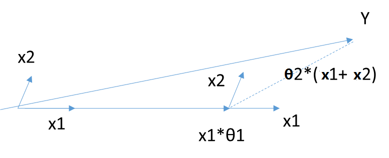

线性回归可以说是机器学习中最基本的问题类型了。

# 线性回归的模型函数和损失函数

线性回归遇到的问题一般是这样的。我们有m个样本，每个样本对应于n维特征和一个结果输出，如下：

$$
(x_1^{(0)}, x_2^{(0)}, ...x_n^{(0)}, y_0), (x_1^{(1)}, x_2^{(1)}, ...x_n^{(1)},y_1), ... (x_1^{(m)}, x_2^{(m)}, ...x_n^{(m)}, y_m)
$$

我们的问题是，对于一个新的$(x_1^{(x)}, x_2^{(x)}, ...x_n^{(x)}$, 他所对应的$y_x$是多少呢？ 如果这个问题里面的$y$是连续的，则是一个回归问题，否则是一个分类问题。

对于n维特征的样本数据，如果我们决定使用线性回归，那么对应的模型是这样的：
$$
h_\theta(x_1, x_2, ...x_n) = \theta_0 + \theta_{1}x_1 + ... + \theta_{n}x_{n}
$$
其中$\theta_i$ (i = 0,1,2... n)为模型参数，$x_i$ (i = 0,1,2... n)为每个样本的n个特征值。这个表示可以简化，我们增加一个特征$x_0$=1 ，这样就表示成：
$$
h_\theta(x_0, x_1, ...x_n) = \sum\limits_{i=0}^{n}\theta_{i}x_{i}
$$


进一步用**矩阵形式**表达更加简洁如下：
$$
h_\mathbf{\theta}(\mathbf{X}) = \mathbf{X\theta}
$$

其中， 假设函数$h_\mathbf{\theta}(\mathbf{X})$为mx1的向量, $\theta$为nx1的向量，里面有n个代数法的模型参数。$\mathbf{X}$为mxn维的矩阵。 m代表样本的个数，n代表样本的特征数。

得到了模型，我们需要求出需要的损失函数，一般线性回归我们用均方误差作为损失函数。**损失函数**的代数法表示如下：

$$
J(\theta_0, \theta_1..., \theta_n) = \sum\limits_{i=0}^{m}(h_\theta(x_0, x_1, ...x_n) - y_i)^2
$$
进一步用矩阵形式表达**损失函数**：
$$
J(\mathbf\theta) = \frac{1}{2}(\mathbf{X\theta} - \mathbf{Y})^T(\mathbf{X\theta} - \mathbf{Y})
$$


# 线性回归的算法

## 代数形式

**预测值与误差**:   
$$
y^{(i)} = \theta^Tx^{(i)}+\epsilon^{(i)}
$$
由于误差服从**高斯分布**： 
$$
p(\epsilon^{(i)})=\frac{1}{\sqrt{2\pi}\sigma}exp\left(-\frac{{(y^{(i)}-\theta^Tx^{(i)})}^2}{2\sigma^2}\right)
$$
代入上式有:
$$
p(y^{(i)}|x^{(i)};\theta)=\frac{1}{\sqrt{2\pi}\sigma}exp\left(-\frac{{(y^{(i)}-\theta^Tx^{(i)})}^2}{2\sigma^2}\right)
$$
**似然函数**

解释：什么样的参数跟我们的数据组合后恰好是真实值
$$
L(\theta) = \prod_{1}^{m}{p(y^{(i)}|x^{(i)};\theta)}
= \prod_{1}^{m}{\frac{1}{\sqrt{2\pi}\sigma}exp\left(-\frac{{(y^{(i)}-\theta^Tx^{(i)})}^2}{2\sigma^2}\right)}
$$
**对数似然**

解释：乘法难解，加法就容易了，对数里面乘法可以转换成加法
$$
logL(\theta) = log\prod_{1}^{m}{\frac{1}{\sqrt{2\pi}\sigma}exp\left(-\frac{{(y^{(i)}-\theta^Tx^{(i)})}^2}{2\sigma^2}\right)}
$$
展开化简 ：
$$
\begin{align}
\sum_{1}^{m}log{\frac{1}{\sqrt{2\pi}\sigma}  
exp\left(-\frac{{(y^{(i)}-\theta^Tx^{(i)})}^2}{2\sigma^2}\right)}\\
= mlog\frac{1}{\sqrt{2\pi}\sigma} - \frac{1}{\sigma^2}*\frac{1}{2}
\sum_{1}^{m}{(y^{(i)}-\theta^Tx^{(i)})}^2
\end{align}
$$


## 矩阵形式

**目标函数**  
$$
J(\theta)= = \frac{1}{2} {(X\theta-y)}^T {(X\theta-y)}
$$
> 如果采用**最小二乘法**，求偏导：  

$$
\begin{align}
\triangledown_\theta J(\theta)&
=\triangledown_\theta \left( \frac{1}{2} {(X\theta-y)}^T {(X\theta-y)} \right)\\&
=\triangledown_\theta \left( \frac{1}{2} {(\theta^TX^T-y^T)} {(\theta X-y)} \right)\\&
=\triangledown_\theta \left( \frac{1}{2} {(\theta^T X^T X\theta}-{\theta^T X^T y} - {y^T X \theta} + {y^T y})  \right)\\&
=\frac{1}{2} \left( {2X^T X\theta} - {X^T y} - {(y^T X)}^T \right)\\&
=X^T X \theta - X^T y
\end{align}
$$

偏导等于0：
$$
\begin{align}
\theta = {\left( X^T X \right)}^{-1} X^T y
\end{align}
$$


> 如果采用**梯度下降法**，则$\mathbf{\theta}$的迭代公式是这样的：

损失函数对于$\mathbf\theta$向量的偏导数计算如下：
$$
\frac{\partial}{\partial\mathbf\theta}J(\mathbf\theta) = \mathbf{X}^T(\mathbf{X\theta} - \mathbf{Y})
$$


$\mathbf\theta$向量的更新表达式如下：
$$
\mathbf\theta= \mathbf\theta - \alpha\mathbf{X}^T(\mathbf{X\theta} - \mathbf{Y})
$$
通过若干次迭代后，我们可以得到最终的$\mathbf{\theta}$的结果。

$$
\mathbf{\theta} = (\mathbf{X^{T}X})^{-1}\mathbf{X^{T}Y}
$$
当然线性回归，还有其他的常用算法，比如牛顿法和拟牛顿法，这里不详细描述。


# 线性回归的推广：多项式回归

回到我们开始的线性模型，$h_\theta(x_1, x_2, ...x_n) = \theta_0 + \theta_{1}x_1 + ... + \theta_{n}x_{n}$, 如果这里不仅仅是$x$的一次方，比如增加二次方，那么模型就变成了多项式回归。这里写一个只有两个特征的p次方多项式回归的模型：

$$
h_\theta(x_1, x_2) = \theta_0 + \theta_{1}x_1 + \theta_{2}x_{2} + \theta_{3}x_1^{2} + \theta_{4}x_2^{2} + \theta_{5}x_{1}x_2
$$

我们令$x_0 = 1, x_1 = x_1, x_2 = x_2, x_3 =x_1^{2}, x_4 = x_2^{2}, x_5 =  x_{1}x_2$ ,这样我们就得到了下式：
$$
h_\theta(x_1, x_2) = \theta_0 + \theta_{1}x_1 + \theta_{2}x_{2} + \theta_{3}x_3 + \theta_{4}x_4 + \theta_{5}x_5
$$

可以发现，我们又重新回到了线性回归，这是一个五元线性回归，可以用线性回归的方法来完成算法。对于每个二元样本特征$(x_1,x_2)$,我们得到一个五元样本特征$(1, x_1, x_2, x_{1}^2, x_{2}^2, x_{1}x_2)$，通过这个改进的五元样本特征，我们重新**把不是线性回归的函数变回线性回归**。


# 线性回归的推广：广义线性回归

在上一节的线性回归的推广中，我们对样本特征端做了推广，这里我们对于特征$y$做推广。比如我们的输出$\mathbf{Y}$不满足和$\mathbf{X}$的线性关系，但是$ln\mathbf{Y}$和$\mathbf{X}$满足线性关系，模型函数如下：
$$
ln\mathbf{Y} = \mathbf{X\theta}
$$

这样对与每个样本的输入y，我们用 lny去对应， 从而仍然可以用线性回归的算法去处理这个问题。我们把 Iny一般化，假设这个函数是单调可微函数$\mathbf{g}(.)$,　则一般化的广义线性回归形式是：

$\mathbf{g}(\mathbf{Y}) = \mathbf{X\theta}$　或者　$\mathbf{Y} = \mathbf{g^{-1}}(\mathbf{X\theta})$

这个函数$\mathbf{g}(.)$我们通常称为**联系函数**。


# 线性回归的正则化

为了防止模型的过拟合，我们在建立线性模型的时候经常需要加入正则化项。一般有L1正则化和L2正则化。


## L1正则化

线性回归的L1正则化通常称为**Lasso回归**，它和一般线性回归的区别是在损失函数上增加了一个L1正则化的项，L1正则化的项有一个常数系数$\alpha$来调节损失函数的均方差项和正则化项的权重，具体Lasso回归的损失函数表达式如下：
$$
J(\mathbf\theta) = \frac{1}{2}(\mathbf{X\theta} - \mathbf{Y})^T(\mathbf{X\theta} - \mathbf{Y}) + \alpha||\theta||_1
$$

其中n为样本个数，$\alpha$为常数系数，需要进行调优。$||\theta||_1$为L1范数。


**Lasso回归可以使得一些特征的系数变小，甚至还是一些绝对值较小的系数直接变为0。增强模型的泛化能力。**

Lasso回归的求解办法一般有**坐标轴下降法**（coordinate descent）和**最小角回归法**（ Least Angle Regression）


## L2正则化

线性回归的L2正则化通常称为**Ridge回归**，它和一般线性回归的区别是在损失函数上增加了一个L2正则化的项，和Lasso回归的区别是Ridge回归的正则化项是L2范数，而Lasso回归的正则化项是L1范数。具体Ridge回归的损失函数表达式如下：

$$
J(\mathbf\theta) = \frac{1}{2}(\mathbf{X\theta} - \mathbf{Y})^T(\mathbf{X\theta} - \mathbf{Y}) + \frac{1}{2}\alpha||\theta||_2^2
$$

其中$\alpha$为常数系数，需要进行调优。$||\theta||_2$为L2范数。

**Ridge回归在不抛弃任何一个特征的情况下，缩小了回归系数，使得模型相对而言比较的稳定，但和Lasso回归比，这会使得模型的特征留的特别多，模型解释性差。**

Ridge回归的求解比较简单，一般用最小二乘法。这里给出用最小二乘法的矩阵推导形式，和普通线性回归类似。

令$J(\mathbf\theta)$的导数为0，得到下式：
$$
\mathbf{X^T(X\theta - Y) + \alpha\theta} = 0
$$


整理即可得到最后的$\theta$的结果：
$$
\mathbf{\theta = (X^TX + \alpha E)^{-1}X^TY}
$$

 其中$E$为单位矩阵。

除了上面这两种常见的线性回归正则化，还有一些其他的线性回归正则化算法，区别主要就在于正则化项的不同，和损失函数的优化方式不同，这里就不累述了。


# scikit-learn线性回归

## 获取数据，定义问题

数据的介绍在这：[点击](http://archive.ics.uci.edu/ml/datasets/Combined+Cycle+Power+Plant), 

数据的下载地址在这：[点击](http://archive.ics.uci.edu/ml/machine-learning-databases/00294/)

里面是一个循环发电场的数据，共有9568个样本数据，每个数据有5列，分别是:   **AT（温度）、 V（压力）、AP（湿度）、 RH（压强）、PE（输出电力)**

我们的问题是得到一个线性的关系，对应PE是样本输出，而AT/V/AP/RH这4个是样本特征， 机器学习的目的就是得到一个线性回归模型，即:
$$
PE = \theta_0 + \theta_1*AT + \theta_2*V + \theta_3*AP + \theta_4*RH
$$

而需要学习的，就是$\theta_0, \theta_1, \theta_2, \theta_3, \theta_4$这5个参数。

## 读取数据


```python
import matplotlib.pyplot as plt
%matplotlib inline

import numpy as np
import pandas as pd
from sklearn import datasets, linear_model

data = pd.read_csv('data/ccpp.xlsx')
data.head()
```


<table border="1" class="dataframe">
  <thead>
    <tr style="text-align: right;">
      <th></th>
      <th>AT</th>
      <th>V</th>
      <th>AP</th>
      <th>RH</th>
      <th>PE</th>
    </tr>
  </thead>
  <tbody>
    <tr>
      <th>0</th>
      <td>8.34</td>
      <td>40.77</td>
      <td>1010.84</td>
      <td>90.01</td>
      <td>480.48</td>
    </tr>
    <tr>
      <th>1</th>
      <td>23.64</td>
      <td>58.49</td>
      <td>1011.40</td>
      <td>74.20</td>
      <td>445.75</td>
    </tr>
    <tr>
      <th>2</th>
      <td>29.74</td>
      <td>56.90</td>
      <td>1007.15</td>
      <td>41.91</td>
      <td>438.76</td>
    </tr>
    <tr>
      <th>3</th>
      <td>19.07</td>
      <td>49.69</td>
      <td>1007.22</td>
      <td>76.79</td>
      <td>453.09</td>
    </tr>
    <tr>
      <th>4</th>
      <td>11.80</td>
      <td>40.66</td>
      <td>1017.13</td>
      <td>97.20</td>
      <td>464.43</td>
    </tr>
  </tbody>
</table>


```python
data.shape
```


    (9568, 5)


```python
X = data[['AT', 'V', 'AP', 'RH']]
X.head()
```

<table border="1" class="dataframe">
  <thead>
    <tr style="text-align: right;">
      <th></th>
      <th>AT</th>
      <th>V</th>
      <th>AP</th>
      <th>RH</th>
    </tr>
  </thead>
  <tbody>
    <tr>
      <th>0</th>
      <td>8.34</td>
      <td>40.77</td>
      <td>1010.84</td>
      <td>90.01</td>
    </tr>
    <tr>
      <th>1</th>
      <td>23.64</td>
      <td>58.49</td>
      <td>1011.40</td>
      <td>74.20</td>
    </tr>
    <tr>
      <th>2</th>
      <td>29.74</td>
      <td>56.90</td>
      <td>1007.15</td>
      <td>41.91</td>
    </tr>
    <tr>
      <th>3</th>
      <td>19.07</td>
      <td>49.69</td>
      <td>1007.22</td>
      <td>76.79</td>
    </tr>
    <tr>
      <th>4</th>
      <td>11.80</td>
      <td>40.66</td>
      <td>1017.13</td>
      <td>97.20</td>
    </tr>
  </tbody>
</table>


```python
y = data[['PE']]
y.head()
```

<table border="1" class="dataframe">
  <thead>
    <tr style="text-align: right;">
      <th></th>
      <th>PE</th>
    </tr>
  </thead>
  <tbody>
    <tr>
      <th>0</th>
      <td>480.48</td>
    </tr>
    <tr>
      <th>1</th>
      <td>445.75</td>
    </tr>
    <tr>
      <th>2</th>
      <td>438.76</td>
    </tr>
    <tr>
      <th>3</th>
      <td>453.09</td>
    </tr>
    <tr>
      <th>4</th>
      <td>464.43</td>
    </tr>
  </tbody>
</table>


## 划分训练集和测试集


```python
from sklearn.model_selection import train_test_split

X_train, X_test, y_train, y_test = train_test_split(
    X, y, test_size=0.25, random_state=1)
```


```python
print(X_train.shape)
print(y_train.shape)
print(X_test.shape)
print(y_test.shape)
```

    (6410, 4)
    (6410, 1)
    (3158, 4)
    (3158, 1)

## 运行scikit-learn的线性模型


```python
from sklearn.linear_model import LinearRegression
linreg = LinearRegression()
linreg.fit(X_train, y_train)

print(linreg.intercept_)
print(linreg.coef_)
```


    [447.06297099]
    [[-1.97376045 -0.23229086  0.0693515  -0.15806957]]


$$
PE = 447.06297099 - 1.97376045*AT - 0.23229086*V + 0.0693515*AP -0.15806957*RH
$$


## 模型评价

我们需要评估我们的模型的好坏程度，对于线性回归来说，我们一般用均方差（Mean Squared Error, MSE）或者均方根差(Root Mean Squared Error, RMSE)在测试集上的表现来评价模型的好坏。

我们看看我们的模型的MSE和RMSE，代码如下：


```python
#模型拟合测试集
y_pred = linreg.predict(X_test)

from sklearn.metrics import mean_squared_error, mean_squared_error

# 用scikit-learn计算MSE
print("MSE:", mean_squared_error(y_test, y_pred))

# 用scikit-learn计算RMSE
print("RMSE:", np.sqrt(mean_squared_error(y_test, y_pred)))
```

    MSE: 20.080401202073897
    RMSE: 4.481116066570236


得到了MSE或者RMSE，如果我们用其他方法得到了不同的系数，需要选择模型时，就用MSE小的时候对应的参数。

比如这次我们用AT， V，AP这3个列作为样本特征。不要RH， 输出仍然是PE。代码如下：


```python
X = data[['AT', 'V', 'AP']]
y = data[['PE']]
X_train, X_test, y_train, y_test = train_test_split(X, y, random_state=1)

from sklearn.linear_model import LinearRegression
linreg = LinearRegression()
linreg.fit(X_train, y_train)

#模型拟合测试集
y_pred = linreg.predict(X_test)
from sklearn import metrics

# 用scikit-learn计算MSE
print("MSE:",metrics.mean_squared_error(y_test, y_pred))

# 用scikit-learn计算RMSE
print("RMSE:",np.sqrt(metrics.mean_squared_error(y_test, y_pred)))
```

    MSE: 23.208907470136232
    RMSE: 4.81756239919487


可以看出，去掉RH后，模型拟合的没有加上RH的好，MSE变大了。

## 交叉验证

我们可以通过交叉验证来持续优化模型，代码如下，我们采用10折交叉验证，即cross_val_predict中的cv参数为10：


```python
from sklearn.model_selection import cross_val_predict

X = data[['AT', 'V', 'AP', 'RH']]
y = data[['PE']]
predicted = cross_val_predict(linreg, X, y, cv=10)

# 用scikit-learn计算MSE
print("MSE:", mean_squared_error(y, predicted))

# 用scikit-learn计算RMSE
print("RMSE:", np.sqrt(metrics.mean_squared_error(y, predicted)))
```

    MSE: 20.7955974619431
    RMSE: 4.560219014690314


可以看出，采用交叉验证模型的MSE比前面的大，主要原因是我们这里是对所有折的样本做测试集对应的预测值的MSE，而前面仅仅对25%的测试集做了MSE。两者的先决条件并不同。


## 画图观察结果

这里画图真实值和预测值的变化关系，离中间的直线y=x直接越近的点代表预测损失越低。

代码如下：


```python
fig, ax = plt.subplots()
ax.scatter(y, predicted)
ax.plot([y.min(), y.max()], [y.min(), y.max()], 'k--', lw=4)
ax.set_xlabel('Measured')
ax.set_ylabel('Predicted')
plt.show()
```


# Lasso回归算法： 坐标轴下降法与最小角回归法

前面的文章对线性回归做了一个小结，里面对线程回归的正则化也做了一个初步的介绍。提到了线程回归的L2正则化-Ridge回归，以及线程回归的L1正则化-Lasso回归。但是对于Lasso回归的解法没有提及，本文是对该文的补充和扩展。

## 回顾线性回归

首先我们简要回归下线性回归的一般形式： 

$$
h_\mathbf{\theta}(\mathbf{X}) = \mathbf{X\theta}
$$

需要极小化的损失函数是： 
$$
J(\mathbf\theta) = \frac{1}{2}(\mathbf{X\theta} - \mathbf{Y})^T(\mathbf{X\theta} - \mathbf{Y})
$$

如果用梯度下降法求解，则每一轮$\theta$迭代的表达式是： 
$$
\mathbf\theta= \mathbf\theta - \alpha\mathbf{X}^T(\mathbf{X\theta} - \mathbf{Y})
$$

其中$\alpha$为步长。

如果用最小二乘法，则$\theta$的结果是：

$$
\mathbf{\theta} = (\mathbf{X^{T}X})^{-1}\mathbf{X^{T}Y}
$$


## 回顾Ridge回归

由于直接套用线性回归可能产生过拟合，我们需要加入正则化项，如果加入的是L2正则化项，就是Ridge回归，有时也翻译为脊回归。它和一般线性回归的区别是在损失函数上增加了一个L2正则化的项，和一个调节线性回归项和正则化项权重的系数$\alpha$。损失函数表达式如下：

$$
J(\mathbf\theta) = \frac{1}{2}(\mathbf{X\theta} - \mathbf{Y})^T(\mathbf{X\theta} - \mathbf{Y}) + \frac{1}{2}\alpha||\theta||_2^2
$$
其中$\alpha$为常数系数，需要进行调优。$||\theta||_2$为L2范数。

Ridge回归的解法和一般线性回归大同小异。如果采用梯度下降法，则每一轮$\theta$迭代的表达式是：

$$
\mathbf\theta= \mathbf\theta - (\beta\mathbf{X}^T(\mathbf{X\theta} - \mathbf{Y}) + \alpha\theta)
$$

其中$\beta$为步长。

如果用最小二乘法，则$\theta$的结果是：

$$
\mathbf{\theta = (X^TX + \alpha E)^{-1}X^TY}
$$


其中E为单位矩阵。

Ridge回归在不抛弃任何一个变量的情况下，缩小了回归系数，使得模型相对而言比较的稳定，但这会使得模型的变量特别多，模型解释性差。有没有折中一点的办法呢？即又可以防止过拟合，同时克服Ridge回归
模型变量多的缺点呢？有，这就是下面说的Lasso回归。

## 初识Lasso回归

Lasso回归有时也叫做线性回归的L1正则化，和Ridge回归的主要区别就是在正则化项，Ridge回归用的是L2正则化，而Lasso回归用的是L1正则化。Lasso回归的损失函数表达式如下：　

$$
J(\mathbf\theta) = \frac{1}{2n}(\mathbf{X\theta} - \mathbf{Y})^T(\mathbf{X\theta} - \mathbf{Y}) + \alpha||\theta||_1
$$

其中n为样本个数，$\alpha$为常数系数，需要进行调优。$||\theta||_1$为L1范数。　

Lasso回归使得一些系数变小，甚至还是一些绝对值较小的系数直接变为0，因此特别适用于参数数目缩减与参数的选择，因而用来估计稀疏参数的线性模型。

但是Lasso回归有一个很大的问题，导致我们需要把它单独拎出来讲，就是它的损失函数不是连续可导的，由于L1范数用的是绝对值之和，导致损失函数有不可导的点。也就是说，我们的最小二乘法，梯度下降法，牛顿法与拟牛顿法对它统统失效了。那我们怎么才能求有这个L1范数的损失函数极小值呢？

两种全新的求极值解法**坐标轴下降法**（coordinate descent）和**最小角回归法**（ Least Angle Regression， LARS）该隆重出场了。


# 用坐标轴下降法求解Lasso回归

坐标轴下降法顾名思义，是沿着坐标轴的方向去下降，这和梯度下降不同。梯度下降是沿着梯度的负方向下降。不过梯度下降和坐标轴下降的共性就都是迭代法，通过启发式的方式一步步迭代求解函数的最小值。

坐标轴下降法的数学依据主要是这个结论（此处不做证明）：一个可微的凸函数$J(\theta)$, 其中$\theta$是nx1的向量，即有n个维度。如果在某一点$\overline\theta$，使得$J(\theta)$在每一个坐标轴$\overline\theta_i$(i = 1,2,...n)上都是最小值，那么$J(\overline\theta_i)$就是一个全局的最小值。

于是我们的优化目标就是在$\theta$的n个坐标轴上(或者说向量的方向上)对损失函数做迭代的下降，当所有的坐标轴上的$\theta_i$(i = 1,2,...n)都达到收敛时，我们的损失函数最小，此时的$\theta$即为我们要求的结果。

下面我们看看具体的算法过程：

1. 首先，我们把$\theta$向量随机取一个初值。记为$\theta^{(0)}$ ，上面的括号里面的数字代表我们迭代的轮数，当前初始轮数为0
2. 对于第k轮的迭代。我们从$\theta_1^{(k)}$开始，到$\theta_n^{(k)}$为止，依次求$\theta_i^{(k)}$。$\theta_i^{(k)}$的表达式如下：

$$
  \theta_i^{(k)}  \in \underbrace{argmin}_{\theta_i} J(\theta_1^{(k)}, \theta_2^{(k)}, ... \theta_{i-1}^{(k)}, \theta_i, \theta_{i+1}^{(k-1)}, ..., \theta_n^{(k-1)})
$$


也就是说$\theta_i^{(k)}$是使$J(\theta_1^{(k)}, \theta_2^{(k)}, ... \theta_{i-1}^{(k)}, \theta_i, \theta_{i+1}^{(k-1)}, ..., \theta_n^{(k-1)})$最小化时候的$\theta_i$的值。此时$J(\theta)$只有$\theta_i^{(k)}$是变量，其余均为常量，因此最小值容易通过求导求得。

如果上面这个式子不好理解，我们具体一点，在第k轮，$\theta$向量的n个维度的迭代式如下：

$$
\theta_1^{(k)}  \in \underbrace{argmin}_{\theta_1} J(\theta_1, \theta_2^{(k-1)}, ... , \theta_n^{(k-1)})
$$

$$
\theta_2^{(k)}  \in \underbrace{argmin}_{\theta_2} J(\theta_1^{(k)}, \theta_2, \theta_3^{(k-1)}... , \theta_n^{(k-1)})
$$

$$
...
$$

$$
\theta_n^{(k)}  \in \underbrace{argmin}_{\theta_n} J(\theta_1^{(k)}, \theta_2^{(k)}, ... , \theta_{n-1}^{(k)}, \theta_n)
$$
3. 检查$\theta^{(k)}$向量和$\theta^{(k-1)}$向量在各个维度上的变化情况，如果在所有维度上变化都足够小，那么$\theta^{(k)}$即为最终结果，否则转入2，继续第k+1轮的迭代。

# 用最小角回归法求解Lasso回归

在介绍最小角回归前，我们先看看两个预备算法，好吧，这个算法真没有那么好讲。

## 前向选择（Forward Selection）算法

第一个预备算法是**前向选择（Forward Selection）算法**。

前向选择算法的原理是是一种典型的贪心算法。要解决的问题是对于:

$\mathbf{Y = X\theta}$这样的线性关系，如何求解系数向量$\mathbf{\theta}$的问题。其中$\mathbf{Y}$为 mx1的向量，$\mathbf{X}$为mxn的矩阵，$\mathbf{\theta}$为nx1的向量。m为样本数量，n为特征维度。

把矩阵$\mathbf{X}$看做n个mx1的向量$\mathbf{X_i}$(i=1,2,...n)，在$\mathbf{Y}$的\mathbf{X}变量$\mathbf{X_i}$(i =1,2,...m)中，选择和目标$\mathbf{Y}$最为接近(余弦距离最大)的一个变量$\mathbf{X_k}$，用$\mathbf{X_k}$来逼近$\mathbf{Y}$,得到下式：

$$
\overline{\mathbf{Y}} = \mathbf{X_k\theta_k}
$$

其中：$\mathbf{\theta_k}= \mathbf{\frac{<X_k, Y>}{||X_k||_2}}$ 

即：$\overline{\mathbf{Y}}$是$\mathbf{Y}$在$\mathbf{X_k}$上的投影。那么，可以定义残差(residual):$\mathbf{Y_{yes}} = \mathbf{Y - \overline{Y}}$。由于是投影，所以很容易知道$\mathbf{Y_{yes}} 和\mathbf{X_k}$是正交的。再以$\mathbf{Y_{yes}}$为新的因变量，去掉$\mathbf{X_k}$后，剩下的自变量的集合$\mathbf{X_i}$,i=1,2,3...k−1,k+1,...n}为新的自变量集合，重复刚才投影和残差的操作，直到残差为0，或者所有的自变量都用完了，才停止算法。


当$\mathbf{X}$只有2维时，例子如上图，和$\mathbf{Y}$最接近的是$\mathbf{X_1}$，首先在$\mathbf{X_1}$上面投影，残差如上图长虚线。此时$X_1\theta_1$模拟了$\mathbf{Y}$，$\theta$模拟了$\theta$(仅仅模拟了一个维度)。接着发现最接近的是$\mathbf{X_2}$，此时用残差接着在$\mathbf{X_2}$投影，残差如图中短虚线。由于没有其他自变量了，此时$X_1\theta_1+X_2\theta_2$模拟了$\mathbf{Y}$,对应的模拟了两个维度的$\theta$即为最终结果，此处$\theta$计算设计较多矩阵运算，这里不讨论。
此算法对每个变量只需要执行一次操作，效率高，速度快。但也容易看出，当自变量不是正交的时候，由于每次都是在做投影，所有算法只能给出一个局部近似解。因此，这个简单的算法太粗糙，还不能直接用于我们的Lasso回归。

以上就是坐标轴下降法的求极值过程，可以和梯度下降做一个比较：


a) 坐标轴下降法在每次迭代中在当前点处沿一个坐标方向进行一维搜索 ，固定其他的坐标方向，找到一个函数的局部极小值。而梯度下降总是沿着梯度的负方向求函数的局部最小值。  


b) 坐标轴下降优化方法是一种非梯度优化算法。在整个过程中依次循环使用不同的坐标方向进行迭代，一个周期的一维搜索迭代过程相当于一个梯度下降的迭代。  


c) 梯度下降是利用目标函数的导数来确定搜索方向的，该梯度方向可能不与任何坐标轴平行。而坐标轴下降法法是利用当前坐标方向进行搜索，不需要求目标函数的导数，只按照某一坐标方向进行搜索最小值。  


d) 两者都是迭代方法，且每一轮迭代，都需要O(mn)的计算量(m为样本数，n为系数向量的维度)

## 前向梯度（Forward Stagewise）算法

第二个预备算法是**前向梯度（Forward Stagewise）算法**。

前向梯度算法和前向选择算法有类似的地方，也是在$\mathbf{Y}$的$\mathbf{X}$变量$\mathbf{X_i}$(i =1,2,...n)中，选择和目标$\mathbf{Y}$最为接近(余弦距离最大)的一个变量$\mathbf{X_k}$，用$\mathbf{X_k}$来逼近$\mathbf{Y}$，但是前向梯度算法不是粗暴的用投影，而是每次在最为接近的自变量$\mathbf{X_t}$的方向移动一小步，然后再看残差$\mathbf{Y_{yes}}$和哪个$\mathbf{X_i}$(i =1,2,...n)最为接近。此时我们也不会把$\mathbf{X_t}$去除，因为我们只是前进了一小步，有可能下面最接近的自变量还是$\mathbf{X_t}$。如此进行下去，直到残差$\mathbf{Y_{yes}}$减小到足够小，算法停止。


当$\mathbf{X}$只有2维时，例子如上图，和$\mathbf{Y}$最接近的是$\mathbf{X_1}$，首先在$\mathbf{X_1}$上面走一小段距离，此处$\varepsilon$为一个较小的常量，发现此时的残差还是和$\mathbf{X_1}$最接近。那么接着沿$\mathbf{X_1}$走，一直走到发现残差不是和$\mathbf{X_1}$最接近，而是和$\mathbf{X_2}$最接近，此时残差如上图长虚线。接着沿着$\mathbf{X_2}$走一小步，发现残差此时又和$\mathbf{X_1}$最接近，那么开始沿着$\mathbf{X_1}$走，走完一步后发现残差为0，那么算法停止。此时$\mathbf{Y}$由刚才所有的所有步相加而模拟，对应的算出的系数$\theta$即为最终结果。此处$\theta$计算设计较多矩阵运算，这里不讨论。

当算法在$\varepsilon$很小的时候，可以很精确的给出最优解，当然，其计算的迭代次数也是大大的增加。和前向选择算法相比，前向梯度算法更加精确，但是更加复杂。

有没有折中的办法可以综合前向梯度算法和前向选择算法的优点，做一个折中呢？有！这就是终于要出场的最小角回归法。

## 最小角回归(Least Angle Regression， LARS)算法

好吧，最小角回归(Least Angle Regression， LARS)算法终于出场了。最小角回归法对前向梯度算法和前向选择算法做了折中，保留了前向梯度算法一定程度的精确性，同时简化了前向梯度算法一步步迭代的过程。具体算法是这样的：　

首先，还是找到与因变量$\mathbf{Y}$最接近或者相关度最高的自变量$\mathbf{X_k}$，使用类似于前向梯度算法中的残差计算方法，得到新的目标$\mathbf{Y_{yes}}$，此时不用和前向梯度算法一样小步小步的走。而是直接向前走直到出现一个$\mathbf{X_t}$，使得$\mathbf{X_t}$和$\mathbf{Y_{yes}}$的相关度和$\mathbf{X_k}$与$\mathbf{Y_{yes}}$的相关度是一样的，此时残差$\mathbf{Y_{yes}}$就在$\mathbf{X_t}$和$\mathbf{X_k}$的角平分线方向上，此时我们开始沿着这个残差角平分线走，直到出现第三个特征$\mathbf{X_p}$和$\mathbf{Y_{yes}}$的相关度足够大的时候，即$\mathbf{X_p}$到当前残差$\mathbf{Y_{yes}}$的相关度和$\theta_t$，$\theta_k$与$\mathbf{Y_{yes}}$的一样。将其也叫入到$\mathbf{Y}$的逼近特征集合中，并用$\mathbf{Y}$的逼近特征集合的共同角分线，作为新的逼近方向。以此循环，直到$\mathbf{Y_{yes}}$足够的小，或者说所有的变量都已经取完了，算法停止。此时对应的系数$\theta$即为最终结果。




当$\theta$只有2维时，例子如上图，和$\mathbf{Y}$最接近的是$\mathbf{X_1}$，首先在$\mathbf{X_1}$上面走一段距离，一直到残差在$\mathbf{X_1}$和$\mathbf{X_2}$的角平分线上，此时沿着角平分线走，直到残差最够小时停止，此时对应的系数$\beta$即为最终结果。此处$\theta$计算设计较多矩阵运算，这里不讨论。

## 最小角回归优缺点

最小角回归法是一个适用于高维数据的回归算法，

其主要的**优点**有：

1. 特别适合于特征维度n 远高于样本数m的情况。
2. 算法的最坏计算复杂度和最小二乘法类似，但是其计算速度几乎和前向选择算法一样
3. 可以产生分段线性结果的完整路径，这在模型的交叉验证中极为有用

主要的**缺点**是：

由于LARS的迭代方向是根据目标的残差而定，所以该算法对样本的噪声极为敏感。

## 总结


Lasso回归是在ridge回归的基础上发展起来的，如果模型的特征非常多，需要压缩，那么Lasso回归是很好的选择。一般的情况下，普通的线性回归模型就够了。

另外，本文对最小角回归法怎么求具体的θ参数值没有提及，仅仅涉及了原理，如果对具体的算计推导有兴趣，可以参考Bradley Efron的论文《Least Angle Regression》，网上很容易找到。


# 用scikit-learn学习Ridge回归

## Ridge回归的损失函数

在我的另外一遍讲线性回归的文章中，对Ridge回归做了一些介绍，以及什么时候适合用 Ridge回归。如果对什么是Ridge回归还完全不清楚的建议阅读我这篇文章。

Ridge回归的损失函数表达形式是：

$$
J(\mathbf\theta) = \frac{1}{2}(\mathbf{X\theta} - \mathbf{Y})^T(\mathbf{X\theta} - \mathbf{Y}) + \frac{1}{2}\alpha||\theta||_2^2
$$
其中$\alpha$为常数系数，需要进行调优。$||\theta||_2$为L2范数。

算法需要解决的就是在找到一个合适的超参数$\alpha$情况下，求出使$J(\mathbf\theta)$最小的$\theta$。一般可以用梯度下降法和最小二乘法来解决这个问题。scikit-learn用的是最小二乘法。


## 数据读取与训练集测试集划分


```python
import matplotlib.pyplot as plt
%matplotlib inline
import numpy as np
import pandas as pd
from sklearn import datasets, linear_model
```


```python
data = pd.read_csv('./ccpp.csv')
```


```python
X = data[['AT', 'V', 'AP', 'RH']]
y = data[['PE']]
```


```python
from sklearn.model_selection import train_test_split
X_train, X_test, y_train, y_test = train_test_split(X, y, random_state=1)
```

## 用scikit-learn运行Ridge回归

要运行Ridge回归，我们必须要指定超参数$\alpha$。你也许会问：“我也不知道超参数是多少啊？” 我也不知道，那么我们随机指定一个(比如1)，后面我们会讲到用交叉验证从多个输入超参数$\alpha$中快速选择最优超参数的办法。


```python
from sklearn.linear_model import Ridge
ridge = Ridge(alpha=1)
ridge.fit(X_train, y_train)
```


    Ridge(alpha=1, copy_X=True, fit_intercept=True, max_iter=None,
       normalize=False, random_state=None, solver='auto', tol=0.001)


```python
print(ridge.coef_)
print(ridge.intercept_)
```

    [[-1.97373209 -0.2323016   0.06935852 -0.15806479]]
    [447.05552892]


也就是说我们得到的模型是：
$$PE = 447.05552892 - 1.97373209*AT - 0.2323016*V + 0.06935852*AP - 0.15806479*RH$$

但是这样还没有完？为什么呢，因为我们假设了超参数$\alpha$为1， 实际上我们并不知道超参数$\alpha$取多少最好，实际研究是需要在多组自选的$\alpha$中选择一个最优的。

那么我们是不是要把上面这段程序在N种$\alpha$的值情况下，跑N遍，然后再比较结果的优劣程度呢？ 可以这么做，但是scikit-learn提供了另外一个交叉验证选择最优$\alpha$的API，下面我们就用这个API来选择$\alpha$。


## 用scikit-learn选择Ridge回归超参数$\alpha$

这里我们假设我们想在这10个$\alpha$值中选择一个最优的值。代码如下：


```python
from sklearn.linear_model import RidgeCV
ridgecv = RidgeCV(alphas=[0.01, 0.1, 0.5, 1, 3, 5, 7, 10, 20, 100])
ridgecv.fit(X_train, y_train)
ridgecv.alpha_ 
```


    7.0


## 用scikit-learn研究超参数$\alpha$和回归系数$\theta$的关系

通过Ridge回归的损失函数表达式可以看到，$\alpha$越大，那么正则项惩罚的就越厉害，得到回归系数$\theta$就越小，最终趋近与0。而如果$\alpha$越小，即正则化项越小，那么回归系数$\theta$就越来越接近于普通的线性回归系数。


```python
import numpy as np
import matplotlib.pyplot as plt
from sklearn import linear_model
%matplotlib inline
```

接着我们自己生成一个10x10的矩阵X，表示一组有10个样本，每个样本有10个特征的数据。生成一个10x1的向量y代表样本输出。


```python
# X is a 10x10 matrix
X = 1. / (np.arange(1, 11) + np.arange(0, 10)[:, np.newaxis])
# y is a 10 x 1 vector
y = np.ones(10)
```

这样我们的数据有了，接着就是准备超参数$\alpha$了。我们准备了200个超参数，来分别跑Ridge回归。准备这么多的目的是为了后面画图看$\alpha$和$\theta$的关系


```python
n_alphas = 200
# alphas count is 200, 都在10的-10次方和10的-2次方之间
alphas = np.logspace(-10, -2, n_alphas)
```

有了这200个超参数$\alpha$，我们做200次循环，分别求出各个超参数对应的$\theta$(10个维度)，存起来后面画图用。


```python
clf = linear_model.Ridge(fit_intercept=False)
coefs = []
# 循环200次
for a in alphas:
    #设置本次循环的超参数
    clf.set_params(alpha=a)
    #针对每个alpha做ridge回归
    clf.fit(X, y)
    # 把每一个超参数alpha对应的theta存下来
    coefs.append(clf.coef_)
```

好了，有了200个超参数$\alpha$，以及对应的$\theta$，我们可以画图了。我们的图是以$\alpha$为x轴，$\theta$的10个维度为y轴画的。代码如下：


```python
ax = plt.gca()

ax.plot(alphas, coefs)
#将alpha的值取对数便于画图
ax.set_xscale('log')
#翻转x轴的大小方向，让alpha从大到小显示
ax.set_xlim(ax.get_xlim()[::-1]) 
plt.xlabel('alpha')
plt.ylabel('weights')
plt.title('Ridge coefficients as a function of the regularization')
plt.axis('tight')
plt.show()
```


从图上也可以看出，当$\alpha$比较大，接近于$10^{-2}$的时候，$\theta$的10个维度都趋于0。而当$\alpha$比较小，接近于$10^{-10}$的时候，$\theta$的10个维度都趋于线性回归的回归系数。


# scikit-learn 线性回归算法库小结

scikit-learn对于线性回归提供了比较多的类库，这些类库都可以用来做线性回归分析，本文就对这些类库的使用做一个总结，重点讲述这些线性回归算法库的不同和各自的使用场景。

线性回归的目的是要得到输出向量$\mathbf{Y}$和输入特征$\mathbf{X}$之间的线性关系，求出线性回归系数$\mathbf\theta$,也就是$\mathbf{Y = X\theta}$。其中$\mathbf{Y}$的维度为mx1，$\mathbf{X}$的维度为mxn，而$\mathbf\theta$的维度为nx1。m代表样本个数，n代表样本特征的维度。

为了得到线性回归系数$\mathbf\theta$，我们需要定义一个损失函数，一个极小化损失函数的优化方法，以及一个验证算法的方法。损失函数的不同，损失函数的优化方法的不同，验证方法的不同，就形成了不同的线性回归算法。scikit-learn中的线性回归算法库可以从这这三点找出各自的不同点。理解了这些不同点，对不同的算法使用场景也就好理解了。


## LinearRegression

### 损失函数

LinearRegression类就是我们平时说的最常见普通的线性回归，它的损失函数也是最简单的，如下：
$$
J(\mathbf\theta) = \frac{1}{2}(\mathbf{X\theta} - \mathbf{Y})^T(\mathbf{X\theta} - \mathbf{Y})
$$


### 损失函数的优化方法

对于这个损失函数，一般有梯度下降法和最小二乘法两种极小化损失函数的优化方法，而scikit中的LinearRegression类用的是最小二乘法。通过最小二乘法，可以解出线性回归系数$\theta$为：

$$
\mathbf{\theta} = (\mathbf{X^{T}X})^{-1}\mathbf{X^{T}Y}
$$


### 验证方法

LinearRegression类并没有用到交叉验证之类的验证方法，需要我们自己把数据集分成训练集和测试集，然后训练优化。

### 使用场景

一般来说，只要我们觉得数据有线性关系，LinearRegression类是我们的首先。如果发现拟合或者预测的不好，再考虑用其他的线性回归库。如果是学习线性回归，推荐先从这个类开始第一步的研究。


## Ridge

### 损失函数

由于第一节的LinearRegression没有考虑过拟合的问题，有可能泛化能力较差，这时损失函数可以加入正则化项，如果加入的是L2范数的正则化项，这就是Ridge回归。损失函数如下：
$$
J(\mathbf\theta) = \frac{1}{2}(\mathbf{X\theta} - \mathbf{Y})^T(\mathbf{X\theta} - \mathbf{Y}) + \frac{1}{2}\alpha||\theta||_2^2
$$

其中$\alpha$为常数系数，需要进行调优。$||\theta||_2$为L2范数。

　Ridge回归在不抛弃任何一个特征的情况下，缩小了回归系数，使得模型相对而言比较的稳定，不至于过拟合。

### 损失函数的优化方法

对于这个损失函数，一般有梯度下降法和最小二乘法两种极小化损失函数的优化方法，而scikit中的Ridge类用的是最小二乘法。通过最小二乘法，可以解出线性回归系数θ为：
$$
\mathbf{\theta = (X^TX + \alpha E)^{-1}X^TY}
$$
其中E为单位矩阵。

### 验证方法

Ridge类并没有用到交叉验证之类的验证方法，需要我们自己把数据集分成训练集和测试集，需要自己设置好超参数$\alpha$。然后训练优化。

### 使用场景

一般来说，只要我们觉得数据有线性关系，用LinearRegression类拟合的不是特别好，需要正则化，可以考虑用Ridge类。但是这个类最大的缺点是每次我们要自己指定一个超参数$\alpha$，然后自己评估$\alpha$的好坏，比较麻烦，一般我都用下一节讲到的RidgeCV类来跑Ridge回归，不推荐直接用这个Ridge类，除非你只是为了学习Ridge回归。


## RidgeCV

RidgeCV类的损失函数和损失函数的优化方法完全与Ridge类相同，区别在于验证方法。

### 验证方法

RidgeCV类对超参数$\alpha$使用了交叉验证，来帮忙我们选择一个合适的$\alpha$。在初始化RidgeCV类时候，我们可以传一组备选的$\alpha$值，10个，100个都可以。RidgeCV类会帮我们选择一个合适的$\alpha$。免去了我们自己去一轮轮筛选$\alpha$的苦恼。

### 使用场景

一般来说，只要我们觉得数据有线性关系，用LinearRegression类拟合的不是特别好，需要正则化，可以考虑用RidgeCV类。不是为了学习的话就不用Ridge类。为什么这里只是考虑用RidgeCV类呢？因为线性回归正则化有很多的变种，Ridge只是其中的一种。所以可能需要比选。如果输入特征的维度很高，而且是稀疏线性关系的话，RidgeCV类就不合适了。这时应该主要考虑下面几节要讲到的Lasso回归类家族。


## Lasso

### 损失函数

线性回归的L1正则化通常称为Lasso回归，它和Ridge回归的区别是在损失函数上增加了的是L1正则化的项，而不是L2正则化项。L1正则化的项也有一个常数系数$\alpha$来调节损失函数的均方差项和正则化项的权重，具体Lasso回归的损失函数表达式如下：

$$
J(\mathbf\theta) = \frac{1}{2m}(\mathbf{X\theta} - \mathbf{Y})^T(\mathbf{X\theta} - \mathbf{Y}) + \alpha||\theta||_1
$$

其中n为样本个数，$\alpha$为常数系数，需要进行调优。$||\theta||_1$为L1范数。

Lasso回归可以使得一些特征的系数变小，甚至还是一些绝对值较小的系数直接变为0。增强模型的泛化能力。

### 损失函数的优化方法

Lasso回归的损失函数优化方法常用的有两种，坐标轴下降法和最小角回归法。Lasso类采用的是坐标轴下降法，后面讲到的LassoLars类采用的是最小角回归法

### 验证方法

Lasso类并没有用到交叉验证之类的验证方法，和Ridge类类似。需要我们自己把数据集分成训练集和测试集，需要自己设置好超参数$\alpha$。然后训练优化。

### 使用场景

一般来说，对于高维的特征数据，尤其线性关系是稀疏的，我们会采用Lasso回归。或者是要在一堆特征里面找出主要的特征，那么Lasso回归更是首选了。但是Lasso类需要自己对$\alpha$调优，所以不是Lasso回归的首选，一般用到的是下一节要讲的LassoCV类。


## LassoCV

LassoCV类的损失函数和损失函数的优化方法完全与Lasso类相同，区别在于验证方法。

### 验证方法

LassoCV类对超参数$\alpha$使用了交叉验证，来帮忙我们选择一个合适的$\alpha$。在初始化LassoCV类时候，我们可以传一组备选的$\alpha$值，10个，100个都可以。LassoCV类会帮我们选择一个合适的$\alpha$。免去了我们自己去一轮轮筛选$\alpha$的苦恼。

### 使用场景

LassoCV类是进行Lasso回归的首选。当我们面临在一堆高位特征中找出主要特征时，LassoCV类更是必选。当面对稀疏线性关系时，LassoCV也很好用。


## LassoLars

LassoLars类的损失函数和验证方法与Lasso类相同，区别在于损失函数的优化方法。

### 损失函数的优化方法

Lasso回归的损失函数优化方法常用的有两种，坐标轴下降法和最小角回归法。LassoLars类采用的是最小角回归法，前面讲到的Lasso类采用的是坐标轴下降法。

### 使用场景

LassoLars类需要自己对$\alpha$调优，所以不是Lasso回归的首选，一般用到的是下一节要讲的LassoLarsCV类。


## LassoLarsCV

LassoLarsCV类的损失函数和损失函数的优化方法完全与LassoLars类相同，区别在于验证方法。

### 验证方法

LassoLarsCV类对超参数$\alpha$使用了交叉验证，来帮忙我们选择一个合适的$\alpha$。在初始化LassoLarsCV类时候，我们可以传一组备选的$\alpha$值，10个，100个都可以。LassoLarsCV类会帮我们选择一个合适的$\alpha$。免去了我们自己去一轮轮筛选$\alpha$的苦恼。

### 使用场景

LassoLarsCV类是进行Lasso回归的第二选择。第一选择是前面讲到LassoCV类。那么LassoLarsCV类有没有适用的场景呢？换句话说，用最小角回归法什么时候比坐标轴下降法好呢？

- 场景一：如果我们想探索超参数$\alpha$更多的相关值的话，由于最小角回归可以看到回归路径，此时用LassoLarsCV比较好。
- 场景二： 如果我们的样本数远小于样本特征数的话，用LassoLarsCV也比LassoCV好。其余场景最好用LassoCV。


## LassoLarsIC

LassoLarsIC类的损失函数和损失函数的优化方法完全与LassoLarsCV类相同，区别在于验证方法。

### 验证方法

LassoLarsIC类对超参数$\alpha$没有使用交叉验证，而是用 Akaike信息准则(AIC)和贝叶斯信息准则(BIC)。此时我们并不需要指定备选的$\alpha$值，而是由LassoLarsIC类基于AIC和BIC自己选择。用LassoLarsIC类我们可以一轮找到超参数$\alpha$，而用K折交叉验证的话，我们需要K+1轮才能找到。相比之下LassoLarsIC类寻找$\alpha$更快。

### 使用场景

从验证方法可以看出，验证αLassoLarsIC比LassoLarsCV快很多。那么是不是LassoLarsIC类一定比LassoLarsCV类好呢？ 不一定！由于使用了AIC和BIC准则，我们的数据必须满足一定的条件才能用LassoLarsIC类。这样的准则需要对解的自由度做一个适当的估计。该估计是来自大样本（渐近结果），并假设该模型是正确的（即这些数据确实是由假设的模型产生的）。当待求解的问题的条件数很差的时候（比如特征个数大于样本数量的时候），这些准则就会有崩溃的风险。所以除非我们知道数据是来自一个模型确定的大样本，并且样本数量够大，我们才能用LassoLarsIC。而实际上我们得到的数据大部分都不能满足这个要求，实际应用中我没有用到过这个看上去很美的类。


## ElasticNet

### 损失函数

ElasticNet可以看做Lasso和Ridge的中庸化的产物。它也是对普通的线性回归做了正则化，但是它的损失函数既不全是L1的正则化，也不全是L2的正则化，而是用一个权重参数ρ来平衡L1和L2正则化的比重，形成了一个全新的损失函数如下：
$$
J(\mathbf\theta) = \frac{1}{2m}(\mathbf{X\theta} - \mathbf{Y})^T(\mathbf{X\theta} - \mathbf{Y}) + \alpha\rho||\theta||_1 + \frac{\alpha(1-\rho)}{2}||\theta||_2^2
$$
其中$\alpha$为正则化超参数，$\rho$为范数权重超参数。


### 损失函数的优化方法

ElasticNet回归的损失函数优化方法常用的有两种，坐标轴下降法和最小角回归法。ElasticNet类采用的是坐标轴下降法。

### 验证方法

ElasticNet类并没有用到交叉验证之类的验证方法，和Lasso类类似。需要我们自己把数据集分成训练集和测试集，需要自己设置好超参数$\alpha$和$\rho$。然后训练优化。　

### 使用场景

ElasticNet类需要自己对$\alpha$和$\rho$调优，所以不是ElasticNet回归的首选，一般用到的是下一节要讲的ElasticNetCV类。


## ElasticNetCV

ElasticNetCV类的损失函数和损失函数的优化方法完全与ElasticNet类相同，区别在于验证方法。

### 验证方法

ElasticNetCV类对超参数$\alpha$和$\rho$使用了交叉验证，来帮忙我们选择合适的$\alpha$和$\rho$。在初始化ElasticNetCV类时候，我们可以传一组备选的$\alpha$值和$\rho$，10个，100个都可以。ElasticNetCV类会帮我们选择一个合适的$\alpha$和$\rho$。免去了我们自己去一轮轮筛选$\alpha$和$\rho$的苦恼。

### 使用场景

ElasticNetCV类用在我们发现用Lasso回归太过（太多特征被稀疏为0），而用Ridge回归又正则化的不够（回归系数衰减的太慢）的时候。一般不推荐拿到数据就直接就上ElasticNetCV。


## OrthogonalMatchingPursuit

### 损失函数

OrthogonalMatchingPursuit（OMP）算法和普通的线性回归损失函数的区别是增加了一个限制项，来限制回归系数中非0元素的最大个数。形成了一个全新的损失函数如下：

$$
J(\mathbf\theta) = \frac{1}{2}(\mathbf{X\theta} - \mathbf{Y})^T(\mathbf{X\theta} - \mathbf{Y})
$$

subject to $||\theta||_0 \leq n_{non-zero-coefs}$,其中$(||\theta||_0$代表$\theta$的L0范数，即非0回归系数的个数。


### 损失函数的优化方法

OrthogonalMatchingPursuit类使用前向选择算法来优化损失函数。它是最小角回归算法的缩水版。虽然精度不如最小角回归算法，但是运算速度很快。

### 验证方法

OrthogonalMatchingPursuit类并没有用到交叉验证之类的验证方法，和Lasso类类似。需要我们自己把数据集分成训练集和测试集，需要自己选择限制参数nnon−zero−coefs。然后训练优化。

### 使用场景

OrthogonalMatchingPursuit类需要自己选择nnon−zero−coefs，所以不是OrthogonalMatchingPursuit回归的首选，一般用到的是下一节要讲的OrthogonalMatchingPursuitCV类，不过如果你已经定好了nnon−zero−coefs的值，那用OrthogonalMatchingPursuit比较方便。


## OrthogonalMatchingPursuitCV

OrthogonalMatchingPursuitCV类的损失函数和损失函数的优化方法完全与OrthogonalMatchingPursuit类相同，区别在于验证方法。

### 验证方法

OrthogonalMatchingPursuitCV类使用交叉验证，在S折交叉验证中以MSE最小为标准来选择最好的nnon−zero−coefs。

### 使用场景

OrthogonalMatchingPursuitCV类通常用在稀疏回归系数的特征选择上，这点和LassoCV有类似的地方。不过由于它的损失函数优化方法是前向选择算法，精确度较低，一般情况不是特别推荐用，用LassoCV就够，除非你对稀疏回归系数的精确个数很在意，那可以考虑用OrthogonalMatchingPursuitCV。


## MultiTaskLasso

从这节到第16节，类里面都带有一个“MultiTask”的前缀。不过他不是编程里面的多线程，而是指多个线性回归模型共享样本特征，但是有不同的回归系数和特征输出。具体的线性回归模型是$\mathbf{Y = XW}$。其中X是mxn维度的矩阵。W为nxk维度的矩阵，Y为mxk维度的矩阵。m为样本个数，n为样本特征，而k就代表多个回归模型的个数。所谓的“MultiTask”这里其实就是指k个线性回归的模型一起去拟合。

### 损失函数

由于这里是多个线性回归一起拟合，所以损失函数和前面的都很不一样：
$$
J(\mathbf{W}) = \frac{1}{2m}\mathbf{(||XW-Y||)_{Fro}^2} + \alpha||\mathbf{W}||_{21}
$$

其中， $\mathbf{(||XW-Y||)_{Fro}}$是$\mathbf{Y = XW}$的Frobenius范数。而$\mathbf{||W||_{21}}$代表W的各列的根平方和之和。

### 损失函数的优化方法

MultiTaskLasso类使用坐标轴下降法来优化损失函数。

### 验证方法

MultiTaskLasso类并没有用到交叉验证之类的验证方法，和Lasso类类似。需要我们自己把数据集分成训练集和测试集，需要自己设置好超参数α。然后训练优化。

### 使用场景

MultiTaskLasso类需要自己对α调优，所以不是共享特征协同回归的首选，一般用到的是下一节要讲的MultiTaskLassoCV类。


## MultiTaskLassoCV

MultiTaskLassoCV类的损失函数和损失函数的优化方法完全与MultiTaskLasso类相同，区别在于验证方法。

### 验证方法

MultiTaskLassoCV类对超参数$\alpha$使用了交叉验证，来帮忙我们选择一个合适的$\alpha$。在初始化LassoLarsCV类时候，我们可以传一组备选的$\alpha$值，10个，100个都可以。MultiTaskLassoCV类会帮我们选择一个合适的$\alpha$。

### 使用场景

MultiTaskLassoCV是多个回归模型需要一起共享样本特征一起拟合时候的首选。它可以保证选到的特征每个模型都用到。不会出现某个模型选到了某特征而另一个模型没选到这个特征的情况。


## MultiTaskElasticNet

### 损失函数

MultiTaskElasticNet类和MultiTaskLasso类的模型是相同的。不过损失函数不同。损失函数表达式如下：
$$
J(\mathbf{W}) = \frac{1}{2m}\mathbf{(||XW-Y||)_{Fro}^2} + \alpha\rho||\mathbf{W}||_{21} + \frac{\alpha(1-\rho)}{2}\mathbf{(||W||)_{Fro}^2}
$$
其中，$\mathbf{(||XW-Y||)_{Fro}}$是$\mathbf{Y = XW}$的Frobenius范数。而$\mathbf{||W||_{21}}$代表W的各列的根平方和之和。

### 损失函数的优化方法

MultiTaskElasticNet类使用坐标轴下降法来优化损失函数。

### 验证方法

MultiTaskElasticNet类并没有用到交叉验证之类的验证方法，和Lasso类类似。需要我们自己把数据集分成训练集和测试集，需要自己设置好超参数$\alpha$和$\rho$。然后训练优化。

### 使用场景

MultiTaskElasticNet类需要自己对$\alpha$调优，所以不是共享特征协同回归的首选，如果需要用MultiTaskElasticNet，一般用到的是下一节要讲的MultiTaskElasticNetCV类。


## MultiTaskElasticNetCV

MultiTaskElasticNetCV类的损失函数和损失函数的优化方法完全与MultiTaskElasticNet类相同，区别在于验证方法。

### 验证方法

MultiTaskElasticNetCV类对超参数$\alpha$和$\rho$使用了交叉验证，来帮忙我们选择合适的$\alpha$和$\rho$。在初始化MultiTaskElasticNetCV类时候，我们可以传一组备选的$\alpha$值和$\rho$，10个，100个都可以。ElasticNetCV类会帮我们选择一个合适的$\alpha$和$\rho$。免去了我们自己去一轮轮筛选$\alpha$和$\rho$的苦恼。

### 使用场景

MultiTaskElasticNetCV是多个回归模型需要一起共享样本特征一起拟合时候的两个备选之一，首选是MultiTaskLassoCV。如果我们发现用MultiTaskLassoCV时回归系数衰减的太快，那么可以考虑用MultiTaskElasticNetCV。


## BayesianRidge

第17和18节讲的都是贝叶斯回归模型。贝叶斯回归模型假设先验概率，似然函数和后验概率都是正态分布。先验概率是假设模型输出Y是符合均值为$X\theta$的正态分布，正则化参数$\alpha$被看作是一个需要从数据中估计得到的随机变量。回归系数$\theta$的先验分布规律为球形正态分布，超参数为$\lambda$。我们需要通过最大化边际似然函数来估计超参数$\alpha$和$\lambda$，以及回归系数$\theta$。

此处对损失函数即负的最大化边际似然函数不多讨论，不过其形式和Ridge回归的损失函数很像，所以也取名BayesianRidge。

### 使用场景

如果我们的数据有很多缺失或者矛盾的病态数据，可以考虑BayesianRidge类，它对病态数据鲁棒性很高，也不用交叉验证选择超参数。但是极大化似然函数的推断过程比较耗时，一般情况不推荐使用。


## ARDRegression

ARDRegression和BayesianRidge很像，唯一的区别在于对回归系数$\theta$的先验分布假设。BayesianRidge假设$\theta$的先验分布规律为球形正态分布，而ARDRegression丢掉了BayesianRidge中的球形高斯的假设，采用与坐标轴平行的椭圆形高斯分布。这样对应的超参数$\lambda$有n个维度，各不相同。而上面的BayesianRidge中球形分布的$\theta$对应的$\lambda$只有一个。

ARDRegression也是通过最大化边际似然函数来估计超参数$\alpha$和$\lambda$向量，以及回归系数$\theta$。

### 使用场景

如果我们的数据有很多缺失或者矛盾的病态数据，可以考虑BayesianRidge类，如果发现拟合不好，可以换ARDRegression试一试。因为ARDRegression对回归系数先验分布的假设没有BayesianRidge严格，某些时候会比BayesianRidge产生更好的后验结果。

