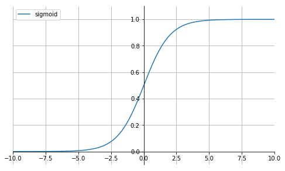

<center><font color=steel size=14>逻辑回归</font></center>

逻辑回归是一个分类算法，它可以处理二元分类以及多元分类。虽然它名字里面有"回归"两个字，却不是一个回归算法。那为什么有"回归"这个误导性的词呢？个人认为，虽然逻辑回归是分类模型，但是它的原理里面却残留着回归模型的影子，本文对逻辑回归原理做一个总结。

# 从线性回归到逻辑回归

我们知道，线性回归的模型是求出输出特征向量Y和输入样本矩阵X之间的线性关系系数$\theta$，满足$\mathbf{Y = X\theta}$。此时我们的Y是连续的，所以是回归模型。如果我们想要Y是离散的话，怎么办呢？一个可以想到的办法是，我们对于这个Y再做一次函数转换，变为$g(Y)$。如果我们令$g(Y)$的值在某个实数区间的时候是类别A，在另一个实数区间的时候是类别B，以此类推，就得到了一个分类模型。如果结果的类别只有两种，那么就是一个二元分类模型了。逻辑回归的出发点就是从这来的。下面我们开始引入二元逻辑回归。

# 二元逻辑回归的模型

上一节我们提到对线性回归的结果做一个在函数g上的转换，可以变化为逻辑回归。这个函数g在逻辑回归中我们一般取为sigmoid函数，形式如下：

$$
g(z) = \frac{1}{1+e^{-z}}
$$


```python
import matplotlib.pyplot as plt
import numpy as np

%matplotlib inline

x = np.linspace(-10, 10, 1000)
y = 1.0 / (1.0 + np.exp(-x))

fig = plt.figure(figsize=(8, 5))

ax = plt.gca()
# 将右边 上边的两条边颜色设置为空 其实就相当于抹掉这两条边
ax.spines['right'].set_color('none') 
ax.spines['top'].set_color('none')         
# 指定下边的边作为 x 轴   指定左边的边为 y 轴
ax.xaxis.set_ticks_position('bottom')   
ax.yaxis.set_ticks_position('left')          
#指定data设置的bottom(也就是指定的x轴)绑定到y轴的0这个点上
ax.spines['bottom'].set_position(('data', 0))   
ax.spines['left'].set_position(('data', 0))

plt.plot(x, y, label='sigmoid')
plt.grid(True)

plt.xlim((-10, 10))
plt.ylim((-0.1, 1.1))
plt.legend()
plt.show(fig)
```




它有一个非常好的性质，**即当z趋于正无穷时，$g(z)$趋于1，而当$z$趋于负无穷时，$g(z)$趋于0**，这非常适合于我们的分类概率模型。 
另外，它还有一个很好的导数性质：
$$
g^{'}(z) = g(z)(1-g(z))
$$


这个通过函数对$g(z)$求导很容易得到，后面我们会用到这个式子。

如果我们令**$g(z)$**中的$z$为：${z = x\theta}$，这样就得到了二元逻辑回归模型的一般形式：
$$
h_{\theta}(x) = g(x\theta)= \frac{1}{1+e^{-x\theta}}
$$
其中x为样本输入，$h_{\theta}(x)$为模型输出，可以理解为某一分类的概率大小。而θ为分类模型的要求出的模型参数。对于模型输出$h_{\theta}(x)$，我们让它和我们的二元样本输出y（假设为0和1）有这样的对应关系。

- 如果$h_{\theta}(x) >0.5$ ，即$x\theta > 0$, 则y为1。
- 如果$h_{\theta}(x) < 0.5$，即$x\theta < 0$, 则y为0。
- y=0.5是临界情况，此时$x\theta = 0$， 逻辑回归模型本身无法确定分类。

$h_{\theta}(x)$的值越小，而分类为0的的概率越高，反之，值越大的话分类为1的的概率越高。如果靠近临界点，则分类准确率会下降。

此处我们也可以将模型写成矩阵模式：

$$
h_{\theta}(X) = \frac{1}{1+e^{-X\theta}}
$$


其中$h_{\theta}(X)$为模型输出，为 m x 1的维度。$X$为样本特征矩阵，为m x n的维度。$\theta$为分类的模型系数，为n x 1的向量。

理解了二元分类回归的模型，接着我们就要看模型的损失函数了，我们的目标是极小化损失函数来得到对应的模型系数$\theta$。

# 二元逻辑回归的损失函数

回顾下线性回归的损失函数，由于线性回归是连续的，所以可以使用模型误差的的平方和来定义损失函数。但是逻辑回归不是连续的，自然线性回归损失函数定义的经验就用不上了。不过我们可以用**最大似然法**来推导出我们的损失函数。

我们知道，按照第二节二元逻辑回归的定义，假设我们的样本输出是0或者1两类。那么我们有：

$$
P(y=1|x,\theta ) = h_{\theta}(x)
$$

$$
P(y=0|x,\theta ) = 1- h_{\theta}(x)
$$

**整合：**
$$
P(y|x,\theta ) = h_{\theta}(x)^y(1-h_{\theta}(x))^{1-y}
$$

其中y的取值只能是0或者1。

用矩阵法表示，即为：

$P(Y|X,\theta ) = h_{\theta}(X)^Y(E-h_{\theta}(X))^{1-Y}$, 其中E为单位向量。

得到了y的**概率分布函数表达式**，我们就可以用似然函数最大化来求解我们需要的模型系数$\theta$。

为了方便求解，这里我们用**对数似然函数最大化，对数似然函数取反即为我们的损失函数$J(\theta)$**。其中似然函数的代数表达式为：

$$
L(\theta) = \prod\limits_{i=1}^{m}(h_{\theta}(x_i))^{y_i}(1-h_{\theta}(x_i))^{1-y_i}
$$
其中m为样本的个数。

对似然函数对数化取反的表达式，即**损失函数**表达式为： 
$$
J(\theta) = -logL(\theta) = -\sum\limits_{i=1}^{m}(y_i log(h_{\theta}(x_i))+ (1-y_i)log(1-h_{\theta}(x_i)))
$$
 损失函数用矩阵法表达更加简洁：
$$
J(\theta) = -Y^T\bullet logh_{\theta}(X) - (E-Y)^T\bullet log(E-h_{\theta}(X))
$$
其中E为全1向量, $\bullet$为内积。


# 二元逻辑回归的损失函数的优化方法

对于二元逻辑回归的损失函数极小化，有比较多的方法，最常见的有梯度下降法，坐标轴下降法，等牛顿法等。这里推导出梯度下降法中$\theta$每次迭代的公式。

## **代数法推导**

参考求导过程：

此时应用梯度上升求最大值，转换为梯度下降任务：
$$
\begin{align}
J(\theta)&=-\frac{1}{m} l(\theta)\\&
=-\frac{1}{m}  \sum_{i=1}^{m}(y_ilog h_\theta(x_i) + (1-y_i) log(1-h_\theta(x_i)))
\end{align}
$$


求导过程：
$$
\begin{align}
\frac{\partial}{\partial\theta_j}J(\theta)&
=-\frac{1}{m} \sum_{i=1}^{m}\left( y_i {\frac{1}{h_\theta (x_i)} {\frac{\partial}{\partial\theta_j}h_\theta(x_i)} - {(1-y_i)} \frac{1}{1-h_\theta(x_i)} {\frac{\partial}{\partial\theta_j}h_\theta(x_i)}} \right)\\&
=-\frac{1}{m} \sum_{i=1}^{m} {\left( y_i {\frac{1}{g(\theta^T x_i)}} - {(1-y_i)} \frac{1}{1-g(\theta^T x_i)}\right)}
{\frac{\partial}{\partial\theta_j} g(\theta^T x_i)}\\&
=-\frac{1}{m} \sum_{i=1}^{m} {\left( y_i {\frac{1}{g(\theta^T x_i)}} - {(1-y_i)} \frac{1}{1-g(\theta^T x_i)}\right)}
{g(\theta^T x_i)(1-g(\theta^T x_i))\frac{\partial}{\partial\theta_j} \theta^T x_i}\\&
=-\frac{1}{m} \sum_{i=1}^{m} {(y_i (1-g(\theta^T x_i))-(1-y_i)g(\theta^T x_i))x_{i}^{j}}\\&
=-\frac{1}{m} \sum_{i=1}^{m} {(y_i -g(\theta^T x_i)) x_{i}^{j}}\\&
=\frac{1}{m} \sum_{i=1}^{m} {(h_\theta(x_i) - y_i) x_{i}^{j}}
\end{align}
$$


参数更新
$$
\begin{align}
\theta_j : = \theta_j - \alpha \frac{1}{m} \sum_{i=1}^{m} (h_\theta(x_i)-y_i) x_{i}^{j}
\end{align}
$$


## **矩阵法推导**


对于$J(\theta) = -Y^T\bullet logh_{\theta}(X) - (E-Y)^T\bullet log(E-h_{\theta}(X))$，我们用$J(\theta)$对$\theta$向量求导可得：

$$
\begin{align}
\frac{\partial}{\partial\theta}J(\theta) = & X^T[\frac{1}{h_{\theta}(X)}\odot h_{\theta}(X)\odot (E-h_{\theta}(X))\odot (-Y)] \\& + X^T[\frac{1}{E-h_{\theta}(X)}\odot h_{\theta}(X)\odot (E-h_{\theta}(X))\odot (E-Y)]
\end{align}
$$

这一步我们用到了矩阵求导的链式法则，和下面三个基础求导公式的矩阵形式：

$$
\frac{\partial}{\partial x}logx = \frac{1}{x}
$$

$$
\frac{\partial}{\partial z}g(z) = g(z)(1-g(z))
$$

$$
\frac{\partial x\theta}{\partial \theta} =  x
$$

对于刚才的求导公式我们进行化简可得：
$$
\frac{\partial}{\partial\theta}J(\theta) = X^T(h_{\theta}(X) - Y )
$$

从而在梯度下降法中每一步向量$\theta$的迭代公式如下：
$$
\theta = \theta - \alpha X^T(h_{\theta}(X) - Y )
$$

其中，$\alpha$为梯度下降法的步长。

实践中，我们一般不用操心优化方法，大部分机器学习库都内置了各种逻辑回归的优化方法，不过了解至少一种优化方法还是有必要的。


# 二元逻辑回归的正则化

逻辑回归也会面临过拟合问题，所以我们也要考虑正则化。常见的有L1正则化和L2正则化。

逻辑回归的L1正则化的损失函数表达式如下，相比普通的逻辑回归损失函数，增加了L1的范数做作为惩罚，超参数$\alpha$作为惩罚系数，调节惩罚项的大小。

二元逻辑回归的**L1正则化损失函数**表达式如下：
$$
J(\theta) = -Y^T\bullet logh_{\theta}(X) - (E-Y)^T\bullet log(E-h_{\theta}(X)) + ||\theta||_1
$$

其中$||\theta||_1$为$\theta$的L1范数。

逻辑回归的L1正则化损失函数的优化方法常用的有坐标轴下降法和最小角回归法。

二元逻辑回归的**L2正则化损失函数**表达式如下：
$$
J(\theta) = -Y^T\bullet logh_{\theta}(X) - (E-Y)^T\bullet log(E-h_{\theta}(X)) + \frac{1}{2}\alpha||\theta||_2^2
$$

其中$||\theta||_2$为$\theta$的L2范数。

逻辑回归的L2正则化损失函数的优化方法和普通的逻辑回归类似。


# 二元逻辑回归的推广：多元逻辑回归

前面几节我们的逻辑回归的模型和损失函数都局限于二元逻辑回归，实际上二元逻辑回归的模型和损失函数很容易推广到多元逻辑回归。比如总是认为某种类型为正值，其余为0值，这种方法为最常用的one-vs-rest，简称OvR.

另一种多元逻辑回归的方法是Many-vs-Many(MvM)，它会选择一部分类别的样本和另一部分类别的样本来做逻辑回归二分类。最常用的是One-Vs-One（OvO）。OvO是MvM的特例。每次我们选择两类样本来做二元逻辑回归。

这里只介绍多元逻辑回归的softmax回归的一种特例推导：

首先回顾下二元逻辑回归。


$$
P(y=1|x,\theta ) = h_{\theta}(x) =  \frac{1}{1+e^{-x\theta}} = \frac{e^{x\theta}}{1+e^{x\theta}}
$$

$$
P(y=0|x,\theta ) = 1- h_{\theta}(x) = \frac{1}{1+e^{x\theta}}
$$


其中y只能取到0和1。则有：
$$
ln\frac{P(y=1|x,\theta )}{P(y=0|x,\theta)} = x\theta
$$

如果我们要推广到多元逻辑回归，则模型要稍微做下扩展。

我们假设是K元分类模型,即样本输出y的取值为1，2，。。。，K。

根据二元逻辑回归的经验，我们有：


$$
ln\frac{P(y=1|x,\theta )}{P(y=K|x,\theta)} = x\theta_1
$$

$$
ln\frac{P(y=2|x,\theta )}{P(y=K|x,\theta)} = x\theta_2
$$

$$
...
$$

$$
ln\frac{P(y=K-1|x,\theta )}{P(y=K|x,\theta)} = x\theta_{K-1}
$$


上面有K-1个方程。

加上概率之和为1的方程如下：

$$
\sum\limits_{i=1}^{K}P(y=i|x,\theta ) = 1
$$

从而得到K个方程，里面有K个逻辑回归的概率分布。

解出这个K元一次方程组，得到K元逻辑回归的概率分布如下：

$P(y=k|x,\theta ) =  e^{x\theta_k} \bigg/ 1+\sum\limits_{t=1}^{K-1}e^{x\theta_t}$　 k = 1,2,...K-1  

$P(y=K|x,\theta ) =  1 \bigg/ 1+\sum\limits_{t=1}^{K-1}e^{x\theta_t}$ 
多元逻辑回归的损失函数推导以及优化方法和二元逻辑回归类似，这里就不累述。


**小结**:

逻辑回归尤其是二元逻辑回归是非常常见的模型，训练速度很快，虽然使用起来没有支持向量机（SVM）那么占主流，但是解决普通的分类问题是足够了，训练速度也比起SVM要快不少。如果你要理解机器学习分类算法，那么第一个应该学习的分类算法个人觉得应该是逻辑回归。理解了逻辑回归，其他的分类算法再学习起来应该没有那么难了。


# 参数说明

> **概述**

在scikit-learn中，与逻辑回归有关的主要是这3个类。`LogisticRegression`， `LogisticRegressionCV` 和`logistic_regression_path`。  

其中LogisticRegression和LogisticRegressionCV的主要区别是**LogisticRegressionCV使用了交叉验证来选择正则化系数C。而LogisticRegression需要自己每次指定一个正则化系数。**除了交叉验证，以及选择正则化系数C以外， LogisticRegression和LogisticRegressionCV的使用方法基本相同。

logistic_regression_path类则比较特殊，它拟合数据后，不能直接来做预测，只能为拟合数据选择合适逻辑回归的系数和正则化系数。主要是用在模型选择的时候。一般情况用不到这个类，所以后面不再讲述logistic_regression_path类。

此外，scikit-learn里面有个容易让人误解的类**RandomizedLogisticRegression**, 虽然名字里有逻辑回归的词，但是主要是用L1正则化的逻辑回归来做特征选择的，**属于维度规约的算法类**，不属于我们常说的分类算法的范畴。

后面的讲解主要围绕LogisticRegression和LogisticRegressionCV中的重要参数的选择来来展开，这些参数的意义在这两个类中都是一样的。

```python
from sklearn.linear_model import LogisticRegression

model = LogisticRegression()
model.get_params()
```

```python
{'C': 1.0,
 'class_weight': None,    # ---
 'dual': False,
 'fit_intercept': True,
 'intercept_scaling': 1,
 'l1_ratio': None,
 'max_iter': 100,
 'multi_class': 'auto',
 'n_jobs': None,
 'penalty': 'l2',    # ---
 'random_state': None,
 'solver': 'lbfgs',   # ---
 'tol': 0.0001,
 'verbose': 0,
 'warm_start': False}
```


## 正则化选择参数：`penalty`

LogisticRegression和LogisticRegressionCV默认就带了正则化项。**penalty参数可选择的值为"l1"和"l2".分别对应L1的正则化和L2的正则化，默认是L2的正则化。**

在调参时如果我们主要的目的只是为了解决过拟合，一般penalty选择L2正则化就够了。但是如果选择L2正则化发现还是过拟合，即预测效果差的时候，就可以考虑L1正则化。另外，如果模型的特征非常多，我们希望一些不重要的特征系数归零，从而让模型系数稀疏化的话，也可以使用L1正则化。

penalty参数的选择会影响我们损失函数优化算法的选择, 即参数solver的选择。如果是L2正则化，那么4种可选的算法: {'newton-cg', 'lbfgs', 'liblinear', 'sag'}都可以选择。但是如果penalty是L1正则化的话，就只能选择'liblinear'了。这是因为L1正则化的损失函数不是连续可导的，而{ne'wton-cg', 'lbfgs', 'sag'}这三种优化算法时都需要损失函数的一阶或者二阶连续导数。而'liblinear'并没有这个依赖。


## 优化算法选择参数：`solver`

solver参数决定了我们对逻辑回归损失函数的优化方法，有4种算法可以选择，分别是：
1. **liblinear**：使用了开源的liblinear库实现，内部使用了坐标轴下降法来迭代优化损失函数。
2. **lbfgs**：拟牛顿法的一种，利用损失函数二阶导数矩阵即海森矩阵来迭代优化损失函数。
3. **newton-cg**：也是牛顿法家族的一种，利用损失函数二阶导数矩阵即海森矩阵来迭代优化损失函数。
4. **sag**：即随机平均梯度下降，是梯度下降法的变种，和普通梯度下降法的区别是每次迭代仅仅用一部分的样本来计算梯度，适合于样本数据多的时候。

从上面的描述可以看出，**newton-cg, lbfgs和sag这三种优化算法时都需要损失函数的一阶或者二阶连续导数，因此不能用于没有连续导数的L1正则化，只能用于L2正则化。而liblinear通吃L1正则化和L2正则化。**

同时，sag每次仅仅使用了部分样本进行梯度迭代，**所以当样本量少的时候不要选择它，而如果样本量非常大，比如大于10万，sag是第一选择**。但是sag不能用于L1正则化，所以当你有大量的样本，又需要L1正则化的话就要自己做取舍了。要么通过对样本采样来降低样本量，要么回到L2正则化。

从上面的描述，大家可能觉得，既然newton-cg, lbfgs和sag这么多限制，如果不是大样本，我们选择liblinear不就行了嘛！错，因为liblinear也有自己的弱点！我们知道，逻辑回归有二元逻辑回归和多元逻辑回归。对于多元逻辑回归常见的有one-vs-rest(OvR)和many-vs-many(MvM)两种。而MvM一般比OvR分类相对准确一些。郁闷的是liblinear只支持OvR，不支持MvM，这样**如果我们需要相对精确的多元逻辑回归时，就不能选择liblinear了**。也意味着如果我们需要相对精确的多元逻辑回归不能使用L1正则化了。


## 分类方式选择参数：`multi_class`

multi_class参数决定了我们分类方式的选择，**有 ovr 和 multinomial 两个值可以选择，默认是 ovr**。

ovr即前面提到的one-vs-rest(OvR)，而multinomial即前面提到的many-vs-many(MvM)。如果是二元逻辑回归，ovr和multinomial并没有任何区别，区别主要在多元逻辑回归上。

OvR的思想很简单，无论你是多少元逻辑回归，我们都可以看做二元逻辑回归。具体做法是，对于第K类的分类决策，我们把所有第K类的样本作为正例，除了第K类样本以外的所有样本都作为负例，然后在上面做二元逻辑回归，得到第K类的分类模型。其他类的分类模型获得以此类推。

而MvM则相对复杂，这里举MvM的特例one-vs-one(OvO)作讲解。如果模型有T类，我们每次在所有的T类样本里面选择两类样本出来，不妨记为T1类和T2类，把所有的输出为T1和T2的样本放在一起，把T1作为正例，T2作为负例，进行二元逻辑回归，得到模型参数。我们一共需要T(T-1)/2次分类。

从上面的描述可以看出OvR相对简单，但分类效果相对略差（这里指大多数样本分布情况，某些样本分布下OvR可能更好）。而MvM分类相对精确，但是分类速度没有OvR快。

**如果选择了ovr，则4种损失函数的优化方法liblinear，newton-cg, lbfgs和sag都可以选择。但是如果选择了multinomial,则只能选择newton-cg, lbfgs和sag了**。


## 类型权重参数： `class_weight`

class_weight参数用于标示分类模型中各种类型的权重，可以不输入，即不考虑权重，或者说所有类型的权重一样。如果选择输入的话，可以选择balanced让类库自己计算类型权重，或者我们自己输入各个类型的权重，比如对于0,1的二元模型，我们可以定义class_weight={0:0.9, 1:0.1}，这样类型0的权重为90%，而类型1的权重为10%。

如果class_weight选择balanced，那么类库会根据训练样本量来计算权重。某种类型样本量越多，则权重越低，样本量越少，则权重越高。

那么class_weight有什么作用呢？在分类模型中，我们经常会遇到两类问题：

- 第一种是**误分类的代价很高**。比如对合法用户和非法用户进行分类，将非法用户分类为合法用户的代价很高，我们宁愿将合法用户分类为非法用户，这时可以人工再甄别，但是却不愿将非法用户分类为合法用户。这时，我们可以适当提高非法用户的权重。
- 第二种是**样本是高度失衡的**，比如我们有合法用户和非法用户的二元样本数据10000条，里面合法用户有9995条，非法用户只有5条，如果我们不考虑权重，则我们可以将所有的测试集都预测为合法用户，这样预测准确率理论上有99.95%，但是却没有任何意义。这时，我们可以选择balanced，让类库自动提高非法用户样本的权重。

提高了某种分类的权重，相比不考虑权重，会有更多的样本分类划分到高权重的类别，从而可以解决上面两类问题。

当然，对于第二种样本失衡的情况，我们还可以考虑用下一节讲到的样本权重参数：sample_weight，而不使用class_weight。


## 样本权重参数： `sample_weight`

上一节我们提到了样本不失衡的问题，由于样本不平衡，导致样本不是总体样本的无偏估计，从而可能导致我们的模型预测能力下降。遇到这种情况，我们可以通过调节样本权重来尝试解决这个问题。调节样本权重的方法有两种，第一种是在class_weight使用balanced。第二种是在调用fit函数时，通过sample_weight来自己调节每个样本权重。

在scikit-learn做逻辑回归时，如果上面两种方法都用到了，那么样本的真正权重是class_weight*sample_weight。


> 以上就是scikit-learn中逻辑回归类库调参的一个小结，还有些参数比如正则化参数C（交叉验证就是 Cs），迭代次数max_iter等，由于和其它的算法类库并没有特别不同，这里不多累述了。


# 解答题

## 逻辑回归相比于线性回归， 有何异同？

首先， 逻辑回归处理的是**分类问题**， 线性回归处理的是**回归问题**， 这是两者的最本质的区别。  

实际上， 将逻辑回归的公式进行整理， 我们可以得到$\log \frac{p}{1-p}=\theta^{\mathrm{T}} x$ ， 其中$p=P(y=1 \mid x)$ ， 也就是将给定输入$x$预测为正样本的概率。 **如果把一个事件的几率（odds）定义为该事件发生的概率与该事件不发生的概率的比值$\frac{p}{1-p}$ ， 那么逻辑回归可以看作是对于$y=1|x$这一事件的对数几率的线性回归**。

逻辑回归中的因变量为离散的， 而线性回归中的因变量是连续的。 并且在自变量$x$与超参数$θ$确定的情况下， **逻辑回归可以看作广义线性模型（Generalized Linear Models） 在因变量$y$服从二元分布时的一个特殊情况**； 而使用最小二乘法求解线性回归时， 我们认为因变量$y$服从正态分布。    

二者**都使用了极大似然估计来对训练样本进行建模**。  线性回归使用最小二乘法， 实际上就是在自变量$x$与超参数$θ$确定， 因变量$y$服从正态分布的假设下， 使用极大似然估计的一个化简； 而逻辑回归中通过对似然函数$L(\theta)=\prod_{i=1}^{N} P\left(y_{i} \mid x_{i} ; \theta\right)=\prod_{i=1}^{N}\left(\pi\left(x_{i}\right)\right)^{y_{i}}\left(1-\pi\left(x_{i}\right)\right)^{1-y_{i}}$的学习， 得到最佳参数$θ$。 另外， 二者在求解超参数的过程中， 都可以使用梯度下降的方法， 这也是监督学习中一个常见的相似之处。  


## 把LR从头到脚都给讲一遍

建模，现场数学推导，每种解法的原理，正则化，LR和maxent模型啥关系，LR为啥比线性回归好。有不少会背答案的人，问逻辑细节就糊涂了。原理都会? 那就问工程，并行化怎么做，有几种并行化方式，读过哪些开源的实现。还会，那就准备收了吧，顺便逼问LR模型发展历史。


## LR与线性回归的区别与联系

个人感觉逻辑回归和线性回归首先都是广义的线性回归，其次经典线性模型的优化目标函数是最小二乘，而逻辑回归则是似然函数，另外线性回归在整个实数域范围内进行预测，敏感度一致，而分类范围，需要在[0,1]。逻辑回归就是一种减小预测范围，将预测值限定为[0,1]间的一种回归模型，因而对于这类问题来说，逻辑回归的鲁棒性比线性回归的要好。

逻辑回归的模型本质上是一个线性回归模型，逻辑回归都是以线性回归为理论支持的。但线性回归模型无法做到sigmoid的非线性形式，sigmoid可以轻松处理0/1分类问题。


## 逻辑回归相关问题。

（1）公式推导一定要会

（2）逻辑回归的基本概念
这个最好从广义线性模型的角度分析，逻辑回归是假设y服从Bernoulli分布。

（3）L1-norm和L2-norm

其实稀疏的根本还是在于L0-norm也就是直接统计参数不为0的个数作为规则项，但实际上却不好执行于是引入了L1-norm；而L1norm本质上是假设参数先验是服从Laplace分布的，而L2-norm是假设参数先验为Gaussian分布，我们在网上看到的通常用图像来解答这个问题的原理就在这。

但是L1-norm的求解比较困难，可以用坐标轴下降法或是最小角回归法求解。

（4）LR和SVM对比
首先，LR和SVM最大的区别在于损失函数的选择，LR的损失函数为Log损失（或者说是逻辑损失都可以）、而SVM的损失函数为hinge loss
$$
\min _{w, b} \sum_{i}^{N}\left[1-y_{i}\left(w * x_{i}+b\right)\right]+\lambda\|w\|^{2}
$$
其次，两者都是线性模型。
最后，SVM只考虑支持向量（也就是和分类相关的少数点）

（5）LR和随机森林区别
随机森林等树算法都是非线性的，而LR是线性的。LR更侧重全局优化，而树模型主要是局部的优化。

（6）常用的优化方法
逻辑回归本身是可以用公式求解的，但是因为需要求逆的复杂度太高，所以才引入了梯度下降算法。

一阶方法：梯度下降、随机梯度下降、mini 随机梯度下降降法。随机梯度下降不但速度上比原始梯度下降要快，局部最优化问题时可以一定程度上抑制局部最优解的发生。

二阶方法：牛顿法、拟牛顿法：

这里详细说一下牛顿法的基本原理和牛顿法的应用方式。牛顿法其实就是通过切线与x轴的交点不断更新切线的位置，直到达到曲线与x轴的交点得到方程解。在实际应用中我们因为常常要求解凸优化问题，也就是要求解函数一阶导数为0的位置，而牛顿法恰好可以给这种问题提供解决方法。实际应用中牛顿法首先选择一个点作为起始点，并进行一次二阶泰勒展开得到导数为0的点进行一个更新，直到达到要求，这时牛顿法也就成了二阶求解问题，比一阶方法更快。我们常常看到的x通常为一个多维向量，这也就引出了Hessian矩阵的概念（就是x的二阶导数矩阵）。缺点：牛顿法是定长迭代，没有步长因子，所以不能保证函数值稳定的下降，严重时甚至会失败。还有就是牛顿法要求函数一定是二阶可导的。而且计算Hessian矩阵的逆复杂度很大。

`拟牛顿法`： 不用二阶偏导而是构造出Hessian矩阵的近似正定对称矩阵的方法称为拟牛顿法。拟牛顿法的思路就是用一个特别的表达形式来模拟Hessian矩阵或者是他的逆使得表达式满足拟牛顿条件。主要有DFP法（逼近Hession的逆）、BFGS（直接逼近Hession矩阵）、 L-BFGS（可以减少BFGS所需的存储空间）。


## 为什么LR用极大似然估计参数

如果用平方差损失函数时，损失函数对于参数是一个非凸优化的问题，可能会收敛到局部最优解，而且对数似然的概念是使得样本出现的概率最大，采用对数似然梯度更新速度也比较快


## LR的输入，离散值还是连续值？

在工业界，很少直接将连续值作为逻辑回归模型的特征输入，而是将连续特征离散化为一系列0、1特征交给逻辑回归模型，这样做的优势有以下几点：

1. 逻辑回归属于广义线性模型，表达能力受限；单变量离散化为N个后，每个变量有单独的权重，相当于为模型引入了非线性，能够提升模型表达能力，加大拟合；
2. 离散化后可以进行特征交叉，由M+N个变量变为M*N个变量，进一步引入非线性，提升表达能力；
3. 特征离散化以后，起到了简化了逻辑回归模型的作用，降低了模型过拟合的风险。
4. 离散特征的增加和减少都很容易，易于模型的快速迭代；
5. 稀疏向量内积乘法运算速度快，计算结果方便存储，容易扩展；
6. 离散化后的特征对异常数据有很强的鲁棒性：比如一个特征是年龄>30是1，否则0。如果特征没有离散化，一个异常数据“年龄300岁”会给模型造成很大的干扰；
7. 特征离散化后，模型会更稳定，比如如果对用户年龄离散化，20-30作为一个区间，不会因为一个用户年龄长了一岁就变成一个完全不同的人。当然处于区间相邻处的样本会刚好相反，所以怎么划分区间是门学问；
	

## LR和SVM的联系和区别

**联系**：

1. 都是监督的分类算法。
2. 都是线性分类方法 (不考虑核函数时）。
3. 都是[判别模型](https://www.cnblogs.com/huangyc/p/9943364.html#_label3)。
4. LR和SVM都可以处理分类问题，且一般都用于处理线性二分类问题（在改进的情况下可以处理多分类问题）
5. 两个方法都可以增加不同的正则化项，如l1、l2等等。所以在很多实验中，两种算法的结果是很接近的。
6. LR和SVM都可以用来做非线性分类，只要加核函数就好。
7. LR和SVM都是线性模型，当然这里我们不要考虑核函数。
8. 都属于判别模型。

**区别：**

1. [损失函数](https://www.cnblogs.com/huangyc/p/9938314.html)的不同，**LR是对数损失函数，SVM是hinge损失函数**。
2. SVM不能产生概率，LR可以产生概率。
3. SVM自带**[结构风险](https://www.cnblogs.com/huangyc/p/9943364.html#_label3)最小化**，LR则是**[经验风险](https://www.cnblogs.com/huangyc/p/9943364.html#_label3)最小化**。
4. SVM会用核函数而LR一般不用[核函数](https://www.cnblogs.com/huangyc/p/9940487.html)。
5. LR和SVM在实际应用的区别：根据经验来看，对于**小规模数据集**，SVM的效果要好于LR，但是**大数据中**，SVM的计算复杂度受到限制，而LR因为训练简单，可以在线训练，所以经常会被大量采用。
6. LR是参数模型，SVM是非参数模型。
7. 从目标函数来看，区别在于逻辑回归采用的是logistical loss，SVM采用的是hinge loss，这两个损失函数的目的都是增加对分类影响较大的数据点的权重，减少与分类关系较小的数据点的权重。
8. 逻辑回归相对来说模型更简单，好理解，特别是大规模线性分类时比较方便。而SVM的理解和优化相对来说复杂一些，SVM转化为对偶问题后,分类只需要计算与少数几个支持向量的距离,这个在进行复杂核函数计算时优势很明显,能够大大简化模型和计算。
9. SVM不直接依赖数据分布，而LR则依赖，因为SVM只与支持向量那几个点有关系，而LR和所有点都有关系。
10. SVM依赖penalty系数，实验中需要做CV。
11. SVM本身是结构风险最小化模型，而LR是经验风险最小化模型。


另外**怎么选模型**：

在Andrew NG的课里讲到过：

1. 如果Feature的数量很大，跟样本数量差不多，这时候选用LR或者是Linear Kernel的SVM
2. 如果Feature的数量比较小，样本数量一般，不算大也不算小，选用SVM+Gaussian Kernel
3. 如果Feature的数量比较小，而样本数量很多，需要手工添加一些feature变成第一种情况