在Apriori算法原理总结中，我们对Apriori算法的原理做了总结。作为一个挖掘频繁项集的算法，Apriori算法需要多次扫描数据，I/O是很大的瓶颈。为了解决这个问题，FP Tree算法（也称FP Growth算法）采用了一些技巧，无论多少数据，只需要扫描两次数据集，因此提高了算法运行的效率。

# FP Tree数据结构

为了减少I/O次数，FP Tree算法引入了一些数据结构来临时存储数据。这个数据结构包括三部分，如下图所示：

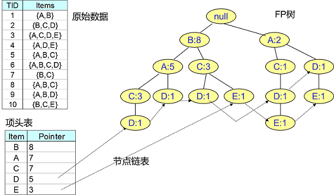

1. **项头表**，里面记录了所有的1项频繁集出现的次数，按照次数**降序**排列。比如上图中B在所有10组数据中出现了8次。
2. **FP Tree**，它将我们的原始数据集映射到了内存中的一颗FP树，这个FP树比较难理解，它是怎么建立的呢？这个我们后面再讲。
3. **节点链表**，所有项头表里的1项频繁集都是一个节点链表的头，它依次指向FP树中该1项频繁集出现的位置。这样做主要是方便项头表和FP Tree之间的联系查找和更新。

下面我们讲项头表和FP树的建立过程。

# 项头表的建立

FP树的建立需要首先依赖项头表的建立。首先我们看看怎么建立项头表。

我们第一次扫描数据，得到所有频繁一项集的的计数。然后删除支持度低于阈值的项，将1项频繁集放入项头表，并按照支持度降序排列。接着第二次也是最后一次扫描数据，将读到的原始数据剔除非频繁1项集，并按照支持度降序排列。

`例子`：我们有10条数据，首先第一次扫描数据并对1项集计数，我们发现O，I，L，J，P，M, N都只出现一次，支持度低于20%的阈值，因此他们不会出现在下面的项头表中。剩下的A,C,E,G,B,D,F按照**支持度的大小降序**排列，组成了我们的**项头表**。

接着我们第二次扫描数据，对于每条数据剔除非频繁1项集，并**按照支持度降序排列**。比如数据项ABCEFO，里面O是非频繁1项集，因此被剔除，只剩下了ABCEF。**按照支持度的顺序排序**，它变成了ACEBF。其他的数据项以此类推。为什么要将原始数据集里的频繁1项数据项进行排序呢？这是为了我们后面的FP树的建立时，可以尽可能的共用祖先节点。

**通过两次扫描，项头表已经建立，排序后的数据集也已经得到了**，下面我们再看看怎么建立FP树。

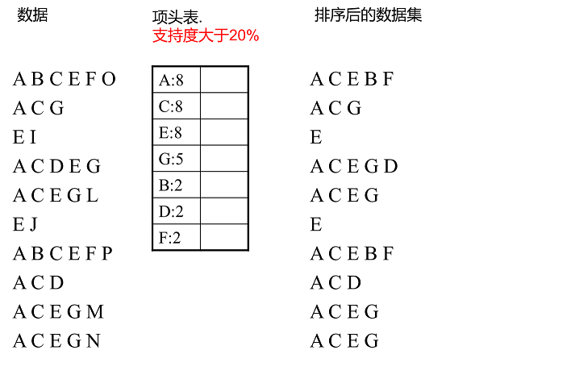

# FP Tree的建立

有了项头表和排序后的数据集，我们就可以开始FP树的建立了。

开始时FP树没有数据，建立FP树时我们一条条的读入排序后的数据集，插入FP树，插入时按照排序后的顺序，插入FP树中，**排序靠前的节点是祖先节点，而靠后的是子孙节点**。如果有共用的祖先，则对应的公用祖先节点计数加1。插入后，如果有新节点出现，则项头表对应的节点会通过节点链表链接上新节点。直到所有的数据都插入到FP树后，FP树的建立完成。

似乎也很抽象，我们还是用第二节的例子来描述。

首先，我们插入第一条数据ACEBF，如下图所示。此时FP树没有节点，因此ACEBF是一个独立的路径，所有节点计数为1, 项头表通过节点链表链接上对应的新增节点。

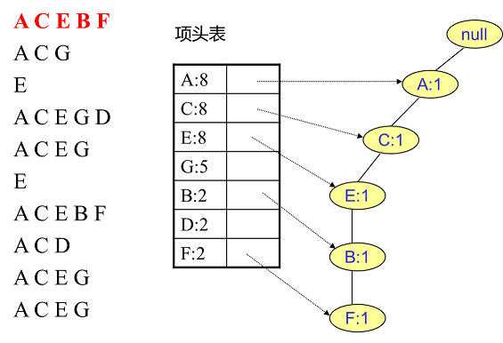

接着我们插入数据ACG，如下图所示。由于ACG和现有的FP树可以有共有的祖先节点序列AC，因此只需要增加一个新节点G，将新节点G的计数记为1。同时A和C的计数加1成为2。当然，对应的G节点的节点链表要更新。

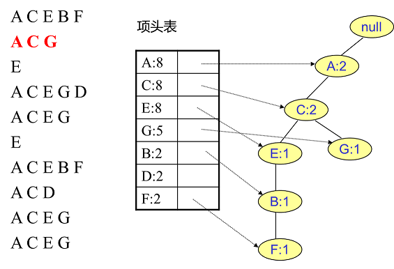

同样的办法可以更新后面8条数据，如下8张图。由于原理类似，这里就不多文字讲解了，大家可以自己去尝试插入并进行理解对比。相信如果大家自己可以独立的插入这10条数据，那么FP树建立的过程就没有什么难度了。

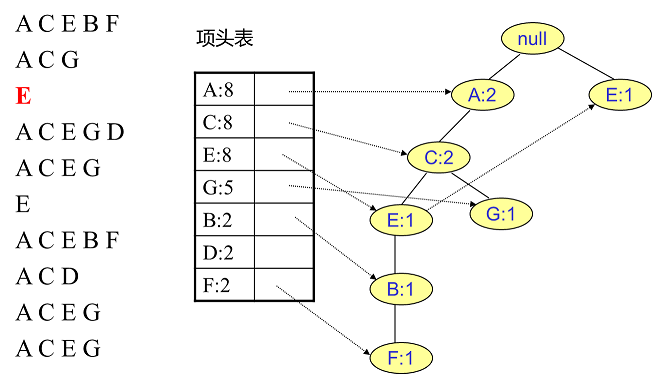

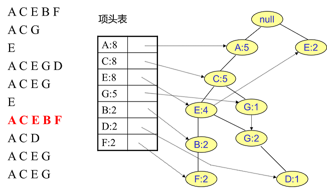

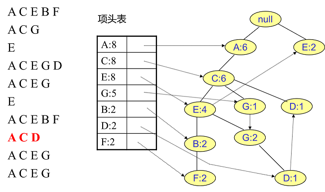

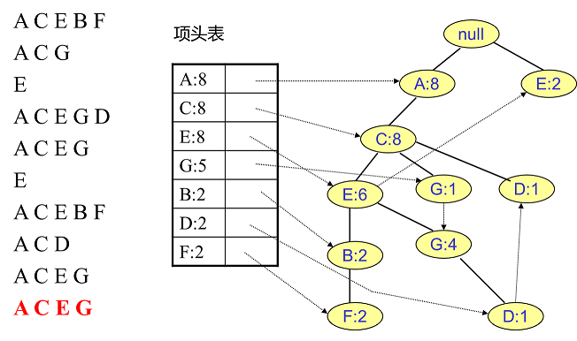

# FP Tree的挖掘

我们辛辛苦苦，终于把FP树建立起来了，那么怎么去挖掘频繁项集呢？看着这个FP树，似乎还是不知道怎么下手。下面我们讲如何从FP树里挖掘频繁项集。

得到了FP树和项头表以及节点链表，我们首先要**从项头表的底部项依次向上挖掘**，即从F开始。对于项头表对应于FP树的每一项，我们要找到它的**条件模式基**。所谓条件模式基是**以我们要挖掘的节点作为叶子节点所对应的FP子树**。得到这个FP子树，我们**将子树中每个节点的的计数设置为叶子节点的计数，并删除计数低于支持度的节点**。从这个条件模式基，我们就可以递归挖掘得到频繁项集了。

实在太抽象了，之前我看到这也是一团雾水。还是以上面的例子来讲解。我们看看先从最底下的F节点开始，我们先来寻找F节点的条件模式基，由于F在FP树中只有一个节点，因此候选就只有下图左所示的一条路径，对应{A:8,C:8,E:6,B:2, F:2}。我们接着将所有的祖先节点计数设置为叶子节点的计数，即FP子树变成{A:2,C:2,E:2,B:2, F:2}。一般我们的条件模式基可以不写叶子节点，因此最终的F的条件模式基如下图右所示。

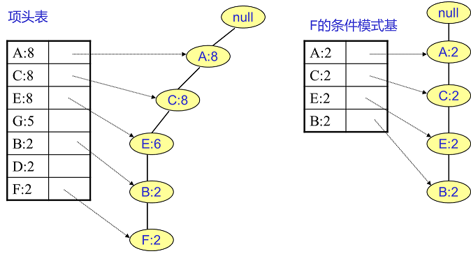

通过它，我们很容易得到F的频繁2项集为{A:2,F:2}, {C:2,F:2}, {E:2,F:2}, {B:2,F:2}。递归合并二项集，得到频繁三项集为{A:2,C:2,F:2}，{A:2,E:2,F:2},...还有一些频繁三项集，就不写了。当然一直递归下去，最大的频繁项集为**频繁5项集**，为{A:2,C:2,E:2,B:2,F:2}。

F挖掘完了，我们开始挖掘D节点。D节点比F节点复杂一些，因为它有两个叶子节点，因此首先得到的FP子树如下图左。我们接着将所有的祖先节点计数设置为叶子节点的计数，即变成{A:2, C:2,E:1 G:1,D:1, D:1}此时E节点和G节点由于在条件模式基里面的支持度低于阈值，被我们删除，最终在去除低支持度节点并不包括叶子节点后D的条件模式基为{A:2, C:2}。通过它，我们很容易得到D的频繁2项集为{A:2,D:2}, {C:2,D:2}。递归合并二项集，得到频繁三项集为{A:2,C:2,D:2}。D对应的最大的频繁项集为**频繁3项集**。

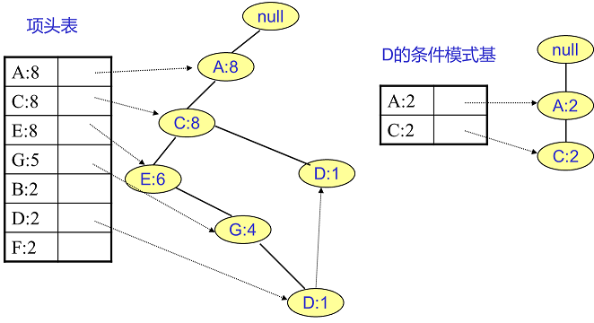

同样的方法可以得到B的条件模式基如下图右边，递归挖掘到B的最大频繁项集为**频繁4项集**{A:2, C:2, E:2,B:2}。

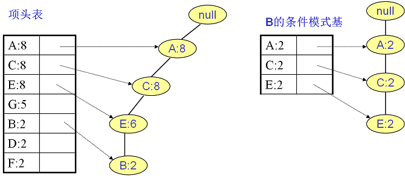

继续挖掘G的频繁项集，挖掘到的G的条件模式基如下图右边，递归挖掘到G的最大频繁项集为**频繁4项集**{A:5, C:5, E:4,G:4}。

　E的条件模式基如下图右边，递归挖掘到E的最大频繁项集为**频繁3项集**{A:6, C:6, E:6}。

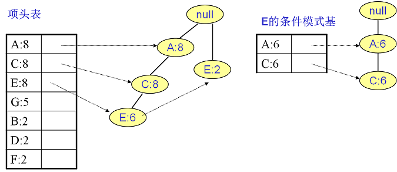

C的条件模式基如下图右边，递归挖掘到C的最大频繁项集为**频繁2项集**{A:8, C:8}

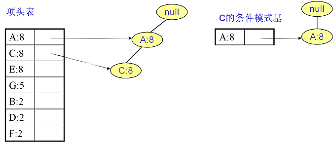

至于A，由于它的条件模式基为空，因此可以不用去挖掘了。

至此我们得到了所有的频繁项集，如果我们只是要最大的频繁K项集，从上面的分析可以看到，最大的频繁项集为5项集。包括{A:2, C:2, E:2,B:2,F:2}。

# FP Tree算法归纳

这里我们对FP Tree算法流程做一个归纳。

1. 扫描数据，**得到所有频繁一项集的的计数**。然后删除支持度低于阈值的项，将1项频繁集放入**项头表**，并按照支持度降序排列。
2. 扫描数据，**将读到的原始数据剔除非频繁1项集，并按照支持度降序排列**。
3. 读入排序后的数据集，插入FP树，插入时按照排序后的顺序，插入FP树中，**排序靠前的节点是祖先节点，而靠后的是子孙节点**。如果有共用的祖先，则对应的公用祖先节点计数加1。插入后，如果有新节点出现，则项头表对应的节点会通过节点链表链接上新节点。直到所有的数据都插入到FP树后，FP树的建立完成。
4. 从项头表的底部项依次向上找到项头表项对应的**条件模式基**。从条件模式基递归挖掘得到项头表项项的频繁项集。
5. 如果不限制频繁项集的项数，则返回步骤4所有的频繁项集，否则只返回满足项数要求的频繁项集。

# FP tree算法总结

FP Tree算法改进了Apriori算法的I/O瓶颈，巧妙的利用了树结构，这让我们想起了BIRCH聚类，BIRCH聚类也是巧妙的利用了树结构来提高算法运行速度。**利用内存数据结构以空间换时间**是常用的提高算法运行时间瓶颈的办法。

在实践中，FP Tree算法是可以用于生产环境的关联算法，而Apriori算法则做为先驱，起着关联算法指明灯的作用。除了FP Tree，像GSP，CBA之类的算法都是Apriori派系的。

