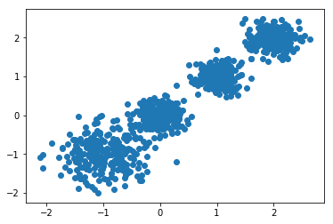
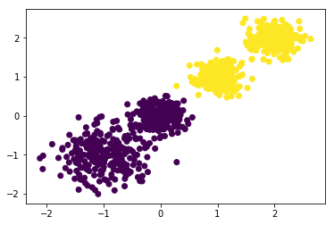
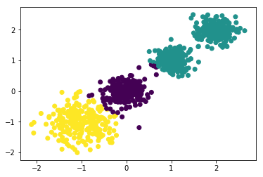
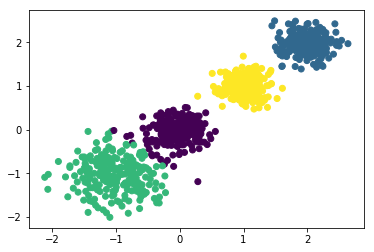
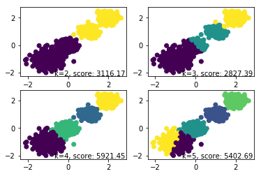

K-Means算法是无监督的聚类算法，它实现起来比较简单，聚类效果也不错，因此应用很广泛。K-Means算法有大量的变体，本文就从最传统的K-Means算法讲起，在其基础上讲述K-Means的优化变体方法。包括初始化优化K-Means++, 距离计算优化elkan K-Means算法和大数据情况下的优化Mini Batch K-Means算法。

# K-Means原理初探

K-Means算法的思想很简单，对于给定的样本集，按照样本之间的距离大小，将样本集划分为K个簇。让簇内的点尽量紧密的连在一起，而让簇间的距离尽量的大。

如果用数据表达式表示，假设簇划分为$(C_1,C_2,...C_k)$，则我们的**目标**是最小化平方误差E：
$$
E = \sum\limits_{i=1}^k\sum\limits_{x \in C_i} ||x-\mu_i||_2^2
$$

其中$\mu_i$是簇$C_i$的均值向量，有时也称为**质心**，表达式为：
$$
\mu_i = \frac{1}{|C_i|}\sum\limits_{x \in C_i}x
$$

`补充：`

K-means算法的**目标函数**（代价函数）如下：
$$
J=\min \sum_{i=1}^{n} \sum_{K=1}^{K} r_{i K}\left(x_{i}-\mu_{K}\right)
$$

$$
r_{iK} = \begin {cases}
1, \quad 当x_i属于第K类时\\
0, \quad other
\end {cases}
$$

其中, $n$ 表示数据集中点的总数目, $K$ 表示所需聚类的数据, $\mu_{K}$表示第K个中心点的位置。K-means算法的最终目标为求解 $\mu_{K}$与 $r_{i K}$ 。

---

如果我们想直接求上式的最小值并不容易，这是一个NP难的问题，因此只能采用启发式的迭代方法。

K-Means采用的启发式方式很简单，用下面一组图就可以形象的描述。


上图a表达了初始的数据集，假设k=2。在图b中，我们随机选择了两个k类所对应的类别质心，即图中的红色质心和蓝色质心，然后分别求样本中所有点到这两个质心的距离，并标记每个样本的类别为和该样本距离最小的质心的类别，如图c所示，经过计算样本和红色质心和蓝色质心的距离，我们得到了所有样本点的第一轮迭代后的类别。此时我们对我们当前标记为红色和蓝色的点分别求其新的质心，如图4所示，新的红色质心和蓝色质心的位置已经发生了变动。图e和图f重复了我们在图c和图d的过程，即将所有点的类别标记为距离最近的质心的类别并求新的质心。最终我们得到的两个类别如图f。

当然在实际K-Mean算法中，我们一般会多次运行图c和图d，才能达到最终的比较优的类别。


# 传统K-Means算法流程

在上一节我们对K-Means的原理做了初步的探讨，这里我们对K-Means的算法做一个总结。

首先我们看看K-Means算法的一些要点。

1. 对于K-Means算法，首先要注意的是k值的选择，一般来说，我们会根据对数据的先验经验选择一个合适的k值，如果没有什么先验知识，则可以通过交叉验证选择一个合适的k值。
2. 在确定了k的个数后，我们需要选择k个初始化的质心，就像上图b中的随机质心。由于我们是启发式方法，k个初始化的质心的位置选择对最后的聚类结果和运行时间都有很大的影响，因此需要选择合适的k个质心，最好这些质心不能太近。

好了，现在我们来总结下传统的K-Means算法流程。　

**输入**：样本集$D={x_1,x_2,...,x_m}$, 聚类的簇树k, 最大迭代次数N。

**输出**：簇划分$C={C_1,C_2,...C_k}$。

1. 从数据集D中随机选择k个样本作为初始的k个质心向量：$\{\mu_1,\mu_2,...,\mu_k\}$ 
2. 对于n=1,2,...,N
	- 将簇划分C初始化为$C_t = \varnothing \;\; t =1,2...k$ 
	- 对于i=1,2...m,计算样本$x_i$和各个质心向量$\mu_j(j=1,2,...k)$的距离：$d_{ij} = ||x_i - \mu_j||_2^2$，将$x_i$标记最小的为$d_{ij}$所对应的类别$\lambda_i$。此时更新$C_{\lambda_i} = C_{\lambda_i} \cup \{x_i\}$ 
	- 对于j=1,2,...,k,对$C_j$中所有的样本点重新计算新的质心$\mu_j = \frac{1}{|C_j|}\sum\limits_{x \in C_j}x$
	-  如果所有的k个质心向量都没有发生变化，则转到步骤3
3. 输出簇划分$C=\{C_1,C_2,...C_k\}$


# K-Means初始化优化K-Means++

在上节我们提到，k个初始化的质心的位置选择对最后的聚类结果和运行时间都有很大的影响，因此需要选择合适的k个质心。如果仅仅是完全随机的选择，有可能导致算法收敛很慢。**K-Means++算法就是对K-Means随机初始化质心的方法的优化**。

K-Means++的对于初始化质心的优化策略也很简单，如下：

1. 从输入的数据点集合中随机选择一个点作为第一个聚类中心$\mu_1$。
2. 对于数据集中的每一个点$x_i$，计算它与已选择的聚类中心中最近聚类中心的距离。

$$
D(x_i) = arg\;min||x_i- \mu_r||_2^2\;\;r=1,2,...k_{selected}
$$

3. 选择一个新的数据点作为新的聚类中心，选择的原则是：**$D(x)$较大的点，被选取作为聚类中心的概率较大** 。
4. 重复2和3直到选择出k个聚类质心。 
5. 利用这k个质心来作为初始化质心去运行标准的K-Means算法。


# K-Means距离计算优化elkan K-Means

在传统的K-Means算法中，我们在每轮迭代时，要计算所有的样本点到所有的质心的距离，这样会比较的耗时。那么，对于距离的计算有没有能够简化的地方呢？elkan K-Means算法就是从这块入手加以改进。它的目标是减少不必要的距离的计算。那么哪些距离不需要计算呢？

elkan K-Means利用了两边之和大于等于第三边,以及两边之差小于第三边的三角形性质，来减少距离的计算。

第一种规律是对于一个样本点$x$和两个质心$\mu_{j_1}, \mu_{j_2}$。如果我们预先计算出了这两个质心之间的距离$D(j_1,j_2)$，则如果计算发现$2D(x,j_1) \leq D(j_1,j_2)$,我们立即就可以知道$D(x,j_1) \leq D(x, j_2)$。此时我们不需要再计算$D(x, j_2)$,也就是说省了一步距离计算。

第二种规律是对于一个样本点$x$和两个质心$\mu_{j_1}, \mu_{j_2}$。我们可以得到$D(x,j_2) \geq max\{0, D(x,j_1) - D(j_1,j_2)\}$。这个从三角形的性质也很容易得到。

利用上边的两个规律，elkan K-Means比起传统的K-Means迭代速度有很大的提高。但是如果我们的样本的特征是稀疏的，有缺失值的话，这个方法就不使用了，此时某些距离无法计算，则不能使用该算法。

# 大样本优化Mini Batch K-Means

在统的K-Means算法中，要计算所有的样本点到所有的质心的距离。如果样本量非常大，比如达到10万以上，特征有100以上，此时用传统的K-Means算法非常的耗时，就算加上elkan K-Means优化也依旧。在大数据时代，这样的场景越来越多。此时Mini Batch K-Means应运而生。

顾名思义，Mini Batch，也就是用样本集中的一部分的样本来做传统的K-Means，这样可以避免样本量太大时的计算难题，算法收敛速度大大加快。当然此时的代价就是我们的聚类的精确度也会有一些降低。一般来说这个降低的幅度在可以接受的范围之内。

在Mini Batch K-Means中，我们会选择一个合适的批样本大小batch size，我们仅仅用batch size个样本来做K-Means聚类。那么这batch size个样本怎么来的？一般是通过无放回的随机采样得到的。

为了增加算法的准确性，我们一般会多跑几次Mini Batch K-Means算法，用得到不同的随机采样集来得到聚类簇，选择其中最优的聚类簇。


# K-Means与KNN

初学者很容易把K-Means和KNN搞混，两者其实差别还是很大的。

K-Means是无监督学习的聚类算法，没有样本输出；而KNN是监督学习的分类算法，有对应的类别输出。KNN基本不需要训练，对测试集里面的点，只需要找到在训练集中最近的k个点，用这最近的k个点的类别来决定测试点的类别。而K-Means则有明显的训练过程，找到k个类别的最佳质心，从而决定样本的簇类别。

当然，两者也有一些相似点，两个算法都包含一个过程，即找出和某一个点最近的点。两者都利用了最近邻(nearest neighbors)的思想。


# K-Means小结

## 优点

K-Means的主要优点有：

1. 原理比较简单，实现也是很容易，收敛速度快。
2. 聚类效果较优。
3. 算法的可解释度比较强。
4. 主要需要调参的参数仅仅是簇数k。

## 缺点

K-Means的主要缺点有：

1. K值的选取不好把握
2. 对于不是凸的数据集比较难收敛
3. 如果各隐含类别的数据不平衡，比如各隐含类别的数据量严重失衡，或者各隐含类别的方差不同，则聚类效果不佳。
4. 采用迭代方法，得到的结果只是局部最优。
5. 对噪音和异常点比较的敏感。

	

# 用scikit-learn学习K-Means聚类

## K-Means类概述

在scikit-learn中，包括两个K-Means的算法，一个是传统的K-Means算法，对应的类是KMeans。另一个是基于采样的Mini Batch K-Means算法，对应的类是MiniBatchKMeans。一般来说，使用K-Means的算法调参是比较简单的。

用KMeans类的话，一般要注意的仅仅就是k值的选择，即参数n_clusters；如果是用MiniBatchKMeans的话，也仅仅多了需要注意调参的参数batch_size，即我们的Mini Batch的大小。

当然KMeans类和MiniBatchKMeans类可以选择的参数还有不少，但是大多不需要怎么去调参。下面我们就看看KMeans类和MiniBatchKMeans类的一些主要参数。

## KMeans类主要参数

KMeans类的主要参数有：

1. n_clusters: 即我们的**k值**，一般需要多试一些值以获得较好的聚类效果。k值好坏的评估标准在下面会讲。
2. max_iter： **最大的迭代次数**，一般如果是凸数据集的话可以不管这个值，如果数据集不是凸的，可能很难收敛，此时可以指定最大的迭代次数让算法可以及时退出循环。
3. n_init：用不同的初始化质心运行算法的次数。由于K-Means是结果受初始值影响的局部最优的迭代算法，因此需要多跑几次以选择一个较好的聚类效果，默认是10，一般不需要改。如果你的k值较大，则可以适当增大这个值。
4. init： **初始值选择的方式**，可以为完全随机选择'random',优化过的'k-means++'或者自己指定初始化的k个质心。一般建议使用默认的'k-means++'。
5. algorithm：有“auto”, “full” or “elkan”三种选择。"full"就是我们传统的K-Means算法， “elkan”是我们原理篇讲的elkan K-Means算法。默认的"auto"则会根据数据值是否是稀疏的，来决定如何选择"full"和“elkan”。一般数据是稠密的，那么就是 “elkan”，否则就是"full"。一般来说建议直接用默认的"auto"

## MiniBatchKMeans类主要参数

MiniBatchKMeans类的主要参数比KMeans类稍多，主要有：

1. n_clusters: 即我们的**k值**，和KMeans类的n_clusters意义一样。
2. max_iter：**最大的迭代次数**， 和KMeans类的max_iter意义一样。
3. n_init：用不同的初始化质心运行算法的次数。这里和KMeans类意义稍有不同，KMeans类里的n_init是用同样的训练集数据来跑不同的初始化质心从而运行算法。而MiniBatchKMeans类的n_init则是每次用不一样的采样数据集来跑不同的初始化质心运行算法。
4. batch_size：即用来跑Mini Batch KMeans算法的**采样集的大小**，默认是100.如果发现数据集的类别较多或者噪音点较多，需要增加这个值以达到较好的聚类效果。
5. init： 即初始值选择的方式，和KMeans类的init意义一样。
6. init_size: **用来做质心初始值候选的样本个数**，默认是batch_size的3倍，一般用默认值就可以了。
7. reassignment_ratio: 某个类别质心被重新赋值的最大次数比例，这个和max_iter一样是为了控制算法运行时间的。这个比例是占样本总数的比例，乘以样本总数就得到了每个类别质心可以重新赋值的次数。如果取值较高的话算法收敛时间可能会增加，尤其是那些暂时拥有样本数较少的质心。默认是0.01。如果数据量不是超大的话，比如1w以下，建议使用默认值。如果数据量超过1w，类别又比较多，可能需要适当减少这个比例值。具体要根据训练集来决定。
8. max_no_improvement：即连续多少个Mini Batch没有改善聚类效果的话，就停止算法， 和reassignment_ratio， max_iter一样是为了控制算法运行时间的。默认是10.一般用默认值就足够了。

## K值的评估标准

不像监督学习的分类问题和回归问题，我们的无监督聚类没有样本输出，也就没有比较直接的聚类评估方法。但是我们可以从**簇内的稠密程度**和簇间的离散程度来评估聚类的效果。常见的方法有**轮廓系数**Silhouette Coefficient和Calinski-Harabasz Index。个人比较喜欢Calinski-Harabasz Index，这个计算简单直接，得到的Calinski-Harabasz分数值s越大则聚类效果越好。

Calinski-Harabasz分数值s的数学计算公式是：
$$
s(k) = \frac{tr(B_k)}{tr(W_k)} \frac{m-k}{k-1}
$$

其中m为训练集样本数，$k$为类别数。$B_k$为类别之间的协方差矩阵，$W_k$为类别内部数据的协方差矩阵。$tr$为矩阵的迹。

也就是说，**类别内部数据的协方差越小越好，类别之间的协方差越大越好**，这样的Calinski-Harabasz分数会高。在scikit-learn中， Calinski-Harabasz Index对应的方法是metrics.calinski_harabaz_score。

## K-Means应用实例

下面用一个实例来讲解用KMeans类和MiniBatchKMeans类来聚类。我们观察在不同的k值下Calinski-Harabasz分数。

首先我们随机创建一些二维数据作为训练集，选择二维特征数据，主要是方便可视化。代码如下：

### KMeans


```python
from sklearn.datasets.samples_generator import make_blobs
import numpy as np
import matplotlib.pyplot as plt
%matplotlib inline
# X为样本特征，Y为样本簇类别， 共1000个样本，每个样本2个特征，共4个簇，簇中心在[-1,-1], [0,0],[1,1], [2,2]， 簇方差分别为[0.4, 0.2, 0.2]
X, y = make_blobs(
    n_samples=1000,
    n_features=2,
    centers=[[-1, -1], [0, 0], [1, 1], [2, 2]],
    cluster_std=[0.4, 0.2, 0.2, 0.2],
    random_state=9)
plt.scatter(X[:, 0], X[:, 1], marker='o')
plt.show()
```




```python
# 现在我们来用K-Means聚类方法来做聚类，首先选择k=2，代码如下：

from sklearn.cluster import KMeans
y_pred = KMeans(n_clusters=2, random_state=9).fit_predict(X)
plt.scatter(X[:, 0], X[:, 1], c=y_pred)
plt.show()
```





```python
# 现在我们来看看我们用Calinski-Harabasz Index评估的聚类分数:

from sklearn import metrics
metrics.calinski_harabaz_score(X, y_pred)
```


    3116.1706763322227


```python
# 现在k=3来看看聚类效果，代码如下：

from sklearn.cluster import KMeans
y_pred = KMeans(n_clusters=3, random_state=9).fit_predict(X)
plt.scatter(X[:, 0], X[:, 1], c=y_pred)
plt.show()
```





```python
# 现在我们来看看我们用Calinski-Harabaz Index评估的k=3时候聚类分数:

metrics.calinski_harabaz_score(X, y_pred)
```


    2931.625030199556


可见此时k=3的聚类分数比k=2还差。


```python
# 现在我们看看k=4时候的聚类效果：

from sklearn.cluster import KMeans
y_pred = KMeans(n_clusters=4, random_state=9).fit_predict(X)
plt.scatter(X[:, 0], X[:, 1], c=y_pred)
plt.show()
```





```python
# 现在我们来看看我们用Calinski-Harabasz Index评估的k=4时候聚类分数:

metrics.calinski_harabaz_score(X, y_pred)
```


    5924.050613480169


可见k=4的聚类分数比k=2和k=3都要高，这也符合我们的预期，我们的随机数据集也就是4个簇。当特征维度大于2，我们无法直接可视化聚类效果来肉眼观察时，用Calinski-Harabaz Index评估是一个很实用的方法。

### MiniBatchKMeans

现在我们再看看用MiniBatchKMeans的效果，我们将batch size设置为200. 由于我们的4个簇都是凸的，所以其实batch size的值只要不是非常的小，对聚类的效果影响不大。


```python
from sklearn.cluster import MiniBatchKMeans
```


```python
for index, k in enumerate((2, 3, 4, 5)):
    plt.subplot(2, 2, index + 1)
    y_pred = MiniBatchKMeans(
        n_clusters=k, batch_size=200, random_state=9).fit_predict(X)
    score = metrics.calinski_harabaz_score(X, y_pred)
    plt.scatter(X[:, 0], X[:, 1], c=y_pred)
    plt.text(
        .99,
        .01, ('k=%d, score: %.2f' % (k, score)),
        transform=plt.gca().transAxes,
        size=10,
        horizontalalignment='right')
plt.show()
```





可见使用MiniBatchKMeans的聚类效果也不错，当然由于使用Mini Batch的原因，同样是k=4最优，KMeans类的Calinski-Harabasz Index分数为5924.05,而MiniBatchKMeans的分数稍微低一些，为5921.45。这个差异损耗并不大。


# 解答

1. 在k-means或kNN，我们是用欧氏距离来计算最近的邻居之间的距离。为什么不用曼哈顿距离？

曼哈顿距离只计算水平或垂直距离，有维度的限制。另一方面，欧氏距离可用于任何空间的距离计算问题。因为，数据点可以存在于任何空间，欧氏距离是更可行的选择。例如：想象一下国际象棋棋盘，象或车所做的移动是由曼哈顿距离计算的，因为它们是在各自的水平和垂直方向做的运动。

2. 优化Kmeans。

使用Kd树或者Ball Tree
将所有的观测实例构建成一颗kd树，之前每个聚类中心都是需要和每个观测点做依次距离计算，现在这些聚类中心根据kd树只需要计算附近的一个局部区域即可。

3. KMeans初始类簇中心点的选取。

K-means++算法选择初始seeds的基本思想就是：初始的聚类中心之间的相互距离要尽可能的远。

> 1. 从输入的数据点集合中随机选择一个点作为第一个聚类中心
> 2. 对于数据集中的每一个点x，计算它与最近聚类中心(指已选择的聚类中心)的距离D(x)
> 3. 选择一个新的数据点作为新的聚类中心，选择的原则是：D(x)较大的点，被选取作为聚类中心的概率较大
> 4. 重复2和3直到k个聚类中心被选出来
> 5. 利用这k个初始的聚类中心来运行标准的k-means算法
