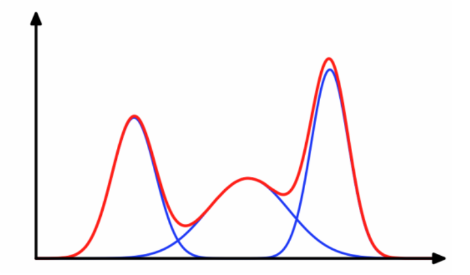
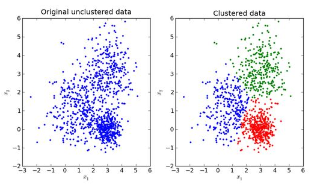

# 　混合模型（Mixture Model）

混合模型是一个可以用来表示在总体分布（distribution）中含有 K 个子分布的概率模型，换句话说，**混合模型表示了观测数据在总体中的概率分布，它是一个由 K 个子分布组成的混合分布**。混合模型不要求观测数据提供关于子分布的信息，来计算观测数据在总体分布中的概率。

高斯混合模型（Gaussian mixture model，GMM），**常用于聚类**，它与K-means算法有个相同之处在于，都**需要指定$K$值**。它使用EM算法来求解，有时只能收敛于局部最优。而它与K-means相比的优点是，K-means只能将每个样本划分为一个类，**GMM可以给出一个样本对于所有类别的概率**。GMM不仅仅可以用于聚类，还可以用于概率密度的估计，也可以用于生成新的样本。

GMM是一个生成模型，它假设数据是从多个高斯分布中生成的，可以这样理解生成流程：有$K$个高斯分布，赋予每一个分布一个权重，每当生成一个数据时，就按权重的比例随机选择一个分布，然后按照该分布生成数据。

# **高斯模型**

## **单高斯模型**

当样本数据$X$是**一维数据**（Univariate）时，高斯分布遵从下方概率密度函数（Probability Density Function）：
$$
P(x \mid \theta)=\frac{1}{\sqrt{2 \pi} \sigma^{2}} \exp \left(-\frac{(x-\mu)^{2}}{2 \sigma^{2}}\right)
$$
其中$\mu$为数据均值（期望），$\sigma$为数据标准差（Standard deviation）。

当样本数据$X$是**多维数据**（Multivariate）时，高斯分布遵从下方概率密度函数：
$$
P(x \mid \theta)=\frac{1}{(2 \pi)^{\frac{D}{2}}|\Sigma|^{\frac{1}{2}}} \exp \left(-\frac{(x-\mu)^{T} \Sigma^{-1}(x-\mu)}{2}\right)
$$
其中，$\mu$为数据均值（期望）， $\Sigma$为协方差（Covariance），D 为数据维度。

## **高斯混合模型**

**高斯混合模型可以看作是由 K 个单高斯模型组合而成的模型，这 K 个子模型是混合模型的隐变量**（Hidden variable）。一般来说，一个混合模型可以使用任何概率分布，这里使用高斯混合模型是因为高斯分布具备很好的数学性质以及良好的计算性能。

举个不是特别稳妥的例子，比如我们现在有一组狗的样本数据，不同种类的狗，体型、颜色、长相各不相同，但都属于狗这个种类，此时单高斯模型可能不能很好的来描述这个分布，因为样本数据分布并不是一个单一的椭圆，所以用混合高斯分布可以更好的描述这个问题，如下图所示：

 图中每个点都由 K 个子模型中的某一个生成 

首先定义如下信息：

- $x_{j}$ 表示第 $j$ 个观测数据, $\quad j=1,2, \ldots, N$
-  $ K$ 是混合模型中子高斯模型的数量, $\quad k=1,2, \ldots, K$
- $\alpha_{k}$ 是观测数据属于第 $k$ 个子模型的**概率**, $\quad \alpha_{k} \geq 0, \quad \sum_{k=1}^{K} \alpha_{k}=1$
- $\phi\left(x \mid \theta_{k}\right)$ 是第 $k$ 个子模型的**高斯分布密度函数**, $\theta_{k}=\left(\mu_{k}, \sigma_{k}^{2}\right)$ 。其展开形式与上面介绍的单高斯模型相同
- $\gamma_{j k}$ 表示第 $j$ 个观测数据属于第 $k$ 个子模型的概率

高斯混合模型的概率分布为：
$$
P(x \mid \theta)=\sum_{k=1}^{K} \alpha_{k} \phi\left(x \mid \theta_{k}\right)
$$

对于这个模型而言，参数 $\theta=\left(\tilde{\mu}_{k}, \tilde{\sigma}_{k}, \tilde{\alpha}_{k}\right),$ 也就是每个子模型的期望、方差（或协方差）、在混合模型中发生的概率。

# **模型参数学习**

**对于单高斯模型**，我们可以用最大似然法（Maximum likelihood）估算参数 $\theta$的值，
$$
\theta = argmax_{\theta}L(\theta)
$$
这里我们假设了每个数据点都是独立的（Independent），似然函数由概率密度函数（PDF）给出。
$$
L(\theta)=\prod_{j=1}^{N} P\left(x_{j} \mid \theta\right)
$$
由于每个点发生的概率都很小，乘积会变得极其小，不利于计算和观察，因此通常我们用 Maximum Log-Likelihood 来计算（因为 Log 函数具备单调性，不会改变极值的位置，同时在 0-1 之间输入值很小的变化可以引起输出值相对较大的变动）：
$$
\log L(\theta)=\sum_{j=1}^{N} \log P\left(x_{j} \mid \theta\right)
$$

**对于高斯混合模型**，Log-Likelihood 函数是：
$$
\log L(\theta)=\sum_{j=1}^{N} \log P\left(x_{j} \mid \theta\right)=\sum_{j=1}^{N} \log \left(\sum_{k=1}^{K} \alpha_{k} \phi\left(x \mid \theta_{k}\right)\right)
$$

如何计算高斯混合模型的参数呢？这里我们无法像单高斯模型那样使用最大似然法来求导求得使 likelihood 最大的参数，因为对于每个观测数据点来说，事先并不知道它是属于哪个子分布的（hidden variable），因此 log 里面还有求和，对于每个子模型都有未知的$\alpha_{k}, \mu_{k}, \sigma_{k}$ ，直接求导无法计算。**需要通过迭代的方法求解**。

# **EM 算法**

EM 算法是一种迭代算法，1977 年由 Dempster 等人总结提出，用于含有隐变量（Hidden variable）的概率模型参数的最大似然估计。

每次迭代包含两个步骤：

1. E-step：求期望$E\left(\gamma_{j k} \mid X, \theta\right) \text { for all } j=1,2, \ldots, N$
2. M-step：求极大，计算新一轮迭代的模型参数

这里不具体介绍一般性的 EM 算法（通过 Jensen 不等式得出似然函数的下界 Lower bound，通过极大化下界做到极大化似然函数），只介绍怎么在高斯混合模型里应用从来推算出模型参数。

通过 EM 迭代更新高斯混合模型参数的方法（我们有样本数据$x_1,x_2,...,x_N$和一个有$K$个子模型的高斯混合模型，想要推算出这个高斯混合模型的最佳参数）：

- 首先初始化参数
- E-step：依据当前参数，计算每个数据 $j$ 来自子模型 $k$ 的可能性

$$
\gamma_{j k}=\frac{\alpha_{k} \phi\left(x_{j} \mid \theta_{k}\right)}{\sum_{k=1}^{K} \alpha_{k} \phi\left(x_{j} \mid \theta_{k}\right)}, j=1,2, \ldots, N ; k=1,2, \ldots, K
$$

- M-step：计算新一轮迭代的模型参数

$$
\mu_{k}=\frac{\sum_{j}^{N}\left(\gamma_{j k} x_{j}\right)}{\sum_{j}^{N} \gamma_{j k}}, k=1,2, \ldots, K
$$

$$
\Sigma_{k}=\frac{\sum_{j}^{N} \gamma_{j k}\left(x_{j}-\mu_{k}\right)\left(x_{j}-\mu_{k}\right)^{T}}{\sum_{j}^{N} \gamma_{j k}}, k=1,2, \ldots, K
$$

$$
\alpha_{k}=\frac{\sum_{j=1}^{N} \gamma_{j k}}{N}, k=1,2, \ldots, K
$$

- 重复计算 E-step 和 M-step 直至收剑 （ $\left\|\theta_{i-1}-\theta_{i}\right\|<\varepsilon, \varepsilon$ 是一个很小的 正数，表示经过一次迭代之后参数变化非常小)

至此，我们就找到了高斯混合模型的参数。需要注意的是，EM 算法具备收敛性，但并不保证找到全局最大值，有可能找到局部最大值。解决方法是初始化几次不同的参数进行迭代，取结果最好的那次。

# 资料

1. https://zhuanlan.zhihu.com/p/30483076
2. [推导](https://zhuanlan.zhihu.com/p/85338773 )
3. https://zhuanlan.zhihu.com/p/67107370