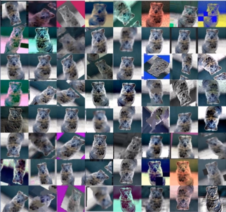

# PyTorch 的数据增强

我们在安装`PyTorch`时，还安装了`torchvision`，这是一个计算机视觉工具包。有 3 个主要的模块：

- `torchvision.transforms`: 里面包括常用的图像预处理方法
- `torchvision.datasets`: 里面包括常用数据集如 mnist、CIFAR-10、Image-Net 等
- `torchvision.models`: 里面包括常用的预训练好的模型，如 AlexNet、VGG、ResNet、GoogleNet 等

深度学习模型是由数据驱动的，数据的数量和分布对模型训练的结果起到决定性作用。所以我们需要对数据进行预处理和数据增强。下面是用数据增强，从一张图片经过各种变换生成 64 张图片，增加了数据的多样性，这可以提高模型的泛化能力。




常用的图像预处理方法有：

- 数据中心化
- 数据标准化
- 缩放
- 裁剪
- 旋转
- 翻转
- 填充
- 噪声添加
- 灰度变换
- 线性变换
- 仿射变换
- 亮度、饱和度以及对比度变换。

在[人民币图片二分类实验](https://blog.zhangxiann.com/202002212045/)中，我们对数据进行了一定的增强。

```python
# 设置训练集的数据增强和转化
train_transform = transforms.Compose([
    transforms.Resize((32, 32)),# 缩放
    transforms.RandomCrop(32, padding=4), #裁剪
    transforms.ToTensor(), # 转为张量，同时归一化
    transforms.Normalize(norm_mean, norm_std),# 标准化
])

# 设置验证集的数据增强和转化，不需要 RandomCrop
valid_transform = transforms.Compose([
    transforms.Resize((32, 32)),
    transforms.ToTensor(),
    transforms.Normalize(norm_mean, norm_std),
])
```

当我们需要多个`transforms`操作时，需要作为一个`list`放在`transforms.Compose`中。需要注意的是`transforms.ToTensor()`是把图片转换为张量，同时进行归一化操作，把每个通道 0~255 的值归一化为 0~1。在验证集的数据增强中，不再需要`transforms.RandomCrop()`操作。然后把这两个`transform`操作作为参数传给`Dataset`，在`Dataset`的`__getitem__()`方法中做图像增强。

```python
def __getitem__(self, index):
	# 通过 index 读取样本
	path_img, label = self.data_info[index]
	# 注意这里需要 convert('RGB')
	img = Image.open(path_img).convert('RGB')     # 0~255
	if self.transform is not None:
		img = self.transform(img)   # 在这里做transform，转为tensor等等
	# 返回是样本和标签
	return img, label
```

其中`self.transform(img)`会调用`Compose`的`__call__()`函数：

```python
def __call__(self, img):
	for t in self.transforms:
		img = t(img)
	return img
```

可以看到，这里是遍历`transforms`中的函数，按顺序应用到 img 中。

# transforms.Normalize

```python
torchvision.transforms.Normalize(mean, std, inplace=False)
```

功能：逐 channel 地对图像进行标准化

output = ( input - mean ) / std

- mean: 各通道的均值
- std: 各通道的标准差
- inplace: 是否原地操作

该方法调用的是`F.normalize(tensor, self.mean, self.std, self.inplace)`

而``F.normalize()`方法如下：

```python
def normalize(tensor, mean, std, inplace=False):
    if not _is_tensor_image(tensor):
        raise TypeError('tensor is not a torch image.')

    if not inplace:
        tensor = tensor.clone()

    dtype = tensor.dtype
    mean = torch.as_tensor(mean, dtype=dtype, device=tensor.device)
    std = torch.as_tensor(std, dtype=dtype, device=tensor.device)
    tensor.sub_(mean[:, None, None]).div_(std[:, None, None])
    return tensor
```

首先判断是否为 tensor，如果不是 tensor 则抛出异常。然后根据`inplace`是否为 true 进行 clone，接着把mean 和 std 都转换为tensor (原本是 list)，最后减去均值除以方差：`tensor.sub_(mean[:, None, None]).div_(std[:, None, None])`

对数据进行均值为 0，标准差为 1 的标准化，可以加快模型的收敛。

在[逻辑回归的实验](https://blog.zhangxiann.com/202002212045/)中，我们的数据生成代码如下：

```python
sample_nums = 100
mean_value = 1.7
bias = 1
n_data = torch.ones(sample_nums, 2)
# 使用正态分布随机生成样本，均值为张量，方差为标量
x0 = torch.normal(mean_value * n_data, 1) + bias      # 类别0 数据 shape=(100, 2)
# 生成对应标签
y0 = torch.zeros(sample_nums)                         # 类别0 标签 shape=(100, 1)
# 使用正态分布随机生成样本，均值为张量，方差为标量
x1 = torch.normal(-mean_value * n_data, 1) + bias     # 类别1 数据 shape=(100, 2)
# 生成对应标签
y1 = torch.ones(sample_nums)                          # 类别1 标签 shape=(100, 1)
train_x = torch.cat((x0, x1), 0)
train_y = torch.cat((y0, y1), 0)
```

生成的数据均值是`mean_value+bias=1.7+1=2.7`，比较靠近 0 均值。模型在 380 次迭代时，准确率就超过了 99.5%。

如果我们把 bias 修改为 5。那么数据的均值变成了 6.7，偏离 0 均值较远，这时模型训练需要更多次才能收敛 (准确率达到 99.5%)。


**参考资料**

- [深度之眼PyTorch框架班](https://ai.deepshare.net/detail/p_5df0ad9a09d37_qYqVmt85/6)
- [原文](https://blog.zhangxiann.com/202002212045/)