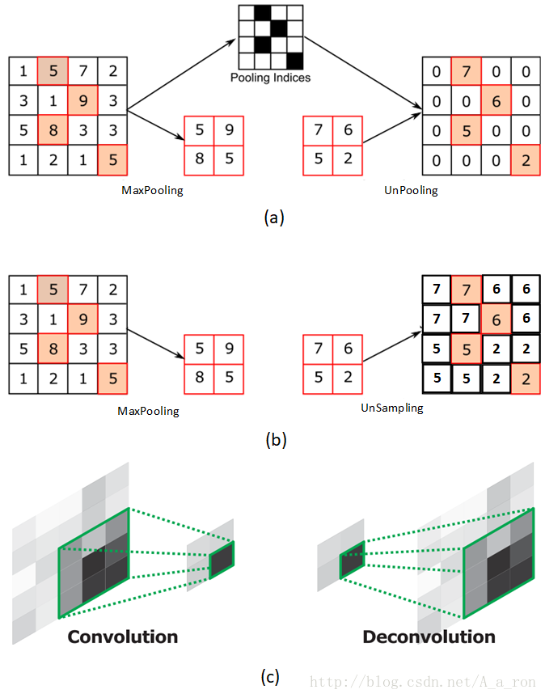

**本章代码**

1. https://github.com/zhangxiann/PyTorch_Practice/blob/master/lesson3/nn_layers_others.py

这篇文章主要介绍了 PyTorch 中的池化层、线性层和激活函数层。

# 池化层

池化的作用则体现在降采样：**保留显著特征、降低特征维度，增大kernel的感受野**。 另外一点值得注意：pooling也可以提供一些旋转不变性。 池化层可对提取到的特征信息进行降维，一方面使特征图变小，简化网络计算复杂度并在一定程度上避免过拟合的出现；一方面进行特征压缩，提取主要特征。

有最大池化和平均池化两张方式。


## nn.MaxPool2d()

```python
nn.MaxPool2d(kernel_size, 
             stride=None, 
             padding=0, 
             dilation=1, 
             return_indices=False, 
             ceil_mode=False)
```

这个函数的功能是进行 2 维的最大池化，主要参数如下：

- **kernel_size**：池化核尺寸。
- **stride**：步长，通常与 kernel_size 一致。
- **padding**：填充宽度，主要是为了调整输出的特征图大小，一般把 padding 设置合适的值后，保持输入和输出的图像尺寸不变。
- **dilation**：池化间隔大小，默认为1。常用于图像分割任务中，主要是为了提升感受野。
- **ceil_mode**：默认为 False，尺寸向下取整。为 True 时，尺寸向上取整。
- **return_indices**：为 True 时，返回最大池化所使用的像素的索引，这些记录的索引通常在反最大池化时使用，把小的特征图反池化到大的特征图时，每一个像素放在哪个位置。


下图 (a) 表示反池化，(b) 表示上采样，(c) 表示反卷积。




下面是最大池化的代码：

```python
import os
import torch
import torch.nn as nn
from torchvision import transforms
from matplotlib import pyplot as plt
from PIL import Image
from common_tools import transform_invert, set_seed

set_seed(1)  # 设置随机种子

# ================================= load img ==================================
path_img = os.path.join(os.path.dirname(os.path.abspath(__file__)), "imgs/lena.png")
img = Image.open(path_img).convert('RGB')  # 0~255

# convert to tensor
img_transform = transforms.Compose([transforms.ToTensor()])
img_tensor = img_transform(img)
img_tensor.unsqueeze_(dim=0)    # C*H*W to B*C*H*W

# ================ create convolution layer ==================================

# ================ maxpool
flag = 1
# flag = 0
if flag:
    maxpool_layer = nn.MaxPool2d((2, 2), stride=(2, 2))   # input:(i, o, size) weights:(o, i , h, w)
    img_pool = maxpool_layer(img_tensor)

print("池化前尺寸:{}\n池化后尺寸:{}".format(img_tensor.shape, img_pool.shape))
img_pool = transform_invert(img_pool[0, 0:3, ...], img_transform)
img_raw = transform_invert(img_tensor.squeeze(), img_transform)
plt.subplot(122).imshow(img_pool)
plt.subplot(121).imshow(img_raw)
plt.show()
```

结果和展示的图片如下：

```python
池化前尺寸:torch.Size([1, 3, 512, 512])
池化后尺寸:torch.Size([1, 3, 256, 256])
```


## nn.AvgPool2d()

```python
torch.nn.AvgPool2d(kernel_size, 
                   stride=None, 
                   padding=0, 
                   ceil_mode=False,
                   count_include_pad=True, 
                   divisor_override=None)
```

这个函数的功能是进行 2 维的平均池化，主要参数如下：

- **kernel_size**：池化核尺寸
- **stride**：步长，通常与 kernel_size 一致
- **padding**：填充宽度，主要是为了调整输出的特征图大小，一般把 padding 设置合适的值后，保持输入和输出的图像尺寸不变。
- **dilation**：池化间隔大小，默认为1。常用于图像分割任务中，主要是为了提升感受野
- **ceil_mode**：默认为 False，尺寸向下取整。为 True 时，尺寸向上取整
- **count_include_pad**：在计算平均值时，是否把填充值考虑在内计算
- **divisor_override**：除法因子。在计算平均值时，分子是像素值的总和，分母默认是像素值的个数。如果设置了 divisor_override，把分母改为 divisor_override。

```python
img_tensor = torch.ones((1, 1, 4, 4))
avgpool_layer = nn.AvgPool2d((2, 2), stride=(2, 2))
img_pool = avgpool_layer(img_tensor)
print("raw_img:\n{}\npooling_img:\n{}".format(img_tensor, img_pool))
```

输出如下：

```
raw_img:
tensor([[[[1., 1., 1., 1.],
          [1., 1., 1., 1.],
          [1., 1., 1., 1.],
          [1., 1., 1., 1.]]]])
pooling_img:
tensor([[[[1., 1.],
          [1., 1.]]]])
```

加上`divisor_override=3`后，输出如下：

```
raw_img:
tensor([[[[1., 1., 1., 1.],
          [1., 1., 1., 1.],
          [1., 1., 1., 1.],
          [1., 1., 1., 1.]]]])
pooling_img:
tensor([[[[1.3333, 1.3333],
          [1.3333, 1.3333]]]])
```

## nn.MaxUnpool2d()

```python
nn.MaxUnpool2d(kernel_size, 
               stride=None, 
               padding=0)
```

功能是对二维信号（图像）进行最大值反池化，主要参数如下：

- kernel_size：池化核尺寸
- stride：步长，通常与 kernel_size 一致
- padding：填充宽度

代码如下：

```python
# pooling
img_tensor = torch.randint(high=5, size=(1, 1, 4, 4), dtype=torch.float)
maxpool_layer = nn.MaxPool2d((2, 2), stride=(2, 2), return_indices=True)
img_pool, indices = maxpool_layer(img_tensor)

# unpooling
img_reconstruct = torch.randn_like(img_pool, dtype=torch.float)
maxunpool_layer = nn.MaxUnpool2d((2, 2), stride=(2, 2))
img_unpool = maxunpool_layer(img_reconstruct, indices)

print("raw_img:\n{}\nimg_pool:\n{}".format(img_tensor, img_pool))
print("img_reconstruct:\n{}\nimg_unpool:\n{}".format(img_reconstruct, img_unpool))
```

输出如下：

```python
# pooling
img_tensor = torch.randint(high=5, size=(1, 1, 4, 4), dtype=torch.float)
maxpool_layer = nn.MaxPool2d((2, 2), stride=(2, 2), return_indices=True)
img_pool, indices = maxpool_layer(img_tensor)

# unpooling
img_reconstruct = torch.randn_like(img_pool, dtype=torch.float)
maxunpool_layer = nn.MaxUnpool2d((2, 2), stride=(2, 2))
img_unpool = maxunpool_layer(img_reconstruct, indices)

print("raw_img:\n{}\nimg_pool:\n{}".format(img_tensor, img_pool))
print("img_reconstruct:\n{}\nimg_unpool:\n{}".format(img_reconstruct, img_unpool))
```

# 线性层

线性层又称为全连接层，其每个神经元与上一个层所有神经元相连，实现对前一层的线性组合或线性变换。

代码如下：

```python
inputs = torch.tensor([[1., 2, 3]])
linear_layer = nn.Linear(3, 4)
linear_layer.weight.data = torch.tensor([[1., 1., 1.],
                                         [2., 2., 2.],
                                         [3., 3., 3.],
                                         [4., 4., 4.]])

linear_layer.bias.data.fill_(0.5)
output = linear_layer(inputs)

print(inputs, inputs.shape)
print(linear_layer.weight.data, linear_layer.weight.data.shape)
print(output, output.shape)
```

输出为：

```
tensor([[1., 2., 3.]]) torch.Size([1, 3])
tensor([[1., 1., 1.],
        [2., 2., 2.],
        [3., 3., 3.],
        [4., 4., 4.]]) torch.Size([4, 3])
tensor([[ 6.5000, 12.5000, 18.5000, 24.5000]], grad_fn=<AddmmBackward>) torch.Size([1, 4])
```

# 激活函数层

假设第一个隐藏层为：$H_{1}=X \times W_{1}$，第二个隐藏层为：$H_{2}=H_{1} \times W_{2}$，输出层为：
$$
\begin{aligned} 
&={2} * {3} \\
&={1} * {2} * {3} \\
&= * ({1} {2} * {3}) \\
&= {W}
\end{aligned}
$$
如果没有非线性变换，由于矩阵乘法的结合性，多个线性层的组合等价于一个线性层。

激活函数对特征进行非线性变换，赋予了多层神经网络具有深度的意义。下面介绍一些激活函数层。


## nn.Sigmoid

- 计算公式：$y=\frac{1}{1+e^{-x}}$
- 梯度公式：$y^{\prime}=y *(1-y)$
- 特性：
	- 输出值在(0,1)，符合概率
	- 导数范围是 [0, 0.25]，容易导致梯度消失
	- 输出为非 0 均值，破坏数据分布


## nn.tanh

- 计算公式：$y=\frac{\sin x}{\cos x}=\frac{e^{x}-e^{-x}}{e^{-}+e^{-x}}=\frac{2}{1+e^{-2 x}}+1$
- 梯度公式：$y^{\prime}=1-y^{2}$
- 特性：
	- 输出值在(-1, 1)，数据符合 0 均值
	- 导数范围是 (0,1)，容易导致梯度消失


## nn.ReLU(修正线性单元)

- **计算公式**：$y=max(0,x)$
- **梯度公式**：$y^{\prime}=\left\{\begin{array}{ll}1, & x>0 \\ undefined & x=0 \\ 0, & x<0\end{array}\right.$
- **特性**：
	- 输出值均为正数，负半轴的导数为 0，容易导致死神经元
	- 导数是 1，缓解梯度消失，但容易引发梯度爆炸


针对 RuLU 会导致死神经元的缺点，出现了下面 3 种改进的激活函数。


## nn.LeakyReLU

- 有一个参数`negative_slope`：设置负半轴斜率

## nn.PReLU

- 有一个参数`init`：设置初始斜率，这个斜率是可学习的

## nn.RReLU

R 是 random 的意思，负半轴每次斜率都是随机取 [lower, upper] 之间的一个数

- lower：均匀分布下限
- upper：均匀分布上限

**参考资料**

- [深度之眼PyTorch框架班](https://ai.deepshare.net/detail/p_5df0ad9a09d37_qYqVmt85/6)
- [原文](https://blog.zhangxiann.com/202003072007/)