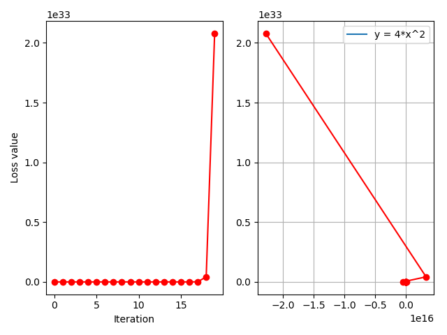
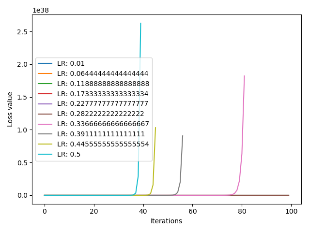
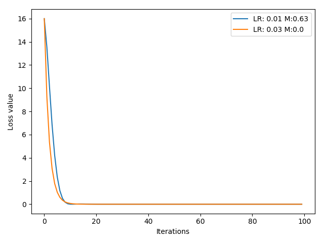

**本章代码**

- https://github.com/zhangxiann/PyTorch_Practice/blob/master/lesson4/optimizer_methods.py
- https://github.com/zhangxiann/PyTorch_Practice/blob/master/lesson4/momentum.py

这篇文章主要介绍了 PyTorch 中的优化器，包括 3 个部分：

- 优化器的概念
- optimizer 的属性
- optimizer 的方法。

# 优化器的概念

PyTorch 中的优化器是用于管理并更新模型中可学习参数的值，使得模型输出更加接近真实标签。

# optimizer 的属性

PyTorch 中提供了 Optimizer 类，定义如下：

```python
class Optimizer(object):
        def __init__(self, params, defaults):        
            self.defaults = defaults
            self.state = defaultdict(dict)
            self.param_groups = []
```

主要有 3 个属性

- **defaults**：优化器的超参数，如 weight_decay，momentum
- **state**：参数的缓存，如 momentum 中需要用到前几次的梯度，就缓存在这个变量中
- **param_groups**：管理的参数组，是一个 list，其中每个元素是字典，包括 momentum、lr、weight_decay、params 等。
- **_step_count**：记录更新 次数，在学习率调整中使用

# optimizer 的方法

1. **zero_grad**()：清空所管理参数的梯度。由于 PyTorch 的特性是张量的梯度不自动清零，因此每次反向传播之后都需要清空梯度。代码如下：

```python
def zero_grad(self):
    r"""Clears the gradients of all optimized :class:`torch.Tensor` s."""
    for group in self.param_groups:
        for p in group['params']:
            if p.grad is not None:
                p.grad.detach_()
                p.grad.zero_()
```

2. **step**()：执行一步梯度更新

3. **add_param_group**()：添加参数组，主要代码如下：

```python
def add_param_group(self, param_group):
	params = param_group['params']
    if isinstance(params, torch.Tensor):
        param_group['params'] = [params]
    ...
    self.param_groups.append(param_group)
```

4. **state_dict**()：获取优化器当前状态信息字典

5. **load_state_dict**()：加载状态信息字典，包括 state 、momentum_buffer 和 param_groups。主要用于模型的断点续训练。我们可以在每隔 50 个 epoch 就保存模型的 state_dict 到硬盘，在意外终止训练时，可以继续加载上次保存的状态，继续训练。代码如下：

```python
def state_dict(self):
    r"""Returns the state of the optimizer as a :class:`dict`.
    ...
    return {
    'state': packed_state,
    'param_groups': param_groups,
    }
```

下面是代码示例：

## step()

张量 weight 的形状为2×2，并设置梯度为 1，把 weight 传进优化器，学习率设置为 1，执行`optimizer.step()`更新梯度，也就是所有的张量都减去 1。

```python
weight = torch.randn((2, 2), requires_grad=True)
weight.grad = torch.ones((2, 2))

optimizer = optim.SGD([weight], lr=1)
print("weight before step:{}".format(weight.data))
optimizer.step()        # 修改lr=1, 0.1观察结果
print("weight after step:{}".format(weight.data))
```

输出为：

```
weight before step:tensor([[0.6614, 0.2669],
        [0.0617, 0.6213]])
weight after step:tensor([[-0.3386, -0.7331],
        [-0.9383, -0.3787]])
```

## zero_grad()

代码如下：

```python
print("weight before step:{}".format(weight.data))
optimizer.step()        # 修改lr=1 0.1观察结果
print("weight after step:{}".format(weight.data))

print("weight in optimizer:{}\nweight in weight:{}\n".format(id(optimizer.param_groups[0]['params'][0]), id(weight)))

print("weight.grad is {}\n".format(weight.grad))
optimizer.zero_grad()
print("after optimizer.zero_grad(), weight.grad is\n{}".format(weight.grad))
```

输出为：

```
weight before step:tensor([[0.6614, 0.2669],
        [0.0617, 0.6213]])
weight after step:tensor([[-0.3386, -0.7331],
        [-0.9383, -0.3787]])
weight in optimizer:1932450477472
weight in weight:1932450477472
weight.grad is tensor([[1., 1.],
        [1., 1.]])
after optimizer.zero_grad(), weight.grad is
tensor([[0., 0.],
        [0., 0.]])
```

可以看到优化器的 param_groups 中存储的参数和 weight 的内存地址是一样的，所以优化器中保存的是参数的地址，而不是把参数复制到优化器中。

## add_param_group()

向优化器中添加一组参数，代码如下：

```python
print("optimizer.param_groups is\n{}".format(optimizer.param_groups))
w2 = torch.randn((3, 3), requires_grad=True)
optimizer.add_param_group({"params": w2, 'lr': 0.0001})
print("optimizer.param_groups is\n{}".format(optimizer.param_groups))
```

输出如下：

```
optimizer.param_groups is
[{'params': [tensor([[0.6614, 0.2669],
        [0.0617, 0.6213]], requires_grad=True)], 'lr': 1, 'momentum': 0, 'dampening': 0, 'weight_decay': 0, 'nesterov': False}]
optimizer.param_groups is
[{'params': [tensor([[0.6614, 0.2669],
        [0.0617, 0.6213]], requires_grad=True)], 'lr': 1, 'momentum': 0, 'dampening': 0, 'weight_decay': 0, 'nesterov': False}, {'params': [tensor([[-0.4519, -0.1661, -1.5228],
        [ 0.3817, -1.0276, -0.5631],
        [-0.8923, -0.0583, -0.1955]], requires_grad=True)], 'lr': 0.0001, 'momentum': 0, 'dampening': 0, 'weight_decay': 0, 'nesterov': False}]
```

## state_dict()

首先进行 10 次反向传播更新，然后对比 state_dict 的变化。可以使用`torch.save()`把 state_dict 保存到 pkl 文件中。

```python
optimizer = optim.SGD([weight], lr=0.1, momentum=0.9)
opt_state_dict = optimizer.state_dict()

print("state_dict before step:\n", opt_state_dict)

for i in range(10):
    optimizer.step()

print("state_dict after step:\n", optimizer.state_dict())

torch.save(optimizer.state_dict(), os.path.join(BASE_DIR, "optimizer_state_dict.pkl"))
```

输出为：

```
state_dict before step:
 {'state': {}, 'param_groups': [{'lr': 0.1, 'momentum': 0.9, 'dampening': 0, 'weight_decay': 0, 'nesterov': False, 'params': [1976501036448]}]}
state_dict after step:
 {'state': {1976501036448: {'momentum_buffer': tensor([[6.5132, 6.5132],
        [6.5132, 6.5132]])}}, 'param_groups': [{'lr': 0.1, 'momentum': 0.9, 'dampening': 0, 'weight_decay': 0, 'nesterov': False, 'params': [1976501036448]}]}
```

经过反向传播后，state_dict 中的字典保存了`1976501036448`作为 key，这个 key 就是参数的内存地址。

## load_state_dict()

上面保存了 state_dict 之后，可以先使用`torch.load()`把加载到内存中，然后再使用`load_state_dict()`加载到模型中，继续训练。代码如下：

```python
optimizer = optim.SGD([weight], lr=0.1, momentum=0.9)
state_dict = torch.load(os.path.join(BASE_DIR, "optimizer_state_dict.pkl"))

print("state_dict before load state:\n", optimizer.state_dict())
optimizer.load_state_dict(state_dict)
print("state_dict after load state:\n", optimizer.state_dict())
```

输出如下：

```
state_dict before load state:
 {'state': {}, 'param_groups': [{'lr': 0.1, 'momentum': 0.9, 'dampening': 0, 'weight_decay': 0, 'nesterov': False, 'params': [2075286132128]}]}
state_dict after load state:
 {'state': {2075286132128: {'momentum_buffer': tensor([[6.5132, 6.5132],
        [6.5132, 6.5132]])}}, 'param_groups': [{'lr': 0.1, 'momentum': 0.9, 'dampening': 0, 'weight_decay': 0, 'nesterov': False, 'params': [2075286132128]}]}
```

# 学习率

学习率是影响损失函数收敛的重要因素，控制了梯度下降更新的步伐。下面构造一个损失函数$y=(2x)^{2}$，$x$的初始值为 2，学习率设置为 1。

```python
iter_rec, loss_rec, x_rec = list(), list(), list()

lr = 0.01    # /1. /.5 /.2 /.1 /.125
max_iteration = 20   # /1. 4     /.5 4   /.2 20 200

for i in range(max_iteration):

y = func(x)
y.backward()

print("Iter:{}, X:{:8}, X.grad:{:8}, loss:{:10}".format(
i, x.detach().numpy()[0], x.grad.detach().numpy()[0], y.item()))

x_rec.append(x.item())

x.data.sub_(lr * x.grad)    # x -= x.grad  数学表达式意义:  x = x - x.grad    # 0.5 0.2 0.1 0.125
x.grad.zero_()

iter_rec.append(i)
loss_rec.append(y)

plt.subplot(121).plot(iter_rec, loss_rec, '-ro')
plt.xlabel("Iteration")
plt.ylabel("Loss value")

x_t = torch.linspace(-3, 3, 100)
y = func(x_t)
plt.subplot(122).plot(x_t.numpy(), y.numpy(), label="y = 4*x^2")
plt.grid()

y_rec = [func(torch.tensor(i)).item() for i in x_rec]
plt.subplot(122).plot(x_rec, y_rec, '-ro')
plt.legend()
plt.show()
```

结果如下：



损失函数没有减少，而是增大，这时因为学习率太大，无法收敛，把学习率设置为 0.01 后，结果如下；


从上面可以看出，适当的学习率可以加快模型的收敛。

下面的代码是试验 10 个不同的学习率 ，[0.01, 0.5] 之间线性选择 10 个学习率，并比较损失函数的收敛情况

```python
iteration = 100
num_lr = 10
lr_min, lr_max = 0.01, 0.2  # .5 .3 .2

lr_list = np.linspace(lr_min, lr_max, num=num_lr).tolist()
loss_rec = [[] for l in range(len(lr_list))]
iter_rec = list()

for i, lr in enumerate(lr_list):
    x = torch.tensor([2.], requires_grad=True)
    
    for iter in range(iteration):
        y = func(x)
        y.backward()
        x.data.sub_(lr * x.grad)  # x.data -= x.grad
        x.grad.zero_()

        loss_rec[i].append(y.item())

for i, loss_r in enumerate(loss_rec):
    plt.plot(range(len(loss_r)), loss_r, label="LR: {}".format(lr_list[i]))
plt.legend()
plt.xlabel('Iterations')
plt.ylabel('Loss value')
plt.show()
```

结果如下：




上面的结果表示在学习率较大时，损失函数越来越大，模型不能收敛。把学习率区间改为 [0.01， 0.2] 之后，结果如下：


这个损失函数在学习率为 0.125 时最快收敛，学习率为 0.01 收敛最慢。但是不同模型的最佳学习率不一样，无法事先知道，一般把学习率设置为比较小的数就可以了。

# momentum 动量

momentum 动量的更新方法，不仅考虑当前的梯度，还会结合前面的梯度。

momentum 来源于指数加权平均：$\mathrm{v}_{t}=\boldsymbol{\beta} * \boldsymbol{v}_{t-1}+(\mathbf{1}-\boldsymbol{\beta}) * \boldsymbol{\theta}_{t}$，其中$v_{t-1}$是上一个时刻的指数加权平均，$\theta_{t}$表示当前时刻的值，$\beta$是系数，一般小于 1。指数加权平均常用于时间序列求平均值。假设现在求得是 100 个时刻的指数加权平均，那么
$$
\begin{align}
\mathrm{v}_{100}&=\boldsymbol{\beta} * \boldsymbol{v}_{99}+(\mathbf{1}-\boldsymbol{\beta}) * \boldsymbol{\theta}_{100} \\
&=(\mathbf{1}-\boldsymbol{\beta}) * \boldsymbol{\theta}_{100}+\boldsymbol{\beta} *\left(\boldsymbol{\beta} * \boldsymbol{v}_{98}+(\mathbf{1}-\boldsymbol{\beta}) * \boldsymbol{\theta}_{99}\right)\\
&=(\mathbf{1}-\boldsymbol{\beta}) * \boldsymbol{\theta}_{100}+(\mathbf{1}-\boldsymbol{\beta}) * \boldsymbol{\beta} * \boldsymbol{\theta}_{99}+\left(\boldsymbol{\beta}^{2} * \boldsymbol{v}_{98} \right)\\
&=\sum_{i}^{N}(\mathbf{1}-\boldsymbol{\beta}) * \boldsymbol{\beta}^{i} * \boldsymbol{\theta}_{N-i}
\end {align}
$$
从上式可以看到，由于$\beta$小于1，越前面时刻的$\theta$，$\beta$的次方就越大，系数就越小。

$\beta$可以理解为记忆周期，$\beta$越小，记忆周期越短，$\beta$越大，记忆周期越长。通常$\beta$设置为 0.9，那么 $\frac{1}{1-\beta}=\frac{1}{1-0.9}=10$，表示更关注最近 10 天的数据。

下面代码展示了$\beta=0.9$的情况

```python
weights = exp_w_func(beta, time_list)

plt.plot(time_list, weights, '-ro', label="Beta: {}\ny = B^t * (1-B)".format(beta))
plt.xlabel("time")
plt.ylabel("weight")
plt.legend()
plt.title("exponentially weighted average")
plt.show()

print(np.sum(weights))
```

结果为：


下面代码展示了不同的ββ取值情况

```python
beta_list = [0.98, 0.95, 0.9, 0.8]
w_list = [exp_w_func(beta, time_list) for beta in beta_list]

for i, w in enumerate(w_list):
    plt.plot(time_list, w, label="Beta: {}".format(beta_list[i]))
    plt.xlabel("time")
    plt.ylabel("weight")
    
plt.legend()
plt.show()
```

结果为：


$\beta$的值越大，记忆周期越长，就会更多考虑前面时刻的数值，因此越平缓。

在 PyTroch 中，momentum 的更新公式是：
$$
v_{i}=m * v_{i-1}+g\left(w_{i}\right)
$$

$$
w_{i+1}=w_{i}-l r * v_{i}
$$

其中$w_{i+1}$表示第$i+1$次更新的参数，$lr$ 表示学习率，$v_i$表示更新量，$m$表示 momentum 系数，$g(w_i)$表示$w_i$的梯度。展开表示如下：
$$
\begin{aligned} \boldsymbol{v}_{100} &=\boldsymbol{m} * \boldsymbol{v}_{99}+\boldsymbol{g}\left(\boldsymbol{w}_{100}\right) \\ &=\boldsymbol{g}\left(\boldsymbol{w}_{100}\right)+\boldsymbol{m} *\left(\boldsymbol{m} * \boldsymbol{v}_{98}+\boldsymbol{g}\left(\boldsymbol{w}_{99}\right)\right) \\ &=\boldsymbol{g}\left(\boldsymbol{w}_{100}\right)+\boldsymbol{m} * \boldsymbol{g}\left(\boldsymbol{w}_{99}\right)+\boldsymbol{m}^{2} * \boldsymbol{v}_{98} \\ &=\boldsymbol{g}\left(\boldsymbol{w}_{100}\right)+\boldsymbol{m} * \boldsymbol{g}\left(\boldsymbol{w}_{99}\right)+\boldsymbol{m}^{2} * \boldsymbol{g}\left(\boldsymbol{w}_{98}\right)+\boldsymbol{m}^{3} * \boldsymbol{v}_{97} \end{aligned}
$$
下面的代码是构造一个损失函数$y=(2x)^2$，$x$的初始值为 2，记录每一次梯度下降并画图，学习率使用 0.01 和 0.03，不适用 momentum。

```python
def func(x):
    return torch.pow(2*x, 2)    # y = (2x)^2 = 4*x^2        dy/dx = 8x

iteration = 100
m = 0     # .9 .63

lr_list = [0.01, 0.03]

momentum_list = list()
loss_rec = [[] for l in range(len(lr_list))]
iter_rec = list()

for i, lr in enumerate(lr_list):
    x = torch.tensor([2.], requires_grad=True)

    momentum = 0. if lr == 0.03 else m
    momentum_list.append(momentum)

    optimizer = optim.SGD([x], lr=lr, momentum=momentum)

    for iter in range(iteration):
        y = func(x)
        y.backward()

        optimizer.step()
        optimizer.zero_grad()
        loss_rec[i].append(y.item())

for i, loss_r in enumerate(loss_rec):
    plt.plot(range(len(loss_r)), 
             loss_r, 
             label="LR: {} M:{}".format(lr_list[i], momentum_list[i]))
plt.legend()
plt.xlabel('Iterations')
plt.ylabel('Loss value')
plt.show()
```

结果为：


可以看到学习率为 0.3 时收敛更快。然后我们把学习率为 0.1 时，设置 momentum 为 0.9，结果如下：1593601633017

虽然设置了 momentum，但是震荡收敛，这是由于 momentum 的值太大，每一次都考虑上一次的比例太多，可以把 momentum 设置为 0.63 后，结果如下：



可以看到设置适当的 momentum 后，学习率 0.1 的情况下收敛更快了。

下面介绍 PyTroch 所提供的 10 种优化器。


# PyTroch 提供的 10 种优化器

## optim.SGD

```python
optim.SGD(params, 
          lr=<required parameter>, 
          momentum=0, 
          dampening=0, 
          weight_decay=0, 
          nesterov=False)
```

随机梯度下降法

主要参数：

- params：管理的参数组
- lr：初始学习率
- momentum：动量系数ββ
- weight_decay：L2 正则化系数
- nesterov：是否采用 NAG

## optim.Adagrad

自适应学习率梯度下降法

## optim.RMSprop

Adagrad 的改进

## optim.Adadelta

## optim.Adam

RMSProp 集合 Momentum，这个是目前最常用的优化器，因为它可以使用较大的初始学习率。

## optim.Adamax

Adam 增加学习率上限

## optim.SparseAdam

稀疏版的 Adam

## optim.ASGD

随机平均梯度下降

## optim.Rprop

弹性反向传播，这种优化器通常是在所有样本都一起训练，也就是 batchsize 为全部样本时使用。

## optim.LBFGS

BFGS 在内存上的改进

**参考资料**

- [深度之眼PyTorch框架班](https://ai.deepshare.net/detail/p_5df0ad9a09d37_qYqVmt85/6)
- [原文](https://blog.zhangxiann.com/202003172017/)