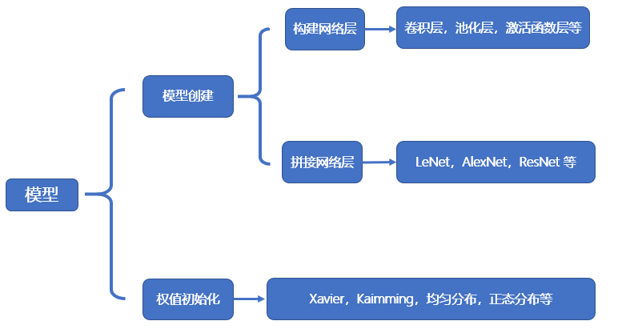
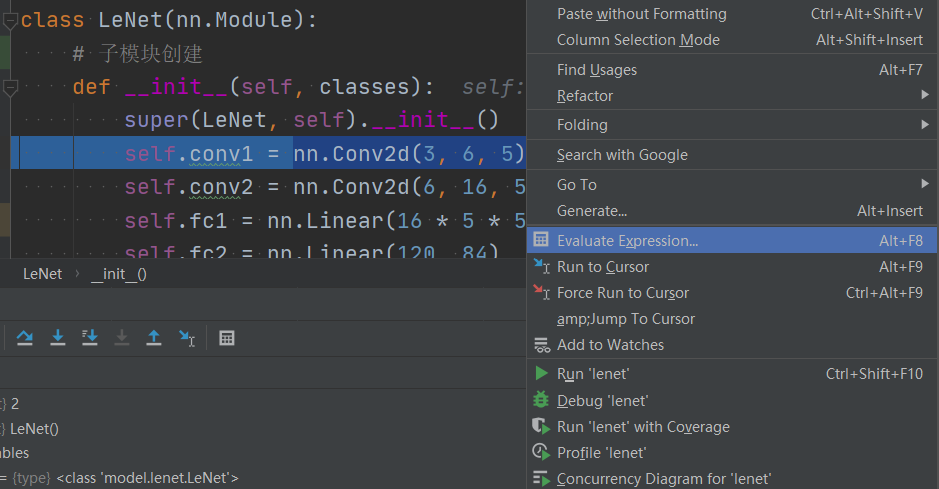
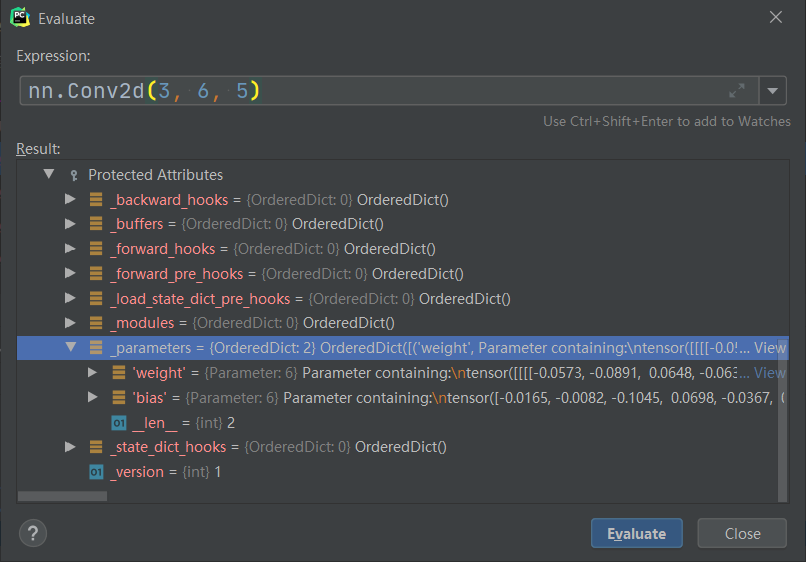
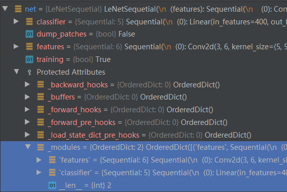
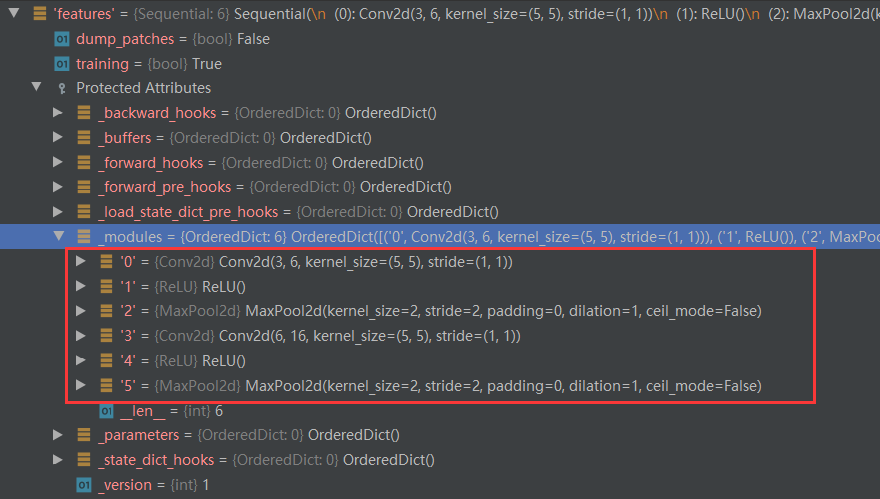
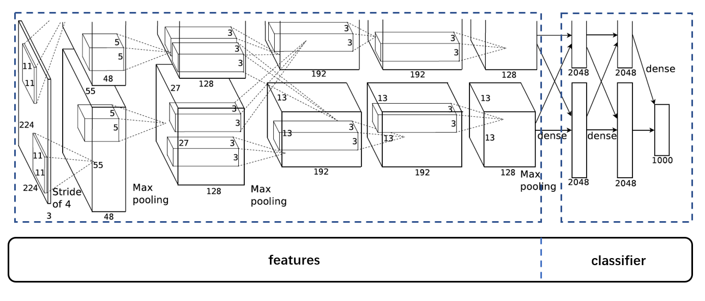

**本章代码**

1. https://github.com/zhangxiann/PyTorch_Practice/blob/master/lesson3/module_containers.py

这篇文章来看下 PyTorch 中网络模型的创建步骤。网络模型的内容如下，包括模型创建和权值初始化，这些内容都在`nn.Module`中有实现。




# 网络模型的创建步骤

创建模型有 2 个要素：**构建子模块**和**拼接子模块**。如 LeNet 里包含很多卷积层、池化层、全连接层，当我们构建好所有的子模块之后，按照一定的顺序拼接起来。


这里以上一篇文章中 `lenet.py`的 LeNet 为例，继承`nn.Module`，必须实现`__init__()` 方法和`forward()`方法。其中`__init__()` 方法里创建子模块，在`forward()`方法里拼接子模块。

```python
class LeNet(nn.Module):
	   # 子模块创建
    def __init__(self, classes):
        super(LeNet, self).__init__()
        self.conv1 = nn.Conv2d(3, 6, 5)
        self.conv2 = nn.Conv2d(6, 16, 5)
        self.fc1 = nn.Linear(16*5*5, 120)
        self.fc2 = nn.Linear(120, 84)
        self.fc3 = nn.Linear(84, classes)
        
			   # 子模块拼接
    def forward(self, x):
        out = F.relu(self.conv1(x))
        out = F.max_pool2d(out, 2)
        
        out = F.relu(self.conv2(out))
        out = F.max_pool2d(out, 2)
        
        out = out.view(out.size(0), -1)
        out = F.relu(self.fc1(out))
        out = F.relu(self.fc2(out))
        out = self.fc3(out)
        return out
```

当我们调用`net = LeNet(classes=2)`创建模型时，会调用`__init__()`方法创建模型的子模块。

当我们在训练时调用`outputs = net(inputs)`时，会进入`module.py`的`call()`函数中：

```python
def __call__(self, *input, **kwargs):
    for hook in self._forward_pre_hooks.values():
        result = hook(self, input)
        if result is not None:
            if not isinstance(result, tuple):
                result = (result,)
            input = result
    if torch._C._get_tracing_state():
        result = self._slow_forward(*input, **kwargs)
    else:
        result = self.forward(*input, **kwargs)
    ...
    ...
    ...
```

最终会调用`result = self.forward(*input, **kwargs)`函数，该函数会进入模型的`forward()`函数中，进行前向传播。

在`torch.nn`中包含 4 个模块，如下图所示。


其中所有网络模型都是继承于`nn.Module`的，下面重点分析`nn.Module`模块。

# nn.Module

`nn.Module` 有 8 个属性，都是`OrderDict`(有序字典)。在 LeNet 的`__init__()`方法中会调用父类`nn.Module`的`__init__()`方法，创建这 8 个属性。

```python
def __init__(self):
    """
    Initializes internal Module state, shared by both nn.Module and ScriptModule.
    """
    torch._C._log_api_usage_once("python.nn_module")

    self.training = True
    self._parameters = OrderedDict()
    self._buffers = OrderedDict()
    self._backward_hooks = OrderedDict()
    self._forward_hooks = OrderedDict()
    self._forward_pre_hooks = OrderedDict()
    self._state_dict_hooks = OrderedDict()
    self._load_state_dict_pre_hooks = OrderedDict()
    self._modules = OrderedDict()
```

- _parameters 属性：存储管理 nn.Parameter 类型的参数
- _modules 属性：存储管理 nn.Module 类型的参数
- _buffers 属性：存储管理缓冲属性，如 BN 层中的 running_mean
- 5 个 ***_hooks 属性：存储管理钩子函数

其中比较重要的是`parameters`和`modules`属性。

在 LeNet 的`__init__()`中创建了 5 个子模块，`nn.Conv2d()`和`nn.Linear()`都是 继承于`nn.module`，也就是说一个 module 都是包含多个子 module 的。

```python
class LeNet(nn.Module):
	# 子模块创建
    def __init__(self, classes):
        super(LeNet, self).__init__()
        self.conv1 = nn.Conv2d(3, 6, 5)
        self.conv2 = nn.Conv2d(6, 16, 5)
        self.fc1 = nn.Linear(16*5*5, 120)
        self.fc2 = nn.Linear(120, 84)
        self.fc3 = nn.Linear(84, classes)
        ...
        ...
        ...
```

当调用`net = LeNet(classes=2)`创建模型后，`net`对象的 modules 属性就包含了这 5 个子网络模块。


下面看下每个子模块是如何添加到 LeNet 的`_modules` 属性中的。以`self.conv1 = nn.Conv2d(3, 6, 5)`为例，当我们运行到这一行时，首先 Step Into 进入 `Conv2d`的构造，然后 Step Out。右键`Evaluate Expression`查看`nn.Conv2d(3, 6, 5)`的属性。




上面说了`Conv2d`也是一个 module，里面的`_modules`属性为空，`_parameters`属性里包含了该卷积层的可学习参数，这些参数的类型是 Parameter，继承自 Tensor。



此时只是完成了`nn.Conv2d(3, 6, 5)` module 的创建。还没有赋值给`self.conv1`。在`nn.Module`里有一个机制，会拦截所有的类属性赋值操作(`self.conv1`是类属性)，进入到`__setattr__()`函数中。我们再次 Step Into 就可以进入`__setattr__()`。

```python
def __setattr__(self, name, value):
    def remove_from(*dicts):
        for d in dicts:
            if name in d:
                del d[name]

    params = self.__dict__.get('_parameters')
    if isinstance(value, Parameter):
        if params is None:
            raise AttributeError(
                "cannot assign parameters before Module.__init__() call")
        remove_from(self.__dict__, self._buffers, self._modules)
        self.register_parameter(name, value)
    elif params is not None and name in params:
        if value is not None:
            raise TypeError("cannot assign '{}' as parameter '{}' "
                            "(torch.nn.Parameter or None expected)"
                            .format(torch.typename(value), name))
        self.register_parameter(name, value)
    else:
        modules = self.__dict__.get('_modules')
        if isinstance(value, Module):
            if modules is None:
                raise AttributeError(
                    "cannot assign module before Module.__init__() call")
            remove_from(self.__dict__, self._parameters, self._buffers)
            modules[name] = value
        elif modules is not None and name in modules:
            if value is not None:
                raise TypeError("cannot assign '{}' as child module '{}' "
                                "(torch.nn.Module or None expected)"
                                .format(torch.typename(value), name))
            modules[name] = value
        ...
        ...
        ...
```

在这里判断 value 的类型是`Parameter`还是`Module`，存储到对应的有序字典中。

这里`nn.Conv2d(3, 6, 5)`的类型是`Module`，因此会执行`modules[name] = value`，key 是类属性的名字`conv1`，value 就是`nn.Conv2d(3, 6, 5)`。


**总结**

- 一个 module 里可包含多个子 module。比如 LeNet 是一个 Module，里面包括多个卷积层、池化层、全连接层等子 module
- 一个 module 相当于一个运算，必须实现 forward() 函数
- 每个 module 都有 8 个字典管理自己的属性

# 模型容器

除了上述的模块之外，还有一个重要的概念是模型容器 (Containers)，常用的容器有 3 个，这些容器都是继承自`nn.Module`。

- nn.Sequetial：按照顺序包装多个网络层。
- nn.ModuleList：像 python 的 list 一样包装多个网络层，可以迭代。
- nn.ModuleDict：像 python 的 dict一样包装多个网络层，通过 (key, value) 的方式为每个网络层指定名称。

## nn.Sequetial

在传统的机器学习中，有一个步骤是特征工程，我们需要从数据中认为地提取特征，然后把特征输入到分类器中预测。在深度学习的时代，特征工程的概念被弱化了，特征提取和分类器这两步被融合到了一个神经网络中。在卷积神经网络中，前面的卷积层以及池化层可以认为是特征提取部分，而后面的全连接层可以认为是分类器部分。比如 LeNet 就可以分为**特征提取**和**分类器**两部分，这 2 部分都可以分别使用 `nn.Seuqtial` 来包装。


代码如下：

```python
class LeNetSequetial(nn.Module):
    def __init__(self, classes):
        super(LeNet2, self).__init__()
        
        self.features = nn.Sequential(
            nn.Conv2d(3, 6, 5),
            nn.ReLU(),
            nn.AvgPool2d(2, 2),
            nn.Conv2d(6, 16, 5),
            nn.ReLU(),
            nn.AvgPool2d(2, 2)
        )
        
        self.classifier = nn.Sequential(
            nn.Linear(16*5*5, 120),
            nn.ReLU(),
            nn.Linear(120, 84),
            nn.ReLU(),
            nn.Linear(84, classes)
        )

    def forward(self, x):
        x = self.features(x)
        x = x.view(x.size()[0], -1)
        x = self.classifier(x)
        return x
```

在初始化时，`nn.Sequetial`会调用`__init__()`方法，将每一个子 module 添加到 自身的`_modules`属性中。这里可以看到，我们传入的参数可以是一个 list，或者一个 OrderDict。如果是一个 OrderDict，那么则使用 OrderDict 里的 key，否则使用数字作为 key (OrderDict 的情况会在下面提及)。

```python
def __init__(self, *args):
    super(Sequential, self).__init__()
    if len(args) == 1 and isinstance(args[0], OrderedDict):
        for key, module in args[0].items():
            self.add_module(key, module)
    else:
        for idx, module in enumerate(args):
            self.add_module(str(idx), module)
```

网络初始化完成后有两个子 `module`：`features`和`classifier`。




而`features`中的子 module 如下，每个网络层以序号作为 key：




在进行前向传播时，会进入 LeNet 的`forward()`函数，首先调用第一个`Sequetial`容器：`self.features`，由于`self.features`也是一个 module，因此会调用`__call__()`函数，里面调用`result = self.forward(*input, **kwargs)`，进入`nn.Seuqetial`的`forward()`函数，在这里依次调用所有的 module。

```python
def forward(self, input):
    for module in self:
        input = module(input)
    return input
```

在上面可以看到在`nn.Sequetial`中，里面的每个子网络层 module 是使用序号来索引的，即使用数字来作为 key。一旦网络层增多，难以查找特定的网络层，这种情况可以使用 OrderDict (有序字典)。代码中使用

```python
class LeNetSequentialOrderDict(nn.Module):
    def __init__(self, classes):
        super(LeNetSequentialOrderDict, self).__init__()

        self.features = nn.Sequential(OrderedDict({
            'conv1': nn.Conv2d(3, 6, 5),
            'relu1': nn.ReLU(inplace=True),
            'pool1': nn.MaxPool2d(kernel_size=2, stride=2),

            'conv2': nn.Conv2d(6, 16, 5),
            'relu2': nn.ReLU(inplace=True),
            'pool2': nn.MaxPool2d(kernel_size=2, stride=2),
        }))

        self.classifier = nn.Sequential(OrderedDict({
            'fc1': nn.Linear(16*5*5, 120),
            'relu3': nn.ReLU(),

            'fc2': nn.Linear(120, 84),
            'relu4': nn.ReLU(inplace=True),

            'fc3': nn.Linear(84, classes),
        }))
        ...
        ...
        ...
```

**总结：**

`nn.Sequetial`是`nn.Module`的容器，用于按顺序包装一组网络层，有以下两个特性。

- **顺序性**：各网络层之间严格按照顺序构建，我们在构建网络时，一定要注意前后网络层之间输入和输出数据之间的形状是否匹配。
- 自带`forward()`函数：在`nn.Sequetial`的`forward()`函数里通过 for 循环依次读取每个网络层，执行前向传播运算。这使得我们我们构建的模型更加简洁。

## nn.ModuleList

`nn.ModuleList`是`nn.Module`的容器，用于包装一组网络层，以迭代的方式调用网络层，主要有以下 3 个方法：

- append()：在 ModuleList 后面添加网络层。
- extend()：拼接两个 ModuleList。
- insert()：在 ModuleList 的指定位置中插入网络层。

下面的代码通过列表生成式来循环迭代创建 20 个全连接层，非常方便，只是在 `forward()`函数中需要手动调用每个网络层。

```python
class ModuleList(nn.Module):
    def __init__(self):
        super(ModuleList, self).__init__()
        self.linears = nn.ModuleList([nn.Linear(10, 10) for i in range(20)])

    def forward(self, x):
        for i, linear in enumerate(self.linears):
            x = linear(x)
        return x


net = ModuleList()
print(net)

fake_data = torch.ones((10, 10))
output = net(fake_data)
print(output)
```

## nn.ModuleDict

`nn.ModuleDict`是`nn.Module`的容器，用于包装一组网络层，以索引的方式调用网络层，主要有以下 5 个方法：

- clear()：清空 ModuleDict
- items()：返回可迭代的键值对 (key, value)
- keys()：返回字典的所有 key
- values()：返回字典的所有 value
- pop()：返回一对键值，并从字典中删除


下面的模型创建了两个`ModuleDict`：`self.choices`和`self.activations`，在前向传播时通过传入对应的 key 来执行对应的网络层。

```python
class ModuleDict(nn.Module):
    def __init__(self):
        super(ModuleDict, self).__init__()
        self.choices = nn.ModuleDict({
            'conv': nn.Conv2d(10, 10, 3),
            'pool': nn.MaxPool2d(3)
        })

        self.activations = nn.ModuleDict({
            'relu': nn.ReLU(),
            'prelu': nn.PReLU()
        })

    def forward(self, x, choice, act):
        x = self.choices[choice](x)
        x = self.activations[act](x)
        return x


net = ModuleDict()
fake_img = torch.randn((4, 10, 32, 32))
output = net(fake_img, 'conv', 'relu')
# output = net(fake_img, 'conv', 'prelu')
print(output)
```

## 容器总结

- nn.Sequetial：**顺序性**，各网络层之间严格按照顺序执行，常用于 block 构建，在前向传播时的代码调用变得简洁
- nn.ModuleList：**迭代行**，常用于大量重复网络构建，通过 for 循环实现重复构建
- nn.ModuleDict：**索引性**，常用于可选择的网络层

# PyTorch 中的 AlexNet

AlexNet 是 Hinton 和他的学生等人在 2012 年提出的卷积神经网络，以高出第二名 10 多个百分点的准确率获得 ImageNet 分类任务冠军，从此卷积神经网络开始在世界上流行，是划时代的贡献。

AlexNet 特点如下：

- 采用 ReLU 替换饱和激活 函数，减轻梯度消失
- 采用 LRN (Local Response Normalization) 对数据进行局部归一化，减轻梯度消失
- 采用 Dropout 提高网络的鲁棒性，增加泛化能力
- 使用 Data Augmentation，包括 TenCrop 和一些色彩修改

AlexNet 的网络结构可以分为两部分：features 和 classifier。



在`PyTorch`的计算机视觉库`torchvision.models`中的 AlexNet 的代码中，使用了`nn.Sequential`来封装网络层。

```python
class AlexNet(nn.Module):

    def __init__(self, num_classes=1000):
        super(AlexNet, self).__init__()
        self.features = nn.Sequential(
            nn.Conv2d(3, 64, kernel_size=11, stride=4, padding=2),
            nn.ReLU(inplace=True),
            nn.MaxPool2d(kernel_size=3, stride=2),
            nn.Conv2d(64, 192, kernel_size=5, padding=2),
            nn.ReLU(inplace=True),
            nn.MaxPool2d(kernel_size=3, stride=2),
            nn.Conv2d(192, 384, kernel_size=3, padding=1),
            nn.ReLU(inplace=True),
            nn.Conv2d(384, 256, kernel_size=3, padding=1),
            nn.ReLU(inplace=True),
            nn.Conv2d(256, 256, kernel_size=3, padding=1),
            nn.ReLU(inplace=True),
            nn.MaxPool2d(kernel_size=3, stride=2),
        )
        self.avgpool = nn.AdaptiveAvgPool2d((6, 6))
        self.classifier = nn.Sequential(
            nn.Dropout(),
            nn.Linear(256 * 6 * 6, 4096),
            nn.ReLU(inplace=True),
            nn.Dropout(),
            nn.Linear(4096, 4096),
            nn.ReLU(inplace=True),
            nn.Linear(4096, num_classes),
        )

    def forward(self, x):
        x = self.features(x)
        x = self.avgpool(x)
        x = torch.flatten(x, 1)
        x = self.classifier(x)
        return x
```

**参考资料**

- [深度之眼PyTorch框架班](https://ai.deepshare.net/detail/p_5df0ad9a09d37_qYqVmt85/6)
- [原文](https://blog.zhangxiann.com/202003012001/)

