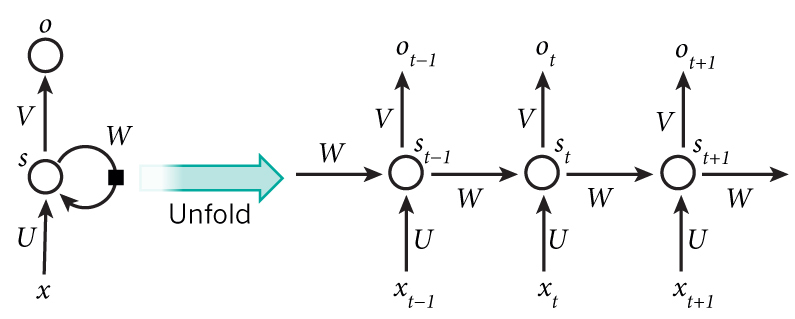

**本章代码**

1. https://github.com/zhangxiann/PyTorch_Practice/blob/master/lesson8/rnn_demo.py

这篇文章主要介绍了循环神经网络（Recurrent Neural Network），简称 RNN。

RNN 常用于处理不定长输入，常用于 NLP 以及时间序列的任务，这种数据一半具有前后关系。

RNN 网络结构如下：




上图的数据说明如下：

- x_t：时刻 t 的输入，shape=(1,57)，表示 `(batch_size, feature_dim)`。57 表示词向量的长度。
- s_t：时刻 t 的状态值，shape=(1，128)，表示 `(batch_size, hidden_dim)`。这个状态值有两个作用：经过一个全连接层得到输出；输入到下一个时刻，影响下一个时刻的状态值。也称为`hedden_state`，隐藏层状态信息，记录过往时刻的信息。第一个时刻的s_t会初始化为全 0 的向量。
- o_t：时刻 t 的输出，shape=(1,18)，表示 `(batch_size, classes)`。
- U：linear 层输入x_t的权重参数，shape=(57,128)，表示 `(feature_dim, hidden_dim)`
- W：linear 层状态值s_{t−1}的权重参数，shape=(128,128)，表示 `(hidden_dim, hidden_dim)`。
- V：linear 层状态值s_t的权重参数，shape=(128,18)，表示 `(hidden_dim, classes)`。

公式如下：
$$
s_{t}=f\left(x_{t} U+s_{t-1} W \right)
$$

$$
o_{t}=\operatorname{softmax}\left(s_{t} V \right)
$$

下面的例子是使用 RNN 实现人人名分类：输入任意长度姓名（字符串），输出姓名来自哪个国家（18 分类任务）。数据来源于：http://download.pytorch.org/tutorial/data.zip

```python
# Chou(字符串) -> RNN -> Chinese(分类类别)
for string in [C,h,o,u]:
	#首先把每个字母转换成 one-hot -> [0,0,...,1,...,0]
	y,h=model([0,0,...,1,...,0], h) # h 就是隐藏层的状态信息
```

这里没有使用 DataLoader 和 Dataset，而是手动构造了数据集的结构，训练数据使用 dict 存储，包括 18 个元素，每个元素是一个 list，存储了 18 个类别的名字列表。label 存放在一个 list 中。在迭代训练过程如下：

- 首先随机选择 label 和名字，名字转换为 one-hot 的张量，形状为$[length,1,57]$，其中`length`表示名字的长度，label 也转换为张量，形状为 1。
- 初始化隐藏层状态信息。
- 循环把名字中的每个字符的 one-hot 向量输入到 RNN 中。
- 最后得到 18 分类的 output。
- 这里没有使用优化器，而是手动进行反向传播更新参数值。

代码如下：

```python
from io import open
import glob
import unicodedata
import string
import math
import os
import time
import torch.nn as nn
import torch
import random
import matplotlib.pyplot as plt
import torch.utils.data
from common_tools import set_seed
import enviroments

set_seed(1)  # 设置随机种子
BASE_DIR = os.path.dirname(os.path.abspath(__file__))
# device = torch.device("cuda" if torch.cuda.is_available() else "cpu")
device = torch.device("cpu")


# Read a file and split into lines
def readLines(filename):
    lines = open(filename, encoding='utf-8').read().strip().split('\n')
    return [unicodeToAscii(line) for line in lines]


def unicodeToAscii(s):
    return ''.join(
        c for c in unicodedata.normalize('NFD', s)
        if unicodedata.category(c) != 'Mn'
        and c in all_letters)


# Find letter index from all_letters, e.g. "a" = 0
def letterToIndex(letter):
    return all_letters.find(letter)


# Just for demonstration, turn a letter into a <1 x n_letters> Tensor
def letterToTensor(letter):
    tensor = torch.zeros(1, n_letters)
    tensor[0][letterToIndex(letter)] = 1
    return tensor


# Turn a line into a <line_length x 1 x n_letters>,
# or an array of one-hot letter vectors
def lineToTensor(line):
    tensor = torch.zeros(len(line), 1, n_letters)
    for li, letter in enumerate(line):
        tensor[li][0][letterToIndex(letter)] = 1
    return tensor


def categoryFromOutput(output):
    top_n, top_i = output.topk(1)
    category_i = top_i[0].item()
    return all_categories[category_i], category_i


def randomChoice(l):
    return l[random.randint(0, len(l) - 1)]


def randomTrainingExample():
    category = randomChoice(all_categories)                 # 选类别
    line = randomChoice(category_lines[category])           # 选一个样本
    category_tensor = torch.tensor([all_categories.index(category)], dtype=torch.long)
    line_tensor = lineToTensor(line)    # str to one-hot
    return category, line, category_tensor, line_tensor


def timeSince(since):
    now = time.time()
    s = now - since
    m = math.floor(s / 60)
    s -= m * 60
    return '%dm %ds' % (m, s)


# Just return an output given a line
def evaluate(line_tensor):
    hidden = rnn.initHidden()

    for i in range(line_tensor.size()[0]):
        output, hidden = rnn(line_tensor[i], hidden)

    return output


def predict(input_line, n_predictions=3):
    print('\n> %s' % input_line)
    with torch.no_grad():
        output = evaluate(lineToTensor(input_line))

        # Get top N categories
        topv, topi = output.topk(n_predictions, 1, True)

        for i in range(n_predictions):
            value = topv[0][i].item()
            category_index = topi[0][i].item()
            print('(%.2f) %s' % (value, all_categories[category_index]))


def get_lr(iter, learning_rate):
    lr_iter = learning_rate if iter < n_iters else learning_rate*0.1
    return lr_iter

class RNN(nn.Module):
    def __init__(self, input_size, hidden_size, output_size):
        super(RNN, self).__init__()

        self.hidden_size = hidden_size

        self.u = nn.Linear(input_size, hidden_size)
        self.w = nn.Linear(hidden_size, hidden_size)
        self.v = nn.Linear(hidden_size, output_size)

        self.tanh = nn.Tanh()
        self.softmax = nn.LogSoftmax(dim=1)

    def forward(self, inputs, hidden):

        u_x = self.u(inputs)

        hidden = self.w(hidden)
        hidden = self.tanh(hidden + u_x)

        output = self.softmax(self.v(hidden))

        return output, hidden

    def initHidden(self):
        return torch.zeros(1, self.hidden_size)


def train(category_tensor, line_tensor):
    hidden = rnn.initHidden()

    rnn.zero_grad()

    line_tensor = line_tensor.to(device)
    hidden = hidden.to(device)
    category_tensor = category_tensor.to(device)

    for i in range(line_tensor.size()[0]):
        output, hidden = rnn(line_tensor[i], hidden)

    loss = criterion(output, category_tensor)
    loss.backward()

    # Add parameters' gradients to their values, multiplied by learning rate
    for p in rnn.parameters():
        p.data.add_(-learning_rate, p.grad.data)

    return output, loss.item()


if __name__ == "__main__":
    # config
    path_txt = os.path.join(enviroments.names,"*.txt")
    all_letters = string.ascii_letters + " .,;'"
    n_letters = len(all_letters)    # 52 + 5 字符总数
    print_every = 5000
    plot_every = 5000
    learning_rate = 0.005
    n_iters = 200000

    # step 1 data
    # Build the category_lines dictionary, a list of names per language
    category_lines = {}
    all_categories = []
    for filename in glob.glob(path_txt):
        category = os.path.splitext(os.path.basename(filename))[0]
        all_categories.append(category)
        lines = readLines(filename)
        category_lines[category] = lines

    n_categories = len(all_categories)

    # step 2 model
    n_hidden = 128
    # rnn = RNN(n_letters, n_hidden, n_categories)
    rnn = RNN(n_letters, n_hidden, n_categories)

    rnn.to(device)

    # step 3 loss
    criterion = nn.NLLLoss()

    # step 4 optimize by hand

    # step 5 iteration
    current_loss = 0
    all_losses = []
    start = time.time()
    for iter in range(1, n_iters + 1):
        # sample
        category, line, category_tensor, line_tensor = randomTrainingExample()

        # training
        output, loss = train(category_tensor, line_tensor)

        current_loss += loss

        # Print iter number, loss, name and guess
        if iter % print_every == 0:
            guess, guess_i = categoryFromOutput(output)
            correct = '✓' if guess == category else '✗ (%s)' % category
            print('Iter: {:<7} time: {:>8s} loss: {:.4f} name: {:>10s}  pred: {:>8s} label: {:>8s}'.format(
                iter, timeSince(start), loss, line, guess, correct))

        # Add current loss avg to list of losses
        if iter % plot_every == 0:
            all_losses.append(current_loss / plot_every)
            current_loss = 0
path_model = os.path.join(BASE_DIR, "rnn_state_dict.pkl")
torch.save(rnn.state_dict(), path_model)
plt.plot(all_losses)
plt.show()

predict('Yue Tingsong')
predict('Yue tingsong')
predict('yutingsong')

predict('test your name')
```

**参考资料**

- [深度之眼PyTorch框架班](https://ai.deepshare.net/detail/p_5df0ad9a09d37_qYqVmt85/6)
- [原文](https://blog.zhangxiann.com/202004271841/)