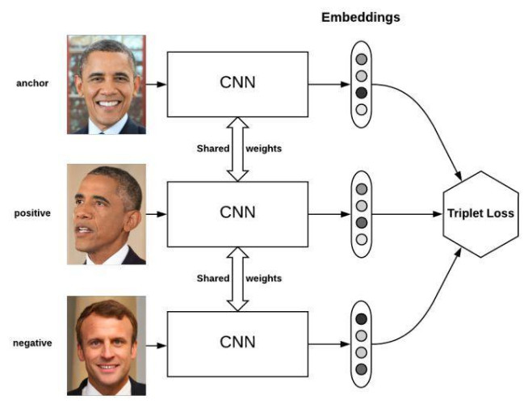

# 基本用法

```python
criterion = LossCriterion() #构造函数有自己的参数
loss = criterion(x, y) #调用标准时也有参数
```


# 损失函数

## L1范数损失 L1Loss

计算 output 和 target 之差的绝对值。

```python
torch.nn.L1Loss(reduction='mean')
```

参数：

- reduction-三个值，
	- none: 不使用约简；
	- mean:返回loss和的平均值； 
	- sum:返回loss的和。
	- 默认：mean。


## 均方误差损失 MSELoss

计算 output 和 target 之差的均方差。

```python
torch.nn.MSELoss(reduction='mean')
```


参数：

- reduction-三个值，
	- none: 不使用约简；
	- mean:返回loss和的平均值； 
	- sum:返回loss的和。
	- 默认：mean。


## 交叉熵损失 CrossEntropyLoss

当训练有 C 个类别的分类问题时很有效. 可选参数 weight 必须是一个1维 Tensor, 权重将被分配给各个类别. 对于不平衡的训练集非常有效。

在多分类任务中，经常采用 **softmax 激活函数+交叉熵损失函数**，因为交叉熵描述了两个概率分布的差异，然而神经网络输出的是向量，并不是概率分布的形式。所以需要 softmax激活函数将一个向量进行**归一化**成概率分布的形式，再采用交叉熵损失函数计算 loss。
$$
\operatorname{loss}(x, \text { class })=\text { weight }[\text { class }]\left(-x[\text { class }]+\log \left(\sum_{j} \exp (x[j])\right)\right)
$$


```python
torch.nn.CrossEntropyLoss(weight=None, ignore_index=-100, reduction='mean')
```


> 参数：

- weight (Tensor, optional) – 自定义的每个类别的权重. 必须是一个长度为 C 的 Tensor
- ignore_index (int, optional) – 设置一个目标值, 该目标值会被忽略, 从而不会影响到 输入的梯度。
- reduction-三个值，none: 不使用约简；mean:返回loss和的平均值； sum:返回loss的和。默认：mean。


## KL 散度损失 KLDivLoss

计算 input 和 target 之间的 KL 散度。KL 散度可用于衡量不同的连续分布之间的距离, 在连续的输出分布的空间上(离散采样)上进行直接回归时 很有效.

```python
torch.nn.KLDivLoss(reduction='mean')
```

参数：

- reduction-三个值，none: 不使用约简；mean:返回loss和的平均值； sum:返回loss的和。默认：mean。


##  二进制交叉熵损失 BCELoss

二分类任务时的交叉熵计算函数。用于测量重构的误差, 例如自动编码机. 注意目标的值 t[i] 的范围为0到1之间.

```python
torch.nn.BCELoss(weight=None, reduction='mean')
```

参数：

- weight (Tensor, optional) – 自定义的每个 batch 元素的 loss 的权重. 必须是一个长度为 “nbatch” 的 的 Tensor
- pos_weight(Tensor, optional) – 自定义的每个正样本的 loss 的权重. 必须是一个长度 为 “classes” 的 Tensor


## BCEWithLogitsLoss

BCEWithLogitsLoss损失函数把 Sigmoid 层集成到了 BCELoss 类中. 该版比用一个简单的 Sigmoid 层和 BCELoss 在数值上更稳定, 因为把这两个操作合并为一个层之后, 可以利用 log-sum-exp 的 技巧来实现数值稳定.

```python
torch.nn.BCEWithLogitsLoss(weight=None, reduction='mean', pos_weight=None)
```

参数：

- weight (Tensor, optional) – 自定义的每个 batch 元素的 loss 的权重. 必须是一个长度 为 “nbatch” 的 Tensor
- pos_weight(Tensor, optional) – 自定义的每个正样本的 loss 的权重. 必须是一个长度 为 “classes” 的 Tensor


## MarginRankingLoss

```python
torch.nn.MarginRankingLoss(margin=0.0, reduction='mean')
```


对于 mini-batch(小批量) 中每个实例的损失函数如下:
$$
\operatorname{loss}(x, y)=\max (0,-y *(x 1-x 2)+\operatorname{margin})
$$

参数：

- margin:默认值0


## HingeEmbeddingLoss

```python
torch.nn.HingeEmbeddingLoss(margin=1.0,  reduction='mean')
```


对于 mini-batch(小批量) 中每个实例的损失函数如下:
$$
l_{n}=\left\{\begin{array}{ll}
x_{n}, & \text { if } y_{n}=1 \\
\max \left\{0, \Delta-x_{n}\right\}, & \text { if } y_{n}=-1
\end{array}\right.
$$

参数：

- margin:默认值1


## 多标签分类损失 MultiLabelMarginLoss

```python
torch.nn.MultiLabelMarginLoss(reduction='mean')
```


对于mini-batch(小批量) 中的每个样本按如下公式计算损失:
$$
\operatorname{loss}(x, y)=\sum_{i j} \frac{\max (0,1-(x|y| j |]-x|i|))}{x . \operatorname{size}(0)}
$$

## 平滑版L1损失 SmoothL1Loss

也被称为 Huber 损失函数。

```python
torch.nn.SmoothL1Loss(reduction='mean')
```

$$
\operatorname{loss}(x, y)=\frac{1}{n} \sum_{i} z_{i}
$$

其中
$$
z_{i}=\left\{\begin{array}{ll}
0.5\left(x_{i}-y_{i}\right)^{2}, & \text { if }\left|x_{i}-y_{i}\right|<1 \\
\left|x_{i}-y_{i}\right|-0.5, & \text { otherwise }
\end{array}\right.
$$

##  2分类的logistic损失 SoftMarginLoss

```python
torch.nn.SoftMarginLoss(reduction='mean')
```

$$
\operatorname{loss}(x, y)=\sum_{i} \frac{\log (1+\exp (-y[i] * x[i]))}{x . \text { nelement }()}
$$


## 多标签 one-versus-all 损失 MultiLabelSoftMarginLoss

```python
torch.nn.MultiLabelSoftMarginLoss(weight=None, reduction='mean')
```

$$
\operatorname{loss}(x, y)=-\frac{1}{C} * \sum_{i} y[i] * \log \left((1+\exp (-x[i]))^{-1}\right)+(1-y[i]) * \log \left(\frac{\exp (-x[i])}{(1+\exp (-x[i]))}\right)
$$


## cosine 损失 CosineEmbeddingLoss

```python
torch.nn.CosineEmbeddingLoss(margin=0.0, reduction='mean')
```

$$
\operatorname{loss}(x, y)=\left\{\begin{array}{ll}
1-\cos \left(x_{1}, x_{2}\right), & \text { if } y==1 \\
\max \left(0, \cos \left(x_{1}, x_{2}\right)-\operatorname{margin}\right), & \text { if } y==-1
\end{array}\right.
$$

参数：

- margin:默认值0


## 多类别分类的hinge损失 MultiMarginLoss

```python
torch.nn.MultiMarginLoss(p=1, margin=1.0, weight=None,  reduction='mean')
```

$$
\operatorname{loss}(x, y)=\frac{\left.\sum_{i} \max (0, w[y] *(\operatorname{margin}-x[y]+x[i]))^{p}\right)}{x . \operatorname{size}(0)}
$$

参数：

- p=1或者2 默认值：1
- margin:默认值1


## 三元组损失 TripletMarginLoss

和孪生网络相似，具体例子：给一个A，然后再给B、C，看看B、C谁和A更像。



```python
torch.nn.TripletMarginLoss(margin=1.0, p=2.0, eps=1e-06, swap=False, reduction='mean')
```

$$
L(a, p, n)=\max \left\{d\left(a_{i}, p_{i}\right)-d\left(a_{i}, n_{i}\right)+\operatorname{margin}, 0\right\}
$$

其中：
$$
d\left(x_{i}, y_{i}\right)=\left\|\mathbf{x}_{i}-\mathbf{y}_{i}\right\|_{p}
$$


## 连接时序分类损失 CTCLoss

CTC连接时序分类损失，可以对没有对齐的数据进行自动对齐，主要用在没有事先对齐的序列化数据训练上。比如语音识别、ocr识别等等。

```python
torch.nn.CTCLoss(blank=0, reduction='mean')
```

参数：

- reduction-三个值，none: 不使用约简；mean:返回loss和的平均值； sum:返回loss的和。默认：mean。

## 负对数似然损失 NLLLoss

负对数似然损失. 用于训练 C 个类别的分类问题.

```python
torch.nn.NLLLoss(weight=None, ignore_index=-100,  reduction='mean')
```

参数：

- weight (Tensor, optional) – 自定义的每个类别的权重. 必须是一个长度为 C 的 Tensor
- ignore_index (int, optional) – 设置一个目标值, 该目标值会被忽略, 从而不会影响到 输入的梯度.


## NLLLoss2d

对于图片输入的负对数似然损失. 它计算每个像素的负对数似然损失.

```python
torch.nn.NLLLoss2d(weight=None, ignore_index=-100, reduction='mean')
```

参数：

- weight (Tensor, optional) – 自定义的每个类别的权重. 必须是一个长度为 C 的 Tensor
- reduction-三个值，none: 不使用约简；mean:返回loss和的平均值； sum:返回loss的和。默认：mean。


## PoissonNLLLoss

目标值为泊松分布的负对数似然损失

```python
torch.nn.PoissonNLLLoss(log_input=True, full=False,  eps=1e-08,  reduction='mean')
```

参数：

- log_input (bool, optional) – 如果设置为 True , loss 将会按照公 式 exp(input) - target * input 来计算, 如果设置为 False , loss 将会按照 input - target * log(input+eps) 计算.
- full (bool, optional) – 是否计算全部的 loss, i. e. 加上 Stirling 近似项 target * log(target) - target + 0.5 * log(2 * pi * target).
- eps (float, optional) – 默认值: 1e-8


# 其它

1. https://mp.weixin.qq.com/s/NPJoPVfLCVMueAYcfqUEIQ