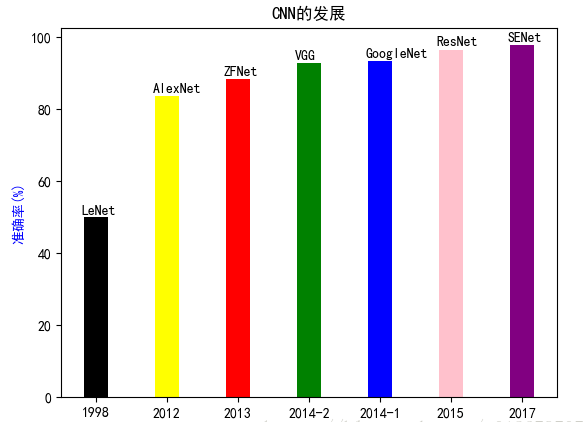
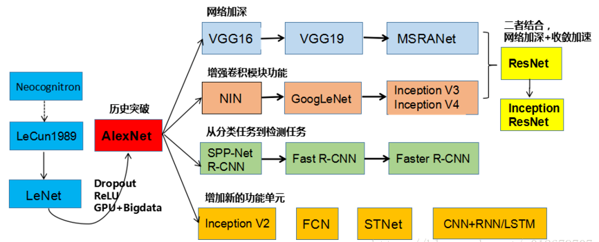
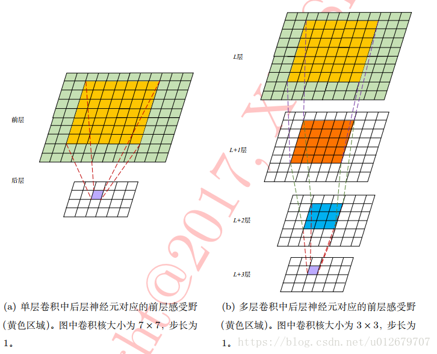
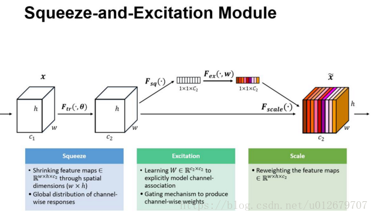

# 开篇

经典的LeNet诞生于1998年。然而之后CNN的锋芒开始被SVM等手工设计的特征盖过。随着ReLU和dropout的提出，以及GPU和大数据带来的历史机遇，CNN在2012年迎来了历史突破--AlexNet，从此CNN呈现爆炸式发展。  

从此，Deep Learning一发不可收拾，ILSVRC每年都不断被Deep Learning刷榜，如图所示，随着模型变得越来越深，Top-5的错误率也越来越低，目前降到了2.25%附近（2017，SENet），而在同样的ImageNet数据集合上，人眼的辨识错误率大概在5.1%，也就是目前的Deep Learning模型的识别能力已经超过了人眼。而下图中的这些模型，也是Deep Learning视觉发展的里程碑式代表。

CNN主要的经典结构包括：LeNet、AlexNet、ZFNet、VGG、NIN、GoogleNet、ResNet、SENet等，其发展过程如下图所示。

# 最古老的CNN模型

1985年，Rumelhart和Hinton等人提出了反向传播（Back Propagation，BP）算法[1]（也有说1986年的，指的是他们另一篇paper：Learning representations by back-propagating errors)，使得神经网络的训练变得简单可行，这篇文章在Google Scholar上的引用次数达到了19000多次，目前还是比Cortes和Vapnic的Support-Vector Networks稍落后一点，不过以Deep Learning最近的发展劲头来看，超越指日可待。

几年后，LeCun利用BP算法来训练多层神经网络用于识别手写邮政编码[2]，这个工作就是CNN的开山之作，多处用到了5\*5的卷积核，但在这篇文章中LeCun只是说把5\*5的相邻区域作为感受野，并未提及卷积或卷积神经网络（1986年）。

# 开山鼻祖：LeNet5

LeNet是卷积神经网络的祖师爷LeCun在1998年提出，用于解决手写数字识别的视觉任务。自那时起，CNN的最基本的架构就定下来了：`卷积层、池化层、全连接层`。如今各大深度学习框架中所使用的LeNet都是简化改进过的LeNet-5（-5表示具有5个层），和原始的LeNet有些许不同，比如把激活函数改为了现在很常用的ReLu。

1998年的LeNet5[4]标注着CNN的真正面世，但是这个模型在后来的一段时间并未能火起来，主要原因是费机器（计算跟不上），而且其他的算法（SVM）也能达到类似的效果甚至超过。但是LeNet最大的贡献是：`定义了CNN的基本结构，是CNN的鼻祖。`

## LeNet的结构

LeNet5包含Input、卷积层1、池化层1、卷积层2、池化层2、全连接层、输出层。    
- INPUT: [28x28x1]           weights: 0
- CONV5-32: [28x28x32]       weights: (5\*5\*1+1)\*32
- POOL2: [14x14x32]          weights: 2\*2\*1
- CONV5-64: [14x14x64]       weights: (5\*5\*32+1)\*64
- POOL2: [7x7x64]            weights: 2\*2\*1
- FC: [1x1x1024]             weights: (7\*7\*64+1)\*1024
- FC: [1x1x10]               weights: (1\*1\*512+1)\*10

## LeNet的特点

LeNet5当时的特性有如下几点：
1. 每个卷积层包含三个部分：**卷积**、**池化**和**非线性激活函数**。
2. **使用卷积提取空间特征**（起初被称为感受野，未提“卷积”二字）。
3. 降采样（Subsample）的平均池化层（Average Pooling）。
4. 双曲正切（Tanh）的激活函数。
5. MLP作为最后的分类器。
6. 层与层之间的稀疏连接减少计算复杂性。

## LeNet的突出贡献

   **LeNet定义了CNN的基本结构，是CNN的鼻祖。**

# 王者归来：AlexNet

AlexNet在2012年ImageNet竞赛中以超过第二名10.9个百分点的绝对优势一举夺冠，从此深度学习和卷积神经网络名声鹊起，深度学习的研究如雨后春笋般出现，AlexNet的出现可谓是卷积神经网络的王者归来。

## AlexNet的特点

1. ReLU作为激活函数。

ReLU为非饱和函数，论文中验证其效果在较深的网络超过了SIgmoid，成功解决了SIgmoid在网络较深时的梯度弥散问题。

2. Dropout避免模型过拟合

类似于浅层学习算法的中集成算法，该方法通过让全连接层的神经元（该模型在前两个全连接层引入Dropout）以一定的概率失去活性（比如0.5）失活的神经元不再参与前向和反向传播，相当于约有一半的神经元不再起作用。在测试的时候，让所有神经元的输出乘0.5。Dropout的引用，有效缓解了模型的过拟合。

3. 重叠的最大池化

之前的CNN中普遍使用平均池化，而Alexnet全部使用**最大池化**，避免平均池化的模糊化效果。并且，池化的步长小于核尺寸，这样使得池化层的输出之间会有重叠和覆盖，提升了特征的丰富性。

4. 提出LRN层

提出LRN（局部响应归一化）层，对局部神经元的活动创建竞争机制，使得响应较大的值变得相对更大，并抑制其他反馈较小的神经元，增强了模型的泛化能力。

5. GPU加速
6. 数据增强

随机从256\*256的原始图像中截取224\*224大小的区域（以及水平翻转的镜像），相当于增强了（256-224）\*（256-224）\*2=2048倍的数据量。使用了数据增强后，减轻过拟合，提升泛化能力。避免因为原始数据量的大小使得参数众多的CNN陷入过拟合中。

## AlexNet的贡献

AlexNet的贡献也就是AlexNet的新特点：
1. Relu做激活函数，代替Sigmoid来加快SGD的收敛速度。
2. dropout避免过拟合。
3. 重叠最大池化 overlapping Max Pooling。
4. LRN(局部响应归一化)，利用临近的数据做归一化，加速训练。
5. GPU加速。
6. 数据增强，增加模型泛化能力。

# 稳步前行：ZF-Net

ZFNet是2013ImageNet分类任务的冠军，其网络结构没什么改进，只是调了调参，性能较Alex提升了不少。ZF-Net只是将AlexNet第一层卷积核由11变成7，步长由4变为2，第3，4，5卷积层转变为384，384，256。这一年的ImageNet还是比较平静的一届，其冠军ZF-Net的名堂也没其他届的经典网络架构响亮。

# 越走越深：VGG-Nets

VGG-Nets是由牛津大学VGG（Visual Geometry Group）提出，是2014年ImageNet竞赛定位任务的第一名和分类任务的第二名的中的基础网络。**VGG可以看成是加深版本的AlexNet**. 都是conv layer + FC layer，在当时看来这是一个非常深的网络了，因为层数高达十多层，我们从其论文名字就知道了（《Very Deep Convolutional Networks for Large-Scale Visual Recognition》），当然以现在的目光看来VGG真的称不上是一个very deep的网络。

VGGNet探索了CNN的深度及其性能之间的关系，通过反复堆叠3\*3的小型卷积核和2*2的最大池化层，VGGNet成功的构筑了16-19层深的CNN。

## VGGNet结构

VGGNet有A-E七种结构，从A-E网络逐步变深，但是参数量并没有增长很多，原因为：参数量主要消耗在最后3个全连接层，而前面的卷积层虽然层数多，但消耗的参数量不大。不过，卷积层的训练比较耗时，因为其计算量大。

其中，D和E是常说的VGGNet-16和VGGNet-19。C很有意思，相比于B多了几个1\*1的卷积层，1\*1卷积的意义在于线性变换，而输入的通道数和输出的通道数不变，没有发生降维。

## VGGNet网络特点

1. VGGNet拥有5段卷积，每段卷积内有2-3个卷积层，同时每段尾部都会连接一个最大池化层（用来缩小图片）。
2. 每段内的卷积核数量一样，越后边的段内卷积核数量越多，依次为:64-128-256-512-512
3. 越深的网络效果越好。
4. LRN层作用不大（作者结论）
5. 1\*1的卷积也是很有效的，但是没有3\*3的卷积好，大一些的卷积核可以学习更大的空间特征。

## VGGNet的贡献

其突出贡献在于**证明使用很小的卷积（3\*3），增加网络深度可以有效提升模型的效果**，而且VGGNet对其他数据集具有很好的泛化能力。到目前为止，VGGNet依然经常被用来提取图像特征。

问：为什么一个段内有多个3\*3的卷积层堆叠？

答：这是个非常有用的设计。如下图所示，2个3\*3的卷积层串联相当于1个5\*5的卷积层，即一个像素会跟周围5\*5的像素产生关联，可以说感受野大小为5\*5。而3个3\*3的卷积层相当于1个7\*7的卷积层。并且，３个3\*3的卷积层的参数比1个７\*７的更少，前者为３\*3\*3=27，后者为1\*７\*７=49。如下图所示：

3*3的卷积层堆叠的优点为：

1. 参数量更小。
2. 小的卷积层比大的有更多的非线性变换，使得CNN对特征的学习能力更强。

1*1卷积核的优点：

1. 作用是在不影响输入输出维数的情况下，对输入进行线性形变，然后通过Relu进行非线性处理，增加网络的非线性表达能力。
2. 降维或升维。

# 大浪推手:GoogleNet

 Googe Inception Net首次出现在ILSVRC2014的比赛中(和VGGNet同年)，以较大的优势获得冠军。那一届的GoogleNet通常被称为Inception V1，Inception　V1的特点是**控制了计算量的参数量的同时，获得了非常好的性能**-top5错误率6.67%,这主要归功于GoogleNet中**引入一个新的网络结构Inception模块**，所以GoogleNet又被称为Inception　V1(后面还有改进版V2、V3、V4)架构中有22层深，V1比VGGNet和AlexNet都深，但是它只有500万的参数量，计算量也只有15亿次浮点运算，在参数量和计算量下降的同时保证了准确率，可以说是非常优秀并且实用的模型。

## googleNet系列介绍

Google Inception Net是一个大家族,包括:
1. 2014年9月的《Going deeper with convolutions》提出的Inception V1.
2. 2015年2月的《Batch Normalization: Accelerating Deep Network Training by Reducing Internal Covariate Shift》提出的Inception V2
3. 2015年12月的《Rethinking the Inception Architecture for Computer Vision》提出的Inception V3
4. 2016年2月的《Inception-v4, Inception-ResNet and the Impact of Residual Connections on Learning》提出的Inception V4

## GoogLeNet结构

V1有22层，V3有44层。

## GoogleNet的特点

Inception V1中精心设计的Inception Module提高了参数的利用率；

在先前的网络中，全连接层占据了网络的大部分参数，很容易产生过拟合现象；

Inception V1去除了模型最后的全连接层，用全局平均池化层代替(将图片尺寸变为1x1)。

inception架构的主要思想是建立在找到可以逼近的卷积视觉网络内的最优局部稀疏结构，并可以通过易实现的模块实现这种结构。

## 闪光点

引入Inception结构，这是一种**网中网**（Network In Network）的结构，即原来的结点也是一个网络。

 中间层的辅助LOSS单元，GoogLeNet网络结构中有3个LOSS单元，这样的网络设计是为了帮助网络的收敛。在中间层加入辅助计算的LOSS单元，目的是计算损失时让低层的特征也有很好的区分能力，从而让网络更好地被训练。在论文中，这两个辅助LOSS单元的计算被乘以0.3，然后和最后的LOSS相加作为最终的损失函数来训练网络。

将后面的**全连接层**全部替换为简单的**全局平均pooling**，在最后参数会变的更少。而在AlexNet中最后3层的全连接层参数差不多占总参数的90%，使用大网络在宽度和深度上允许GoogleNet移除全连接层，但并不会影响到结果的精度，在ImageNet中实现93.3%的精度，而且要比VGG还要快。

# 里程碑式创新：ResNet

2015年何恺明推出的ResNet在ISLVRC和COCO上横扫所有选手，获得冠军。ResNet在网络结构上做了大创新，而不再是简单的堆积层数，ResNet在卷积神经网络的新思路，绝对是深度学习发展历程上里程碑式的事件

## 闪光点

层数非常深，已经超过百层，引入残差单元来解决退化问题。

## 残差网络

主要的创新在**残差网络**，其实这个网络的提出本质上还是要解决层次比较深的时候无法训练的问题。这种借鉴了Highway Network思想的网络相当于旁边专门开个通道使得输入可以直达输出，而优化的目标由原来的拟合输出H(x)变成输出和输入的差H(x)-x，其中H(X)是某一层原始的的期望映射输出，x是输入。

# SENet

可以看到，已经有很多工作在空间维度上来提升网络的性能。那么很自然想到，网络是否可以从其他层面来考虑去提升性能，比如考虑特征通道之间的关系？基于这一点并提出了 Squeeze-and-Excitation Networks（简称 SENet）。在SENet结构中，Squeeze 和 Excitation 是两个非常关键的操作，所以以此来命名。

动机是希望显式地建模特征通道之间的相互依赖关系。另外，作者并不打算引入一个新的空间维度来进行特征通道间的融合，而是采用了一种全新的「特征重标定」策略。具体来说，就是通过学习的方式来自动获取到每个特征通道的重要程度，然后依照这个重要程度去提升有用的特征并抑制对当前任务用处不大的特征。

下图是提出的 SE 模块的示意图。给定一个输入 x，其特征通道数为 c_1，通过一系列卷积等一般变换后得到一个特征通道数为 c_2 的特征。与传统的 CNN 不一样的是，接下来我们通过三个操作来重标定前面得到的特征。

（1）首先是 Squeeze 操作，我们顺着空间维度来进行特征压缩，将每个二维的特征通道变成一个实数，这个实数某种程度上具有全局的感受野，并且输出的维度和输入的特征通道数相匹配。它表征着在特征通道上响应的全局分布，而且使得靠近输入的层也可以获得全局的感受野，这一点在很多任务中都是非常有用的。

（2）其次是 Excitation 操作，它是一个类似于循环神经网络中门的机制。通过参数 w 来为每个特征通道生成权重，其中参数 w 被学习用来显式地建模特征通道间的相关性。

（3）最后是一个 Reweight 的操作，我们将 Excitation 的输出的权重看做是进过特征选择后的每个特征通道的重要性，然后通过乘法逐通道加权到先前的特征上，完成在通道维度上的对原始特征的重标定。

