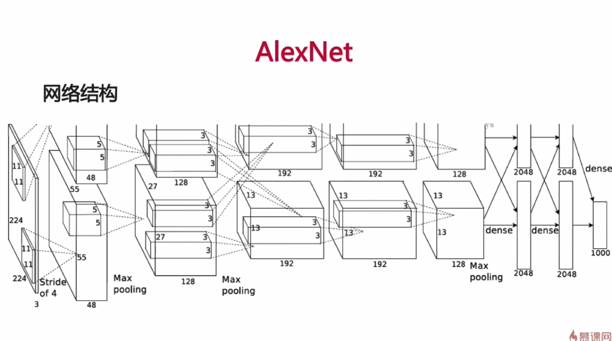
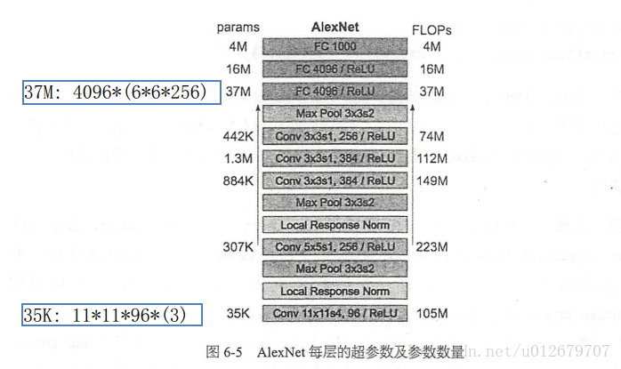

# Alexnet结构

2012年，AlexNet横空出世。这个模型的名字来源于论文第一作者的姓名Alex Krizhevsky [1]。AlexNet使用了8层卷积神经网络，并以很大的优势赢得了ImageNet 2012图像识别挑战赛。它首次证明了学习到的特征可以超越手工设计的特征，从而一举打破计算机视觉研究的前状。



AlexNet与LeNet的设计理念非常相似，但也有显著的区别。

**第一**，与相对较小的LeNet相比，AlexNet包含8层变换，其中有5层卷积和2层全连接隐藏层，以及1个全连接输出层。下面我们来详细描述这些层的设计。

AlexNet第一层中的卷积窗口形状是$11\times11$。因为ImageNet中绝大多数图像的高和宽均比MNIST图像的高和宽大10倍以上，ImageNet图像的物体占用更多的像素，所以需要更大的卷积窗口来捕获物体。第二层中的卷积窗口形状减小到$5\times5$，之后全采用$3\times3$。此外，第一、第二和第五个卷积层之后都使用了窗口形状为$3\times3$、步幅为2的最大池化层。而且，AlexNet使用的卷积通道数也大于LeNet中的卷积通道数数十倍。

紧接着最后一个卷积层的是两个输出个数为4096的全连接层。这两个巨大的全连接层带来将近1 GB的模型参数。由于早期显存的限制，最早的AlexNet使用**双数据流**的设计使一个GPU只需要处理一半模型。幸运的是，显存在过去几年得到了长足的发展，因此通常我们不再需要这样的特别设计了。

**第二**，AlexNet将sigmoid激活函数改成了更加简单的**ReLU激活函数**。一方面，ReLU激活函数的计算更简单，例如它并没有sigmoid激活函数中的求幂运算。另一方面，ReLU激活函数在不同的参数初始化方法下使模型更容易训练。这是由于当sigmoid激活函数输出极接近0或1时，这些区域的梯度几乎为0，从而造成反向传播无法继续更新部分模型参数；而ReLU激活函数在正区间的梯度恒为1。因此，若模型参数初始化不当，sigmoid函数可能在正区间得到几乎为0的梯度，从而令模型无法得到有效训练。

**第三**，AlexNet通过**丢弃法**（参见3.13节）来控制全连接层的模型复杂度。而LeNet并没有使用丢弃法。

**第四**，AlexNet引入了大量的**图像增广**，如翻转、裁剪和颜色变化，从而进一步扩大数据集来缓解过拟合。我们将在后面的9.1节（图像增广）详细介绍这种方法。

> 以上来自《动手学深度学习》

---

AlexNet为8层深度网络，其中5层卷积层和3层全连接层，不计LRN层和池化层。

**input:** 227\*227\*3 (RGB, 3通道), 最开始是224\*224\*3，为后续处理方便必须进行调整。

> Conv1:

- Conv1_input: 227*227 *3
- Kernel_size: 11*11
- Kernel_num: 96
- Stride: 4*4
- Conv1_Out: 55\*55\*96   ----->(227-11)/4 + 1 = 55
- 参数数目 = 3 * （11 * 11） * 96  = 35k


> LRN：

- Pool1
- Kernel_size: 3*3
- Stride: 2*2
- Pool1_Out: 27\*27\*96    ----->(55-3)/2 + 1 = 27


> Conv2:

- Conv2_input: 27*27 *96
- Kernel_size: 5*5
- Kernel_num: 256
- Stride: 1*1
- Pad: 2
- Conv2_Out: 27\*27\*256   ----->(27-5+2*2)/1 + 1 = 27


> LRN:

- Pool2
- Kernel_size: 3*3
- Stride: 2*2
- Pool2_Out: 13\*13\*256    ----->(27-3)/2 + 1 = 13


> Conv3:

- Conv3_input: 13*13 *256
- Kernel_size: 3*3
- Kernel_num: 384
- Stride: 1*1
- Pad: 1
- Conv3_Out: 13\*13\*384   ----->(13-3+1*2)/1 + 1 = 13


> Conv4:

- Conv4_input: 13*13 *384
- Kernel_size: 3*3
- Kernel_num: 384
- Stride: 1*1
- Pad: 1
- Conv4_Out: 13\*13\*384   ----->(13-3+1*2)/1 + 1 = 13


> Conv5:

- Conv5_input: 13*13 *384
- Kernel_size: 3*3
- Kernel_num: 256
- Stride: 1*1
- Pad: 1
- Conv5_Out: 13\*13\*256   -----(13-3+1*2)/1 + 1 = 13


> Pool5

- Kernel_size: 3*3
- Stride: 2*2
- Pool5_Out: 6\*6\*256    -----(13-3)/2 + 1 = 6


> FC6:

- Fc6_input:6*6 *256
- Fc6_out: 4096
- dropout


> FC7:

- Fc7_input:4096
- Fc7_out: 4096
- dropout

> FC8:

- Fc8_input:4096
- Fc8_out: 1000

# 结构分析



AlexNet每层的超参数如图所示，第一个卷积使用较大的核尺寸11\*11，步长为4，有96个卷积核；紧接着一层LRN层；然后是最大池化层，核为3\*3，步长为2。这之后的卷积层的核尺寸都比较小，5\*5或3\*3，并且步长为1，即扫描全图所有像素；而最大池化层依然为3\*3，步长为2。

我们可以发现，前几个卷积层的计算量很大，但参数量很小，只占Alexnet总参数的很小一部分。这就是卷积层的优点！通过较小的参数量来提取有效的特征。

要注意，论文中指出，如果去掉任何一个卷积层，都会使网络的分类性能大幅下降。


**网络结构：**

1.  首次使用了Relu
2.  2个GPU并行结构
3.  1,2,5卷积层后跟随max-pooling层
4.  两个全连接层上使用了dropout
5.  数据增强，图片随机采样：[256,256]采样[224,224]
6.  Dropout = 0.5
7.  Batch size = 128
8.  SGD momentum = 0.9
9.  Learning rate = 0.01， 过一定次数降低为1/10
10.  7 个 CNN 做ensemble： 错误率从18.2%降到15.4%


**网络结构-dropout的原理解释：**
- 组合解释：
  - 每次dropout相当于训练了一个子网络。
  - 最后的结果相当于很多子网络的组合。
- 动机解释：
  - 消除了神经单元之间的依赖，增强泛化能力
- 数据解释：
  - 对于dropout后的结果，总能找到一个样本与其对应。
  - 相当于数据增强

# AlexNet的新技术点

## 针对网络架构

> **ReLU作为激活函数**

ReLU为非饱和函数，论文中验证其效果在较深的网络超过了Sigmoid，成功解决了Sigmoid在网络较深时的梯度弥散问题。 
​		一般神经元的激活函数会选择sigmoid函数或者tanh函数，然而AlexNet发现在训练时间的梯度衰减方面，这些非线性饱和函数要比非线性非饱和函数慢很多。在AlexNet中用的非线性非饱和函数是f=max(0,x)，即ReLU。实验结果表明，要将深度网络训练至training error rate达到25%的话，ReLU只需5个epochs的迭代，但tanh单元需要35个epochs的迭代，用ReLU比tanh快6倍。

> **重叠的最大池化(Overlapping Pooling)**

之前的CNN中普遍使用平均池化，而Alexnet全部使用最大池化，**避免平均池化的模糊化效果**。并且，池化的步长小于核尺寸，这样使得池化层的输出之间会有重叠和覆盖，提升了特征的丰富性。
		带交叠的Pooling，顾名思义这指Pooling单元在总结提取特征的时候，其输入会受到相邻pooling单元的输入影响，也就是提取出来的结果可能是有重复的(对max　pooling而言)。而且，实验表示使用 带交叠的Pooling的效果比的传统要好，在top-1和top-5上分别提高了0.4%和0.3%，在训练阶段有避免过拟合的作用。

> **LRN局部响应归一化**

提出LRN层，对局部神经元的活动创建竞争机制，使得响应较大的值变得相对更大，并抑制其他反馈较小的神经元，增强了模型的泛化能力。 

ReLU本来是不需要对输入进行标准化，但本文发现进行局部标准化能提高性能。 

这种归一化操作实现了某种形式的横向抑制，这也是受真实神经元的某种行为启发。 

卷积核矩阵的排序是随机任意，并且在训练之前就已经决定好顺序。这种LPN形成了一种横向抑制机制。

## 针对过拟合现象

> **Dropout避免模型过拟合**

在训练时使用Dropout随机忽略一部分神经元，以避免模型过拟合。在alexnet的最后几个全连接层中使用了Dropout。

> **数据增强**

随机从256\*256的原始图像中截取224\*224大小的区域（以及水平翻转的镜像），相当于增强了（256-224）\*（256-224）\*2=2048倍的数据量。使用了数据增强后，减轻过拟合，提升泛化能力。避免因为原始数据量的大小使得参数众多的CNN陷入过拟合中。  

同时，论文中会对原始数据图片的RGB做PCA分析，并对主成分做一个标准差为0.1的高斯扰动。

## 针对训练速度

> **GPU加速**

为提高运行速度和提高网络运行规模，作者采用**双GPU的设计模式**。并且规定GPU只能在特定的层进行通信交流。其实就是每一个GPU负责一半的运算处理。作者的实验数据表示，two-GPU方案会比只用one-GPU跑半个上面大小网络的方案，在准确度上提高了1.7%的top-1和1.2%的top-5。值得注意的是，虽然one-GPU网络规模只有two-GPU的一半，但其实这两个网络其实并非等价的。

# 基于TensorFlow的代码实现

> tf_AlexNet.ipynb


```python
import tensorflow as tf
import time
import math
from datetime import datetime

batch_size = 32  # 每个batch有32张图片
num_batch = 1000  # 共100个batch
keep_prob = 0.5

def print_architecture(t):
    """print the architecture information of the network,include name and size"""
    print(t.op.name, " ", t.get_shape().as_list())
    
def inference(images):
    """ 构建网络 ：5个conv+3个FC"""
    parameters = []  # 储存参数

    with tf.name_scope('conv1') as scope:
        """
        images:227*227*3
        kernel: 11*11 *64
        stride:4*4
        padding:name      

        #通过with tf.name_scope('conv1') as scope可以将scope内生成的Variable自动命名为conv1/xxx
        便于区分不同卷积层的组建

        input: images[227*227*3]
        middle: conv1[55*55*96]
        output: pool1 [27*27*96]

        """
        kernel = tf.Variable(tf.truncated_normal([11, 11, 3, 96],
                                                 dtype=tf.float32,
                                                 stddev=0.1),
                             name="weights")
        conv = tf.nn.conv2d(input=images,
                            filter=kernel,
                            strides=[1, 4, 4, 1],
                            padding='SAME')
        biases = tf.Variable(tf.constant(0.0, shape=[96], dtype=tf.float32),
                             trainable=True,
                             name="biases")
        bias = tf.nn.bias_add(conv, biases)  # w*x+b
        conv1 = tf.nn.relu(bias, name=scope)  # reLu
        print_architecture(conv1)
        parameters += [kernel, biases]

        # 添加LRN层和max_pool层
        """
        LRN会让前馈、反馈的速度大大降低（下降1/3），但最终效果不明显，
        所以只有ALEXNET用LRN，其他模型都放弃了
        """
        lrn1 = tf.nn.lrn(conv1,
                         depth_radius=4,
                         bias=1,
                         alpha=0.001 / 9,
                         beta=0.75,
                         name="lrn1")
        pool1 = tf.nn.max_pool(value=lrn1,
                               ksize=[1, 3, 3, 1],
                               strides=[1, 2, 2, 1],
                               padding="VALID",
                               name="pool1")
        print_architecture(pool1)

    with tf.name_scope('conv2') as scope:
        """
        input: pool1[27*27*96]
        middle: conv2[27*27*256]
        output: pool2 [13*13*256]

        """
        kernel = tf.Variable(tf.truncated_normal([5, 5, 96, 256],
                                                 dtype=tf.float32,
                                                 stddev=0.1),
                             name="weights")
        conv = tf.nn.conv2d(input=pool1,
                            filter=kernel,
                            strides=[1, 1, 1, 1],
                            padding='SAME')
        biases = tf.Variable(tf.constant(0.0, shape=[256], dtype=tf.float32),
                             trainable=True,
                             name="biases")
        bias = tf.nn.bias_add(conv, biases)  # w*x+b
        conv2 = tf.nn.relu(bias, name=scope)  # reLu
        parameters += [kernel, biases]
        # 添加LRN层和max_pool层
        """
        LRN会让前馈、反馈的速度大大降低（下降1/3），但最终效果不明显，所以只有ALEXNET用LRN，其他模型都放弃了
        """
        lrn2 = tf.nn.lrn(conv2,
                         depth_radius=4,
                         bias=1,
                         alpha=0.001 / 9,
                         beta=0.75,
                         name="lrn1")
        pool2 = tf.nn.max_pool(value=lrn2,
                               ksize=[1, 3, 3, 1],
                               strides=[1, 2, 2, 1],
                               padding="VALID",
                               name="pool2")
        print_architecture(pool2)

    with tf.name_scope('conv3') as scope:
        """
        input: pool2[13*13*256]
        output: conv3 [13*13*384]

        """
        kernel = tf.Variable(tf.truncated_normal([3, 3, 256, 384],
                                                 dtype=tf.float32,
                                                 stddev=0.1),
                             name="weights")
        conv = tf.nn.conv2d(input=pool2,
                            filter=kernel,
                            strides=[1, 1, 1, 1],
                            padding='SAME')
        biases = tf.Variable(tf.constant(0.0, shape=[384], dtype=tf.float32),
                             trainable=True,
                             name="biases")
        bias = tf.nn.bias_add(conv, biases)  # w*x+b
        conv3 = tf.nn.relu(bias, name=scope)  # reLu
        parameters += [kernel, biases]
        print_architecture(conv3)

    with tf.name_scope('conv4') as scope:
        """
        input: conv3[13*13*384]
        output: conv4 [13*13*384]

        """
        kernel = tf.Variable(tf.truncated_normal([3, 3, 384, 384],
                                                 dtype=tf.float32,
                                                 stddev=0.1),
                             name="weights")
        conv = tf.nn.conv2d(input=conv3,
                            filter=kernel,
                            strides=[1, 1, 1, 1],
                            padding='SAME')
        biases = tf.Variable(tf.constant(0.0, shape=[384], dtype=tf.float32),
                             trainable=True,
                             name="biases")
        bias = tf.nn.bias_add(conv, biases)  # w*x+b
        conv4 = tf.nn.relu(bias, name=scope)  # reLu
        parameters += [kernel, biases]
        print_architecture(conv4)

    with tf.name_scope('conv5') as scope:
        """
        input: conv4[13*13*384]
        output: conv5 [6*6*256]

        """
        kernel = tf.Variable(tf.truncated_normal([3, 3, 384, 256],
                                                 dtype=tf.float32,
                                                 stddev=0.1),
                             name="weights")
        conv = tf.nn.conv2d(input=conv4,
                            filter=kernel,
                            strides=[1, 1, 1, 1],
                            padding='SAME')
        biases = tf.Variable(tf.constant(0.0, shape=[256], dtype=tf.float32),
                             trainable=True,
                             name="biases")
        bias = tf.nn.bias_add(conv, biases)  # w*x+b
        conv5 = tf.nn.relu(bias, name=scope)  # reLu
        pool5 = tf.nn.max_pool(value=conv5,
                               ksize=[1, 3, 3, 1],
                               strides=[1, 2, 2, 1],
                               padding="VALID",
                               name="pool5")
        parameters += [kernel, biases]
        print_architecture(pool5)

    # 全连接层6
    with tf.name_scope('fc6') as scope:
        """
        input:pool5 [6*6*256]
        output:fc6 [4096]
        """
        kernel = tf.Variable(tf.truncated_normal([6 * 6 * 256, 4096],
                                                 dtype=tf.float32,
                                                 stddev=0.1),
                             name="weights")
        biases = tf.Variable(tf.constant(0.0, shape=[4096], dtype=tf.float32),
                             trainable=True,
                             name="biases")
        # 输入数据变换
        flat = tf.reshape(pool5, [-1, 6 * 6 * 256])  # 整形成m*n,列n为7*7*64
        # 进行全连接操作
        fc = tf.nn.relu(tf.matmul(flat, kernel) + biases, name='fc6')
        # 防止过拟合  nn.dropout
        fc6 = tf.nn.dropout(fc, keep_prob)
        parameters += [kernel, biases]
        print_architecture(fc6)

    # 全连接层7
    with tf.name_scope('fc7') as scope:
        """
        input:fc6 [4096]
        output:fc7 [4096]
        """
        kernel = tf.Variable(tf.truncated_normal([4096, 4096],
                                                 dtype=tf.float32,
                                                 stddev=0.1),
                             name="weights")
        biases = tf.Variable(tf.constant(0.0, shape=[4096], dtype=tf.float32),
                             trainable=True,
                             name="biases")
        # 进行全连接操作
        fc = tf.nn.relu(tf.matmul(fc6, kernel) + biases, name='fc7')
        # 防止过拟合  nn.dropout
        fc7 = tf.nn.dropout(fc, keep_prob)
        parameters += [kernel, biases]
        print_architecture(fc7)

    # 全连接层8
    with tf.name_scope('fc8') as scope:
        """
        input:fc7 [4096]
        output:fc8 [1000]
        """
        kernel = tf.Variable(tf.truncated_normal([4096, 1000],
                                                 dtype=tf.float32,
                                                 stddev=0.1),
                             name="weights")
        biases = tf.Variable(tf.constant(0.0, shape=[1000], dtype=tf.float32),
                             trainable=True,
                             name="biases")
        # 进行全连接操作
        fc8 = tf.nn.xw_plus_b(fc7, kernel, biases, name='fc8')
        parameters += [kernel, biases]
        print_architecture(fc8)

    return fc8, parameters
```


```python
# 因未下载ImageNet数据集（太大），只是简单的测试了一下alexnet的性能。
# 使用的是随机生成的图片来作为训练数据。
```


```python
def time_compute(session, target, info_string):
    """

    """
    num_step_burn_in = 10  # 预热轮数，头几轮迭代有显存加载、cache命中等问题可以因此跳过
    total_duration = 0.0  # 总时间
    total_duration_squared = 0.0
    for i in range(num_batch + num_step_burn_in):
        start_time = time.time()
        _ = session.run(target)
        duration = time.time() - start_time
        if i >= num_step_burn_in:
            if i % 100 == 0:  # 每迭代10次显示一次duration
                print("%s: step %d,duration=%.5f " %
                      (datetime.now(), i - num_step_burn_in, duration))
            total_duration += duration
            total_duration_squared += duration * duration

    time_mean = total_duration / num_batch
    time_variance = total_duration_squared / num_batch - time_mean * time_mean
    time_stddev = math.sqrt(time_variance)
    # 迭代完成，输出
    print("%s: %s across %5d steps,%.3f +/- %.3f sec per batch " %
          (datetime.now(), info_string, num_batch, time_mean, time_stddev))
```


```python
with tf.Graph().as_default():
    """仅使用随机图片数据 测试前馈和反馈计算的耗时"""
    image_size = 224
    images = tf.Variable(tf.random_normal([batch_size, image_size, image_size, 3],
                                          dtype=tf.float32,
                                          stddev=0.1))
    fc8, parameters = inference(images)

    init = tf.global_variables_initializer()
    sess = tf.Session()
    sess.run(init)
    """
    AlexNet forward 计算的测评
    传入的target:fc8（即最后一层的输出）
    优化目标：loss
    使用tf.gradients求相对于loss的所有模型参数的梯度

    AlexNet Backward 计算的测评
    target:grad

    """
    time_compute(sess, target=fc8, info_string="Forward")  # 前向预测

    obj = tf.nn.l2_loss(fc8)
    grad = tf.gradients(obj, parameters)
    time_compute(sess, grad, "Forward-backward")  # 后向训练
    print("*" * 50)
```

    conv1   [32, 56, 56, 96]
    conv1/pool1   [32, 27, 27, 96]
    conv2/pool2   [32, 13, 13, 256]
    conv3   [32, 13, 13, 384]
    conv4   [32, 13, 13, 384]
    conv5/pool5   [32, 6, 6, 256]
    fc6/dropout/mul   [32, 4096]
    fc7/dropout/mul   [32, 4096]
    fc8/fc8   [32, 1000]
    2019-08-13 23:33:43.650160: step 90,duration=0.04286 
    2019-08-13 23:33:47.879203: step 190,duration=0.04189 
    2019-08-13 23:33:52.106407: step 290,duration=0.04186 
    2019-08-13 23:33:56.332996: step 390,duration=0.04192 
    2019-08-13 23:34:00.600698: step 490,duration=0.04289 
    2019-08-13 23:34:04.880015: step 590,duration=0.04289 
    2019-08-13 23:34:09.134450: step 690,duration=0.04188 
    2019-08-13 23:34:13.460125: step 790,duration=0.04290 
    2019-08-13 23:34:17.789226: step 890,duration=0.04289 
    2019-08-13 23:34:22.162630: step 990,duration=0.04293 
    2019-08-13 23:34:22.542573: Forward across  1000 steps,0.043 +/- 0.001 sec per batch 
    2019-08-13 23:34:37.150291: step 90,duration=0.14162 
    2019-08-13 23:34:51.609400: step 190,duration=0.15558 
    2019-08-13 23:35:05.992322: step 290,duration=0.14262 
    2019-08-15 21:34:57.406336: step 390,duration=0.14461 
    2019-08-15 21:35:11.657918: step 490,duration=0.14117 
    2019-08-15 21:35:25.866683: step 590,duration=0.14362 
    2019-08-15 21:35:40.093752: step 690,duration=0.13963 
    2019-08-15 21:35:54.117134: step 790,duration=0.14063 
    2019-08-15 21:36:08.133153: step 890,duration=0.13966 
    2019-08-15 21:36:22.152171: step 990,duration=0.14062 
    2019-08-15 21:36:23.413310: Forward-backward across  1000 steps,165.719 +/- 5233.383 sec per batch 
    **************************************************

