# 含并行连结的网络（GoogLeNet）

在2014年的ImageNet图像识别挑战赛中，一个名叫GoogLeNet的网络结构大放异彩 [1]。它虽然在名字上向LeNet致敬，但在网络结构上已经很难看到LeNet的影子。GoogLeNet吸收了NiN中网络串联网络的思想，并在此基础上做了很大改进。在随后的几年里，研究人员对GoogLeNet进行了数次改进，本节将介绍这个模型系列的第一个版本。


## Inception 块

GoogLeNet中的基础卷积块叫作Inception块，得名于同名电影《盗梦空间》（Inception）。与上一节介绍的NiN块相比，这个基础块在结构上更加复杂，如图5.8所示。


<div align=center>图5.8 Inception块的结构</div>

由图5.8可以看出，Inception块里有4条并行的线路。前3条线路使用窗口大小分别是$1\times 1$、$3\times 3$和$5\times 5$的卷积层来抽取不同空间尺寸下的信息，其中中间2个线路会对输入先做$1\times 1$卷积来减少输入通道数，以降低模型复杂度。第四条线路则使用$3\times 3$最大池化层，后接$1\times 1$卷积层来改变通道数。4条线路都使用了合适的填充来使输入与输出的高和宽一致。最后我们将每条线路的输出在通道维上连结，并输入接下来的层中去。

Inception块中可以自定义的超参数是每个层的输出通道数，我们以此来控制模型复杂度。

``` python
import time
import torch
from torch import nn, optim
import torch.nn.functional as F

import sys
sys.path.append("..") 
import d2lzh_pytorch as d2l
device = torch.device('cuda' if torch.cuda.is_available() else 'cpu')

class Inception(nn.Module):
    # c1 - c4为每条线路里的层的输出通道数
    def __init__(self, in_c, c1, c2, c3, c4):
        super(Inception, self).__init__()
        # 线路1，单1 x 1卷积层
        self.p1_1 = nn.Conv2d(in_c, c1, kernel_size=1)
        # 线路2，1 x 1卷积层后接3 x 3卷积层
        self.p2_1 = nn.Conv2d(in_c, c2[0], kernel_size=1)
        self.p2_2 = nn.Conv2d(c2[0], c2[1], kernel_size=3, padding=1)
        # 线路3，1 x 1卷积层后接5 x 5卷积层
        self.p3_1 = nn.Conv2d(in_c, c3[0], kernel_size=1)
        self.p3_2 = nn.Conv2d(c3[0], c3[1], kernel_size=5, padding=2)
        # 线路4，3 x 3最大池化层后接1 x 1卷积层
        self.p4_1 = nn.MaxPool2d(kernel_size=3, stride=1, padding=1)
        self.p4_2 = nn.Conv2d(in_c, c4, kernel_size=1)

    def forward(self, x):
        p1 = F.relu(self.p1_1(x))
        p2 = F.relu(self.p2_2(F.relu(self.p2_1(x))))
        p3 = F.relu(self.p3_2(F.relu(self.p3_1(x))))
        p4 = F.relu(self.p4_2(self.p4_1(x)))
        return torch.cat((p1, p2, p3, p4), dim=1)  # 在通道维上连结输出
```

## GoogLeNet模型

GoogLeNet跟VGG一样，在主体卷积部分中使用5个模块（block），每个模块之间使用步幅为2的$3\times 3$最大池化层来减小输出高宽。第一模块使用一个64通道的$7\times 7$卷积层。

``` python
b1 = nn.Sequential(nn.Conv2d(1, 64, kernel_size=7, stride=2, padding=3),
                   nn.ReLU(),
                   nn.MaxPool2d(kernel_size=3, stride=2, padding=1))
```

第二模块使用2个卷积层：首先是64通道的$1\times 1$卷积层，然后是将通道增大3倍的$3\times 3$卷积层。它对应Inception块中的第二条线路。

``` python
b2 = nn.Sequential(nn.Conv2d(64, 64, kernel_size=1),
                   nn.Conv2d(64, 192, kernel_size=3, padding=1),
                   nn.MaxPool2d(kernel_size=3, stride=2, padding=1))
```

第三模块串联2个完整的Inception块。第一个Inception块的输出通道数为$64+128+32+32=256$，其中4条线路的输出通道数比例为$64:128:32:32=2:4:1:1$。其中第二、第三条线路先分别将输入通道数减小至$96/192=1/2$和$16/192=1/12$后，再接上第二层卷积层。第二个Inception块输出通道数增至$128+192+96+64=480$，每条线路的输出通道数之比为$128:192:96:64 = 4:6:3:2$。其中第二、第三条线路先分别将输入通道数减小至$128/256=1/2$和$32/256=1/8$。

``` python
b3 = nn.Sequential(Inception(192, 64, (96, 128), (16, 32), 32),
                   Inception(256, 128, (128, 192), (32, 96), 64),
                   nn.MaxPool2d(kernel_size=3, stride=2, padding=1))
```

第四模块更加复杂。它串联了5个Inception块，其输出通道数分别是$192+208+48+64=512$、$160+224+64+64=512$、$128+256+64+64=512$、$112+288+64+64=528$和$256+320+128+128=832$。这些线路的通道数分配和第三模块中的类似，首先含$3\times 3$卷积层的第二条线路输出最多通道，其次是仅含$1\times 1$卷积层的第一条线路，之后是含$5\times 5$卷积层的第三条线路和含$3\times 3$最大池化层的第四条线路。其中第二、第三条线路都会先按比例减小通道数。这些比例在各个Inception块中都略有不同。

``` python
b4 = nn.Sequential(Inception(480, 192, (96, 208), (16, 48), 64),
                   Inception(512, 160, (112, 224), (24, 64), 64),
                   Inception(512, 128, (128, 256), (24, 64), 64),
                   Inception(512, 112, (144, 288), (32, 64), 64),
                   Inception(528, 256, (160, 320), (32, 128), 128),
                   nn.MaxPool2d(kernel_size=3, stride=2, padding=1))
```

第五模块有输出通道数为$256+320+128+128=832$和$384+384+128+128=1024$的两个Inception块。其中每条线路的通道数的分配思路和第三、第四模块中的一致，只是在具体数值上有所不同。需要注意的是，第五模块的后面紧跟输出层，该模块同NiN一样使用全局平均池化层来将每个通道的高和宽变成1。最后我们将输出变成二维数组后接上一个输出个数为标签类别数的全连接层。

``` python
b5 = nn.Sequential(Inception(832, 256, (160, 320), (32, 128), 128),
                   Inception(832, 384, (192, 384), (48, 128), 128),
                   d2l.GlobalAvgPool2d())

net = nn.Sequential(b1, b2, b3, b4, b5, 
                    d2l.FlattenLayer(), 
                    nn.Linear(1024, 10))
```

GoogLeNet模型的计算复杂，而且不如VGG那样便于修改通道数。本节里我们将输入的高和宽从224降到96来简化计算。下面演示各个模块之间的输出的形状变化。

``` python
net = nn.Sequential(b1, b2, b3, b4, b5, d2l.FlattenLayer(), nn.Linear(1024, 10))
X = torch.rand(1, 1, 96, 96)
for blk in net.children(): 
    X = blk(X)
    print('output shape: ', X.shape)
```
输出：
```
output shape:  torch.Size([1, 64, 24, 24])
output shape:  torch.Size([1, 192, 12, 12])
output shape:  torch.Size([1, 480, 6, 6])
output shape:  torch.Size([1, 832, 3, 3])
output shape:  torch.Size([1, 1024, 1, 1])
output shape:  torch.Size([1, 1024])
output shape:  torch.Size([1, 10])
```

## 获取数据和训练模型

我们使用高和宽均为96像素的图像来训练GoogLeNet模型。训练使用的图像依然来自Fashion-MNIST数据集。

``` python
batch_size = 128
# 如出现“out of memory”的报错信息，可减小batch_size或resize
train_iter, test_iter = d2l.load_data_fashion_mnist(batch_size, resize=96)

lr, num_epochs = 0.001, 5
optimizer = torch.optim.Adam(net.parameters(), lr=lr)
d2l.train_ch5(net, train_iter, test_iter, batch_size, optimizer, device, num_epochs)
```
输出：
```
training on  cuda
epoch 1, loss 0.0087, train acc 0.570, test acc 0.831, time 45.5 sec
epoch 2, loss 0.0032, train acc 0.851, test acc 0.853, time 48.5 sec
epoch 3, loss 0.0026, train acc 0.880, test acc 0.883, time 45.4 sec
epoch 4, loss 0.0022, train acc 0.895, test acc 0.887, time 46.6 sec
epoch 5, loss 0.0020, train acc 0.906, test acc 0.896, time 43.5 sec
```

## 小结

* Inception块相当于一个有4条线路的子网络。它通过不同窗口形状的卷积层和最大池化层来并行抽取信息，并使用$1\times 1$卷积层减少通道数从而降低模型复杂度。
* GoogLeNet将多个设计精细的Inception块和其他层串联起来。其中Inception块的通道数分配之比是在ImageNet数据集上通过大量的实验得来的。
* GoogLeNet和它的后继者们一度是ImageNet上最高效的模型之一：在类似的测试精度下，它们的计算复杂度往往更低。


> 以上来自《动手学深度学习》

---


Googe Inception Net首次出现在ILSVRC2014的比赛中(和VGGNet同年)，以较大的优势获得冠军。那一届的GoogleNet通常被称为Inception V1，Inception V1的特点是控制了计算量的参数量的同时，获得了非常好的性能-top5错误率6.67%, 这主要归功于GoogleNet中引入一个新的网络结构Inception模块，所以GoogleNet又被称为Inception V1(后面还有改进版V2、V3、V4)架构中有22层深，V1比VGGNet和AlexNet都深，但是它只有500万的参数量，计算量也只有15亿次浮点运算，在参数量和计算量下降的同时保证了准确率，可以说是非常优秀并且实用的模型。

深层网络遇到的问题：

1. 更深的网络容易过拟合
2. 更深的网络有更大的计算量：

稀疏网络虽然减少了参数但没有减少计算量

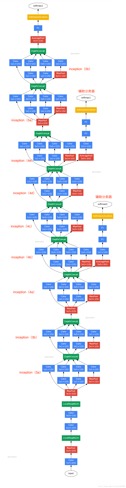

# V1结构

Inception V1中精心设计的Inception Module提高了参数的利用率；在先前的网络中，全连接层占据了网络的大部分参数，很容易产生过拟合现象；Inception V1去除了模型最后的全连接层，用全局平均池化层代替(将图片尺寸变为1x1)。


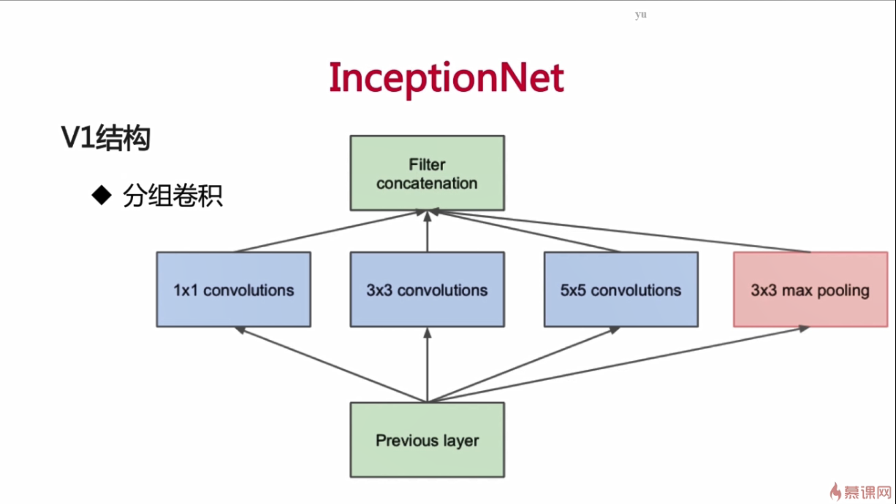


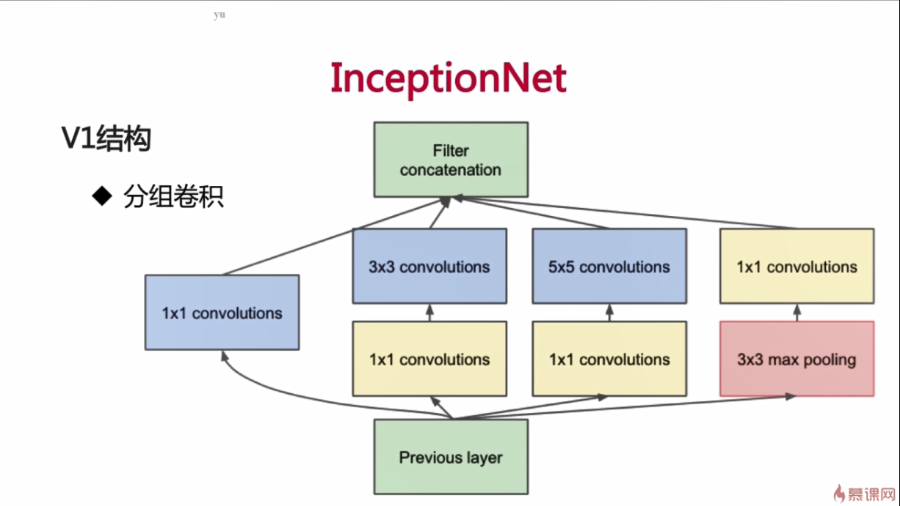


一个 inception 模块的四个并行线路如下：

1. 一个 1 x 1 的卷积，一个小的感受野进行卷积提取特征。
2. 一个 1 x 1 的卷积加上一个 3 x 3 的卷积，1 x 1 的卷积降低输入的特征通道，减少参数计算量，然后接一个 3 x 3 的卷积做一个较大感受野的卷积。
3. 一个 1 x 1 的卷积加上一个 5 x 5 的卷积，作用和第二个一样。
4. 一个 3 x 3 的最大池化加上 1 x 1 的卷积，最大池化改变输入的特征排列，1 x 1 的卷积进行特征提取。

inception结构的主要贡献有两个：
    一是使用1x1的卷积来进行升降维；
    二是在多个尺寸上同时进行卷积再聚合。

Inception优势

1. 一层上同时使用多种卷积核，看到各种层级的feature
2. 不同组时间的feature不交叉计算，减少计算量


## V1结构的卷积计算量

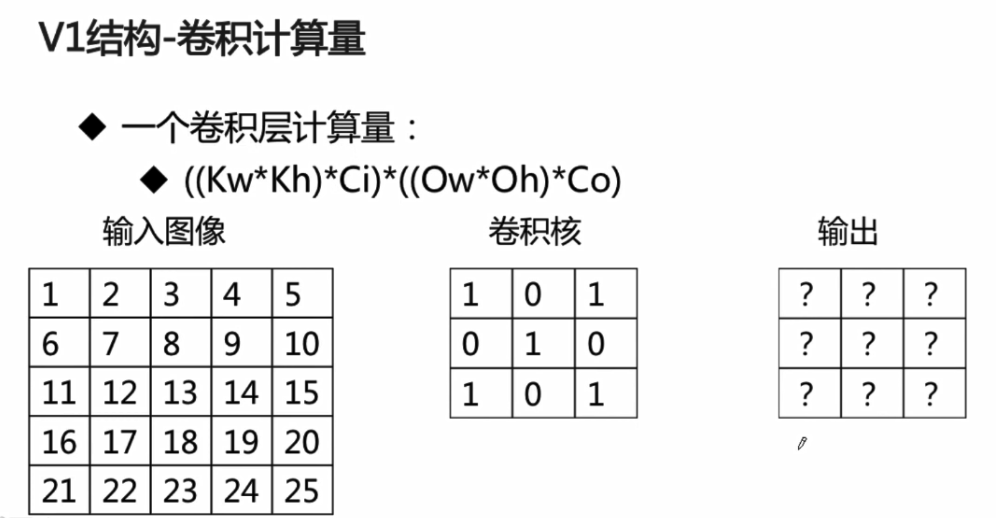

参数个数

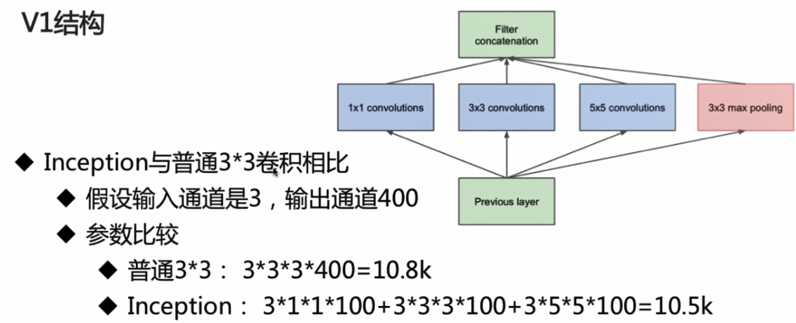

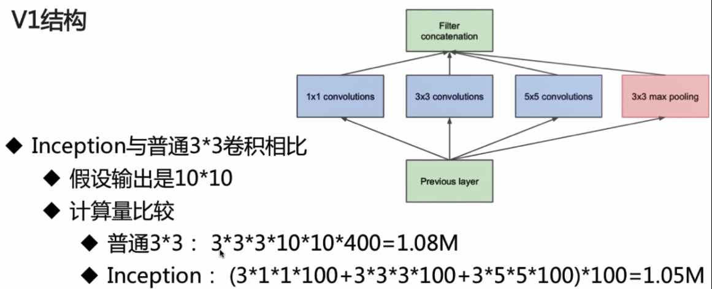

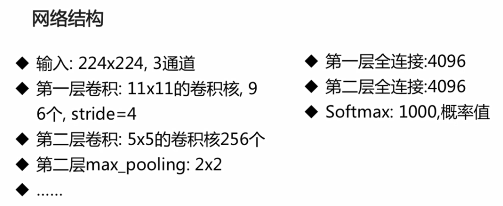

# V2结构

Inception V2学习了VGGNet，用两个3\*3的卷积代替5*5的大卷积核(降低参数量的同时减轻了过拟合)，同时还提出了注明的Batch Normalization(简称BN)方法。BN是一个非常有效的正则化方法，可以让大型卷积网络的训练速度加快很多倍，同时收敛后的分类准确率可以的到大幅度提高。

BN在用于神经网络某层时，会对每一个mini-batch数据的内部进行标准化处理，使输出规范化到(0,1)的正态分布，减少了Internal Covariate Shift(内部神经元分布的改变)。BN论文指出，传统的深度神经网络在训练时，每一层的输入的分布都在变化，导致训练变得困难，我们只能使用一个很小的学习速率解决这个问题。而对每一层使用BN之后，我们可以有效的解决这个问题，学习速率可以增大很多倍，达到之间的准确率需要的迭代次数有需要1/14，训练时间大大缩短，并且在达到之间准确率后，可以继续训练。以为BN某种意义上还起到了正则化的作用，所有可以减少或取消Dropout，简化网络结构。

在使用BN时，需要一些调整：
1. 增大学习率并加快学习衰减速度以适应BN规范化后的数据
2. 去除Dropout并减轻L2正则(BN已起到正则化的作用)
3. 去除LRN
4. 更彻底地对训练样本进行shuffle
5. 减少数据增强过程中对数据的光学畸变(BN训练更快，每个样本被训练的次数更少，因此真实的样本对训练更有帮助)


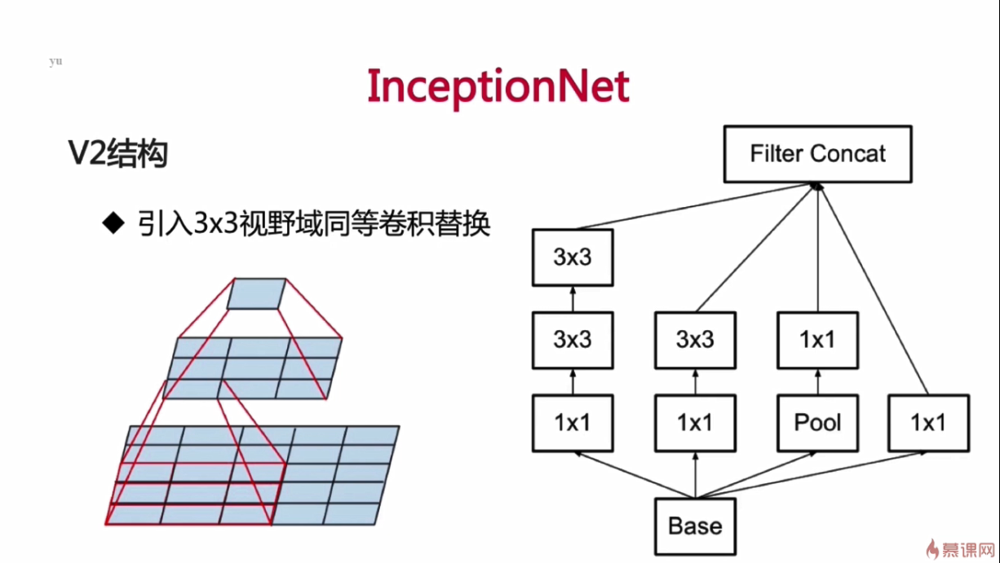

用两个3×3替换5×5

# V3结构

引入了Factorization into small convolutions的思想，将一个较大的二维卷积拆成两个较小的一位卷积，比如将7*7卷积拆成1*7卷积和7*1卷积（下图是3*3拆分为1*3和3*1的示意图）。 一方面节约了大量参数，加速运算并减去过拟合，同时增加了一层非线性扩展模型表达能力。论文中指出，这样非对称的卷积结构拆分，结果比对称地拆分为几个相同的小卷积核效果更明显，可以处理更多、更丰富的空间特征、增加特征多样性。
​另一方面，Inception V3优化了Inception Module的结构，现在Inception Module有35*35、17*17和8*8三种不同的结构，如下图。这些Inception Module只在网络的后部出现，前部还是普通的卷积层。并且还在Inception Module的分支中还使用了分支。

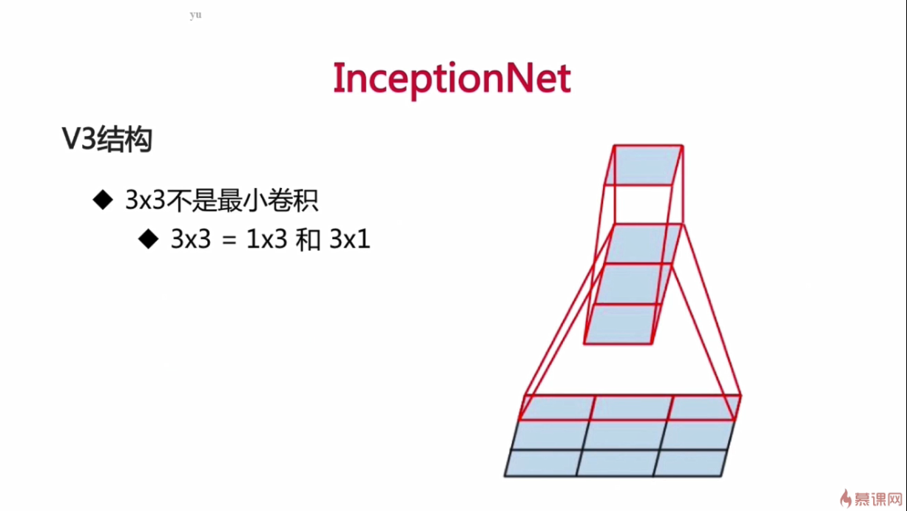

用一个1×3和一个3×1替换3×3

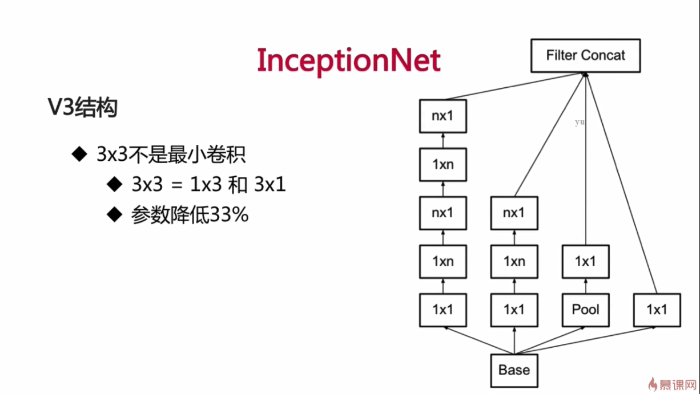

# V4结构

Inception V4相比V3主要是结合了微软的ResNet。

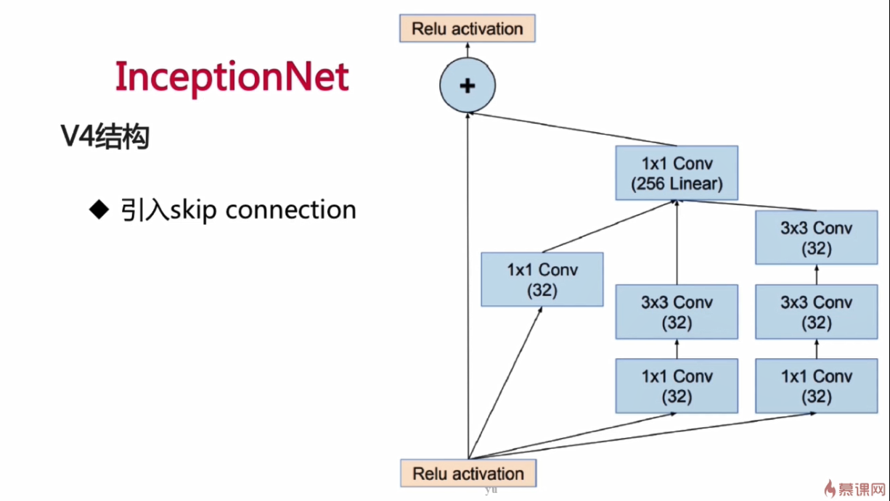

# GoogLeNet思想

- Motivation
		深度学习以及神经网络快速发展，人们不再只关注更给力的硬件、更大的数据集、更大的模型，而是更在意新的idea、新的算法以及模型的改进。

一般来说，提升网络性能最直接的方式就是增加网络的大小:

1. 增加网络的深度 

2. 增加网络的宽度 

这样简单的解决办法有两个主要的缺点: 

1. 网络参数的增多，网络容易陷入过拟合中，这需要大量的训练数据，而在解决高粒度分类的问题上，高质量的训练数据成本太高; 
2. 简单的增加网络的大小，会让网络计算量增大，而增大计算量得不到充分的利用，从而造成计算资源的浪费  一般来说，提升网络性能最直接的办法就是增加网络深度和宽度，这也就意味着巨量的参数。但是，巨量参数容易产生过拟合也会大大增加计算量。

文章认为解决上述两个缺点的根本方法是将全连接甚至一般的卷积都转化为稀疏连接。一方面现实生物神经系统的连接也是稀疏的，另一方面有文献表明：对于大规模稀疏的神经网络，可以通过分析激活值的统计特性和对高度相关的输出进行聚类来逐层构建出一个最优网络。这点表明臃肿的稀疏网络可能被不失性能地简化。 虽然数学证明有着严格的条件限制，但Hebbian准则有力地支持了这一点：fire together,wire together。

早些的时候，为了打破网络对称性和提高学习能力，传统的网络都使用了随机稀疏连接。但是，计算机软硬件对非均匀稀疏数据的计算效率很差，所以在AlexNet中又重新启用了全连接层，目的是为了更好地优化并行运算。所以，现在的问题是有没有一种方法，既能保持网络结构的稀疏性，又能利用密集矩阵的高计算性能。大量的文献表明可以将稀疏矩阵聚类为较为密集的子矩阵来提高计算性能，据此论文提出了名为Inception 的结构来实现此目的。

**主要思想**：
inception架构的主要思想是建立在找到可以逼近的卷积视觉网络内的最优局部稀疏结构，并可以通过易实现的模块实现这种结构。

将Hebbian原理应用在神经网络上，如果数据集的概率分布可以被一个很大很稀疏的神经网络表达，那么构筑这个网络的最佳方法是逐层构筑网络：将上一层高度相关的节点聚类，并将聚类出来的每一个小簇连接到一起。

1. 什么是Hebbian原理？ 

	神经反射活动的持续与重复会导致神经元连续稳定性持久提升，当两个神经元细胞A和B距离很近，并且A参与了对B重复、持续的兴奋，那么某些代谢会导致A将作为使B兴奋的细胞。总结一下:“一起发射的神经元会连在一起”,学习过程中的刺激会使神经元间突触强度增加。
2. 这里我们先讨论一下为什么需要稀疏的神经网络是什么概念? 
	人脑神经元的连接是稀疏的，研究者认为大型神经网络的合理的连接方式应该也是稀疏的，稀疏结构是非常适合神经网络的一种结构，尤其是对非常大型、非常深的神经网络，可以减轻过拟合并降低计算量，例如CNN就是稀疏连接。
3. 为什么CNN就是稀疏连接？ 

	在符合Hebbian原理的基础上，我们应该把相关性高的一簇神经元节点连接在一起。在普通的数据集中，这可能需要对神经元节点做聚类，但是在图片数据中，天然的就是临近区域的数据相关性高，因此相邻的像素点被卷积操作连接在一起（符合Hebbian原理），而卷积操作就是在做稀疏连接。
4. 怎样构建满足Hebbian原理的网络？ 
	在CNN模型中，我们可能有多个卷积核，在同一空间位置但在不同通道的卷积核的输出结果相关性极高。我们可以使用1*1的卷积很自然的把这些相关性很高的、在同一空间位置但是不同通道的特征连接在一起。


# 基于TensorFlow的V1结构代码实现
简版（慕课）


```python
import tensorflow as tf
import os
import pickle
import numpy as np

CIFAR_DIR = "G:\LV_PLAN\算法\Ai_river\datasets\cifar-10-batches-py"
print(os.listdir(CIFAR_DIR))
```

    c:\programdata\anaconda3\lib\site-packages\h5py\__init__.py:34: FutureWarning: Conversion of the second argument of issubdtype from `float` to `np.floating` is deprecated. In future, it will be treated as `np.float64 == np.dtype(float).type`.
      from ._conv import register_converters as _register_converters


    ['batches.meta', 'data_batch_1', 'data_batch_2', 'data_batch_3', 'data_batch_4', 'data_batch_5', 'readme.html', 'test_batch']


```python
def load_data(filename):
    """read data from data file."""
    with open(filename, 'rb') as f:
        data = pickle.load(f, encoding='bytes')
        return data[b'data'], data[b'labels']


# tensorflow.Dataset.
class CifarData:
    def __init__(self, filenames, need_shuffle):
        all_data = []
        all_labels = []
        for filename in filenames:
            data, labels = load_data(filename)
            all_data.append(data)
            all_labels.append(labels)
        self._data = np.vstack(all_data)
        self._data = self._data / 127.5 - 1
        self._labels = np.hstack(all_labels)
        print(self._data.shape)
        print(self._labels.shape)

        self._num_examples = self._data.shape[0]
        self._need_shuffle = need_shuffle
        self._indicator = 0
        if self._need_shuffle:
            self._shuffle_data()

    def _shuffle_data(self):
        # [0,1,2,3,4,5] -> [5,3,2,4,0,1]
        p = np.random.permutation(self._num_examples)
        self._data = self._data[p]
        self._labels = self._labels[p]

    def next_batch(self, batch_size):
        """return batch_size examples as a batch."""
        end_indicator = self._indicator + batch_size
        if end_indicator > self._num_examples:
            if self._need_shuffle:
                self._shuffle_data()
                self._indicator = 0
                end_indicator = batch_size
            else:
                raise Exception("have no more examples")
        if end_indicator > self._num_examples:
            raise Exception("batch size is larger than all examples")
        batch_data = self._data[self._indicator:end_indicator]
        batch_labels = self._labels[self._indicator:end_indicator]
        self._indicator = end_indicator
        return batch_data, batch_labels


train_filenames = [
    os.path.join(CIFAR_DIR, 'data_batch_%d' % i) for i in range(1, 6)
]
test_filenames = [os.path.join(CIFAR_DIR, 'test_batch')]

train_data = CifarData(train_filenames, True)
test_data = CifarData(test_filenames, False)
```

    (50000, 3072)
    (50000,)
    (10000, 3072)
    (10000,)


```python
def inception_block(x, output_channel_for_each_path, name):
    """inception block implementation"""
    """
    Args:
    - x:
    - output_channel_for_each_path: eg: [10, 20, 5]
    - name:
    """
    with tf.variable_scope(name):
        conv1_1 = tf.layers.conv2d(
            x,
            output_channel_for_each_path[0], (1, 1),
            strides=(1, 1),
            padding='same',
            activation=tf.nn.relu,
            name='conv1_1')
        conv3_3 = tf.layers.conv2d(
            x,
            output_channel_for_each_path[1], (3, 3),
            strides=(1, 1),
            padding='same',
            activation=tf.nn.relu,
            name='conv3_3')
        conv5_5 = tf.layers.conv2d(
            x,
            output_channel_for_each_path[2], (5, 5),
            strides=(1, 1),
            padding='same',
            activation=tf.nn.relu,
            name='conv5_5')
        max_pooling = tf.layers.max_pooling2d(
            x, (2, 2), (2, 2), name='max_pooling')

    max_pooling_shape = max_pooling.get_shape().as_list()[1:]
    input_shape = x.get_shape().as_list()[1:]
    width_padding = (input_shape[0] - max_pooling_shape[0]) // 2
    height_padding = (input_shape[1] - max_pooling_shape[1]) // 2
    padded_pooling = tf.pad(max_pooling,
                            [[0, 0], [width_padding, width_padding],
                             [height_padding, height_padding], [0, 0]])
    concat_layer = tf.concat([conv1_1, conv3_3, conv5_5, padded_pooling],
                             axis=3)
    return concat_layer
```


```python
x = tf.placeholder(tf.float32, [None, 3072])
y = tf.placeholder(tf.int64, [None])
# [None], eg: [0,5,6,3]
x_image = tf.reshape(x, [-1, 3, 32, 32])
# 32*32
x_image = tf.transpose(x_image, perm=[0, 2, 3, 1])

# conv1: 神经元图， feature_map, 输出图像
conv1 = tf.layers.conv2d(
    x_image,
    32,  # output channel number
    (3, 3),  # kernel size
    padding='same',
    activation=tf.nn.relu,
    name='conv1')

pooling1 = tf.layers.max_pooling2d(
    conv1,
    (2, 2),  # kernel size
    (2, 2),  # stride
    name='pool1')

inception_2a = inception_block(pooling1, [16, 16, 16], name='inception_2a')
inception_2b = inception_block(inception_2a, [16, 16, 16], name='inception_2b')

pooling2 = tf.layers.max_pooling2d(
    inception_2b,
    (2, 2),  # kernel size
    (2, 2),  # stride
    name='pool2')

inception_3a = inception_block(pooling2, [16, 16, 16], name='inception_3a')
inception_3b = inception_block(inception_3a, [16, 16, 16], name='inception_3b')

pooling3 = tf.layers.max_pooling2d(
    inception_3b,
    (2, 2),  # kernel size
    (2, 2),  # stride
    name='pool3')

flatten = tf.layers.flatten(pooling3)
y_ = tf.layers.dense(flatten, 10)

loss = tf.losses.sparse_softmax_cross_entropy(labels=y, logits=y_)
# y_ -> sofmax
# y -> one_hot
# loss = ylogy_

# indices
predict = tf.argmax(y_, 1)
# [1,0,1,1,1,0,0,0]
correct_prediction = tf.equal(predict, y)
accuracy = tf.reduce_mean(tf.cast(correct_prediction, tf.float64))

with tf.name_scope('train_op'):
    train_op = tf.train.AdamOptimizer(1e-3).minimize(loss)
```


```python
init = tf.global_variables_initializer()
batch_size = 20
train_steps = 100
test_steps = 100

# train 10k: 74.65%
with tf.Session() as sess:
    sess.run(init)
    for i in range(train_steps):
        batch_data, batch_labels = train_data.next_batch(batch_size)
        loss_val, acc_val, _ = sess.run([loss, accuracy, train_op],
                                        feed_dict={
                                            x: batch_data,
                                            y: batch_labels
                                        })

        if (i + 1) % 10 == 0:
            print('[Train] Step: %d, loss: %4.5f, acc: %4.5f' %
                  (i + 1, loss_val, acc_val))

        if (i + 1) % 10 == 0:
            test_data = CifarData(test_filenames, False)
            all_test_acc_val = []
            for j in range(test_steps):
                test_batch_data, test_batch_labels \
                    = test_data.next_batch(batch_size)
                test_acc_val = sess.run([accuracy],
                                        feed_dict={
                                            x: test_batch_data,
                                            y: test_batch_labels
                                        })
                all_test_acc_val.append(test_acc_val)
            test_acc = np.mean(all_test_acc_val)
            print('[Test ] Step: %d, acc: %4.5f' % (i + 1, test_acc))
```

    [Train] Step: 10, loss: 2.32610, acc: 0.10000
    (10000, 3072)
    (10000,)
    [Test ] Step: 10, acc: 0.15200
    [Train] Step: 20, loss: 2.20990, acc: 0.15000
    (10000, 3072)
    (10000,)
    [Test ] Step: 20, acc: 0.19900
    [Train] Step: 30, loss: 1.96171, acc: 0.25000
    (10000, 3072)
    (10000,)
    [Test ] Step: 30, acc: 0.17000
    [Train] Step: 40, loss: 1.97452, acc: 0.25000
    (10000, 3072)
    (10000,)
    [Test ] Step: 40, acc: 0.24600
    [Train] Step: 50, loss: 2.43022, acc: 0.25000
    (10000, 3072)
    (10000,)
    [Test ] Step: 50, acc: 0.25900
    [Train] Step: 60, loss: 2.46918, acc: 0.20000
    (10000, 3072)
    (10000,)
    [Test ] Step: 60, acc: 0.25350
    [Train] Step: 70, loss: 2.09894, acc: 0.35000
    (10000, 3072)
    (10000,)
    [Test ] Step: 70, acc: 0.27250
    [Train] Step: 80, loss: 1.97636, acc: 0.30000
    (10000, 3072)
    (10000,)
    [Test ] Step: 80, acc: 0.28900
    [Train] Step: 90, loss: 1.96815, acc: 0.20000
    (10000, 3072)
    (10000,)
    [Test ] Step: 90, acc: 0.33800
    [Train] Step: 100, loss: 1.92083, acc: 0.35000
    (10000, 3072)
    (10000,)
    [Test ] Step: 100, acc: 0.33450


# 基于TensorFlow的V3结构代码实现


```python
# -*- coding:utf-8 -*-

import tensorflow as tf
from datetime import datetime
import time
import math

slim = tf.contrib.slim
#产生截断的正态分布
trunc_normal = lambda stddev: tf.truncated_normal_initializer(0.0, stddev)
parameters = []  #储存参数
```


```python
#why？为什么要定义这个函数？
#因为若事先定义好slim.conv2d各种默认参数，包括激活函数、标准化器，后面定义卷积层将会非常容易：
# 1.代码整体美观
# 2.网络设计的工作量会大大减轻


def inception_v3_arg_scope(weight_decay=0.00004,
                           stddev=0.1,
                           batch_norm_var_collection='moving_vars'):
    """
    #定义inception_v3_arg_scope(),
    #用来生成网络中经常用到的函数的默认参数（卷积的激活函数、权重初始化方式、标准化器等）
    :param weight_decay: 权值衰减系数
    :param stddev: 标准差
    :param batch_norm_var_collection:
    :return:
    """
    batch_norm_params = {
        'decay': 0.9997,  #衰减系数decay
        'epsilon': 0.001,  #极小值
        'updates_collections': tf.GraphKeys.UPDATE_OPS,
        'variables_collections': {
            'beta': None,
            'gamma': None,
            'moving_mean': [batch_norm_var_collection],
            'moving_variance': [batch_norm_var_collection],
        }
    }

    with slim.arg_scope([slim.conv2d, slim.fully_connected],
                        weights_regularizer=slim.l2_regularizer(weight_decay)):
        """
        slim.arg_scope()是一个非常有用的工具，可以给函数的参数自动赋予某些默认值
        
        例如：
        slim.arg_scope([slim.conv2d,slim.fully_connected],weights_regularizer=slim.l2_regularizer(weight_decay)):
        会对[slim.conv2d,slim.fully_connected]这两个函数的参数自动赋值，
        将参数weights_regularizer的默认值设为slim.l2_regularizer(weight_decay)
        
        备注：使用了slim.arg_scope后就不需要每次重复设置参数，只需在修改时设置即可。
        """
        # 设置默认值：对slim.conv2d函数的几个参数赋予默认值
        with slim.arg_scope(
            [slim.conv2d],
                weights_initializer=tf.truncated_normal_initializer(
                    stddev=stddev),  #权重初始化
                activation_fn=tf.nn.relu,  #激励函数
                normalizer_fn=slim.batch_norm,  #标准化器
                normalizer_params=batch_norm_params
        ) as sc:  #normalizer_params标准化器的参数

            return sc  #返回定义好的scope
```


```python
def inception_V3_base(input, scope=None):

    end_points = {}
    # 第一部分--基础部分：卷积和池化交错
    with tf.variable_scope(scope, 'inception_V3', [input]):
        with slim.arg_scope([slim.conv2d, slim.max_pool2d, slim.avg_pool2d],
                            stride=1,
                            padding='VALID'):
            net1 = slim.conv2d(
                input, 32, [3, 3], stride=2, scope='conv2d_1a_3x3')
            net2 = slim.conv2d(net1, 32, [3, 3], scope='conv2d_2a_3x3')
            net3 = slim.conv2d(
                net2, 64, [3, 3], padding='SAME', scope='conv2d_2b_3x3')
            net4 = slim.max_pool2d(
                net3, [3, 3], stride=2, scope='maxPool_3a_3x3')
            net5 = slim.conv2d(net4, 80, [1, 1], scope='conv2d_4a_3x3')
            net6 = slim.conv2d(
                net5, 192, [3, 3], padding='SAME', scope='conv2d_4b_3x3')
            net = slim.max_pool2d(
                net6, [3, 3], stride=2, scope='maxPool_5a_3x3')

    #第二部分--Inception模块组：inception_1\inception_2\inception_2
    with slim.arg_scope([slim.conv2d, slim.max_pool2d, slim.avg_pool2d],
                        stride=1,
                        padding='SAME'):
        #inception_1：第一个模块组（共含3个inception_module）
        #inception_1_m1: 第一组的1号module
        with tf.variable_scope('inception_1_m1'):
            with tf.variable_scope('Branch_0'):
                branch_0 = slim.conv2d(net, 64, [1, 1], scope='conv2d_0a_1x1')
            with tf.variable_scope('Branch_1'):
                branch1_1 = slim.conv2d(net, 48, [1, 1], scope='conv2d_1a_1x1')
                branch1_2 = slim.conv2d(
                    branch1_1, 64, [5, 5], scope='conv2d_1b_5x5')
            with tf.variable_scope('Branch_2'):
                branch2_1 = slim.conv2d(net, 64, [1, 1], scope='conv2d_2a_1x1')
                branch2_2 = slim.conv2d(
                    branch2_1, 96, [3, 3], scope='conv2d_2b_3x3')
                branch2_3 = slim.conv2d(
                    branch2_2, 96, [3, 3], scope='conv2d_2c_3x3')
            with tf.variable_scope('Branch_3'):
                branch3_1 = slim.avg_pool2d(
                    net, [3, 3], scope='avgPool_3a_3x3')
                branch3_2 = slim.conv2d(
                    branch3_1, 32, [1, 1], scope='conv2d_3b_1x1')
            #使用concat将4个分支的输出合并到一起（在第三个维度合并，即输出通道上合并）
            net = tf.concat([branch_0, branch1_2, branch2_3, branch3_2], 3)

        # inception_1_m2: 第一组的 2号module
        with tf.variable_scope('inception_1_m2'):
            with tf.variable_scope('Branch_0'):
                branch_0 = slim.conv2d(net, 64, [1, 1], scope='conv2d_0a_1x1')
            with tf.variable_scope('Branch_1'):
                branch1_1 = slim.conv2d(net, 48, [1, 1], scope='conv2d_1a_1x1')
                branch1_2 = slim.conv2d(
                    branch1_1, 64, [5, 5], scope='conv2d_1b_5x5')
            with tf.variable_scope('Branch_2'):
                branch2_1 = slim.conv2d(net, 64, [1, 1], scope='conv2d_2a_1x1')
                branch2_2 = slim.conv2d(
                    branch2_1, 96, [3, 3], scope='conv2d_2b_3x3')
                branch2_3 = slim.conv2d(
                    branch2_2, 96, [3, 3], scope='conv2d_2c_3x3')
            with tf.variable_scope('Branch_3'):
                branch3_1 = slim.avg_pool2d(
                    net, [3, 3], scope='avgPool_3a_3x3')
                branch3_2 = slim.conv2d(
                    branch3_1, 64, [1, 1], scope='conv2d_3b_1x1')
            # 使用concat将4个分支的输出合并到一起（在第三个维度合并，即输出通道上合并）
            net = tf.concat([branch_0, branch1_2, branch2_3, branch3_2], 3)

        # inception_1_m2: 第一组的 3号module
        with tf.variable_scope('inception_1_m3'):
            with tf.variable_scope('Branch_0'):
                branch_0 = slim.conv2d(net, 64, [1, 1], scope='conv2d_0a_1x1')
            with tf.variable_scope('Branch_1'):
                branch1_1 = slim.conv2d(net, 48, [1, 1], scope='conv2d_1a_1x1')
                branch1_2 = slim.conv2d(
                    branch1_1, 64, [5, 5], scope='conv2d_1b_5x5')
            with tf.variable_scope('Branch_2'):
                branch2_1 = slim.conv2d(net, 64, [1, 1], scope='conv2d_2a_1x1')
                branch2_2 = slim.conv2d(
                    branch2_1, 96, [3, 3], scope='conv2d_2b_3x3')
                branch2_3 = slim.conv2d(
                    branch2_2, 96, [3, 3], scope='conv2d_2c_3x3')
            with tf.variable_scope('Branch_3'):
                branch3_1 = slim.avg_pool2d(
                    net, [3, 3], scope='avgPool_3a_3x3')
                branch3_2 = slim.conv2d(
                    branch3_1, 64, [1, 1], scope='conv2d_3b_1x1')
            # 使用concat将4个分支的输出合并到一起（在第三个维度合并，即输出通道上合并）
            net = tf.concat([branch_0, branch1_2, branch2_3, branch3_2], 3)

#inception_2：第2个模块组（共含5个inception_module）
# inception_2_m1: 第2组的 1号module
        with tf.variable_scope('inception_2_m1'):
            with tf.variable_scope('Branch_0'):
                branch_0 = slim.conv2d(
                    net,
                    384, [3, 3],
                    stride=2,
                    padding='VALID',
                    scope='conv2d_0a_3x3')
            with tf.variable_scope('Branch_1'):
                branch1_1 = slim.conv2d(net, 64, [1, 1], scope='conv2d_1a_1x1')
                branch1_2 = slim.conv2d(
                    branch1_1, 96, [3, 3], scope='conv2d_1b_3x3')
                branch1_3 = slim.conv2d(
                    branch1_2,
                    96, [3, 3],
                    stride=2,
                    padding='VALID',
                    scope='conv2d_1c_3x3')
            with tf.variable_scope('Branch_2'):
                branch2_1 = slim.max_pool2d(
                    net, [3, 3],
                    stride=2,
                    padding='VALID',
                    scope='maxPool_2a_3x3')

            # 使用concat将4个分支的输出合并到一起（在第三个维度合并，即输出通道上合并）
            net = tf.concat([branch_0, branch1_3, branch2_1], 3)

        # inception_2_m2: 第2组的 2号module
        with tf.variable_scope('inception_2_m2'):
            with tf.variable_scope('Branch_0'):
                branch_0 = slim.conv2d(net, 192, [1, 1], scope='conv2d_0a_1x1')
            with tf.variable_scope('Branch_1'):
                branch1_1 = slim.conv2d(
                    net, 128, [1, 1], scope='conv2d_1a_1x1')
                branch1_2 = slim.conv2d(
                    branch1_1, 128, [1, 7], scope='conv2d_1b_1x7')
                branch1_3 = slim.conv2d(
                    branch1_2, 128, [7, 1], scope='conv2d_1c_7x1')
            with tf.variable_scope('Branch_2'):
                branch2_1 = slim.conv2d(
                    net, 128, [1, 1], scope='conv2d_2a_1x1')
                branch2_2 = slim.conv2d(
                    branch2_1, 128, [7, 1], scope='conv2d_2b_7x1')
                branch2_3 = slim.conv2d(
                    branch2_2, 128, [1, 7], scope='conv2d_2c_1x7')
                branch2_4 = slim.conv2d(
                    branch2_3, 128, [7, 1], scope='conv2d_2d_7x1')
                branch2_5 = slim.conv2d(
                    branch2_4, 128, [1, 7], scope='conv2d_2e_1x7')
            with tf.variable_scope('Branch_3'):
                branch3_1 = slim.avg_pool2d(
                    net, [3, 3], scope='avgPool_3a_3x3')
                branch3_2 = slim.conv2d(
                    branch3_1, 192, [1, 1], scope='conv2d_3b_1x1')

            # 使用concat将4个分支的输出合并到一起（在第三个维度合并，即输出通道上合并）
            net = tf.concat([branch_0, branch1_3, branch2_5, branch3_2], 3)

# inception_2_m3: 第2组的 3号module
        with tf.variable_scope('inception_2_m3'):
            with tf.variable_scope('Branch_0'):
                branch_0 = slim.conv2d(net, 192, [1, 1], scope='conv2d_0a_1x1')
            with tf.variable_scope('Branch_1'):
                branch1_1 = slim.conv2d(
                    net, 160, [1, 1], scope='conv2d_1a_1x1')
                branch1_2 = slim.conv2d(
                    branch1_1, 160, [1, 7], scope='conv2d_1b_1x7')
                branch1_3 = slim.conv2d(
                    branch1_2, 192, [7, 1], scope='conv2d_1c_7x1')
            with tf.variable_scope('Branch_2'):
                branch2_1 = slim.conv2d(
                    net, 160, [1, 1], scope='conv2d_2a_1x1')
                branch2_2 = slim.conv2d(
                    branch2_1, 160, [7, 1], scope='conv2d_2b_7x1')
                branch2_3 = slim.conv2d(
                    branch2_2, 160, [1, 7], scope='conv2d_2c_1x7')
                branch2_4 = slim.conv2d(
                    branch2_3, 160, [7, 1], scope='conv2d_2d_7x1')
                branch2_5 = slim.conv2d(
                    branch2_4, 192, [1, 7], scope='conv2d_2e_1x7')
            with tf.variable_scope('Branch_3'):
                branch3_1 = slim.avg_pool2d(
                    net, [3, 3], scope='avgPool_3a_3x3')
                branch3_2 = slim.conv2d(
                    branch3_1, 192, [1, 1], scope='conv2d_3b_1x1')

            # 使用concat将4个分支的输出合并到一起（在第三个维度合并，即输出通道上合并）
            net = tf.concat([branch_0, branch1_3, branch2_5, branch3_2], 3)

# inception_2_m4: 第2组的 4号module
        with tf.variable_scope('inception_2_m4'):
            with tf.variable_scope('Branch_0'):
                branch_0 = slim.conv2d(net, 192, [1, 1], scope='conv2d_0a_1x1')
            with tf.variable_scope('Branch_1'):
                branch1_1 = slim.conv2d(
                    net, 160, [1, 1], scope='conv2d_1a_1x1')
                branch1_2 = slim.conv2d(
                    branch1_1, 160, [1, 7], scope='conv2d_1b_1x7')
                branch1_3 = slim.conv2d(
                    branch1_2, 192, [7, 1], scope='conv2d_1c_7x1')
            with tf.variable_scope('Branch_2'):
                branch2_1 = slim.conv2d(
                    net, 160, [1, 1], scope='conv2d_2a_1x1')
                branch2_2 = slim.conv2d(
                    branch2_1, 160, [7, 1], scope='conv2d_2b_7x1')
                branch2_3 = slim.conv2d(
                    branch2_2, 160, [1, 7], scope='conv2d_2c_1x7')
                branch2_4 = slim.conv2d(
                    branch2_3, 160, [7, 1], scope='conv2d_2d_7x1')
                branch2_5 = slim.conv2d(
                    branch2_4, 192, [1, 7], scope='conv2d_2e_1x7')
            with tf.variable_scope('Branch_3'):
                branch3_1 = slim.avg_pool2d(
                    net, [3, 3], scope='avgPool_3a_3x3')
                branch3_2 = slim.conv2d(
                    branch3_1, 192, [1, 1], scope='conv2d_3b_1x1')

            # 使用concat将4个分支的输出合并到一起（在第三个维度合并，即输出通道上合并）
            net = tf.concat([branch_0, branch1_3, branch2_5, branch3_2], 3)

# inception_2_m5: 第2组的 5号module
        with tf.variable_scope('inception_2_m5'):
            with tf.variable_scope('Branch_0'):
                branch_0 = slim.conv2d(net, 192, [1, 1], scope='conv2d_0a_1x1')
            with tf.variable_scope('Branch_1'):
                branch1_1 = slim.conv2d(
                    net, 160, [1, 1], scope='conv2d_1a_1x1')
                branch1_2 = slim.conv2d(
                    branch1_1, 160, [1, 7], scope='conv2d_1b_1x7')
                branch1_3 = slim.conv2d(
                    branch1_2, 192, [7, 1], scope='conv2d_1c_7x1')
            with tf.variable_scope('Branch_2'):
                branch2_1 = slim.conv2d(
                    net, 160, [1, 1], scope='conv2d_2a_1x1')
                branch2_2 = slim.conv2d(
                    branch2_1, 160, [7, 1], scope='conv2d_2b_7x1')
                branch2_3 = slim.conv2d(
                    branch2_2, 160, [1, 7], scope='conv2d_2c_1x7')
                branch2_4 = slim.conv2d(
                    branch2_3, 160, [7, 1], scope='conv2d_2d_7x1')
                branch2_5 = slim.conv2d(
                    branch2_4, 192, [1, 7], scope='conv2d_2e_1x7')
            with tf.variable_scope('Branch_3'):
                branch3_1 = slim.avg_pool2d(
                    net, [3, 3], scope='avgPool_3a_3x3')
                branch3_2 = slim.conv2d(
                    branch3_1, 192, [1, 1], scope='conv2d_3b_1x1')

            # 使用concat将4个分支的输出合并到一起（在第三个维度合并，即输出通道上合并）
            net = tf.concat([branch_0, branch1_3, branch2_5, branch3_2], 3)
        #将inception_2_m5存储到end_points中，作为Auxiliary Classifier辅助模型的分类
        end_points['inception_2_m5'] = net

        # 第3组
        # inception_3_m1: 第3组的 1号module
        with tf.variable_scope('inception_3_m1'):
            with tf.variable_scope('Branch_0'):
                branch_0 = slim.conv2d(net, 192, [1, 1], scope='conv2d_0a_1x1')
                branch_0 = slim.conv2d(
                    branch_0,
                    320, [3, 3],
                    stride=2,
                    padding='VALID',
                    scope='conv2d_0b_3x3')
            with tf.variable_scope('Branch_1'):
                branch1_1 = slim.conv2d(
                    net, 192, [1, 1], scope='conv2d_1a_1x1')
                branch1_2 = slim.conv2d(
                    branch1_1, 192, [1, 7], scope='conv2d_1b_1x7')
                branch1_3 = slim.conv2d(
                    branch1_2, 192, [7, 1], scope='conv2d_1c_7x1')
                branch1_4 = slim.conv2d(
                    branch1_3,
                    192, [3, 3],
                    stride=2,
                    padding='VALID',
                    scope='conv2d_1c_3x3')
            with tf.variable_scope('Branch_2'):
                branch2_1 = slim.max_pool2d(
                    net, [3, 3],
                    stride=2,
                    padding='VALID',
                    scope='maxPool_3a_3x3')

            # 使用concat将4个分支的输出合并到一起（在第三个维度合并，即输出通道上合并）
            net = tf.concat([branch_0, branch1_4, branch2_1], 3)

# inception_3_m2: 第3组的 2号module
        with tf.variable_scope('inception_3_m2'):
            with tf.variable_scope('Branch_0'):
                branch_0 = slim.conv2d(net, 320, [1, 1], scope='conv2d_0a_1x1')
            with tf.variable_scope('Branch_1'):
                branch1_1 = slim.conv2d(
                    net, 384, [1, 1], scope='conv2d_1a_1x1')
                #特殊
                branch1_2 = tf.concat([
                    slim.conv2d(branch1_1, 384, [1, 3], scope='conv2d_1a_1x3'),
                    slim.conv2d(branch1_1, 384, [3, 1], scope='conv2d_1a_3x1')
                ], 3)
            with tf.variable_scope('Branch_2'):
                branch2_1 = slim.conv2d(
                    net, 488, [1, 1], scope='conv2d_2a_1x1')
                branch2_2 = slim.conv2d(
                    branch2_1, 384, [3, 3], scope='conv2d_2b_3x3')
                branch2_3 = tf.concat([
                    slim.conv2d(branch2_2, 384, [1, 3], scope='conv2d_1a_1x3'),
                    slim.conv2d(branch2_2, 384, [3, 1], scope='conv2d_1a_3x1')
                ], 3)
            with tf.variable_scope('Branch_3'):
                branch3_1 = slim.avg_pool2d(
                    net, [3, 3], scope='avgPool_3a_3x3')
                branch3_2 = slim.conv2d(
                    branch3_1, 192, [1, 1], scope='conv2d_3b_1x1')

            # 使用concat将4个分支的输出合并到一起（在第三个维度合并，即输出通道上合并）
            net = tf.concat([branch_0, branch1_2, branch2_3, branch3_2], 3)


# inception_3_m3: 第3组的 3号module
        with tf.variable_scope('inception_3_m3'):
            with tf.variable_scope('Branch_0'):
                branch_0 = slim.conv2d(net, 320, [1, 1], scope='conv2d_0a_1x1')
            with tf.variable_scope('Branch_1'):
                branch1_1 = slim.conv2d(
                    net, 384, [1, 1], scope='conv2d_1a_1x1')
                #特殊
                branch1_2 = tf.concat([
                    slim.conv2d(branch1_1, 384, [1, 3], scope='conv2d_1a_1x3'),
                    slim.conv2d(branch1_1, 384, [3, 1], scope='conv2d_1a_3x1')
                ], 3)
            with tf.variable_scope('Branch_2'):
                branch2_1 = slim.conv2d(
                    net, 488, [1, 1], scope='conv2d_2a_1x1')
                branch2_2 = slim.conv2d(
                    branch2_1, 384, [3, 3], scope='conv2d_2b_3x3')
                branch2_3 = tf.concat([
                    slim.conv2d(branch2_2, 384, [1, 3], scope='conv2d_1a_1x3'),
                    slim.conv2d(branch2_2, 384, [3, 1], scope='conv2d_1a_3x1')
                ], 3)
            with tf.variable_scope('Branch_3'):
                branch3_1 = slim.avg_pool2d(
                    net, [3, 3], scope='avgPool_3a_3x3')
                branch3_2 = slim.conv2d(
                    branch3_1, 192, [1, 1], scope='conv2d_3b_1x1')

            # 使用concat将4个分支的输出合并到一起（在第三个维度合并，即输出通道上合并）
            net = tf.concat([branch_0, branch1_2, branch2_3, branch3_2], 3)

        return net, end_points
```


```python
##############################  卷积部分完成  ########################################
#第三部分：全局平均池化、softmax、Auxiliary Logits
def inception_v3(input,
                 num_classes=1000,
                 is_training=True,
                 dropout_keep_prob=0.8,
                 prediction_fn=slim.softmax,
                 spatial_squeeze=True,
                 reuse=None,
                 scope='inceptionV3'):
    with tf.variable_scope(
            scope, 'inceptionV3', [input, num_classes], reuse=reuse) as scope:
        with slim.arg_scope([slim.batch_norm, slim.dropout],
                            is_training=is_training):
            net, end_points = inception_V3_base(input, scope=scope)

            #Auxiliary  Logits
            with slim.arg_scope(
                [slim.conv2d, slim.max_pool2d, slim.avg_pool2d],
                    stride=1,
                    padding='SAME'):
                aux_logits = end_points['inception_2_m5']
                with tf.variable_scope('Auxiliary_Logits'):
                    aux_logits = slim.avg_pool2d(
                        aux_logits, [5, 5],
                        stride=3,
                        padding='VALID',
                        scope='AvgPool_1a_5x5')
                    aux_logits = slim.conv2d(
                        aux_logits, 128, [1, 1], scope='conv2d_1b_1x1')
                    aux_logits = slim.conv2d(
                        aux_logits,
                        768, [5, 5],
                        weights_initializer=trunc_normal(0.01),
                        padding='VALID',
                        scope='conv2d_2a_5x5')
                    aux_logits = slim.conv2d(
                        aux_logits,
                        num_classes, [1, 1],
                        activation_fn=None,
                        normalizer_fn=None,
                        weights_initializer=trunc_normal(0.001),
                        scope='conv2d_2b_1x1')
                    if spatial_squeeze:
                        aux_logits = tf.squeeze(
                            aux_logits, [1, 2], name='SpatialSqueeze')
                    end_points['Auxiliary_Logits'] = aux_logits

            with tf.variable_scope('Logits'):
                net = slim.avg_pool2d(
                    net, [8, 8], padding='VALID', scope='avgPool_1a_8x8')
                net = slim.dropout(
                    net, keep_prob=dropout_keep_prob, scope='dropout_1b')
                end_points['PreLogits'] = net
                logits = slim.conv2d(
                    net,
                    num_classes, [1, 1],
                    activation_fn=None,
                    normalizer_fn=None,
                    scope='conv2d_1c_1x1')
                if spatial_squeeze:
                    logits = tf.squeeze(logits, [1, 2], name='SpatialSqueeze')
            end_points['Logits'] = logits
            end_points['Predictions'] = prediction_fn(
                logits, scope='Predictions')

    return logits, end_points
```


```python
def time_compute(session, target, info_string):
    num_batch = 100  #100
    num_step_burn_in = 10  # 预热轮数，头几轮迭代有显存加载、cache命中等问题可以因此跳过
    total_duration = 0.0  # 总时间
    total_duration_squared = 0.0
    for i in range(num_batch + num_step_burn_in):
        start_time = time.time()
        _ = session.run(target)
        duration = time.time() - start_time
        if i >= num_step_burn_in:
            if i % 10 == 0:  # 每迭代10次显示一次duration
                print("%s: step %d,duration=%.5f " %
                      (datetime.now(), i - num_step_burn_in, duration))
            total_duration += duration
            total_duration_squared += duration * duration
    time_mean = total_duration / num_batch
    time_variance = total_duration_squared / num_batch - time_mean * time_mean
    time_stddev = math.sqrt(time_variance)
    # 迭代完成，输出
    print("%s: %s across %d steps,%.3f +/- %.3f sec per batch " %
          (datetime.now(), info_string, num_batch, time_mean, time_stddev))
```


```python
def main():
    with tf.Graph().as_default():
        batch_size = 32
        height, weight = 299, 299
        input = tf.random_uniform((batch_size, height, weight, 3))
        with slim.arg_scope(inception_v3_arg_scope()):
            logits, end_points = inception_v3(input, is_training=False)

        init = tf.global_variables_initializer()
        sess = tf.Session()
        # 将网络结构图写到文件中
        writer = tf.summary.FileWriter('logs/', sess.graph)
        sess.run(init)
        num_batches = 100
        time_compute(sess, logits, 'Forward')


if __name__ == '__main__':
    main()
```

# Pytorch实现


```python
import sys
sys.path.append('..')

import numpy as np
import torch
from torch import nn
from torch.autograd import Variable
from torchvision.datasets import CIFAR10
```


```python
# 定义一个卷积加一个 relu 激活函数和一个 batchnorm 作为一个基本的层结构
def conv_relu(in_channel, out_channel, kernel, stride=1, padding=0):
    layer = nn.Sequential(
        nn.Conv2d(in_channel, out_channel, kernel, stride, padding),
        nn.BatchNorm2d(out_channel, eps=1e-3), nn.ReLU(True))
    return layer
```


```python
class inception(nn.Module):
    def __init__(self, in_channel, out1_1, out2_1, out2_3, out3_1, out3_5,
                 out4_1):
        super(inception, self).__init__()
        # 第一条线路
        self.branch1x1 = conv_relu(in_channel, out1_1, 1)

        # 第二条线路
        self.branch3x3 = nn.Sequential(
            conv_relu(in_channel, out2_1, 1),
            conv_relu(out2_1, out2_3, 3, padding=1))

        # 第三条线路
        self.branch5x5 = nn.Sequential(
            conv_relu(in_channel, out3_1, 1),
            conv_relu(out3_1, out3_5, 5, padding=2))

        # 第四条线路
        self.branch_pool = nn.Sequential(
            nn.MaxPool2d(3, stride=1, padding=1),
            conv_relu(in_channel, out4_1, 1))

    def forward(self, x):
        f1 = self.branch1x1(x)
        f2 = self.branch3x3(x)
        f3 = self.branch5x5(x)
        f4 = self.branch_pool(x)
        output = torch.cat((f1, f2, f3, f4), dim=1)
        return output
```


```python
test_net = inception(3, 64, 48, 64, 64, 96, 32)
test_x = Variable(torch.zeros(1, 3, 96, 96))
print(('input shape: {} x {} x {}'.format(test_x.shape[1], test_x.shape[2],
                                          test_x.shape[3])))
test_y = test_net(test_x)
print(('output shape: {} x {} x {}'.format(test_y.shape[1], test_y.shape[2],
                                           test_y.shape[3])))
```

可以看到输入经过了 inception 模块之后，大小没有变化，通道的维度变多了

下面我们定义 GoogLeNet，GoogLeNet 可以看作是很多个 inception 模块的串联，注意，原论文中使用了多个输出来解决梯度消失的问题，这里我们只定义一个简单版本的 GoogLeNet，简化为一个输出


```python
class googlenet(nn.Module):
    def __init__(self, in_channel, num_classes, verbose=False):
        super(googlenet, self).__init__()
        self.verbose = verbose

        self.block1 = nn.Sequential(
            conv_relu(
                in_channel, out_channel=64, kernel=7, stride=2, padding=3),
            nn.MaxPool2d(3, 2))

        self.block2 = nn.Sequential(
            conv_relu(64, 64, kernel=1), conv_relu(
                64, 192, kernel=3, padding=1), nn.MaxPool2d(3, 2))

        self.block3 = nn.Sequential(
            inception(192, 64, 96, 128, 16, 32, 32),
            inception(256, 128, 128, 192, 32, 96, 64), nn.MaxPool2d(3, 2))

        self.block4 = nn.Sequential(
            inception(480, 192, 96, 208, 16, 48, 64),
            inception(512, 160, 112, 224, 24, 64, 64),
            inception(512, 128, 128, 256, 24, 64, 64),
            inception(512, 112, 144, 288, 32, 64, 64),
            inception(528, 256, 160, 320, 32, 128, 128), nn.MaxPool2d(3, 2))

        self.block5 = nn.Sequential(
            inception(832, 256, 160, 320, 32, 128, 128),
            inception(832, 384, 182, 384, 48, 128, 128), nn.AvgPool2d(2))

        self.classifier = nn.Linear(1024, num_classes)

    def forward(self, x):
        x = self.block1(x)
        if self.verbose:
            print(('block 1 output: {}'.format(x.shape)))
        x = self.block2(x)
        if self.verbose:
            print(('block 2 output: {}'.format(x.shape)))
        x = self.block3(x)
        if self.verbose:
            print(('block 3 output: {}'.format(x.shape)))
        x = self.block4(x)
        if self.verbose:
            print(('block 4 output: {}'.format(x.shape)))
        x = self.block5(x)
        if self.verbose:
            print(('block 5 output: {}'.format(x.shape)))
        x = x.view(x.shape[0], -1)
        x = self.classifier(x)
        return x
```


```python
test_net = googlenet(3, 10, True)
test_x = Variable(torch.zeros(1, 3, 96, 96))
test_y = test_net(test_x)
print(('output: {}'.format(test_y.shape)))
```

可以看到输入的尺寸不断减小，通道的维度不断增加

### utils.py


```python
# %load utils.py
```


```python
from utils import train
```


```python
def data_tf(x):
    x = x.resize((96, 96), 2)  # 将图片放大到 96 x 96
    x = np.array(x, dtype='float32') / 255
    x = (x - 0.5) / 0.5  # 标准化，这个技巧之后会讲到
    x = x.transpose((2, 0, 1))  # 将 channel 放到第一维，只是 pytorch 要求的输入方式
    x = torch.from_numpy(x)
    return x


train_set = CIFAR10('./data', train=True, transform=data_tf)
train_data = torch.utils.data.DataLoader(
    train_set, batch_size=64, shuffle=True)
test_set = CIFAR10('./data', train=False, transform=data_tf)
test_data = torch.utils.data.DataLoader(
    test_set, batch_size=128, shuffle=False)

net = googlenet(3, 10)
optimizer = torch.optim.SGD(net.parameters(), lr=0.01)
criterion = nn.CrossEntropyLoss()
```


```python
train(net, train_data, test_data, 20, optimizer, criterion)
```

GoogLeNet 加入了更加结构化的 Inception 块使得我们能够使用更大的通道，更多的层，同时也控制了计算量。

**小练习***：GoogLeNet 有很多后续的版本，尝试看看论文，看看有什么不同，实现一下： 
v1：最早的版本 
v2：加入 batch normalization 加快训练 
v3：对 inception 模块做了调整 
v4：基于 ResNet 加入了 残差连接 
