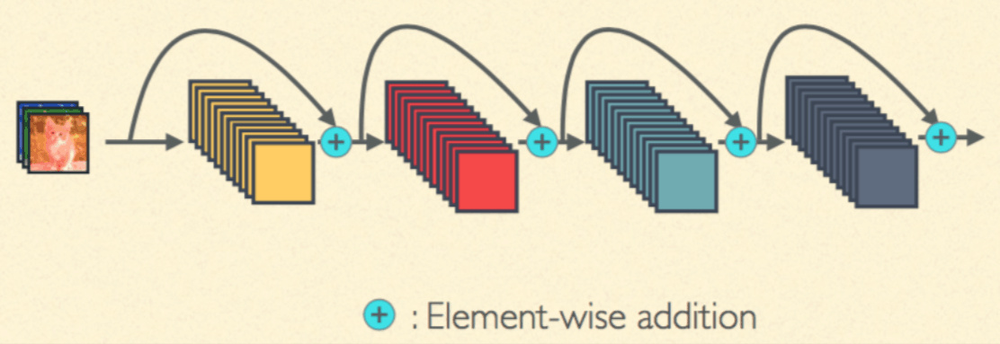
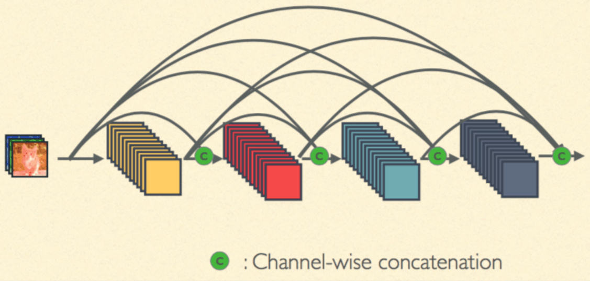

# DenseNet

## 介绍

因为 ResNet 提出了跨层链接的思想，这直接影响了随后出现的卷积网络架构，其中最有名的就是 cvpr 2017 的 best paper，DenseNet。

DenseNet 和 ResNet 不同在于 ResNet 是跨层求和，而 DenseNet 是跨层将特征在通道维度进行拼接，下面可以看看他们两者的图示。







第一张图是 ResNet，第二张图是 DenseNet，因为是在通道维度进行特征的拼接，所以底层的输出会保留进入所有后面的层，这能够更好的保证梯度的传播，同时能够使用低维的特征和高维的特征进行联合训练，能够得到更好的结果。

DenseNet 主要由 dense block 构成，下面我们来实现一个 densen block。


## Pytorch实现


```python
import sys
sys.path.append('..')

import numpy as np
import torch
from torch import nn
from torch.autograd import Variable
from torchvision.datasets import CIFAR10
```

首先定义一个卷积块，这个卷积块的顺序是 bn -> relu -> conv


```python
def conv_block(in_channel, out_channel):
    layer = nn.Sequential(
        nn.BatchNorm2d(in_channel),
        nn.ReLU(True),
        nn.Conv2d(in_channel, out_channel, 3, padding=1, bias=False)
    )
    return layer
```

dense block 将每次的卷积的输出称为 `growth_rate`，因为如果输入是 `in_channel`，有 n 层，那么输出就是 `in_channel + n * growh_rate`


```python
class dense_block(nn.Module):
    def __init__(self, in_channel, growth_rate, num_layers):
        super(dense_block, self).__init__()
        block = []
        channel = in_channel
        for i in range(num_layers):
            block.append(conv_block(channel, growth_rate))
            channel += growth_rate
            
        self.net = nn.Sequential(*block)
        
    def forward(self, x):
        for layer in self.net:
            out = layer(x)
            x = torch.cat((out, x), dim=1)
        return x
```

我们验证一下输出的 channel 是否正确


```python
test_net = dense_block(3, 12, 3)
test_x = Variable(torch.zeros(1, 3, 96, 96))
print('input shape: {} x {} x {}'.format(test_x.shape[1], test_x.shape[2], test_x.shape[3]))
test_y = test_net(test_x)
print('output shape: {} x {} x {}'.format(test_y.shape[1], test_y.shape[2], test_y.shape[3]))
```

    input shape: 3 x 96 x 96
    output shape: 39 x 96 x 96


除了 dense block，DenseNet 中还有一个模块叫过渡层（transition block），因为 DenseNet 会不断地对维度进行拼接， 所以当层数很高的时候，输出的通道数就会越来越大，参数和计算量也会越来越大，为了避免这个问题，需要引入过渡层将输出通道降低下来，同时也将输入的长宽减半，这个过渡层可以使用 1 x 1 的卷积


```python
def transition(in_channel, out_channel):
    trans_layer = nn.Sequential(
        nn.BatchNorm2d(in_channel),
        nn.ReLU(True),
        nn.Conv2d(in_channel, out_channel, 1),
        nn.AvgPool2d(2, 2)
    )
    return trans_layer
```

验证一下过渡层是否正确


```python
test_net = transition(3, 12)
test_x = Variable(torch.zeros(1, 3, 96, 96))
print('input shape: {} x {} x {}'.format(test_x.shape[1], test_x.shape[2], test_x.shape[3]))
test_y = test_net(test_x)
print('output shape: {} x {} x {}'.format(test_y.shape[1], test_y.shape[2], test_y.shape[3]))
```

    input shape: 3 x 96 x 96
    output shape: 12 x 48 x 48


最后我们定义 DenseNet


```python
class densenet(nn.Module):
    def __init__(self, in_channel, num_classes, growth_rate=32, block_layers=[6, 12, 24, 16]):
        super(densenet, self).__init__()
        self.block1 = nn.Sequential(
            nn.Conv2d(in_channel, 64, 7, 2, 3),
            nn.BatchNorm2d(64),
            nn.ReLU(True),
            nn.MaxPool2d(3, 2, padding=1)
        )
        
        channels = 64
        block = []
        for i, layers in enumerate(block_layers):
            block.append(dense_block(channels, growth_rate, layers))
            channels += layers * growth_rate
            if i != len(block_layers) - 1:
                block.append(transition(channels, channels // 2)) # 通过 transition 层将大小减半，通道数减半
                channels = channels // 2
        
        self.block2 = nn.Sequential(*block)
        self.block2.add_module('bn', nn.BatchNorm2d(channels))
        self.block2.add_module('relu', nn.ReLU(True))
        self.block2.add_module('avg_pool', nn.AvgPool2d(3))
        
        self.classifier = nn.Linear(channels, num_classes)
    
    def forward(self, x):
        x = self.block1(x)
        x = self.block2(x)
        
        x = x.view(x.shape[0], -1)
        x = self.classifier(x)
        return x
```


```python
test_net = densenet(3, 10)
test_x = Variable(torch.zeros(1, 3, 96, 96))
test_y = test_net(test_x)
print('output: {}'.format(test_y.shape))
```

    output: torch.Size([1, 10])


下面使用CIFAR10的数据集进行训练和测试，函数data_tf()使得数据格式符合输出方式

utils.py -train


```python
from datetime import datetime

import torch
import torch.nn.functional as F
from torch import nn
from torch.autograd import Variable


def get_acc(output, label):
    total = output.shape[0]
    _, pred_label = output.max(1)
    num_correct = (pred_label == label).sum().data[0]
    return num_correct / total


def train(net, train_data, valid_data, num_epochs, optimizer, criterion):
    if torch.cuda.is_available():
        net = net.cuda()
    prev_time = datetime.now()
    for epoch in range(num_epochs):
        train_loss = 0
        train_acc = 0
        net = net.train()
        for im, label in train_data:
            if torch.cuda.is_available():
                im = Variable(im.cuda())  # (bs, 3, h, w)
                label = Variable(label.cuda())  # (bs, h, w)
            else:
                im = Variable(im)
                label = Variable(label)
            # forward
            output = net(im)
            loss = criterion(output, label)
            # backward
            optimizer.zero_grad()
            loss.backward()
            optimizer.step()

            train_loss += loss.data[0]
            train_acc += get_acc(output, label)

        cur_time = datetime.now()
        h, remainder = divmod((cur_time - prev_time).seconds, 3600)
        m, s = divmod(remainder, 60)
        time_str = "Time %02d:%02d:%02d" % (h, m, s)
        if valid_data is not None:
            valid_loss = 0
            valid_acc = 0
            net = net.eval()
            for im, label in valid_data:
                if torch.cuda.is_available():
                    im = Variable(im.cuda(), volatile=True)
                    label = Variable(label.cuda(), volatile=True)
                else:
                    im = Variable(im, volatile=True)
                    label = Variable(label, volatile=True)
                output = net(im)
                loss = criterion(output, label)
                # valid_loss+=float(loss.data[0])
                valid_loss += loss.data[0]
                valid_acc += get_acc(output, label)
            epoch_str = (
                "Epoch %d. Train Loss: %f, Train Acc: %f, Valid Loss: %f, Valid Acc: %f, "
                % (epoch, train_loss / len(train_data),
                   train_acc / len(train_data), valid_loss / len(valid_data),
                   valid_acc / len(valid_data)))
        else:
            epoch_str = ("Epoch %d. Train Loss: %f, Train Acc: %f, " %
                         (epoch, train_loss / len(train_data),
                          train_acc / len(train_data)))
        prev_time = cur_time
        print((epoch_str + time_str))


def conv3x3(in_channel, out_channel, stride=1):
    return nn.Conv2d(
        in_channel, out_channel, 3, stride=stride, padding=1, bias=False)


class residual_block(nn.Module):
    def __init__(self, in_channel, out_channel, same_shape=True):
        super(residual_block, self).__init__()
        self.same_shape = same_shape
        stride = 1 if self.same_shape else 2

        self.conv1 = conv3x3(in_channel, out_channel, stride=stride)
        self.bn1 = nn.BatchNorm2d(out_channel)

        self.conv2 = conv3x3(out_channel, out_channel)
        self.bn2 = nn.BatchNorm2d(out_channel)
        if not self.same_shape:
            self.conv3 = nn.Conv2d(in_channel, out_channel, 1, stride=stride)

    def forward(self, x):
        out = self.conv1(x)
        out = F.relu(self.bn1(out), True)
        out = self.conv2(out)
        out = F.relu(self.bn2(out), True)

        if not self.same_shape:
            x = self.conv3(x)
        return F.relu(x + out, True)


class resnet(nn.Module):
    def __init__(self, in_channel, num_classes, verbose=False):
        super(resnet, self).__init__()
        self.verbose = verbose

        self.block1 = nn.Conv2d(in_channel, 64, 7, 2)

        self.block2 = nn.Sequential(
            nn.MaxPool2d(3, 2), residual_block(64, 64), residual_block(64, 64))

        self.block3 = nn.Sequential(
            residual_block(64, 128, False), residual_block(128, 128))

        self.block4 = nn.Sequential(
            residual_block(128, 256, False), residual_block(256, 256))

        self.block5 = nn.Sequential(
            residual_block(256, 512, False), residual_block(512, 512),
            nn.AvgPool2d(3))

        self.classifier = nn.Linear(512, num_classes)

    def forward(self, x):
        x = self.block1(x)
        if self.verbose:
            print(('block 1 output: {}'.format(x.shape)))
        x = self.block2(x)
        if self.verbose:
            print(('block 2 output: {}'.format(x.shape)))
        x = self.block3(x)
        if self.verbose:
            print(('block 3 output: {}'.format(x.shape)))
        x = self.block4(x)
        if self.verbose:
            print(('block 4 output: {}'.format(x.shape)))
        x = self.block5(x)
        if self.verbose:
            print(('block 5 output: {}'.format(x.shape)))
        x = x.view(x.shape[0], -1)
        x = self.classifier(x)
        return x
```


```python
# from utils import train

def data_tf(x):
    x = x.resize((96, 96), 2) # 将图片放大到 96 x 96
    x = np.array(x, dtype='float32') / 255
    x = (x - 0.5) / 0.5 # 标准化，这个技巧之后会讲到
    x = x.transpose((2, 0, 1)) # 将 channel 放到第一维，只是 pytorch 要求的输入方式
    x = torch.from_numpy(x)
    return x
     
train_set = CIFAR10('./data', train=True, transform=data_tf)
train_data = torch.utils.data.DataLoader(train_set, batch_size=64, shuffle=True)
test_set = CIFAR10('./data', train=False, transform=data_tf)
test_data = torch.utils.data.DataLoader(test_set, batch_size=128, shuffle=False)

net = densenet(3, 10)
optimizer = torch.optim.SGD(net.parameters(), lr=0.01)
criterion = nn.CrossEntropyLoss()
```


```python
train(net, train_data, test_data, 20, optimizer, criterion)
```

    Epoch 0. Train Loss: 1.374316, Train Acc: 0.507972, Valid Loss: 1.203217, Valid Acc: 0.572884, Time 00:01:44
    Epoch 1. Train Loss: 0.912924, Train Acc: 0.681506, Valid Loss: 1.555908, Valid Acc: 0.492286, Time 00:01:50
    Epoch 2. Train Loss: 0.701387, Train Acc: 0.755794, Valid Loss: 0.815147, Valid Acc: 0.718354, Time 00:01:49
    Epoch 3. Train Loss: 0.575985, Train Acc: 0.800911, Valid Loss: 0.696013, Valid Acc: 0.759494, Time 00:01:50
    Epoch 4. Train Loss: 0.479812, Train Acc: 0.836957, Valid Loss: 1.013879, Valid Acc: 0.676226, Time 00:01:51
    Epoch 5. Train Loss: 0.402165, Train Acc: 0.861413, Valid Loss: 0.674512, Valid Acc: 0.778481, Time 00:01:50
    Epoch 6. Train Loss: 0.334593, Train Acc: 0.888247, Valid Loss: 0.647112, Valid Acc: 0.791634, Time 00:01:50
    Epoch 7. Train Loss: 0.278181, Train Acc: 0.907149, Valid Loss: 0.773517, Valid Acc: 0.756527, Time 00:01:51
    Epoch 8. Train Loss: 0.227948, Train Acc: 0.922714, Valid Loss: 0.654399, Valid Acc: 0.800237, Time 00:01:49
    Epoch 9. Train Loss: 0.181156, Train Acc: 0.940157, Valid Loss: 1.179013, Valid Acc: 0.685225, Time 00:01:50
    Epoch 10. Train Loss: 0.151305, Train Acc: 0.950208, Valid Loss: 0.630000, Valid Acc: 0.807951, Time 00:01:50
    Epoch 11. Train Loss: 0.118433, Train Acc: 0.961077, Valid Loss: 1.247253, Valid Acc: 0.703323, Time 00:01:52
    Epoch 12. Train Loss: 0.094127, Train Acc: 0.969789, Valid Loss: 1.230697, Valid Acc: 0.723101, Time 00:01:51
    Epoch 13. Train Loss: 0.086181, Train Acc: 0.972047, Valid Loss: 0.904135, Valid Acc: 0.769284, Time 00:01:50
    Epoch 14. Train Loss: 0.064248, Train Acc: 0.980359, Valid Loss: 1.665002, Valid Acc: 0.624209, Time 00:01:51
    Epoch 15. Train Loss: 0.054932, Train Acc: 0.982996, Valid Loss: 0.927216, Valid Acc: 0.774723, Time 00:01:51
    Epoch 16. Train Loss: 0.043503, Train Acc: 0.987272, Valid Loss: 1.574383, Valid Acc: 0.707377, Time 00:01:52
    Epoch 17. Train Loss: 0.047615, Train Acc: 0.985154, Valid Loss: 0.987781, Valid Acc: 0.770471, Time 00:01:51
    Epoch 18. Train Loss: 0.039813, Train Acc: 0.988012, Valid Loss: 2.248944, Valid Acc: 0.631824, Time 00:01:50
    Epoch 19. Train Loss: 0.030183, Train Acc: 0.991168, Valid Loss: 0.887785, Valid Acc: 0.795392, Time 00:01:51


DenseNet 将残差连接改为了特征拼接，使得网络有了更稠密的连接
