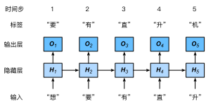
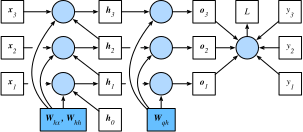
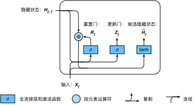
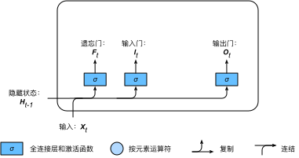
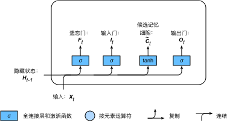
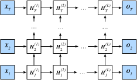

# 深度学习简介

# 预备知识

# 深度学习基础

# 深度学习计算

# 卷积神经网络

# 循环神经网络

##  语言模型

语言模型（language model）是自然语言处理的重要技术。自然语言处理中最常见的数据是文本数据。我们可以把一段自然语言文本看作一段离散的时间序列。假设一段长度为$T$的文本中的词依次为$w_1, w_2, \ldots, w_T$，那么在离散的时间序列中，$w_t$（$1 \leq t \leq T$）可看作在时间步（time step）$t$的输出或标签。给定一个长度为$T$的词的序列$w_1, w_2, \ldots, w_T$，语言模型将计算该序列的概率：

$$P(w_1, w_2, \ldots, w_T).$$


语言模型可用于提升语音识别和机器翻译的性能。例如，在语音识别中，给定一段“厨房里食油用完了”的语音，有可能会输出“厨房里食油用完了”和“厨房里石油用完了”这两个读音完全一样的文本序列。如果语言模型判断出前者的概率大于后者的概率，我们就可以根据相同读音的语音输出“厨房里食油用完了”的文本序列。在机器翻译中，如果对英文“you go first”逐词翻译成中文的话，可能得到“你走先”“你先走”等排列方式的文本序列。如果语言模型判断出“你先走”的概率大于其他排列方式的文本序列的概率，我们就可以把“you go first”翻译成“你先走”。

###  语言模型的计算


既然语言模型很有用，那该如何计算它呢？假设序列$w_1, w_2, \ldots, w_T$中的每个词是依次生成的，我们有

$$P(w_1, w_2, \ldots, w_T) = \prod_{t=1}^T P(w_t \mid w_1, \ldots, w_{t-1}).$$

例如，一段含有4个词的文本序列的概率

$$P(w_1, w_2, w_3, w_4) =  P(w_1) P(w_2 \mid w_1) P(w_3 \mid w_1, w_2) P(w_4 \mid w_1, w_2, w_3).$$

为了计算语言模型，我们需要计算词的概率，以及一个词在给定前几个词的情况下的条件概率，即语言模型参数。设训练数据集为一个大型文本语料库，如维基百科的所有条目。词的概率可以通过该词在训练数据集中的相对词频来计算。例如，$P(w_1)$可以计算为$w_1$在训练数据集中的词频（词出现的次数）与训练数据集的总词数之比。因此，根据条件概率定义，一个词在给定前几个词的情况下的条件概率也可以通过训练数据集中的相对词频计算。例如，$P(w_2 \mid w_1)$可以计算为$w_1, w_2$两词相邻的频率与$w_1$词频的比值，因为该比值即$P(w_1, w_2)$与$P(w_1)$之比；而$P(w_3 \mid w_1, w_2)$同理可以计算为$w_1$、$w_2$和$w_3$三词相邻的频率与$w_1$和$w_2$两词相邻的频率的比值。以此类推。

###  $n$元语法

当序列长度增加时，计算和存储多个词共同出现的概率的复杂度会呈指数级增加。$n$元语法通过马尔可夫假设（虽然并不一定成立）简化了语言模型的计算。这里的马尔可夫假设是指一个词的出现只与前面$n$个词相关，即$n$阶马尔可夫链（Markov chain of order $n$）。如果$n=1$，那么有$P(w_3 \mid w_1, w_2) = P(w_3 \mid w_2)$。如果基于$n-1$阶马尔可夫链，我们可以将语言模型改写为

$$P(w_1, w_2, \ldots, w_T) \approx \prod_{t=1}^T P(w_t \mid w_{t-(n-1)}, \ldots, w_{t-1}) .$$


以上也叫$n$元语法（$n$-grams）。它是基于$n - 1$阶马尔可夫链的概率语言模型。当$n$分别为1、2和3时，我们将其分别称作一元语法（unigram）、二元语法（bigram）和三元语法（trigram）。例如，长度为4的序列$w_1, w_2, w_3, w_4$在一元语法、二元语法和三元语法中的概率分别为

$$
\begin{aligned}
P(w_1, w_2, w_3, w_4) &=  P(w_1) P(w_2) P(w_3) P(w_4) ,\\
P(w_1, w_2, w_3, w_4) &=  P(w_1) P(w_2 \mid w_1) P(w_3 \mid w_2) P(w_4 \mid w_3) ,\\
P(w_1, w_2, w_3, w_4) &=  P(w_1) P(w_2 \mid w_1) P(w_3 \mid w_1, w_2) P(w_4 \mid w_2, w_3) .
\end{aligned}
$$

当$n$较小时，$n$元语法往往并不准确。例如，在一元语法中，由三个词组成的句子“你走先”和“你先走”的概率是一样的。然而，当$n$较大时，$n$元语法需要计算并存储大量的词频和多词相邻频率。

那么，有没有方法在语言模型中更好地平衡以上这两点呢？我们将在本章探究这样的方法。

**小结**

* 语言模型是自然语言处理的重要技术。
* $N$元语法是基于$n-1$阶马尔可夫链的概率语言模型，其中$n$权衡了计算复杂度和模型准确性。

-----------
> 注：本节与原书此节完全相同，[原书传送门](https://zh.d2l.ai/chapter_recurrent-neural-networks/lang-model.html)


##  循环神经网络

上一节介绍的$n$元语法中，时间步$t$的词$w_t$基于前面所有词的条件概率只考虑了最近时间步的$n-1$个词。如果要考虑比$t-(n-1)$更早时间步的词对$w_t$的可能影响，我们需要增大$n$。但这样模型参数的数量将随之呈指数级增长。

本节将介绍循环神经网络。它并非刚性地记忆所有固定长度的序列，而是通过隐藏状态来存储之前时间步的信息。首先我们回忆一下前面介绍过的多层感知机，然后描述如何添加隐藏状态来将它变成循环神经网络。

###  不含隐藏状态的神经网络

让我们考虑一个含单隐藏层的多层感知机。给定样本数为$n$、输入个数（特征数或特征向量维度）为$d$的小批量数据样本$\boldsymbol{X} \in \mathbb{R}^{n \times d}$。设隐藏层的激活函数为$\phi$，那么隐藏层的输出$\boldsymbol{H} \in \mathbb{R}^{n \times h}$计算为

$$\boldsymbol{H} = \phi(\boldsymbol{X} \boldsymbol{W}_{xh} + \boldsymbol{b}_h),$$

其中隐藏层权重参数$\boldsymbol{W}_{xh} \in \mathbb{R}^{d \times h}$，隐藏层偏差参数 $\boldsymbol{b}_h \in \mathbb{R}^{1 \times h}$，$h$为隐藏单元个数。上式相加的两项形状不同，因此将按照广播机制相加。把隐藏变量$\boldsymbol{H}$作为输出层的输入，且设输出个数为$q$（如分类问题中的类别数），输出层的输出为

$$\boldsymbol{O} = \boldsymbol{H} \boldsymbol{W}_{hq} + \boldsymbol{b}_q,$$

其中输出变量$\boldsymbol{O} \in \mathbb{R}^{n \times q}$, 输出层权重参数$\boldsymbol{W}_{hq} \in \mathbb{R}^{h \times q}$, 输出层偏差参数$\boldsymbol{b}_q \in \mathbb{R}^{1 \times q}$。如果是分类问题，我们可以使用$\text{softmax}(\boldsymbol{O})$来计算输出类别的概率分布。

### 含隐藏状态的循环神经网络

现在我们考虑输入数据存在时间相关性的情况。假设$\boldsymbol{X}_t \in \mathbb{R}^{n \times d}$是序列中时间步$t$的小批量输入，$\boldsymbol{H}_t  \in \mathbb{R}^{n \times h}$是该时间步的隐藏变量。与多层感知机不同的是，这里我们保存上一时间步的隐藏变量$\boldsymbol{H}_{t-1}$，并引入一个新的权重参数$\boldsymbol{W}_{hh} \in \mathbb{R}^{h \times h}$，该参数用来描述在当前时间步如何使用上一时间步的隐藏变量。具体来说，时间步$t$的隐藏变量的计算由当前时间步的输入和上一时间步的隐藏变量共同决定：

$$\boldsymbol{H}_t = \phi(\boldsymbol{X}_t \boldsymbol{W}_{xh} + \boldsymbol{H}_{t-1} \boldsymbol{W}_{hh}  + \boldsymbol{b}_h).$$

与多层感知机相比，我们在这里添加了$\boldsymbol{H}_{t-1} \boldsymbol{W}_{hh}$一项。由上式中相邻时间步的隐藏变量$\boldsymbol{H}_t$和$\boldsymbol{H}_{t-1}$之间的关系可知，这里的隐藏变量能够捕捉截至当前时间步的序列的历史信息，就像是神经网络当前时间步的状态或记忆一样。因此，该隐藏变量也称为隐藏状态。由于隐藏状态在当前时间步的定义使用了上一时间步的隐藏状态，上式的计算是循环的。使用循环计算的网络即循环神经网络（recurrent neural network）。

循环神经网络有很多种不同的构造方法。含上式所定义的隐藏状态的循环神经网络是极为常见的一种。若无特别说明，本章中的循环神经网络均基于上式中隐藏状态的循环计算。在时间步$t$，输出层的输出和多层感知机中的计算类似：

$$\boldsymbol{O}_t = \boldsymbol{H}_t \boldsymbol{W}_{hq} + \boldsymbol{b}_q.$$

循环神经网络的参数包括隐藏层的权重$\boldsymbol{W}_{xh} \in \mathbb{R}^{d \times h}$、$\boldsymbol{W}_{hh} \in \mathbb{R}^{h \times h}$和偏差 $\boldsymbol{b}_h \in \mathbb{R}^{1 \times h}$，以及输出层的权重$\boldsymbol{W}_{hq} \in \mathbb{R}^{h \times q}$和偏差$\boldsymbol{b}_q \in \mathbb{R}^{1 \times q}$。值得一提的是，即便在不同时间步，循环神经网络也始终使用这些模型参数。因此，循环神经网络模型参数的数量不随时间步的增加而增长。

图6.1展示了循环神经网络在3个相邻时间步的计算逻辑。在时间步$t$，隐藏状态的计算可以看成是将输入$\boldsymbol{X}_t$和前一时间步隐藏状态$\boldsymbol{H}_{t-1}$连结后输入一个激活函数为$\phi$的全连接层。该全连接层的输出就是当前时间步的隐藏状态$\boldsymbol{H}_t$，且模型参数为$\boldsymbol{W}_{xh}$与$\boldsymbol{W}_{hh}$的连结，偏差为$\boldsymbol{b}_h$。当前时间步$t$的隐藏状态$\boldsymbol{H}_t$将参与下一个时间步$t+1$的隐藏状态$\boldsymbol{H}_{t+1}$的计算，并输入到当前时间步的全连接输出层。


<div align=center>图6.1 含隐藏状态的循环神经网络</div>

我们刚刚提到，隐藏状态中$\boldsymbol{X}_t \boldsymbol{W}_{xh} + \boldsymbol{H}_{t-1} \boldsymbol{W}_{hh}$的计算等价于$\boldsymbol{X}_t$与$\boldsymbol{H}_{t-1}$连结后的矩阵乘以$\boldsymbol{W}_{xh}$与$\boldsymbol{W}_{hh}$连结后的矩阵。接下来，我们用一个具体的例子来验证这一点。首先，我们构造矩阵**X**、**W_xh**、**H**和**W_hh**，它们的形状分别为(3, 1)、(1, 4)、(3, 4)和(4, 4)。将**X**与**W_xh**、**H**与**W_hh**分别相乘，再把两个乘法运算的结果相加，得到形状为(3, 4)的矩阵。

``` python
import torch

X, W_xh = torch.randn(3, 1), torch.randn(1, 4)
H, W_hh = torch.randn(3, 4), torch.randn(4, 4)
torch.matmul(X, W_xh) + torch.matmul(H, W_hh)
```
输出：
```
tensor([[ 5.2633, -3.2288,  0.6037, -1.3321],
        [ 9.4012, -6.7830,  1.0630, -0.1809],
        [ 7.0355, -2.2361,  0.7469, -3.4667]])
```

将矩阵**X**和**H**按列（维度1）连结，连结后的矩阵形状为(3, 5)。可见，连结后矩阵在维度1的长度为矩阵**X**和**H**在维度1的长度之和（$1+4$）。然后，将矩阵**W_xh**和**W_hh**按行（维度0）连结，连结后的矩阵形状为(5, 4)。最后将两个连结后的矩阵相乘，得到与上面代码输出相同的形状为(3, 4)的矩阵。

``` python
torch.matmul(torch.cat((X, H), dim=1), torch.cat((W_xh, W_hh), dim=0))
```
输出：
```
tensor([[ 5.2633, -3.2288,  0.6037, -1.3321],
        [ 9.4012, -6.7830,  1.0630, -0.1809],
        [ 7.0355, -2.2361,  0.7469, -3.4667]])
```

### 应用：基于字符级循环神经网络的语言模型

最后我们介绍如何应用循环神经网络来构建一个语言模型。设小批量中样本数为1，文本序列为“想”“要”“有”“直”“升”“机”。图6.2演示了如何使用循环神经网络基于当前和过去的字符来预测下一个字符。在训练时，我们对每个时间步的输出层输出使用softmax运算，然后使用交叉熵损失函数来计算它与标签的误差。在图6.2中，由于隐藏层中隐藏状态的循环计算，时间步3的输出$\boldsymbol{O}_3$取决于文本序列“想”“要”“有”。 由于训练数据中该序列的下一个词为“直”，时间步3的损失将取决于该时间步基于序列“想”“要”“有”生成下一个词的概率分布与该时间步的标签“直”。



<div align=center>图6.2 基于字符级循环神经网络的语言模型。</div>


因为每个输入词是一个字符，因此这个模型被称为字符级循环神经网络（character-level recurrent neural network）。因为不同字符的个数远小于不同词的个数（对于英文尤其如此），所以字符级循环神经网络的计算通常更加简单。在接下来的几节里，我们将介绍它的具体实现。

**小结**

* 使用循环计算的网络即循环神经网络。
* 循环神经网络的隐藏状态可以捕捉截至当前时间步的序列的历史信息。
* 循环神经网络模型参数的数量不随时间步的增加而增长。
* 可以基于字符级循环神经网络来创建语言模型。

-----------
> 注：除代码外本节与原书此节基本相同，[原书传送门](https://zh.d2l.ai/chapter_recurrent-neural-networks/rnn.html)


##  语言模型数据集（周杰伦专辑歌词）

本节将介绍如何预处理一个语言模型数据集，并将其转换成字符级循环神经网络所需要的输入格式。为此，我们收集了周杰伦从第一张专辑《Jay》到第十张专辑《跨时代》中的歌词，并在后面几节里应用循环神经网络来训练一个语言模型。当模型训练好后，我们就可以用这个模型来创作歌词。

###  读取数据集

首先读取这个数据集，看看前40个字符是什么样的。

``` python
import torch
import random
import zipfile

with zipfile.ZipFile('../../data/jaychou_lyrics.txt.zip') as zin:
    with zin.open('jaychou_lyrics.txt') as f:
        corpus_chars = f.read().decode('utf-8')
        
corpus_chars[:40]
```
**输出**：

```
'想要有直升机\n想要和你飞到宇宙去\n想要和你融化在一起\n融化在宇宙里\n我每天每天每'
```

这个数据集有6万多个字符。为了打印方便，我们把换行符替换成空格，然后仅使用前1万个字符来训练模型。

``` python
corpus_chars = corpus_chars.replace('\n', ' ').replace('\r', ' ')
corpus_chars = corpus_chars[0:10000]
```

###  建立字符索引

我们将每个字符映射成一个从0开始的连续整数，又称索引，来方便之后的数据处理。为了得到索引，我们将数据集里所有不同字符取出来，然后将其逐一映射到索引来构造词典。接着，打印**vocab_size**，即词典中不同字符的个数，又称词典大小。

``` python
idx_to_char = list(set(corpus_chars))  # 字符列表
char_to_idx = dict([(char, i) for i, char in enumerate(idx_to_char)])  # 字符：索引
vocab_size = len(char_to_idx)
vocab_size # 1027
```

之后，将训练数据集中每个字符转化为索引，并打印前20个字符及其对应的索引。

``` python
corpus_indices = [char_to_idx[char] for char in corpus_chars]  # 原始字符对应索引
sample = corpus_indices[:20]
print('chars:', ''.join([idx_to_char[idx] for idx in sample]))
print('indices:', sample)
```
**输出**：

```
chars: 想要有直升机 想要和你飞到宇宙去 想要和
indices: [250, 164, 576, 421, 674, 653, 357, 250, 164, 850, 217, 910, 1012, 261, 275, 366, 357, 250, 164, 850]
```

我们将以上代码封装在**d2lzh_pytorch**包里的**load_data_jay_lyrics**函数中，以方便后面章节调用。调用该函数后会依次得到**corpus_indices**、**char_to_idx**、**idx_to_char**和**vocab_size**这4个变量。

###  时序数据的采样

在训练中我们需要每次随机读取小批量样本和标签。与之前章节的实验数据不同的是，时序数据的一个样本通常包含连续的字符。假设时间步数为5，样本序列为5个字符，即“想”“要”“有”“直”“升”。该样本的标签序列为这些字符分别在训练集中的下一个字符，即“要”“有”“直”“升”“机”。我们有两种方式对时序数据进行采样，分别是随机采样和相邻采样。

####  随机采样

下面的代码每次从数据里随机采样一个小批量。其中批量大小**batch_size**指每个小批量的样本数，**num_steps**为每个样本所包含的时间步数。
在随机采样中，每个样本是原始序列上任意截取的一段序列。相邻的两个随机小批量在原始序列上的位置不一定相毗邻。因此，我们无法用一个小批量最终时间步的隐藏状态来初始化下一个小批量的隐藏状态。在训练模型时，每次随机采样前都需要重新初始化隐藏状态。

``` python
# 本函数已保存在d2lzh_pytorch包中方便以后使用
def data_iter_random(corpus_indices, batch_size, num_steps, device=None):
    # 减1是因为输出的索引x是相应输入的索引y加1
    num_examples = (len(corpus_indices) - 1) // num_steps
    epoch_size = num_examples // batch_size
    example_indices = list(range(num_examples))
    random.shuffle(example_indices)

    # 返回从pos开始的长为num_steps的序列
    def _data(pos):
        return corpus_indices[pos: pos + num_steps]
    
    if device is None:
        device = torch.device('cuda' if torch.cuda.is_available() else 'cpu')
    
    for i in range(epoch_size):
        # 每次读取batch_size个随机样本
        i = i * batch_size
        batch_indices = example_indices[i: i + batch_size]
        X = [_data(j * num_steps) for j in batch_indices]
        Y = [_data(j * num_steps + 1) for j in batch_indices]
        yield torch.tensor(X, dtype=torch.float32, device=device), torch.tensor(Y, dtype=torch.float32, device=device)
```

让我们输入一个从0到29的连续整数的人工序列。设批量大小和时间步数分别为2和6。打印随机采样每次读取的小批量样本的输入**X**和标签**Y**。可见，相邻的两个随机小批量在原始序列上的位置不一定相毗邻。

``` python
my_seq = list(range(30))
for X, Y in data_iter_random(my_seq, batch_size=2, num_steps=6):
    print('X: ', X, '\nY:', Y, '\n')
```
输出：
```
X:  tensor([[18., 19., 20., 21., 22., 23.],
        [12., 13., 14., 15., 16., 17.]]) 
Y: tensor([[19., 20., 21., 22., 23., 24.],
        [13., 14., 15., 16., 17., 18.]]) 

X:  tensor([[ 0.,  1.,  2.,  3.,  4.,  5.],
        [ 6.,  7.,  8.,  9., 10., 11.]]) 
Y: tensor([[ 1.,  2.,  3.,  4.,  5.,  6.],
        [ 7.,  8.,  9., 10., 11., 12.]]) 
```

####  相邻采样

除对原始序列做随机采样之外，我们还可以令相邻的两个随机小批量在原始序列上的位置相毗邻。这时候，我们就可以用一个小批量最终时间步的隐藏状态来初始化下一个小批量的隐藏状态，从而使下一个小批量的输出也取决于当前小批量的输入，并如此循环下去。这对实现循环神经网络造成了两方面影响：一方面，在训练模型时，我们只需在每一个迭代周期开始时初始化隐藏状态；另一方面，当多个相邻小批量通过传递隐藏状态串联起来时，模型参数的梯度计算将依赖所有串联起来的小批量序列。同一迭代周期中，随着迭代次数的增加，梯度的计算开销会越来越大。为了使模型参数的梯度计算只依赖一次迭代读取的小批量序列，我们可以在每次读取小批量前将隐藏状态从计算图中分离出来。我们将在下一节（循环神经网络的从零开始实现）的实现中了解这种处理方式。

``` python
# 本函数已保存在d2lzh_pytorch包中方便以后使用
def data_iter_consecutive(corpus_indices, batch_size, num_steps, device=None):
    if device is None:
        device = torch.device('cuda' if torch.cuda.is_available() else 'cpu')
        
    corpus_indices = torch.tensor(corpus_indices, dtype=torch.float32, device=device)
    data_len = len(corpus_indices)
    batch_len = data_len // batch_size
    indices = corpus_indices[0: batch_size*batch_len].view(batch_size, batch_len)
    epoch_size = (batch_len - 1) // num_steps
    
    for i in range(epoch_size):
        i = i * num_steps
        X = indices[:, i: i + num_steps]
        Y = indices[:, i + 1: i + num_steps + 1]
        yield X, Y
```

同样的设置下，打印相邻采样每次读取的小批量样本的输入**X**和标签**Y**。相邻的两个随机小批量在原始序列上的位置相毗邻。

``` python
for X, Y in data_iter_consecutive(my_seq, batch_size=2, num_steps=6):
    print('X: ', X, '\nY:', Y, '\n')
```
输出：
```
X:  tensor([[ 0.,  1.,  2.,  3.,  4.,  5.],
        [15., 16., 17., 18., 19., 20.]]) 
Y: tensor([[ 1.,  2.,  3.,  4.,  5.,  6.],
        [16., 17., 18., 19., 20., 21.]]) 

X:  tensor([[ 6.,  7.,  8.,  9., 10., 11.],
        [21., 22., 23., 24., 25., 26.]]) 
Y: tensor([[ 7.,  8.,  9., 10., 11., 12.],
        [22., 23., 24., 25., 26., 27.]]) 
```

**小结**

* 时序数据采样方式包括随机采样和相邻采样。使用这两种方式的循环神经网络训练在实现上略有不同。


-----------
> 注：除代码外本节与原书此节基本相同，[原书传送门](https://zh.d2l.ai/chapter_recurrent-neural-networks/lang-model-dataset.html)


## 循环神经网络的从零开始实现

在本节中，我们将从零开始实现一个基于字符级循环神经网络的语言模型，并在周杰伦专辑歌词数据集上训练一个模型来进行歌词创作。首先，我们读取周杰伦专辑歌词数据集：

``` python
import time
import math
import numpy as np
import torch
from torch import nn, optim
import torch.nn.functional as F

import sys
sys.path.append("..") 

import d2lzh_pytorch as d2l

device = torch.device('cuda' if torch.cuda.is_available() else 'cpu')

(corpus_indices, char_to_idx, idx_to_char, vocab_size) = d2l.load_data_jay_lyrics()
```

###  one-hot向量

为了将词表示成向量输入到神经网络，一个简单的办法是使用one-hot向量。假设词典中不同字符的数量为$N$（即词典大小**vocab_size**），每个字符已经同一个从0到$N-1$的连续整数值索引一一对应。如果一个字符的索引是整数$i$, 那么我们创建一个全0的长为$N$的向量，并将其位置为$i$的元素设成1。该向量就是对原字符的one-hot向量。下面分别展示了索引为0和2的one-hot向量，向量长度等于词典大小。
> pytorch没有自带one-hot函数(新版好像有了)，下面自己实现一个

``` python
def one_hot(x, n_class, dtype=torch.float32): 
    # X shape: (batch), output shape: (batch, n_class)
    x = x.long()
    res = torch.zeros(x.shape[0], n_class, dtype=dtype, device=x.device)
    res.scatter_(1, x.view(-1, 1), 1)
    return res
    
x = torch.tensor([0, 2])
one_hot(x, vocab_size)
```

我们每次采样的小批量的形状是(批量大小, 时间步数)。下面的函数将这样的小批量变换成数个可以输入进网络的形状为(批量大小, 词典大小)的矩阵，矩阵个数等于时间步数。也就是说，时间步$t$的输入为$\boldsymbol{X}_t \in \mathbb{R}^{n \times d}$，其中$n$为批量大小，$d$为输入个数，即one-hot向量长度（词典大小）。

``` python
# 本函数已保存在d2lzh_pytorch包中方便以后使用
def to_onehot(X, n_class):  
    # X shape: (batch, seq_len), output: seq_len elements of (batch, n_class)
    return [one_hot(X[:, i], n_class) for i in range(X.shape[1])]

X = torch.arange(10).view(2, 5)
inputs = to_onehot(X, vocab_size)
print(len(inputs), inputs[0].shape)
```
**输出**：

```
5 torch.Size([2, 1027])
```

###  初始化模型参数

接下来，我们初始化模型参数。隐藏单元个数 **num_hiddens**是一个超参数。

``` python
num_inputs, num_hiddens, num_outputs = vocab_size, 256, vocab_size
print('will use', device)

def get_params():
    def _one(shape):
        ts = torch.tensor(np.random.normal(0, 0.01, size=shape), 
                          device=device, 
                          dtype=torch.float32)
        return torch.nn.Parameter(ts, requires_grad=True)

    # 隐藏层参数
    W_xh = _one((num_inputs, num_hiddens))
    W_hh = _one((num_hiddens, num_hiddens))
    b_h = torch.nn.Parameter(torch.zeros(num_hiddens, device=device, requires_grad=True))
    
    # 输出层参数
    W_hq = _one((num_hiddens, num_outputs))
    b_q = torch.nn.Parameter(torch.zeros(num_outputs, device=device, requires_grad=True))
    
    return nn.ParameterList([W_xh, W_hh, b_h, W_hq, b_q])
```

###  定义模型

我们根据循环神经网络的计算表达式实现该模型。首先定义**init_rnn_state**函数来返回初始化的隐藏状态。它返回由一个形状为(批量大小, 隐藏单元个数)的值为0的**NDArray**组成的元组。使用元组是为了更便于处理隐藏状态含有多个**NDArray**的情况。

``` python
def init_rnn_state(batch_size, num_hiddens, device):
    return (torch.zeros((batch_size, num_hiddens), device=device), )
```

下面的**rnn**函数定义了在一个时间步里如何计算隐藏状态和输出。这里的激活函数使用了tanh函数。3.8节（多层感知机）中介绍过，当元素在实数域上均匀分布时，tanh函数值的均值为0。

``` python
def rnn(inputs, state, params):
    # inputs和outputs皆为num_steps个形状为(batch_size, vocab_size)的矩阵
    W_xh, W_hh, b_h, W_hq, b_q = params
    H, = state
    outputs = []
    
    for X in inputs:
        H = torch.tanh(torch.matmul(X, W_xh) + torch.matmul(H, W_hh) + b_h)
        Y = torch.matmul(H, W_hq) + b_q
        outputs.append(Y)
        
    return outputs, (H,)
```

做个简单的测试来观察输出结果的个数（时间步数），以及第一个时间步的输出层输出的形状和隐藏状态的形状。

```python
state = init_rnn_state(X.shape[0], num_hiddens, device)
inputs = to_onehot(X.to(device), vocab_size)
params = get_params()
outputs, state_new = rnn(inputs, state, params)

print(len(outputs), outputs[0].shape, state_new[0].shape) 
```
**输出**：

```
5 torch.Size([2, 1027]) torch.Size([2, 256])
```
###  定义预测函数

以下函数基于前缀**prefix**（含有数个字符的字符串）来预测接下来的**num_chars**个字符。这个函数稍显复杂，其中我们将循环神经单元**rnn**设置成了函数参数，这样在后面小节介绍其他循环神经网络时能重复使用这个函数。

``` python
# 本函数已保存在d2lzh_pytorch包中方便以后使用
def predict_rnn(prefix, num_chars, rnn, params, init_rnn_state,
                num_hiddens, vocab_size, device, idx_to_char, char_to_idx):
    
    state = init_rnn_state(1, num_hiddens, device)
    output = [char_to_idx[prefix[0]]]
    
    for t in range(num_chars + len(prefix) - 1):
        # 将上一时间步的输出作为当前时间步的输入
        X = to_onehot(torch.tensor([[output[-1]]], device=device), vocab_size)
        
        # 计算输出和更新隐藏状态
        (Y, state) = rnn(X, state, params)
        
        # 下一个时间步的输入是prefix里的字符或者当前的最佳预测字符
        if t < len(prefix) - 1:
            output.append(char_to_idx[prefix[t + 1]])
        else:
            output.append(int(Y[0].argmax(dim=1).item()))
            
    return ''.join([idx_to_char[i] for i in output])
```

我们先测试一下**predict_rnn**函数。我们将根据前缀“分开”创作长度为10个字符（不考虑前缀长度）的一段歌词。因为模型参数为随机值，所以预测结果也是随机的。

``` python
predict_rnn('分开', 10, rnn, params, init_rnn_state, num_hiddens, vocab_size,
            device, idx_to_char, char_to_idx)
```
输出：
```
'分开西圈绪升王凝瓜必客映'
```

###  裁剪梯度

循环神经网络中较容易出现梯度衰减或梯度爆炸。我们会在6.6节（通过时间反向传播）中解释原因。为了应对梯度爆炸，我们可以裁剪梯度（clip gradient）。假设我们把所有模型参数梯度的元素拼接成一个向量 $\boldsymbol{g}$，并设裁剪的阈值是$\theta$。裁剪后的梯度

$$ \min\left(\frac{\theta}{\|\boldsymbol{g}\|}, 1\right)\boldsymbol{g}$$

的$L_2$范数不超过$\theta$。

``` python
# 本函数已保存在d2lzh_pytorch包中方便以后使用
def grad_clipping(params, theta, device):
    norm = torch.tensor([0.0], device=device)
    for param in params:
        norm += (param.grad.data ** 2).sum()
    norm = norm.sqrt().item()
    if norm > theta:
        for param in params:
            param.grad.data *= (theta / norm)
```

###  困惑度

我们通常使用困惑度（perplexity）来评价语言模型的好坏。回忆一下3.4节（softmax回归）中交叉熵损失函数的定义。困惑度是对交叉熵损失函数做指数运算后得到的值。特别地，

* 最佳情况下，模型总是把标签类别的概率预测为1，此时困惑度为1；
* 最坏情况下，模型总是把标签类别的概率预测为0，此时困惑度为正无穷；
* 基线情况下，模型总是预测所有类别的概率都相同，此时困惑度为类别个数。

显然，任何一个有效模型的困惑度必须小于类别个数。在本例中，困惑度必须小于词典大小**vocab_size**。

###  定义模型训练函数

跟之前章节的模型训练函数相比，这里的模型训练函数有以下几点不同：

1. 使用困惑度评价模型。
2. 在迭代模型参数前裁剪梯度。
3. 对时序数据采用不同采样方法将导致隐藏状态初始化的不同。相关讨论可参考6.3节（语言模型数据集（周杰伦专辑歌词））。

另外，考虑到后面将介绍的其他循环神经网络，为了更通用，这里的函数实现更长一些。

``` python
# 本函数已保存在d2lzh_pytorch包中方便以后使用
def train_and_predict_rnn(rnn, get_params, init_rnn_state, num_hiddens,
                          vocab_size, device, corpus_indices, idx_to_char,
                          char_to_idx, is_random_iter, num_epochs, num_steps,
                          lr, clipping_theta, batch_size, pred_period,
                          pred_len, prefixes):
    if is_random_iter:
        data_iter_fn = d2l.data_iter_random
    else:
        data_iter_fn = d2l.data_iter_consecutive
    params = get_params()
    loss = nn.CrossEntropyLoss()

    for epoch in range(num_epochs):
        if not is_random_iter:  # 如使用相邻采样，在epoch开始时初始化隐藏状态
            state = init_rnn_state(batch_size, num_hiddens, device)
        l_sum, n, start = 0.0, 0, time.time()
        data_iter = data_iter_fn(corpus_indices, batch_size, num_steps, device)
        for X, Y in data_iter:
            if is_random_iter:  # 如使用随机采样，在每个小批量更新前初始化隐藏状态
                state = init_rnn_state(batch_size, num_hiddens, device)
            else:  
            # 否则需要使用detach函数从计算图分离隐藏状态, 这是为了
            # 使模型参数的梯度计算只依赖一次迭代读取的小批量序列(防止梯度计算开销太大)
                for s in state:
                    s.detach_()
            
            inputs = to_onehot(X, vocab_size)
            # outputs有num_steps个形状为(batch_size, vocab_size)的矩阵
            (outputs, state) = rnn(inputs, state, params)
            # 拼接之后形状为(num_steps * batch_size, vocab_size)
            outputs = torch.cat(outputs, dim=0)
            # Y的形状是(batch_size, num_steps)，转置后再变成长度为
            # batch * num_steps 的向量，这样跟输出的行一一对应
            y = torch.transpose(Y, 0, 1).contiguous().view(-1)
            # 使用交叉熵损失计算平均分类误差
            l = loss(outputs, y.long())
            
            # 梯度清0
            if params[0].grad is not None:
                for param in params:
                    param.grad.data.zero_()
            l.backward()
            grad_clipping(params, clipping_theta, device)  # 裁剪梯度
            d2l.sgd(params, lr, 1)  # 因为误差已经取过均值，梯度不用再做平均
            l_sum += l.item() * y.shape[0]
            n += y.shape[0]

        if (epoch + 1) % pred_period == 0:
            print('epoch %d, perplexity %f, time %.2f sec' % (
                epoch + 1, math.exp(l_sum / n), time.time() - start))
            for prefix in prefixes:
                print(' -', predict_rnn(prefix, pred_len, rnn, params, init_rnn_state,
                    num_hiddens, vocab_size, device, idx_to_char, char_to_idx))
```

###  训练模型并创作歌词

现在我们可以训练模型了。首先，设置模型超参数。我们将根据前缀“分开”和“不分开”分别创作长度为50个字符（不考虑前缀长度）的一段歌词。我们每过50个迭代周期便根据当前训练的模型创作一段歌词。

``` python
num_epochs, num_steps, batch_size, lr, clipping_theta = 250, 35, 32, 1e2, 1e-2
pred_period, pred_len, prefixes = 50, 50, ['分开', '不分开']
```

下面采用随机采样训练模型并创作歌词。

``` python
train_and_predict_rnn(rnn, get_params, init_rnn_state, num_hiddens,
                      vocab_size, device, corpus_indices, idx_to_char,
                      char_to_idx, True, num_epochs, num_steps, lr,
                      clipping_theta, batch_size, pred_period, pred_len,
                      prefixes)
```
输出：
```
epoch 50, perplexity 70.039647, time 0.11 sec
 - 分开 我不要再想 我不能 想你的让我 我的可 你怎么 一颗四 一颗四 我不要 一颗两 一颗四 一颗四 我
 - 不分开 我不要再 你你的外 在人  别你的让我 狂的可 语人两 我不要 一颗两 一颗四 一颗四 我不要 一
epoch 100, perplexity 9.726828, time 0.12 sec
 - 分开 一直的美栈人 一起看 我不要好生活 你知不觉 我已好好生活 我知道好生活 后知不觉 我跟了这生活 
 - 不分开堡 我不要再想 我不 我不 我不要再想你 不知不觉 你已经离开我 不知不觉 我跟了好生活 我知道好生
epoch 150, perplexity 2.864874, time 0.11 sec
 - 分开 一只会停留 有不它元羞 这蝪什么奇怪的事都有 包括像猫的狗 印地安老斑鸠 平常话不多 除非是乌鸦抢
 - 不分开扫 我不你再想 我不能再想 我不 我不 我不要再想你 不知不觉 你已经离开我 不知不觉 我跟了这节奏
epoch 200, perplexity 1.597790, time 0.11 sec
 - 分开 有杰伦 干 载颗拳满的让空美空主 相爱还有个人 再狠狠忘记 你爱过我的证  有晶莹的手滴 让说些人
 - 不分开扫 我叫你爸 你打我妈 这样对吗干嘛这样 何必让它牵鼻子走 瞎 说底牵打我妈要 难道球耳 快使用双截
epoch 250, perplexity 1.303903, time 0.12 sec
 - 分开 有杰人开留 仙唱它怕羞 蜥蝪横著走 这里什么奇怪的事都有 包括像猫的狗 印地安老斑鸠 平常话不多 
 - 不分开简 我不能再想 我不 我不 我不能 爱情走的太快就像龙卷风 不能承受我已无处可躲 我不要再想 我不能
```

接下来采用相邻采样训练模型并创作歌词。

``` python
train_and_predict_rnn(rnn, get_params, init_rnn_state, num_hiddens,
                      vocab_size, device, corpus_indices, idx_to_char,
                      char_to_idx, False, num_epochs, num_steps, lr,
                      clipping_theta, batch_size, pred_period, pred_len,
                      prefixes)
```
输出：
```
epoch 50, perplexity 59.514416, time 0.11 sec
 - 分开 我想要这 我想了空 我想了空 我想了空 我想了空 我想了空 我想了空 我想了空 我想了空 我想了空
 - 不分开 我不要这 全使了双 我想了这 我想了空 我想了空 我想了空 我想了空 我想了空 我想了空 我想了空
epoch 100, perplexity 6.801417, time 0.11 sec
 - 分开 我说的这样笑 想你都 不着我 我想就这样牵 你你的回不笑多难的  它在云实 有一条事 全你了空  
 - 不分开觉 你已经离开我 不知不觉 我跟好这节活 我该好好生活 不知不觉 你跟了离开我 不知不觉 我跟好这节
epoch 150, perplexity 2.063730, time 0.16 sec
 - 分开 我有到这样牵着你的手不放开 爱可不可以简简单单没有伤  古有你烦 我有多烦恼向 你知带悄 回我的外
 - 不分开觉 你已经很个我 不知不觉 我跟了这节奏 后知后觉 又过了一个秋 后哼哈兮 快使用双截棍 哼哼哈兮 
epoch 200, perplexity 1.300031, time 0.11 sec
 - 分开 我想要这样牵着你的手不放开 爱能不能够永远单甜没有伤害 你 靠着我的肩膀 你 在我胸口睡著 像这样
 - 不分开觉 你已经离开我 不知不觉 我跟了这节奏 后知后觉 又过了一个秋 后知后觉 我该好好生活 我该好好生
epoch 250, perplexity 1.164455, time 0.11 sec
 - 分开 我有一这样布 对你依依不舍 连隔壁邻居都猜到我现在的感受 河边的风 在吹着头发飘动 牵着你的手 一
 - 不分开觉 你已经离开我 不知不觉 我跟了这节奏 后知后觉 又过了一个秋 后知后觉 我该好好生活 我该好好生
```

**小结**

* 可以用基于字符级循环神经网络的语言模型来生成文本序列，例如创作歌词。
* 当训练循环神经网络时，为了应对梯度爆炸，可以裁剪梯度。
* 困惑度是对交叉熵损失函数做指数运算后得到的值。


-----------
> 注：除代码外本节与原书此节基本相同，[原书传送门](https://zh.d2l.ai/chapter_recurrent-neural-networks/rnn-scratch.html)


##  循环神经网络的简洁实现

本节将使用PyTorch来更简洁地实现基于循环神经网络的语言模型。首先，我们读取周杰伦专辑歌词数据集。

``` python
import time
import math
import numpy as np
import torch
from torch import nn, optim
import torch.nn.functional as F

import sys
sys.path.append("..") 
import d2lzh_pytorch as d2l
device = torch.device('cuda' if torch.cuda.is_available() else 'cpu')

(corpus_indices, char_to_idx, idx_to_char, vocab_size) = d2l.load_data_jay_lyrics()
```


###  定义模型

PyTorch中的**nn**模块提供了循环神经网络的实现。下面构造一个含单隐藏层、隐藏单元个数为256的循环神经网络层**rnn_layer**。

``` python
num_hiddens = 256
# rnn_layer = nn.LSTM(input_size=vocab_size, hidden_size=num_hiddens) # 已测试
rnn_layer = nn.RNN(input_size=vocab_size, hidden_size=num_hiddens)
```

与上一节中实现的循环神经网络不同，这里**rnn_layer**的输入形状为(时间步数, 批量大小, 输入个数)。其中输入个数即one-hot向量长度（词典大小）。此外，**rnn_layer**作为**nn.RNN**实例，在前向计算后会分别返回输出和隐藏状态h，其中输出指的是隐藏层在**各个时间步**上计算并输出的隐藏状态，它们通常作为后续输出层的输入。需要强调的是，该“输出”本身并不涉及输出层计算，形状为(时间步数, 批量大小, 隐藏单元个数)。而**nn.RNN**实例在前向计算返回的隐藏状态指的是隐藏层在**最后时间步**的隐藏状态：当隐藏层有多层时，每一层的隐藏状态都会记录在该变量中；对于像长短期记忆（LSTM），隐藏状态是一个元组(h, c)，即hidden state和cell state。我们会在本章的后面介绍长短期记忆和深度循环神经网络。关于循环神经网络（以LSTM为例）的输出，可以参考下图（[图片来源](https://stackoverflow.com/questions/48302810/whats-the-difference-between-hidden-and-output-in-pytorch-lstm/48305882)）。


<div align=center>循环神经网络（以LSTM为例）的输出</div>


来看看我们的例子，输出形状为(时间步数, 批量大小, 隐藏单元个数)，隐藏状态h的形状为(层数, 批量大小, 隐藏单元个数)。

``` python
num_steps = 35
batch_size = 2
state = None
X = torch.rand(num_steps, batch_size, vocab_size)
Y, state_new = rnn_layer(X, state)
print(Y.shape, len(state_new), state_new[0].shape)
```
输出：
```
torch.Size([35, 2, 256]) 1 torch.Size([2, 256])
```

> 如果**rnn_layer**是**nn.LSTM**实例，那么上面的输出是什么？

接下来我们继承**Module**类来定义一个完整的循环神经网络。它首先将输入数据使用one-hot向量表示后输入到**rnn_layer**中，然后使用全连接输出层得到输出。输出个数等于词典大小**vocab_size**。

``` python
# 本类已保存在d2lzh_pytorch包中方便以后使用
class RNNModel(nn.Module):
    def __init__(self, rnn_layer, vocab_size):
        super(RNNModel, self).__init__()
        self.rnn = rnn_layer
        self.hidden_size = rnn_layer.hidden_size * (2 if rnn_layer.bidirectional else 1) 
        self.vocab_size = vocab_size
        self.dense = nn.Linear(self.hidden_size, vocab_size)
        self.state = None

    def forward(self, inputs, state): # inputs: (batch, seq_len)
        # 获取one-hot向量表示
        X = d2l.to_onehot(inputs, self.vocab_size) # X是个list
        Y, self.state = self.rnn(torch.stack(X), state)
        # 全连接层会首先将Y的形状变成(num_steps * batch_size, num_hiddens)，它的输出
        # 形状为(num_steps * batch_size, vocab_size)
        output = self.dense(Y.view(-1, Y.shape[-1]))
        return output, self.state
```

###  训练模型

同上一节一样，下面定义一个预测函数。这里的实现区别在于前向计算和初始化隐藏状态的函数接口。

``` python
# 本函数已保存在d2lzh_pytorch包中方便以后使用
def predict_rnn_pytorch(prefix, num_chars, model, vocab_size, device, idx_to_char,
                      char_to_idx):
    state = None
    output = [char_to_idx[prefix[0]]] # output会记录prefix加上输出
    for t in range(num_chars + len(prefix) - 1):
        X = torch.tensor([output[-1]], device=device).view(1, 1)
        if state is not None:
            if isinstance(state, tuple): # LSTM, state:(h, c)  
                state = (state[0].to(device), state[1].to(device))
            else:   
                state = state.to(device)
            
        (Y, state) = model(X, state)
        if t < len(prefix) - 1:
            output.append(char_to_idx[prefix[t + 1]])
        else:
            output.append(int(Y.argmax(dim=1).item()))
    return ''.join([idx_to_char[i] for i in output])
```

让我们使用权重为随机值的模型来预测一次。

``` python
model = RNNModel(rnn_layer, vocab_size).to(device)
predict_rnn_pytorch('分开', 10, model, vocab_size, device, idx_to_char, char_to_idx)
```
输出：
```
'分开戏想暖迎凉想征凉征征'
```

接下来实现训练函数。算法同上一节的一样，但这里只使用了相邻采样来读取数据。

``` python
# 本函数已保存在d2lzh_pytorch包中方便以后使用
def train_and_predict_rnn_pytorch(model, num_hiddens, vocab_size, device,
                                corpus_indices, idx_to_char, char_to_idx,
                                num_epochs, num_steps, lr, clipping_theta,
                                batch_size, pred_period, pred_len, prefixes):
    loss = nn.CrossEntropyLoss()
    optimizer = torch.optim.Adam(model.parameters(), lr=lr)
    model.to(device)
    state = None
    for epoch in range(num_epochs):
        l_sum, n, start = 0.0, 0, time.time()
        data_iter = d2l.data_iter_consecutive(corpus_indices, batch_size, num_steps, device) # 相邻采样
        for X, Y in data_iter:
            if state is not None:
                # 使用detach函数从计算图分离隐藏状态, 这是为了
                # 使模型参数的梯度计算只依赖一次迭代读取的小批量序列(防止梯度计算开销太大)
                if isinstance (state, tuple): # LSTM, state:(h, c)  
                    state = (state[0].detach(), state[1].detach())
                else:   
                    state = state.detach()
    
            (output, state) = model(X, state) # output: 形状为(num_steps * batch_size, vocab_size)
            
            # Y的形状是(batch_size, num_steps)，转置后再变成长度为
            # batch * num_steps 的向量，这样跟输出的行一一对应
            y = torch.transpose(Y, 0, 1).contiguous().view(-1)
            l = loss(output, y.long())
            
            optimizer.zero_grad()
            l.backward()
            # 梯度裁剪
            d2l.grad_clipping(model.parameters(), clipping_theta, device)
            optimizer.step()
            l_sum += l.item() * y.shape[0]
            n += y.shape[0]
        
        try:
            perplexity = math.exp(l_sum / n)
        except OverflowError:
            perplexity = float('inf')
        if (epoch + 1) % pred_period == 0:
            print('epoch %d, perplexity %f, time %.2f sec' % (
                epoch + 1, perplexity, time.time() - start))
            for prefix in prefixes:
                print(' -', predict_rnn_pytorch(
                    prefix, pred_len, model, vocab_size, device, idx_to_char,
                    char_to_idx))
```

使用和上一节实验中一样的超参数（除了学习率）来训练模型。

```python
num_epochs, batch_size, lr, clipping_theta = 250, 32, 1e-3, 1e-2 # 注意这里的学习率设置
pred_period, pred_len, prefixes = 50, 50, ['分开', '不分开']
train_and_predict_rnn_pytorch(model, num_hiddens, vocab_size, device,
                            corpus_indices, idx_to_char, char_to_idx,
                            num_epochs, num_steps, lr, clipping_theta,
                            batch_size, pred_period, pred_len, prefixes)
```
输出：
```
epoch 50, perplexity 10.658418, time 0.05 sec
 - 分开始我妈  想要你 我不多 让我心到的 我妈妈 我不能再想 我不多再想 我不要再想 我不多再想 我不要
 - 不分开 我想要你不你 我 你不要 让我心到的 我妈人 可爱女人 坏坏的让我疯狂的可爱女人 坏坏的让我疯狂的
epoch 100, perplexity 1.308539, time 0.05 sec
 - 分开不会痛 不要 你在黑色幽默 开始了美丽全脸的梦滴 闪烁成回忆 伤人的美丽 你的完美主义 太彻底 让我
 - 不分开不是我不要再想你 我不能这样牵着你的手不放开 爱可不可以简简单单没有伤害 你 靠着我的肩膀 你 在我
epoch 150, perplexity 1.070370, time 0.05 sec
 - 分开不能去河南嵩山 学少林跟武当 快使用双截棍 哼哼哈兮 快使用双截棍 哼哼哈兮 习武之人切记 仁者无敌
 - 不分开 在我会想通 是谁开没有全有开始 他心今天 一切人看 我 一口令秋软语的姑娘缓缓走过外滩 消失的 旧
epoch 200, perplexity 1.034663, time 0.05 sec
 - 分开不能去吗周杰伦 才离 没要你在一场悲剧 我的完美主义 太彻底 分手的话像语言暴力 我已无能为力再提起
 - 不分开 让我面到你 爱情来的太快就像龙卷风 离不开暴风圈来不及逃 我不能再想 我不能再想 我不 我不 我不
epoch 250, perplexity 1.021437, time 0.05 sec
 - 分开 我我外的家边 你知道这 我爱不看的太  我想一个又重来不以 迷已文一只剩下回忆 让我叫带你 你你的
 - 不分开 我我想想和 是你听没不  我不能不想  不知不觉 你已经离开我 不知不觉 我跟了这节奏 后知后觉 
```

**小结**

* PyTorch的**nn**模块提供了循环神经网络层的实现。
* PyTorch的**nn.RNN**实例在前向计算后会分别返回输出和隐藏状态。该前向计算并不涉及输出层计算。

-----------
> 注：除代码外本节与原书此节基本相同，[原书传送门](https://zh.d2l.ai/chapter_recurrent-neural-networks/rnn-gluon.html)

##  通过时间反向传播

在前面两节中，如果不裁剪梯度，模型将无法正常训练。为了深刻理解这一现象，本节将介绍循环神经网络中梯度的计算和存储方法，即通过时间反向传播（back-propagation through time）。

我们在3.14节（正向传播、反向传播和计算图）中介绍了神经网络中梯度计算与存储的一般思路，并强调正向传播和反向传播相互依赖。正向传播在循环神经网络中比较直观，而通过时间反向传播其实是反向传播在循环神经网络中的具体应用。我们需要将循环神经网络按时间步展开，从而得到模型变量和参数之间的依赖关系，并依据链式法则应用反向传播计算并存储梯度。

###  定义模型

简单起见，我们考虑一个无偏差项的循环神经网络，且激活函数为恒等映射（$\phi(x)=x$）。设时间步 $t$ 的输入为单样本 $\boldsymbol{x}_t \in \mathbb{R}^d$，标签为 $y_t$，那么隐藏状态 $\boldsymbol{h}_t \in \mathbb{R}^h$的计算表达式为

$$
\boldsymbol{h}_t = \boldsymbol{W}_{hx} \boldsymbol{x}_t + \boldsymbol{W}_{hh} \boldsymbol{h}_{t-1},
$$

其中$\boldsymbol{W}_{hx} \in \mathbb{R}^{h \times d}$和$\boldsymbol{W}_{hh} \in \mathbb{R}^{h \times h}$是隐藏层权重参数。设输出层权重参数$\boldsymbol{W}_{qh} \in \mathbb{R}^{q \times h}$，时间步$t$的输出层变量$\boldsymbol{o}_t \in \mathbb{R}^q$计算为

$$
\boldsymbol{o}_t = \boldsymbol{W}_{qh} \boldsymbol{h}_{t}.
$$

设时间步$t$的损失为$\ell(\boldsymbol{o}_t, y_t)$。时间步数为$T$的损失函数$L$定义为

$$
L = \frac{1}{T} \sum_{t=1}^T \ell (\boldsymbol{o}_t, y_t).
$$

我们将$L$称为有关给定时间步的数据样本的目标函数，并在本节后续讨论中简称为目标函数。

###  模型计算图

为了可视化循环神经网络中模型变量和参数在计算中的依赖关系，我们可以绘制模型计算图，如图6.3所示。例如，时间步3的隐藏状态$\boldsymbol{h}_3$的计算依赖模型参数$\boldsymbol{W}_{hx}$、$\boldsymbol{W}_{hh}$、上一时间步隐藏状态$\boldsymbol{h}_2$以及当前时间步输入$\boldsymbol{x}_3$。



<div align=center>图6.3 时间步数为3的循环神经网络模型计算中的依赖关系。方框代表变量（无阴影）或参数（有阴影），圆圈代表运算符</div>

###  方法

刚刚提到，图6.3中的模型的参数是 $\boldsymbol{W}_{hx}$, $\boldsymbol{W}_{hh}$ 和 $\boldsymbol{W}_{qh}$。与3.14节（正向传播、反向传播和计算图）中的类似，训练模型通常需要模型参数的梯度$\partial L/\partial \boldsymbol{W}_{hx}$、$\partial L/\partial \boldsymbol{W}_{hh}$和$\partial L/\partial \boldsymbol{W}_{qh}$。
根据图6.3中的依赖关系，我们可以按照其中箭头所指的反方向依次计算并存储梯度。为了表述方便，我们依然采用3.14节中表达链式法则的运算符prod。

首先，目标函数有关各时间步输出层变量的梯度$\partial L/\partial \boldsymbol{o}_t \in \mathbb{R}^q$很容易计算：

$$\frac{\partial L}{\partial \boldsymbol{o}_t} =  \frac{\partial \ell (\boldsymbol{o}_t, y_t)}{T \cdot \partial \boldsymbol{o}_t}.$$

下面，我们可以计算目标函数有关模型参数$\boldsymbol{W}_{qh}$的梯度$\partial L/\partial \boldsymbol{W}_{qh} \in \mathbb{R}^{q \times h}$。根据图6.3，$L$通过$\boldsymbol{o}_1, \ldots, \boldsymbol{o}_T$依赖$\boldsymbol{W}_{qh}$。依据链式法则，

$$
\frac{\partial L}{\partial \boldsymbol{W}_{qh}} 
= \sum_{t=1}^T \text{prod}\left(\frac{\partial L}{\partial \boldsymbol{o}_t}, \frac{\partial \boldsymbol{o}_t}{\partial \boldsymbol{W}_{qh}}\right) 
= \sum_{t=1}^T \frac{\partial L}{\partial \boldsymbol{o}_t} \boldsymbol{h}_t^\top.
$$

其次，我们注意到隐藏状态之间也存在依赖关系。

在图6.3中，$L$只通过$\boldsymbol{o}_T$依赖最终时间步$T$的隐藏状态$\boldsymbol{h}_T$。因此，我们先计算目标函数有关最终时间步隐藏状态的梯度$\partial L/\partial \boldsymbol{h}_T \in \mathbb{R}^h$​。依据链式法则，我们得到
$$
\frac{\partial L}{\partial \boldsymbol{h}_T} = \text{prod}\left(\frac{\partial L}{\partial \boldsymbol{o}_T}, \frac{\partial \boldsymbol{o}_T}{\partial \boldsymbol{h}_T} \right) = \boldsymbol{W}_{qh}^\top \frac{\partial L}{\partial \boldsymbol{o}_T}.
$$

接下来对于时间步$t < T$, 在图6.3中，$L$通过$\boldsymbol{h}_{t+1}$和$\boldsymbol{o}_t$依赖$\boldsymbol{h}_t$。依据链式法则，目标函数有关时间步$t < T$的隐藏状态的梯度$\partial L/\partial \boldsymbol{h}_t \in \mathbb{R}^h$需要按照时间步从大到小依次计算：
$$
\frac{\partial L}{\partial \boldsymbol{h}_t} 
= \text{prod} (\frac{\partial L}{\partial \boldsymbol{h}_{t+1}}, \frac{\partial \boldsymbol{h}_{t+1}}{\partial \boldsymbol{h}_t}) + \text{prod} (\frac{\partial L}{\partial \boldsymbol{o}_t}, \frac{\partial \boldsymbol{o}_t}{\partial \boldsymbol{h}_t} ) = \boldsymbol{W}_{hh}^\top \frac{\partial L}{\partial \boldsymbol{h}_{t+1}} + \boldsymbol{W}_{qh}^\top \frac{\partial L}{\partial \boldsymbol{o}_t}
$$

将上面的递归公式展开，对任意时间步$1 \leq t \leq T$，我们可以得到目标函数有关隐藏状态梯度的通项公式

$$
\frac{\partial L}{\partial \boldsymbol{h}_t} 
= \sum_{i=t}^T {\left(\boldsymbol{W}_{hh}^\top\right)}^{T-i} \boldsymbol{W}_{qh}^\top \frac{\partial L}{\partial \boldsymbol{o}_{T+t-i}}.
$$

由上式中的指数项可见，当时间步数 $T$ 较大或者时间步 $t$ 较小时，目标函数有关隐藏状态的梯度较容易出现衰减和爆炸。这也会影响其他包含$\partial L / \partial \boldsymbol{h}_t$项的梯度，例如隐藏层中模型参数的梯度$\partial L / \partial \boldsymbol{W}_{hx} \in \mathbb{R}^{h \times d}$和$\partial L / \partial \boldsymbol{W}_{hh} \in \mathbb{R}^{h \times h}$。
在图6.3中，$L$通过$\boldsymbol{h}_1, \ldots, \boldsymbol{h}_T$​依赖这些模型参数。

依据链式法则，我们有
$$
\begin{aligned}
\frac{\partial L}{\partial \boldsymbol{W}_{hx}} 
&= \sum_{t=1}^T \text{prod}\left(\frac{\partial L}{\partial \boldsymbol{h}_t}, \frac{\partial \boldsymbol{h}_t}{\partial \boldsymbol{W}_{hx}}\right) 
= \sum_{t=1}^T \frac{\partial L}{\partial \boldsymbol{h}_t} \boldsymbol{x}_t^\top,\\
\frac{\partial L}{\partial \boldsymbol{W}_{hh}} 
&= \sum_{t=1}^T \text{prod}\left(\frac{\partial L}{\partial \boldsymbol{h}_t}, \frac{\partial \boldsymbol{h}_t}{\partial \boldsymbol{W}_{hh}}\right) 
= \sum_{t=1}^T \frac{\partial L}{\partial \boldsymbol{h}_t} \boldsymbol{h}_{t-1}^\top.
\end{aligned}
$$

我们已在3.14节里解释过，每次迭代中，我们在依次计算完以上各个梯度后，会将它们存储起来，从而避免重复计算。例如，由于隐藏状态梯度$\partial L/\partial \boldsymbol{h}_t$被计算和存储，之后的模型参数梯度$\partial L/\partial  \boldsymbol{W}_{hx}$和$\partial L/\partial \boldsymbol{W}_{hh}$的计算可以直接读取$\partial L/\partial \boldsymbol{h}_t$的值，而无须重复计算它们。此外，反向传播中的梯度计算可能会依赖变量的当前值。它们正是通过正向传播计算出来的。

举例来说，参数梯度$\partial L/\partial \boldsymbol{W}_{hh}$的计算需要依赖隐藏状态在时间步$t = 0, \ldots, T-1$的当前值$\boldsymbol{h}_t$（$\boldsymbol{h}_0$​是初始化得到的）。这些值是通过从输入层到输出层的正向传播计算并存储得到的。

**小结**

* 通过时间反向传播是反向传播在循环神经网络中的具体应用。
* 当总的时间步数较大或者当前时间步较小时，循环神经网络的梯度较容易出现衰减或爆炸。


------------
> 注：本节与原书基本相同，[原书传送门](https://zh.d2l.ai/chapter_recurrent-neural-networks/bptt.html)


##  门控循环单元（GRU）

上一节介绍了循环神经网络中的梯度计算方法。我们发现，当时间步数较大或者时间步较小时，循环神经网络的梯度较容易出现衰减或爆炸。虽然裁剪梯度可以应对梯度爆炸，但无法解决梯度衰减的问题。通常由于这个原因，循环神经网络在实际中较难捕捉时间序列中时间步距离较大的依赖关系。

门控循环神经网络（gated recurrent neural network）的提出，正是为了更好地捕捉时间序列中时间步距离较大的依赖关系。它通过可以学习的门来控制信息的流动。其中，门控循环单元（gated recurrent unit，GRU）是一种常用的门控循环神经网络 [1, 2]。另一种常用的门控循环神经网络则将在下一节中介绍。


###  门控循环单元

下面将介绍门控循环单元的设计。它引入了重置门（reset gate）和更新门（update gate）的概念，从而修改了循环神经网络中隐藏状态的计算方式。

####  重置门和更新门

如图6.4所示，门控循环单元中的重置门和更新门的输入均为当前时间步输入$\boldsymbol{X}_t$与上一时间步隐藏状态$\boldsymbol{H}_{t-1}$，输出由激活函数为sigmoid函数的全连接层计算得到。


<div align=center>图6.4 门控循环单元中重置门和更新门的计算</div>


具体来说，假设隐藏单元个数为$h$，给定时间步$t$的小批量输入$\boldsymbol{X}_t \in \mathbb{R}^{n \times d}$（样本数为$n$，输入个数为$d$）和上一时间步隐藏状态$\boldsymbol{H}_{t-1} \in \mathbb{R}^{n \times h}$。重置门$\boldsymbol{R}_t \in \mathbb{R}^{n \times h}$和更新门$\boldsymbol{Z}_t \in \mathbb{R}^{n \times h}$的计算如下：

$$
\begin{aligned}
\boldsymbol{R}_t = \sigma(\boldsymbol{X}_t \boldsymbol{W}_{xr} + \boldsymbol{H}_{t-1} \boldsymbol{W}_{hr} + \boldsymbol{b}_r),\\
\boldsymbol{Z}_t = \sigma(\boldsymbol{X}_t \boldsymbol{W}_{xz} + \boldsymbol{H}_{t-1} \boldsymbol{W}_{hz} + \boldsymbol{b}_z),
\end{aligned}
$$

其中$\boldsymbol{W}_{xr}, \boldsymbol{W}_{xz} \in \mathbb{R}^{d \times h}$和$\boldsymbol{W}_{hr}, \boldsymbol{W}_{hz} \in \mathbb{R}^{h \times h}$是权重参数，$\boldsymbol{b}_r, \boldsymbol{b}_z \in \mathbb{R}^{1 \times h}$是偏差参数。3.8节（多层感知机）节中介绍过，sigmoid函数可以将元素的值变换到0和1之间。因此，重置门$\boldsymbol{R}_t$和更新门$\boldsymbol{Z}_t$中每个元素的值域都是$[0, 1]$。

####  候选隐藏状态

接下来，门控循环单元将计算候选隐藏状态来辅助稍后的隐藏状态计算。如图6.5所示，我们将当前时间步重置门的输出与上一时间步隐藏状态做按元素乘法（符号为$\odot$）。如果重置门中元素值接近0，那么意味着重置对应隐藏状态元素为0，即丢弃上一时间步的隐藏状态。如果元素值接近1，那么表示保留上一时间步的隐藏状态。然后，将按元素乘法的结果与当前时间步的输入连结，再通过含激活函数tanh的全连接层计算出候选隐藏状态，其所有元素的值域为$[-1, 1]$。



<div align=center>图6.5 门控循环单元中候选隐藏状态的计算</div>

具体来说，时间步$t$的候选隐藏状态$\tilde{\boldsymbol{H}}_t \in \mathbb{R}^{n \times h}$的计算为

$$\tilde{\boldsymbol{H}}_t = \text{tanh}(\boldsymbol{X}_t \boldsymbol{W}_{xh} + \left(\boldsymbol{R}_t \odot \boldsymbol{H}_{t-1}\right) \boldsymbol{W}_{hh} + \boldsymbol{b}_h),$$

其中$\boldsymbol{W}_{xh} \in \mathbb{R}^{d \times h}$和$\boldsymbol{W}_{hh} \in \mathbb{R}^{h \times h}$是权重参数，$\boldsymbol{b}_h \in \mathbb{R}^{1 \times h}$是偏差参数。从上面这个公式可以看出，重置门控制了上一时间步的隐藏状态如何流入当前时间步的候选隐藏状态。而上一时间步的隐藏状态可能包含了时间序列截至上一时间步的全部历史信息。因此，重置门可以用来丢弃与预测无关的历史信息。

####  隐藏状态

最后，时间步$t$的隐藏状态$\boldsymbol{H}_t \in \mathbb{R}^{n \times h}$的计算使用当前时间步的更新门$\boldsymbol{Z}_t$来对上一时间步的隐藏状态$\boldsymbol{H}_{t-1}$和当前时间步的候选隐藏状态$\tilde{\boldsymbol{H}}_t$做组合：

$$\boldsymbol{H}_t = \boldsymbol{Z}_t \odot \boldsymbol{H}_{t-1}  + (1 - \boldsymbol{Z}_t) \odot \tilde{\boldsymbol{H}}_t.$$


<div align=center>图6.6 门控循环单元中隐藏状态的计算</div>


值得注意的是，更新门可以控制隐藏状态应该如何被包含当前时间步信息的候选隐藏状态所更新，如图6.6所示。假设更新门在时间步$t'$到$t$（$t' < t$）之间一直近似1。那么，在时间步$t'$到$t$之间的输入信息几乎没有流入时间步$t$的隐藏状态$\boldsymbol{H}_t$。实际上，这可以看作是较早时刻的隐藏状态$\boldsymbol{H}_{t'-1}$一直通过时间保存并传递至当前时间步$t$。这个设计可以应对循环神经网络中的梯度衰减问题，并更好地捕捉时间序列中时间步距离较大的依赖关系。

我们对门控循环单元的设计稍作总结：

* 重置门有助于捕捉时间序列里短期的依赖关系；
* 更新门有助于捕捉时间序列里长期的依赖关系。

###  读取数据集

为了实现并展示门控循环单元，下面依然使用周杰伦歌词数据集来训练模型作词。这里除门控循环单元以外的实现已在6.2节（循环神经网络）中介绍过。以下为读取数据集部分。

``` python
import numpy as np
import torch
from torch import nn, optim
import torch.nn.functional as F

import sys
sys.path.append("..") 
import d2lzh_pytorch as d2l
device = torch.device('cuda' if torch.cuda.is_available() else 'cpu')

(corpus_indices, char_to_idx, idx_to_char, vocab_size) = d2l.load_data_jay_lyrics()
```

###  从零开始实现

我们先介绍如何从零开始实现门控循环单元。

####  初始化模型参数

下面的代码对模型参数进行初始化。超参数**num_hiddens**定义了隐藏单元的个数。

``` python
num_inputs, num_hiddens, num_outputs = vocab_size, 256, vocab_size
print('will use', device)

def get_params():
    def _one(shape):
        ts = torch.tensor(np.random.normal(0, 0.01, size=shape), device=device, dtype=torch.float32)
        return torch.nn.Parameter(ts, requires_grad=True)
    def _three():
        return (_one((num_inputs, num_hiddens)),
                _one((num_hiddens, num_hiddens)),
                torch.nn.Parameter(torch.zeros(num_hiddens, device=device, dtype=torch.float32), requires_grad=True))
    
    W_xz, W_hz, b_z = _three()  # 更新门参数
    W_xr, W_hr, b_r = _three()  # 重置门参数
    W_xh, W_hh, b_h = _three()  # 候选隐藏状态参数
    
    # 输出层参数
    W_hq = _one((num_hiddens, num_outputs))
    b_q = torch.nn.Parameter(torch.zeros(num_outputs, device=device, dtype=torch.float32), requires_grad=True)
    return nn.ParameterList([W_xz, W_hz, b_z, W_xr, W_hr, b_r, W_xh, W_hh, b_h, W_hq, b_q])
```

####  定义模型

下面的代码定义隐藏状态初始化函数**init_gru_state**。同6.4节（循环神经网络的从零开始实现）中定义的**init_rnn_state**函数一样，它返回由一个形状为(批量大小, 隐藏单元个数)的值为0的**Tensor**组成的元组。

``` python
def init_gru_state(batch_size, num_hiddens, device):
    return (torch.zeros((batch_size, num_hiddens), device=device), )
```

下面根据门控循环单元的计算表达式定义模型。

``` python
def gru(inputs, state, params):
    W_xz, W_hz, b_z, W_xr, W_hr, b_r, W_xh, W_hh, b_h, W_hq, b_q = params
    H, = state
    outputs = []
    for X in inputs:
        Z = torch.sigmoid(torch.matmul(X, W_xz) + torch.matmul(H, W_hz) + b_z)
        R = torch.sigmoid(torch.matmul(X, W_xr) + torch.matmul(H, W_hr) + b_r)
        H_tilda = torch.tanh(torch.matmul(X, W_xh) + torch.matmul(R * H, W_hh) + b_h)
        H = Z * H + (1 - Z) * H_tilda
        Y = torch.matmul(H, W_hq) + b_q
        outputs.append(Y)
    return outputs, (H,)
```

####  训练模型并创作歌词

我们在训练模型时只使用相邻采样。设置好超参数后，我们将训练模型并根据前缀“分开”和“不分开”分别创作长度为50个字符的一段歌词。

``` python
num_epochs, num_steps, batch_size, lr, clipping_theta = 160, 35, 32, 1e2, 1e-2
pred_period, pred_len, prefixes = 40, 50, ['分开', '不分开']
```

我们每过40个迭代周期便根据当前训练的模型创作一段歌词。

```python
d2l.train_and_predict_rnn(gru, get_params, init_gru_state, num_hiddens,
                          vocab_size, device, corpus_indices, idx_to_char,
                          char_to_idx, False, num_epochs, num_steps, lr,
                          clipping_theta, batch_size, pred_period, pred_len,
                          prefixes)
```
输出：
```
epoch 40, perplexity 149.477598, time 1.08 sec
 - 分开 我不不你 我想你你的爱我 你不你的让我 你不你的让我 你不你的让我 你不你的让我 你不你的让我 你
 - 不分开 我想你你的让我 你不你的让我 你不你的让我 你不你的让我 你不你的让我 你不你的让我 你不你的让我
epoch 80, perplexity 31.689210, time 1.10 sec
 - 分开 我想要你 我不要再想 我不要再想 我不要再想 我不要再想 我不要再想 我不要再想 我不要再想 我不
 - 不分开 我想要你 我不要再想 我不要再想 我不要再想 我不要再想 我不要再想 我不要再想 我不要再想 我不
epoch 120, perplexity 4.866115, time 1.08 sec
 - 分开 我想要这样牵着你的手不放开 爱过 让我来的肩膀 一起好酒 你来了这节秋 后知后觉 我该好好生活 我
 - 不分开 你已经不了我不要 我不要再想你 我不要再想你 我不要再想你 不知不觉 我跟了这节奏 后知后觉 又过
epoch 160, perplexity 1.442282, time 1.51 sec
 - 分开 我一定好生忧 唱着歌 一直走 我想就这样牵着你的手不放开 爱可不可以简简单单没有伤害 你 靠着我的
 - 不分开 你已经离开我 不知不觉 我跟了这节奏 后知后觉 又过了一个秋 后知后觉 我该好好生活 我该好好生活
```

###  简洁实现

在PyTorch中我们直接调用**nn**模块中的**GRU**类即可。

``` python
lr = 1e-2 # 注意调整学习率
gru_layer = nn.GRU(input_size=vocab_size, hidden_size=num_hiddens)
model = d2l.RNNModel(gru_layer, vocab_size).to(device)
d2l.train_and_predict_rnn_pytorch(model, num_hiddens, vocab_size, device,
                                corpus_indices, idx_to_char, char_to_idx,
                                num_epochs, num_steps, lr, clipping_theta,
                                batch_size, pred_period, pred_len, prefixes)
```
输出：
```
epoch 40, perplexity 1.022157, time 1.02 sec
 - 分开手牵手 一步两步三步四步望著天 看星星 一颗两颗三颗四颗 连成线背著背默默许下心愿 看远方的星是否听
 - 不分开暴风圈来不及逃 我不能再想 我不能再想 我不 我不 我不能 爱情走的太快就像龙卷风 不能承受我已无处
epoch 80, perplexity 1.014535, time 1.04 sec
 - 分开始想像 爸和妈当年的模样 说著一口吴侬软语的姑娘缓缓走过外滩 消失的 旧时光 一九四三 在回忆 的路
 - 不分开始爱像  不知不觉 你已经离开我 不知不觉 我跟了这节奏 后知后觉 又过了一个秋 后知后觉 我该好好
epoch 120, perplexity 1.147843, time 1.04 sec
 - 分开都靠我 你拿着球不投 又不会掩护我 选你这种队友 瞎透了我 说你说 分数怎么停留 所有回忆对着我进攻
 - 不分开球我有多烦恼多 牧草有没有危险 一场梦 我面对我 甩开球我满腔的怒火 我想揍你已经很久 别想躲 说你
epoch 160, perplexity 1.018370, time 1.05 sec
 - 分开爱上你 那场悲剧 是你完美演出的一场戏 宁愿心碎哭泣 再狠狠忘记 你爱过我的证据 让晶莹的泪滴 闪烁
 - 不分开始 担心今天的你过得好不好 整个画面是你 想你想的睡不著 嘴嘟嘟那可爱的模样 还有在你身上香香的味道
```

**小结**

* 门控循环神经网络可以更好地捕捉时间序列中时间步距离较大的依赖关系。
* 门控循环单元引入了门的概念，从而修改了循环神经网络中隐藏状态的计算方式。它包括重置门、更新门、候选隐藏状态和隐藏状态。
* 重置门有助于捕捉时间序列里短期的依赖关系。
* 更新门有助于捕捉时间序列里长期的依赖关系。

**参考文献**

[1] Cho, K., Van Merriënboer, B., Bahdanau, D., & Bengio, Y. (2014). On the properties of neural machine translation: Encoder-decoder approaches. arXiv preprint arXiv:1409.1259.

[2] Chung, J., Gulcehre, C., Cho, K., & Bengio, Y. (2014). Empirical evaluation of gated recurrent neural networks on sequence modeling. arXiv preprint arXiv:1412.3555.

-----------
> 注：除代码外本节与原书此节基本相同，[原书传送门](https://zh.d2l.ai/chapter_recurrent-neural-networks/gru.html)


## 长短期记忆（LSTM）

本节将介绍另一种常用的门控循环神经网络：长短期记忆（long short-term memory，LSTM）[1]。它比门控循环单元的结构稍微复杂一点。

###  长短期记忆

LSTM 中引入了3个门，即输入门（input gate）、遗忘门（forget gate）和输出门（output gate），以及与隐藏状态形状相同的记忆细胞（某些文献把记忆细胞当成一种特殊的隐藏状态），从而记录额外的信息。

####  输入门、遗忘门和输出门

与门控循环单元中的重置门和更新门一样，如图6.7所示，长短期记忆的门的输入均为当前时间步输入$\boldsymbol{X}_t$与上一时间步隐藏状态$\boldsymbol{H}_{t-1}$，输出由激活函数为sigmoid函数的全连接层计算得到。如此一来，这3个门元素的值域均为$[0,1]$。



<div align=center>图6.7 长短期记忆中输入门、遗忘门和输出门的计算</div>

具体来说，假设隐藏单元个数为$h$，给定时间步$t$的小批量输入$\boldsymbol{X}_t \in \mathbb{R}^{n \times d}$（样本数为$n$，输入个数为$d$）和上一时间步隐藏状态$\boldsymbol{H}_{t-1} \in \mathbb{R}^{n \times h}$。

时间步$t$的输入门$\boldsymbol{I}_t \in \mathbb{R}^{n \times h}$、遗忘门$\boldsymbol{F}_t \in \mathbb{R}^{n \times h}$和输出门$\boldsymbol{O}_t \in \mathbb{R}^{n \times h}$​分别计算如下：
$$
\begin{aligned}
\boldsymbol{I}_t &= \sigma(\boldsymbol{X}_t \boldsymbol{W}_{xi} + \boldsymbol{H}_{t-1} \boldsymbol{W}_{hi} + \boldsymbol{b}_i),\\
\boldsymbol{F}_t &= \sigma(\boldsymbol{X}_t \boldsymbol{W}_{xf} + \boldsymbol{H}_{t-1} \boldsymbol{W}_{hf} + \boldsymbol{b}_f),\\
\boldsymbol{O}_t &= \sigma(\boldsymbol{X}_t \boldsymbol{W}_{xo} + \boldsymbol{H}_{t-1} \boldsymbol{W}_{ho} + \boldsymbol{b}_o),
\end{aligned}
$$

其中的$\boldsymbol{W}_{xi}, \boldsymbol{W}_{xf}, \boldsymbol{W}_{xo} \in \mathbb{R}^{d \times h}$和$\boldsymbol{W}_{hi}, \boldsymbol{W}_{hf}, \boldsymbol{W}_{ho} \in \mathbb{R}^{h \times h}$是权重参数，$\boldsymbol{b}_i, \boldsymbol{b}_f, \boldsymbol{b}_o \in \mathbb{R}^{1 \times h}$是偏差参数。

####  候选记忆细胞

接下来，长短期记忆需要计算候选记忆细胞$\tilde{\boldsymbol{C}}_t$。它的计算与上面介绍的3个门类似，但使用了值域在$[-1, 1]$的tanh函数作为激活函数，如图6.8所示。



<div align=center>图6.8 长短期记忆中候选记忆细胞的计算</div>


具体来说，时间步$t$的候选记忆细胞$\tilde{\boldsymbol{C}}_t \in \mathbb{R}^{n \times h}$的计算为

$$
\tilde{\boldsymbol{C}}_t = \text{tanh}(\boldsymbol{X}_t \boldsymbol{W}_{xc} + \boldsymbol{H}_{t-1} \boldsymbol{W}_{hc} + \boldsymbol{b}_c),
$$

其中$\boldsymbol{W}_{xc} \in \mathbb{R}^{d \times h}$和$\boldsymbol{W}_{hc} \in \mathbb{R}^{h \times h}$是权重参数，$\boldsymbol{b}_c \in \mathbb{R}^{1 \times h}$是偏差参数。

####  记忆细胞

我们可以通过元素值域在$[0, 1]$的输入门、遗忘门和输出门来控制隐藏状态中信息的流动，这一般也是通过使用按元素乘法（符号为$\odot$）来实现的。当前时间步记忆细胞$\boldsymbol{C}_t \in \mathbb{R}^{n \times h}$的计算组合了上一时间步记忆细胞和当前时间步候选记忆细胞的信息，并通过遗忘门和输入门来控制信息的流动：

$$\boldsymbol{C}_t = \boldsymbol{F}_t \odot \boldsymbol{C}_{t-1} + \boldsymbol{I}_t \odot \tilde{\boldsymbol{C}}_t.$$


如图6.9所示，遗忘门控制上一时间步的记忆细胞$\boldsymbol{C}_{t-1}$中的信息是否传递到当前时间步，而输入门则控制当前时间步的输入$\boldsymbol{X}_t$通过候选记忆细胞$\tilde{\boldsymbol{C}}_t$如何流入当前时间步的记忆细胞。如果遗忘门一直近似1且输入门一直近似0，过去的记忆细胞将一直通过时间保存并传递至当前时间步。这个设计可以应对循环神经网络中的梯度衰减问题，并更好地捕捉时间序列中时间步距离较大的依赖关系。


<div align=center>图6.9 长短期记忆中记忆细胞的计算</div>

####  隐藏状态

有了记忆细胞以后，接下来我们还可以通过输出门来控制从记忆细胞到隐藏状态$\boldsymbol{H}_t \in \mathbb{R}^{n \times h}$的信息的流动：

$$\boldsymbol{H}_t = \boldsymbol{O}_t \odot \text{tanh}(\boldsymbol{C}_t).$$

这里的tanh函数确保隐藏状态元素值在-1到1之间。需要注意的是，当输出门近似1时，记忆细胞信息将传递到隐藏状态供输出层使用；当输出门近似0时，记忆细胞信息只自己保留。图6.10展示了长短期记忆中隐藏状态的计算。


<div align=center>图6.10 长短期记忆中隐藏状态的计算</div>

###  读取数据集

下面我们开始实现并展示长短期记忆。和前几节中的实验一样，这里依然使用周杰伦歌词数据集来训练模型作词。

``` python
import numpy as np
import torch
from torch import nn, optim
import torch.nn.functional as F

import sys
sys.path.append("..") 
import d2lzh_pytorch as d2l
device = torch.device('cuda' if torch.cuda.is_available() else 'cpu')

(corpus_indices, char_to_idx, idx_to_char, vocab_size) = d2l.load_data_jay_lyrics()
```

###  从零开始实现

我们先介绍如何从零开始实现长短期记忆。

####  初始化模型参数

下面的代码对模型参数进行初始化。超参数**num_hiddens**定义了隐藏单元的个数。

``` python
num_inputs, num_hiddens, num_outputs = vocab_size, 256, vocab_size
print('will use', device)

def get_params():
    def _one(shape):
        ts = torch.tensor(np.random.normal(0, 0.01, size=shape), device=device, dtype=torch.float32)
        return torch.nn.Parameter(ts, requires_grad=True)
    
    def _three():
        return (_one((num_inputs, num_hiddens)),
                _one((num_hiddens, num_hiddens)),
                torch.nn.Parameter(torch.zeros(num_hiddens, device=device, dtype=torch.float32), requires_grad=True))
    
    W_xi, W_hi, b_i = _three()  # 输入门参数
    W_xf, W_hf, b_f = _three()  # 遗忘门参数
    W_xo, W_ho, b_o = _three()  # 输出门参数
    W_xc, W_hc, b_c = _three()  # 候选记忆细胞参数
    
    # 输出层参数
    W_hq = _one((num_hiddens, num_outputs))
    b_q = torch.nn.Parameter(torch.zeros(num_outputs, device=device, dtype=torch.float32), requires_grad=True)
    return nn.ParameterList([W_xi, W_hi, b_i, W_xf, W_hf, b_f, W_xo, W_ho, b_o, W_xc, W_hc, b_c, W_hq, b_q])
```

###  定义模型

在初始化函数中，长短期记忆的隐藏状态需要返回额外的形状为(批量大小, 隐藏单元个数)的值为0的记忆细胞。

``` python
def init_lstm_state(batch_size, num_hiddens, device):
    return (torch.zeros((batch_size, num_hiddens), device=device), 
            torch.zeros((batch_size, num_hiddens), device=device))
```

下面根据长短期记忆的计算表达式定义模型。需要注意的是，只有隐藏状态会传递到输出层，而记忆细胞不参与输出层的计算。

``` python
def lstm(inputs, state, params):
    [W_xi, W_hi, b_i, W_xf, W_hf, b_f, W_xo, W_ho, b_o, W_xc, W_hc, b_c, W_hq, b_q] = params
    (H, C) = state
    outputs = []
    for X in inputs:
        I = torch.sigmoid(torch.matmul(X, W_xi) + torch.matmul(H, W_hi) + b_i)
        F = torch.sigmoid(torch.matmul(X, W_xf) + torch.matmul(H, W_hf) + b_f)
        O = torch.sigmoid(torch.matmul(X, W_xo) + torch.matmul(H, W_ho) + b_o)
        C_tilda = torch.tanh(torch.matmul(X, W_xc) + torch.matmul(H, W_hc) + b_c)
        C = F * C + I * C_tilda
        H = O * C.tanh()
        Y = torch.matmul(H, W_hq) + b_q
        outputs.append(Y)
    return outputs, (H, C)
```

####  训练模型并创作歌词

同上一节一样，我们在训练模型时只使用相邻采样。设置好超参数后，我们将训练模型并根据前缀“分开”和“不分开”分别创作长度为50个字符的一段歌词。

``` python
num_epochs, num_steps, batch_size, lr, clipping_theta = 160, 35, 32, 1e2, 1e-2
pred_period, pred_len, prefixes = 40, 50, ['分开', '不分开']
```

我们每过40个迭代周期便根据当前训练的模型创作一段歌词。

``` python
d2l.train_and_predict_rnn(lstm, get_params, init_lstm_state, num_hiddens,
                          vocab_size, device, corpus_indices, idx_to_char,
                          char_to_idx, False, num_epochs, num_steps, lr,
                          clipping_theta, batch_size, pred_period, pred_len,
                          prefixes)
```
输出：
```
epoch 40, perplexity 211.416571, time 1.37 sec
 - 分开 我不的我 我不的我 我不的我 我不的我 我不的我 我不的我 我不的我 我不的我 我不的我 我不的我
 - 不分开 我不的我 我不的我 我不的我 我不的我 我不的我 我不的我 我不的我 我不的我 我不的我 我不的我
epoch 80, perplexity 67.048346, time 1.35 sec
 - 分开 我想你你 我不要再想 我不要这我 我不要这我 我不要这我 我不要这我 我不要这我 我不要这我 我不
 - 不分开 我想你你想你 我不要这不样 我不要这我 我不要这我 我不要这我 我不要这我 我不要这我 我不要这我
epoch 120, perplexity 15.552743, time 1.36 sec
 - 分开 我想带你的微笑 像这在 你想我 我想你 说你我 说你了 说给怎么么 有你在空 你在在空 在你的空 
 - 不分开 我想要你已经堡 一样样 说你了 我想就这样着你 不知不觉 你已了离开活 后知后觉 我该了这生活 我
epoch 160, perplexity 4.274031, time 1.35 sec
 - 分开 我想带你 你不一外在半空 我只能够远远著她 这些我 你想我难难头 一话看人对落我一望望我 我不那这
 - 不分开 我想你这生堡 我知好烦 你不的节我 后知后觉 我该了这节奏 后知后觉 又过了一个秋 后知后觉 我该
```

###  简洁实现

在Gluon中我们可以直接调用**rnn**模块中的**LSTM**类。

``` python
lr = 1e-2 # 注意调整学习率
lstm_layer = nn.LSTM(input_size=vocab_size, hidden_size=num_hiddens)
model = d2l.RNNModel(lstm_layer, vocab_size)
d2l.train_and_predict_rnn_pytorch(model, num_hiddens, vocab_size, device,
                                corpus_indices, idx_to_char, char_to_idx,
                                num_epochs, num_steps, lr, clipping_theta,
                                batch_size, pred_period, pred_len, prefixes)
```
输出：
```
epoch 40, perplexity 1.020401, time 1.54 sec
 - 分开始想担 妈跟我 一定是我妈在 因为分手前那句抱歉 在感动 穿梭时间的画面的钟 从反方向开始移动 回到
 - 不分开始想像 妈跟我 我将我的寂寞封闭 然后在这里 不限日期 然后将过去 慢慢温习 让我爱上你 那场悲剧 
epoch 80, perplexity 1.011164, time 1.34 sec
 - 分开始想担 你的 从前的可爱女人 温柔的让我心疼的可爱女人 透明的让我感动的可爱女人 坏坏的让我疯狂的可
 - 不分开 我满了 让我疯狂的可爱女人 漂亮的让我面红的可爱女人 温柔的让我心疼的可爱女人 透明的让我感动的可
epoch 120, perplexity 1.025348, time 1.39 sec
 - 分开始共渡每一天 手牵手 一步两步三步四步望著天 看星星 一颗两颗三颗四颗 连成线背著背默默许下心愿 看
 - 不分开 我不懂 说了没用 他的笑容 有何不同 在你心中 我不再受宠 我的天空 是雨是风 还是彩虹 你在操纵
epoch 160, perplexity 1.017492, time 1.42 sec
 - 分开始乡相信命运 感谢地心引力 让我碰到你 漂亮的让我面红的可爱女人 温柔的让我心疼的可爱女人 透明的让
 - 不分开 我不能再想 我不 我不 我不能 爱情走的太快就像龙卷风 不能承受我已无处可躲 我不要再想 我不要再
```

**小结**

* 长短期记忆的隐藏层输出包括隐藏状态和记忆细胞。只有隐藏状态会传递到输出层。
* 长短期记忆的输入门、遗忘门和输出门可以控制信息的流动。
* 长短期记忆可以应对循环神经网络中的梯度衰减问题，并更好地捕捉时间序列中时间步距离较大的依赖关系。


**参考文献**

[1] Hochreiter, S., & Schmidhuber, J. (1997). Long short-term memory. Neural computation, 9(8), 1735-1780.


-----------
> 注：除代码外本节与原书此节基本相同，[原书传送门](https://zh.d2l.ai/chapter_recurrent-neural-networks/lstm.html)

##  深度循环神经网络

本章到目前为止介绍的循环神经网络只有一个单向的隐藏层，在深度学习应用里，我们通常会用到含有多个隐藏层的循环神经网络，也称作深度循环神经网络。图6.11演示了一个有$L$个隐藏层的深度循环神经网络，每个隐藏状态不断传递至当前层的下一时间步和当前时间步的下一层。



<div align=center>图6.11 深度循环神经网络的架构</div>


具体来说，在时间步$t$里，设小批量输入$\boldsymbol{X}_t \in \mathbb{R}^{n \times d}$（样本数为$n$，输入个数为$d$），第$\ell$隐藏层（$\ell=1,\ldots,L$）的隐藏状态为$\boldsymbol{H}_t^{(\ell)}  \in \mathbb{R}^{n \times h}$（隐藏单元个数为$h$），输出层变量为$\boldsymbol{O}_t \in \mathbb{R}^{n \times q}$（输出个数为$q$），且隐藏层的激活函数为$\phi$。第1隐藏层的隐藏状态和之前的计算一样：

$$\boldsymbol{H}_t^{(1)} = \phi(\boldsymbol{X}_t \boldsymbol{W}_{xh}^{(1)} + \boldsymbol{H}_{t-1}^{(1)} \boldsymbol{W}_{hh}^{(1)}  + \boldsymbol{b}_h^{(1)}),$$


其中权重$\boldsymbol{W}_{xh}^{(1)} \in \mathbb{R}^{d \times h}$、$\boldsymbol{W}_{hh}^{(1)} \in \mathbb{R}^{h \times h}$和偏差 $\boldsymbol{b}_h^{(1)} \in \mathbb{R}^{1 \times h}$分别为第1隐藏层的模型参数。

当$1 < \ell \leq L$时，第$\ell$隐藏层的隐藏状态的表达式为

$$\boldsymbol{H}_t^{(\ell)} = \phi(\boldsymbol{H}_t^{(\ell-1)} \boldsymbol{W}_{xh}^{(\ell)} + \boldsymbol{H}_{t-1}^{(\ell)} \boldsymbol{W}_{hh}^{(\ell)}  + \boldsymbol{b}_h^{(\ell)}),$$


其中权重$\boldsymbol{W}_{xh}^{(\ell)} \in \mathbb{R}^{h \times h}$、$\boldsymbol{W}_{hh}^{(\ell)} \in \mathbb{R}^{h \times h}$和偏差 $\boldsymbol{b}_h^{(\ell)} \in \mathbb{R}^{1 \times h}$分别为第$\ell$隐藏层的模型参数。

最终，输出层的输出只需基于第$L$隐藏层的隐藏状态：

$$\boldsymbol{O}_t = \boldsymbol{H}_t^{(L)} \boldsymbol{W}_{hq} + \boldsymbol{b}_q,$$

其中权重$\boldsymbol{W}_{hq} \in \mathbb{R}^{h \times q}$和偏差$\boldsymbol{b}_q \in \mathbb{R}^{1 \times q}$为输出层的模型参数。

同多层感知机一样，隐藏层个数$L$和隐藏单元个数$h$都是超参数。此外，如果将隐藏状态的计算换成门控循环单元或者长短期记忆的计算，我们可以得到深度门控循环神经网络。

**小结**

* 在深度循环神经网络中，隐藏状态的信息不断传递至当前层的下一时间步和当前时间步的下一层。


------------
> 注：本节与原书基本相同，[原书传送门](https://zh.d2l.ai/chapter_recurrent-neural-networks/deep-rnn.html)


##  双向循环神经网络

之前介绍的循环神经网络模型都是假设当前时间步是由前面的较早时间步的序列决定的，因此它们都将信息通过隐藏状态从前往后传递。有时候，当前时间步也可能由后面时间步决定。例如，当我们写下一个句子时，可能会根据句子后面的词来修改句子前面的用词。双向循环神经网络通过增加从后往前传递信息的隐藏层来更灵活地处理这类信息。图6.12演示了一个含单隐藏层的双向循环神经网络的架构。


<div align=center>图6.12 双向循环神经网络的架构</div>

下面我们来介绍具体的定义。

给定时间步$t$的小批量输入$\boldsymbol{X}_t \in \mathbb{R}^{n \times d}$（样本数为$n$，输入个数为$d$）和隐藏层激活函数为$\phi$。在双向循环神经网络的架构中，
设该时间步正向隐藏状态为$\overrightarrow{\boldsymbol{H}}_t  \in \mathbb{R}^{n \times h}$（正向隐藏单元个数为$h$），反向隐藏状态为$\overleftarrow{\boldsymbol{H}}_t  \in \mathbb{R}^{n \times h}$（反向隐藏单元个数为$h$​）。我们可以分别计算正向隐藏状态和反向隐藏状态：
$$
\begin{aligned}
\overrightarrow{\boldsymbol{H}}_t &= \phi(\boldsymbol{X}_t \boldsymbol{W}_{xh}^{(f)} + \overrightarrow{\boldsymbol{H}}_{t-1} \boldsymbol{W}_{hh}^{(f)}  + \boldsymbol{b}_h^{(f)}),\\
\overleftarrow{\boldsymbol{H}}_t &= \phi(\boldsymbol{X}_t \boldsymbol{W}_{xh}^{(b)} + \overleftarrow{\boldsymbol{H}}_{t+1} \boldsymbol{W}_{hh}^{(b)}  + \boldsymbol{b}_h^{(b)}),
\end{aligned}
$$

其中权重$\boldsymbol{W}_{xh}^{(f)} \in \mathbb{R}^{d \times h}$、$\boldsymbol{W}_{hh}^{(f)} \in \mathbb{R}^{h \times h}$、$\boldsymbol{W}_{xh}^{(b)} \in \mathbb{R}^{d \times h}$、$\boldsymbol{W}_{hh}^{(b)} \in \mathbb{R}^{h \times h}$和偏差 $\boldsymbol{b}_h^{(f)} \in \mathbb{R}^{1 \times h}$、$\boldsymbol{b}_h^{(b)} \in \mathbb{R}^{1 \times h}$均为模型参数。

然后我们连结两个方向的隐藏状态$\overrightarrow{\boldsymbol{H}}_t$和$\overleftarrow{\boldsymbol{H}}_t$来得到隐藏状态$\boldsymbol{H}_t \in \mathbb{R}^{n \times 2h}$，并将其输入到输出层。输出层计算输出$\boldsymbol{O}_t \in \mathbb{R}^{n \times q}$（输出个数为$q$）：

$$\boldsymbol{O}_t = \boldsymbol{H}_t \boldsymbol{W}_{hq} + \boldsymbol{b}_q,$$

其中权重$\boldsymbol{W}_{hq} \in \mathbb{R}^{2h \times q}$和偏差$\boldsymbol{b}_q \in \mathbb{R}^{1 \times q}$为输出层的模型参数。不同方向上的隐藏单元个数也可以不同。


**小结**

* 双向循环神经网络在每个时间步的隐藏状态同时取决于该时间步之前和之后的子序列（包括当前时间步的输入）。


------------
> 注：本节与原书基本相同，[原书传送门](https://zh.d2l.ai/chapter_recurrent-neural-networks/bi-rnn.html)
