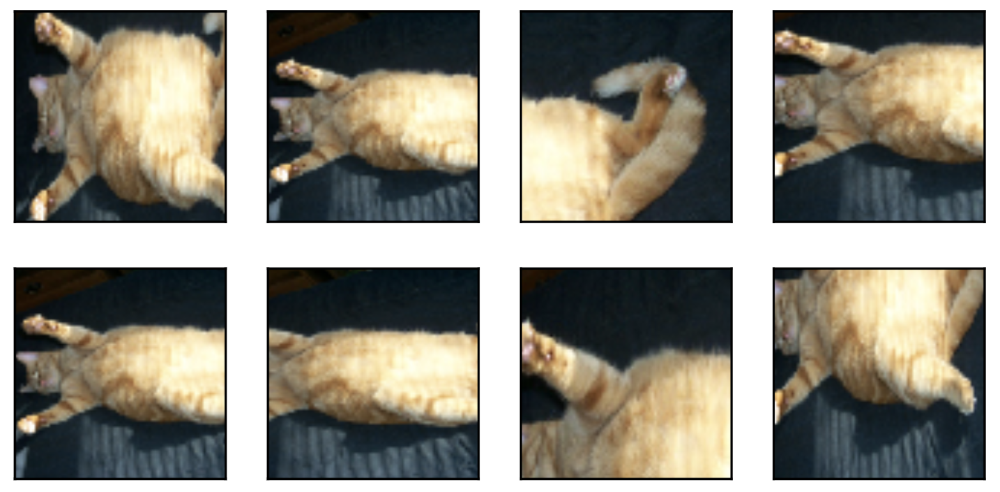
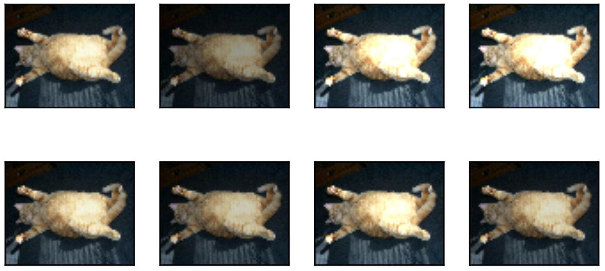
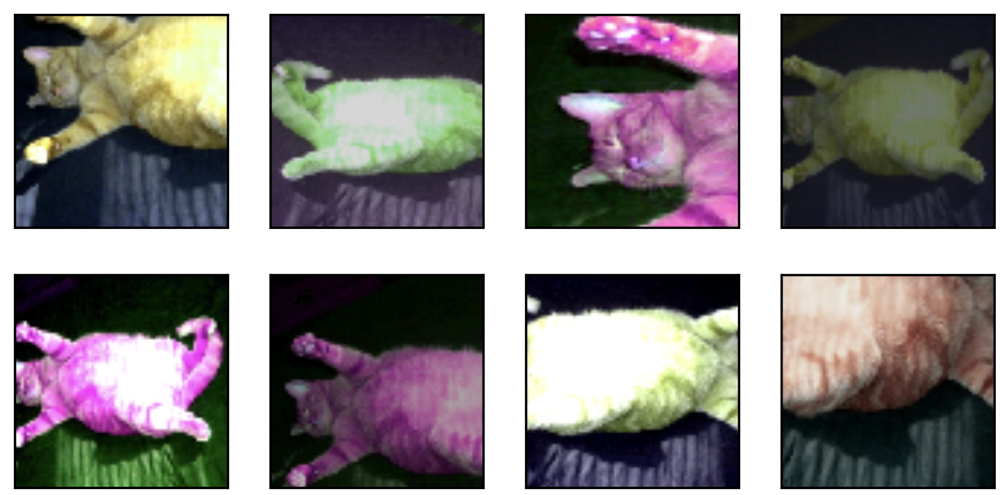
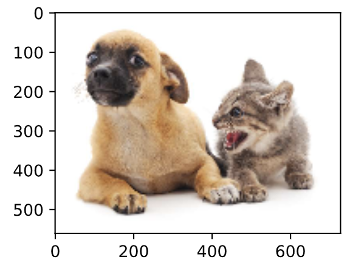
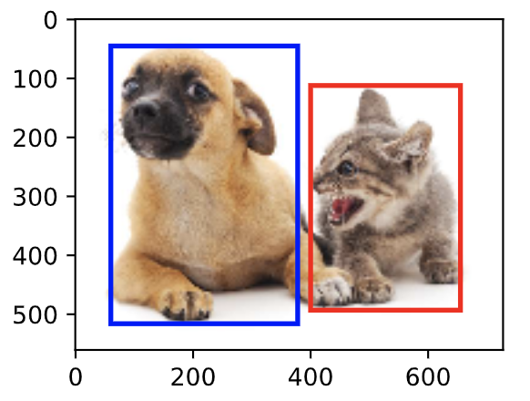

# 深度学习简介

# 预备知识

# 深度学习基础

# 深度学习计算

# 卷积神经网络

# 循环神经网络

# 优化算法

# 计算性能

# 计算机视觉

##  图像增广

在5.6节（深度卷积神经网络）里我们提到过，大规模数据集是成功应用深度神经网络的前提。图像增广（image augmentation）技术通过对训练图像做一系列随机改变，来产生相似但又不同的训练样本，从而扩大训练数据集的规模。图像增广的另一种解释是，随机改变训练样本可以降低模型对某些属性的依赖，从而提高模型的泛化能力。例如，我们可以对图像进行不同方式的裁剪，使感兴趣的物体出现在不同位置，从而减轻模型对物体出现位置的依赖性。我们也可以调整亮度、色彩等因素来降低模型对色彩的敏感度。可以说，在当年AlexNet的成功中，图像增广技术功不可没。本节我们将讨论这个在计算机视觉里被广泛使用的技术。

首先，导入实验所需的包或模块。

``` python
%matplotlib inline
import time
import torch
from torch import nn, optim
from torch.utils.data import Dataset, DataLoader
import torchvision
from PIL import Image

import sys
sys.path.append("..") 
import d2lzh_pytorch as d2l
device = torch.device('cuda' if torch.cuda.is_available() else 'cpu')
```

###  常用的图像增广方法

我们来读取一张形状为$400\times 500$（高和宽分别为400像素和500像素）的图像作为实验的样例。

``` python
d2l.set_figsize()
img = Image.open('../img/cat1.jpg')
d2l.plt.imshow(img)
```

下面定义绘图函数**show_images**。

``` python
# 本函数已保存在d2lzh_pytorch包中方便以后使用
def show_images(imgs, num_rows, num_cols, scale=2):
    figsize = (num_cols * scale, num_rows * scale)
    _, axes = d2l.plt.subplots(num_rows, num_cols, figsize=figsize)
    for i in range(num_rows):
        for j in range(num_cols):
            axes[i][j].imshow(imgs[i * num_cols + j])
            axes[i][j].axes.get_xaxis().set_visible(False)
            axes[i][j].axes.get_yaxis().set_visible(False)
    return axes
```

大部分图像增广方法都有一定的随机性。为了方便观察图像增广的效果，接下来我们定义一个辅助函数**apply**。这个函数对输入图像**img**多次运行图像增广方法**aug**并展示所有的结果。

``` python
def apply(img, aug, num_rows=2, num_cols=4, scale=1.5):
    Y = [aug(img) for _ in range(num_rows * num_cols)]
    show_images(Y, num_rows, num_cols, scale)
```


####  翻转和裁剪

左右翻转图像通常不改变物体的类别。它是最早也是最广泛使用的一种图像增广方法。下面我们通过**torchvision.transforms**模块创建**RandomHorizontalFlip**实例来实现一半概率的图像水平（左右）翻转。

``` python
apply(img, torchvision.transforms.RandomHorizontalFlip())
```


上下翻转不如左右翻转通用。但是至少对于样例图像，上下翻转不会造成识别障碍。下面我们创建**RandomVerticalFlip**实例来实现一半概率的图像垂直（上下）翻转。

``` python
apply(img, torchvision.transforms.RandomVerticalFlip())
```


在我们使用的样例图像里，猫在图像正中间，但一般情况下可能不是这样。在5.4节（池化层）里我们解释了池化层能降低卷积层对目标位置的敏感度。除此之外，我们还可以通过对图像随机裁剪来让物体以不同的比例出现在图像的不同位置，这同样能够降低模型对目标位置的敏感性。

在下面的代码里，我们每次随机裁剪出一块面积为原面积$10\% \sim 100\%$的区域，且该区域的宽和高之比随机取自$0.5 \sim 2$，然后再将该区域的宽和高分别缩放到200像素。若无特殊说明，本节中$a$和$b$之间的随机数指的是从区间$[a,b]$中随机均匀采样所得到的连续值。

``` python
shape_aug = torchvision.transforms.RandomResizedCrop(200, scale=(0.1, 1), ratio=(0.5, 2))
apply(img, shape_aug)
```




####  变化颜色

另一类增广方法是变化颜色。我们可以从4个方面改变图像的颜色：亮度（**brightness**）、对比度（**contrast**）、饱和度（**saturation**）和色调（**hue**）。在下面的例子里，我们将图像的亮度随机变化为原图亮度的$50\%$（$1-0.5$）$\sim 150\%$（$1+0.5$）。

``` python
apply(img, torchvision.transforms.ColorJitter(brightness=0.5))
```



我们也可以随机变化图像的色调。
``` python
apply(img, torchvision.transforms.ColorJitter(hue=0.5))
```


类似地，我们也可以随机变化图像的对比度。
``` python
apply(img, torchvision.transforms.ColorJitter(contrast=0.5))
```


我们也可以同时设置如何随机变化图像的亮度（**brightness**）、对比度（**contrast**）、饱和度（**saturation**）和色调（**hue**）。

``` python
color_aug = torchvision.transforms.ColorJitter(
    brightness=0.5, contrast=0.5, saturation=0.5, hue=0.5)
apply(img, color_aug)
```


####  叠加多个图像增广方法

实际应用中我们会将多个图像增广方法叠加使用。我们可以通过**Compose**实例将上面定义的多个图像增广方法叠加起来，再应用到每张图像之上。

``` python
augs = torchvision.transforms.Compose([
    torchvision.transforms.RandomHorizontalFlip(), color_aug, shape_aug])
apply(img, augs)
```




###  使用图像增广训练模型

下面我们来看一个将图像增广应用在实际训练中的例子。这里我们使用CIFAR-10数据集，而不是之前我们一直使用的Fashion-MNIST数据集。这是因为Fashion-MNIST数据集中物体的位置和尺寸都已经经过归一化处理，而CIFAR-10数据集中物体的颜色和大小区别更加显著。下面展示了CIFAR-10数据集中前32张训练图像。

``` python
all_imges = torchvision.datasets.CIFAR10(train=True, root="~/Datasets/CIFAR", download=True)
# all_imges的每一个元素都是(image, label)
show_images([all_imges[i][0] for i in range(32)], 4, 8, scale=0.8);
```


**为了在预测时得到确定的结果，我们通常只将图像增广应用在训练样本上，而不在预测时使用含随机操作的图像增广**。在这里我们只使用最简单的随机左右翻转。此外，我们使用**ToTensor**将小批量图像转成PyTorch需要的格式，即形状为(批量大小, 通道数, 高, 宽)、值域在0到1之间且类型为32位浮点数。

``` python
flip_aug = torchvision.transforms.Compose([
     torchvision.transforms.RandomHorizontalFlip(),
     torchvision.transforms.ToTensor()])

no_aug = torchvision.transforms.Compose([
     torchvision.transforms.ToTensor()])
```

接下来我们定义一个辅助函数来方便读取图像并应用图像增广。有关**DataLoader**的详细介绍，可参考更早的3.5节图像分类数据集(Fashion-MNIST)。

``` python
num_workers = 0 if sys.platform.startswith('win32') else 4
def load_cifar10(is_train, augs, batch_size, root="~/Datasets/CIFAR"):
    dataset = torchvision.datasets.CIFAR10(root=root, train=is_train, transform=augs, download=True)
    return DataLoader(dataset, batch_size=batch_size, shuffle=is_train, num_workers=num_workers)
```

####  使用图像增广训练模型

> 原书本节使用的多GPU, 由于我这里卡比较紧张就不使用多GPU了...关于PyTorch多GPU的使用可参考8.4节。

我们在CIFAR-10数据集上训练5.11节（残差网络）中介绍的ResNet-18模型。

我们先定义**train**函数使用GPU训练并评价模型。

``` python
# 本函数已保存在d2lzh_pytorch包中方便以后使用
def train(train_iter, test_iter, net, loss, optimizer, device, num_epochs):
    net = net.to(device)
    print("training on ", device)
    batch_count = 0
    for epoch in range(num_epochs):
        train_l_sum, train_acc_sum, n, start = 0.0, 0.0, 0, time.time()
        for X, y in train_iter:
            X = X.to(device)
            y = y.to(device)
            y_hat = net(X)
            l = loss(y_hat, y)
            optimizer.zero_grad()
            l.backward()
            optimizer.step()
            train_l_sum += l.cpu().item()
            train_acc_sum += (y_hat.argmax(dim=1) == y).sum().cpu().item()
            n += y.shape[0]
            batch_count += 1
        test_acc = d2l.evaluate_accuracy(test_iter, net)
        print('epoch %d, loss %.4f, train acc %.3f, test acc %.3f, time %.1f sec'
              % (epoch + 1, train_l_sum / batch_count, train_acc_sum / n, test_acc, time.time() - start))
```

然后就可以定义**train_with_data_aug**函数使用图像增广来训练模型了。该函数使用Adam算法作为训练使用的优化算法，然后将图像增广应用于训练数据集之上，最后调用刚才定义的**train**函数训练并评价模型。

``` python
def train_with_data_aug(train_augs, test_augs, lr=0.001):
    batch_size, net = 256, d2l.resnet18(10)
    optimizer = torch.optim.Adam(net.parameters(), lr=lr)
    loss = torch.nn.CrossEntropyLoss()
    train_iter = load_cifar10(True, train_augs, batch_size)
    test_iter = load_cifar10(False, test_augs, batch_size)
    train(train_iter, test_iter, net, loss, optimizer, device, num_epochs=10)
```

下面使用随机左右翻转的图像增广来训练模型。

``` python
train_with_data_aug(flip_aug, no_aug)
```
输出：
```
training on  cuda
epoch 1, loss 1.3615, train acc 0.505, test acc 0.493, time 123.2 sec
epoch 2, loss 0.5003, train acc 0.645, test acc 0.620, time 123.0 sec
epoch 3, loss 0.2811, train acc 0.703, test acc 0.616, time 123.1 sec
epoch 4, loss 0.1890, train acc 0.735, test acc 0.686, time 123.0 sec
epoch 5, loss 0.1346, train acc 0.765, test acc 0.671, time 123.1 sec
epoch 6, loss 0.1029, train acc 0.787, test acc 0.674, time 123.1 sec
epoch 7, loss 0.0803, train acc 0.804, test acc 0.749, time 123.1 sec
epoch 8, loss 0.0644, train acc 0.822, test acc 0.717, time 123.1 sec
epoch 9, loss 0.0526, train acc 0.836, test acc 0.750, time 123.0 sec
epoch 10, loss 0.0433, train acc 0.851, test acc 0.754, time 123.1 sec
```

**小结**

* 图像增广基于现有训练数据生成随机图像从而应对过拟合。
* 为了在预测时得到确定的结果，通常只将图像增广应用在训练样本上，而不在预测时使用含随机操作的图像增广。
* 可以从torchvision的**transforms**模块中获取有关图片增广的类。


-----------
> 注：本节与原书有一些不同，[原书传送门](https://zh.d2l.ai/chapter_computer-vision/image-augmentation.html)

##  微调

在前面的一些章节中，我们介绍了如何在只有6万张图像的Fashion-MNIST训练数据集上训练模型。我们还描述了学术界当下使用最广泛的大规模图像数据集ImageNet，它有超过1,000万的图像和1,000类的物体。然而，我们平常接触到数据集的规模通常在这两者之间。

假设我们想从图像中识别出不同种类的椅子，然后将购买链接推荐给用户。一种可能的方法是先找出100种常见的椅子，为每种椅子拍摄1,000张不同角度的图像，然后在收集到的图像数据集上训练一个分类模型。这个椅子数据集虽然可能比Fashion-MNIST数据集要庞大，但样本数仍然不及ImageNet数据集中样本数的十分之一。这可能会导致适用于ImageNet数据集的复杂模型在这个椅子数据集上过拟合。同时，因为数据量有限，最终训练得到的模型的精度也可能达不到实用的要求。

为了应对上述问题，一个显而易见的解决办法是收集更多的数据。然而，收集和标注数据会花费大量的时间和资金。例如，为了收集ImageNet数据集，研究人员花费了数百万美元的研究经费。虽然目前的数据采集成本已降低了不少，但其成本仍然不可忽略。

另外一种解决办法是应用迁移学习（transfer learning），将从源数据集学到的知识迁移到目标数据集上。例如，虽然ImageNet数据集的图像大多跟椅子无关，但在该数据集上训练的模型可以抽取较通用的图像特征，从而能够帮助识别边缘、纹理、形状和物体组成等。这些类似的特征对于识别椅子也可能同样有效。

本节我们介绍迁移学习中的一种常用技术：微调（fine tuning）。如图9.1所示，微调由以下4步构成。

1. 在源数据集（如ImageNet数据集）上预训练一个神经网络模型，即源模型。
2. 创建一个新的神经网络模型，即目标模型。它复制了源模型上除了输出层外的所有模型设计及其参数。我们假设这些模型参数包含了源数据集上学习到的知识，且这些知识同样适用于目标数据集。我们还假设源模型的输出层跟源数据集的标签紧密相关，因此在目标模型中不予采用。
3. 为目标模型添加一个输出大小为目标数据集类别个数的输出层，并随机初始化该层的模型参数。
4. 在目标数据集（如椅子数据集）上训练目标模型。我们将从头训练输出层，而其余层的参数都是基于源模型的参数微调得到的。


<div align=center>图9.1 微调</div>

当目标数据集远小于源数据集时，微调有助于提升模型的泛化能力。

###  热狗识别

接下来我们来实践一个具体的例子：热狗识别。我们将基于一个小数据集对在ImageNet数据集上训练好的ResNet模型进行微调。该小数据集含有数千张包含热狗和不包含热狗的图像。我们将使用微调得到的模型来识别一张图像中是否包含热狗。

首先，导入实验所需的包或模块。torchvision的[**models**](https://pytorch.org/docs/stable/torchvision/models.html)包提供了常用的预训练模型。如果希望获取更多的预训练模型，可以使用使用[**pretrained-models.pytorch**](https://github.com/Cadene/pretrained-models.pytorch)仓库。

``` python
%matplotlib inline
import torch
from torch import nn, optim
from torch.utils.data import Dataset, DataLoader
import torchvision
from torchvision.datasets import ImageFolder
from torchvision import transforms
from torchvision import models
import os

import sys
sys.path.append("..") 
import d2lzh_pytorch as d2l

device = torch.device('cuda' if torch.cuda.is_available() else 'cpu')
```

####  获取数据集

我们使用的热狗数据集（[点击下载](https://apache-mxnet.s3-accelerate.amazonaws.com/gluon/dataset/hotdog.zip)）是从网上抓取的，它含有1400张包含热狗的正类图像，和同样多包含其他食品的负类图像。各类的1000张图像被用于训练，其余则用于测试。

我们首先将压缩后的数据集下载到路径**data_dir**之下，然后在该路径将下载好的数据集解压，得到两个文件夹**hotdog/train**和**hotdog/test**。这两个文件夹下面均有**hotdog**和**not-hotdog**两个类别文件夹，每个类别文件夹里面是图像文件。

``` python
data_dir = '/S1/CSCL/tangss/Datasets'
os.listdir(os.path.join(data_dir, "hotdog")) # ['train', 'test']
```

我们创建两个**ImageFolder**实例来分别读取训练数据集和测试数据集中的所有图像文件。

``` python
train_imgs = ImageFolder(os.path.join(data_dir, 'hotdog/train'))
test_imgs = ImageFolder(os.path.join(data_dir, 'hotdog/test'))
```

下面画出前8张正类图像和最后8张负类图像。可以看到，它们的大小和高宽比各不相同。

``` python
hotdogs = [train_imgs[i][0] for i in range(8)]
not_hotdogs = [train_imgs[-i - 1][0] for i in range(8)]
d2l.show_images(hotdogs + not_hotdogs, 2, 8, scale=1.4);
```


在训练时，我们先从图像中裁剪出随机大小和随机高宽比的一块随机区域，然后将该区域缩放为高和宽均为224像素的输入。测试时，我们将图像的高和宽均缩放为256像素，然后从中裁剪出高和宽均为224像素的中心区域作为输入。此外，我们对RGB（红、绿、蓝）三个颜色通道的数值做标准化：每个数值减去该通道所有数值的平均值，再除以该通道所有数值的标准差作为输出。
> 注: 在使用预训练模型时，一定要和预训练时作同样的预处理。
如果你使用的是**torchvision**的**models**，那就要求:
    All pre-trained models expect input images normalized in the same way, i.e. mini-batches of 3-channel RGB images of shape (3 x H x W), where H and W are expected to be at least 224. The images have to be loaded in to a range of [0, 1] and then normalized using mean = [0.485, 0.456, 0.406] and std = [0.229, 0.224, 0.225].
如果你使用的是[**pretrained-models.pytorch**](https://github.com/Cadene/pretrained-models.pytorch)仓库，请**务必**阅读其README，其中说明了如何预处理。

``` python
# 指定RGB三个通道的均值和方差来将图像通道归一化
normalize = transforms.Normalize(mean=[0.485, 0.456, 0.406], std=[0.229, 0.224, 0.225])
train_augs = transforms.Compose([
        transforms.RandomResizedCrop(size=224),
        transforms.RandomHorizontalFlip(),
        transforms.ToTensor(),
        normalize
    ])

test_augs = transforms.Compose([
        transforms.Resize(size=256),
        transforms.CenterCrop(size=224),
        transforms.ToTensor(),
        normalize
    ])
```

####  定义和初始化模型

我们使用在ImageNet数据集上预训练的ResNet-18作为源模型。这里指定**pretrained=True**来自动下载并加载预训练的模型参数。在第一次使用时需要联网下载模型参数。
``` python
pretrained_net = models.resnet18(pretrained=True)
```
> 不管你是使用的torchvision的**models**还是[**pretrained-models.pytorch**](https://github.com/Cadene/pretrained-models.pytorch)仓库，默认都会将预训练好的模型参数下载到你的home目录下**.torch**文件夹。你可以通过修改环境变量**$TORCH_MODEL_ZOO**来更改下载目录:
    ```
    export TORCH_MODEL_ZOO="/local/pretrainedmodels
    ```
另外我比较常使用的方法是，在其源码中找到下载地址直接浏览器输入地址下载，下载好后将其放到环境变量**$TORCH_MODEL_ZOO**所指文件夹即可，这样比较快。

下面打印源模型的成员变量**fc**。作为一个全连接层，它将ResNet最终的全局平均池化层输出变换成ImageNet数据集上1000类的输出。

``` python
print(pretrained_net.fc)
```
输出：
```
Linear(in_features=512, out_features=1000, bias=True)
```
> 注: 如果你使用的是其他模型，那可能没有成员变量**fc**（比如models中的VGG预训练模型），所以正确做法是查看对应模型源码中其定义部分，这样既不会出错也能加深我们对模型的理解。[**pretrained-models.pytorch**](https://github.com/Cadene/pretrained-models.pytorch)仓库貌似统一了接口，但是我还是建议使用时查看一下对应模型的源码。

可见此时**pretrained_net**最后的输出个数等于目标数据集的类别数1000。所以我们应该将最后的**fc**成修改我们需要的输出类别数:
```
pretrained_net.fc = nn.Linear(512, 2)
print(pretrained_net.fc)
```
输出：
```
Linear(in_features=512, out_features=2, bias=True)
```
此时，**pretrained_net**的**fc**层就被随机初始化了，但是其他层依然保存着预训练得到的参数。由于是在很大的ImageNet数据集上预训练的，所以参数已经足够好，因此一般只需使用较小的学习率来微调这些参数，而**fc**中的随机初始化参数一般需要更大的学习率从头训练。PyTorch可以方便的对模型的不同部分设置不同的学习参数，我们在下面代码中将**fc**的学习率设为已经预训练过的部分的10倍。

``` python
output_params = list(map(id, pretrained_net.fc.parameters()))
feature_params = filter(lambda p: id(p) not in output_params, pretrained_net.parameters())

lr = 0.01
optimizer = optim.SGD([{'params': feature_params},
                       {'params': pretrained_net.fc.parameters(), 'lr': lr * 10}],
                       lr=lr, weight_decay=0.001)
```

####  微调模型

我们先定义一个使用微调的训练函数**train_fine_tuning**以便多次调用。

``` python
def train_fine_tuning(net, optimizer, batch_size=128, num_epochs=5):
    train_iter = DataLoader(ImageFolder(os.path.join(data_dir, 'hotdog/train'), transform=train_augs),
                            batch_size, shuffle=True)
    test_iter = DataLoader(ImageFolder(os.path.join(data_dir, 'hotdog/test'), transform=test_augs),
                           batch_size)
    loss = torch.nn.CrossEntropyLoss()
    d2l.train(train_iter, test_iter, net, loss, optimizer, device, num_epochs)
```

根据前面的设置，我们将以10倍的学习率从头训练目标模型的输出层参数。

``` python
train_fine_tuning(pretrained_net, optimizer)
```
输出：
```
training on  cuda
epoch 1, loss 3.1183, train acc 0.731, test acc 0.932, time 41.4 sec
epoch 2, loss 0.6471, train acc 0.829, test acc 0.869, time 25.6 sec
epoch 3, loss 0.0964, train acc 0.920, test acc 0.910, time 24.9 sec
epoch 4, loss 0.0659, train acc 0.922, test acc 0.936, time 25.2 sec
epoch 5, loss 0.0668, train acc 0.913, test acc 0.929, time 25.0 sec
```

作为对比，我们定义一个相同的模型，但将它的所有模型参数都初始化为随机值。由于整个模型都需要从头训练，我们可以使用较大的学习率。

``` python
scratch_net = models.resnet18(pretrained=False, num_classes=2)
lr = 0.1
optimizer = optim.SGD(scratch_net.parameters(), lr=lr, weight_decay=0.001)
train_fine_tuning(scratch_net, optimizer)
```
输出：
```
training on  cuda
epoch 1, loss 2.6686, train acc 0.582, test acc 0.556, time 25.3 sec
epoch 2, loss 0.2434, train acc 0.797, test acc 0.776, time 25.3 sec
epoch 3, loss 0.1251, train acc 0.845, test acc 0.802, time 24.9 sec
epoch 4, loss 0.0958, train acc 0.833, test acc 0.810, time 25.0 sec
epoch 5, loss 0.0757, train acc 0.836, test acc 0.780, time 24.9 sec
```

可以看到，微调的模型因为参数初始值更好，往往在相同迭代周期下取得更高的精度。

**小结**


* 迁移学习将从源数据集学到的知识迁移到目标数据集上。微调是迁移学习的一种常用技术。
* 目标模型复制了源模型上除了输出层外的所有模型设计及其参数，并基于目标数据集微调这些参数。而目标模型的输出层需要从头训练。
* 一般来说，微调参数会使用较小的学习率，而从头训练输出层可以使用较大的学习率。


-----------
> 注：除代码外本节与原书基本相同，[原书传送门](https://zh.d2l.ai/chapter_computer-vision/fine-tuning.html)

##  目标检测和边界框

在前面的一些章节中，我们介绍了诸多用于图像分类的模型。在图像分类任务里，我们假设图像里只有一个主体目标，并关注如何识别该目标的类别。然而，很多时候图像里有多个我们感兴趣的目标，我们不仅想知道它们的类别，还想得到它们在图像中的具体位置。在计算机视觉里，我们将这类任务称为目标检测（object detection）或物体检测。

目标检测在多个领域中被广泛使用。例如，在无人驾驶里，我们需要通过识别拍摄到的视频图像里的车辆、行人、道路和障碍的位置来规划行进线路。机器人也常通过该任务来检测感兴趣的目标。安防领域则需要检测异常目标，如歹徒或者炸弹。

在接下来的几节里，我们将介绍目标检测里的多个深度学习模型。在此之前，让我们来了解目标位置这个概念。先导入实验所需的包或模块。

``` python
%matplotlib inline
from PIL import Image

import sys
sys.path.append("..") 
import d2lzh_pytorch as d2l
```

下面加载本节将使用的示例图像。可以看到图像左边是一只狗，右边是一只猫。它们是这张图像里的两个主要目标。

``` python
d2l.set_figsize()
img = Image.open('../img/catdog.jpg')
d2l.plt.imshow(img);  # 加分号只显示图
```


###  边界框

在目标检测里，我们通常使用边界框（bounding box）来描述目标位置。边界框是一个矩形框，可以由矩形左上角的$x$和$y$轴坐标与右下角的$x$和$y$轴坐标确定。我们根据上面的图的坐标信息来定义图中狗和猫的边界框。图中的坐标原点在图像的左上角，原点往右和往下分别为$x$轴和$y$轴的正方向。

``` python
# bbox是bounding box的缩写
dog_bbox, cat_bbox = [60, 45, 378, 516], [400, 112, 655, 493]
```

我们可以在图中将边界框画出来，以检查其是否准确。画之前，我们定义一个辅助函数**bbox_to_rect**。它将边界框表示成matplotlib的边界框格式。

``` python
def bbox_to_rect(bbox, color):  # 本函数已保存在d2lzh_pytorch中方便以后使用
    # 将边界框(左上x, 左上y, 右下x, 右下y)格式转换成matplotlib格式：
    # ((左上x, 左上y), 宽, 高)
    return d2l.plt.Rectangle(
        xy=(bbox[0], bbox[1]), width=bbox[2]-bbox[0], height=bbox[3]-bbox[1],
        fill=False, edgecolor=color, linewidth=2)
```

我们将边界框加载在图像上，可以看到目标的主要轮廓基本在框内。

``` python
fig = d2l.plt.imshow(img)
fig.axes.add_patch(bbox_to_rect(dog_bbox, 'blue'))
fig.axes.add_patch(bbox_to_rect(cat_bbox, 'red'));
```
输出：



**小结**

* 在目标检测里不仅需要找出图像里面所有感兴趣的目标，而且要知道它们的位置。位置一般由矩形边界框来表示。


-----------
> 注：除代码外本节与原书基本相同，[原书传送门](https://zh.d2l.ai/chapter_computer-vision/bounding-box.html)
>


## 锚框

目标检测算法通常会在输入图像中采样大量的区域，然后判断这些区域中是否包含我们感兴趣的目标，并调整区域边缘从而更准确地预测目标的真实边界框（ground-truth bounding box）。不同的模型使用的区域采样方法可能不同。这里我们介绍其中的一种方法：它以每个像素为中心生成多个大小和宽高比（aspect ratio）不同的边界框。这些边界框被称为锚框（anchor box）。我们将在后面基于锚框实践目标检测。

> 注: 建议想学习用PyTorch做检测的童鞋阅读一下仓库[a-PyTorch-Tutorial-to-Object-Detection](https://github.com/sgrvinod/a-PyTorch-Tutorial-to-Object-Detection)。

先导入一下相关包。

``` python
%matplotlib inline
from PIL import Image
import numpy as np
import math
import torch

import sys
sys.path.append("..") 
import d2lzh_pytorch as d2l
print(torch.__version__) # 1.2.0
```

###  生成多个锚框

假设输入图像高为$h$，宽为$w$。我们分别以图像的每个像素为中心生成不同形状的锚框。设大小为$s\in (0,1]$且宽高比为$r > 0$，那么锚框的宽和高将分别为$ws\sqrt{r}$和$hs/\sqrt{r}$。当中心位置给定时，已知宽和高的锚框是确定的。

下面我们分别设定好一组大小$s_1,\ldots,s_n$和一组宽高比$r_1,\ldots,r_m$。如果以每个像素为中心时使用所有的大小与宽高比的组合，输入图像将一共得到$whnm$个锚框。虽然这些锚框可能覆盖了所有的真实边界框，但计算复杂度容易过高。因此，我们通常只对包含$s_1$或$r_1$的大小与宽高比的组合感兴趣，即

$$(s_1, r_1), (s_1, r_2), \ldots, (s_1, r_m), (s_2, r_1), (s_3, r_1), \ldots, (s_n, r_1).$$

也就是说，以相同像素为中心的锚框的数量为$n+m-1$。对于整个输入图像，我们将一共生成$wh(n+m-1)$个锚框。

以上生成锚框的方法实现在下面的**MultiBoxPrior**函数中。指定输入、一组大小和一组宽高比，该函数将返回输入的所有锚框。

> 注: PyTorch官方在[torchvision.models.detection.rpn](https://github.com/pytorch/vision/blob/master/torchvision/models/detection/rpn.py)里有一个AnchorGenerator类可以用来生成anchor，但是和这里讲的不一样，感兴趣的可以去看看。

``` python
d2l.set_figsize()
img = Image.open('../img/catdog.jpg')
w, h = img.size
print("w = %d, h = %d" % (w, h)) # w = 728, h = 561

# 本函数已保存在d2lzh_pytorch包中方便以后使用
def MultiBoxPrior(feature_map, sizes=[0.75, 0.5, 0.25], ratios=[1, 2, 0.5]):
    """
    # 按照「9.4.1. 生成多个锚框」所讲的实现, anchor表示成(xmin, ymin, xmax, ymax).
    https://zh.d2l.ai/chapter_computer-vision/anchor.html
    Args:
        feature_map: torch tensor, Shape: [N, C, H, W].
        sizes: List of sizes (0~1) of generated MultiBoxPriores. 
        ratios: List of aspect ratios (non-negative) of generated MultiBoxPriores. 
    Returns:
        anchors of shape (1, num_anchors, 4). 由于batch里每个都一样, 所以第一维为1
    """
    pairs = [] # pair of (size, sqrt(ration))
    for r in ratios:
        pairs.append([sizes[0], math.sqrt(r)])
    for s in sizes[1:]:
        pairs.append([s, math.sqrt(ratios[0])])
    
    pairs = np.array(pairs)
    
    ss1 = pairs[:, 0] * pairs[:, 1] # size * sqrt(ration)
    ss2 = pairs[:, 0] / pairs[:, 1] # size / sqrt(ration)
    
    base_anchors = np.stack([-ss1, -ss2, ss1, ss2], axis=1) / 2
    
    h, w = feature_map.shape[-2:]
    shifts_x = np.arange(0, w) / w
    shifts_y = np.arange(0, h) / h
    shift_x, shift_y = np.meshgrid(shifts_x, shifts_y)
    shift_x = shift_x.reshape(-1)
    shift_y = shift_y.reshape(-1)
    shifts = np.stack((shift_x, shift_y, shift_x, shift_y), axis=1)
    
    anchors = shifts.reshape((-1, 1, 4)) + base_anchors.reshape((1, -1, 4))
    
    return torch.tensor(anchors, dtype=torch.float32).view(1, -1, 4)


X = torch.Tensor(1, 3, h, w)  # 构造输入数据
Y = MultiBoxPrior(X, sizes=[0.75, 0.5, 0.25], ratios=[1, 2, 0.5])
Y.shape # torch.Size([1, 2042040, 4])
```

我们看到，返回锚框变量**y**的形状为（1，锚框个数，4）。将锚框变量**y**的形状变为（图像高，图像宽，以相同像素为中心的锚框个数，4）后，我们就可以通过指定像素位置来获取所有以该像素为中心的锚框了。下面的例子里我们访问以（250，250）为中心的第一个锚框。它有4个元素，分别是锚框左上角的$x$和$y$轴坐标和右下角的$x$和$y$轴坐标，其中$x$和$y$轴的坐标值分别已除以图像的宽和高，因此值域均为0和1之间。

``` python
boxes = Y.reshape((h, w, 5, 4))
boxes[250, 250, 0, :]# * torch.tensor([w, h, w, h], dtype=torch.float32)
```
输出：
```
tensor([-0.0316,  0.0706,  0.7184,  0.8206])
```
> 可以验证一下以上输出对不对：size和ratio分别为0.75和1, 则(归一化后的)宽高均为0.75, 所以输出是正确的（0.75 = 0.7184 + 0.0316 = 0.8206 - 0.0706）。

为了描绘图像中以某个像素为中心的所有锚框，我们先定义**show_bboxes**函数以便在图像上画出多个边界框。

``` python
# 本函数已保存在d2lzh_pytorch包中方便以后使用
def show_bboxes(axes, bboxes, labels=None, colors=None):
    def _make_list(obj, default_values=None):
        if obj is None:
            obj = default_values
        elif not isinstance(obj, (list, tuple)):
            obj = [obj]
        return obj

    labels = _make_list(labels)
    colors = _make_list(colors, ['b', 'g', 'r', 'm', 'c'])
    for i, bbox in enumerate(bboxes):
        color = colors[i % len(colors)]
        rect = d2l.bbox_to_rect(bbox.detach().cpu().numpy(), color)
        axes.add_patch(rect)
        if labels and len(labels) > i:
            text_color = 'k' if color == 'w' else 'w'
            axes.text(rect.xy[0], rect.xy[1], labels[i],
                      va='center', ha='center', fontsize=6, color=text_color,
                      bbox=dict(facecolor=color, lw=0))
```

刚刚我们看到，变量**boxes**中$x$和$y$轴的坐标值分别已除以图像的宽和高。在绘图时，我们需要恢复锚框的原始坐标值，并因此定义了变量**bbox_scale**。现在，我们可以画出图像中以(250, 250)为中心的所有锚框了。可以看到，大小为0.75且宽高比为1的锚框较好地覆盖了图像中的狗。

``` python
d2l.set_figsize()
fig = d2l.plt.imshow(img)
bbox_scale = torch.tensor([[w, h, w, h]], dtype=torch.float32)
show_bboxes(fig.axes, boxes[250, 250, :, :] * bbox_scale,
            ['s=0.75, r=1', 's=0.75, r=2', 's=0.55, r=0.5', 's=0.5, r=1', 's=0.25, r=1'])
```


###  交并比

我们刚刚提到某个锚框较好地覆盖了图像中的狗。如果该目标的真实边界框已知，这里的“较好”该如何量化呢？一种直观的方法是衡量锚框和真实边界框之间的相似度。我们知道，Jaccard系数（Jaccard index）可以衡量两个集合的相似度。给定集合$\mathcal{A}$和$\mathcal{B}$，它们的Jaccard系数即二者交集大小除以二者并集大小：

$$J(\mathcal{A},\mathcal{B}) = \frac{\left|\mathcal{A} \cap \mathcal{B}\right|}{\left| \mathcal{A} \cup \mathcal{B}\right|}.$$


实际上，我们可以把边界框内的像素区域看成是像素的集合。如此一来，我们可以用两个边界框的像素集合的Jaccard系数衡量这两个边界框的相似度。当衡量两个边界框的相似度时，我们通常将Jaccard系数称为交并比（Intersection over Union，IoU），即两个边界框相交面积与相并面积之比，如图9.2所示。交并比的取值范围在0和1之间：0表示两个边界框无重合像素，1表示两个边界框相等。


<div align=center>图9.2 交并比是两个边界框相交面积与相并面积之比</div>

下面我们对其进行实现。

``` python 
# 以下函数已保存在d2lzh_pytorch包中方便以后使用
# 参考https://github.com/sgrvinod/a-PyTorch-Tutorial-to-Object-Detection/blob/master/utils.py#L356
def compute_intersection(set_1, set_2):
    """
    计算anchor之间的交集
    Args:
        set_1: a tensor of dimensions (n1, 4), anchor表示成(xmin, ymin, xmax, ymax)
        set_2: a tensor of dimensions (n2, 4), anchor表示成(xmin, ymin, xmax, ymax)
    Returns:
        intersection of each of the boxes in set 1 with respect to each of the boxes in set 2, shape: (n1, n2)
    """
    # PyTorch auto-broadcasts singleton dimensions
    lower_bounds = torch.max(set_1[:, :2].unsqueeze(1), set_2[:, :2].unsqueeze(0))  # (n1, n2, 2)
    upper_bounds = torch.min(set_1[:, 2:].unsqueeze(1), set_2[:, 2:].unsqueeze(0))  # (n1, n2, 2)
    intersection_dims = torch.clamp(upper_bounds - lower_bounds, min=0)  # (n1, n2, 2)
    return intersection_dims[:, :, 0] * intersection_dims[:, :, 1]  # (n1, n2)


def compute_jaccard(set_1, set_2):
    """
    计算anchor之间的Jaccard系数(IoU)
    Args:
        set_1: a tensor of dimensions (n1, 4), anchor表示成(xmin, ymin, xmax, ymax)
        set_2: a tensor of dimensions (n2, 4), anchor表示成(xmin, ymin, xmax, ymax)
    Returns:
        Jaccard Overlap of each of the boxes in set 1 with respect to each of the boxes in set 2, shape: (n1, n2)
    """
    # Find intersections
    intersection = compute_intersection(set_1, set_2)  # (n1, n2)

    # Find areas of each box in both sets
    areas_set_1 = (set_1[:, 2] - set_1[:, 0]) * (set_1[:, 3] - set_1[:, 1])  # (n1)
    areas_set_2 = (set_2[:, 2] - set_2[:, 0]) * (set_2[:, 3] - set_2[:, 1])  # (n2)

    # Find the union
    # PyTorch auto-broadcasts singleton dimensions
    union = areas_set_1.unsqueeze(1) + areas_set_2.unsqueeze(0) - intersection  # (n1, n2)

    return intersection / union  # (n1, n2)
```

在本节的剩余部分，我们将使用交并比来衡量锚框与真实边界框以及锚框与锚框之间的相似度。

###  标注训练集的锚框


在训练集中，我们将每个锚框视为一个训练样本。为了训练目标检测模型，我们需要为每个锚框标注两类标签：一是锚框所含目标的类别，简称类别；二是真实边界框相对锚框的偏移量，简称偏移量（offset）。在目标检测时，我们首先生成多个锚框，然后为每个锚框预测类别以及偏移量，接着根据预测的偏移量调整锚框位置从而得到预测边界框，最后筛选需要输出的预测边界框。


我们知道，在目标检测的训练集中，每个图像已标注了真实边界框的位置以及所含目标的类别。在生成锚框之后，我们主要依据与锚框相似的真实边界框的位置和类别信息为锚框标注。那么，该如何为锚框分配与其相似的真实边界框呢？


假设图像中锚框分别为$A_1, A_2, \ldots, A_{n_a}$，真实边界框分别为$B_1, B_2, \ldots, B_{n_b}$，且$n_a \geq n_b$。定义矩阵$\boldsymbol{X} \in \mathbb{R}^{n_a \times n_b}$，其中第$i$行第$j$列的元素$x_{ij}$为锚框$A_i$与真实边界框$B_j$的交并比。
首先，我们找出矩阵$\boldsymbol{X}$中最大元素，并将该元素的行索引与列索引分别记为$i_1,j_1$。我们为锚框$A_{i_1}$分配真实边界框$B_{j_1}$。显然，锚框$A_{i_1}$和真实边界框$B_{j_1}$在所有的“锚框—真实边界框”的配对中相似度最高。接下来，将矩阵$\boldsymbol{X}$中第$i_1$行和第$j_1$列上的所有元素丢弃。找出矩阵$\boldsymbol{X}$中剩余的最大元素，并将该元素的行索引与列索引分别记为$i_2,j_2$。我们为锚框$A_{i_2}$分配真实边界框$B_{j_2}$，再将矩阵$\boldsymbol{X}$中第$i_2$行和第$j_2$列上的所有元素丢弃。此时矩阵$\boldsymbol{X}$中已有两行两列的元素被丢弃。
依此类推，直到矩阵$\boldsymbol{X}$中所有$n_b$列元素全部被丢弃。这个时候，我们已为$n_b$个锚框各分配了一个真实边界框。
接下来，我们只遍历剩余的$n_a - n_b$个锚框：给定其中的锚框$A_i$，根据矩阵$\boldsymbol{X}$的第$i$行找到与$A_i$交并比最大的真实边界框$B_j$，且只有当该交并比大于预先设定的阈值时，才为锚框$A_i$分配真实边界框$B_j$。


如图9.3（左）所示，假设矩阵$\boldsymbol{X}$中最大值为$x_{23}$，我们将为锚框$A_2$分配真实边界框$B_3$。然后，丢弃矩阵中第2行和第3列的所有元素，找出剩余阴影部分的最大元素$x_{71}$，为锚框$A_7$分配真实边界框$B_1$。接着如图9.3（中）所示，丢弃矩阵中第7行和第1列的所有元素，找出剩余阴影部分的最大元素$x_{54}$，为锚框$A_5$分配真实边界框$B_4$。最后如图9.3（右）所示，丢弃矩阵中第5行和第4列的所有元素，找出剩余阴影部分的最大元素$x_{92}$，为锚框$A_9$分配真实边界框$B_2$。之后，我们只需遍历除去$A_2, A_5, A_7, A_9$的剩余锚框，并根据阈值判断是否为剩余锚框分配真实边界框。


<div align=center>图9.3 为锚框分配真实边界框</div>

现在我们可以标注锚框的类别和偏移量了。如果一个锚框$A$被分配了真实边界框$B$，将锚框$A$的类别设为$B$的类别，并根据$B$和$A$的中心坐标的相对位置以及两个框的相对大小为锚框$A$标注偏移量。由于数据集中各个框的位置和大小各异，因此这些相对位置和相对大小通常需要一些特殊变换，才能使偏移量的分布更均匀从而更容易拟合。设锚框$A$及其被分配的真实边界框$B$的中心坐标分别为$(x_a, y_a)$和$(x_b, y_b)$，$A$和$B$的宽分别为$w_a$和$w_b$，高分别为$h_a$和$h_b$，一个常用的技巧是将$A$的偏移量标注为

$$
\left( \frac{ \frac{x_b - x_a}{w_a} - \mu_x }{\sigma_x},
\frac{ \frac{y_b - y_a}{h_a} - \mu_y }{\sigma_y},
\frac{ \log \frac{w_b}{w_a} - \mu_w }{\sigma_w},
\frac{ \log \frac{h_b}{h_a} - \mu_h }{\sigma_h}\right),
$$

其中常数的默认值为$\mu_x = \mu_y = \mu_w = \mu_h = 0, \sigma_x=\sigma_y=0.1, \sigma_w=\sigma_h=0.2$。如果一个锚框没有被分配真实边界框，我们只需将该锚框的类别设为背景。类别为背景的锚框通常被称为负类锚框，其余则被称为正类锚框。


下面演示一个具体的例子。我们为读取的图像中的猫和狗定义真实边界框，其中第一个元素为类别（0为狗，1为猫），剩余4个元素分别为左上角的$x$和$y$轴坐标以及右下角的$x$和$y$轴坐标（值域在0到1之间）。这里通过左上角和右下角的坐标构造了5个需要标注的锚框，分别记为$A_0, \ldots, A_4$（程序中索引从0开始）。先画出这些锚框与真实边界框在图像中的位置。

``` python
bbox_scale = torch.tensor((w, h, w, h), dtype=torch.float32)
ground_truth = torch.tensor([[0, 0.1, 0.08, 0.52, 0.92],
                            [1, 0.55, 0.2, 0.9, 0.88]])
anchors = torch.tensor([[0, 0.1, 0.2, 0.3], [0.15, 0.2, 0.4, 0.4],
                    [0.63, 0.05, 0.88, 0.98], [0.66, 0.45, 0.8, 0.8],
                    [0.57, 0.3, 0.92, 0.9]])

fig = d2l.plt.imshow(img)
show_bboxes(fig.axes, ground_truth[:, 1:] * bbox_scale, ['dog', 'cat'], 'k')
show_bboxes(fig.axes, anchors * bbox_scale, ['0', '1', '2', '3', '4']);
```


下面实现**MultiBoxTarget**函数来为锚框标注类别和偏移量。该函数将背景类别设为0，并令从零开始的目标类别的整数索引自加1（1为狗，2为猫）。

``` python
# 以下函数已保存在d2lzh_pytorch包中方便以后使用
def assign_anchor(bb, anchor, jaccard_threshold=0.5):
    """
    # 按照「9.4.1. 生成多个锚框」图9.3所讲为每个anchor分配真实的bb, anchor表示成归一化(xmin, ymin, xmax, ymax).
    https://zh.d2l.ai/chapter_computer-vision/anchor.html
    Args:
        bb: 真实边界框(bounding box), shape:（nb, 4）
        anchor: 待分配的anchor, shape:（na, 4）
        jaccard_threshold: 预先设定的阈值
    Returns:
        assigned_idx: shape: (na, ), 每个anchor分配的真实bb对应的索引, 若未分配任何bb则为-1
    """
    na = anchor.shape[0]
    nb = bb.shape[0]
    jaccard = compute_jaccard(anchor, bb).detach().cpu().numpy() # shape: (na, nb)
    assigned_idx = np.ones(na) * -1  # 初始全为-1
    
    # 先为每个bb分配一个anchor(不要求满足jaccard_threshold)
    jaccard_cp = jaccard.copy()
    for j in range(nb):
        i = np.argmax(jaccard_cp[:, j])
        assigned_idx[i] = j
        jaccard_cp[i, :] = float("-inf") # 赋值为负无穷, 相当于去掉这一行
     
    # 处理还未被分配的anchor, 要求满足jaccard_threshold
    for i in range(na):
        if assigned_idx[i] == -1:
            j = np.argmax(jaccard[i, :])
            if jaccard[i, j] >= jaccard_threshold:
                assigned_idx[i] = j
    
    return torch.tensor(assigned_idx, dtype=torch.long)

def xy_to_cxcy(xy):
    """
    将(x_min, y_min, x_max, y_max)形式的anchor转换成(center_x, center_y, w, h)形式的.
    https://github.com/sgrvinod/a-PyTorch-Tutorial-to-Object-Detection/blob/master/utils.py
    Args:
        xy: bounding boxes in boundary coordinates, a tensor of size (n_boxes, 4)
    Returns: 
        bounding boxes in center-size coordinates, a tensor of size (n_boxes, 4)
    """
    return torch.cat([(xy[:, 2:] + xy[:, :2]) / 2,  # c_x, c_y
                      xy[:, 2:] - xy[:, :2]], 1)  # w, h

def MultiBoxTarget(anchor, label):
    """
    # 按照「9.4.1. 生成多个锚框」所讲的实现, anchor表示成归一化(xmin, ymin, xmax, ymax).
    https://zh.d2l.ai/chapter_computer-vision/anchor.html
    Args:
        anchor: torch tensor, 输入的锚框, 一般是通过MultiBoxPrior生成, shape:（1，锚框总数，4）
        label: 真实标签, shape为(bn, 每张图片最多的真实锚框数, 5)
               第二维中，如果给定图片没有这么多锚框, 可以先用-1填充空白, 最后一维中的元素为[类别标签, 四个坐标值]
    Returns:
        列表, [bbox_offset, bbox_mask, cls_labels]
        bbox_offset: 每个锚框的标注偏移量，形状为(bn，锚框总数*4)
        bbox_mask: 形状同bbox_offset, 每个锚框的掩码, 一一对应上面的偏移量, 负类锚框(背景)对应的掩码均为0, 正类锚框的掩码均为1
        cls_labels: 每个锚框的标注类别, 其中0表示为背景, 形状为(bn，锚框总数)
    """
    assert len(anchor.shape) == 3 and len(label.shape) == 3
    bn = label.shape[0]
    
    def MultiBoxTarget_one(anc, lab, eps=1e-6):
        """
        MultiBoxTarget函数的辅助函数, 处理batch中的一个
        Args:
            anc: shape of (锚框总数, 4)
            lab: shape of (真实锚框数, 5), 5代表[类别标签, 四个坐标值]
            eps: 一个极小值, 防止log0
        Returns:
            offset: (锚框总数*4, )
            bbox_mask: (锚框总数*4, ), 0代表背景, 1代表非背景
            cls_labels: (锚框总数, 4), 0代表背景
        """
        an = anc.shape[0]
        assigned_idx = assign_anchor(lab[:, 1:], anc) # (锚框总数, )
        bbox_mask = ((assigned_idx >= 0).float().unsqueeze(-1)).repeat(1, 4) # (锚框总数, 4)

        cls_labels = torch.zeros(an, dtype=torch.long) # 0表示背景
        assigned_bb = torch.zeros((an, 4), dtype=torch.float32) # 所有anchor对应的bb坐标
        for i in range(an):
            bb_idx = assigned_idx[i]
            if bb_idx >= 0: # 即非背景
                cls_labels[i] = lab[bb_idx, 0].long().item() + 1 # 注意要加一
                assigned_bb[i, :] = lab[bb_idx, 1:]

        center_anc = xy_to_cxcy(anc) # (center_x, center_y, w, h)
        center_assigned_bb = xy_to_cxcy(assigned_bb)

        offset_xy = 10.0 * (center_assigned_bb[:, :2] - center_anc[:, :2]) / center_anc[:, 2:]
        offset_wh = 5.0 * torch.log(eps + center_assigned_bb[:, 2:] / center_anc[:, 2:])
        offset = torch.cat([offset_xy, offset_wh], dim = 1) * bbox_mask # (锚框总数, 4)

        return offset.view(-1), bbox_mask.view(-1), cls_labels
    
    batch_offset = []
    batch_mask = []
    batch_cls_labels = []
    for b in range(bn):
        offset, bbox_mask, cls_labels = MultiBoxTarget_one(anchor[0, :, :], label[b, :, :])
        
        batch_offset.append(offset)
        batch_mask.append(bbox_mask)
        batch_cls_labels.append(cls_labels)
    
    bbox_offset = torch.stack(batch_offset)
    bbox_mask = torch.stack(batch_mask)
    cls_labels = torch.stack(batch_cls_labels)
    
    return [bbox_offset, bbox_mask, cls_labels]
```

我们通过**unsqueeze**函数为锚框和真实边界框添加样本维。
``` python
labels = MultiBoxTarget(anchors.unsqueeze(dim=0),
                        ground_truth.unsqueeze(dim=0))
```

返回的结果里有3项，均为**Tensor**。第三项表示为锚框标注的类别。

``` python
labels[2] 
```
输出：
```
tensor([[0, 1, 2, 0, 2]])
```

我们根据锚框与真实边界框在图像中的位置来分析这些标注的类别。首先，在所有的“锚框—真实边界框”的配对中，锚框$A_4$与猫的真实边界框的交并比最大，因此锚框$A_4$的类别标注为猫。不考虑锚框$A_4$或猫的真实边界框，在剩余的“锚框—真实边界框”的配对中，最大交并比的配对为锚框$A_1$和狗的真实边界框，因此锚框$A_1$的类别标注为狗。接下来遍历未标注的剩余3个锚框：与锚框$A_0$交并比最大的真实边界框的类别为狗，但交并比小于阈值（默认为0.5），因此类别标注为背景；与锚框$A_2$交并比最大的真实边界框的类别为猫，且交并比大于阈值，因此类别标注为猫；与锚框$A_3$交并比最大的真实边界框的类别为猫，但交并比小于阈值，因此类别标注为背景。


返回值的第二项为掩码（mask）变量，形状为(批量大小, 锚框个数的四倍)。掩码变量中的元素与每个锚框的4个偏移量一一对应。
由于我们不关心对背景的检测，有关负类的偏移量不应影响目标函数。通过按元素乘法，掩码变量中的0可以在计算目标函数之前过滤掉负类的偏移量。

``` python
labels[1]
```
输出：
```
tensor([[0., 0., 0., 0., 1., 1., 1., 1., 1., 1., 1., 1., 0., 0., 0., 0., 1., 1.,
         1., 1.]])
```

返回的第一项是为每个锚框标注的四个偏移量，其中负类锚框的偏移量标注为0。

``` python
labels[0]
```
输出：
```
tensor([[-0.0000e+00, -0.0000e+00, -0.0000e+00, -0.0000e+00,  1.4000e+00,
          1.0000e+01,  2.5940e+00,  7.1754e+00, -1.2000e+00,  2.6882e-01,
          1.6824e+00, -1.5655e+00, -0.0000e+00, -0.0000e+00, -0.0000e+00,
         -0.0000e+00, -5.7143e-01, -1.0000e+00,  4.1723e-06,  6.2582e-01]])
```

###  输出预测边界框

在模型预测阶段，我们先为图像生成多个锚框，并为这些锚框一一预测类别和偏移量。随后，我们根据锚框及其预测偏移量得到预测边界框。当锚框数量较多时，同一个目标上可能会输出较多相似的预测边界框。为了使结果更加简洁，我们可以移除相似的预测边界框。常用的方法叫作非极大值抑制（non-maximum suppression，NMS）。

我们来描述一下非极大值抑制的工作原理。对于一个预测边界框$B$，模型会计算各个类别的预测概率。设其中最大的预测概率为$p$，该概率所对应的类别即$B$的预测类别。我们也将$p$称为预测边界框$B$的置信度。在同一图像上，我们将预测类别非背景的预测边界框按置信度从高到低排序，得到列表$L$。从$L$中选取置信度最高的预测边界框$B_1$作为基准，将所有与$B_1$的交并比大于某阈值的非基准预测边界框从$L$中移除。这里的阈值是预先设定的超参数。此时，$L$保留了置信度最高的预测边界框并移除了与其相似的其他预测边界框。
接下来，从$L$中选取置信度第二高的预测边界框$B_2$作为基准，将所有与$B_2$的交并比大于某阈值的非基准预测边界框从$L$中移除。重复这一过程，直到$L$中所有的预测边界框都曾作为基准。此时$L$中任意一对预测边界框的交并比都小于阈值。最终，输出列表$L$中的所有预测边界框。

下面来看一个具体的例子。先构造4个锚框。简单起见，我们假设预测偏移量全是0：预测边界框即锚框。最后，我们构造每个类别的预测概率。

``` python
anchors = torch.tensor([[0.1, 0.08, 0.52, 0.92], [0.08, 0.2, 0.56, 0.95],
                        [0.15, 0.3, 0.62, 0.91], [0.55, 0.2, 0.9, 0.88]])
offset_preds = torch.tensor([0.0] * (4 * len(anchors)))
cls_probs = torch.tensor([[0., 0., 0., 0.,],  # 背景的预测概率
                          [0.9, 0.8, 0.7, 0.1],  # 狗的预测概率
                          [0.1, 0.2, 0.3, 0.9]])  # 猫的预测概率
```

在图像上打印预测边界框和它们的置信度。

``` python
fig = d2l.plt.imshow(img)
show_bboxes(fig.axes, anchors * bbox_scale,
            ['dog=0.9', 'dog=0.8', 'dog=0.7', 'cat=0.9'])
```


下面我们实现**MultiBoxDetection**函数来执行非极大值抑制。

``` python
# 以下函数已保存在d2lzh_pytorch包中方便以后使用
from collections import namedtuple
Pred_BB_Info = namedtuple("Pred_BB_Info", ["index", "class_id", "confidence", "xyxy"])

def non_max_suppression(bb_info_list, nms_threshold = 0.5):
    """
    非极大抑制处理预测的边界框
    Args:
        bb_info_list: Pred_BB_Info的列表, 包含预测类别、置信度等信息
        nms_threshold: 阈值
    Returns:
        output: Pred_BB_Info的列表, 只保留过滤后的边界框信息
    """
    output = []
    # 先根据置信度从高到低排序
    sorted_bb_info_list = sorted(bb_info_list, key = lambda x: x.confidence, reverse=True)

    while len(sorted_bb_info_list) != 0:
        best = sorted_bb_info_list.pop(0)
        output.append(best)
        
        if len(sorted_bb_info_list) == 0:
            break

        bb_xyxy = []
        for bb in sorted_bb_info_list:
            bb_xyxy.append(bb.xyxy)
        
        iou = compute_jaccard(torch.tensor([best.xyxy]), 
                              torch.tensor(bb_xyxy))[0] # shape: (len(sorted_bb_info_list), )
        
        n = len(sorted_bb_info_list)
        sorted_bb_info_list = [sorted_bb_info_list[i] for i in range(n) if iou[i] <= nms_threshold]
    return output

def MultiBoxDetection(cls_prob, loc_pred, anchor, nms_threshold = 0.5):
    """
    # 按照「9.4.1. 生成多个锚框」所讲的实现, anchor表示成归一化(xmin, ymin, xmax, ymax).
    https://zh.d2l.ai/chapter_computer-vision/anchor.html
    Args:
        cls_prob: 经过softmax后得到的各个锚框的预测概率, shape:(bn, 预测总类别数+1, 锚框个数)
        loc_pred: 预测的各个锚框的偏移量, shape:(bn, 锚框个数*4)
        anchor: MultiBoxPrior输出的默认锚框, shape: (1, 锚框个数, 4)
        nms_threshold: 非极大抑制中的阈值
    Returns:
        所有锚框的信息, shape: (bn, 锚框个数, 6)
        每个锚框信息由[class_id, confidence, xmin, ymin, xmax, ymax]表示
        class_id=-1 表示背景或在非极大值抑制中被移除了
    """
    assert len(cls_prob.shape) == 3 and len(loc_pred.shape) == 2 and len(anchor.shape) == 3
    bn = cls_prob.shape[0]
    
    def MultiBoxDetection_one(c_p, l_p, anc, nms_threshold = 0.5):
        """
        MultiBoxDetection的辅助函数, 处理batch中的一个
        Args:
            c_p: (预测总类别数+1, 锚框个数)
            l_p: (锚框个数*4, )
            anc: (锚框个数, 4)
            nms_threshold: 非极大抑制中的阈值
        Return:
            output: (锚框个数, 6)
        """
        pred_bb_num = c_p.shape[1]
        anc = (anc + l_p.view(pred_bb_num, 4)).detach().cpu().numpy() # 加上偏移量
        
        confidence, class_id = torch.max(c_p, 0)
        confidence = confidence.detach().cpu().numpy()
        class_id = class_id.detach().cpu().numpy()
        
        pred_bb_info = [Pred_BB_Info(
                            index = i,
                            class_id = class_id[i] - 1, # 正类label从0开始
                            confidence = confidence[i],
                            xyxy=[*anc[i]]) # xyxy是个列表
                        for i in range(pred_bb_num)]
        
        # 正类的index
        obj_bb_idx = [bb.index for bb in non_max_suppression(pred_bb_info, nms_threshold)]
        
        output = []
        for bb in pred_bb_info:
            output.append([
                (bb.class_id if bb.index in obj_bb_idx else -1.0),
                bb.confidence,
                *bb.xyxy
            ])
            
        return torch.tensor(output) # shape: (锚框个数, 6)
    
    batch_output = []
    for b in range(bn):
        batch_output.append(MultiBoxDetection_one(cls_prob[b], loc_pred[b], anchor[0], nms_threshold))
    
    return torch.stack(batch_output)
```

然后我们运行**MultiBoxDetection**函数并设阈值为0.5。这里为输入都增加了样本维。我们看到，返回的结果的形状为(批量大小, 锚框个数, 6)。其中每一行的6个元素代表同一个预测边界框的输出信息。第一个元素是索引从0开始计数的预测类别（0为狗，1为猫），其中-1表示背景或在非极大值抑制中被移除。第二个元素是预测边界框的置信度。剩余的4个元素分别是预测边界框左上角的$x$和$y$轴坐标以及右下角的$x$和$y$轴坐标（值域在0到1之间）。

``` python
output = MultiBoxDetection(
    cls_probs.unsqueeze(dim=0), offset_preds.unsqueeze(dim=0),
    anchors.unsqueeze(dim=0), nms_threshold=0.5)
output
```
输出：
```
tensor([[[ 0.0000,  0.9000,  0.1000,  0.0800,  0.5200,  0.9200],
         [-1.0000,  0.8000,  0.0800,  0.2000,  0.5600,  0.9500],
         [-1.0000,  0.7000,  0.1500,  0.3000,  0.6200,  0.9100],
         [ 1.0000,  0.9000,  0.5500,  0.2000,  0.9000,  0.8800]]])
```

我们移除掉类别为-1的预测边界框，并可视化非极大值抑制保留的结果。

``` python
fig = d2l.plt.imshow(img)
for i in output[0].detach().cpu().numpy():
    if i[0] == -1:
        continue
    label = ('dog=', 'cat=')[int(i[0])] + str(i[1])
    show_bboxes(fig.axes, [torch.tensor(i[2:]) * bbox_scale], label)
```


实践中，我们可以在执行非极大值抑制前将置信度较低的预测边界框移除，从而减小非极大值抑制的计算量。我们还可以筛选非极大值抑制的输出，例如，只保留其中置信度较高的结果作为最终输出。

**小结**

* 以每个像素为中心，生成多个大小和宽高比不同的锚框。
* 交并比是两个边界框相交面积与相并面积之比。
* 在训练集中，为每个锚框标注两类标签：一是锚框所含目标的类别；二是真实边界框相对锚框的偏移量。
* 预测时，可以使用非极大值抑制来移除相似的预测边界框，从而令结果简洁。


-----------
> 注：除代码外本节与原书基本相同，[原书传送门](http://zh.d2l.ai/chapter_computer-vision/anchor.html)
>


## 多尺度目标检测

在9.4节（锚框）中，我们在实验中以输入图像的每个像素为中心生成多个锚框。这些锚框是对输入图像不同区域的采样。然而，如果以图像每个像素为中心都生成锚框，很容易生成过多锚框而造成计算量过大。举个例子，假设输入图像的高和宽分别为561像素和728像素，如果以每个像素为中心生成5个不同形状的锚框，那么一张图像上则需要标注并预测200多万个锚框（$561 \times 728 \times 5$）。

减少锚框个数并不难。一种简单的方法是在输入图像中均匀采样一小部分像素，并以采样的像素为中心生成锚框。此外，在不同尺度下，我们可以生成不同数量和不同大小的锚框。值得注意的是，较小目标比较大目标在图像上出现位置的可能性更多。举个简单的例子：形状为$1 \times 1$、$1 \times 2$和$2 \times 2$的目标在形状为$2 \times 2$的图像上可能出现的位置分别有4、2和1种。因此，当使用较小锚框来检测较小目标时，我们可以采样较多的区域；而当使用较大锚框来检测较大目标时，我们可以采样较少的区域。

为了演示如何多尺度生成锚框，我们先读取一张图像。它的高和宽分别为561像素和728像素。

``` python
%matplotlib inline
from PIL import Image
import numpy as np
import torch

import sys
sys.path.append("..") 
import d2lzh_pytorch as d2l

img = Image.open('../../docs/img/catdog.jpg')
w, h = img.size # (728, 561)
```

我们在5.1节（二维卷积层）中将卷积神经网络的二维数组输出称为特征图。
我们可以通过定义特征图的形状来确定任一图像上均匀采样的锚框中心。

下面定义**display_anchors**函数。我们在特征图**fmap**上以每个单元（像素）为中心生成锚框**anchors**。由于锚框**anchors**中$x$和$y$轴的坐标值分别已除以特征图**fmap**的宽和高，这些值域在0和1之间的值表达了锚框在特征图中的相对位置。由于锚框**anchors**的中心遍布特征图**fmap**上的所有单元，**anchors**的中心在任一图像的空间相对位置一定是均匀分布的。具体来说，当特征图的宽和高分别设为**fmap_w**和**fmap_h**时，该函数将在任一图像上均匀采样**fmap_h**行**fmap_w**列个像素，并分别以它们为中心生成大小为**s**（假设列表**s**长度为1）的不同宽高比（**ratios**）的锚框。

``` python
d2l.set_figsize()

def display_anchors(fmap_w, fmap_h, s):
    # 前两维的取值不影响输出结果(原书这里是(1, 10, fmap_w, fmap_h), 我认为错了)
    fmap = torch.zeros((1, 10, fmap_h, fmap_w), dtype=torch.float32)
    
    # 平移所有锚框使均匀分布在图片上
    offset_x, offset_y = 1.0/fmap_w, 1.0/fmap_h
    anchors = d2l.MultiBoxPrior(fmap, sizes=s, ratios=[1, 2, 0.5]) + \
        torch.tensor([offset_x/2, offset_y/2, offset_x/2, offset_y/2])
    
    bbox_scale = torch.tensor([[w, h, w, h]], dtype=torch.float32)
    d2l.show_bboxes(d2l.plt.imshow(img).axes,
                    anchors[0] * bbox_scale)
```

我们先关注小目标的检测。为了在显示时更容易分辨，这里令不同中心的锚框不重合：设锚框大小为0.15，特征图的高和宽分别为2和4。可以看出，图像上2行4列的锚框中心分布均匀。

``` python
display_anchors(fmap_w=4, fmap_h=2, s=[0.15])
```


我们将特征图的高和宽分别减半，并用更大的锚框检测更大的目标。当锚框大小设0.4时，有些锚框的区域有重合。

``` python
display_anchors(fmap_w=2, fmap_h=1, s=[0.4])
```


最后，我们将特征图的宽进一步减半至1，并将锚框大小增至0.8。此时锚框中心即图像中心。

``` python
display_anchors(fmap_w=1, fmap_h=1, s=[0.8])
```


既然我们已在多个尺度上生成了不同大小的锚框，相应地，我们需要在不同尺度下检测不同大小的目标。下面我们来介绍一种基于卷积神经网络的方法。

在某个尺度下，假设我们依据$c_i$张形状为$h \times w$的特征图生成$h \times w$组不同中心的锚框，且每组的锚框个数为$a$。例如，在刚才实验的第一个尺度下，我们依据10（通道数）张形状为$4 \times 2$的特征图生成了8组不同中心的锚框，且每组含3个锚框。
接下来，依据真实边界框的类别和位置，每个锚框将被标注类别和偏移量。在当前的尺度下，目标检测模型需要根据输入图像预测$h \times w$组不同中心的锚框的类别和偏移量。

假设这里的$c_i$张特征图为卷积神经网络根据输入图像做前向计算所得的中间输出。既然每张特征图上都有$h \times w$个不同的空间位置，那么相同空间位置可以看作含有$c_i$个单元。
根据5.1节（二维卷积层）中感受野的定义，特征图在相同空间位置的$c_i$个单元在输入图像上的感受野相同，并表征了同一感受野内的输入图像信息。
因此，我们可以将特征图在相同空间位置的$c_i$个单元变换为以该位置为中心生成的$a$个锚框的类别和偏移量。
不难发现，本质上，我们用输入图像在某个感受野区域内的信息来预测输入图像上与该区域位置相近的锚框的类别和偏移量。

当不同层的特征图在输入图像上分别拥有不同大小的感受野时，它们将分别用来检测不同大小的目标。例如，我们可以通过设计网络，令较接近输出层的特征图中每个单元拥有更广阔的感受野，从而检测输入图像中更大尺寸的目标。

我们将在9.7节（单发多框检测（SSD））中具体实现一个多尺度目标检测的模型。

**小结**

* 可以在多个尺度下生成不同数量和不同大小的锚框，从而在多个尺度下检测不同大小的目标。
* 特征图的形状能确定任一图像上均匀采样的锚框中心。
* 用输入图像在某个感受野区域内的信息来预测输入图像上与该区域相近的锚框的类别和偏移量。


-----------
> 注：除代码外本节与原书基本相同，[原书传送门](http://zh.d2l.ai/chapter_computer-vision/multiscale-object-detection.html)


##  目标检测数据集（皮卡丘）

在目标检测领域并没有类似MNIST或Fashion-MNIST那样的小数据集。为了快速测试模型，我们合成了一个小的数据集。我们首先使用一个开源的皮卡丘3D模型生成了1000张不同角度和大小的皮卡丘图像。然后我们收集了一系列背景图像，并在每张图的随机位置放置一张随机的皮卡丘图像。该数据集使用MXNet提供的im2rec工具将图像转换成了二进制的RecordIO格式 [1]。该格式既可以降低数据集在磁盘上的存储开销，又能提高读取效率。如果想了解更多的图像读取方法，可以查阅GluonCV工具包的文档 [2]。


###  下载数据集

前面说了，皮卡丘数据集使用MXNet提供的im2rec工具将图像转换成了二进制的RecordIO格式，但是我们后续要使用PyTorch，所以我先用[脚本](https://github.com/ShusenTang/Dive-into-DL-PyTorch/blob/master/code/chapter09_computer-vision/9.6.0_prepare_pikachu.ipynb)将其转换成了PNG图片并用json文件存放对应的label信息。在继续阅读前，请务必确保运行了这个脚本，保证数据已准备好。**pikachu**文件夹下的结构应如下所示。
```
--pikachu
  --train
    --images
      --1.png
      ...
    --label.json
  --val
    --images
      --1.png
      ...
    --label.json 
```
先导入相关库。
``` python
%matplotlib inline
import os
import json
import numpy as np
import torch
import torchvision
from PIL import Image

import sys
sys.path.append("..") 
import d2lzh_pytorch as d2l

data_dir = '../../data/pikachu'

assert os.path.exists(os.path.join(data_dir, "train"))
```

###  读取数据集

我们先定义一个数据集类**PikachuDetDataset**，数据集每个样本包含**label**和**image**，其中label是一个 $m \times 5$ 的向量，即m个边界框，每个边界框由**[class, x_min, y_min, x_max, y_max]**表示，这里的皮卡丘数据集中每个图像只有一个边界框，因此m=1。**image**是一个所有元素都位于**[0.0, 1.0]**的浮点**tensor**，代表图片数据。
``` python
# 本类已保存在d2lzh_pytorch包中方便以后使用
class PikachuDetDataset(torch.utils.data.Dataset):
    """皮卡丘检测数据集类"""
    def __init__(self, data_dir, part, image_size=(256, 256)):
        assert part in ["train", "val"]
        self.image_size = image_size
        self.image_dir = os.path.join(data_dir, part, "images")
        
        with open(os.path.join(data_dir, part, "label.json")) as f:
            self.label = json.load(f)
            
        self.transform = torchvision.transforms.Compose([
            # 将 PIL 图片转换成位于[0.0, 1.0]的floatTensor, shape (C x H x W)
            torchvision.transforms.ToTensor()])
            
    def __len__(self):
        return len(self.label)
    
    def __getitem__(self, index):
        image_path = str(index + 1) + ".png"
        
        cls = self.label[image_path]["class"]
        label = np.array([cls] + self.label[image_path]["loc"], 
                         dtype="float32")[None, :]
        
        PIL_img = Image.open(os.path.join(self.image_dir, image_path)
                            ).convert('RGB').resize(self.image_size)
        img = self.transform(PIL_img)
        
        sample = {
            "label": label, # shape: (1, 5) [class, xmin, ymin, xmax, ymax]
            "image": img    # shape: (3, *image_size)
        }
        
        return sample
```

然后我们通过创建**DataLoader**实例来读取目标检测数据集。我们将以随机顺序读取训练数据集，按序读取测试数据集。
> 原书还做了数据增强: *对于训练集中的每张图像，我们将采用随机裁剪，并要求裁剪出的图像至少覆盖每个目标95%的区域。由于裁剪是随机的，这个要求不一定总被满足。我们设定最多尝试200次随机裁剪：如果都不符合要求则不裁剪图像。为保证输出结果的确定性，我们不随机裁剪测试数据集中的图像。 我们也无须按随机顺序读取测试数据集。*

``` python
# 本函数已保存在d2lzh_pytorch包中方便以后使用
def load_data_pikachu(batch_size, edge_size=256, data_dir = '../../data/pikachu'):  
    """edge_size：输出图像的宽和高"""
    image_size = (edge_size, edge_size)
    train_dataset = PikachuDetDataset(data_dir, 'train', image_size)
    val_dataset = PikachuDetDataset(data_dir, 'val', image_size)
    

    train_iter = torch.utils.data.DataLoader(train_dataset, batch_size=batch_size, 
                                             shuffle=True, num_workers=4)

    val_iter = torch.utils.data.DataLoader(val_dataset, batch_size=batch_size,
                                           shuffle=False, num_workers=4)
    return train_iter, val_iter
```

下面我们读取一个小批量并打印图像和标签的形状。图像的形状和之前实验中的一样，依然是(批量大小, 通道数, 高, 宽)。而标签的形状则是(批量大小, $m$, 5)，其中$m$等于数据集中单个图像最多含有的边界框个数。小批量计算虽然高效，但它要求每张图像含有相同数量的边界框，以便放在同一个批量中。由于每张图像含有的边界框个数可能不同，我们为边界框个数小于$m$的图像填充非法边界框，直到每张图像均含有$m$个边界框。这样，我们就可以每次读取小批量的图像了。图像中每个边界框的标签由长度为5的数组表示。数组中第一个元素是边界框所含目标的类别。当值为-1时，该边界框为填充用的非法边界框。数组的剩余4个元素分别表示边界框左上角的$x$和$y$轴坐标以及右下角的$x$和$y$轴坐标（值域在0到1之间）。这里的皮卡丘数据集中每个图像只有一个边界框，因此$m=1$。

``` python
batch_size, edge_size = 32, 256
train_iter, _ = load_data_pikachu(batch_size, edge_size, data_dir)
batch = iter(train_iter).next()
print(batch["image"].shape, batch["label"].shape)
```
输出：
```
torch.Size([32, 3, 256, 256]) torch.Size([32, 1, 5])
```

###  图示数据

我们画出10张图像和它们中的边界框。可以看到，皮卡丘的角度、大小和位置在每张图像中都不一样。当然，这是一个简单的人工数据集。实际中的数据通常会复杂得多。

``` python
imgs = batch["image"][0:10].permute(0,2,3,1)
bboxes = batch["label"][0:10, 0, 1:]

axes = d2l.show_images(imgs, 2, 5).flatten()
for ax, bb in zip(axes, bboxes):
    d2l.show_bboxes(ax, [bb*edge_size], colors=['w'])
```


**小结**

* 合成的皮卡丘数据集可用于测试目标检测模型。
* 目标检测的数据读取跟图像分类的类似。然而，在引入边界框后，标签形状和图像增广（如随机裁剪）发生了变化。

**参考文献**

[1] im2rec工具。https://github.com/apache/incubator-mxnet/blob/master/tools/im2rec.py

[2] GluonCV 工具包。https://gluon-cv.mxnet.io/

-----------
> 注：除代码外本节与原书基本相同，[原书传送门](http://zh.d2l.ai/chapter_computer-vision/object-detection-dataset.html)


## pass

##  区域卷积神经网络（R-CNN）系列


区域卷积神经网络（region-based CNN或regions with CNN features，R-CNN）是将深度模型应用于目标检测的开创性工作之一 [1]。在本节中，我们将介绍R-CNN和它的一系列改进方法：快速的R-CNN（Fast R-CNN）[3]、更快的R-CNN（Faster R-CNN）[4] 以及掩码R-CNN（Mask R-CNN）[5]。限于篇幅，这里只介绍这些模型的设计思路。

###  R-CNN

R-CNN首先对图像选取若干提议区域（如锚框也是一种选取方法）并标注它们的类别和边界框（如偏移量）。然后，用卷积神经网络对每个提议区域做前向计算抽取特征。之后，我们用每个提议区域的特征预测类别和边界框。图9.5描述了R-CNN模型。


<div align=center>图9.5 R-CNN模型</div>

具体来说，R-CNN主要由以下4步构成。

1. 对输入图像使用选择性搜索（selective search）来选取多个高质量的提议区域 [2]。这些提议区域通常是在多个尺度下选取的，并具有不同的形状和大小。每个提议区域将被标注类别和真实边界框。
1. 选取一个预训练的卷积神经网络，并将其在输出层之前截断。将每个提议区域变形为网络需要的输入尺寸，并通过前向计算输出抽取的提议区域特征。
1. 将每个提议区域的特征连同其标注的类别作为一个样本，训练多个支持向量机对目标分类。其中每个支持向量机用来判断样本是否属于某一个类别。
1. 将每个提议区域的特征连同其标注的边界框作为一个样本，训练线性回归模型来预测真实边界框。

R-CNN虽然通过预训练的卷积神经网络有效抽取了图像特征，但它的主要缺点是速度慢。想象一下，我们可能从一张图像中选出上千个提议区域，对该图像做目标检测将导致上千次的卷积神经网络的前向计算。这个巨大的计算量令R-CNN难以在实际应用中被广泛采用。

###  Fast R-CNN

R-CNN的主要性能瓶颈在于需要对每个提议区域独立抽取特征。由于这些区域通常有大量重叠，独立的特征抽取会导致大量的重复计算。Fast R-CNN对R-CNN的一个主要改进在于只对整个图像做卷积神经网络的前向计算。

图9.6描述了Fast R-CNN模型。


<div align=center>图9.6 Fast R-CNN模型</div>

它的主要计算步骤如下。

1. 与R-CNN相比，Fast R-CNN用来提取特征的卷积神经网络的输入是整个图像，而不是各个提议区域。而且，这个网络通常会参与训练，即更新模型参数。设输入为一张图像，将卷积神经网络的输出的形状记为$1 \times c \times h_1 \times w_1$。
1. 假设选择性搜索生成$n$个提议区域。这些形状各异的提议区域在卷积神经网络的输出上分别标出形状各异的兴趣区域。这些兴趣区域需要抽取出形状相同的特征（假设高和宽均分别指定为$h_2$和$w_2$）以便于连结后输出。Fast R-CNN引入兴趣区域池化（Region of Interest Pooling，RoI池化）层，将卷积神经网络的输出和提议区域作为输入，输出连结后的各个提议区域抽取的特征，形状为$n \times c \times h_2 \times w_2$。
1. 通过全连接层将输出形状变换为$n \times d$，其中超参数$d$取决于模型设计。
1. 预测类别时，将全连接层的输出的形状再变换为$n \times q$并使用softmax回归（$q$为类别个数）。预测边界框时，将全连接层的输出的形状变换为$n \times 4$。也就是说，我们为每个提议区域预测类别和边界框。

Fast R-CNN中提出的兴趣区域池化层跟我们在5.4节（池化层）中介绍过的池化层有所不同。在池化层中，我们通过设置池化窗口、填充和步幅来控制输出形状。而兴趣区域池化层对每个区域的输出形状是可以直接指定的，例如，指定每个区域输出的高和宽分别为$h_2$和$w_2$。假设某一兴趣区域窗口的高和宽分别为$h$和$w$，该窗口将被划分为形状为$h_2 \times w_2$的子窗口网格，且每个子窗口的大小大约为$(h/h_2) \times (w/w_2)$。任一子窗口的高和宽要取整，其中的最大元素作为该子窗口的输出。因此，兴趣区域池化层可从形状各异的兴趣区域中均抽取出形状相同的特征。

图9.7中，我们在$4 \times 4$的输入上选取了左上角的$3\times 3$区域作为兴趣区域。对于该兴趣区域，我们通过$2\times 2$兴趣区域池化层得到一个$2\times 2$的输出。4个划分后的子窗口分别含有元素0、1、4、5（5最大），2、6（6最大），8、9（9最大），10。


<div align=center>图9.7 2×2兴趣区域池化层</div>

我们使用**ROIPooling**函数来演示兴趣区域池化层的计算。假设卷积神经网络抽取的特征**X**的高和宽均为4且只有单通道。

``` python
import torch
import torchvision

X = torch.arange(16, dtype=torch.float).view(1, 1, 4, 4)
X
```
输出:
```
tensor([[[[ 0.,  1.,  2.,  3.],
          [ 4.,  5.,  6.,  7.],
          [ 8.,  9., 10., 11.],
          [12., 13., 14., 15.]]]])
```

假设图像的高和宽均为40像素。再假设选择性搜索在图像上生成了两个提议区域：每个区域由5个元素表示，分别为区域目标类别、左上角的$x$和$y$轴坐标以及右下角的$x$和$y$轴坐标。

``` python
rois = torch.tensor([[0, 0, 0, 20, 20], [0, 0, 10, 30, 30]], dtype=torch.float)
```

由于**X**的高和宽是图像的高和宽的$1/10$，以上两个提议区域中的坐标先按**spatial_scale**自乘0.1，然后在**X**上分别标出兴趣区域**X[:,:,0:3,0:3]**和**X[:,:,1:4,0:4]**。最后对这两个兴趣区域分别划分子窗口网格并抽取高和宽为2的特征。

``` python
torchvision.ops.roi_pool(X, rois, output_size=(2, 2), spatial_scale=0.1)
```
输出:
```
tensor([[[[ 5.,  6.],
          [ 9., 10.]]],

        [[[ 9., 11.],
          [13., 15.]]]])
```

###  Faster R-CNN

Fast R-CNN通常需要在选择性搜索中生成较多的提议区域，以获得较精确的目标检测结果。Faster R-CNN提出将选择性搜索替换成区域提议网络（region proposal network），从而减少提议区域的生成数量，并保证目标检测的精度。


<div align=center>图9.8 Faster R-CNN模型</div>


图9.8描述了Faster R-CNN模型。与Fast R-CNN相比，只有生成提议区域的方法从选择性搜索变成了区域提议网络，而其他部分均保持不变。具体来说，区域提议网络的计算步骤如下。

1. 使用填充为1的$3\times 3$卷积层变换卷积神经网络的输出，并将输出通道数记为$c$。这样，卷积神经网络为图像抽取的特征图中的每个单元均得到一个长度为$c$的新特征。
1. 以特征图每个单元为中心，生成多个不同大小和宽高比的锚框并标注它们。
1. 用锚框中心单元长度为$c$的特征分别预测该锚框的二元类别（含目标还是背景）和边界框。
1. 使用非极大值抑制，从预测类别为目标的预测边界框中移除相似的结果。最终输出的预测边界框即兴趣区域池化层所需要的提议区域。


值得一提的是，区域提议网络作为Faster R-CNN的一部分，是和整个模型一起训练得到的。也就是说，Faster R-CNN的目标函数既包括目标检测中的类别和边界框预测，又包括区域提议网络中锚框的二元类别和边界框预测。最终，区域提议网络能够学习到如何生成高质量的提议区域，从而在减少提议区域数量的情况下也能保证目标检测的精度。

###  Mask R-CNN

如果训练数据还标注了每个目标在图像上的像素级位置，那么Mask R-CNN能有效利用这些详尽的标注信息进一步提升目标检测的精度。


<div align=center>图9.9 Mask R-CNN模型</div>

如图9.9所示，Mask R-CNN在Faster R-CNN的基础上做了修改。Mask R-CNN将兴趣区域池化层替换成了兴趣区域对齐层，即通过双线性插值（bilinear interpolation）来保留特征图上的空间信息，从而更适于像素级预测。兴趣区域对齐层的输出包含了所有兴趣区域的形状相同的特征图。它们既用来预测兴趣区域的类别和边界框，又通过额外的全卷积网络预测目标的像素级位置。我们将在9.10节（全卷积网络）介绍如何使用全卷积网络预测图像中像素级的语义。


**小结**

* R-CNN对图像选取若干提议区域，然后用卷积神经网络对每个提议区域做前向计算抽取特征，再用这些特征预测提议区域的类别和边界框。
* Fast R-CNN对R-CNN的一个主要改进在于只对整个图像做卷积神经网络的前向计算。它引入了兴趣区域池化层，从而令兴趣区域能够抽取出形状相同的特征。
* Faster R-CNN将Fast R-CNN中的选择性搜索替换成区域提议网络，从而减少提议区域的生成数量，并保证目标检测的精度。
* Mask R-CNN在Faster R-CNN基础上引入一个全卷积网络，从而借助目标的像素级位置进一步提升目标检测的精度。

**参考文献**

[1] Girshick, R., Donahue, J., Darrell, T., & Malik, J. (2014). Rich feature hierarchies for accurate object detection and semantic segmentation. In Proceedings of the IEEE conference on computer vision and pattern recognition (pp. 580-587).

[2] Uijlings, J. R., Van De Sande, K. E., Gevers, T., & Smeulders, A. W. (2013). Selective search for object recognition. International journal of computer vision, 104(2), 154-171.

[3] Girshick, R. (2015). Fast r-cnn. arXiv preprint arXiv:1504.08083.

[4] Ren, S., He, K., Girshick, R., & Sun, J. (2015). Faster r-cnn: Towards real-time object detection with region proposal networks. In Advances in neural information processing systems (pp. 91-99).

[5] He, K., Gkioxari, G., Dollár, P., & Girshick, R. (2017, October). Mask r-cnn. In Computer Vision (ICCV), 2017 IEEE International Conference on (pp. 2980-2988). IEEE.

-----------
> 注：除代码外本节与原书基本相同，[原书传送门](http://zh.d2l.ai/chapter_computer-vision/rcnn.html)
>
> ##  语义分割和数据集

在前几节讨论的目标检测问题中，我们一直使用方形边界框来标注和预测图像中的目标。本节将探讨语义分割（semantic segmentation）问题，它关注如何将图像分割成属于不同语义类别的区域。值得一提的是，这些语义区域的标注和预测都是像素级的。图9.10展示了语义分割中图像有关狗、猫和背景的标签。可以看到，与目标检测相比，语义分割标注的像素级的边框显然更加精细。


<div align=center>图9.10 语义分割中图像有关狗、猫和背景的标签</div>

###  图像分割和实例分割

计算机视觉领域还有2个与语义分割相似的重要问题，即图像分割（image segmentation）和实例分割（instance segmentation）。我们在这里将它们与语义分割简单区分一下。

* 图像分割将图像分割成若干组成区域。这类问题的方法通常利用图像中像素之间的相关性。它在训练时不需要有关图像像素的标签信息，在预测时也无法保证分割出的区域具有我们希望得到的语义。以图9.10的图像为输入，图像分割可能将狗分割成两个区域：一个覆盖以黑色为主的嘴巴和眼睛，而另一个覆盖以黄色为主的其余部分身体。
* 实例分割又叫同时检测并分割（simultaneous detection and segmentation）。它研究如何识别图像中各个目标实例的像素级区域。与语义分割有所不同，实例分割不仅需要区分语义，还要区分不同的目标实例。如果图像中有两只狗，实例分割需要区分像素属于这两只狗中的哪一只。

###  Pascal VOC2012语义分割数据集

语义分割的一个重要数据集叫作Pascal VOC2012 [1]。为了更好地了解这个数据集，我们先导入实验所需的包或模块。

``` python
%matplotlib inline
import time
import torch
import torch.nn.functional as F
import torchvision
import numpy as np
from PIL import Image
from tqdm import tqdm

import sys
sys.path.append("..") 
import d2lzh_pytorch as d2l
```

我们先下载这个数据集的压缩包（[下载地址](http://host.robots.ox.ac.uk/pascal/VOC/voc2012/VOCtrainval_11-May-2012.tar)）。压缩包大小是2 GB左右，下载需要一定时间。下载后解压得到**VOCdevkit/VOC2012**文件夹，然后将其放置在**data**文件夹下。

``` python
!ls ../../data/VOCdevkit/VOC2012
```
```
Annotations        JPEGImages         SegmentationObject
ImageSets          SegmentationClass
```

进入**../../data/VOCdevkit/VOC2012**路径后，我们可以获取数据集的不同组成部分。其中**ImageSets/Segmentation**路径包含了指定训练和测试样本的文本文件，而**JPEGImages**和**SegmentationClass**路径下分别包含了样本的输入图像和标签。这里的标签也是图像格式，其尺寸和它所标注的输入图像的尺寸相同。标签中颜色相同的像素属于同一个语义类别。下面定义**read_voc_images**函数将输入图像和标签读进内存。

``` python
# 本函数已保存在d2lzh_pytorch中方便以后使用
def read_voc_images(root="../../data/VOCdevkit/VOC2012", 
                    is_train=True, max_num=None):
    txt_fname = '%s/ImageSets/Segmentation/%s' % (
        root, 'train.txt' if is_train else 'val.txt')
    with open(txt_fname, 'r') as f:
        images = f.read().split()
    if max_num is not None:
        images = images[:min(max_num, len(images))]
    features, labels = [None] * len(images), [None] * len(images)
    for i, fname in tqdm(enumerate(images)):
        features[i] = Image.open('%s/JPEGImages/%s.jpg' % (root, fname)).convert("RGB")
        labels[i] = Image.open('%s/SegmentationClass/%s.png' % (root, fname)).convert("RGB")
    return features, labels # PIL image

voc_dir = "../../data/VOCdevkit/VOC2012"
train_features, train_labels = read_voc_images(voc_dir, max_num=100)
```

我们画出前5张输入图像和它们的标签。在标签图像中，白色和黑色分别代表边框和背景，而其他不同的颜色则对应不同的类别。

``` python
n = 5
imgs = train_features[0:n] + train_labels[0:n]
d2l.show_images(imgs, 2, n);
```


接下来，我们列出标签中每个RGB颜色的值及其标注的类别。

``` python
# 本函数已保存在d2lzh_pytorch中方便以后使用
VOC_COLORMAP = [[0, 0, 0], [128, 0, 0], [0, 128, 0], [128, 128, 0],
                [0, 0, 128], [128, 0, 128], [0, 128, 128], [128, 128, 128],
                [64, 0, 0], [192, 0, 0], [64, 128, 0], [192, 128, 0],
                [64, 0, 128], [192, 0, 128], [64, 128, 128], [192, 128, 128],
                [0, 64, 0], [128, 64, 0], [0, 192, 0], [128, 192, 0],
                [0, 64, 128]]
# 本函数已保存在d2lzh_pytorch中方便以后使用
VOC_CLASSES = ['background', 'aeroplane', 'bicycle', 'bird', 'boat',
               'bottle', 'bus', 'car', 'cat', 'chair', 'cow',
               'diningtable', 'dog', 'horse', 'motorbike', 'person',
               'potted plant', 'sheep', 'sofa', 'train', 'tv/monitor']
```

有了上面定义的两个常量以后，我们可以很容易地查找标签中每个像素的类别索引。

``` python
colormap2label = torch.zeros(256 ** 3, dtype=torch.uint8)
for i, colormap in enumerate(VOC_COLORMAP):
    colormap2label[(colormap[0] * 256 + colormap[1]) * 256 + colormap[2]] = i

# 本函数已保存在d2lzh_pytorch中方便以后使用
def voc_label_indices(colormap, colormap2label):
    """
    convert colormap (PIL image) to colormap2label (uint8 tensor).
    """
    colormap = np.array(colormap.convert("RGB")).astype('int32')
    idx = ((colormap[:, :, 0] * 256 + colormap[:, :, 1]) * 256
           + colormap[:, :, 2])
    return colormap2label[idx]
```

例如，第一张样本图像中飞机头部区域的类别索引为1，而背景全是0。

``` python
y = voc_label_indices(train_labels[0], colormap2label)
y[105:115, 130:140], VOC_CLASSES[1]
```
输出:
```
(tensor([[0, 0, 0, 0, 0, 0, 0, 0, 0, 1],
         [0, 0, 0, 0, 0, 0, 0, 1, 1, 1],
         [0, 0, 0, 0, 0, 0, 1, 1, 1, 1],
         [0, 0, 0, 0, 0, 1, 1, 1, 1, 1],
         [0, 0, 0, 0, 0, 1, 1, 1, 1, 1],
         [0, 0, 0, 0, 1, 1, 1, 1, 1, 1],
         [0, 0, 0, 0, 0, 1, 1, 1, 1, 1],
         [0, 0, 0, 0, 0, 1, 1, 1, 1, 1],
         [0, 0, 0, 0, 0, 0, 1, 1, 1, 1],
         [0, 0, 0, 0, 0, 0, 0, 0, 1, 1]], dtype=torch.uint8), 'aeroplane')
```

####  预处理数据

在之前的章节中，我们通过缩放图像使其符合模型的输入形状。然而在语义分割里，这样做需要将预测的像素类别重新映射回原始尺寸的输入图像。这样的映射难以做到精确，尤其在不同语义的分割区域。为了避免这个问题，我们将图像裁剪成固定尺寸而不是缩放。具体来说，我们使用图像增广里的随机裁剪，并对输入图像和标签裁剪相同区域。

``` python
# 本函数已保存在d2lzh_pytorch中方便以后使用
def voc_rand_crop(feature, label, height, width):
    """
    Random crop feature (PIL image) and label (PIL image).
    """
    i, j, h, w = torchvision.transforms.RandomCrop.get_params(
            feature, output_size=(height, width))
    
    feature = torchvision.transforms.functional.crop(feature, i, j, h, w)
    label = torchvision.transforms.functional.crop(label, i, j, h, w)    

    return feature, label

imgs = []
for _ in range(n):
    imgs += voc_rand_crop(train_features[0], train_labels[0], 200, 300)
d2l.show_images(imgs[::2] + imgs[1::2], 2, n);
```


####  自定义语义分割数据集类

我们通过继承PyTorch提供的**Dataset**类自定义了一个语义分割数据集类**VOCSegDataset**。通过实现**__getitem__**函数，我们可以任意访问数据集中索引为**idx**的输入图像及其每个像素的类别索引。由于数据集中有些图像的尺寸可能小于随机裁剪所指定的输出尺寸，这些样本需要通过自定义的**filter**函数所移除。此外，我们还对输入图像的RGB三个通道的值分别做标准化。

``` python
# 本函数已保存在d2lzh_pytorch中方便以后使用
class VOCSegDataset(torch.utils.data.Dataset):
    def __init__(self, is_train, crop_size, voc_dir, colormap2label, max_num=None):
        """
        crop_size: (h, w)
        """
        self.rgb_mean = np.array([0.485, 0.456, 0.406])
        self.rgb_std = np.array([0.229, 0.224, 0.225])
        self.tsf = torchvision.transforms.Compose([
            torchvision.transforms.ToTensor(),
            torchvision.transforms.Normalize(mean=self.rgb_mean, 
                                             std=self.rgb_std)
        ])
        
        self.crop_size = crop_size # (h, w)
        features, labels = read_voc_images(root=voc_dir, 
                                           is_train=is_train, 
                                           max_num=max_num)
        self.features = self.filter(features) # PIL image
        self.labels = self.filter(labels)     # PIL image
        self.colormap2label = colormap2label
        print('read ' + str(len(self.features)) + ' valid examples')

    def filter(self, imgs):
        return [img for img in imgs if (
            img.size[1] >= self.crop_size[0] and
            img.size[0] >= self.crop_size[1])]

    def __getitem__(self, idx):
        feature, label = voc_rand_crop(self.features[idx], self.labels[idx],
                                       *self.crop_size)
        
        return (self.tsf(feature), # float32 tensor
                voc_label_indices(label, self.colormap2label)) # uint8 tensor

    def __len__(self):
        return len(self.features)
```

####  读取数据集

我们通过自定义的**VOCSegDataset**类来分别创建训练集和测试集的实例。假设我们指定随机裁剪的输出图像的形状为$320\times 480$。下面我们可以查看训练集和测试集所保留的样本个数。

``` python
crop_size = (320, 480)
max_num = 100
voc_train = VOCSegDataset(True, crop_size, voc_dir, colormap2label, max_num)
voc_test = VOCSegDataset(False, crop_size, voc_dir, colormap2label, max_num)
```
输出:
```
read 75 valid examples
read 77 valid examples
```

设批量大小为64，分别定义训练集和测试集的迭代器。

``` python
batch_size = 64
num_workers = 0 if sys.platform.startswith('win32') else 4
train_iter = torch.utils.data.DataLoader(voc_train, batch_size, shuffle=True,
                              drop_last=True, num_workers=num_workers)
test_iter = torch.utils.data.DataLoader(voc_test, batch_size, drop_last=True,
                             num_workers=num_workers)
```

打印第一个小批量的类型和形状。不同于图像分类和目标识别，这里的标签是一个三维数组。

``` python
for X, Y in train_iter:
    print(X.dtype, X.shape)
    print(y.dtype, Y.shape)
    break
```
输出:
```
torch.float32 torch.Size([64, 3, 320, 480])
torch.uint8 torch.Size([64, 320, 480])
```

**小结**

* 语义分割关注如何将图像分割成属于不同语义类别的区域。
* 语义分割的一个重要数据集叫作Pascal VOC2012。
* 由于语义分割的输入图像和标签在像素上一一对应，所以将图像随机裁剪成固定尺寸而不是缩放。

**练习**

* 回忆9.1节（图像增广）中的内容。哪些在图像分类中使用的图像增广方法难以用于语义分割？

**参考文献**

[1] Pascal VOC2012数据集。http://host.robots.ox.ac.uk/pascal/VOC/voc2012/


-----------
> 注：除代码外本节与原书基本相同，[原书传送门](http://zh.d2l.ai/chapter_computer-vision/semantic-segmentation-and-dataset.html)


## pass

##  样式迁移

如果你是一位摄影爱好者，也许接触过滤镜。它能改变照片的颜色样式，从而使风景照更加锐利或者令人像更加美白。但一个滤镜通常只能改变照片的某个方面。如果要照片达到理想中的样式，经常需要尝试大量不同的组合，其复杂程度不亚于模型调参。

在本节中，我们将介绍如何使用卷积神经网络自动将某图像中的样式应用在另一图像之上，即样式迁移（style transfer）[1]。这里我们需要两张输入图像，一张是内容图像，另一张是样式图像，我们将使用神经网络修改内容图像使其在样式上接近样式图像。图9.12中的内容图像为本书作者在西雅图郊区的雷尼尔山国家公园（Mount Rainier National Park）拍摄的风景照，而样式图像则是一副主题为秋天橡树的油画。最终输出的合成图像在保留了内容图像中物体主体形状的情况下应用了样式图像的油画笔触，同时也让整体颜色更加鲜艳。


<div align=center>图9.12 输入内容图像和样式图像，输出样式迁移后的合成图像</div>

###  方法

图9.13用一个例子来阐述基于卷积神经网络的样式迁移方法。首先，我们初始化合成图像，例如将其初始化成内容图像。该合成图像是样式迁移过程中唯一需要更新的变量，即样式迁移所需迭代的模型参数。然后，我们选择一个预训练的卷积神经网络来抽取图像的特征，其中的模型参数在训练中无须更新。深度卷积神经网络凭借多个层逐级抽取图像的特征。我们可以选择其中某些层的输出作为内容特征或样式特征。以图9.13为例，这里选取的预训练的神经网络含有3个卷积层，其中第二层输出图像的内容特征，而第一层和第三层的输出被作为图像的样式特征。接下来，我们通过正向传播（实线箭头方向）计算样式迁移的损失函数，并通过反向传播（虚线箭头方向）迭代模型参数，即不断更新合成图像。样式迁移常用的损失函数由3部分组成：内容损失（content loss）使合成图像与内容图像在内容特征上接近，样式损失（style loss）令合成图像与样式图像在样式特征上接近，而总变差损失（total variation loss）则有助于减少合成图像中的噪点。最后，当模型训练结束时，我们输出样式迁移的模型参数，即得到最终的合成图像。


<div align=center>图9.13 基于卷积神经网络的样式迁移。实线箭头和虚线箭头分别表示正向传播和反向传播</div>

下面，我们通过实验来进一步了解样式迁移的技术细节。实验需要用到一些导入的包或模块。

``` python

%matplotlib inline
import time
import torch
import torch.nn.functional as F
import torchvision
import numpy as np
from PIL import Image

import sys
sys.path.append("..") 
import d2lzh_pytorch as d2l
device = torch.device('cuda' if torch.cuda.is_available() else 'cpu')
```

### 读取内容图像和样式图像

首先，我们分别读取内容图像和样式图像。从打印出的图像坐标轴可以看出，它们的尺寸并不一样。

``` python
d2l.set_figsize()
content_img = Image.open('../../data/rainier.jpg')
d2l.plt.imshow(content_img);
```


``` python
d2l.set_figsize()
style_img = Image.open('../../data/autumn_oak.jpg')
d2l.plt.imshow(style_img);
```


###  预处理和后处理图像

下面定义图像的预处理函数和后处理函数。预处理函数**preprocess**对先对更改输入图像的尺寸，然后再将PIL图片转成卷积神经网络接受的输入格式，再在RGB三个通道分别做标准化，由于预训练模型是在均值为[0.485, 0.456, 0.406]标准差为[0.229, 0.224, 0.225]的图片数据上预训练的，所以我们要将图片标准化保持相同的均值和标准差。后处理函数**postprocess**则将输出图像中的像素值还原回标准化之前的值。由于图像每个像素的浮点数值在0到1之间，我们使用**clamp**函数对小于0和大于1的值分别取0和1。

> **torchvision.transforms**模块有大量现成的转换方法，不过需要注意的是有的方法输入的是PIL图像，如**Resize**；有的方法输入的是**tensor**，如**Normalize**；而还有的是用于二者转换，如**ToTensor**将PIL图像转换成**tensor**。一定要注意这点，使用时看清[文档](http://pytorch.org/docs/stable/torchvision/transforms.html)。

``` python
rgb_mean = np.array([0.485, 0.456, 0.406])
rgb_std = np.array([0.229, 0.224, 0.225])

def preprocess(PIL_img, image_shape):
    process = torchvision.transforms.Compose([
        torchvision.transforms.Resize(image_shape),
        torchvision.transforms.ToTensor(),
        torchvision.transforms.Normalize(mean=rgb_mean, std=rgb_std)])

    return process(PIL_img).unsqueeze(dim = 0) # (batch_size, 3, H, W)

def postprocess(img_tensor):
    inv_normalize = torchvision.transforms.Normalize(
        mean= -rgb_mean / rgb_std,
        std= 1/rgb_std)
    to_PIL_image = torchvision.transforms.ToPILImage()
    return to_PIL_image(inv_normalize(img_tensor[0].cpu()).clamp(0, 1))
```

###  抽取特征

我们使用基于ImageNet数据集预训练的VGG-19模型来抽取图像特征 [1]。

> PyTorch官方在**torchvision.models**模块提供了一些常见的预训练好的计算机视觉模型，包括图片分类、语义分割、目标检测、实例分割、人关键点检测和视频分类等等。使用时要仔细阅读其[文档](https://pytorch.org/docs/stable/torchvision/models.html)，搞清楚如何使用，例如刚刚提到的对图片进行标准化等。

``` python
pretrained_net = torchvision.models.vgg19(pretrained=True, progress=True)
```

> 第一次执行上述代码会把预训练好的模型参数下载到环境变量**TORCH_HOME**指定的位置，如果没有该环境变量的话默认位置是**.cache/torch**。

为了抽取图像的内容特征和样式特征，我们可以选择VGG网络中某些层的输出。一般来说，越靠近输入层的输出越容易抽取图像的细节信息，反之则越容易抽取图像的全局信息。为了避免合成图像过多保留内容图像的细节，我们选择VGG较靠近输出的层，也称内容层，来输出图像的内容特征。我们还从VGG中选择不同层的输出来匹配局部和全局的样式，这些层也叫样式层。在5.7节（使用重复元素的网络（VGG））中我们曾介绍过，VGG网络使用了5个卷积块。实验中，我们选择第四卷积块的最后一个卷积层作为内容层，以及每个卷积块的第一个卷积层作为样式层。这些层的索引可以通过打印**pretrained_net**实例来获取。

``` python
pretrained_net
```
输出:
```
VGG(
  (features): Sequential(
    (0): Conv2d(3, 64, kernel_size=(3, 3), stride=(1, 1), padding=(1, 1))
    (1): ReLU(inplace)
    (2): Conv2d(64, 64, kernel_size=(3, 3), stride=(1, 1), padding=(1, 1))
    (3): ReLU(inplace)
    (4): MaxPool2d(kernel_size=2, stride=2, padding=0, dilation=1, ceil_mode=False)
    (5): Conv2d(64, 128, kernel_size=(3, 3), stride=(1, 1), padding=(1, 1))
    (6): ReLU(inplace)
    (7): Conv2d(128, 128, kernel_size=(3, 3), stride=(1, 1), padding=(1, 1))
    (8): ReLU(inplace)
    (9): MaxPool2d(kernel_size=2, stride=2, padding=0, dilation=1, ceil_mode=False)
    (10): Conv2d(128, 256, kernel_size=(3, 3), stride=(1, 1), padding=(1, 1))
    (11): ReLU(inplace)
    (12): Conv2d(256, 256, kernel_size=(3, 3), stride=(1, 1), padding=(1, 1))
    (13): ReLU(inplace)
    (14): Conv2d(256, 256, kernel_size=(3, 3), stride=(1, 1), padding=(1, 1))
    (15): ReLU(inplace)
    (16): Conv2d(256, 256, kernel_size=(3, 3), stride=(1, 1), padding=(1, 1))
    (17): ReLU(inplace)
    (18): MaxPool2d(kernel_size=2, stride=2, padding=0, dilation=1, ceil_mode=False)
    (19): Conv2d(256, 512, kernel_size=(3, 3), stride=(1, 1), padding=(1, 1))
    (20): ReLU(inplace)
    (21): Conv2d(512, 512, kernel_size=(3, 3), stride=(1, 1), padding=(1, 1))
    (22): ReLU(inplace)
    (23): Conv2d(512, 512, kernel_size=(3, 3), stride=(1, 1), padding=(1, 1))
    (24): ReLU(inplace)
    (25): Conv2d(512, 512, kernel_size=(3, 3), stride=(1, 1), padding=(1, 1))
    (26): ReLU(inplace)
    (27): MaxPool2d(kernel_size=2, stride=2, padding=0, dilation=1, ceil_mode=False)
    (28): Conv2d(512, 512, kernel_size=(3, 3), stride=(1, 1), padding=(1, 1))
    (29): ReLU(inplace)
    (30): Conv2d(512, 512, kernel_size=(3, 3), stride=(1, 1), padding=(1, 1))
    (31): ReLU(inplace)
    (32): Conv2d(512, 512, kernel_size=(3, 3), stride=(1, 1), padding=(1, 1))
    (33): ReLU(inplace)
    (34): Conv2d(512, 512, kernel_size=(3, 3), stride=(1, 1), padding=(1, 1))
    (35): ReLU(inplace)
    (36): MaxPool2d(kernel_size=2, stride=2, padding=0, dilation=1, ceil_mode=False)
  )
  (avgpool): AdaptiveAvgPool2d(output_size=(7, 7))
  (classifier): Sequential(
    (0): Linear(in_features=25088, out_features=4096, bias=True)
    (1): ReLU(inplace)
    (2): Dropout(p=0.5)
    (3): Linear(in_features=4096, out_features=4096, bias=True)
    (4): ReLU(inplace)
    (5): Dropout(p=0.5)
    (6): Linear(in_features=4096, out_features=1000, bias=True)
  )
)

```

``` python
style_layers, content_layers = [0, 5, 10, 19, 28], [25]
```

在抽取特征时，我们只需要用到VGG从输入层到最靠近输出层的内容层或样式层之间的所有层。下面构建一个新的网络**net**，它只保留需要用到的VGG的所有层。我们将使用**net**来抽取特征。

``` python
net_list = []
for i in range(max(content_layers + style_layers) + 1):
    net_list.append(pretrained_net.features[i])
net = torch.nn.Sequential(*net_list)
```

给定输入**X**，如果简单调用前向计算**net(X)**，只能获得最后一层的输出。由于我们还需要中间层的输出，因此这里我们逐层计算，并保留内容层和样式层的输出。

``` python
def extract_features(X, content_layers, style_layers):
    contents = []
    styles = []
    for i in range(len(net)):
        X = net[i](X)
        if i in style_layers:
            styles.append(X)
        if i in content_layers:
            contents.append(X)
    return contents, styles
```

下面定义两个函数，其中**get_contents**函数对内容图像抽取内容特征，而**get_styles**函数则对样式图像抽取样式特征。因为在训练时无须改变预训练的VGG的模型参数，所以我们可以在训练开始之前就提取出内容图像的内容特征，以及样式图像的样式特征。由于合成图像是样式迁移所需迭代的模型参数，我们只能在训练过程中通过调用**extract_features**函数来抽取合成图像的内容特征和样式特征。

``` python
def get_contents(image_shape, device):
    content_X = preprocess(content_img, image_shape).to(device)
    contents_Y, _ = extract_features(content_X, content_layers, style_layers)
    return content_X, contents_Y

def get_styles(image_shape, device):
    style_X = preprocess(style_img, image_shape).to(device)
    _, styles_Y = extract_features(style_X, content_layers, style_layers)
    return style_X, styles_Y
```

###  定义损失函数

下面我们来描述样式迁移的损失函数。它由内容损失、样式损失和总变差损失3部分组成。

####  内容损失

与线性回归中的损失函数类似，内容损失通过平方误差函数衡量合成图像与内容图像在内容特征上的差异。平方误差函数的两个输入均为**extract_features**函数计算所得到的内容层的输出。

``` python
def content_loss(Y_hat, Y):
    return F.mse_loss(Y_hat, Y)
```

####  样式损失

样式损失也一样通过平方误差函数衡量合成图像与样式图像在样式上的差异。为了表达样式层输出的样式，我们先通过**extract_features**函数计算样式层的输出。假设该输出的样本数为1，通道数为$c$，高和宽分别为$h$和$w$，我们可以把输出变换成$c$行$hw$列的矩阵$\boldsymbol{X}$。矩阵$\boldsymbol{X}$可以看作是由$c$个长度为$hw$的向量$\boldsymbol{x}_1, \ldots, \boldsymbol{x}_c$组成的。其中向量$\boldsymbol{x}_i$代表了通道$i$上的样式特征。这些向量的格拉姆矩阵（Gram matrix）$\boldsymbol{X}\boldsymbol{X}^\top \in \mathbb{R}^{c \times c}$中$i$行$j$列的元素$x_{ij}$即向量$\boldsymbol{x}_i$与$\boldsymbol{x}_j$的内积，它表达了通道$i$和通道$j$上样式特征的相关性。我们用这样的格拉姆矩阵表达样式层输出的样式。需要注意的是，当$hw$的值较大时，格拉姆矩阵中的元素容易出现较大的值。此外，格拉姆矩阵的高和宽皆为通道数$c$。为了让样式损失不受这些值的大小影响，下面定义的**gram**函数将格拉姆矩阵除以了矩阵中元素的个数，即$chw$。

``` python
def gram(X):
    num_channels, n = X.shape[1], X.shape[2] * X.shape[3]
    X = X.view(num_channels, n)
    return torch.matmul(X, X.t()) / (num_channels * n)
```

自然地，样式损失的平方误差函数的两个格拉姆矩阵输入分别基于合成图像与样式图像的样式层输出。这里假设基于样式图像的格拉姆矩阵**gram_Y**已经预先计算好了。

``` python
def style_loss(Y_hat, gram_Y):
    return F.mse_loss(gram(Y_hat), gram_Y)
```

####  总变差损失

有时候，我们学到的合成图像里面有大量高频噪点，即有特别亮或者特别暗的颗粒像素。一种常用的降噪方法是总变差降噪（total variation denoising）。假设$x_{i,j}$表示坐标为$(i,j)$的像素值，降低总变差损失

$$\sum_{i,j} \left|x_{i,j} - x_{i+1,j}\right| + \left|x_{i,j} - x_{i,j+1}\right|$$

能够尽可能使邻近的像素值相似。

``` python
def tv_loss(Y_hat):
    return 0.5 * (F.l1_loss(Y_hat[:, :, 1:, :], Y_hat[:, :, :-1, :]) + 
                  F.l1_loss(Y_hat[:, :, :, 1:], Y_hat[:, :, :, :-1]))
```

####  损失函数

样式迁移的损失函数即内容损失、样式损失和总变差损失的加权和。通过调节这些权值超参数，我们可以权衡合成图像在保留内容、迁移样式以及降噪三方面的相对重要性。

``` python
content_weight, style_weight, tv_weight = 1, 1e3, 10

def compute_loss(X, contents_Y_hat, styles_Y_hat, contents_Y, styles_Y_gram):
    # 分别计算内容损失、样式损失和总变差损失
    contents_l = [content_loss(Y_hat, Y) * content_weight for Y_hat, Y in zip(
        contents_Y_hat, contents_Y)]
    styles_l = [style_loss(Y_hat, Y) * style_weight for Y_hat, Y in zip(
        styles_Y_hat, styles_Y_gram)]
    tv_l = tv_loss(X) * tv_weight
    # 对所有损失求和
    l = sum(styles_l) + sum(contents_l) + tv_l
    return contents_l, styles_l, tv_l, l
```

###  创建和初始化合成图像

在样式迁移中，合成图像是唯一需要更新的变量。因此，我们可以定义一个简单的模型**GeneratedImage**，并将合成图像视为模型参数。模型的前向计算只需返回模型参数即可。

``` python
class GeneratedImage(torch.nn.Module):
    def __init__(self, img_shape):
        super(GeneratedImage, self).__init__()
        self.weight = torch.nn.Parameter(torch.rand(*img_shape))

    def forward(self):
        return self.weight
```

下面，我们定义**get_inits**函数。该函数创建了合成图像的模型实例，并将其初始化为图像**X**。样式图像在各个样式层的格拉姆矩阵**styles_Y_gram**将在训练前预先计算好。

``` python
def get_inits(X, device, lr, styles_Y):
    gen_img = GeneratedImage(X.shape).to(device)
    gen_img.weight.data = X.data
    optimizer = torch.optim.Adam(gen_img.parameters(), lr=lr)
    styles_Y_gram = [gram(Y) for Y in styles_Y]
    return gen_img(), styles_Y_gram, optimizer
```

###  训练

在训练模型时，我们不断抽取合成图像的内容特征和样式特征，并计算损失函数。

``` python
def train(X, contents_Y, styles_Y, device, lr, max_epochs, lr_decay_epoch):
    print("training on ", device)
    X, styles_Y_gram, optimizer = get_inits(X, device, lr, styles_Y)
    scheduler = torch.optim.lr_scheduler.StepLR(optimizer, lr_decay_epoch, gamma=0.1)
    for i in range(max_epochs):
        start = time.time()
        
        contents_Y_hat, styles_Y_hat = extract_features(
                X, content_layers, style_layers)
        contents_l, styles_l, tv_l, l = compute_loss(
                X, contents_Y_hat, styles_Y_hat, contents_Y, styles_Y_gram)
        
        optimizer.zero_grad()
        l.backward(retain_graph = True)
        optimizer.step()
        scheduler.step()
        
        if i % 50 == 0 and i != 0:
            print('epoch %3d, content loss %.2f, style loss %.2f, '
                  'TV loss %.2f, %.2f sec'
                  % (i, sum(contents_l).item(), sum(styles_l).item(), tv_l.item(),
                     time.time() - start))
    return X.detach()
```

下面我们开始训练模型。首先将内容图像和样式图像的高和宽分别调整为150和225像素。合成图像将由内容图像来初始化。

``` python
image_shape =  (150, 225)
net = net.to(device)
content_X, contents_Y = get_contents(image_shape, device)
style_X, styles_Y = get_styles(image_shape, device)
output = train(content_X, contents_Y, styles_Y, device, 0.01, 500, 200)
```
输出：
```

training on  cuda
epoch  50, content loss 0.24, style loss 1.11, TV loss 1.33, 0.07 sec
epoch 100, content loss 0.24, style loss 0.81, TV loss 1.20, 0.07 sec
epoch 150, content loss 0.24, style loss 0.72, TV loss 1.12, 0.07 sec
epoch 200, content loss 0.24, style loss 0.68, TV loss 1.06, 0.07 sec
epoch 250, content loss 0.23, style loss 0.68, TV loss 1.05, 0.07 sec
epoch 300, content loss 0.23, style loss 0.67, TV loss 1.04, 0.07 sec
epoch 350, content loss 0.23, style loss 0.67, TV loss 1.04, 0.07 sec
epoch 400, content loss 0.23, style loss 0.67, TV loss 1.03, 0.07 sec
epoch 450, content loss 0.23, style loss 0.67, TV loss 1.03, 0.07 sec
```

下面我们查看一下训练好的合成图像。可以看到图9.14中的合成图像保留了内容图像的风景和物体，并同时迁移了样式图像的色彩。因为图像尺寸较小，所以细节上依然比较模糊。

``` python
d2l.plt.imshow(postprocess(output));
```


<div align=center>图9.14 150X225 尺寸的合成图像</div>

为了得到更加清晰的合成图像，下面我们在更大的$300 \times 450$尺寸上训练。我们将图9.14的高和宽放大2倍，以初始化更大尺寸的合成图像。

``` python
image_shape = (300, 450)
_, content_Y = get_contents(image_shape, device)
_, style_Y = get_styles(image_shape, device)
X = preprocess(postprocess(output), image_shape).to(device)
big_output = train(X, content_Y, style_Y, device, 0.01, 500, 200)
```
输出:
```

training on  cuda
epoch  50, content loss 0.34, style loss 0.63, TV loss 0.79, 0.18 sec
epoch 100, content loss 0.30, style loss 0.50, TV loss 0.74, 0.18 sec
epoch 150, content loss 0.29, style loss 0.46, TV loss 0.72, 0.18 sec
epoch 200, content loss 0.28, style loss 0.43, TV loss 0.70, 0.18 sec
epoch 250, content loss 0.28, style loss 0.43, TV loss 0.69, 0.18 sec
epoch 300, content loss 0.27, style loss 0.42, TV loss 0.69, 0.18 sec
epoch 350, content loss 0.27, style loss 0.42, TV loss 0.69, 0.18 sec
epoch 400, content loss 0.27, style loss 0.42, TV loss 0.69, 0.18 sec
epoch 450, content loss 0.27, style loss 0.42, TV loss 0.69, 0.18 sec
```
可以看到，由于图像尺寸更大，每一次迭代需要花费更多的时间。下面我们查看一下训练好的合成图像。

``` python
d2l.set_figsize((7, 5))
d2l.plt.imshow(postprocess(big_output));
```


<div align=center>图9.15 300X450 尺寸的合成图像</div>

从训练得到的图9.15中可以看到，此时的合成图像因为尺寸更大，所以保留了更多的细节。合成图像里面不仅有大块的类似样式图像的油画色彩块，色彩块中甚至出现了细微的纹理。

**小结**

* 样式迁移常用的损失函数由3部分组成：内容损失使合成图像与内容图像在内容特征上接近，样式损失令合成图像与样式图像在样式特征上接近，而总变差损失则有助于减少合成图像中的噪点。
* 可以通过预训练的卷积神经网络来抽取图像的特征，并通过最小化损失函数来不断更新合成图像。
* 用格拉姆矩阵表达样式层输出的样式。

**练习**

* 选择不同的内容和样式层，输出有什么变化？
* 调整损失函数中的权值超参数，输出是否保留更多内容或减少更多噪点？
* 替换实验中的内容图像和样式图像，你能创作出更有趣的合成图像吗？


**参考文献**

[1] Gatys, L. A., Ecker, A. S., & Bethge, M. (2016). Image style transfer using convolutional neural networks. In Proceedings of the IEEE Conference on Computer Vision and Pattern Recognition (pp. 2414-2423).

-----------
> 注：除代码外本节与原书基本相同，[原书传送门](http://zh.d2l.ai/chapter_computer-vision/neural-style.html)

