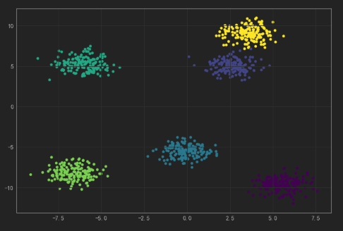

# 开端

```python
import numpy as np
import pandas as pd
import seaborn as sns
import matplotlib.pyplot as plt

from jupyterthemes import jtplot
jtplot.style()

%matplotlib inline

plt.style.use('ggplot')
plt.rcParams['font.sans-serif'] = 'SimHei'
plt.rcParams['axes.unicode_minus'] = False
```


```python
import warnings

warnings.filterwarnings('ignore')
```

> 示例

```python
from sklearn.datasets import load_breast_cancer
from sklearn.linear_model import LogisticRegression
from sklearn.model_selection import train_test_split

breast_cancer = load_breast_cancer()

x_train, x_test, y_train, y_test = train_test_split(breast_cancer.data,
                                                    breast_cancer.target,
                                                    test_size=0.3,
                                                    random_state=33)

lr = LogisticRegression()
lr.fit(x_train, np.ravel(y_train.astype("int")))

# y_pred = lr.predict(x_test)
lr.score(x_test, y_test)
```

> 输出


    0.9590643274853801


# datasets


```python
from sklearn import datasets
```


```python
dir(datasets)
```

> 输出


    ['__all__',
     '__builtins__',
     '__cached__',
     '__doc__',
     '__file__',
     '__loader__',
     '__name__',
     '__package__',
     '__path__',
     '__spec__',
     '_svmlight_format',
     'base',
     'california_housing',
     'clear_data_home',
     'covtype',
     'dump_svmlight_file',
     'fetch_20newsgroups',
     'fetch_20newsgroups_vectorized',
     'fetch_california_housing',
     'fetch_covtype',
     'fetch_kddcup99',
     'fetch_lfw_pairs',
     'fetch_lfw_people',
     'fetch_mldata',
     'fetch_olivetti_faces',
     'fetch_openml',
     'fetch_rcv1',
     'fetch_species_distributions',
     'get_data_home',
     'kddcup99',
     'lfw',
     'load_boston',
     'load_breast_cancer',
     'load_diabetes',
     'load_digits',
     'load_files',
     'load_iris',
     'load_linnerud',
     'load_mlcomp',
     'load_sample_image',
     'load_sample_images',
     'load_svmlight_file',
     'load_svmlight_files',
     'load_wine',
     'make_biclusters',
     'make_blobs',
     'make_checkerboard',
     'make_circles',
     'make_classification',
     'make_friedman1',
     'make_friedman2',
     'make_friedman3',
     'make_gaussian_quantiles',
     'make_hastie_10_2',
     'make_low_rank_matrix',
     'make_moons',
     'make_multilabel_classification',
     'make_regression',
     'make_s_curve',
     'make_sparse_coded_signal',
     'make_sparse_spd_matrix',
     'make_sparse_uncorrelated',
     'make_spd_matrix',
     'make_swiss_roll',
     'mlcomp',
     'mldata',
     'mldata_filename',
     'olivetti_faces',
     'openml',
     'rcv1',
     'samples_generator',
     'species_distributions',
     'svmlight_format',
     'twenty_newsgroups']


## load_digits

用于多分类任务的数据集


```python
from sklearn.datasets import load_digits

digits = load_digits()
digits.keys()
```

> 输出


    dict_keys(['data', 'target', 'target_names', 'images', 'DESCR'])


## fetch_20newsgroups


```python
from sklearn.datasets import fetch_20newsgroups

news = fetch_20newsgroups(subset='all')
news.keys()
```

> 输出


    dict_keys(['data', 'filenames', 'target_names', 'target', 'DESCR'])


## load_iris

三分类


```python
from sklearn.datasets import load_iris

iris = load_iris()
iris.keys()
```

> 输出


    dict_keys(['data', 'target', 'target_names', 'DESCR', 'feature_names', 'filename'])


```python
df = pd.DataFrame(data=iris["data"], columns=iris["feature_names"])
df.head()
```

> 输出

|      | sepal length (cm) | sepal width (cm) | petal length (cm) | petal width (cm) |
| :--: | :---------------: | :--------------: | :---------------: | :--------------: |
|  0   |        5.1        |       3.5        |        1.4        |       0.2        |
|  1   |        4.9        |        3         |        1.4        |       0.2        |
|  2   |        4.7        |       3.2        |        1.3        |       0.2        |
|  3   |        4.6        |       3.1        |        1.5        |       0.2        |
|  4   |         5         |       3.6        |        1.4        |       0.2        |


## load_boston

用于回归任务的数据集


```python
from sklearn.datasets import load_boston

# 从读取房价数据存储在变量boston中
boston = load_boston()
boston.keys()
```

> 输出


    dict_keys(['data', 'target', 'feature_names', 'DESCR', 'filename'])


## breast_cancer

两分类


```python
from sklearn.datasets import load_breast_cancer
breast_cancer = load_breast_cancer()
breast_cancer.keys()
```

> 输出


    dict_keys(['data', 'target', 'target_names', 'DESCR', 'feature_names', 'filename'])


```python
data = pd.DataFrame(breast_cancer.data, columns=breast_cancer.feature_names)
data["target"] = breast_cancer.target

data.head()
```

> 输出

|      | mean radius | mean texture | mean perimeter | mean area | mean smoothness | mean compactness | mean concavity | mean concave  points | mean symmetry | mean fractal  dimension | ...  | worst texture | worst perimeter | worst area | worst smoothness | worst compactness | worst concavity | worst concave  points | worst symmetry | worst fractal  dimension | target |
| ---- | :---------: | :----------: | :------------: | :-------: | :-------------: | :--------------: | :------------: | :------------------: | :-----------: | :---------------------: | ---- | :-----------: | :-------------: | :--------: | :--------------: | :---------------: | :-------------: | :-------------------: | :------------: | :----------------------: | :----: |
| 0    |     18      |     10.4     |      123       |   1001    |      0.12       |       0.28       |      0.3       |         0.15         |     0.24      |          0.08           | ...  |     17.3      |       185       |    2019    |       0.16       |       0.67        |      0.71       |         0.27          |      0.46      |           0.12           |   0    |
| 1    |    20.6     |     17.8     |      133       |   1326    |      0.08       |       0.08       |      0.09      |         0.07         |     0.18      |          0.06           | ...  |     23.4      |       159       |    1956    |       0.12       |       0.19        |      0.24       |         0.19          |      0.28      |           0.09           |   0    |
| 2    |    19.7     |     21.3     |      130       |   1203    |      0.11       |       0.16       |      0.2       |         0.13         |     0.21      |          0.06           | ...  |     25.5      |       153       |    1709    |       0.14       |       0.42        |      0.45       |         0.24          |      0.36      |           0.09           |   0    |
| 3    |    11.4     |     20.4     |      77.6      |    386    |      0.14       |       0.28       |      0.24      |         0.11         |     0.26      |           0.1           | ...  |     26.5      |      98.9       |    568     |       0.21       |       0.87        |      0.69       |         0.26          |      0.66      |           0.17           |   0    |
| 4    |    20.3     |     14.3     |      135       |   1297    |       0.1       |       0.13       |      0.2       |         0.1          |     0.18      |          0.06           | ...  |     16.7      |       152       |    1575    |       0.14       |       0.21        |       0.4       |         0.16          |      0.24      |           0.08           |   0    |


## load_diabetes

用于回归的数据集，值得注意的是，这10个特征中的每个特征都已经被处理成0均值，方差归一化的特征值


```python
from sklearn.datasets import load_diabetes

diabetes = load_diabetes()
diabetes.keys()
```

> 输出


    dict_keys(['data', 'target', 'DESCR', 'feature_names', 'data_filename', 'target_filename'])


```python
diabetes["data"]
```

> 输出


    array([[ 0.03807591,  0.05068012,  0.06169621, ..., -0.00259226,
             0.01990842, -0.01764613],
           [-0.00188202, -0.04464164, -0.05147406, ..., -0.03949338,
            -0.06832974, -0.09220405],
           [ 0.08529891,  0.05068012,  0.04445121, ..., -0.00259226,
             0.00286377, -0.02593034],
           ...,
           [ 0.04170844,  0.05068012, -0.01590626, ..., -0.01107952,
            -0.04687948,  0.01549073],
           [-0.04547248, -0.04464164,  0.03906215, ...,  0.02655962,
             0.04452837, -0.02593034],
           [-0.04547248, -0.04464164, -0.0730303 , ..., -0.03949338,
            -0.00421986,  0.00306441]])


## make_classification


```python
from sklearn.datasets import make_classification

x, y = make_classification(
    n_samples=1000,
    n_features=10,  # 特征个数= n_informative（） + n_redundant + n_repeated
    n_informative=3,  # 多信息特征的个数
    n_redundant=1,  # 冗余信息，informative特征的随机线性组合
    n_repeated=1,  # 重复信息，随机提取n_informative和n_redundant 特征
    n_classes=2,  # 分类类别
    n_clusters_per_class=2,  # 某一个类别是由几个cluster构成的
    class_sep=0.5,  # 乘以超立方体大小的因子。 较大的值分散了簇/类，并使分类任务更容易。默认为1
    random_state=1000,  # 如果是int，random_state是随机数发生器使用的种子
    shuffle=False)

x, y
```

> 输出


    (array([[ 0.28447735,  0.53816017,  0.70735867, ...,  0.16376714,
              0.01346066,  0.46802088],
            [-1.16785053,  0.31684181, -2.1510988 , ...,  1.1948815 ,
             -0.38839798, -2.22835975],
            [ 0.2586718 , -0.05258342, -1.08541484, ..., -0.60409713,
              0.12994845, -0.56098059]]),
     array([0, 0, 0, 0, 0,
            0, 0, 0, 0, 0, 0, 0,1, 1, 1, 1, 1, 1, 1, 1, 1, 1, 1, 1, 1,
            1, 1, 1, 1, 1, 1, 1, 
            1, 1, 1, 1, 1, 1, 1, 1, 1, 1, 1, 1, 1, 1, 1, 1, 0, 0, 0, 0, 0, 0,
            0, 0, 0, 0, 0, 0, 0, 0, 0, 0, 0, 1, 0, 0, 
            0, 0, 1, 1, 1, 1, 1, 1,  1, 1, 1, 1, 1, 1, 1, 1, 1, 1, 1, 1, 1, 0, 1, 1, 1, 1, 
            1, 1, 1, 1, 1, 1, 1, 1, 1, 1]))


## samples_generator

### make_blobs

- n_samples是待生成的样本的总数。
- n_features是每个样本的特征数。
- centers表示类别数。
- cluster_std表示每个类别的方差，例如我们希望生成2类数据，其中一类比另一类具有更大的方差，可以将cluster_std设置为[1.0,3.0]。


```python
from sklearn.datasets.samples_generator import make_blobs
import matplotlib.pyplot as plt
from jupyterthemes import jtplot
jtplot.style()

%matplotlib inline

data, label = make_blobs(n_samples=1000,
                         n_features=2,
                         centers=6,
                         random_state=10,
                         cluster_std=0.80)

plt.figure(figsize=(12, 8))
plt.scatter(data[:, 0], data[:, 1], c=label)
plt.show()
```

